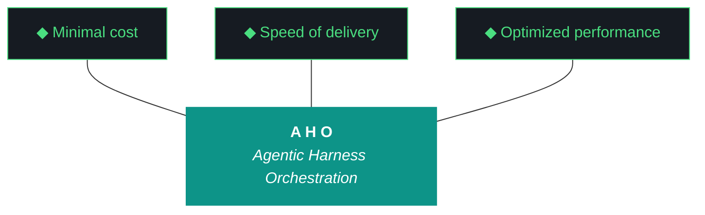

# aho

**Agentic Harness Orchestration — methodology and Python package for running disciplined LLM-driven engineering iterations without human supervision.**

aho treats the harness — pre-flight checks, post-flight gates, artifact templates, gotcha registry, evaluator — as the primary product, and the executing model (Claude, Gemini, Qwen) as the engine. The methodology provides a system for getting LLM agents to ship working software without supervision.

**Phase 0 (Clone-to-Deploy)** | **Iteration 0.2.14** | **Status: Council Wiring Verification**



### The Eleven Pillars of AHO

1. **Delegate everything delegable.** The paid orchestrator decides; the local free fleet executes.
2. **The harness is the contract.** Agent instructions live in versioned harness files, not model context.
3. **Everything is artifacts.** Every task is artifacts-in to artifacts-out.
4. **Wrappers are the tool surface.** Every tool is invoked through a `/bin` wrapper.
5. **Three octets, three meanings: phase, iteration, run.** Strategic, tactical, and execution scope.
6. **Transitions are durable.** State is written to a durable artifact before any transition.
7. **Generation and evaluation are separate roles.** Drafter and reviewer are different agents.
8. **Efficacy is measured in cost delta.** Wall clock, token cost, and delegate ratio are ground truth.
9. **The gotcha registry is the harness's memory.** Failure modes are indexed with mitigations.
10. **Runs are interrupt-disciplined.** No preference prompts mid-run; only capability gaps halt.
11. **The human holds the keys.** No agent writes to git or manages secrets.

---

## What aho Does

aho provides the complete infrastructure for running bounded, sequential LLM-driven engineering iterations:

- **Artifact Loop** — Design → Plan → Build Log → Report → Bundle. Qwen 3.5:9b generates artifacts via Ollama with word count enforcement and 3-retry escalation.
- **Pre-flight / Post-flight Gates** — Environment validation before launch, quality gates after execution. Bundle quality enforced via §1–§22 spec.
- **Pipeline Scaffolding** — 10-phase universal pipeline pattern reusable by consumer projects.
- **Human Feedback Loop** — Run report with Kyle's notes → seed JSON → next iteration's design context.
- **Secrets Architecture** — age encryption + OS keyring backend, session management.
- **Gotcha Registry** — Known failure modes with mitigations, queried at iteration start (Pillar 9).
- **Multi-Agent Orchestration** — Gemini CLI as primary executor, Qwen for artifacts, Nemotron for classification, GLM for vision.
- **`/ws` Streaming** — Telegram commands (`/ws status`, `/ws pause`, `/ws proceed`, `/ws last`) for real-time workstream monitoring and agent pause/proceed control from phone. Auto-push notifications on workstream completion.
- **Install Surface Architecture** — Three-persona model (pipeline builder, framework host, impromptu assistant). `aho-run` spec'd as the persona 3 entry point for pwd-scoped one-shot work against arbitrary files. Persona 3 discovery in 0.2.9 confirmed the gap exists; install-surface-architecture.md is the scope contract for 0.2.10–0.2.13 implementation.

---

## Canonical Folder Layout (0.1.13+)

```
aho/
├── src/aho/                    # Python package (src-layout)
├── bin/                        # CLI entry points and tool wrappers
├── artifacts/                  # Project-specific artifacts (from docs/, scripts/, etc.)
│   ├── harness/                # Universal and project-specific harnesses
│   ├── adrs/                   # Architecture Decision Records
│   ├── iterations/             # Per-iteration outputs (Design, Plan, Build Log)
│   ├── phase-charters/         # Phase objective contracts
│   ├── roadmap/                # Strategic planning
│   ├── scripts/                # Utility and instrumentation scripts
│   ├── templates/              # Scaffolding templates
│   ├── prompts/                # LLM generation templates
│   └── tests/                  # Verification suite
├── data/                       # Registries, event log, ChromaDB
├── app/                        # Consumer application mount point (Phase 1+)
└── pipeline/                   # Processing pipeline mount point (Phase 1+)
```

---

## Iteration Roadmap

| Iteration | Theme | Status |
|---|---|---|
| 1 (0.1.x) | Build the harness | graduated 2026-04-11 |
| 2 (0.2.x) | Ship to soc-foundry + P3 | active |
| 3 (0.3.x) | Alex demo + claw3d + polish | planned |
| Phase 1 | Multi-project, multi-machine | planned |

## Phase 0 Status

**Phase:** 0 — Clone-to-Deploy
**Charter:** artifacts/phase-charters/aho-phase-0.md

Phase 0 is complete when **soc-foundry/aho can be cloned on a second Arch Linux box (ThinkStation P3) and deploy LLMs, MCPs, and agents via the `/bin` wrapper package with zero manual Python edits.**

---

## Installation

```fish
cd ~/dev/projects/aho
pip install -e . --break-system-packages
aho doctor
```

**Requirements:** Python 3.11+, Ollama with qwen3.5:9b, fish shell (Linux).

---

## Iteration Narrative (0.2.12–0.2.14)

### 0.2.12 — Council Activation (gemini-cli primary)

20 workstreams. Gemini CLI took the executor lead for the first time. The iteration audited every declared council member (Qwen, GLM, Nemotron, OpenClaw, Nemoclaw, MCP fleet), built visibility infrastructure (`aho council status`, lego office visualization), and established the delegation/dispatch design. Five gotchas landed (G078–G083), including the foundational G083: exception handlers that return hardcoded positive values, masking real failures. 35 definitive G083 sites identified, 117 ambiguous. Council health measured at 35.3/100. Strategic rescope at W5 after substrate findings revealed that model output quality was the binding constraint — not dispatch architecture.

### 0.2.13 — Dispatch-Layer Repair (Pattern C trial)

First iteration under Pattern C: Claude Code drafts, Gemini CLI audits, Kyle signs. 11 workstreams planned, 4 delivered, 7 skipped per rescope.

W1 fixed the GLM parser — `GLMParseError` replaced the hardcoded `{score: 8, recommendation: ship}` fallback that had been lying about evaluation quality. W2 fixed the Nemotron classifier — `NemotronParseError` and `NemotronConnectionError` replaced blanket `except Exception` with specific error types. Both parsers now fail honestly instead of returning manufactured success.

W2.5 was the hard gate. With honest parsers in place, the models were tested: GLM-4.6V-Flash-9B at Q4_K_M timed out 80% of inputs at 180s and produced wrong-schema JSON the other 20%. Nemotron-mini:4b returned "feature" 80% of the time regardless of input. The parsers are honest. The models cannot produce usable signal through honest parsers. W3–W9 were skipped — fixing exception handlers around non-functional models was not a productive use of the iteration.

### Where we are

The council as a wired system has never been verified end-to-end. Two iterations of parser fixes and individual model invocations. Zero iterations of "Producer → Indexer → Auditor → Indexer → Assessor cascade actually runs." 9 of 17 council members claimed-operational, 6 unknown, 2 substrate-compromised. No agent-to-agent handoff in cascade architecture has ever been exercised.

### 0.2.14 — Council Wiring Verification (current)

0.2.14 verifies wiring. Every declared council member gets invoked (W1 vetting). The 5-stage cascade orchestrator gets built and run end-to-end against the NoSQL manual (201-page test document). Sign-off package presented to Kyle. No measurement of model quality, no architecture decisions, no matrix testing, no dashboard — those are 0.2.15+ after wiring is signed off.

---

## License

License to be determined before v0.6.0 release.

---

*aho v0.2.14 — aho.run — Phase 0 — April 2026*

*README last reviewed: 2026-04-13 by 0.2.14 W0*
