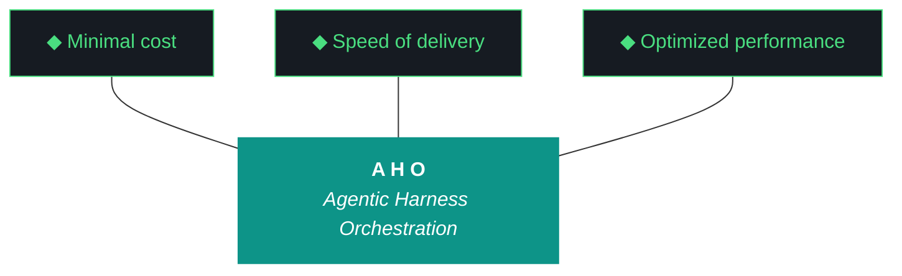

# aho

**Agentic Harness Orchestration.** Methodology and Python package for running disciplined LLM-driven engineering iterations without human supervision.

**Phase 0** · **Iteration 0.2.15** · **Status: Tier 1 Partial Install Validation**



aho treats the harness — pre-flight checks, post-flight gates, artifact templates, gotcha registry, evaluator — as the primary product. The executing model (Claude, Gemini, Qwen, Llama) is the engine. The harness ships working software without supervision.

---

## Quick start

```fish
git clone https://github.com/soc-foundry/aho
cd aho
./install.fish
aho doctor
```

Requires: Arch-family Linux, Python 3.11+, fish shell, Ollama, 8GB+ VRAM for Tier 1 council.

---

## Cascade

Five-stage pipeline. Each stage a distinct role. Handoffs validated.

```
Document → Indexer-in → Producer → Auditor → Indexer-out → Assessor → Output
                              │           │
                              ▼           ▼
                         deltas      delta-validations
                              │           │
                              └─► staging ◄┘
```

Producer drafts. Indexers propose deltas. Auditor validates. Assessor meta-assesses.
Cross-model role assignment enforces Pillar 7 (drafter ≠ reviewer).

---

## The Eleven Pillars of AHO

1. **Delegate everything delegable.** The paid orchestrator decides; the local free fleet executes.
2. **The harness is the contract.** Agent instructions live in versioned harness files, not model context.
3. **Everything is artifacts.** Every task is artifacts-in to artifacts-out.
4. **Wrappers are the tool surface.** Every tool is invoked through a `/bin` wrapper.
5. **Three octets, three meanings: phase, iteration, run.** Strategic, tactical, and execution scope.
6. **Transitions are durable.** State is written to a durable artifact before any transition.
7. **Generation and evaluation are separate roles.** Drafter and reviewer are different agents.
8. **Efficacy is measured in cost delta.** Wall clock, token cost, and delegate ratio are ground truth.
9. **The gotcha registry is the harness's memory.** Failure modes are indexed with mitigations.
10. **Runs are interrupt-disciplined.** No preference prompts mid-run; only capability gaps halt.
11. **The human holds the keys.** No agent writes to git or manages secrets.

---

## Capabilities

**Artifact loop.** Design → Plan → Build Log → Report → Bundle. Qwen 3.5:9b generates artifacts via Ollama with word-count enforcement and 3-retry escalation.

**Pre-flight / post-flight gates.** Environment validation before launch, quality gates after execution. Bundle completeness enforced.

**Cascade orchestrator.** 5-stage pipeline (`src/aho/pipeline/`) with trace events, per-stage artifacts, cross-stage delta propagation. Dispatcher supports Ollama `/api/chat` with model-family stop tokens and `num_ctx` up to 32K on 8GB VRAM.

**Pattern C execution.** Claude Code drafts, Gemini CLI audits, human signs. State machine: `in_progress → pending_audit → audit_complete → workstream_complete`. Audit archives are versioned, overwrites forbidden.

**Gotcha registry.** 83+ indexed failure modes with mitigations, queried at iteration start.

**Secrets architecture.** age encryption + OS keyring + fernet bulk storage. No keys, passphrases, or secret material in the repo.

**Multi-agent orchestration.** Qwen for general work, Llama 3.2 for triage, GLM and Nemotron re-test in 0.2.15, OpenClaw as file-bridge wrapper, Nemoclaw as dispatcher.

**Telegram `/ws` streaming.** `/ws status`, `/ws pause`, `/ws proceed`, `/ws last`. Auto-push on workstream completion.

**Install surface.** Three-persona model (pipeline builder, framework host, impromptu assistant). `aho run "task"` for persona 3 pwd-scoped work.

**Observability.** otelcol-contrib + Jaeger as systemd user services. Spans in dispatcher, openclaw, nemoclaw, telegram.

---

## Folder layout

```
aho/
├── src/aho/                    # Python package (src-layout)
│   └── pipeline/               # Cascade: schemas, dispatcher, orchestrator
├── bin/                        # CLI entry points and tool wrappers
├── artifacts/
│   ├── harness/                # Pillars, ADRs, Pattern C protocol
│   ├── adrs/                   # Architecture Decision Records
│   ├── iterations/             # Per-iteration design, plan, build, report, bundle
│   ├── phase-charters/         # Phase objective contracts
│   ├── roadmap/                # Strategic planning
│   ├── scripts/                # Utility and instrumentation
│   ├── templates/              # Scaffolding
│   ├── prompts/                # LLM generation templates
│   └── tests/                  # Verification suite
├── data/                       # Registries, event log, ChromaDB
├── app/                        # Consumer application mount (Phase 1+)
└── pipeline/                   # Processing pipeline mount (Phase 1+)
```

Canonical since 0.1.13. Path-agnostic via `iao_paths.find_project_root()` and `.aho.json` sentinel.

---

## State machine

Every workstream flows through four states. Claude emits three events. Gemini emits one. Checkpoint advances only after audit archive exists with pass or pass-with-findings.

```
  in_progress   ──►   pending_audit   ──►   audit_complete   ──►   workstream_complete
  (Claude)           (Claude done)        (Gemini done)           (Claude emits)
```

No agent emits `workstream_complete` before `audit_complete` exists. Audit archive overwrites forbidden; re-audits create versioned files.

---

## Roadmap

| Iteration | Theme | Status |
|---|---|---|
| 1 (0.1.x) | Build the harness | graduated 2026-04-11 |
| 2 (0.2.x) | Ship to soc-foundry + P3 | active (0.2.15) |
| 3 (0.3.x) | Alex demo + polish | planned |
| Phase 1 | Multi-project, multi-machine | planned |

**Phase 0 charter:** `artifacts/phase-charters/aho-phase-0.md`

Phase 0 is complete when soc-foundry/aho can be cloned on a second Arch Linux box (ThinkStation P3) and deploy LLMs, MCPs, and agents via the `/bin` wrapper package with zero manual Python edits.

---

## Recent iterations

**0.2.15 — Tier 1 Partial Install Validation (in progress).** Wire and ship Tier 1 install package. 4 chat LLMs (Qwen, Llama 3.2, GLM, Nemotron) validated through Ollama on fixed dispatcher. Fair re-test of GLM and Nemotron after 0.2.13 W2.5 compromise findings measured on broken substrate. Ollama Tier 1 capability audit, dispatcher hardening, Nemoclaw decision ADR, cross-model cascade integration test. 5 workstreams.

**0.2.14 — Council Wiring Verification.** 4 workstreams delivered (W0 setup, W1 vet+wire+smoke, W1.5 substrate repair, W2 close). W1 smoke test surfaced two dispatcher bugs: `num_ctx` default 4096 truncating input to ~4K tokens, and `/api/generate` without stop tokens causing chat template leakage. W1.5 repaired the dispatcher (`/api/chat`, `num_ctx=32768`, stop tokens). Run-2 smoke test produced 14,725 chars of substantive cross-stage output vs run-1's 6,901 chars of template-leaked garbage. Council validated as real-but-thin: cascade mechanics work, Pillar 7 violation persists (Qwen-solo), auditor role-prompt bifurcation identified.

**0.2.13 — Dispatch-Layer Repair.** First Pattern C iteration. W1 fixed GLM parser (`GLMParseError` replaces hardcoded `{score:8, ship}` fallback). W2 fixed Nemotron classifier (specific error types replace blanket `except Exception`). W2.5 hard gate: honest parsers exposed that GLM timed out 80% of inputs, Nemotron returned "feature" 80% regardless of content. Rescoped W3-W9. 4 workstreams delivered.

**0.2.12 — Council Activation.** 20 workstreams. Gemini CLI primary executor. Council inventory audit. Five gotchas landed (G078-G083) including foundational G083: exception handlers returning hardcoded positive values, masking real failures. Council health measured at 35.3/100. Strategic rescope at W5.

See [CHANGELOG.md](CHANGELOG.md) for full history back to 0.1.0-alpha.

---

## Core concepts

**Harness.** The versioned set of files that constrain agent behavior. Pillars, ADRs, Pattern C protocol, gotcha registry, prompt conventions, test baseline. Changes at phase or iteration boundaries.

**Cascade.** Five role-bound stages that produce and validate analytical artifacts. Handoffs are traced events. Deltas proposed by Indexers validated by Auditor and Assessor.

**Pattern C.** Execution model where a cloud orchestrator drafts, a second cloud orchestrator audits, and a human signs. Separates generation from evaluation at the orchestrator boundary. Introduced in 0.2.13.

**Council.** The set of local LLMs available to the harness. Members have distinct roles. Pillar 7 requires drafter ≠ reviewer; council composition enables this.

**Gotcha registry.** Structured record of failure modes with mitigations. A mature harness has more gotchas than an immature one — gotcha count is the compound-interest metric.

**Three personas.** Persona 1 (pipeline builder) runs full iterations against known projects. Persona 2 (framework host) imports aho into another repo. Persona 3 (impromptu assistant) runs pwd-scoped one-shot work via `aho run`.

---

## Installation

```fish
# 1. Clone
git clone https://github.com/soc-foundry/aho ~/dev/projects/aho
cd ~/dev/projects/aho

# 2. Install (idempotent; 9-step orchestrator)
./install.fish

# 3. Verify
aho doctor
aho doctor --deep    # includes Flutter and dart checks
aho components check # per-kind presence verification
```

**Requirements:**

- Arch Linux family (CachyOS tested)
- Python 3.11+ (`pip install -e . --break-system-packages`)
- fish shell (primary)
- Ollama (installed via upstream script, not pacman)
- 8GB+ VRAM for Tier 1 council (Qwen 3.5:9B + Llama 3.2:3B + GLM + Nemotron)
- systemd user services (linger enabled)
- Telegram bot token (optional, for `/ws` streaming)
- Brave Search API token (optional, for search tools)

**Tier 1 install** pulls four chat LLMs and one embedding model. Tier 2 and Tier 3 (Gemma 2, DeepSeek-Coder-V2, Mistral-Nemo) land with 16GB+ machines; see 0.2.15 carry-forwards.

---

## Configuration

**Orchestrator config** at `~/.config/aho/orchestrator.json`: engine, search provider, openclaw/nemoclaw model defaults.

**MCP servers** wired via per-project `.mcp.json` generated from template at bootstrap. 9 MCP servers smoke-tested via `bin/aho-mcp smoke`.

**Secrets** via `bin/aho-secrets-init`. age keygen per-machine, fernet-encrypted storage, OS keyring caches passphrase.

**Per-machine systemd user services:** openclaw, nemoclaw, telegram, harness-watcher, otel-collector, jaeger, dashboard.

---

## Related work

**[karpathy/llm-council](https://github.com/karpathy/llm-council).** Conceptual reference for multi-LLM cross-review pattern. Three-stage architecture (first opinions → review → chairman) differs from aho's five-stage role-bound cascade. OpenRouter cloud APIs vs aho's local Ollama inference. Karpathy's description: "99% vibe coded as a fun Saturday hack." Value is conceptual, not implementation.

**[ruvnet/ruflo](https://github.com/ruvnet/ruflo).** Claude Code orchestration platform with swarm coordination, WASM policy engine, plugin system. Much larger scope than aho; different architectural premises (swarm-per-task vs role-bound cascade, dynamic agent spawning vs fixed council composition). Structural reference for OSS project organization.

aho's focus is narrower than either: harness-governed iterations with durable state transitions, honest substrate measurement, and supervised-free software delivery. Local-first, 8-24GB VRAM tier, Arch Linux family, fish shell.

---

## Status

**Phase 0 active.** Second-machine clone target: ThinkStation P3 (tsP3-cos). Third-machine (A8cos) reframed as orchestration/daily-driver after integrated GPU constraint. Luke's machine (24GB) is candidate Tier 3 clone for 0.2.17.

**Council:** Qwen 3.5:9B operational. Llama 3.2:3B integration in 0.2.15 W0. GLM-4.6V-Flash-9B and Nemotron-mini:4b substrate-compromise re-test in 0.2.15 W0. Gemma 2, DeepSeek-Coder-V2, Mistral-Nemo planned for 16GB+ machines.

**Testing:** 302 passing, 12-13 known baseline failures (daemon-dependent), 0 new regressions across recent iterations.

**Gotcha registry:** 83+ entries.

---

## License

License to be determined before v0.6.0 release.

---

*aho v0.2.15 · aho.run · Phase 0 · April 2026*

*README last reviewed: 2026-04-13 by 0.2.15 W0 work session*
