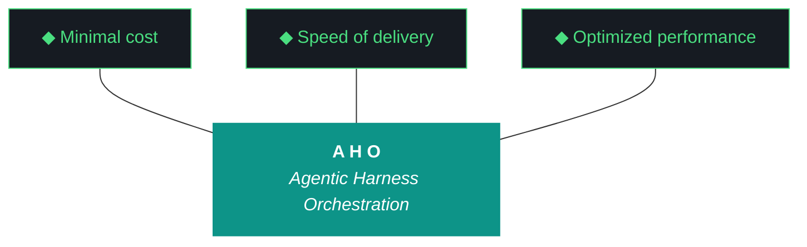

# aho

**Agentic Harness Orchestration — methodology and Python package for running disciplined LLM-driven engineering iterations without human supervision.**

aho treats the harness — pre-flight checks, post-flight gates, artifact templates, gotcha registry, evaluator — as the primary product, and the executing model (Claude, Gemini, Qwen) as the engine. The methodology provides a system for getting LLM agents to ship working software without supervision.

**Phase 0 (Clone-to-Deploy)** | **Iteration 0.2.2** | **Status: Global Deployment + Full Telemetry**



### The Eleven Pillars of AHO

1. **Delegate everything delegable.** The paid orchestrator decides; the local free fleet executes.
2. **The harness is the contract.** Agent instructions live in versioned harness files, not model context.
3. **Everything is artifacts.** Every task is artifacts-in to artifacts-out.
4. **Wrappers are the tool surface.** Every tool is invoked through a `/bin` wrapper.
5. **Three octets, three meanings: phase, iteration, run.** Strategic, tactical, and execution scope.
6. **Transitions are durable.** State is written to a durable artifact before any transition.
7. **Generation and evaluation are separate roles.** Drafter and reviewer are different agents.
8. **Efficacy is measured in cost delta.** Wall clock, token cost, and delegate ratio are ground truth.
9. **The gotcha registry is the harness's memory.** Failure modes are indexed with mitigations.
10. **Runs are interrupt-disciplined.** No preference prompts mid-run; only capability gaps halt.
11. **The human holds the keys.** No agent writes to git or manages secrets.

---

## What aho Does

aho provides the complete infrastructure for running bounded, sequential LLM-driven engineering iterations:

- **Artifact Loop** — Design → Plan → Build Log → Report → Bundle. Qwen 3.5:9b generates artifacts via Ollama with word count enforcement and 3-retry escalation.
- **Pre-flight / Post-flight Gates** — Environment validation before launch, quality gates after execution. Bundle quality enforced via §1–§22 spec.
- **Pipeline Scaffolding** — 10-phase universal pipeline pattern reusable by consumer projects.
- **Human Feedback Loop** — Run report with Kyle's notes → seed JSON → next iteration's design context.
- **Secrets Architecture** — age encryption + OS keyring backend, session management.
- **Gotcha Registry** — Known failure modes with mitigations, queried at iteration start (Pillar 9).
- **Multi-Agent Orchestration** — Gemini CLI as primary executor, Qwen for artifacts, Nemotron for classification, GLM for vision.

---

## Canonical Folder Layout (0.1.13+)

```
aho/
├── src/aho/                    # Python package (src-layout)
├── bin/                        # CLI entry points and tool wrappers
├── artifacts/                  # Project-specific artifacts (from docs/, scripts/, etc.)
│   ├── harness/                # Universal and project-specific harnesses
│   ├── adrs/                   # Architecture Decision Records
│   ├── iterations/             # Per-iteration outputs (Design, Plan, Build Log)
│   ├── phase-charters/         # Phase objective contracts
│   ├── roadmap/                # Strategic planning
│   ├── scripts/                # Utility and instrumentation scripts
│   ├── templates/              # Scaffolding templates
│   ├── prompts/                # LLM generation templates
│   └── tests/                  # Verification suite
├── data/                       # Registries, event log, ChromaDB
├── app/                        # Consumer application mount point (Phase 1+)
└── pipeline/                   # Processing pipeline mount point (Phase 1+)
```

---

## Iteration Roadmap

| Iteration | Theme | Status |
|---|---|---|
| 1 (0.1.x) | Build the harness | graduated 2026-04-11 |
| 2 (0.2.x) | Ship to soc-foundry + P3 | active |
| 3 (0.3.x) | Alex demo + claw3d + polish | planned |
| Phase 1 | Multi-project, multi-machine | planned |

## Phase 0 Status

**Phase:** 0 — Clone-to-Deploy
**Charter:** artifacts/phase-charters/aho-phase-0.md

Phase 0 is complete when **soc-foundry/aho can be cloned on a second Arch Linux box (ThinkStation P3) and deploy LLMs, MCPs, and agents via the `/bin` wrapper package with zero manual Python edits.**

---

## Installation

```fish
cd ~/dev/projects/aho
pip install -e . --break-system-packages
aho doctor
```

**Requirements:** Python 3.11+, Ollama with qwen3.5:9b, fish shell (Linux).

---

## License

License to be determined before v0.6.0 release.

---

*aho v0.2.2 — aho.run — Phase 0 — April 2026*
