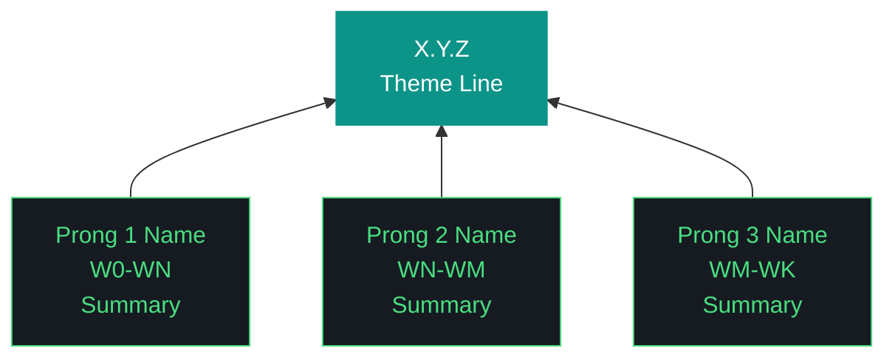

# aho Design — X.Y.Z

**Phase:** N | **Iteration:** Y | **Run:** Z
**Theme:** <one-line theme>
**Iteration type:** <type per ADR-045>
**Executor:** <executor>
**Execution mode:** <mode>
**Scope:** <N> workstreams

---

## §1 Context

<prior iteration summary, what changed, what carries forward>

## §2 Goals

1. <goal 1>
2. <goal 2>

## §3 Trident

The Trident diagram is REQUIRED in every design doc. It uses Mermaid
`graph BT` (bottom-to-top) with exactly two classDefs:

- **shaft**: fill #0D9488 (teal), white text — represents the iteration
- **prong**: fill #161B22 (dark), stroke #4ADE80 (green) — represents workstream groups

Minimum 2 prongs, maximum 4. Each prong connects to the shaft via `-->`.

## §4 Non-goals

- <explicit exclusion 1>

## §5 Pillars

<numbered pillar list — 10 or 11 depending on iteration scope>

## §6 Workstream Summary

| WS | Surface | Session | Session Role |
|---|---|---|---|
| W0 | ... | 1 | Setup |

## §7 Execution Contract

- <per-workstream review mode>
- <session boundaries>
- <halt-on-fail policy>

## §8 Open Questions for W0

<resolved or unresolved pre-iteration questions>

## §9 Risks

1. <risk + mitigation>

## §10 Success Criteria

- <measurable criterion 1>
