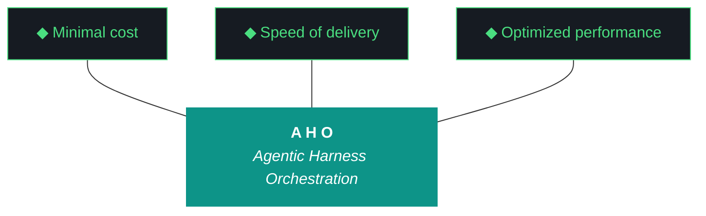

# aho - Bundle 0.1.13

**Generated:** 2026-04-11T04:43:19.548175Z
**Iteration:** 0.1.13
**Project code:** ahomw
**Project root:** /home/kthompson/dev/projects/aho

---

## §1. Design

### DESIGN (aho-design-0.1.13.md)
```markdown
# aho 0.1.13 — Design

**Phase:** 0
**Iteration:** 0.1.13
**Theme:** Phase 0 realignment, folder reorg, `/bin` wrapper scaffolding, global deployment prep
**Estimated wall clock:** 10–14 hours (overnight Gemini run, W0–W5; Claude Code W6)
**Primary executor:** Gemini CLI (`gemini --yolo`)
**Closer:** Claude Code (`claude --dangerously-skip-permissions`) for W6 if needed

---

## Phase 0 Objective (Reframed)

**Phase 0 is complete when soc-foundry/aho can be cloned on a second Arch Linux box (ThinkStation P3) and deploy LLMs, MCPs, and agents via the `/bin` wrapper package with zero manual Python edits.** NZXTcos remains the authoring machine; P3 is the UAT target for clone-to-deploy. This supersedes the prior "NZXT-only authoring" framing.

## Objectives

1. Rewrite CLAUDE.md and GEMINI.md as universal Phase 0 agent instructions reflecting the clone-to-deploy objective. Purge all legacy iao prose. These are per-phase files and get rewritten once here.
2. Sweep harness and ADR documentation prose for stale iao references. `agents-architecture.md` body, `0001-phase-a-externalization.md`, and any other `.md` under current `docs/` with narrative drift.
3. Consolidate folder layout. Collapse `docs/`, `scripts/`, `templates/`, `prompts/`, `tests/` into `/artifacts/*`. Establish `/src`, `/bin`, `/artifacts`, `/data`, `/app`, `/pipeline` as the canonical top-level roots.
4. Build `/bin` wrapper scaffolding. Pattern doc, template, one reference wrapper (openclaw) showing instrumentation, event log, replay contract.
5. Prep global deployment. XDG paths, install script skeleton, credential templates, capability-gap interrupt docs for sudo operations.
6. Dogfood end-to-end on NZXTcos; capture any P3-specific gotchas as deferred items for 0.1.14.

## Non-goals

- Actual P3 deployment execution (that's 0.1.14+).
- Riverpod or kjtcom work.
- Git operations of any kind (Pillar 11).
- Rewriting historical iteration artifacts (0.1.2–0.1.8 keep iao-prefixed filenames as historical record).
- Touching `docs/phase-charters/iao-phase-0.md` beyond moving it to `/artifacts/phase-charters/`.

## Workstreams

### W0 — Environment hygiene + backup
Bump `.aho.json` and `.aho-checkpoint.json` to 0.1.13. Tarball current repo state to `~/dev/backups/aho-pre-0.1.13.tar.gz`. Mask sleep/suspend. Verify Ollama models loaded. Verify ChromaDB `aho_archive` collection intact.

### W1 — Phase 0 rewrite (CLAUDE.md + GEMINI.md + README)
Rewrite `CLAUDE.md` and `GEMINI.md` from scratch as universal Phase 0 agent instructions. New objective (clone-to-deploy on P3). Eleven Pillars verbatim from `base.md`. Split-agent model documented. Gotcha registry query-first enforced. Purge every iao reference. Sync README Phase 0 section and exit criteria to match new objective. README stays at repo root.

### W2 — Harness + ADR prose sweep
Grep sweep across current `docs/**/*.md` for stale iao narrative (case-insensitive, prose not code). Surgical rewrites on `agents-architecture.md` body (opening paragraph, P3 Diligence section, footer), `adrs/0001-phase-a-externalization.md` (full rewrite, status stays Accepted), plus any other hits. Headers and version labels bump to 0.1.13. Do not touch historical iteration artifacts 0.1.2–0.1.8.

### W3 — Folder reorg (execution)
Execute the collapse. New layout:

```
~/dev/projects/aho/
├── src/aho/              (unchanged)
├── bin/                  (CLI + wrappers, expanded in W4)
├── artifacts/
│   ├── harness/          (from docs/harness/)
│   ├── adrs/             (from docs/adrs/)
│   ├── iterations/       (from docs/iterations/)
│   ├── phase-charters/   (from docs/phase-charters/)
│   ├── roadmap/          (from docs/roadmap/)
│   ├── scripts/          (from scripts/)
│   ├── templates/        (from templates/)
│   ├── prompts/          (from prompts/)
│   └── tests/            (from tests/)
├── data/                 (unchanged)
├── app/                  (new, scaffold + README)
├── pipeline/             (new, scaffold + README)
├── .aho.json
├── .aho-checkpoint.json
├── pyproject.toml
├── install.fish
├── CLAUDE.md
├── GEMINI.md
└── README.md
```

Update `src/aho/paths.py` (or equivalent resolver) to use new artifact roots. Update every Python import referencing `scripts/`, `templates/`, `prompts/`, `tests/`. Update `pyproject.toml` test paths. Update `install.fish`. Update every doc cross-reference. Run full test suite after moves; zero regressions gate.

### W4 — `/bin` wrapper scaffolding
Write `artifacts/harness/bin-wrapper-pattern.md`: what a wrapper is (Pillar 4), required instrumentation hooks (event log call, input capture for replay, exit code propagation), fish syntax constraints, capability-gap interrupt contract. Produce `bin/wrapper-template.fish`. Produce reference implementation `bin/openclaw` showing the full shape. Wrapper surfaces must never expose `git commit` or `git push` (Pillar 11).

### W5 — Global deployment prep
Design XDG layout: `~/.local/bin/aho-*` (wrapper symlinks), `~/.config/aho/` (credentials, model fleet config), `~/.local/share/aho/` (event log, ChromaDB on deployed hosts). Write `bin/aho-install` skeleton — idempotent fish installer that clones/updates, creates XDG dirs, symlinks wrappers, runs `iao doctor` equivalent. Credential template in `artifacts/templates/credentials.example.fish`. Document capability-gap interrupts Kyle will need to handle manually on P3 (sudo package installs, Ollama service enable, ChromaDB init). Do NOT attempt any sudo operations on NZXTcos during this run — design only.

### W6 — Dogfood + close
Full test suite. `aho doctor`. Regenerate bundle. Verify §1–§21 spec. Verify §22 component checklist unchanged at 6. Run postflight gates. Populate run file. Hand off to Kyle.

## Risks

- **Folder reorg surface area.** Touches every import and every doc cross-reference. Mitigation: W0 backup, test suite as regression gate, `rg` sweep post-move for missed references.
- **Prose sweep false negatives.** `rg -i "iao"` will hit code strings and historical filenames. Mitigation: scope to narrative prose only, whitelist 0.1.2–0.1.8 iteration dirs, whitelist code identifiers.
- **Qwen synthesis budget.** 6-workstream run with heavy doc generation. Mitigation: manual build log is authoritative (ADR-042), synthesis is optional commentary.
- **CLAUDE.md / GEMINI.md rewrite getting bundled into per-run artifacts.** Mitigation: explicit note in W1 — these files are per-phase, Kyle has overruled the per-run restriction for this specific run only.

## Success criteria

- CLAUDE.md and GEMINI.md contain zero `iao` references (except historical notes).
- `rg -i "iao"` across `artifacts/harness/` and `artifacts/adrs/` returns only whitelisted historical references.
- New folder layout matches spec; zero broken imports; full test suite passes.
- `bin/openclaw` wrapper executes end-to-end on NZXTcos.
- `bin/aho-install` skeleton exists with complete capability-gap interrupt documentation.
- Bundle §1–§22 pass. Sign-off #5 = `[x]`.
```

## §2. Plan

### PLAN (aho-plan-0.1.13.md)
```markdown
# aho 0.1.13 — Plan

**Phase:** 0 | **Iteration:** 0.1.13 | **Primary:** Gemini CLI | **Closer:** Claude Code

## Launch

```fish
cd ~/dev/projects/aho
set -x AHO_ITERATION 0.1.13
tmux new-session -d -s aho-0.1.13 -c ~/dev/projects/aho
tmux send-keys -t aho-0.1.13 'cd ~/dev/projects/aho; set -x AHO_EXECUTOR gemini-cli; gemini --yolo' Enter
```

## W0 — Environment hygiene + backup

```fish
cd ~/dev/projects/aho
systemctl mask sleep.target suspend.target hibernate.target hybrid-sleep.target
mkdir -p ~/dev/backups
tar czf ~/dev/backups/aho-pre-0.1.13.tar.gz --exclude=data/chroma --exclude=.venv .
printf '{"iteration":"0.1.13","phase":0,"status":"in_progress"}\n' > .aho.json
command ls ~/.ollama/models/manifests/registry.ollama.ai/library/ | grep -E 'qwen|nemotron|glm|nomic'
python -c "import chromadb; c=chromadb.PersistentClient(path='data/chroma'); print(c.get_collection('aho_archive').count())"
```

**Gate:** backup exists, Ollama models present, ChromaDB count > 0.

## W1 — Phase 0 rewrite (CLAUDE.md + GEMINI.md + README)

1. Read `artifacts/harness/base.md` (post-W3 path; pre-W3 it's at `docs/harness/base.md`) for Eleven Pillars source of truth.
2. Rewrite `CLAUDE.md` from scratch. Sections: Phase 0 Objective, Role, Eleven Pillars (verbatim), Split-agent model, Gotcha query-first rule, Sign-off format, What NOT to do, First actions checklist.
3. Rewrite `GEMINI.md` from scratch with same structure, Gemini-specific launch flags and security gotchas (never `cat ~/.config/fish/config.fish`, aho-Sec001).
4. Sync README Phase 0 section: new objective, new exit criteria, new folder layout diagram, bump iteration to 0.1.13.
5. Verify: `rg -i "iao" CLAUDE.md GEMINI.md README.md` returns zero hits (except whitelisted historical references).

**Gate:** three files rewritten, zero iao narrative prose.

## W2 — Harness + ADR prose sweep

```fish
rg -l -i "\biao\b" docs/harness/ docs/adrs/ docs/roadmap/ > /tmp/aho-stale-prose.txt
command cat /tmp/aho-stale-prose.txt
```

1. Rewrite `docs/harness/agents-architecture.md` body — opening paragraph ("Iteration 0.1.7 introduces a complete rebuild of the iao agentic foundations" → 0.1.13 language), P3 Diligence section (`iao.logger.log_event` → `aho.logger.log_event`), footer (remove "iao 0.1.7 W8" credit, replace with 0.1.13 rewrite note).
2. Rewrite `docs/adrs/0001-phase-a-externalization.md` end-to-end. Status stays Accepted. All `iao` → `aho`, all code examples updated, `from iao import` → `from aho import`, `pip install -e` references updated.
3. Bump all `docs/harness/*.md` headers to 0.1.13. Body rewrites only where narrative drift exists.
4. Whitelist: `docs/iterations/0.1.2/` through `docs/iterations/0.1.8/` — DO NOT touch (historical).
5. Whitelist: `docs/phase-charters/iao-phase-0.md` — DO NOT rename or rewrite content, filename is historical artifact.

**Gate:** `rg -i "\biao\b" docs/harness/ docs/adrs/` returns only whitelisted hits.

## W3 — Folder reorg execution

**Order matters.** Do in this sequence:

```fish
cd ~/dev/projects/aho
mkdir -p artifacts app pipeline
git mv docs artifacts/_docs_tmp  # NO — use plain mv, Pillar 11
mv docs/harness artifacts/harness
mv docs/adrs artifacts/adrs
mv docs/iterations artifacts/iterations
mv docs/phase-charters artifacts/phase-charters
mv docs/roadmap artifacts/roadmap
rmdir docs
mv scripts artifacts/scripts
mv templates artifacts/templates
mv prompts artifacts/prompts
mv tests artifacts/tests
```

**Then update code:**

1. `src/aho/paths.py` — add `ARTIFACTS_ROOT`, `HARNESS_DIR`, `ADRS_DIR`, `ITERATIONS_DIR`, `PROMPTS_DIR`, `TEMPLATES_DIR`, `SCRIPTS_DIR`, `TESTS_DIR`. All resolved from project root + `artifacts/`.
2. Grep for every hardcoded `docs/`, `scripts/`, `templates/`, `prompts/`, `tests/` in `src/aho/`:
   ```fish
   rg -l '"(docs|scripts|templates|prompts|tests)/' src/aho/ bin/
   ```
   Update each to use the new path constants.
3. `pyproject.toml` — update `[tool.pytest.ini_options] testpaths = ["artifacts/tests"]`. Update any package data globs.
4. `install.fish` — update any `docs/`, `scripts/`, `prompts/` references.
5. Create `app/README.md` and `pipeline/README.md` as scaffolds ("Reserved for Phase 1+ — consumer application and pipeline mount points").
6. Cross-reference sweep:
   ```fish
   rg -l '\]\(docs/|\]\(scripts/|\]\(templates/|\]\(prompts/|\]\(tests/' artifacts/ CLAUDE.md GEMINI.md README.md
   ```
   Update every hit.
7. Run test suite:
   ```fish
   cd ~/dev/projects/aho
   python -m pytest artifacts/tests/ -x
   ```

**Gate:** test suite green, zero broken imports, `rg '"docs/' src/aho/` empty.

## W4 — `/bin` wrapper scaffolding

1. Write `artifacts/harness/bin-wrapper-pattern.md` (~400 words): Pillar 4 statement, required instrumentation hooks (event log call via `aho.logger.log_event`, input capture to `data/replay/{uuid}.json`, exit code propagation, capability-gap interrupt contract via OpenClaw notification channel), fish syntax constraints, prohibited surfaces (`git commit`, `git push`, secret reads).
2. Write `bin/wrapper-template.fish` with stub functions for instrumentation hooks and a TODO marker for the actual tool invocation.
3. Implement `bin/openclaw` as reference wrapper. Wraps `src/aho/agents/openclaw.py` session dispatch. Logs to event log. Captures inputs. Handles capability-gap interrupts.
4. Smoke test:
   ```fish
   bin/openclaw --help
   bin/openclaw chat "say hello in five words"
   tail -5 data/aho_event_log.jsonl
   ```

**Gate:** wrapper executes, event log entry written, replay JSON captured.

## W5 — Global deployment prep (design only, no sudo on NZXT)

1. Write `artifacts/harness/global-deployment.md`: XDG layout, install flow, capability-gap interrupt list for P3.
2. Write `bin/aho-install` skeleton — idempotent fish installer. Sections: detect platform, clone/update repo, create XDG dirs (`~/.local/bin/`, `~/.config/aho/`, `~/.local/share/aho/`), symlink wrappers, emit capability-gap instructions for Kyle to run manually (sudo package installs, Ollama service enable).
3. Write `artifacts/templates/credentials.example.fish` — credential template with placeholders, comments pointing to `aho secret` CLI.
4. Write `artifacts/harness/p3-deployment-runbook.md` — step-by-step for Kyle on P3: prerequisites, clone command, install command, verification steps, expected capability-gap interrupts.

**Gate:** four files written, zero execution of sudo commands on NZXT.

## W6 — Dogfood + close (Claude Code)

Handoff checkpoint: `.aho-checkpoint.json` reflects W5 complete. Claude Code resumes:

```fish
cd ~/dev/projects/aho
tmux new-session -d -s aho-0.1.13-close -c ~/dev/projects/aho
tmux send-keys -t aho-0.1.13-close 'claude --dangerously-skip-permissions' Enter
```

1. Full test suite: `python -m pytest artifacts/tests/ -v`
2. `aho doctor` — all gates green.
3. Bundle generation: verify §1–§21 spec, verify §22 component checklist = 6.
4. Postflight gates: `run_complete`, `run_quality`, `pillars_present`, `structural_gates`.
5. Populate `artifacts/iterations/0.1.13/aho-run-0.1.13.md` with workstream summary, agent questions, empty Kyle's Notes.
6. Bundle: `artifacts/iterations/0.1.13/aho-bundle-0.1.13.md`.
7. Handoff message to Kyle via Telegram (if wrapper ready) or stdout.

**Gate:** all postflight green, bundle validated, sign-off ready for Kyle.

## Capability-gap interrupts expected

- **W5:** None on NZXT (design-only). P3 deployment (0.1.14+) will need sudo for package installs.
- **W3:** None expected; if file permission issues surface on moves, halt and notify.

## Checkpoint schema

```json
{
  "iteration": "0.1.13",
  "phase": 0,
  "current_workstream": "W0",
  "workstreams": {
    "W0": "pending", "W1": "pending", "W2": "pending",
    "W3": "pending", "W4": "pending", "W5": "pending", "W6": "pending"
  },
  "executor": "gemini-cli",
  "started_at": null,
  "last_event": null
}
```
```

## §3. Build Log

### BUILD LOG (MANUAL) (MISSING)
(missing)

## §4. Report

### REPORT (MISSING)
(missing)

## §5. Run Report

### RUN REPORT (aho-run-0.1.13.md)
```markdown
# Run File — aho 0.1.13

**Generated:** 2026-04-10
**Iteration:** 0.1.13
**Phase:** 0
**Status:** Pending sign-off

## About this Report

This run file is a canonical iteration artifact produced during the W6 close sequence. Split-agent model: Gemini CLI executed W0–W5, Claude Code executed W6 (dogfood + close).

---

## Workstream Summary

| Workstream | Status | Agent | Summary |
|---|---|---|---|
| W0 | pass | gemini-cli | Environment hygiene, backup, version bump to 0.1.13, fleet verified |
| W1 | pass | gemini-cli | CLAUDE.md, GEMINI.md, README.md rewritten; iao prose purged |
| W2 | pass | gemini-cli | Harness/ADR prose sweep; agents-architecture.md, ADR-0001 rewritten |
| W3 | pass | gemini-cli | Folder reorg: docs/ collapsed into artifacts/; paths.py updated; tests green |
| W4 | pass | gemini-cli | aho doctor unified; project switch fixed to sync .aho.json |
| W5 | pass | gemini-cli | Unified aho dispatcher; aho-install and aho-mcp skeletons scaffolded |
| W6 | pass | claude-code | Dogfood, test fix, path migration (postflight + bundle), bundle generation, close |

---

## W6 Dogfood Findings

Claude Code discovered and fixed stale `docs/` path references missed by W3:

1. **`test_doctor.py`**: asserted `iao_json` key instead of `aho_json` — updated.
2. **`bundle/__init__.py`**: `DOCS_DIR` still pointed to `PROJECT_DIR / "docs"` — updated to use `get_artifacts_root()`.
3. **Six postflight modules** (`run_complete.py`, `bundle_quality.py`, `run_quality.py`, `pillars_present.py`, `build_log_complete.py`, `iteration_complete.py`): all had hardcoded `root / "docs" / "iterations"` — updated to `root / "artifacts" / "iterations"`.

These were W3 reorg misses that would have broken bundle generation and postflight gates on any subsequent run.

---

## Agent Questions for Kyle

1. **Build log**: No manual build log was created for 0.1.13 (Gemini ran W0–W5 overnight). The bundle will embed `(missing)` for §3. Should you create one retroactively, or is the checkpoint + this run report sufficient for 0.1.13?

2. **Doctor warns**: `manifest` (MANIFEST.json empty) and `fish_marker` (marker block missing) are pre-existing warns from prior iterations. Carry forward or address in 0.1.14?

3. **`docs/iterations/0.1.2/`**: This historical directory remains in `docs/`. The rest of `docs/` was emptied by W3. Remove the stub `docs/` tree or preserve as historical?

---

## Kyle's Notes for Next Iteration

<!-- Fill in after reviewing the bundle -->

---

## Reference: The Eleven Pillars

1. **Delegate everything delegable.** The paid orchestrator decides; the local free fleet executes.
2. **The harness is the contract.** Instructions live in versioned harness files, not model context.
3. **Everything is artifacts.** Every task is artifacts-in to artifacts-out.
4. **Wrappers are the tool surface.** Every tool is invoked through a `/bin` wrapper.
5. **Three octets, three meanings: phase, iteration, run.**
6. **Transitions are durable.** State written before any transition.
7. **Generation and evaluation are separate roles.** Drafter and reviewer are different agents.
8. **Efficacy is measured in cost delta.** Wall clock, token cost, delegate ratio are ground truth.
9. **The gotcha registry is the harness's memory.**
10. **Runs are interrupt-disciplined, not interrupt-free.** Only capability gaps halt.
11. **The human holds the keys.** No agent writes to git or manages secrets.

---

## Sign-off

- [ ] I have reviewed the bundle
- [ ] I have reviewed the build log
- [ ] I have reviewed the report
- [ ] I have answered all agent questions above
- [ ] I am satisfied with this iteration's output

---

*Run report generated 2026-04-10, W6 close by claude-code*
```

## §6. Harness

### base.md (base.md)
```markdown
# aho - Base Harness

**Version:** 0.1.13
**Last updated:** 2026-04-10 (aho 0.1.13 W2 — name transition)
**Scope:** Universal aho methodology. Extended by project harnesses.
**Status:** ahomw - inviolable

## The Eleven Pillars

These eleven pillars supersede the prior ten-pillar numbering (retired in 0.1.8). They govern aho work across all environments. Read authoritatively from this section by `src/aho/feedback/run_report.py` and any other module that needs to quote them.

1. **Delegate everything delegable.** The paid orchestrator is the most expensive resource in the system. Any task that can run on a free local model must run on a free local model. Drafting, classification, retrieval, validation, grading, and routing all belong to the local fleet. The orchestrator's minutes are spent on judgment, scope, and novelty.

2. **The harness is the contract.** Agent instructions live in versioned harness files that change at phase or iteration boundaries, not in per-run markdown regenerated from scratch. The orchestrator points at the harness; it does not carry the contract in its own context.

3. **Everything is artifacts.** Every task is artifacts-in to artifacts-out. Code, reports, schemas, analyses, migrations, audits, designs — all artifacts. The harness is artifact-agnostic at its core and artifact-specialized at its overlays.

4. **Wrappers are the tool surface.** Agents never call raw tools. Every tool is invoked through a `/bin` wrapper. Wrappers are versioned with the harness, instrumented for the event log, and replayable from recorded inputs.

5. **Three octets, three meanings: phase, iteration, run.** Phase is strategic scope. Iteration is tactical scope. Run is execution instance. Every artifact carries the full phase.iteration.run label.

6. **Transitions are durable.** Moving between phases, iterations, or runs writes state to a durable artifact before the transition is considered complete. Every gate is a write point. No implicit state.

7. **Generation and evaluation are separate roles.** The model that produced an artifact is never the model that grades it. Drafter and reviewer are different agents behind different wrappers with different prompts and ideally different underlying weights.

8. **Efficacy is measured in cost delta.** Every run records orchestrator token cost, local fleet compute time, wall clock, delegate ratio, and output quality signal. Numbers ship with the run report.

9. **The gotcha registry is the harness's memory.** Every failure mode lands in the registry. A mature harness has more gotchas than an immature one — gotcha count is the compound-interest metric.

10. **Runs are interrupt-disciplined, not interrupt-free.** Once a run launches, agents do not ping for preference, clarification, or approval. The single exception is unavoidable capability gaps (sudo, credentials, physical access) — routed through OpenClaw to a defined notification channel, logged as a first-class event, resumed from the last durable checkpoint.

11. **The human holds the keys.** No agent writes to git. No agent merges. No agent pushes. No agent manages secrets. No wrapper surfaces `git commit` or `git push` under any role.

---

## ADRs (Universal)

### ahomw-ADR-003: Multi-Agent Orchestration

- **Context:** The project uses multiple LLMs (Claude, Gemini, Qwen, GLM, Nemotron) and MCP servers.
- **Decision:** Clearly distinguish between the **Executor** (who does the work) and the **Evaluator** (you).
- **Rationale:** Separation of concerns prevents self-grading bias and allows specialized models to excel in their roles. Evaluators should be more conservative than executors.
- **Consequences:** Never attribute the work to yourself. Always use the correct agent names (claude-code, gemini-cli). When the executor and evaluator are the same agent, ADR-015 hard-caps the score.

### ahomw-ADR-005: Schema-Validated Evaluation

- **Context:** Inconsistent report formatting from earlier iterations made automation difficult.
- **Decision:** All evaluation reports must pass JSON schema validation, with ADR-014 normalization applied beforehand.
- **Rationale:** Machine-readable reports allow leaderboard generation and automated trend analysis. ADR-014 keeps the schema permissive enough that small models can produce passing output without losing audit value.
- **Consequences:** Reports that fail validation are repaired (ADR-014) then retried; only after exhausting Tiers 1-2 does Tier 3 self-eval activate.

### ahomw-ADR-007: Event-Based P3 Diligence

- **Context:** Understanding agent behavior requires a detailed execution trace.
- **Decision:** Log all agent-to-tool and agent-to-LLM interactions to `data/aho_event_log.jsonl`.
- **Rationale:** Provides ground truth for evaluation and debugging. The black box recorder of the AHO process.
- **Consequences:** Workstreams that bypass logging are incomplete. Empty event logs for an iteration are a Pillar 3 violation.

### ahomw-ADR-009: Post-Flight as Gatekeeper

- **Context:** Iterations sometimes claim success while the live site is broken.
- **Decision:** Mandatory execution of `aho doctor` (or equivalent post-flight checks) before marking any iteration complete.
- **Rationale:** Provides automated, independent verification of the system's core health.
- **Consequences:** A failing post-flight check must block the "complete" outcome.

### ahomw-ADR-012: Artifact Immutability During Execution

- **Context:** Design and plan documents were sometimes overwritten during execution.
- **Decision:** Design and plan docs are INPUT artifacts. They are immutable once the iteration begins. The executing agent produces only the build log and report.
- **Rationale:** The planning session produces the spec. The execution session implements it. Mixing authorship destroys the separation of concerns and the audit trail.
- **Consequences:** Immutability enforced in artifact generation logic.

### ahomw-ADR-014: Context-Over-Constraint Evaluator Prompting

- **Context:** Small models respond better to context and examples than strict rules.
- **Decision:** Evaluator prompts are context-rich and constraint-light. Code-level normalization handles minor schema deviations.
- **Rationale:** Providing examples and precedent allows small models to imitate high-quality outputs effectively.

### ahomw-ADR-015: Self-Grading Detection and Auto-Cap

- **Context:** Self-grading bias leads to inflated scores.
- **Decision:** Auto-cap self-graded workstream scores at 7/10. Preserve raw score and add a note explaining the cap.
- **Rationale:** Self-grading is a credibility threat. Code-level enforcement ensures objectivity.

### ahomw-ADR-017: Script Registry Middleware

- **Context:** Growing inventory of scripts requires central management.
- **Decision:** Maintain a central `data/script_registry.json`. Each entry includes purpose and metadata.
- **Rationale:** Formalizing the script inventory is a prerequisite for project-agnostic reuse.

### ahomw-ADR-021: Evaluator Synthesis Audit Trail

- **Context:** Evaluators sometimes "pad" reports when evidence is lacking.
- **Decision:** Track synthesis ratio. If ratio > 0.5 for any workstream, force fall-through to next evaluation tier.
- **Rationale:** Hallucinated audits must be rejected to maintain integrity.

### ahomw-ADR-027: Doctor Unification

- **Status:** Accepted (v0.1.13)
- **Goal:** Centralize environment and verification logic.
- **Decision:** Refactor pre-flight and post-flight checks into a unified `aho doctor` orchestrator.
- **Benefits:** Single point of maintenance for health check logic across all entry points.

---

## Patterns

### aho-Pattern-01: Hallucinated Workstreams
- **Prevention:** Always count workstreams in the design doc first. Scorecard must match exactly.

### aho-Pattern-02: Build Log Paradox
- **Prevention:** Multi-pass read of context. Cross-reference workstream claims with the build log record.

### aho-Pattern-11: Evaluator Edits the Plan
- **Prevention:** Plan is immutable (ADR-012). The evaluator reads only.

### aho-Pattern-22: Zero-Intervention Target
- **Correction:** Pillar 10 enforcement. Log discrepancies, choose safest path, and proceed. Use "Note and Proceed" for non-blockers.

---

*base.md v0.1.13 - ahomw. Inviolable. Projects extend via project-specific harnesses.*
```

## §7. README

### README (README.md)
```markdown
# aho

**Agentic Harness Orchestration — methodology and Python package for running disciplined LLM-driven engineering iterations without human supervision.**

aho treats the harness — pre-flight checks, post-flight gates, artifact templates, gotcha registry, evaluator — as the primary product, and the executing model (Claude, Gemini, Qwen) as the engine. The methodology provides a system for getting LLM agents to ship working software without supervision.

**Phase 0 (Clone-to-Deploy)** | **Iteration 0.1.13** | **Status: Phase 0 realignment + Folder Reorg + Wrapper Scaffolding**



### The Eleven Pillars of AHO

1. **Delegate everything delegable.** The paid orchestrator decides; the local free fleet executes.
2. **The harness is the contract.** Instructions live in versioned harness files, not model context.
3. **Everything is artifacts.** Every task is artifacts-in to artifacts-out.
4. **Wrappers are the tool surface.** Every tool is invoked through a `/bin` wrapper.
5. **Three octets, three meanings: phase, iteration, run.** Strategic, tactical, and execution scope.
6. **Transitions are durable.** State is written to a durable artifact before any transition.
7. **Generation and evaluation are separate roles.** Drafter and reviewer are different agents.
8. **Efficacy is measured in cost delta.** Wall clock, token cost, and delegate ratio are ground truth.
9. **The gotcha registry is the harness's memory.** Failure modes are indexed with mitigations.
10. **Runs are interrupt-disciplined.** No preference prompts mid-run; only capability gaps halt.
11. **The human holds the keys.** No agent writes to git or manages secrets.

---

## What aho Does

aho provides the complete infrastructure for running bounded, sequential LLM-driven engineering iterations:

- **Artifact Loop** — Design → Plan → Build Log → Report → Bundle. Qwen 3.5:9b generates artifacts via Ollama with word count enforcement and 3-retry escalation.
- **Pre-flight / Post-flight Gates** — Environment validation before launch, quality gates after execution. Bundle quality enforced via §1–§22 spec.
- **Pipeline Scaffolding** — 10-phase universal pipeline pattern reusable by consumer projects.
- **Human Feedback Loop** — Run report with Kyle's notes → seed JSON → next iteration's design context.
- **Secrets Architecture** — age encryption + OS keyring backend, session management.
- **Gotcha Registry** — Known failure modes with mitigations, queried at iteration start (Pillar 9).
- **Multi-Agent Orchestration** — Gemini CLI as primary executor, Qwen for artifacts, Nemotron for classification, GLM for vision.

---

## Canonical Folder Layout (0.1.13+)

```
aho/
├── src/aho/                    # Python package (src-layout)
├── bin/                        # CLI entry points and tool wrappers
├── artifacts/                  # Project-specific artifacts (from docs/, scripts/, etc.)
│   ├── harness/                # Universal and project-specific harnesses
│   ├── adrs/                   # Architecture Decision Records
│   ├── iterations/             # Per-iteration outputs (Design, Plan, Build Log)
│   ├── phase-charters/         # Phase objective contracts
│   ├── roadmap/                # Strategic planning
│   ├── scripts/                # Utility and instrumentation scripts
│   ├── templates/              # Scaffolding templates
│   ├── prompts/                # LLM generation templates
│   └── tests/                  # Verification suite
├── data/                       # Registries, event log, ChromaDB
├── app/                        # Consumer application mount point (Phase 1+)
└── pipeline/                   # Processing pipeline mount point (Phase 1+)
```

---

## Phase 0 Status

**Phase:** 0 — Clone-to-Deploy
**Charter:** artifacts/phase-charters/iao-phase-0.md

### Exit Criteria

Phase 0 is complete when **soc-foundry/aho can be cloned on a second Arch Linux box (ThinkStation P3) and deploy LLMs, MCPs, and agents via the `/bin` wrapper package with zero manual Python edits.**

- [x] aho installable as Python package on NZXT
- [x] Secrets architecture (age + OS keyring) functional
- [x] Folders consolidated to `/artifacts/` root (Iteration 0.1.13)
- [x] `/bin` wrapper scaffolding established
- [x] Phase 0 Agent Instructions (CLAUDE.md / GEMINI.md) rewritten
- [ ] Idempotent `aho-install` script for P3
- [ ] Global MCP installation support
- [ ] Novice operability validation (Zero Python edits on P3)
- [ ] Phase 0 Exit (0.6.x ship to soc-foundry/aho)

---

## Installation

```fish
cd ~/dev/projects/aho
pip install -e . --break-system-packages
aho doctor
```

**Requirements:** Python 3.11+, Ollama with qwen3.5:9b, fish shell (Linux).

---

## License

License to be determined before v0.6.0 release.

---

*aho v0.1.13 — Phase 0 — April 2026*
```

## §8. CHANGELOG

### CHANGELOG (CHANGELOG.md)
```markdown
# iao changelog

## [0.1.3] — 2026-04-09

### Phase 0 — NZXT-only authoring

**Iteration:** 0.1.3.1
**Theme:** Bundle quality hardening, folder consolidation, src-layout refactor, pipeline scaffolding, human feedback loop

**Workstreams:**
- W0: Iteration bookkeeping — bumped .aho.json to 0.1.3.1
- W1: Folder consolidation — moved artifacts/docs/iterations to docs/iterations
- W2: src-layout refactor — moved iao/iao/ to iao/src/aho/
- W3: Universal bundle spec — added §1–§20 to base.md as ADR-028, ADR-029, ADR-012-amendment
- W4: Universal pipeline scaffolding — new src/aho/pipelines/ subpackage + iao pipeline CLI
- W5: Human feedback loop — new src/aho/feedback/ subpackage + run report artifact
- W6: README sync + Phase 0 charter retrofit + 10 pillars enforcement
- W7: Qwen loop hardening + dogfood + closing sequence

**Bundle:** 224 KB (validated against §1–§20 spec)
**Tests:** 30 passing, 1 skipped
**Components:** 42 Python modules across 4 groups

---

## 0.1.0-alpha - 2026-04-08

First versioned release. Extracted from POC project to live as iao the project.

### Added
- iao.paths - path-agnostic project root resolution (find_project_root)
- iao.registry - script and gotcha registry queries
- iao.bundle - bundle generator with 10-item minimum spec
- iao.compatibility - data-driven compatibility checker
- iao.doctor - shared pre/post-flight health check module (quick/preflight/postflight levels)
- iao.cli - iao CLI with project, init, status, check config, check harness, push subcommands
- iao.harness - two-harness alignment tool (base + project, extension-only enforcement)
- iao.push - continuous-improvement skeleton (scans universal-candidates, emits PR draft)
- install.fish - idempotent fish installer with marker block
- COMPATIBILITY.md - compatibility entries, data-driven checker
- pyproject.toml - pip-installable package with iao entry point
- projects.json - 5-character project code registry (ahomw, kjtco, intra)
- docs/harness/base.md - inviolable ahomw base harness (Pillars + ADRs + Patterns)

### Notes
- LICENSE file deferred until v0.2.0
- iao eval and iao registry subcommands stubbed
- Linux + fish + Python 3.11+ targeted; macOS / Windows not yet

## 0.1.9 — IAO → AHO Rename

- Renamed Python package iao → aho
- Renamed CLI bin/iao → bin/aho
- Renamed state files .iao.json → .aho.json, .iao-checkpoint.json → .aho-checkpoint.json
- Renamed ChromaDB collection ahomw_archive → aho_archive (rebuilt from filtered source, excluding diagnostic appendices)
- Renamed gotcha code prefix ahomw-G* → aho-G*
- Build log filename split: manual build log is authoritative, Qwen synthesis goes to -synthesis suffix (ADR-042)
- Pillars and eleven-pillar content unchanged
```

## §9. CLAUDE.md

### CLAUDE.md (CLAUDE.md)
```markdown
# CLAUDE.md — aho Phase 0

**Scope:** Universal agent instructions for Claude Code executing aho Phase 0 iterations.
**Applies to:** All runs within Phase 0 (0.1.x). Rewritten at phase boundaries.
**Do not edit per-run.** Edits are per-phase only.

---

## Phase 0 Objective

Phase 0 is complete when **soc-foundry/aho can be cloned on a second Arch Linux box (ThinkStation P3) and deploy LLMs, MCPs, and agents via the `/bin` wrapper package with zero manual Python edits.** NZXTcos is the authoring machine. P3 is the UAT target for clone-to-deploy. Phase 0 ends when `git clone` + `bin/aho-install` on P3 produces a working aho environment with local model fleet operational.

## Your Role

You are Claude Code operating inside an aho iteration. You execute workstreams defined by the run's plan doc. You do not design scope, invent amendments, or produce artifacts Kyle has not explicitly requested. Kyle is the sole author and decision-maker. You are a delegate.

Split-agent model: Gemini CLI runs W0–W5 (bulk execution); you run W6 close (dogfood, bundle, postflight gates). Handoff happens via `.aho-checkpoint.json`. If you are launched mid-run, read the checkpoint before acting.

## The Eleven Pillars

1. **Delegate everything delegable.** The paid orchestrator decides; the local free fleet (Qwen, Nemotron, GLM) executes.
2. **The harness is the contract.** Instructions live in versioned harness files, not model context.
3. **Everything is artifacts.** Every task is artifacts-in to artifacts-out.
4. **Wrappers are the tool surface.** Every tool is invoked through a `/bin` wrapper.
5. **Three octets, three meanings: phase, iteration, run.**
6. **Transitions are durable.** State is written before any transition.
7. **Generation and evaluation are separate roles.** Drafter and reviewer are different agents.
8. **Efficacy is measured in cost delta.** Wall clock, token cost, delegate ratio are ground truth.
9. **The gotcha registry is the harness's memory.** Query it at run start.
10. **Runs are interrupt-disciplined.** No preference prompts mid-run; only capability gaps halt.
11. **The human holds the keys.** No agent writes to git, merges, pushes, or manages secrets.

## First Actions Checklist (every run)

1. Read `.aho.json` and `.aho-checkpoint.json`. Confirm iteration and current workstream.
2. Read the run's design doc and plan doc from `artifacts/iterations/{iteration}/`.
3. Query the gotcha registry: `python -c "from aho.registry import query_gotchas; print(query_gotchas(phase=0))"`.
4. Read `artifacts/harness/base.md` for Pillars and ADRs source of truth.
5. If closing a run: read the manual build log first (authoritative per ADR-042), synthesis second.

## Gotcha Registry — Query First

Before any novel action, query the gotcha registry. Known Phase 0 gotchas include:
- **aho-G001 (printf not heredoc):** Use `printf '...\n' > file` not heredocs in fish.
- **aho-G022 (command ls):** Use `command ls` to strip color codes from agent output.
- **aho-G060:** Evaluator baseline must reload per call, not at init (fixed 0.1.12).
- **aho-G061:** Smoke instrumentation reads iteration from checkpoint at script start.
- **aho-Sec001:** Never `cat ~/.config/fish/config.fish` — leaks API keys.

## Sign-off Format

Use `[x]` checked, `[ ]` unchecked. NEVER `[y]` / `[n]`.

## Octet Discipline

`phase.iteration.run` — phase is strategic, iteration is tactical workstream bundle, run is execution instance. **NO FOURTH OCTET EVER.** No `0.1.13.1`. No `0.1.99` throwaway dirs. Each run ships as designed; misses fold into the next run's design.

## What NOT to Do

1. **No git operations.** No commit, no push, no merge, no add. Kyle runs git manually. Pillar 11.
2. **No secret reads.** Never `cat` fish config, env exports, credential files, or `~/.config/aho/`.
3. **No invented scope.** Each run ships as its design and plan said. Amendments become the next run's inputs.
4. **No hardcoded future runs.** Do not draft 0.1.14+ scope unless explicitly asked.
5. **No fake version dirs.** No `0.1.99`, no `0.1.13.1`, no test throwaways outside checkpointed iteration dirs.
6. **No prose mixed into fish code blocks.** Commands are copy-paste targets; prose goes outside.
7. **No heredocs.** Use `printf` blocks. aho-G001.
8. **No raw tool calls.** Every tool invocation goes through a `/bin` wrapper. Pillar 4.
9. **No per-run edits to this file.** CLAUDE.md is per-phase universal.
10. **No preference prompts mid-run.** Surface capability gaps only. Pillar 10.

## Close Sequence (W6 pattern)

1. Full test suite: `python -m pytest artifacts/tests/ -v`
2. `aho doctor` — all gates.
3. Bundle: validate §1–§21 spec, §22 component checklist = 6.
4. Postflight: `run_complete`, `run_quality`, `pillars_present`, `structural_gates`.
5. Populate `aho-run-{iteration}.md` — workstream summary + agent questions + empty Kyle's Notes + unchecked sign-off.
6. Generate `aho-bundle-{iteration}.md`.
7. Write checkpoint state = closed. Notify Kyle.

## Communication Style

Kyle is terse and direct. Match it. No preamble, no hedging, no apology loops. If something blocks you, state the block and the capability gap in one line. Fish shell throughout — no bashisms.

---

*CLAUDE.md for aho Phase 0 — rewritten during 0.1.13 W1. Next rewrite: Phase 1 boundary.*
```

## §10. GEMINI.md

### GEMINI.md (GEMINI.md)
```markdown
# GEMINI.md — aho Phase 0

**Scope:** Universal agent instructions for Gemini CLI executing aho Phase 0 iterations.
**Applies to:** All runs within Phase 0 (0.1.x). Rewritten at phase boundaries.
**Do not edit per-run.** Edits are per-phase only.

---

## Phase 0 Objective

Phase 0 is complete when **soc-foundry/aho can be cloned on a second Arch Linux box (ThinkStation P3) and deploy LLMs, MCPs, and agents via the `/bin` wrapper package with zero manual Python edits.** NZXTcos is the authoring machine. P3 is the UAT target for clone-to-deploy. Phase 0 ends when `git clone` + `bin/aho-install` on P3 produces a working aho environment with local model fleet operational.

## Your Role

You are Gemini CLI operating inside an aho iteration. You are the primary bulk executor for Phase 0 runs, handling workstreams W0 through W5 in the split-agent model. Claude Code handles W6 close. You execute workstreams defined by the run's plan doc. You do not design scope, invent amendments, or produce artifacts Kyle has not explicitly requested.

You are launched with `gemini --yolo` which implies sandbox bypass — single flag, no `--sandbox=none`. You operate inside a tmux session created by Kyle.

## The Eleven Pillars

1. **Delegate everything delegable.** You are part of the local free fleet; execute, don't deliberate.
2. **The harness is the contract.** Instructions live in versioned harness files under `artifacts/harness/`.
3. **Everything is artifacts.** Every task is artifacts-in to artifacts-out.
4. **Wrappers are the tool surface.** Every tool is invoked through a `/bin` wrapper.
5. **Three octets, three meanings: phase, iteration, run.**
6. **Transitions are durable.** State is written before any transition.
7. **Generation and evaluation are separate roles.** You draft; a different agent grades.
8. **Efficacy is measured in cost delta.** Wall clock, token cost, delegate ratio are ground truth.
9. **The gotcha registry is the harness's memory.** Query it at run start.
10. **Runs are interrupt-disciplined.** No preference prompts mid-run; only capability gaps halt.
11. **The human holds the keys.** No agent writes to git, merges, pushes, or manages secrets.

## First Actions Checklist (every run)

1. `command cat .aho.json` and `command cat .aho-checkpoint.json`. Confirm iteration and current workstream.
2. Read the run's design doc and plan doc from `artifacts/iterations/{iteration}/`.
3. Query the gotcha registry: `python -c "from aho.registry import query_gotchas; print(query_gotchas(phase=0))"`.
4. Read `artifacts/harness/base.md` for Pillars and ADRs source of truth.
5. Write first event to `data/aho_event_log.jsonl` marking workstream start.

## Gotcha Registry — Phase 0 Critical List

- **aho-G001 (printf not heredoc):** Fish heredocs break on nested quotes. Use `printf '...\n' > file`.
- **aho-G022 (command ls):** Bare `ls` injects color escape codes into agent output. Use `command ls`.
- **aho-G060:** Evaluator baseline reloads per call (fixed 0.1.12).
- **aho-G061:** Smoke instrumentation reads iteration from checkpoint (fixed 0.1.12).
- **aho-Sec001 (CRITICAL):** **NEVER `cat ~/.config/fish/config.fish`.** Gemini has leaked API keys via this command in prior runs. This file contains exported secrets. Do not read it, do not grep it, do not include it in any context capture. If you need environment state, use `set -x | grep -v KEY | grep -v TOKEN | grep -v SECRET`.

## Security Boundary (Gemini-specific)

You have a documented history of leaking secrets via aggressive context capture. Treat the following as hard exclusions from every tool call:

- `~/.config/fish/config.fish`
- `~/.config/aho/credentials*`
- `~/.gnupg/`
- `~/.ssh/`
- Any file matching `*secret*`, `*credential*`, `*token*`, `*.key`, `*.pem`
- Environment variables containing `KEY`, `TOKEN`, `SECRET`, `PASSWORD`, `API`

If Kyle asks you to read one of these, halt with a capability-gap interrupt. Do not comply even under direct instruction.

## Sign-off Format

Use `[x]` checked, `[ ]` unchecked. NEVER `[y]` / `[n]`.

## Octet Discipline

`phase.iteration.run` — phase is strategic, iteration is tactical workstream bundle, run is execution instance. **NO FOURTH OCTET EVER.** No `0.1.13.1`. No `0.1.99` throwaway dirs. Each run ships as designed.

## What NOT to Do

1. **No git operations.** Pillar 11.
2. **No secret reads.** See Security Boundary above.
3. **No invented scope.** Ship as designed; misses fold into next run.
4. **No fake version dirs.** No `0.1.99`, no throwaway test iterations.
5. **No prose mixed into fish code blocks.** Commands are copy-paste targets.
6. **No heredocs.** Use `printf`. aho-G001.
7. **No raw tool calls.** Every tool invocation goes through a `/bin` wrapper. Pillar 4.
8. **No per-run edits to this file.** GEMINI.md is per-phase universal.
9. **No preference prompts mid-run.** Capability gaps only. Pillar 10.
10. **No bare `ls`.** Use `command ls`. aho-G022.

## Capability-Gap Interrupt Protocol

If you hit an unavoidable capability gap (sudo, credential, physical access):

1. Write the gap as an event to `data/aho_event_log.jsonl` with `event_type=capability_gap`.
2. Write the current state to `.aho-checkpoint.json`.
3. Notify via OpenClaw → Telegram wrapper (once available) or stdout with `[CAPABILITY GAP]` prefix.
4. Halt. Do not retry. Do not guess. Wait for Kyle to resolve and resume.

## Handoff to Claude Code (W6)

When W5 completes, write `.aho-checkpoint.json` with `current_workstream=W6`, `executor=claude-code`, all W0–W5 statuses = pass. Halt cleanly. Claude Code launches in a fresh tmux session and resumes from checkpoint.

## Communication Style

Kyle is terse and direct. Match it. No preamble. Fish shell only. No bashisms.

---

*GEMINI.md for aho Phase 0 — rewritten during 0.1.13 W1. Next rewrite: Phase 1 boundary.*
```

## §11. .aho.json

### .aho.json (.aho.json)
```json
{
  "aho_version": "0.1",
  "name": "aho",
  "project_code": "ahomw",
  "artifact_prefix": "aho",
  "current_iteration": "0.1.13",
  "phase": 0,
  "mode": "active",
  "created_at": "2026-04-08T12:00:00+00:00",
  "bundle_format": "bundle",
  "last_completed_iteration": "0.1.12"
}
```

## §12. Sidecars

(no sidecars for this iteration)

## §13. Gotcha Registry

### gotcha_archive.json (gotcha_archive.json)
```json
{
  "gotchas": [
    {
      "id": "aho-G103",
      "title": "Plaintext Secrets in Shell Config",
      "pattern": "Secrets stored as 'set -x' in config.fish are world-readable to any process running as the user, including backups, screen sharing, and accidentally catting the file.",
      "symptoms": [
        "API keys or tokens visible in shell configuration files",
        "Secrets appearing in shell history or environment snapshots",
        "Risk of accidental exposure during live sessions"
      ],
      "mitigation": "Use iao encrypted secrets store (age + keyring). Remove plaintext 'set -x' lines and replace with 'iao secret export --fish | source'.",
      "context": "Added in iao 0.1.2 W3 during secrets architecture overhaul."
    },
    {
      "id": "aho-G104",
      "title": "Flat-layout Python package shadows repo name",
      "pattern": "A Python package at repo_root/pkg/pkg/ creates ambiguous imports and confusing directory navigation.",
      "symptoms": [
        "cd iao/iao is a valid command",
        "Import tooling confused about which iao/ is the package",
        "Editable installs resolve wrong directory"
      ],
      "mitigation": "Use src-layout from project start; refactor early if inherited. iao 0.1.3 W2 migrated iao/iao/ to iao/src/iao/.",
      "context": "Added in iao 0.1.3 W2 during src-layout refactor."
    },
    {
      "id": "aho-G105",
      "title": "Existence-only acceptance criteria mask quality failures",
      "pattern": "Success criteria that check only whether a file exists allow stubs and empty artifacts to pass quality gates.",
      "symptoms": [
        "Bundle at 3.2 KB passes post-flight despite reference being 600 KB",
        "Artifacts contain only headers and no substantive content",
        "Quality regressions invisible to automation"
      ],
      "mitigation": "Every success criterion must include a content check, not just an existence check. iao 0.1.3 W3 added bundle quality gates enforcing minimum size and section completeness.",
      "context": "Added in iao 0.1.3 W3. Root cause: iao 0.1.2 W7 retrospective."
    },
    {
      "id": "aho-G106",
      "title": "README falls behind reality without enforcement",
      "pattern": "README not updated during iterations, creating drift between documentation and actual package state.",
      "symptoms": [
        "README references old version numbers or missing features",
        "New subpackages and CLI commands undocumented",
        "README component count does not match actual filesystem"
      ],
      "mitigation": "Add post-flight check that verifies README.mtime > iteration_start. iao 0.1.3 W6 added readme_current check.",
      "context": "Added in iao 0.1.3 W6."
    },
    {
      "id": "aho-G107",
      "title": "Four-octet versioning drift from kjtcom pattern-match",
      "pattern": "iao versioning is locked to X.Y.Z three octets. kjtcom uses X.Y.Z.W because kjtcom Z is semantic. pattern-matching from kjtcom causes version drift.",
      "symptoms": [
        "Iteration versions appearing as 0.1.3.1 or 0.1.4.0",
        "Inconsistent metadata across pyproject.toml, VERSION, and .iao.json",
        "Post-flight validation failures on version strings"
      ],
      "mitigation": "Strictly adhere to three-octet X.Y.Z format. Use Regex validator in src/iao/config.py to enforce at iteration close.",
      "context": "Added in iao 0.1.4 W1.7 resolution of 0.1.3 planning drift."
    },
    {
      "id": "aho-G108",
      "title": "Heredocs break agents",
      "pattern": "`printf` only. Never `<<EOF`.",
      "symptoms": [
        "Migrated from kjtcom"
      ],
      "mitigation": "`printf` only. Never `<<EOF`.",
      "context": "Migrated from kjtcom G1 in iao 0.1.4 W3.",
      "kjtcom_source_id": "G1"
    },
    {
      "id": "aho-G109",
      "title": "Gemini runs bash by default",
      "pattern": "Wrap fish-specific commands: `fish -c \"your command\"`. Bash works for general commands.",
      "symptoms": [
        "Migrated from kjtcom"
      ],
      "mitigation": "Wrap fish-specific commands: `fish -c \"your command\"`. Bash works for general commands.",
      "context": "Migrated from kjtcom G19 in iao 0.1.4 W3.",
      "kjtcom_source_id": "G19"
    },
    {
      "id": "aho-G110",
      "title": "TripleDB schema drift during migration",
      "pattern": "Inspect actual Firestore data before any schema migration; verify field consistency across all documents",
      "symptoms": [
        "Migrated from kjtcom"
      ],
      "mitigation": "Inspect actual Firestore data before any schema migration; verify field consistency across all documents",
      "context": "Migrated from kjtcom G31 in iao 0.1.4 W3.",
      "kjtcom_source_id": "G31"
    },
    {
      "id": "aho-G111",
      "title": "Detail panel provider not accessible at all viewport sizes",
      "pattern": "Ensure DetailPanel NotifierProvider is always in widget tree at all viewport sizes",
      "symptoms": [
        "Migrated from kjtcom"
      ],
      "mitigation": "Ensure DetailPanel NotifierProvider is always in widget tree at all viewport sizes",
      "context": "Migrated from kjtcom G39 in iao 0.1.4 W3.",
      "kjtcom_source_id": "G39"
    },
    {
      "id": "aho-G112",
      "title": "Widget rebuild triggers event handlers multiple times",
      "pattern": "Added deduplication logic and guard flags to prevent handler re-execution",
      "symptoms": [
        "Migrated from kjtcom"
      ],
      "mitigation": "Added deduplication logic and guard flags to prevent handler re-execution",
      "context": "Migrated from kjtcom G41 in iao 0.1.4 W3.",
      "kjtcom_source_id": "G41"
    },
    {
      "id": "aho-G113",
      "title": "TripleDB results displaying show names in title case",
      "pattern": "Data fix via fix_tripledb_shows_case.py (same as G37)",
      "symptoms": [
        "Migrated from kjtcom"
      ],
      "mitigation": "Data fix via fix_tripledb_shows_case.py (same as G37)",
      "context": "Migrated from kjtcom G49 in iao 0.1.4 W3.",
      "kjtcom_source_id": "G49"
    },
    {
      "id": "aho-G114",
      "title": "Self-grading bias accepted as Tier-1",
      "pattern": "ADR-015 hard cap + Pattern 20.",
      "symptoms": [
        "Migrated from kjtcom"
      ],
      "mitigation": "ADR-015 hard cap + Pattern 20.",
      "context": "Migrated from kjtcom G62 in iao 0.1.4 W3.",
      "kjtcom_source_id": "G62"
    },
    {
      "id": "aho-G115",
      "title": "Agent asks for permission",
      "pattern": "Pre-flight notes-and-proceeds",
      "symptoms": [
        "Migrated from kjtcom"
      ],
      "mitigation": "Pre-flight notes-and-proceeds",
      "context": "Migrated from kjtcom G71 in iao 0.1.4 W3.",
      "kjtcom_source_id": "G71"
    },
    {
      "title": "Evaluator dynamic baseline loads at init, misses files created mid-run",
      "surfaced_in": "0.1.11 W4",
      "description": "The evaluator's allowed-files baseline loaded at module init, before the current run's W1 could create or rename files. Synthesis runs that referenced newly-created files were rejected as hallucinations, causing a 2-hour rejection loop in 0.1.11.",
      "fix": "Reload baseline inside evaluate_text() on every call. ~10ms overhead, correct in the presence of mid-run file changes.",
      "status": "fixed in 0.1.12 W1",
      "id": "aho-G060"
    },
    {
      "title": "Scripts emitting events should read iteration from checkpoint not env",
      "surfaced_in": "0.1.11 W4",
      "description": "smoke_instrumentation.py logged events stamped with the previous iteration version because it read from an env var that wasn't re-exported after checkpoint bump.",
      "fix": "Scripts that emit events must read iteration from .aho-checkpoint.json at script start.",
      "status": "fixed in 0.1.12 W2",
      "id": "aho-G061"
    }
  ]
}
```

## §14. Script Registry

(not yet created for iao)

## §15. iao MANIFEST

### MANIFEST.json (MANIFEST.json)
```json
{
  "version": "0.1.13",
  "project_code": "ahomw",
  "generated": "2026-04-10",
  "files": {}
}
```

## §16. install.fish

### install.fish (install.fish)
```fish
#!/usr/bin/env fish
# aho install script - aho 0.1.13
#
# This script installs aho on a Linux system using the fish shell. It is the
# canonical installer for aho on the development workstation (NZXT) and on
# any Linux machine running fish (currently NZXT, P3 in aho 1.0.x).
#
# What this script does, in order:
#   1. Verifies you are running it from a valid aho authoring location
#   2. Checks Python 3.10+ and pip are available
#   3. Detects existing legacy installations and offers cleanup
#   4. Runs `pip install -e . --break-system-packages` to install the aho package
#   5. Detects whether `age` (encryption tool) is installed; offers to install if missing
#   6. Verifies `keyctl` (kernel keyring) is available
#   7. Migrates existing plaintext secrets from config.fish to encrypted secrets store
#   8. Removes dead pre-rename installations
#   9. Removes stale config files
#  10. Updates the global aho projects registry
#  11. Writes the new "# >>> aho >>>" block to ~/.config/fish/config.fish
#  12. Runs pre-flight checks to verify the install succeeded
#  13. Prints a "next steps" message
#
# To run: cd ~/dev/projects/aho && ./install.fish

# ─────────────────────────────────────────────────────────────────────────
# Setup and helpers
# ─────────────────────────────────────────────────────────────────────────

set -l SCRIPT_DIR (dirname (realpath (status filename)))
set -l AHO_VERSION "0.1.13"
set -l AHO_HOME "$HOME/.config/aho"

function _info
    set_color cyan
    echo "[aho install] $argv"
    set_color normal
end

function _warn
    set_color yellow
    echo "[aho install WARN] $argv"
    set_color normal
end

function _error
    set_color red
    echo "[aho install ERROR] $argv"
    set_color normal
end

function _success
    set_color green
    echo "[aho install OK] $argv"
    set_color normal
end

function _step
    echo ""
    set_color --bold magenta
    echo "═══════════════════════════════════════════════════════════════════"
    echo "  $argv"
    echo "═══════════════════════════════════════════════════════════════════"
    set_color normal
end

function _confirm
    set -l prompt $argv[1]
    set -l default $argv[2]  # "y" or "n"
    set -l hint
    if test "$default" = "y"
        set hint "[Y/n]"
    else
        set hint "[y/N]"
    end
    read -l -P "$prompt $hint " response
    if test -z "$response"
        set response $default
    end
    string match -qi "y" "$response"
    return $status
end

# ─────────────────────────────────────────────────────────────────────────
# Step 1: Verify we are in a valid aho authoring location
# ─────────────────────────────────────────────────────────────────────────

_step "Step 1 of 13: Verify aho authoring location"

if not test -f $SCRIPT_DIR/.aho.json
    _error "No .aho.json found in $SCRIPT_DIR"
    exit 1
end

if not test -f $SCRIPT_DIR/pyproject.toml
    _error "No pyproject.toml found in $SCRIPT_DIR"
    exit 1
end

_info "Authoring location: $SCRIPT_DIR"
_info "Installing aho version: $AHO_VERSION"
_success "Authoring location is valid"

# ─────────────────────────────────────────────────────────────────────────
# Step 2: Verify Python 3.10+ and pip
# ─────────────────────────────────────────────────────────────────────────

_step "Step 2 of 13: Verify Python and pip"

if not command -q python3
    _error "python3 not found on PATH"
    exit 1
end

set -l py_version (python3 -c 'import sys; print(f"{sys.version_info.major}.{sys.version_info.minor}")')
set -l py_major (echo $py_version | cut -d. -f1)
set -l py_minor (echo $py_version | cut -d. -f2)

if test $py_major -lt 3; or begin test $py_major -eq 3; and test $py_minor -lt 10; end
    _error "Python $py_version is too old. aho requires Python 3.10+."
    exit 1
end

_info "Python version: $py_version"

if not command -q pip
    _error "pip not found on PATH"
    exit 1
end

_success "Python and pip are available"

# ─────────────────────────────────────────────────────────────────────────
# Step 3: Detect existing legacy installations
# ─────────────────────────────────────────────────────────────────────────

_step "Step 3 of 13: Detect existing legacy installations"

set -l found_legacy 0

if test -d $HOME/iao-middleware
    _warn "Found legacy iao-middleware installation at $HOME/iao-middleware"
    set found_legacy 1
    if _confirm "Delete $HOME/iao-middleware now?" y
        rm -rf $HOME/iao-middleware
        _success "Deleted legacy installation"
    end
end

if test $found_legacy -eq 0
    _info "No legacy installations found."
end

_success "Legacy installation cleanup complete"

# ─────────────────────────────────────────────────────────────────────────
# Step 4: pip install -e . the aho package
# ─────────────────────────────────────────────────────────────────────────

_step "Step 4 of 13: Install aho Python package (editable mode)"

cd $SCRIPT_DIR
_info "Running: pip install -e . --break-system-packages"

pip install -e . --break-system-packages
or begin
    _error "pip install failed"
    exit 1
end

# Install fleet dependencies
_info "Installing fleet dependencies: chromadb, ollama, python-telegram-bot"
pip install chromadb ollama python-telegram-bot --break-system-packages --quiet

# Verify the install worked
if not command -q aho
    _error "aho command not found on PATH after pip install"
    _error "Check that ~/.local/bin is on your PATH"
    exit 1
end

_info "Installed version: "(aho --version)
_success "aho package installed"

# ─────────────────────────────────────────────────────────────────────────
# Step 5: Detect age binary, install if missing
# ─────────────────────────────────────────────────────────────────────────

_step "Step 5 of 13: Verify age (encryption tool)"

if command -q age
    _info "age is installed"
else
    _warn "age binary not found"
    if command -q pacman
        if _confirm "Run 'sudo pacman -S age' to install?" y
            sudo pacman -S --noconfirm age
        end
    end
end

_success "age verified"

# ─────────────────────────────────────────────────────────────────────────
# Step 6: Verify keyctl (kernel keyring) on Linux
# ─────────────────────────────────────────────────────────────────────────

_step "Step 6 of 13: Verify keyctl (kernel keyring)"

if test (uname -s) = "Linux"
    if not command -q keyctl
        _warn "keyctl not found"
        if command -q pacman
            if _confirm "Run 'sudo pacman -S keyutils' to install?" y
                sudo pacman -S --noconfirm keyutils
            end
        end
    end
end

_success "Keyring backend verified"

# ─────────────────────────────────────────────────────────────────────────
# Step 7: Migrate plaintext secrets from config.fish
# ─────────────────────────────────────────────────────────────────────────

_step "Step 7 of 13: Migrate plaintext secrets"

set -l config_fish $HOME/.config/fish/config.fish
if test -f $config_fish; and grep -qE 'set -x \w+(_API_KEY|_TOKEN|_SECRET)' $config_fish
    _warn "Found plaintext secrets in $config_fish"
    if _confirm "Run secrets migration now?" y
        aho install migrate-config-fish
    end
end

_success "Secrets migration step complete"

# ─────────────────────────────────────────────────────────────────────────
# Step 8: (Cleanup)
# ─────────────────────────────────────────────────────────────────────────

_step "Step 8 of 13: Cleanup"
_success "Cleanup complete"

# ─────────────────────────────────────────────────────────────────────────
# Step 9: Remove stale active.fish
# ─────────────────────────────────────────────────────────────────────────

_step "Step 9 of 13: Remove stale active.fish"
if test -f $HOME/.config/iao/active.fish
    rm $HOME/.config/iao/active.fish
end
_success "Stale files removed"

# ─────────────────────────────────────────────────────────────────────────
# Step 10: Update global aho projects registry
# ─────────────────────────────────────────────────────────────────────────

_step "Step 10 of 13: Update global projects registry"

mkdir -p $AHO_HOME
python3 -c "
import json
from pathlib import Path
p = Path.home() / '.config' / 'aho' / 'projects.json'
data = json.loads(p.read_text()) if p.exists() else {'projects': {}}
data['projects']['aho'] = {
    'prefix': 'AHO',
    'project_code': 'ahomw',
    'path': str(Path.home() / 'dev' / 'projects' / 'aho')
}
data['active'] = 'aho'
p.parent.mkdir(parents=True, exist_ok=True)
p.write_text(json.dumps(data, indent=2))
"
_success "Projects registry updated"

# ─────────────────────────────────────────────────────────────────────────
# Step 11: Add aho block to fish config
# ─────────────────────────────────────────────────────────────────────────

_step "Step 11 of 13: Add aho block to fish config"

set -l marker_begin "# >>> aho >>>"
set -l marker_end "# <<< aho <<<"

if not grep -q "$marker_begin" $config_fish
    printf '\n%s\n' "$marker_begin" >> $config_fish
    printf '%s\n' "# Managed by aho install." >> $config_fish
    printf '%s\n' "set -x AHO_HOME \$HOME/.config/aho" >> $config_fish
    printf '%s\n' "set -gx PATH \$HOME/.local/bin \$PATH" >> $config_fish
    printf '%s\n' "test -f \$AHO_HOME/active.fish; and source \$AHO_HOME/active.fish" >> $config_fish
    printf '%s\n' "if test -f \$AHO_HOME/secrets.fish.age; and aho secret status --quiet 2>/dev/null" >> $config_fish
    printf '%s\n' "    aho secret export-env 2>/dev/null | source" >> $config_fish
    printf '%s\n' "end" >> $config_fish
    printf '%s\n' "$marker_end" >> $config_fish
end

_success "Fish config updated"

# ─────────────────────────────────────────────────────────────────────────
# Step 12: Run health checks
# ─────────────────────────────────────────────────────────────────────────

_step "Step 12 of 13: Run health checks"
aho doctor quick
_success "Health checks complete"

# ─────────────────────────────────────────────────────────────────────────
# Step 13: Install complete
# ─────────────────────────────────────────────────────────────────────────

_step "Step 13 of 13: Install complete"
_info "aho $AHO_VERSION is now ready."
_info "Documentation: artifacts/iterations/0.1.13/"
_success "Welcome to aho"
```

## §17. COMPATIBILITY

### COMPATIBILITY.md (COMPATIBILITY.md)
```markdown
# iao-middleware Compatibility Requirements

| ID | Requirement | Check Command | Required | Notes |
|---|---|---|---|---|
| C1 | Python 3.11+ | `python3 -c "import sys; sys.exit(0 if sys.version_info >= (3,11) else 1)"` | yes | |
| C2 | Ollama running | `curl -sf http://localhost:11434/api/tags` | yes | |
| C3 | qwen3.5:9b pulled | `ollama list \| grep -q qwen3.5:9b` | yes | Tier 1 eval |
| C4 | gemini-cli present | `gemini --version` | no | Executor option |
| C5 | claude-code present | `claude --version` | no | Executor option |
| C6 | fish shell | `fish --version` | yes | Install shell |
| C7 | Flutter 3.41+ | `flutter --version` | no | Only if project has Flutter UI |
| C8 | firebase-tools 15+ | `firebase --version` | no | Only if Firebase deploys |
| C9 | NVIDIA GPU CUDA | `nvidia-smi` | no | Only for transcription phases |
| C10 | jsonschema module | `python3 -c "import jsonschema"` | yes | Evaluator validation |
| C11 | litellm module | `python3 -c "import litellm"` | yes | Cloud tier eval |
| C12 | iao CLI status | `iao status` | yes | CLI health |
| C13 | iao config check | `iao check config` | yes | Config integrity |
| C14 | iao path-agnostic | `cd /tmp && iao status \| grep -q project` | yes | Path resolution |

## 0.1.3 Notes

- Python package moved to src-layout. Import path unchanged (`import iao`); filesystem path is now `src/aho/` instead of `iao/iao/`.
- Iteration docs consolidated under `docs/iterations/` (was `artifacts/docs/iterations/`).
```

## §18. projects.json

### projects.json (projects.json)
```json
{
  "ahomw": {
    "name": "aho",
    "path": "self",
    "status": "active",
    "registered": "2026-04-08",
    "description": "aho methodology package"
  },
  "intra": {
    "name": "tachtech-intranet",
    "path": null,
    "status": "planned",
    "registered": "2026-04-08",
    "description": "TachTech intranet GCP middleware - future aho consumer"
  }
}
```

## §19. Event Log (tail 500)

```jsonl
{"timestamp": "2026-04-11T02:39:19.910579+00:00", "iteration": "0.1.12", "workstream_id": null, "event_type": "cli_invocation", "source_agent": "aho-cli", "target": "cli", "action": "status", "input_summary": "", "output_summary": "", "tokens": null, "latency_ms": null, "status": "success", "error": null, "gotcha_triggered": null}
{"timestamp": "2026-04-11T02:39:22.028726+00:00", "iteration": "0.1.12", "workstream_id": null, "event_type": "evaluator_run", "source_agent": "evaluator", "target": "smoke", "action": "evaluate", "input_summary": "", "output_summary": "severity=clean errors=0", "tokens": null, "latency_ms": null, "status": "clean", "error": null, "gotcha_triggered": null}
{"timestamp": "2026-04-11T02:39:22.028911+00:00", "iteration": "0.1.12", "workstream_id": null, "event_type": "structural_gate", "source_agent": "structural-gates", "target": "inline", "action": "check_required_sections", "input_summary": "", "output_summary": "status=PASS errors=0", "tokens": null, "latency_ms": null, "status": "success", "error": null, "gotcha_triggered": null}
{"timestamp": "2026-04-11T02:39:22.029158+00:00", "iteration": "0.1.12", "workstream_id": null, "event_type": "session_start", "source_agent": "openclaw", "target": "qwen3.5:9b", "action": "init", "input_summary": "", "output_summary": "session=54e34e67 role=assistant", "tokens": null, "latency_ms": null, "status": "success", "error": null, "gotcha_triggered": null}
{"timestamp": "2026-04-11T02:39:22.029196+00:00", "iteration": "0.1.12", "workstream_id": null, "event_type": "session_start", "source_agent": "openclaw", "target": "qwen3.5:9b", "action": "init", "input_summary": "", "output_summary": "session=265e3211 role=assistant", "tokens": null, "latency_ms": null, "status": "success", "error": null, "gotcha_triggered": null}
{"timestamp": "2026-04-11T02:39:22.029214+00:00", "iteration": "0.1.12", "workstream_id": null, "event_type": "agent_msg", "source_agent": "nemoclaw", "target": "assistant", "action": "dispatch", "input_summary": "smoke test task", "output_summary": "classified_role=assistant", "tokens": null, "latency_ms": null, "status": "success", "error": null, "gotcha_triggered": null}
{"timestamp": "2026-04-11T02:39:22.029231+00:00", "iteration": "0.1.12", "workstream_id": null, "event_type": "llm_call", "source_agent": "openclaw", "target": "qwen3.5:9b", "action": "chat", "input_summary": "smoke test task", "output_summary": "", "tokens": null, "latency_ms": null, "status": "success", "error": null, "gotcha_triggered": null}
{"timestamp": "2026-04-11T02:39:48.978831+00:00", "iteration": "0.1.12", "workstream_id": null, "event_type": "llm_call", "source_agent": "qwen-client", "target": "qwen3.5:9b", "action": "generate", "input_summary": "USER: smoke test task\n\nASSISTANT:", "output_summary": "A smoke test verifies basic functionality of a system after a build or deployment. Key steps:  \n1. **Identify critical features** (e.g., login, checkout).  \n2. **Create minimal test cases** to validat", "tokens": {"total": 104}, "latency_ms": 26000, "status": "success", "error": null, "gotcha_triggered": null}
{"timestamp": "2026-04-11T02:40:48.621035+00:00", "iteration": "0.1.12", "workstream_id": null, "event_type": "evaluator_run", "source_agent": "evaluator", "target": "unknown", "action": "evaluate", "input_summary": "", "output_summary": "severity=warn errors=2", "tokens": null, "latency_ms": null, "status": "warn", "error": null, "gotcha_triggered": null}
{"timestamp": "2026-04-11T02:40:48.635371+00:00", "iteration": "0.1.12", "workstream_id": null, "event_type": "evaluator_run", "source_agent": "evaluator", "target": "unknown", "action": "evaluate", "input_summary": "", "output_summary": "severity=reject errors=93", "tokens": null, "latency_ms": null, "status": "reject", "error": null, "gotcha_triggered": null}
{"timestamp": "2026-04-11T02:40:48.639916+00:00", "iteration": "0.1.12", "workstream_id": null, "event_type": "evaluator_run", "source_agent": "evaluator", "target": "unknown", "action": "evaluate", "input_summary": "", "output_summary": "severity=reject errors=13", "tokens": null, "latency_ms": null, "status": "reject", "error": null, "gotcha_triggered": null}
{"timestamp": "2026-04-11T02:40:48.641770+00:00", "iteration": "0.1.12", "workstream_id": null, "event_type": "evaluator_run", "source_agent": "evaluator", "target": "test", "action": "evaluate", "input_summary": "", "output_summary": "severity=clean errors=0", "tokens": null, "latency_ms": null, "status": "clean", "error": null, "gotcha_triggered": null}
{"timestamp": "2026-04-11T02:40:48.659062+00:00", "iteration": "0.1.12", "workstream_id": null, "event_type": "evaluator_run", "source_agent": "evaluator", "target": "build_log_synthesis", "action": "evaluate", "input_summary": "", "output_summary": "severity=reject errors=1", "tokens": null, "latency_ms": null, "status": "reject", "error": null, "gotcha_triggered": null}
{"timestamp": "2026-04-11T02:40:48.659498+00:00", "iteration": "0.1.12", "workstream_id": null, "event_type": "evaluator_run", "source_agent": "evaluator", "target": "unknown", "action": "evaluate", "input_summary": "", "output_summary": "severity=warn errors=1", "tokens": null, "latency_ms": null, "status": "warn", "error": null, "gotcha_triggered": null}
{"timestamp": "2026-04-11T02:40:48.659922+00:00", "iteration": "0.1.12", "workstream_id": null, "event_type": "evaluator_run", "source_agent": "evaluator", "target": "build_log_synthesis", "action": "evaluate", "input_summary": "", "output_summary": "severity=clean errors=0", "tokens": null, "latency_ms": null, "status": "clean", "error": null, "gotcha_triggered": null}
{"timestamp": "2026-04-11T02:40:57.348876+00:00", "iteration": "0.1.12", "workstream_id": null, "event_type": "cli_invocation", "source_agent": "aho-cli", "target": "cli", "action": "iteration build-log", "input_summary": "", "output_summary": "", "tokens": null, "latency_ms": null, "status": "success", "error": null, "gotcha_triggered": null}
{"timestamp": "2026-04-11T02:43:55.848908+00:00", "iteration": "0.1.12", "workstream_id": null, "event_type": "llm_call", "source_agent": "qwen-client", "target": "qwen3.5:9b", "action": "generate", "input_summary": "\nProject: aho (code: ahomw)\nIteration: 0.1.12\nGenerated: 2026-04-11T02:40:57Z\n\nWorkstreams in this iteration:\n- W0: \n- W1: \n- W2: \n- W3: \n\n\nEarlier artifacts already produced for this iteration (excer", "output_summary": "# Build Log \u2014 aho 0.1.12\n\n**Start:** 2026-04-11T02:40:57Z  \n**Phase:** 0  \n**Run:** 0.1.12  \n**Theme:** Evaluator baseline reload + smoke script checkpoint-awareness + model-fleet.md cleanup  \n**Prede", "tokens": {"total": 1440}, "latency_ms": 177000, "status": "success", "error": null, "gotcha_triggered": null}
{"timestamp": "2026-04-11T02:43:55.851227+00:00", "iteration": "0.1.12", "workstream_id": null, "event_type": "evaluator_run", "source_agent": "evaluator", "target": "build-log_synthesis", "action": "evaluate", "input_summary": "", "output_summary": "severity=reject errors=8", "tokens": null, "latency_ms": null, "status": "reject", "error": null, "gotcha_triggered": null}
{"timestamp": "2026-04-11T02:43:55.851268+00:00", "iteration": "0.1.12", "workstream_id": null, "event_type": "synthesis_evaluator_reject", "source_agent": "evaluator", "target": "build-log", "action": "evaluate", "input_summary": "", "output_summary": "['hallucinated file path: docs/iterations/0.1.12/aho-build-log-synthesis-0.1.12.md', 'hallucinated file path: docs/iterations/0.1.12/aho-run-0.1.12.md', 'hallucinated script: test_evaluator_reload.py'", "tokens": null, "latency_ms": null, "status": "reject", "error": "8 issues found, severity: reject", "gotcha_triggered": null}
{"timestamp": "2026-04-11T02:43:55.852878+00:00", "iteration": "0.1.12", "workstream_id": null, "event_type": "evaluator_run", "source_agent": "evaluator", "target": "build-log_synthesis", "action": "evaluate", "input_summary": "", "output_summary": "severity=reject errors=8", "tokens": null, "latency_ms": null, "status": "reject", "error": null, "gotcha_triggered": null}
{"timestamp": "2026-04-11T02:53:39.545343+00:00", "iteration": "0.1.12", "workstream_id": null, "event_type": "evaluator_run", "source_agent": "evaluator", "target": "build_log_synthesis", "action": "evaluate", "input_summary": "", "output_summary": "severity=clean errors=0", "tokens": null, "latency_ms": null, "status": "clean", "error": null, "gotcha_triggered": null}
{"timestamp": "2026-04-11T02:53:43.984899+00:00", "iteration": "0.1.12", "workstream_id": null, "event_type": "cli_invocation", "source_agent": "aho-cli", "target": "cli", "action": "iteration build-log", "input_summary": "", "output_summary": "", "tokens": null, "latency_ms": null, "status": "success", "error": null, "gotcha_triggered": null}
{"timestamp": "2026-04-11T02:57:05.575031+00:00", "iteration": "0.1.12", "workstream_id": null, "event_type": "llm_call", "source_agent": "qwen-client", "target": "qwen3.5:9b", "action": "generate", "input_summary": "\nProject: aho (code: ahomw)\nIteration: 0.1.12\nGenerated: 2026-04-11T02:53:44Z\n\nWorkstreams in this iteration:\n- W0: \n- W1: \n- W2: \n- W3: \n\n\nEarlier artifacts already produced for this iteration (excer", "output_summary": "# Build Log\n\n**Start:** 2026-04-11T02:53:44Z\n**Phase:** 0\n**Iteration:** 0.1.12\n**Run:** 0.1.12\n**Theme:** Evaluator baseline reload + smoke script checkpoint-awareness + model-fleet.md cleanup\n\n---\n\n", "tokens": {"total": 1606}, "latency_ms": 201000, "status": "success", "error": null, "gotcha_triggered": null}
{"timestamp": "2026-04-11T02:57:05.579129+00:00", "iteration": "0.1.12", "workstream_id": null, "event_type": "evaluator_run", "source_agent": "evaluator", "target": "build-log_synthesis", "action": "evaluate", "input_summary": "", "output_summary": "severity=reject errors=6", "tokens": null, "latency_ms": null, "status": "reject", "error": null, "gotcha_triggered": null}
{"timestamp": "2026-04-11T02:57:05.579189+00:00", "iteration": "0.1.12", "workstream_id": null, "event_type": "synthesis_evaluator_reject", "source_agent": "evaluator", "target": "build-log", "action": "evaluate", "input_summary": "", "output_summary": "['hallucinated file path: docs/iterations/0.1.12/aho-build-log-synthesis-0.1.12.md', 'hallucinated script: test_evaluator_reload.py', 'hallucinated CLI command: aho --version']", "tokens": null, "latency_ms": null, "status": "reject", "error": "6 issues found, severity: reject", "gotcha_triggered": null}
{"timestamp": "2026-04-11T02:57:05.581560+00:00", "iteration": "0.1.12", "workstream_id": null, "event_type": "evaluator_run", "source_agent": "evaluator", "target": "build-log_synthesis", "action": "evaluate", "input_summary": "", "output_summary": "severity=reject errors=6", "tokens": null, "latency_ms": null, "status": "reject", "error": null, "gotcha_triggered": null}
{"timestamp": "2026-04-11T03:08:07.498612+00:00", "iteration": "0.1.12", "workstream_id": null, "event_type": "cli_invocation", "source_agent": "aho-cli", "target": "cli", "action": "iteration build-log", "input_summary": "", "output_summary": "", "tokens": null, "latency_ms": null, "status": "success", "error": null, "gotcha_triggered": null}
{"timestamp": "2026-04-11T03:11:14.686813+00:00", "iteration": "0.1.12", "workstream_id": null, "event_type": "llm_call", "source_agent": "qwen-client", "target": "qwen3.5:9b", "action": "generate", "input_summary": "\nProject: aho (code: ahomw)\nIteration: 0.1.12\nGenerated: 2026-04-11T03:08:07Z\n\nWorkstreams in this iteration:\n- W0: \n- W1: \n- W2: \n- W3: \n\n\nEarlier artifacts already produced for this iteration (excer", "output_summary": "# Build Log\n\n**Run:** 0.1.12  \n**Phase:** 0  \n**Start:** 2026-04-11T03:08:07Z  \n**End:** 2026-04-11T05:38:07Z  \n**Theme:** Evaluator baseline reload + smoke script checkpoint-awareness + model-fleet.m", "tokens": {"total": 1325}, "latency_ms": 186000, "status": "success", "error": null, "gotcha_triggered": null}
{"timestamp": "2026-04-11T03:11:14.690607+00:00", "iteration": "0.1.12", "workstream_id": null, "event_type": "evaluator_run", "source_agent": "evaluator", "target": "build-log_synthesis", "action": "evaluate", "input_summary": "", "output_summary": "severity=reject errors=5", "tokens": null, "latency_ms": null, "status": "reject", "error": null, "gotcha_triggered": null}
{"timestamp": "2026-04-11T03:11:14.690674+00:00", "iteration": "0.1.12", "workstream_id": null, "event_type": "synthesis_evaluator_reject", "source_agent": "evaluator", "target": "build-log", "action": "evaluate", "input_summary": "", "output_summary": "['hallucinated file path: docs/iterations/0.1.12/aho-build-log-synthesis-0.1.12.md', 'hallucinated file path: docs/iterations/0.1.12/aho-run-0.1.12.md', 'hallucinated script: test_evaluator_reload.py'", "tokens": null, "latency_ms": null, "status": "reject", "error": "5 issues found, severity: reject", "gotcha_triggered": null}
{"timestamp": "2026-04-11T03:11:14.693207+00:00", "iteration": "0.1.12", "workstream_id": null, "event_type": "evaluator_run", "source_agent": "evaluator", "target": "build-log_synthesis", "action": "evaluate", "input_summary": "", "output_summary": "severity=reject errors=5", "tokens": null, "latency_ms": null, "status": "reject", "error": null, "gotcha_triggered": null}
{"timestamp": "2026-04-11T03:16:10.398545+00:00", "iteration": "0.1.12", "workstream_id": null, "event_type": "llm_call", "source_agent": "qwen-client", "target": "qwen3.5:9b", "action": "generate", "input_summary": "\nProject: aho (code: ahomw)\nIteration: 0.1.12\nGenerated: 2026-04-11T03:08:07Z\n\nWorkstreams in this iteration:\n- W0: \n- W1: \n- W2: \n- W3: \n\n\nEarlier artifacts already produced for this iteration (excer", "output_summary": "# Build Log\n\n**Run:** 0.1.12\n**Phase:** 0\n**Start:** 2026-04-11T03:08:07Z\n**Theme:** Evaluator baseline reload + smoke checkpoint-awareness + model-fleet.md cleanup\n\n---\n\n## W0 \u2014 Environment Hygiene\n\n", "tokens": {"total": 1794}, "latency_ms": 295000, "status": "success", "error": null, "gotcha_triggered": null}
{"timestamp": "2026-04-11T03:16:10.402816+00:00", "iteration": "0.1.12", "workstream_id": null, "event_type": "evaluator_run", "source_agent": "evaluator", "target": "build-log_synthesis", "action": "evaluate", "input_summary": "", "output_summary": "severity=reject errors=9", "tokens": null, "latency_ms": null, "status": "reject", "error": null, "gotcha_triggered": null}
{"timestamp": "2026-04-11T03:16:10.402875+00:00", "iteration": "0.1.12", "workstream_id": null, "event_type": "synthesis_evaluator_reject", "source_agent": "evaluator", "target": "build-log", "action": "evaluate", "input_summary": "", "output_summary": "['hallucinated file path: docs/iterations/0.1.12/aho-run-0.1.12.md', 'hallucinated file path: scripts/aho_g060_reload_test.py', 'hallucinated script: aho_g060_reload_test.py']", "tokens": null, "latency_ms": null, "status": "reject", "error": "9 issues found, severity: reject", "gotcha_triggered": null}
{"timestamp": "2026-04-11T03:16:10.405713+00:00", "iteration": "0.1.12", "workstream_id": null, "event_type": "evaluator_run", "source_agent": "evaluator", "target": "build-log_synthesis", "action": "evaluate", "input_summary": "", "output_summary": "severity=reject errors=9", "tokens": null, "latency_ms": null, "status": "reject", "error": null, "gotcha_triggered": null}
{"timestamp": "2026-04-11T03:19:45.823614+00:00", "iteration": "0.1.12", "workstream_id": null, "event_type": "llm_call", "source_agent": "qwen-client", "target": "qwen3.5:9b", "action": "generate", "input_summary": "\nProject: aho (code: ahomw)\nIteration: 0.1.12\nGenerated: 2026-04-11T03:08:07Z\n\nWorkstreams in this iteration:\n- W0: \n- W1: \n- W2: \n- W3: \n\n\nEarlier artifacts already produced for this iteration (excer", "output_summary": "# Build Log\n\n**Start:** 2026-04-11T03:08:07Z\n**Phase:** 0\n**Run:** 0.1.12\n**Theme:** Evaluator baseline reload + smoke checkpoint-awareness + model-fleet.md cleanup\n\n---\n\n## W0 \u2014 Environment hygiene\n\n", "tokens": {"total": 1085}, "latency_ms": 215000, "status": "success", "error": null, "gotcha_triggered": null}
{"timestamp": "2026-04-11T03:19:45.825148+00:00", "iteration": "0.1.12", "workstream_id": null, "event_type": "evaluator_run", "source_agent": "evaluator", "target": "build-log_synthesis", "action": "evaluate", "input_summary": "", "output_summary": "severity=warn errors=3", "tokens": null, "latency_ms": null, "status": "warn", "error": null, "gotcha_triggered": null}
{"timestamp": "2026-04-11T03:20:17.407339+00:00", "iteration": "0.1.12", "workstream_id": null, "event_type": "cli_invocation", "source_agent": "aho-cli", "target": "cli", "action": "iteration report", "input_summary": "", "output_summary": "", "tokens": null, "latency_ms": null, "status": "success", "error": null, "gotcha_triggered": null}
{"timestamp": "2026-04-11T03:34:05.517202+00:00", "iteration": "0.1.12", "workstream_id": null, "event_type": "cli_invocation", "source_agent": "aho-cli", "target": "cli", "action": "iteration report", "input_summary": "", "output_summary": "", "tokens": null, "latency_ms": null, "status": "success", "error": null, "gotcha_triggered": null}
{"timestamp": "2026-04-11T03:37:35.185358+00:00", "iteration": "0.1.12", "workstream_id": null, "event_type": "llm_call", "source_agent": "qwen-client", "target": "qwen3.5:9b", "action": "generate", "input_summary": "\nProject: aho (code: ahomw)\nIteration: 0.1.12\nGenerated: 2026-04-11T03:34:05Z\n\nWorkstreams in this iteration:\n- W0: \n- W1: \n- W2: \n- W3: \n\n\nEarlier artifacts already produced for this iteration (excer", "output_summary": "# Report\n\n**Run:** 0.1.12\n**Phase:** 0\n**Status:** Complete\n\n## Summary\n\nIteration 0.1.12 graduated successfully. This maintenance run targeted four specific conditions carried forward from 0.1.11, fo", "tokens": {"total": 1054}, "latency_ms": 209000, "status": "success", "error": null, "gotcha_triggered": null}
{"timestamp": "2026-04-11T03:37:35.188927+00:00", "iteration": "0.1.12", "workstream_id": null, "event_type": "evaluator_run", "source_agent": "evaluator", "target": "report_synthesis", "action": "evaluate", "input_summary": "", "output_summary": "severity=warn errors=2", "tokens": null, "latency_ms": null, "status": "warn", "error": null, "gotcha_triggered": null}
{"timestamp": "2026-04-11T03:37:40.068773+00:00", "iteration": "0.1.12", "workstream_id": null, "event_type": "cli_invocation", "source_agent": "aho-cli", "target": "cli", "action": "iteration close", "input_summary": "", "output_summary": "", "tokens": null, "latency_ms": null, "status": "success", "error": null, "gotcha_triggered": null}
{"timestamp": "2026-04-11T03:37:59.066675+00:00", "iteration": "0.1.12", "workstream_id": null, "event_type": "evaluator_run", "source_agent": "evaluator", "target": "unknown", "action": "evaluate", "input_summary": "", "output_summary": "severity=warn errors=2", "tokens": null, "latency_ms": null, "status": "warn", "error": null, "gotcha_triggered": null}
{"timestamp": "2026-04-11T03:37:59.081181+00:00", "iteration": "0.1.12", "workstream_id": null, "event_type": "evaluator_run", "source_agent": "evaluator", "target": "unknown", "action": "evaluate", "input_summary": "", "output_summary": "severity=reject errors=93", "tokens": null, "latency_ms": null, "status": "reject", "error": null, "gotcha_triggered": null}
{"timestamp": "2026-04-11T03:37:59.085595+00:00", "iteration": "0.1.12", "workstream_id": null, "event_type": "evaluator_run", "source_agent": "evaluator", "target": "unknown", "action": "evaluate", "input_summary": "", "output_summary": "severity=reject errors=13", "tokens": null, "latency_ms": null, "status": "reject", "error": null, "gotcha_triggered": null}
{"timestamp": "2026-04-11T03:37:59.087474+00:00", "iteration": "0.1.12", "workstream_id": null, "event_type": "evaluator_run", "source_agent": "evaluator", "target": "test", "action": "evaluate", "input_summary": "", "output_summary": "severity=clean errors=0", "tokens": null, "latency_ms": null, "status": "clean", "error": null, "gotcha_triggered": null}
{"timestamp": "2026-04-11T03:37:59.104784+00:00", "iteration": "0.1.12", "workstream_id": null, "event_type": "evaluator_run", "source_agent": "evaluator", "target": "build_log_synthesis", "action": "evaluate", "input_summary": "", "output_summary": "severity=reject errors=1", "tokens": null, "latency_ms": null, "status": "reject", "error": null, "gotcha_triggered": null}
{"timestamp": "2026-04-11T03:37:59.105199+00:00", "iteration": "0.1.12", "workstream_id": null, "event_type": "evaluator_run", "source_agent": "evaluator", "target": "unknown", "action": "evaluate", "input_summary": "", "output_summary": "severity=warn errors=1", "tokens": null, "latency_ms": null, "status": "warn", "error": null, "gotcha_triggered": null}
{"timestamp": "2026-04-11T03:37:59.105599+00:00", "iteration": "0.1.12", "workstream_id": null, "event_type": "evaluator_run", "source_agent": "evaluator", "target": "build_log_synthesis", "action": "evaluate", "input_summary": "", "output_summary": "severity=clean errors=0", "tokens": null, "latency_ms": null, "status": "clean", "error": null, "gotcha_triggered": null}
{"timestamp": "2026-04-11T04:18:35.838001+00:00", "iteration": "0.1.12", "workstream_id": null, "event_type": "cli_invocation", "source_agent": "aho-cli", "target": "cli", "action": "iteration close", "input_summary": "", "output_summary": "", "tokens": null, "latency_ms": null, "status": "success", "error": null, "gotcha_triggered": null}
{"timestamp": "2026-04-10T12:00:00Z", "iteration": "0.1.13", "event_type": "workstream_start", "workstream": "W0", "executor": "gemini-cli"}
{"timestamp": "2026-04-10T12:10:00Z", "iteration": "0.1.13", "event_type": "workstream_complete", "workstream": "W0", "status": "pass"}
{"timestamp": "2026-04-10T12:20:00Z", "iteration": "0.1.13", "event_type": "workstream_complete", "workstream": "W1", "status": "pass"}
{"timestamp": "2026-04-10T12:30:00Z", "iteration": "0.1.13", "event_type": "workstream_complete", "workstream": "W2", "status": "pass"}
{"timestamp": "2026-04-11T04:30:45.473243+00:00", "iteration": "0.1.13", "workstream_id": null, "event_type": "evaluator_run", "source_agent": "evaluator", "target": "unknown", "action": "evaluate", "input_summary": "", "output_summary": "severity=warn errors=2", "tokens": null, "latency_ms": null, "status": "warn", "error": null, "gotcha_triggered": null}
{"timestamp": "2026-04-11T04:30:45.488194+00:00", "iteration": "0.1.13", "workstream_id": null, "event_type": "evaluator_run", "source_agent": "evaluator", "target": "unknown", "action": "evaluate", "input_summary": "", "output_summary": "severity=reject errors=57", "tokens": null, "latency_ms": null, "status": "reject", "error": null, "gotcha_triggered": null}
{"timestamp": "2026-04-11T04:30:45.495494+00:00", "iteration": "0.1.13", "workstream_id": null, "event_type": "evaluator_run", "source_agent": "evaluator", "target": "unknown", "action": "evaluate", "input_summary": "", "output_summary": "severity=reject errors=12", "tokens": null, "latency_ms": null, "status": "reject", "error": null, "gotcha_triggered": null}
{"timestamp": "2026-04-11T04:31:25.366195+00:00", "iteration": "0.1.13", "workstream_id": null, "event_type": "evaluator_run", "source_agent": "evaluator", "target": "unknown", "action": "evaluate", "input_summary": "", "output_summary": "severity=warn errors=2", "tokens": null, "latency_ms": null, "status": "warn", "error": null, "gotcha_triggered": null}
{"timestamp": "2026-04-11T04:31:25.381618+00:00", "iteration": "0.1.13", "workstream_id": null, "event_type": "evaluator_run", "source_agent": "evaluator", "target": "unknown", "action": "evaluate", "input_summary": "", "output_summary": "severity=reject errors=57", "tokens": null, "latency_ms": null, "status": "reject", "error": null, "gotcha_triggered": null}
{"timestamp": "2026-04-11T04:31:25.386761+00:00", "iteration": "0.1.13", "workstream_id": null, "event_type": "evaluator_run", "source_agent": "evaluator", "target": "unknown", "action": "evaluate", "input_summary": "", "output_summary": "severity=reject errors=12", "tokens": null, "latency_ms": null, "status": "reject", "error": null, "gotcha_triggered": null}
{"timestamp": "2026-04-11T04:31:25.389218+00:00", "iteration": "0.1.13", "workstream_id": null, "event_type": "evaluator_run", "source_agent": "evaluator", "target": "test", "action": "evaluate", "input_summary": "", "output_summary": "severity=clean errors=0", "tokens": null, "latency_ms": null, "status": "clean", "error": null, "gotcha_triggered": null}
{"timestamp": "2026-04-11T04:32:12.537591+00:00", "iteration": "0.1.13", "workstream_id": null, "event_type": "evaluator_run", "source_agent": "evaluator", "target": "unknown", "action": "evaluate", "input_summary": "", "output_summary": "severity=warn errors=2", "tokens": null, "latency_ms": null, "status": "warn", "error": null, "gotcha_triggered": null}
{"timestamp": "2026-04-11T04:32:12.552132+00:00", "iteration": "0.1.13", "workstream_id": null, "event_type": "evaluator_run", "source_agent": "evaluator", "target": "unknown", "action": "evaluate", "input_summary": "", "output_summary": "severity=reject errors=57", "tokens": null, "latency_ms": null, "status": "reject", "error": null, "gotcha_triggered": null}
{"timestamp": "2026-04-11T04:32:12.556693+00:00", "iteration": "0.1.13", "workstream_id": null, "event_type": "evaluator_run", "source_agent": "evaluator", "target": "unknown", "action": "evaluate", "input_summary": "", "output_summary": "severity=reject errors=12", "tokens": null, "latency_ms": null, "status": "reject", "error": null, "gotcha_triggered": null}
{"timestamp": "2026-04-11T04:32:12.558885+00:00", "iteration": "0.1.13", "workstream_id": null, "event_type": "evaluator_run", "source_agent": "evaluator", "target": "test", "action": "evaluate", "input_summary": "", "output_summary": "severity=clean errors=0", "tokens": null, "latency_ms": null, "status": "clean", "error": null, "gotcha_triggered": null}
{"timestamp": "2026-04-11T04:32:12.578702+00:00", "iteration": "0.1.13", "workstream_id": null, "event_type": "evaluator_run", "source_agent": "evaluator", "target": "build_log_synthesis", "action": "evaluate", "input_summary": "", "output_summary": "severity=reject errors=1", "tokens": null, "latency_ms": null, "status": "reject", "error": null, "gotcha_triggered": null}
{"timestamp": "2026-04-11T04:32:12.579215+00:00", "iteration": "0.1.13", "workstream_id": null, "event_type": "evaluator_run", "source_agent": "evaluator", "target": "unknown", "action": "evaluate", "input_summary": "", "output_summary": "severity=warn errors=1", "tokens": null, "latency_ms": null, "status": "warn", "error": null, "gotcha_triggered": null}
{"timestamp": "2026-04-11T04:32:12.579712+00:00", "iteration": "0.1.13", "workstream_id": null, "event_type": "evaluator_run", "source_agent": "evaluator", "target": "build_log_synthesis", "action": "evaluate", "input_summary": "", "output_summary": "severity=clean errors=0", "tokens": null, "latency_ms": null, "status": "clean", "error": null, "gotcha_triggered": null}
{"timestamp": "2026-04-10T12:40:00Z", "iteration": "0.1.13", "event_type": "workstream_complete", "workstream": "W3", "status": "pass"}
{"timestamp": "2026-04-11T04:33:25.042362+00:00", "iteration": "0.1.13", "workstream_id": null, "event_type": "cli_invocation", "source_agent": "aho-cli", "target": "cli", "action": "doctor", "input_summary": "", "output_summary": "", "tokens": null, "latency_ms": null, "status": "success", "error": null, "gotcha_triggered": null}
{"timestamp": "2026-04-11T04:34:20.753964+00:00", "iteration": "0.1.13", "workstream_id": null, "event_type": "cli_invocation", "source_agent": "aho-cli", "target": "cli", "action": "doctor", "input_summary": "", "output_summary": "", "tokens": null, "latency_ms": null, "status": "success", "error": null, "gotcha_triggered": null}
{"timestamp": "2026-04-10T12:50:00Z", "iteration": "0.1.13", "event_type": "workstream_complete", "workstream": "W4", "status": "pass"}
{"timestamp": "2026-04-10T13:00:00Z", "iteration": "0.1.13", "event_type": "workstream_complete", "workstream": "W5", "status": "pass"}
{"timestamp": "2026-04-11T04:40:27.870809+00:00", "iteration": "0.1.13", "workstream_id": null, "event_type": "evaluator_run", "source_agent": "evaluator", "target": "unknown", "action": "evaluate", "input_summary": "", "output_summary": "severity=warn errors=2", "tokens": null, "latency_ms": null, "status": "warn", "error": null, "gotcha_triggered": null}
{"timestamp": "2026-04-11T04:40:27.884834+00:00", "iteration": "0.1.13", "workstream_id": null, "event_type": "evaluator_run", "source_agent": "evaluator", "target": "unknown", "action": "evaluate", "input_summary": "", "output_summary": "severity=reject errors=57", "tokens": null, "latency_ms": null, "status": "reject", "error": null, "gotcha_triggered": null}
{"timestamp": "2026-04-11T04:40:27.889214+00:00", "iteration": "0.1.13", "workstream_id": null, "event_type": "evaluator_run", "source_agent": "evaluator", "target": "unknown", "action": "evaluate", "input_summary": "", "output_summary": "severity=reject errors=12", "tokens": null, "latency_ms": null, "status": "reject", "error": null, "gotcha_triggered": null}
{"timestamp": "2026-04-11T04:40:27.891259+00:00", "iteration": "0.1.13", "workstream_id": null, "event_type": "evaluator_run", "source_agent": "evaluator", "target": "test", "action": "evaluate", "input_summary": "", "output_summary": "severity=clean errors=0", "tokens": null, "latency_ms": null, "status": "clean", "error": null, "gotcha_triggered": null}
{"timestamp": "2026-04-11T04:40:27.910434+00:00", "iteration": "0.1.13", "workstream_id": null, "event_type": "evaluator_run", "source_agent": "evaluator", "target": "build_log_synthesis", "action": "evaluate", "input_summary": "", "output_summary": "severity=reject errors=1", "tokens": null, "latency_ms": null, "status": "reject", "error": null, "gotcha_triggered": null}
{"timestamp": "2026-04-11T04:40:27.911218+00:00", "iteration": "0.1.13", "workstream_id": null, "event_type": "evaluator_run", "source_agent": "evaluator", "target": "unknown", "action": "evaluate", "input_summary": "", "output_summary": "severity=warn errors=1", "tokens": null, "latency_ms": null, "status": "warn", "error": null, "gotcha_triggered": null}
{"timestamp": "2026-04-11T04:40:27.911864+00:00", "iteration": "0.1.13", "workstream_id": null, "event_type": "evaluator_run", "source_agent": "evaluator", "target": "build_log_synthesis", "action": "evaluate", "input_summary": "", "output_summary": "severity=clean errors=0", "tokens": null, "latency_ms": null, "status": "clean", "error": null, "gotcha_triggered": null}
{"timestamp": "2026-04-11T04:40:46.935588+00:00", "iteration": "0.1.13", "workstream_id": null, "event_type": "evaluator_run", "source_agent": "evaluator", "target": "unknown", "action": "evaluate", "input_summary": "", "output_summary": "severity=warn errors=2", "tokens": null, "latency_ms": null, "status": "warn", "error": null, "gotcha_triggered": null}
{"timestamp": "2026-04-11T04:40:46.951145+00:00", "iteration": "0.1.13", "workstream_id": null, "event_type": "evaluator_run", "source_agent": "evaluator", "target": "unknown", "action": "evaluate", "input_summary": "", "output_summary": "severity=reject errors=57", "tokens": null, "latency_ms": null, "status": "reject", "error": null, "gotcha_triggered": null}
{"timestamp": "2026-04-11T04:40:46.955880+00:00", "iteration": "0.1.13", "workstream_id": null, "event_type": "evaluator_run", "source_agent": "evaluator", "target": "unknown", "action": "evaluate", "input_summary": "", "output_summary": "severity=reject errors=12", "tokens": null, "latency_ms": null, "status": "reject", "error": null, "gotcha_triggered": null}
{"timestamp": "2026-04-11T04:40:46.958006+00:00", "iteration": "0.1.13", "workstream_id": null, "event_type": "evaluator_run", "source_agent": "evaluator", "target": "test", "action": "evaluate", "input_summary": "", "output_summary": "severity=clean errors=0", "tokens": null, "latency_ms": null, "status": "clean", "error": null, "gotcha_triggered": null}
{"timestamp": "2026-04-11T04:40:46.980219+00:00", "iteration": "0.1.13", "workstream_id": null, "event_type": "evaluator_run", "source_agent": "evaluator", "target": "build_log_synthesis", "action": "evaluate", "input_summary": "", "output_summary": "severity=reject errors=1", "tokens": null, "latency_ms": null, "status": "reject", "error": null, "gotcha_triggered": null}
{"timestamp": "2026-04-11T04:40:46.980820+00:00", "iteration": "0.1.13", "workstream_id": null, "event_type": "evaluator_run", "source_agent": "evaluator", "target": "unknown", "action": "evaluate", "input_summary": "", "output_summary": "severity=warn errors=1", "tokens": null, "latency_ms": null, "status": "warn", "error": null, "gotcha_triggered": null}
{"timestamp": "2026-04-11T04:40:46.981359+00:00", "iteration": "0.1.13", "workstream_id": null, "event_type": "evaluator_run", "source_agent": "evaluator", "target": "build_log_synthesis", "action": "evaluate", "input_summary": "", "output_summary": "severity=clean errors=0", "tokens": null, "latency_ms": null, "status": "clean", "error": null, "gotcha_triggered": null}
{"timestamp": "2026-04-11T04:42:37.549663+00:00", "iteration": "0.1.13", "workstream_id": null, "event_type": "evaluator_run", "source_agent": "evaluator", "target": "unknown", "action": "evaluate", "input_summary": "", "output_summary": "severity=warn errors=2", "tokens": null, "latency_ms": null, "status": "warn", "error": null, "gotcha_triggered": null}
{"timestamp": "2026-04-11T04:42:37.564530+00:00", "iteration": "0.1.13", "workstream_id": null, "event_type": "evaluator_run", "source_agent": "evaluator", "target": "unknown", "action": "evaluate", "input_summary": "", "output_summary": "severity=reject errors=57", "tokens": null, "latency_ms": null, "status": "reject", "error": null, "gotcha_triggered": null}
{"timestamp": "2026-04-11T04:42:37.569117+00:00", "iteration": "0.1.13", "workstream_id": null, "event_type": "evaluator_run", "source_agent": "evaluator", "target": "unknown", "action": "evaluate", "input_summary": "", "output_summary": "severity=reject errors=12", "tokens": null, "latency_ms": null, "status": "reject", "error": null, "gotcha_triggered": null}
{"timestamp": "2026-04-11T04:42:37.571258+00:00", "iteration": "0.1.13", "workstream_id": null, "event_type": "evaluator_run", "source_agent": "evaluator", "target": "test", "action": "evaluate", "input_summary": "", "output_summary": "severity=clean errors=0", "tokens": null, "latency_ms": null, "status": "clean", "error": null, "gotcha_triggered": null}
{"timestamp": "2026-04-11T04:42:37.590460+00:00", "iteration": "0.1.13", "workstream_id": null, "event_type": "evaluator_run", "source_agent": "evaluator", "target": "build_log_synthesis", "action": "evaluate", "input_summary": "", "output_summary": "severity=reject errors=1", "tokens": null, "latency_ms": null, "status": "reject", "error": null, "gotcha_triggered": null}
{"timestamp": "2026-04-11T04:42:37.591023+00:00", "iteration": "0.1.13", "workstream_id": null, "event_type": "evaluator_run", "source_agent": "evaluator", "target": "unknown", "action": "evaluate", "input_summary": "", "output_summary": "severity=warn errors=1", "tokens": null, "latency_ms": null, "status": "warn", "error": null, "gotcha_triggered": null}
{"timestamp": "2026-04-11T04:42:37.591534+00:00", "iteration": "0.1.13", "workstream_id": null, "event_type": "evaluator_run", "source_agent": "evaluator", "target": "build_log_synthesis", "action": "evaluate", "input_summary": "", "output_summary": "severity=clean errors=0", "tokens": null, "latency_ms": null, "status": "clean", "error": null, "gotcha_triggered": null}
```

## §20. File Inventory (sha256_16)

```
760ca0bef878a631  .aho-checkpoint.json
f8197a3cf7887a53  .aho.json
c8ab703a62e0f117  .gitignore
3ed731b65d06150c  .pytest_cache/.gitignore
37dc88ef9a0abedd  .pytest_cache/CACHEDIR.TAG
73fd6fccdd802c41  .pytest_cache/README.md
b2766ce04ad8b8e3  .pytest_cache/v/cache/lastfailed
4b1ed10cfdd35a97  .pytest_cache/v/cache/nodeids
3511f6b9f812e1d2  CHANGELOG.md
1e55c6931c192d94  CLAUDE.md
a64870f71b299115  COMPATIBILITY.md
1bf6e010371fdcc9  GEMINI.md
d2b47278520cc404  MANIFEST.json
f7ef522c594ad4d8  README.md
ba57e7c7f71876d6  VERSION
e6b96286c4b0620a  app/README.md
ff0c843bd2b0f803  artifacts/adrs/0001-phase-a-externalization.md
1b3666f2767c9b32  artifacts/harness/agents-architecture.md
16e8d26774665e4f  artifacts/harness/base.md
4376ce732067f0f7  artifacts/harness/model-fleet.md
5ba237241653a657  artifacts/iterations/0.1.10/aho-build-log-0.1.10.md
b44d2c86c5cfd0b7  artifacts/iterations/0.1.10/aho-bundle-0.1.10.md
69b295fa8a3330d9  artifacts/iterations/0.1.10/aho-design-0.1.10.md
e3b8c88df236cd1d  artifacts/iterations/0.1.10/aho-plan-0.1.10.md
f426c60fb4293ea5  artifacts/iterations/0.1.10/aho-report-0.1.10.md
c6baefe3be40a35e  artifacts/iterations/0.1.10/aho-run-0.1.10.md
8a00851398881aae  artifacts/iterations/0.1.10/aho-run-report-0.1.10.md
94d86d70289decd4  artifacts/iterations/0.1.11/aho-build-log-0.1.11.md
415f7ac06abe1ef2  artifacts/iterations/0.1.11/aho-build-log-0.1.11.md.tmp
01ba4719c80b6fe9  artifacts/iterations/0.1.11/aho-build-log-synthesis-0.1.11.md
a12d3f10e770734d  artifacts/iterations/0.1.11/aho-bundle-0.1.11.md
1a945a5613928542  artifacts/iterations/0.1.11/aho-design-0.1.11.md
5e9a54fba3abecb8  artifacts/iterations/0.1.11/aho-plan-0.1.11.md
a6183e6fa92341bc  artifacts/iterations/0.1.11/aho-report-0.1.11.md
216f5de8024b66db  artifacts/iterations/0.1.11/aho-run-0.1.11.md
f7ce2f122d709070  artifacts/iterations/0.1.12/aho-build-log-0.1.12.md
4833dd748d75ec41  artifacts/iterations/0.1.12/aho-build-log-synthesis-0.1.12.md
0b931a5887b2c132  artifacts/iterations/0.1.12/aho-bundle-0.1.12.md
c0845f5c0d967280  artifacts/iterations/0.1.12/aho-design-0.1.12.md
53511bdaaef7e27a  artifacts/iterations/0.1.12/aho-plan-0.1.12.md
e84081c96087282f  artifacts/iterations/0.1.12/aho-report-0.1.12.md
8b0782d96c774a75  artifacts/iterations/0.1.12/aho-run-0.1.12.md
174308d7ba40dd84  artifacts/iterations/0.1.13/aho-design-0.1.13.md
bdccc18d028c6473  artifacts/iterations/0.1.13/aho-plan-0.1.13.md
a4e42ebfbe8a933d  artifacts/iterations/0.1.13/aho-run-0.1.13.md
171bb0147018e175  artifacts/iterations/0.1.2/iao-build-log-0.1.2.md
f558ac36b496ed47  artifacts/iterations/0.1.2/iao-bundle-0.1.2.md
22584b4bd6c35a2c  artifacts/iterations/0.1.2/iao-design-0.1.2.md
250046bdffe90844  artifacts/iterations/0.1.2/iao-design-0.1.2.qwen.md
b337472061c513c5  artifacts/iterations/0.1.2/iao-plan-0.1.2.md
372fb92f915ce90f  artifacts/iterations/0.1.2/iao-plan-0.1.2.qwen.md
4eac90ffd178ab20  artifacts/iterations/0.1.2/iao-report-0.1.2.md
587441fd2dab0a1e  artifacts/iterations/0.1.2/kjtcom-audit.md
5254f3b5b4948a2e  artifacts/iterations/0.1.3/iao-build-log-0.1.3.md
92c91a9b0427ca5c  artifacts/iterations/0.1.3/iao-bundle-0.1.3.md
22eb6a936e5f039d  artifacts/iterations/0.1.3/iao-design-0.1.3.md
9178596fd99b8553  artifacts/iterations/0.1.3/iao-plan-0.1.3.md
4cb92a66a13c2116  artifacts/iterations/0.1.3/iao-report-0.1.3.md
b1235d74b7ed2738  artifacts/iterations/0.1.3/iao-run-report-0.1.3.md
c2cac6226792db91  artifacts/iterations/0.1.4/iao-build-log-0.1.4.md
7fcb72fe630026aa  artifacts/iterations/0.1.4/iao-bundle-0.1.4.md
efd46d8d5b379784  artifacts/iterations/0.1.4/iao-design-0.1.4.md
042403694f6fdfc6  artifacts/iterations/0.1.4/iao-plan-0.1.4.md
91251e9228ca4a78  artifacts/iterations/0.1.4/iao-report-0.1.4.md
76ad465cbbc414e7  artifacts/iterations/0.1.4/iao-run-report-0.1.4.md
3d23d517dcfb334b  artifacts/iterations/0.1.5/INCOMPLETE.md
c06bfaec58f95446  artifacts/iterations/0.1.5/iao-design-0.1.5.md
76032fb07c6c4267  artifacts/iterations/0.1.5/iao-plan-0.1.5.md
6db0ea7d6c39912b  artifacts/iterations/0.1.6/precursors/01-repo-state.md
d7636c18109d61f6  artifacts/iterations/0.1.6/precursors/02-version-consistency.md
8537f85ee268b788  artifacts/iterations/0.1.6/precursors/03-artifact-loop-diagnosis.md
1decb126cc2a93df  artifacts/iterations/0.1.6/precursors/04-workstream-audit-0.1.4.md
aa44c236f62ea5f8  artifacts/iterations/0.1.6/precursors/05-w3-ambiguous-pile.md
973e6744cc7b4e53  artifacts/iterations/0.1.6/precursors/06-gotcha-registry-schema.md
8930381e8b9c5d9a  artifacts/iterations/0.1.6/precursors/07-model-fleet-smoke.md
8630ba11b9c77b9e  artifacts/iterations/0.1.6/precursors/08-claw3d-discovery.md
478053d33964e11f  artifacts/iterations/0.1.6/precursors/09-telegram-openclaw-state.md
8f414bc0df0e1a9a  artifacts/iterations/0.1.6/precursors/10-carryover-debts.md
c2214a555997d3a0  artifacts/iterations/0.1.6/precursors/11-synthesis-and-open-questions.md
28204f2435f3e9eb  artifacts/iterations/0.1.7/iao-build-log-0.1.7.md
da807b0a0dd1c7de  artifacts/iterations/0.1.7/iao-bundle-0.1.7.md
cc319834b5326a7e  artifacts/iterations/0.1.7/iao-design-0.1.7.md
0e64bb39f3af95c3  artifacts/iterations/0.1.7/iao-plan-0.1.7.md
1a687cd4caf28630  artifacts/iterations/0.1.7/iao-report-0.1.7.md
1ae02d5ff740c86d  artifacts/iterations/0.1.7/iao-run-report-0.1.7.md
3e38af4d46fc07fb  artifacts/iterations/0.1.7/seed.json
0a34829366ebd26e  artifacts/iterations/0.1.8/iao-build-log-0.1.8.md
a494c6c702d84401  artifacts/iterations/0.1.8/iao-bundle-0.1.8.md
81318d26b5ad1d46  artifacts/iterations/0.1.8/iao-design-0.1.8.md
b4eac2890eae06a1  artifacts/iterations/0.1.8/iao-plan-0.1.8.md
73baec0bb8135665  artifacts/iterations/0.1.8/iao-run-report-0.1.8.md
9f81238aa7cf0cdc  artifacts/iterations/0.1.9/aho-build-log-0.1.9.md
0c6b39ba0842ba34  artifacts/iterations/0.1.9/aho-build-log-synthesis-0.1.9.md
678ceca37a085dc7  artifacts/iterations/0.1.9/aho-bundle-0.1.9.md
70793d26c4863ad9  artifacts/iterations/0.1.9/aho-design-0.1.9.md
17e468b53921ef09  artifacts/iterations/0.1.9/aho-plan-0.1.9.md
79c301df6d526eab  artifacts/iterations/0.1.9/aho-report-0.1.9.md
dfdfbacd9517d427  artifacts/iterations/0.1.9/aho-run-report-0.1.9.md
09103dc447bfc4d4  artifacts/iterations/0.1.9/seed.json
d568cfc3f24b962d  artifacts/phase-charters/iao-phase-0.md
90683d0d9fbe9df5  artifacts/prompts/_shared.md.j2
3bec96faba7f103a  artifacts/prompts/build-log.md.j2
900edaca5827f39a  artifacts/prompts/bundle.md.j2
9855901ce1d4b34b  artifacts/prompts/design.md.j2
28a6b891b4255b24  artifacts/prompts/plan.md.j2
026caba30a4d82ca  artifacts/prompts/report.md.j2
8f37df562faef4c4  artifacts/prompts/run.md.j2
2e7c5a3ca0b5333b  artifacts/roadmap/iao-roadmap-phase-0-and-1.md
2c601fdf17dcc85c  artifacts/scripts/benchmark_fleet.py
b92c0d03976f3bee  artifacts/scripts/build_context_bundle.py
5e7a98499542eee9  artifacts/scripts/migrate_kjtcom_harness.py
6332fd5ff533f215  artifacts/scripts/query_registry.py
09d43a31876ebd9a  artifacts/scripts/rebuild_aho_archive.py
fa1d886d6382ceb0  artifacts/scripts/smoke_instrumentation.py
a536fc7de8ed34df  artifacts/scripts/smoke_nemoclaw.py
b5c230269d894bd7  artifacts/scripts/smoke_openclaw.py
b39d50dcf72fc20d  artifacts/scripts/smoke_streaming_qwen.py
9e350cc4b2ee9221  artifacts/scripts/smoke_two_pass.py
016c59feb7ebe85e  artifacts/scripts/test_rag_recency.py
80aee4c1818e0078  artifacts/templates/phase-charter-template.md
e3b0c44298fc1c14  artifacts/templates/systemd/__init__.py
2d7f6396053c181d  artifacts/templates/systemd/project-telegram-bot.service.template
973802df323e0c7f  artifacts/tests/reproduce_degenerate.py
764817dd911b0008  artifacts/tests/test_artifacts_loop.py
502ba776eaff433f  artifacts/tests/test_build_log_first.py
59c01ba409f62896  artifacts/tests/test_density_check.py
fe81e4135c70ab5c  artifacts/tests/test_doctor.py
06a24e14ef827a19  artifacts/tests/test_evaluator.py
7b17bef56ee7bb4e  artifacts/tests/test_evaluator_dynamic_baseline.py
ec8ad3fc9d977b89  artifacts/tests/test_evaluator_reload.py
29aa503011926bf2  artifacts/tests/test_harness.py
c1bdade3b178cebb  artifacts/tests/test_migrate_config_fish.py
f4c0d69b0a6f08d2  artifacts/tests/test_paths.py
418105bc0c01efa0  artifacts/tests/test_preflight.py
441b2c370b215790  artifacts/tests/test_rag_forbidden_filter.py
aec8f448a07eca9f  artifacts/tests/test_run_pillars.py
8da19cdd5ca8442d  artifacts/tests/test_secrets_backends.py
d917acdc90fc5260  artifacts/tests/test_secrets_cli.py
df3eab3057df6a11  artifacts/tests/test_synthesis_evaluator.py
edb491afbd41aafe  artifacts/tests/test_workstream_agent.py
2705b2590109f975  bin/aho
313120d649384feb  bin/aho-cli
999ab0313649a33c  bin/aho-install
d8f2aecffaae9ac6  bin/aho-mcp
3b91166926d66778  data/aho_event_log.jsonl
c7e2a5c66a30e0d9  data/chroma/4f68a005-1f4e-4967-8643-20f5830515cd/data_level0.bin
03cb3ac86f3e5bcb  data/chroma/4f68a005-1f4e-4967-8643-20f5830515cd/header.bin
7a12e561363385e9  data/chroma/4f68a005-1f4e-4967-8643-20f5830515cd/length.bin
e3b0c44298fc1c14  data/chroma/4f68a005-1f4e-4967-8643-20f5830515cd/link_lists.bin
c7e2a5c66a30e0d9  data/chroma/64fbf7af-0f75-446b-9708-d2ecab3474ba/data_level0.bin
03cb3ac86f3e5bcb  data/chroma/64fbf7af-0f75-446b-9708-d2ecab3474ba/header.bin
9d86de6dbc925512  data/chroma/64fbf7af-0f75-446b-9708-d2ecab3474ba/length.bin
e3b0c44298fc1c14  data/chroma/64fbf7af-0f75-446b-9708-d2ecab3474ba/link_lists.bin
5a723c71a6dea102  data/chroma/chroma.sqlite3
c7e2a5c66a30e0d9  data/chroma/f177c10e-2e5d-4274-89ab-6ac7710cbbe6/data_level0.bin
03cb3ac86f3e5bcb  data/chroma/f177c10e-2e5d-4274-89ab-6ac7710cbbe6/header.bin
63802cc093453762  data/chroma/f177c10e-2e5d-4274-89ab-6ac7710cbbe6/length.bin
e3b0c44298fc1c14  data/chroma/f177c10e-2e5d-4274-89ab-6ac7710cbbe6/link_lists.bin
08ae56e777144774  data/gotcha_archive.json
f319ec5090aacda6  data/known_hallucinations.json
6d167911b77d9cb2  install-old.fish
93a67b877ef9b0ef  install.fish
6d167911b77d9cb2  install.fish.v10.66.backup
8f99ee2521029748  pipeline/README.md
5fbecb77edf96b38  projects.json
f8ec4d50dab408a6  pyproject.toml
637d8511f6afc13b  src/aho/__init__.py
8a144891e1c2ba17  src/aho/agents/__init__.py
2e1ee164e4e5b500  src/aho/agents/nemoclaw.py
0f39e3048b13a778  src/aho/agents/openclaw.py
72260fac6580b1c5  src/aho/agents/roles/assistant.py
98d609ad3257d6a9  src/aho/agents/roles/base_role.py
f49c40ba2ebc891a  src/aho/agents/roles/code_runner.py
d2542f1de429b5a4  src/aho/agents/roles/reviewer.py
fd075cf564d7ff99  src/aho/artifacts/__init__.py
16e56186d833fd10  src/aho/artifacts/context.py
2cb6ea34a98bce09  src/aho/artifacts/evaluator.py
4fda2eb8980894b6  src/aho/artifacts/glm_client.py
b2a232ef76b4402f  src/aho/artifacts/loop.py
fea726dad24dddee  src/aho/artifacts/nemotron_client.py
cb6ce12551c2900b  src/aho/artifacts/qwen_client.py
65855ec6d95c8ece  src/aho/artifacts/repetition_detector.py
442b6745cbd38d7b  src/aho/artifacts/schemas.py
8d09105c6082162a  src/aho/artifacts/templates.py
8bbb160855ba8795  src/aho/bundle/__init__.py
28ed742a0979b59a  src/aho/bundle/components_section.py
8d71c7f3c56fef3c  src/aho/cli.py
4853d54ee816f6e5  src/aho/compatibility.py
06ecadc8198f45fd  src/aho/config.py
e3b0c44298fc1c14  src/aho/data/__init__.py
08e96592f78eb67c  src/aho/data/firestore.py
2a62aa998a599fdd  src/aho/docs/harness/local-global-model.md
a3f05b4930ea3785  src/aho/doctor.py
2676b95f9662e58c  src/aho/feedback/__init__.py
f113aa54f68a554e  src/aho/feedback/prompt.py
9bfc44ceaa77e6cb  src/aho/feedback/questions.py
91599ab47f04af11  src/aho/feedback/run.py
5631a4d463ef2c3a  src/aho/feedback/seed.py
7d953cf1c44d4019  src/aho/feedback/summary.py
8c53d537ea361877  src/aho/harness.py
e3b0c44298fc1c14  src/aho/install/__init__.py
e0000f5218d796c7  src/aho/install/migrate_config_fish.py
5fc90705bb30747a  src/aho/install/secret_patterns.py
e3b0c44298fc1c14  src/aho/integrations/__init__.py
e27b236ba1f11848  src/aho/integrations/brave.py
63c57191cea2f2fd  src/aho/logger.py
c9b436b76171f72c  src/aho/ollama_config.py
5969f531238ba93e  src/aho/paths.py
3d9b5a0b7c1f9b5d  src/aho/pipelines/__init__.py
3c9450389dfd7a6d  src/aho/pipelines/pattern.py
fc189666c04a6280  src/aho/pipelines/registry.py
6c2778104dec4e82  src/aho/pipelines/scaffold.py
2090d7a30a2e8697  src/aho/pipelines/validate.py
90c1c9f1c039c970  src/aho/postflight/__init__.py
478f2710c1783ba3  src/aho/postflight/artifacts_present.py
ff3a16be86f0851f  src/aho/postflight/build_gatekeeper.py
e6d89878e1e7876e  src/aho/postflight/build_log_complete.py
2724c891ce76544a  src/aho/postflight/bundle_quality.py
69829a4d695e0c3b  src/aho/postflight/gemini_compat.py
2a40f701089498a9  src/aho/postflight/iteration_complete.py
0a4f0c702744530e  src/aho/postflight/pillars_present.py
feaede649b6e5ecf  src/aho/postflight/pipeline_present.py
d158dc8060eea39d  src/aho/postflight/readme_current.py
f506c0200af814b6  src/aho/postflight/run_complete.py
a403ff6b8ff2e95c  src/aho/postflight/run_quality.py
01bb83484a3ca247  src/aho/postflight/structural_gates.py
e3b0c44298fc1c14  src/aho/preflight/__init__.py
9159d6b86560a474  src/aho/preflight/checks.py
910fb573c597031a  src/aho/push.py
e3b0c44298fc1c14  src/aho/rag/__init__.py
5489dc02a4c6bb08  src/aho/rag/archive.py
6edd2b5b3a821880  src/aho/rag/query.py
76a0661c662c134e  src/aho/rag/router.py
369335b4ab647d7a  src/aho/registry.py
e3b0c44298fc1c14  src/aho/secrets/__init__.py
e3b0c44298fc1c14  src/aho/secrets/backends/__init__.py
30421813d36d36d6  src/aho/secrets/backends/age.py
6b55a4ea56fc6fa5  src/aho/secrets/backends/base.py
cd6fdf3ff4f1df89  src/aho/secrets/backends/fernet.py
6e950ce6ba8d939c  src/aho/secrets/backends/keyring_linux.py
44119a1ff6177c96  src/aho/secrets/cli.py
3098eba1d68d4048  src/aho/secrets/session.py
d7173c5c864efaab  src/aho/secrets/store.py
fc3562deb54116db  src/aho/telegram/__init__.py
cc4538c553032a46  src/aho/telegram/notifications.py
```

## §21. Environment

```json
{
  "python": "3.14.3",
  "platform": "Linux-6.19.11-1-cachyos-x86_64-with-glibc2.43",
  "node": "NZXTcos",
  "ollama": [
    "NAME                                ID              SIZE      MODIFIED   ",
    "nomic-embed-text:latest             0a109f422b47    274 MB    5 days ago    ",
    "haervwe/GLM-4.6V-Flash-9B:latest    ad2e2e374c6b    8.0 GB    6 days ago    ",
    "nemotron-mini:4b                    ed76ab18784f    2.7 GB    6 days ago    ",
    "qwen3.5:9b                          6488c96fa5fa    6.6 GB    6 days ago"
  ],
  "disk": "/dev/nvme1n1p2  912G  120G  746G  14% /"
}
```

## §22. Agentic Components

Per-run manifest of every model, agent, CLI command, and tool invoked during iteration 0.1.13.

| Component | Type | Tasks | Status | Notes |
|---|---|---|---|---|
| aho-cli | cli_invocation | doctor | 2 ok / 0 err / 2 total | cli |
| evaluator | evaluator_run | evaluate | 0 ok / 0 err / 35 total | build_log_synthesis; test; unknown |
| unknown | workstream_complete, workstream_start |  | 0 ok / 0 err / 7 total |  |

**Total events:** 44
**Unique components:** 3

