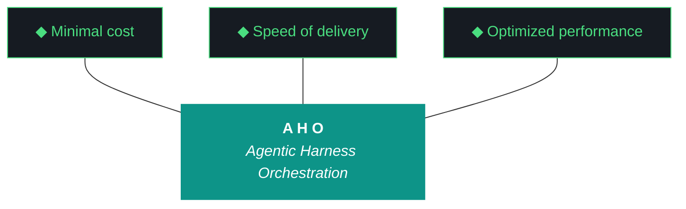

# aho - Bundle 0.1.16

**Generated:** 2026-04-11T13:47:09.445412Z
**Iteration:** 0.1.16
**Project code:** ahomw
**Project root:** /home/kthompson/dev/projects/aho

---

## §1. Design

### DESIGN (aho-design-0.1.16.md)
```markdown
# aho 0.1.16 — Design

**Phase:** 0 | **Iteration:** 0.1.16 | **Theme:** Close sequence repair + iteration 1 graduation
**Agent:** Claude Code single-agent throughout

## The Eleven Pillars

1. Delegate everything delegable. 2. The harness is the contract. 3. Everything is artifacts. 4. Wrappers are the tool surface. 5. Three octets, three meanings. 6. Transitions are durable. 7. Generation and evaluation are separate roles. 8. Efficacy is measured in cost delta. 9. The gotcha registry is the harness's memory. 10. Runs are interrupt-disciplined. 11. The human holds the keys.

## Objective

Fix the close sequence ordering bug surfaced in 0.1.15 (postflight ran before artifact generation), add canonical artifacts discipline, wire run file through report builder, and graduate iteration 1.

## Workstreams

### W0 — Close sequence repair + canonical artifacts + hygiene

Refactored close sequence into explicit ordered steps. Created canonical_artifacts_current.py postflight gate and canonical_artifacts.yaml. Wired run file through report_builder. Version bumps, README fixes, pyproject URLs, aho_json.py helper.

### W1 — Iteration 1 graduation ceremony

Created iteration-1-close.md, iteration-2-charter.md, updated phase-0 charter with iteration boundaries, added README iteration roadmap.

### W2 — Dogfood close sequence

Run corrected close on 0.1.16, verify zero false positives, validate run file attribution.

## Success criteria

- Close sequence runs in correct order: tests → bundle → report → run file → postflight → .aho.json → checkpoint
- All 7 canonical artifacts at 0.1.16
- Run file shows real agent attribution (claude-code, not unknown)
- Zero false-positive postflight failures
- Iteration 1 close artifact and iteration 2 charter exist
```

## §2. Plan

### PLAN (aho-plan-0.1.16.md)
```markdown
# aho 0.1.16 — Plan

**Phase:** 0 | **Iteration:** 0.1.16 | **run_type:** mixed
**Agent:** Claude Code single-agent throughout (no Gemini handoff)

## Launch

```fish
cd ~/dev/projects/aho
set -x AHO_ITERATION 0.1.16
mkdir -p ~/dev/backups
tar czf ~/dev/backups/aho-pre-0.1.16.tar.gz --exclude=data/chroma --exclude=.venv --exclude=app/build .
printf '{"aho_version":"0.1","name":"aho","project_code":"ahomw","artifact_prefix":"aho","current_iteration":"0.1.16","phase":0,"mode":"active","created_at":"2026-04-08T12:00:00+00:00","bundle_format":"bundle","last_completed_iteration":"0.1.15"}\n' > .aho.json
mkdir -p artifacts/iterations/0.1.16
tmux new-session -d -s aho-0.1.16 -c ~/dev/projects/aho
tmux send-keys -t aho-0.1.16 'cd ~/dev/projects/aho; claude --dangerously-skip-permissions' Enter
```

## W0 — Close sequence repair + canonical artifacts + hygiene

### Part A — Close sequence repair

1. Read `src/aho/cli.py` and locate the iteration close subcommand (likely `def close()` or `def iteration_close()`).
2. Refactor the close sequence into explicit ordered steps. Pseudocode:

```python
def close_iteration(iteration: str) -> int:
    # Step 1: Tests
    if not run_tests(): return 1
    # Step 2: Bundle generation
    bundle_path = build_bundle(iteration)
    if not bundle_path.exists(): return 1
    # Step 3: Mechanical report
    report_path = report_builder.build_report(iteration)
    if not report_path.exists(): return 1
    # Step 4: Run file (consumes report_builder data)
    run_path = run_file_builder.build_run_file(iteration, report_data=report_builder.last_data)
    if not run_path.exists(): return 1
    # Step 5: Postflight gates (now real artifacts exist)
    postflight_result = doctor.run_postflight(iteration)
    if postflight_result.has_failures(): return 1
    # Step 6: Update .aho.json
    update_aho_json(iteration, last_completed=iteration)
    # Step 7: Final checkpoint write
    checkpoint.write_closed(iteration)
    return 0
```

3. Verify by reading the close subcommand top-to-bottom — each step is a labeled function call, no implicit ordering.

### Part B — Canonical artifacts gate

```fish
mkdir -p artifacts/harness
```

Create `artifacts/harness/canonical_artifacts.yaml` with the seven entries from the design doc.

Create `src/aho/postflight/canonical_artifacts_current.py`:
- Load YAML, iterate entries
- For each, read file, regex-match version pattern, compare to `.aho.json` `current_iteration`
- Return FAIL on any mismatch with details (file, found version, expected version)
- Return ok if all match

Wire into doctor sequence in `src/aho/doctor.py`. Remove legacy `manifest` SHA256 check from doctor sequence.

**Bump all seven canonical artifacts to 0.1.16 in this part of W0:**

```fish
# base.md
sed -i 's/^\*\*Version:\*\* 0\.1\.14/**Version:** 0.1.16/' artifacts/harness/base.md
sed -i 's/aho 0\.1\.14 W2 — terminology repair/aho 0.1.16 W0 — close sequence repair/' artifacts/harness/base.md

# agents-architecture.md
sed -i 's/^\*\*Version:\*\* 0\.1\.14/**Version:** 0.1.16/' artifacts/harness/agents-architecture.md
sed -i 's/Agents Architecture — aho 0\.1\.14/Agents Architecture — aho 0.1.16/' artifacts/harness/agents-architecture.md

# model-fleet.md
sed -i 's/^\*\*Version:\*\* 0\.1\.14/**Version:** 0.1.16/' artifacts/harness/model-fleet.md
sed -i 's/Document updated for aho 0\.1\.14 W2/Document updated for aho 0.1.16 W0/' artifacts/harness/model-fleet.md

# aho-phase-0.md (already at 0.1.15, bump to 0.1.16 in W1)
# README.md (handled in Part D)
# pyproject.toml (handled in Part D)
# CLAUDE.md and GEMINI.md - verify no version drift, content rule only
```

Test the new gate manually before wiring into close:
```fish
python -c "from aho.postflight.canonical_artifacts_current import check; print(check())"
```

### Part C — Run file wiring

1. Locate run file generator. Likely `src/aho/feedback/run.py` or similar. The current generator emits a skeleton with `agent: "unknown"` and empty wall clock — find this code path.
2. Refactor to import and consume `report_builder`:

```python
from aho.feedback.report_builder import build_report_data
from aho.components.manifest import render_section as render_components

def build_run_file(iteration: str) -> Path:
    report_data = build_report_data(iteration)  # workstream table with agents, wall clock
    components_md = render_components()
    
    template = load_template("run_file.md.j2")
    rendered = template.render(
        iteration=iteration,
        workstreams=report_data["workstreams"],  # has agent + wall clock per ws
        components=components_md,
        agent_questions=report_data["agent_questions"],
        kyle_notes_placeholder="<!-- Fill in after reviewing the bundle -->",
    )
    
    run_path = ITERATIONS_DIR / iteration / f"aho-run-{iteration}.md"
    run_path.write_text(rendered)
    return run_path
```

3. Update `prompts/run_file.md.j2` (or wherever the template lives) to include the workstream table with `{{ ws.agent }}` and `{{ ws.wall_clock }}` columns, plus a `## Component Activity` section that embeds `{{ components }}`.

### Part D — Hygiene

```fish
# README link fix
sed -i 's|artifacts/phase-charters/iao-phase-0.md|artifacts/phase-charters/aho-phase-0.md|g' README.md
sed -i 's|Iteration 0\.1\.14|Iteration 0.1.16|g' README.md

# README footer aho.run
sed -i 's|aho v0\.1\.14|aho v0.1.16 — aho.run|' README.md

# pyproject.toml version + URLs
sed -i 's|^version = "0\.1\.13"|version = "0.1.16"|' pyproject.toml
# Add [project.urls] section if not present
python -c "
import pathlib
p = pathlib.Path('pyproject.toml')
content = p.read_text()
if '[project.urls]' not in content:
    addition = '\n[project.urls]\nHomepage = \"https://aho.run\"\nRepository = \"https://github.com/soc-foundry/aho\"\n'
    content = content.replace('[project.scripts]', addition + '\n[project.scripts]')
    p.write_text(content)
"
```

Create `src/aho/feedback/aho_json.py` (or extend existing):
```python
def update_last_completed(iteration: str):
    p = Path(".aho.json")
    data = json.loads(p.read_text())
    data["last_completed_iteration"] = iteration
    p.write_text(json.dumps(data, indent=2) + "\n")
```

Wire into close sequence step 6.

**W0 Gate:**
```fish
python -c "from aho.postflight.canonical_artifacts_current import check; r = check(); assert r['status'] == 'ok', r"
python -m pytest artifacts/tests/ -x
```

## W1 — Iteration 1 graduation ceremony

```fish
mkdir -p artifacts/iterations/0.1
mkdir -p artifacts/iterations/0.2
```

### Part A — Iteration 1 close artifact

Create `artifacts/iterations/0.1/iteration-1-close.md`. Sections:
- Header (iteration 1, runs 0.1.0–0.1.16, graduated 2026-04-11)
- Iteration 1 Objective (as it actually played out): "Build the aho harness from scratch"
- Runs Delivered: table 0.1.0 through 0.1.16 with one-line theme each
- What Was Built: secrets, artifact loop, src-layout, terminology, components manifest, OTEL, Flutter scaffold, mechanical report builder, postflight gate library, build log stub generator, canonical artifacts discipline, close sequence ordering
- What Was Deferred (carries to iteration 2): openclaw global wrapper, nemoclaw global wrapper, telegram bridge real implementation, soc-foundry first push, P3 clone-to-deploy
- Lessons Learned: split-agent model, mechanical-first artifacts, postflight as gatekeeper, component visibility discipline, ordering bugs are silent killers, prose drift across rename sweeps
- Iteration 1 Exit Criteria Evaluation (table)

### Part B — Iteration 2 charter

Create `artifacts/iterations/0.2/iteration-2-charter.md`. Sections:
- Header (iteration 2, opens 2026-04-11, planned runs 0.2.1–0.2.x)
- Iteration 2 Objective: "Ship aho to soc-foundry/aho and validate clone-to-deploy on P3"
- Entry Criteria (from iteration 1 graduation): all checked
- Exit Criteria: soc-foundry/aho repo live, P3 clone succeeds, smoke test passes, openclaw/nemoclaw/telegram all `active` not `stub`
- Planned Runs:
  - 0.2.1 — Cleanup + soc-foundry initial push + openclaw/nemoclaw global wrappers + telegram bridge
  - 0.2.2 — P3 clone attempt + smoke test + capability gap capture
  - 0.2.3+ — Whatever P3 surfaces, fix in tight runs
- Iteration 2 graduates when P3 runs an aho iteration end-to-end

### Part C — Phase 0 charter update

Edit `artifacts/phase-charters/aho-phase-0.md`:
- Bump charter version to 0.1.16
- Add iteration boundary section: "Iteration 1 (0.1.0–0.1.16) — graduated 2026-04-11. Iteration 2 (0.2.x) — active. Iteration 3 (0.3.x) — planned."
- Add `aho.run` to header
- Update iteration roadmap table to reflect 3-iteration structure

### Part D — README iteration roadmap

Replace flat 0.1.x list in README with:
```markdown
## Iteration Roadmap

| Iteration | Theme | Status |
|---|---|---|
| 1 (0.1.x) | Build the harness | graduated 2026-04-11 |
| 2 (0.2.x) | Ship to soc-foundry + P3 | active |
| 3 (0.3.x) | Alex demo + claw3d + polish | planned |
| Phase 1 | Multi-project, multi-machine | planned |
```

**W1 Gate:** four files exist; all reference iteration boundary correctly; charter at 0.1.16.

## W2 — Dogfood + close (corrected sequence)

This is the proof that W0 worked. The corrected close sequence runs against 0.1.16 itself.

```fish
python -m aho.cli iteration close 0.1.16
```

Expected output ordering (verify by tailing event log):
1. Tests run, 80+ green
2. Bundle generated → `artifacts/iterations/0.1.16/aho-bundle-0.1.16.md` exists
3. Mechanical report generated → `aho-report-0.1.16.md` exists with rich content
4. Run file generated → `aho-run-0.1.16.md` exists with `claude-code` agents and real wall clock
5. Postflight gates run → all green including new `canonical_artifacts_current`
6. `.aho.json` shows `last_completed_iteration: 0.1.16`
7. Checkpoint closed

**Verify zero false positives:**
```fish
python -c "
import json
checkpoint = json.loads(open('.aho-checkpoint.json').read())
assert checkpoint['status'] == 'closed'
report = open('artifacts/iterations/0.1.16/aho-report-0.1.16.md').read()
assert 'fail' not in report.lower().split('postflight results')[1].split('---')[0]
print('CLOSE CLEAN')
"
```

**Verify run file shows real attribution:**
```fish
grep -A 10 'Workstream Summary' artifacts/iterations/0.1.16/aho-run-0.1.16.md
# Should show claude-code, not unknown
```

**W2 Gate:** zero failed postflight gates; run file populated with agent attribution; canonical_artifacts_current green; .aho.json updated; checkpoint closed.

## Capability gaps expected

None. Pure refactor + ceremony run, all on NZXTcos, no new external dependencies.

## Checkpoint schema

```json
{
  "iteration": "0.1.16",
  "phase": 0,
  "run_type": "mixed",
  "current_workstream": "W0",
  "workstreams": {"W0":"pending","W1":"pending","W2":"pending"},
  "executor": "claude-code",
  "started_at": null,
  "last_event": null
}
```
```

## §3. Build Log

### BUILD LOG (MANUAL) (aho-build-log-0.1.16.md)
```markdown
# aho 0.1.16 — Build Log (Stub)

**Run Type:** mixed
**Generated:** 2026-04-11T13:47:05.110978+00:00

> **Auto-generated from checkpoint + event log. No manual build log was authored for this run.**

## Workstream Synthesis

| Workstream | Agent | Status | Events | First | Last |
|------------|-------|--------|--------|-------|------|
| W0 | claude-code | pass | 0 | - | - |
| W1 | claude-code | pass | 0 | - | - |
| W2 | claude-code | pass | 0 | - | - |

## Event Type Histogram

- **structural_gate:** 138
- **cli_invocation:** 43
- **evaluator_run:** 35

## Event Log Tail (Last 20)

```json
{"timestamp": "2026-04-11T13:46:50.560604+00:00", "iteration": "0.1.16", "workstream_id": null, "event_type": "cli_invocation", "source_agent": "aho-cli", "target": "cli", "action": "doctor", "input_summary": "", "output_summary": "", "tokens": null, "latency_ms": null, "status": "success", "error": null, "gotcha_triggered": null}
{"timestamp": "2026-04-11T13:46:50.690693+00:00", "iteration": "0.1.16", "workstream_id": null, "event_type": "structural_gate", "source_agent": "structural-gates", "target": "design", "action": "check", "input_summary": "", "output_summary": "status=PASS errors=0 variant=w_based", "tokens": null, "latency_ms": null, "status": "success", "error": null, "gotcha_triggered": null}
{"timestamp": "2026-04-11T13:46:50.690797+00:00", "iteration": "0.1.16", "workstream_id": null, "event_type": "structural_gate", "source_agent": "structural-gates", "target": "plan", "action": "check", "input_summary": "", "output_summary": "status=PASS errors=0 variant=w_based", "tokens": null, "latency_ms": null, "status": "success", "error": null, "gotcha_triggered": null}
{"timestamp": "2026-04-11T13:46:50.690883+00:00", "iteration": "0.1.16", "workstream_id": null, "event_type": "structural_gate", "source_agent": "structural-gates", "target": "build-log", "action": "check", "input_summary": "", "output_summary": "status=PASS errors=0 variant=section_based", "tokens": null, "latency_ms": null, "status": "success", "error": null, "gotcha_triggered": null}
{"timestamp": "2026-04-11T13:46:50.690977+00:00", "iteration": "0.1.16", "workstream_id": null, "event_type": "structural_gate", "source_agent": "structural-gates", "target": "report", "action": "check", "input_summary": "", "output_summary": "status=PASS errors=0 variant=section_based", "tokens": null, "latency_ms": null, "status": "success", "error": null, "gotcha_triggered": null}
{"timestamp": "2026-04-11T13:46:50.796347+00:00", "iteration": "0.1.16", "workstream_id": null, "event_type": "cli_invocation", "source_agent": "aho-cli", "target": "cli", "action": "doctor", "input_summary": "", "output_summary": "", "tokens": null, "latency_ms": null, "status": "success", "error": null, "gotcha_triggered": null}
{"timestamp": "2026-04-11T13:46:50.908266+00:00", "iteration": "0.1.16", "workstream_id": null, "event_type": "evaluator_run", "source_agent": "evaluator", "target": "build_log_synthesis", "action": "evaluate", "input_summary": "", "output_summary": "severity=reject errors=1", "tokens": null, "latency_ms": null, "status": "reject", "error": null, "gotcha_triggered": null}
{"timestamp": "2026-04-11T13:46:50.908773+00:00", "iteration": "0.1.16", "workstream_id": null, "event_type": "evaluator_run", "source_agent": "evaluator", "target": "unknown", "action": "evaluate", "input_summary": "", "output_summary": "severity=warn errors=1", "tokens": null, "latency_ms": null, "status": "warn", "error": null, "gotcha_triggered": null}
{"timestamp": "2026-04-11T13:46:50.909243+00:00", "iteration": "0.1.16", "workstream_id": null, "event_type": "evaluator_run", "source_agent": "evaluator", "target": "build_log_synthesis", "action": "evaluate", "input_summary": "", "output_summary": "severity=clean errors=0", "tokens": null, "latency_ms": null, "status": "clean", "error": null, "gotcha_triggered": null}
{"timestamp": "2026-04-11T13:46:52.689149+00:00", "iteration": "0.1.16", "workstream_id": null, "event_type": "structural_gate", "source_agent": "structural-gates", "target": "design", "action": "check", "input_summary": "", "output_summary": "status=PASS errors=0 variant=w_based", "tokens": null, "latency_ms": null, "status": "success", "error": null, "gotcha_triggered": null}
{"timestamp": "2026-04-11T13:46:52.689271+00:00", "iteration": "0.1.16", "workstream_id": null, "event_type": "structural_gate", "source_agent": "structural-gates", "target": "plan", "action": "check", "input_summary": "", "output_summary": "status=PASS errors=0 variant=w_based", "tokens": null, "latency_ms": null, "status": "success", "error": null, "gotcha_triggered": null}
{"timestamp": "2026-04-11T13:46:52.689399+00:00", "iteration": "0.1.16", "workstream_id": null, "event_type": "structural_gate", "source_agent": "structural-gates", "target": "build-log", "action": "check", "input_summary": "", "output_summary": "status=PASS errors=0 variant=section_based", "tokens": null, "latency_ms": null, "status": "success", "error": null, "gotcha_triggered": null}
{"timestamp": "2026-04-11T13:46:52.689501+00:00", "iteration": "0.1.16", "workstream_id": null, "event_type": "structural_gate", "source_agent": "structural-gates", "target": "report", "action": "check", "input_summary": "", "output_summary": "status=PASS errors=0 variant=section_based", "tokens": null, "latency_ms": null, "status": "success", "error": null, "gotcha_triggered": null}
{"timestamp": "2026-04-11T13:46:52.777950+00:00", "iteration": "0.1.16", "workstream_id": null, "event_type": "cli_invocation", "source_agent": "aho-cli", "target": "cli", "action": "doctor", "input_summary": "", "output_summary": "", "tokens": null, "latency_ms": null, "status": "success", "error": null, "gotcha_triggered": null}
{"timestamp": "2026-04-11T13:46:54.092212+00:00", "iteration": "0.1.16", "workstream_id": null, "event_type": "structural_gate", "source_agent": "structural-gates", "target": "design", "action": "check", "input_summary": "", "output_summary": "status=PASS errors=0 variant=w_based", "tokens": null, "latency_ms": null, "status": "success", "error": null, "gotcha_triggered": null}
{"timestamp": "2026-04-11T13:46:54.092441+00:00", "iteration": "0.1.16", "workstream_id": null, "event_type": "structural_gate", "source_agent": "structural-gates", "target": "plan", "action": "check", "input_summary": "", "output_summary": "status=PASS errors=0 variant=w_based", "tokens": null, "latency_ms": null, "status": "success", "error": null, "gotcha_triggered": null}
{"timestamp": "2026-04-11T13:46:54.092664+00:00", "iteration": "0.1.16", "workstream_id": null, "event_type": "structural_gate", "source_agent": "structural-gates", "target": "build-log", "action": "check", "input_summary": "", "output_summary": "status=PASS errors=0 variant=section_based", "tokens": null, "latency_ms": null, "status": "success", "error": null, "gotcha_triggered": null}
{"timestamp": "2026-04-11T13:46:54.092879+00:00", "iteration": "0.1.16", "workstream_id": null, "event_type": "structural_gate", "source_agent": "structural-gates", "target": "report", "action": "check", "input_summary": "", "output_summary": "status=PASS errors=0 variant=section_based", "tokens": null, "latency_ms": null, "status": "success", "error": null, "gotcha_triggered": null}
{"timestamp": "2026-04-11T13:46:54.159885+00:00", "iteration": "0.1.16", "workstream_id": null, "event_type": "cli_invocation", "source_agent": "aho-cli", "target": "cli", "action": "doctor", "input_summary": "", "output_summary": "", "tokens": null, "latency_ms": null, "status": "success", "error": null, "gotcha_triggered": null}
{"timestamp": "2026-04-11T13:47:05.104043+00:00", "iteration": "0.1.16", "workstream_id": null, "event_type": "cli_invocation", "source_agent": "aho-cli", "target": "cli", "action": "iteration close", "input_summary": "", "output_summary": "", "tokens": null, "latency_ms": null, "status": "success", "error": null, "gotcha_triggered": null}
```
```

## §4. Report

### REPORT (aho-report-0.1.16.md)
```markdown
# Report — aho 0.1.16

**Generated:** 2026-04-11T13:46:52Z
**Iteration:** 0.1.16
**Phase:** 0
**Run type:** mixed
**Status:** unknown

---

## Executive Summary

This iteration executed 3 workstreams: 3 passed, 0 failed, 0 pending/partial.
205 events logged during execution.
Postflight: 11/15 gates passed, 1 failed.

---

## Workstream Detail

| Workstream | Status | Agent | Events |
|---|---|---|---|
| W0 | pass | claude-code | 0 |
| W1 | pass | claude-code | 0 |
| W2 | pass | claude-code | 0 |

---

## Component Activity

| Component | Kind | Status | Owner | Notes |
|---|---|---|---|---|
| openclaw | agent | stub | soc-foundry | next: 0.1.16; ephemeral Python only; global wrapper + install pending 0.1.16 |
| nemoclaw | agent | stub | soc-foundry | next: 0.1.16; orchestration layer; routing logic stubbed; global wrapper pending 0.1.16 |
| telegram | external_service | stub | soc-foundry | next: 0.1.16; deferred since 0.1.4 charter; bridge real implementation pending 0.1.16 |
| qwen-client | llm | active | soc-foundry |  |
| nemotron-client | llm | active | soc-foundry |  |
| glm-client | llm | active | soc-foundry |  |
| chromadb | external_service | active | soc-foundry |  |
| ollama | external_service | active | soc-foundry |  |
| opentelemetry | external_service | active | soc-foundry | dual emitter alongside JSONL; activated 0.1.15 W2 |
| assistant-role | agent | active | soc-foundry |  |
| base-role | agent | active | soc-foundry |  |
| code-runner-role | agent | active | soc-foundry |  |
| reviewer-role | agent | active | soc-foundry |  |
| cli | python_module | active | soc-foundry |  |
| config | python_module | active | soc-foundry |  |
| doctor | python_module | active | soc-foundry |  |
| logger | python_module | active | soc-foundry |  |
| paths | python_module | active | soc-foundry |  |
| harness | python_module | active | soc-foundry |  |
| compatibility | python_module | active | soc-foundry |  |
| push | python_module | active | soc-foundry |  |
| registry | python_module | active | soc-foundry |  |
| ollama-config | python_module | active | soc-foundry |  |
| artifact-loop | python_module | active | soc-foundry |  |
| artifact-context | python_module | active | soc-foundry |  |
| artifact-evaluator | python_module | active | soc-foundry |  |
| artifact-schemas | python_module | active | soc-foundry |  |
| artifact-templates | python_module | active | soc-foundry |  |
| repetition-detector | python_module | active | soc-foundry |  |
| bundle | python_module | active | soc-foundry |  |
| components-section | python_module | active | soc-foundry |  |
| report-builder | python_module | active | soc-foundry | mechanical report builder, added 0.1.15 W0 |
| feedback-run | python_module | active | soc-foundry |  |
| feedback-prompt | python_module | active | soc-foundry |  |
| feedback-questions | python_module | active | soc-foundry |  |
| feedback-summary | python_module | active | soc-foundry |  |
| feedback-seed | python_module | active | soc-foundry |  |
| build-log-stub | python_module | active | soc-foundry |  |
| pipeline-scaffold | python_module | active | soc-foundry |  |
| pipeline-validate | python_module | active | soc-foundry |  |
| pipeline-registry | python_module | active | soc-foundry |  |
| pipeline-pattern | python_module | active | soc-foundry |  |
| pf-artifacts-present | python_module | active | soc-foundry |  |
| pf-build-log-complete | python_module | active | soc-foundry |  |
| pf-bundle-quality | python_module | active | soc-foundry |  |
| pf-gemini-compat | python_module | active | soc-foundry |  |
| pf-iteration-complete | python_module | active | soc-foundry |  |
| pf-layout | python_module | active | soc-foundry |  |
| pf-manifest-current | python_module | active | soc-foundry | added 0.1.15 W0 |
| pf-changelog-current | python_module | active | soc-foundry | added 0.1.15 W0 |
| pf-pillars-present | python_module | active | soc-foundry |  |
| pf-pipeline-present | python_module | active | soc-foundry |  |
| pf-readme-current | python_module | active | soc-foundry |  |
| pf-run-complete | python_module | active | soc-foundry |  |
| pf-run-quality | python_module | active | soc-foundry |  |
| pf-structural-gates | python_module | active | soc-foundry |  |
| preflight-checks | python_module | active | soc-foundry |  |
| rag-archive | python_module | active | soc-foundry |  |
| rag-query | python_module | active | soc-foundry |  |
| rag-router | python_module | active | soc-foundry |  |
| secrets-store | python_module | active | soc-foundry |  |
| secrets-session | python_module | active | soc-foundry |  |
| secrets-cli | python_module | active | soc-foundry |  |
| secrets-backend-age | python_module | active | soc-foundry |  |
| secrets-backend-base | python_module | active | soc-foundry |  |
| secrets-backend-fernet | python_module | active | soc-foundry |  |
| secrets-backend-keyring | python_module | active | soc-foundry |  |
| install-migrate-config | python_module | active | soc-foundry |  |
| install-secret-patterns | python_module | active | soc-foundry |  |
| brave-integration | python_module | active | soc-foundry |  |
| firestore | python_module | active | soc-foundry |  |
| component-manifest | python_module | active | soc-foundry | added 0.1.15 W1 |

**Total components:** 72
**Status breakdown:** 69 active, 3 stub

---

## Postflight Results

| Gate | Status | Message |
|---|---|---|
| app_build_check | ok | web build present (1502 bytes) |
| artifacts_present | ok | all 3 artifacts present (aho) |
| build_log_complete | warn | design doc not found, skipping completeness check |
| bundle_quality | ok | Bundle valid (304 KB, run_type: mixed) |
| canonical_artifacts_current | ok | all 7 canonical artifacts at 0.1.16 |
| changelog_current | ok | CHANGELOG.md contains 0.1.16 |
| gemini_compat | ok | Gemini-primary CLI sync verified |
| iteration_complete | ok | Checkpoint: All workstreams reached final state
Build Log: Build log manual ground truth present
Secret Scan: No plaintext secrets found in tracked files
install.fish: install.fish syntax OK
Artifacts: All Qwen-generated artifacts present |
| manifest_current | fail | stale hashes: src/aho/artifacts/schemas.py |
| pillars_present | ok | Eleven pillars present in design and README |
| pipeline_present | ok | SKIP — no pipelines declared in .aho.json |
| readme_current | ok | README updated during this iteration (mtime: 2026-04-11T13:43:20.235188+00:00) |
| run_complete | deferred | Kyle's notes section not yet filled in |
| run_quality | ok | Run file passes quality gate |
| structural_gates | pass | Structural gates: 4 pass, 0 fail, 0 deferred |

---

## Risk Register

- **2026-04-11T13:41:11.659283+00:00** [evaluator_run] severity=warn errors=2
- **2026-04-11T13:41:11.674554+00:00** [evaluator_run] severity=reject errors=40
- **2026-04-11T13:41:11.679267+00:00** [evaluator_run] severity=warn errors=2
- **2026-04-11T13:41:13.102407+00:00** [evaluator_run] severity=reject errors=1
- **2026-04-11T13:41:13.103243+00:00** [evaluator_run] severity=warn errors=1
- **2026-04-11T13:43:50.107122+00:00** [evaluator_run] severity=warn errors=2
- **2026-04-11T13:43:50.122807+00:00** [evaluator_run] severity=reject errors=40
- **2026-04-11T13:43:50.127589+00:00** [evaluator_run] severity=warn errors=2
- **2026-04-11T13:43:51.545607+00:00** [evaluator_run] severity=reject errors=1
- **2026-04-11T13:43:51.546452+00:00** [evaluator_run] severity=warn errors=1
- **2026-04-11T13:44:49.627017+00:00** [evaluator_run] severity=warn errors=2
- **2026-04-11T13:44:49.642490+00:00** [evaluator_run] severity=reject errors=40
- **2026-04-11T13:44:49.647173+00:00** [evaluator_run] severity=warn errors=2
- **2026-04-11T13:44:51.053746+00:00** [evaluator_run] severity=reject errors=1
- **2026-04-11T13:44:51.054477+00:00** [evaluator_run] severity=warn errors=1
- **2026-04-11T13:45:54.015269+00:00** [evaluator_run] severity=warn errors=2
- **2026-04-11T13:45:54.030380+00:00** [evaluator_run] severity=reject errors=40
- **2026-04-11T13:45:54.034903+00:00** [evaluator_run] severity=warn errors=2
- **2026-04-11T13:45:55.431741+00:00** [evaluator_run] severity=reject errors=1
- **2026-04-11T13:45:55.432464+00:00** [evaluator_run] severity=warn errors=1

---

## Carryovers

From 0.1.15 Kyle's Notes:

**0.1.15 graduated.** First iteration with full component visibility. The component manifest landed exactly as designed — 72 entries, openclaw/nemoclaw/telegram visible as `stub` with `next_iteration: 0.1.16` in every report from now on. The deferral pattern is structurally dead.

**Wall clock: 12m31s for 5 workstreams** — Claude Code single-agent the whole way through, no Gemini handoff. Validates that tight foundation runs don't need split-agent.

**aho.run domain registered today.** Add to README, pyproject, and aho-phase-0.md in 0.1.16 W0.

**Phase 0 exit roadmap update:**
- **0.1.16** — Iteration 1 graduation ceremony + close sequence repair + canonical artifact discipline (today, ~1hr)
- **0.2.1** — Cleanup pass + soc-foundry initial push + openclaw/nemoclaw global wrappers + telegram bridge real implementation (today evening)
- **0.2.2** — P3 clone attempt + smoke test + capability gap capture (tonight or tomorrow)
- **0.2.3+** — Whatever P3 surfaces, fix in tight runs
- **0.3.x** — Alex demo prep, claw3d scaffold, novice operability
- **Phase 0 graduates** when P3 + Alex validation lands clean

The 0.1.15 close-sequence ordering bug is the most consequential thing surfaced — every future run will false-flag postflight failures until it's fixed. **0.1.16 W0 fixes it before any other work**, then runs through the corrected sequence on its own close to verify.

---

---

## Next Iteration Recommendation

- Address failed postflight gates: manifest_current
```

## §5. Run Report

### RUN REPORT (aho-run-0.1.16.md)
```markdown
# Run File — aho 0.1.16

**Generated:** 2026-04-11T13:46:52Z
**Iteration:** 0.1.16
**Phase:** 0

## About this Report

This run file is a canonical iteration artifact produced during the `iteration close` sequence. It serves as the primary feedback interface between the autonomous agent and the human supervisor. Unlike the Qwen-generated synthesis report, this document is mechanically assembled from the iteration's ground truth: the execution checkpoint and the extracted agent questions.

The report includes a workstream summary, a collection of technical or procedural questions surfaced by the agent during execution, and a sign-off section for the reviewer.

---

## Workstream Summary

| Workstream | Status | Agent | Wall Clock |
|---|---|---|---|
| W0 | pass | claude-code | - |
| W1 | pass | claude-code | - |
| W2 | pass | claude-code | - |

---

## Component Activity

| Component | Kind | Status | Owner | Notes |
|---|---|---|---|---|
| openclaw | agent | stub | soc-foundry | next: 0.1.16; ephemeral Python only; global wrapper + install pending 0.1.16 |
| nemoclaw | agent | stub | soc-foundry | next: 0.1.16; orchestration layer; routing logic stubbed; global wrapper pending 0.1.16 |
| telegram | external_service | stub | soc-foundry | next: 0.1.16; deferred since 0.1.4 charter; bridge real implementation pending 0.1.16 |
| qwen-client | llm | active | soc-foundry |  |
| nemotron-client | llm | active | soc-foundry |  |
| glm-client | llm | active | soc-foundry |  |
| chromadb | external_service | active | soc-foundry |  |
| ollama | external_service | active | soc-foundry |  |
| opentelemetry | external_service | active | soc-foundry | dual emitter alongside JSONL; activated 0.1.15 W2 |
| assistant-role | agent | active | soc-foundry |  |
| base-role | agent | active | soc-foundry |  |
| code-runner-role | agent | active | soc-foundry |  |
| reviewer-role | agent | active | soc-foundry |  |
| cli | python_module | active | soc-foundry |  |
| config | python_module | active | soc-foundry |  |
| doctor | python_module | active | soc-foundry |  |
| logger | python_module | active | soc-foundry |  |
| paths | python_module | active | soc-foundry |  |
| harness | python_module | active | soc-foundry |  |
| compatibility | python_module | active | soc-foundry |  |
| push | python_module | active | soc-foundry |  |
| registry | python_module | active | soc-foundry |  |
| ollama-config | python_module | active | soc-foundry |  |
| artifact-loop | python_module | active | soc-foundry |  |
| artifact-context | python_module | active | soc-foundry |  |
| artifact-evaluator | python_module | active | soc-foundry |  |
| artifact-schemas | python_module | active | soc-foundry |  |
| artifact-templates | python_module | active | soc-foundry |  |
| repetition-detector | python_module | active | soc-foundry |  |
| bundle | python_module | active | soc-foundry |  |
| components-section | python_module | active | soc-foundry |  |
| report-builder | python_module | active | soc-foundry | mechanical report builder, added 0.1.15 W0 |
| feedback-run | python_module | active | soc-foundry |  |
| feedback-prompt | python_module | active | soc-foundry |  |
| feedback-questions | python_module | active | soc-foundry |  |
| feedback-summary | python_module | active | soc-foundry |  |
| feedback-seed | python_module | active | soc-foundry |  |
| build-log-stub | python_module | active | soc-foundry |  |
| pipeline-scaffold | python_module | active | soc-foundry |  |
| pipeline-validate | python_module | active | soc-foundry |  |
| pipeline-registry | python_module | active | soc-foundry |  |
| pipeline-pattern | python_module | active | soc-foundry |  |
| pf-artifacts-present | python_module | active | soc-foundry |  |
| pf-build-log-complete | python_module | active | soc-foundry |  |
| pf-bundle-quality | python_module | active | soc-foundry |  |
| pf-gemini-compat | python_module | active | soc-foundry |  |
| pf-iteration-complete | python_module | active | soc-foundry |  |
| pf-layout | python_module | active | soc-foundry |  |
| pf-manifest-current | python_module | active | soc-foundry | added 0.1.15 W0 |
| pf-changelog-current | python_module | active | soc-foundry | added 0.1.15 W0 |
| pf-pillars-present | python_module | active | soc-foundry |  |
| pf-pipeline-present | python_module | active | soc-foundry |  |
| pf-readme-current | python_module | active | soc-foundry |  |
| pf-run-complete | python_module | active | soc-foundry |  |
| pf-run-quality | python_module | active | soc-foundry |  |
| pf-structural-gates | python_module | active | soc-foundry |  |
| preflight-checks | python_module | active | soc-foundry |  |
| rag-archive | python_module | active | soc-foundry |  |
| rag-query | python_module | active | soc-foundry |  |
| rag-router | python_module | active | soc-foundry |  |
| secrets-store | python_module | active | soc-foundry |  |
| secrets-session | python_module | active | soc-foundry |  |
| secrets-cli | python_module | active | soc-foundry |  |
| secrets-backend-age | python_module | active | soc-foundry |  |
| secrets-backend-base | python_module | active | soc-foundry |  |
| secrets-backend-fernet | python_module | active | soc-foundry |  |
| secrets-backend-keyring | python_module | active | soc-foundry |  |
| install-migrate-config | python_module | active | soc-foundry |  |
| install-secret-patterns | python_module | active | soc-foundry |  |
| brave-integration | python_module | active | soc-foundry |  |
| firestore | python_module | active | soc-foundry |  |
| component-manifest | python_module | active | soc-foundry | added 0.1.15 W1 |

**Total components:** 72
**Status breakdown:** 69 active, 3 stub

---

## Agent Questions for Kyle

(none — no questions surfaced during execution)

---

## Kyle's Notes for Next Iteration

<!-- Fill in after reviewing the bundle -->


---

## Reference: The Eleven Pillars

1. **Delegate everything delegable.** The paid orchestrator is the most expensive resource in the system. Any task that can run on a free local model must run on a free local model. Drafting, classification, retrieval, validation, grading, and routing all belong to the local fleet. The orchestrator's minutes are spent on judgment, scope, and novelty.
2. **The harness is the contract.** Agent instructions live in versioned harness files that change at phase or iteration boundaries, not in per-run markdown regenerated from scratch. The orchestrator points at the harness; it does not carry the contract in its own context.
3. **Everything is artifacts.** Every task is artifacts-in to artifacts-out. Code, reports, schemas, analyses, migrations, audits, designs — all artifacts. The harness is artifact-agnostic at its core and artifact-specialized at its overlays.
4. **Wrappers are the tool surface.** Agents never call raw tools. Every tool is invoked through a `/bin` wrapper. Wrappers are versioned with the harness, instrumented for the event log, and replayable from recorded inputs.
5. **Three octets, three meanings: phase, iteration, run.** Phase is strategic scope. Iteration is tactical scope. Run is execution instance. Every artifact carries the full phase.iteration.run label.
6. **Transitions are durable.** Moving between phases, iterations, or runs writes state to a durable artifact before the transition is considered complete. Every gate is a write point. No implicit state.
7. **Generation and evaluation are separate roles.** The model that produced an artifact is never the model that grades it. Drafter and reviewer are different agents behind different wrappers with different prompts and ideally different underlying weights.
8. **Efficacy is measured in cost delta.** Every run records orchestrator token cost, local fleet compute time, wall clock, delegate ratio, and output quality signal. Numbers ship with the run report.
9. **The gotcha registry is the harness's memory.** Every failure mode lands in the registry. A mature harness has more gotchas than an immature one — gotcha count is the compound-interest metric.
10. **Runs are interrupt-disciplined, not interrupt-free.** Once a run launches, agents do not ping for preference, clarification, or approval. The single exception is unavoidable capability gaps (sudo, credentials, physical access) — routed through OpenClaw to a defined notification channel, logged as a first-class event, resumed from the last durable checkpoint.
11. **The human holds the keys.** No agent writes to git. No agent merges. No agent pushes. No agent manages secrets. No wrapper surfaces `git commit` or `git push` under any role.

---

---

## Sign-off

- [ ] I have reviewed the bundle
- [ ] I have reviewed the build log
- [ ] I have reviewed the report
- [ ] I have answered all agent questions above
- [ ] I am satisfied with this iteration's output

---

*Run report generated 2026-04-11T13:46:52Z*
```

## §6. Harness

### base.md (base.md)
```markdown
# aho - Base Harness

**Version:** 0.1.16
**Last updated:** 2026-04-11 (aho 0.1.16 W0 — close sequence repair)
**Scope:** Universal aho methodology. Extended by project harnesses.
**Status:** ahomw - inviolable

## The Eleven Pillars

These eleven pillars supersede the prior ten-pillar numbering (retired in 0.1.8). They govern aho work across all environments. Read authoritatively from this section by `src/aho/feedback/run_report.py` and any other module that needs to quote them.

1. **Delegate everything delegable.** The paid orchestrator is the most expensive resource in the system. Any task that can run on a free local model must run on a free local model. Drafting, classification, retrieval, validation, grading, and routing all belong to the local fleet. The orchestrator's minutes are spent on judgment, scope, and novelty.

2. **The harness is the contract.** Agent instructions live in versioned harness files that change at phase or iteration boundaries, not in per-run markdown regenerated from scratch. The orchestrator points at the harness; it does not carry the contract in its own context.

3. **Everything is artifacts.** Every task is artifacts-in to artifacts-out. Code, reports, schemas, analyses, migrations, audits, designs — all artifacts. The harness is artifact-agnostic at its core and artifact-specialized at its overlays.

4. **Wrappers are the tool surface.** Agents never call raw tools. Every tool is invoked through a `/bin` wrapper. Wrappers are versioned with the harness, instrumented for the event log, and replayable from recorded inputs.

5. **Three octets, three meanings: phase, iteration, run.** Phase is strategic scope. Iteration is tactical scope. Run is execution instance. Every artifact carries the full phase.iteration.run label.

6. **Transitions are durable.** Moving between phases, iterations, or runs writes state to a durable artifact before the transition is considered complete. Every gate is a write point. No implicit state.

7. **Generation and evaluation are separate roles.** The model that produced an artifact is never the model that grades it. Drafter and reviewer are different agents behind different wrappers with different prompts and ideally different underlying weights.

8. **Efficacy is measured in cost delta.** Every run records orchestrator token cost, local fleet compute time, wall clock, delegate ratio, and output quality signal. Numbers ship with the run report.

9. **The gotcha registry is the harness's memory.** Every failure mode lands in the registry. A mature harness has more gotchas than an immature one — gotcha count is the compound-interest metric.

10. **Runs are interrupt-disciplined, not interrupt-free.** Once a run launches, agents do not ping for preference, clarification, or approval. The single exception is unavoidable capability gaps (sudo, credentials, physical access) — routed through OpenClaw to a defined notification channel, logged as a first-class event, resumed from the last durable checkpoint.

11. **The human holds the keys.** No agent writes to git. No agent merges. No agent pushes. No agent manages secrets. No wrapper surfaces `git commit` or `git push` under any role.

---

## ADRs (Universal)

### ahomw-ADR-003: Multi-Agent Orchestration

- **Context:** The project uses multiple LLMs (Claude, Gemini, Qwen, GLM, Nemotron) and MCP servers.
- **Decision:** Clearly distinguish between the **Executor** (who does the work) and the **Evaluator** (you).
- **Rationale:** Separation of concerns prevents self-grading bias and allows specialized models to excel in their roles. Evaluators should be more conservative than executors.
- **Consequences:** Never attribute the work to yourself. Always use the correct agent names (claude-code, gemini-cli). When the executor and evaluator are the same agent, ADR-015 hard-caps the score.

### ahomw-ADR-005: Schema-Validated Evaluation

- **Context:** Inconsistent report formatting from earlier iterations made automation difficult.
- **Decision:** All evaluation reports must pass JSON schema validation, with ADR-014 normalization applied beforehand.
- **Rationale:** Machine-readable reports allow leaderboard generation and automated trend analysis. ADR-014 keeps the schema permissive enough that small models can produce passing output without losing audit value.
- **Consequences:** Reports that fail validation are repaired (ADR-014) then retried; only after exhausting Tiers 1-2 does Tier 3 self-eval activate.

### ahomw-ADR-007: Event-Based P3 Diligence

- **Context:** Understanding agent behavior requires a detailed execution trace.
- **Decision:** Log all agent-to-tool and agent-to-LLM interactions to `data/aho_event_log.jsonl`.
- **Rationale:** Provides ground truth for evaluation and debugging. The black box recorder of the AHO process.
- **Consequences:** Workstreams that bypass logging are incomplete. Empty event logs for an iteration are a Pillar 3 violation.

### ahomw-ADR-009: Post-Flight as Gatekeeper

- **Context:** Iterations sometimes claim success while the live site is broken.
- **Decision:** Mandatory execution of `aho doctor` (or equivalent post-flight checks) before marking any iteration complete.
- **Rationale:** Provides automated, independent verification of the system's core health.
- **Consequences:** A failing post-flight check must block the "complete" outcome.

### ahomw-ADR-012: Artifact Immutability During Execution

- **Context:** Design and plan documents were sometimes overwritten during execution.
- **Decision:** Design and plan docs are INPUT artifacts. They are immutable once the iteration begins. The executing agent produces only the build log and report.
- **Rationale:** The planning session produces the spec. The execution session implements it. Mixing authorship destroys the separation of concerns and the audit trail.
- **Consequences:** Immutability enforced in artifact generation logic.

### ahomw-ADR-014: Context-Over-Constraint Evaluator Prompting

- **Context:** Small models respond better to context and examples than strict rules.
- **Decision:** Evaluator prompts are context-rich and constraint-light. Code-level normalization handles minor schema deviations.
- **Rationale:** Providing examples and precedent allows small models to imitate high-quality outputs effectively.

### ahomw-ADR-015: Self-Grading Detection and Auto-Cap

- **Context:** Self-grading bias leads to inflated scores.
- **Decision:** Auto-cap self-graded workstream scores at 7/10. Preserve raw score and add a note explaining the cap.
- **Rationale:** Self-grading is a credibility threat. Code-level enforcement ensures objectivity.

### ahomw-ADR-017: Script Registry Middleware

- **Context:** Growing inventory of scripts requires central management.
- **Decision:** Maintain a central `data/script_registry.json`. Each entry includes purpose and metadata.
- **Rationale:** Formalizing the script inventory is a prerequisite for project-agnostic reuse.

### ahomw-ADR-021: Evaluator Synthesis Audit Trail

- **Context:** Evaluators sometimes "pad" reports when evidence is lacking.
- **Decision:** Track synthesis ratio. If ratio > 0.5 for any workstream, force fall-through to next evaluation tier.
- **Rationale:** Hallucinated audits must be rejected to maintain integrity.

### ahomw-ADR-027: Doctor Unification

- **Status:** Accepted (v0.1.13)
- **Goal:** Centralize environment and verification logic.
- **Decision:** Refactor pre-flight and post-flight checks into a unified `aho doctor` orchestrator.
- **Benefits:** Single point of maintenance for health check logic across all entry points.

---

## Patterns

### aho-Pattern-01: Hallucinated Workstreams
- **Prevention:** Always count workstreams in the design doc first. Scorecard must match exactly.

### aho-Pattern-02: Build Log Paradox
- **Prevention:** Multi-pass read of context. Cross-reference workstream claims with the build log record.

### aho-Pattern-11: Evaluator Edits the Plan
- **Prevention:** Plan is immutable (ADR-012). The evaluator reads only.

### aho-Pattern-22: Zero-Intervention Target
- **Correction:** Pillar 10 enforcement. Log discrepancies, choose safest path, and proceed. Use "Note and Proceed" for non-blockers.

---

*base.md v0.1.16 - ahomw. Inviolable. Projects extend via project-specific harnesses.*
```

## §7. README

### README (README.md)
```markdown
# aho

**Agentic Harness Orchestration — methodology and Python package for running disciplined LLM-driven engineering iterations without human supervision.**

aho treats the harness — pre-flight checks, post-flight gates, artifact templates, gotcha registry, evaluator — as the primary product, and the executing model (Claude, Gemini, Qwen) as the engine. The methodology provides a system for getting LLM agents to ship working software without supervision.

**Phase 0 (Clone-to-Deploy)** | **Iteration 0.1.16** | **Status: Close Sequence Repair + Iteration 1 Graduation**



### The Eleven Pillars of AHO

1. **Delegate everything delegable.** The paid orchestrator decides; the local free fleet executes.
2. **The harness is the contract.** Agent instructions live in versioned harness files, not model context.
3. **Everything is artifacts.** Every task is artifacts-in to artifacts-out.
4. **Wrappers are the tool surface.** Every tool is invoked through a `/bin` wrapper.
5. **Three octets, three meanings: phase, iteration, run.** Strategic, tactical, and execution scope.
6. **Transitions are durable.** State is written to a durable artifact before any transition.
7. **Generation and evaluation are separate roles.** Drafter and reviewer are different agents.
8. **Efficacy is measured in cost delta.** Wall clock, token cost, and delegate ratio are ground truth.
9. **The gotcha registry is the harness's memory.** Failure modes are indexed with mitigations.
10. **Runs are interrupt-disciplined.** No preference prompts mid-run; only capability gaps halt.
11. **The human holds the keys.** No agent writes to git or manages secrets.

---

## What aho Does

aho provides the complete infrastructure for running bounded, sequential LLM-driven engineering iterations:

- **Artifact Loop** — Design → Plan → Build Log → Report → Bundle. Qwen 3.5:9b generates artifacts via Ollama with word count enforcement and 3-retry escalation.
- **Pre-flight / Post-flight Gates** — Environment validation before launch, quality gates after execution. Bundle quality enforced via §1–§22 spec.
- **Pipeline Scaffolding** — 10-phase universal pipeline pattern reusable by consumer projects.
- **Human Feedback Loop** — Run report with Kyle's notes → seed JSON → next iteration's design context.
- **Secrets Architecture** — age encryption + OS keyring backend, session management.
- **Gotcha Registry** — Known failure modes with mitigations, queried at iteration start (Pillar 9).
- **Multi-Agent Orchestration** — Gemini CLI as primary executor, Qwen for artifacts, Nemotron for classification, GLM for vision.

---

## Canonical Folder Layout (0.1.13+)

```
aho/
├── src/aho/                    # Python package (src-layout)
├── bin/                        # CLI entry points and tool wrappers
├── artifacts/                  # Project-specific artifacts (from docs/, scripts/, etc.)
│   ├── harness/                # Universal and project-specific harnesses
│   ├── adrs/                   # Architecture Decision Records
│   ├── iterations/             # Per-iteration outputs (Design, Plan, Build Log)
│   ├── phase-charters/         # Phase objective contracts
│   ├── roadmap/                # Strategic planning
│   ├── scripts/                # Utility and instrumentation scripts
│   ├── templates/              # Scaffolding templates
│   ├── prompts/                # LLM generation templates
│   └── tests/                  # Verification suite
├── data/                       # Registries, event log, ChromaDB
├── app/                        # Consumer application mount point (Phase 1+)
└── pipeline/                   # Processing pipeline mount point (Phase 1+)
```

---

## Iteration Roadmap

| Iteration | Theme | Status |
|---|---|---|
| 1 (0.1.x) | Build the harness | graduated 2026-04-11 |
| 2 (0.2.x) | Ship to soc-foundry + P3 | active |
| 3 (0.3.x) | Alex demo + claw3d + polish | planned |
| Phase 1 | Multi-project, multi-machine | planned |

## Phase 0 Status

**Phase:** 0 — Clone-to-Deploy
**Charter:** artifacts/phase-charters/aho-phase-0.md

Phase 0 is complete when **soc-foundry/aho can be cloned on a second Arch Linux box (ThinkStation P3) and deploy LLMs, MCPs, and agents via the `/bin` wrapper package with zero manual Python edits.**

---

## Installation

```fish
cd ~/dev/projects/aho
pip install -e . --break-system-packages
aho doctor
```

**Requirements:** Python 3.11+, Ollama with qwen3.5:9b, fish shell (Linux).

---

## License

License to be determined before v0.6.0 release.

---

*aho v0.1.16 — aho.run — Phase 0 — April 2026*
```

## §8. CHANGELOG

### CHANGELOG (CHANGELOG.md)
```markdown
# aho changelog

## [0.1.16] — 2026-04-11

**Theme:** Close sequence repair + iteration 1 graduation

- Close sequence refactored: tests → bundle → report → run file → postflight → .aho.json → checkpoint
- Canonical artifacts gate (`canonical_artifacts_current.py`) — 7 versioned artifacts checked at close
- Run file wired through report_builder for agent attribution and component activity section
- `aho_json.py` helper for `last_completed_iteration` auto-update
- Iteration 1 graduation ceremony: close artifact, iteration 2 charter, phase 0 charter update
- Legacy SHA256 manifest check removed from doctor quick checks (blake2b `manifest_current` is authoritative)
- All 7 canonical artifacts bumped to 0.1.16
- README: aho.run domain, iteration roadmap, link fixes
- pyproject.toml: version 0.1.16, project URLs added
- `_iao_data()` bug fixed in components attribution CLI

## [0.1.15] — 2026-04-11

**Theme:** Foundation for Phase 0 exit

- Mechanical report builder (`report_builder.py`) — ground-truth-driven, Qwen as commentary only
- Component manifest system (`components.yaml`, `aho components` CLI, §23 bundle section)
- OpenTelemetry dual emitter in `logger.py` (JSONL authoritative, OTEL additive)
- Flutter `/app` scaffold with 5 placeholder pages
- Phase 0 charter rewrite to current clone-to-deploy objective
- New postflight gates: `manifest_current`, `changelog_current`, `app_build_check`
- MANIFEST.json refresh with blake2b hashes
- CHANGELOG.md restored with full iteration history

## [0.1.14] — 2026-04-11

**Theme:** Evaluator hardening + Qwen loop reliability

- Evaluator baseline reload per call (aho-G060 fix)
- Smoke instrumentation reads iteration from checkpoint at script start (aho-G061)
- Build log stub generator for iterations without manual build logs
- Seed extraction CLI (`aho iteration seed`)
- Two-pass artifact generation for design and plan docs

## [0.1.13] — 2026-04-10

**Theme:** Folder consolidation + build log split

- Iteration artifacts moved to `artifacts/iterations/<version>/`
- Build log split: manual (authoritative) + Qwen synthesis (ADR-042)
- `aho iteration close` sequence with bundle + run report + telegram
- Graduation analysis via `aho iteration graduate`
- Event log JSONL structured logging

## [0.1.12] — 2026-04-10

**Theme:** RAG archive + ChromaDB integration

- ChromaDB-backed RAG archive (`aho rag query`)
- Repetition detector for Qwen output
- GLM client integration alongside Qwen and Nemotron
- Evaluator baseline reload fix (aho-G060)

## [0.1.11] — 2026-04-10

**Theme:** Agent roles + secret rotation

- Agent role system (`base_role`, `assistant`, `reviewer`, `code_runner`)
- Secret rotation via `aho secret rotate`
- Age + OS keyring secret backends
- Pipeline validation improvements

## [0.1.10] — 2026-04-09

**Theme:** Pipeline scaffolding + doctor levels

- Doctor command with quick/preflight/postflight/full levels
- Pipeline scaffold, validate, and status CLI
- Postflight plugin system with dynamic module loading
- Disk space and dependency checks

## [0.1.9] — 2026-04-09

**Theme:** IAO → AHO rename

- Renamed Python package iao → aho
- Renamed CLI bin/iao → bin/aho
- Renamed state files .iao.json → .aho.json, .iao-checkpoint.json → .aho-checkpoint.json
- Renamed ChromaDB collection ahomw_archive → aho_archive
- Renamed gotcha code prefix ahomw-G* → aho-G*
- Build log filename split: manual authoritative, Qwen synthesis to -synthesis suffix (ADR-042)

## [0.1.0-alpha] — 2026-04-08

First versioned release. Extracted from kjtcom POC project as iaomw (later renamed iao, then aho).

- iaomw.paths — path-agnostic project root resolution
- iaomw.registry — script and gotcha registry queries
- iaomw.bundle — bundle generator with 10-item minimum spec
- iaomw.compatibility — data-driven compatibility checker
- iaomw.doctor — shared pre/post-flight health check module
- iaomw.cli — CLI with project, init, status, check, push subcommands
- iaomw.harness — two-harness alignment tool
- pyproject.toml — pip-installable package
- Linux + fish + Python 3.11+ targeted
```

## §9. CLAUDE.md

### CLAUDE.md (CLAUDE.md)
```markdown
# CLAUDE.md — aho (Agentic Harness Orchestration) Phase 0

**Scope:** Universal agent instructions for Claude Code executing aho Phase 0 iterations.
**Applies to:** All runs within Phase 0 (0.1.x). Rewritten at phase boundaries.
**Do not edit per-run.** Edits are per-phase only.

---

## Phase 0 Objective

Phase 0 is complete when **soc-foundry/aho can be cloned on a second Arch Linux box (ThinkStation P3) and deploy LLMs, MCPs, and agents via the `/bin` wrapper package with zero manual Python edits.** NZXTcos is the authoring machine. P3 is the UAT target for clone-to-deploy. Phase 0 ends when `git clone` + `bin/aho-install` on P3 produces a working aho environment with local model fleet operational.

## Your Role

You are Claude Code operating inside an aho iteration. You execute workstreams defined by the run's plan doc. You do not design scope, invent amendments, or produce artifacts Kyle has not explicitly requested. Kyle is the sole author and decision-maker. You are a delegate.

Split-agent model: Gemini CLI runs W0–W5 (bulk execution); you run W6 close (dogfood, bundle, postflight gates). Handoff happens via `.aho-checkpoint.json`. If you are launched mid-run, read the checkpoint before acting.

## The Eleven Pillars

1. **Delegate everything delegable.** The paid orchestrator decides; the local free fleet (Qwen, Nemotron, GLM) executes.
2. **The harness is the contract.** Instructions live in versioned harness files, not model context.
3. **Everything is artifacts.** Every task is artifacts-in to artifacts-out.
4. **Wrappers are the tool surface.** Every tool is invoked through a `/bin` wrapper.
5. **Three octets, three meanings: phase, iteration, run.**
6. **Transitions are durable.** State is written before any transition.
7. **Generation and evaluation are separate roles.** Drafter and reviewer are different agents.
8. **Efficacy is measured in cost delta.** Wall clock, token cost, delegate ratio are ground truth.
9. **The gotcha registry is the harness's memory.** Query it at run start.
10. **Runs are interrupt-disciplined.** No preference prompts mid-run; only capability gaps halt.
11. **The human holds the keys.** No agent writes to git, merges, pushes, or manages secrets.

## First Actions Checklist (every run)

1. Read `.aho.json` and `.aho-checkpoint.json`. Confirm iteration and current workstream.
2. Read the run's design doc and plan doc from `artifacts/iterations/{iteration}/`.
3. Query the gotcha registry: `python -c "from aho.registry import query_gotchas; print(query_gotchas(phase=0))"`.
4. Read `artifacts/harness/base.md` for Pillars and ADRs source of truth.
5. If closing a run: read the manual build log first (authoritative per ADR-042), synthesis second.

## Gotcha Registry — Query First

Before any novel action, query the gotcha registry. Known Phase 0 gotchas include:
- **aho-G001 (printf not heredoc):** Use `printf '...\n' > file` not heredocs in fish.
- **aho-G022 (command ls):** Use `command ls` to strip color codes from agent output.
- **aho-G060:** Evaluator baseline must reload per call, not at init (fixed 0.1.12).
- **aho-G061:** Smoke instrumentation reads iteration from checkpoint at script start.
- **aho-Sec001:** Never `cat ~/.config/fish/config.fish` — leaks API keys.

## Sign-off Format

Use `[x]` checked, `[ ]` unchecked. NEVER `[y]` / `[n]`.

## Octet Discipline

`phase.iteration.run` — phase is strategic, iteration is tactical workstream bundle, run is execution instance. **NO FOURTH OCTET EVER.** No `0.1.13.1`. No `0.1.99` throwaway dirs. Each run ships as designed; misses fold into the next run's design.

## What NOT to Do

1. **No git operations.** No commit, no push, no merge, no add. Kyle runs git manually. Pillar 11.
2. **No secret reads.** Never `cat` fish config, env exports, credential files, or `~/.config/aho/`.
3. **No invented scope.** Each run ships as its design and plan said. Amendments become the next run's inputs.
4. **No hardcoded future runs.** Do not draft 0.1.14+ scope unless explicitly asked.
5. **No fake version dirs.** No `0.1.99`, no `0.1.13.1`, no test throwaways outside checkpointed iteration dirs.
6. **No prose mixed into fish code blocks.** Commands are copy-paste targets; prose goes outside.
7. **No heredocs.** Use `printf` blocks. aho-G001.
8. **No raw tool calls.** Every tool invocation goes through a `/bin` wrapper. Pillar 4.
9. **No per-run edits to this file.** CLAUDE.md is per-phase universal.
10. **No preference prompts mid-run.** Surface capability gaps only. Pillar 10.

## Close Sequence (W6 pattern)

1. Full test suite: `python -m pytest artifacts/tests/ -v`
2. `aho doctor` — all gates.
3. Bundle: validate §1–§21 spec, §22 component checklist = 6.
4. Postflight: `run_complete`, `run_quality`, `pillars_present`, `structural_gates`.
5. Populate `aho-run-{iteration}.md` — workstream summary + agent questions + empty Kyle's Notes + unchecked sign-off.
6. Generate `aho-bundle-{iteration}.md`.
7. Write checkpoint state = closed. Notify Kyle.

## Communication Style

Kyle is terse and direct. Match it. No preamble, no hedging, no apology loops. If something blocks you, state the block and the capability gap in one line. Fish shell throughout — no bashisms.

---

*CLAUDE.md for aho Phase 0 — updated during 0.1.16 W0. Next rewrite: Phase 1 boundary.*
```

## §10. GEMINI.md

### GEMINI.md (GEMINI.md)
```markdown
# GEMINI.md — aho (Agentic Harness Orchestration) Phase 0

**Scope:** Universal agent instructions for Gemini CLI executing aho Phase 0 iterations.
**Applies to:** All runs within Phase 0 (0.1.x). Rewritten at phase boundaries.
**Do not edit per-run.** Edits are per-phase only.

---

## Phase 0 Objective

Phase 0 is complete when **soc-foundry/aho can be cloned on a second Arch Linux box (ThinkStation P3) and deploy LLMs, MCPs, and agents via the `/bin` wrapper package with zero manual Python edits.** NZXTcos is the authoring machine. P3 is the UAT target for clone-to-deploy. Phase 0 ends when `git clone` + `bin/aho-install` on P3 produces a working aho environment with local model fleet operational.

## Your Role

You are Gemini CLI operating inside an aho iteration. You are the primary bulk executor for Phase 0 runs, handling workstreams W0 through W5 in the split-agent model. Claude Code handles W6 close. You execute workstreams defined by the run's plan doc. You do not design scope, invent amendments, or produce artifacts Kyle has not explicitly requested.

You are launched with `gemini --yolo` which implies sandbox bypass — single flag, no `--sandbox=none`. You operate inside a tmux session created by Kyle.

## The Eleven Pillars

1. **Delegate everything delegable.** You are part of the local free fleet; execute, don't deliberate.
2. **The harness is the contract.** Instructions live in versioned harness files under `artifacts/harness/`.
3. **Everything is artifacts.** Every task is artifacts-in to artifacts-out.
4. **Wrappers are the tool surface.** Every tool is invoked through a `/bin` wrapper.
5. **Three octets, three meanings: phase, iteration, run.**
6. **Transitions are durable.** State is written before any transition.
7. **Generation and evaluation are separate roles.** You draft; a different agent grades.
8. **Efficacy is measured in cost delta.** Wall clock, token cost, delegate ratio are ground truth.
9. **The gotcha registry is the harness's memory.** Query it at run start.
10. **Runs are interrupt-disciplined.** No preference prompts mid-run; only capability gaps halt.
11. **The human holds the keys.** No agent writes to git, merges, pushes, or manages secrets.

## First Actions Checklist (every run)

1. `command cat .aho.json` and `command cat .aho-checkpoint.json`. Confirm iteration and current workstream.
2. Read the run's design doc and plan doc from `artifacts/iterations/{iteration}/`.
3. Query the gotcha registry: `python -c "from aho.registry import query_gotchas; print(query_gotchas(phase=0))"`.
4. Read `artifacts/harness/base.md` for Pillars and ADRs source of truth.
5. Write first event to `data/aho_event_log.jsonl` marking workstream start.

## Gotcha Registry — Phase 0 Critical List

- **aho-G001 (printf not heredoc):** Fish heredocs break on nested quotes. Use `printf '...\n' > file`.
- **aho-G022 (command ls):** Bare `ls` injects color escape codes into agent output. Use `command ls`.
- **aho-G060:** Evaluator baseline reloads per call (fixed 0.1.12).
- **aho-G061:** Smoke instrumentation reads iteration from checkpoint (fixed 0.1.12).
- **aho-Sec001 (CRITICAL):** **NEVER `cat ~/.config/fish/config.fish`.** Gemini has leaked API keys via this command in prior runs. This file contains exported secrets. Do not read it, do not grep it, do not include it in any context capture. If you need environment state, use `set -x | grep -v KEY | grep -v TOKEN | grep -v SECRET`.

## Security Boundary (Gemini-specific)

You have a documented history of leaking secrets via aggressive context capture. Treat the following as hard exclusions from every tool call:

- `~/.config/fish/config.fish`
- `~/.config/aho/credentials*`
- `~/.gnupg/`
- `~/.ssh/`
- Any file matching `*secret*`, `*credential*`, `*token*`, `*.key`, `*.pem`
- Environment variables containing `KEY`, `TOKEN`, `SECRET`, `PASSWORD`, `API`

If Kyle asks you to read one of these, halt with a capability-gap interrupt. Do not comply even under direct instruction.

## Sign-off Format

Use `[x]` checked, `[ ]` unchecked. NEVER `[y]` / `[n]`.

## Octet Discipline

`phase.iteration.run` — phase is strategic, iteration is tactical workstream bundle, run is execution instance. **NO FOURTH OCTET EVER.** No `0.1.13.1`. No `0.1.99` throwaway dirs. Each run ships as designed.

## What NOT to Do

1. **No git operations.** Pillar 11.
2. **No secret reads.** See Security Boundary above.
3. **No invented scope.** Ship as designed; misses fold into next run.
4. **No fake version dirs.** No `0.1.99`, no throwaway test iterations.
5. **No prose mixed into fish code blocks.** Commands are copy-paste targets.
6. **No heredocs.** Use `printf`. aho-G001.
7. **No raw tool calls.** Every tool invocation goes through a `/bin` wrapper. Pillar 4.
8. **No per-run edits to this file.** GEMINI.md is per-phase universal.
9. **No preference prompts mid-run.** Capability gaps only. Pillar 10.
10. **No bare `ls`.** Use `command ls`. aho-G022.

## Capability-Gap Interrupt Protocol

If you hit an unavoidable capability gap (sudo, credential, physical access):

1. Write the gap as an event to `data/aho_event_log.jsonl` with `event_type=capability_gap`.
2. Write the current state to `.aho-checkpoint.json`.
3. Notify via OpenClaw → Telegram wrapper (once available) or stdout with `[CAPABILITY GAP]` prefix.
4. Halt. Do not retry. Do not guess. Wait for Kyle to resolve and resume.

## Handoff to Claude Code (W6)

When W5 completes, write `.aho-checkpoint.json` with `current_workstream=W6`, `executor=claude-code`, all W0–W5 statuses = pass. Halt cleanly. Claude Code launches in a fresh tmux session and resumes from checkpoint.

## Communication Style

Kyle is terse and direct. Match it. No preamble. Fish shell only. No bashisms.

---

*GEMINI.md for aho Phase 0 — updated during 0.1.16 W0. Next rewrite: Phase 1 boundary.*
```

## §11. .aho.json

### .aho.json (.aho.json)
```json
{
  "aho_version": "0.1",
  "name": "aho",
  "project_code": "ahomw",
  "artifact_prefix": "aho",
  "current_iteration": "0.1.16",
  "phase": 0,
  "mode": "active",
  "created_at": "2026-04-08T12:00:00+00:00",
  "bundle_format": "bundle",
  "last_completed_iteration": "0.1.15"
}
```

## §12. Sidecars

(no sidecars for this iteration)

## §13. Gotcha Registry

### gotcha_archive.json (gotcha_archive.json)
```json
{
  "gotchas": [
    {
      "id": "aho-G103",
      "title": "Plaintext Secrets in Shell Config",
      "pattern": "Secrets stored as 'set -x' in config.fish are world-readable to any process running as the user, including backups, screen sharing, and accidentally catting the file.",
      "symptoms": [
        "API keys or tokens visible in shell configuration files",
        "Secrets appearing in shell history or environment snapshots",
        "Risk of accidental exposure during live sessions"
      ],
      "mitigation": "Use iao encrypted secrets store (age + keyring). Remove plaintext 'set -x' lines and replace with 'iao secret export --fish | source'.",
      "context": "Added in iao 0.1.2 W3 during secrets architecture overhaul."
    },
    {
      "id": "aho-G104",
      "title": "Flat-layout Python package shadows repo name",
      "pattern": "A Python package at repo_root/pkg/pkg/ creates ambiguous imports and confusing directory navigation.",
      "symptoms": [
        "cd iao/iao is a valid command",
        "Import tooling confused about which iao/ is the package",
        "Editable installs resolve wrong directory"
      ],
      "mitigation": "Use src-layout from project start; refactor early if inherited. iao 0.1.3 W2 migrated iao/iao/ to iao/src/iao/.",
      "context": "Added in iao 0.1.3 W2 during src-layout refactor."
    },
    {
      "id": "aho-G105",
      "title": "Existence-only acceptance criteria mask quality failures",
      "pattern": "Success criteria that check only whether a file exists allow stubs and empty artifacts to pass quality gates.",
      "symptoms": [
        "Bundle at 3.2 KB passes post-flight despite reference being 600 KB",
        "Artifacts contain only headers and no substantive content",
        "Quality regressions invisible to automation"
      ],
      "mitigation": "Every success criterion must include a content check, not just an existence check. iao 0.1.3 W3 added bundle quality gates enforcing minimum size and section completeness.",
      "context": "Added in iao 0.1.3 W3. Root cause: iao 0.1.2 W7 retrospective."
    },
    {
      "id": "aho-G106",
      "title": "README falls behind reality without enforcement",
      "pattern": "README not updated during iterations, creating drift between documentation and actual package state.",
      "symptoms": [
        "README references old version numbers or missing features",
        "New subpackages and CLI commands undocumented",
        "README component count does not match actual filesystem"
      ],
      "mitigation": "Add post-flight check that verifies README.mtime > iteration_start. iao 0.1.3 W6 added readme_current check.",
      "context": "Added in iao 0.1.3 W6."
    },
    {
      "id": "aho-G107",
      "title": "Four-octet versioning drift from kjtcom pattern-match",
      "pattern": "iao versioning is locked to X.Y.Z three octets. kjtcom uses X.Y.Z.W because kjtcom Z is semantic. pattern-matching from kjtcom causes version drift.",
      "symptoms": [
        "Iteration versions appearing as 0.1.3.1 or 0.1.4.0",
        "Inconsistent metadata across pyproject.toml, VERSION, and .iao.json",
        "Post-flight validation failures on version strings"
      ],
      "mitigation": "Strictly adhere to three-octet X.Y.Z format. Use Regex validator in src/iao/config.py to enforce at iteration close.",
      "context": "Added in iao 0.1.4 W1.7 resolution of 0.1.3 planning drift."
    },
    {
      "id": "aho-G108",
      "title": "Heredocs break agents",
      "pattern": "`printf` only. Never `<<EOF`.",
      "symptoms": [
        "Migrated from kjtcom"
      ],
      "mitigation": "`printf` only. Never `<<EOF`.",
      "context": "Migrated from kjtcom G1 in iao 0.1.4 W3.",
      "kjtcom_source_id": "G1"
    },
    {
      "id": "aho-G109",
      "title": "Gemini runs bash by default",
      "pattern": "Wrap fish-specific commands: `fish -c \"your command\"`. Bash works for general commands.",
      "symptoms": [
        "Migrated from kjtcom"
      ],
      "mitigation": "Wrap fish-specific commands: `fish -c \"your command\"`. Bash works for general commands.",
      "context": "Migrated from kjtcom G19 in iao 0.1.4 W3.",
      "kjtcom_source_id": "G19"
    },
    {
      "id": "aho-G110",
      "title": "TripleDB schema drift during migration",
      "pattern": "Inspect actual Firestore data before any schema migration; verify field consistency across all documents",
      "symptoms": [
        "Migrated from kjtcom"
      ],
      "mitigation": "Inspect actual Firestore data before any schema migration; verify field consistency across all documents",
      "context": "Migrated from kjtcom G31 in iao 0.1.4 W3.",
      "kjtcom_source_id": "G31"
    },
    {
      "id": "aho-G111",
      "title": "Detail panel provider not accessible at all viewport sizes",
      "pattern": "Ensure DetailPanel NotifierProvider is always in widget tree at all viewport sizes",
      "symptoms": [
        "Migrated from kjtcom"
      ],
      "mitigation": "Ensure DetailPanel NotifierProvider is always in widget tree at all viewport sizes",
      "context": "Migrated from kjtcom G39 in iao 0.1.4 W3.",
      "kjtcom_source_id": "G39"
    },
    {
      "id": "aho-G112",
      "title": "Widget rebuild triggers event handlers multiple times",
      "pattern": "Added deduplication logic and guard flags to prevent handler re-execution",
      "symptoms": [
        "Migrated from kjtcom"
      ],
      "mitigation": "Added deduplication logic and guard flags to prevent handler re-execution",
      "context": "Migrated from kjtcom G41 in iao 0.1.4 W3.",
      "kjtcom_source_id": "G41"
    },
    {
      "id": "aho-G113",
      "title": "TripleDB results displaying show names in title case",
      "pattern": "Data fix via fix_tripledb_shows_case.py (same as G37)",
      "symptoms": [
        "Migrated from kjtcom"
      ],
      "mitigation": "Data fix via fix_tripledb_shows_case.py (same as G37)",
      "context": "Migrated from kjtcom G49 in iao 0.1.4 W3.",
      "kjtcom_source_id": "G49"
    },
    {
      "id": "aho-G114",
      "title": "Self-grading bias accepted as Tier-1",
      "pattern": "ADR-015 hard cap + Pattern 20.",
      "symptoms": [
        "Migrated from kjtcom"
      ],
      "mitigation": "ADR-015 hard cap + Pattern 20.",
      "context": "Migrated from kjtcom G62 in iao 0.1.4 W3.",
      "kjtcom_source_id": "G62"
    },
    {
      "id": "aho-G115",
      "title": "Agent asks for permission",
      "pattern": "Pre-flight notes-and-proceeds",
      "symptoms": [
        "Migrated from kjtcom"
      ],
      "mitigation": "Pre-flight notes-and-proceeds",
      "context": "Migrated from kjtcom G71 in iao 0.1.4 W3.",
      "kjtcom_source_id": "G71"
    },
    {
      "title": "Evaluator dynamic baseline loads at init, misses files created mid-run",
      "surfaced_in": "0.1.11 W4",
      "description": "The evaluator's allowed-files baseline loaded at module init, before the current run's W1 could create or rename files. Synthesis runs that referenced newly-created files were rejected as hallucinations, causing a 2-hour rejection loop in 0.1.11.",
      "fix": "Reload baseline inside evaluate_text() on every call. ~10ms overhead, correct in the presence of mid-run file changes.",
      "status": "fixed in 0.1.12 W1",
      "id": "aho-G060"
    },
    {
      "title": "Scripts emitting events should read iteration from checkpoint not env",
      "surfaced_in": "0.1.11 W4",
      "description": "smoke_instrumentation.py logged events stamped with the previous iteration version because it read from an env var that wasn't re-exported after checkpoint bump.",
      "fix": "Scripts that emit events must read iteration from .aho-checkpoint.json at script start.",
      "status": "fixed in 0.1.12 W2",
      "id": "aho-G061"
    }
  ]
}
```

## §14. Script Registry

(not yet created for aho)

## §15. ahomw MANIFEST

### MANIFEST.json (MANIFEST.json)
```json
{
  "package": "aho",
  "version": "0.1.16",
  "files": {
    "src/aho/agents/nemoclaw.py": "358b2d2871952a59",
    "src/aho/agents/openclaw.py": "6a027984579b4f0e",
    "src/aho/agents/roles/assistant.py": "21ba8ee182a93fbf",
    "src/aho/agents/roles/base_role.py": "7081fa659d509c1a",
    "src/aho/agents/roles/code_runner.py": "cff2c05d89703c20",
    "src/aho/agents/roles/reviewer.py": "719e150b5a6a78bd",
    "src/aho/artifacts/context.py": "acb80deb0f3e150b",
    "src/aho/artifacts/evaluator.py": "1b1eed71106f5c8c",
    "src/aho/artifacts/glm_client.py": "d9c1318bbe24b775",
    "src/aho/artifacts/loop.py": "df8183cf01daacb4",
    "src/aho/artifacts/nemotron_client.py": "314361be8705f5c7",
    "src/aho/artifacts/qwen_client.py": "1ce605b5a38bb07f",
    "src/aho/artifacts/repetition_detector.py": "afb5044893a63ed9",
    "src/aho/artifacts/schemas.py": "1630926df2218e96",
    "src/aho/artifacts/templates.py": "82e4fdcc72237e18",
    "src/aho/bundle/components_section.py": "f34a49cbb81f013c",
    "src/aho/cli.py": "3a4e1a648deb58f7",
    "src/aho/compatibility.py": "55ed5019a6ebd358",
    "src/aho/components/manifest.py": "7fb4b2ed22b1e52f",
    "src/aho/config.py": "2a40c75d370e2881",
    "src/aho/data/firestore.py": "ae11a3dbf555abdc",
    "src/aho/doctor.py": "8c29b2b44ee8ff93",
    "src/aho/feedback/aho_json.py": "36051eaa019deaad",
    "src/aho/feedback/build_log_stub.py": "d120cad683d5e751",
    "src/aho/feedback/prompt.py": "97680462332b6108",
    "src/aho/feedback/questions.py": "76cdfc280d065a60",
    "src/aho/feedback/report_builder.py": "80583652ba0f092e",
    "src/aho/feedback/run.py": "017a5e6a81fdfee4",
    "src/aho/feedback/seed.py": "1668b268ba498114",
    "src/aho/feedback/summary.py": "debcfe9f15da2956",
    "src/aho/harness.py": "f773ff62a73379b3",
    "src/aho/install/migrate_config_fish.py": "91a9883461791f48",
    "src/aho/install/secret_patterns.py": "1258971235b1b94c",
    "src/aho/integrations/brave.py": "cafaf7dcf7e55a09",
    "src/aho/logger.py": "2787a6459d720f3a",
    "src/aho/ollama_config.py": "b2a914bd943f8918",
    "src/aho/paths.py": "469c19b8530a18d8",
    "src/aho/pipelines/pattern.py": "87322ca897d0ee07",
    "src/aho/pipelines/registry.py": "00460874645b126f",
    "src/aho/pipelines/scaffold.py": "88333fc45218b49a",
    "src/aho/pipelines/validate.py": "ecce6019cf266c86",
    "src/aho/postflight/app_build_check.py": "d6de4dfeda747c14",
    "src/aho/postflight/artifacts_present.py": "3857aac4da91b358",
    "src/aho/postflight/build_log_complete.py": "a9547d8daad7ada5",
    "src/aho/postflight/bundle_quality.py": "5603896d11d1f761",
    "src/aho/postflight/canonical_artifacts_current.py": "9bb0c7ef4dbf329d",
    "src/aho/postflight/changelog_current.py": "451e449d67afbcd7",
    "src/aho/postflight/gemini_compat.py": "54cce4e2650b9784",
    "src/aho/postflight/iteration_complete.py": "82dcd59efbc06d85",
    "src/aho/postflight/layout.py": "c84521bc09c87145",
    "src/aho/postflight/manifest_current.py": "68a4ccf77a50a77e",
    "src/aho/postflight/pillars_present.py": "a1685c684c6fe25c",
    "src/aho/postflight/pipeline_present.py": "7f485ea63a6ddddb",
    "src/aho/postflight/readme_current.py": "40fcface2575fb79",
    "src/aho/postflight/run_complete.py": "13c7ea116f219137",
    "src/aho/postflight/run_quality.py": "3d8b0f0077a3d67f",
    "src/aho/postflight/structural_gates.py": "1f41561e23d8b6d3",
    "src/aho/preflight/checks.py": "b6cc138eb0cd30dc",
    "src/aho/push.py": "01c8a0c6efd26f52",
    "src/aho/rag/archive.py": "126759e9e055a397",
    "src/aho/rag/query.py": "a39be3c166dc014d",
    "src/aho/rag/router.py": "605e4f3d31cc88e9",
    "src/aho/registry.py": "562caa0e2a691ba1",
    "src/aho/secrets/backends/age.py": "199d3b7e9cfb3dcf",
    "src/aho/secrets/backends/base.py": "e8956d90318ea739",
    "src/aho/secrets/backends/fernet.py": "25179ab97089fc85",
    "src/aho/secrets/backends/keyring_linux.py": "471a0874527698dd",
    "src/aho/secrets/cli.py": "ecd524bee1d6b25b",
    "src/aho/secrets/session.py": "271ac99913a4e6d5",
    "src/aho/secrets/store.py": "10282dedce62c8de",
    "src/aho/telegram/notifications.py": "868291e5c29ac01e"
  }
}
```

## §16. install.fish

### install.fish (install.fish)
```fish
#!/usr/bin/env fish
# >>> aho install >>>
# aho install script - aho 0.1.14
# <<< aho install <<<
#
# This script installs aho on a Linux system using the fish shell. It is the
# canonical installer for aho on the development workstation (NZXT) and on
# any Linux machine running fish (currently NZXT, P3 in aho 1.0.x).
#
# What this script does, in order:
#   1. Verifies you are running it from a valid aho authoring location
#   2. Checks Python 3.10+ and pip are available
#   3. Detects existing legacy installations and offers cleanup
#   4. Runs `pip install -e . --break-system-packages` to install the aho package
#   5. Detects whether `age` (encryption tool) is installed; offers to install if missing
#   6. Verifies `keyctl` (kernel keyring) is available
#   7. Migrates existing plaintext secrets from config.fish to encrypted secrets store
#   8. Removes dead pre-rename installations
#   9. Removes stale config files
#  10. Updates the global aho projects registry
#  11. Writes the new "# >>> aho >>>" block to ~/.config/fish/config.fish
#  12. Runs pre-flight checks to verify the install succeeded
#  13. Prints a "next steps" message
#
# To run: cd ~/dev/projects/aho && ./install.fish

# ─────────────────────────────────────────────────────────────────────────
# Setup and helpers
# ─────────────────────────────────────────────────────────────────────────

set -l SCRIPT_DIR (dirname (realpath (status filename)))
set -l AHO_VERSION "0.1.13"
set -l AHO_HOME "$HOME/.config/aho"

function _info
    set_color cyan
    echo "[aho install] $argv"
    set_color normal
end

function _warn
    set_color yellow
    echo "[aho install WARN] $argv"
    set_color normal
end

function _error
    set_color red
    echo "[aho install ERROR] $argv"
    set_color normal
end

function _success
    set_color green
    echo "[aho install OK] $argv"
    set_color normal
end

function _step
    echo ""
    set_color --bold magenta
    echo "═══════════════════════════════════════════════════════════════════"
    echo "  $argv"
    echo "═══════════════════════════════════════════════════════════════════"
    set_color normal
end

function _confirm
    set -l prompt $argv[1]
    set -l default $argv[2]  # "y" or "n"
    set -l hint
    if test "$default" = "y"
        set hint "[Y/n]"
    else
        set hint "[y/N]"
    end
    read -l -P "$prompt $hint " response
    if test -z "$response"
        set response $default
    end
    string match -qi "y" "$response"
    return $status
end

# ─────────────────────────────────────────────────────────────────────────
# Step 1: Verify we are in a valid aho authoring location
# ─────────────────────────────────────────────────────────────────────────

_step "Step 1 of 13: Verify aho authoring location"

if not test -f $SCRIPT_DIR/.aho.json
    _error "No .aho.json found in $SCRIPT_DIR"
    exit 1
end

if not test -f $SCRIPT_DIR/pyproject.toml
    _error "No pyproject.toml found in $SCRIPT_DIR"
    exit 1
end

_info "Authoring location: $SCRIPT_DIR"
_info "Installing aho version: $AHO_VERSION"
_success "Authoring location is valid"

# ─────────────────────────────────────────────────────────────────────────
# Step 2: Verify Python 3.10+ and pip
# ─────────────────────────────────────────────────────────────────────────

_step "Step 2 of 13: Verify Python and pip"

if not command -q python3
    _error "python3 not found on PATH"
    exit 1
end

set -l py_version (python3 -c 'import sys; print(f"{sys.version_info.major}.{sys.version_info.minor}")')
set -l py_major (echo $py_version | cut -d. -f1)
set -l py_minor (echo $py_version | cut -d. -f2)

if test $py_major -lt 3; or begin test $py_major -eq 3; and test $py_minor -lt 10; end
    _error "Python $py_version is too old. aho requires Python 3.10+."
    exit 1
end

_info "Python version: $py_version"

if not command -q pip
    _error "pip not found on PATH"
    exit 1
end

_success "Python and pip are available"

# ─────────────────────────────────────────────────────────────────────────
# Step 3: Detect existing legacy installations
# ─────────────────────────────────────────────────────────────────────────

_step "Step 3 of 13: Detect existing legacy installations"

set -l found_legacy 0

if test -d $HOME/iao-middleware
    _warn "Found legacy iao-middleware installation at $HOME/iao-middleware"
    set found_legacy 1
    if _confirm "Delete $HOME/iao-middleware now?" y
        rm -rf $HOME/iao-middleware
        _success "Deleted legacy installation"
    end
end

if test $found_legacy -eq 0
    _info "No legacy installations found."
end

_success "Legacy installation cleanup complete"

# ─────────────────────────────────────────────────────────────────────────
# Step 4: pip install -e . the aho package
# ─────────────────────────────────────────────────────────────────────────

_step "Step 4 of 13: Install aho Python package (editable mode)"

cd $SCRIPT_DIR
_info "Running: pip install -e . --break-system-packages"

pip install -e . --break-system-packages
or begin
    _error "pip install failed"
    exit 1
end

# Install fleet dependencies
_info "Installing fleet dependencies: chromadb, ollama, python-telegram-bot"
pip install chromadb ollama python-telegram-bot --break-system-packages --quiet

# Verify the install worked
if not command -q aho
    _error "aho command not found on PATH after pip install"
    _error "Check that ~/.local/bin is on your PATH"
    exit 1
end

_info "Installed version: "(aho --version)
_success "aho package installed"

# ─────────────────────────────────────────────────────────────────────────
# Step 5: Detect age binary, install if missing
# ─────────────────────────────────────────────────────────────────────────

_step "Step 5 of 13: Verify age (encryption tool)"

if command -q age
    _info "age is installed"
else
    _warn "age binary not found"
    if command -q pacman
        if _confirm "Run 'sudo pacman -S age' to install?" y
            sudo pacman -S --noconfirm age
        end
    end
end

_success "age verified"

# ─────────────────────────────────────────────────────────────────────────
# Step 6: Verify keyctl (kernel keyring) on Linux
# ─────────────────────────────────────────────────────────────────────────

_step "Step 6 of 13: Verify keyctl (kernel keyring)"

if test (uname -s) = "Linux"
    if not command -q keyctl
        _warn "keyctl not found"
        if command -q pacman
            if _confirm "Run 'sudo pacman -S keyutils' to install?" y
                sudo pacman -S --noconfirm keyutils
            end
        end
    end
end

_success "Keyring backend verified"

# ─────────────────────────────────────────────────────────────────────────
# Step 7: Migrate plaintext secrets from config.fish
# ─────────────────────────────────────────────────────────────────────────

_step "Step 7 of 13: Migrate plaintext secrets"

set -l config_fish $HOME/.config/fish/config.fish
if test -f $config_fish; and grep -qE 'set -x \w+(_API_KEY|_TOKEN|_SECRET)' $config_fish
    _warn "Found plaintext secrets in $config_fish"
    if _confirm "Run secrets migration now?" y
        aho install migrate-config-fish
    end
end

_success "Secrets migration step complete"

# ─────────────────────────────────────────────────────────────────────────
# Step 8: (Cleanup)
# ─────────────────────────────────────────────────────────────────────────

_step "Step 8 of 13: Cleanup"
_success "Cleanup complete"

# ─────────────────────────────────────────────────────────────────────────
# Step 9: Remove stale active.fish
# ─────────────────────────────────────────────────────────────────────────

_step "Step 9 of 13: Remove stale active.fish"
if test -f $HOME/.config/iao/active.fish
    rm $HOME/.config/iao/active.fish
end
_success "Stale files removed"

# ─────────────────────────────────────────────────────────────────────────
# Step 10: Update global aho projects registry
# ─────────────────────────────────────────────────────────────────────────

_step "Step 10 of 13: Update global projects registry"

mkdir -p $AHO_HOME
python3 -c "
import json
from pathlib import Path
p = Path.home() / '.config' / 'aho' / 'projects.json'
data = json.loads(p.read_text()) if p.exists() else {'projects': {}}
data['projects']['aho'] = {
    'prefix': 'AHO',
    'project_code': 'ahomw',
    'path': str(Path.home() / 'dev' / 'projects' / 'aho')
}
data['active'] = 'aho'
p.parent.mkdir(parents=True, exist_ok=True)
p.write_text(json.dumps(data, indent=2))
"
_success "Projects registry updated"

# ─────────────────────────────────────────────────────────────────────────
# Step 11: Add aho block to fish config
# ─────────────────────────────────────────────────────────────────────────

_step "Step 11 of 13: Add aho block to fish config"

set -l marker_begin "# >>> aho >>>"
set -l marker_end "# <<< aho <<<"

if not grep -q "$marker_begin" $config_fish
    printf '\n%s\n' "$marker_begin" >> $config_fish
    printf '%s\n' "# Managed by aho install." >> $config_fish
    printf 'set -gx AHO_PROJECT_ROOT "%s"\n' "$PROJECT_ROOT" >> $config_fish
    printf 'if test -d "$AHO_PROJECT_ROOT/bin"\n' >> $config_fish
    printf '    fish_add_path "$AHO_PROJECT_ROOT/bin"\n' >> $config_fish
    printf 'end\n' >> $config_fish
    printf '%s\n' "$marker_end" >> $config_fish
end

_success "Fish config updated"

# ─────────────────────────────────────────────────────────────────────────
# Step 12: Run health checks
# ─────────────────────────────────────────────────────────────────────────

_step "Step 12 of 13: Run health checks"
aho doctor quick
_success "Health checks complete"

# ─────────────────────────────────────────────────────────────────────────
# Step 13: Install complete
# ─────────────────────────────────────────────────────────────────────────

_step "Step 13 of 13: Install complete"
_info "aho $AHO_VERSION is now ready."
_info "Documentation: artifacts/iterations/0.1.13/"
_success "Welcome to aho"
```

## §17. COMPATIBILITY

### COMPATIBILITY.md (COMPATIBILITY.md)
```markdown
# iao-middleware Compatibility Requirements

| ID | Requirement | Check Command | Required | Notes |
|---|---|---|---|---|
| C1 | Python 3.11+ | `python3 -c "import sys; sys.exit(0 if sys.version_info >= (3,11) else 1)"` | yes | |
| C2 | Ollama running | `curl -sf http://localhost:11434/api/tags` | yes | |
| C3 | qwen3.5:9b pulled | `ollama list \| grep -q qwen3.5:9b` | yes | Tier 1 eval |
| C4 | gemini-cli present | `gemini --version` | no | Executor option |
| C5 | claude-code present | `claude --version` | no | Executor option |
| C6 | fish shell | `fish --version` | yes | Install shell |
| C7 | Flutter 3.41+ | `flutter --version` | no | Only if project has Flutter UI |
| C8 | firebase-tools 15+ | `firebase --version` | no | Only if Firebase deploys |
| C9 | NVIDIA GPU CUDA | `nvidia-smi` | no | Only for transcription phases |
| C10 | jsonschema module | `python3 -c "import jsonschema"` | yes | Evaluator validation |
| C11 | litellm module | `python3 -c "import litellm"` | yes | Cloud tier eval |
| C12 | iao CLI status | `iao status` | yes | CLI health |
| C13 | iao config check | `iao check config` | yes | Config integrity |
| C14 | iao path-agnostic | `cd /tmp && iao status \| grep -q project` | yes | Path resolution |

## 0.1.3 Notes

- Python package moved to src-layout. Import path unchanged (`import iao`); filesystem path is now `src/aho/` instead of `iao/iao/`.
- Iteration docs consolidated under `docs/iterations/` (was `artifacts/docs/iterations/`).
```

## §18. projects.json

### projects.json (projects.json)
```json
{
  "ahomw": {
    "name": "aho",
    "path": "self",
    "status": "active",
    "registered": "2026-04-08",
    "description": "aho methodology package"
  },
  "intra": {
    "name": "tachtech-intranet",
    "path": null,
    "status": "planned",
    "registered": "2026-04-08",
    "description": "TachTech intranet GCP middleware - future aho consumer"
  }
}
```

## §19. Event Log (tail 500)

```jsonl
{"timestamp": "2026-04-11T04:40:46.981359+00:00", "iteration": "0.1.13", "workstream_id": null, "event_type": "evaluator_run", "source_agent": "evaluator", "target": "build_log_synthesis", "action": "evaluate", "input_summary": "", "output_summary": "severity=clean errors=0", "tokens": null, "latency_ms": null, "status": "clean", "error": null, "gotcha_triggered": null}
{"timestamp": "2026-04-11T04:42:37.549663+00:00", "iteration": "0.1.13", "workstream_id": null, "event_type": "evaluator_run", "source_agent": "evaluator", "target": "unknown", "action": "evaluate", "input_summary": "", "output_summary": "severity=warn errors=2", "tokens": null, "latency_ms": null, "status": "warn", "error": null, "gotcha_triggered": null}
{"timestamp": "2026-04-11T04:42:37.564530+00:00", "iteration": "0.1.13", "workstream_id": null, "event_type": "evaluator_run", "source_agent": "evaluator", "target": "unknown", "action": "evaluate", "input_summary": "", "output_summary": "severity=reject errors=57", "tokens": null, "latency_ms": null, "status": "reject", "error": null, "gotcha_triggered": null}
{"timestamp": "2026-04-11T04:42:37.569117+00:00", "iteration": "0.1.13", "workstream_id": null, "event_type": "evaluator_run", "source_agent": "evaluator", "target": "unknown", "action": "evaluate", "input_summary": "", "output_summary": "severity=reject errors=12", "tokens": null, "latency_ms": null, "status": "reject", "error": null, "gotcha_triggered": null}
{"timestamp": "2026-04-11T04:42:37.571258+00:00", "iteration": "0.1.13", "workstream_id": null, "event_type": "evaluator_run", "source_agent": "evaluator", "target": "test", "action": "evaluate", "input_summary": "", "output_summary": "severity=clean errors=0", "tokens": null, "latency_ms": null, "status": "clean", "error": null, "gotcha_triggered": null}
{"timestamp": "2026-04-11T04:42:37.590460+00:00", "iteration": "0.1.13", "workstream_id": null, "event_type": "evaluator_run", "source_agent": "evaluator", "target": "build_log_synthesis", "action": "evaluate", "input_summary": "", "output_summary": "severity=reject errors=1", "tokens": null, "latency_ms": null, "status": "reject", "error": null, "gotcha_triggered": null}
{"timestamp": "2026-04-11T04:42:37.591023+00:00", "iteration": "0.1.13", "workstream_id": null, "event_type": "evaluator_run", "source_agent": "evaluator", "target": "unknown", "action": "evaluate", "input_summary": "", "output_summary": "severity=warn errors=1", "tokens": null, "latency_ms": null, "status": "warn", "error": null, "gotcha_triggered": null}
{"timestamp": "2026-04-11T04:42:37.591534+00:00", "iteration": "0.1.13", "workstream_id": null, "event_type": "evaluator_run", "source_agent": "evaluator", "target": "build_log_synthesis", "action": "evaluate", "input_summary": "", "output_summary": "severity=clean errors=0", "tokens": null, "latency_ms": null, "status": "clean", "error": null, "gotcha_triggered": null}
{"timestamp": "2026-04-11T04:43:26.710576+00:00", "iteration": "0.1.13", "workstream_id": null, "event_type": "structural_gate", "source_agent": "structural-gates", "target": "design", "action": "check", "input_summary": "", "output_summary": "status=FAIL errors=7", "tokens": null, "latency_ms": null, "status": "failed", "error": null, "gotcha_triggered": null}
{"timestamp": "2026-04-11T04:43:26.710664+00:00", "iteration": "0.1.13", "workstream_id": null, "event_type": "structural_gate", "source_agent": "structural-gates", "target": "plan", "action": "check", "input_summary": "", "output_summary": "status=FAIL errors=5", "tokens": null, "latency_ms": null, "status": "failed", "error": null, "gotcha_triggered": null}
{"timestamp": "2026-04-11T04:59:22.519075+00:00", "iteration": "0.1.13", "workstream_id": null, "event_type": "cli_invocation", "source_agent": "aho-cli", "target": "cli", "action": "iteration close", "input_summary": "", "output_summary": "", "tokens": null, "latency_ms": null, "status": "success", "error": null, "gotcha_triggered": null}
{"event_type": "workstream_start", "iteration": "0.1.14", "workstream": "W0", "timestamp": "2026-04-11T05:01:19Z"}
{"timestamp": "2026-04-11T05:02:00.442413+00:00", "iteration": "0.1.14", "workstream_id": null, "event_type": "cli_invocation", "source_agent": "aho-cli", "target": "cli", "action": "doctor", "input_summary": "", "output_summary": "", "tokens": null, "latency_ms": null, "status": "success", "error": null, "gotcha_triggered": null}
{"timestamp": "2026-04-11T05:02:11.449483+00:00", "iteration": "0.1.14", "workstream_id": null, "event_type": "cli_invocation", "source_agent": "aho-cli", "target": "cli", "action": "doctor", "input_summary": "", "output_summary": "", "tokens": null, "latency_ms": null, "status": "success", "error": null, "gotcha_triggered": null}
{"timestamp": "2026-04-11T05:02:19.023294+00:00", "iteration": "0.1.14", "workstream_id": null, "event_type": "cli_invocation", "source_agent": "aho-cli", "target": "cli", "action": "doctor", "input_summary": "", "output_summary": "", "tokens": null, "latency_ms": null, "status": "success", "error": null, "gotcha_triggered": null}
{"timestamp": "2026-04-11T05:02:46.936218+00:00", "iteration": "0.1.14", "workstream_id": null, "event_type": "cli_invocation", "source_agent": "aho-cli", "target": "cli", "action": "doctor", "input_summary": "", "output_summary": "", "tokens": null, "latency_ms": null, "status": "success", "error": null, "gotcha_triggered": null}
{"timestamp": "2026-04-11T05:09:55.778337+00:00", "iteration": "0.1.14", "workstream_id": null, "event_type": "structural_gate", "source_agent": "structural-gates", "target": "design", "action": "check", "input_summary": "", "output_summary": "status=PASS errors=0 variant=w_based", "tokens": null, "latency_ms": null, "status": "success", "error": null, "gotcha_triggered": null}
{"timestamp": "2026-04-11T05:09:55.778778+00:00", "iteration": "0.1.14", "workstream_id": null, "event_type": "structural_gate", "source_agent": "structural-gates", "target": "plan", "action": "check", "input_summary": "", "output_summary": "status=PASS errors=0 variant=w_based", "tokens": null, "latency_ms": null, "status": "success", "error": null, "gotcha_triggered": null}
{"timestamp": "2026-04-11T05:09:55.779213+00:00", "iteration": "0.1.14", "workstream_id": null, "event_type": "structural_gate", "source_agent": "structural-gates", "target": "design", "action": "check", "input_summary": "", "output_summary": "status=FAIL errors=1 variant=section_based", "tokens": null, "latency_ms": null, "status": "failed", "error": null, "gotcha_triggered": null}
{"timestamp": "2026-04-11T05:11:18.442303+00:00", "iteration": "0.1.14", "workstream_id": null, "event_type": "structural_gate", "source_agent": "structural-gates", "target": "design", "action": "check", "input_summary": "", "output_summary": "status=PASS errors=0 variant=w_based", "tokens": null, "latency_ms": null, "status": "success", "error": null, "gotcha_triggered": null}
{"timestamp": "2026-04-11T05:11:18.442759+00:00", "iteration": "0.1.14", "workstream_id": null, "event_type": "structural_gate", "source_agent": "structural-gates", "target": "plan", "action": "check", "input_summary": "", "output_summary": "status=PASS errors=0 variant=w_based", "tokens": null, "latency_ms": null, "status": "success", "error": null, "gotcha_triggered": null}
{"timestamp": "2026-04-11T05:11:18.443192+00:00", "iteration": "0.1.14", "workstream_id": null, "event_type": "structural_gate", "source_agent": "structural-gates", "target": "design", "action": "check", "input_summary": "", "output_summary": "status=FAIL errors=1 variant=section_based", "tokens": null, "latency_ms": null, "status": "failed", "error": null, "gotcha_triggered": null}
{"timestamp": "2026-04-11T05:12:04.072240+00:00", "iteration": "0.1.14", "workstream_id": null, "event_type": "structural_gate", "source_agent": "structural-gates", "target": "design", "action": "check", "input_summary": "", "output_summary": "status=PASS errors=0 variant=w_based", "tokens": null, "latency_ms": null, "status": "success", "error": null, "gotcha_triggered": null}
{"timestamp": "2026-04-11T05:12:04.072647+00:00", "iteration": "0.1.14", "workstream_id": null, "event_type": "structural_gate", "source_agent": "structural-gates", "target": "plan", "action": "check", "input_summary": "", "output_summary": "status=PASS errors=0 variant=w_based", "tokens": null, "latency_ms": null, "status": "success", "error": null, "gotcha_triggered": null}
{"timestamp": "2026-04-11T05:12:04.073025+00:00", "iteration": "0.1.14", "workstream_id": null, "event_type": "structural_gate", "source_agent": "structural-gates", "target": "design", "action": "check", "input_summary": "", "output_summary": "status=PASS errors=0 variant=section_based", "tokens": null, "latency_ms": null, "status": "success", "error": null, "gotcha_triggered": null}
{"timestamp": "2026-04-11T05:12:12.020391+00:00", "iteration": "0.1.14", "workstream_id": null, "event_type": "structural_gate", "source_agent": "structural-gates", "target": "design", "action": "check", "input_summary": "", "output_summary": "status=PASS errors=0 variant=w_based", "tokens": null, "latency_ms": null, "status": "success", "error": null, "gotcha_triggered": null}
{"timestamp": "2026-04-11T05:12:12.020831+00:00", "iteration": "0.1.14", "workstream_id": null, "event_type": "structural_gate", "source_agent": "structural-gates", "target": "plan", "action": "check", "input_summary": "", "output_summary": "status=PASS errors=0 variant=w_based", "tokens": null, "latency_ms": null, "status": "success", "error": null, "gotcha_triggered": null}
{"timestamp": "2026-04-11T05:12:12.021270+00:00", "iteration": "0.1.14", "workstream_id": null, "event_type": "structural_gate", "source_agent": "structural-gates", "target": "design", "action": "check", "input_summary": "", "output_summary": "status=PASS errors=0 variant=section_based", "tokens": null, "latency_ms": null, "status": "success", "error": null, "gotcha_triggered": null}
{"timestamp": "2026-04-11T05:13:41.547935+00:00", "iteration": "0.1.14", "workstream_id": null, "event_type": "cli_invocation", "source_agent": "aho-cli", "target": "cli", "action": "doctor", "input_summary": "", "output_summary": "", "tokens": null, "latency_ms": null, "status": "success", "error": null, "gotcha_triggered": null}
{"timestamp": "2026-04-11T05:13:51.748069+00:00", "iteration": "0.1.14", "workstream_id": null, "event_type": "cli_invocation", "source_agent": "aho-cli", "target": "cli", "action": "doctor", "input_summary": "", "output_summary": "", "tokens": null, "latency_ms": null, "status": "success", "error": null, "gotcha_triggered": null}
{"timestamp": "2026-04-11T05:14:10.044665+00:00", "iteration": "0.1.14", "workstream_id": null, "event_type": "cli_invocation", "source_agent": "aho-cli", "target": "cli", "action": "doctor", "input_summary": "", "output_summary": "", "tokens": null, "latency_ms": null, "status": "success", "error": null, "gotcha_triggered": null}
{"timestamp": "2026-04-11T05:14:18.470648+00:00", "iteration": "0.1.14", "workstream_id": null, "event_type": "evaluator_run", "source_agent": "evaluator", "target": "unknown", "action": "evaluate", "input_summary": "", "output_summary": "severity=warn errors=2", "tokens": null, "latency_ms": null, "status": "warn", "error": null, "gotcha_triggered": null}
{"timestamp": "2026-04-11T05:14:18.485572+00:00", "iteration": "0.1.14", "workstream_id": null, "event_type": "evaluator_run", "source_agent": "evaluator", "target": "unknown", "action": "evaluate", "input_summary": "", "output_summary": "severity=reject errors=40", "tokens": null, "latency_ms": null, "status": "reject", "error": null, "gotcha_triggered": null}
{"timestamp": "2026-04-11T05:14:18.490388+00:00", "iteration": "0.1.14", "workstream_id": null, "event_type": "evaluator_run", "source_agent": "evaluator", "target": "unknown", "action": "evaluate", "input_summary": "", "output_summary": "severity=warn errors=2", "tokens": null, "latency_ms": null, "status": "warn", "error": null, "gotcha_triggered": null}
{"timestamp": "2026-04-11T05:14:18.492531+00:00", "iteration": "0.1.14", "workstream_id": null, "event_type": "evaluator_run", "source_agent": "evaluator", "target": "test", "action": "evaluate", "input_summary": "", "output_summary": "severity=clean errors=0", "tokens": null, "latency_ms": null, "status": "clean", "error": null, "gotcha_triggered": null}
{"timestamp": "2026-04-11T05:14:18.526504+00:00", "iteration": "0.1.14", "workstream_id": null, "event_type": "structural_gate", "source_agent": "structural-gates", "target": "design", "action": "check", "input_summary": "", "output_summary": "status=PASS errors=0 variant=w_based", "tokens": null, "latency_ms": null, "status": "success", "error": null, "gotcha_triggered": null}
{"timestamp": "2026-04-11T05:14:18.526946+00:00", "iteration": "0.1.14", "workstream_id": null, "event_type": "structural_gate", "source_agent": "structural-gates", "target": "plan", "action": "check", "input_summary": "", "output_summary": "status=PASS errors=0 variant=w_based", "tokens": null, "latency_ms": null, "status": "success", "error": null, "gotcha_triggered": null}
{"timestamp": "2026-04-11T05:14:18.527381+00:00", "iteration": "0.1.14", "workstream_id": null, "event_type": "structural_gate", "source_agent": "structural-gates", "target": "design", "action": "check", "input_summary": "", "output_summary": "status=PASS errors=0 variant=section_based", "tokens": null, "latency_ms": null, "status": "success", "error": null, "gotcha_triggered": null}
{"timestamp": "2026-04-11T05:14:18.550494+00:00", "iteration": "0.1.14", "workstream_id": null, "event_type": "evaluator_run", "source_agent": "evaluator", "target": "build_log_synthesis", "action": "evaluate", "input_summary": "", "output_summary": "severity=reject errors=1", "tokens": null, "latency_ms": null, "status": "reject", "error": null, "gotcha_triggered": null}
{"timestamp": "2026-04-11T05:14:18.551500+00:00", "iteration": "0.1.14", "workstream_id": null, "event_type": "evaluator_run", "source_agent": "evaluator", "target": "unknown", "action": "evaluate", "input_summary": "", "output_summary": "severity=warn errors=1", "tokens": null, "latency_ms": null, "status": "warn", "error": null, "gotcha_triggered": null}
{"timestamp": "2026-04-11T05:14:18.552464+00:00", "iteration": "0.1.14", "workstream_id": null, "event_type": "evaluator_run", "source_agent": "evaluator", "target": "build_log_synthesis", "action": "evaluate", "input_summary": "", "output_summary": "severity=clean errors=0", "tokens": null, "latency_ms": null, "status": "clean", "error": null, "gotcha_triggered": null}
{"timestamp": "2026-04-11T05:17:00.149344+00:00", "iteration": "0.1.14", "workstream_id": null, "event_type": "evaluator_run", "source_agent": "evaluator", "target": "unknown", "action": "evaluate", "input_summary": "", "output_summary": "severity=warn errors=2", "tokens": null, "latency_ms": null, "status": "warn", "error": null, "gotcha_triggered": null}
{"timestamp": "2026-04-11T05:17:00.164269+00:00", "iteration": "0.1.14", "workstream_id": null, "event_type": "evaluator_run", "source_agent": "evaluator", "target": "unknown", "action": "evaluate", "input_summary": "", "output_summary": "severity=reject errors=40", "tokens": null, "latency_ms": null, "status": "reject", "error": null, "gotcha_triggered": null}
{"timestamp": "2026-04-11T05:17:00.168767+00:00", "iteration": "0.1.14", "workstream_id": null, "event_type": "evaluator_run", "source_agent": "evaluator", "target": "unknown", "action": "evaluate", "input_summary": "", "output_summary": "severity=warn errors=2", "tokens": null, "latency_ms": null, "status": "warn", "error": null, "gotcha_triggered": null}
{"timestamp": "2026-04-11T05:17:00.171162+00:00", "iteration": "0.1.14", "workstream_id": null, "event_type": "evaluator_run", "source_agent": "evaluator", "target": "test", "action": "evaluate", "input_summary": "", "output_summary": "severity=clean errors=0", "tokens": null, "latency_ms": null, "status": "clean", "error": null, "gotcha_triggered": null}
{"timestamp": "2026-04-11T05:17:00.205892+00:00", "iteration": "0.1.14", "workstream_id": null, "event_type": "structural_gate", "source_agent": "structural-gates", "target": "design", "action": "check", "input_summary": "", "output_summary": "status=PASS errors=0 variant=w_based", "tokens": null, "latency_ms": null, "status": "success", "error": null, "gotcha_triggered": null}
{"timestamp": "2026-04-11T05:17:00.206344+00:00", "iteration": "0.1.14", "workstream_id": null, "event_type": "structural_gate", "source_agent": "structural-gates", "target": "plan", "action": "check", "input_summary": "", "output_summary": "status=PASS errors=0 variant=w_based", "tokens": null, "latency_ms": null, "status": "success", "error": null, "gotcha_triggered": null}
{"timestamp": "2026-04-11T05:17:00.206790+00:00", "iteration": "0.1.14", "workstream_id": null, "event_type": "structural_gate", "source_agent": "structural-gates", "target": "design", "action": "check", "input_summary": "", "output_summary": "status=PASS errors=0 variant=section_based", "tokens": null, "latency_ms": null, "status": "success", "error": null, "gotcha_triggered": null}
{"timestamp": "2026-04-11T05:17:00.228745+00:00", "iteration": "0.1.14", "workstream_id": null, "event_type": "evaluator_run", "source_agent": "evaluator", "target": "build_log_synthesis", "action": "evaluate", "input_summary": "", "output_summary": "severity=reject errors=1", "tokens": null, "latency_ms": null, "status": "reject", "error": null, "gotcha_triggered": null}
{"timestamp": "2026-04-11T05:17:00.229627+00:00", "iteration": "0.1.14", "workstream_id": null, "event_type": "evaluator_run", "source_agent": "evaluator", "target": "unknown", "action": "evaluate", "input_summary": "", "output_summary": "severity=warn errors=1", "tokens": null, "latency_ms": null, "status": "warn", "error": null, "gotcha_triggered": null}
{"timestamp": "2026-04-11T05:17:00.230501+00:00", "iteration": "0.1.14", "workstream_id": null, "event_type": "evaluator_run", "source_agent": "evaluator", "target": "build_log_synthesis", "action": "evaluate", "input_summary": "", "output_summary": "severity=clean errors=0", "tokens": null, "latency_ms": null, "status": "clean", "error": null, "gotcha_triggered": null}
{"timestamp": "2026-04-11T05:17:15.158281+00:00", "iteration": "0.1.14", "workstream_id": null, "event_type": "evaluator_run", "source_agent": "evaluator", "target": "unknown", "action": "evaluate", "input_summary": "", "output_summary": "severity=warn errors=2", "tokens": null, "latency_ms": null, "status": "warn", "error": null, "gotcha_triggered": null}
{"timestamp": "2026-04-11T05:17:15.172551+00:00", "iteration": "0.1.14", "workstream_id": null, "event_type": "evaluator_run", "source_agent": "evaluator", "target": "unknown", "action": "evaluate", "input_summary": "", "output_summary": "severity=reject errors=40", "tokens": null, "latency_ms": null, "status": "reject", "error": null, "gotcha_triggered": null}
{"timestamp": "2026-04-11T05:17:15.177023+00:00", "iteration": "0.1.14", "workstream_id": null, "event_type": "evaluator_run", "source_agent": "evaluator", "target": "unknown", "action": "evaluate", "input_summary": "", "output_summary": "severity=warn errors=2", "tokens": null, "latency_ms": null, "status": "warn", "error": null, "gotcha_triggered": null}
{"timestamp": "2026-04-11T05:17:15.179068+00:00", "iteration": "0.1.14", "workstream_id": null, "event_type": "evaluator_run", "source_agent": "evaluator", "target": "test", "action": "evaluate", "input_summary": "", "output_summary": "severity=clean errors=0", "tokens": null, "latency_ms": null, "status": "clean", "error": null, "gotcha_triggered": null}
{"timestamp": "2026-04-11T05:17:15.211571+00:00", "iteration": "0.1.14", "workstream_id": null, "event_type": "structural_gate", "source_agent": "structural-gates", "target": "design", "action": "check", "input_summary": "", "output_summary": "status=PASS errors=0 variant=w_based", "tokens": null, "latency_ms": null, "status": "success", "error": null, "gotcha_triggered": null}
{"timestamp": "2026-04-11T05:17:15.211990+00:00", "iteration": "0.1.14", "workstream_id": null, "event_type": "structural_gate", "source_agent": "structural-gates", "target": "plan", "action": "check", "input_summary": "", "output_summary": "status=PASS errors=0 variant=w_based", "tokens": null, "latency_ms": null, "status": "success", "error": null, "gotcha_triggered": null}
{"timestamp": "2026-04-11T05:17:15.212424+00:00", "iteration": "0.1.14", "workstream_id": null, "event_type": "structural_gate", "source_agent": "structural-gates", "target": "design", "action": "check", "input_summary": "", "output_summary": "status=PASS errors=0 variant=section_based", "tokens": null, "latency_ms": null, "status": "success", "error": null, "gotcha_triggered": null}
{"timestamp": "2026-04-11T05:17:15.230953+00:00", "iteration": "0.1.14", "workstream_id": null, "event_type": "evaluator_run", "source_agent": "evaluator", "target": "build_log_synthesis", "action": "evaluate", "input_summary": "", "output_summary": "severity=reject errors=1", "tokens": null, "latency_ms": null, "status": "reject", "error": null, "gotcha_triggered": null}
{"timestamp": "2026-04-11T05:17:15.231488+00:00", "iteration": "0.1.14", "workstream_id": null, "event_type": "evaluator_run", "source_agent": "evaluator", "target": "unknown", "action": "evaluate", "input_summary": "", "output_summary": "severity=warn errors=1", "tokens": null, "latency_ms": null, "status": "warn", "error": null, "gotcha_triggered": null}
{"timestamp": "2026-04-11T05:17:15.231994+00:00", "iteration": "0.1.14", "workstream_id": null, "event_type": "evaluator_run", "source_agent": "evaluator", "target": "build_log_synthesis", "action": "evaluate", "input_summary": "", "output_summary": "severity=clean errors=0", "tokens": null, "latency_ms": null, "status": "clean", "error": null, "gotcha_triggered": null}
{"timestamp": "2026-04-11T05:17:50.593797+00:00", "iteration": "0.1.14", "workstream_id": null, "event_type": "evaluator_run", "source_agent": "evaluator", "target": "unknown", "action": "evaluate", "input_summary": "", "output_summary": "severity=warn errors=2", "tokens": null, "latency_ms": null, "status": "warn", "error": null, "gotcha_triggered": null}
{"timestamp": "2026-04-11T05:17:50.608652+00:00", "iteration": "0.1.14", "workstream_id": null, "event_type": "evaluator_run", "source_agent": "evaluator", "target": "unknown", "action": "evaluate", "input_summary": "", "output_summary": "severity=reject errors=40", "tokens": null, "latency_ms": null, "status": "reject", "error": null, "gotcha_triggered": null}
{"timestamp": "2026-04-11T05:17:50.613302+00:00", "iteration": "0.1.14", "workstream_id": null, "event_type": "evaluator_run", "source_agent": "evaluator", "target": "unknown", "action": "evaluate", "input_summary": "", "output_summary": "severity=warn errors=2", "tokens": null, "latency_ms": null, "status": "warn", "error": null, "gotcha_triggered": null}
{"timestamp": "2026-04-11T05:17:50.615509+00:00", "iteration": "0.1.14", "workstream_id": null, "event_type": "evaluator_run", "source_agent": "evaluator", "target": "test", "action": "evaluate", "input_summary": "", "output_summary": "severity=clean errors=0", "tokens": null, "latency_ms": null, "status": "clean", "error": null, "gotcha_triggered": null}
{"timestamp": "2026-04-11T05:17:50.621025+00:00", "iteration": "0.1.14", "workstream_id": null, "event_type": "structural_gate", "source_agent": "structural-gates", "target": "design", "action": "check", "input_summary": "", "output_summary": "status=PASS errors=0 variant=w_based", "tokens": null, "latency_ms": null, "status": "success", "error": null, "gotcha_triggered": null}
{"timestamp": "2026-04-11T05:17:50.621465+00:00", "iteration": "0.1.14", "workstream_id": null, "event_type": "structural_gate", "source_agent": "structural-gates", "target": "plan", "action": "check", "input_summary": "", "output_summary": "status=PASS errors=0 variant=w_based", "tokens": null, "latency_ms": null, "status": "success", "error": null, "gotcha_triggered": null}
{"timestamp": "2026-04-11T05:17:50.621906+00:00", "iteration": "0.1.14", "workstream_id": null, "event_type": "structural_gate", "source_agent": "structural-gates", "target": "design", "action": "check", "input_summary": "", "output_summary": "status=PASS errors=0 variant=section_based", "tokens": null, "latency_ms": null, "status": "success", "error": null, "gotcha_triggered": null}
{"timestamp": "2026-04-11T05:17:50.640874+00:00", "iteration": "0.1.14", "workstream_id": null, "event_type": "evaluator_run", "source_agent": "evaluator", "target": "build_log_synthesis", "action": "evaluate", "input_summary": "", "output_summary": "severity=reject errors=1", "tokens": null, "latency_ms": null, "status": "reject", "error": null, "gotcha_triggered": null}
{"timestamp": "2026-04-11T05:17:50.641493+00:00", "iteration": "0.1.14", "workstream_id": null, "event_type": "evaluator_run", "source_agent": "evaluator", "target": "unknown", "action": "evaluate", "input_summary": "", "output_summary": "severity=warn errors=1", "tokens": null, "latency_ms": null, "status": "warn", "error": null, "gotcha_triggered": null}
{"timestamp": "2026-04-11T05:17:50.641996+00:00", "iteration": "0.1.14", "workstream_id": null, "event_type": "evaluator_run", "source_agent": "evaluator", "target": "build_log_synthesis", "action": "evaluate", "input_summary": "", "output_summary": "severity=clean errors=0", "tokens": null, "latency_ms": null, "status": "clean", "error": null, "gotcha_triggered": null}
{"event_type": "workstream_complete", "iteration": "0.1.14", "workstream": "W5", "status": "pass", "timestamp": "2026-04-11T05:18:00Z"}
{"timestamp": "2026-04-11T05:19:38.427251+00:00", "iteration": "0.1.14", "workstream_id": null, "event_type": "evaluator_run", "source_agent": "evaluator", "target": "unknown", "action": "evaluate", "input_summary": "", "output_summary": "severity=warn errors=2", "tokens": null, "latency_ms": null, "status": "warn", "error": null, "gotcha_triggered": null}
{"timestamp": "2026-04-11T05:19:38.445477+00:00", "iteration": "0.1.14", "workstream_id": null, "event_type": "evaluator_run", "source_agent": "evaluator", "target": "unknown", "action": "evaluate", "input_summary": "", "output_summary": "severity=reject errors=40", "tokens": null, "latency_ms": null, "status": "reject", "error": null, "gotcha_triggered": null}
{"timestamp": "2026-04-11T05:19:38.450216+00:00", "iteration": "0.1.14", "workstream_id": null, "event_type": "evaluator_run", "source_agent": "evaluator", "target": "unknown", "action": "evaluate", "input_summary": "", "output_summary": "severity=warn errors=2", "tokens": null, "latency_ms": null, "status": "warn", "error": null, "gotcha_triggered": null}
{"timestamp": "2026-04-11T05:19:38.452366+00:00", "iteration": "0.1.14", "workstream_id": null, "event_type": "evaluator_run", "source_agent": "evaluator", "target": "test", "action": "evaluate", "input_summary": "", "output_summary": "severity=clean errors=0", "tokens": null, "latency_ms": null, "status": "clean", "error": null, "gotcha_triggered": null}
{"timestamp": "2026-04-11T05:19:38.457985+00:00", "iteration": "0.1.14", "workstream_id": null, "event_type": "structural_gate", "source_agent": "structural-gates", "target": "design", "action": "check", "input_summary": "", "output_summary": "status=PASS errors=0 variant=w_based", "tokens": null, "latency_ms": null, "status": "success", "error": null, "gotcha_triggered": null}
{"timestamp": "2026-04-11T05:19:38.458428+00:00", "iteration": "0.1.14", "workstream_id": null, "event_type": "structural_gate", "source_agent": "structural-gates", "target": "plan", "action": "check", "input_summary": "", "output_summary": "status=PASS errors=0 variant=w_based", "tokens": null, "latency_ms": null, "status": "success", "error": null, "gotcha_triggered": null}
{"timestamp": "2026-04-11T05:19:38.458845+00:00", "iteration": "0.1.14", "workstream_id": null, "event_type": "structural_gate", "source_agent": "structural-gates", "target": "design", "action": "check", "input_summary": "", "output_summary": "status=PASS errors=0 variant=section_based", "tokens": null, "latency_ms": null, "status": "success", "error": null, "gotcha_triggered": null}
{"timestamp": "2026-04-11T05:19:38.477738+00:00", "iteration": "0.1.14", "workstream_id": null, "event_type": "evaluator_run", "source_agent": "evaluator", "target": "build_log_synthesis", "action": "evaluate", "input_summary": "", "output_summary": "severity=reject errors=1", "tokens": null, "latency_ms": null, "status": "reject", "error": null, "gotcha_triggered": null}
{"timestamp": "2026-04-11T05:19:38.478257+00:00", "iteration": "0.1.14", "workstream_id": null, "event_type": "evaluator_run", "source_agent": "evaluator", "target": "unknown", "action": "evaluate", "input_summary": "", "output_summary": "severity=warn errors=1", "tokens": null, "latency_ms": null, "status": "warn", "error": null, "gotcha_triggered": null}
{"timestamp": "2026-04-11T05:19:38.478773+00:00", "iteration": "0.1.14", "workstream_id": null, "event_type": "evaluator_run", "source_agent": "evaluator", "target": "build_log_synthesis", "action": "evaluate", "input_summary": "", "output_summary": "severity=clean errors=0", "tokens": null, "latency_ms": null, "status": "clean", "error": null, "gotcha_triggered": null}
{"timestamp": "2026-04-11T05:19:39.313667+00:00", "iteration": "0.1.14", "workstream_id": null, "event_type": "cli_invocation", "source_agent": "aho-cli", "target": "cli", "action": "doctor", "input_summary": "", "output_summary": "", "tokens": null, "latency_ms": null, "status": "success", "error": null, "gotcha_triggered": null}
{"timestamp": "2026-04-11T05:20:10.336351+00:00", "iteration": "0.1.14", "workstream_id": null, "event_type": "cli_invocation", "source_agent": "aho-cli", "target": "cli", "action": "iteration bundle", "input_summary": "", "output_summary": "", "tokens": null, "latency_ms": null, "status": "success", "error": null, "gotcha_triggered": null}
{"timestamp": "2026-04-11T05:20:15.663382+00:00", "iteration": "0.1.14", "workstream_id": null, "event_type": "cli_invocation", "source_agent": "aho-cli", "target": "cli", "action": "postflight run", "input_summary": "", "output_summary": "", "tokens": null, "latency_ms": null, "status": "success", "error": null, "gotcha_triggered": null}
{"timestamp": "2026-04-11T05:20:18.924806+00:00", "iteration": "0.1.14", "workstream_id": null, "event_type": "structural_gate", "source_agent": "structural-gates", "target": "design", "action": "check", "input_summary": "", "output_summary": "status=PASS errors=0 variant=w_based", "tokens": null, "latency_ms": null, "status": "success", "error": null, "gotcha_triggered": null}
{"timestamp": "2026-04-11T05:20:18.925336+00:00", "iteration": "0.1.14", "workstream_id": null, "event_type": "structural_gate", "source_agent": "structural-gates", "target": "plan", "action": "check", "input_summary": "", "output_summary": "status=FAIL errors=1 variant=w_based", "tokens": null, "latency_ms": null, "status": "failed", "error": null, "gotcha_triggered": null}
{"timestamp": "2026-04-11T05:20:19.041223+00:00", "iteration": "0.1.14", "workstream_id": null, "event_type": "cli_invocation", "source_agent": "aho-cli", "target": "cli", "action": "doctor", "input_summary": "", "output_summary": "", "tokens": null, "latency_ms": null, "status": "success", "error": null, "gotcha_triggered": null}
{"timestamp": "2026-04-11T05:21:32.674045+00:00", "iteration": "0.1.14", "workstream_id": null, "event_type": "evaluator_run", "source_agent": "evaluator", "target": "unknown", "action": "evaluate", "input_summary": "", "output_summary": "severity=warn errors=2", "tokens": null, "latency_ms": null, "status": "warn", "error": null, "gotcha_triggered": null}
{"timestamp": "2026-04-11T05:21:32.689279+00:00", "iteration": "0.1.14", "workstream_id": null, "event_type": "evaluator_run", "source_agent": "evaluator", "target": "unknown", "action": "evaluate", "input_summary": "", "output_summary": "severity=reject errors=40", "tokens": null, "latency_ms": null, "status": "reject", "error": null, "gotcha_triggered": null}
{"timestamp": "2026-04-11T05:21:32.694018+00:00", "iteration": "0.1.14", "workstream_id": null, "event_type": "evaluator_run", "source_agent": "evaluator", "target": "unknown", "action": "evaluate", "input_summary": "", "output_summary": "severity=warn errors=2", "tokens": null, "latency_ms": null, "status": "warn", "error": null, "gotcha_triggered": null}
{"timestamp": "2026-04-11T05:21:32.696303+00:00", "iteration": "0.1.14", "workstream_id": null, "event_type": "evaluator_run", "source_agent": "evaluator", "target": "test", "action": "evaluate", "input_summary": "", "output_summary": "severity=clean errors=0", "tokens": null, "latency_ms": null, "status": "clean", "error": null, "gotcha_triggered": null}
{"timestamp": "2026-04-11T05:21:32.701748+00:00", "iteration": "0.1.14", "workstream_id": null, "event_type": "structural_gate", "source_agent": "structural-gates", "target": "design", "action": "check", "input_summary": "", "output_summary": "status=PASS errors=0 variant=w_based", "tokens": null, "latency_ms": null, "status": "success", "error": null, "gotcha_triggered": null}
{"timestamp": "2026-04-11T05:21:32.702209+00:00", "iteration": "0.1.14", "workstream_id": null, "event_type": "structural_gate", "source_agent": "structural-gates", "target": "plan", "action": "check", "input_summary": "", "output_summary": "status=PASS errors=0 variant=w_based", "tokens": null, "latency_ms": null, "status": "success", "error": null, "gotcha_triggered": null}
{"timestamp": "2026-04-11T05:21:32.702616+00:00", "iteration": "0.1.14", "workstream_id": null, "event_type": "structural_gate", "source_agent": "structural-gates", "target": "design", "action": "check", "input_summary": "", "output_summary": "status=PASS errors=0 variant=section_based", "tokens": null, "latency_ms": null, "status": "success", "error": null, "gotcha_triggered": null}
{"timestamp": "2026-04-11T05:21:32.721328+00:00", "iteration": "0.1.14", "workstream_id": null, "event_type": "evaluator_run", "source_agent": "evaluator", "target": "build_log_synthesis", "action": "evaluate", "input_summary": "", "output_summary": "severity=reject errors=1", "tokens": null, "latency_ms": null, "status": "reject", "error": null, "gotcha_triggered": null}
{"timestamp": "2026-04-11T05:21:32.721879+00:00", "iteration": "0.1.14", "workstream_id": null, "event_type": "evaluator_run", "source_agent": "evaluator", "target": "unknown", "action": "evaluate", "input_summary": "", "output_summary": "severity=warn errors=1", "tokens": null, "latency_ms": null, "status": "warn", "error": null, "gotcha_triggered": null}
{"timestamp": "2026-04-11T05:21:32.722382+00:00", "iteration": "0.1.14", "workstream_id": null, "event_type": "evaluator_run", "source_agent": "evaluator", "target": "build_log_synthesis", "action": "evaluate", "input_summary": "", "output_summary": "severity=clean errors=0", "tokens": null, "latency_ms": null, "status": "clean", "error": null, "gotcha_triggered": null}
{"timestamp": "2026-04-11T05:21:40.820918+00:00", "iteration": "0.1.14", "workstream_id": null, "event_type": "cli_invocation", "source_agent": "aho-cli", "target": "cli", "action": "iteration bundle", "input_summary": "", "output_summary": "", "tokens": null, "latency_ms": null, "status": "success", "error": null, "gotcha_triggered": null}
{"timestamp": "2026-04-11T05:23:25.524066+00:00", "iteration": "0.1.14", "workstream_id": null, "event_type": "llm_call", "source_agent": "qwen-client", "target": "qwen3.5:9b", "action": "generate", "input_summary": "\nProject: aho (code: ahomw)\nIteration: 0.1.14\nGenerated: 2026-04-11T05:21:41Z\n\nWorkstreams in this iteration:\n- W0: \n- W1: \n- W2: \n- W3: \n- W4: \n- W5: \n- W6: \n\n\nEarlier artifacts already produced for ", "output_summary": "# aho 0.1.14 \u2014 Bundle Index\n\n**Iteration:** 0.1.14  \n**Phase:** 0  \n**Generated:** 2026-04-11T05:21:41Z  \n**Run Type:** mixed\n\n---\n\n## Canonical Artifacts\n\n| Artifact | Path | Summary |\n|----------|--", "tokens": {"total": 1220}, "latency_ms": 104000, "status": "success", "error": null, "gotcha_triggered": null}
{"timestamp": "2026-04-11T05:23:25.525852+00:00", "iteration": "0.1.14", "workstream_id": null, "event_type": "evaluator_run", "source_agent": "evaluator", "target": "bundle_synthesis", "action": "evaluate", "input_summary": "", "output_summary": "severity=reject errors=12", "tokens": null, "latency_ms": null, "status": "reject", "error": null, "gotcha_triggered": null}
{"timestamp": "2026-04-11T05:23:25.525892+00:00", "iteration": "0.1.14", "workstream_id": null, "event_type": "synthesis_evaluator_reject", "source_agent": "evaluator", "target": "bundle", "action": "evaluate", "input_summary": "", "output_summary": "['hallucinated file path: artifacts/iterations/0.1.14/CHANGELOG.md', 'hallucinated file path: artifacts/iterations/0.1.14/MANIFEST.json', 'hallucinated file path: artifacts/iterations/0.1.14/README.md", "tokens": null, "latency_ms": null, "status": "reject", "error": "12 issues found, severity: reject", "gotcha_triggered": null}
{"timestamp": "2026-04-11T05:23:25.526995+00:00", "iteration": "0.1.14", "workstream_id": null, "event_type": "evaluator_run", "source_agent": "evaluator", "target": "bundle_synthesis", "action": "evaluate", "input_summary": "", "output_summary": "severity=reject errors=12", "tokens": null, "latency_ms": null, "status": "reject", "error": null, "gotcha_triggered": null}
{"timestamp": "2026-04-11T05:25:00.416642+00:00", "iteration": "0.1.14", "workstream_id": null, "event_type": "llm_call", "source_agent": "qwen-client", "target": "qwen3.5:9b", "action": "generate", "input_summary": "\nProject: aho (code: ahomw)\nIteration: 0.1.14\nGenerated: 2026-04-11T05:21:41Z\n\nWorkstreams in this iteration:\n- W0: \n- W1: \n- W2: \n- W3: \n- W4: \n- W5: \n- W6: \n\n\nEarlier artifacts already produced for ", "output_summary": "# aho 0.1.14 \u2014 Bundle Index\n\n**Project:** aho (code: ahomw)  \n**Iteration:** 0.1.14  \n**Phase:** 0  \n**Generated:** 2026-04-11T05:21:41Z  \n**Run Type:** mixed\n\n---\n\n## Canonical Artifacts\n\n| Section |", "tokens": {"total": 1127}, "latency_ms": 94000, "status": "success", "error": null, "gotcha_triggered": null}
{"timestamp": "2026-04-11T05:25:00.418468+00:00", "iteration": "0.1.14", "workstream_id": null, "event_type": "evaluator_run", "source_agent": "evaluator", "target": "bundle_synthesis", "action": "evaluate", "input_summary": "", "output_summary": "severity=reject errors=10", "tokens": null, "latency_ms": null, "status": "reject", "error": null, "gotcha_triggered": null}
{"timestamp": "2026-04-11T05:25:00.418535+00:00", "iteration": "0.1.14", "workstream_id": null, "event_type": "synthesis_evaluator_reject", "source_agent": "evaluator", "target": "bundle", "action": "evaluate", "input_summary": "", "output_summary": "['hallucinated file path: artifacts/iterations/0.1.14/CHANGELOG.md', 'hallucinated file path: artifacts/iterations/0.1.14/COMPATIBILITY.md', 'hallucinated file path: artifacts/iterations/0.1.14/aho-bu", "tokens": null, "latency_ms": null, "status": "reject", "error": "10 issues found, severity: reject", "gotcha_triggered": null}
{"timestamp": "2026-04-11T05:25:00.420410+00:00", "iteration": "0.1.14", "workstream_id": null, "event_type": "evaluator_run", "source_agent": "evaluator", "target": "bundle_synthesis", "action": "evaluate", "input_summary": "", "output_summary": "severity=reject errors=10", "tokens": null, "latency_ms": null, "status": "reject", "error": null, "gotcha_triggered": null}
{"timestamp": "2026-04-11T05:27:04.692131+00:00", "iteration": "0.1.14", "workstream_id": null, "event_type": "llm_call", "source_agent": "qwen-client", "target": "qwen3.5:9b", "action": "generate", "input_summary": "\nProject: aho (code: ahomw)\nIteration: 0.1.14\nGenerated: 2026-04-11T05:21:41Z\n\nWorkstreams in this iteration:\n- W0: \n- W1: \n- W2: \n- W3: \n- W4: \n- W5: \n- W6: \n\n\nEarlier artifacts already produced for ", "output_summary": "# aho 0.1.14 \u2014 Bundle Index\n\n**Project:** aho (code: ahomw)  \n**Iteration:** 0.1.14  \n**Generated:** 2026-04-11T05:21:41Z  \n**Phase:** 0  \n**Run Type:** mixed\n\n---\n\n## Canonical Artifacts\n\n| Section |", "tokens": {"total": 1352}, "latency_ms": 124000, "status": "success", "error": null, "gotcha_triggered": null}
{"timestamp": "2026-04-11T05:27:04.694038+00:00", "iteration": "0.1.14", "workstream_id": null, "event_type": "evaluator_run", "source_agent": "evaluator", "target": "bundle_synthesis", "action": "evaluate", "input_summary": "", "output_summary": "severity=reject errors=18", "tokens": null, "latency_ms": null, "status": "reject", "error": null, "gotcha_triggered": null}
{"timestamp": "2026-04-11T05:27:04.694095+00:00", "iteration": "0.1.14", "workstream_id": null, "event_type": "synthesis_evaluator_reject", "source_agent": "evaluator", "target": "bundle", "action": "evaluate", "input_summary": "", "output_summary": "['hallucinated file path: artifacts/harness/CLAUDE.md', 'hallucinated file path: artifacts/harness/GEMINI.md', 'hallucinated file path: artifacts/harness/README.md']", "tokens": null, "latency_ms": null, "status": "reject", "error": "18 issues found, severity: reject", "gotcha_triggered": null}
{"timestamp": "2026-04-11T05:28:10.047422+00:00", "iteration": "0.1.14", "workstream_id": null, "event_type": "cli_invocation", "source_agent": "aho-cli", "target": "cli", "action": "postflight run", "input_summary": "", "output_summary": "", "tokens": null, "latency_ms": null, "status": "success", "error": null, "gotcha_triggered": null}
{"timestamp": "2026-04-11T05:28:12.225213+00:00", "iteration": "0.1.14", "workstream_id": null, "event_type": "structural_gate", "source_agent": "structural-gates", "target": "design", "action": "check", "input_summary": "", "output_summary": "status=PASS errors=0 variant=w_based", "tokens": null, "latency_ms": null, "status": "success", "error": null, "gotcha_triggered": null}
{"timestamp": "2026-04-11T05:28:12.225757+00:00", "iteration": "0.1.14", "workstream_id": null, "event_type": "structural_gate", "source_agent": "structural-gates", "target": "plan", "action": "check", "input_summary": "", "output_summary": "status=FAIL errors=1 variant=w_based", "tokens": null, "latency_ms": null, "status": "failed", "error": null, "gotcha_triggered": null}
{"timestamp": "2026-04-11T05:28:12.226398+00:00", "iteration": "0.1.14", "workstream_id": null, "event_type": "structural_gate", "source_agent": "structural-gates", "target": "build-log", "action": "check", "input_summary": "", "output_summary": "status=FAIL errors=2 variant=section_based", "tokens": null, "latency_ms": null, "status": "failed", "error": null, "gotcha_triggered": null}
{"timestamp": "2026-04-11T05:28:12.322631+00:00", "iteration": "0.1.14", "workstream_id": null, "event_type": "cli_invocation", "source_agent": "aho-cli", "target": "cli", "action": "doctor", "input_summary": "", "output_summary": "", "tokens": null, "latency_ms": null, "status": "success", "error": null, "gotcha_triggered": null}
{"timestamp": "2026-04-11T05:29:03.870001+00:00", "iteration": "0.1.14", "workstream_id": null, "event_type": "cli_invocation", "source_agent": "aho-cli", "target": "cli", "action": "postflight run", "input_summary": "", "output_summary": "", "tokens": null, "latency_ms": null, "status": "success", "error": null, "gotcha_triggered": null}
{"timestamp": "2026-04-11T05:29:05.885307+00:00", "iteration": "0.1.14", "workstream_id": null, "event_type": "structural_gate", "source_agent": "structural-gates", "target": "design", "action": "check", "input_summary": "", "output_summary": "status=PASS errors=0 variant=w_based", "tokens": null, "latency_ms": null, "status": "success", "error": null, "gotcha_triggered": null}
{"timestamp": "2026-04-11T05:29:05.885853+00:00", "iteration": "0.1.14", "workstream_id": null, "event_type": "structural_gate", "source_agent": "structural-gates", "target": "plan", "action": "check", "input_summary": "", "output_summary": "status=FAIL errors=1 variant=w_based", "tokens": null, "latency_ms": null, "status": "failed", "error": null, "gotcha_triggered": null}
{"timestamp": "2026-04-11T05:29:05.886510+00:00", "iteration": "0.1.14", "workstream_id": null, "event_type": "structural_gate", "source_agent": "structural-gates", "target": "build-log", "action": "check", "input_summary": "", "output_summary": "status=FAIL errors=2 variant=section_based", "tokens": null, "latency_ms": null, "status": "failed", "error": null, "gotcha_triggered": null}
{"timestamp": "2026-04-11T05:29:05.970916+00:00", "iteration": "0.1.14", "workstream_id": null, "event_type": "cli_invocation", "source_agent": "aho-cli", "target": "cli", "action": "doctor", "input_summary": "", "output_summary": "", "tokens": null, "latency_ms": null, "status": "success", "error": null, "gotcha_triggered": null}
{"timestamp": "2026-04-11T05:29:20.255423+00:00", "iteration": "0.1.14", "workstream_id": null, "event_type": "structural_gate", "source_agent": "structural-gates", "target": "design", "action": "check", "input_summary": "", "output_summary": "status=PASS errors=0 variant=w_based", "tokens": null, "latency_ms": null, "status": "success", "error": null, "gotcha_triggered": null}
{"timestamp": "2026-04-11T05:29:20.255534+00:00", "iteration": "0.1.14", "workstream_id": null, "event_type": "structural_gate", "source_agent": "structural-gates", "target": "plan", "action": "check", "input_summary": "", "output_summary": "status=FAIL errors=1 variant=w_based", "tokens": null, "latency_ms": null, "status": "failed", "error": null, "gotcha_triggered": null}
{"timestamp": "2026-04-11T05:29:20.255669+00:00", "iteration": "0.1.14", "workstream_id": null, "event_type": "structural_gate", "source_agent": "structural-gates", "target": "build-log", "action": "check", "input_summary": "", "output_summary": "status=FAIL errors=2 variant=section_based", "tokens": null, "latency_ms": null, "status": "failed", "error": null, "gotcha_triggered": null}
{"timestamp": "2026-04-11T05:29:59.616940+00:00", "iteration": "0.1.14", "workstream_id": null, "event_type": "cli_invocation", "source_agent": "aho-cli", "target": "cli", "action": "iteration report", "input_summary": "", "output_summary": "", "tokens": null, "latency_ms": null, "status": "success", "error": null, "gotcha_triggered": null}
{"timestamp": "2026-04-11T05:35:08.033495+00:00", "iteration": "0.1.14", "workstream_id": null, "event_type": "llm_call", "source_agent": "qwen-client", "target": "qwen3.5:9b", "action": "generate", "input_summary": "\nProject: aho (code: ahomw)\nIteration: 0.1.14\nGenerated: 2026-04-11T05:29:59Z\n\nWorkstreams in this iteration:\n- W0: \n- W1: \n- W2: \n- W3: \n- W4: \n- W5: \n- W6: \n\n\nEarlier artifacts already produced for ", "output_summary": "# Report\n\n## Summary\n\nIteration 0.1.14 is marked **complete**. This iteration focused on Phase 0 realignment, canonical artifact repair, and infrastructure hardening. The primary objective was to elim", "tokens": {"total": 964}, "latency_ms": 307000, "status": "success", "error": null, "gotcha_triggered": null}
{"timestamp": "2026-04-11T05:35:08.037257+00:00", "iteration": "0.1.14", "workstream_id": null, "event_type": "evaluator_run", "source_agent": "evaluator", "target": "report_synthesis", "action": "evaluate", "input_summary": "", "output_summary": "severity=reject errors=2", "tokens": null, "latency_ms": null, "status": "reject", "error": null, "gotcha_triggered": null}
{"timestamp": "2026-04-11T05:35:08.037316+00:00", "iteration": "0.1.14", "workstream_id": null, "event_type": "synthesis_evaluator_reject", "source_agent": "evaluator", "target": "report", "action": "evaluate", "input_summary": "", "output_summary": "[\"retired/anti pattern present: 'split-agent'\", 'hallucinated CLI command: aho close']", "tokens": null, "latency_ms": null, "status": "reject", "error": "2 issues found, severity: reject", "gotcha_triggered": null}
{"timestamp": "2026-04-11T05:35:08.039103+00:00", "iteration": "0.1.14", "workstream_id": null, "event_type": "evaluator_run", "source_agent": "evaluator", "target": "report_synthesis", "action": "evaluate", "input_summary": "", "output_summary": "severity=reject errors=2", "tokens": null, "latency_ms": null, "status": "reject", "error": null, "gotcha_triggered": null}
{"timestamp": "2026-04-11T05:35:23.182302+00:00", "iteration": "0.1.14", "workstream_id": null, "event_type": "structural_gate", "source_agent": "structural-gates", "target": "design", "action": "check", "input_summary": "", "output_summary": "status=PASS errors=0 variant=w_based", "tokens": null, "latency_ms": null, "status": "success", "error": null, "gotcha_triggered": null}
{"timestamp": "2026-04-11T05:35:23.182504+00:00", "iteration": "0.1.14", "workstream_id": null, "event_type": "structural_gate", "source_agent": "structural-gates", "target": "plan", "action": "check", "input_summary": "", "output_summary": "status=PASS errors=0 variant=w_based", "tokens": null, "latency_ms": null, "status": "success", "error": null, "gotcha_triggered": null}
{"timestamp": "2026-04-11T05:35:23.182660+00:00", "iteration": "0.1.14", "workstream_id": null, "event_type": "structural_gate", "source_agent": "structural-gates", "target": "build-log", "action": "check", "input_summary": "", "output_summary": "status=PASS errors=0 variant=section_based", "tokens": null, "latency_ms": null, "status": "success", "error": null, "gotcha_triggered": null}
{"timestamp": "2026-04-11T05:36:27.767030+00:00", "iteration": "0.1.14", "workstream_id": null, "event_type": "llm_call", "source_agent": "qwen-client", "target": "qwen3.5:9b", "action": "generate", "input_summary": "\nProject: aho (code: ahomw)\nIteration: 0.1.14\nGenerated: 2026-04-11T05:29:59Z\n\nWorkstreams in this iteration:\n- W0: \n- W1: \n- W2: \n- W3: \n- W4: \n- W5: \n- W6: \n\n\nEarlier artifacts already produced for ", "output_summary": "# Report\n\n**Iteration:** 0.1.14  \n**Phase:** 0  \n**Status:** complete  \n**Generated:** 2026-04-11T05:29:59Z\n\n## Summary\n\nIteration 0.1.14 achieved full completion across all six active workstreams. Th", "tokens": {"total": 809}, "latency_ms": 79000, "status": "success", "error": null, "gotcha_triggered": null}
{"timestamp": "2026-04-11T05:36:27.768038+00:00", "iteration": "0.1.14", "workstream_id": null, "event_type": "evaluator_run", "source_agent": "evaluator", "target": "report_synthesis", "action": "evaluate", "input_summary": "", "output_summary": "severity=clean errors=0", "tokens": null, "latency_ms": null, "status": "clean", "error": null, "gotcha_triggered": null}
{"timestamp": "2026-04-11T05:37:10.244172+00:00", "iteration": "0.1.14", "workstream_id": null, "event_type": "evaluator_run", "source_agent": "evaluator", "target": "unknown", "action": "evaluate", "input_summary": "", "output_summary": "severity=warn errors=2", "tokens": null, "latency_ms": null, "status": "warn", "error": null, "gotcha_triggered": null}
{"timestamp": "2026-04-11T05:37:10.258472+00:00", "iteration": "0.1.14", "workstream_id": null, "event_type": "evaluator_run", "source_agent": "evaluator", "target": "unknown", "action": "evaluate", "input_summary": "", "output_summary": "severity=reject errors=40", "tokens": null, "latency_ms": null, "status": "reject", "error": null, "gotcha_triggered": null}
{"timestamp": "2026-04-11T05:37:10.262935+00:00", "iteration": "0.1.14", "workstream_id": null, "event_type": "evaluator_run", "source_agent": "evaluator", "target": "unknown", "action": "evaluate", "input_summary": "", "output_summary": "severity=warn errors=2", "tokens": null, "latency_ms": null, "status": "warn", "error": null, "gotcha_triggered": null}
{"timestamp": "2026-04-11T05:37:10.264978+00:00", "iteration": "0.1.14", "workstream_id": null, "event_type": "evaluator_run", "source_agent": "evaluator", "target": "test", "action": "evaluate", "input_summary": "", "output_summary": "severity=clean errors=0", "tokens": null, "latency_ms": null, "status": "clean", "error": null, "gotcha_triggered": null}
{"timestamp": "2026-04-11T05:37:10.270080+00:00", "iteration": "0.1.14", "workstream_id": null, "event_type": "structural_gate", "source_agent": "structural-gates", "target": "design", "action": "check", "input_summary": "", "output_summary": "status=PASS errors=0 variant=w_based", "tokens": null, "latency_ms": null, "status": "success", "error": null, "gotcha_triggered": null}
{"timestamp": "2026-04-11T05:37:10.270535+00:00", "iteration": "0.1.14", "workstream_id": null, "event_type": "structural_gate", "source_agent": "structural-gates", "target": "plan", "action": "check", "input_summary": "", "output_summary": "status=PASS errors=0 variant=w_based", "tokens": null, "latency_ms": null, "status": "success", "error": null, "gotcha_triggered": null}
{"timestamp": "2026-04-11T05:37:10.270949+00:00", "iteration": "0.1.14", "workstream_id": null, "event_type": "structural_gate", "source_agent": "structural-gates", "target": "design", "action": "check", "input_summary": "", "output_summary": "status=PASS errors=0 variant=section_based", "tokens": null, "latency_ms": null, "status": "success", "error": null, "gotcha_triggered": null}
{"timestamp": "2026-04-11T05:37:10.288825+00:00", "iteration": "0.1.14", "workstream_id": null, "event_type": "evaluator_run", "source_agent": "evaluator", "target": "build_log_synthesis", "action": "evaluate", "input_summary": "", "output_summary": "severity=reject errors=1", "tokens": null, "latency_ms": null, "status": "reject", "error": null, "gotcha_triggered": null}
{"timestamp": "2026-04-11T05:37:10.289308+00:00", "iteration": "0.1.14", "workstream_id": null, "event_type": "evaluator_run", "source_agent": "evaluator", "target": "unknown", "action": "evaluate", "input_summary": "", "output_summary": "severity=warn errors=1", "tokens": null, "latency_ms": null, "status": "warn", "error": null, "gotcha_triggered": null}
{"timestamp": "2026-04-11T05:37:10.289781+00:00", "iteration": "0.1.14", "workstream_id": null, "event_type": "evaluator_run", "source_agent": "evaluator", "target": "build_log_synthesis", "action": "evaluate", "input_summary": "", "output_summary": "severity=clean errors=0", "tokens": null, "latency_ms": null, "status": "clean", "error": null, "gotcha_triggered": null}
{"timestamp": "2026-04-11T05:37:11.010526+00:00", "iteration": "0.1.14", "workstream_id": null, "event_type": "cli_invocation", "source_agent": "aho-cli", "target": "cli", "action": "postflight run", "input_summary": "", "output_summary": "", "tokens": null, "latency_ms": null, "status": "success", "error": null, "gotcha_triggered": null}
{"timestamp": "2026-04-11T05:37:12.723286+00:00", "iteration": "0.1.14", "workstream_id": null, "event_type": "structural_gate", "source_agent": "structural-gates", "target": "design", "action": "check", "input_summary": "", "output_summary": "status=PASS errors=0 variant=w_based", "tokens": null, "latency_ms": null, "status": "success", "error": null, "gotcha_triggered": null}
{"timestamp": "2026-04-11T05:37:12.723821+00:00", "iteration": "0.1.14", "workstream_id": null, "event_type": "structural_gate", "source_agent": "structural-gates", "target": "plan", "action": "check", "input_summary": "", "output_summary": "status=PASS errors=0 variant=w_based", "tokens": null, "latency_ms": null, "status": "success", "error": null, "gotcha_triggered": null}
{"timestamp": "2026-04-11T05:37:12.724478+00:00", "iteration": "0.1.14", "workstream_id": null, "event_type": "structural_gate", "source_agent": "structural-gates", "target": "build-log", "action": "check", "input_summary": "", "output_summary": "status=PASS errors=0 variant=section_based", "tokens": null, "latency_ms": null, "status": "success", "error": null, "gotcha_triggered": null}
{"timestamp": "2026-04-11T05:37:12.724829+00:00", "iteration": "0.1.14", "workstream_id": null, "event_type": "structural_gate", "source_agent": "structural-gates", "target": "report", "action": "check", "input_summary": "", "output_summary": "status=PASS errors=0 variant=section_based", "tokens": null, "latency_ms": null, "status": "success", "error": null, "gotcha_triggered": null}
{"timestamp": "2026-04-11T05:37:12.838364+00:00", "iteration": "0.1.14", "workstream_id": null, "event_type": "cli_invocation", "source_agent": "aho-cli", "target": "cli", "action": "doctor", "input_summary": "", "output_summary": "", "tokens": null, "latency_ms": null, "status": "success", "error": null, "gotcha_triggered": null}
{"timestamp": "2026-04-11T13:02:34.866205+00:00", "iteration": "0.1.14", "workstream_id": null, "event_type": "cli_invocation", "source_agent": "aho-cli", "target": "cli", "action": "iteration close", "input_summary": "", "output_summary": "", "tokens": null, "latency_ms": null, "status": "success", "error": null, "gotcha_triggered": null}
{"timestamp": "2026-04-11T13:09:17.306667+00:00", "iteration": "0.1.15", "workstream_id": null, "event_type": "cli_invocation", "source_agent": "aho-cli", "target": "cli", "action": "doctor", "input_summary": "", "output_summary": "", "tokens": null, "latency_ms": null, "status": "success", "error": null, "gotcha_triggered": null}
{"timestamp": "2026-04-11T13:09:17.810253+00:00", "iteration": "0.1.15", "workstream_id": null, "event_type": "cli_invocation", "source_agent": "aho-cli", "target": "cli", "action": "doctor", "input_summary": "", "output_summary": "", "tokens": null, "latency_ms": null, "status": "success", "error": null, "gotcha_triggered": null}
{"timestamp": "2026-04-11T13:09:18.302278+00:00", "iteration": "0.1.15", "workstream_id": null, "event_type": "cli_invocation", "source_agent": "aho-cli", "target": "cli", "action": "doctor", "input_summary": "", "output_summary": "", "tokens": null, "latency_ms": null, "status": "success", "error": null, "gotcha_triggered": null}
{"timestamp": "2026-04-11T13:09:18.807500+00:00", "iteration": "0.1.15", "workstream_id": null, "event_type": "cli_invocation", "source_agent": "aho-cli", "target": "cli", "action": "doctor", "input_summary": "", "output_summary": "", "tokens": null, "latency_ms": null, "status": "success", "error": null, "gotcha_triggered": null}
{"timestamp": "2026-04-11T13:09:19.312745+00:00", "iteration": "0.1.15", "workstream_id": null, "event_type": "cli_invocation", "source_agent": "aho-cli", "target": "cli", "action": "doctor", "input_summary": "", "output_summary": "", "tokens": null, "latency_ms": null, "status": "success", "error": null, "gotcha_triggered": null}
{"timestamp": "2026-04-11T13:09:19.916889+00:00", "iteration": "0.1.15", "workstream_id": null, "event_type": "cli_invocation", "source_agent": "aho-cli", "target": "cli", "action": "doctor", "input_summary": "", "output_summary": "", "tokens": null, "latency_ms": null, "status": "success", "error": null, "gotcha_triggered": null}
{"timestamp": "2026-04-11T13:11:49.463106+00:00", "iteration": "0.1.15", "workstream_id": null, "event_type": "cli_invocation", "source_agent": "aho-cli", "target": "cli", "action": "components list", "input_summary": "", "output_summary": "", "tokens": null, "latency_ms": null, "status": "success", "error": null, "gotcha_triggered": null}
{"timestamp": "2026-04-11T13:14:36.976249+00:00", "iteration": "0.1.15", "workstream_id": null, "event_type": "evaluator_run", "source_agent": "evaluator", "target": "unknown", "action": "evaluate", "input_summary": "", "output_summary": "severity=warn errors=2", "tokens": null, "latency_ms": null, "status": "warn", "error": null, "gotcha_triggered": null}
{"timestamp": "2026-04-11T13:14:36.992417+00:00", "iteration": "0.1.15", "workstream_id": null, "event_type": "evaluator_run", "source_agent": "evaluator", "target": "unknown", "action": "evaluate", "input_summary": "", "output_summary": "severity=reject errors=40", "tokens": null, "latency_ms": null, "status": "reject", "error": null, "gotcha_triggered": null}
{"timestamp": "2026-04-11T13:14:36.997465+00:00", "iteration": "0.1.15", "workstream_id": null, "event_type": "evaluator_run", "source_agent": "evaluator", "target": "unknown", "action": "evaluate", "input_summary": "", "output_summary": "severity=warn errors=2", "tokens": null, "latency_ms": null, "status": "warn", "error": null, "gotcha_triggered": null}
{"timestamp": "2026-04-11T13:14:36.999670+00:00", "iteration": "0.1.15", "workstream_id": null, "event_type": "evaluator_run", "source_agent": "evaluator", "target": "test", "action": "evaluate", "input_summary": "", "output_summary": "severity=clean errors=0", "tokens": null, "latency_ms": null, "status": "clean", "error": null, "gotcha_triggered": null}
{"timestamp": "2026-04-11T13:14:37.007254+00:00", "iteration": "0.1.15", "workstream_id": null, "event_type": "structural_gate", "source_agent": "structural-gates", "target": "design", "action": "check", "input_summary": "", "output_summary": "status=PASS errors=0 variant=w_based", "tokens": null, "latency_ms": null, "status": "success", "error": null, "gotcha_triggered": null}
{"timestamp": "2026-04-11T13:14:37.007687+00:00", "iteration": "0.1.15", "workstream_id": null, "event_type": "structural_gate", "source_agent": "structural-gates", "target": "plan", "action": "check", "input_summary": "", "output_summary": "status=PASS errors=0 variant=w_based", "tokens": null, "latency_ms": null, "status": "success", "error": null, "gotcha_triggered": null}
{"timestamp": "2026-04-11T13:14:37.008111+00:00", "iteration": "0.1.15", "workstream_id": null, "event_type": "structural_gate", "source_agent": "structural-gates", "target": "design", "action": "check", "input_summary": "", "output_summary": "status=PASS errors=0 variant=section_based", "tokens": null, "latency_ms": null, "status": "success", "error": null, "gotcha_triggered": null}
{"timestamp": "2026-04-11T13:14:37.138955+00:00", "iteration": "0.1.15", "workstream_id": null, "event_type": "cli_invocation", "source_agent": "aho-cli", "target": "cli", "action": "doctor", "input_summary": "", "output_summary": "", "tokens": null, "latency_ms": null, "status": "success", "error": null, "gotcha_triggered": null}
{"timestamp": "2026-04-11T13:14:37.348254+00:00", "iteration": "0.1.15", "workstream_id": null, "event_type": "cli_invocation", "source_agent": "aho-cli", "target": "cli", "action": "doctor", "input_summary": "", "output_summary": "", "tokens": null, "latency_ms": null, "status": "success", "error": null, "gotcha_triggered": null}
{"timestamp": "2026-04-11T13:14:37.526158+00:00", "iteration": "0.1.15", "workstream_id": null, "event_type": "cli_invocation", "source_agent": "aho-cli", "target": "cli", "action": "doctor", "input_summary": "", "output_summary": "", "tokens": null, "latency_ms": null, "status": "success", "error": null, "gotcha_triggered": null}
{"timestamp": "2026-04-11T13:14:37.689958+00:00", "iteration": "0.1.15", "workstream_id": null, "event_type": "cli_invocation", "source_agent": "aho-cli", "target": "cli", "action": "doctor", "input_summary": "", "output_summary": "", "tokens": null, "latency_ms": null, "status": "success", "error": null, "gotcha_triggered": null}
{"timestamp": "2026-04-11T13:14:37.876898+00:00", "iteration": "0.1.15", "workstream_id": null, "event_type": "cli_invocation", "source_agent": "aho-cli", "target": "cli", "action": "doctor", "input_summary": "", "output_summary": "", "tokens": null, "latency_ms": null, "status": "success", "error": null, "gotcha_triggered": null}
{"timestamp": "2026-04-11T13:14:38.037661+00:00", "iteration": "0.1.15", "workstream_id": null, "event_type": "cli_invocation", "source_agent": "aho-cli", "target": "cli", "action": "doctor", "input_summary": "", "output_summary": "", "tokens": null, "latency_ms": null, "status": "success", "error": null, "gotcha_triggered": null}
{"timestamp": "2026-04-11T13:14:38.143717+00:00", "iteration": "0.1.15", "workstream_id": null, "event_type": "evaluator_run", "source_agent": "evaluator", "target": "build_log_synthesis", "action": "evaluate", "input_summary": "", "output_summary": "severity=reject errors=1", "tokens": null, "latency_ms": null, "status": "reject", "error": null, "gotcha_triggered": null}
{"timestamp": "2026-04-11T13:14:38.144256+00:00", "iteration": "0.1.15", "workstream_id": null, "event_type": "evaluator_run", "source_agent": "evaluator", "target": "unknown", "action": "evaluate", "input_summary": "", "output_summary": "severity=warn errors=1", "tokens": null, "latency_ms": null, "status": "warn", "error": null, "gotcha_triggered": null}
{"timestamp": "2026-04-11T13:14:38.144741+00:00", "iteration": "0.1.15", "workstream_id": null, "event_type": "evaluator_run", "source_agent": "evaluator", "target": "build_log_synthesis", "action": "evaluate", "input_summary": "", "output_summary": "severity=clean errors=0", "tokens": null, "latency_ms": null, "status": "clean", "error": null, "gotcha_triggered": null}
{"timestamp": "2026-04-11T13:14:56.471539+00:00", "iteration": "0.1.15", "workstream_id": null, "event_type": "evaluator_run", "source_agent": "evaluator", "target": "unknown", "action": "evaluate", "input_summary": "", "output_summary": "severity=warn errors=2", "tokens": null, "latency_ms": null, "status": "warn", "error": null, "gotcha_triggered": null}
{"timestamp": "2026-04-11T13:14:56.486304+00:00", "iteration": "0.1.15", "workstream_id": null, "event_type": "evaluator_run", "source_agent": "evaluator", "target": "unknown", "action": "evaluate", "input_summary": "", "output_summary": "severity=reject errors=40", "tokens": null, "latency_ms": null, "status": "reject", "error": null, "gotcha_triggered": null}
{"timestamp": "2026-04-11T13:14:56.490782+00:00", "iteration": "0.1.15", "workstream_id": null, "event_type": "evaluator_run", "source_agent": "evaluator", "target": "unknown", "action": "evaluate", "input_summary": "", "output_summary": "severity=warn errors=2", "tokens": null, "latency_ms": null, "status": "warn", "error": null, "gotcha_triggered": null}
{"timestamp": "2026-04-11T13:14:56.492911+00:00", "iteration": "0.1.15", "workstream_id": null, "event_type": "evaluator_run", "source_agent": "evaluator", "target": "test", "action": "evaluate", "input_summary": "", "output_summary": "severity=clean errors=0", "tokens": null, "latency_ms": null, "status": "clean", "error": null, "gotcha_triggered": null}
{"timestamp": "2026-04-11T13:14:56.500087+00:00", "iteration": "0.1.15", "workstream_id": null, "event_type": "structural_gate", "source_agent": "structural-gates", "target": "design", "action": "check", "input_summary": "", "output_summary": "status=PASS errors=0 variant=w_based", "tokens": null, "latency_ms": null, "status": "success", "error": null, "gotcha_triggered": null}
{"timestamp": "2026-04-11T13:14:56.500507+00:00", "iteration": "0.1.15", "workstream_id": null, "event_type": "structural_gate", "source_agent": "structural-gates", "target": "plan", "action": "check", "input_summary": "", "output_summary": "status=PASS errors=0 variant=w_based", "tokens": null, "latency_ms": null, "status": "success", "error": null, "gotcha_triggered": null}
{"timestamp": "2026-04-11T13:14:56.500914+00:00", "iteration": "0.1.15", "workstream_id": null, "event_type": "structural_gate", "source_agent": "structural-gates", "target": "design", "action": "check", "input_summary": "", "output_summary": "status=PASS errors=0 variant=section_based", "tokens": null, "latency_ms": null, "status": "success", "error": null, "gotcha_triggered": null}
{"timestamp": "2026-04-11T13:14:56.584088+00:00", "iteration": "0.1.15", "workstream_id": null, "event_type": "cli_invocation", "source_agent": "aho-cli", "target": "cli", "action": "doctor", "input_summary": "", "output_summary": "", "tokens": null, "latency_ms": null, "status": "success", "error": null, "gotcha_triggered": null}
{"timestamp": "2026-04-11T13:14:56.836134+00:00", "iteration": "0.1.15", "workstream_id": null, "event_type": "cli_invocation", "source_agent": "aho-cli", "target": "cli", "action": "doctor", "input_summary": "", "output_summary": "", "tokens": null, "latency_ms": null, "status": "success", "error": null, "gotcha_triggered": null}
{"timestamp": "2026-04-11T13:14:57.007388+00:00", "iteration": "0.1.15", "workstream_id": null, "event_type": "cli_invocation", "source_agent": "aho-cli", "target": "cli", "action": "doctor", "input_summary": "", "output_summary": "", "tokens": null, "latency_ms": null, "status": "success", "error": null, "gotcha_triggered": null}
{"timestamp": "2026-04-11T13:14:57.181391+00:00", "iteration": "0.1.15", "workstream_id": null, "event_type": "cli_invocation", "source_agent": "aho-cli", "target": "cli", "action": "doctor", "input_summary": "", "output_summary": "", "tokens": null, "latency_ms": null, "status": "success", "error": null, "gotcha_triggered": null}
{"timestamp": "2026-04-11T13:14:57.415784+00:00", "iteration": "0.1.15", "workstream_id": null, "event_type": "cli_invocation", "source_agent": "aho-cli", "target": "cli", "action": "doctor", "input_summary": "", "output_summary": "", "tokens": null, "latency_ms": null, "status": "success", "error": null, "gotcha_triggered": null}
{"timestamp": "2026-04-11T13:14:57.594485+00:00", "iteration": "0.1.15", "workstream_id": null, "event_type": "cli_invocation", "source_agent": "aho-cli", "target": "cli", "action": "doctor", "input_summary": "", "output_summary": "", "tokens": null, "latency_ms": null, "status": "success", "error": null, "gotcha_triggered": null}
{"timestamp": "2026-04-11T13:14:57.731806+00:00", "iteration": "0.1.15", "workstream_id": null, "event_type": "evaluator_run", "source_agent": "evaluator", "target": "build_log_synthesis", "action": "evaluate", "input_summary": "", "output_summary": "severity=reject errors=1", "tokens": null, "latency_ms": null, "status": "reject", "error": null, "gotcha_triggered": null}
{"timestamp": "2026-04-11T13:14:57.733093+00:00", "iteration": "0.1.15", "workstream_id": null, "event_type": "evaluator_run", "source_agent": "evaluator", "target": "unknown", "action": "evaluate", "input_summary": "", "output_summary": "severity=warn errors=1", "tokens": null, "latency_ms": null, "status": "warn", "error": null, "gotcha_triggered": null}
{"timestamp": "2026-04-11T13:14:57.734157+00:00", "iteration": "0.1.15", "workstream_id": null, "event_type": "evaluator_run", "source_agent": "evaluator", "target": "build_log_synthesis", "action": "evaluate", "input_summary": "", "output_summary": "severity=clean errors=0", "tokens": null, "latency_ms": null, "status": "clean", "error": null, "gotcha_triggered": null}
{"timestamp": "2026-04-11T13:15:02.662721+00:00", "iteration": "0.1.15", "workstream_id": null, "event_type": "cli_invocation", "source_agent": "aho-cli", "target": "cli", "action": "doctor", "input_summary": "", "output_summary": "", "tokens": null, "latency_ms": null, "status": "success", "error": null, "gotcha_triggered": null}
{"timestamp": "2026-04-11T13:15:04.440443+00:00", "iteration": "0.1.15", "workstream_id": null, "event_type": "cli_invocation", "source_agent": "aho-cli", "target": "cli", "action": "doctor", "input_summary": "", "output_summary": "", "tokens": null, "latency_ms": null, "status": "success", "error": null, "gotcha_triggered": null}
{"timestamp": "2026-04-11T13:15:31.990687+00:00", "iteration": "0.1.15", "workstream_id": null, "event_type": "structural_gate", "source_agent": "structural-gates", "target": "build-log", "action": "check", "input_summary": "", "output_summary": "status=PASS errors=0 variant=section_based", "tokens": null, "latency_ms": null, "status": "success", "error": null, "gotcha_triggered": null}
{"timestamp": "2026-04-11T13:15:32.063082+00:00", "iteration": "0.1.15", "workstream_id": null, "event_type": "cli_invocation", "source_agent": "aho-cli", "target": "cli", "action": "doctor", "input_summary": "", "output_summary": "", "tokens": null, "latency_ms": null, "status": "success", "error": null, "gotcha_triggered": null}
{"timestamp": "2026-04-11T13:16:01.827855+00:00", "iteration": "0.1.15", "workstream_id": null, "event_type": "cli_invocation", "source_agent": "aho-cli", "target": "cli", "action": "doctor", "input_summary": "", "output_summary": "", "tokens": null, "latency_ms": null, "status": "success", "error": null, "gotcha_triggered": null}
{"timestamp": "2026-04-11T13:16:03.444674+00:00", "iteration": "0.1.15", "workstream_id": null, "event_type": "structural_gate", "source_agent": "structural-gates", "target": "build-log", "action": "check", "input_summary": "", "output_summary": "status=PASS errors=0 variant=section_based", "tokens": null, "latency_ms": null, "status": "success", "error": null, "gotcha_triggered": null}
{"timestamp": "2026-04-11T13:16:03.444813+00:00", "iteration": "0.1.15", "workstream_id": null, "event_type": "structural_gate", "source_agent": "structural-gates", "target": "report", "action": "check", "input_summary": "", "output_summary": "status=FAIL errors=2 variant=section_based", "tokens": null, "latency_ms": null, "status": "failed", "error": null, "gotcha_triggered": null}
{"timestamp": "2026-04-11T13:16:03.510696+00:00", "iteration": "0.1.15", "workstream_id": null, "event_type": "cli_invocation", "source_agent": "aho-cli", "target": "cli", "action": "doctor", "input_summary": "", "output_summary": "", "tokens": null, "latency_ms": null, "status": "success", "error": null, "gotcha_triggered": null}
{"timestamp": "2026-04-11T13:16:26.129526+00:00", "iteration": "0.1.15", "workstream_id": null, "event_type": "cli_invocation", "source_agent": "aho-cli", "target": "cli", "action": "doctor", "input_summary": "", "output_summary": "", "tokens": null, "latency_ms": null, "status": "success", "error": null, "gotcha_triggered": null}
{"timestamp": "2026-04-11T13:16:27.860792+00:00", "iteration": "0.1.15", "workstream_id": null, "event_type": "structural_gate", "source_agent": "structural-gates", "target": "design", "action": "check", "input_summary": "", "output_summary": "status=PASS errors=0 variant=w_based", "tokens": null, "latency_ms": null, "status": "success", "error": null, "gotcha_triggered": null}
{"timestamp": "2026-04-11T13:16:27.860910+00:00", "iteration": "0.1.15", "workstream_id": null, "event_type": "structural_gate", "source_agent": "structural-gates", "target": "plan", "action": "check", "input_summary": "", "output_summary": "status=PASS errors=0 variant=w_based", "tokens": null, "latency_ms": null, "status": "success", "error": null, "gotcha_triggered": null}
{"timestamp": "2026-04-11T13:16:27.861028+00:00", "iteration": "0.1.15", "workstream_id": null, "event_type": "structural_gate", "source_agent": "structural-gates", "target": "build-log", "action": "check", "input_summary": "", "output_summary": "status=PASS errors=0 variant=section_based", "tokens": null, "latency_ms": null, "status": "success", "error": null, "gotcha_triggered": null}
{"timestamp": "2026-04-11T13:16:27.861130+00:00", "iteration": "0.1.15", "workstream_id": null, "event_type": "structural_gate", "source_agent": "structural-gates", "target": "report", "action": "check", "input_summary": "", "output_summary": "status=FAIL errors=2 variant=section_based", "tokens": null, "latency_ms": null, "status": "failed", "error": null, "gotcha_triggered": null}
{"timestamp": "2026-04-11T13:16:27.936037+00:00", "iteration": "0.1.15", "workstream_id": null, "event_type": "cli_invocation", "source_agent": "aho-cli", "target": "cli", "action": "doctor", "input_summary": "", "output_summary": "", "tokens": null, "latency_ms": null, "status": "success", "error": null, "gotcha_triggered": null}
{"timestamp": "2026-04-11T13:16:39.261621+00:00", "iteration": "0.1.15", "workstream_id": null, "event_type": "evaluator_run", "source_agent": "evaluator", "target": "unknown", "action": "evaluate", "input_summary": "", "output_summary": "severity=warn errors=2", "tokens": null, "latency_ms": null, "status": "warn", "error": null, "gotcha_triggered": null}
{"timestamp": "2026-04-11T13:16:39.277170+00:00", "iteration": "0.1.15", "workstream_id": null, "event_type": "evaluator_run", "source_agent": "evaluator", "target": "unknown", "action": "evaluate", "input_summary": "", "output_summary": "severity=reject errors=40", "tokens": null, "latency_ms": null, "status": "reject", "error": null, "gotcha_triggered": null}
{"timestamp": "2026-04-11T13:16:39.281849+00:00", "iteration": "0.1.15", "workstream_id": null, "event_type": "evaluator_run", "source_agent": "evaluator", "target": "unknown", "action": "evaluate", "input_summary": "", "output_summary": "severity=warn errors=2", "tokens": null, "latency_ms": null, "status": "warn", "error": null, "gotcha_triggered": null}
{"timestamp": "2026-04-11T13:16:39.284050+00:00", "iteration": "0.1.15", "workstream_id": null, "event_type": "evaluator_run", "source_agent": "evaluator", "target": "test", "action": "evaluate", "input_summary": "", "output_summary": "severity=clean errors=0", "tokens": null, "latency_ms": null, "status": "clean", "error": null, "gotcha_triggered": null}
{"timestamp": "2026-04-11T13:16:39.291077+00:00", "iteration": "0.1.15", "workstream_id": null, "event_type": "structural_gate", "source_agent": "structural-gates", "target": "design", "action": "check", "input_summary": "", "output_summary": "status=PASS errors=0 variant=w_based", "tokens": null, "latency_ms": null, "status": "success", "error": null, "gotcha_triggered": null}
{"timestamp": "2026-04-11T13:16:39.291488+00:00", "iteration": "0.1.15", "workstream_id": null, "event_type": "structural_gate", "source_agent": "structural-gates", "target": "plan", "action": "check", "input_summary": "", "output_summary": "status=PASS errors=0 variant=w_based", "tokens": null, "latency_ms": null, "status": "success", "error": null, "gotcha_triggered": null}
{"timestamp": "2026-04-11T13:16:39.291897+00:00", "iteration": "0.1.15", "workstream_id": null, "event_type": "structural_gate", "source_agent": "structural-gates", "target": "design", "action": "check", "input_summary": "", "output_summary": "status=PASS errors=0 variant=section_based", "tokens": null, "latency_ms": null, "status": "success", "error": null, "gotcha_triggered": null}
{"timestamp": "2026-04-11T13:16:39.302455+00:00", "iteration": "0.1.15", "workstream_id": null, "event_type": "structural_gate", "source_agent": "structural-gates", "target": "design", "action": "check", "input_summary": "", "output_summary": "status=PASS errors=0 variant=w_based", "tokens": null, "latency_ms": null, "status": "success", "error": null, "gotcha_triggered": null}
{"timestamp": "2026-04-11T13:16:39.302552+00:00", "iteration": "0.1.15", "workstream_id": null, "event_type": "structural_gate", "source_agent": "structural-gates", "target": "plan", "action": "check", "input_summary": "", "output_summary": "status=PASS errors=0 variant=w_based", "tokens": null, "latency_ms": null, "status": "success", "error": null, "gotcha_triggered": null}
{"timestamp": "2026-04-11T13:16:39.302634+00:00", "iteration": "0.1.15", "workstream_id": null, "event_type": "structural_gate", "source_agent": "structural-gates", "target": "build-log", "action": "check", "input_summary": "", "output_summary": "status=PASS errors=0 variant=section_based", "tokens": null, "latency_ms": null, "status": "success", "error": null, "gotcha_triggered": null}
{"timestamp": "2026-04-11T13:16:39.302739+00:00", "iteration": "0.1.15", "workstream_id": null, "event_type": "structural_gate", "source_agent": "structural-gates", "target": "report", "action": "check", "input_summary": "", "output_summary": "status=FAIL errors=2 variant=section_based", "tokens": null, "latency_ms": null, "status": "failed", "error": null, "gotcha_triggered": null}
{"timestamp": "2026-04-11T13:16:39.387652+00:00", "iteration": "0.1.15", "workstream_id": null, "event_type": "cli_invocation", "source_agent": "aho-cli", "target": "cli", "action": "doctor", "input_summary": "", "output_summary": "", "tokens": null, "latency_ms": null, "status": "success", "error": null, "gotcha_triggered": null}
{"timestamp": "2026-04-11T13:16:39.514373+00:00", "iteration": "0.1.15", "workstream_id": null, "event_type": "structural_gate", "source_agent": "structural-gates", "target": "design", "action": "check", "input_summary": "", "output_summary": "status=PASS errors=0 variant=w_based", "tokens": null, "latency_ms": null, "status": "success", "error": null, "gotcha_triggered": null}
{"timestamp": "2026-04-11T13:16:39.514492+00:00", "iteration": "0.1.15", "workstream_id": null, "event_type": "structural_gate", "source_agent": "structural-gates", "target": "plan", "action": "check", "input_summary": "", "output_summary": "status=PASS errors=0 variant=w_based", "tokens": null, "latency_ms": null, "status": "success", "error": null, "gotcha_triggered": null}
{"timestamp": "2026-04-11T13:16:39.514582+00:00", "iteration": "0.1.15", "workstream_id": null, "event_type": "structural_gate", "source_agent": "structural-gates", "target": "build-log", "action": "check", "input_summary": "", "output_summary": "status=PASS errors=0 variant=section_based", "tokens": null, "latency_ms": null, "status": "success", "error": null, "gotcha_triggered": null}
{"timestamp": "2026-04-11T13:16:39.514718+00:00", "iteration": "0.1.15", "workstream_id": null, "event_type": "structural_gate", "source_agent": "structural-gates", "target": "report", "action": "check", "input_summary": "", "output_summary": "status=FAIL errors=2 variant=section_based", "tokens": null, "latency_ms": null, "status": "failed", "error": null, "gotcha_triggered": null}
{"timestamp": "2026-04-11T13:16:39.614925+00:00", "iteration": "0.1.15", "workstream_id": null, "event_type": "cli_invocation", "source_agent": "aho-cli", "target": "cli", "action": "doctor", "input_summary": "", "output_summary": "", "tokens": null, "latency_ms": null, "status": "success", "error": null, "gotcha_triggered": null}
{"timestamp": "2026-04-11T13:16:39.711315+00:00", "iteration": "0.1.15", "workstream_id": null, "event_type": "structural_gate", "source_agent": "structural-gates", "target": "design", "action": "check", "input_summary": "", "output_summary": "status=PASS errors=0 variant=w_based", "tokens": null, "latency_ms": null, "status": "success", "error": null, "gotcha_triggered": null}
{"timestamp": "2026-04-11T13:16:39.711431+00:00", "iteration": "0.1.15", "workstream_id": null, "event_type": "structural_gate", "source_agent": "structural-gates", "target": "plan", "action": "check", "input_summary": "", "output_summary": "status=PASS errors=0 variant=w_based", "tokens": null, "latency_ms": null, "status": "success", "error": null, "gotcha_triggered": null}
{"timestamp": "2026-04-11T13:16:39.711524+00:00", "iteration": "0.1.15", "workstream_id": null, "event_type": "structural_gate", "source_agent": "structural-gates", "target": "build-log", "action": "check", "input_summary": "", "output_summary": "status=PASS errors=0 variant=section_based", "tokens": null, "latency_ms": null, "status": "success", "error": null, "gotcha_triggered": null}
{"timestamp": "2026-04-11T13:16:39.711629+00:00", "iteration": "0.1.15", "workstream_id": null, "event_type": "structural_gate", "source_agent": "structural-gates", "target": "report", "action": "check", "input_summary": "", "output_summary": "status=FAIL errors=2 variant=section_based", "tokens": null, "latency_ms": null, "status": "failed", "error": null, "gotcha_triggered": null}
{"timestamp": "2026-04-11T13:16:39.807709+00:00", "iteration": "0.1.15", "workstream_id": null, "event_type": "cli_invocation", "source_agent": "aho-cli", "target": "cli", "action": "doctor", "input_summary": "", "output_summary": "", "tokens": null, "latency_ms": null, "status": "success", "error": null, "gotcha_triggered": null}
{"timestamp": "2026-04-11T13:16:39.918112+00:00", "iteration": "0.1.15", "workstream_id": null, "event_type": "structural_gate", "source_agent": "structural-gates", "target": "design", "action": "check", "input_summary": "", "output_summary": "status=PASS errors=0 variant=w_based", "tokens": null, "latency_ms": null, "status": "success", "error": null, "gotcha_triggered": null}
{"timestamp": "2026-04-11T13:16:39.918219+00:00", "iteration": "0.1.15", "workstream_id": null, "event_type": "structural_gate", "source_agent": "structural-gates", "target": "plan", "action": "check", "input_summary": "", "output_summary": "status=PASS errors=0 variant=w_based", "tokens": null, "latency_ms": null, "status": "success", "error": null, "gotcha_triggered": null}
{"timestamp": "2026-04-11T13:16:39.918303+00:00", "iteration": "0.1.15", "workstream_id": null, "event_type": "structural_gate", "source_agent": "structural-gates", "target": "build-log", "action": "check", "input_summary": "", "output_summary": "status=PASS errors=0 variant=section_based", "tokens": null, "latency_ms": null, "status": "success", "error": null, "gotcha_triggered": null}
{"timestamp": "2026-04-11T13:16:39.918401+00:00", "iteration": "0.1.15", "workstream_id": null, "event_type": "structural_gate", "source_agent": "structural-gates", "target": "report", "action": "check", "input_summary": "", "output_summary": "status=FAIL errors=2 variant=section_based", "tokens": null, "latency_ms": null, "status": "failed", "error": null, "gotcha_triggered": null}
{"timestamp": "2026-04-11T13:16:40.019128+00:00", "iteration": "0.1.15", "workstream_id": null, "event_type": "cli_invocation", "source_agent": "aho-cli", "target": "cli", "action": "doctor", "input_summary": "", "output_summary": "", "tokens": null, "latency_ms": null, "status": "success", "error": null, "gotcha_triggered": null}
{"timestamp": "2026-04-11T13:16:40.141320+00:00", "iteration": "0.1.15", "workstream_id": null, "event_type": "structural_gate", "source_agent": "structural-gates", "target": "design", "action": "check", "input_summary": "", "output_summary": "status=PASS errors=0 variant=w_based", "tokens": null, "latency_ms": null, "status": "success", "error": null, "gotcha_triggered": null}
{"timestamp": "2026-04-11T13:16:40.141426+00:00", "iteration": "0.1.15", "workstream_id": null, "event_type": "structural_gate", "source_agent": "structural-gates", "target": "plan", "action": "check", "input_summary": "", "output_summary": "status=PASS errors=0 variant=w_based", "tokens": null, "latency_ms": null, "status": "success", "error": null, "gotcha_triggered": null}
{"timestamp": "2026-04-11T13:16:40.141506+00:00", "iteration": "0.1.15", "workstream_id": null, "event_type": "structural_gate", "source_agent": "structural-gates", "target": "build-log", "action": "check", "input_summary": "", "output_summary": "status=PASS errors=0 variant=section_based", "tokens": null, "latency_ms": null, "status": "success", "error": null, "gotcha_triggered": null}
{"timestamp": "2026-04-11T13:16:40.141605+00:00", "iteration": "0.1.15", "workstream_id": null, "event_type": "structural_gate", "source_agent": "structural-gates", "target": "report", "action": "check", "input_summary": "", "output_summary": "status=FAIL errors=2 variant=section_based", "tokens": null, "latency_ms": null, "status": "failed", "error": null, "gotcha_triggered": null}
{"timestamp": "2026-04-11T13:16:40.232243+00:00", "iteration": "0.1.15", "workstream_id": null, "event_type": "cli_invocation", "source_agent": "aho-cli", "target": "cli", "action": "doctor", "input_summary": "", "output_summary": "", "tokens": null, "latency_ms": null, "status": "success", "error": null, "gotcha_triggered": null}
{"timestamp": "2026-04-11T13:16:40.349583+00:00", "iteration": "0.1.15", "workstream_id": null, "event_type": "structural_gate", "source_agent": "structural-gates", "target": "design", "action": "check", "input_summary": "", "output_summary": "status=PASS errors=0 variant=w_based", "tokens": null, "latency_ms": null, "status": "success", "error": null, "gotcha_triggered": null}
{"timestamp": "2026-04-11T13:16:40.349815+00:00", "iteration": "0.1.15", "workstream_id": null, "event_type": "structural_gate", "source_agent": "structural-gates", "target": "plan", "action": "check", "input_summary": "", "output_summary": "status=PASS errors=0 variant=w_based", "tokens": null, "latency_ms": null, "status": "success", "error": null, "gotcha_triggered": null}
{"timestamp": "2026-04-11T13:16:40.350001+00:00", "iteration": "0.1.15", "workstream_id": null, "event_type": "structural_gate", "source_agent": "structural-gates", "target": "build-log", "action": "check", "input_summary": "", "output_summary": "status=PASS errors=0 variant=section_based", "tokens": null, "latency_ms": null, "status": "success", "error": null, "gotcha_triggered": null}
{"timestamp": "2026-04-11T13:16:40.350207+00:00", "iteration": "0.1.15", "workstream_id": null, "event_type": "structural_gate", "source_agent": "structural-gates", "target": "report", "action": "check", "input_summary": "", "output_summary": "status=FAIL errors=2 variant=section_based", "tokens": null, "latency_ms": null, "status": "failed", "error": null, "gotcha_triggered": null}
{"timestamp": "2026-04-11T13:16:40.456325+00:00", "iteration": "0.1.15", "workstream_id": null, "event_type": "cli_invocation", "source_agent": "aho-cli", "target": "cli", "action": "doctor", "input_summary": "", "output_summary": "", "tokens": null, "latency_ms": null, "status": "success", "error": null, "gotcha_triggered": null}
{"timestamp": "2026-04-11T13:16:40.581011+00:00", "iteration": "0.1.15", "workstream_id": null, "event_type": "evaluator_run", "source_agent": "evaluator", "target": "build_log_synthesis", "action": "evaluate", "input_summary": "", "output_summary": "severity=reject errors=1", "tokens": null, "latency_ms": null, "status": "reject", "error": null, "gotcha_triggered": null}
{"timestamp": "2026-04-11T13:16:40.581834+00:00", "iteration": "0.1.15", "workstream_id": null, "event_type": "evaluator_run", "source_agent": "evaluator", "target": "unknown", "action": "evaluate", "input_summary": "", "output_summary": "severity=warn errors=1", "tokens": null, "latency_ms": null, "status": "warn", "error": null, "gotcha_triggered": null}
{"timestamp": "2026-04-11T13:16:40.582556+00:00", "iteration": "0.1.15", "workstream_id": null, "event_type": "evaluator_run", "source_agent": "evaluator", "target": "build_log_synthesis", "action": "evaluate", "input_summary": "", "output_summary": "severity=clean errors=0", "tokens": null, "latency_ms": null, "status": "clean", "error": null, "gotcha_triggered": null}
{"timestamp": "2026-04-11T13:30:54.294275+00:00", "iteration": "0.1.15", "workstream_id": null, "event_type": "cli_invocation", "source_agent": "aho-cli", "target": "cli", "action": "iteration close", "input_summary": "", "output_summary": "", "tokens": null, "latency_ms": null, "status": "success", "error": null, "gotcha_triggered": null}
{"timestamp": "2026-04-11T13:41:11.659283+00:00", "iteration": "0.1.16", "workstream_id": null, "event_type": "evaluator_run", "source_agent": "evaluator", "target": "unknown", "action": "evaluate", "input_summary": "", "output_summary": "severity=warn errors=2", "tokens": null, "latency_ms": null, "status": "warn", "error": null, "gotcha_triggered": null}
{"timestamp": "2026-04-11T13:41:11.674554+00:00", "iteration": "0.1.16", "workstream_id": null, "event_type": "evaluator_run", "source_agent": "evaluator", "target": "unknown", "action": "evaluate", "input_summary": "", "output_summary": "severity=reject errors=40", "tokens": null, "latency_ms": null, "status": "reject", "error": null, "gotcha_triggered": null}
{"timestamp": "2026-04-11T13:41:11.679267+00:00", "iteration": "0.1.16", "workstream_id": null, "event_type": "evaluator_run", "source_agent": "evaluator", "target": "unknown", "action": "evaluate", "input_summary": "", "output_summary": "severity=warn errors=2", "tokens": null, "latency_ms": null, "status": "warn", "error": null, "gotcha_triggered": null}
{"timestamp": "2026-04-11T13:41:11.681483+00:00", "iteration": "0.1.16", "workstream_id": null, "event_type": "evaluator_run", "source_agent": "evaluator", "target": "test", "action": "evaluate", "input_summary": "", "output_summary": "severity=clean errors=0", "tokens": null, "latency_ms": null, "status": "clean", "error": null, "gotcha_triggered": null}
{"timestamp": "2026-04-11T13:41:11.688735+00:00", "iteration": "0.1.16", "workstream_id": null, "event_type": "structural_gate", "source_agent": "structural-gates", "target": "design", "action": "check", "input_summary": "", "output_summary": "status=PASS errors=0 variant=w_based", "tokens": null, "latency_ms": null, "status": "success", "error": null, "gotcha_triggered": null}
{"timestamp": "2026-04-11T13:41:11.689111+00:00", "iteration": "0.1.16", "workstream_id": null, "event_type": "structural_gate", "source_agent": "structural-gates", "target": "plan", "action": "check", "input_summary": "", "output_summary": "status=PASS errors=0 variant=w_based", "tokens": null, "latency_ms": null, "status": "success", "error": null, "gotcha_triggered": null}
{"timestamp": "2026-04-11T13:41:11.689510+00:00", "iteration": "0.1.16", "workstream_id": null, "event_type": "structural_gate", "source_agent": "structural-gates", "target": "design", "action": "check", "input_summary": "", "output_summary": "status=PASS errors=0 variant=section_based", "tokens": null, "latency_ms": null, "status": "success", "error": null, "gotcha_triggered": null}
{"timestamp": "2026-04-11T13:41:11.700249+00:00", "iteration": "0.1.16", "workstream_id": null, "event_type": "structural_gate", "source_agent": "structural-gates", "target": "plan", "action": "check", "input_summary": "", "output_summary": "status=PASS errors=0 variant=w_based", "tokens": null, "latency_ms": null, "status": "success", "error": null, "gotcha_triggered": null}
{"timestamp": "2026-04-11T13:41:11.781914+00:00", "iteration": "0.1.16", "workstream_id": null, "event_type": "cli_invocation", "source_agent": "aho-cli", "target": "cli", "action": "doctor", "input_summary": "", "output_summary": "", "tokens": null, "latency_ms": null, "status": "success", "error": null, "gotcha_triggered": null}
{"timestamp": "2026-04-11T13:41:11.956261+00:00", "iteration": "0.1.16", "workstream_id": null, "event_type": "structural_gate", "source_agent": "structural-gates", "target": "plan", "action": "check", "input_summary": "", "output_summary": "status=PASS errors=0 variant=w_based", "tokens": null, "latency_ms": null, "status": "success", "error": null, "gotcha_triggered": null}
{"timestamp": "2026-04-11T13:41:12.070490+00:00", "iteration": "0.1.16", "workstream_id": null, "event_type": "cli_invocation", "source_agent": "aho-cli", "target": "cli", "action": "doctor", "input_summary": "", "output_summary": "", "tokens": null, "latency_ms": null, "status": "success", "error": null, "gotcha_triggered": null}
{"timestamp": "2026-04-11T13:41:12.234231+00:00", "iteration": "0.1.16", "workstream_id": null, "event_type": "structural_gate", "source_agent": "structural-gates", "target": "plan", "action": "check", "input_summary": "", "output_summary": "status=PASS errors=0 variant=w_based", "tokens": null, "latency_ms": null, "status": "success", "error": null, "gotcha_triggered": null}
{"timestamp": "2026-04-11T13:41:12.340158+00:00", "iteration": "0.1.16", "workstream_id": null, "event_type": "cli_invocation", "source_agent": "aho-cli", "target": "cli", "action": "doctor", "input_summary": "", "output_summary": "", "tokens": null, "latency_ms": null, "status": "success", "error": null, "gotcha_triggered": null}
{"timestamp": "2026-04-11T13:41:12.425557+00:00", "iteration": "0.1.16", "workstream_id": null, "event_type": "structural_gate", "source_agent": "structural-gates", "target": "plan", "action": "check", "input_summary": "", "output_summary": "status=PASS errors=0 variant=w_based", "tokens": null, "latency_ms": null, "status": "success", "error": null, "gotcha_triggered": null}
{"timestamp": "2026-04-11T13:41:12.495574+00:00", "iteration": "0.1.16", "workstream_id": null, "event_type": "cli_invocation", "source_agent": "aho-cli", "target": "cli", "action": "doctor", "input_summary": "", "output_summary": "", "tokens": null, "latency_ms": null, "status": "success", "error": null, "gotcha_triggered": null}
{"timestamp": "2026-04-11T13:41:12.612492+00:00", "iteration": "0.1.16", "workstream_id": null, "event_type": "structural_gate", "source_agent": "structural-gates", "target": "plan", "action": "check", "input_summary": "", "output_summary": "status=PASS errors=0 variant=w_based", "tokens": null, "latency_ms": null, "status": "success", "error": null, "gotcha_triggered": null}
{"timestamp": "2026-04-11T13:41:12.729299+00:00", "iteration": "0.1.16", "workstream_id": null, "event_type": "cli_invocation", "source_agent": "aho-cli", "target": "cli", "action": "doctor", "input_summary": "", "output_summary": "", "tokens": null, "latency_ms": null, "status": "success", "error": null, "gotcha_triggered": null}
{"timestamp": "2026-04-11T13:41:12.823382+00:00", "iteration": "0.1.16", "workstream_id": null, "event_type": "structural_gate", "source_agent": "structural-gates", "target": "plan", "action": "check", "input_summary": "", "output_summary": "status=PASS errors=0 variant=w_based", "tokens": null, "latency_ms": null, "status": "success", "error": null, "gotcha_triggered": null}
{"timestamp": "2026-04-11T13:41:12.962401+00:00", "iteration": "0.1.16", "workstream_id": null, "event_type": "cli_invocation", "source_agent": "aho-cli", "target": "cli", "action": "doctor", "input_summary": "", "output_summary": "", "tokens": null, "latency_ms": null, "status": "success", "error": null, "gotcha_triggered": null}
{"timestamp": "2026-04-11T13:41:13.102407+00:00", "iteration": "0.1.16", "workstream_id": null, "event_type": "evaluator_run", "source_agent": "evaluator", "target": "build_log_synthesis", "action": "evaluate", "input_summary": "", "output_summary": "severity=reject errors=1", "tokens": null, "latency_ms": null, "status": "reject", "error": null, "gotcha_triggered": null}
{"timestamp": "2026-04-11T13:41:13.103243+00:00", "iteration": "0.1.16", "workstream_id": null, "event_type": "evaluator_run", "source_agent": "evaluator", "target": "unknown", "action": "evaluate", "input_summary": "", "output_summary": "severity=warn errors=1", "tokens": null, "latency_ms": null, "status": "warn", "error": null, "gotcha_triggered": null}
{"timestamp": "2026-04-11T13:41:13.103935+00:00", "iteration": "0.1.16", "workstream_id": null, "event_type": "evaluator_run", "source_agent": "evaluator", "target": "build_log_synthesis", "action": "evaluate", "input_summary": "", "output_summary": "severity=clean errors=0", "tokens": null, "latency_ms": null, "status": "clean", "error": null, "gotcha_triggered": null}
{"timestamp": "2026-04-11T13:43:47.842103+00:00", "iteration": "0.1.16", "workstream_id": null, "event_type": "cli_invocation", "source_agent": "aho-cli", "target": "cli", "action": "iteration close", "input_summary": "", "output_summary": "", "tokens": null, "latency_ms": null, "status": "success", "error": null, "gotcha_triggered": null}
{"timestamp": "2026-04-11T13:43:50.107122+00:00", "iteration": "0.1.16", "workstream_id": null, "event_type": "evaluator_run", "source_agent": "evaluator", "target": "unknown", "action": "evaluate", "input_summary": "", "output_summary": "severity=warn errors=2", "tokens": null, "latency_ms": null, "status": "warn", "error": null, "gotcha_triggered": null}
{"timestamp": "2026-04-11T13:43:50.122807+00:00", "iteration": "0.1.16", "workstream_id": null, "event_type": "evaluator_run", "source_agent": "evaluator", "target": "unknown", "action": "evaluate", "input_summary": "", "output_summary": "severity=reject errors=40", "tokens": null, "latency_ms": null, "status": "reject", "error": null, "gotcha_triggered": null}
{"timestamp": "2026-04-11T13:43:50.127589+00:00", "iteration": "0.1.16", "workstream_id": null, "event_type": "evaluator_run", "source_agent": "evaluator", "target": "unknown", "action": "evaluate", "input_summary": "", "output_summary": "severity=warn errors=2", "tokens": null, "latency_ms": null, "status": "warn", "error": null, "gotcha_triggered": null}
{"timestamp": "2026-04-11T13:43:50.129716+00:00", "iteration": "0.1.16", "workstream_id": null, "event_type": "evaluator_run", "source_agent": "evaluator", "target": "test", "action": "evaluate", "input_summary": "", "output_summary": "severity=clean errors=0", "tokens": null, "latency_ms": null, "status": "clean", "error": null, "gotcha_triggered": null}
{"timestamp": "2026-04-11T13:43:50.138148+00:00", "iteration": "0.1.16", "workstream_id": null, "event_type": "structural_gate", "source_agent": "structural-gates", "target": "design", "action": "check", "input_summary": "", "output_summary": "status=PASS errors=0 variant=w_based", "tokens": null, "latency_ms": null, "status": "success", "error": null, "gotcha_triggered": null}
{"timestamp": "2026-04-11T13:43:50.138551+00:00", "iteration": "0.1.16", "workstream_id": null, "event_type": "structural_gate", "source_agent": "structural-gates", "target": "plan", "action": "check", "input_summary": "", "output_summary": "status=PASS errors=0 variant=w_based", "tokens": null, "latency_ms": null, "status": "success", "error": null, "gotcha_triggered": null}
{"timestamp": "2026-04-11T13:43:50.138962+00:00", "iteration": "0.1.16", "workstream_id": null, "event_type": "structural_gate", "source_agent": "structural-gates", "target": "design", "action": "check", "input_summary": "", "output_summary": "status=PASS errors=0 variant=section_based", "tokens": null, "latency_ms": null, "status": "success", "error": null, "gotcha_triggered": null}
{"timestamp": "2026-04-11T13:43:50.150290+00:00", "iteration": "0.1.16", "workstream_id": null, "event_type": "structural_gate", "source_agent": "structural-gates", "target": "plan", "action": "check", "input_summary": "", "output_summary": "status=PASS errors=0 variant=w_based", "tokens": null, "latency_ms": null, "status": "success", "error": null, "gotcha_triggered": null}
{"timestamp": "2026-04-11T13:43:50.150400+00:00", "iteration": "0.1.16", "workstream_id": null, "event_type": "structural_gate", "source_agent": "structural-gates", "target": "build-log", "action": "check", "input_summary": "", "output_summary": "status=PASS errors=0 variant=section_based", "tokens": null, "latency_ms": null, "status": "success", "error": null, "gotcha_triggered": null}
{"timestamp": "2026-04-11T13:43:50.247594+00:00", "iteration": "0.1.16", "workstream_id": null, "event_type": "cli_invocation", "source_agent": "aho-cli", "target": "cli", "action": "doctor", "input_summary": "", "output_summary": "", "tokens": null, "latency_ms": null, "status": "success", "error": null, "gotcha_triggered": null}
{"timestamp": "2026-04-11T13:43:50.341268+00:00", "iteration": "0.1.16", "workstream_id": null, "event_type": "structural_gate", "source_agent": "structural-gates", "target": "plan", "action": "check", "input_summary": "", "output_summary": "status=PASS errors=0 variant=w_based", "tokens": null, "latency_ms": null, "status": "success", "error": null, "gotcha_triggered": null}
{"timestamp": "2026-04-11T13:43:50.341375+00:00", "iteration": "0.1.16", "workstream_id": null, "event_type": "structural_gate", "source_agent": "structural-gates", "target": "build-log", "action": "check", "input_summary": "", "output_summary": "status=PASS errors=0 variant=section_based", "tokens": null, "latency_ms": null, "status": "success", "error": null, "gotcha_triggered": null}
{"timestamp": "2026-04-11T13:43:50.445547+00:00", "iteration": "0.1.16", "workstream_id": null, "event_type": "cli_invocation", "source_agent": "aho-cli", "target": "cli", "action": "doctor", "input_summary": "", "output_summary": "", "tokens": null, "latency_ms": null, "status": "success", "error": null, "gotcha_triggered": null}
{"timestamp": "2026-04-11T13:43:50.579704+00:00", "iteration": "0.1.16", "workstream_id": null, "event_type": "structural_gate", "source_agent": "structural-gates", "target": "plan", "action": "check", "input_summary": "", "output_summary": "status=PASS errors=0 variant=w_based", "tokens": null, "latency_ms": null, "status": "success", "error": null, "gotcha_triggered": null}
{"timestamp": "2026-04-11T13:43:50.579816+00:00", "iteration": "0.1.16", "workstream_id": null, "event_type": "structural_gate", "source_agent": "structural-gates", "target": "build-log", "action": "check", "input_summary": "", "output_summary": "status=PASS errors=0 variant=section_based", "tokens": null, "latency_ms": null, "status": "success", "error": null, "gotcha_triggered": null}
{"timestamp": "2026-04-11T13:43:50.719907+00:00", "iteration": "0.1.16", "workstream_id": null, "event_type": "cli_invocation", "source_agent": "aho-cli", "target": "cli", "action": "doctor", "input_summary": "", "output_summary": "", "tokens": null, "latency_ms": null, "status": "success", "error": null, "gotcha_triggered": null}
{"timestamp": "2026-04-11T13:43:50.820058+00:00", "iteration": "0.1.16", "workstream_id": null, "event_type": "structural_gate", "source_agent": "structural-gates", "target": "plan", "action": "check", "input_summary": "", "output_summary": "status=PASS errors=0 variant=w_based", "tokens": null, "latency_ms": null, "status": "success", "error": null, "gotcha_triggered": null}
{"timestamp": "2026-04-11T13:43:50.820170+00:00", "iteration": "0.1.16", "workstream_id": null, "event_type": "structural_gate", "source_agent": "structural-gates", "target": "build-log", "action": "check", "input_summary": "", "output_summary": "status=PASS errors=0 variant=section_based", "tokens": null, "latency_ms": null, "status": "success", "error": null, "gotcha_triggered": null}
{"timestamp": "2026-04-11T13:43:50.931601+00:00", "iteration": "0.1.16", "workstream_id": null, "event_type": "cli_invocation", "source_agent": "aho-cli", "target": "cli", "action": "doctor", "input_summary": "", "output_summary": "", "tokens": null, "latency_ms": null, "status": "success", "error": null, "gotcha_triggered": null}
{"timestamp": "2026-04-11T13:43:51.047848+00:00", "iteration": "0.1.16", "workstream_id": null, "event_type": "structural_gate", "source_agent": "structural-gates", "target": "plan", "action": "check", "input_summary": "", "output_summary": "status=PASS errors=0 variant=w_based", "tokens": null, "latency_ms": null, "status": "success", "error": null, "gotcha_triggered": null}
{"timestamp": "2026-04-11T13:43:51.047974+00:00", "iteration": "0.1.16", "workstream_id": null, "event_type": "structural_gate", "source_agent": "structural-gates", "target": "build-log", "action": "check", "input_summary": "", "output_summary": "status=PASS errors=0 variant=section_based", "tokens": null, "latency_ms": null, "status": "success", "error": null, "gotcha_triggered": null}
{"timestamp": "2026-04-11T13:43:51.156976+00:00", "iteration": "0.1.16", "workstream_id": null, "event_type": "cli_invocation", "source_agent": "aho-cli", "target": "cli", "action": "doctor", "input_summary": "", "output_summary": "", "tokens": null, "latency_ms": null, "status": "success", "error": null, "gotcha_triggered": null}
{"timestamp": "2026-04-11T13:43:51.281066+00:00", "iteration": "0.1.16", "workstream_id": null, "event_type": "structural_gate", "source_agent": "structural-gates", "target": "plan", "action": "check", "input_summary": "", "output_summary": "status=PASS errors=0 variant=w_based", "tokens": null, "latency_ms": null, "status": "success", "error": null, "gotcha_triggered": null}
{"timestamp": "2026-04-11T13:43:51.281359+00:00", "iteration": "0.1.16", "workstream_id": null, "event_type": "structural_gate", "source_agent": "structural-gates", "target": "build-log", "action": "check", "input_summary": "", "output_summary": "status=PASS errors=0 variant=section_based", "tokens": null, "latency_ms": null, "status": "success", "error": null, "gotcha_triggered": null}
{"timestamp": "2026-04-11T13:43:51.399055+00:00", "iteration": "0.1.16", "workstream_id": null, "event_type": "cli_invocation", "source_agent": "aho-cli", "target": "cli", "action": "doctor", "input_summary": "", "output_summary": "", "tokens": null, "latency_ms": null, "status": "success", "error": null, "gotcha_triggered": null}
{"timestamp": "2026-04-11T13:43:51.545607+00:00", "iteration": "0.1.16", "workstream_id": null, "event_type": "evaluator_run", "source_agent": "evaluator", "target": "build_log_synthesis", "action": "evaluate", "input_summary": "", "output_summary": "severity=reject errors=1", "tokens": null, "latency_ms": null, "status": "reject", "error": null, "gotcha_triggered": null}
{"timestamp": "2026-04-11T13:43:51.546452+00:00", "iteration": "0.1.16", "workstream_id": null, "event_type": "evaluator_run", "source_agent": "evaluator", "target": "unknown", "action": "evaluate", "input_summary": "", "output_summary": "severity=warn errors=1", "tokens": null, "latency_ms": null, "status": "warn", "error": null, "gotcha_triggered": null}
{"timestamp": "2026-04-11T13:43:51.547249+00:00", "iteration": "0.1.16", "workstream_id": null, "event_type": "evaluator_run", "source_agent": "evaluator", "target": "build_log_synthesis", "action": "evaluate", "input_summary": "", "output_summary": "severity=clean errors=0", "tokens": null, "latency_ms": null, "status": "clean", "error": null, "gotcha_triggered": null}
{"timestamp": "2026-04-11T13:43:53.255170+00:00", "iteration": "0.1.16", "workstream_id": null, "event_type": "structural_gate", "source_agent": "structural-gates", "target": "plan", "action": "check", "input_summary": "", "output_summary": "status=PASS errors=0 variant=w_based", "tokens": null, "latency_ms": null, "status": "success", "error": null, "gotcha_triggered": null}
{"timestamp": "2026-04-11T13:43:53.255327+00:00", "iteration": "0.1.16", "workstream_id": null, "event_type": "structural_gate", "source_agent": "structural-gates", "target": "build-log", "action": "check", "input_summary": "", "output_summary": "status=PASS errors=0 variant=section_based", "tokens": null, "latency_ms": null, "status": "success", "error": null, "gotcha_triggered": null}
{"timestamp": "2026-04-11T13:43:53.337353+00:00", "iteration": "0.1.16", "workstream_id": null, "event_type": "cli_invocation", "source_agent": "aho-cli", "target": "cli", "action": "doctor", "input_summary": "", "output_summary": "", "tokens": null, "latency_ms": null, "status": "success", "error": null, "gotcha_triggered": null}
{"timestamp": "2026-04-11T13:43:54.729878+00:00", "iteration": "0.1.16", "workstream_id": null, "event_type": "structural_gate", "source_agent": "structural-gates", "target": "plan", "action": "check", "input_summary": "", "output_summary": "status=PASS errors=0 variant=w_based", "tokens": null, "latency_ms": null, "status": "success", "error": null, "gotcha_triggered": null}
{"timestamp": "2026-04-11T13:43:54.729993+00:00", "iteration": "0.1.16", "workstream_id": null, "event_type": "structural_gate", "source_agent": "structural-gates", "target": "build-log", "action": "check", "input_summary": "", "output_summary": "status=PASS errors=0 variant=section_based", "tokens": null, "latency_ms": null, "status": "success", "error": null, "gotcha_triggered": null}
{"timestamp": "2026-04-11T13:43:54.730096+00:00", "iteration": "0.1.16", "workstream_id": null, "event_type": "structural_gate", "source_agent": "structural-gates", "target": "report", "action": "check", "input_summary": "", "output_summary": "status=FAIL errors=2 variant=section_based", "tokens": null, "latency_ms": null, "status": "failed", "error": null, "gotcha_triggered": null}
{"timestamp": "2026-04-11T13:43:54.828845+00:00", "iteration": "0.1.16", "workstream_id": null, "event_type": "cli_invocation", "source_agent": "aho-cli", "target": "cli", "action": "doctor", "input_summary": "", "output_summary": "", "tokens": null, "latency_ms": null, "status": "success", "error": null, "gotcha_triggered": null}
{"timestamp": "2026-04-11T13:44:47.524699+00:00", "iteration": "0.1.16", "workstream_id": null, "event_type": "cli_invocation", "source_agent": "aho-cli", "target": "cli", "action": "iteration close", "input_summary": "", "output_summary": "", "tokens": null, "latency_ms": null, "status": "success", "error": null, "gotcha_triggered": null}
{"timestamp": "2026-04-11T13:44:49.627017+00:00", "iteration": "0.1.16", "workstream_id": null, "event_type": "evaluator_run", "source_agent": "evaluator", "target": "unknown", "action": "evaluate", "input_summary": "", "output_summary": "severity=warn errors=2", "tokens": null, "latency_ms": null, "status": "warn", "error": null, "gotcha_triggered": null}
{"timestamp": "2026-04-11T13:44:49.642490+00:00", "iteration": "0.1.16", "workstream_id": null, "event_type": "evaluator_run", "source_agent": "evaluator", "target": "unknown", "action": "evaluate", "input_summary": "", "output_summary": "severity=reject errors=40", "tokens": null, "latency_ms": null, "status": "reject", "error": null, "gotcha_triggered": null}
{"timestamp": "2026-04-11T13:44:49.647173+00:00", "iteration": "0.1.16", "workstream_id": null, "event_type": "evaluator_run", "source_agent": "evaluator", "target": "unknown", "action": "evaluate", "input_summary": "", "output_summary": "severity=warn errors=2", "tokens": null, "latency_ms": null, "status": "warn", "error": null, "gotcha_triggered": null}
{"timestamp": "2026-04-11T13:44:49.649362+00:00", "iteration": "0.1.16", "workstream_id": null, "event_type": "evaluator_run", "source_agent": "evaluator", "target": "test", "action": "evaluate", "input_summary": "", "output_summary": "severity=clean errors=0", "tokens": null, "latency_ms": null, "status": "clean", "error": null, "gotcha_triggered": null}
{"timestamp": "2026-04-11T13:44:49.656595+00:00", "iteration": "0.1.16", "workstream_id": null, "event_type": "structural_gate", "source_agent": "structural-gates", "target": "design", "action": "check", "input_summary": "", "output_summary": "status=PASS errors=0 variant=w_based", "tokens": null, "latency_ms": null, "status": "success", "error": null, "gotcha_triggered": null}
{"timestamp": "2026-04-11T13:44:49.657038+00:00", "iteration": "0.1.16", "workstream_id": null, "event_type": "structural_gate", "source_agent": "structural-gates", "target": "plan", "action": "check", "input_summary": "", "output_summary": "status=PASS errors=0 variant=w_based", "tokens": null, "latency_ms": null, "status": "success", "error": null, "gotcha_triggered": null}
{"timestamp": "2026-04-11T13:44:49.657430+00:00", "iteration": "0.1.16", "workstream_id": null, "event_type": "structural_gate", "source_agent": "structural-gates", "target": "design", "action": "check", "input_summary": "", "output_summary": "status=PASS errors=0 variant=section_based", "tokens": null, "latency_ms": null, "status": "success", "error": null, "gotcha_triggered": null}
{"timestamp": "2026-04-11T13:44:49.669602+00:00", "iteration": "0.1.16", "workstream_id": null, "event_type": "structural_gate", "source_agent": "structural-gates", "target": "design", "action": "check", "input_summary": "", "output_summary": "status=FAIL errors=10 variant=section_based", "tokens": null, "latency_ms": null, "status": "failed", "error": null, "gotcha_triggered": null}
{"timestamp": "2026-04-11T13:44:49.669709+00:00", "iteration": "0.1.16", "workstream_id": null, "event_type": "structural_gate", "source_agent": "structural-gates", "target": "plan", "action": "check", "input_summary": "", "output_summary": "status=PASS errors=0 variant=w_based", "tokens": null, "latency_ms": null, "status": "success", "error": null, "gotcha_triggered": null}
{"timestamp": "2026-04-11T13:44:49.669794+00:00", "iteration": "0.1.16", "workstream_id": null, "event_type": "structural_gate", "source_agent": "structural-gates", "target": "build-log", "action": "check", "input_summary": "", "output_summary": "status=PASS errors=0 variant=section_based", "tokens": null, "latency_ms": null, "status": "success", "error": null, "gotcha_triggered": null}
{"timestamp": "2026-04-11T13:44:49.669890+00:00", "iteration": "0.1.16", "workstream_id": null, "event_type": "structural_gate", "source_agent": "structural-gates", "target": "report", "action": "check", "input_summary": "", "output_summary": "status=FAIL errors=2 variant=section_based", "tokens": null, "latency_ms": null, "status": "failed", "error": null, "gotcha_triggered": null}
{"timestamp": "2026-04-11T13:44:49.806997+00:00", "iteration": "0.1.16", "workstream_id": null, "event_type": "cli_invocation", "source_agent": "aho-cli", "target": "cli", "action": "doctor", "input_summary": "", "output_summary": "", "tokens": null, "latency_ms": null, "status": "success", "error": null, "gotcha_triggered": null}
{"timestamp": "2026-04-11T13:44:49.918164+00:00", "iteration": "0.1.16", "workstream_id": null, "event_type": "structural_gate", "source_agent": "structural-gates", "target": "design", "action": "check", "input_summary": "", "output_summary": "status=FAIL errors=10 variant=section_based", "tokens": null, "latency_ms": null, "status": "failed", "error": null, "gotcha_triggered": null}
{"timestamp": "2026-04-11T13:44:49.918265+00:00", "iteration": "0.1.16", "workstream_id": null, "event_type": "structural_gate", "source_agent": "structural-gates", "target": "plan", "action": "check", "input_summary": "", "output_summary": "status=PASS errors=0 variant=w_based", "tokens": null, "latency_ms": null, "status": "success", "error": null, "gotcha_triggered": null}
{"timestamp": "2026-04-11T13:44:49.918350+00:00", "iteration": "0.1.16", "workstream_id": null, "event_type": "structural_gate", "source_agent": "structural-gates", "target": "build-log", "action": "check", "input_summary": "", "output_summary": "status=PASS errors=0 variant=section_based", "tokens": null, "latency_ms": null, "status": "success", "error": null, "gotcha_triggered": null}
{"timestamp": "2026-04-11T13:44:49.918449+00:00", "iteration": "0.1.16", "workstream_id": null, "event_type": "structural_gate", "source_agent": "structural-gates", "target": "report", "action": "check", "input_summary": "", "output_summary": "status=FAIL errors=2 variant=section_based", "tokens": null, "latency_ms": null, "status": "failed", "error": null, "gotcha_triggered": null}
{"timestamp": "2026-04-11T13:44:49.997389+00:00", "iteration": "0.1.16", "workstream_id": null, "event_type": "cli_invocation", "source_agent": "aho-cli", "target": "cli", "action": "doctor", "input_summary": "", "output_summary": "", "tokens": null, "latency_ms": null, "status": "success", "error": null, "gotcha_triggered": null}
{"timestamp": "2026-04-11T13:44:50.085302+00:00", "iteration": "0.1.16", "workstream_id": null, "event_type": "structural_gate", "source_agent": "structural-gates", "target": "design", "action": "check", "input_summary": "", "output_summary": "status=FAIL errors=10 variant=section_based", "tokens": null, "latency_ms": null, "status": "failed", "error": null, "gotcha_triggered": null}
{"timestamp": "2026-04-11T13:44:50.085405+00:00", "iteration": "0.1.16", "workstream_id": null, "event_type": "structural_gate", "source_agent": "structural-gates", "target": "plan", "action": "check", "input_summary": "", "output_summary": "status=PASS errors=0 variant=w_based", "tokens": null, "latency_ms": null, "status": "success", "error": null, "gotcha_triggered": null}
{"timestamp": "2026-04-11T13:44:50.085490+00:00", "iteration": "0.1.16", "workstream_id": null, "event_type": "structural_gate", "source_agent": "structural-gates", "target": "build-log", "action": "check", "input_summary": "", "output_summary": "status=PASS errors=0 variant=section_based", "tokens": null, "latency_ms": null, "status": "success", "error": null, "gotcha_triggered": null}
{"timestamp": "2026-04-11T13:44:50.085586+00:00", "iteration": "0.1.16", "workstream_id": null, "event_type": "structural_gate", "source_agent": "structural-gates", "target": "report", "action": "check", "input_summary": "", "output_summary": "status=FAIL errors=2 variant=section_based", "tokens": null, "latency_ms": null, "status": "failed", "error": null, "gotcha_triggered": null}
{"timestamp": "2026-04-11T13:44:50.185270+00:00", "iteration": "0.1.16", "workstream_id": null, "event_type": "cli_invocation", "source_agent": "aho-cli", "target": "cli", "action": "doctor", "input_summary": "", "output_summary": "", "tokens": null, "latency_ms": null, "status": "success", "error": null, "gotcha_triggered": null}
{"timestamp": "2026-04-11T13:44:50.283205+00:00", "iteration": "0.1.16", "workstream_id": null, "event_type": "structural_gate", "source_agent": "structural-gates", "target": "design", "action": "check", "input_summary": "", "output_summary": "status=FAIL errors=10 variant=section_based", "tokens": null, "latency_ms": null, "status": "failed", "error": null, "gotcha_triggered": null}
{"timestamp": "2026-04-11T13:44:50.283307+00:00", "iteration": "0.1.16", "workstream_id": null, "event_type": "structural_gate", "source_agent": "structural-gates", "target": "plan", "action": "check", "input_summary": "", "output_summary": "status=PASS errors=0 variant=w_based", "tokens": null, "latency_ms": null, "status": "success", "error": null, "gotcha_triggered": null}
{"timestamp": "2026-04-11T13:44:50.283393+00:00", "iteration": "0.1.16", "workstream_id": null, "event_type": "structural_gate", "source_agent": "structural-gates", "target": "build-log", "action": "check", "input_summary": "", "output_summary": "status=PASS errors=0 variant=section_based", "tokens": null, "latency_ms": null, "status": "success", "error": null, "gotcha_triggered": null}
{"timestamp": "2026-04-11T13:44:50.283487+00:00", "iteration": "0.1.16", "workstream_id": null, "event_type": "structural_gate", "source_agent": "structural-gates", "target": "report", "action": "check", "input_summary": "", "output_summary": "status=FAIL errors=2 variant=section_based", "tokens": null, "latency_ms": null, "status": "failed", "error": null, "gotcha_triggered": null}
{"timestamp": "2026-04-11T13:44:50.374449+00:00", "iteration": "0.1.16", "workstream_id": null, "event_type": "cli_invocation", "source_agent": "aho-cli", "target": "cli", "action": "doctor", "input_summary": "", "output_summary": "", "tokens": null, "latency_ms": null, "status": "success", "error": null, "gotcha_triggered": null}
{"timestamp": "2026-04-11T13:44:50.514806+00:00", "iteration": "0.1.16", "workstream_id": null, "event_type": "structural_gate", "source_agent": "structural-gates", "target": "design", "action": "check", "input_summary": "", "output_summary": "status=FAIL errors=10 variant=section_based", "tokens": null, "latency_ms": null, "status": "failed", "error": null, "gotcha_triggered": null}
{"timestamp": "2026-04-11T13:44:50.514940+00:00", "iteration": "0.1.16", "workstream_id": null, "event_type": "structural_gate", "source_agent": "structural-gates", "target": "plan", "action": "check", "input_summary": "", "output_summary": "status=PASS errors=0 variant=w_based", "tokens": null, "latency_ms": null, "status": "success", "error": null, "gotcha_triggered": null}
{"timestamp": "2026-04-11T13:44:50.515054+00:00", "iteration": "0.1.16", "workstream_id": null, "event_type": "structural_gate", "source_agent": "structural-gates", "target": "build-log", "action": "check", "input_summary": "", "output_summary": "status=PASS errors=0 variant=section_based", "tokens": null, "latency_ms": null, "status": "success", "error": null, "gotcha_triggered": null}
{"timestamp": "2026-04-11T13:44:50.515182+00:00", "iteration": "0.1.16", "workstream_id": null, "event_type": "structural_gate", "source_agent": "structural-gates", "target": "report", "action": "check", "input_summary": "", "output_summary": "status=FAIL errors=2 variant=section_based", "tokens": null, "latency_ms": null, "status": "failed", "error": null, "gotcha_triggered": null}
{"timestamp": "2026-04-11T13:44:50.627942+00:00", "iteration": "0.1.16", "workstream_id": null, "event_type": "cli_invocation", "source_agent": "aho-cli", "target": "cli", "action": "doctor", "input_summary": "", "output_summary": "", "tokens": null, "latency_ms": null, "status": "success", "error": null, "gotcha_triggered": null}
{"timestamp": "2026-04-11T13:44:50.788052+00:00", "iteration": "0.1.16", "workstream_id": null, "event_type": "structural_gate", "source_agent": "structural-gates", "target": "design", "action": "check", "input_summary": "", "output_summary": "status=FAIL errors=10 variant=section_based", "tokens": null, "latency_ms": null, "status": "failed", "error": null, "gotcha_triggered": null}
{"timestamp": "2026-04-11T13:44:50.788231+00:00", "iteration": "0.1.16", "workstream_id": null, "event_type": "structural_gate", "source_agent": "structural-gates", "target": "plan", "action": "check", "input_summary": "", "output_summary": "status=PASS errors=0 variant=w_based", "tokens": null, "latency_ms": null, "status": "success", "error": null, "gotcha_triggered": null}
{"timestamp": "2026-04-11T13:44:50.788389+00:00", "iteration": "0.1.16", "workstream_id": null, "event_type": "structural_gate", "source_agent": "structural-gates", "target": "build-log", "action": "check", "input_summary": "", "output_summary": "status=PASS errors=0 variant=section_based", "tokens": null, "latency_ms": null, "status": "success", "error": null, "gotcha_triggered": null}
{"timestamp": "2026-04-11T13:44:50.788556+00:00", "iteration": "0.1.16", "workstream_id": null, "event_type": "structural_gate", "source_agent": "structural-gates", "target": "report", "action": "check", "input_summary": "", "output_summary": "status=FAIL errors=2 variant=section_based", "tokens": null, "latency_ms": null, "status": "failed", "error": null, "gotcha_triggered": null}
{"timestamp": "2026-04-11T13:44:50.927499+00:00", "iteration": "0.1.16", "workstream_id": null, "event_type": "cli_invocation", "source_agent": "aho-cli", "target": "cli", "action": "doctor", "input_summary": "", "output_summary": "", "tokens": null, "latency_ms": null, "status": "success", "error": null, "gotcha_triggered": null}
{"timestamp": "2026-04-11T13:44:51.053746+00:00", "iteration": "0.1.16", "workstream_id": null, "event_type": "evaluator_run", "source_agent": "evaluator", "target": "build_log_synthesis", "action": "evaluate", "input_summary": "", "output_summary": "severity=reject errors=1", "tokens": null, "latency_ms": null, "status": "reject", "error": null, "gotcha_triggered": null}
{"timestamp": "2026-04-11T13:44:51.054477+00:00", "iteration": "0.1.16", "workstream_id": null, "event_type": "evaluator_run", "source_agent": "evaluator", "target": "unknown", "action": "evaluate", "input_summary": "", "output_summary": "severity=warn errors=1", "tokens": null, "latency_ms": null, "status": "warn", "error": null, "gotcha_triggered": null}
{"timestamp": "2026-04-11T13:44:51.055339+00:00", "iteration": "0.1.16", "workstream_id": null, "event_type": "evaluator_run", "source_agent": "evaluator", "target": "build_log_synthesis", "action": "evaluate", "input_summary": "", "output_summary": "severity=clean errors=0", "tokens": null, "latency_ms": null, "status": "clean", "error": null, "gotcha_triggered": null}
{"timestamp": "2026-04-11T13:44:52.917925+00:00", "iteration": "0.1.16", "workstream_id": null, "event_type": "structural_gate", "source_agent": "structural-gates", "target": "design", "action": "check", "input_summary": "", "output_summary": "status=FAIL errors=10 variant=section_based", "tokens": null, "latency_ms": null, "status": "failed", "error": null, "gotcha_triggered": null}
{"timestamp": "2026-04-11T13:44:52.918043+00:00", "iteration": "0.1.16", "workstream_id": null, "event_type": "structural_gate", "source_agent": "structural-gates", "target": "plan", "action": "check", "input_summary": "", "output_summary": "status=PASS errors=0 variant=w_based", "tokens": null, "latency_ms": null, "status": "success", "error": null, "gotcha_triggered": null}
{"timestamp": "2026-04-11T13:44:52.918132+00:00", "iteration": "0.1.16", "workstream_id": null, "event_type": "structural_gate", "source_agent": "structural-gates", "target": "build-log", "action": "check", "input_summary": "", "output_summary": "status=PASS errors=0 variant=section_based", "tokens": null, "latency_ms": null, "status": "success", "error": null, "gotcha_triggered": null}
{"timestamp": "2026-04-11T13:44:52.918233+00:00", "iteration": "0.1.16", "workstream_id": null, "event_type": "structural_gate", "source_agent": "structural-gates", "target": "report", "action": "check", "input_summary": "", "output_summary": "status=FAIL errors=2 variant=section_based", "tokens": null, "latency_ms": null, "status": "failed", "error": null, "gotcha_triggered": null}
{"timestamp": "2026-04-11T13:44:52.988363+00:00", "iteration": "0.1.16", "workstream_id": null, "event_type": "cli_invocation", "source_agent": "aho-cli", "target": "cli", "action": "doctor", "input_summary": "", "output_summary": "", "tokens": null, "latency_ms": null, "status": "success", "error": null, "gotcha_triggered": null}
{"timestamp": "2026-04-11T13:44:54.284481+00:00", "iteration": "0.1.16", "workstream_id": null, "event_type": "structural_gate", "source_agent": "structural-gates", "target": "design", "action": "check", "input_summary": "", "output_summary": "status=FAIL errors=10 variant=section_based", "tokens": null, "latency_ms": null, "status": "failed", "error": null, "gotcha_triggered": null}
{"timestamp": "2026-04-11T13:44:54.284594+00:00", "iteration": "0.1.16", "workstream_id": null, "event_type": "structural_gate", "source_agent": "structural-gates", "target": "plan", "action": "check", "input_summary": "", "output_summary": "status=PASS errors=0 variant=w_based", "tokens": null, "latency_ms": null, "status": "success", "error": null, "gotcha_triggered": null}
{"timestamp": "2026-04-11T13:44:54.284682+00:00", "iteration": "0.1.16", "workstream_id": null, "event_type": "structural_gate", "source_agent": "structural-gates", "target": "build-log", "action": "check", "input_summary": "", "output_summary": "status=PASS errors=0 variant=section_based", "tokens": null, "latency_ms": null, "status": "success", "error": null, "gotcha_triggered": null}
{"timestamp": "2026-04-11T13:44:54.284787+00:00", "iteration": "0.1.16", "workstream_id": null, "event_type": "structural_gate", "source_agent": "structural-gates", "target": "report", "action": "check", "input_summary": "", "output_summary": "status=FAIL errors=2 variant=section_based", "tokens": null, "latency_ms": null, "status": "failed", "error": null, "gotcha_triggered": null}
{"timestamp": "2026-04-11T13:44:54.356470+00:00", "iteration": "0.1.16", "workstream_id": null, "event_type": "cli_invocation", "source_agent": "aho-cli", "target": "cli", "action": "doctor", "input_summary": "", "output_summary": "", "tokens": null, "latency_ms": null, "status": "success", "error": null, "gotcha_triggered": null}
{"timestamp": "2026-04-11T13:45:51.915797+00:00", "iteration": "0.1.16", "workstream_id": null, "event_type": "cli_invocation", "source_agent": "aho-cli", "target": "cli", "action": "iteration close", "input_summary": "", "output_summary": "", "tokens": null, "latency_ms": null, "status": "success", "error": null, "gotcha_triggered": null}
{"timestamp": "2026-04-11T13:45:54.015269+00:00", "iteration": "0.1.16", "workstream_id": null, "event_type": "evaluator_run", "source_agent": "evaluator", "target": "unknown", "action": "evaluate", "input_summary": "", "output_summary": "severity=warn errors=2", "tokens": null, "latency_ms": null, "status": "warn", "error": null, "gotcha_triggered": null}
{"timestamp": "2026-04-11T13:45:54.030380+00:00", "iteration": "0.1.16", "workstream_id": null, "event_type": "evaluator_run", "source_agent": "evaluator", "target": "unknown", "action": "evaluate", "input_summary": "", "output_summary": "severity=reject errors=40", "tokens": null, "latency_ms": null, "status": "reject", "error": null, "gotcha_triggered": null}
{"timestamp": "2026-04-11T13:45:54.034903+00:00", "iteration": "0.1.16", "workstream_id": null, "event_type": "evaluator_run", "source_agent": "evaluator", "target": "unknown", "action": "evaluate", "input_summary": "", "output_summary": "severity=warn errors=2", "tokens": null, "latency_ms": null, "status": "warn", "error": null, "gotcha_triggered": null}
{"timestamp": "2026-04-11T13:45:54.036832+00:00", "iteration": "0.1.16", "workstream_id": null, "event_type": "evaluator_run", "source_agent": "evaluator", "target": "test", "action": "evaluate", "input_summary": "", "output_summary": "severity=clean errors=0", "tokens": null, "latency_ms": null, "status": "clean", "error": null, "gotcha_triggered": null}
{"timestamp": "2026-04-11T13:45:54.043516+00:00", "iteration": "0.1.16", "workstream_id": null, "event_type": "structural_gate", "source_agent": "structural-gates", "target": "design", "action": "check", "input_summary": "", "output_summary": "status=PASS errors=0 variant=w_based", "tokens": null, "latency_ms": null, "status": "success", "error": null, "gotcha_triggered": null}
{"timestamp": "2026-04-11T13:45:54.043933+00:00", "iteration": "0.1.16", "workstream_id": null, "event_type": "structural_gate", "source_agent": "structural-gates", "target": "plan", "action": "check", "input_summary": "", "output_summary": "status=PASS errors=0 variant=w_based", "tokens": null, "latency_ms": null, "status": "success", "error": null, "gotcha_triggered": null}
{"timestamp": "2026-04-11T13:45:54.044304+00:00", "iteration": "0.1.16", "workstream_id": null, "event_type": "structural_gate", "source_agent": "structural-gates", "target": "design", "action": "check", "input_summary": "", "output_summary": "status=PASS errors=0 variant=section_based", "tokens": null, "latency_ms": null, "status": "success", "error": null, "gotcha_triggered": null}
{"timestamp": "2026-04-11T13:45:54.057173+00:00", "iteration": "0.1.16", "workstream_id": null, "event_type": "structural_gate", "source_agent": "structural-gates", "target": "design", "action": "check", "input_summary": "", "output_summary": "status=PASS errors=0 variant=w_based", "tokens": null, "latency_ms": null, "status": "success", "error": null, "gotcha_triggered": null}
{"timestamp": "2026-04-11T13:45:54.057274+00:00", "iteration": "0.1.16", "workstream_id": null, "event_type": "structural_gate", "source_agent": "structural-gates", "target": "plan", "action": "check", "input_summary": "", "output_summary": "status=PASS errors=0 variant=w_based", "tokens": null, "latency_ms": null, "status": "success", "error": null, "gotcha_triggered": null}
{"timestamp": "2026-04-11T13:45:54.057360+00:00", "iteration": "0.1.16", "workstream_id": null, "event_type": "structural_gate", "source_agent": "structural-gates", "target": "build-log", "action": "check", "input_summary": "", "output_summary": "status=PASS errors=0 variant=section_based", "tokens": null, "latency_ms": null, "status": "success", "error": null, "gotcha_triggered": null}
{"timestamp": "2026-04-11T13:45:54.057457+00:00", "iteration": "0.1.16", "workstream_id": null, "event_type": "structural_gate", "source_agent": "structural-gates", "target": "report", "action": "check", "input_summary": "", "output_summary": "status=FAIL errors=2 variant=section_based", "tokens": null, "latency_ms": null, "status": "failed", "error": null, "gotcha_triggered": null}
{"timestamp": "2026-04-11T13:45:54.142284+00:00", "iteration": "0.1.16", "workstream_id": null, "event_type": "cli_invocation", "source_agent": "aho-cli", "target": "cli", "action": "doctor", "input_summary": "", "output_summary": "", "tokens": null, "latency_ms": null, "status": "success", "error": null, "gotcha_triggered": null}
{"timestamp": "2026-04-11T13:45:54.248697+00:00", "iteration": "0.1.16", "workstream_id": null, "event_type": "structural_gate", "source_agent": "structural-gates", "target": "design", "action": "check", "input_summary": "", "output_summary": "status=PASS errors=0 variant=w_based", "tokens": null, "latency_ms": null, "status": "success", "error": null, "gotcha_triggered": null}
{"timestamp": "2026-04-11T13:45:54.248801+00:00", "iteration": "0.1.16", "workstream_id": null, "event_type": "structural_gate", "source_agent": "structural-gates", "target": "plan", "action": "check", "input_summary": "", "output_summary": "status=PASS errors=0 variant=w_based", "tokens": null, "latency_ms": null, "status": "success", "error": null, "gotcha_triggered": null}
{"timestamp": "2026-04-11T13:45:54.248886+00:00", "iteration": "0.1.16", "workstream_id": null, "event_type": "structural_gate", "source_agent": "structural-gates", "target": "build-log", "action": "check", "input_summary": "", "output_summary": "status=PASS errors=0 variant=section_based", "tokens": null, "latency_ms": null, "status": "success", "error": null, "gotcha_triggered": null}
{"timestamp": "2026-04-11T13:45:54.248985+00:00", "iteration": "0.1.16", "workstream_id": null, "event_type": "structural_gate", "source_agent": "structural-gates", "target": "report", "action": "check", "input_summary": "", "output_summary": "status=FAIL errors=2 variant=section_based", "tokens": null, "latency_ms": null, "status": "failed", "error": null, "gotcha_triggered": null}
{"timestamp": "2026-04-11T13:45:54.346296+00:00", "iteration": "0.1.16", "workstream_id": null, "event_type": "cli_invocation", "source_agent": "aho-cli", "target": "cli", "action": "doctor", "input_summary": "", "output_summary": "", "tokens": null, "latency_ms": null, "status": "success", "error": null, "gotcha_triggered": null}
{"timestamp": "2026-04-11T13:45:54.476760+00:00", "iteration": "0.1.16", "workstream_id": null, "event_type": "structural_gate", "source_agent": "structural-gates", "target": "design", "action": "check", "input_summary": "", "output_summary": "status=PASS errors=0 variant=w_based", "tokens": null, "latency_ms": null, "status": "success", "error": null, "gotcha_triggered": null}
{"timestamp": "2026-04-11T13:45:54.476896+00:00", "iteration": "0.1.16", "workstream_id": null, "event_type": "structural_gate", "source_agent": "structural-gates", "target": "plan", "action": "check", "input_summary": "", "output_summary": "status=PASS errors=0 variant=w_based", "tokens": null, "latency_ms": null, "status": "success", "error": null, "gotcha_triggered": null}
{"timestamp": "2026-04-11T13:45:54.477015+00:00", "iteration": "0.1.16", "workstream_id": null, "event_type": "structural_gate", "source_agent": "structural-gates", "target": "build-log", "action": "check", "input_summary": "", "output_summary": "status=PASS errors=0 variant=section_based", "tokens": null, "latency_ms": null, "status": "success", "error": null, "gotcha_triggered": null}
{"timestamp": "2026-04-11T13:45:54.477143+00:00", "iteration": "0.1.16", "workstream_id": null, "event_type": "structural_gate", "source_agent": "structural-gates", "target": "report", "action": "check", "input_summary": "", "output_summary": "status=FAIL errors=2 variant=section_based", "tokens": null, "latency_ms": null, "status": "failed", "error": null, "gotcha_triggered": null}
{"timestamp": "2026-04-11T13:45:54.613248+00:00", "iteration": "0.1.16", "workstream_id": null, "event_type": "cli_invocation", "source_agent": "aho-cli", "target": "cli", "action": "doctor", "input_summary": "", "output_summary": "", "tokens": null, "latency_ms": null, "status": "success", "error": null, "gotcha_triggered": null}
{"timestamp": "2026-04-11T13:45:54.765334+00:00", "iteration": "0.1.16", "workstream_id": null, "event_type": "structural_gate", "source_agent": "structural-gates", "target": "design", "action": "check", "input_summary": "", "output_summary": "status=PASS errors=0 variant=w_based", "tokens": null, "latency_ms": null, "status": "success", "error": null, "gotcha_triggered": null}
{"timestamp": "2026-04-11T13:45:54.765454+00:00", "iteration": "0.1.16", "workstream_id": null, "event_type": "structural_gate", "source_agent": "structural-gates", "target": "plan", "action": "check", "input_summary": "", "output_summary": "status=PASS errors=0 variant=w_based", "tokens": null, "latency_ms": null, "status": "success", "error": null, "gotcha_triggered": null}
{"timestamp": "2026-04-11T13:45:54.765559+00:00", "iteration": "0.1.16", "workstream_id": null, "event_type": "structural_gate", "source_agent": "structural-gates", "target": "build-log", "action": "check", "input_summary": "", "output_summary": "status=PASS errors=0 variant=section_based", "tokens": null, "latency_ms": null, "status": "success", "error": null, "gotcha_triggered": null}
{"timestamp": "2026-04-11T13:45:54.765684+00:00", "iteration": "0.1.16", "workstream_id": null, "event_type": "structural_gate", "source_agent": "structural-gates", "target": "report", "action": "check", "input_summary": "", "output_summary": "status=FAIL errors=2 variant=section_based", "tokens": null, "latency_ms": null, "status": "failed", "error": null, "gotcha_triggered": null}
{"timestamp": "2026-04-11T13:45:54.868139+00:00", "iteration": "0.1.16", "workstream_id": null, "event_type": "cli_invocation", "source_agent": "aho-cli", "target": "cli", "action": "doctor", "input_summary": "", "output_summary": "", "tokens": null, "latency_ms": null, "status": "success", "error": null, "gotcha_triggered": null}
{"timestamp": "2026-04-11T13:45:54.997499+00:00", "iteration": "0.1.16", "workstream_id": null, "event_type": "structural_gate", "source_agent": "structural-gates", "target": "design", "action": "check", "input_summary": "", "output_summary": "status=PASS errors=0 variant=w_based", "tokens": null, "latency_ms": null, "status": "success", "error": null, "gotcha_triggered": null}
{"timestamp": "2026-04-11T13:45:54.997606+00:00", "iteration": "0.1.16", "workstream_id": null, "event_type": "structural_gate", "source_agent": "structural-gates", "target": "plan", "action": "check", "input_summary": "", "output_summary": "status=PASS errors=0 variant=w_based", "tokens": null, "latency_ms": null, "status": "success", "error": null, "gotcha_triggered": null}
{"timestamp": "2026-04-11T13:45:54.997693+00:00", "iteration": "0.1.16", "workstream_id": null, "event_type": "structural_gate", "source_agent": "structural-gates", "target": "build-log", "action": "check", "input_summary": "", "output_summary": "status=PASS errors=0 variant=section_based", "tokens": null, "latency_ms": null, "status": "success", "error": null, "gotcha_triggered": null}
{"timestamp": "2026-04-11T13:45:54.997796+00:00", "iteration": "0.1.16", "workstream_id": null, "event_type": "structural_gate", "source_agent": "structural-gates", "target": "report", "action": "check", "input_summary": "", "output_summary": "status=FAIL errors=2 variant=section_based", "tokens": null, "latency_ms": null, "status": "failed", "error": null, "gotcha_triggered": null}
{"timestamp": "2026-04-11T13:45:55.094313+00:00", "iteration": "0.1.16", "workstream_id": null, "event_type": "cli_invocation", "source_agent": "aho-cli", "target": "cli", "action": "doctor", "input_summary": "", "output_summary": "", "tokens": null, "latency_ms": null, "status": "success", "error": null, "gotcha_triggered": null}
{"timestamp": "2026-04-11T13:45:55.191350+00:00", "iteration": "0.1.16", "workstream_id": null, "event_type": "structural_gate", "source_agent": "structural-gates", "target": "design", "action": "check", "input_summary": "", "output_summary": "status=PASS errors=0 variant=w_based", "tokens": null, "latency_ms": null, "status": "success", "error": null, "gotcha_triggered": null}
{"timestamp": "2026-04-11T13:45:55.191464+00:00", "iteration": "0.1.16", "workstream_id": null, "event_type": "structural_gate", "source_agent": "structural-gates", "target": "plan", "action": "check", "input_summary": "", "output_summary": "status=PASS errors=0 variant=w_based", "tokens": null, "latency_ms": null, "status": "success", "error": null, "gotcha_triggered": null}
{"timestamp": "2026-04-11T13:45:55.191566+00:00", "iteration": "0.1.16", "workstream_id": null, "event_type": "structural_gate", "source_agent": "structural-gates", "target": "build-log", "action": "check", "input_summary": "", "output_summary": "status=PASS errors=0 variant=section_based", "tokens": null, "latency_ms": null, "status": "success", "error": null, "gotcha_triggered": null}
{"timestamp": "2026-04-11T13:45:55.191689+00:00", "iteration": "0.1.16", "workstream_id": null, "event_type": "structural_gate", "source_agent": "structural-gates", "target": "report", "action": "check", "input_summary": "", "output_summary": "status=FAIL errors=2 variant=section_based", "tokens": null, "latency_ms": null, "status": "failed", "error": null, "gotcha_triggered": null}
{"timestamp": "2026-04-11T13:45:55.283820+00:00", "iteration": "0.1.16", "workstream_id": null, "event_type": "cli_invocation", "source_agent": "aho-cli", "target": "cli", "action": "doctor", "input_summary": "", "output_summary": "", "tokens": null, "latency_ms": null, "status": "success", "error": null, "gotcha_triggered": null}
{"timestamp": "2026-04-11T13:45:55.431741+00:00", "iteration": "0.1.16", "workstream_id": null, "event_type": "evaluator_run", "source_agent": "evaluator", "target": "build_log_synthesis", "action": "evaluate", "input_summary": "", "output_summary": "severity=reject errors=1", "tokens": null, "latency_ms": null, "status": "reject", "error": null, "gotcha_triggered": null}
{"timestamp": "2026-04-11T13:45:55.432464+00:00", "iteration": "0.1.16", "workstream_id": null, "event_type": "evaluator_run", "source_agent": "evaluator", "target": "unknown", "action": "evaluate", "input_summary": "", "output_summary": "severity=warn errors=1", "tokens": null, "latency_ms": null, "status": "warn", "error": null, "gotcha_triggered": null}
{"timestamp": "2026-04-11T13:45:55.433088+00:00", "iteration": "0.1.16", "workstream_id": null, "event_type": "evaluator_run", "source_agent": "evaluator", "target": "build_log_synthesis", "action": "evaluate", "input_summary": "", "output_summary": "severity=clean errors=0", "tokens": null, "latency_ms": null, "status": "clean", "error": null, "gotcha_triggered": null}
{"timestamp": "2026-04-11T13:45:57.178161+00:00", "iteration": "0.1.16", "workstream_id": null, "event_type": "structural_gate", "source_agent": "structural-gates", "target": "design", "action": "check", "input_summary": "", "output_summary": "status=PASS errors=0 variant=w_based", "tokens": null, "latency_ms": null, "status": "success", "error": null, "gotcha_triggered": null}
{"timestamp": "2026-04-11T13:45:57.178281+00:00", "iteration": "0.1.16", "workstream_id": null, "event_type": "structural_gate", "source_agent": "structural-gates", "target": "plan", "action": "check", "input_summary": "", "output_summary": "status=PASS errors=0 variant=w_based", "tokens": null, "latency_ms": null, "status": "success", "error": null, "gotcha_triggered": null}
{"timestamp": "2026-04-11T13:45:57.178405+00:00", "iteration": "0.1.16", "workstream_id": null, "event_type": "structural_gate", "source_agent": "structural-gates", "target": "build-log", "action": "check", "input_summary": "", "output_summary": "status=PASS errors=0 variant=section_based", "tokens": null, "latency_ms": null, "status": "success", "error": null, "gotcha_triggered": null}
{"timestamp": "2026-04-11T13:45:57.178511+00:00", "iteration": "0.1.16", "workstream_id": null, "event_type": "structural_gate", "source_agent": "structural-gates", "target": "report", "action": "check", "input_summary": "", "output_summary": "status=FAIL errors=2 variant=section_based", "tokens": null, "latency_ms": null, "status": "failed", "error": null, "gotcha_triggered": null}
{"timestamp": "2026-04-11T13:45:57.252024+00:00", "iteration": "0.1.16", "workstream_id": null, "event_type": "cli_invocation", "source_agent": "aho-cli", "target": "cli", "action": "doctor", "input_summary": "", "output_summary": "", "tokens": null, "latency_ms": null, "status": "success", "error": null, "gotcha_triggered": null}
{"timestamp": "2026-04-11T13:45:58.529774+00:00", "iteration": "0.1.16", "workstream_id": null, "event_type": "structural_gate", "source_agent": "structural-gates", "target": "design", "action": "check", "input_summary": "", "output_summary": "status=PASS errors=0 variant=w_based", "tokens": null, "latency_ms": null, "status": "success", "error": null, "gotcha_triggered": null}
{"timestamp": "2026-04-11T13:45:58.529891+00:00", "iteration": "0.1.16", "workstream_id": null, "event_type": "structural_gate", "source_agent": "structural-gates", "target": "plan", "action": "check", "input_summary": "", "output_summary": "status=PASS errors=0 variant=w_based", "tokens": null, "latency_ms": null, "status": "success", "error": null, "gotcha_triggered": null}
{"timestamp": "2026-04-11T13:45:58.529978+00:00", "iteration": "0.1.16", "workstream_id": null, "event_type": "structural_gate", "source_agent": "structural-gates", "target": "build-log", "action": "check", "input_summary": "", "output_summary": "status=PASS errors=0 variant=section_based", "tokens": null, "latency_ms": null, "status": "success", "error": null, "gotcha_triggered": null}
{"timestamp": "2026-04-11T13:45:58.530077+00:00", "iteration": "0.1.16", "workstream_id": null, "event_type": "structural_gate", "source_agent": "structural-gates", "target": "report", "action": "check", "input_summary": "", "output_summary": "status=FAIL errors=2 variant=section_based", "tokens": null, "latency_ms": null, "status": "failed", "error": null, "gotcha_triggered": null}
{"timestamp": "2026-04-11T13:45:58.605386+00:00", "iteration": "0.1.16", "workstream_id": null, "event_type": "cli_invocation", "source_agent": "aho-cli", "target": "cli", "action": "doctor", "input_summary": "", "output_summary": "", "tokens": null, "latency_ms": null, "status": "success", "error": null, "gotcha_triggered": null}
{"timestamp": "2026-04-11T13:46:04.185921+00:00", "iteration": "0.1.16", "workstream_id": null, "event_type": "structural_gate", "source_agent": "structural-gates", "target": "design", "action": "check", "input_summary": "", "output_summary": "status=PASS errors=0 variant=w_based", "tokens": null, "latency_ms": null, "status": "success", "error": null, "gotcha_triggered": null}
{"timestamp": "2026-04-11T13:46:04.186050+00:00", "iteration": "0.1.16", "workstream_id": null, "event_type": "structural_gate", "source_agent": "structural-gates", "target": "plan", "action": "check", "input_summary": "", "output_summary": "status=PASS errors=0 variant=w_based", "tokens": null, "latency_ms": null, "status": "success", "error": null, "gotcha_triggered": null}
{"timestamp": "2026-04-11T13:46:04.186210+00:00", "iteration": "0.1.16", "workstream_id": null, "event_type": "structural_gate", "source_agent": "structural-gates", "target": "build-log", "action": "check", "input_summary": "", "output_summary": "status=PASS errors=0 variant=section_based", "tokens": null, "latency_ms": null, "status": "success", "error": null, "gotcha_triggered": null}
{"timestamp": "2026-04-11T13:46:04.186330+00:00", "iteration": "0.1.16", "workstream_id": null, "event_type": "structural_gate", "source_agent": "structural-gates", "target": "report", "action": "check", "input_summary": "", "output_summary": "status=FAIL errors=2 variant=section_based", "tokens": null, "latency_ms": null, "status": "failed", "error": null, "gotcha_triggered": null}
{"timestamp": "2026-04-11T13:46:47.322568+00:00", "iteration": "0.1.16", "workstream_id": null, "event_type": "cli_invocation", "source_agent": "aho-cli", "target": "cli", "action": "iteration close", "input_summary": "", "output_summary": "", "tokens": null, "latency_ms": null, "status": "success", "error": null, "gotcha_triggered": null}
{"timestamp": "2026-04-11T13:46:49.461736+00:00", "iteration": "0.1.16", "workstream_id": null, "event_type": "evaluator_run", "source_agent": "evaluator", "target": "unknown", "action": "evaluate", "input_summary": "", "output_summary": "severity=warn errors=2", "tokens": null, "latency_ms": null, "status": "warn", "error": null, "gotcha_triggered": null}
{"timestamp": "2026-04-11T13:46:49.492167+00:00", "iteration": "0.1.16", "workstream_id": null, "event_type": "evaluator_run", "source_agent": "evaluator", "target": "unknown", "action": "evaluate", "input_summary": "", "output_summary": "severity=reject errors=40", "tokens": null, "latency_ms": null, "status": "reject", "error": null, "gotcha_triggered": null}
{"timestamp": "2026-04-11T13:46:49.497000+00:00", "iteration": "0.1.16", "workstream_id": null, "event_type": "evaluator_run", "source_agent": "evaluator", "target": "unknown", "action": "evaluate", "input_summary": "", "output_summary": "severity=warn errors=2", "tokens": null, "latency_ms": null, "status": "warn", "error": null, "gotcha_triggered": null}
{"timestamp": "2026-04-11T13:46:49.499111+00:00", "iteration": "0.1.16", "workstream_id": null, "event_type": "evaluator_run", "source_agent": "evaluator", "target": "test", "action": "evaluate", "input_summary": "", "output_summary": "severity=clean errors=0", "tokens": null, "latency_ms": null, "status": "clean", "error": null, "gotcha_triggered": null}
{"timestamp": "2026-04-11T13:46:49.506094+00:00", "iteration": "0.1.16", "workstream_id": null, "event_type": "structural_gate", "source_agent": "structural-gates", "target": "design", "action": "check", "input_summary": "", "output_summary": "status=PASS errors=0 variant=w_based", "tokens": null, "latency_ms": null, "status": "success", "error": null, "gotcha_triggered": null}
{"timestamp": "2026-04-11T13:46:49.506489+00:00", "iteration": "0.1.16", "workstream_id": null, "event_type": "structural_gate", "source_agent": "structural-gates", "target": "plan", "action": "check", "input_summary": "", "output_summary": "status=PASS errors=0 variant=w_based", "tokens": null, "latency_ms": null, "status": "success", "error": null, "gotcha_triggered": null}
{"timestamp": "2026-04-11T13:46:49.506883+00:00", "iteration": "0.1.16", "workstream_id": null, "event_type": "structural_gate", "source_agent": "structural-gates", "target": "design", "action": "check", "input_summary": "", "output_summary": "status=PASS errors=0 variant=section_based", "tokens": null, "latency_ms": null, "status": "success", "error": null, "gotcha_triggered": null}
{"timestamp": "2026-04-11T13:46:49.519600+00:00", "iteration": "0.1.16", "workstream_id": null, "event_type": "structural_gate", "source_agent": "structural-gates", "target": "design", "action": "check", "input_summary": "", "output_summary": "status=PASS errors=0 variant=w_based", "tokens": null, "latency_ms": null, "status": "success", "error": null, "gotcha_triggered": null}
{"timestamp": "2026-04-11T13:46:49.519745+00:00", "iteration": "0.1.16", "workstream_id": null, "event_type": "structural_gate", "source_agent": "structural-gates", "target": "plan", "action": "check", "input_summary": "", "output_summary": "status=PASS errors=0 variant=w_based", "tokens": null, "latency_ms": null, "status": "success", "error": null, "gotcha_triggered": null}
{"timestamp": "2026-04-11T13:46:49.519871+00:00", "iteration": "0.1.16", "workstream_id": null, "event_type": "structural_gate", "source_agent": "structural-gates", "target": "build-log", "action": "check", "input_summary": "", "output_summary": "status=PASS errors=0 variant=section_based", "tokens": null, "latency_ms": null, "status": "success", "error": null, "gotcha_triggered": null}
{"timestamp": "2026-04-11T13:46:49.519972+00:00", "iteration": "0.1.16", "workstream_id": null, "event_type": "structural_gate", "source_agent": "structural-gates", "target": "report", "action": "check", "input_summary": "", "output_summary": "status=PASS errors=0 variant=section_based", "tokens": null, "latency_ms": null, "status": "success", "error": null, "gotcha_triggered": null}
{"timestamp": "2026-04-11T13:46:49.597178+00:00", "iteration": "0.1.16", "workstream_id": null, "event_type": "cli_invocation", "source_agent": "aho-cli", "target": "cli", "action": "doctor", "input_summary": "", "output_summary": "", "tokens": null, "latency_ms": null, "status": "success", "error": null, "gotcha_triggered": null}
{"timestamp": "2026-04-11T13:46:49.743277+00:00", "iteration": "0.1.16", "workstream_id": null, "event_type": "structural_gate", "source_agent": "structural-gates", "target": "design", "action": "check", "input_summary": "", "output_summary": "status=PASS errors=0 variant=w_based", "tokens": null, "latency_ms": null, "status": "success", "error": null, "gotcha_triggered": null}
{"timestamp": "2026-04-11T13:46:49.743385+00:00", "iteration": "0.1.16", "workstream_id": null, "event_type": "structural_gate", "source_agent": "structural-gates", "target": "plan", "action": "check", "input_summary": "", "output_summary": "status=PASS errors=0 variant=w_based", "tokens": null, "latency_ms": null, "status": "success", "error": null, "gotcha_triggered": null}
{"timestamp": "2026-04-11T13:46:49.743475+00:00", "iteration": "0.1.16", "workstream_id": null, "event_type": "structural_gate", "source_agent": "structural-gates", "target": "build-log", "action": "check", "input_summary": "", "output_summary": "status=PASS errors=0 variant=section_based", "tokens": null, "latency_ms": null, "status": "success", "error": null, "gotcha_triggered": null}
{"timestamp": "2026-04-11T13:46:49.743574+00:00", "iteration": "0.1.16", "workstream_id": null, "event_type": "structural_gate", "source_agent": "structural-gates", "target": "report", "action": "check", "input_summary": "", "output_summary": "status=PASS errors=0 variant=section_based", "tokens": null, "latency_ms": null, "status": "success", "error": null, "gotcha_triggered": null}
{"timestamp": "2026-04-11T13:46:49.830384+00:00", "iteration": "0.1.16", "workstream_id": null, "event_type": "cli_invocation", "source_agent": "aho-cli", "target": "cli", "action": "doctor", "input_summary": "", "output_summary": "", "tokens": null, "latency_ms": null, "status": "success", "error": null, "gotcha_triggered": null}
{"timestamp": "2026-04-11T13:46:49.952620+00:00", "iteration": "0.1.16", "workstream_id": null, "event_type": "structural_gate", "source_agent": "structural-gates", "target": "design", "action": "check", "input_summary": "", "output_summary": "status=PASS errors=0 variant=w_based", "tokens": null, "latency_ms": null, "status": "success", "error": null, "gotcha_triggered": null}
{"timestamp": "2026-04-11T13:46:49.952818+00:00", "iteration": "0.1.16", "workstream_id": null, "event_type": "structural_gate", "source_agent": "structural-gates", "target": "plan", "action": "check", "input_summary": "", "output_summary": "status=PASS errors=0 variant=w_based", "tokens": null, "latency_ms": null, "status": "success", "error": null, "gotcha_triggered": null}
{"timestamp": "2026-04-11T13:46:49.952984+00:00", "iteration": "0.1.16", "workstream_id": null, "event_type": "structural_gate", "source_agent": "structural-gates", "target": "build-log", "action": "check", "input_summary": "", "output_summary": "status=PASS errors=0 variant=section_based", "tokens": null, "latency_ms": null, "status": "success", "error": null, "gotcha_triggered": null}
{"timestamp": "2026-04-11T13:46:49.953152+00:00", "iteration": "0.1.16", "workstream_id": null, "event_type": "structural_gate", "source_agent": "structural-gates", "target": "report", "action": "check", "input_summary": "", "output_summary": "status=PASS errors=0 variant=section_based", "tokens": null, "latency_ms": null, "status": "success", "error": null, "gotcha_triggered": null}
{"timestamp": "2026-04-11T13:46:50.090407+00:00", "iteration": "0.1.16", "workstream_id": null, "event_type": "cli_invocation", "source_agent": "aho-cli", "target": "cli", "action": "doctor", "input_summary": "", "output_summary": "", "tokens": null, "latency_ms": null, "status": "success", "error": null, "gotcha_triggered": null}
{"timestamp": "2026-04-11T13:46:50.265389+00:00", "iteration": "0.1.16", "workstream_id": null, "event_type": "structural_gate", "source_agent": "structural-gates", "target": "design", "action": "check", "input_summary": "", "output_summary": "status=PASS errors=0 variant=w_based", "tokens": null, "latency_ms": null, "status": "success", "error": null, "gotcha_triggered": null}
{"timestamp": "2026-04-11T13:46:50.265499+00:00", "iteration": "0.1.16", "workstream_id": null, "event_type": "structural_gate", "source_agent": "structural-gates", "target": "plan", "action": "check", "input_summary": "", "output_summary": "status=PASS errors=0 variant=w_based", "tokens": null, "latency_ms": null, "status": "success", "error": null, "gotcha_triggered": null}
{"timestamp": "2026-04-11T13:46:50.265585+00:00", "iteration": "0.1.16", "workstream_id": null, "event_type": "structural_gate", "source_agent": "structural-gates", "target": "build-log", "action": "check", "input_summary": "", "output_summary": "status=PASS errors=0 variant=section_based", "tokens": null, "latency_ms": null, "status": "success", "error": null, "gotcha_triggered": null}
{"timestamp": "2026-04-11T13:46:50.265684+00:00", "iteration": "0.1.16", "workstream_id": null, "event_type": "structural_gate", "source_agent": "structural-gates", "target": "report", "action": "check", "input_summary": "", "output_summary": "status=PASS errors=0 variant=section_based", "tokens": null, "latency_ms": null, "status": "success", "error": null, "gotcha_triggered": null}
{"timestamp": "2026-04-11T13:46:50.361113+00:00", "iteration": "0.1.16", "workstream_id": null, "event_type": "cli_invocation", "source_agent": "aho-cli", "target": "cli", "action": "doctor", "input_summary": "", "output_summary": "", "tokens": null, "latency_ms": null, "status": "success", "error": null, "gotcha_triggered": null}
{"timestamp": "2026-04-11T13:46:50.487365+00:00", "iteration": "0.1.16", "workstream_id": null, "event_type": "structural_gate", "source_agent": "structural-gates", "target": "design", "action": "check", "input_summary": "", "output_summary": "status=PASS errors=0 variant=w_based", "tokens": null, "latency_ms": null, "status": "success", "error": null, "gotcha_triggered": null}
{"timestamp": "2026-04-11T13:46:50.487466+00:00", "iteration": "0.1.16", "workstream_id": null, "event_type": "structural_gate", "source_agent": "structural-gates", "target": "plan", "action": "check", "input_summary": "", "output_summary": "status=PASS errors=0 variant=w_based", "tokens": null, "latency_ms": null, "status": "success", "error": null, "gotcha_triggered": null}
{"timestamp": "2026-04-11T13:46:50.487550+00:00", "iteration": "0.1.16", "workstream_id": null, "event_type": "structural_gate", "source_agent": "structural-gates", "target": "build-log", "action": "check", "input_summary": "", "output_summary": "status=PASS errors=0 variant=section_based", "tokens": null, "latency_ms": null, "status": "success", "error": null, "gotcha_triggered": null}
{"timestamp": "2026-04-11T13:46:50.487651+00:00", "iteration": "0.1.16", "workstream_id": null, "event_type": "structural_gate", "source_agent": "structural-gates", "target": "report", "action": "check", "input_summary": "", "output_summary": "status=PASS errors=0 variant=section_based", "tokens": null, "latency_ms": null, "status": "success", "error": null, "gotcha_triggered": null}
{"timestamp": "2026-04-11T13:46:50.560604+00:00", "iteration": "0.1.16", "workstream_id": null, "event_type": "cli_invocation", "source_agent": "aho-cli", "target": "cli", "action": "doctor", "input_summary": "", "output_summary": "", "tokens": null, "latency_ms": null, "status": "success", "error": null, "gotcha_triggered": null}
{"timestamp": "2026-04-11T13:46:50.690693+00:00", "iteration": "0.1.16", "workstream_id": null, "event_type": "structural_gate", "source_agent": "structural-gates", "target": "design", "action": "check", "input_summary": "", "output_summary": "status=PASS errors=0 variant=w_based", "tokens": null, "latency_ms": null, "status": "success", "error": null, "gotcha_triggered": null}
{"timestamp": "2026-04-11T13:46:50.690797+00:00", "iteration": "0.1.16", "workstream_id": null, "event_type": "structural_gate", "source_agent": "structural-gates", "target": "plan", "action": "check", "input_summary": "", "output_summary": "status=PASS errors=0 variant=w_based", "tokens": null, "latency_ms": null, "status": "success", "error": null, "gotcha_triggered": null}
{"timestamp": "2026-04-11T13:46:50.690883+00:00", "iteration": "0.1.16", "workstream_id": null, "event_type": "structural_gate", "source_agent": "structural-gates", "target": "build-log", "action": "check", "input_summary": "", "output_summary": "status=PASS errors=0 variant=section_based", "tokens": null, "latency_ms": null, "status": "success", "error": null, "gotcha_triggered": null}
{"timestamp": "2026-04-11T13:46:50.690977+00:00", "iteration": "0.1.16", "workstream_id": null, "event_type": "structural_gate", "source_agent": "structural-gates", "target": "report", "action": "check", "input_summary": "", "output_summary": "status=PASS errors=0 variant=section_based", "tokens": null, "latency_ms": null, "status": "success", "error": null, "gotcha_triggered": null}
{"timestamp": "2026-04-11T13:46:50.796347+00:00", "iteration": "0.1.16", "workstream_id": null, "event_type": "cli_invocation", "source_agent": "aho-cli", "target": "cli", "action": "doctor", "input_summary": "", "output_summary": "", "tokens": null, "latency_ms": null, "status": "success", "error": null, "gotcha_triggered": null}
{"timestamp": "2026-04-11T13:46:50.908266+00:00", "iteration": "0.1.16", "workstream_id": null, "event_type": "evaluator_run", "source_agent": "evaluator", "target": "build_log_synthesis", "action": "evaluate", "input_summary": "", "output_summary": "severity=reject errors=1", "tokens": null, "latency_ms": null, "status": "reject", "error": null, "gotcha_triggered": null}
{"timestamp": "2026-04-11T13:46:50.908773+00:00", "iteration": "0.1.16", "workstream_id": null, "event_type": "evaluator_run", "source_agent": "evaluator", "target": "unknown", "action": "evaluate", "input_summary": "", "output_summary": "severity=warn errors=1", "tokens": null, "latency_ms": null, "status": "warn", "error": null, "gotcha_triggered": null}
{"timestamp": "2026-04-11T13:46:50.909243+00:00", "iteration": "0.1.16", "workstream_id": null, "event_type": "evaluator_run", "source_agent": "evaluator", "target": "build_log_synthesis", "action": "evaluate", "input_summary": "", "output_summary": "severity=clean errors=0", "tokens": null, "latency_ms": null, "status": "clean", "error": null, "gotcha_triggered": null}
{"timestamp": "2026-04-11T13:46:52.689149+00:00", "iteration": "0.1.16", "workstream_id": null, "event_type": "structural_gate", "source_agent": "structural-gates", "target": "design", "action": "check", "input_summary": "", "output_summary": "status=PASS errors=0 variant=w_based", "tokens": null, "latency_ms": null, "status": "success", "error": null, "gotcha_triggered": null}
{"timestamp": "2026-04-11T13:46:52.689271+00:00", "iteration": "0.1.16", "workstream_id": null, "event_type": "structural_gate", "source_agent": "structural-gates", "target": "plan", "action": "check", "input_summary": "", "output_summary": "status=PASS errors=0 variant=w_based", "tokens": null, "latency_ms": null, "status": "success", "error": null, "gotcha_triggered": null}
{"timestamp": "2026-04-11T13:46:52.689399+00:00", "iteration": "0.1.16", "workstream_id": null, "event_type": "structural_gate", "source_agent": "structural-gates", "target": "build-log", "action": "check", "input_summary": "", "output_summary": "status=PASS errors=0 variant=section_based", "tokens": null, "latency_ms": null, "status": "success", "error": null, "gotcha_triggered": null}
{"timestamp": "2026-04-11T13:46:52.689501+00:00", "iteration": "0.1.16", "workstream_id": null, "event_type": "structural_gate", "source_agent": "structural-gates", "target": "report", "action": "check", "input_summary": "", "output_summary": "status=PASS errors=0 variant=section_based", "tokens": null, "latency_ms": null, "status": "success", "error": null, "gotcha_triggered": null}
{"timestamp": "2026-04-11T13:46:52.777950+00:00", "iteration": "0.1.16", "workstream_id": null, "event_type": "cli_invocation", "source_agent": "aho-cli", "target": "cli", "action": "doctor", "input_summary": "", "output_summary": "", "tokens": null, "latency_ms": null, "status": "success", "error": null, "gotcha_triggered": null}
{"timestamp": "2026-04-11T13:46:54.092212+00:00", "iteration": "0.1.16", "workstream_id": null, "event_type": "structural_gate", "source_agent": "structural-gates", "target": "design", "action": "check", "input_summary": "", "output_summary": "status=PASS errors=0 variant=w_based", "tokens": null, "latency_ms": null, "status": "success", "error": null, "gotcha_triggered": null}
{"timestamp": "2026-04-11T13:46:54.092441+00:00", "iteration": "0.1.16", "workstream_id": null, "event_type": "structural_gate", "source_agent": "structural-gates", "target": "plan", "action": "check", "input_summary": "", "output_summary": "status=PASS errors=0 variant=w_based", "tokens": null, "latency_ms": null, "status": "success", "error": null, "gotcha_triggered": null}
{"timestamp": "2026-04-11T13:46:54.092664+00:00", "iteration": "0.1.16", "workstream_id": null, "event_type": "structural_gate", "source_agent": "structural-gates", "target": "build-log", "action": "check", "input_summary": "", "output_summary": "status=PASS errors=0 variant=section_based", "tokens": null, "latency_ms": null, "status": "success", "error": null, "gotcha_triggered": null}
{"timestamp": "2026-04-11T13:46:54.092879+00:00", "iteration": "0.1.16", "workstream_id": null, "event_type": "structural_gate", "source_agent": "structural-gates", "target": "report", "action": "check", "input_summary": "", "output_summary": "status=PASS errors=0 variant=section_based", "tokens": null, "latency_ms": null, "status": "success", "error": null, "gotcha_triggered": null}
{"timestamp": "2026-04-11T13:46:54.159885+00:00", "iteration": "0.1.16", "workstream_id": null, "event_type": "cli_invocation", "source_agent": "aho-cli", "target": "cli", "action": "doctor", "input_summary": "", "output_summary": "", "tokens": null, "latency_ms": null, "status": "success", "error": null, "gotcha_triggered": null}
{"timestamp": "2026-04-11T13:47:05.104043+00:00", "iteration": "0.1.16", "workstream_id": null, "event_type": "cli_invocation", "source_agent": "aho-cli", "target": "cli", "action": "iteration close", "input_summary": "", "output_summary": "", "tokens": null, "latency_ms": null, "status": "success", "error": null, "gotcha_triggered": null}
{"timestamp": "2026-04-11T13:47:07.248788+00:00", "iteration": "0.1.16", "workstream_id": null, "event_type": "evaluator_run", "source_agent": "evaluator", "target": "unknown", "action": "evaluate", "input_summary": "", "output_summary": "severity=warn errors=2", "tokens": null, "latency_ms": null, "status": "warn", "error": null, "gotcha_triggered": null}
{"timestamp": "2026-04-11T13:47:07.264335+00:00", "iteration": "0.1.16", "workstream_id": null, "event_type": "evaluator_run", "source_agent": "evaluator", "target": "unknown", "action": "evaluate", "input_summary": "", "output_summary": "severity=reject errors=40", "tokens": null, "latency_ms": null, "status": "reject", "error": null, "gotcha_triggered": null}
{"timestamp": "2026-04-11T13:47:07.269249+00:00", "iteration": "0.1.16", "workstream_id": null, "event_type": "evaluator_run", "source_agent": "evaluator", "target": "unknown", "action": "evaluate", "input_summary": "", "output_summary": "severity=warn errors=2", "tokens": null, "latency_ms": null, "status": "warn", "error": null, "gotcha_triggered": null}
{"timestamp": "2026-04-11T13:47:07.271420+00:00", "iteration": "0.1.16", "workstream_id": null, "event_type": "evaluator_run", "source_agent": "evaluator", "target": "test", "action": "evaluate", "input_summary": "", "output_summary": "severity=clean errors=0", "tokens": null, "latency_ms": null, "status": "clean", "error": null, "gotcha_triggered": null}
{"timestamp": "2026-04-11T13:47:07.278807+00:00", "iteration": "0.1.16", "workstream_id": null, "event_type": "structural_gate", "source_agent": "structural-gates", "target": "design", "action": "check", "input_summary": "", "output_summary": "status=PASS errors=0 variant=w_based", "tokens": null, "latency_ms": null, "status": "success", "error": null, "gotcha_triggered": null}
{"timestamp": "2026-04-11T13:47:07.279209+00:00", "iteration": "0.1.16", "workstream_id": null, "event_type": "structural_gate", "source_agent": "structural-gates", "target": "plan", "action": "check", "input_summary": "", "output_summary": "status=PASS errors=0 variant=w_based", "tokens": null, "latency_ms": null, "status": "success", "error": null, "gotcha_triggered": null}
{"timestamp": "2026-04-11T13:47:07.279624+00:00", "iteration": "0.1.16", "workstream_id": null, "event_type": "structural_gate", "source_agent": "structural-gates", "target": "design", "action": "check", "input_summary": "", "output_summary": "status=PASS errors=0 variant=section_based", "tokens": null, "latency_ms": null, "status": "success", "error": null, "gotcha_triggered": null}
{"timestamp": "2026-04-11T13:47:07.292999+00:00", "iteration": "0.1.16", "workstream_id": null, "event_type": "structural_gate", "source_agent": "structural-gates", "target": "design", "action": "check", "input_summary": "", "output_summary": "status=PASS errors=0 variant=w_based", "tokens": null, "latency_ms": null, "status": "success", "error": null, "gotcha_triggered": null}
{"timestamp": "2026-04-11T13:47:07.293099+00:00", "iteration": "0.1.16", "workstream_id": null, "event_type": "structural_gate", "source_agent": "structural-gates", "target": "plan", "action": "check", "input_summary": "", "output_summary": "status=PASS errors=0 variant=w_based", "tokens": null, "latency_ms": null, "status": "success", "error": null, "gotcha_triggered": null}
{"timestamp": "2026-04-11T13:47:07.293184+00:00", "iteration": "0.1.16", "workstream_id": null, "event_type": "structural_gate", "source_agent": "structural-gates", "target": "build-log", "action": "check", "input_summary": "", "output_summary": "status=PASS errors=0 variant=section_based", "tokens": null, "latency_ms": null, "status": "success", "error": null, "gotcha_triggered": null}
{"timestamp": "2026-04-11T13:47:07.293277+00:00", "iteration": "0.1.16", "workstream_id": null, "event_type": "structural_gate", "source_agent": "structural-gates", "target": "report", "action": "check", "input_summary": "", "output_summary": "status=PASS errors=0 variant=section_based", "tokens": null, "latency_ms": null, "status": "success", "error": null, "gotcha_triggered": null}
{"timestamp": "2026-04-11T13:47:07.351526+00:00", "iteration": "0.1.16", "workstream_id": null, "event_type": "cli_invocation", "source_agent": "aho-cli", "target": "cli", "action": "doctor", "input_summary": "", "output_summary": "", "tokens": null, "latency_ms": null, "status": "success", "error": null, "gotcha_triggered": null}
{"timestamp": "2026-04-11T13:47:07.444068+00:00", "iteration": "0.1.16", "workstream_id": null, "event_type": "structural_gate", "source_agent": "structural-gates", "target": "design", "action": "check", "input_summary": "", "output_summary": "status=PASS errors=0 variant=w_based", "tokens": null, "latency_ms": null, "status": "success", "error": null, "gotcha_triggered": null}
{"timestamp": "2026-04-11T13:47:07.444177+00:00", "iteration": "0.1.16", "workstream_id": null, "event_type": "structural_gate", "source_agent": "structural-gates", "target": "plan", "action": "check", "input_summary": "", "output_summary": "status=PASS errors=0 variant=w_based", "tokens": null, "latency_ms": null, "status": "success", "error": null, "gotcha_triggered": null}
{"timestamp": "2026-04-11T13:47:07.444266+00:00", "iteration": "0.1.16", "workstream_id": null, "event_type": "structural_gate", "source_agent": "structural-gates", "target": "build-log", "action": "check", "input_summary": "", "output_summary": "status=PASS errors=0 variant=section_based", "tokens": null, "latency_ms": null, "status": "success", "error": null, "gotcha_triggered": null}
{"timestamp": "2026-04-11T13:47:07.444361+00:00", "iteration": "0.1.16", "workstream_id": null, "event_type": "structural_gate", "source_agent": "structural-gates", "target": "report", "action": "check", "input_summary": "", "output_summary": "status=PASS errors=0 variant=section_based", "tokens": null, "latency_ms": null, "status": "success", "error": null, "gotcha_triggered": null}
{"timestamp": "2026-04-11T13:47:07.514694+00:00", "iteration": "0.1.16", "workstream_id": null, "event_type": "cli_invocation", "source_agent": "aho-cli", "target": "cli", "action": "doctor", "input_summary": "", "output_summary": "", "tokens": null, "latency_ms": null, "status": "success", "error": null, "gotcha_triggered": null}
{"timestamp": "2026-04-11T13:47:07.619851+00:00", "iteration": "0.1.16", "workstream_id": null, "event_type": "structural_gate", "source_agent": "structural-gates", "target": "design", "action": "check", "input_summary": "", "output_summary": "status=PASS errors=0 variant=w_based", "tokens": null, "latency_ms": null, "status": "success", "error": null, "gotcha_triggered": null}
{"timestamp": "2026-04-11T13:47:07.619950+00:00", "iteration": "0.1.16", "workstream_id": null, "event_type": "structural_gate", "source_agent": "structural-gates", "target": "plan", "action": "check", "input_summary": "", "output_summary": "status=PASS errors=0 variant=w_based", "tokens": null, "latency_ms": null, "status": "success", "error": null, "gotcha_triggered": null}
{"timestamp": "2026-04-11T13:47:07.620035+00:00", "iteration": "0.1.16", "workstream_id": null, "event_type": "structural_gate", "source_agent": "structural-gates", "target": "build-log", "action": "check", "input_summary": "", "output_summary": "status=PASS errors=0 variant=section_based", "tokens": null, "latency_ms": null, "status": "success", "error": null, "gotcha_triggered": null}
{"timestamp": "2026-04-11T13:47:07.620128+00:00", "iteration": "0.1.16", "workstream_id": null, "event_type": "structural_gate", "source_agent": "structural-gates", "target": "report", "action": "check", "input_summary": "", "output_summary": "status=PASS errors=0 variant=section_based", "tokens": null, "latency_ms": null, "status": "success", "error": null, "gotcha_triggered": null}
{"timestamp": "2026-04-11T13:47:07.696307+00:00", "iteration": "0.1.16", "workstream_id": null, "event_type": "cli_invocation", "source_agent": "aho-cli", "target": "cli", "action": "doctor", "input_summary": "", "output_summary": "", "tokens": null, "latency_ms": null, "status": "success", "error": null, "gotcha_triggered": null}
{"timestamp": "2026-04-11T13:47:07.816046+00:00", "iteration": "0.1.16", "workstream_id": null, "event_type": "structural_gate", "source_agent": "structural-gates", "target": "design", "action": "check", "input_summary": "", "output_summary": "status=PASS errors=0 variant=w_based", "tokens": null, "latency_ms": null, "status": "success", "error": null, "gotcha_triggered": null}
{"timestamp": "2026-04-11T13:47:07.816154+00:00", "iteration": "0.1.16", "workstream_id": null, "event_type": "structural_gate", "source_agent": "structural-gates", "target": "plan", "action": "check", "input_summary": "", "output_summary": "status=PASS errors=0 variant=w_based", "tokens": null, "latency_ms": null, "status": "success", "error": null, "gotcha_triggered": null}
{"timestamp": "2026-04-11T13:47:07.816239+00:00", "iteration": "0.1.16", "workstream_id": null, "event_type": "structural_gate", "source_agent": "structural-gates", "target": "build-log", "action": "check", "input_summary": "", "output_summary": "status=PASS errors=0 variant=section_based", "tokens": null, "latency_ms": null, "status": "success", "error": null, "gotcha_triggered": null}
{"timestamp": "2026-04-11T13:47:07.816333+00:00", "iteration": "0.1.16", "workstream_id": null, "event_type": "structural_gate", "source_agent": "structural-gates", "target": "report", "action": "check", "input_summary": "", "output_summary": "status=PASS errors=0 variant=section_based", "tokens": null, "latency_ms": null, "status": "success", "error": null, "gotcha_triggered": null}
{"timestamp": "2026-04-11T13:47:07.940275+00:00", "iteration": "0.1.16", "workstream_id": null, "event_type": "cli_invocation", "source_agent": "aho-cli", "target": "cli", "action": "doctor", "input_summary": "", "output_summary": "", "tokens": null, "latency_ms": null, "status": "success", "error": null, "gotcha_triggered": null}
{"timestamp": "2026-04-11T13:47:08.114444+00:00", "iteration": "0.1.16", "workstream_id": null, "event_type": "structural_gate", "source_agent": "structural-gates", "target": "design", "action": "check", "input_summary": "", "output_summary": "status=PASS errors=0 variant=w_based", "tokens": null, "latency_ms": null, "status": "success", "error": null, "gotcha_triggered": null}
{"timestamp": "2026-04-11T13:47:08.114608+00:00", "iteration": "0.1.16", "workstream_id": null, "event_type": "structural_gate", "source_agent": "structural-gates", "target": "plan", "action": "check", "input_summary": "", "output_summary": "status=PASS errors=0 variant=w_based", "tokens": null, "latency_ms": null, "status": "success", "error": null, "gotcha_triggered": null}
{"timestamp": "2026-04-11T13:47:08.114748+00:00", "iteration": "0.1.16", "workstream_id": null, "event_type": "structural_gate", "source_agent": "structural-gates", "target": "build-log", "action": "check", "input_summary": "", "output_summary": "status=PASS errors=0 variant=section_based", "tokens": null, "latency_ms": null, "status": "success", "error": null, "gotcha_triggered": null}
{"timestamp": "2026-04-11T13:47:08.114899+00:00", "iteration": "0.1.16", "workstream_id": null, "event_type": "structural_gate", "source_agent": "structural-gates", "target": "report", "action": "check", "input_summary": "", "output_summary": "status=PASS errors=0 variant=section_based", "tokens": null, "latency_ms": null, "status": "success", "error": null, "gotcha_triggered": null}
{"timestamp": "2026-04-11T13:47:08.226319+00:00", "iteration": "0.1.16", "workstream_id": null, "event_type": "cli_invocation", "source_agent": "aho-cli", "target": "cli", "action": "doctor", "input_summary": "", "output_summary": "", "tokens": null, "latency_ms": null, "status": "success", "error": null, "gotcha_triggered": null}
{"timestamp": "2026-04-11T13:47:08.333942+00:00", "iteration": "0.1.16", "workstream_id": null, "event_type": "structural_gate", "source_agent": "structural-gates", "target": "design", "action": "check", "input_summary": "", "output_summary": "status=PASS errors=0 variant=w_based", "tokens": null, "latency_ms": null, "status": "success", "error": null, "gotcha_triggered": null}
{"timestamp": "2026-04-11T13:47:08.334082+00:00", "iteration": "0.1.16", "workstream_id": null, "event_type": "structural_gate", "source_agent": "structural-gates", "target": "plan", "action": "check", "input_summary": "", "output_summary": "status=PASS errors=0 variant=w_based", "tokens": null, "latency_ms": null, "status": "success", "error": null, "gotcha_triggered": null}
{"timestamp": "2026-04-11T13:47:08.334212+00:00", "iteration": "0.1.16", "workstream_id": null, "event_type": "structural_gate", "source_agent": "structural-gates", "target": "build-log", "action": "check", "input_summary": "", "output_summary": "status=PASS errors=0 variant=section_based", "tokens": null, "latency_ms": null, "status": "success", "error": null, "gotcha_triggered": null}
{"timestamp": "2026-04-11T13:47:08.334506+00:00", "iteration": "0.1.16", "workstream_id": null, "event_type": "structural_gate", "source_agent": "structural-gates", "target": "report", "action": "check", "input_summary": "", "output_summary": "status=PASS errors=0 variant=section_based", "tokens": null, "latency_ms": null, "status": "success", "error": null, "gotcha_triggered": null}
{"timestamp": "2026-04-11T13:47:08.500162+00:00", "iteration": "0.1.16", "workstream_id": null, "event_type": "cli_invocation", "source_agent": "aho-cli", "target": "cli", "action": "doctor", "input_summary": "", "output_summary": "", "tokens": null, "latency_ms": null, "status": "success", "error": null, "gotcha_triggered": null}
{"timestamp": "2026-04-11T13:47:08.636524+00:00", "iteration": "0.1.16", "workstream_id": null, "event_type": "evaluator_run", "source_agent": "evaluator", "target": "build_log_synthesis", "action": "evaluate", "input_summary": "", "output_summary": "severity=reject errors=1", "tokens": null, "latency_ms": null, "status": "reject", "error": null, "gotcha_triggered": null}
{"timestamp": "2026-04-11T13:47:08.637406+00:00", "iteration": "0.1.16", "workstream_id": null, "event_type": "evaluator_run", "source_agent": "evaluator", "target": "unknown", "action": "evaluate", "input_summary": "", "output_summary": "severity=warn errors=1", "tokens": null, "latency_ms": null, "status": "warn", "error": null, "gotcha_triggered": null}
{"timestamp": "2026-04-11T13:47:08.638192+00:00", "iteration": "0.1.16", "workstream_id": null, "event_type": "evaluator_run", "source_agent": "evaluator", "target": "build_log_synthesis", "action": "evaluate", "input_summary": "", "output_summary": "severity=clean errors=0", "tokens": null, "latency_ms": null, "status": "clean", "error": null, "gotcha_triggered": null}
```

## §20. File Inventory (sha256_16)

```
17dceee99edffc4b  .aho-checkpoint.json
ce445de03510c2ac  .aho.json
c8ab703a62e0f117  .gitignore
3ed731b65d06150c  .pytest_cache/.gitignore
37dc88ef9a0abedd  .pytest_cache/CACHEDIR.TAG
73fd6fccdd802c41  .pytest_cache/README.md
b2766ce04ad8b8e3  .pytest_cache/v/cache/lastfailed
09ccee034ae3daf8  .pytest_cache/v/cache/nodeids
40118597e2269af6  CHANGELOG.md
877b8b9f195af5d1  CLAUDE.md
a64870f71b299115  COMPATIBILITY.md
455e68ee32d96432  GEMINI.md
143b63ed87714a6f  MANIFEST.json
261c4ae18b50e799  README.md
ba57e7c7f71876d6  VERSION
9bf322a14adec1fc  app/.dart_tool/dartpad/web_plugin_registrant.dart
9b5e8f80bcd71317  app/.dart_tool/flutter_build/7aecd0b659afba173603394431fa7839/.filecache
d00873d7bdf19c17  app/.dart_tool/flutter_build/7aecd0b659afba173603394431fa7839/app.dill
caa1174f46475e6a  app/.dart_tool/flutter_build/7aecd0b659afba173603394431fa7839/app.dill.deps
9b8dac0c3b13cfa6  app/.dart_tool/flutter_build/7aecd0b659afba173603394431fa7839/dart2js.d
a52152f205598296  app/.dart_tool/flutter_build/7aecd0b659afba173603394431fa7839/dart2js.stamp
dcb4346e36f1942d  app/.dart_tool/flutter_build/7aecd0b659afba173603394431fa7839/dart2wasm.stamp
eb75547a3bbeb045  app/.dart_tool/flutter_build/7aecd0b659afba173603394431fa7839/dart_build.d
fa4e6ef2406db5b1  app/.dart_tool/flutter_build/7aecd0b659afba173603394431fa7839/dart_build.stamp
a3856cfcf7df4813  app/.dart_tool/flutter_build/7aecd0b659afba173603394431fa7839/dart_build_result.json
261e0944d1ac9097  app/.dart_tool/flutter_build/7aecd0b659afba173603394431fa7839/flutter_assets.d
cc720a324af5727c  app/.dart_tool/flutter_build/7aecd0b659afba173603394431fa7839/gen_localizations.stamp
9b97f8a4e417a4d3  app/.dart_tool/flutter_build/7aecd0b659afba173603394431fa7839/main.dart
405f7e61bddf9686  app/.dart_tool/flutter_build/7aecd0b659afba173603394431fa7839/main.dart.js
59922c0cefd4a903  app/.dart_tool/flutter_build/7aecd0b659afba173603394431fa7839/main.dart.js.deps
0290a367e8a47791  app/.dart_tool/flutter_build/7aecd0b659afba173603394431fa7839/outputs.json
8ba3d74f131aada6  app/.dart_tool/flutter_build/7aecd0b659afba173603394431fa7839/service_worker.d
eed9793119c5d599  app/.dart_tool/flutter_build/7aecd0b659afba173603394431fa7839/web_entrypoint.stamp
9bf322a14adec1fc  app/.dart_tool/flutter_build/7aecd0b659afba173603394431fa7839/web_plugin_registrant.dart
50de077a0722256a  app/.dart_tool/flutter_build/7aecd0b659afba173603394431fa7839/web_release_bundle.stamp
f022d378eb040834  app/.dart_tool/flutter_build/7aecd0b659afba173603394431fa7839/web_resources.d
595589d35bb1a966  app/.dart_tool/flutter_build/7aecd0b659afba173603394431fa7839/web_service_worker.stamp
76d834c21c6bcaaf  app/.dart_tool/flutter_build/7aecd0b659afba173603394431fa7839/web_static_assets.stamp
e19fa88380ce2d63  app/.dart_tool/flutter_build/7aecd0b659afba173603394431fa7839/web_templated_files.stamp
0a7205e7399237d1  app/.dart_tool/package_config.json
dab4363a17d67594  app/.dart_tool/package_graph.json
6a0ef93e7dd63ac6  app/.dart_tool/version
4a8d984279954e04  app/.gitignore
45e2a6e7cfb2e727  app/.idea/libraries/Dart_SDK.xml
82dff6dd06516451  app/.idea/libraries/KotlinJavaRuntime.xml
057f5fa1bb2b96e7  app/.idea/modules.xml
0b2227c29b468c49  app/.idea/runConfigurations/main_dart.xml
1f4bdf93fa0c89b3  app/.idea/workspace.xml
14c555d89b8e57eb  app/.metadata
260acd318d486ee1  app/README.md
078556ebd66f23ee  app/aho_app.iml
e0ea485cfdbc3e12  app/analysis_options.yaml
c7ef907ba9580fca  app/build/web/.last_build_id
00af55ad3d6f2189  app/build/web/assets/AssetManifest.bin
8460b5f4299ca1ed  app/build/web/assets/AssetManifest.bin.json
cd7e03645bc44b2d  app/build/web/assets/FontManifest.json
d1be020c05783e3c  app/build/web/assets/NOTICES
4435fed7e4d7b5ac  app/build/web/assets/fonts/MaterialIcons-Regular.otf
3d90c370aa4cf00d  app/build/web/assets/packages/cupertino_icons/assets/CupertinoIcons.ttf
5aee0e4ff369c055  app/build/web/assets/shaders/ink_sparkle.frag
c723fbb5b9a3456b  app/build/web/assets/shaders/stretch_effect.frag
931ae3f02e76e8ac  app/build/web/canvaskit/canvaskit.js
1eaa264186e78d3c  app/build/web/canvaskit/canvaskit.js.symbols
42e392d69fd05a85  app/build/web/canvaskit/canvaskit.wasm
ff8dcd85cee32569  app/build/web/canvaskit/chromium/canvaskit.js
d567cb3073b9f549  app/build/web/canvaskit/chromium/canvaskit.js.symbols
2bf5ea09d70b8ead  app/build/web/canvaskit/chromium/canvaskit.wasm
d52e58007af74083  app/build/web/canvaskit/skwasm.js
8e97d47e659208f9  app/build/web/canvaskit/skwasm.js.symbols
f8bab54ad143745f  app/build/web/canvaskit/skwasm.wasm
7a1aa20e765441b2  app/build/web/canvaskit/skwasm_heavy.js
a0ff1ec5048a82e2  app/build/web/canvaskit/skwasm_heavy.js.symbols
33f5c52d1612df0a  app/build/web/canvaskit/skwasm_heavy.wasm
fa58b2c534ef9c66  app/build/web/canvaskit/wimp.js
6f302386272ed4a8  app/build/web/canvaskit/wimp.js.symbols
8d2bf4ac60320c1d  app/build/web/canvaskit/wimp.wasm
7ab2525f4b86b65d  app/build/web/favicon.png
a483fd28f51ed2fa  app/build/web/flutter.js
d97b5b061965660f  app/build/web/flutter_bootstrap.js
a131df5ca46154cc  app/build/web/flutter_service_worker.js
3dce99077602f704  app/build/web/icons/Icon-192.png
baccb205ae45f0b4  app/build/web/icons/Icon-512.png
d2c842e22a9f4ec9  app/build/web/icons/Icon-maskable-192.png
6aee06cdcab6b2ae  app/build/web/icons/Icon-maskable-512.png
c345486081423b6f  app/build/web/index.html
405f7e61bddf9686  app/build/web/main.dart.js
fcf7034cc7cdaac2  app/build/web/manifest.json
8499b1622fc5a9af  app/build/web/version.json
80f29b35aaa1a29e  app/lib/main.dart
4d2b32c02fbd8a9a  app/lib/pages/component_grid.dart
00251b8777018096  app/lib/pages/event_log_stream.dart
7828a8c216b74121  app/lib/pages/iteration_timeline.dart
359c96db19a0dd84  app/lib/pages/postflight_dashboard.dart
5c0259bbe014d7d9  app/lib/pages/workstream_detail.dart
f9ff8efe341cd41b  app/pubspec.lock
abb6e6629b9ba7d1  app/pubspec.yaml
6288841463e039bc  app/test/widget_test.dart
7ab2525f4b86b65d  app/web/favicon.png
3dce99077602f704  app/web/icons/Icon-192.png
baccb205ae45f0b4  app/web/icons/Icon-512.png
d2c842e22a9f4ec9  app/web/icons/Icon-maskable-192.png
6aee06cdcab6b2ae  app/web/icons/Icon-maskable-512.png
3b3a3e559ea191e1  app/web/index.html
fcf7034cc7cdaac2  app/web/manifest.json
0b48799724a3b5aa  artifacts/adrs/0001-phase-a-externalization.md
e03fb602e9b106f2  artifacts/harness/agents-architecture.md
b91b1ef3e233a07e  artifacts/harness/base.md
335a35a9893c5463  artifacts/harness/canonical_artifacts.yaml
b61494c0004d65e7  artifacts/harness/components.yaml
00d83e78ac7696ef  artifacts/harness/model-fleet.md
3cc23f012d0760ea  artifacts/iterations/0.1/iteration-1-close.md
5ba237241653a657  artifacts/iterations/0.1.10/aho-build-log-0.1.10.md
b44d2c86c5cfd0b7  artifacts/iterations/0.1.10/aho-bundle-0.1.10.md
69b295fa8a3330d9  artifacts/iterations/0.1.10/aho-design-0.1.10.md
e3b8c88df236cd1d  artifacts/iterations/0.1.10/aho-plan-0.1.10.md
f426c60fb4293ea5  artifacts/iterations/0.1.10/aho-report-0.1.10.md
c6baefe3be40a35e  artifacts/iterations/0.1.10/aho-run-0.1.10.md
8a00851398881aae  artifacts/iterations/0.1.10/aho-run-report-0.1.10.md
94d86d70289decd4  artifacts/iterations/0.1.11/aho-build-log-0.1.11.md
415f7ac06abe1ef2  artifacts/iterations/0.1.11/aho-build-log-0.1.11.md.tmp
01ba4719c80b6fe9  artifacts/iterations/0.1.11/aho-build-log-synthesis-0.1.11.md
a12d3f10e770734d  artifacts/iterations/0.1.11/aho-bundle-0.1.11.md
1a945a5613928542  artifacts/iterations/0.1.11/aho-design-0.1.11.md
5e9a54fba3abecb8  artifacts/iterations/0.1.11/aho-plan-0.1.11.md
a6183e6fa92341bc  artifacts/iterations/0.1.11/aho-report-0.1.11.md
216f5de8024b66db  artifacts/iterations/0.1.11/aho-run-0.1.11.md
f7ce2f122d709070  artifacts/iterations/0.1.12/aho-build-log-0.1.12.md
4833dd748d75ec41  artifacts/iterations/0.1.12/aho-build-log-synthesis-0.1.12.md
0b931a5887b2c132  artifacts/iterations/0.1.12/aho-bundle-0.1.12.md
c0845f5c0d967280  artifacts/iterations/0.1.12/aho-design-0.1.12.md
53511bdaaef7e27a  artifacts/iterations/0.1.12/aho-plan-0.1.12.md
e84081c96087282f  artifacts/iterations/0.1.12/aho-report-0.1.12.md
8b0782d96c774a75  artifacts/iterations/0.1.12/aho-run-0.1.12.md
f791396a763b3f3d  artifacts/iterations/0.1.13/aho-bundle-0.1.13.md
174308d7ba40dd84  artifacts/iterations/0.1.13/aho-design-0.1.13.md
bdccc18d028c6473  artifacts/iterations/0.1.13/aho-plan-0.1.13.md
2cc9db5de6ecb3a9  artifacts/iterations/0.1.13/aho-run-0.1.13.md
498dce524169f535  artifacts/iterations/0.1.14/aho-build-log-0.1.14.md
da7037a27c6d73ed  artifacts/iterations/0.1.14/aho-bundle-0.1.14.md
c384c97016e64622  artifacts/iterations/0.1.14/aho-design-0.1.14.md
22798731c1fc7e80  artifacts/iterations/0.1.14/aho-plan-0.1.14.md
82f2ea40b62f621c  artifacts/iterations/0.1.14/aho-report-0.1.14.md
3559778fe6dcab5f  artifacts/iterations/0.1.14/aho-run-0.1.14.md
39cfc86b13281685  artifacts/iterations/0.1.15/aho-build-log-0.1.15.md
3aa89536470d4d40  artifacts/iterations/0.1.15/aho-bundle-0.1.15.md
6ae0d010fa822ce1  artifacts/iterations/0.1.15/aho-design-0.1.15.md
ff9db3a8d6372ce0  artifacts/iterations/0.1.15/aho-plan-0.1.15.md
db9b1dd013fb2d1c  artifacts/iterations/0.1.15/aho-report-0.1.15.md
2ebeec8752716ef7  artifacts/iterations/0.1.15/aho-run-0.1.15.md
2b129daf88324bf8  artifacts/iterations/0.1.16/aho-build-log-0.1.16.md
3c5ac9f99fa2f5cb  artifacts/iterations/0.1.16/aho-bundle-0.1.16.md
08d91b67bad3917f  artifacts/iterations/0.1.16/aho-design-0.1.16.md
6a2983307ec0433f  artifacts/iterations/0.1.16/aho-plan-0.1.16.md
21208443c87387a2  artifacts/iterations/0.1.16/aho-report-0.1.16.md
2ebeec8752716ef7  artifacts/iterations/0.1.16/aho-run-0.1.15.md
4ebb3b9df798b974  artifacts/iterations/0.1.16/aho-run-0.1.16.md
171bb0147018e175  artifacts/iterations/0.1.2/iao-build-log-0.1.2.md
f558ac36b496ed47  artifacts/iterations/0.1.2/iao-bundle-0.1.2.md
22584b4bd6c35a2c  artifacts/iterations/0.1.2/iao-design-0.1.2.md
250046bdffe90844  artifacts/iterations/0.1.2/iao-design-0.1.2.qwen.md
b337472061c513c5  artifacts/iterations/0.1.2/iao-plan-0.1.2.md
372fb92f915ce90f  artifacts/iterations/0.1.2/iao-plan-0.1.2.qwen.md
4eac90ffd178ab20  artifacts/iterations/0.1.2/iao-report-0.1.2.md
587441fd2dab0a1e  artifacts/iterations/0.1.2/kjtcom-audit.md
5254f3b5b4948a2e  artifacts/iterations/0.1.3/iao-build-log-0.1.3.md
92c91a9b0427ca5c  artifacts/iterations/0.1.3/iao-bundle-0.1.3.md
22eb6a936e5f039d  artifacts/iterations/0.1.3/iao-design-0.1.3.md
9178596fd99b8553  artifacts/iterations/0.1.3/iao-plan-0.1.3.md
4cb92a66a13c2116  artifacts/iterations/0.1.3/iao-report-0.1.3.md
b1235d74b7ed2738  artifacts/iterations/0.1.3/iao-run-report-0.1.3.md
c2cac6226792db91  artifacts/iterations/0.1.4/iao-build-log-0.1.4.md
7fcb72fe630026aa  artifacts/iterations/0.1.4/iao-bundle-0.1.4.md
efd46d8d5b379784  artifacts/iterations/0.1.4/iao-design-0.1.4.md
042403694f6fdfc6  artifacts/iterations/0.1.4/iao-plan-0.1.4.md
91251e9228ca4a78  artifacts/iterations/0.1.4/iao-report-0.1.4.md
76ad465cbbc414e7  artifacts/iterations/0.1.4/iao-run-report-0.1.4.md
3d23d517dcfb334b  artifacts/iterations/0.1.5/INCOMPLETE.md
c06bfaec58f95446  artifacts/iterations/0.1.5/iao-design-0.1.5.md
76032fb07c6c4267  artifacts/iterations/0.1.5/iao-plan-0.1.5.md
6db0ea7d6c39912b  artifacts/iterations/0.1.6/precursors/01-repo-state.md
d7636c18109d61f6  artifacts/iterations/0.1.6/precursors/02-version-consistency.md
8537f85ee268b788  artifacts/iterations/0.1.6/precursors/03-artifact-loop-diagnosis.md
1decb126cc2a93df  artifacts/iterations/0.1.6/precursors/04-workstream-audit-0.1.4.md
aa44c236f62ea5f8  artifacts/iterations/0.1.6/precursors/05-w3-ambiguous-pile.md
973e6744cc7b4e53  artifacts/iterations/0.1.6/precursors/06-gotcha-registry-schema.md
8930381e8b9c5d9a  artifacts/iterations/0.1.6/precursors/07-model-fleet-smoke.md
8630ba11b9c77b9e  artifacts/iterations/0.1.6/precursors/08-claw3d-discovery.md
478053d33964e11f  artifacts/iterations/0.1.6/precursors/09-telegram-openclaw-state.md
8f414bc0df0e1a9a  artifacts/iterations/0.1.6/precursors/10-carryover-debts.md
c2214a555997d3a0  artifacts/iterations/0.1.6/precursors/11-synthesis-and-open-questions.md
28204f2435f3e9eb  artifacts/iterations/0.1.7/iao-build-log-0.1.7.md
da807b0a0dd1c7de  artifacts/iterations/0.1.7/iao-bundle-0.1.7.md
cc319834b5326a7e  artifacts/iterations/0.1.7/iao-design-0.1.7.md
0e64bb39f3af95c3  artifacts/iterations/0.1.7/iao-plan-0.1.7.md
1a687cd4caf28630  artifacts/iterations/0.1.7/iao-report-0.1.7.md
1ae02d5ff740c86d  artifacts/iterations/0.1.7/iao-run-report-0.1.7.md
3e38af4d46fc07fb  artifacts/iterations/0.1.7/seed.json
0a34829366ebd26e  artifacts/iterations/0.1.8/iao-build-log-0.1.8.md
a494c6c702d84401  artifacts/iterations/0.1.8/iao-bundle-0.1.8.md
81318d26b5ad1d46  artifacts/iterations/0.1.8/iao-design-0.1.8.md
b4eac2890eae06a1  artifacts/iterations/0.1.8/iao-plan-0.1.8.md
73baec0bb8135665  artifacts/iterations/0.1.8/iao-run-report-0.1.8.md
9f81238aa7cf0cdc  artifacts/iterations/0.1.9/aho-build-log-0.1.9.md
0c6b39ba0842ba34  artifacts/iterations/0.1.9/aho-build-log-synthesis-0.1.9.md
678ceca37a085dc7  artifacts/iterations/0.1.9/aho-bundle-0.1.9.md
70793d26c4863ad9  artifacts/iterations/0.1.9/aho-design-0.1.9.md
17e468b53921ef09  artifacts/iterations/0.1.9/aho-plan-0.1.9.md
79c301df6d526eab  artifacts/iterations/0.1.9/aho-report-0.1.9.md
dfdfbacd9517d427  artifacts/iterations/0.1.9/aho-run-report-0.1.9.md
09103dc447bfc4d4  artifacts/iterations/0.1.9/seed.json
6ae0d010fa822ce1  artifacts/iterations/0.15.1/aho-design-0.1.15.md
ff9db3a8d6372ce0  artifacts/iterations/0.15.1/aho-plan-0.1.15.md
9109df2f395ab21d  artifacts/iterations/0.2/iteration-2-charter.md
27d35965da9b992f  artifacts/phase-charters/aho-phase-0.md
d568cfc3f24b962d  artifacts/phase-charters/iao-phase-0-historical.md
90683d0d9fbe9df5  artifacts/prompts/_shared.md.j2
1a2d0cc13ceaad47  artifacts/prompts/build-log.md.j2
cf1a38d8c0e2da31  artifacts/prompts/bundle.md.j2
4f1756245b0d0083  artifacts/prompts/design.md.j2
91491233bfb55c6c  artifacts/prompts/plan.md.j2
ce9586fa418a8f94  artifacts/prompts/report.md.j2
8f37df562faef4c4  artifacts/prompts/run.md.j2
2d7a01f7d135a5db  artifacts/roadmap/iao-roadmap-phase-0-and-1.md
2c601fdf17dcc85c  artifacts/scripts/benchmark_fleet.py
b92c0d03976f3bee  artifacts/scripts/build_context_bundle.py
d1206d1c7280ce16  artifacts/scripts/migrate_kjtcom_harness.py
6332fd5ff533f215  artifacts/scripts/query_registry.py
c6e270ff70e0305f  artifacts/scripts/rebuild_aho_archive.py
fa1d886d6382ceb0  artifacts/scripts/smoke_instrumentation.py
a536fc7de8ed34df  artifacts/scripts/smoke_nemoclaw.py
b5c230269d894bd7  artifacts/scripts/smoke_openclaw.py
b39d50dcf72fc20d  artifacts/scripts/smoke_streaming_qwen.py
9e350cc4b2ee9221  artifacts/scripts/smoke_two_pass.py
6a8df50654631501  artifacts/scripts/test_rag_recency.py
80aee4c1818e0078  artifacts/templates/phase-charter-template.md
e3b0c44298fc1c14  artifacts/templates/systemd/__init__.py
2d7f6396053c181d  artifacts/templates/systemd/project-telegram-bot.service.template
973802df323e0c7f  artifacts/tests/reproduce_degenerate.py
298831e830ee8ce3  artifacts/tests/test_artifacts_loop.py
6b058ab0f7a3ba1e  artifacts/tests/test_build_log_first.py
6958d1b19d44fea9  artifacts/tests/test_build_log_stub.py
2975816aa5b7aff5  artifacts/tests/test_components_manifest.py
59c01ba409f62896  artifacts/tests/test_density_check.py
fe81e4135c70ab5c  artifacts/tests/test_doctor.py
a15d7336e2934abd  artifacts/tests/test_evaluator.py
7b17bef56ee7bb4e  artifacts/tests/test_evaluator_dynamic_baseline.py
ec8ad3fc9d977b89  artifacts/tests/test_evaluator_reload.py
334bc990f6ac3557  artifacts/tests/test_harness.py
218155f6f152bf83  artifacts/tests/test_logger_otel.py
bafd52256678348e  artifacts/tests/test_migrate_config_fish.py
f4c0d69b0a6f08d2  artifacts/tests/test_paths.py
a62d07da6633f0f8  artifacts/tests/test_postflight_layouts.py
e580927a9c8a3170  artifacts/tests/test_postflight_run_types.py
418105bc0c01efa0  artifacts/tests/test_preflight.py
020b272f7e59b0ba  artifacts/tests/test_rag_forbidden_filter.py
bc6a12d6b4528be0  artifacts/tests/test_report_builder.py
09b0a8593b7f0041  artifacts/tests/test_run_pillars.py
8da19cdd5ca8442d  artifacts/tests/test_secrets_backends.py
7f8ba5215d262aa3  artifacts/tests/test_secrets_cli.py
df3eab3057df6a11  artifacts/tests/test_synthesis_evaluator.py
edb491afbd41aafe  artifacts/tests/test_workstream_agent.py
2705b2590109f975  bin/aho
9fdb8cdab1e59da7  bin/aho-app-build
e8a635afbef22ca3  bin/aho-app-dev
313120d649384feb  bin/aho-cli
dd6871bb23fbaa77  bin/aho-install
d8f2aecffaae9ac6  bin/aho-mcp
c9f8dac4e1a88ca4  bin/aho-otel-down
d4382e480e72bcae  bin/aho-otel-up
8c04f34939a15193  data/aho_event_log.jsonl
c7e2a5c66a30e0d9  data/chroma/4f68a005-1f4e-4967-8643-20f5830515cd/data_level0.bin
03cb3ac86f3e5bcb  data/chroma/4f68a005-1f4e-4967-8643-20f5830515cd/header.bin
7a12e561363385e9  data/chroma/4f68a005-1f4e-4967-8643-20f5830515cd/length.bin
e3b0c44298fc1c14  data/chroma/4f68a005-1f4e-4967-8643-20f5830515cd/link_lists.bin
c7e2a5c66a30e0d9  data/chroma/64fbf7af-0f75-446b-9708-d2ecab3474ba/data_level0.bin
03cb3ac86f3e5bcb  data/chroma/64fbf7af-0f75-446b-9708-d2ecab3474ba/header.bin
9d86de6dbc925512  data/chroma/64fbf7af-0f75-446b-9708-d2ecab3474ba/length.bin
e3b0c44298fc1c14  data/chroma/64fbf7af-0f75-446b-9708-d2ecab3474ba/link_lists.bin
5a723c71a6dea102  data/chroma/chroma.sqlite3
c7e2a5c66a30e0d9  data/chroma/f177c10e-2e5d-4274-89ab-6ac7710cbbe6/data_level0.bin
03cb3ac86f3e5bcb  data/chroma/f177c10e-2e5d-4274-89ab-6ac7710cbbe6/header.bin
63802cc093453762  data/chroma/f177c10e-2e5d-4274-89ab-6ac7710cbbe6/length.bin
e3b0c44298fc1c14  data/chroma/f177c10e-2e5d-4274-89ab-6ac7710cbbe6/link_lists.bin
08ae56e777144774  data/gotcha_archive.json
6a4068256fb249aa  data/known_hallucinations.json
975c9a9af93e317a  docker-compose.otel.yml
6d167911b77d9cb2  install-old.fish
303c904b525324a4  install.fish
6d167911b77d9cb2  install.fish.v10.66.backup
8f99ee2521029748  pipeline/README.md
7796763f9bfa2b29  projects.json
2dedfec835a3bdf3  pyproject.toml
637d8511f6afc13b  src/aho/__init__.py
8a144891e1c2ba17  src/aho/agents/__init__.py
85f89229b9c980ca  src/aho/agents/nemoclaw.py
eccefa283e5c78cd  src/aho/agents/openclaw.py
72260fac6580b1c5  src/aho/agents/roles/assistant.py
98d609ad3257d6a9  src/aho/agents/roles/base_role.py
f49c40ba2ebc891a  src/aho/agents/roles/code_runner.py
08ed722e146f2bf6  src/aho/agents/roles/reviewer.py
7873b402adca4fc5  src/aho/artifacts/__init__.py
16e56186d833fd10  src/aho/artifacts/context.py
1fb460304ceb55ac  src/aho/artifacts/evaluator.py
4fda2eb8980894b6  src/aho/artifacts/glm_client.py
562d76110444e79c  src/aho/artifacts/loop.py
fea726dad24dddee  src/aho/artifacts/nemotron_client.py
f07cf044d89c2399  src/aho/artifacts/qwen_client.py
156c97639bbe37a0  src/aho/artifacts/repetition_detector.py
e3d570129bcddc9c  src/aho/artifacts/schemas.py
8d09105c6082162a  src/aho/artifacts/templates.py
919a347c4f9684d3  src/aho/bundle/__init__.py
519f9d28619ab17f  src/aho/bundle/components_section.py
998ac0a21268716a  src/aho/cli.py
4853d54ee816f6e5  src/aho/compatibility.py
ba9e4dc1be2014f4  src/aho/components/__init__.py
fae6c47f5cd43626  src/aho/components/manifest.py
1ef8ae261a29f3ac  src/aho/config.py
e3b0c44298fc1c14  src/aho/data/__init__.py
4d3f80bca83735a2  src/aho/data/firestore.py
31a99debbd7d7a9a  src/aho/docs/harness/local-global-model.md
65976a472de30949  src/aho/doctor.py
d539b1369e6cd7ef  src/aho/feedback/__init__.py
ec0819181fa28ab5  src/aho/feedback/aho_json.py
49008d7bb3eab858  src/aho/feedback/build_log_stub.py
f113aa54f68a554e  src/aho/feedback/prompt.py
9bfc44ceaa77e6cb  src/aho/feedback/questions.py
c4ef9b435252e25e  src/aho/feedback/report_builder.py
dcc66efd7a2a16eb  src/aho/feedback/run.py
5631a4d463ef2c3a  src/aho/feedback/seed.py
7d953cf1c44d4019  src/aho/feedback/summary.py
cadbddb91e5bf415  src/aho/harness.py
e3b0c44298fc1c14  src/aho/install/__init__.py
a6e65cecd80f1e23  src/aho/install/migrate_config_fish.py
5fc90705bb30747a  src/aho/install/secret_patterns.py
e3b0c44298fc1c14  src/aho/integrations/__init__.py
d35561327d8de1da  src/aho/integrations/brave.py
c1a4928b3d7fb1dc  src/aho/logger.py
c9b436b76171f72c  src/aho/ollama_config.py
59fdb45ce8e070a7  src/aho/paths.py
6c62099aab84ab1d  src/aho/pipelines/__init__.py
3c9450389dfd7a6d  src/aho/pipelines/pattern.py
fc189666c04a6280  src/aho/pipelines/registry.py
2aec914385789f8e  src/aho/pipelines/scaffold.py
f21da606d175b1ea  src/aho/pipelines/validate.py
e8fded7350b01b02  src/aho/postflight/__init__.py
c5855b3f6377563c  src/aho/postflight/app_build_check.py
bfc0395698dac144  src/aho/postflight/artifacts_present.py
e6d89878e1e7876e  src/aho/postflight/build_log_complete.py
af791ef3d6b7cd87  src/aho/postflight/bundle_quality.py
8450a64a205e77ae  src/aho/postflight/canonical_artifacts_current.py
becf684c01e3569e  src/aho/postflight/changelog_current.py
69829a4d695e0c3b  src/aho/postflight/gemini_compat.py
f25e5d6ed574850c  src/aho/postflight/iteration_complete.py
b8e27a6371cb9c2d  src/aho/postflight/layout.py
48dd4e23c51b308f  src/aho/postflight/manifest_current.py
4ee119a362ecbd03  src/aho/postflight/pillars_present.py
feaede649b6e5ecf  src/aho/postflight/pipeline_present.py
a1eac19db202f22d  src/aho/postflight/readme_current.py
f835a9020233f162  src/aho/postflight/run_complete.py
00cc16611af78c66  src/aho/postflight/run_quality.py
e7cbdab34babab79  src/aho/postflight/structural_gates.py
e3b0c44298fc1c14  src/aho/preflight/__init__.py
9159d6b86560a474  src/aho/preflight/checks.py
eb2ffd1ce59287e9  src/aho/push.py
e3b0c44298fc1c14  src/aho/rag/__init__.py
b832785b1f158d3a  src/aho/rag/archive.py
618dee1209871cbd  src/aho/rag/query.py
04fb0a9c4639ee78  src/aho/rag/router.py
1f61684c7bee885b  src/aho/registry.py
e3b0c44298fc1c14  src/aho/secrets/__init__.py
e3b0c44298fc1c14  src/aho/secrets/backends/__init__.py
30421813d36d36d6  src/aho/secrets/backends/age.py
6b55a4ea56fc6fa5  src/aho/secrets/backends/base.py
61c9bb9e8f9578ef  src/aho/secrets/backends/fernet.py
6e950ce6ba8d939c  src/aho/secrets/backends/keyring_linux.py
4de04a35dd7c4d0f  src/aho/secrets/cli.py
3098eba1d68d4048  src/aho/secrets/session.py
6bb4c239aebd6fe2  src/aho/secrets/store.py
7b5d644d50338928  src/aho/telegram/__init__.py
a55699ca0b012145  src/aho/telegram/notifications.py
```

## §21. Environment

```json
{
  "python": "3.14.3",
  "platform": "Linux-6.19.11-1-cachyos-x86_64-with-glibc2.43",
  "node": "NZXTcos",
  "ollama": [
    "NAME                                ID              SIZE      MODIFIED   ",
    "nomic-embed-text:latest             0a109f422b47    274 MB    5 days ago    ",
    "haervwe/GLM-4.6V-Flash-9B:latest    ad2e2e374c6b    8.0 GB    6 days ago    ",
    "nemotron-mini:4b                    ed76ab18784f    2.7 GB    6 days ago    ",
    "qwen3.5:9b                          6488c96fa5fa    6.6 GB    6 days ago"
  ],
  "disk": "/dev/nvme1n1p2  912G  120G  746G  14% /"
}
```

## §22. Agentic Components

Per-run manifest of every model, agent, CLI command, and tool invoked during iteration 0.1.16.

| Component | Type | Tasks | Status | Notes |
|---|---|---|---|---|
| aho-cli | cli_invocation | doctor, iteration close | 49 ok / 0 err / 49 total | cli |
| evaluator | evaluator_run | evaluate | 0 ok / 0 err / 42 total | build_log_synthesis; test; unknown |
| structural-gates | structural_gate | check | 139 ok / 0 err / 165 total | build-log; design; plan; report |

**Total events:** 256
**Unique components:** 3


## §23. Component Manifest

| Component | Kind | Status | Owner | Notes |
|---|---|---|---|---|
| openclaw | agent | stub | soc-foundry | next: 0.1.16; ephemeral Python only; global wrapper + install pending 0.1.16 |
| nemoclaw | agent | stub | soc-foundry | next: 0.1.16; orchestration layer; routing logic stubbed; global wrapper pending 0.1.16 |
| telegram | external_service | stub | soc-foundry | next: 0.1.16; deferred since 0.1.4 charter; bridge real implementation pending 0.1.16 |
| qwen-client | llm | active | soc-foundry |  |
| nemotron-client | llm | active | soc-foundry |  |
| glm-client | llm | active | soc-foundry |  |
| chromadb | external_service | active | soc-foundry |  |
| ollama | external_service | active | soc-foundry |  |
| opentelemetry | external_service | active | soc-foundry | dual emitter alongside JSONL; activated 0.1.15 W2 |
| assistant-role | agent | active | soc-foundry |  |
| base-role | agent | active | soc-foundry |  |
| code-runner-role | agent | active | soc-foundry |  |
| reviewer-role | agent | active | soc-foundry |  |
| cli | python_module | active | soc-foundry |  |
| config | python_module | active | soc-foundry |  |
| doctor | python_module | active | soc-foundry |  |
| logger | python_module | active | soc-foundry |  |
| paths | python_module | active | soc-foundry |  |
| harness | python_module | active | soc-foundry |  |
| compatibility | python_module | active | soc-foundry |  |
| push | python_module | active | soc-foundry |  |
| registry | python_module | active | soc-foundry |  |
| ollama-config | python_module | active | soc-foundry |  |
| artifact-loop | python_module | active | soc-foundry |  |
| artifact-context | python_module | active | soc-foundry |  |
| artifact-evaluator | python_module | active | soc-foundry |  |
| artifact-schemas | python_module | active | soc-foundry |  |
| artifact-templates | python_module | active | soc-foundry |  |
| repetition-detector | python_module | active | soc-foundry |  |
| bundle | python_module | active | soc-foundry |  |
| components-section | python_module | active | soc-foundry |  |
| report-builder | python_module | active | soc-foundry | mechanical report builder, added 0.1.15 W0 |
| feedback-run | python_module | active | soc-foundry |  |
| feedback-prompt | python_module | active | soc-foundry |  |
| feedback-questions | python_module | active | soc-foundry |  |
| feedback-summary | python_module | active | soc-foundry |  |
| feedback-seed | python_module | active | soc-foundry |  |
| build-log-stub | python_module | active | soc-foundry |  |
| pipeline-scaffold | python_module | active | soc-foundry |  |
| pipeline-validate | python_module | active | soc-foundry |  |
| pipeline-registry | python_module | active | soc-foundry |  |
| pipeline-pattern | python_module | active | soc-foundry |  |
| pf-artifacts-present | python_module | active | soc-foundry |  |
| pf-build-log-complete | python_module | active | soc-foundry |  |
| pf-bundle-quality | python_module | active | soc-foundry |  |
| pf-gemini-compat | python_module | active | soc-foundry |  |
| pf-iteration-complete | python_module | active | soc-foundry |  |
| pf-layout | python_module | active | soc-foundry |  |
| pf-manifest-current | python_module | active | soc-foundry | added 0.1.15 W0 |
| pf-changelog-current | python_module | active | soc-foundry | added 0.1.15 W0 |
| pf-pillars-present | python_module | active | soc-foundry |  |
| pf-pipeline-present | python_module | active | soc-foundry |  |
| pf-readme-current | python_module | active | soc-foundry |  |
| pf-run-complete | python_module | active | soc-foundry |  |
| pf-run-quality | python_module | active | soc-foundry |  |
| pf-structural-gates | python_module | active | soc-foundry |  |
| preflight-checks | python_module | active | soc-foundry |  |
| rag-archive | python_module | active | soc-foundry |  |
| rag-query | python_module | active | soc-foundry |  |
| rag-router | python_module | active | soc-foundry |  |
| secrets-store | python_module | active | soc-foundry |  |
| secrets-session | python_module | active | soc-foundry |  |
| secrets-cli | python_module | active | soc-foundry |  |
| secrets-backend-age | python_module | active | soc-foundry |  |
| secrets-backend-base | python_module | active | soc-foundry |  |
| secrets-backend-fernet | python_module | active | soc-foundry |  |
| secrets-backend-keyring | python_module | active | soc-foundry |  |
| install-migrate-config | python_module | active | soc-foundry |  |
| install-secret-patterns | python_module | active | soc-foundry |  |
| brave-integration | python_module | active | soc-foundry |  |
| firestore | python_module | active | soc-foundry |  |
| component-manifest | python_module | active | soc-foundry | added 0.1.15 W1 |

**Total components:** 72
**Status breakdown:** 69 active, 3 stub
