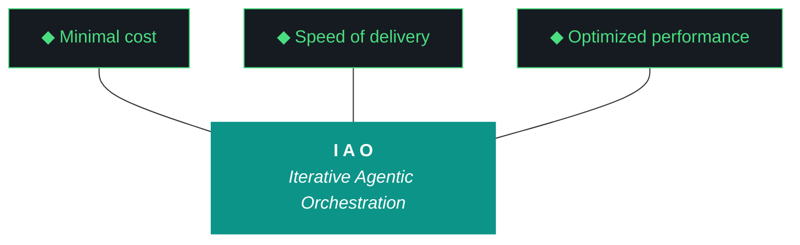

# iao — Design 0.1.3

**Iteration:** 0.1.3.0 (phase.iteration.run — `.0` = planning draft)
**Phase:** 0 (NZXT-only authoring)
**Phase position:** Third authored iteration of Phase 0, first iteration with hardened Qwen artifact loop
**Date:** April 09, 2026
**Repo:** ~/dev/projects/iao (local only — Phase 0 has no remote)
**Machine:** NZXTcos
**Wall clock target:** ~6–8 hours, soft cap (no hard cap)
**Run mode:** Bounded sequential, split-agent (Gemini W0–W5, Claude Code W6–W7)
**Significance:** Bundle quality hardening, folder consolidation, src-layout refactor, universal pipeline scaffolding, human feedback loop, Phase 0 charter retrofit. Last iteration whose canonical design+plan are authored in chat — from 0.1.4 onward, the Qwen loop owns canonical artifact production and the chat reverts to forensic debugging only.

---

## What is iao

(Novice-operability constraint, iaomw-Pattern-32 candidate — every iao artifact opens with this.)

**iao** (Iterative Agentic Orchestration) is a methodology and Python package for running disciplined LLM-driven engineering iterations. It treats the harness — pre-flight checks, post-flight gates, artifact templates, gotcha registry, evaluator — as the primary product, and the executing model (Claude, Gemini, Qwen) as the engine. The methodology was developed inside `kjtcom`, a location-intelligence platform, and graduated to a standalone Python package during kjtcom Phase 10. iao is currently in Phase 0 — single-machine authoring on NZXT — and will graduate to Phase 1 (multi-engineer onboarding) when iao 0.6.x ships to the public soc-foundry/iao GitHub organization.

A junior engineer reading this document should know that iao is a *system for getting LLM agents to ship working software without supervision*, and that iao 0.1.3 hardens that system against the failure modes that surfaced in iao 0.1.2 — a bundle that shipped at 3.2 KB instead of 600 KB, three docs locations instead of one, and an artifact loop whose only success criterion was "the file exists."

---

## §1. Phase 0 Charter (Pattern-31 retrofit)

**Phase:** 0 — NZXT-only authoring
**Status:** active
**Charter author:** iao planning chat (retroactive — Phase 0 was not formally chartered when it began at iao 0.1.0)
**Charter version:** 0.1
**Charter date:** 2026-04-09

### Why This Phase Exists

iao was extracted from kjtcom during kjtcom Phase 10. Before iao can be delivered to other engineers and other machines, it has to mature on a single workstation under a single author. Phase 0 is that maturation period. It exists so that the methodology can dogfood itself, surface its own failure modes, and harden its harness against those failures *before* anyone else has to install it. Phase 0 ends when iao is publishable to the public soc-foundry/iao GitHub organization at 0.6.x — a state where a fresh machine can `git clone`, run `install.fish`, and have a working iao environment without the original author intervening.

### Phase Objectives

1. Establish secrets architecture (achieved 0.1.2)
2. Establish artifact loop with Qwen as primary author (scaffolded 0.1.2, hardened 0.1.3)
3. Establish folder layout, naming, and harness conventions (0.1.3)
4. Establish pipeline scaffolding pattern reusable by consumer projects (0.1.3)
5. Establish human feedback mechanism that seeds the next iteration from the previous run's notes (0.1.3)
6. Establish bundle quality gates that prevent existence-only success (0.1.3)
7. Establish telegram framework, global MCP install, ambient agent briefings (0.1.4)
8. Establish cross-platform installer for fish/bash/PowerShell/macOS (0.1.4)
9. Validate iao can produce production-quality artifacts via Qwen loop without chat-authored bootstrap (0.1.5)
10. Reach a state where iao is publishable to soc-foundry/iao (0.6.x — phase exit)

### Phase Entry Criteria (where Phase 0 began)

- iao extracted from kjtcom via kjtcom Phase 10 (achieved kjtcom 10.69.1)
- iao package installable via `pip install -e iao/` (achieved kjtcom 10.66)
- iao authoring environment exists at `~/dev/projects/iao` (achieved kjtcom 10.69.1 W6)
- Pattern-31 (formal phase chartering) added to base.md (achieved kjtcom 10.69.1 W4)
- iao 0.1.0 shipped as broken rc1 to surface 12 findings against a real install
- iao 0.1.2 shipped with secrets + kjtcom strip + Qwen loop scaffolding (graduated with conditions)

### Phase Exit Criteria (Graduation Conditions)

- [x] iao installable as Python package on NZXT — achieved 0.1.0
- [x] Secrets architecture (age + OS keyring) functional — achieved 0.1.2 W1
- [x] kjtcom methodology code migrated into iao authoring location — achieved 0.1.2 W5
- [x] Qwen artifact loop scaffolded end-to-end — achieved 0.1.2 W6
- [ ] Bundle quality gates enforced (size + section completeness + content checks) — 0.1.3 W3
- [ ] Folder layout consolidated to single `docs/` root matching kjtcom convention — 0.1.3 W1
- [ ] Python package on src-layout (`src/iao/` not `iao/iao/`) — 0.1.3 W2
- [ ] Universal pipeline scaffolding pattern with `iao pipeline init` CLI — 0.1.3 W4
- [ ] Human feedback loop with run report + Kyle's notes seed mechanism — 0.1.3 W5
- [ ] README on kjtcom structure with all 10 pillars + trident — 0.1.3 W6
- [ ] Phase 0 charter committed to design history (this document is the W6 deliverable) — 0.1.3 W6
- [ ] Qwen loop produces production-weight artifacts (design ≥ 25 KB, plan ≥ 25 KB, build log ≥ 15 KB, report ≥ 10 KB, bundle ≥ 100 KB) — 0.1.3 W7
- [ ] Telegram framework + global MCP install + ambient agent briefings — 0.1.4
- [ ] Cross-platform installer (fish/bash/zsh/PowerShell) — 0.1.4
- [ ] Novice operability validation pass (junior engineer reads design cold, can summarize) — 0.1.5
- [ ] Buffer iterations 0.2.x–0.5.x consumed if needed
- [ ] iao 0.6.x ships to soc-foundry/iao public repo — Phase 0 graduates

### Iterations Planned in Phase 0

| Iteration | Scope | Status |
|---|---|---|
| 0.1.0 | broken rc1, surfaced 12 findings | shipped |
| 0.1.2 | secrets, kjtcom strip, RAG migration, Qwen loop scaffold | graduated with conditions (existence-only success criterion) |
| 0.1.3 | bundle quality gates, folder consolidation, src-layout, pipeline scaffolding, human feedback loop, README sync, Phase 0 charter retrofit | **planning (this iteration)** |
| 0.1.4 | telegram framework, MCP global install, ambient agent briefings, cross-platform installer | planned |
| 0.1.5 | integration polish, novice operability validation | planned |
| 0.2.x–0.5.x | buffer iterations for unanticipated work | reserved |
| 0.6.x | soc-foundry/iao first push | planned (Phase 0 exit) |
| 0.7.x | tachtech-engineering/iao production fork | planned (transitions to Phase 1) |

After 0.6.x graduates, Phase 0 closes and Phase 1 begins. Phase 1 onboards iao to additional machines (P3 first, then Luke's Arch, Alex's Arch, Max's macOS, Kyle's Windows, David's Windows) and validates cross-platform compatibility. The harness, artifact loop, and feedback mechanism established in Phase 0 are inherited unchanged.

### Current Iteration Position

**Currently executing:** 0.1.3.0 (this planning draft)
**Iterations completed in this phase:** 0.1.0, 0.1.2
**Iterations remaining in Phase 0:** 0.1.3, 0.1.4, 0.1.5, buffer 0.2.x–0.5.x, 0.6.x
**Phase progress:** 2 of ~7 planned iterations complete (early phase)

### Phase Charter Revision History

| Version | Date | Iteration | Change |
|---|---|---|---|
| 0.1 | 2026-04-09 | 0.1.3.0 | Retroactive charter for Phase 0 (W6 commits this to history) |

---

## §2. Why 0.1.3 Exists

iao 0.1.2 shipped, and on every objective measure it succeeded. All seven workstreams completed. The split-agent execution model worked end-to-end. The Qwen artifact loop ran without intervention. By the success criteria the bootstrap session set, the iteration graduated.

But the bootstrap session set the wrong success criteria.

W7's success criterion was **"existence-only"** — Qwen had to produce a file at the right path with the right name, and that was enough. The actual content was deferred to "quality validation comes in iao 0.1.3." That deferral has now arrived and the bill is large:

1. **The 0.1.2 bundle is 3.2 KB.** kjtcom's bundle at 10.69.1 is 616 KB. The reference implementation produces a bundle that is two orders of magnitude heavier than what iao's own loop produces, against essentially the same harness. The bundle is supposed to be a complete forensic recovery package — every artifact, every harness file, every config, every relevant log tail — and at 3.2 KB it is functionally a stub index. A junior engineer trying to debug a failed iao iteration from the bundle alone would have nothing to work with.

2. **The bundle has no specification.** base.md (the universal harness file) defines the trident, the 10 pillars, ADRs, and patterns. It does not say what a bundle should contain. kjtcom's bundle has 20 sections (§1 Design through §20 Environment); none of those 20 sections are mentioned anywhere in iao's universal harness. Qwen could not produce a 600 KB bundle in 0.1.2 because Qwen had no template that demanded one.

3. **The 0.1.2 build log, report, and bundle are all 3–4 KB.** They are also Qwen output. They are also stubs. The pattern is consistent: when the success criterion is "the file exists," the file exists and contains the minimum text required to be called a file. This is not a Qwen failure. It is a specification failure.

4. **The folder layout has three docs locations.** `iao/artifacts/docs/iterations/`, `iao/docs/`, and `iao/iao/docs/harness/` (the third is empty). There is no consistent rule for where things go. kjtcom uses a single `docs/` root with subdirectories (`docs/archive/`, `docs/phase-charters/`, `docs/drafts/`, `docs/cross-project/`). iao should match.

5. **The Python package layout is `iao/iao/`.** A package whose import name shadows its repo name produces ambiguous tooling, confusing imports, and a directory structure where `cd iao/iao` is a sentence that means something. Modern Python convention is src-layout: `iao/src/iao/`. The longer this is delayed, the more code references have to be rewritten when it eventually happens.

6. **There is no pipeline scaffolding in the universal harness.** Every iao consumer project has *some* pipeline shape — kjtcom transcribes YouTube audio, tripledb migrates Firestore data, future projects will scrape PDFs, ingest CSVs, run OCR over scanned books. The canonical 10-phase pipeline pattern exists *only* inside kjtcom's project-specific scripts. New consumer projects have no template to copy. iao cannot be delivered to other engineers without this.

7. **There is no human feedback loop.** When an iteration completes, there is no mechanism for the human to write down what they want changed, no place for the agent to ask Kyle questions after the fact, no way to seed the next iteration from the previous run's notes. The current loop is: iteration runs, Kyle reads everything in chat, Kyle types the next iteration's design from scratch. This is precisely the workflow Kyle has now said must end — *"this chat session... should no longer be the primary plan and design creator."*

8. **The 10 pillars and trident are not enforced in iao's own artifacts.** Both the Claude bootstrap design and the Qwen dogfood design for 0.1.2 omitted the pillars block entirely. The harness rule that every kjtcom design doc must contain the trident mermaid + 10 pillars verbatim does not extend to iao itself, even though iao is the project that *defines* that rule.

9. **The README is frozen.** The current iao README has not been updated since 0.1.0. It does not reflect the secrets architecture, the artifact loop, the kjtcom strip, the W6 deliverables. README staleness is the most visible form of project rot, and there is currently no mechanism to detect or prevent it.

10. **Phase 0 has no charter.** Pattern-31 (formal phase chartering) was added to base.md at kjtcom 10.69 W4, and the rule says every phase must begin with a formal charter in design §1. iao itself is currently violating this rule. The retroactive charter for Phase 0 lives in §1 of *this* document and gets committed to `docs/phase-charters/iao-phase-0.md` in W6.

0.1.3 exists to close all ten of these debts in one iteration so that 0.1.4 can focus on real new functionality (telegram, MCP, cross-platform installer) without dragging structural debt forward.

---

## §3. The Trident (locked, iaomw-Pillar-1)



---

## §4. The Ten Pillars (locked, iaomw-Pillar-1 through iaomw-Pillar-10)

1. **iaomw-Pillar-1 (Trident)** — Cost / Delivery / Performance triangle governs every decision.
2. **iaomw-Pillar-2 (Artifact Loop)** — design → plan → build → report → bundle. Every iteration produces all five.
3. **iaomw-Pillar-3 (Diligence)** — First action: `iao registry query "<topic>"`. Read before you code.
4. **iaomw-Pillar-4 (Pre-Flight Verification)** — Validate the environment before execution. Pre-flight failures block launch.
5. **iaomw-Pillar-5 (Agentic Harness Orchestration)** — The harness is the product; the model is the engine.
6. **iaomw-Pillar-6 (Zero-Intervention Target)** — Interventions are failures in planning. The agent does not ask permission.
7. **iaomw-Pillar-7 (Self-Healing Execution)** — Max 3 retries per error with diagnostic feedback. Pattern-22 enforcement.
8. **iaomw-Pillar-8 (Phase Graduation)** — Formalized via MUST-have deliverables + Qwen graduation analysis. Pattern-31 chartering.
9. **iaomw-Pillar-9 (Post-Flight Functional Testing)** — Build is a gatekeeper. Existence checks are necessary but insufficient (ADR-009).
10. **iaomw-Pillar-10 (Continuous Improvement)** — Run report → Kyle's notes → next iteration design seed. Feedback loop is first-class.

---

## §5. Project State Going Into 0.1.3

### iao package state (from 0.1.2 close)

- Python package: `iao/iao/` with subpackages `artifacts/`, `data/`, `install/`, `integrations/`, `postflight/`, `preflight/`, `rag/`, `secrets/`
- CLI entry point: `iao` via `bin/iao` and pyproject.toml entry_points
- Version: 0.1.0 in `VERSION` file (will bump to 0.1.3 in W0)
- 8 test files in `tests/` (test_artifacts_loop, test_doctor, test_harness, test_migrate_config_fish, test_paths, test_preflight, test_secrets_backends, test_secrets_cli)
- Prompts directory: 6 Jinja2 templates (`design.md.j2`, `plan.md.j2`, `build-log.md.j2`, `report.md.j2`, `bundle.md.j2`, `_shared.md.j2`)
- Templates directory: phase-charter-template.md, systemd subdirectory
- Data directory: `gotcha_archive.json` (no script_registry.json yet)
- Docs (three locations, all consolidating in W1):
  - `artifacts/docs/iterations/` — iteration outputs
  - `docs/{adrs,harness,roadmap}/` — project docs
  - `iao/iao/docs/harness/` — empty third location
- Install: `install.fish` (W4 version from 0.1.2), `install.fish.v10.66.backup`, `install-old.fish`
- Compatibility: `COMPATIBILITY.md`, `MANIFEST.json`, `projects.json`
- Active iao projects: `iaomw` (this), `kjtco`, `tripl` (per 0.1.2 W4 registration)

### Active iao consumer projects

| Code | Name | Path | Purpose |
|---|---|---|---|
| iaomw | iao | ~/dev/projects/iao | The middleware itself (this project) |
| kjtco | kjtcom | ~/dev/projects/kjtcom | Reference implementation, steady state |
| tripl | tripledb | ~/dev/projects/tripledb | TachTech SIEM migration project |

### Known debts entering 0.1.3

| Debt | Origin | Closes in |
|---|---|---|
| Bundle is 3.2 KB instead of ~100+ KB | 0.1.2 W7 existence-only criterion | 0.1.3 W3 |
| Build log, report, bundle templates have no §1–§20 structure | 0.1.2 W6 scaffolding scope | 0.1.3 W3 |
| Three docs locations | 0.1.2 W4 + W6 mixed conventions | 0.1.3 W1 |
| `iao/iao/` package layout shadows repo name | inherited from kjtcom 10.66 extraction | 0.1.3 W2 |
| No pipeline scaffolding in universal harness | never authored | 0.1.3 W4 |
| No human feedback mechanism | never authored | 0.1.3 W5 |
| README frozen since 0.1.0 | no sync mechanism | 0.1.3 W6 |
| 10 pillars not enforced in iao's own artifacts | template gap | 0.1.3 W3 + W6 |
| Phase 0 has no formal charter | predates Pattern-31 | 0.1.3 W6 (this document is the deliverable) |
| ADR-012 immutability vs W7 dual-artifact contradiction | 0.1.2 Open Q5 unresolved | 0.1.3 W3 (ADR-012 wins) |

### What is NOT changing in 0.1.3

- **Secrets architecture stays** — age + OS keyring as established in 0.1.2 W1. No rotation or backend changes.
- **kjtcom is not touched** — kjtcom is in steady state per kjtcom 10.69.1. No migrations into or out of kjtcom.
- **Telegram bot stays on bot.env** — Path C deferral from 0.1.2. Migration to iao secrets is iao 0.1.X+ work, not 0.1.3.
- **MCP architecture is not installed globally** — that is iao 0.1.4 W-something. 0.1.3 leaves the kjtcom `.mcp.json` source-of-truth alone.
- **Cross-platform installer is not written** — 0.1.4 deliverable.
- **Pillar 0 is absolute** — neither Claude Code nor Gemini CLI commits or pushes anything. All git operations are manual by Kyle.

---

## §6. Workstreams (W0–W7)

### W0 — Iteration Bookkeeping

**Goal:** Update iao's own metadata to reflect 0.1.3 in flight.

**Deliverables:**
- `.iao.json` `current_iteration` updated from `0.1.2` to `0.1.3.1`
- `.iao.json` `phase` field set to `0` (currently absent)
- `VERSION` file updated from `0.1.0` to `0.1.3`
- `.iao-checkpoint.json` initialized with W0–W7 status fields
- `IAO_ITERATION=0.1.3.1` exported in the launch shell

**Dependencies:** None (W0 is the entry point).

**Agent owner:** Gemini CLI.

**Acceptance checks:**
- `iao --version` returns `0.1.3`
- `cat .iao.json | jq .current_iteration` returns `"0.1.3.1"`
- `cat .iao.json | jq .phase` returns `0`
- Logger picks up new iteration on the first write

**Wall clock target:** 5 min.

---

### W1 — Folder Consolidation (kjtcom-style flat docs/)

**Goal:** Eliminate the three-docs-locations problem. Establish a single `docs/` root that matches kjtcom convention exactly.

**Current (broken) layout:**
```
iao/
├── artifacts/docs/iterations/      ← iteration outputs
├── docs/{adrs,harness,roadmap}/    ← project docs
└── iao/iao/docs/harness/           ← empty third location
```

**Target layout:**
```
iao/
├── docs/
│   ├── iterations/                 ← all iao iteration outputs (was artifacts/docs/iterations/)
│   │   ├── 0.1.0/
│   │   ├── 0.1.2/
│   │   └── 0.1.3/
│   ├── adrs/                       ← unchanged
│   ├── harness/                    ← unchanged
│   ├── roadmap/                    ← unchanged
│   ├── phase-charters/             ← NEW (W6 writes iao-phase-0.md here)
│   ├── archive/                    ← NEW (parallel to kjtcom docs/archive/)
│   └── drafts/                     ← NEW (parallel to kjtcom docs/drafts/)
└── (no artifacts/ directory at all — deleted)
└── (no iao/iao/docs/ — deleted)
```

**Deliverables:**
- `git mv` (from Kyle's terminal manually, or `mv` then Kyle commits) of `artifacts/docs/iterations/` → `docs/iterations/` (the agent does the `mv`; Kyle does the `git add -A` and commit per Pillar 0)
- `rmdir iao/iao/docs/harness && rmdir iao/iao/docs` (empty)
- `rmdir artifacts/docs && rmdir artifacts` (after iterations moved)
- `mkdir -p docs/{phase-charters,archive,drafts}`
- Update `iao/iao/paths.py` to point at `docs/iterations/<version>/` instead of `artifacts/docs/iterations/<version>/`
- Update `iao/iao/bundle.py` to read from new path
- Update `iao/iao/postflight/artifacts_present.py` to check new path
- Update `iao/iao/postflight/iteration_complete.py` to check new path
- Update prompts in `prompts/*.j2` if any reference old path
- Grep entire codebase for `artifacts/docs` references and update each
- Run all tests, fix any path-related failures

**Dependencies:** None — W1 is structural and runs first.

**Agent owner:** Gemini CLI.

**Acceptance checks:**
- `find ~/dev/projects/iao -type d -name docs` returns exactly one path: `~/dev/projects/iao/docs`
- `find ~/dev/projects/iao -name "iao-design-0.1.2*"` returns files under `docs/iterations/0.1.2/`, not `artifacts/docs/iterations/0.1.2/`
- `pytest tests/test_paths.py` passes
- `iao bundle --dry-run` reads from new location
- `grep -r "artifacts/docs" iao/ prompts/ tests/ docs/` returns zero matches outside this design doc

**Wall clock target:** 45 min.

---

### W2 — src-layout Refactor (`iao/iao/` → `iao/src/iao/`)

**Goal:** Move the Python package from flat layout to src-layout. Eliminates the `iao/iao/` ambiguity, brings the project in line with modern Python convention, and de-couples import path from repo root.

**Current (broken) layout:**
```
iao/
├── iao/                ← Python package (shadows repo root)
│   ├── __init__.py
│   ├── cli.py
│   ├── ... (everything)
├── pyproject.toml
└── iao.egg-info/
```

**Target layout:**
```
iao/
├── src/
│   └── iao/            ← Python package (no name collision)
│       ├── __init__.py
│       ├── cli.py
│       ├── ... (everything)
├── pyproject.toml      ← updated [tool.setuptools.packages.find] where = ["src"]
└── src/iao.egg-info/   ← regenerated under src/
```

**Deliverables:**
- `mv iao/iao iao/src/iao` (Kyle does the git rename via `git mv` post-hoc; the agent does the filesystem move)
- Update `pyproject.toml`:
  - Add `[tool.setuptools.packages.find]` with `where = ["src"]`
  - Update any `package-dir` or path references
- `rm -rf iao.egg-info` and reinstall: `pip install -e . --break-system-packages`
- Verify: `python -c "import iao; print(iao.__file__)"` returns a path under `src/`
- Verify: `iao --version` still returns `0.1.3`
- Run full test suite: `pytest tests/`
- Update `.iao.json` if it has any path references (it shouldn't)
- Update bin/iao if needed
- Update `MANIFEST.json` to reflect new file paths
- Update `COMPATIBILITY.md` to note src-layout as 0.1.3 change
- Add new gotcha to registry: `iaomw-G104` "Flat-layout Python package shadows repo name" with action "Use src-layout from project start; refactor early if inherited"

**Dependencies:** W1 (folder paths must be settled before src-layout move so the two refactors don't fight each other).

**Agent owner:** Gemini CLI.

**Acceptance checks:**
- `find ~/dev/projects/iao/iao -type f` returns nothing (or fails — directory doesn't exist)
- `find ~/dev/projects/iao/src/iao -name "__init__.py" | wc -l` returns at least 8 (one per subpackage)
- `pip show iao` shows install location under `src/`
- `pytest tests/` passes (all 8+ test files)
- `iao --help` lists all subcommands
- `iao doctor` runs clean

**Wall clock target:** 40 min.

---

### W3 — Universal Bundle Spec + Quality Gates

**Goal:** Make Qwen physically unable to ship a 3.2 KB bundle ever again. Hoist the §1–§20 bundle structure from kjtcom into base.md as a universal harness rule. Add bundle quality gates to post-flight that block "complete" outcome on undersized or incomplete bundles.

**Deliverables:**

**3.1 — base.md additions:**
- New `iaomw-ADR-028: Universal Bundle Specification` with the §1–§20 section list:
  - §1 Design (verbatim copy of design doc)
  - §2 Plan (verbatim copy of plan doc)
  - §3 Build Log (verbatim copy)
  - §4 Report (verbatim copy)
  - §5 Harness (base.md + project.md verbatim)
  - §6 README (verbatim)
  - §7 CHANGELOG (verbatim)
  - §8 CLAUDE.md (verbatim)
  - §9 GEMINI.md (verbatim)
  - §10 .iao.json (verbatim)
  - §11 Sidecars (any project-specific config files)
  - §12 Gotcha Registry (full gotcha_archive.json)
  - §13 Script Registry (full script_registry.json if exists)
  - §14 iao MANIFEST (MANIFEST.json)
  - §15 install.fish (verbatim)
  - §16 COMPATIBILITY (verbatim)
  - §17 projects.json (verbatim)
  - §18 Event Log (tail 500 lines of iao_event_log.jsonl)
  - §19 File Inventory (sha256_16 of every file in src/iao/)
  - §20 Environment (Python version, ollama models, OS, hardware summary)
- New `iaomw-ADR-029: Bundle Quality Gates` defining minimum content checks per section
- New `iaomw-ADR-012-amendment` clarifying that ADR-012 (artifact immutability) extends to iao itself: design and plan are immutable inputs once W0 completes; only build log, report, and bundle are produced by execution. Resolves the 0.1.2 Open Question 5 contradiction in favor of immutability.
- New `iaomw-Pattern-32: Existence-Only Success Criteria Mask Quality Failures` documenting the 0.1.2 W7 failure mode
- New `iaomw-G104: Existence-Only Acceptance Criteria` in gotcha registry

**3.2 — bundle.py rewrite:**
- `iao/src/iao/bundle.py` rewritten to enforce the §1–§20 spec
- New `BundleSpec` class with section definitions, minimum sizes, and content validators
- `iao bundle build` command produces a bundle conforming to the spec
- `iao bundle validate <path>` command validates an existing bundle against the spec
- Returns nonzero exit code on any validation failure

**3.3 — Bundle template rewrite:**
- `prompts/bundle.md.j2` rewritten to render all 20 sections
- Each section is a Jinja loop over the actual file content (not a Qwen-generated summary)
- Bundle is mechanical aggregation, not LLM synthesis (Qwen does not "write" the bundle, the iao package assembles it from real files)

**3.4 — Post-flight check:**
- New `iao/src/iao/postflight/bundle_quality.py`:
  - Checks bundle exists at expected path
  - Checks bundle file size ≥ 50 KB (sanity floor)
  - Checks bundle contains all 20 section headers (`## §1.` through `## §20.`)
  - Checks each section is non-empty (next `## §` heading at least 200 chars after current)
  - Checks design and plan sections each contain ≥ 3000 chars
  - Checks build log section contains at least one entry per declared workstream
  - Checks report section contains a workstream scores table
  - Returns FAIL with specific section listing on any check failure
- Wired into `iao doctor postflight`

**3.5 — design.md.j2 template hardening:**
- Add §3 Trident mermaid block (verbatim from base.md) to required sections
- Add §4 Ten Pillars (verbatim from base.md) to required sections
- Add minimum word count: 5000 words (Qwen will be prompted to expand if under)
- Add `phase_charter_required: true` flag — if `.iao.json.iteration_position` indicates this is the first iteration of a new phase, §1 must be a Phase Charter

**3.6 — plan.md.j2 template hardening:**
- Add minimum word count: 3000 words
- Required sections: pre-flight checklist, launch protocol, per-workstream details, post-flight checklist, rollback procedure

**3.7 — build-log.md.j2 template hardening:**
- Required sections: pre-flight, discrepancies, per-workstream entries (one per declared W), files changed, files created, files deleted, wall clock log, deliverables verification, exit criteria verification, graduation recommendation, what could be better, next iteration candidates
- Minimum word count: 2000 words

**3.8 — report.md.j2 template hardening:**
- Required sections: summary, workstream scores table (#, Workstream, Priority, Outcome, Score, Evidence), trident grading, what could be better, per-workstream details
- Workstream scores table is mandatory — empty table is a validation failure
- Minimum word count: 1500 words

**Dependencies:** W1 (paths settled), W2 (src-layout settled before bundle.py rewrite).

**Agent owner:** Gemini CLI.

**Acceptance checks:**
- `iao bundle build --version 0.1.3.1 --dry-run` produces a bundle skeleton with all 20 sections
- `iao bundle validate <path>` exits 0 on a passing bundle, nonzero on a failing one
- `pytest tests/test_bundle.py` passes (new test file added in this workstream)
- base.md grep returns matches for `iaomw-ADR-028`, `iaomw-ADR-029`, `iaomw-Pattern-32`
- `iao doctor postflight` includes `bundle_quality` in the check list

**Wall clock target:** 90 min.

---

### W4 — Universal Pipeline Scaffolding

**Goal:** Establish the canonical 10-phase pipeline pattern as a first-class iao primitive. Consumer projects can run `iao pipeline init <name>` to scaffold a new pipeline that conforms to the pattern. Eliminates the gap where every consumer project has to invent its own pipeline structure from scratch.

**Background:** kjtcom defines the 10-phase pipeline pattern (Phase 1 extraction → Phase 2 transcription → Phase 3 normalization → Phase 4 enrichment → Phase 5 production run → Phase 6 frontend → Phase 7 production load → Phase 8 hardening → Phase 9 optimization → Phase 10 retrospective). This pattern is project-specific in name but universal in shape: every iao consumer has *some* multi-phase pipeline. The phases are abstract (extract → transform → load → validate → ship → retrospect) and the universal harness should ship this pattern as a template.

**Deliverables:**

**4.1 — New subpackage `iao/src/iao/pipelines/`:**
- `__init__.py`
- `pattern.py` — defines `PipelinePattern` class with the 10-phase abstract structure
- `scaffold.py` — implements `iao pipeline init <name>` logic
- `validate.py` — implements `iao pipeline validate` (checks an existing pipeline conforms to pattern)
- `registry.py` — tracks which pipelines exist in the consumer project

**4.2 — New CLI subparser `iao pipeline`:**
- `iao pipeline init <name>` — scaffolds a new pipeline at `pipelines/<name>/` in the consumer project
- `iao pipeline list` — lists all pipelines in the current project
- `iao pipeline validate [<name>]` — validates one or all pipelines against the pattern
- `iao pipeline status [<name>]` — shows current phase + checkpoint status

**4.3 — New template directory `templates/pipelines/`:**
- `templates/pipelines/skeleton/` containing:
  - `phase1_extract.py.template`
  - `phase2_transcribe.py.template` (or `phase2_transform.py.template` for non-audio)
  - `phase3_normalize.py.template`
  - `phase4_enrich.py.template`
  - `phase5_production_run.py.template`
  - `phase6_frontend.py.template`
  - `phase7_production_load.py.template`
  - `phase8_hardening.py.template`
  - `phase9_optimization.py.template`
  - `phase10_retrospective.py.template`
  - `checkpoint.json.template`
  - `README.md.template`
- Each template is a real Python file with a top-level docstring, a `main()` function, a checkpoint read/write pattern, and a TODO marker for project-specific logic

**4.4 — New harness doc `docs/harness/pipeline-pattern.md`:**
- Describes the 10-phase pattern in abstract terms
- Maps kjtcom's concrete pipeline implementations onto each phase
- Shows how a non-kjtcom project (e.g., a PDF book OCR pipeline) maps onto the pattern
- Lists the universal pre/post-flight checks that apply to every pipeline regardless of content

**4.5 — New post-flight check `pipeline_present.py`:**
- For projects with `pipelines: true` in `.iao.json`, verifies at least one pipeline exists in `pipelines/`
- Validates each pipeline against the pattern
- Returns SKIP if `.iao.json` does not declare pipelines (iao itself, for example)

**4.6 — base.md addition:**
- New `iaomw-ADR-030: Universal Pipeline Pattern` documenting the 10-phase abstract structure as a harness primitive

**Dependencies:** W2 (src-layout settled — new subpackage goes under `src/iao/pipelines/`).

**Agent owner:** Gemini CLI.

**Acceptance checks:**
- `iao pipeline --help` lists all four subcommands
- `iao pipeline init test_pipeline --dry-run` produces a 10-phase scaffold preview
- In a temp directory: `iao pipeline init demo` creates `pipelines/demo/` with all 10 phase files
- `iao pipeline validate demo` returns clean
- `pytest tests/test_pipelines.py` passes (new test file)
- `docs/harness/pipeline-pattern.md` exists and is non-trivial (≥ 1500 words)

**Wall clock target:** 90 min.

---

### W5 — Human Feedback Loop + Run Report

**Goal:** Establish the mechanism that lets the iteration close with a real human-in-the-loop checkpoint. Replaces the current workflow ("Kyle reads everything in chat, types next iteration design from scratch") with a structured run report that contains a workstream summary table, agent questions for Kyle, and a "Kyle's notes for next iteration" section that seeds the next iteration design when Qwen generates it.

**This workstream is the architectural answer to Kyle's complaint #4 from the planning session.**

**Deliverables:**

**5.1 — New subpackage `iao/src/iao/feedback/`:**
- `__init__.py`
- `run_report.py` — generates the run report artifact
- `seed.py` — reads the previous run report's "Kyle's notes" section and produces a seed file for the next iteration's design generation
- `summary.py` — produces the stdout workstream summary table at iteration close
- `prompt.py` — handles the interactive close prompts

**5.2 — Run Report artifact (new artifact type):**

The Run Report is a new canonical artifact that sits between Report and Bundle in the loop. It is the *operational* document the human reviews at session close, distinct from the Report (which is the evaluator's audit) and the Bundle (which is the forensic recovery package).

Run Report structure:
```markdown
# iao — Run Report 0.1.3.1

**Iteration:** 0.1.3.1
**Date:** 2026-04-09
**Wall clock:** 6h 45min
**Human reviewer:** Kyle Thompson

## Workstream Summary

| W | Workstream | Outcome | Wall Clock | Score | Notes |
|---|---|---|---|---|---|
| W0 | Iteration Bookkeeping | complete | 5 min | 10/10 | clean |
| W1 | Folder Consolidation | complete | 42 min | 9/10 | one paths.py reference missed, fixed in retry |
| ... | ... | ... | ... | ... | ... |

## Agent Questions for Kyle

(The agent populates this section with anything that came up during execution that needed a human decision but was deferred.)

1. During W4, the pipeline scaffolding template assumed that Phase 2 is always transcription. Should the abstract pattern instead use generic verbs (extract/transform/load) and let consumers specialize?
2. ...

## Forensic Issues Surfaced

(Anything in the bundle worth investigating before the next iteration.)

## Kyle's Notes for Next Iteration

(EMPTY — Kyle fills this in during review. These notes seed the next iteration's design when Qwen generates it via `iao iteration design`.)

> _Kyle types thoughts, requirements, scope changes here. The Qwen artifact loop reads this section when generating the next design doc and includes it as input context._

## Kyle's Answers to Agent Questions

(EMPTY — Kyle fills this in. Each answer is paired with the question above by number.)

## Sign-off

- [ ] I have reviewed the bundle
- [ ] I have answered the agent's questions
- [ ] I am ready to launch the next iteration

(Kyle ticks the boxes by editing the file before running `iao iteration close --confirm`.)
```

**5.3 — New CLI commands:**
- `iao iteration close` — generates the run report, prints the workstream summary table to stdout, generates the bundle, prints the bundle path and size, then prints "Open the run report at <path>, fill in your notes, then run `iao iteration close --confirm` to finalize"
- `iao iteration close --confirm` — reads the run report, validates that the sign-off boxes are checked, marks the iteration complete in `.iao.json`, increments to the next iteration version
- `iao iteration seed` — reads the previous iteration's run report and produces a seed JSON for the next iteration's design generation (Qwen reads this seed as input context)

**5.4 — New post-flight check `run_report_complete.py`:**
- Verifies a run report exists at `docs/iterations/<version>/iao-run-report-<version>.md`
- Verifies the workstream summary table is populated (at least one row per declared W)
- Returns DEFERRED (not FAIL) if "Kyle's Notes" section is empty — that's expected at first close, only required for `--confirm`

**5.5 — base.md addition:**
- New `iaomw-Pillar-10` reframing: pillar 10 was previously "Continuous Improvement" with vague "iao push feedback loop." Reframe to: "Run Report → Kyle's notes → seed next iteration design. Feedback loop is first-class artifact, not optional."
- New `iaomw-ADR-031: Run Report as Canonical Artifact` documenting the new artifact type
- New `iaomw-ADR-032: Human Sign-off Required for Iteration Close` documenting the `--confirm` requirement

**5.6 — prompts/run-report.md.j2:**
- New Jinja template for the run report
- Rendered by `iao iteration close` (not by Qwen — this is mechanical assembly from the build log + report + bundle metadata)

**Dependencies:** W2 (src-layout), W3 (bundle spec — run report references bundle path).

**Agent owner:** Gemini CLI for scaffolding (5.1, 5.6), Claude Code for the interactive prompt logic (5.3) — actually, all of W5 is Gemini because the prompt logic is straightforward Python click/typer code, not artifact generation. Reassigning to Gemini.

**Agent owner:** Gemini CLI.

**Acceptance checks:**
- `iao iteration close --dry-run` (in 0.1.3.1 directory) generates a run report skeleton at the expected path
- `iao iteration close` prints the workstream summary table to stdout
- `iao iteration close --confirm` fails if sign-off boxes are unchecked, succeeds if they are
- `iao iteration seed` reads the previous run report and produces a seed JSON
- `pytest tests/test_feedback.py` passes (new test file)
- Run report file at `docs/iterations/0.1.3/iao-run-report-0.1.3.1.md` exists at iteration close

**Wall clock target:** 75 min.

---

### W6 — README Sync + Phase 0 Charter Retrofit + 10 Pillars Enforcement

**Goal:** Bring iao's own README into compliance with the kjtcom convention (trident, 10 pillars, component review, data architecture, etc.). Commit the Phase 0 charter to canonical history. Add post-flight checks that enforce 10 pillars + trident presence in design docs and README on every iteration.

**Deliverables:**

**6.1 — README rewrite:**
- New `README.md` modeled on kjtcom's README structure:
  - Hero paragraph (what is iao, novice-operability)
  - Status line (current phase, current iteration, current state)
  - Trident mermaid block (verbatim from base.md)
  - The Ten Pillars of IAO (verbatim from base.md, numbered list with bold names)
  - "What iao Does" section (the harness is the product, the model is the engine)
  - Component Review (chip count for iao itself — secrets backend, artifact loop, pipeline scaffold, post-flight, pre-flight, run report, bundle, etc.)
  - Architecture (Python package layout, CLI surface, harness file locations)
  - Active iao Projects (table: iaomw, kjtco, tripl + paths)
  - Phase 0 Status (current phase from charter, exit criteria checklist)
  - Roadmap (link to docs/roadmap/iao-roadmap-phase-0-and-1.md)
  - Installation (`pip install -e .` for now, network-pull installer in 0.1.4)
  - Contributing (Phase 0 is single-author, contributions reopen at 0.6.x)
  - License

**6.2 — Phase 0 charter committed to history:**
- Copy §1 of this design doc into `docs/phase-charters/iao-phase-0.md`
- Add front-matter: phase number, charter version, charter date, iteration where charter was written
- This is the canonical phase charter location going forward; design doc §1 references it

**6.3 — Post-flight check `ten_pillars_present.py`:**
- For each design doc in `docs/iterations/<current_version>/`:
  - Verify §3 contains the trident mermaid block (grep for `graph BT` and `IAO\["<b>I A O</b>`)
  - Verify §4 contains all 10 pillars (grep for `iaomw-Pillar-1` through `iaomw-Pillar-10`)
  - Returns FAIL if any are missing
- For `README.md`:
  - Verify it contains the trident mermaid block
  - Verify it lists all 10 pillars by name
  - Returns FAIL if any are missing

**6.4 — Post-flight check `readme_current.py`:**
- Verifies `README.md` mtime is within the current iteration window (between W0 start and W7 close)
- Returns FAIL if README has not been touched in current iteration
- Returns DEFERRED if `.iao.json.skip_readme_check: true` (escape hatch for genuinely no-README-change iterations)

**6.5 — base.md additions:**
- New `iaomw-ADR-033: README Currency Enforcement` documenting the readme_current check
- New `iaomw-ADR-034: Trident and Pillars Verbatim Requirement` documenting the ten_pillars_present check
- New `iaomw-Pattern-33: README Drift` documenting the failure mode where README falls behind reality

**6.6 — prompts/design.md.j2 enforcement:**
- Template includes mandatory placeholders for `{{ trident_block }}` and `{{ ten_pillars_block }}`
- Both blocks are loaded from base.md verbatim — Qwen does not author them, just embeds them
- Validation step in `iao iteration design` rejects output that does not contain the placeholders

**Dependencies:** W1 (paths), W3 (template hardening), W5 (run report exists for the workstream where Kyle reviews the new README).

**Agent owner:** Claude Code (W6 onward per split-agent model).

**Acceptance checks:**
- `cat README.md | grep -c "iaomw-Pillar"` returns 10
- `cat README.md | grep "graph BT"` returns 1 match
- `docs/phase-charters/iao-phase-0.md` exists and is non-trivial (≥ 2000 words)
- `iao doctor postflight --check ten_pillars_present` passes against this iteration's design doc
- `iao doctor postflight --check readme_current` passes
- README rendering via any markdown viewer shows the trident mermaid

**Wall clock target:** 75 min.

---

### W7 — Qwen Loop Hardening + Dogfood + Closing Sequence

**Goal:** Bring the Qwen artifact loop up to a quality bar where it can produce production-weight artifacts. Run the dogfood test that 0.1.2 W7 was supposed to run but didn't (because the success criterion was set to "file exists"). Execute the closing sequence including run report, bundle generation, and human sign-off prompt.

**Deliverables:**

**7.1 — Qwen loop hardening:**
- `iao/src/iao/artifacts/loop.py` updated:
  - Reads the new template requirements from W3 (minimum word counts, required sections)
  - On Qwen output below word count, prompts Qwen to expand with specific guidance
  - Maximum 3 retries per artifact (Pillar 7 self-healing)
  - On 3rd failure, surfaces the failure to the human via the run report's "Agent Questions" section instead of failing the iteration
- `iao/src/iao/artifacts/qwen_client.py` updated:
  - System prompt rewritten to include the trident, 10 pillars, and §1–§20 bundle structure as in-context reference
  - Few-shot examples from kjtcom's last good iteration (10.69.1) included in the prompt
- `iao/src/iao/artifacts/templates.py` updated:
  - Loads templates from `prompts/` directory
  - Renders with Jinja2 + the loaded base.md content as variables
- `iao/src/iao/artifacts/schemas.py` updated:
  - JSON schemas for design, plan, build log, report, run report, bundle metadata
  - Validation called from loop.py after each Qwen output

**7.2 — Dogfood test (the real one):**
- Run `iao iteration build-log 0.1.3.1` — Qwen generates a build log from the actual W0–W6 execution events in the event log
- Run `iao iteration report 0.1.3.1` — Qwen generates a report with actual workstream scores
- Run `iao iteration close` — generates run report, prints workstream summary table
- Verify bundle weight ≥ 50 KB (the W3 quality gate)
- Verify all 20 sections present in bundle
- Verify build log contains entries for W0–W7
- Verify report has populated workstream scores table

**7.3 — ADR-012 immutability enforcement:**
- The dogfood does NOT regenerate design or plan — those are immutable per ADR-012 amendment in W3
- This resolves the 0.1.2 Open Question 5 contradiction in favor of immutability
- The Qwen loop only generates: build log, report, run report, bundle
- Design and plan are read-only inputs

**7.4 — Closing sequence:**
- Run `iao doctor postflight` — must pass all gates including bundle_quality, ten_pillars_present, readme_current, run_report_complete, pipeline_present (deferred for iao itself), build_log_complete
- Run `iao iteration close` — generates run report
- Print workstream summary table to stdout
- Print message: "Open the run report at <path>. Review the bundle at <path>. Fill in your notes for the next iteration. Then run `iao iteration close --confirm`."
- **This is where the agent stops.** The human takes the bundle offline, reviews, fills in notes, comes back, and runs `--confirm`.

**7.5 — Phase 0 graduation analysis:**
- Run `iao iteration graduate 0.1.3.1 --analyze` — Qwen produces a Phase 0 progress assessment
- Outputs a recommendation: continue Phase 0 with 0.1.4, or graduate early
- Expected output: continue with 0.1.4 (telegram framework + cross-platform installer remain)

**7.6 — Update CHANGELOG:**
- Append 0.1.3 entry with all 8 workstreams summarized
- Update VERSION file to 0.1.3
- Update `.iao.json` `current_iteration` to `0.1.4.0` (next planning draft)

**Dependencies:** W0–W6 (everything else).

**Agent owner:** Claude Code.

**Acceptance checks:**
- `iao bundle validate docs/iterations/0.1.3/iao-bundle-0.1.3.1.md` exits 0
- `wc -c docs/iterations/0.1.3/iao-bundle-0.1.3.1.md` returns ≥ 50000 bytes
- `grep -c "## §" docs/iterations/0.1.3/iao-bundle-0.1.3.1.md` returns 20
- `iao doctor postflight` exits 0
- Run report exists at `docs/iterations/0.1.3/iao-run-report-0.1.3.1.md`
- Build log contains W0 through W7 entries
- Report contains workstream scores table with 8 rows

**Wall clock target:** 90 min.

---

## §7. Risks and Mitigations

### Risk: Qwen still produces undersized artifacts even with hardened templates

**Likelihood:** Medium. Qwen's compliance with length constraints is variable per ADR-014 (context-over-constraint). Larger templates with more in-context examples generally improve compliance, but there's no guarantee.

**Mitigation:** Three-tier fallback. If Qwen produces an artifact below the minimum word count after 3 retries, the loop surfaces it to the run report as an "Agent Question" — Kyle decides whether to ship the undersized artifact, hand-author a replacement, or escalate to a stronger model in the next iteration. This prevents the iteration from being blocked but also prevents the failure from being silently masked the way 0.1.2 W7 was.

**Detection:** W7 dogfood test will surface this. If Qwen can't hit 5000 words for design, the loop logs the actual word count and the post-flight check reports it.

### Risk: src-layout refactor breaks existing imports in test files

**Likelihood:** Medium-high. There are 8 test files and an unknown number of import statements that may reference `iao.X` in ways that depend on the flat layout.

**Mitigation:** W2 includes "run full test suite" as an acceptance check. If tests fail, the agent runs them with verbose output, identifies the broken imports, and fixes them. Pillar 7 self-healing applies — max 3 retries on test failures, then escalate.

**Rollback:** `~/dev/projects/iao.backup-pre-0.1.3` (Kyle creates this before launch — added as pre-flight check).

### Risk: Folder consolidation breaks references in places we didn't grep

**Likelihood:** Medium. The grep in W1 catches obvious references but Python `Path` objects, JSON config files, and Jinja templates all have ways of referencing paths that might not surface in a simple grep.

**Mitigation:** W1 acceptance includes `pytest tests/test_paths.py` and `iao bundle --dry-run`. If something is broken, it surfaces here. Combined with the rollback backup, this is recoverable.

### Risk: Pipeline scaffolding pattern is too kjtcom-specific

**Likelihood:** Medium. The 10-phase pattern was extracted from kjtcom and might encode kjtcom-isms (Phase 2 = transcription, for example) that don't generalize to PDF OCR or database migration pipelines.

**Mitigation:** W4 includes `docs/harness/pipeline-pattern.md` which explicitly maps the abstract phases to multiple consumer project types. The phase template files use generic names (`phase2_transform.py.template` not `phase2_transcribe.py.template`) and contain TODO markers for project-specific specialization. If a future consumer project finds the pattern doesn't fit, that's an iteration 0.1.X+ adjustment, not a 0.1.3 blocker.

### Risk: Run report mechanism is too elaborate for the actual problem

**Likelihood:** Low-medium. Kyle's complaint #4 was specific: workstream summary table, time to review, mechanism for thoughts to seed next iteration. The run report design covers all three but it's possible the implementation overshoots.

**Mitigation:** Start with minimum viable run report (just the summary table + Kyle's notes section + sign-off) and let usage drive expansion. The W5 deliverables intentionally do not include "agent dashboards" or "trend analysis" or other features that might be tempting to add. If 0.1.3's run report works, 0.1.4 can iterate on it.

### Risk: 0.1.3 is too large to complete in one wall-clock session

**Likelihood:** Medium. Eight workstreams, four of which are non-trivial (W1 folder refactor, W2 src-layout, W3 bundle spec, W4 pipeline scaffolding). 6–8 hours is the target but the soft cap could blow.

**Mitigation:** Per the kjtcom convention, no hard cap. The split-agent model lets Gemini run W0–W5 unattended (5 of 8 workstreams) and Claude Code picks up W6–W7 from a checkpoint. Kyle can launch Gemini and walk away. If the iteration runs long, the bundle quality gates in W3 still apply — the closing sequence won't ship a broken artifact just because the clock ran out.

### Risk: W3's bundle spec changes contradict 0.1.2 Open Question 5

**Likelihood:** Resolved. W3 explicitly resolves the contradiction in favor of ADR-012 immutability. The `iaomw-ADR-012-amendment` in W3 documents this. Design and plan are immutable inputs; only build log, report, run report, and bundle are produced by execution. No more dual Claude/Qwen artifact sets.

---

## §8. Scope Boundaries (What 0.1.3 Does NOT Do)

These items are out of scope for 0.1.3 and explicitly deferred:

1. **Telegram framework generalization** — kjtcom-telegram-bot.service and the bot Python code stay where they are. iao 0.1.4 generalizes the bot framework. This is the largest deferred item.
2. **MCP global install** — kjtcom's `.mcp.json` remains the source of truth. The 12-package global install via sudo npm is iao 0.1.4 work. World A architecture not implemented in 0.1.3.
3. **Ambient agent briefings** — the `~/.claude/CLAUDE.md` and `~/.gemini/GEMINI.md` global briefings concept is iao 0.1.4. iao 0.1.3 only updates project-local CLAUDE.md and GEMINI.md.
4. **Cross-platform installer** — install.bash, install.ps1, install.command are iao 0.1.4 deliverables.
5. **Secret rotation automation** — manual rotation per 0.1.2 W1 stands. Automation is a future iteration.
6. **kjtcom modifications** — kjtcom is in steady state per 10.69.1. No migrations into or out of kjtcom in 0.1.3.
7. **Public push to soc-foundry/iao** — Phase 0 stays entirely on NZXT. First push is iao 0.6.x.
8. **TachTech production fork** — iao 0.7.x.
9. **P3 onboarding** — Phase 1 work, not Phase 0.
10. **Telegram bot migration to iao secrets** — Path C deferral from 0.1.2 stands. bot.env stays mode 600 plaintext until a future iao 0.1.X iteration migrates it.
11. **ChromaDB collection naming convention** — 0.1.2 Open Question 4. RAG layer works as migrated; naming convention can wait.
12. **Iteration state field in `.iao.json`** — 0.1.2 Open Question 3. The current_iteration field is sufficient for now.
13. **Phase boundary automation for Qwen artifact loop** — explicit CLI commands only. 0.1.X+ work.
14. **Evaluator integration into iao loop** — iao currently has no evaluator. kjtcom uses the three-tier evaluator (Qwen → Gemini Flash → self-eval). Porting that into iao is a future iteration. For 0.1.3, the closing sequence uses post-flight checks as the gate, not evaluator scores.

---

## §9. Iteration Graduation Recommendation Format

At iteration close, the run report's W7 entry must contain a graduation recommendation block:

```markdown
## Iteration 0.1.3.1 Graduation Recommendation

**Recommendation:** GRADUATE | GRADUATE WITH CONDITIONS | DO NOT GRADUATE

**Reasoning:** (1-2 paragraphs)

**Conditions (if any):**
- Condition 1
- Condition 2

**Phase 0 Progress:**
- Iterations completed: 0.1.0, 0.1.2, 0.1.3 (3 of ~7 planned)
- Phase exit criteria status: X of Y complete
- Estimated iterations remaining in Phase 0: 4

**Phase 0 Recommendation:** CONTINUE | GRADUATE EARLY
```

Kyle reviews this in the run report and ticks the sign-off boxes if he agrees with the recommendation.

---

## §10. Sign-off

This design document is the canonical input for iao 0.1.3.1. It is immutable per ADR-012 once W0 begins. The plan document operationalizes this design. CLAUDE.md briefs Claude Code on its W6–W7 responsibilities. GEMINI.md will be authored alongside (deferred to plan doc since most workstreams are Gemini's).

This is the **last** chat-authored design doc for iao iterations under normal conditions. Starting with iao 0.1.4, the design doc is generated by the Qwen artifact loop, seeded from this iteration's run report "Kyle's notes" section. The chat (this conversation, future Claude web sessions) reverts to forensic debugging only.

— Bootstrap planning chat, 2026-04-09
