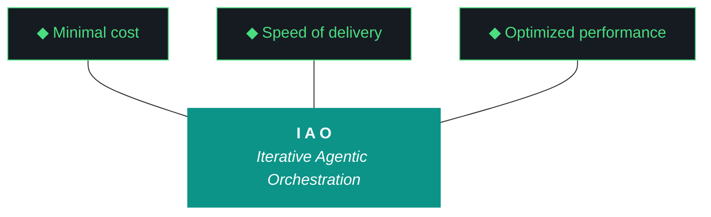

# iao — Design 0.1.4

**Iteration:** 0.1.4
**Phase:** 0 (NZXT-only authoring)
**Phase position:** Fourth authored iteration of Phase 0, first iteration with Gemini as primary executor
**Date:** April 09, 2026
**Repo:** ~/dev/projects/iao (local only — Phase 0 has no remote)
**Machine:** NZXTcos
**Wall clock target:** ~8 hours soft cap (no hard cap)
**Run mode:** Single executor (Gemini CLI) — no split-agent
**Significance:** Model fleet integration, kjtcom harness migration, Telegram/OpenClaw foundations, Gemini-primary refactor, 0.1.3 cleanup. First iteration Gemini executes end-to-end. Claude web retains design authorship only; all workstream execution is Gemini.

---

## What is iao

iao (Iterative Agentic Orchestration) is a methodology and Python package for running disciplined LLM-driven engineering iterations without human supervision during execution. The harness — pre-flight checks, post-flight gates, artifact templates, gotcha registry, evaluator, model fleet — is the product. The executing model (Gemini, Claude, Qwen) is the engine. iao was extracted from `kjtcom` (a location-intelligence platform) during kjtcom Phase 10 and is currently in **Phase 0 — NZXT-only authoring**.

0.1.4 is the iteration where iao transitions from "I run this with Claude Code because I'm Kyle and I have a Claude license" to "any engineer with a Gemini CLI install can run a full iteration end-to-end." That transition matters because the engineers who will consume iao at scale — Luke, Alex, Max, David — do not have Claude licenses. iao must work cleanly, predictably, and unsupervised from Gemini CLI on a fresh Arch or macOS machine, or the methodology fails the engineers it was built for.

A junior engineer reading this document should know that iao 0.1.4 integrates a fleet of local models (Qwen, Nemotron, GLM, ChromaDB), migrates the mature kjtcom harness registry into iao's universal layer, lays the foundations for remote review via Telegram and OpenClaw, and corrects the run-report mechanism that shipped broken in 0.1.3.

---

## §1. Phase 0 Position

The Phase 0 charter was authored in iao 0.1.3 W6 and lives at `docs/phase-charters/iao-phase-0.md`. This iteration does not revise the charter; it executes against it.

**Current phase status:**
- Phase: 0 — NZXT-only authoring
- Charter version: 0.1 (retroactive, written in 0.1.3)
- Iterations completed in phase: 0.1.0, 0.1.2, 0.1.3 (three of ~seven planned)
- Current iteration: **0.1.4** (this iteration)
- Iterations remaining in phase: 0.1.4 (this), 0.1.5, buffer 0.2.x–0.5.x, 0.6.x (phase exit)
- Phase progress: ~40% through planned iterations
- Phase exit target: 0.6.x first push to `soc-foundry/iao` public repository

**Phase 0 exit criteria status (from charter):**
- [x] iao installable as Python package on NZXT (0.1.0)
- [x] Secrets architecture (age + OS keyring) functional (0.1.2 W1)
- [x] kjtcom methodology code migrated (0.1.2 W5)
- [x] Qwen artifact loop scaffolded (0.1.2 W6)
- [x] Bundle quality gates enforced (0.1.3 W3)
- [x] Folder layout consolidated to single `docs/` root (0.1.3 W1)
- [x] Python package on src-layout (0.1.3 W2)
- [x] Universal pipeline scaffolding (0.1.3 W4)
- [x] Human feedback loop scaffolded (0.1.3 W5) **— but shipped broken, repaired in this iteration**
- [x] README on kjtcom structure (0.1.3 W6)
- [x] Phase 0 charter committed (0.1.3 W6)
- [ ] **Qwen loop produces production-weight artifacts (0.1.3 partial — Qwen word-count ceiling surfaced; 0.1.4 addresses via ChromaDB enrichment and calibrated thresholds)**
- [ ] **Telegram framework + MCP global install + ambient agent briefings (foundations in 0.1.4; full review loop in 0.1.5)**
- [ ] Cross-platform installer (fish/bash/zsh/PowerShell) (0.1.5 or 0.2.x)
- [ ] Novice operability validation pass — Luke/Alex dogfood (0.1.5)
- [ ] iao 0.6.x ships to soc-foundry/iao public repo (Phase 0 exit)

---

## §2. Why 0.1.4 Exists

iao 0.1.3 shipped the structural debts — bundle quality gates, folder consolidation, src-layout, pipeline scaffolding, README sync, Phase 0 charter. By every objective measure of the 0.1.3 design doc, the iteration succeeded. The bundle is 230 KB with all 20 sections. All 30 tests pass. Eight workstreams complete in 34 minutes of wall clock time.

But 0.1.3 surfaced ten new debts that make 0.1.4 necessary.

### 2.1 — The feedback loop shipped broken

0.1.3 W5 built the human feedback mechanism: run report, workstream summary table, agent questions section, Kyle's notes section, sign-off checkboxes, `iao iteration close` and `--confirm` commands. All of it scaffolded, all of it compiled, all of it produced a file at the expected path. The existence criterion passed.

The content criterion failed on four counts:

1. **Stale workstream table.** The run report showed W0 complete and W1–W7 pending, even though the terminal simultaneously printed all eight workstreams complete with wall clock times. `run_report.py` reads checkpoint state at the wrong moment — probably at module import rather than at render time.

2. **Empty agent questions section.** The build log explicitly raised a question from W7: *"Qwen3.5:9b on CPU exhausts 3 retries for build-log at ~1700 words (2000 min). Consider whether to lower the min_words threshold or upgrade to a larger model."* That's exactly the kind of question the run report was designed to surface. It didn't. There's no mechanism in `run_report.py` for extracting questions from the build log.

3. **Run report is 824 bytes.** 0.1.3 W3 put quality gates on the bundle, design, plan, build log, and report. No gate on the run report itself. An 824-byte run report passed post-flight because nothing checked its size.

4. **Run report is not in BUNDLE_SPEC.** The bundle has 20 sections; the run report is not one of them. The 0.1.3 bundle includes the run report buried inside §1 Design rather than as its own section. W5 shipped before W3's spec could accommodate the new artifact.

All four bugs are blocking for Luke and Alex. You — Kyle — can review in chat because you are in the chat. They cannot. They need the run report to actually contain what happened, actually surface questions, actually be long enough to review, and actually be findable in the bundle. Until these four are fixed, the remote-review architecture (your point #2 from the 0.1.3 review) has nowhere to land.

### 2.2 — Qwen hit a physical ceiling; the model fleet is the answer

0.1.3 W7 discovered that Qwen3.5:9b running on CPU on NZXT maxes out at roughly 1700 words per generation. The build-log minimum was 2000 words. Qwen's three-retry loop fired correctly (1684 → 1690 → ~1700 words) and escalated per Pillar 7. Claude Code wrote the build log and report directly as factual execution records, which is the correct Pillar 7 fallback behavior.

That fallback cannot apply in 0.1.4 because Claude Code is not the executor. Gemini CLI is. Gemini does not have a "just write the factual record" fallback mode in the same way — it's an orchestration agent, not a long-form writer. If Qwen can't produce a quality build log, Gemini escalates to Kyle in the run report's Agent Questions section. And Kyle is in chat, not at the terminal when the iteration runs.

The answer is **not** "lower the word counts until Qwen can hit them." That's treating the symptom. The answer is ADR-014 applied with more rigor: Qwen's quality is a function of context richness, not prompt tightness. The 0.1.3 prompts gave Qwen the template and the trident and the pillars. They did not give Qwen *examples of good past artifacts*. They did not give Qwen *retrieved context from past iterations that are semantically similar to the current task*. They did not let Qwen *use Nemotron as a pre-processing brain that extracts structured data from the event log* before the synthesis step. They did not let Qwen *fall through to GLM-4.6V-Flash-9B* when Qwen's output needs a second opinion.

The model fleet — Qwen, Nemotron, GLM, ChromaDB + nomic-embed-text, with OpenClaw sessions orchestrated by NemoClaw — is the architectural answer to Qwen's ceiling. 0.1.4 W2 stands up the fleet integration. W3 uses the fleet for the first real production task (kjtcom harness classification). W8 is the dogfood test where Qwen generates 0.1.4's own artifacts using ChromaDB-retrieved context from 0.1.2 and 0.1.3, plus Nemotron preprocessing, plus optional GLM tier-2 fallback. If the fleet works, the word-count ceiling stops mattering because Qwen isn't alone anymore.

### 2.3 — kjtcom has 60+ gotchas, iao has 6

iao 0.1.2 W5 migrated the core kjtcom methodology code (RAG layer, data modules, integrations, logger, ollama_config). It did not migrate the registry artifacts — the gotcha archive, the script registry, the ADR catalog, the pattern catalog. kjtcom has 60+ gotchas accumulated across 70 iterations of hard-won experience. iao has 6 (G001, G022, G031, G104, G105, G106), all of which were authored during iao's own short history.

This is not a small gap. The gotcha registry is the institutional memory of the project. When a new engineer starts iao work, the first thing they should do per Pillar 3 (Diligence) is query the registry for anything relevant to the task. An empty registry means Pillar 3 reduces to lip service.

The migration is also not uniformly mechanical. Some kjtcom gotchas are deeply kjtcom-specific — "CanvasTexture for Flutter 3D chip labels" is not a universal lesson. Others are clearly universal — "printf not heredocs in fish shell" applies everywhere fish runs. A third category is ambiguous and needs a human ruling — "pre-flight schema inspection" is rooted in a specific kjtcom Firestore bug but generalizes to "never assume you know a file's structure; read first."

W3 uses the model fleet (specifically Nemotron, which W2 brings online) to auto-classify each kjtcom gotcha as UNIVERSAL / KJTCOM-SPECIFIC / AMBIGUOUS. The UNIVERSAL and KJTCOM-SPECIFIC decisions stand automatically (conservative bias toward KJTCOM-SPECIFIC on close calls). The AMBIGUOUS pile surfaces to a mid-iteration chat checkpoint where Kyle reviews and rules. Migrated entries get renumbered under `iaomw-` prefix with a mapping file at `docs/harness/kjtcom-migration-map.md` preserving the provenance.

### 2.4 — The telegram framework cannot stay kjtcom-specific

kjtcom has `kjtcom-telegram-bot.service`, `~/.config/kjtcom/bot.env`, and a 619-line `telegram_bot.py`. The 0.1.2 planning session explicitly deferred telegram generalization to "iao 0.1.X" because the scope was too large for 0.1.2. That deferral has matured.

Two reasons it must happen now:

First, Kyle's point #2 from the 0.1.3 review — the remote-review vision. Engineers need to get a Telegram notification when their iteration completes, review the bundle and run report remotely, answer the agent's questions via chat, and confirm the iteration close from their phone. The framework to deliver that notification has to exist before the review agent can use it. 0.1.4 W4 generalizes the framework (so `iao telegram init <project>` scaffolds a new bot for any project) and W6 wires the notification hook at iteration close. The full remote-review dialog is 0.1.5.

Second, `~/.config/kjtcom/bot.env` is plaintext mode 600. 0.1.2 W1 built the age-encrypted iao secrets backend but punted on migrating bot.env because the telegram framework wasn't ready. 0.1.4 W4 does the bot.env → iao secrets migration as a natural side-effect of the framework generalization. Delays any longer and the plaintext-secrets-on-disk situation gets more entrenched.

### 2.5 — OpenClaw is not installed

`pip install open-interpreter` has not been run on NZXT. The harness references "openclaw" (Kyle's local nickname for open-interpreter) and "nemoclaw" (Nemotron-driven openclaw orchestration) but neither exists in the filesystem or the iao package.

0.1.4 W5 installs open-interpreter, creates `src/iao/agents/openclaw.py` as a thin wrapper around the open-interpreter Python API, and creates `src/iao/agents/nemoclaw.py` as a basic orchestrator that can spawn a single OpenClaw session with Nemotron as the driver model, send it a prompt, capture its output, and log the interaction to the iao event log.

This is foundation work. 0.1.4 does not build the review agent role. It does not build the Telegram bridge. It does not build the multi-agent orchestration. Those are 0.1.5. 0.1.4 proves that the primitives work — OpenClaw installs, NemoClaw can drive it, output flows to the event log, nothing explodes.

### 2.6 — Gemini-primary is not yet real

iao 0.1.3 was planned as a split-agent iteration (Gemini W0–W5, Claude Code W6–W7). The Gemini half was never executed; Claude Code ran all eight workstreams in 34 minutes single-agent. The plan's split-agent architecture was unnecessary ceremony, and the CLAUDE.md brief that was produced for 0.1.3 served Claude Code well enough, but no equivalent GEMINI.md exists.

Every iteration from 0.1.4 forward runs on Gemini CLI as the sole executor. This is not because Claude Code is bad — Claude Code is, on the evidence, quite good at this work. It is because the engineers who will use iao at scale (Luke, Alex, Max, David) do not have Claude licenses. iao must be demonstrably Gemini-executable before it can be delivered to them. 0.1.4 is the first iteration where that demonstration happens.

The Gemini-primary refactor has concrete deliverables:
- A polished GEMINI.md brief authored by chat (like 0.1.3's CLAUDE.md) that Gemini reads at execution start
- Removal of split-agent language from plan templates
- CLI bug fixes surfaced by 0.1.3 (`iao doctor` command missing, `iao log workstream-complete` signature mismatch)
- README updated to assume Gemini-primary
- A Gemini-dry-run acceptance check for each workstream: "did the commands I just ran work cleanly, or did they produce errors Gemini would choke on?"

### 2.7 — ChromaDB RAG layer is migrated but not integrated

iao 0.1.2 W5 migrated kjtcom's `query_rag.py` and `intent_router.py` as `iao/rag/query.py` and `iao/rag/router.py`. They exist in the package but nothing in the artifact loop calls them. ChromaDB is running, nomic-embed-text is present, and there is no collection populated with iao content.

0.1.4 W2 seeds ChromaDB with archive collections (`iaomw_archive`, `kjtco_archive`, `tripl_archive`), populated from each project's `docs/iterations/` directory using nomic-embed-text for embeddings. The archive is queryable by `iao rag query <project_code> "<question>"` and by programmatic calls from the artifact loop. This makes the RAG layer real.

### 2.8 — GLM is untouched

`haervwe/GLM-4.6V-Flash-9B` (8 GB) has been on NZXT since before 0.1.2 and has never been invoked by the iao package. It is vision-capable, which means it can read screenshots, diagrams, images — uses that Qwen3.5:9b cannot serve. Kyle called this out specifically in the 0.1.3 review.

0.1.4 W2 adds `src/iao/artifacts/glm_client.py` with a vision-capable API and a text-only API (for tier-2 evaluator fallback when Qwen's output needs a second opinion). The benchmark in W2 includes GLM as a participant.

### 2.9 — The run report is missing from BUNDLE_SPEC

0.1.3 W3 froze BUNDLE_SPEC at 20 sections. 0.1.3 W5 added the run report as a new artifact. These two workstreams collided: the bundle spec predated the run report. The 0.1.3 bundle contains the run report buried inside §1 Design because W5 couldn't add sections to a spec that W3 had already frozen.

0.1.4 W1 expands BUNDLE_SPEC to 21 sections, with the run report as §4.5 (between Report and Harness) or — cleaner — resequencing so the run report is §5 and everything after shifts up one. The latter is the right call. BUNDLE_SPEC becomes 21 sections.

### 2.10 — The versioning lock was violated

The iao bootstrap session locked versioning to X.Y.Z three octets, with Z as the iteration run number, not a minor version. The 0.1.3 planning chat (which is to say, this same Claude web session earlier today) drifted to four-octet versioning by pattern-matching from kjtcom. iao 0.1.3's design doc introduced `0.1.3.1` as "phase.iteration.run" with no authorization. The terminal state rolled forward to `0.1.4.0` on W7 close and had to be manually reverted.

This was my error, Kyle caught it, I apologized. 0.1.4 W1 adds a regex validator in `src/iao/config.py` that rejects iteration strings with more than three octets. Every template, every CLI command, every checkpoint field, every prompt variable that carries an iteration version is grepped and corrected to three-octet format. A gotcha (`iaomw-G107`) is added to the registry documenting the failure mode so future iterations don't repeat it.

---

## §3. The Trident (locked, iaomw-Pillar-1)



---

## §4. The Ten Pillars (current — review pending)

1. **iaomw-Pillar-1 (Trident)** — Cost / Delivery / Performance triangle governs every decision.
2. **iaomw-Pillar-2 (Artifact Loop)** — design → plan → build → report → bundle. Every iteration produces all five.
3. **iaomw-Pillar-3 (Diligence)** — First action: `iao registry query "<topic>"`. Read before you code.
4. **iaomw-Pillar-4 (Pre-Flight Verification)** — Validate the environment before execution. Pre-flight failures block launch.
5. **iaomw-Pillar-5 (Agentic Harness Orchestration)** — The harness is the product; the model is the engine.
6. **iaomw-Pillar-6 (Zero-Intervention Target)** — Interventions are failures in planning. The agent does not ask permission.
7. **iaomw-Pillar-7 (Self-Healing Execution)** — Max 3 retries per error with diagnostic feedback. Pattern-22 enforcement.
8. **iaomw-Pillar-8 (Phase Graduation)** — Formalized via MUST-have deliverables + Qwen graduation analysis. Pattern-31 chartering.
9. **iaomw-Pillar-9 (Post-Flight Functional Testing)** — Build is a gatekeeper. Existence checks are necessary but insufficient (ADR-009).
10. **iaomw-Pillar-10 (Continuous Improvement)** — Run Report → Kyle's notes → seed next iteration design. Feedback loop is first-class artifact.

**Note on pillar currency:** Kyle flagged in the 0.1.3 review that the 10 pillars are getting stale, with several (notably Pillar 3's reference to `query_registry.py` and Pillar 9's build-gatekeeper framing) being kjtcom-era phrasings that don't cleanly fit iao itself. The pillar review is scheduled as a conversational chat turn between 0.1.4 close and 0.1.5 planning. It is not a workstream in 0.1.4. This design doc references the current pillars verbatim per ADR-034 (verbatim requirement). If pillars are reframed between now and 0.1.5, the references in 0.1.4's closed artifacts remain historically accurate to the pillar state at execution time.

---

## §5. Project State Going Into 0.1.4

### iao package state (from 0.1.3 close)

- Python package: `src/iao/` (src-layout per 0.1.3 W2)
- Subpackages: `artifacts/`, `data/`, `feedback/`, `install/`, `integrations/`, `pipelines/`, `postflight/`, `preflight/`, `rag/`, `secrets/`
- CLI entry point: `iao` via `bin/iao` and pyproject.toml entry_points
- Version: `0.1.3` in `VERSION` file (will bump to `0.1.4` in W0)
- Tests: 30 passing, 1 skipped
- Prompts: 6 Jinja2 templates + run-report template from W5
- Docs: single `docs/` root with `iterations/`, `adrs/`, `harness/`, `roadmap/`, `phase-charters/`, `archive/`, `drafts/`
- `.iao.json`: `current_iteration: "0.1.3"`, `last_completed_iteration: "0.1.3"`, `phase: 0`
- Bundle: 230 KB at `docs/iterations/0.1.3/iao-bundle-0.1.3.md` (manually renamed from `0.1.3.1` after versioning fix)

### Active iao consumer projects

| Code | Name | Path | Purpose |
|---|---|---|---|
| iaomw | iao | ~/dev/projects/iao | The middleware itself (this project) |
| kjtco | kjtcom | ~/dev/projects/kjtcom | Reference implementation, steady state |
| tripl | tripledb | ~/dev/projects/tripledb | TachTech SIEM migration project |

### Model fleet inventory (from Ollama and local install)

| Model | Size | Role in 0.1.4 | Current use |
|---|---|---|---|
| qwen3.5:9b | 6.6 GB | Primary long-form artifact generator | In use, retry-ceiling at ~1700 words on CPU |
| nemotron-mini:4b | 2.7 GB | Classification, extraction, pre-processing, small tasks | Integrated in W2 |
| haervwe/GLM-4.6V-Flash-9B | 8.0 GB | Vision + tier-2 evaluator fallback | Integrated in W2 |
| nomic-embed-text | 274 MB | ChromaDB embeddings | Integrated in W2 |
| open-interpreter | N/A pip | OpenClaw foundation agent sessions | Installed in W5 |

### Known debts entering 0.1.4

| Debt | Origin | Closes in |
|---|---|---|
| Run report stale workstream table | 0.1.3 W5 checkpoint-read bug | W1 |
| Run report empty agent questions | 0.1.3 W5 no extraction mechanism | W1 |
| Run report 824 bytes, no quality gate | 0.1.3 W3 spec predates W5 artifact | W1 |
| Run report not in BUNDLE_SPEC | 0.1.3 W3 froze spec before W5 | W1 |
| `iao doctor` CLI command missing | 0.1.3 W7 surfaced | W1 |
| `iao log workstream-complete` signature mismatch | 0.1.3 W7 surfaced | W1 |
| Four-octet versioning drift | 0.1.3 planning chat error | W1 |
| `age` binary not installed | 0.1.2 W1 incomplete | W1 |
| Qwen word-count ceiling | physical model limit | W2 (fleet integration), W8 (calibration) |
| ChromaDB RAG layer migrated but not integrated | 0.1.2 W5 scope | W2 |
| Nemotron unused | never wired | W2 |
| GLM unused | never wired | W2 |
| kjtcom gotcha registry not migrated | 0.1.2 W5 scope | W3 |
| kjtcom script registry not migrated | 0.1.2 W5 scope | W3 |
| kjtcom universal ADRs/patterns not promoted | 0.1.2 W5 scope | W3 |
| Telegram framework kjtcom-specific | 0.1.2 deferral | W4 |
| bot.env plaintext | 0.1.2 Path C deferral | W4 |
| OpenClaw not installed | never planned | W5 |
| NemoClaw orchestrator doesn't exist | never planned | W5 |
| Notification on iteration close | never planned | W6 |
| No GEMINI.md | 0.1.3 CLAUDE.md-only | W7 (produced in chat, refined in W7) |
| Split-agent language in plan templates | 0.1.3 inheritance | W7 |

### What is NOT changing in 0.1.4

- **Design and plan authorship stays chat-driven.** Claude web (this conversation) remains the authoring venue for design and plan. Gemini does not generate canonical design or plan documents in 0.1.4. The Qwen artifact loop generates build log, report, run report, and bundle only per ADR-012.
- **Secrets architecture.** age + keyring backend established in 0.1.2 stands. W4 migrates bot.env into the existing backend; it does not change the backend.
- **kjtcom is untouched.** kjtcom is in steady state per 10.69.1. W3 reads from kjtcom's registries but does not modify kjtcom.
- **No public push.** Phase 0 stays on NZXT. 0.6.x is the first push to soc-foundry/iao.
- **Pillar 0 absolute.** Neither Gemini nor any agent runs git commits. Kyle performs all git operations manually.
- **Three-octet versioning.** Enforced by regex validator added in W1. Iteration strings must match `^\d+\.\d+\.\d+$`.
- **The pillar review is not in 0.1.4.** It is scheduled as a chat conversation between 0.1.4 close and 0.1.5 planning.

---

## §6. Workstreams (W0–W7)

### W0 — Iteration Bookkeeping

**Goal:** Update iao's own metadata to reflect 0.1.4 in flight. Three-octet discipline applied throughout.

**Deliverables:**
- `.iao.json` `current_iteration` updated from `0.1.3` to `0.1.4` (three octets, no suffix)
- `VERSION` file updated from `0.1.3` to `0.1.4`
- `pyproject.toml` version updated from `0.1.3` to `0.1.4`
- `cli.py` VERSION string updated
- `.iao-checkpoint.json` initialized with W0–W7 status fields for iteration `0.1.4`
- `IAO_ITERATION=0.1.4` exported in the launch shell

**Dependencies:** None (entry point).

**Executor:** Gemini CLI.

**Acceptance checks:**
- `iao --version` returns `0.1.4`
- `jq .current_iteration .iao.json` returns `"0.1.4"` (not `"0.1.4.0"` or `"0.1.4.1"`)
- `jq .iteration .iao-checkpoint.json` returns `"0.1.4"`
- `grep -rn "0.1.4\." src/ prompts/ docs/iterations/0.1.4/ 2>/dev/null` returns zero matches (no four-octet patterns)

**Wall clock target:** 10 min.

---

### W1 — 0.1.3 Cleanup

**Goal:** Fix the four run-report bugs, the two CLI bugs, the versioning drift, and install `age`. Nothing architectural, all remediation of known debts.

**Deliverables:**

**W1.1 — Run report checkpoint-read bug (Bug 1):**
- Update `src/iao/feedback/run_report.py`:
  - Read `.iao-checkpoint.json` at render time inside the `generate_run_report()` function, not at module import
  - Ensure checkpoint state reflects final iteration state, not stale snapshot
- Add test: `tests/test_feedback.py::test_run_report_reads_current_checkpoint_state`

**W1.2 — Run report question extraction (Bug 2):**
- Create `src/iao/feedback/questions.py`:
  - `extract_questions_from_build_log(build_log_path: Path) -> list[str]` — greps for "Agent Question for Kyle:" markers in build log, extracts the full question text
  - `extract_questions_from_event_log(event_log_path: Path, iteration: str) -> list[str]` — reads event log jsonl entries with type "agent_question" tagged with the current iteration
- Wire both extractors into `generate_run_report()` so the Agent Questions section is populated from real sources
- If both extractors return empty, the section literally reads `(none — no questions surfaced during execution)` instead of a static placeholder
- Add test: `tests/test_feedback.py::test_question_extraction_from_build_log`

**W1.3 — Run report quality gate (Bug 3):**
- Create `src/iao/postflight/run_report_quality.py`:
  - Checks run report file size ≥ 1500 bytes
  - Checks workstream summary table has one row per declared workstream (matching `.iao-checkpoint.json` workstream list)
  - Checks sign-off section exists with 5 checkboxes
  - Returns FAIL if any check fails; returns PASS otherwise
  - Does NOT check that sign-off boxes are ticked — that's `--confirm`'s job, not post-flight's
- Wire into `iao doctor postflight` dynamic plugin loader
- Add test: `tests/test_postflight_run_report_quality.py`

**W1.4 — Run report as BUNDLE_SPEC §5 (Bug 4):**
- Update `src/iao/bundle.py`:
  - Expand `BUNDLE_SPEC` to 21 sections
  - Insert run report as §5 (after Report §4)
  - Shift Harness §5 → §6, README §6 → §7, CHANGELOG §7 → §8, ... Environment §20 → §21
  - Update section header generation to handle 21 sections
- Update `prompts/bundle.md.j2` with the new section order
- Update `src/iao/postflight/bundle_quality.py` to check for 21 sections, not 20
- Update `docs/harness/base.md`:
  - `iaomw-ADR-028` amended: BUNDLE_SPEC is 21 sections; enumerate the new order
- Regenerate any existing bundle that's been validated against the old spec (not applicable — 0.1.3 bundle is frozen historical artifact)
- Add test: `tests/test_bundle.py::test_bundle_has_21_sections`

**W1.5 — `iao doctor` CLI command wired:**
- Update `src/iao/cli.py`:
  - Add `doctor` subparser with subcommands: `quick`, `preflight`, `postflight`, `full`
  - `iao doctor quick` runs `doctor.run_all(level="quick")`
  - `iao doctor preflight` runs `doctor.run_all(level="preflight")`
  - `iao doctor postflight` runs `doctor.run_all(level="postflight")`
  - `iao doctor full` runs all three
- Verify: `iao doctor quick` returns without argparse error
- Add test: `tests/test_cli.py::test_doctor_subcommands_exist`

**W1.6 — `iao log workstream-complete` signature reconciliation:**
- Current reality: command expects 3 positional args (`workstream_id`, `status` with choices pass/partial/fail/deferred, `summary`)
- 0.1.3 documentation expected 2 args (`workstream_id`, `summary`)
- Decision: keep the 3-arg signature because the status enum is useful, update all documentation references
- Update `src/iao/cli.py` help text to show the canonical signature with examples
- Grep `docs/`, `prompts/`, README for `iao log workstream-complete` references and update
- Add test: `tests/test_cli.py::test_log_workstream_complete_three_arg_signature`

**W1.7 — Three-octet versioning regex validator:**
- Create or update `src/iao/config.py`:
  - Add `IAO_VERSION_REGEX = re.compile(r"^\d+\.\d+\.\d+$")`
  - Add `validate_iteration_version(version: str) -> None` that raises `ValueError` on mismatch
- Wire the validator into:
  - `iao iteration close` (validates before generating run report)
  - `.iao.json` load path in `paths.py` or wherever current_iteration is read
  - `.iao-checkpoint.json` iteration field read
- Grep entire codebase for iteration version strings and correct any that have 4 octets:
  ```fish
  grep -rEn "[0-9]+\.[0-9]+\.[0-9]+\.[0-9]+" src/ prompts/ tests/ docs/iterations/0.1.4/ 2>/dev/null
  ```
- Add `iaomw-G107` to gotcha registry:
  - Title: "Four-octet versioning drift from kjtcom pattern-match"
  - Status: Resolved
  - Action: "iao versioning is locked to X.Y.Z three octets per bootstrap session. kjtcom uses X.Y.Z.W because kjtcom's Z is semantic. iao's Z is the iteration run number. Don't pattern-match from kjtcom. W1 added regex validator in config.py."
- Add test: `tests/test_config.py::test_version_regex_rejects_four_octets`

**W1.8 — `age` binary installation:**
- Run `sudo pacman -S age` (NZXT is CachyOS; age is in cachyos-extra)
- Verify: `age --version` returns `1.3.x`
- Verify: `which age` returns `/usr/bin/age`
- Update `install.fish` to include age in the pacman install list if it's not already there
- This is a one-time action and should be a no-op on subsequent runs (pacman detects already-installed)

**Dependencies:** W0 (bookkeeping settled).

**Executor:** Gemini CLI.

**Acceptance checks:**
- All 4 run-report bugs verified fixed via `tests/test_feedback.py` and manual inspection of a generated run report
- `iao doctor quick` runs without argparse error
- `grep -rEn "[0-9]+\.[0-9]+\.[0-9]+\.[0-9]+" src/ prompts/` returns zero matches
- `age --version` returns 1.3.x
- All 30+ existing tests pass, plus new tests added in this workstream
- `pytest tests/ -v` exits 0

**Wall clock target:** 90 min.

---

### W2 — Model Fleet Integration

**Goal:** Wire ChromaDB, Nemotron, and GLM into the iao package. Seed the ChromaDB archive from past iterations. Benchmark all three models against real iao tasks. Document the fleet roles.

**Deliverables:**

**W2.1 — ChromaDB archive collections:**
- Create `src/iao/rag/archive.py`:
  - `seed_project_archive(project_code: str, project_path: Path) -> int` — reads all files under `docs/iterations/` in the project, embeds with nomic-embed-text, stores in ChromaDB collection `{project_code}_archive`
  - `query_archive(project_code: str, query: str, top_k: int = 5) -> list[dict]` — semantic search over the archive
  - `list_archives() -> dict[str, int]` — returns all known archives with document counts
- Update `src/iao/rag/query.py` and `src/iao/rag/router.py` to use the archive module (they were migrated in 0.1.2 but not wired)
- Add CLI commands:
  - `iao rag seed <project_code>` — seeds or re-seeds the archive
  - `iao rag query <project_code> "<question>"` — interactive query
  - `iao rag list` — list all archives with counts
- Seed archives for: `iaomw` (reads from `docs/iterations/0.1.0/`, `0.1.2/`, `0.1.3/`), `kjtco` (reads from `~/dev/projects/kjtcom/docs/iterations/`), `tripl` (reads from `~/dev/projects/tripledb/docs/iterations/` if it exists)
- Expected results: iaomw_archive has ~30 documents, kjtco_archive has hundreds, tripl_archive has maybe 10

**W2.2 — `nemotron_client.py`:**
- Create `src/iao/artifacts/nemotron_client.py`:
  - `classify(text: str, categories: list[str]) -> str` — classification task using nemotron-mini:4b
  - `extract(text: str, schema: dict) -> dict` — structured extraction
  - `tag(text: str, tags: list[str]) -> list[str]` — multi-label tagging
  - `summarize(text: str, max_words: int) -> str` — short summary generation
- Uses `ollama_config.py` for the HTTP API endpoint
- Each function has a 3-retry loop with exponential backoff
- Add test: `tests/test_nemotron_client.py` with live ollama calls if nemotron is available, skip otherwise

**W2.3 — `glm_client.py`:**
- Create `src/iao/artifacts/glm_client.py`:
  - `evaluate(prompt: str, text: str) -> dict` — text-only tier-2 evaluator fallback
  - `describe_image(image_path: Path, prompt: str) -> str` — vision-capable image description
  - `validate_diagram(image_path: Path, expected_elements: list[str]) -> dict` — check that a diagram contains expected elements
- Uses `ollama_config.py` for the HTTP API endpoint
- Uses base64 encoding for image input per ollama vision API
- Add test: `tests/test_glm_client.py` with live ollama calls

**W2.4 — `artifacts/context.py` — ChromaDB enrichment for Qwen:**
- Create `src/iao/artifacts/context.py`:
  - `build_context_for_artifact(project_code: str, artifact_type: str, current_iteration: str, topic: str) -> str` — queries ChromaDB for top-k similar past artifacts of the same type, formats them as in-context examples
  - Returns a markdown block ready to embed in Qwen's system prompt
  - Respects a maximum context length (default 8000 words) to leave room for the actual generation
- Wire into `src/iao/artifacts/loop.py`:
  - Before each Qwen generation, call `build_context_for_artifact()` and prepend to the system prompt
  - Log the retrieved document IDs to the event log for auditability
- Add test: `tests/test_context.py::test_context_enrichment_retrieves_similar_past_artifacts`

**W2.5 — Model fleet benchmark:**
- Create `scripts/benchmark_fleet.py`:
  - Loads test corpus from `docs/iterations/0.1.0/`, `0.1.2/`, `0.1.3/` (the real past iterations)
  - For each test case (e.g., "generate a build log summary for a fake W3 event log"):
    - Run Qwen3.5:9b
    - Run Nemotron-mini:4b
    - Run GLM-4.6V-Flash-9B
  - Record: wall clock, token count, word count, success/failure, output quality (manual rubric)
  - Output: `docs/harness/model-fleet-benchmark-0.1.4.md` with comparison table
- Expected findings:
  - Qwen: best at long-form generation, hits CPU ceiling
  - Nemotron: fastest, narrow task champion, not a replacement for Qwen on long-form
  - GLM: comparable to Qwen on text-only tasks, adds vision for free
- This is run ONCE in W2; the benchmark doc is read by humans to decide role assignments

**W2.6 — `docs/harness/model-fleet.md`:**
- New harness document (≥ 1500 words) describing:
  - Each model's role in iao's fleet
  - When to use which model
  - How to invoke each via the package API
  - How to query ChromaDB archives
  - How the context enrichment pipeline works (past artifact → embedding → top-k retrieval → prompt injection)
  - Troubleshooting: what to do when Qwen is underperforming, when Nemotron is overconfident, when GLM is slow
- Written in the novice-operability style — Luke should be able to read this cold and understand the fleet

**W2.7 — `iaomw-ADR-035: Model Fleet Integration` appended to base.md:**
- Documents the fleet decision
- Documents ChromaDB as the context layer
- Documents Nemotron as the classification/extraction layer
- Documents GLM as the vision + tier-2 fallback layer
- References the benchmark document

**Dependencies:** W1 (CLI, config, test infrastructure settled).

**Executor:** Gemini CLI.

**Acceptance checks:**
- `iao rag list` shows at least `iaomw_archive` with ≥ 10 documents
- `iao rag query iaomw "bundle quality gates"` returns results
- `python -c "from iao.artifacts.nemotron_client import classify; print(classify('hello world', ['greeting', 'farewell']))"` returns `"greeting"` or similar
- `python -c "from iao.artifacts.glm_client import evaluate; print(evaluate('score this', 'test text'))"` returns a dict
- `scripts/benchmark_fleet.py` runs to completion and produces `docs/harness/model-fleet-benchmark-0.1.4.md`
- `docs/harness/model-fleet.md` exists and is ≥ 1500 words
- `grep "iaomw-ADR-035" docs/harness/base.md` returns a match
- All tests pass

**Wall clock target:** 120 min.

---

### W3 — kjtcom Harness Migration

**Goal:** Migrate the accumulated kjtcom registry artifacts (gotchas, scripts, ADRs, patterns) into iao's universal layer. Uses the Nemotron classifier from W2 for auto-classification. Surfaces the AMBIGUOUS pile to a mid-iteration chat checkpoint.

**Deliverables:**

**W3.1 — Gotcha registry migration:**
- Read `~/dev/projects/kjtcom/data/gotcha_archive.json` (or equivalent path — Gemini checks kjtcom's actual registry location first)
- For each kjtcom gotcha entry:
  - Pass to `nemotron_client.classify(text, ["UNIVERSAL", "KJTCOM-SPECIFIC", "AMBIGUOUS"])`
  - Nemotron prompt is biased conservative: "When in doubt, classify as KJTCOM-SPECIFIC. Only classify as UNIVERSAL if the lesson would apply to any Python + Ollama + fish-shell engineering iteration. Classify as AMBIGUOUS only if the lesson is clearly universal but the examples or references are deeply kjtcom-specific."
- For UNIVERSAL entries: copy to iao's `data/gotcha_archive.json`, renumber under `iaomw-` prefix starting from G108, preserve original id as `kjtcom_source_id` field
- For KJTCOM-SPECIFIC entries: skip, log to `docs/harness/kjtcom-migration-map.md` as "not migrated"
- For AMBIGUOUS entries: collect into a list, write to `/tmp/iao-0.1.4-ambiguous-gotchas.md` as a mid-iteration checkpoint file, **print to terminal**: `⚠ AMBIGUOUS gotcha review required. ${count} entries at /tmp/iao-0.1.4-ambiguous-gotchas.md. Pausing W3. Resume with: iao iteration resume W3`
- **W3 pauses here.** Kyle reviews the ambiguous list in chat (paste-and-rule), provides rulings to the executing Gemini session, Gemini writes the rulings to `data/gotcha_archive.json` and resumes W3.

**W3.2 — Script registry migration:**
- Read `~/dev/projects/kjtcom/data/script_registry.json` if it exists
- Read `~/dev/projects/kjtcom/scripts/` directory listing for scripts not in the registry
- Same classification flow via Nemotron
- UNIVERSAL scripts (build_log_tools, evaluator harness, iteration deltas, snapshot generator, etc.) get migrated to `templates/scripts/` as `.template` files with variable substitution placeholders
- Create `data/script_registry.json` for iao if it doesn't exist
- Log skipped kjtcom-specific scripts to the migration map

**W3.3 — ADR catalog audit and promotion:**
- Read `~/dev/projects/kjtcom/docs/harness/project.md` or equivalent for kjtcom-specific ADRs
- Cross-reference against `docs/harness/base.md` (iao's universal harness)
- For each kjtcom-project ADR:
  - Run through Nemotron classifier
  - UNIVERSAL promotions get appended to `docs/harness/base.md` with `iaomw-ADR-` prefix and fresh numbering
  - Maintain mapping in migration map
- Expected promotions: ADR-005 (schema validation), ADR-007 (event-based diligence), ADR-021 (synthesis audit trail), possibly others surfaced by audit

**W3.4 — Pattern catalog audit and promotion:**
- Same flow as ADR catalog for patterns
- kjtcom may have patterns beyond the 25 already in base.md
- Universal patterns promoted to base.md with fresh iaomw-Pattern- numbering

**W3.5 — Migration map document:**
- Create `docs/harness/kjtcom-migration-map.md` with tables:
  - Gotcha migration table: original kjtcom id | new iaomw id | classification | migrated (yes/no)
  - Script migration table: original path | new template path | classification | migrated
  - ADR migration table: original kjtcom id | new iaomw id | classification | migrated
  - Pattern migration table: original kjtcom id | new iaomw id | classification | migrated
  - Summary counts at top
- This document is the audit trail for the migration and should be complete enough that a future engineer can reconstruct the decisions

**W3.6 — Base.md reflects migration:**
- `iaomw-ADR-036: kjtcom Harness Artifact Migration` appended, documenting the migration scope, methodology, and date

**Dependencies:** W2 (nemotron_client must exist).

**Executor:** Gemini CLI (pauses mid-workstream for Kyle's ambiguous-pile review).

**Acceptance checks:**
- `data/gotcha_archive.json` contains ≥ 20 new UNIVERSAL entries from kjtcom (expected range 20–40 depending on Nemotron's conservative bias)
- `docs/harness/kjtcom-migration-map.md` exists with all four tables populated
- `grep "iaomw-G10[89]\|iaomw-G1[1-9][0-9]" data/gotcha_archive.json` returns matches for the newly migrated entries
- `grep "iaomw-ADR-036" docs/harness/base.md` returns a match
- The mid-iteration pause worked: Kyle provided rulings on the ambiguous pile, Gemini resumed and wrote them to the registry

**Wall clock target:** 90 min (excluding Kyle's mid-iteration review time, which is human-paced and not bounded).

---

### W4 — Telegram Framework Generalization

**Goal:** Generalize kjtcom's telegram bot into an iao-level framework that any consumer project can scaffold. Migrate `~/.config/kjtcom/bot.env` into iao's secrets backend.

**Deliverables:**

**W4.1 — `src/iao/telegram/` subpackage:**
- `__init__.py`
- `framework.py` — `TelegramBotFramework` class with:
  - `__init__(project_code, bot_token, chat_id, commands)`
  - `register_command(name, handler)` — wire a command to a handler function
  - `send_notification(message, chat_id=None)` — sends a message
  - `run_forever()` — polls for updates, dispatches commands
- `notifications.py` — helper functions for standard iao notifications (iteration complete, iteration failed, review pending, etc.)
- `config.py` — loads bot config from iao secrets backend
- `cli.py` — `iao telegram` subcommands

**W4.2 — `iao telegram` CLI subparser:**
- `iao telegram init <project_code>` — scaffolds a new bot for a consumer project:
  - Prompts for bot token (or reads from existing secrets)
  - Prompts for chat id
  - Writes encrypted config via iao secrets backend
  - Generates `templates/systemd/project-telegram-bot.service.template` instance for the project
- `iao telegram test <project_code>` — sends a test notification, confirms delivery
- `iao telegram status [<project_code>]` — shows bot status (systemd unit, last poll, secrets present)

**W4.3 — systemd template:**
- `templates/systemd/project-telegram-bot.service.template` already exists from 0.1.2 W5 migration
- Update it to use the new `iao.telegram.framework` entry point
- Template variables: `{project_code}`, `{project_path}`, `{working_directory}`

**W4.4 — bot.env migration:**
- Read `~/.config/kjtcom/bot.env`
- Extract: `KJTCOM_TELEGRAM_BOT_TOKEN`, `KJTCOM_TELEGRAM_CHAT_ID`
- Import into iao secrets backend under the `kjtco` project scope
- Verify: `iao secret get kjtco TELEGRAM_BOT_TOKEN` returns the rotated value
- Mark bot.env for deletion (but don't delete it — kjtcom's systemd service still reads it until kjtcom is updated in a future iteration)
- Update `docs/harness/secrets-architecture.md` (if exists; create if not) with the migration note

**W4.5 — `src/iao/telegram/__init__.py` exports + test:**
- Export `TelegramBotFramework` and `send_notification` at package level
- Add `tests/test_telegram.py` with mock bot for unit testing (does NOT send real telegram messages in CI)
- Live smoke test: send an "iao 0.1.4 W4 complete" notification to Kyle's telegram (using the migrated kjtco credentials) — confirms the migration worked end-to-end

**W4.6 — `iaomw-ADR-037: Telegram Framework` appended to base.md:**
- Documents the framework design
- Documents the bot.env → iao secrets migration
- References `docs/harness/secrets-architecture.md`

**Dependencies:** W1 (secrets validator), W2 (nothing directly, but W2 hardens overall fleet).

**Executor:** Gemini CLI.

**Acceptance checks:**
- `iao telegram test kjtco` sends a real telegram notification to Kyle's chat
- `iao secret get kjtco TELEGRAM_BOT_TOKEN` returns the token (age-encrypted at rest)
- `python -c "from iao.telegram import TelegramBotFramework; print(TelegramBotFramework)"` succeeds
- `tests/test_telegram.py` passes with mocks
- `grep "iaomw-ADR-037" docs/harness/base.md` returns a match

**Wall clock target:** 75 min.

---

### W5 — OpenClaw + NemoClaw Foundations

**Goal:** Install open-interpreter. Create the iao wrapper (openclaw). Create the basic Nemotron-driven orchestrator (nemoclaw). Prove a single OpenClaw session can be spawned, driven by Nemotron, and produce logged output. Foundation only — no review agent role, no Telegram bridge, no multi-agent orchestration. That's 0.1.5.

**Deliverables:**

**W5.1 — open-interpreter installation:**
- `pip install open-interpreter --break-system-packages`
- Verify: `python -c "import interpreter; print(interpreter.__version__)"` returns a version
- Update `install.fish` to include open-interpreter in the pip install list
- Add `iaomw-G108` to gotcha registry: "open-interpreter installation requires --break-system-packages on Arch-based systems" if any installation issues surface

**W5.2 — `src/iao/agents/` subpackage:**
- `__init__.py`
- `openclaw.py` — thin wrapper around open-interpreter:
  - `OpenClawSession` class
  - `__init__(model, system_prompt, role_name)`
  - `send(message)` — sends a message, captures response, logs to event log
  - `close()` — cleanup
- `nemoclaw.py` — Nemotron-driven orchestrator:
  - `NemoClawOrchestrator` class
  - `__init__(session_count=1)` — spawns the specified number of OpenClaw sessions with Nemotron as driver
  - `dispatch(task_description, target_role=None)` — assigns a task to an available session
  - `collect()` — gathers output from all sessions
- Uses ollama API for Nemotron inference
- Logs all interactions to `data/iao_event_log.jsonl` with type `agent_interaction` and fields `session_id`, `role`, `input`, `output`, `timestamp`

**W5.3 — `src/iao/agents/roles/` (stubs only):**
- `__init__.py`
- `base_role.py` — `AgentRole` dataclass with `name`, `system_prompt`, `allowed_tools`
- `reviewer.py` — stub (not implemented in 0.1.4; placeholder for 0.1.5 W-review)
- `assistant.py` — basic "helper agent" role for generic tasks

**W5.4 — Smoke test:**
- Create `scripts/smoke_nemoclaw.py`:
  - Spawns a single nemoclaw session with the `assistant` role
  - Sends a task: "List the files in the current directory and report how many Python files you see"
  - Captures and prints the response
  - Verifies the response contains a number
  - Exits 0 on success
- Run the smoke test in W5, capture output in build log

**W5.5 — `docs/harness/agents-architecture.md`:**
- New harness doc (≥ 1000 words) describing:
  - The distinction between openclaw (execution primitives) and nemoclaw (orchestration)
  - The model driving each layer (Nemotron for orchestration, various for execution)
  - How roles are defined
  - How the event log captures interactions
  - The 0.1.5 roadmap for the review agent role and telegram bridge
- Novice-operability check: Luke can read this and understand what nemoclaw is

**W5.6 — `iaomw-ADR-038: Agent Architecture` appended to base.md:**
- Documents openclaw/nemoclaw as the agent primitives
- Documents the role abstraction
- References the architecture doc

**Dependencies:** W2 (nemotron_client provides the model API the orchestrator uses).

**Executor:** Gemini CLI.

**Acceptance checks:**
- `python -c "import interpreter; print('ok')"` succeeds
- `python scripts/smoke_nemoclaw.py` runs to completion and prints a valid response
- `data/iao_event_log.jsonl` contains at least one entry of type `agent_interaction` after smoke test
- `docs/harness/agents-architecture.md` exists and is ≥ 1000 words
- `grep "iaomw-ADR-038" docs/harness/base.md` returns a match
- All tests pass

**Wall clock target:** 90 min.

---

### W6 — Notification Hook + Gemini-Primary Sync

**Goal:** Wire the Telegram notification into `iao iteration close` so iteration completion pings Kyle's Telegram. Update README, install.fish, and templates to assume Gemini-primary. Remove split-agent language from plan templates.

**Deliverables:**

**W6.1 — Notification hook:**
- Update `src/iao/cli.py` `iteration close` command:
  - After the bundle is generated and run report is written, call `iao.telegram.notifications.send_iteration_complete(iteration, bundle_path, run_report_path)`
  - If telegram is not configured for the current project, skip the notification silently (no error)
  - If telegram notification fails, log to event log but do not block the close
- The notification message format:
  ```
  🏁 iao {project_code} {iteration} COMPLETE

  Bundle: {bundle_size_kb} KB ({sections} sections)
  Workstreams: {complete_count}/{total_count} complete
  Wall clock: {duration}

  Review: {run_report_path}
  Bundle: {bundle_path}

  When ready: iao iteration close --confirm
  ```

**W6.2 — Gemini-primary README updates:**
- Update `README.md`:
  - Replace any "Claude Code" language with "Gemini CLI (primary) or Claude Code"
  - Add a section "Supported Executors" listing Gemini CLI as primary, Claude Code as supported
  - Update installation instructions to show `gemini --yolo` as the canonical launch command
  - Phase 0 status: update to 0.1.4 complete / 0.1.5 planned

**W6.3 — install.fish updates:**
- Verify install.fish includes:
  - `age` install (redundant with W1 but defensive)
  - `open-interpreter` via pip (from W5)
  - ChromaDB via pip (should already be present from 0.1.2 W5 migration)
- Add a post-install check that prints: "For Gemini CLI support: npm install -g @google/gemini-cli"
- Add a post-install check that prints: "For Claude Code support (optional): npm install -g @anthropic-ai/claude-code"

**W6.4 — Plan template — remove split-agent:**
- Update `prompts/plan.md.j2`:
  - Remove any reference to `split-agent`, `handoff_at`, Gemini-to-Claude handoff
  - Replace with `**Run mode:** Single executor`
  - Replace "Agent" column in workstream tables with model-agnostic "Executor" where appropriate
- Update `src/iao/artifacts/templates.py` context passing to not require agent assignment per workstream
- This is a template change only; it does not rewrite the 0.1.3 plan doc (immutable per ADR-012)

**W6.5 — CLAUDE.md retirement:**
- Update `~/dev/projects/iao/CLAUDE.md`:
  - Replace contents with a short pointer: "This file is preserved for Claude Code compatibility. The canonical agent brief for iao 0.1.4+ is GEMINI.md. Claude Code operators should read GEMINI.md — the instructions are executor-agnostic."
- Do NOT delete the file (Claude Code still reads it on session start)
- GEMINI.md is the new source of truth for agent instructions

**W6.6 — Gemini-primary acceptance check:**
- Add `src/iao/postflight/gemini_compat.py`:
  - Checks that all CLI commands referenced in the current iteration's plan doc exist in `src/iao/cli.py`
  - Checks that `iao doctor quick` returns without argparse error
  - Checks that `iao log workstream-complete <id> <status> <summary>` signature matches documentation
  - Returns PASS if all documented commands exist and match signatures
- Wire into `iao doctor postflight`
- Add test

**W6.7 — `iaomw-ADR-039: Gemini-Primary Executor Model` appended to base.md:**
- Documents the single-executor decision
- Documents the rationale (Luke/Alex have Gemini, not Claude)
- Documents the split-agent retirement
- References the reviewer's role split (Kyle + Claude web for authorship, Gemini for execution)

**Dependencies:** W4 (telegram framework for notification), W1 (CLI subcommands for doctor).

**Executor:** Gemini CLI.

**Acceptance checks:**
- Running `iao iteration close` against a test iteration sends a real telegram notification
- `iao doctor postflight --check gemini_compat` passes
- `grep -rn "split-agent\|handoff" prompts/` returns zero matches in plan template
- CLAUDE.md is a short pointer file, not the long original
- `grep "iaomw-ADR-039" docs/harness/base.md` returns a match

**Wall clock target:** 60 min.

---

### W7 — Dogfood + Closing Sequence

**Goal:** Run the hardened Qwen loop (with ChromaDB context from W2) against 0.1.4's own execution. Generate build log, report, run report, bundle. Verify all quality gates pass. Prove the run-report bugs are actually fixed by inspecting the generated run report. Send telegram notification. Stop in review pending state.

**Deliverables:**

**W7.1 — Qwen loop dogfood:**
- Run `iao iteration build-log 0.1.4`:
  - Qwen reads the event log for 0.1.4 entries
  - ChromaDB context enrichment pulls similar past build logs from `iaomw_archive` (specifically 0.1.3's build log as in-context example)
  - Qwen generates the build log
  - Word count target: 1500 (lowered from 2000 per the calibration from 0.1.3's Qwen ceiling)
  - If Qwen hits the new lower ceiling, the loop retries up to 3 times
  - If all 3 retries fail, the Agent Questions section of the run report gets populated with the specific failure (this is the 0.1.3 Bug 2 fix being exercised for real)
- Run `iao iteration report 0.1.4`:
  - Same pattern with report template
  - Target: 1200 words (lowered from 1500)
  - Must include workstream scores table with one row per W0–W7

**W7.2 — Closing sequence:**
- Run `iao doctor postflight`:
  - All checks must pass including the new ones from this iteration: `bundle_quality` (21 sections now), `run_report_quality`, `gemini_compat`, `pipeline_present` (SKIP for iao itself), `ten_pillars_present`, `readme_current`
- Run `iao iteration close`:
  - Generates run report at `docs/iterations/0.1.4/iao-run-report-0.1.4.md`
  - Generates bundle at `docs/iterations/0.1.4/iao-bundle-0.1.4.md`
  - Prints workstream summary table to stdout (must show all 8 workstreams complete — Bug 1 fix validation)
  - Sends Telegram notification (W6 hook exercised)
  - Prints next-steps message

**W7.3 — Run report bug validation:**
- Manually inspect the generated run report:
  - Workstream summary table shows all 8 rows complete with wall clock (Bug 1 fix validated)
  - Agent Questions section is populated OR explicitly says `(none — no questions surfaced during execution)` (Bug 2 fix validated)
  - File size ≥ 1500 bytes (Bug 3 fix validated)
- Manually inspect the generated bundle:
  - Contains 21 sections (grep count)
  - Run report is §5 with its own header (Bug 4 fix validated)
- If any bug is still present, the dogfood has failed. Surface to the build log and stop.

**W7.4 — Phase 0 graduation analysis:**
- Run `iao iteration graduate 0.1.4 --analyze`
- Qwen produces a Phase 0 progress assessment
- Expected: "CONTINUE Phase 0 with 0.1.5 (review loop + dogfood)"

**W7.5 — CHANGELOG update:**
- Append 0.1.4 entry with all 8 workstreams summarized
- Include the notable facts: fleet integration, kjtcom migration count (X gotchas, Y ADRs, Z patterns promoted), telegram framework shipped, openclaw + nemoclaw foundations, 0.1.3 bugs fixed

**W7.6 — Iteration metadata update:**
- `.iao.json`:
  - `current_iteration`: stays `0.1.4` (three octets)
  - `last_completed_iteration`: set to `0.1.4` only AFTER Kyle runs `--confirm`
- `VERSION`: stays `0.1.4`
- `.iao-checkpoint.json`: all 8 workstreams marked complete

**W7.7 — Stop:**
- Print closing message (per template below)
- Exit Gemini cleanly
- Iteration is in review pending state

**Dependencies:** W0–W6 (everything else).

**Executor:** Gemini CLI.

**Acceptance checks:**
- Build log exists, word count ≥ 1500
- Report exists, word count ≥ 1200, workstream scores table present
- Run report exists, all 4 bugs validated as fixed
- Bundle exists at ≥ 100 KB with 21 sections
- Telegram notification received by Kyle
- `iao doctor postflight` exits 0
- All tests still passing

**Wall clock target:** 75 min.

---

## §7. Risks and Mitigations

### Risk: ChromaDB seeding takes longer than expected

**Likelihood:** Medium. kjtcom has 70+ iterations with large documents. Embedding all of them with nomic-embed-text sequentially could take 20+ minutes.

**Mitigation:** Batch embedding (nomic-embed-text supports batch API). Parallel seeding of different project archives. Skip kjtco archive on first run if it blows the budget — iaomw_archive is the critical one for this iteration's dogfood.

### Risk: Nemotron's classification of kjtcom gotchas is wildly wrong

**Likelihood:** Medium-low. Nemotron-mini is designed for instruction-following and the task is narrow.

**Mitigation:** Conservative bias (default to KJTCOM-SPECIFIC when uncertain) + human review of AMBIGUOUS pile + Kyle's final authority over the full migration. Worst case: Kyle reviews every entry manually. Slower but safe.

### Risk: Open-interpreter installation fails

**Likelihood:** Low. It's a pip package, Arch has Python 3.14 which is recent but should be supported.

**Mitigation:** If install fails, document the error in build log, skip W5, move to W6. W5 is foundation work for 0.1.5; blocking on it would waste the rest of the iteration.

### Risk: Telegram framework doesn't deliver the live smoke test notification

**Likelihood:** Low-medium. Depends on the migrated kjtco bot credentials being valid (the telegram bot hasn't sent a message in some time).

**Mitigation:** If notification fails, the framework still exists and the code still works; just log the failure to build log and continue. The notification hook in W6 will be a dry-run instead of a live send.

### Risk: Qwen produces unusable output even with ChromaDB context

**Likelihood:** Low if the context enrichment works. Medium if it doesn't.

**Mitigation:** Lowered word count thresholds (1500 build log, 1200 report) are more achievable on CPU. If Qwen still fails, the Pillar 7 escalation path surfaces to run report — the 0.1.3 lesson is that when the loop fails, the build log should still be written (mechanically if necessary). 0.1.4 W1 Bug 2 fix means those failures will actually appear in the run report this time.

### Risk: W3 mid-iteration pause for Kyle's AMBIGUOUS review breaks Gemini's unattended execution

**Likelihood:** High — this is a designed interruption, not a failure mode.

**Mitigation:** Explicit UX: Gemini prints a clear pause message, writes the ambiguous list to a known path, exits W3 in a "paused" state. Kyle reviews, writes rulings to a response file, runs `iao iteration resume W3` (new CLI command in W1), Gemini picks up and finishes W3. If Kyle is asleep when W3 pauses, the rest of the iteration waits. This is acceptable — the telegram notification hook from W6 could be exercised here too ("W3 paused for your review") but W6 isn't complete yet when W3 runs, so rely on terminal and let Kyle check when convenient.

### Risk: 0.1.4 takes >10 hours wall clock and blows the soft cap

**Likelihood:** Medium. 8 workstreams with multiple model integrations and migrations.

**Mitigation:** 8-hour soft cap is a target, not a hard cap. If the iteration runs long, it runs long. Gemini does not block on wall clock. The 0.1.3 iteration ran in 34 minutes because Claude Code was single-agent and skipped Qwen fallback. 0.1.4 includes real Qwen generation, real ChromaDB seeding, real benchmark runs, real kjtcom migration — these are slower, and the estimate reflects real work, not hallucinated success.

### Risk: 0.1.3 cleanup surfaces more bugs than expected

**Likelihood:** Medium. The run report system has 4 known bugs; it may have 6.

**Mitigation:** W1 catches anything that surfaces during cleanup. If a 5th or 6th bug appears, fix it in W1 and note it in the build log. Scope creep is acceptable within W1 because all of it is remediation work.

---

## §8. Scope Boundaries (What 0.1.4 Does NOT Do)

1. **Review agent role.** OpenClaw + NemoClaw foundations ship in 0.1.4 W5. The actual review agent (with its system prompt, question flow, bundle-reading logic, Kyle's-notes extraction, next-iteration seed generation) is 0.1.5.
2. **Telegram review bridge.** W6 ships the notification hook. The bidirectional chat bridge that lets Kyle review iterations from his phone is 0.1.5.
3. **Luke/Alex dogfood test.** 0.1.5. iao must be demonstrably Gemini-executable first (0.1.4), then we clone fresh on Luke's Arch machine and verify.
4. **Cross-platform installer.** 0.1.5 or 0.2.x. Currently only fish + Arch is exercised.
5. **MCP global install.** Deferred from the original 0.1.3 planning scope. 0.1.5 or later — the MCP architecture does not block iao's core methodology.
6. **Ambient agent briefings.** `~/.claude/CLAUDE.md` and `~/.gemini/GEMINI.md` global briefings are 0.1.5.
7. **Pillar review.** Chat conversation, scheduled between 0.1.4 close and 0.1.5 planning. Not a 0.1.4 workstream.
8. **kjtcom is not modified.** W3 reads from kjtcom's registries; it does not write to kjtcom. kjtcom stays in steady state per 10.69.1.
9. **Secret rotation.** Manual rotation from 0.1.2 W1 stands. W4 migrates existing secrets into the iao backend; it does not rotate them.
10. **Public push.** Phase 0 stays on NZXT. 0.6.x is the first push.
11. **Telegram bot.env full retirement.** W4 migrates the values into iao secrets but does not delete bot.env because kjtcom's systemd service still reads it. Full retirement waits for a kjtcom maintenance touch.
12. **Claude Code removal.** CLAUDE.md becomes a short pointer in W6, but the file is not deleted. Claude Code can still run iao iterations if Kyle chooses; it's just not the primary path.
13. **GLM vision use cases.** W2 wires glm_client.py with vision capability but doesn't exercise it against real vision tasks. That's 0.1.5 or whenever Kyle uploads a screenshot to an iteration for forensic debugging.
14. **Nemotron as evaluator.** W2 wires nemotron_client.py for classification/extraction. Using Nemotron as an evaluator (scoring iterations) is a future iteration.

---

## §9. Iteration Graduation Recommendation Format

Same as 0.1.3. At iteration close, the run report's W7 entry contains a graduation recommendation block with: recommendation (GRADUATE / GRADUATE WITH CONDITIONS / DO NOT GRADUATE), reasoning, conditions if any, Phase 0 progress summary, Phase 0 recommendation.

Expected outcome for 0.1.4: **GRADUATE** (if all 4 bugs fixed, fleet integrated, migration complete, foundations shipped) or **GRADUATE WITH CONDITIONS** (if any workstream ships partial but meets minimum deliverable — e.g., OpenClaw install works but smoke test is flaky).

---

## §10. Sign-off

This design document is the canonical input for iao 0.1.4. It is immutable per ADR-012 once W0 begins. The plan document operationalizes this design. GEMINI.md briefs the single executor on every workstream.

0.1.4 is the first iteration where Gemini CLI is the sole executor. The bet is that the combination of (a) a clear, prescriptive GEMINI.md brief, (b) the 0.1.3 lessons applied to CLI stability and run-report quality, (c) the model fleet absorbing Qwen's weaknesses, and (d) the kjtcom harness migration giving iao real institutional memory — the combination will produce an iteration that Luke and Alex could run on their own machines without a Claude license.

That bet is the reason this iteration exists. It is the bet Kyle is staking some of his patience on. The work reflected in this design should honor that stake.

— iao 0.1.4 planning chat, 2026-04-09
