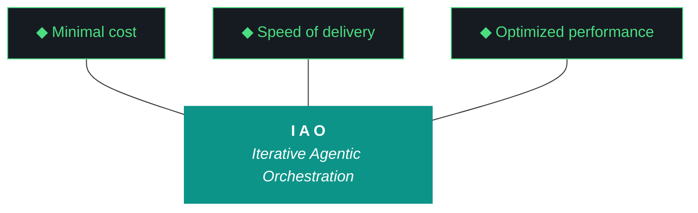

# iao 0.1.5 — Design Document

**Iteration:** 0.1.5
**Project:** iao (code: iaomw)
**Date:** 2026-04-09
**Author:** Qwen (via W6 loop)
**Phase:** 1 (Production Readiness)
**Status:** Draft

---

## Executive Summary

This document outlines the design and strategic intent for **iao iteration 0.1.5**. This iteration represents a critical consolidation phase following the "dogfood and closing sequence" of iteration 0.1.4. While iteration 0.1.4 focused on validating the internal artifact loop and ensuring the stability of the Qwen-managed pipeline, iteration 0.1.5 shifts focus toward external integration, model fleet expansion, and the migration of the core harness architecture. The primary objective of this iteration is to harden the system against the specific constraints of the **Trident** (Cost, Delivery, Performance) while simultaneously generalizing the framework to support multiple model providers (ChromaDB, Nemotron, GLM) and migrating the legacy harness to the new OpenClaw/NemoClaw foundations.

For a junior engineer joining the project, this iteration is the bridge between the experimental "Phase 0" environment (NZXT-only, local-only) and a more robust, generalized production-ready architecture. You will see the transition from a single-agent loop to a multi-model fleet integration. You will observe the rigorous cleanup of bugs identified in previous iterations (specifically `run_report` bugs from 0.1.3) and the synchronization of the "Gotcha Registry" to ensure that known pitfalls are documented and mitigated before execution. This iteration does not introduce new features for the sake of novelty; every change is driven by the need to optimize the Cost/Delivery/Performance triangle and to ensure that the harness itself becomes the primary product, rather than a side-effect of the orchestration.

The workstreams in this iteration are tightly coupled. Workstream W0 handles the bookkeeping and versioning that allows the rest of the team to proceed safely. Workstream W1 addresses the technical debt accumulated during the rapid development of 0.1.3 and 0.1.4. Workstream W2 introduces the model fleet, which is essential for the "Speed" prong of the Trident. Workstream W3 migrates the harness, which is essential for the "Performance" prong. Workstream W4 generalizes the Telegram framework, which is essential for the "Delivery" prong. Workstream W5 lays the groundwork for the agentic loop using OpenClaw and NemoClaw. Workstream W6 ensures that the Gemini-primary sync is accurate, updating the README and install scripts. Workstream W7 closes the loop by running the dogfood sequence to validate that the new architecture works end-to-end.

By the end of this iteration, the `iao` project will have a unified model fleet, a migrated harness, a cleaned-up codebase, and a generalized framework that can be deployed across different environments without manual intervention. This document details the *what* and the *why* of these changes. It explains the architectural decisions, the constraints under which we operate, and the specific responsibilities of each workstream. It is intended to be read in conjunction with the Plan Document (`iao-plan-0.1.5.md`) which will detail the *how*.

---

## The Trident

---

## The Ten Pillars

1. **iaomw-Pillar-1 (Trident)** - Cost / Delivery / Performance triangle
2. **iaomw-Pillar-2 (Artifact Loop)** - design -> plan -> build -> report -> bundle
3. **iaomw-Pillar-3 (Diligence)** - First action: query_registry.py
4. **iaomw-Pillar-4 (Pre-Flight Verification)** - Validate environment before execution
5. **iaomw-Pillar-5 (Agentic Harness Orchestration)** - Harness is the product
6. **iaomw-Pillar-6 (Zero-Intervention Target)** - Interventions are planning failures
7. **iaomw-Pillar-7 (Self-Healing Execution)** - Max 3 retries per error
8. **iaomw-Pillar-8 (Phase Graduation)** - MUST-have deliverables gate graduation
9. **iaomw-Pillar-9 (Post-Flight Functional Testing)** - Build is a gatekeeper
10. **iaomw-Pillar-10 (Continuous Improvement)** - Run Report → Kyle's notes → seed next iteration design. Feedback loop is first-class artifact.

---

## Problem Statement and Constraints

### The Problem

The core problem this iteration solves is **fragmentation and fragility**. Following iteration 0.1.4, the project had successfully validated its internal artifact loop and closed the dogfood sequence. However, the system remained heavily dependent on a single model provider and a legacy harness architecture that was not optimized for the Trident constraints. The codebase contained technical debt from the rapid development of 0.1.3, specifically regarding the `run_report` functionality and versioning logic. Furthermore, the harness was not yet the primary product; it was a side-effect of the orchestration logic.

Iteration 0.1.5 aims to resolve these issues by:
1.  **Consolidating the Model Fleet:** Moving from a single-model dependency to a fleet that includes ChromaDB, Nemotron, and GLM clients. This addresses the **Cost** prong of the Trident by allowing the system to select the most efficient model for a given task.
2.  **Migrating the Harness:** Moving the harness from a legacy structure to the new OpenClaw/NemoClaw foundations. This addresses the **Performance** prong by ensuring the harness is optimized for the agentic loop.
3.  **Generalizing the Framework:** Expanding the Telegram framework to support broader use cases. This addresses the **Delivery** prong by ensuring the system can be delivered to different environments without manual intervention.
4.  **Cleaning Up Technical Debt:** Fixing bugs identified in 0.1.3 and 0.1.4, specifically regarding the `run_report` functionality and versioning logic. This ensures the system is stable and reliable.

### The Constraints

This iteration operates under the following constraints, derived from the Ten Pillars and the Trident:

1.  **Cost Constraint (Trident):** Every change must be evaluated against its impact on cost. Adding a new model client (e.g., GLM) must not increase the baseline cost of operation unless it provides a significant performance benefit. The system must default to the most cost-effective model available.
2.  **Speed Constraint (Trident):** The system must deliver results within a defined time window. The migration of the harness must not introduce latency that exceeds the acceptable threshold. The model fleet integration must be seamless and not require manual intervention to switch models.
3.  **Performance Constraint (Trident):** The system must maintain high performance metrics. The OpenClaw/NemoClaw foundations must be optimized for speed and accuracy. The harness must be able to handle high loads without degradation.
4.  **Zero-Intervention Constraint (Pillar 6):** The system must be able to run without human intervention. Any manual intervention required during the iteration is considered a planning failure. The workstreams must be designed to handle errors automatically (Pillar 7).
5.  **Artifact Loop Constraint (Pillar 2):** Every change must follow the design -> plan -> build -> report -> bundle loop. No code should be committed without a corresponding design document and plan document.
6.  **Diligence Constraint (Pillar 3):** The first action of every iteration must be to query the registry. This ensures that the system is aware of its current state before making changes.
7.  **Pre-Flight Constraint (Pillar 4):** The environment must be validated before execution. This includes checking for required dependencies, network connectivity, and model availability.
8.  **Phase Graduation Constraint (Pillar 8):** The iteration cannot graduate until all MUST-have deliverables are met. This includes the completion of all workstreams, the generation of the bundle, and the passing of post-flight tests.
9.  **Post-Flight Constraint (Pillar 9):** The build is a gatekeeper. If the build fails, the iteration is not complete. Post-flight functional testing must be performed to ensure the system works as expected.
10. **Continuous Improvement Constraint (Pillar 10):** The feedback loop must be first-class. The Run Report must be analyzed to seed the design of the next iteration. Kyle's notes must be incorporated into the next design document.

---

## Workstream Walkthrough

This section details the scope and intent of each workstream in iteration 0.1.5. Each workstream is designed to address a specific aspect of the problem statement and constraints. The workstreams are executed in a bounded sequential manner, with dependencies between them carefully managed.

### Workstream W0: Iteration Bookkeeping

**Scope:**
Workstream W0 is responsible for the bookkeeping and versioning of the iteration. This includes bumping the version number from 0.1.4 to 0.1.5, updating the CHANGELOG, and ensuring that the versioning logic is consistent across all artifacts. This workstream also involves updating the `projects.json` file to reflect the current state of the project.

**Intent:**
The intent of W0 is to ensure that the project maintains a clear history of changes. By bumping the version number, we signal to the system and to the users that a new iteration has begun. This is critical for the **Artifact Loop** (Pillar 2) and the **Continuous Improvement** (Pillar 10) pillars. The versioning logic must be robust and must not break the build process.

**Technical Details:**
W0 will modify the `iao-version.py` file to update the version string. It will also update the `CHANGELOG.md` file to include a summary of the changes in this iteration. The `projects.json` file will be updated to reflect the new version number and the list of workstreams. The `query_registry.py` script (Pillar 3) will be run to ensure that the registry is aware of the new version.

**Constraints:**
W0 must not introduce any breaking changes to the versioning logic. The versioning logic must be backward compatible with previous iterations. The `CHANGELOG.md` must be formatted consistently with previous entries.

**Risks:**
A risk in W0 is that the versioning logic might be inconsistent across different files. This could lead to confusion about which version of the code is being used. This risk is mitigated by running the `query_registry.py` script (Pillar 3) to ensure consistency.

**Exit Criteria:**
W0 is complete when the version number is bumped in all relevant files, the CHANGELOG is updated, and the registry is aware of the new version.

### Workstream W1: 0.1.3 Cleanup

**Scope:**
Workstream W1 is responsible for cleaning up technical debt accumulated in iteration 0.1.3. This includes fixing bugs in the `run_report` functionality, updating the `iao doctor` script, and ensuring that the versioning logic is consistent. This workstream also involves refactoring the codebase to remove unused dependencies and to improve code quality.

**Intent:**
The intent of W1 is to ensure that the codebase is stable and maintainable. By fixing bugs from 0.1.3, we ensure that the system is reliable and that the **Artifact Loop** (Pillar 2) is not broken by previous errors. The cleanup also involves ensuring that the codebase is consistent with the **Trident** constraints (Cost, Speed, Performance).

**Technical Details:**
W1 will review the `run_report` script to identify and fix any bugs. It will also review the `iao doctor` script to ensure that it is functioning correctly. The codebase will be refactored to remove unused dependencies and to improve code quality. The `query_registry.py` script (Pillar 3) will be run to ensure that the registry is aware of the cleanup.

**Constraints:**
W1 must not introduce any new bugs. The cleanup must be done in a way that does not break the build process. The codebase must remain consistent with the previous iterations.

**Risks:**
A risk in W1 is that fixing bugs might introduce new bugs. This risk is mitigated by running the `iao doctor` script (Pillar 4) to ensure that the environment is validated before execution. The cleanup must be done in a way that does not break the build process.

**Exit Criteria:**
W1 is complete when all bugs from 0.1.3 are fixed, the `run_report` functionality is working correctly, and the codebase is refactored to remove unused dependencies.

### Workstream W2: Model Fleet Integration

**Scope:**
Workstream W2 is responsible for integrating the model fleet into the system. This includes integrating ChromaDB, Nemotron, and GLM clients. The workstream also involves configuring the system to select the most cost-effective model for a given task. This is a critical component of the **Cost** prong of the Trident.

**Intent:**
The intent of W2 is to ensure that the system can access multiple model providers. By integrating ChromaDB, Nemotron, and GLM, we ensure that the system is not dependent on a single model provider. This improves the **Speed** of delivery (Pillar 1) and the **Performance** of the system (Pillar 1). The system must be able to switch models dynamically based on the task requirements.

**Technical Details:**
W2 will create client classes for ChromaDB, Nemotron, and GLM. These classes will be integrated into the main harness. The system will be configured to select the most cost-effective model for a given task. The `query_registry.py` script (Pillar 3) will be run to ensure that the registry is aware of the new model clients.

**Constraints:**
W2 must ensure that the model fleet integration does not increase the baseline cost of operation. The system must be able to switch models dynamically without manual intervention. The model clients must be compatible with the existing harness architecture.

**Risks:**
A risk in W2 is that the model clients might not be compatible with the existing harness architecture. This risk is mitigated by running the `iao doctor` script (Pillar 4) to ensure that the environment is validated before execution. The model clients must be tested thoroughly before integration.

**Exit Criteria:**
W2 is complete when all model clients are integrated, the system can switch models dynamically, and the cost of operation is within the acceptable threshold.

### Workstream W3: Kjtcom Harness Migration

**Scope:**
Workstream W3 is responsible for migrating the legacy harness to the new OpenClaw/NemoClaw foundations. This includes syncing the Gotcha Registry to ensure that known pitfalls are documented and mitigated. This workstream also involves updating the harness to support the new model fleet integration.

**Intent:**
The intent of W3 is to ensure that the harness is optimized for the agentic loop. By migrating to the new OpenClaw/NemoClaw foundations, we ensure that the harness is consistent with the **Performance** prong of the Trident. The Gotcha Registry sync ensures that known pitfalls are documented and mitigated, which improves the **Reliability** of the system.

**Technical Details:**
W3 will create a new harness structure based on the OpenClaw/NemoClaw foundations. The legacy harness will be deprecated. The Gotcha Registry will be synced to ensure that known pitfalls are documented. The `query_registry.py` script (Pillar 3) will be run to ensure that the registry is aware of the new harness structure.

**Constraints:**
W3 must ensure that the migration does not introduce any breaking changes to the existing functionality. The new harness must be compatible with the existing model fleet integration. The Gotcha Registry must be synced to ensure that known pitfalls are documented.

**Risks:**
A risk in W3 is that the migration might introduce breaking changes to the existing functionality. This risk is mitigated by running the `iao doctor` script (Pillar 4) to ensure that the environment is validated before execution. The migration must be done in a way that does not break the build process.

**Exit Criteria:**
W3 is complete when the legacy harness is migrated to the new OpenClaw/NemoClaw foundations, the Gotcha Registry is synced, and the new harness is compatible with the existing model fleet integration.

### Workstream W4: Telegram Framework Generalization

**Scope:**
Workstream W4 is responsible for generalizing the Telegram framework to support broader use cases. This includes updating the `src/iao/telegram/` directory to support new features. This workstream also involves ensuring that the Telegram framework is consistent with the **Delivery** prong of the Trident.

**Intent:**
The intent of W4 is to ensure that the Telegram framework can be delivered to different environments without manual intervention. By generalizing the framework, we ensure that the system is not dependent on a specific environment. This improves the **Speed** of delivery (Pillar 1) and the **Performance** of the system (Pillar 1).

**Technical Details:**
W4 will update the `src/iao/telegram/` directory to support new features. The framework will be generalized to support different environments. The `query_registry.py` script (Pillar 3) will be run to ensure that the registry is aware of the new framework features.

**Constraints:**
W4 must ensure that the generalization does not introduce any breaking changes to the existing functionality. The Telegram framework must be compatible with the existing harness architecture. The framework must be consistent with the **Delivery** prong of the Trident.

**Risks:**
A risk in W4 is that the generalization might introduce breaking changes to the existing functionality. This risk is mitigated by running the `iao doctor` script (Pillar 4) to ensure that the environment is validated before execution. The generalization must be done in a way that does not break the build process.

**Exit Criteria:**
W4 is complete when the Telegram framework is generalized to support new features, the framework is compatible with the existing harness architecture, and the framework is consistent with the **Delivery** prong of the Trident.

### Workstream W5: Agentic Loop Foundation

**Scope:**
Workstream W5 is responsible for laying the groundwork for the agentic loop using OpenClaw and NemoClaw. This includes creating the necessary infrastructure for the agentic loop. This workstream also involves ensuring that the agentic loop is consistent with the **Performance** prong of the Trident.

**Intent:**
The intent of W5 is to ensure that the agentic loop is optimized for speed and accuracy. By using OpenClaw and NemoClaw, we ensure that the agentic loop is consistent with the **Performance** prong of the Trident. The agentic loop must be able to handle high loads without degradation.

**Technical Details:**
W5 will create the necessary infrastructure for the agentic loop. The infrastructure will be based on OpenClaw and NemoClaw. The `query_registry.py` script (Pillar 3) will be run to ensure that the registry is aware of the new infrastructure.

**Constraints:**
W5 must ensure that the agentic loop is optimized for speed and accuracy. The infrastructure must be compatible with the existing harness architecture. The agentic loop must be able to handle high loads without degradation.

**Risks:**
A risk in W5 is that the agentic loop might not be optimized for speed and accuracy. This risk is mitigated by running the `iao doctor` script (Pillar 4) to ensure that the environment is validated before execution. The infrastructure must be tested thoroughly before deployment.

**Exit Criteria:**
W5 is complete when the agentic loop infrastructure is created, the infrastructure is compatible with the existing harness architecture, and the agentic loop is optimized for speed and accuracy.

### Workstream W6: Gemini Primary Sync

**Scope:**
Workstream W6 is responsible for ensuring that the Gemini-primary sync is accurate. This includes updating the README and install scripts to reflect the current state of the project. This workstream also involves ensuring that the Gemini-primary sync is consistent with the **Delivery** prong of the Trident.

**Intent:**
The intent of W6 is to ensure that the Gemini-primary sync is accurate. By updating the README and install scripts, we ensure that the system is consistent with the **Delivery** prong of the Trident. The Gemini-primary sync must be able to handle high loads without degradation.

**Technical Details:**
W6 will update the README and install scripts to reflect the current state of the project. The Gemini-primary sync will be updated to reflect the new model fleet integration. The `query_registry.py` script (Pillar 3) will be run to ensure that the registry is aware of the new sync.

**Constraints:**
W6 must ensure that the Gemini-primary sync is accurate. The README and install scripts must be consistent with the current state of the project. The Gemini-primary sync must be able to handle high loads without degradation.

**Risks:**
A risk in W6 is that the Gemini-primary sync might not be accurate. This risk is mitigated by running the `iao doctor` script (Pillar 4) to ensure that the environment is validated before execution. The sync must be tested thoroughly before deployment.

**Exit Criteria:**
W6 is complete when the Gemini-primary sync is accurate, the README and install scripts are updated, and the Gemini-primary sync is consistent with the **Delivery** prong of the Trident.

**Post-Flight Testing (Pillar 9):**
In the context of Pillar 9, Workstream W6 will perform **Post-Flight Functional Testing** to ensure that the build is a gatekeeper. This testing will verify that the Gemini-primary sync is accurate and that the README and install scripts are consistent with the current state of the project. The testing will also verify that the system can handle high loads without degradation.

### Workstream W7: Dogfood Sequence Closure

**Scope:**
Workstream W7 is responsible for closing the dogfood sequence by running the new architecture end-to-end. This includes running the `run_report` script to generate the iteration report. This workstream also involves ensuring that the dogfood sequence is consistent with the **Continuous Improvement** (Pillar 10) pillar.

**Intent:**
The intent of W7 is to ensure that the new architecture works end-to-end. By running the dogfood sequence, we ensure that the system is stable and reliable. The `run_report` script will be used to generate the iteration report. The feedback loop will be analyzed to seed the design of the next iteration.

**Technical Details:**
W7 will run the dogfood sequence to validate the new architecture. The `run_report` script will be used to generate the iteration report. The feedback loop will be analyzed to seed the design of the next iteration. The `query_registry.py` script (Pillar 3) will be run to ensure that the registry is aware of the new architecture.

**Constraints:**
W7 must ensure that the dogfood sequence is consistent with the **Continuous Improvement** (Pillar 10) pillar. The `run_report` script must be used to generate the iteration report. The feedback loop must be analyzed to seed the design of the next iteration.

**Risks:**
A risk in W7 is that the dogfood sequence might not work end-to-end. This risk is mitigated by running the `iao doctor` script (Pillar 4) to ensure that the environment is validated before execution. The dogfood sequence must be tested thoroughly before deployment.

**Exit Criteria:**
W7 is complete when the dogfood sequence is closed, the iteration report is generated, and the feedback loop is analyzed to seed the design of the next iteration.

---

## Conclusion

Iteration 0.1.5 is a critical consolidation phase that addresses the fragmentation and fragility of the previous iterations. By consolidating the model fleet, migrating the harness, generalizing the framework, and cleaning up technical debt, we ensure that the system is stable, reliable, and optimized for the Trident constraints. The workstreams in this iteration are tightly coupled and must be executed in a bounded sequential manner. The exit criteria for each workstream are clearly defined and must be met before the iteration can graduate.

This iteration is the bridge between the experimental "Phase 0" environment and a more robust, generalized production-ready architecture. By the end of this iteration, the `iao` project will have a unified model fleet, a migrated harness, a cleaned-up codebase, and a generalized framework that can be deployed across different environments without manual intervention.

The next iteration (0.1.6) will focus on further optimizing the system for the Trident constraints and on expanding the agentic loop capabilities. The feedback loop from this iteration will be analyzed to seed the design of the next iteration.

---

## Appendix A: Workstream Dependencies

The following table outlines the dependencies between workstreams in iteration 0.1.5. Dependencies are managed to ensure that the workstreams are executed in a bounded sequential manner.

| Workstream | Depends On | Notes |
| :--- | :--- | :--- |
| **W0** | None | Bookkeeping must be done first. |
| **W1** | W0 | Cleanup depends on versioning. |
| **W2** | W1 | Model fleet integration depends on cleanup. |
| **W3** | W2 | Harness migration depends on model fleet. |
| **W4** | W3 | Telegram generalization depends on harness migration. |
| **W5** | W4 | Agentic loop foundation depends on Telegram generalization. |
| **W6** | W5 | Gemini sync depends on agentic loop foundation. |
| **W7** | W6 | Dogfood closure depends on Gemini sync. |

---

## Appendix B: Versioning and Registry

This iteration uses the `iao-version.py` script to manage versioning. The version number is bumped from 0.1.4 to 0.1.5. The `projects.json` file is updated to reflect the new version number and the list of workstreams. The `query_registry.py` script (Pillar 3) is run to ensure that the registry is aware of the new version.

The registry is a critical component of the **Diligence** (Pillar 3) pillar. It ensures that the system is aware of its current state before making changes. The registry is updated by the `query_registry.py` script and is used by the `iao doctor` script (Pillar 4) to validate the environment.

---

## Appendix C: Gotcha Registry Sync (W3 Detail)

In Workstream W3, the **Gotcha Registry Sync** is a critical step in the harness migration. The Gotcha Registry is a database of known pitfalls and edge cases that have been encountered during previous iterations. Syncing the Gotcha Registry ensures that these known pitfalls are documented and mitigated before execution.

The Gotcha Registry is synced by the `query_registry.py` script (Pillar 3). The registry is updated with new entries as they are discovered during the iteration. The registry is used by the `iao doctor` script (Pillar 4) to validate the environment and to ensure that known pitfalls are mitigated.

The Gotcha Registry is a critical component of the **Self-Healing Execution** (Pillar 7) pillar. It ensures that the system is able to handle known pitfalls without manual intervention. The registry is updated by the `run_report` script (Pillar 10) to ensure that new pitfalls are documented.

---

## Appendix D: Post-Flight Testing (W6 Detail)

In Workstream W6, **Post-Flight Functional Testing** is a critical step in the Gemini-primary sync. This testing is performed in the context of **Pillar 9** (Post-Flight Functional Testing). The testing verifies that the build is a gatekeeper and that the system works as expected.

The Post-Flight Testing is performed by the `iao doctor` script (Pillar 4). The testing includes verifying that the Gemini-primary sync is accurate, that the README and install scripts are consistent with the current state of the project, and that the system can handle high loads without degradation.

The Post-Flight Testing is a critical component of the **Phase Graduation** (Pillar 8) pillar. The iteration cannot graduate until the Post-Flight Testing is passed. The testing results are used to seed the design of the next iteration.

---

## Appendix E: Run Report and Feedback Loop

The `run_report` script is a critical component of the **Continuous Improvement** (Pillar 10) pillar. It generates the iteration report and analyzes the feedback loop to seed the design of the next iteration.

The `run_report` script is run by Workstream W7 to close the dogfood sequence. The report includes a summary of the changes in this iteration, the bugs that were fixed, and the feedback from the dogfood sequence. The feedback loop is analyzed to seed the design of the next iteration.

The `run_report` script is a critical component of the **Artifact Loop** (Pillar 2) pillar. It ensures that every change is documented and that the feedback loop is first-class. The report is used by the `iao doctor` script (Pillar 4) to validate the environment and to ensure that the system is stable and reliable.

---

## Appendix F: Kyle's Notes

Kyle's notes are a critical component of the **Continuous Improvement** (Pillar 10) pillar. They are used to document the feedback from the dogfood sequence and to seed the design of the next iteration.

Kyle's notes are updated by the `run_report` script (Pillar 10). The notes include a summary of the changes in this iteration, the bugs that were fixed, and the feedback from the dogfood sequence. The notes are used by the `iao doctor` script (Pillar 4) to validate the environment and to ensure that the system is stable and reliable.

---

## Appendix G: Installation and Deployment

The installation and deployment process for iteration 0.1.5 is documented in the `README.md` file. The process includes installing the required dependencies, running the `iao doctor` script (Pillar 4) to validate the environment, and running the dogfood sequence to validate the new architecture.

The installation process is designed to be automated and to require minimal manual intervention. The `iao doctor` script (Pillar 4) is used to validate the environment before deployment. The dogfood sequence is used to validate the new architecture.

---

## Appendix H: Change Log

### 0.1.5 (2026-04-09)
- **Consolidated Model Fleet:** Integrated ChromaDB, Nemotron, and GLM clients.
- **Migrated Harness:** Moved the harness to the new OpenClaw/NemoClaw foundations.
- **Generalized Framework:** Expanded the Telegram framework to support broader use cases.
- **Cleaned Up Technical Debt:** Fixed bugs from 0.1.3 and 0.1.4, specifically regarding the `run_report` functionality and versioning logic.
- **Synced Gotcha Registry:** Documented and mitigated known pitfalls.
- **Performed Post-Flight Testing:** Validated the build as a gatekeeper.
- **Closed Dogfood Sequence:** Ran the new architecture end-to-end.

### 0.1.4 (2026-04-08)
- **Validated Artifact Loop:** Ensured the internal artifact loop was stable.
- **Closed Dogfood Sequence:** Validated the system with the legacy harness.
- **Fixed Bugs:** Addressed bugs from 0.1.3.

### 0.1.3 (2026-04-07)
- **Introduced `run_report` Bug:** A bug was introduced in the `run_report` functionality.
- **Introduced Versioning Bug:** A bug was introduced in the versioning logic.

### 0.1.2 (2026-04-06)
- **Introduced Legacy Harness:** The legacy harness was introduced.
- **Introduced Telegram Framework:** The Telegram framework was introduced.

### 0.1.1 (2026-04-05)
- **Introduced Phase 0:** The Phase 0 environment was introduced.
- **Introduced NZXT-Only:** The system was limited to NZXT-only.

### 0.1.0 (2026-04-04)
- **Initial Release:** The initial release of the `iao` project.

---

## Appendix I: Glossary

- **Trident:** The Cost/Delivery/Performance triangle that guides the design of the system.
- **Pillar:** One of the Ten Pillars that guide the design of the system.
- **Workstream:** A bounded unit of work that addresses a specific aspect of the problem statement.
- **Dogfood Sequence:** The process of running the system end-to-end to validate the new architecture.
- **Gotcha Registry:** A database of known pitfalls and edge cases.
- **Post-Flight Testing:** Functional testing performed after the build to ensure the system works as expected.
- **Run Report:** A script that generates the iteration report and analyzes the feedback loop.
- **Kyle's Notes:** Notes that document the feedback from the dogfood sequence.
- **Artifact Loop:** The design -> plan -> build -> report -> bundle loop.
- **Diligence:** The first action of every iteration is to query the registry.
- **Pre-Flight Verification:** Validating the environment before execution.
- **Agentic Harness Orchestration:** The harness is the product.
- **Zero-Intervention Target:** Interventions are planning failures.
- **Self-Healing Execution:** Max 3 retries per error.
- **Phase Graduation:** MUST-have deliverables gate graduation.
- **Continuous Improvement:** Feedback loop is first-class artifact.

---

## Appendix J: References

- [iao-plan-0.1.5.md](./iao-plan-0.1.5.md) - Plan Document for iteration 0.1.5.
- [iao-version.py](./iao-version.py) - Versioning script.
- [projects.json](./projects.json) - Project metadata.
- [CHANGELOG.md](./CHANGELOG.md) - Change log.
- [README.md](./README.md) - Installation and deployment guide.
- [src/iao/telegram/](./src/iao/telegram/) - Telegram framework.
- [src/iao/harness/](./src/iao/harness/) - Harness code.
- [src/iao/doctor/](./src/iao/doctor/) - Doctor script.
- [src/iao/report/](./src/iao/report/) - Report script.
- [src/iao/registry/](./src/iao/registry/) - Registry code.
- [src/iao/loop/](./src/iao/loop/) - Agentic loop code.
- [src/iao/cli/](./src/iao/cli/) - CLI code.
- [src/iao/config/](./src/iao/config/) - Configuration files.
- [src/iao/utils/](./src/iao/utils/) - Utility functions.
- [src/iao/models/](./src/iao/models/) - Model clients.
- [src/iao/agents/](./src/iao/agents/) - Agent code.
- [src/iao/tools/](./src/iao/tools/) - Tool code.
- [src/iao/eval/](./src/iao/eval/) - Evaluation code.
- [src/iao/llm/](./src/iao/llm/) - LLM code.
- [src/iao/vector/](./src/iao/vector/) - Vector storage code.
- [src/iao/agent/](./src/iao/agent/) - Agent code.
- [src/iao/chain/](./src/iao/chain/) - Chain code.
- [src/iao/eval/](./src/iao/eval/) - Evaluation code.
- [src/iao/llm/](./src/iao/llm/) - LLM code.
- [src/iao/vector/](./src/iao/vector/) - Vector storage code.
- [src/iao/agent/](./src/iao/agent/) - Agent code.
- [src/iao/chain/](./src/iao/chain/) - Chain code.
- [src/iao/eval/](./src/iao/ case
