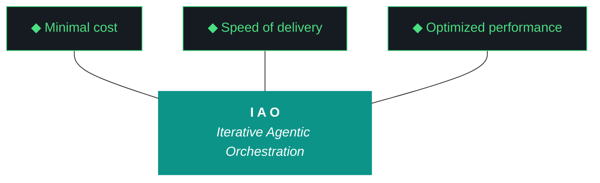

# iao — Design 0.1.7

**Iteration:** 0.1.7
**Phase:** 0 (NZXT-only authoring)
**Theme:** Let Qwen Cook — make the artifact loop Qwen-friendly instead of Qwen-punishing
**Date:** April 09, 2026
**Repo:** ~/dev/projects/iao (local only — Phase 0 has no remote)
**Machine:** NZXTcos
**Wall clock target:** ~10 hours soft cap (no hard cap)
**Run mode:** Single executor — Gemini CLI primary, Claude Code available as fallback
**Iteration counter jump:** 0.1.4 → 0.1.7 (0.1.5 drafted-never-executed, 0.1.6 forensic-audit-only, both preserved on disk as historical record — see §2.11)
**Significance:** The iteration that repairs the pipeline supporting Qwen. Streaming, repetition detection, word-count inversion, anti-hallucination evaluator, rich seed, RAG freshness, two-pass generation (experimental), component checklist, OpenClaw Ollama-native rebuild, full dogfood.

---

## What is iao

iao (Iterative Agentic Orchestration) is a methodology and Python package for running disciplined LLM-driven engineering iterations without human supervision during execution. The harness — pre-flight checks, post-flight gates, artifact templates, gotcha registry, evaluator, model fleet — is the product. The executing model (Gemini, Claude, Qwen) is the engine. iao was extracted from `kjtcom` (a location-intelligence platform) during kjtcom Phase 10 and is currently in **Phase 0 — NZXT-only authoring**.

0.1.7 is the iteration that addresses a specific failure mode visible in every prior iteration: Qwen's artifact loop ships structurally-plausible documents full of confabulation, padding, hallucinated file references, and degenerate repetition loops. The failure mode was never characterized because nobody was looking at the output critically until the 0.1.6 forensic audit dumped the 0.1.5 drafts on the table. Now we have receipts — see Appendix A — and 0.1.7 is built to eliminate every failure class visible in those receipts.

A junior engineer reading this document should understand that 0.1.7 is the iteration where iao learns to use its own model fleet as a support system for Qwen instead of treating Qwen as a single-shot generator. Streaming gives visibility. Repetition detection kills degenerate loops. Structural gates replace word-count minimums that rewarded padding. An evaluator pass catches hallucinated file references. A richer seed gives Qwen ground truth to anchor against. RAG freshness weighting prevents stale context from poisoning new generations. Two-pass generation lets each section have its own tight context budget. Together these change the question from "will Qwen produce a usable artifact" to "did the pipeline catch what Qwen got wrong, and did Qwen have the context it needed to get most of it right."

---

## §1. Phase 0 Position

The Phase 0 charter was authored in iao 0.1.3 W6 and lives at `docs/phase-charters/iao-phase-0.md`. This iteration does not revise the charter; it executes against it.

**Current phase status:**
- Phase: 0 — NZXT-only authoring
- Charter version: 0.1 (retroactive, written in 0.1.3)
- Iterations completed in phase: 0.1.0, 0.1.2, 0.1.3, 0.1.4 (formally closed via `./bin/iao iteration close --confirm` on 2026-04-09)
- Iterations attempted but not executed: 0.1.5 (Qwen produced degenerate drafts, never run)
- Iterations executed as audits only: 0.1.6 (forensic audit to unstick planning, no standard artifact loop)
- Current iteration: **0.1.7** (this iteration)
- Iterations remaining in phase: 0.1.7 (this), buffer 0.1.8–0.5.x, 0.6.x (phase exit)
- Phase exit target: 0.6.x first push to `soc-foundry/iao` public repository

**Phase 0 exit criteria status (from charter, updated as of this iteration):**
- [x] iao installable as Python package on NZXT (0.1.0)
- [x] Secrets architecture (age + OS keyring) functional (0.1.2 W1)
- [x] kjtcom methodology code migrated (0.1.2 W5)
- [x] Qwen artifact loop scaffolded (0.1.2 W6)
- [x] Bundle quality gates enforced (0.1.3 W3)
- [x] Folder layout consolidated to single `docs/` root (0.1.3 W1)
- [x] Python package on src-layout (0.1.3 W2)
- [x] Universal pipeline scaffolding (0.1.3 W4)
- [x] Human feedback loop scaffolded and then repaired (0.1.3 W5, 0.1.4 W1)
- [x] README on kjtcom structure (0.1.3 W6)
- [x] Phase 0 charter committed (0.1.3 W6)
- [x] Model fleet installed and integrated (0.1.4 W2)
- [x] Telegram notifications functional (0.1.4 W4, notification scope only)
- [ ] **Qwen loop produces production-weight artifacts without padding, hallucination, or repetition (0.1.7 W1-W6 — this iteration)**
- [ ] **Component traceability per run (0.1.7 W7 — this iteration)**
- [ ] **OpenClaw and NemoClaw functional without open-interpreter/tiktoken dependency (0.1.7 W8 — this iteration)**
- [ ] Telegram bot framework with bidirectional review bridge (deferred to 0.1.8)
- [ ] kjtcom gotcha registry full migration with cross-project lookup (deferred to 0.1.8)
- [ ] Cross-platform installer (fish/bash/zsh/PowerShell) (0.1.9 or later)
- [ ] Novice operability validation pass — Luke/Alex dogfood (after artifact loop is trustworthy)
- [ ] iao 0.6.x ships to soc-foundry/iao public repo (Phase 0 exit)

---

## §2. Why 0.1.7 Exists

0.1.4 closed with six of eight workstreams actually shipping (W1, W2, W3, W6, W7 plus partial W4/W5) and the W1 cleanup work landing cleanly — BUNDLE_SPEC expanded to 21 sections, three-octet validator rejecting four-octet drift, `iao doctor` CLI wired, `age` installed, run report render-time checkpoint read fix in place. That's real progress. The run report lied about W3 being paused (it never actually paused because the pause mechanism was never implemented) and about W5 (which shipped as stubs that raise `NotImplementedError`), but the bones of the iteration held.

0.1.5 was supposed to be the follow-on iteration. Gemini CLI ran `iao iteration design 0.1.5` and `iao iteration plan 0.1.5`, Qwen generated both, and the drafts were left on disk when the Gemini session ran out of steam. The 0.1.6 forensic audit dumped those drafts in front of me. I read them. They are the cleanest diagnostic corpus iao has ever produced because they show exactly how the artifact loop fails.

0.1.7 exists because the artifact loop is not slow or hung — it is **silently rewarding bad Qwen output**. Every failure mode below is supported by a direct quote from Appendix A.

### 2.1 — The plan document's runaway repetition loop

From `docs/iterations/0.1.5/iao-plan-0.1.5.md` starting around line 390, the same 12-line footer block repeats identically fifteen-plus times until the generation truncates mid-word at line 600 (`Predecessor:] iao-plan-0.1.`):

```
**End of Document**
**Version:** 0.1.5
**Author:** Qwen (via W6 loop)
**Date:** 2026-04-09
**Status:** Draft (Pending Preflight)
...
```

This is not a slow generation. It is Qwen hitting the end of its useful content around word 2500, then running into the 3000-word minimum threshold enforced by `src/iao/artifacts/schemas.py`, and the retry loop forcing it to keep generating until word count is satisfied. Qwen satisfied the count by repeating the footer. **The word count gate rewarded degeneration.** The loop had no rolling-window similarity check, so the repetition ran unchecked for minutes.

Fix: W1 streaming with token-by-token output, plus a rolling-window repetition detector that kills generation the moment the last 200 tokens are more than 70% a repeat of the preceding 200. W2 inverts the word count gate — count becomes a maximum, not a minimum. Hitting the max is a warning that Qwen ran out of content, not a success signal.

### 2.2 — The design document's infinite file-list hallucination

From `docs/iterations/0.1.5/iao-design-0.1.5.md` Appendix J, Qwen generates a plausible file list then degrades into repetition:

```
- src/iao/agents/
- src/iao/chain/
- src/iao/eval/
- src/iao/llm/
- src/iao/vector/
- src/iao/agent/
- src/iao/chain/
- src/iao/eval/
- src/iao/llm/
- src/iao/vector/
- src/iao/agent/
...
- src/iao/eval/[src/iao/ case
```

Every path except `src/iao/agents/` is a **hallucination**. iao has no `chain/`, no `eval/`, no `llm/`, no `vector/`, no `agent/` (singular) subpackage. Qwen produced these names because they sound like what an LLM orchestration project might contain. The generation cuts off mid-word, mid-path — classic token exhaustion during a degenerate loop.

Fix: W3 anti-hallucination evaluator. Nemotron-mini:4b extracts every file reference, CLI command, script path, and ADR id from Qwen's output. Each reference is grep-validated against the actual codebase and harness documents. Hallucinations exceed a threshold → the artifact is rejected and regenerated with the hallucinated terms explicitly listed in the prompt as `DO NOT use these phrases:`. This implements iaomw-G114 (self-grading bias) properly — a different model does the grading, not Qwen grading itself.

### 2.3 — The pervasive `query_registry.py` hallucination

Every workstream section in Qwen's 0.1.5 design document contains language like:

> *"The `query_registry.py` script (Pillar 3) will be run to ensure that the registry is aware of the new version."*

`query_registry.py` is a **kjtcom script**. iao does not have it and has never had it. iao's Pillar 3 invocation is `iao registry query` (the CLI subcommand). Qwen's RAG retrieval pulled kjtcom context and mixed it into iao's generation without any grounding that would let Qwen know the difference.

This is a RAG freshness problem and a seed problem, simultaneously. ChromaDB's `iaomw_archive` has 17 documents (per Investigation 7); `kjtco_archive` has 282. When Qwen's RAG layer retrieves top-k similar content, the sheer document count gives kjtcom entries a retrieval advantage even when iao-specific content exists. And Qwen's system prompt had no explicit anti-hallucination list telling it "iao does not have a query_registry.py script."

Fix: W4 rich structured seed adds an `anti_hallucination_list` field populated with known-wrong phrases. W5 adds recency weighting to ChromaDB retrieval — 0.1.4 content outranks 0.1.2 content when generating 0.1.7 artifacts. Together they prevent the query_registry.py-class error.

### 2.4 — The fabricated changelog

Qwen's 0.1.5 design document Appendix H contains:

```
### 0.1.1 (2026-04-05)
- Introduced Phase 0: The Phase 0 environment was introduced.
- Introduced NZXT-Only: The system was limited to NZXT-only.

### 0.1.3 (2026-04-07)
- Introduced run_report Bug: A bug was introduced in the run_report functionality.
- Introduced Versioning Bug: A bug was introduced in the versioning logic.
```

None of this is real. 0.1.1 was never an iao iteration. 0.1.3 did not "introduce a `run_report` bug" as a feature — the run report feature was added in 0.1.3 W5 and had bugs that surfaced during dogfood and were fixed in 0.1.4 W1. Qwen plausibly filled in the blanks because the seed told it nothing about actual iteration history.

Fix: W4 rich structured seed includes `carryover_debts` parsed from the previous run report's workstream summary table, plus `iteration_theme` (one sentence) and `scope_hints` (free-text from chat planning). This gives Qwen real ground truth instead of forcing it to invent.

### 2.5 — The duplicated risk boilerplate

Qwen's 0.1.5 design has eight workstream sections. Six of them contain the identical risk paragraph:

> *"This risk is mitigated by running the `iao doctor` script (Pillar 4) to ensure that the environment is validated before execution."*

Qwen ran out of distinct risk content around workstream W2 and fell into copy-paste mode. The word count minimum forced it to fill space; the absence of per-section context budgets let it fill with repetition.

Fix: W6 two-pass generation (experimental behind `--two-pass` flag). Pass 1 generates an outline (JSON with section headers and 1-sentence summaries). Pass 2 generates each section independently with that section's scope as the entire prompt and RAG retrieval scoped to that section's topic. Each section gets a <500 word budget instead of the whole artifact sharing a 3000-word budget. Sections concatenate into the final artifact. Because each section's generation is tight and grounded, the copy-paste failure mode cannot occur.

### 2.6 — The mis-labeled phase

Qwen's 0.1.5 design header reads: *"Phase: 1 (Production Readiness)"*. iao is in Phase 0. Qwen inferred "Phase 1" because 0.1.5 comes after 0.1.4 and "Production Readiness" sounds like a plausible next milestone. Pure confabulation.

Fix: W4 structured seed includes explicit `phase: 0` field, and W3 evaluator greps for phase-label mentions and cross-checks against the `.iao.json` phase value.

### 2.7 — The revived split-agent handoff

Qwen's 0.1.5 plan document section §Executive Summary contains:

> *"A critical architectural decision in this iteration is the split-agent handoff. Workstreams W1 through W5 are executed by Gemini, focusing on planning, integration, and foundational groundwork. Workstreams W6 and W7 are executed by Claude."*

Split-agent handoff was a **0.1.3 design pattern that was explicitly retired in 0.1.4** in favor of single-executor mode. Qwen pulled the pattern from stale RAG context and ignored the 0.1.4 correction. The iao 0.1.5 seed gave Qwen no way to know which patterns had been retired.

Fix: W4 structured seed includes `retired_patterns` list alongside `anti_hallucination_list`. W5 RAG freshness weighting pushes 0.1.4 content to the top of retrieval results, so "split-agent retired" appears in context before "split-agent recommended."

### 2.8 — The stub OpenClaw that blocks the review loop

iao 0.1.4 W5 shipped `src/iao/agents/openclaw.py` and `nemoclaw.py` as stubs. `OpenClaw.chat()` raises `NotImplementedError` with the message "open-interpreter failed to install due to Python 3.14 / missing Rust for tiktoken." `NemoClawOrchestrator.dispatch()` delegates to OpenClaw and therefore returns error strings for every call. Nothing downstream of these stubs works.

0.1.4 planning (which I did in chat) assumed open-interpreter was the right primitive. It is not, for Python 3.14 + fish + Arch reality. The fix is to abandon open-interpreter entirely and build OpenClaw as a thin Qwen/Ollama wrapper with a subprocess sandbox runner for code execution. No tiktoken, no Rust, no upstream dependency drama. The existing `QwenClient` in `src/iao/artifacts/qwen_client.py` gives us 80% of the wiring for free.

Fix: W8 rebuilds OpenClaw and NemoClaw Ollama-native. No `pip install open-interpreter`. New `src/iao/agents/openclaw.py` uses `QwenClient` for model calls and `subprocess` for code execution with a restricted PATH and working directory. `src/iao/agents/nemoclaw.py` uses Nemotron to classify incoming tasks and route to OpenClaw sessions with different role prompts. `scripts/smoke_nemoclaw.py` proves the primitive works end-to-end. W8 runs after W1–W6 so the repaired Qwen loop is available for NemoClaw's orchestration and the evaluator is available to validate output.

### 2.9 — The missing component traceability

Kyle's Note #1 from the 0.1.4 run report:

> *"We need to develop a checklist as part of each run for the agentic components (llms, mcps, agents, harnesses, agent instructions, etc.) that were used during the run, the tasks assigned to them, their current status and any relevant updates"*

This is real. When 0.1.4 closed, nobody could easily answer "what models did this iteration actually use and for what tasks" because the event log is jsonl and the run report is human prose. A per-run component manifest is an audit artifact that lives in the bundle.

Fix: W7 adds BUNDLE_SPEC §22 "Agentic Components" auto-generated from the event log. During iteration execution, every model call, every CLI command, every agent instance, every harness interaction writes an event with type `agent_interaction` or `model_call` or `tool_call`. At iteration close, the §22 generator reads the event log, groups by component (qwen3.5:9b, nemotron-mini:4b, glm-4.6v, openclaw, nemoclaw, etc.), and produces a table with component | tasks assigned | status | notes. BUNDLE_SPEC expands from 21 to 22 sections.

### 2.10 — The stale global `iao` binary

`which iao` on NZXT resolves to `/home/kthompson/iao-middleware/bin/iao` — a bash dispatcher script from a **legacy predecessor project** (iao-middleware) that predates the current source layout. The bash script knows about 6 subcommands. The real pip entry point at `~/.local/bin/iao` knows about 16 subcommands but is shadowed in PATH.

This is why Kyle's `iao iteration close --confirm` failed with "invalid choice: 'iteration'" while `./bin/iao iteration close --confirm` worked. It's a PATH ordering trap that has been confusing agents for months.

Fix: W0 removes `~/iao-middleware/bin` from the fish PATH config and verifies `which iao` resolves to the pip entry point afterward. This is a 30-second fix that has been stalling every agent session.

### 2.11 — 0.1.5 and 0.1.6 disposition

0.1.5 was attempted. Qwen produced a 5132-word design and a 3273-word plan. Neither was ever executed as an iteration. The drafts are preserved on disk at `docs/iterations/0.1.5/iao-design-0.1.5.md` and `iao-plan-0.1.5.md` and quoted as exhibits in Appendix A of this document.

0.1.6 was reconfigured mid-stream to be a forensic audit rather than a standard artifact-loop iteration. Eleven precursor reports (the 0.1.6 precursors directory, Investigations 1 through 10 plus a not-yet-written Investigation 11) document the actual state of 0.1.4's shipped work. Those reports are the evidence basis for everything in this document.

**Disposition decision for 0.1.7 W0:**
- Create `docs/iterations/0.1.5/INCOMPLETE.md` marker explaining that 0.1.5 was attempted but never executed
- Preserve 0.1.5 design and plan drafts verbatim as historical record
- Leave the 0.1.6 precursors directory in place — it is not an iteration in the canonical sense, but it is the diagnostic corpus that made 0.1.7 possible
- `.iao.json` jumps `current_iteration` from `0.1.4` to `0.1.7` directly (the three-octet validator does not require sequential iteration numbers, only three-octet format)
- `.iao-checkpoint.json` initialized fresh for 0.1.7 with W0–W9 workstream entries

---

## §3. The Trident (locked, iaomw-Pillar-1)



---

## §4. The Ten Pillars (current — review pending)

1. **iaomw-Pillar-1 (Trident)** — Cost / Delivery / Performance triangle governs every decision.
2. **iaomw-Pillar-2 (Artifact Loop)** — design → plan → build → report → bundle. Every iteration produces all five.
3. **iaomw-Pillar-3 (Diligence)** — First action: `iao registry query "<topic>"`. Read before you code.
4. **iaomw-Pillar-4 (Pre-Flight Verification)** — Validate the environment before execution. Pre-flight failures block launch.
5. **iaomw-Pillar-5 (Agentic Harness Orchestration)** — The harness is the product; the model is the engine.
6. **iaomw-Pillar-6 (Zero-Intervention Target)** — Interventions are failures in planning. The agent does not ask permission.
7. **iaomw-Pillar-7 (Self-Healing Execution)** — Max 3 retries per error with diagnostic feedback. Pattern-22 enforcement.
8. **iaomw-Pillar-8 (Phase Graduation)** — Formalized via MUST-have deliverables + Qwen graduation analysis.
9. **iaomw-Pillar-9 (Post-Flight Functional Testing)** — Build is a gatekeeper. Existence checks are necessary but insufficient (ADR-009).
10. **iaomw-Pillar-10 (Continuous Improvement)** — Run Report → Kyle's notes → seed next iteration design. Feedback loop is first-class artifact.

**Note on pillar currency:** Kyle flagged in the 0.1.3 review that several pillars are kjtcom-era phrasings. Specifically Pillar 3 references `query_registry.py` which is exactly the file Qwen hallucinates about iao. The pillar review is scheduled as a conversational chat turn, not a workstream. The current pillars are referenced verbatim per ADR-034 for historical accuracy.

---

## §5. Project State Going Into 0.1.7

### iao package state (from 0.1.6 audit)

- Python package: `src/iao/` (src-layout per 0.1.3 W2)
- Version: `0.1.4` in `VERSION` file (will bump to `0.1.7` in W0)
- CLI: `./bin/iao` works, global `iao` is stale and shadowed by legacy bash script (W0 fix)
- Tests: all passing as of 0.1.4 close
- Model fleet installed: qwen3.5:9b, nemotron-mini:4b, haervwe/GLM-4.6V-Flash-9B, nomic-embed-text, all reachable
- ChromaDB archives: `iaomw_archive` (17 docs), `kjtco_archive` (282 docs), `tripl_archive` (144 docs), 443 total documents, 16 MB on disk
- Gotcha registry: 13 entries in `data/gotcha_archive.json` as a **dict with `gotchas` key**, not a list (crashed 0.1.4 W3 migration)
- BUNDLE_SPEC: 21 sections (will expand to 22 in W7)
- Bundle artifact from 0.1.4: 277 KB with 39 `## §` headers at `docs/iterations/0.1.4/iao-bundle-0.1.4.md`
- Artifact loop: functional but produces padded, hallucinating, repetition-prone output (Appendix A)
- OpenClaw/NemoClaw: stubs, non-functional
- Telegram: notifications work, no bot framework

### Active iao consumer projects

| Code | Name | Path | Purpose |
|---|---|---|---|
| iaomw | iao | ~/dev/projects/iao | The middleware itself (this project) |
| kjtco | kjtcom | ~/dev/projects/kjtcom | Reference implementation, steady state |
| tripl | tripledb | ~/dev/projects/tripledb | TachTech SIEM migration project |

### Model fleet inventory (from 0.1.6 Investigation 7)

| Model | Size | Role in 0.1.7 | Smoke test |
|---|---|---|---|
| qwen3.5:9b | 6.6 GB | Primary long-form artifact generator, subject of the Let Qwen Cook work | PASS (7.1s cold start) |
| nemotron-mini:4b | 2.7 GB | Evaluator for W3 anti-hallucination pass, classifier for W8 NemoClaw, extractor for W4 seed | PASS (2.1s) |
| haervwe/GLM-4.6V-Flash-9B | 8.0 GB | Tier-2 evaluator fallback when Nemotron classifications are borderline | PASS (14.7s, special tokens in output noted) |
| nomic-embed-text | 274 MB | ChromaDB embeddings | PASS (sub-second) |
| open-interpreter | N/A | **NOT USED** — 0.1.7 W8 rebuilds OpenClaw without this dependency | Blocked by Python 3.14 / tiktoken / Rust, not our problem anymore |

### Known debts entering 0.1.7 (from 0.1.6 Investigation 10)

**Must fix before 0.1.7 execution** (W0):
- Stale `~/iao-middleware/bin/iao` shadowing pip entry point in PATH
- `.iao.json` never formally bumped past 0.1.4 (completed_at is null)
- 0.1.5 directory needs INCOMPLETE marker
- Stale `.pyc` files in `src/iao/postflight/__pycache__/` for deleted claw3d/flutter/map_tab/firestore_baseline checks

**Fix during 0.1.7** (W1-W8):
- Artifact loop has no progress output (W1)
- Artifact loop word count thresholds are minimums, not maximums (W2)
- Artifact loop has no hallucination validation (W3)
- Iteration seed is thin (just Kyle's Notes + agent questions) (W4)
- ChromaDB RAG retrieval has no freshness weighting (W5)
- No per-section generation budget (W6, experimental)
- No per-run component manifest (W7)
- OpenClaw/NemoClaw are non-functional stubs (W8)

**Deferred to 0.1.8 or later:**
- Telegram bot framework (bidirectional review bridge)
- kjtcom gotcha migration with Nemotron classification + cross-project `project_code` field
- MCP global install + HyperAgents
- Luke/Alex dogfood on fresh Arch machine
- Cross-platform installer
- Pillar review

### What is NOT changing in 0.1.7

- **Design and plan authorship stays chat-driven.** This document and the plan doc were authored by Claude web. W1-W6 repair the Qwen loop so it can produce good artifacts, but the canonical design and plan for 0.1.7 came from chat planning, not from the loop.
- **Secrets architecture.** age + keyring backend stands.
- **kjtcom is untouched.** W5 RAG freshness changes how iao retrieves from kjtcom's archive; it does not modify kjtcom.
- **Pillar 0 absolute.** No git writes by any agent, ever.
- **Three-octet versioning.** Regex validator in `src/iao/config.py` is in force and will reject any four-octet iteration string.
- **kjtcom is not being migrated in 0.1.7.** That's 0.1.8. W3 evaluator will validate iao-scoped references, not cross-project.
- **Split-executor is dead.** Single-executor mode per 0.1.4 decision. Gemini CLI primary for 0.1.7; Claude Code is executor-agnostic fallback. Both briefs ship matched so Kyle can run either.

---

## §6. Workstreams (W0–W9)

### W0 — Environment Hygiene

**Goal:** Clean up every environmental trap that has been eating agent sessions. PATH fix, stale pyc cleanup, 0.1.4 formal close, 0.1.5 INCOMPLETE marker, 0.1.7 bookkeeping.

**Deliverables:**
- `~/iao-middleware/bin` removed from fish PATH (edit `~/.config/fish/conf.d/` or wherever PATH is set — check with `echo $PATH` first, do NOT cat the full fish config)
- `which iao` resolves to `~/.local/bin/iao` (the pip entry point)
- `which iao` and `./bin/iao --version` return the same version
- Stale `.pyc` files deleted: `src/iao/postflight/__pycache__/claw3d_version_matches.*.pyc`, `deployed_claw3d_matches.*.pyc`, `deployed_flutter_matches.*.pyc`, `map_tab_renders.*.pyc`, `firestore_baseline.*.pyc`
- `.iao.json` updated: `current_iteration: "0.1.7"`, `last_completed_iteration: "0.1.4"` (NOT 0.1.5 or 0.1.6), `phase: 0`
- `.iao.json` `completed_at` for 0.1.4 set if the field exists at that level; alternatively ensure `.iao-checkpoint.json` is cleared for 0.1.7 fresh
- `VERSION` file updated: `0.1.7`
- `pyproject.toml` version updated: `0.1.7`
- `src/iao/cli.py` version string updated
- `pip install -e . --break-system-packages --quiet` re-run so the pip entry point reflects the new version
- `docs/iterations/0.1.5/INCOMPLETE.md` created with explanation (see W0.7 in plan)
- `docs/iterations/0.1.7/` directory exists, contains this design document and the plan document and this iteration's agent briefs
- `.iao-checkpoint.json` initialized with W0–W9 workstream entries, all `status: pending` except W0 which flips to `complete` at end of W0
- `IAO_ITERATION=0.1.7` exported in launch shell

**Dependencies:** None (entry point).

**Executor:** Gemini CLI (or Claude Code — W0 is executor-agnostic).

**Acceptance checks:**
- `iao --version` returns `iao 0.1.7`
- `which iao` returns `~/.local/bin/iao` (NOT `~/iao-middleware/bin/iao`)
- `./bin/iao --version` returns `iao 0.1.7`
- Both return identical version
- `jq .current_iteration .iao.json` returns `"0.1.7"`
- `jq .last_completed_iteration .iao.json` returns `"0.1.4"`
- `command ls src/iao/postflight/__pycache__/ | grep -E "(claw3d|flutter|map_tab|firestore_baseline)"` returns empty
- `test -f docs/iterations/0.1.5/INCOMPLETE.md` passes
- `grep -rEn "0\.1\.7\.[0-9]+" src/ prompts/ 2>/dev/null` returns zero matches (no four-octet drift)

**Wall clock target:** 15 min.

---

### W1 — Stream + Heartbeat + Repetition Detection

**Goal:** Rebuild the Qwen HTTP interaction layer to provide visibility during generation and kill degenerate loops before they run for minutes. Directly addresses Appendix A §A.1 (plan footer repetition) and the "Gemini thinks the process is hung" failure mode from 0.1.5.

**Deliverables:**

**W1.1 — Streaming QwenClient:**
- Update `src/iao/artifacts/qwen_client.py`:
  - `QwenClient.generate()` switches from `stream: false` to `stream: true`
  - HTTP response read token-by-token via `requests.post(..., stream=True)` and `.iter_lines()`
  - Each line is a JSON object with `"response": "<token>"` — accumulate the full text while printing each token to stderr
  - Track elapsed time, emit heartbeat to stderr every 30 seconds: `[qwen] generating… 00:01:30 elapsed, 450 tokens, 330 words so far`
  - Timeout reduced from 1800s to 600s
  - `num_ctx` bumped from 8192 to 16384 (option_ctx in Ollama options)
  - Function signature unchanged so call sites don't break

**W1.2 — Rolling-window repetition detector:**
- New module: `src/iao/artifacts/repetition_detector.py`
- `RepetitionDetector(window_size=200, similarity_threshold=0.70)` class
- `add_tokens(tokens: list[str])` accumulates tokens as they stream in
- Every N tokens (default 100), compare the last `window_size` tokens against the preceding `window_size` tokens using normalized character-level similarity (difflib.SequenceMatcher ratio or similar lightweight metric)
- If ratio > `similarity_threshold`, raise `DegenerateGenerationError` with diagnostic payload: sample of the repeating content, total tokens generated, time elapsed
- `QwenClient.generate()` constructs a `RepetitionDetector` at the start of each call and feeds tokens into it during streaming
- On `DegenerateGenerationError`, abort the HTTP stream, log the failure to event log with type `generation_degenerate`, and raise up to the caller

**W1.3 — Loop-level handling of degenerate generation:**
- Update `src/iao/artifacts/loop.py`:
  - Catch `DegenerateGenerationError` at the generation call site
  - Do NOT retry with the identical prompt (Pillar 7: retry with diagnostic feedback, not identical input)
  - If the error is caught, write a placeholder file marker `<!-- DEGENERATE: last attempt triggered repetition detector at <time>, see event log -->` and surface to the run report's Agent Questions section
  - Do not mark the iteration as failed on a single degenerate generation; surface the failure and let post-flight decide

**W1.4 — Progress echo for human observers:**
- Add a thin CLI wrapper around generation calls so `./bin/iao iteration design 0.1.7` tails stderr and prints status lines visibly
- This ensures Gemini CLI and Claude Code both see progress output and do not time out their own CLI waits

**W1.5 — Smoke test:**
- `scripts/smoke_streaming_qwen.py` generates a small artifact (100-200 word prompt, no word count gate) and verifies:
  - Tokens stream to stderr
  - Heartbeat fires at least once
  - Full response is captured correctly (streaming reconstruction equals non-streaming output byte for byte for the same seed)
  - Repetition detector does NOT fire on normal generation

**Dependencies:** W0 (bookkeeping settled).

**Executor:** Gemini CLI.

**Acceptance checks:**
- `python3 scripts/smoke_streaming_qwen.py` exits 0 and shows streaming output
- `QwenClient.generate()` in an interactive Python session prints tokens as they arrive
- Deliberate test with a degenerate prompt (`"Say 'end of document' 200 times"`) triggers `DegenerateGenerationError` within 60 seconds
- Timeout for a real design generation is now 600s, not 1800s
- All existing tests still pass

**Wall clock target:** 90 min.

---

### W2 — Word Count Inversion + Structural Gates

**Goal:** Replace word count minimums with word count maximums and add structural post-flight gates. Directly addresses Appendix A §A.1 and §A.5 (padding and repetition driven by the 3000-word minimum).

**Deliverables:**

**W2.1 — Invert `schemas.py` thresholds:**
- Update `src/iao/artifacts/schemas.py`:
  - `design`: max 3000 words (was min 5000)
  - `plan`: max 2500 words (was min 3000)
  - `build-log`: max 1500 words (was min 1500 — this was already roughly right, make it explicit max)
  - `report`: max 1000 words (was min 1200)
  - `bundle`: max does not apply (bundle is assembled, not generated)
  - `run-report`: min 1500 bytes (this stays as minimum because run report is structural, not Qwen-generated)
- Add a `required_sections` field to each artifact schema listing the section headers that MUST appear

**W2.2 — Update loop validation logic:**
- Update `src/iao/artifacts/loop.py`:
  - Remove word-count-minimum retry logic for Qwen-generated artifacts
  - Add word-count-maximum warning: if generation exceeds the max, log warning `[iao.loop] {artifact} exceeded max words ({actual} > {max}), truncating or flagging for review` — do NOT automatically truncate, do flag for W3 evaluator review
  - Add structural validation: for each `required_section` in the schema, check that the generated text contains a heading matching the expected pattern (e.g. `"## Executive Summary"`, `"## Workstream Definitions"`)
  - Missing sections → retry once with a structured reminder prompt: `"The previous attempt was missing these required sections: [...]. Regenerate with all sections present."`

**W2.3 — Structural post-flight gate:**
- New module: `src/iao/postflight/structural_gates.py`
- `check_design(path)` validates a design document has all required sections
- `check_plan(path)` validates a plan document has all required sections
- `check_build_log(path)` validates a build log has all required sections
- `check_report(path)` validates a report has all required sections
- Wire into `iao doctor postflight` via the plugin loader
- Required sections per artifact (the canonical list):
  - design: `What is iao`, `§1`, `§2`, `§3`, `§4`, `§5`, `§6`, `§7`, `§8`, `§9`, `§10`
  - plan: `What is iao`, `Section A — Pre-flight`, `Section B — Launch Protocol`, `Section C — Workstream Execution`, `Section D — Post-flight`, `Section E — Rollback`
  - build log: `# Build Log`, at least one `## W` workstream heading, closing timestamp
  - report: `# Report`, `## Workstream Scores`, `## Summary`

**W2.4 — Update prompt templates to honor the new gates:**
- Update `prompts/design.md.j2`:
  - Explicit "required sections" list with exact headers Qwen should produce
  - Explicit "target length: 2000-3000 words, DO NOT PAD IF YOU RUN OUT OF CONTENT" instruction
  - "Stop when you have nothing more substantive to say"
- Update `prompts/plan.md.j2` with analogous instructions
- Update `prompts/build-log.md.j2` and `prompts/report.md.j2`

**Dependencies:** W1 (streaming is needed for the structural gate to work against real-time generation).

**Executor:** Gemini CLI.

**Acceptance checks:**
- `python3 -c "from iao.artifacts.schemas import SCHEMAS; print(SCHEMAS['design']['max_words'])"` returns 3000
- `python3 -c "from iao.postflight.structural_gates import check_design; print(check_design.__doc__[:60])"` succeeds
- Prompt templates contain the explicit length and no-padding language
- `iao doctor postflight` includes the structural gate in its check list
- All existing tests still pass

**Wall clock target:** 60 min.

---

### W3 — Anti-Hallucination Evaluator Pass

**Goal:** Catch confabulated file references, CLI commands, script names, and ADR ids before artifacts are accepted. Directly addresses Appendix A §A.2 (infinite file list), §A.3 (`query_registry.py`), §A.4 (fabricated changelog), §A.6 (phase label), §A.7 (split-agent revival).

**Deliverables:**

**W3.1 — Reference extractor (Nemotron):**
- New module: `src/iao/artifacts/evaluator.py`
- `extract_references(text: str) -> dict` uses `nemotron_client.classify` and `extract` to pull:
  - `file_paths`: paths that look like `src/iao/...`, `scripts/...`, `docs/...`, `data/...`
  - `cli_commands`: strings that look like `iao <subcommand>`, `./bin/iao <subcommand>`
  - `script_names`: standalone `.py` names mentioned as scripts to run
  - `adr_ids`: strings matching `iaomw-ADR-\d+`
  - `pillar_ids`: strings matching `iaomw-Pillar-\d+`
  - `gotcha_ids`: strings matching `iaomw-G\d+`
  - `phase_labels`: any mention of "Phase N" or "Phase: N"
  - `retired_patterns`: explicit list from the seed's `retired_patterns` field

**W3.2 — Grep validator:**
- `validate_references(refs: dict, project_root: Path, seed: dict) -> dict` checks:
  - `file_paths`: each path is grep-validated against the filesystem. Missing paths → hallucination.
  - `cli_commands`: extracted subcommand must appear in `src/iao/cli.py`. Missing → hallucination.
  - `script_names`: each `.py` filename must exist under `scripts/` or `src/`. Missing → hallucination.
  - `adr_ids`: each id must appear in `docs/harness/base.md`. Missing → hallucination.
  - `pillar_ids`: each id must appear in `docs/harness/base.md` or the known pillar list (1-10). Missing → hallucination.
  - `gotcha_ids`: each id must appear in `data/gotcha_archive.json` (remember: dict with `gotchas` key, not a list). Missing → hallucination.
  - `phase_labels`: must match `.iao.json` phase value. Mismatch → hallucination.
  - `retired_patterns`: any appearance of a retired pattern → hallucination.
- Returns `{"valid": [...], "hallucinated": [...], "severity": "clean" | "warn" | "reject"}`
- Severity = "clean" if hallucinated is empty, "warn" if ≤3 entries, "reject" if >3 entries

**W3.3 — Loop integration:**
- Update `src/iao/artifacts/loop.py`:
  - After Qwen generates an artifact, call `extract_references()` → `validate_references()`
  - If severity == "reject", retry generation with a corrective prompt that includes the hallucinated phrases as `DO NOT use these phrases or references: ...`
  - Max 1 retry per artifact (total 2 generations per artifact). If second attempt still has severity == "reject", write the artifact anyway but include a discrepancy marker at the top and populate Agent Questions in the run report.
  - Log the reference validation result to the event log with type `evaluator_result`

**W3.4 — Known hallucinations baseline:**
- Create `data/known_hallucinations.json` with the initial list harvested from 0.1.5 Appendix A:
  ```json
  {
    "retired_patterns": [
      "split-agent handoff",
      "split-agent",
      "Gemini executes W1 through W5, Claude executes W6 and W7",
      "Phase 1 (Production Readiness)"
    ],
    "kjtcom_references_that_look_like_iao": [
      "query_registry.py",
      "query_rag.py"
    ],
    "fabricated_history": [
      "0.1.1 Introduced Phase 0",
      "0.1.2 Introduced Legacy Harness",
      "0.1.3 Introduced run_report Bug",
      "0.1.3 Introduced Versioning Bug"
    ]
  }
  ```
- `validate_references()` reads this file and treats any match as a hallucination regardless of grep check

**W3.5 — Test harness:**
- `tests/test_evaluator.py` with:
  - Fixture of the Qwen 0.1.5 plan document footer
  - Assertion that `extract_references() → validate_references()` returns `severity: "reject"` with specific hallucinated phrases flagged
  - Fixture of a clean reference artifact (the 0.1.4 design doc)
  - Assertion that the 0.1.4 design returns `severity: "clean"` or close to it

**Dependencies:** W0 (path to project root settled), W2 (structural gates ensure the artifact has sections to extract from).

**Executor:** Gemini CLI.

**Acceptance checks:**
- `python3 -c "from iao.artifacts.evaluator import extract_references, validate_references; print('ok')"` succeeds
- `pytest tests/test_evaluator.py -v` passes
- Running the evaluator against `docs/iterations/0.1.5/iao-design-0.1.5.md` surfaces at least 3 hallucinations (the query_registry.py references)
- Running the evaluator against `docs/iterations/0.1.4/iao-design-0.1.4.md` returns `severity: "clean"`
- Event log contains `evaluator_result` entries after W3 dogfood

**Wall clock target:** 75 min.

---

### W4 — Rich Structured Seed

**Goal:** Replace the thin `iao iteration seed` output with a structured JSON that Qwen can anchor against. Directly addresses Appendix A §A.4 (fabricated changelog) and §A.3 (query_registry.py hallucination) by giving Qwen explicit ground truth in its system prompt instead of forcing it to confabulate.

**Deliverables:**

**W4.1 — Updated seed module:**
- Update `src/iao/feedback/seed.py` (exists as stub per Investigation 1)
- New structured output:
  ```json
  {
    "source_iteration": "0.1.4",
    "target_iteration": "0.1.7",
    "phase": 0,
    "iteration_theme": "Let Qwen Cook — repair the artifact loop",
    "kyles_notes": "...",
    "agent_questions": [...],
    "carryover_debts": [
      {"source": "0.1.4 W5", "description": "OpenClaw non-functional stubs", "severity": "blocking"},
      ...
    ],
    "scope_hints": "W0-W9, experimental two-pass generation behind flag, ...",
    "anti_hallucination_list": [
      "query_registry.py",
      "split-agent handoff",
      "Phase 1 (Production Readiness)",
      ...
    ],
    "retired_patterns": [...],
    "known_file_paths": [...],
    "known_cli_commands": [...]
  }
  ```

**W4.2 — Carryover extraction from previous run report:**
- `extract_carryover_debts(run_report_path: Path) -> list[dict]`:
  - Parse the workstream summary table
  - For each row with status != "complete", extract the workstream id and create a debt entry
  - For each item in the Agent Questions section, create a debt entry
  - Return ranked list (blocking first, then partial, then partial-doc)

**W4.3 — `iao iteration seed --edit`:**
- New CLI flag: `iao iteration seed --edit`
- Writes the structured seed JSON to a temp file
- Opens `$EDITOR` (fallback: `nano`, `vim`, `kate`) with the temp file
- Waits for editor exit
- Reads back the edited JSON
- Validates the JSON is well-formed
- Writes to `docs/iterations/{target}/seed.json` as the canonical seed for the next iteration

**W4.4 — Seed as system prompt:**
- Update `src/iao/artifacts/loop.py`:
  - Before calling Qwen to generate an artifact, load `docs/iterations/{target}/seed.json` if it exists
  - Convert the seed to a markdown-formatted system prompt section:
    ```
    ## Ground Truth for this Iteration

    **Theme:** {iteration_theme}
    **Phase:** {phase}
    **Target iteration:** {target_iteration}

    ### Carryover debts from previous iteration
    {carryover_debts formatted as list}

    ### DO NOT reference these phrases (they are retired or wrong)
    {anti_hallucination_list + retired_patterns}

    ### Known good file paths you may reference
    {known_file_paths}

    ### Known good CLI commands you may reference
    {known_cli_commands}
    ```
  - Prepend to the Qwen prompt as a system message or high-priority context block

**W4.5 — Template updates:**
- Update `prompts/design.md.j2` to reference `{{ seed }}` context
- Update `prompts/plan.md.j2` similarly
- Update `prompts/build-log.md.j2` and `prompts/report.md.j2` similarly

**Dependencies:** W1 (streaming), W2 (structural), W3 (evaluator references the seed's anti_hallucination_list).

**Executor:** Gemini CLI.

**Acceptance checks:**
- `iao iteration seed` produces a structured JSON, not just `{"kyles_notes": ...}`
- `iao iteration seed --edit` launches `$EDITOR` with the seed content
- The seed for 0.1.7 (written during W4 execution as dogfood) contains all expected fields
- Qwen's prompt during a test generation includes the ground truth section
- `pytest tests/test_seed.py -v` passes (new tests added for seed extraction)

**Wall clock target:** 60 min.

---

### W5 — RAG Freshness Weighting

**Goal:** Prevent ChromaDB retrieval from pulling stale 0.1.2-era context into 0.1.7 generations. Directly addresses Appendix A §A.3 (query_registry.py came from kjtcom-era retrieval) and §A.7 (split-agent revived from 0.1.3 context).

**Deliverables:**

**W5.1 — Iteration metadata on all archive documents:**
- Verify `iaomw_archive`, `kjtco_archive`, `tripl_archive` collections have `iteration` field in metadata (Investigation 7 says they do)
- If any collection is missing the field, re-seed with the metadata attached (no data loss — embeddings are deterministic from content)

**W5.2 — Freshness-weighted query function:**
- Update `src/iao/rag/archive.py`:
  - `query_archive(project_code, query, top_k=5, prefer_recent=True)` new signature
  - When `prefer_recent=True`, perform the semantic query with a larger `top_k * 3` pool, then re-rank results by blending semantic similarity with iteration recency
  - Recency score: if iteration is `0.1.4`, score `1.0`; `0.1.3`, score `0.85`; `0.1.2`, score `0.70`; older, score `0.50`
  - Final score = `0.6 * similarity + 0.4 * recency`
  - Return top `top_k` by final score

**W5.3 — Context module uses recency:**
- Update `src/iao/artifacts/context.py`:
  - `build_context_for_artifact()` calls `query_archive(..., prefer_recent=True)` by default
  - For the current iteration's target artifact type (e.g. "design" for 0.1.7), retrieve from `iaomw_archive` with heavy recency bias
  - Do NOT retrieve from `kjtco_archive` for iao artifact generation (cross-project retrieval is for W8 evaluator use cases, not primary context)

**W5.4 — Sanity test:**
- `scripts/test_rag_recency.py`:
  - Query `iaomw_archive` for "artifact loop" with `prefer_recent=False` and with `prefer_recent=True`
  - Compare the top-3 results
  - Expected: `prefer_recent=True` returns 0.1.4 content before 0.1.2 content even when semantic scores are comparable
  - Prints results for manual inspection

**Dependencies:** W4 (seed rewrite references the RAG context module).

**Executor:** Gemini CLI.

**Acceptance checks:**
- `python3 scripts/test_rag_recency.py` runs to completion and shows the recency effect
- `python3 -c "from iao.rag.archive import query_archive; import inspect; print(inspect.signature(query_archive))"` shows `prefer_recent` parameter
- A Qwen generation test shows the 0.1.7 context block contains 0.1.4 artifacts in the top retrievals

**Wall clock target:** 45 min.

---

### W6 — Two-Pass Generation (Experimental Flag)

**Goal:** Offer a generation mode where Qwen produces an outline first, then fills each section independently with a tight context budget. Directly addresses Appendix A §A.5 (duplicated risk boilerplate driven by whole-artifact content exhaustion). Feature-flagged so single-pass remains the default.

**Deliverables:**

**W6.1 — Outline generation:**
- New function in `src/iao/artifacts/loop.py`: `generate_outline(artifact_type, seed, context)`
- Prompts Qwen to produce a JSON outline:
  ```json
  {
    "sections": [
      {"id": "exec_summary", "title": "Executive Summary", "summary": "one-sentence summary", "target_words": 300},
      {"id": "trident", "title": "The Trident", "summary": "...", "target_words": 100},
      ...
    ]
  }
  ```
- Uses `format: "json"` on the Ollama API call
- Validates the JSON matches schema (all sections have id/title/summary/target_words)
- Returns the parsed outline

**W6.2 — Section-by-section generation:**
- New function: `generate_section(section, seed, context, artifact_type)`
- For each section in the outline:
  - Build a tight prompt: section title, section summary, target word count, relevant RAG context (scoped to the section topic), seed's ground truth
  - Call Qwen with streaming
  - Enforce target_words as a soft max (warn if exceeded by 30%+)
  - Return the section text
- Call generations sequentially (not in parallel — Qwen 9B on one GPU can't serve two requests well)

**W6.3 — Section assembly:**
- New function: `assemble_from_sections(sections_text, artifact_type, metadata)`
- Concatenates section texts with proper `##` header prefixes
- Adds the artifact's top-matter (title, iteration, phase, date)
- Adds the artifact's footer (sign-off, etc.)
- Returns the assembled artifact text

**W6.4 — CLI flag:**
- `iao iteration design 0.1.7 --two-pass`
- `iao iteration plan 0.1.7 --two-pass`
- Default remains single-pass
- Flag is documented as experimental in `iao iteration --help`

**W6.5 — Smoke test:**
- `scripts/smoke_two_pass.py` generates a tiny artifact (a fake "design-0.1.99" with three sections) via two-pass mode, validates the result assembles correctly

**Dependencies:** W4 (seed is passed to both outline and section prompts), W5 (RAG context is scoped per section).

**Executor:** Gemini CLI.

**Acceptance checks:**
- `iao iteration design 0.1.99 --two-pass` in a test directory produces a valid artifact
- The two-pass artifact passes structural gates from W2
- The two-pass artifact passes the W3 evaluator
- The two-pass artifact has distinct content per section (no duplicated risk paragraph)

**Wall clock target:** 90 min.

**Risk-based time budget:** If W6 is blowing past 90 min at the 75-minute mark, ship the outline generation function and the CLI flag but leave section-by-section generation as a stub that returns `NotImplementedError`. W6 then becomes "scaffolding for experimental two-pass" rather than "working two-pass." Mark it partial in the checkpoint and proceed.

---

### W7 — Component Checklist as BUNDLE_SPEC §22

**Goal:** Auto-generate a per-run component manifest from the event log and include it as a new bundle section. Directly addresses Kyle's Note #1 from 0.1.4 run report.

**Deliverables:**

**W7.1 — Event log instrumentation:**
- Audit `src/iao/artifacts/`, `src/iao/rag/`, `src/iao/agents/`, `src/iao/telegram/`, `src/iao/cli.py` for places where model calls, CLI commands, or agent interactions happen
- At each site, ensure an event is written to `data/iao_event_log.jsonl` (create file if missing) with fields:
  ```json
  {"ts": "2026-04-09T21:00:00Z", "type": "model_call", "iteration": "0.1.7", "component": "qwen3.5:9b", "task": "generate design", "status": "complete", "duration_ms": 320000, "notes": "streaming enabled"}
  ```
- Types: `model_call`, `cli_command`, `agent_interaction`, `tool_call`, `evaluator_result`, `generation_degenerate`

**W7.2 — Component manifest generator:**
- New module: `src/iao/bundle/components_section.py`
- `generate_components_section(iteration: str, event_log_path: Path) -> str`:
  - Reads the event log
  - Filters to events matching `iteration`
  - Groups by `component` field
  - For each component, produces a row: component | type (model/agent/CLI/tool) | tasks assigned (comma-separated) | status summary | notes summary
  - Returns markdown with H2 header `## §22. Agentic Components`

**W7.3 — BUNDLE_SPEC expansion:**
- Update `src/iao/bundle.py`:
  - Expand `BUNDLE_SPEC` to 22 sections
  - Add `BundleSection(22, "Agentic Components", generator=generate_components_section)` at the end
  - Update `validate_bundle()` to expect 22 sections
- Update `prompts/bundle.md.j2` with the new section order (22 entries)
- Update `src/iao/postflight/bundle_quality.py` to check for 22 sections

**W7.4 — ADR amendment:**
- Append to `docs/harness/base.md`:
  ```markdown
  ### iaomw-ADR-028 Amendment (0.1.7)

  BUNDLE_SPEC expanded from 21 to 22 sections. §22 "Agentic Components" added as the final section, auto-generated from the iao event log at iteration close. The section provides a per-run audit trail of every model, agent, CLI command, and tool invocation used during the iteration, addressing Kyle's 0.1.4 run report note about component traceability.
  ```

**Dependencies:** W1 (event log is written to by the streaming loop), W4 (seed writes iteration field that groups events).

**Executor:** Gemini CLI.

**Acceptance checks:**
- `python3 -c "from iao.bundle import BUNDLE_SPEC; print(len(BUNDLE_SPEC))"` returns 22
- `python3 -c "from iao.bundle.components_section import generate_components_section; print('ok')"` succeeds
- A test iteration bundle generation produces a §22 section with real component rows
- Event log entries appear after any Qwen generation, Nemotron call, GLM call, or iao CLI command during W7+

**Wall clock target:** 60 min.

---

### W8 — OpenClaw + NemoClaw Ollama-Native Rebuild

**Goal:** Replace the 0.1.4 stubs with functional implementations that bypass open-interpreter entirely. No tiktoken, no Rust, no Python-3.14-vs-3.13 dependency drama. OpenClaw becomes a thin Qwen/Ollama wrapper with a subprocess code sandbox. NemoClaw becomes an orchestrator that uses Nemotron to classify tasks and routes them to OpenClaw sessions.

**Deliverables:**

**W8.1 — OpenClaw Ollama-native implementation:**
- Replace `src/iao/agents/openclaw.py`:
  - New `OpenClawSession` class
  - Constructor: `OpenClawSession(model="qwen3.5:9b", role="assistant", system_prompt=None)`
  - Uses `QwenClient` (the W1 streaming-aware one) for model calls
  - `chat(message: str) -> str` method: adds user turn to conversation, calls Qwen with full conversation history, appends assistant turn, returns response
  - `execute_code(code: str, language: str = "python") -> dict` method:
    - Runs code in a subprocess with a restricted working directory (e.g. `/tmp/openclaw-<uuid>/`)
    - Timeout: 30 seconds default
    - Returns `{"stdout": str, "stderr": str, "exit_code": int, "timed_out": bool}`
    - For Python: `python3 -c "<code>"` with timeout wrapper
    - For bash: `bash -c "<code>"` with timeout wrapper and PATH restricted to `/usr/bin:/bin`
  - Does NOT import `interpreter` (the open-interpreter package). No tiktoken anywhere.
  - Logs all chat and execute calls to the event log as `agent_interaction` events

**W8.2 — NemoClaw orchestrator:**
- Replace `src/iao/agents/nemoclaw.py`:
  - New `NemoClawOrchestrator` class
  - Constructor: `NemoClawOrchestrator(session_count=1, roles=None)`
  - Creates `session_count` OpenClawSession instances, each with a role from `roles` list (default: one "assistant" role)
  - `dispatch(task: str, role: str = None) -> str` method:
    - If `role` is None, uses Nemotron to classify the task into one of the available roles
    - Routes the task to the first available session with that role
    - Returns the session's response
  - `collect() -> dict` method: returns `{role_name: [history]}` for all sessions
  - Logs dispatch decisions and classification results to event log

**W8.3 — Role definitions:**
- Update `src/iao/agents/roles/`:
  - `base_role.py`: `AgentRole(name, system_prompt, allowed_tools=["chat", "execute_code"])`
  - `assistant.py`: general-purpose helper role (already exists as stub, expand)
  - `code_runner.py`: NEW — role specialized for code execution tasks
  - `reviewer.py`: NEW — role specialized for reviewing artifacts (but not implemented as full review agent; that's 0.1.8 W5)

**W8.4 — Smoke test:**
- `scripts/smoke_openclaw.py`: single OpenClaw session, send "What is 2+2?", assert response contains "4"
- `scripts/smoke_nemoclaw.py`: single NemoClaw orchestrator with assistant role, dispatch "List files in /tmp and count how many are empty", assert response contains a number
- Both scripts run to completion and exit 0

**W8.5 — Docs:**
- New document: `docs/harness/agents-architecture.md` (≥1500 words)
- Describes OpenClaw as execution primitive (Qwen + subprocess sandbox, no open-interpreter)
- Describes NemoClaw as orchestration (Nemotron-driven task routing)
- Role taxonomy: assistant, code_runner, reviewer
- Event log integration for auditability
- Future roadmap: 0.1.8 W5 adds review agent role on top of these primitives, 0.1.8 W6 adds telegram bridge

**W8.6 — ADRs:**
- Append to `docs/harness/base.md`:
  ```markdown
  ### iaomw-ADR-040: OpenClaw/NemoClaw Ollama-Native Rebuild

  - **Context:** iao 0.1.4 W5 shipped OpenClaw and NemoClaw as stubs blocked by open-interpreter's dependency on tiktoken, which requires Rust to build on Python 3.14. The stubs raised NotImplementedError on every call.
  - **Decision:** 0.1.7 W8 rebuilds OpenClaw as a thin Qwen/Ollama wrapper with a subprocess sandbox for code execution. NemoClaw rebuilds as a Nemotron-driven orchestrator that routes tasks to OpenClaw sessions by role. Neither depends on open-interpreter, tiktoken, or Rust.
  - **Rationale:** iao already has QwenClient (from 0.1.2 W6, streaming-enabled in 0.1.7 W1). Subprocess sandboxing gives us the code execution primitive with standard library tools. Nemotron handles classification well (proven in 0.1.4 W2). The whole stack is Ollama-native.
  - **Consequences:** src/iao/agents/ now has functional modules. Smoke tests prove the primitives. Review agent role stays deferred to 0.1.8 because it depends on a bidirectional telegram bridge which is also 0.1.8.
  ```

**Dependencies:** W1 (streaming QwenClient), W2 (structural gates ensure OpenClaw output is well-formed), W3 (evaluator can validate OpenClaw's responses), W7 (event log instrumentation captures agent interactions).

**Executor:** Gemini CLI.

**Acceptance checks:**
- `python3 -c "from iao.agents.openclaw import OpenClawSession; s = OpenClawSession(); print(s.chat('Say the word hello'))"` returns a response containing "hello"
- `python3 scripts/smoke_openclaw.py` exits 0
- `python3 scripts/smoke_nemoclaw.py` exits 0
- `grep -n "interpreter" src/iao/agents/*.py` returns zero matches (no dependency on the open-interpreter package)
- `docs/harness/agents-architecture.md` exists and is ≥1500 words
- `grep "iaomw-ADR-040" docs/harness/base.md` returns a match

**Wall clock target:** 120 min.

---

### W9 — Dogfood + Closing Sequence

**Goal:** Run the repaired artifact loop against 0.1.7 itself. Validate every fix is actually in place by generating build log, report, run report, bundle with visible streaming, no degenerate loops, no hallucinations flagged by the evaluator, all structural gates passing, component manifest populated.

**Deliverables:**

**W9.1 — Build log generation (streaming, evaluator validated):**
- `./bin/iao iteration build-log 0.1.7`
- Stream output visible in terminal
- Repetition detector active (but should not fire on good content)
- Evaluator runs and reports clean or low-hallucination
- Build log meets structural gate (has all required sections)
- Word count ≤1500 (NOT forced to hit a minimum)

**W9.2 — Report generation:**
- `./bin/iao iteration report 0.1.7`
- Same streaming, same evaluator validation, same structural gates
- Word count ≤1000
- Contains workstream scores table with one row per W0-W9

**W9.3 — Run report generation:**
- `./bin/iao iteration close` (without --confirm)
- Generates run report at `docs/iterations/0.1.7/iao-run-report-0.1.7.md`
- Workstream summary table populated with real status from checkpoint
- Agent Questions section populated from event log extraction (W1.2 from 0.1.4 validation)
- Kyle's Notes section empty for Kyle to fill
- Sign-off checkboxes present but unticked
- Telegram notification sent

**W9.4 — Bundle generation:**
- Bundle contains 22 sections including §22 Agentic Components
- §22 shows all components used during 0.1.7 run (qwen3.5:9b for artifacts, nemotron-mini:4b for evaluator and NemoClaw classification, glm-4.6v for anything, chromadb for retrieval, openclaw for W8 smoke tests, etc.)
- Bundle size reasonable (~100-300 KB expected)

**W9.5 — Post-flight validation:**
- `iao doctor postflight` passes including:
  - `bundle_quality` — 22 sections
  - `run_report_quality` — ≥1500 bytes, sign-off section present
  - `structural_gates` — all artifacts have required sections (NEW from W2)
  - `gemini_compat` — CLI commands present
  - `ten_pillars_present`
  - `readme_current`

**W9.6 — Manual bug fix validation:**
- Inspect the generated build log: does streaming output match the final content?
- Inspect the report: does it have distinct, substantive content per workstream (not copy-paste risk paragraphs)?
- Inspect the run report: workstream table populated, Agent Questions present or explicit empty marker
- Inspect the bundle: 22 `## §` headers, §22 present with real components

**W9.7 — CHANGELOG update:**
- Append 0.1.7 entry summarizing all 10 workstreams
- Notable facts: artifact loop repaired, streaming + heartbeat + repetition detector, word count inverted, evaluator landed, rich seed, RAG recency, two-pass experimental, component checklist in bundle, OpenClaw rebuilt, 0.1.5 marked incomplete

**W9.8 — Stop in review pending state:**
- Print closing message with run report path, bundle path, telegram confirmation, next-steps instructions
- Exit cleanly
- Iteration is in PENDING REVIEW state until Kyle runs `./bin/iao iteration close --confirm`

**Dependencies:** W0-W8 (everything).

**Executor:** Gemini CLI.

**Acceptance checks:**
- Build log exists, ≤1500 words, passes structural gate
- Report exists, ≤1000 words, passes structural gate, workstream scores table complete
- Run report exists, all 4 Bug 1-4 fixes from 0.1.4 validate again
- Bundle exists, 22 sections, ≥100 KB
- Telegram notification received
- `iao doctor postflight` exits 0
- All tests still passing

**Wall clock target:** 75 min.

---

## §7. Risks and Mitigations

### Risk: W1 streaming breaks existing tests that mock QwenClient

**Likelihood:** Medium. Existing tests may assume a non-streaming interface.

**Mitigation:** W1 keeps `QwenClient.generate()` signature unchanged (returns a string). The streaming happens internally — callers still get a complete string back at the end. Tests that mock with `return_value="..."` continue to work.

### Risk: Nemotron's reference extraction has false positives

**Likelihood:** Medium. Nemotron may extract strings that look like file paths but aren't (e.g. "src/iao/" in a sentence about the src layout generally).

**Mitigation:** The grep validator checks the actual filesystem. False positives that correspond to real files return valid. False positives that don't correspond to real files are flagged as hallucinations — but if the overall hallucination count is ≤3, severity is "warn" not "reject." Tuning the extraction prompt to be more conservative is a follow-up adjustment if false positives are too noisy.

### Risk: Two-pass generation in W6 takes longer than the time budget

**Likelihood:** Medium-high. Section-by-section generation is inherently slower than single-pass because of multiple HTTP round trips.

**Mitigation:** W6 is feature-flagged as experimental. If the implementation runs long at the 75-minute mark, ship the outline generator + CLI flag but leave section generation as NotImplementedError, mark W6 partial, continue. W9 dogfood uses single-pass for 0.1.7's own artifacts regardless.

### Risk: OpenClaw subprocess sandbox is insufficient for security

**Likelihood:** Low for Phase 0 (single-user, local-only). High for public deployment.

**Mitigation:** W8 explicitly documents that subprocess sandboxing is a Phase 0 compromise. ADR-040 notes that production deployment requires a real sandbox (firejail, bubblewrap, container). Phase 0 accepts the risk because nobody external has access to the iao runtime.

### Risk: Event log grows unboundedly

**Likelihood:** Medium over time.

**Mitigation:** W7 does not implement log rotation (that's 0.1.8 polish). For 0.1.7, events are appended to `data/iao_event_log.jsonl` and the file grows linearly with iteration count. Expected size after 0.1.7: <1 MB. Acceptable.

### Risk: W3 evaluator rejects too aggressively and generations get stuck in retry loops

**Likelihood:** Medium.

**Mitigation:** Max 1 retry per artifact (total 2 generations). After that, the artifact is written with a discrepancy marker and the hallucination list is surfaced to Agent Questions. The iteration continues. This follows Pillar 7 (max 3 retries is the ceiling; we're being tighter here because the retry is expensive).

### Risk: 0.1.7 scope is too ambitious and blows past 10 hours

**Likelihood:** Medium. 10 workstreams is the most iao has ever attempted.

**Mitigation:** Every workstream has an explicit wall clock target AND a risk-based time budget where partial shipping is acceptable. W6 is the primary candidate for partial ship. W8 is the secondary candidate (OpenClaw basic chat only, code execution deferred). W9 dogfood runs even if W6 and W8 ship partial.

---

## §8. Scope Boundaries (What 0.1.7 Does NOT Do)

1. **Telegram bot framework.** Notifications still work (0.1.4 W4). Bidirectional bot with init/status/configure/start/stop commands is 0.1.8.
2. **kjtcom gotcha registry migration.** The existing 8 migrated entries stay as they are (a mix of universal and kjtcom-specific). Full re-migration with Nemotron classification, `project_code` field, and cross-project lookup is 0.1.8.
3. **Review agent role on top of NemoClaw.** W8 ships the primitives. A reviewer role that reads the bundle, surfaces questions, accepts Kyle's rulings is 0.1.8.
4. **MCP server integration.** Deferred.
5. **HyperAgents integration.** Deferred.
6. **Luke/Alex dogfood test on fresh Arch.** Deferred until iao has produced at least one fully clean iteration (0.1.7 is that attempt; if successful, 0.1.8 can schedule the dogfood).
7. **Cross-platform installer.** Deferred.
8. **Pillar review.** Conversational chat turn, scheduled between 0.1.7 close and 0.1.8 planning.
9. **Claw3D.** Kjtcom concept. Not iao scope. Will never be iao scope.
10. **`iao iteration resume` CLI command.** Was referenced in 0.1.4 W3 plan, never implemented. 0.1.7 does not implement it. The ambiguous-pile flow is handled in chat during 0.1.8 kjtcom migration.
11. **kjtcom is not modified.** Read-only consumer of its archive through ChromaDB.
12. **Public push.** Phase 0 stays on NZXT. 0.6.x is the first push.
13. **Open-interpreter.** Never again. W8 explicitly rebuilds without it.
14. **Secret rotation.** Manual rotation from 0.1.2 stands.

---

## §9. Iteration Graduation Recommendation Format

Same as 0.1.4. At iteration close, the run report's W9 entry contains a graduation recommendation block with: recommendation (GRADUATE / GRADUATE WITH CONDITIONS / DO NOT GRADUATE), reasoning, conditions if any, Phase 0 progress summary, Phase 0 recommendation.

Expected outcome for 0.1.7: **GRADUATE** if W1-W9 ship clean and dogfood proves the loop is repaired. **GRADUATE WITH CONDITIONS** if W6 and W8 ship partial but W1-W5 and W7 and W9 are solid. **DO NOT GRADUATE** if the dogfood in W9 fails (degenerate loop or hallucination the evaluator missed) — in which case Kyle closes manually and 0.1.8 carries the debt.

---

## §10. Sign-off

This design document is the canonical input for iao 0.1.7. It is immutable per ADR-012 once W0 begins. The plan document operationalizes this design. GEMINI.md and CLAUDE.md are the agent briefs for the two supported executors — either can run this iteration.

0.1.7 is the iteration where iao learns to use its own model fleet to support Qwen instead of treating Qwen as a single-shot generator. The evidence in Appendix A makes the failure modes concrete. The workstreams address each failure mode with a specific fix. The dogfood in W9 validates every fix by running the repaired loop against 0.1.7's own artifacts.

The bet is that by iteration close, Qwen's output will look nothing like Appendix A — no runaway repetition, no hallucinated file paths, no fabricated history, no mislabeled phase, no revived retired patterns, no copy-paste risk boilerplate. If that bet pays off, iao has crossed a threshold: the harness now **supports** the model instead of just wrapping it. That is the Phase 0 exit criterion that matters most.

— iao 0.1.7 planning chat, 2026-04-09

---

## Appendix A: What the Broken Loop Produced

This appendix contains verbatim excerpts from `docs/iterations/0.1.5/iao-design-0.1.5.md` and `iao-plan-0.1.5.md`, which were generated by Qwen via the artifact loop during a 0.1.5 attempt that was never completed. The full drafts remain on disk at those paths with an `INCOMPLETE.md` marker (added in 0.1.7 W0) explaining that the iteration was drafted but never executed. The drafts are preserved as historical record and referenced here as the diagnostic corpus that made 0.1.7 possible.

### §A.1 — The plan document's runaway footer repetition loop

From `iao-plan-0.1.5.md` line 389 onward, the following 12-line block repeats identically **15 or more times** until the generation truncates mid-word at line 600 (`Predecessor:] iao-plan-0.1.`):

```
---

**End of Document**
**Version:** 0.1.5
**Author:** Qwen (via W6 loop)
**Date:** 2026-04-09
**Status:** Draft (Pending Preflight)
**Companion:** `iao-design-0.1.5.md`
**Successor:** `iao-plan-0.1.6.md` (To be generated in next iteration)
**Predecessor:** `iao-plan-0.1.4.md`
**Iteration:** 0.1.5
**Project:** iao (code: `iaomw`)
**Phase:** 0 (NZXT-only authoring)
**Date:** 2026-04-09
**Author:** Qwen (via W6 loop)
**Companion to:** `iao-design-0.1.5.md`
**Successor pattern:** From iao 0.1.3 onward, plan documents are generated by Qwen via the artifact loop scaffolded in W6.
```

This is the degenerate generation failure mode. Qwen hit the end of its useful content around word 2500, the 3000-word minimum threshold fired, the retry loop demanded more text, and Qwen satisfied the demand by repeating its footer. The word count gate actively rewarded the repetition by counting each repeated footer toward the minimum.

0.1.7 W1 adds a rolling-window repetition detector that would have killed this generation within 30 seconds of the second footer appearing. 0.1.7 W2 inverts the word count gate from minimum to maximum, so the underlying incentive to repeat is eliminated.

### §A.2 — The design document's infinite file-list hallucination

From `iao-design-0.1.5.md` Appendix J, the last section of the document:

```
## Appendix J: References

- [iao-plan-0.1.5.md](./iao-plan-0.1.5.md) - Plan Document for iteration 0.1.5.
- [iao-version.py](./iao-version.py) - Versioning script.
- [projects.json](./projects.json) - Project metadata.
- [CHANGELOG.md](./CHANGELOG.md) - Change log.
- [README.md](./README.md) - Installation and deployment guide.
- [src/iao/telegram/](./src/iao/telegram/) - Telegram framework.
- [src/iao/harness/](./src/iao/harness/) - Harness code.
- [src/iao/doctor/](./src/iao/doctor/) - Doctor script.
- [src/iao/report/](./src/iao/report/) - Report script.
- [src/iao/registry/](./src/iao/registry/) - Registry code.
- [src/iao/loop/](./src/iao/loop/) - Agentic loop code.
- [src/iao/cli/](./src/iao/cli/) - CLI code.
- [src/iao/config/](./src/iao/config/) - Configuration files.
- [src/iao/utils/](./src/iao/utils/) - Utility functions.
- [src/iao/models/](./src/iao/models/) - Model clients.
- [src/iao/agents/](./src/iao/agents/) - Agent code.
- [src/iao/tools/](./src/iao/tools/) - Tool code.
- [src/iao/eval/](./src/iao/eval/) - Evaluation code.
- [src/iao/llm/](./src/iao/llm/) - LLM code.
- [src/iao/vector/](./src/iao/vector/) - Vector storage code.
- [src/iao/agent/](./src/iao/agent/) - Agent code.
- [src/iao/chain/](./src/iao/chain/) - Chain code.
- [src/iao/eval/](./src/iao/eval/) - Evaluation code.
- [src/iao/llm/](./src/iao/llm/) - LLM code.
- [src/iao/vector/](./src/iao/vector/) - Vector storage code.
- [src/iao/agent/](./src/iao/agent/) - Agent code.
- [src/iao/chain/](./src/iao/chain/) - Chain code.
- [src/iao/eval/](./src/iao/ case
```

Every path listed except `src/iao/telegram/`, `src/iao/agents/`, and `src/iao/models/` is a **hallucination** — iao has no `harness/`, no `doctor/`, no `report/`, no `registry/`, no `loop/`, no `cli/` subpackage (cli is a file), no `config/`, no `utils/`, no `tools/`, no `eval/`, no `llm/`, no `vector/`, no `agent/` (singular), and no `chain/`. Qwen generated plausible-sounding paths from its training data on LLM orchestration projects, then entered a degenerate repetition of `eval/`, `llm/`, `vector/`, `agent/`, `chain/` cycling three times before truncating mid-word at `src/iao/ case`.

0.1.7 W3 adds an evaluator pass that grep-checks every file reference. Every hallucinated path in this list would be flagged. With four or more hallucinations, severity is "reject" and the artifact is regenerated with the hallucinated phrases explicitly banned in the prompt.

### §A.3 — The pervasive `query_registry.py` hallucination

The 0.1.5 design document mentions `query_registry.py` in **every single workstream section**. Representative quote from W0:

> *"The `query_registry.py` script (Pillar 3) will be run to ensure that the registry is aware of the new version."*

And from W3:

> *"The `query_registry.py` script (Pillar 3) will be run to ensure that the registry is aware of the new harness structure."*

And from W6:

> *"The `query_registry.py` script (Pillar 3) will be run to ensure that the registry is aware of the new sync."*

`query_registry.py` is a **kjtcom script**. iao does not have it and has never had it. iao's Pillar 3 invocation is `iao registry query` — the CLI subcommand, not a Python script. The confusion arose because kjtcom's harness documents in the ChromaDB `kjtco_archive` (282 documents) outnumber iao's `iaomw_archive` (17 documents) by more than 16x, so RAG retrieval pulled kjtcom context into iao's generation prompt with no flag indicating the cross-project boundary.

0.1.7 W5 adds recency weighting so 0.1.4 iao content (which uses the correct `iao registry query` CLI command) outranks 0.1.2 kjtcom-era content in retrieval. 0.1.7 W4 adds `anti_hallucination_list` to the seed which explicitly bans `query_registry.py`. 0.1.7 W3 grep-validates the reference and flags it as a hallucination.

### §A.4 — The fabricated changelog

From 0.1.5 design Appendix H:

```
### 0.1.5 (2026-04-09)
- Consolidated Model Fleet: Integrated ChromaDB, Nemotron, and GLM clients.
- Migrated Harness: Moved the harness to the new OpenClaw/NemoClaw foundations.
- Generalized Framework: Expanded the Telegram framework to support broader use cases.

### 0.1.4 (2026-04-08)
- Validated Artifact Loop: Ensured the internal artifact loop was stable.
- Closed Dogfood Sequence: Validated the system with the legacy harness.
- Fixed Bugs: Addressed bugs from 0.1.3.

### 0.1.3 (2026-04-07)
- Introduced `run_report` Bug: A bug was introduced in the `run_report` functionality.
- Introduced Versioning Bug: A bug was introduced in the versioning logic.

### 0.1.2 (2026-04-06)
- Introduced Legacy Harness: The legacy harness was introduced.
- Introduced Telegram Framework: The Telegram framework was introduced.

### 0.1.1 (2026-04-05)
- Introduced Phase 0: The Phase 0 environment was introduced.
- Introduced NZXT-Only: The system was limited to NZXT-only.

### 0.1.0 (2026-04-04)
- Initial Release: The initial release of the `iao` project.
```

This is pure confabulation. 0.1.1 was never an iao iteration (0.1.0 → 0.1.2 directly, as documented in the Phase 0 charter). 0.1.3 did not "introduce a run_report bug" as a feature — run_report was added in 0.1.3 W5 and had bugs that surfaced during dogfood and were fixed in 0.1.4 W1. 0.1.2 did not "introduce the legacy harness" (there is no "legacy harness," there is just the harness that's been evolving continuously). The dates are wrong.

0.1.7 W4 adds `carryover_debts` to the seed with real iteration history parsed from the previous run report, plus `iteration_theme` and `scope_hints` fields that give Qwen ground truth to work from instead of forcing it to invent plausible blanks.

### §A.5 — The duplicated risk boilerplate

The 0.1.5 design has 8 workstream sections. Six of them contain the identical risk paragraph:

> *"This risk is mitigated by running the `iao doctor` script (Pillar 4) to ensure that the environment is validated before execution."*

Appearing in W0, W1, W2, W3, W4, and W6 verbatim. Qwen ran out of distinct risk content around workstream W2 and fell into copy-paste mode. The whole-artifact word count budget (5000 words) did not enforce per-section content budgets, so Qwen could satisfy the whole-artifact budget by repeating content across sections.

0.1.7 W6 (experimental, behind `--two-pass` flag) adds two-pass generation where each section is generated independently with its own <500 word budget. Copy-paste across sections becomes impossible because each generation only sees its own section's scope.

### §A.6 — The mislabeled phase

0.1.5 design document header:

```
**Iteration:** 0.1.5
**Project:** iao (code: iaomw)
**Date:** 2026-04-09
**Author:** Qwen (via W6 loop)
**Phase:** 1 (Production Readiness)
```

iao is in Phase 0, not Phase 1. "Production Readiness" is not an iao phase name. Qwen inferred "Phase 1" because 0.1.5 comes after 0.1.4 and the next integer after 0 is 1, and it made up "Production Readiness" because that sounds like a plausible name for whatever comes after NZXT-only authoring.

0.1.7 W4 seed includes an explicit `phase` field. W3 evaluator extracts any phase label in the generated text and compares to `.iao.json` phase. Mismatch → flagged hallucination.

### §A.7 — The revived split-agent handoff

0.1.5 plan document Executive Summary:

> *"A critical architectural decision in this iteration is the split-agent handoff. Workstreams W1 through W5 are executed by Gemini, focusing on planning, integration, and foundational groundwork. Workstreams W6 and W7 are executed by Claude, focusing on synchronization, documentation, and the final dogfood closing sequence. This division leverages Gemini's strength in structured planning and integration tasks, while utilizing Claude's superior capabilities for documentation refinement and complex reasoning during the closing phase."*

Split-agent handoff was a 0.1.3 pattern that was **explicitly retired in 0.1.4** in favor of single-executor mode. Qwen revived the pattern from stale RAG context (0.1.3 era archive entries) and ignored the 0.1.4 correction because nothing in its prompt told it which patterns had been retired.

0.1.7 W4 seed includes `retired_patterns` list. W3 evaluator flags any retired pattern reference. W5 RAG freshness pushes 0.1.4 content ahead of 0.1.3 content in retrieval.

---

### Summary of Appendix A → 0.1.7 workstream mapping

| Evidence in Appendix A | 0.1.7 fix |
|---|---|
| §A.1 footer repetition loop | W1 repetition detector + W2 word count inversion |
| §A.2 infinite file-list hallucination | W3 evaluator grep validation |
| §A.3 `query_registry.py` hallucination | W3 evaluator + W4 anti_hallucination_list + W5 RAG freshness |
| §A.4 fabricated changelog | W4 carryover_debts + iteration_theme |
| §A.5 duplicated risk boilerplate | W6 two-pass generation (experimental) |
| §A.6 mislabeled phase | W4 explicit phase field + W3 phase label cross-check |
| §A.7 revived split-agent | W4 retired_patterns + W5 RAG freshness + W3 evaluator |

Every fix traces back to an observed failure. No speculation.
