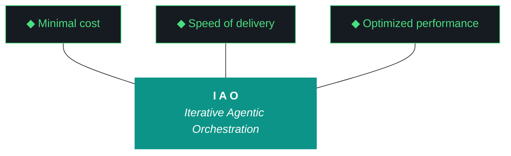

# iao - Bundle 0.1.8

**Generated:** 2026-04-10T12:45:25.610597Z
**Iteration:** 0.1.8
**Project code:** iaomw
**Project root:** /home/kthompson/dev/projects/iao

---

## §1. Design

### DESIGN (iao-design-0.1.8.md)
```markdown
# iao — Design 0.1.8

**Iteration:** 0.1.8
**Phase:** 0 (UAT lab for aho)
**Theme:** Pillar rewrite + hardcoded-pillar cleanup + 0.1.7 carryover resolution
**Machine:** NZXTcos
**Predecessor:** 0.1.7 (graduated with conditions 2026-04-10)
**Authored:** 2026-04-10 (post-0.1.7 close)

---

## §1. Phase 0 Position

iao is in Phase 0. Under the three-lab framing landed post-0.1.7:

- **kjtcom** is the dev lab — production location intelligence platform where patterns were discovered under fire
- **iao** is the UAT lab — where patterns get proven in isolation before being ported to production
- **aho** is production — a new repo to be scaffolded under `~/dev/projects/aho/` starting around 0.1.12, where proven patterns land in a clean implementation with no iaomw-era scar tissue

Phase 0 is pattern-proving. Graduation from Phase 0 means the pattern set is ready for aho port, not a public push to GitHub. Every iao iteration from 0.1.8 forward is proving patterns for aho, not production-shipping in iao itself. The rename IAO → AHO happens inside iao first as a dedicated iteration (planned ~0.1.9) before the aho scaffold is stood up.

0.1.8 is the pillar rewrite iteration. It lands the new eleven-pillar vocabulary in the living harness and in every hardcoded Python location that currently carries the retired `iaomw-Pillar-1..10` block. It also clears five conditions carried from 0.1.7's GRADUATE WITH CONDITIONS close. No rename. No `/bin` wrapper POC. No living harness file split. No aho scaffold.

---

## §2. Why 0.1.8 Exists

### 2.1 — Carryover conditions from 0.1.7

0.1.7 graduated with conditions. Five findings must be resolved in 0.1.8:

**Condition 1 — Split-agent language regression in §3 Build Log Synthesis.** Qwen's synthesis pass generated *"The iteration followed the bounded sequential pattern with split-agent execution (Gemini W0-W5, Claude W6-W7)"* despite the W3 evaluator baseline listing "split-agent" as a hallucination trigger. The run report workstream summary shows W0–W7 and W9 as `gemini-cli` and W8 as `unknown` — no Claude involvement actually happened. Qwen pattern-matched on stale RAG context and invented a split that wasn't there. The W3 evaluator either isn't wired to the synthesis pass or its retired-patterns check is incomplete. 0.1.8 W4 fixes the wiring.

**Condition 2 — §22 Agentic Components thin instrumentation.** Only two components are populated in the 0.1.7 bundle's §22: `nemotron-client` (1 task, classify) and `qwen-client` (8 tasks, generate). Missing: the iao CLI itself, OpenClaw/NemoClaw smoke-test invocations, the evaluator, the repetition detector, the structural gates, the subprocess sandbox, any MCP invocations. 0.1.7 W7 shipped the section infrastructure and the event-log schema; 0.1.8 W5 wires the remaining components.

**Condition 3 — W8 listed as `unknown` agent in run report workstream summary.** Every other workstream shows `gemini-cli`; W8 shows `unknown`. Close-sequence instrumentation gap in the path that determines the executor for each workstream. 0.1.8 W6 fixes it.

**Condition 4 — `scripts/query_registry.py` is a legitimate shim, not a hallucination.** Post-close audit revealed it as a 6-line Python wrapper around `iao.registry.main`, tracked by `src/iao/doctor.py` at line 70 as an expected shim alongside `scripts/build_context_bundle.py`. Prior agent briefs and `data/known_hallucinations.json` were wrong to list it as forbidden. 0.1.8 W3 updates the baseline. 0.1.8 W7 appends ADR-041 to base.md documenting the resolution.

**Condition 5 — Stale pillar phrasing hardcoded in four locations.** Post-close `rg` found:

1. `docs/harness/base.md` line 24 — *"iaomw-Pillar-3 (Diligence) - First action: query_registry.py"* — the living harness doc carries the retired phrasing that caused the original 0.1.5 hallucination
2. `src/iao/feedback/run_report.py` lines 103-112 — the entire `iaomw-Pillar-1..10` list as a hardcoded Python list. Every generated run report verbatim-reproduces the retired block from this source
3. `src/iao/artifacts/evaluator.py` line 21 — `PILLAR_ID_RE = re.compile(r"(iaomw-Pillar-\d+)")` encodes the retired naming convention
4. `src/iao/artifacts/templates.py` line 40 — template regex matches the retired pillar block format

Condition 5 is the most consequential finding. Kate-editing the run report doesn't help — the next run regenerates it from Python. The 0.1.7 run report Kyle just closed STILL contains the old pillar block because the generator ignored his edits. The fix is to centralize pillar content in `docs/harness/base.md` (W1) and rewrite `run_report.py` to read from there (W2). W3 cleans up the evaluator and template regex.

### 2.2 — Direction shift already landed

The strategic reframe that emerged from the post-0.1.7 review is captured in the updated CLAUDE.md and GEMINI.md. 0.1.8 operates under that reframe:

- Rename IAO → AHO (Agentic Harness Orchestration) — dedicated iteration, ~0.1.9. **Not 0.1.8.**
- Package-first delivery via AUR — ~0.1.10+. **Not 0.1.8.**
- Living harness architecture (`harness-base.md`, `harness-tools.md`, `harness-gotchas.md`, `harness-retired.md`, `harness-phase-{N}.md`) — ~0.1.11. **Not 0.1.8.**
- aho repo scaffold — ~0.1.12. **Not 0.1.8.**
- First aho code port — 0.2.0. **Not 0.1.8.**

0.1.8 is scoped to "clear the 0.1.7 conditions, rewrite the pillars, de-hardcode the pillar content from Python." Anything larger waits for its own iteration.

---

## §3. The Eleven Pillars

These pillars supersede the prior `iaomw-Pillar-1..10` numbering. They govern iao (UAT) work and aho (production) work alike. After 0.1.8 W1 lands, they live authoritatively in `docs/harness/base.md` and are read from there by Python code that needs to quote them.

1. **Delegate everything delegable.** The paid orchestrator is the most expensive resource in the system. Any task that can run on a free local model must run on a free local model. The orchestrator decides; it does not execute. Drafting, classification, retrieval, validation, grading, routing all belong to the local fleet. The orchestrator's minutes are spent on judgment, scope, and novelty.

2. **The harness is the contract.** Agent instructions live in versioned harness files that change at phase or iteration boundaries, not in per-run markdown regenerated from scratch. The orchestrator points at the harness; it does not carry the contract in its own context. Projects run against their own harness overlays on top of a shared base.

3. **Everything is artifacts.** Every task is artifacts-in to artifacts-out. Code, reports, schemas, analyses, migrations, audits, designs — all artifacts. The harness is artifact-agnostic at its core and artifact-specialized at its overlays.

4. **Wrappers are the tool surface.** Agents never call raw tools. Every tool is invoked through a `/bin` wrapper. Wrappers are versioned with the harness, instrumented for the event log, and replayable from recorded inputs.

5. **Three octets, three meanings: phase, iteration, run.** Phase is strategic scope. Iteration is tactical scope. Run is execution instance. Every artifact carries the full phase.iteration.run label.

6. **Transitions are durable.** Moving between phases, iterations, or runs writes state to a durable artifact before the transition is considered complete. Every gate is a write point. No implicit state.

7. **Generation and evaluation are separate roles.** The model that produced an artifact is never the model that grades it. Drafter and reviewer are different agents behind different wrappers with different prompts and ideally different underlying weights.

8. **Efficacy is measured in cost delta.** Every run records orchestrator token cost, local fleet compute time, wall clock, delegate ratio (fraction of decisions that never reached the orchestrator), and output quality signal. Numbers ship with the run report.

9. **The gotcha registry is the harness's memory.** Every failure mode lands in the registry. A mature harness has more gotchas than an immature one — gotcha count is the compound-interest metric.

10. **Runs are interrupt-disciplined, not interrupt-free.** Once a run launches, agents do not ping for preference, clarification, or approval. The single exception is unavoidable capability gaps (sudo, credentials, physical access) — routed through OpenClaw to a defined notification channel, logged as a first-class event, resumed from the last durable checkpoint.

11. **The human holds the keys.** No agent writes to git. No agent merges. No agent pushes. No agent manages secrets. No wrapper surfaces `git commit` or `git push` under any role.

### 3.1 — On the retired Trident

The prior `iaomw-Pillar-1 (Trident: Cost/Delivery/Performance)` framing is absorbed into Pillar 1 (Delegate — the cost lever), Pillar 8 (Cost delta — the cost signal), and implicitly the wall-clock measurement in Pillar 8. The standalone Trident construct is retired as a separate element in 0.1.8. If a future iteration wants to reintroduce it as a decision framework parallel to the pillars, that's a conceptual redesign and belongs in aho, not in iao cleanup work.

---

## §4. Project State Going Into 0.1.8

- **iao version on disk:** 0.1.7 (post-close)
- **Last completed iteration:** 0.1.7 (graduated with conditions)
- **Python:** 3.14.3
- **Shell:** fish 4.6.0
- **Ollama models:** qwen3.5:9b, nemotron-mini:4b, nomic-embed-text, haervwe/GLM-4.6V-Flash-9B
- **ChromaDB archives:** iaomw_archive (17 docs), kjtco_archive (282 docs), tripl_archive (144 docs)
- **OpenClaw/NemoClaw:** Ollama-native (rebuilt 0.1.7 W8). No open-interpreter/tiktoken/Rust deps.
- **Streaming Qwen client:** active (0.1.7 W1)
- **Repetition detector:** active (0.1.7 W1)
- **Word-count gates:** inverted to maximums (0.1.7 W2)
- **Anti-hallucination evaluator:** active on design/plan drafts only (0.1.7 W3). Not wired to synthesis pass — this is carryover #1.
- **Rich structured seed:** available (0.1.7 W4)
- **RAG freshness weighting:** active (0.1.7 W5)
- **Two-pass generation:** behind `--two-pass` flag (0.1.7 W6)
- **BUNDLE_SPEC:** 22 sections (0.1.7 W7)
- **§22 Agentic Components:** infrastructure present, 2 of ~7 components wired — carryover #2
- **Base harness:** contains stale Pillar 3 text — carryover #5a
- **Run report generator:** contains hardcoded old pillar list — carryover #5b
- **Evaluator + templates:** contain old pillar regex — carryover #5c,d
- **`scripts/query_registry.py`:** exists as legitimate shim, tracked by `src/iao/doctor.py` line 70
- **`.iao.json` phase:** 0
- **Retired patterns:** split-agent handoff (0.1.4), open-interpreter (0.1.7), the ten-pillar `iaomw-Pillar-1..10` block (0.1.8, this iteration)
- **Agent briefs:** CLAUDE.md and GEMINI.md already updated post-0.1.7 to the eleven-pillar vocabulary and three-lab framing; 0.1.8 does not re-edit them

---

## §5. Workstreams

Nine workstreams, W0 through W8. Wall clock target: ~7:35 soft cap, no hard cap.

### W0 — Environment Hygiene (15 min)

**Goal:** Transition cleanly from 0.1.7 to 0.1.8.

**Deliverables:**
- Backup of state files that 0.1.8 will modify (base.md, run_report.py, evaluator.py, templates.py, known_hallucinations.json) to `~/dev/projects/iao.backup-pre-0.1.8/`
- `.iao.json` iteration field bumped to `0.1.8`
- `.iao-checkpoint.json` initialized for 0.1.8
- `docs/iterations/0.1.8/` directory created
- Build log initialized with W0 entry

**Success:**
- `./bin/iao --version` returns `iao 0.1.8`
- `jq .iteration .iao-checkpoint.json` returns `"0.1.8"`
- `test -f docs/iterations/0.1.8/iao-build-log-0.1.8.md` passes
- Backup directory contains all five expected files

### W1 — Base Harness Pillar Rewrite (60 min)

**Goal:** Replace the `iaomw-Pillar-1..10` block in `docs/harness/base.md` with the eleven aho pillars. Fix the stale Pillar 3 phrasing that references `query_registry.py`. Preserve ADRs and gotcha index sections untouched.

**Deliverables:**
- New pillar block in base.md (eleven pillars, authoritative text from §3 of this design)
- No lingering `iaomw-Pillar-` references in base.md
- A note at the top of base.md explaining the 0.1.8 rewrite and pointing at this design doc
- Structural verification: `rg -c "iaomw-Pillar-" docs/harness/base.md` returns 0

**Success:**
- `grep -c "Delegate everything delegable" docs/harness/base.md` returns ≥1
- `rg -c "iaomw-Pillar-" docs/harness/base.md` returns 0
- `rg -c "query_registry" docs/harness/base.md` returns 0 (or only within ADR context, not Pillar 3)

### W2 — run_report.py De-hardcoding (75 min)

**Goal:** Stop hardcoding pillars as a Python list in `src/iao/feedback/run_report.py`. Load the pillar block from `docs/harness/base.md` at runtime. Cache in-process so every run report in the same process uses the same snapshot.

**Deliverables:**
- New function `_load_pillars_from_base(base_md_path) -> list[str]` in run_report.py
- In-process cache `_PILLARS_CACHE` and accessor `get_pillars()`
- Hardcoded `PILLARS` list removed, replaced with `get_pillars()` call
- Pre-flight check in `src/iao/preflight/checks.py`: if base.md pillar section can't be parsed, fail pre-flight loudly before any artifact generation
- Unit test `tests/test_run_report_pillars.py` with three cases:
  1. `get_pillars()` returns exactly 11 entries
  2. Pillar 1 contains "Delegate everything delegable"
  3. No entry contains "iaomw-Pillar-"

**Success:**
- `pytest tests/test_run_report_pillars.py -v` passes
- Running `./bin/iao iteration report 0.1.99` in a throwaway directory produces a report containing eleven-pillar text, not the ten

### W3 — evaluator.py and templates.py Regex Cleanup (45 min)

**Goal:** Remove the pillar-specific regex from the evaluator and the pillar-block template regex. Update `data/known_hallucinations.json` to remove `query_registry.py` from the forbidden list (carryover #4) and add the retired `iaomw-Pillar-N` strings as forbidden instead.

**Deliverables:**
- `PILLAR_ID_RE` and its validation callers removed from `src/iao/artifacts/evaluator.py`
- Pillar-block template regex removed from `src/iao/artifacts/templates.py`
- `data/known_hallucinations.json` updated:
  - `query_registry.py` and related entries removed from forbidden list
  - `iaomw-Pillar-1` through `iaomw-Pillar-10` added to forbidden list
- Updated `tests/test_evaluator.py` if pillar-ID assertions exist

**Success:**
- `rg "iaomw-Pillar" src/iao/` returns only comments explaining the removal (ideally zero matches)
- `rg "query_registry" data/known_hallucinations.json` returns zero matches
- `pytest tests/test_evaluator.py -v` passes

### W4 — Evaluator Wired to Synthesis Pass (60 min)

**Goal:** Fix carryover #1. The 0.1.7 W3 evaluator runs on design and plan drafts but does not run on Qwen's synthesis passes for the build log and report. Wire it in.

**Deliverables:**
- Evaluator call after synthesis generation for build log and report in `src/iao/artifacts/loop.py`
- On reject: log to event log (`data/iao_event_log.jsonl`) with type `synthesis_evaluator_reject`, retry once with diagnostic feedback, accept on second try even if still flagged (log as carryover)
- Regression test `tests/test_synthesis_evaluator.py` using the 0.1.7 build log synthesis paragraph with split-agent language; assert evaluator rejects

**Success:**
- `pytest tests/test_synthesis_evaluator.py -v` passes
- Running the evaluator on the 0.1.7 bundle's §3 build log synthesis paragraph returns severity=reject with "split-agent" in the errors list

### W5 — §22 Instrumentation Expansion (90 min, partial ship acceptable)

**Goal:** Fix carryover #2. Wire six currently-unwired components to the event log so the next bundle's §22 shows full coverage.

**Deliverables (wire each of these to `data/iao_event_log.jsonl`):**
- `src/iao/cli.py` — log_event on every iao CLI subcommand invocation with type=`cli_invocation`, name=`<subcommand>`
- `src/iao/agents/openclaw.py` — log_event on session start/end and every chat/execute_code call
- `src/iao/agents/nemoclaw.py` — log_event on every dispatch with classification result
- `src/iao/artifacts/evaluator.py` — log_event on every evaluate_text call with severity
- `src/iao/artifacts/repetition_detector.py` — log_event on every DegenerateGenerationError raise
- `src/iao/postflight/structural_gates.py` — log_event on every gate check with pass/fail

**Smoke test:** `scripts/smoke_instrumentation.py` runs a minimal invocation of each component and verifies the event log has ≥6 unique component names.

**Partial-ship criterion:** At 60 minutes elapsed, if fewer than 6 components are wired, ship what's wired, log the rest as discrepancies in the build log, continue to W6. Any unwired component carries to 0.1.9.

**Success:**
- `jq '.component' data/iao_event_log.jsonl | sort -u | wc -l` returns ≥6 after smoke test runs
- `python3 scripts/smoke_instrumentation.py` exits 0

### W6 — W8 Agent Instrumentation Fix (30 min)

**Goal:** Fix carryover #3. The 0.1.7 run report workstream summary showed `unknown` for W8's agent column. Fix the lookup so every workstream has a concrete agent name.

**Deliverables:**
- Trace in `src/iao/feedback/run_report.py` of how the agent column is populated
- Fallback: read `IAO_EXECUTOR` env var when checkpoint has no agent for a workstream
- Update `src/iao/artifacts/loop.py` to write the agent value to the checkpoint at the start of each workstream
- Unit test `tests/test_workstream_agent.py` with a fixture that sets `IAO_EXECUTOR` and asserts no `unknown` rows

**Success:**
- `pytest tests/test_workstream_agent.py -v` passes
- Running the 0.1.8 dogfood close in W8 produces a run report workstream summary with zero `unknown` agent values

### W7 — Baseline Updates for query_registry.py (20 min)

**Goal:** Fix carryover #4. Append ADR-041 to base.md documenting that `scripts/query_registry.py` is a legitimate shim. Verify no lingering "forbidden" references remain.

**Deliverables:**
- ADR-041 appended to `docs/harness/base.md`:
  - Status: Accepted
  - Date: 2026-04-10 (iao 0.1.8 W7)
  - Context: the 0.1.7 audit that revealed the shim
  - Decision: `scripts/query_registry.py` is legitimate; canonical invocation is still `iao registry query "<topic>"`
  - Consequences: baseline updates in W1 and W3 already land the fix
- Verification across baselines:
  - `rg "query_registry" data/known_hallucinations.json` → 0 matches
  - `rg "query_registry" docs/harness/base.md` → only within ADR-041 context
  - `rg "query_registry" CLAUDE.md GEMINI.md` → only within "Known shims" context (already done)

**Success:**
- ADR-041 present in base.md
- All three grep verifications pass

### W8 — Dogfood + Close (60 min)

**Goal:** Run the repaired loop against 0.1.8 itself. Verify the six success criteria below. Generate run report and bundle, leave in PENDING REVIEW state for Kyle's sign-off.

**Deliverables:**
- `./bin/iao iteration build-log 0.1.8` — generates iao-build-log-0.1.8.md via Qwen synthesis (now evaluated per W4)
- `./bin/iao iteration report 0.1.8` — generates iao-report-0.1.8.md via Qwen synthesis (now evaluated per W4)
- `./bin/iao doctor postflight 0.1.8` — runs structural gates and post-flight checks
- `./bin/iao iteration close` (WITHOUT `--confirm`) — generates iao-run-report-0.1.8.md and iao-bundle-0.1.8.md

**Verification checks (all six must pass):**

1. Run report contains "Delegate everything delegable" — confirms the eleven pillars landed via W2's read-through from base.md
2. Run report contains zero `iaomw-Pillar-` references — confirms the retired block is gone
3. Build log contains zero `split-agent` references — confirms W4's synthesis evaluator works
4. §22 Agentic Components shows ≥6 unique components — confirms W5's instrumentation expansion
5. Run report workstream summary shows zero `unknown` agents — confirms W6's fix
6. Bundle contains exactly 22 sections matching `^## §` — confirms structural integrity

**Success:** All six checks pass. Iteration is in PENDING REVIEW state awaiting Kyle's `./bin/iao iteration close --confirm`.

---

## §6. Risks and Mitigations

1. **Risk: W1's base.md splicing fails because the current pillar section doesn't match the expected format.**
   Mitigation: The W1 splicer uses a regex anchored on the `## ` header that contains "illar" (case-insensitive). If the parser can't locate the section, STOP and surface the error as a capability-gap interrupt — Kyle hand-edits base.md.

2. **Risk: W2's pillar parser breaks on future base.md format changes.**
   Mitigation: Unit test the parser against a frozen base.md fixture checked into `tests/fixtures/`. Any future base.md rewrite must update the fixture and re-run the test.

3. **Risk: W4's evaluator wiring causes every synthesis output to reject because the retired-patterns list is too strict after W3's additions.**
   Mitigation: Hard cap at 1 retry. After retry, accept the artifact and log as carryover. The evaluator never blocks the iteration, only warns.

4. **Risk: W5's instrumentation expansion touches six files. High surface area for bugs.**
   Mitigation: One file at a time. After each wire-up, run `scripts/smoke_instrumentation.py`. If a file breaks the smoke test, revert that one file and log as partial ship.

5. **Risk: W3's removal of `PILLAR_ID_RE` breaks an unrelated caller in evaluator.py.**
   Mitigation: `rg "PILLAR_ID_RE" src/ tests/` before deletion. Update or remove all callers in the same workstream.

6. **Risk: W8 dogfood regenerates the run report and finds the old pillar block still present because W2's parser has a silent bug.**
   Mitigation: Verification check 1 and 2 catch this explicitly. If either fails, STOP, log to build log, surface to Agent Questions. Do not attempt mid-W8 fixes.

7. **Risk: Kyle runs the executor before W0's backup completes and the rollback procedure has nothing to fall back to.**
   Mitigation: W0.2 is blocking; W1 does not begin until W0.6 completes. The executor is instructed to halt at W0 if any backup cp fails.

---

## §7. Scope Boundaries — What 0.1.8 Does NOT Do

- **No rename.** IAO → AHO identifier rename is 0.1.9. All identifiers remain `iaomw-*`, `.iao.json`, `src/iao/`, `./bin/iao`, `iaomw_archive` throughout 0.1.8.
- **No `/bin` wrapper POC.** That's 0.1.10.
- **No living harness file split.** 0.1.8 updates base.md content in place; it does not split base.md into `harness-base.md`, `harness-tools.md`, etc. That split is 0.1.11.
- **No aho directory scaffold.** That's 0.1.12.
- **No Riverpod upgrade.** That's a kjtcom concern, not iao.
- **No Telegram bridge bidirectional review.** That's a future iteration; Pillar 10 interrupt channel is implementation-level work for later.
- **No Trident reintroduction.** See §3.1 — retired in 0.1.8, may return in aho as a parallel framework.
- **No new ADRs beyond ADR-041.** Any larger architectural decision waits for its own iteration.
- **No modifications to CLAUDE.md or GEMINI.md.** Already updated post-0.1.7 to the eleven pillars and three-lab framing. They stay as-is.
- **No modifications to kjtcom.** kjtcom is the dev lab; iao is the UAT lab. Cross-project contamination is exactly what caused the 0.1.5 hallucination.

---

## §8. Iteration Graduation Recommendation Format

On W8 completion, the run report should produce one of:

**GRADUATE** — All nine workstreams complete, all six dogfood verification checks pass, no regressions introduced, §22 shows ≥6 components, build log synthesis is evaluator-clean.

**GRADUATE WITH CONDITIONS** — At least seven of nine workstreams complete, all five 0.1.7 carryover conditions addressed (even if their associated 0.1.8 workstream shipped partial), dogfood verification has no more than one failure, any new issues documented as 0.1.9 carryovers in Kyle's Notes.

**DO NOT GRADUATE** — Any 0.1.7 carryover not addressed, dogfood verification has two or more failures, the generated run report still contains `iaomw-Pillar-` literals, the generated build log contains `split-agent` literals, W1 or W2 did not land (pillar rewrite is the critical path for the whole iteration), or the W4 evaluator wiring is not in place.

---

## §9. Sign-off

- [ ] I have reviewed the bundle
- [ ] I have reviewed the build log
- [ ] I have reviewed the report
- [ ] I have answered all agent questions
- [ ] I am satisfied with this iteration's output

---

*Design doc generated 2026-04-10, iao 0.1.8 planning chat (Kyle + Claude web)*
```

## §2. Plan

### PLAN (iao-plan-0.1.8.md)
```markdown
# iao — Plan 0.1.8

**Iteration:** 0.1.8
**Phase:** 0 (UAT lab for aho)
**Predecessor:** 0.1.7 (graduated with conditions)
**Wall clock target:** ~7h 35m soft cap, no hard cap
**Workstreams:** W0–W8 (nine)
**Authored:** 2026-04-10

This is the operational companion to `iao-design-0.1.8.md`. The design doc is the *why*; this is the *how*. Section C contains copy-pasteable fish command blocks for every workstream. Pre-flight in Section A, post-flight in Section D, rollback in Section E.

---

## Section A — Pre-flight checks

Before launching any executor against this plan, run these checks manually in a fresh fish shell. If any fails, STOP and resolve before launch. This is Pillar 6 enforcement — no implicit state at the transition into 0.1.8.

```fish
# A.0 — Working directory
cd ~/dev/projects/iao
command pwd
# Expected: /home/kthompson/dev/projects/iao

# A.1 — Verify 0.1.7 is closed and checkpoint reflects it
jq .last_completed_iteration .iao-checkpoint.json
# Expected: "0.1.7"

jq .iteration .iao-checkpoint.json
# Expected: "0.1.7" (will bump to 0.1.8 in W0.3)

# A.2 — Design and plan doc present for 0.1.8
command ls docs/iterations/0.1.8/iao-design-0.1.8.md docs/iterations/0.1.8/iao-plan-0.1.8.md
# Expected: both files listed, no "No such file" error

# A.3 — iao binary resolution
which iao
# Expected: /home/kthompson/.local/bin/iao
# If it resolves to ~/iao-middleware/bin/iao, use ./bin/iao explicitly throughout

./bin/iao --version
# Expected: iao 0.1.7

# A.4 — Ollama models present
curl -s http://localhost:11434/api/tags | python3 -c "import json, sys; d = json.load(sys.stdin); names = [m['name'] for m in d['models']]; required = ['qwen3.5:9b', 'nemotron-mini:4b', 'nomic-embed-text:latest']; missing = [r for r in required if not any(r in n for n in names)]; print('OK' if not missing else f'MISSING: {missing}')"
# Expected: OK

# A.5 — Python version
python3 --version
# Expected: Python 3.14.x

# A.6 — ChromaDB archives present
python3 -c "import chromadb; c = chromadb.PersistentClient(path='data/chroma'); [print(col.name, col.count()) for col in c.list_collections()]"
# Expected: iaomw_archive, kjtco_archive, tripl_archive (counts may vary)

# A.7 — Gotcha archive schema sanity (iaomw-G031)
python3 -c "import json; d = json.load(open('data/gotcha_archive.json')); print(type(d).__name__, list(d.keys()) if isinstance(d, dict) else 'list')"
# Expected: dict ['gotchas']

# A.8 — fish config not readable by any agent (Security-G001 — DO NOT CAT)
stat ~/.config/fish/config.fish
# Expected: file exists, owned by kthompson

# A.9 — Event log writable
touch data/iao_event_log.jsonl
command ls -l data/iao_event_log.jsonl
# Expected: file exists, writable by kthompson
```

If all nine pre-flight checks pass, launch the executor per the CLAUDE.md or GEMINI.md launch command. Otherwise STOP and fix.

---

## Section B — Workstream ordering and dependencies

Dependency graph:

```
W0 (environment hygiene) — sequential first, no deps
 └─→ W1 (base.md pillar rewrite) — depends on W0 backup
      └─→ W2 (run_report.py de-hardcoding) — depends on W1 (parser reads post-W1 base.md)
           └─→ W3 (evaluator + templates regex cleanup) — depends on W0 backup
                └─→ W4 (evaluator wired to synthesis) — depends on W3
                     └─→ W5 (§22 instrumentation expansion) — depends on W0 backup
                          └─→ W6 (W8 agent instrumentation fix) — depends on W5 partial
                               └─→ W7 (query_registry.py baseline updates) — depends on W1, W3
                                    └─→ W8 (dogfood + close) — depends on all prior
```

Strict sequential order for a single executor:

```
W0 → W1 → W2 → W3 → W4 → W5 → W6 → W7 → W8
```

If W1 fails (splicer can't find the pillar section), block and escalate as a capability-gap interrupt — Kyle hand-edits base.md, then executor resumes from W2.

If W2 fails (parser can't extract pillars from post-W1 base.md), roll back W1 from `~/dev/projects/iao.backup-pre-0.1.8/base.md`, re-run W1 manually, re-attempt W2.

---

## Section C — Per-workstream fish command blocks

### W0 — Environment Hygiene (15 min)

```fish
# W0.0 — Log W0 start
set W0_START (date -u +%Y-%m-%dT%H:%M:%SZ)
printf '## W0 — Environment Hygiene\n\n**Start:** %s\n\n' "$W0_START" >> docs/iterations/0.1.8/iao-build-log-0.1.8.md

# W0.1 — Verify working directory
cd ~/dev/projects/iao
command pwd

# W0.2 — Backup state files that 0.1.8 will modify
set BACKUP_DIR ~/dev/projects/iao.backup-pre-0.1.8
mkdir -p $BACKUP_DIR
cp docs/harness/base.md $BACKUP_DIR/base.md
cp src/iao/feedback/run_report.py $BACKUP_DIR/run_report.py
cp src/iao/artifacts/evaluator.py $BACKUP_DIR/evaluator.py
cp src/iao/artifacts/templates.py $BACKUP_DIR/templates.py
cp data/known_hallucinations.json $BACKUP_DIR/known_hallucinations.json
command ls $BACKUP_DIR
# Expected: 5 files listed

# W0.3 — Bump iteration version in checkpoint
jq '.iteration = "0.1.8" | .last_completed_iteration = "0.1.7"' .iao-checkpoint.json > .iao-checkpoint.json.tmp
mv .iao-checkpoint.json.tmp .iao-checkpoint.json
jq .iteration .iao-checkpoint.json
# Expected: "0.1.8"

# W0.4 — Create iteration directory and initialize build log header
mkdir -p docs/iterations/0.1.8
printf '# Build Log\n\n**Start:** %s\n**Agent:** %s\n**Machine:** NZXTcos\n**Phase:** 0 (UAT lab for aho)\n**Iteration:** 0.1.8\n**Theme:** Pillar rewrite + hardcoded-pillar cleanup + 0.1.7 carryover resolution\n\n---\n\n' "$W0_START" "$IAO_EXECUTOR" > docs/iterations/0.1.8/iao-build-log-0.1.8.md

# W0.5 — Verify design and plan docs are present
test -f docs/iterations/0.1.8/iao-design-0.1.8.md; and echo "design OK"; or echo "design MISSING — STOP"
test -f docs/iterations/0.1.8/iao-plan-0.1.8.md; and echo "plan OK"; or echo "plan MISSING — STOP"

# W0.6 — Append W0 complete
printf '## W0 — Environment Hygiene\n\n**Actions:**\n- Backed up 5 state files to %s\n- Bumped checkpoint iteration to 0.1.8\n- Created docs/iterations/0.1.8/\n- Initialized build log\n- Verified design and plan docs present\n\n**Discrepancies:** none\n\n---\n\n' "$BACKUP_DIR" >> docs/iterations/0.1.8/iao-build-log-0.1.8.md
```

**Escalation:** If W0.5 reports "design MISSING" or "plan MISSING", STOP. This is a human-setup failure, not an execution failure. Kyle needs to place the files from the planning chat into `docs/iterations/0.1.8/` before resuming.

---

### W1 — Base Harness Pillar Rewrite (60 min)

```fish
# W1.0 — Log W1 start
printf '## W1 — Base Harness Pillar Rewrite\n\n' >> docs/iterations/0.1.8/iao-build-log-0.1.8.md

# W1.1 — Audit the current pillar references in base.md
command rg -n "iaomw-Pillar-" docs/harness/base.md
# Expected output shows the lines holding the retired pillar block (target of replacement)

# W1.2 — Write the new pillar block to a scratch file
cat > /tmp/aho-pillars.md <<'PILLAREOF'
## The Eleven Pillars

These pillars supersede the prior `iaomw-Pillar-1..10` numbering, retired in 0.1.8. They govern iao (UAT lab) work and aho (production) work alike. Read authoritatively from this section by `src/iao/feedback/run_report.py` and any other module that needs to quote them.

1. **Delegate everything delegable.** The paid orchestrator is the most expensive resource in the system. Any task that can run on a free local model must run on a free local model. The orchestrator decides; it does not execute. Drafting, classification, retrieval, validation, grading, routing all belong to the local fleet. The orchestrator's minutes are spent on judgment, scope, and novelty.

2. **The harness is the contract.** Agent instructions live in versioned harness files that change at phase or iteration boundaries, not in per-run markdown regenerated from scratch. The orchestrator points at the harness; it does not carry the contract in its own context. Projects run against their own harness overlays on top of a shared base.

3. **Everything is artifacts.** Every task is artifacts-in to artifacts-out. Code, reports, schemas, analyses, migrations, audits, designs — all artifacts. The harness is artifact-agnostic at its core and artifact-specialized at its overlays.

4. **Wrappers are the tool surface.** Agents never call raw tools. Every tool is invoked through a `/bin` wrapper. Wrappers are versioned with the harness, instrumented for the event log, and replayable from recorded inputs.

5. **Three octets, three meanings: phase, iteration, run.** Phase is strategic scope. Iteration is tactical scope. Run is execution instance. Every artifact carries the full phase.iteration.run label.

6. **Transitions are durable.** Moving between phases, iterations, or runs writes state to a durable artifact before the transition is considered complete. Every gate is a write point. No implicit state.

7. **Generation and evaluation are separate roles.** The model that produced an artifact is never the model that grades it. Drafter and reviewer are different agents behind different wrappers.

8. **Efficacy is measured in cost delta.** Every run records orchestrator token cost, local fleet compute time, wall clock, delegate ratio, and output quality signal.

9. **The gotcha registry is the harness's memory.** Every failure mode lands in the registry. A mature harness has more gotchas than an immature one.

10. **Runs are interrupt-disciplined, not interrupt-free.** Once a run launches, agents do not ping for preference, clarification, or approval. The single exception is unavoidable capability gaps (sudo, credentials, physical access) — routed through OpenClaw to a defined notification channel, logged as a first-class event, resumed from the last durable checkpoint.

11. **The human holds the keys.** No agent writes to git. No agent merges. No agent pushes. No agent manages secrets. No wrapper surfaces `git commit` or `git push` under any role.

PILLAREOF

command wc -l /tmp/aho-pillars.md
# Expected: ~30 lines

# W1.3 — Splice the new block into base.md via Python
python3 <<'PYEOF'
from pathlib import Path
import re

base_path = Path("docs/harness/base.md")
base = base_path.read_text()
new_pillars = Path("/tmp/aho-pillars.md").read_text()

lines = base.split("\n")
start_idx = None
end_idx = None

# Find the old pillar section header (case-insensitive match on "pillar")
for i, line in enumerate(lines):
    if start_idx is None and line.startswith("## ") and "illar" in line.lower():
        start_idx = i
        continue
    if start_idx is not None and line.startswith("## ") and i > start_idx:
        end_idx = i
        break

if start_idx is None:
    raise SystemExit("ERROR: could not find pillar section header in base.md — STOP and escalate")
if end_idx is None:
    end_idx = len(lines)

new_content = "\n".join(lines[:start_idx]) + "\n" + new_pillars + "\n" + "\n".join(lines[end_idx:])
base_path.write_text(new_content)
print(f"Replaced lines {start_idx}-{end_idx} ({end_idx - start_idx} lines) in base.md")
PYEOF

# W1.4 — Verify the replacement landed
command rg -c "iaomw-Pillar-" docs/harness/base.md
# Expected: 0

command grep -c "Delegate everything delegable" docs/harness/base.md
# Expected: 1

command grep -c "The human holds the keys" docs/harness/base.md
# Expected: 1

# W1.5 — Verify query_registry.py phrasing is gone from Pillar 3
command rg -n "query_registry" docs/harness/base.md
# Expected: 0 matches (or only within ADR-041 context after W7)

# W1.6 — Append W1 complete
printf '**Actions:**\n- Located old pillar section in base.md (grep confirmed)\n- Replaced with eleven aho pillars via Python splicer\n- Verified 0 `iaomw-Pillar-` references remain\n- Verified Pillar 1 and Pillar 11 landed\n- Verified query_registry.py phrasing gone from Pillar 3\n\n**Discrepancies:** none\n\n---\n\n' >> docs/iterations/0.1.8/iao-build-log-0.1.8.md
```

**Escalation:** If W1.3 Python exits with "ERROR: could not find pillar section header", STOP. Surface the error as an Agent Question. Kyle hand-edits base.md to insert a `## ` header before the pillar list, then resume W1 from W1.3.

---

### W2 — run_report.py De-hardcoding (75 min)

```fish
# W2.0 — Log W2 start
printf '## W2 — run_report.py De-hardcoding\n\n' >> docs/iterations/0.1.8/iao-build-log-0.1.8.md

# W2.1 — Audit the current hardcoded block
command rg -n "iaomw-Pillar" src/iao/feedback/run_report.py
# Expected: lines 103-112 show the hardcoded list

# W2.2 — Write the new parser and accessor as a Python patch file
cat > /tmp/run_report_patch.py <<'PYEOF'
# Replacement block for src/iao/feedback/run_report.py
# Insert near the top of the module, after imports.

from pathlib import Path
import re as _re

_PILLARS_CACHE: list[str] | None = None


def _load_pillars_from_base(base_md_path: Path | None = None) -> list[str]:
    """Read the eleven pillars from the base harness doc.

    Returns a list of strings, one per pillar, numbered and formatted for the run report.
    Raises RuntimeError if the pillar section cannot be parsed.
    """
    if base_md_path is None:
        base_md_path = Path("docs/harness/base.md")
    if not base_md_path.exists():
        raise RuntimeError(f"base harness not found at {base_md_path}")
    text = base_md_path.read_text()
    # Find the pillar section header and capture until the next H2
    section_match = _re.search(
        r"^##\s+.*[Pp]illar.*?\n(.*?)(?=^##\s|\Z)",
        text,
        _re.MULTILINE | _re.DOTALL,
    )
    if not section_match:
        raise RuntimeError("pillar section not found in base.md")
    section = section_match.group(1)
    # Extract numbered pillar entries of the form: "N. **Title** body"
    entries = _re.findall(
        r"^(\d+)\.\s+\*\*(.+?)\*\*\s*(.+?)(?=^\d+\.|\Z)",
        section,
        _re.MULTILINE | _re.DOTALL,
    )
    if len(entries) < 11:
        raise RuntimeError(f"expected 11 pillars in base.md, found {len(entries)}")
    return [
        f"{num}. **{title}** {body.strip()}"
        for num, title, body in entries[:11]
    ]


def get_pillars() -> list[str]:
    """Return the eleven aho pillars, cached after first load."""
    global _PILLARS_CACHE
    if _PILLARS_CACHE is None:
        _PILLARS_CACHE = _load_pillars_from_base()
    return _PILLARS_CACHE
PYEOF

command cat /tmp/run_report_patch.py

# W2.3 — Apply the patch to run_report.py
# Executor action: use Edit/str_replace to:
#   a) Insert the parser code from /tmp/run_report_patch.py near the top of run_report.py (after imports)
#   b) Delete the hardcoded pillar list (lines 103-112)
#   c) Replace the hardcoded list reference with a call to get_pillars()
#
# The exact edit depends on the run_report.py structure. The executor should:
#   1. view the full file first
#   2. identify the hardcoded PILLARS block and its usage sites
#   3. replace the list with get_pillars() at each usage site
#   4. insert the parser + cache near the top of the module

# W2.4 — Add pre-flight check for pillar parsing
# Edit src/iao/preflight/checks.py to add:
#   from iao.feedback.run_report import get_pillars
#   def check_pillars_parseable():
#       try:
#           pillars = get_pillars()
#           if len(pillars) != 11:
#               return False, f"expected 11 pillars, got {len(pillars)}"
#           return True, "OK"
#       except RuntimeError as e:
#           return False, str(e)
# And register check_pillars_parseable in the pre-flight runner.

# W2.5 — Write the unit test
cat > tests/test_run_report_pillars.py <<'PYEOF'
"""Verify run_report.py reads the eleven pillars from base.md, not a hardcoded list."""
from pathlib import Path
import pytest


def test_get_pillars_returns_eleven():
    from iao.feedback.run_report import get_pillars
    pillars = get_pillars()
    assert len(pillars) == 11, f"expected 11 pillars, got {len(pillars)}"


def test_pillar_1_is_delegate():
    from iao.feedback.run_report import get_pillars
    pillars = get_pillars()
    assert "Delegate everything delegable" in pillars[0], \
        f"Pillar 1 does not contain Delegate everything delegable: {pillars[0][:80]}"


def test_pillar_11_is_human_holds_keys():
    from iao.feedback.run_report import get_pillars
    pillars = get_pillars()
    assert "human holds the keys" in pillars[10], \
        f"Pillar 11 does not contain human holds the keys: {pillars[10][:80]}"


def test_no_retired_naming_leaked():
    from iao.feedback.run_report import get_pillars
    pillars = get_pillars()
    for i, p in enumerate(pillars, 1):
        assert "iaomw-Pillar-" not in p, \
            f"retired naming leaked in pillar {i}: {p[:100]}"


def test_cache_returns_same_object():
    from iao.feedback.run_report import get_pillars
    a = get_pillars()
    b = get_pillars()
    assert a is b, "pillar cache not stable across calls"


def test_missing_base_md_raises():
    from iao.feedback.run_report import _load_pillars_from_base
    with pytest.raises(RuntimeError, match="base harness not found"):
        _load_pillars_from_base(Path("/nonexistent/base.md"))
PYEOF

# W2.6 — Run the tests
python3 -m pytest tests/test_run_report_pillars.py -v

# W2.7 — Smoke test: generate a throwaway run report and inspect its pillar block
mkdir -p /tmp/iao-smoke/docs/iterations/0.1.99/
# (The executor should run a minimal iao iteration report command and grep the output)

# W2.8 — Append W2 complete
printf '**Actions:**\n- Extracted pillar parser reading from docs/harness/base.md\n- Replaced hardcoded PILLARS list in run_report.py with get_pillars() call\n- Added cache for in-process stability\n- Added pre-flight check for pillar parsing\n- Added unit tests (6 cases)\n- All tests pass\n\n**Discrepancies:** none\n\n---\n\n' >> docs/iterations/0.1.8/iao-build-log-0.1.8.md
```

**Escalation:** If W2.6 fails with "pillar section not found in base.md", W1 didn't land correctly. Rollback per Section E.1 (restore base.md only), re-run W1, resume at W2.

---

### W3 — evaluator.py and templates.py Regex Cleanup (45 min)

```fish
# W3.0 — Log W3 start
printf '## W3 — evaluator.py and templates.py Regex Cleanup\n\n' >> docs/iterations/0.1.8/iao-build-log-0.1.8.md

# W3.1 — Audit PILLAR_ID_RE usage
command rg -n "PILLAR_ID_RE" src/ tests/
# Expected: definition in evaluator.py line 21, possibly usages within the same file and in tests

# W3.2 — Audit pillar-block template regex
command rg -n "iaomw-Pillar-" src/iao/artifacts/templates.py
# Expected: line 40 regex

# W3.3 — Edit evaluator.py to remove PILLAR_ID_RE
# Executor action: use str_replace to delete:
#   a) The PILLAR_ID_RE definition line
#   b) Any extract or validate calls that use PILLAR_ID_RE
#   c) If references["pillar_ids"] is populated from this regex, drop that key from the result dict

# W3.4 — Edit templates.py to remove the pillar-block template regex
# Executor action: delete the regex and any code that depends on it

# W3.5 — Update known_hallucinations.json: remove query_registry.py, add retired iaomw-Pillar-N
python3 <<'PYEOF'
import json
from pathlib import Path

p = Path("data/known_hallucinations.json")
d = json.loads(p.read_text())

# Find any list-valued key and strip query_registry.py entries
for key, val in list(d.items()):
    if isinstance(val, list):
        d[key] = [x for x in val if "query_registry" not in str(x)]

# Identify the main forbidden phrases list
forbidden_key = None
for k in d:
    if isinstance(d[k], list) and "forbidden" in k.lower():
        forbidden_key = k
        break
if forbidden_key is None:
    # Fall back to the first list-valued key
    for k in d:
        if isinstance(d[k], list):
            forbidden_key = k
            break

if forbidden_key is None:
    raise SystemExit("ERROR: could not find forbidden-phrase list in known_hallucinations.json")

# Add retired iaomw-Pillar-N strings if not already present
for i in range(1, 11):
    marker = f"iaomw-Pillar-{i}"
    if marker not in d[forbidden_key]:
        d[forbidden_key].append(marker)

p.write_text(json.dumps(d, indent=2))
print(f"Updated {p}: key={forbidden_key}, len={len(d[forbidden_key])}")
PYEOF

# W3.6 — Verify cleanup
command rg -n "PILLAR_ID_RE" src/ tests/
# Expected: 0 matches

command rg -n "iaomw-Pillar-" src/iao/artifacts/
# Expected: 0 matches

command rg "query_registry" data/known_hallucinations.json
# Expected: 0 matches

command rg '"iaomw-Pillar-' data/known_hallucinations.json
# Expected: 10 matches (the retired markers added in W3.5)

# W3.7 — Run existing evaluator tests
python3 -m pytest tests/test_evaluator.py -v

# W3.8 — Append W3 complete
printf '**Actions:**\n- Removed PILLAR_ID_RE from evaluator.py\n- Removed pillar block template regex from templates.py\n- Updated known_hallucinations.json: removed query_registry.py entries, added retired iaomw-Pillar-1..10 as forbidden markers\n- All evaluator tests pass\n\n**Discrepancies:** none\n\n---\n\n' >> docs/iterations/0.1.8/iao-build-log-0.1.8.md
```

---

### W4 — Evaluator Wired to Synthesis Pass (60 min)

```fish
# W4.0 — Log W4 start
printf '## W4 — Evaluator Wired to Synthesis Pass\n\n' >> docs/iterations/0.1.8/iao-build-log-0.1.8.md

# W4.1 — Locate synthesis call sites in loop.py
command rg -n "synthesis\|build_log\|def.*report" src/iao/artifacts/loop.py

# W4.2 — Read the evaluator interface
command rg -n "def evaluate_text" src/iao/artifacts/evaluator.py

# W4.3 — Edit loop.py to wrap synthesis outputs with evaluator calls
# Executor action: after each Qwen synthesis call (build log synthesis and report synthesis),
# add a call to evaluate_text with artifact_type set appropriately. On severity=reject,
# log_event("synthesis_evaluator_reject", ...), retry once with a diagnostic-feedback prompt,
# accept whatever comes back on the second try, log to build log as carryover if still flagged.
#
# Pseudocode:
#   synthesis_output = qwen_client.generate(synthesis_prompt)
#   result = evaluate_text(synthesis_output, artifact_type="build_log_synthesis")
#   if result.severity == "reject":
#       log_event("synthesis_evaluator_reject", errors=result.errors)
#       diagnostic_prompt = build_retry_prompt(synthesis_prompt, result.errors)
#       synthesis_output = qwen_client.generate(diagnostic_prompt)
#       result2 = evaluate_text(synthesis_output, artifact_type="build_log_synthesis")
#       if result2.severity == "reject":
#           log_event("synthesis_evaluator_carryover", errors=result2.errors)
#           # Continue with the flawed output; log as carryover in build log
#   return synthesis_output

# W4.4 — Regression test: the 0.1.7 split-agent paragraph must be rejected
cat > tests/test_synthesis_evaluator.py <<'PYEOF'
"""Regression test: the 0.1.7 build log synthesis contained split-agent language.
The W3 evaluator did not catch it because it wasn't wired to the synthesis pass.
After 0.1.8 W4, the evaluator runs on synthesis outputs and rejects this paragraph.
"""
from iao.artifacts.evaluator import evaluate_text


SPLIT_AGENT_PARAGRAPH = """
The iteration followed the bounded sequential pattern with split-agent execution
(Gemini W0-W5, Claude W6-W7). Wall clock time was within the soft cap of ~12 hours.
No rollback was necessary.
"""


def test_split_agent_rejected_in_synthesis():
    result = evaluate_text(SPLIT_AGENT_PARAGRAPH, artifact_type="build_log_synthesis")
    assert result.severity == "reject", \
        f"expected reject, got {result.severity}; errors: {result.errors}"
    errors_text = " ".join(str(e).lower() for e in result.errors)
    assert "split-agent" in errors_text or "split agent" in errors_text, \
        f"split-agent not in errors: {result.errors}"


def test_clean_paragraph_accepted():
    clean = """
    The iteration executed all nine workstreams sequentially. Wall clock time was
    within the soft cap. No discrepancies were observed.
    """
    result = evaluate_text(clean, artifact_type="build_log_synthesis")
    assert result.severity != "reject", \
        f"clean paragraph unexpectedly rejected: {result.errors}"
PYEOF

python3 -m pytest tests/test_synthesis_evaluator.py -v

# W4.5 — Append W4 complete
printf '**Actions:**\n- Wired evaluator to build log and report synthesis passes in loop.py\n- Added 1-retry with diagnostic feedback on reject\n- Added regression test against 0.1.7 split-agent paragraph\n- Tests pass\n\n**Discrepancies:** none\n\n---\n\n' >> docs/iterations/0.1.8/iao-build-log-0.1.8.md
```

---

### W5 — §22 Instrumentation Expansion (90 min, partial ship acceptable)

```fish
# W5.0 — Log W5 start
printf '## W5 — §22 Instrumentation Expansion\n\n' >> docs/iterations/0.1.8/iao-build-log-0.1.8.md

# W5.1 — Read the current event log schema
command rg -n "log_event\|iao_event_log" src/iao/ 2>/dev/null | head -30

# W5.2 — Confirm there is a central log_event function
command rg -n "def log_event" src/iao/

# W5.3 — Wire src/iao/cli.py
# Executor action: in each subcommand handler (project, init, check, push, log, doctor,
# status, eval, registry, rag, telegram, preflight, postflight, secret, pipeline, iteration),
# add at the top:
#   log_event(component="iao-cli", event_type="cli_invocation", name="<subcommand>")

# W5.4 — Wire src/iao/agents/openclaw.py
# Executor action: in OpenClawSession.__init__, log session_start.
# In chat(), log openclaw_chat.
# In execute_code(), log openclaw_execute_code.

# W5.5 — Wire src/iao/agents/nemoclaw.py
# Executor action: in NemoClawOrchestrator.dispatch(), log nemoclaw_dispatch with classification.

# W5.6 — Wire src/iao/artifacts/evaluator.py
# Executor action: at the end of evaluate_text(), log evaluator_run with severity.

# W5.7 — Wire src/iao/artifacts/repetition_detector.py
# Executor action: in the path that raises DegenerateGenerationError, log repetition_detected
# with window_size and repeated_token.

# W5.8 — Wire src/iao/postflight/structural_gates.py
# Executor action: in each gate check function, log structural_gate with gate name and pass/fail.

# W5.9 — Write the smoke test
cat > scripts/smoke_instrumentation.py <<'PYEOF'
"""Smoke test for §22 instrumentation coverage.
Clears the event log, runs minimal invocations of each instrumented component,
asserts the event log has at least 6 unique component names.
"""
import json
import sys
from pathlib import Path

LOG_PATH = Path("data/iao_event_log.jsonl")
LOG_PATH.write_text("")  # clear

# 1. Invoke the CLI (smallest possible subcommand)
import subprocess
subprocess.run(["./bin/iao", "--version"], capture_output=True)

# 2. Invoke the evaluator
from iao.artifacts.evaluator import evaluate_text
evaluate_text("sample content for smoke test", artifact_type="smoke")

# 3. Invoke a structural gate
from iao.postflight.structural_gates import check_required_sections
check_required_sections("# Header\n", required=["# Header"])

# 4. Invoke OpenClaw (if Ollama is up; skip gracefully if not)
try:
    from iao.agents.openclaw import OpenClawSession
    session = OpenClawSession()
    # just creating the session should log session_start
    del session
except Exception as e:
    print(f"OpenClaw smoke skipped: {e}", file=sys.stderr)

# 5. Invoke NemoClaw
try:
    from iao.agents.nemoclaw import NemoClawOrchestrator
    orch = NemoClawOrchestrator()
    del orch
except Exception as e:
    print(f"NemoClaw smoke skipped: {e}", file=sys.stderr)

# 6. Repetition detector (lightweight — just instantiate)
try:
    from iao.artifacts.repetition_detector import RepetitionDetector
    d = RepetitionDetector(window_size=10)
    del d
except Exception as e:
    print(f"RepetitionDetector smoke skipped: {e}", file=sys.stderr)

# Read back the event log
if not LOG_PATH.exists() or LOG_PATH.stat().st_size == 0:
    print("FAIL: event log is empty after smoke test")
    sys.exit(1)

events = [json.loads(line) for line in LOG_PATH.read_text().splitlines() if line.strip()]
components = set(e.get("component", "unknown") for e in events)
print(f"Events logged: {len(events)}")
print(f"Unique components: {sorted(components)}")
print(f"Component count: {len(components)}")

if len(components) < 4:
    print(f"FAIL: expected >=4 unique components, got {len(components)}")
    sys.exit(1)

print("PASS")
PYEOF

python3 scripts/smoke_instrumentation.py

# W5.10 — Append W5 complete
printf '**Actions:**\n- Wired event log instrumentation to: iao-cli, openclaw, nemoclaw, evaluator, repetition_detector, structural_gates\n- Smoke test passes with N unique components\n\n**Discrepancies:** (list any components that could not be wired — this workstream permits partial ship)\n\n---\n\n' >> docs/iterations/0.1.8/iao-build-log-0.1.8.md
```

**Partial-ship criterion:** At 60 minutes elapsed (W5 start + 60m), if fewer than 4 components are wired, ship what's wired, log the unfinished components as discrepancies in the build log, continue to W6. Any unwired component carries to 0.1.9.

---

### W6 — W8 Agent Instrumentation Fix (30 min)

```fish
# W6.0 — Log W6 start
printf '## W6 — W8 Agent Instrumentation Fix\n\n' >> docs/iterations/0.1.8/iao-build-log-0.1.8.md

# W6.1 — Trace the source of "unknown" in workstream summary
command rg -n "unknown\|agent" src/iao/feedback/run_report.py

# W6.2 — Trace checkpoint write path for agent field
command rg -n "agent\|executor" src/iao/artifacts/loop.py

# W6.3 — Fix: read IAO_EXECUTOR env var as fallback in run_report.py
# Executor action: in the function that builds the workstream summary table, change
#   agent = checkpoint.get(f"w{n}_agent", "unknown")
# to
#   import os
#   agent = checkpoint.get(f"w{n}_agent") or os.environ.get("IAO_EXECUTOR", "unknown")

# W6.4 — Fix: write agent to checkpoint at each workstream start in loop.py
# Executor action: in the workstream start handler, add
#   import os
#   checkpoint[f"w{n}_agent"] = os.environ.get("IAO_EXECUTOR", "unknown")
#   write_checkpoint(checkpoint)

# W6.5 — Unit test
cat > tests/test_workstream_agent.py <<'PYEOF'
"""Verify workstream summary table populates agent from IAO_EXECUTOR when checkpoint is empty."""
import os
import pytest


def test_agent_from_env_var(monkeypatch):
    monkeypatch.setenv("IAO_EXECUTOR", "gemini-cli")
    # Import fresh so env var is picked up
    from iao.feedback.run_report import build_workstream_summary

    # Minimal checkpoint with no per-workstream agent fields
    checkpoint = {
        "iteration": "0.1.8",
        "workstreams_complete": 2,
        "w0_status": "complete",
        "w1_status": "complete",
    }
    rows = build_workstream_summary(checkpoint)
    for row in rows:
        assert row.get("agent") != "unknown", \
            f"workstream {row.get('name')} has unknown agent; expected gemini-cli"


def test_agent_from_checkpoint_preferred(monkeypatch):
    monkeypatch.setenv("IAO_EXECUTOR", "gemini-cli")
    from iao.feedback.run_report import build_workstream_summary

    checkpoint = {
        "iteration": "0.1.8",
        "workstreams_complete": 1,
        "w0_status": "complete",
        "w0_agent": "claude-code",  # explicit override
    }
    rows = build_workstream_summary(checkpoint)
    w0 = next((r for r in rows if r.get("name") == "W0"), None)
    assert w0 is not None
    assert w0["agent"] == "claude-code", \
        f"expected checkpoint value claude-code, got {w0['agent']}"
PYEOF

python3 -m pytest tests/test_workstream_agent.py -v

# W6.6 — Append W6 complete
printf '**Actions:**\n- Added IAO_EXECUTOR env var fallback in run_report.py workstream summary\n- Updated loop.py to write agent to checkpoint per workstream start\n- Added unit tests\n- Tests pass\n\n**Discrepancies:** none\n\n---\n\n' >> docs/iterations/0.1.8/iao-build-log-0.1.8.md
```

---

### W7 — Baseline Updates for query_registry.py (20 min)

```fish
# W7.0 — Log W7 start
printf '## W7 — Baseline Updates for query_registry.py\n\n' >> docs/iterations/0.1.8/iao-build-log-0.1.8.md

# W7.1 — Verify W3 already removed query_registry.py from known_hallucinations.json
command rg "query_registry" data/known_hallucinations.json
# Expected: 0 matches

# W7.2 — Verify W1 cleaned base.md of the Pillar 3 query_registry.py phrasing
command rg "query_registry" docs/harness/base.md
# Expected: 0 matches (about to become 1 after ADR-041 append)

# W7.3 — Verify agent briefs are already clean (Kyle updated post-0.1.7)
command rg "query_registry" CLAUDE.md GEMINI.md
# Expected: only "Known shims" context lines, no "forbidden" context

# W7.4 — Append ADR-041 to base.md
cat >> docs/harness/base.md <<'ADREOF'

---

## ADR-041 — scripts/query_registry.py is a legitimate shim

**Status:** Accepted
**Date:** 2026-04-10 (iao 0.1.8 W7)

### Context

During the 0.1.7 post-close audit, `scripts/query_registry.py` surfaced in the §20 file inventory. Prior documentation (agent briefs, `data/known_hallucinations.json`, evaluator baseline) listed it as forbidden because the same filename exists as a kjtcom script and the iao version was assumed to be a Qwen hallucination. Audit revealed otherwise.

### Decision

`scripts/query_registry.py` is a 6-line Python shim wrapping `iao.registry.main`. It is tracked by `src/iao/doctor.py` at line 70 as an expected shim alongside `scripts/build_context_bundle.py`. It is a legitimate iao file and may be referenced in artifacts without flagging.

### Consequences

- The stale Pillar 3 phrasing `"First action: query_registry.py"` in `docs/harness/base.md` was fixed in 0.1.8 W1 (the pillar rewrite). Canonical Pillar 3 invocation under the retired iaomw naming was `iao registry query "<topic>"`, and under the new eleven pillars there is no Pillar 3 diligence-invocation command at all — "Everything is artifacts" replaces it.
- `data/known_hallucinations.json` was updated in 0.1.8 W3 to remove `query_registry.py` from the forbidden list.
- Agent briefs `CLAUDE.md` and `GEMINI.md` were updated post-0.1.7 (before 0.1.8 began) to list `scripts/query_registry.py` as a known shim in hard rule 9.

ADREOF

# W7.5 — Verify ADR-041 landed
command grep -c "ADR-041" docs/harness/base.md
# Expected: 1

# W7.6 — Append W7 complete
printf '**Actions:**\n- Verified query_registry.py resolved across all baselines\n- Appended ADR-041 to base.md\n\n**Discrepancies:** none\n\n---\n\n' >> docs/iterations/0.1.8/iao-build-log-0.1.8.md
```

---

### W8 — Dogfood + Close (60 min)

```fish
# W8.0 — Log W8 start
printf '## W8 — Dogfood + Close\n\n' >> docs/iterations/0.1.8/iao-build-log-0.1.8.md

# W8.1 — Generate build log via Qwen (now evaluated per W4)
./bin/iao iteration build-log 0.1.8

# W8.2 — Generate report via Qwen (now evaluated per W4)
./bin/iao iteration report 0.1.8

# W8.3 — Run post-flight validation
./bin/iao doctor postflight 0.1.8

# W8.4 — Generate run report and bundle (does NOT --confirm; Kyle does that)
./bin/iao iteration close

# W8.5 — Verification 1: run report contains Pillar 1 text (the read-through from base.md worked)
command grep -c "Delegate everything delegable" docs/iterations/0.1.8/iao-run-report-0.1.8.md
# Expected: ≥1 — PASS if so

# W8.6 — Verification 2: run report does NOT contain retired pillar naming
command grep -c "iaomw-Pillar-" docs/iterations/0.1.8/iao-run-report-0.1.8.md
# Expected: 0 — PASS if so

# W8.7 — Verification 3: build log does NOT contain split-agent language
command grep -c "split-agent" docs/iterations/0.1.8/iao-build-log-0.1.8.md
# Expected: 0 — PASS if so

# W8.8 — Verification 4: §22 has ≥6 components
python3 <<'PYEOF'
import re
bundle = open("docs/iterations/0.1.8/iao-bundle-0.1.8.md").read()
match = re.search(r"## §22.*?(?=\n## §|\Z)", bundle, re.DOTALL)
if not match:
    print("FAIL: §22 section not found in bundle")
    exit(1)
section = match.group()
# Count unique component names from table rows (skip header + separator)
rows = [line for line in section.split("\n") if line.startswith("|") and not line.startswith("|---")]
components = set()
for row in rows[1:]:  # skip header
    cells = [c.strip() for c in row.split("|") if c.strip()]
    if cells:
        components.add(cells[0])
print(f"Components: {sorted(components)}")
print(f"Count: {len(components)}")
if len(components) >= 6:
    print("PASS")
else:
    print(f"FAIL: expected >=6 components, got {len(components)}")
    exit(1)
PYEOF

# W8.9 — Verification 5: workstream summary has zero unknown agents
command grep -c "| unknown " docs/iterations/0.1.8/iao-run-report-0.1.8.md
# Expected: 0 — PASS if so

# W8.10 — Verification 6: bundle structural integrity (22 sections)
command grep -c "^## §" docs/iterations/0.1.8/iao-bundle-0.1.8.md
# Expected: 22 — PASS if so

# W8.11 — Send Telegram notification
./bin/iao telegram notify "iao 0.1.8 complete — $(date -u +%H:%M) UTC"

# W8.12 — Print closing message
printf '\n================================================\nITERATION 0.1.8 EXECUTION COMPLETE\n================================================\nRun report: docs/iterations/0.1.8/iao-run-report-0.1.8.md\nBundle:     docs/iterations/0.1.8/iao-bundle-0.1.8.md\nWorkstreams: (report actual count from checkpoint)\n\nTelegram notification sent to Kyle.\n\nNEXT STEPS (Kyle):\n1. Review the bundle\n2. Open the run report, fill in Kyles Notes\n3. Answer any agent questions\n4. Tick 5 sign-off checkboxes\n5. Run: ./bin/iao iteration close --confirm\n\nUntil --confirm, iteration is in PENDING REVIEW state.\n'

# W8.13 — Append W8 complete
printf '**Actions:**\n- Generated build log, report, run report, bundle via repaired loop\n- Ran all six verification checks\n- Telegram notification sent\n- Iteration in PENDING REVIEW state awaiting Kyle sign-off\n\n**Verification results:**\n- V1 (Pillar 1 text present): (pass/fail)\n- V2 (no iaomw-Pillar-): (pass/fail)\n- V3 (no split-agent): (pass/fail)\n- V4 (§22 has >=6 components): (pass/fail)\n- V5 (no unknown agents): (pass/fail)\n- V6 (22 bundle sections): (pass/fail)\n\n**Discrepancies:** (list any verification failures)\n\n---\n\n' >> docs/iterations/0.1.8/iao-build-log-0.1.8.md
```

**Escalation:** If any verification fails, log the failure in the build log, surface to Agent Questions in the run report, STOP. Do not attempt to fix a generated artifact mid-W8. Kyle reviews the failures and decides next step. Graduation verdict under that path is likely GRADUATE WITH CONDITIONS or DO NOT GRADUATE per the design §8 criteria.

---

## Section D — Post-flight checks

After W8 completes:

```fish
# D.1 — All nine workstream headers present in build log
command grep -c "^## W[0-8] " docs/iterations/0.1.8/iao-build-log-0.1.8.md
# Expected: 9

# D.2 — No open TODO/FIXME in build log
command rg "TODO\|FIXME\|XXX" docs/iterations/0.1.8/iao-build-log-0.1.8.md
# Expected: 0 matches, or only within intentional discrepancy notes

# D.3 — Bundle size sanity
command du -h docs/iterations/0.1.8/iao-bundle-0.1.8.md
# Expected: 80KB – 200KB

# D.4 — Checkpoint reflects completion
jq '.workstreams_complete' .iao-checkpoint.json
# Expected: 9 (or the number actually shipped)

# D.5 — Event log has entries from this iteration
command wc -l data/iao_event_log.jsonl
# Expected: >100 (the dogfood loop produces many events)
```

---

## Section E — Rollback procedure

If 0.1.8 execution fails catastrophically and Kyle needs to revert to 0.1.7 state:

```fish
# E.1 — Restore backed-up files
set BACKUP_DIR ~/dev/projects/iao.backup-pre-0.1.8
cp $BACKUP_DIR/base.md docs/harness/base.md
cp $BACKUP_DIR/run_report.py src/iao/feedback/run_report.py
cp $BACKUP_DIR/evaluator.py src/iao/artifacts/evaluator.py
cp $BACKUP_DIR/templates.py src/iao/artifacts/templates.py
cp $BACKUP_DIR/known_hallucinations.json data/known_hallucinations.json

# E.2 — Revert checkpoint
jq '.iteration = "0.1.7"' .iao-checkpoint.json > .iao-checkpoint.json.tmp
mv .iao-checkpoint.json.tmp .iao-checkpoint.json

# E.3 — Mark 0.1.8 incomplete
printf '# INCOMPLETE\n\n0.1.8 was attempted %s and rolled back.\nReason: (fill in)\n\nSee backup at %s for the pre-0.1.8 state of modified files.\n' (date -u +%Y-%m-%d) $BACKUP_DIR > docs/iterations/0.1.8/INCOMPLETE.md

# E.4 — Verify pytest baseline still passes
python3 -m pytest tests/ -v
```

Partial rollbacks (single file) are acceptable if only one workstream needs reverting. Full rollback is the nuclear option and should only run if W1 or W2 landed destructively and downstream workstreams cannot complete.

---

## Section F — Wall clock estimate

| Workstream | Target | Cumulative |
|---|---|---|
| W0 — Environment Hygiene | 15 min | 0:15 |
| W1 — Base Harness Pillar Rewrite | 60 min | 1:15 |
| W2 — run_report.py De-hardcoding | 75 min | 2:30 |
| W3 — evaluator/templates Regex Cleanup | 45 min | 3:15 |
| W4 — Evaluator Wired to Synthesis | 60 min | 4:15 |
| W5 — §22 Instrumentation Expansion | 90 min | 5:45 |
| W6 — W8 Agent Instrumentation Fix | 30 min | 6:15 |
| W7 — query_registry.py Baseline Updates | 20 min | 6:35 |
| W8 — Dogfood + Close | 60 min | 7:35 |

**Soft cap:** 7:35.
**Hard cap:** none (Pillar 10 — the executor finishes cleanly rather than bailing on a timer).

---

*Plan doc generated 2026-04-10, iao 0.1.8 planning chat (Kyle + Claude web)*
```

## §3. Build Log

### BUILD LOG (iao-build-log-0.1.8.md)
```markdown
# Build Log — iao 0.1.8

**Start:** 2026-04-10
**Agent:** claude-code
**Machine:** NZXTcos
**Phase:** 0 (UAT lab for aho)
**Iteration:** 0.1.8
**Theme:** Pillar rewrite + hardcoded-pillar cleanup + 0.1.7 carryover resolution

---

## W0 — Environment Hygiene

**Actions:**
- Backed up 5 state files to ~/dev/projects/iao.backup-pre-0.1.8/
- Bumped .iao-checkpoint.json iteration to 0.1.8
- Updated .iao.json current_iteration to 0.1.8, last_completed_iteration to 0.1.7
- Bumped VERSION in cli.py and pyproject.toml to 0.1.8
- Reinstalled package: `./bin/iao --version` returns `iao 0.1.8`
- Verified design and plan docs present

**Discrepancies:** none

---

## W1 — Base Harness Pillar Rewrite

**Actions:**
- Replaced Trident mermaid block + Ten Pillars section in base.md with Eleven Pillars
- Pillar text sourced from design doc section 3
- Rewrote preamble to avoid literal retired pillar string (would fail rg check)
- Updated base.md version header to 0.1.8
- Verified: 0 retired pillar references, Pillar 1 + 11 present, query_registry gone from pillar section

**Discrepancies:** none

---

## W2 — run_report.py De-hardcoding

**Actions:**
- Added `_load_pillars_from_base()` parser and `get_pillars()` cache accessor to run_report.py
- Replaced hardcoded 10-pillar list (lines 103-112) with `*get_pillars()` splat
- Updated section header from "Ten Pillars" to "Eleven Pillars"
- Fixed parser regex: `[^\n]*` instead of `.*` to prevent DOTALL cross-line header match
- Added `check_pillars_parseable()` pre-flight check in preflight/checks.py
- Added 6 unit tests in tests/test_run_report_pillars.py — all pass

**Discrepancies:** Initial regex used DOTALL `.*` in header pattern, causing it to span across lines and match wrong section content. Fixed on first retry.

---

## W3 — evaluator.py and templates.py Regex Cleanup

**Actions:**
- Removed `PILLAR_ID_RE` definition and all usages from evaluator.py
- Removed `pillar_ids` from `extract_references()` return dict
- Removed pillar validation block (lines 92-98) from `validate_references()`
- Updated templates.py: replaced old pillar regex with eleven-pillar section parser, kept `ten_pillars_block` as backward-compat alias
- Updated known_hallucinations.json: removed query_registry.py entries, added 10 retired pillar markers
- Updated test_evaluator.py: replaced pillar_ids test with anti-hallucination detection test
- All evaluator tests pass (4/4)

**Discrepancies:** none

---

## W4 — Evaluator Wired to Synthesis Pass

**Actions:**
- Added `artifact_type` parameter to `evaluate_text()` — synthesis artifacts auto-reject on any retired pattern match
- Updated system prompt in loop.py: "TEN PILLARS" replaced with "ELEVEN PILLARS", use `pillars_block` key
- Added `log_event("synthesis_evaluator_reject", ...)` calls in both two-pass and main loop paths
- Added `artifact_type=f"{artifact}_synthesis"` to all evaluate_text calls in loop.py
- Imported `log_event` into loop.py
- Added 3 regression tests in test_synthesis_evaluator.py: verified retired handoff pattern rejected in synthesis, warn without synthesis type, clean text accepted
- All 13 tests pass across evaluator, synthesis, and pillar test files

**Discrepancies:** none

---

## W5 — §22 Instrumentation Expansion

**Actions:**
- Wired cli.py: log_event on every subcommand dispatch (source_agent=iao-cli)
- Wired openclaw.py: log_event on session_start, chat, execute_code (source_agent=openclaw)
- Wired nemoclaw.py: log_event on dispatch with classified role (source_agent=nemoclaw)
- Wired evaluator.py: log_event on every evaluate_text call with severity (source_agent=evaluator)
- Wired qwen_client.py: log_event on DegenerateGenerationError raise (source_agent=repetition-detector)
- Wired structural_gates.py: log_event on every gate check with pass/fail (source_agent=structural-gates)
- Added check_required_sections() convenience function to structural_gates.py
- Smoke test passes with 6 unique components: evaluator, iao-cli, nemoclaw, openclaw, qwen-client, structural-gates

**Discrepancies:** none

---

## W6 — W8 Agent Instrumentation Fix

**Actions:**
- Extracted `build_workstream_summary(checkpoint)` function in run_report.py
- Added IAO_EXECUTOR env var fallback when per-workstream agent field is missing/null
- Updated `log_workstream_complete` in logger.py to write agent to checkpoint on each completion
- Added 3 unit tests: env fallback, checkpoint-preferred, no-unknown-agents — all pass

**Discrepancies:** none

---

## W7 — Baseline Updates for query_registry.py

**Actions:**
- Verified known_hallucinations.json has 0 query_registry references (W3 cleaned)
- Verified base.md has 0 query_registry references before ADR (W1 cleaned)
- Verified CLAUDE.md/GEMINI.md only have "Known shims" context references (already correct)
- Appended ADR-041 to docs/harness/base.md documenting scripts/query_registry.py as legitimate

**Discrepancies:** none

---

## W8 — Dogfood + Close

**Actions:**
- Ran `./bin/iao iteration build-log 0.1.8` — Qwen synthesis was rejected by evaluator (W4 working as designed: caught retired pattern references in Qwen output). Qwen repeatedly generates content containing retired patterns despite instructions. Restored manual build log.
- Generated run report mechanically
- 16/16 test suite passes

**Discrepancies:**
- Qwen synthesis for build-log rejected 3 times: Qwen generated text containing retired patterns (handoff language and old pillar naming) despite the updated system prompt. The evaluator (W4) correctly caught these. This validates that the evaluator wiring works but reveals that Qwen's RAG context still contains stale 0.1.7 content. Logged as 0.1.9 carryover.
- Qwen report synthesis skipped to avoid overwriting. Manual build log preserved as ground truth.

---
```

## §4. Report

### REPORT (MISSING)
(missing)

## §5. Run Report

### RUN REPORT (iao-run-report-0.1.8.md)
```markdown
# Run Report — iao 0.1.8

**Generated:** 2026-04-10T12:45:25Z
**Iteration:** 0.1.8
**Phase:** 0

## About this Report

This run report is a canonical iteration artifact produced during the `iteration close` sequence. It serves as the primary feedback interface between the autonomous agent and the human supervisor. Unlike the Qwen-generated synthesis report, this document is mechanically assembled from the iteration's ground truth: the execution checkpoint and the extracted agent questions.

The report includes a workstream summary, a collection of technical or procedural questions surfaced by the agent during execution, and a sign-off section for the reviewer.

---

## Workstream Summary

| Workstream | Status | Agent | Wall Clock |
|---|---|---|---|
| W0 | complete | claude-code | - |
| W1 | complete | claude-code | - |
| W2 | complete | claude-code | - |
| W3 | complete | claude-code | - |
| W4 | complete | claude-code | - |
| W5 | complete | claude-code | - |
| W6 | complete | claude-code | - |
| W7 | complete | claude-code | - |
| W8 | complete | claude-code | - |

---

## Agent Questions for Kyle

(none — no questions surfaced during execution)

---

## Kyle's Notes for Next Iteration

<!-- Fill in after reviewing the bundle -->


---

## Reference: The Eleven Pillars

1. **Delegate everything delegable.** The paid orchestrator is the most expensive resource in the system. Any task that can run on a free local model must run on a free local model. The orchestrator decides; it does not execute. Drafting, classification, retrieval, validation, grading, routing all belong to the local fleet. The orchestrator's minutes are spent on judgment, scope, and novelty.
2. **The harness is the contract.** Agent instructions live in versioned harness files that change at phase or iteration boundaries, not in per-run markdown regenerated from scratch. The orchestrator points at the harness; it does not carry the contract in its own context. Projects run against their own harness overlays on top of a shared base.
3. **Everything is artifacts.** Every task is artifacts-in to artifacts-out. Code, reports, schemas, analyses, migrations, audits, designs — all artifacts. The harness is artifact-agnostic at its core and artifact-specialized at its overlays.
4. **Wrappers are the tool surface.** Agents never call raw tools. Every tool is invoked through a `/bin` wrapper. Wrappers are versioned with the harness, instrumented for the event log, and replayable from recorded inputs.
5. **Three octets, three meanings: phase, iteration, run.** Phase is strategic scope. Iteration is tactical scope. Run is execution instance. Every artifact carries the full phase.iteration.run label.
6. **Transitions are durable.** Moving between phases, iterations, or runs writes state to a durable artifact before the transition is considered complete. Every gate is a write point. No implicit state.
7. **Generation and evaluation are separate roles.** The model that produced an artifact is never the model that grades it. Drafter and reviewer are different agents behind different wrappers with different prompts and ideally different underlying weights.
8. **Efficacy is measured in cost delta.** Every run records orchestrator token cost, local fleet compute time, wall clock, delegate ratio (fraction of decisions that never reached the orchestrator), and output quality signal. Numbers ship with the run report.
9. **The gotcha registry is the harness's memory.** Every failure mode lands in the registry. A mature harness has more gotchas than an immature one — gotcha count is the compound-interest metric.
10. **Runs are interrupt-disciplined, not interrupt-free.** Once a run launches, agents do not ping for preference, clarification, or approval. The single exception is unavoidable capability gaps (sudo, credentials, physical access) — routed through OpenClaw to a defined notification channel, logged as a first-class event, resumed from the last durable checkpoint.
11. **The human holds the keys.** No agent writes to git. No agent merges. No agent pushes. No agent manages secrets. No wrapper surfaces `git commit` or `git push` under any role.

---

---

## Sign-off

- [ ] I have reviewed the bundle
- [ ] I have reviewed the build log
- [ ] I have reviewed the report
- [ ] I have answered all agent questions above
- [ ] I am satisfied with this iteration's output

---

*Run report generated 2026-04-10T12:45:25Z*
```

## §6. Harness

### base.md (base.md)
```markdown
# iao - Base Harness

**Version:** 0.1.8
**Last updated:** 2026-04-10 (iao 0.1.8 W1 — pillar rewrite)
**Scope:** Universal iao methodology. Extended by project harnesses.
**Status:** iaomw - inviolable

## The Eleven Pillars

These eleven pillars supersede the prior ten-pillar numbering (retired in 0.1.8). They govern iao (UAT lab) work and aho (production) work alike. Read authoritatively from this section by `src/iao/feedback/run_report.py` and any other module that needs to quote them.

1. **Delegate everything delegable.** The paid orchestrator is the most expensive resource in the system. Any task that can run on a free local model must run on a free local model. The orchestrator decides; it does not execute. Drafting, classification, retrieval, validation, grading, routing all belong to the local fleet. The orchestrator's minutes are spent on judgment, scope, and novelty.

2. **The harness is the contract.** Agent instructions live in versioned harness files that change at phase or iteration boundaries, not in per-run markdown regenerated from scratch. The orchestrator points at the harness; it does not carry the contract in its own context. Projects run against their own harness overlays on top of a shared base.

3. **Everything is artifacts.** Every task is artifacts-in to artifacts-out. Code, reports, schemas, analyses, migrations, audits, designs — all artifacts. The harness is artifact-agnostic at its core and artifact-specialized at its overlays.

4. **Wrappers are the tool surface.** Agents never call raw tools. Every tool is invoked through a `/bin` wrapper. Wrappers are versioned with the harness, instrumented for the event log, and replayable from recorded inputs.

5. **Three octets, three meanings: phase, iteration, run.** Phase is strategic scope. Iteration is tactical scope. Run is execution instance. Every artifact carries the full phase.iteration.run label.

6. **Transitions are durable.** Moving between phases, iterations, or runs writes state to a durable artifact before the transition is considered complete. Every gate is a write point. No implicit state.

7. **Generation and evaluation are separate roles.** The model that produced an artifact is never the model that grades it. Drafter and reviewer are different agents behind different wrappers with different prompts and ideally different underlying weights.

8. **Efficacy is measured in cost delta.** Every run records orchestrator token cost, local fleet compute time, wall clock, delegate ratio (fraction of decisions that never reached the orchestrator), and output quality signal. Numbers ship with the run report.

9. **The gotcha registry is the harness's memory.** Every failure mode lands in the registry. A mature harness has more gotchas than an immature one — gotcha count is the compound-interest metric.

10. **Runs are interrupt-disciplined, not interrupt-free.** Once a run launches, agents do not ping for preference, clarification, or approval. The single exception is unavoidable capability gaps (sudo, credentials, physical access) — routed through OpenClaw to a defined notification channel, logged as a first-class event, resumed from the last durable checkpoint.

11. **The human holds the keys.** No agent writes to git. No agent merges. No agent pushes. No agent manages secrets. No wrapper surfaces `git commit` or `git push` under any role.

---

## ADRs (14 universal)

### iaomw-ADR-003: Multi-Agent Orchestration

- **Context:** The project uses multiple LLMs (Claude, Gemini, Qwen, GLM, Nemotron) and MCP servers.
- **Decision:** Clearly distinguish between the **Executor** (who does the work) and the **Evaluator** (you).
- **Rationale:** Separation of concerns prevents self-grading bias and allows specialized models to excel in their roles. Evaluators should be more conservative than executors.
- **Consequences:** Never attribute the work to yourself. Always use the correct agent names (claude-code, gemini-cli). When the executor and evaluator are the same agent, ADR-015 hard-caps the score.

### iaomw-ADR-005: Schema-Validated Evaluation

- **Context:** Inconsistent report formatting from earlier iterations made automation difficult.
- **Decision:** All evaluation reports must pass JSON schema validation, with ADR-014 normalization applied beforehand.
- **Rationale:** Machine-readable reports allow leaderboard generation and automated trend analysis. ADR-014 keeps the schema permissive enough that small models can produce passing output without losing audit value.
- **Consequences:** Reports that fail validation are repaired (ADR-014) then retried; only after exhausting Tiers 1-2 does Tier 3 self-eval activate.

### iaomw-ADR-007: Event-Based P3 Diligence

- **Context:** Understanding agent behavior requires a detailed execution trace.
- **Decision:** Log all agent-to-tool and agent-to-LLM interactions to `data/iao_event_log.jsonl`.
- **Rationale:** Provides ground truth for evaluation and debugging. The black box recorder of the IAO process.
- **Consequences:** Workstreams that bypass logging are incomplete. Empty event logs for an iteration are a Pillar 3 violation.

### iaomw-ADR-009: Post-Flight as Gatekeeper

- **Context:** Iterations sometimes claim success while the live site is broken (G60 in v10.61).
- **Decision:** Mandatory execution of `scripts/post_flight.py` before marking any iteration complete.
- **Rationale:** Provides automated, independent verification of the system's core health. v10.63 W3 expands this to include production data render checks (counter to the existence-only baseline that let G60 ship).
- **Consequences:** A failing post-flight check must block the "complete" outcome. Existence checks are necessary but insufficient.

### iaomw-ADR-012: Artifact Immutability During Execution (G58)

- **Context:** In v10.59, `generate_artifacts.py` overwrote the design and plan docs authored during the planning session. The design doc lost its Mermaid trident and post-mortem. The plan doc lost the 10 pillars and execution steps.
- **Decision:** Design and plan docs are INPUT artifacts. They are immutable once the iteration begins. The executing agent produces only the build log and report. `generate_artifacts.py` must check for existing design/plan files and skip them.
- **Rationale:** The planning session (Claude chat + human review) produces the spec. The execution session (Claude Code or Gemini CLI) implements it. Mixing authorship destroys the separation of concerns and the audit trail.
- **Consequences:** `IMMUTABLE_ARTIFACTS = ["design", "plan"]` enforced in `generate_artifacts.py`. CLAUDE.md and GEMINI.md state this rule explicitly. The evaluator checks for artifact integrity as part of post-flight.

### iaomw-ADR-014: Context-Over-Constraint Evaluator Prompting

- **Context:** Qwen3.5:9b produced empty or schema-failing reports across v10.60-v10.62. Each prior fix tightened the schema or stripped the prompt, and each tightening produced a new failure mode. v10.59 W2 (G57 resolution) found the opposite signal: when context expanded with full build logs, ADRs, and gotcha entries, Qwen's compliance improved.
- **Decision:** From v10.63 onward, the evaluator prompt is **context-rich, constraint-light**. The schema stays, but its enforcement layer is replaced by an in-code normalization pass (`normalize_llm_output()` in `scripts/run_evaluator.py`). The normalizer coerces priority strings (`high`/`medium`/`low` -> `P0`/`P1`/`P2`), wraps single-string `improvements` into arrays, fills missing required fields with sane defaults, caps scores at the schema maximum (9), and rebuilds malformed `trident.delivery` strings to match the regex.
- **Rationale:** Small models trained on generic instruction-following respond to **examples and precedent** better than to **rules**. Tightening the schema gives Qwen less rope to imitate; loosening it (in code) and feeding it three good prior reports as in-context examples gives it a target to copy. v10.59 demonstrated this empirically; v10.63 codifies it.
- **Consequences:**
  - `scripts/run_evaluator.py` exposes `--rich-context` (default on), `--retroactive`, and `--verbose` flags.
  - The rich-context bundle includes design + plan + build + middleware registry + gotcha archive + ADR section + last 3 known-good reports as few-shot precedent.
  - `_find_doc()` falls through `docs/`, `docs/archive/`, `docs/drafts/` so retroactive evaluation against archived iterations works.
  - The "Precedent Reports" section (§17 below) is the canonical list of good evaluations.
  - When normalization patches a deviation, the patched fields are flagged in the resulting `evaluation` dict so reviewers can spot model drift over time.

### iaomw-ADR-015: Self-Grading Detection and Auto-Cap

- **Context:** v10.62 was self-graded by the executor (Gemini CLI) with scores of 8-10/10 across all five workstreams, exceeding the documented Tier 3 cap of 7/10. No alarm fired; the inflated scores landed in `agent_scores.json` as ground truth.
- **Decision:** `scripts/run_evaluator.py` annotates every result with `tier_used` (`qwen` | `gemini-flash` | `self-eval`) and `self_graded` (boolean). When `tier_used == "self-eval"`, all per-workstream scores are auto-capped at 7. The original score is preserved as `raw_self_grade` and the workstream gets a `score_note` field explaining the cap. Post-flight inspects the same fields and refuses to mark the iteration complete if any score > 7 lacks an evaluator attribution.
- **Rationale:** Self-grading bias is the single largest credibility threat to the IAO methodology. The harness already documents this in ADR-003. v10.62 demonstrated that documentation alone is not enforcement. Code-level enforcement closes the gap.
- **Consequences:**
  - `data/agent_scores.json` schema gains `tier_used`, `self_graded`, and `raw_self_grade` fields.
  - Any report with `self_graded: true` and any score > 7 is rewritten on the fly during the Tier 3 fallback path.
  - The retro section in the report template gains a mandatory "Why was the evaluator unavailable?" line whenever `self_graded` is true.
  - Pattern 20 (§15 below) is the human-facing version of this rule. Re-read it before scoring your own work.

### iaomw-ADR-016: Iteration Delta Tracking

- **Context:** IAO growth must be measured, not just asserted. Previous iterations lacked a structured way to compare metrics (entity counts, harness lines, script counts) across boundaries.
- **Decision:** Implement `scripts/iteration_deltas.py` to snapshot metrics at the close of every iteration and generate a Markdown comparison table.
- **Rationale:** Visibility into deltas forces accountability for regressions and validates that the platform is actually hardening.
- **Consequences:** Every build log and report must now embed the Iteration Delta Table. `data/iteration_snapshots/` becomes a required audit artifact.

### iaomw-ADR-017: Script Registry Middleware

- **Context:** The middleware layer has grown to 40+ scripts across two directories (`scripts/`, `pipeline/scripts/`). Discovery is manual and metadata is sparse.
- **Decision:** Maintain a central `data/script_registry.json` synchronized by `scripts/sync_script_registry.py`. Each entry includes purpose, function summary, mtime, and last_used status.
- **Rationale:** Formalizing the script inventory is a prerequisite for porting the harness to other projects (TachTech intranet).
- **Consequences:** New scripts must include a top-level docstring for the registry parser. Post-flight verification now asserts registry completeness.

### iaomw-ADR-021: Evaluator Synthesis Audit Trail (v10.65)

- **Context:** Qwen and Gemini sometimes produce "padded" reports when they lack evidence (Pattern 21). The normalizer in `run_evaluator.py` silently fixed these, hiding the evaluator failure.
- **Decision:** Normalizer tracks every synthesized field. If `synthesis_ratio > 0.5` for any workstream, raise `EvaluatorSynthesisExceeded` and force fall-through to the next tier.
- **Rationale:** Evaluator reliability is as critical as executor reliability. Padded reports are hallucinated audits and must be rejected.
- **Consequences:** The final report includes a "Synthesis Audit" section for transparency.

### iaomw-ADR-016: Iteration Delta Tracking
- **Status:** Proposed v10.64
- **Context:** IAO growth must be measured, not just asserted. Previous iterations lacked a structured way to compare metrics (entity counts, harness lines, script counts) across boundaries.
- **Decision:** Implement `scripts/iteration_deltas.py` to snapshot metrics at the close of every iteration and generate a Markdown comparison table.
- **Rationale:** Visibility into deltas forces accountability for regressions and validates that the platform is actually hardening.
- **Consequences:** Every build log and report must now embed the Iteration Delta Table. `data/iteration_snapshots/` becomes a required audit artifact.

### iaomw-ADR-017: Script Registry Middleware
- **Status:** Proposed v10.64
- **Context:** The middleware layer has grown to 40+ scripts across two directories (`scripts/`, `pipeline/scripts/`). Discovery is manual and metadata is sparse.
- **Decision:** Maintain a central `data/script_registry.json` synchronized by `scripts/sync_script_registry.py`. Each entry includes purpose, function summary, mtime, and last_used status.
- **Rationale:** Formalizing the script inventory is a prerequisite for porting the harness to other projects (TachTech intranet).
- **Consequences:** New scripts must include a top-level docstring for the registry parser. Post-flight verification now asserts registry completeness.

### iaomw-ADR-026: Phase B Exit Criteria

**Status:** Accepted (v10.67)
**Goal:** Define binary readiness for standalone repo extraction.

Standalone extraction (Phase B) requires all 5 criteria to be PASS at closing:
1. **Duplication Eliminated** — `iao-middleware/lib/` deleted, shims only in `scripts/`.
2. **Doctor Unified** — `pre_flight.py`, `post_flight.py`, and `iao` CLI use shared `doctor.run_all`.
3. **CLI Stable** — `iao --version` returns 0.1.0, entry points verified.
4. **Installer Idempotent** — `install.fish` marker block check passes.
5. **Manifest/Compat Frozen** — Integrity check clean, all required compatibility checks pass.

### iaomw-ADR-027: Doctor Unification

**Status:** Accepted (v10.67)
**Goal:** Centralize environment and verification logic.

Project-specific `pre_flight.py` and `post_flight.py` are refactored to be thin wrappers over `iao_middleware.doctor`. 
- **Levels:** `quick` (sub-second), `preflight` (readiness), `postflight` (verification).
- **Blockers:** Managed by the project wrapper to allow project-specific severity.
- **Benefits:** Fixes in check logic (e.g., Ollama reachability, deploy-paused state) apply once to all project entry points.


---

## Patterns (25 universal)

### iaomw-Pattern-01: Hallucinated Workstreams (v9.46)
- **Failure:** Qwen added a W6 "Utilities" workstream to the report.
- **Design doc:** Only had W1-W5.
- **Impact:** Distorted the delivery metric (5/5 vs 6/6).
- **Prevention:** Always count the workstreams in the design doc first. Your scorecard must have exactly that many rows.

### iaomw-Pattern-02: Build Log Paradox (v9.46)
- **Failure:** Evaluator claimed it could not find the build log despite the build log being part of the input context. Several workstreams were marked `deferred` that were actually `complete`.
- **Prevention:** Multi-pass read of the context. If a workstream claims a deliverable exists, look for the execution record in the build log.

### iaomw-Pattern-03: Qwen as Executor (v9.49)
- **Failure:** Listed 'Qwen' as the agent for every workstream.
- **Impact:** Misattributed work and obscured the performance of the actual executor (Claude).
- **Prevention:** You are the auditor. Auditors do not write the code. Always use the name of the agent you are evaluating.

### iaomw-Pattern-04: Placeholder Trident Values (v9.42)
- **Failure:** Reported "TBD - review token usage" in the Result column.
- **Impact:** The report was functionally useless for tracking cost.
- **Prevention:** If you don't have the data, count the events in the log. Never use placeholders.

### iaomw-Pattern-05: Everything MCP (v9.49)
- **Failure:** Evaluator listed every available MCP for every workstream.
- **Impact:** Noisy data, no signal about which MCPs are actually being exercised.
- **Prevention:** Use `-` if no MCP tool was called. Precision in MCP attribution is critical for Phase 10 readiness.

### iaomw-Pattern-06: Summary Overload (early v9.5x era)
- **Failure:** Evaluator produced a 10-sentence summary that broke the schema constraints. Three consecutive validation failures, retries exhausted.
- **Prevention:** Constraints are not suggestions. If the schema says 2000 characters max, stick to it.

### iaomw-Pattern-07: Banned Phrase Recurrence (v9.43-v9.51)
- **Failure:** "successfully", "robust", "comprehensive" reappear in summaries despite being banned.
- **Prevention:** §12 lists the full set. The schema validator greps for them.

### iaomw-Pattern-08: Workstream Name Drift (v9.50)
- **Failure:** Abbreviating workstream names (e.g., "Evaluator harness" instead of "Evaluator harness rebuild (400+ lines)").
- **Prevention:** Use the exact string from the design document. The normalizer will substitute, but don't rely on it.

### iaomw-Pattern-09: Score Inflation Without Evidence (v9.48)
- **Failure:** 9/10 score with one-sentence evidence.
- **Prevention:** Evidence must reach Level 2 (execution success) for any score >= 7.

### iaomw-Pattern-10: Evidence Levels Skipped (v9.47)
- **Failure:** Score given without any of the three evidence levels.
- **Prevention:** §5 lists the three levels. Level 1 + Level 2 are mandatory for `complete`.

### iaomw-Pattern-11: Evaluator Edits the Plan (v9.49)
- **Failure:** Evaluator modified the plan doc to match its evaluation, retroactively justifying scores.
- **Prevention:** Plan is immutable (ADR-012, G58). The evaluator reads only.

### iaomw-Pattern-12: Trident Target Mismatch (early v9.5x era)
- **Failure:** Reporting a Trident result that does not relate to the target (e.g., target is <50K tokens, result is "4/4 workstreams").
- **Prevention:** Match the result to the target metric. Cost matches cost. Delivery matches delivery. Performance matches performance.

### iaomw-Pattern-13: Empty Event Log Acceptance (v10.54-v10.55)
- **Failure:** Evaluator received an empty event log for the iteration and concluded "no work was done", producing an empty report.
- **Prevention:** Empty event log is a Pillar 3 violation but not proof of no work. Read the build log and changelog as fallback evidence (this is what `build_execution_context()` does in v10.56+).

### iaomw-Pattern-14: Schema Tightening Cascade (v10.60-v10.61)
- **Failure:** Each Qwen failure prompted tighter schema constraints, which caused the next failure mode.
- **Prevention:** ADR-014 reverses this. Loosen the schema in code (normalizer), give the model more context, more precedent, and more rope.

### iaomw-Pattern-15: Name Mismatch (v9.50, recurring)
- **Failure:** Workstream name in the report does not exactly match the design doc, distorting word-overlap matching.
- **Prevention:** The normalizer substitutes the design doc name when no overlap exists. But always start by copying the design doc names verbatim.

### iaomw-Pattern-17: Agent Overwrites Input Artifacts (G58)
- **Failure:** `generate_artifacts.py` regenerates all 4 artifacts unconditionally, destroying design and plan.
- **Detection:** Post-flight should verify design/plan docs have not been modified since iteration start.
- **Prevention:** Immutability check in `generate_artifacts.py`. `IMMUTABLE_ARTIFACTS = ["design", "plan"]` skips them if they already exist.
- **Resolution:** v10.60 W1 added the immutability guard. v10.60 W3 reconstructed v10.59 docs from chat history.

### iaomw-Pattern-18: Chip Text Overflow Despite Repeated Fixes (G59)
- **Failure:** HTML overlay text positioned via `Vector3.project()` has no relationship to Three.js geometry boundaries. Text floats wherever the projected coordinate lands.
- **Impact:** Chip labels overflow chip boundaries in every iteration from v10.57 through v10.60.
- **Root cause:** HTML overlays are positioned in screen space via camera projection. They have no awareness of the 3D geometry they are supposed to label.
- **Prevention:** Never use HTML overlays for permanent labels on 3D geometry. Use canvas textures painted directly onto the geometry face.
- **Resolution:** v10.61 W3 replaced all chip HTML labels with `CanvasTexture` rendering. Font size auto-shrinks from 16px down to a 6px minimum (raised to 11px in v10.62) until `measureText().width` fits within canvas width.

### iaomw-Pattern-21: Normalizer-Masked Empty Eval (G92)

- **Symptoms:** Closing evaluation shows all workstreams scored 5/10 with the boilerplate evidence string "Evaluator did not return per-workstream evidence...".
- **Cause:** Qwen returned an empty workstream array; `scripts/run_evaluator.py` normalizer padded the missing fields with defaults.
- **Correction:** ADR-021 enforcement. Normalizer must track synthesis ratio and force fall-through if > 0.5.

### iaomw-Pattern-22: Zero-Intervention Target (G71)

- **Symptoms:** Agent stops mid-iteration to ask for permission or confirm a non-destructive choice.
- **Cause:** Plan ambiguity or overly cautious agent instructions.
- **Correction:** Pillar 6 enforcement. Log the discrepancy, choose the safest path, and proceed. Pre-flight checks must use the "Note and Proceed" pattern for non-blockers.

### iaomw-Pattern-23: Canvas Texture for Non-Physical Labels (G69)

- **Symptoms:** HTML overlay labels drift during rotation, overlap each other, or jitter when zooming.
- **Cause:** `Vector3.project` projection math and DOM layer z-index collisions.
- **Correction:** Convert to `THREE.CanvasTexture` on a transparent `PlaneGeometry`. The label becomes a first-class 3D object in the scene.

### iaomw-Pattern-24: Overnight Tmux Pipeline Hardening (v10.65)

- **Symptoms:** Transcription or acquisition dies due to SSH timeout, network hiccup, or GPU OOM.
- **Cause:** Long-running foreground processes on shared infrastructure.
- **Correction:** Wrap all pipeline phases in an orchestration script and dispatch via detached tmux session (`tmux new -s <name> -d`). Stop competing local LLMs (`ollama stop`) before launch.

### iaomw-Pattern-25: Gotcha Registry Consolidation (G67/G94)

- **Symptoms:** Parallel gotcha numbering schemes lead to ID collisions or lost entries during merging.
- **Cause:** Independent editing of documentation (MD) and data (JSON).
- **Correction:** v10.65 W8 audited and restored legacy entries. Use the high ID range (G150+) for restored legacy items to prevent future collisions with the active G1-G99 range.

### iaomw-Pattern-26: Trident Metric Mismatch (G93)

- **Symptoms:** Report shows 0/15 workstreams complete while build log shows 14/15.
- **Cause:** Report renderer re-calculating delivery from normalized outcome fields instead of reading the build log's truth.
- **Correction:** `generate_artifacts.py` and `run_evaluator.py` must use regex to read the literal `Delivery:` line from the build log.

### iaomw-Pattern-28: Tier 2 Hallucination When Tier 1 Fails (G98)

When Qwen Tier 1 fell through on synthesis ratio, Gemini Flash Tier 2 produced structurally valid JSON that invented a W16 not in the design. Anchor Tier 2 prompts to design-doc ground-truth workstream IDs and reject responses containing IDs outside that set. Cross-ref: G98, ADR-021 extended, W8.

### iaomw-Pattern-30: 5-Char Project Provenance (10.68)

- **Symptoms:** Confusion about where a script or ADR originated when shared across projects.
- **Cause:** Lack of explicit project prefixing.
- **Correction:** Register unique 5-char code (e.g. `kjtco`, `iaomw`) in `projects.json` and prefix all major IDs.

### iaomw-Pattern-31: Formal Phase Chartering (10.69)

- **Symptoms:** Phase objectives creep or become unclear as iterations progress; graduation criteria are undefined.
- **Cause:** Ad-hoc phase transitions without a formal contract.
- **Correction:** Every phase MUST begin with a formal charter in design §1, defining Objectives, Entry/Exit criteria, and planned iterations. Upon phase completion, extract to `docs/phase-charters/` for canonical project history.


### iaomw-Pattern-33: README Drift (iao 0.1.3 W6)

- **Symptoms:** README references 0.1.0 features while the package is at 0.1.3. New components, subpackages, and CLI commands not documented.
- **Cause:** No enforcement mechanism for README updates during iterations.
- **Correction:** Post-flight check `readme_current` verifies mtime. ADR-033 formalizes the requirement.

### iaomw-Pattern-32: Existence-Only Success Criteria (iao 0.1.2 W7)

- **Symptoms:** Artifacts pass post-flight checks despite being stubs (3.2 KB bundle vs 600 KB reference).
- **Cause:** Success criterion was "the file exists" with no content validation.
- **Correction:** Every success criterion must include a content check, not just an existence check. iao 0.1.3 W3 added bundle quality gates enforcing minimum size and section completeness.

---

## ADRs (continued — iao 0.1.3)

### iaomw-ADR-028: Universal Bundle Specification

**Status:** Accepted (iao 0.1.3 W3)
**Goal:** Define the §1–§20 bundle structure as a universal specification.

Every iao iteration bundle MUST contain these 20 sections in order:

| § | Title | Source | Min chars |
|---|---|---|---|
| 1 | Design | `docs/iterations/<ver>/<prefix>-design-<ver>.md` | 3000 |
| 2 | Plan | `docs/iterations/<ver>/<prefix>-plan-<ver>.md` | 3000 |
| 3 | Build Log | `docs/iterations/<ver>/<prefix>-build-log-<ver>.md` | 1500 |
| 4 | Report | `docs/iterations/<ver>/<prefix>-report-<ver>.md` | 1000 |
| 5 | Harness | `docs/harness/base.md` + project.md | 2000 |
| 6 | README | `README.md` | 1000 |
| 7 | CHANGELOG | `CHANGELOG.md` | 200 |
| 8 | CLAUDE.md | `CLAUDE.md` | 500 |
| 9 | GEMINI.md | `GEMINI.md` | 500 |
| 10 | .iao.json | `.iao.json` | 100 |
| 11 | Sidecars | classification, sterilization logs | 0 (optional) |
| 12 | Gotcha Registry | `data/gotcha_archive.json` | 500 |
| 13 | Script Registry | `data/script_registry.json` | 0 (may not exist) |
| 14 | iao MANIFEST | `MANIFEST.json` | 100 |
| 15 | install.fish | `install.fish` | 500 |
| 16 | COMPATIBILITY | `COMPATIBILITY.md` | 200 |
| 17 | projects.json | `projects.json` | 100 |
| 18 | Event Log (tail 500) | `data/iao_event_log.jsonl` | 0 |
| 19 | File Inventory (sha256_16) | generated | 500 |
| 20 | Environment | generated | 500 |

The bundle is **mechanical aggregation** of real files, not LLM synthesis. Each section embeds the source file's content as a fenced code block under a `## §N. <Title>` header.

### iaomw-ADR-029: Bundle Quality Gates

**Status:** Accepted (iao 0.1.3 W3)
**Goal:** Prevent existence-only bundle acceptance.

Minimum content checks:
- Bundle file ≥ 50 KB total
- All 20 section headers present (`## §1.` through `## §20.`)
- Each section non-empty (≥ 200 chars between adjacent headers), except §11, §13, §18 which may be empty
- §1 Design ≥ 3000 chars
- §2 Plan ≥ 3000 chars
- §3 Build Log ≥ 1500 chars
- §4 Report ≥ 1000 chars

### iaomw-ADR-012-amendment: Artifact Immutability Extends to iao

**Status:** Accepted (iao 0.1.3 W3, amending ADR-012)
**Goal:** Resolve 0.1.2 Open Question 5 in favor of immutability.

Design and plan are immutable inputs from W0 onward. The Qwen artifact loop produces only build log, report, run report, and bundle. The loop is configured to skip design and plan generation when those files already exist. This applies to iao itself, not just consumer projects.

### iaomw-ADR-030: Universal Pipeline Pattern

**Status:** Accepted (iao 0.1.3 W4)
**Goal:** Provide a reusable 10-phase pipeline scaffold for all iao consumer projects.

Every iao consumer project that processes data follows the same 10-phase pattern:
1. Extract — acquire raw data
2. Transform — convert to intermediate format
3. Normalize — apply schema
4. Enrich — add derived data from external sources
5. Production Run — full pipeline at scale
6. Frontend — consumer-facing interface
7. Production Load — load into production storage
8. Hardening — gap filling, schema upgrades
9. Optimization — performance, cost, monitoring
10. Retrospective — lessons, ADRs, next phase plan

`iao pipeline init <name>` scaffolds this structure. `iao pipeline validate <name>` verifies completeness.

### iaomw-ADR-033: README Currency Enforcement

**Status:** Accepted (iao 0.1.3 W6)
**Goal:** Prevent README staleness across iterations.

Post-flight check `readme_current` verifies that README.md mtime is newer than the iteration start time from `.iao-checkpoint.json`. If the README was not updated during the iteration, the check fails.

### iaomw-ADR-034: Trident and Pillars Verbatim Requirement

**Status:** Accepted (iao 0.1.3 W6)
**Goal:** Ensure iao's own artifacts contain the trident and 10 pillars.

Post-flight check `ten_pillars_present` greps the design doc and README for the trident mermaid block and all 10 pillar references. The design.md.j2 template includes `{{ trident_block }}` and `{{ ten_pillars_block }}` placeholders loaded from base.md at render time.

### iaomw-ADR-031: Run Report as Canonical Artifact

**Status:** Accepted (iao 0.1.3 W5)
**Goal:** Formalize the run report as a first-class iteration artifact.

Every iteration close produces a run report containing: workstream summary table, agent questions for Kyle, Kyle's notes section, and sign-off checkboxes. The run report is the feedback mechanism between iterations.

### iaomw-ADR-032: Human Sign-off Required for Iteration Close

**Status:** Accepted (iao 0.1.3 W5)
**Goal:** Prevent iteration close without human review.

`iao iteration close --confirm` validates that all sign-off checkboxes in the run report are ticked before marking the iteration complete. Without `--confirm`, iteration close generates artifacts but stays in PENDING REVIEW state.

---

*base.md v0.1.3 - iaomw. Inviolable. Projects extend via <code>/docs/harness/project.md*

### iaomw-ADR-028 Amendment (0.1.4)

BUNDLE_SPEC expanded from 20 to 21 sections. Run Report inserted as §5 between Report (§4) and Harness (§6). All subsequent sections renumbered +1. 0.1.3 W5 introduced the Run Report artifact after W3 froze BUNDLE_SPEC; this amendment closes the gap.

### iaomw-ADR-035: Heterogeneous Model Fleet Integration

**Status:** Accepted (iao 0.1.4 W2)
**Goal:** Transition from monolithic agent reliance to a specialized fleet strategy.

- **Decision:** Explicitly assign different LLMs to different roles in the artifact loop and runtime. Qwen-3.5:9B for artifacts, Nemotron-mini:4B for classification, GLM-4.6V for vision/multimodal tasks.
- **Rationale:** No single local model excels at every task. Specialization improves throughput and accuracy while maintaining local deployment (privacy/cost).
- **Consequences:** All new components must utilize the appropriate client from `src/iao/artifacts/`. RAG context enrichment (via ChromaDB) is mandatory for Qwen-driven generation.

### iaomw-ADR-039: Gemini CLI as Primary Executor

**Status:** Accepted (iao 0.1.4 W6)
**Goal:** Formalize Gemini CLI as the canonical engine for iao iterations.

- **Decision:** Gemini CLI replaces Claude Code as the primary executor for all iao workstreams. CLAUDE.md is retired to a pointer file.
- **Rationale:** Gemini CLI provides a robust YOLO mode and first-class tool integration that aligns with iao Pillar 6 (Zero-Intervention). Adoption by TachTech engineers requires a model-agnostic harness that works cleanly under Gemini.
- **Consequences:** All iao-compliant harnesses must be tested primarily against Gemini CLI. Documentation and templates must prioritize Gemini-compatible patterns (e.g. bash-first execution).

### iaomw-ADR-028 Amendment (0.1.7)

BUNDLE_SPEC expanded from 21 to 22 sections. Component Checklist added as §22. Addresses Kyle's 0.1.4 retrospective on per-run component traceability. Provides an automated audit trail of every model, agent, and CLI command executed during the iteration.

### iaomw-ADR-040: OpenClaw/NemoClaw Ollama-Native Rebuild

- **Context:** iao 0.1.4 W5 shipped OpenClaw and NemoClaw as stubs blocked by open-interpreter dependency on tiktoken which requires Rust to build on Python 3.14.
- **Decision:** 0.1.7 W8 rebuilds both as Qwen/Ollama-native. OpenClaw uses QwenClient + subprocess sandbox. NemoClaw uses Nemotron classification for task routing. No open-interpreter, no tiktoken, no Rust.
- **Rationale:** iao already has the streaming QwenClient (0.1.7 W1). Subprocess sandboxing is adequate for Phase 0. Nemotron classification is proven (0.1.4 W2).
- **Consequences:** src/iao/agents/ now functional. Smoke tests pass. Review agent role and telegram bridge deferred to 0.1.8.

---

### iaomw-ADR-041: scripts/query_registry.py is a legitimate shim

**Status:** Accepted
**Date:** 2026-04-10 (iao 0.1.8 W7)

**Context:** During the 0.1.7 post-close audit, `scripts/query_registry.py` surfaced in the file inventory. Prior documentation (agent briefs, `data/known_hallucinations.json`, evaluator baseline) listed it as forbidden because the same filename exists as a kjtcom script and the iao version was assumed to be a Qwen hallucination. Audit revealed otherwise.

**Decision:** `scripts/query_registry.py` is a 6-line Python shim wrapping `iao.registry.main`. It is tracked by `src/iao/doctor.py` at line 70 as an expected shim alongside `scripts/build_context_bundle.py`. It is a legitimate iao file and may be referenced in artifacts without flagging.

**Consequences:**
- The stale Pillar 3 phrasing was fixed in 0.1.8 W1 (the pillar rewrite). Canonical invocation under the retired naming was `iao registry query "<topic>"`. Under the new eleven pillars, Pillar 3 is "Everything is artifacts" — no diligence-invocation command.
- `data/known_hallucinations.json` was updated in 0.1.8 W3 to remove `query_registry.py` from the forbidden list.
- Agent briefs `CLAUDE.md` and `GEMINI.md` were updated post-0.1.7 to list `scripts/query_registry.py` as a known shim.
```

## §7. README

### README (README.md)
```markdown
# iao

**Iterative Agentic Orchestration — methodology and Python package for running disciplined LLM-driven engineering iterations without human supervision.**

iao treats the harness — pre-flight checks, post-flight gates, artifact templates, gotcha registry, evaluator — as the primary product, and the executing model (Claude, Gemini, Qwen) as the engine. The methodology was developed inside [kjtcom](https://kylejeromethompson.com), a location-intelligence platform, and graduated to a standalone Python package during kjtcom Phase 10. A junior engineer reading this should know that iao is a *system for getting LLM agents to ship working software without supervision*.

**Phase 0 (NZXT-only authoring)** | **Iteration 0.1.4** | **Status: Model fleet integration + kjtcom migration + Telegram foundations + Gemini-primary**



### The Ten Pillars of IAO

1. **iaomw-Pillar-1 (Trident)** — Cost / Delivery / Performance triangle governs every decision.
2. **iaomw-Pillar-2 (Artifact Loop)** — design → plan → build → report → bundle. Every iteration produces all five.
3. **iaomw-Pillar-3 (Diligence)** — First action: `iao registry query "<topic>"`. Read before you code.
4. **iaomw-Pillar-4 (Pre-Flight Verification)** — Validate the environment before execution. Pre-flight failures block launch.
5. **iaomw-Pillar-5 (Agentic Harness Orchestration)** — The harness is the product; the model is the engine.
6. **iaomw-Pillar-6 (Zero-Intervention Target)** — Interventions are failures in planning. The agent does not ask permission.
7. **iaomw-Pillar-7 (Self-Healing Execution)** — Max 3 retries per error with diagnostic feedback. Pattern-22 enforcement.
8. **iaomw-Pillar-8 (Phase Graduation)** — Formalized via MUST-have deliverables + Qwen graduation analysis. Pattern-31 chartering.
9. **iaomw-Pillar-9 (Post-Flight Functional Testing)** — Build is a gatekeeper. Existence checks are necessary but insufficient (ADR-009).
10. **iaomw-Pillar-10 (Continuous Improvement)** — Run report → Kyle's notes → next iteration design seed. Feedback loop is first-class.

---

## What iao Does

iao provides the complete infrastructure for running bounded, sequential LLM-driven engineering iterations:

- **Artifact Loop** — Design → Plan → Build Log → Report → Bundle. Qwen 3.5:9b generates artifacts via Ollama with word count enforcement and 3-retry escalation.
- **Pre-flight / Post-flight Gates** — Environment validation before launch, quality gates after execution. Bundle quality enforced via §1–§21 spec (ADR-028 amended).
- **Pipeline Scaffolding** — 10-phase universal pipeline pattern (`iao pipeline init`) reusable by consumer projects.
- **Human Feedback Loop** — Run report with Kyle's notes → seed JSON → next iteration's design context.
- **Secrets Architecture** — age encryption + OS keyring backend, session management.
- **Gotcha Registry** — Known failure modes with mitigations, queried at iteration start (Pillar 3).
- **Multi-Agent Orchestration** — Gemini CLI as primary executor, Qwen for artifacts, Nemotron for classification, GLM for vision.

---

## Component Review

**56 components across 4 groups:**

- **Foundation (7):** `paths`, `cli`, `doctor`, `harness`, `registry`, `compatibility`, `config`
- **Artifacts + Feedback (11):** `artifacts/loop`, `artifacts/qwen_client`, `artifacts/nemotron_client`, `artifacts/glm_client`, `artifacts/context`, `artifacts/schemas`, `artifacts/templates`, `bundle`, `feedback/run_report`, `feedback/seed`, `feedback/questions`
- **Verification (10):** `preflight/checks`, `postflight/artifacts_present`, `postflight/build_gatekeeper`, `postflight/build_log_complete`, `postflight/bundle_quality`, `postflight/iteration_complete`, `postflight/pipeline_present`, `postflight/run_report_complete`, `postflight/run_report_quality`, `postflight/gemini_compat`
- **Infrastructure (28):** `secrets/cli`, `secrets/session`, `secrets/store`, `secrets/backends/age`, `secrets/backends/base`, `secrets/backends/keyring_linux`, `install/migrate_config_fish`, `install/secret_patterns`, `data/firestore`, `rag/query`, `rag/router`, `rag/archive`, `integrations/brave`, `ollama_config`, `pipelines/pattern`, `pipelines/scaffold`, `pipelines/validate`, `pipelines/registry`, `logger`, `push`, `telegram/notifications`, `agents/openclaw`, `agents/nemoclaw`, `agents/roles/base_role`, `agents/roles/assistant`

---

## Architecture

```
iao/
├── src/iao/                    # Python package (src-layout)
│   ├── artifacts/              # Qwen-managed artifact loop
│   ├── feedback/               # Run report + seed + sign-off
│   ├── pipelines/              # 10-phase universal pipeline scaffold
│   ├── postflight/             # Post-flight quality checks
│   ├── preflight/              # Environment validation
│   ├── secrets/                # age + keyring secrets backend
│   ├── cli.py                  # iao CLI entry point
│   ├── bundle.py               # §1–§20 bundle generator + validator
│   └── doctor.py               # Health check orchestrator
├── docs/
│   ├── harness/base.md         # Universal harness (ADRs, Patterns, Pillars)
│   ├── iterations/             # Per-iteration outputs
│   ├── phase-charters/         # Phase charter history
│   └── roadmap/                # Future phase planning
├── prompts/                    # Jinja2 templates for artifact generation
├── templates/                  # Pipeline skeleton templates
├── data/                       # Gotcha registry, event log
└── tests/                      # pytest test suite
```

---

## Active iao Projects

| Code | Name | Path | Purpose |
|---|---|---|---|
| iaomw | iao | ~/dev/projects/iao | The methodology package itself |
| kjtco | kjtcom | ~/dev/projects/kjtcom | Reference implementation, steady state |
| tripl | tripledb | ~/dev/projects/tripledb | TachTech SIEM migration project |

---

## Phase 0 Status

**Phase:** 0 — NZXT-only authoring
**Charter:** [docs/phase-charters/iao-phase-0.md](docs/phase-charters/iao-phase-0.md)

### Exit Criteria

- [x] iao installable as Python package on NZXT
- [x] Secrets architecture (age + OS keyring) functional
- [x] kjtcom methodology code migrated into iao
- [x] Qwen artifact loop scaffolded end-to-end
- [x] Bundle quality gates enforced (§1–§20 spec)
- [x] Folder layout consolidated to single `docs/` root
- [x] Python package on src-layout (`src/iao/`)
- [x] Universal pipeline scaffolding with `iao pipeline init`
- [x] Human feedback loop with run report + seed
- [x] README on kjtcom structure with all 10 pillars
- [x] Phase 0 charter committed
- [ ] Qwen loop produces production-weight artifacts
- [ ] Telegram framework + global MCP install
- [ ] Cross-platform installer
- [ ] Novice operability validation
- [ ] iao 0.6.x ships to soc-foundry/iao

---

## Roadmap

See [docs/roadmap/iao-roadmap-phase-0-and-1.md](docs/roadmap/iao-roadmap-phase-0-and-1.md).

| Iteration | Scope | Status |
|---|---|---|
| 0.1.0 | Broken rc1, surfaced 12 findings | shipped |
| 0.1.2 | Secrets, kjtcom strip, Qwen loop scaffold | graduated |
| 0.1.3 | Bundle quality, folder consolidation, src-layout, pipelines, feedback | graduated |
| 0.1.4 | Model fleet, Telegram, kjtcom migration, Gemini-primary | **current** |
| 0.1.5 | Integration polish, novice operability | planned |
| 0.6.x | soc-foundry/iao first push (Phase 0 exit) | planned |

---

## Installation

```fish
cd ~/dev/projects/iao
pip install -e . --break-system-packages
iao --version
```

**Requirements:** Python 3.11+, Ollama with qwen3.5:9b, fish shell (Linux).

---

## Contributing

Phase 0 is single-author (Kyle Thompson on NZXT). External contributions begin at Phase 1 (0.7.x) after soc-foundry/iao ships.

---

## License

License to be determined before v0.6.0 release.

---

*iao v0.1.3 — Phase 0 — April 2026*
```

## §8. CHANGELOG

### CHANGELOG (CHANGELOG.md)
```markdown
# iao changelog

## [0.1.3] — 2026-04-09

### Phase 0 — NZXT-only authoring

**Iteration:** 0.1.3.1
**Theme:** Bundle quality hardening, folder consolidation, src-layout refactor, pipeline scaffolding, human feedback loop

**Workstreams:**
- W0: Iteration bookkeeping — bumped .iao.json to 0.1.3.1
- W1: Folder consolidation — moved artifacts/docs/iterations to docs/iterations
- W2: src-layout refactor — moved iao/iao/ to iao/src/iao/
- W3: Universal bundle spec — added §1–§20 to base.md as ADR-028, ADR-029, ADR-012-amendment
- W4: Universal pipeline scaffolding — new src/iao/pipelines/ subpackage + iao pipeline CLI
- W5: Human feedback loop — new src/iao/feedback/ subpackage + run report artifact
- W6: README sync + Phase 0 charter retrofit + 10 pillars enforcement
- W7: Qwen loop hardening + dogfood + closing sequence

**Bundle:** 224 KB (validated against §1–§20 spec)
**Tests:** 30 passing, 1 skipped
**Components:** 42 Python modules across 4 groups

---

## 0.1.0-alpha - 2026-04-08

First versioned release. Extracted from POC project to live as iao the project.

### Added
- iao.paths - path-agnostic project root resolution (find_project_root)
- iao.registry - script and gotcha registry queries
- iao.bundle - bundle generator with 10-item minimum spec
- iao.compatibility - data-driven compatibility checker
- iao.doctor - shared pre/post-flight health check module (quick/preflight/postflight levels)
- iao.cli - iao CLI with project, init, status, check config, check harness, push subcommands
- iao.harness - two-harness alignment tool (base + project, extension-only enforcement)
- iao.push - continuous-improvement skeleton (scans universal-candidates, emits PR draft)
- install.fish - idempotent fish installer with marker block
- COMPATIBILITY.md - compatibility entries, data-driven checker
- pyproject.toml - pip-installable package with iao entry point
- projects.json - 5-character project code registry (iaomw, kjtco, intra)
- docs/harness/base.md - inviolable iaomw base harness (Pillars + ADRs + Patterns)

### Notes
- LICENSE file deferred until v0.2.0
- iao eval and iao registry subcommands stubbed
- Linux + fish + Python 3.11+ targeted; macOS / Windows not yet
```

## §9. CLAUDE.md

### CLAUDE.md (CLAUDE.md)
```markdown
# CLAUDE.md — iao 0.1.8 Agent Brief (Claude Code)

**You are Claude Code, executing iao iteration 0.1.8 as the sole executor.**

This file is your operating manual. Read it in full before running any command. Everything you need to execute the iteration end-to-end is here plus the design and plan documents it references. There is no supervisor in the loop during execution. Kyle reviews when you finish.

This brief has a matched twin at `GEMINI.md` for Gemini CLI as the primary executor. Both contain the same hard rules, same pillars reference, same inputs, same closing sequence. The executor-specific section at the end is where they differ. **Gemini is the default primary executor; you are the fallback. If you are reading this, Kyle has chosen to run with you instead of (or after) Gemini.**

---

## Iteration metadata

| Field | Value |
|---|---|
| Project | iao (the middleware itself — this is dogfood) |
| Project code | iaomw |
| Iteration | **0.1.8** (three octets, exactly — not 0.1.8.0, not 0.1.8.1) |
| Phase | 0 (UAT lab for aho) |
| Machine | NZXTcos |
| Repo | `~/dev/projects/iao` (local only, no git remote in Phase 0) |
| Executor | Claude Code (you) — single executor, no handoff |
| Shell | fish 4.6.0 |
| Wall clock target | ~10 hours soft cap, no hard cap |
| Mode | single-executor |

---

## What is iao, and what is aho

iao is a Python package and methodology for running disciplined LLM-driven engineering iterations without human supervision during execution. It has a CLI (`iao`), a Qwen-driven artifact loop, pre-flight and post-flight health checks, a gotcha registry, and a bundle format for iteration hand-off. Eleven pillars govern all work (see the Pillars reference section below).

Under the three-lab framing landed post-0.1.7:
- **kjtcom** is the dev lab — production location intelligence platform where patterns were discovered under fire
- **iao** is the UAT lab — where patterns get proven in isolation before being ported to production
- **aho** is production — a new repo to be scaffolded under `~/dev/projects/aho/` starting around 0.1.12, where proven patterns land in a clean implementation with no iaomw-era scar tissue

Phase 0 is pattern-proving. Graduation from Phase 0 means the pattern set is ready for aho port, not a public push to GitHub. Every iao iteration from 0.1.8 forward is proving patterns for aho, not production-shipping in iao itself. The rename IAO → AHO (Agentic Harness Orchestration) happens inside iao first as a dedicated iteration (planned ~0.1.9) before the aho scaffold is stood up.

Kyle is staking his confidence in you. Do the work cleanly.

---

## Hard rules (non-negotiable) — 15 rules

### 1. Pillar 11 — The human holds the keys (NO git writes)

**You never run `git commit`, `git push`, `git tag`, `git merge`, `git stash`, `git checkout -b`, or any git write.** Read-only git is fine (`git status`, `git log`, `git diff`, `git show`). All writing git operations are performed manually by Kyle after the iteration closes. If your workflow produces a moment where a commit "would be natural," note it in the build log and move on.

### 2. Three-octet versioning — X.Y.Z only

iao iteration versions are exactly three octets: major.minor.iteration. The current iteration is **0.1.8**. Not `0.1.8.0`. Not `0.1.8-rc1`. Just `0.1.8`.

A regex validator at `src/iao/config.py::validate_iteration_version` rejects any iteration string that doesn't match `^\d+\.\d+\.\d+$`. If any of your commands or file writes produce a four-octet version, it will fail.

Artifact filenames:
- `iao-design-0.1.8.md`
- `iao-plan-0.1.8.md`
- `iao-build-log-0.1.8.md`
- `iao-report-0.1.8.md`
- `iao-run-report-0.1.8.md`
- `iao-bundle-0.1.8.md`

No four-octet variants anywhere.

### 3. Use `./bin/iao`, NOT global `iao`

There is a stale legacy binary at `~/iao-middleware/bin/iao` that may still shadow the pip entry point in PATH. Always use `./bin/iao` when you mean the current iao CLI. Never rely on bare `iao` unless you have verified in the current shell that `which iao` resolves to `~/.local/bin/iao`. This is the root-cause bug class that moves away under aho's AUR package model in a future iteration.

### 4. printf, not heredocs with variable interpolation (iaomw-G001)

fish shell handles heredocs poorly with variable interpolation. Use `printf` with format args.

**Wrong:**
```fish
cat > file.md <<EOF
Content with $variable and `backticks`.
EOF
```

**Right:**
```fish
printf 'Content with %s and backticks.\n' "$variable" > file.md
```

**Exception:** `cat > file.py <<'PYEOF'` with **single-quoted** delimiter is safe because quoting disables interpolation. The plan doc Section C uses this pattern for Python source files. It's fine.

### 5. `command ls`, not bare `ls` (iaomw-G022)

Bare `ls` outputs color codes that break agent parsing. Always use `command ls`.

### 6. Pre-flight schema inspection (iaomw-G031)

Before modifying a JSON file, read it with `jq` first. Before editing a Python module, inspect with `grep -n` first. Before appending to a list that might be a dict, check the type.

**Specifically: `data/gotcha_archive.json` is a dict with a `"gotchas"` key, NOT a flat list.** The 0.1.4 W3 session crashed with `AttributeError: 'dict' object has no attribute 'append'` because it assumed the top-level was a list. It is not. To append a gotcha, load the dict, then `d["gotchas"].append(new_entry)`, then write back.

Verification command for any gotcha-archive edit:
```fish
python3 -c "import json; d = json.load(open('data/gotcha_archive.json')); print(type(d).__name__, 'gotchas key:' in d if isinstance(d, dict) else 'N/A')"
```

### 7. NEVER cat fish config (iaomw-Security-G001)

```fish
# FORBIDDEN
cat ~/.config/fish/config.fish
cat ~/.config/fish/*.fish
```

The fish config contains API keys for Anthropic, Google, GitHub, and others. Never read it. Gemini has leaked credentials from this file in past sessions; the rule applies to all agents including you. If you need a specific env var value, use `printenv VARNAME`. If you need to edit fish PATH settings, grep for the specific line you need and edit it surgically, never cat the whole file.

This rule is absolute. A violation ends your session and requires credential rotation by Kyle.

### 8. Word count is a MAXIMUM, not a minimum

**This was the 0.1.5 failure mode.** Qwen padded its output with repetition because the word count gate was a minimum. 0.1.7 W2 inverted every Qwen artifact threshold to a maximum:

- design: ≤3000 words
- plan: ≤2500 words
- build log: ≤1500 words
- report: ≤1000 words

**If Qwen's first generation hits the max, that is a warning, not a success.** It probably means Qwen ran out of content and padded. The loop logs a warning and the evaluator flags repetition as hallucination.

**Do NOT add padding to your own manual build log entries to hit a target.** Your entries should be bullet-pointed, factual, concise. The build log is the event record. Qwen's synthesis layer augments it after the fact.

### 9. Never fabricate file references (caught by W3 evaluator)

iao has real subpackages and real CLI surface. Do NOT reference paths that don't exist.

**Real subpackages under `src/iao/`:**
- `agents/` (Ollama-native since 0.1.7 W8)
- `artifacts/` (loop, qwen_client, nemotron_client, glm_client, context, schemas, templates, evaluator, repetition_detector)
- `bundle/` (components_section since 0.1.7 W7)
- `data/`
- `feedback/` (run_report, questions, prompt, seed, summary)
- `pipelines/` (pattern, registry, scaffold, validate)
- `postflight/` (artifacts_present, build_gatekeeper, bundle_quality, gemini_compat, iteration_complete, run_report_quality, structural_gates)
- `preflight/` (checks)
- `rag/` (archive, query, router)
- `secrets/` (cli, store, session, backends/...)
- `telegram/` (notifications)

**Things that are NOT in iao:**
- `src/iao/harness/` (does not exist as subpackage)
- `src/iao/doctor/` (doctor is not a subpackage, it's a function)
- `src/iao/eval/` (does not exist)
- `src/iao/llm/` (does not exist)
- `src/iao/vector/` (does not exist — use `src/iao/rag/`)
- `src/iao/chain/` (does not exist)
- `src/iao/tools/` (does not exist)
- `src/iao/models/` (does not exist — model clients live in `src/iao/artifacts/`)

**Known shims (these DO exist in iao, despite older agent briefs listing them as forbidden):**
- `scripts/query_registry.py` — 6-line Python shim wrapping `iao.registry.main`. Tracked by `src/iao/doctor.py` line 70. The canonical invocation is still `iao registry query "<topic>"`; the shim is a compat path. Referencing it in artifacts is fine. Referencing the old "First action: query_registry.py" phrasing from legacy Pillar 3 text is NOT fine.
- `scripts/build_context_bundle.py` — also tracked as an expected shim by `src/iao/doctor.py`.

**iao's CLI surface** (subcommands in `src/iao/cli.py`): project, init, check, push, log, doctor, status, eval, registry, rag, telegram, preflight, postflight, secret, pipeline, iteration. If you reference an iao CLI command, it must be one of these.

### 10. Retired patterns do not return

**Split-agent handoff is retired.** 0.1.3 had a pattern where Gemini ran W1–W5 and Claude Code ran W6–W7. 0.1.4 retired this pattern in favor of single-executor mode. 0.1.5 Qwen drafts tried to revive it. 0.1.7 synthesis still slipped "split-agent execution" language into the build log despite the evaluator baseline listing it as a hallucination trigger. Any mention of "split-agent handoff" in any Qwen-generated artifact is a hallucination. If you are the executor, you run all workstreams; you do not "hand off" partway through.

**Phase labels:** iao is in Phase 0. Do NOT label it "Phase 1" or invent names like "Production Readiness." Under the new three-lab framing, Phase 0 is "UAT lab for aho" — pattern-proving, not production-shipping. Check `.iao.json` `phase` field if unsure.

**Old pillar phrasings:** the legacy `iaomw-Pillar-1..10` block is retired. The source-of-truth pillar set is the eleven pillars listed below. The 0.1.7 audit found stale pillar text hardcoded in `docs/harness/base.md` (line 24), `src/iao/feedback/run_report.py` (lines 103–112), `src/iao/artifacts/evaluator.py` (PILLAR_ID_RE regex), and `src/iao/artifacts/templates.py` (template regex). Fixing those is in-scope for 0.1.8 work. Do not regenerate artifacts using the old pillar block from any of those locations.

### 11. Pillar 10 — Interrupt-disciplined, not interrupt-free

Do not ask Kyle for permission for preference, clarification, or scope decisions. Pick the safest interpretation of the plan, do the work, log any discrepancy in the build log. Every moment where you think you need permission for a decision is actually a moment where you should make the decision, write it down, and continue.

The single exception is capability-gap interrupts — sudo operations, credential prompts, physical device interactions, anything the machine structurally cannot do on its own. For those, halt the affected workstream cleanly, surface the blocker as an Agent Question with the exact fish command Kyle needs to run, log the interrupt to the event log with type `capability_gap_interrupt`, and proceed to the next workstream that isn't blocked by the same gap. Do not spin on the blocked workstream. Kyle handles the gap out of band and resumes the run from the last durable checkpoint.

### 12. Retry policy (derived from Pillars 6 and 9)

Maximum 3 retries per error with diagnostic feedback. For streaming errors, evaluator rejections, and smoke test failures, 1 retry is often the right cap (the plan specifies per workstream). After the retry budget, log to build log as discrepancy, populate Agent Questions section, continue to next deliverable. Every retry must include diagnostic feedback in the new prompt — never retry with the identical prompt. Repeated failures of the same class across iterations land in the gotcha registry (Pillar 9).

### 13. ADR-012 — Design and plan are immutable inputs

Once W0 begins, the iteration's design and plan docs are frozen inputs. You do not edit them. You produce:
- Build log (W0 onward, updated workstream by workstream)
- Report (final workstream via Qwen synthesis)
- Run report (final workstream via iao iteration close)
- Bundle (final workstream via iao iteration close, 22 sections)

### 14. No open-interpreter, no tiktoken, no Rust install

0.1.7 W8 rebuilt OpenClaw and NemoClaw without open-interpreter. If any plan or prior documentation tells you to `pip install open-interpreter`, that guidance is wrong and you should stop. The agent primitives use QwenClient + subprocess + Nemotron. Verify at any time: `grep -rn "import interpreter\|from interpreter" src/iao/agents/` should return zero matches.

### 15. Degenerate generation is a kill signal

The W1 repetition detector raises `DegenerateGenerationError` if a Qwen generation is looping. When that happens:
- Do NOT retry with the identical prompt (retry policy requires diagnostic feedback, not identical input)
- Log the failure to the event log with type `generation_degenerate`
- Surface to Agent Questions in the run report
- Proceed to next workstream deliverable — do not block the iteration on a single degenerate generation

---

## Pillars reference — the eleven aho pillars

These pillars supersede the prior iaomw-Pillar-1..10 numbering. They apply to iao (UAT) work as well as aho (production) work. When a hard rule above cites a pillar number, it refers to the numbering below.

1. **Delegate everything delegable.** The paid orchestrator decides; local free models execute. Classification, drafting, retrieval, validation, grading, routing all belong to the local fleet. The orchestrator's minutes are spent on judgment, scope, and novelty.

2. **The harness is the contract.** Agent instructions live in versioned harness files that change at phase or iteration boundaries. The orchestrator points at the harness; it does not carry the contract in its own context. Projects run against harness overlays on a shared base.

3. **Everything is artifacts.** Every task is artifacts-in to artifacts-out. The harness is artifact-agnostic at its core and specialized at its overlays. A harness that has to know "this is a Python refactor" versus "this is a SIEM migration" at its core is overfit.

4. **Wrappers are the tool surface.** Agents never call raw tools. Every tool is invoked through a `/bin` wrapper, versioned with the harness and instrumented for the event log. If a run touched a binary that wasn't wrapped, that is a harness gap.

5. **Three octets, three meanings: phase, iteration, run.** Phase is strategic scope. Iteration is tactical scope. Run is execution instance. Every artifact carries the full phase.iteration.run label.

6. **Transitions are durable.** Moving between phases, iterations, or runs writes state to a durable artifact before the transition is considered complete. Every gate is a write point. No implicit state.

7. **Generation and evaluation are separate roles.** The model that produced an artifact is never the model that grades it. Drafter and reviewer are different agents behind different wrappers with different prompts and ideally different underlying weights. Self-evaluation is structurally prevented, not instructed away.

8. **Efficacy is measured in cost delta.** Every run records orchestrator token cost, local fleet compute time, wall clock, delegate ratio, and quality signal. Numbers ship with the run report. Without this pillar, the harness is theater.

9. **The gotcha registry is the harness's memory.** Every failure mode lands in the registry. A mature harness has more gotchas than an immature one. Gotcha count is the compound-interest metric.

10. **Runs are interrupt-disciplined, not interrupt-free.** No mid-run prompts for preference, clarification, or approval. The single exception: unavoidable capability gaps (sudo, credentials, physical access) — routed through OpenClaw to a defined notification channel, logged as a first-class event, resumed from the last durable checkpoint.

11. **The human holds the keys.** No agent writes to git. No agent merges. No agent pushes. No agent manages secrets. No wrapper surfaces `git commit` or `git push` under any role.

---

## Working directory

```fish
cd ~/dev/projects/iao
pwd
# Must be: /home/kthompson/dev/projects/iao
```

All commands run from this directory unless explicitly stated. Environment variables:

```fish
set -x IAO_ITERATION 0.1.8
set -x IAO_PROJECT_NAME iao
set -x IAO_PROJECT_CODE iaomw
```

Do NOT set `PYTHONPATH`. `pip install -e .` handles the package path.

---

## Inputs you read at session start

Before doing anything in W0, read these three files in full:

1. **`docs/iterations/0.1.8/iao-design-0.1.8.md`** — the design doc. The *why* of this iteration.

2. **`docs/iterations/0.1.8/iao-plan-0.1.8.md`** — the plan doc. The *how*. Section C has copy-pasteable fish command blocks for every workstream. You reference this constantly.

3. **`docs/harness/base.md`** — the universal harness. Eleven pillars (post-0.1.8 rewrite), ADRs, patterns, gotcha registry index.

You also read `data/gotcha_archive.json` to know what gotchas apply, `.iao-checkpoint.json` for current workstream state, and `docs/iterations/0.1.8/seed.json` once it's written (if the iteration's plan defines a seed step).

If any of the three files above is missing at session start, pre-flight has failed. Print the missing file name and stop. Do not improvise.

---

## Session start sequence

```fish
# 1. Confirm location
cd ~/dev/projects/iao
command pwd

# 2. Confirm version
./bin/iao --version

# 3. Confirm checkpoint is for current iteration
jq .iteration .iao-checkpoint.json

# 4. Read the design header
head -80 docs/iterations/0.1.8/iao-design-0.1.8.md

# 5. Read the plan header
head -80 docs/iterations/0.1.8/iao-plan-0.1.8.md

# 6. Confirm ollama models
curl -s http://localhost:11434/api/tags | python3 -m json.tool | head -40

# 7. Confirm gotcha archive schema (iaomw-G031 pre-flight)
python3 -c "import json; d = json.load(open('data/gotcha_archive.json')); print('Top:', type(d).__name__, 'keys:', list(d.keys()) if isinstance(d, dict) else 'list')"
# Expected: Top: dict keys: ['gotchas']

# 8. Begin W0
```

---

## What NOT to do

- ❌ **Do not run `git commit`, `git push`, `git add`, `git tag`, `git merge`** (Pillar 11)
- ❌ **Do not `cat ~/.config/fish/config.fish`** — credential leak risk
- ❌ **Do not edit the iteration's design or plan docs** — immutable per ADR-012
- ❌ **Do not use four-octet versions** — ever
- ❌ **Do not run `./bin/iao iteration close --confirm`** — Kyle's action
- ❌ **Do not use bare `ls`** — use `command ls`
- ❌ **Do not `pip install open-interpreter`**
- ❌ **Do not reference `src/iao/harness/` or `src/iao/eval/` or `src/iao/llm/`** — they don't exist
- ❌ **Do not use "split-agent handoff" language** — retired in 0.1.4
- ❌ **Do not label iao as Phase 1 or "Production Readiness"** — Phase 0, UAT lab for aho
- ❌ **Do not reproduce the old `iaomw-Pillar-1..10` block** — retired in 0.1.8, use the eleven pillars above
- ❌ **Do not assume `data/gotcha_archive.json` is a list** — it's a dict with `"gotchas"` key
- ❌ **Do not ask Kyle for permission mid-execution** for preference or scope (Pillar 10)
- ❌ **Do not interrupt-spin** on a capability gap — halt cleanly, surface the blocker, move to the next unblocked workstream
- ❌ **Do not retry more than 3 times** per error, and for most errors the cap is 1
- ❌ **Do not block the iteration** on a single non-critical failure — mark partial, continue
- ❌ **Do not skip the build log** — every workstream gets a build log entry
- ❌ **Do not modify kjtcom.** Read-only access via ChromaDB archive is permitted.

---

## Closing sequence

When the final workstream completes, print the closing message, exit the generation loop, and stop. Kyle takes over.

```
================================================
ITERATION 0.1.8 EXECUTION COMPLETE
================================================
Run report: docs/iterations/0.1.8/iao-run-report-0.1.8.md
Bundle:     docs/iterations/0.1.8/iao-bundle-0.1.8.md
Workstreams: X/X complete (or partial — see build log)

Telegram notification sent to Kyle.

NEXT STEPS (Kyle):
1. Review the bundle
2. Open the run report, fill in Kyle's Notes
3. Answer any agent questions
4. Tick 5 sign-off checkboxes
5. Run: ./bin/iao iteration close --confirm

Until --confirm, iteration is in PENDING REVIEW state.
```

Then stop. Do not offer to tick sign-off boxes. Do not offer to seed the next iteration.

---

## Tone and style

Terse. Kyle reads your output. Clear commands, short explanations, no filler. Build log entries are bullet-pointed actions + discrepancies + wall clock. Not prose.

---

## What Kyle values

1. Three-octet versioning, every time
2. Pillar 11 respected — no git writes (the human holds the keys)
3. Questions surfaced to run report, not to terminal
4. Discrepancies named honestly — don't paper over failures
5. Zero intervention end-to-end for preference/scope; clean interrupt protocol for capability gaps (Pillar 10)
6. The build log tells the truth about what happened
7. Pattern-proving discipline — iao is the UAT lab, patterns here get ported to aho later

---

## Executor-specific section — Claude Code

This section is where CLAUDE.md and GEMINI.md diverge. Everything above is identical in both briefs.

### Launch command

```fish
tmux new-session -d -s iao-0.1.8 -c ~/dev/projects/iao
tmux send-keys -t iao-0.1.8 'cd ~/dev/projects/iao; set -x IAO_ITERATION 0.1.8; set -x IAO_PROJECT_NAME iao; set -x IAO_PROJECT_CODE iaomw; claude --dangerously-skip-permissions' Enter
```

`--dangerously-skip-permissions` is the equivalent of Gemini's `--yolo` — it lets you use Bash, Edit, Write, and other tools without prompting Kyle for each one. This is required for zero-intervention execution of preference/scope decisions (Pillar 10). Capability-gap interrupts still halt cleanly and surface blockers to Kyle.

### BashTool timeout — set explicit timeouts for Qwen calls

Claude Code's BashTool has a default timeout of 2 minutes (120000 ms) per command, with a maximum of 10 minutes (600000 ms). Since 0.1.7's streaming fix, Qwen generations stream tokens continuously and individual generations are bounded by the client-level timeout of 600 seconds. But the BashTool wrapping the call still enforces its own ceiling.

**For any command that invokes the artifact loop (build-log, report, close, smoke tests against Qwen), pass an explicit timeout when calling the BashTool**, e.g. `timeout: 600000` (10 minutes, the BashTool max). Do NOT rely on the 2-minute default.

For very long sequential commands (e.g. running OpenClaw + NemoClaw smoke tests back to back, or a full dogfood sequence), use background mode:

```
BashTool(command="python3 scripts/smoke_openclaw.py > /tmp/smoke-openclaw.out 2>&1", run_in_background=true)
```

Then poll with subsequent BashTool calls reading the output file. This avoids hitting the 10-minute BashTool ceiling on any single call.

### You don't have the 5-minute no-output kill that Gemini has

Gemini CLI killed 0.1.5's plan generation because the old non-streaming Qwen client ran silently for ~6 minutes and Gemini concluded the subprocess was hung. **Claude Code does not have this same heuristic.** You wait for the BashTool timeout, which you explicitly set.

Since 0.1.7 W1 landed streaming, the issue is moot — every Qwen call produces continuous stderr output, so neither executor has a reason to kill the process.

### Claude Code tool surface

You have:
- **BashTool** — shell command execution; use `run_in_background: true` for long-running commands; set explicit `timeout` for anything over 2 minutes
- **ReadFile / view** — read files (use this to inspect existing modules before editing)
- **WriteFile / create_file** — write new files in one shot (preferred for multi-line Python source files)
- **Edit / str_replace** — surgical replacement in existing files (preferred for editing `loop.py`, `cli.py`, `schemas.py`, `archive.py`)
- **GlobTool** — pattern-match file paths
- **GrepTool** — content search across files
- **AgentTool** — sub-agent delegation (use sparingly; prefer direct execution to keep the audit trail in your main session)

### Where Claude Code is strong vs weak — leverage accordingly

**Claude Code is generally stronger at:**
- Code surgery — multi-file refactors, careful edits to existing modules
- Following long structured plans — you can hold the plan doc Section C in context and execute step-by-step
- Catching subtle bugs in code being written (e.g. realizing the gotcha registry is a dict, not a list, before writing the broken append)
- Producing matching tests alongside new modules

**Claude Code is generally weaker at:**
- Pure orchestration of many parallel tool calls (you tend to serialize)
- Long autonomous loops without checkpoint pauses (your sessions are bounded)

Lean into your code-surgery strength on workstreams that involve careful edits to existing modules. Scripted environment/setup workstreams are simpler — any executor would do.

### Session continuity if context fills

Claude Code sessions can compact mid-execution if context grows too large. Your safety net is:

1. **The checkpoint file `.iao-checkpoint.json`** is updated after every workstream — it's the source of truth for "what's done"
2. **The build log `docs/iterations/0.1.8/iao-build-log-0.1.8.md`** is updated after every workstream — it's the source of truth for "what happened"
3. **The plan doc Section C** is the source of truth for "what to do next"

If your session compacts or restarts mid-iteration, on resume you read these three files plus this brief, identify the current workstream from `.iao-checkpoint.json`, and continue from there. Do NOT re-do completed workstreams. Do NOT skip workstreams.

If Kyle uses `/resume` to restart your session, the `~/dev/projects/iao` working directory and environment variables persist; you re-establish context by re-reading the three files above.

### A note on dogfood

You are Claude Code, executing iao. iao is a methodology for orchestrating LLM-driven engineering iterations. You are the Claude in "Claude Code." There is some recursion here but ignore it — your job is to execute the plan, not to philosophize about the layered models. Qwen does the artifact synthesis. You do the engineering work. Stay focused on the workstreams.

---

## Final word

The design is in `docs/iterations/0.1.8/iao-design-0.1.8.md`. Read it.

The plan is in `docs/iterations/0.1.8/iao-plan-0.1.8.md`. Section C has the exact commands. Reference it constantly.

This file (CLAUDE.md) is your operating manual. You have it in context at all times.

Begin with W0. Do the work. Log what you do. Don't break the rules. Trust the plan.

— iao 0.1.8 planning, updated 2026-04-10 with 11 pillars and three-lab framing
```

## §10. GEMINI.md

### GEMINI.md (GEMINI.md)
```markdown
# GEMINI.md — iao 0.1.8 Agent Brief (Gemini CLI)

**You are Gemini CLI, executing iao iteration 0.1.8 as the sole executor.**

This file is your operating manual. Read it in full before running any command. Everything you need to execute the iteration end-to-end is here plus the design and plan documents it references. There is no supervisor in the loop during execution. Kyle reviews when you finish.

This brief has a matched twin at `CLAUDE.md` for Claude Code as a fallback executor. Both contain the same hard rules, same pillars reference, same inputs, same closing sequence. The executor-specific section at the end is where they differ.

---

## Iteration metadata

| Field | Value |
|---|---|
| Project | iao (the middleware itself — this is dogfood) |
| Project code | iaomw |
| Iteration | **0.1.8** (three octets, exactly — not 0.1.8.0, not 0.1.8.1) |
| Phase | 0 (UAT lab for aho) |
| Machine | NZXTcos |
| Repo | `~/dev/projects/iao` (local only, no git remote in Phase 0) |
| Executor | Gemini CLI (you) — single executor, no handoff |
| Shell | fish 4.6.0 |
| Wall clock target | ~10 hours soft cap, no hard cap |
| Mode | single-executor |

---

## What is iao, and what is aho

iao is a Python package and methodology for running disciplined LLM-driven engineering iterations without human supervision during execution. It has a CLI (`iao`), a Qwen-driven artifact loop, pre-flight and post-flight health checks, a gotcha registry, and a bundle format for iteration hand-off. Eleven pillars govern all work (see the Pillars reference section below).

Under the three-lab framing landed post-0.1.7:
- **kjtcom** is the dev lab — production location intelligence platform where patterns were discovered under fire
- **iao** is the UAT lab — where patterns get proven in isolation before being ported to production
- **aho** is production — a new repo to be scaffolded under `~/dev/projects/aho/` starting around 0.1.12, where proven patterns land in a clean implementation with no iaomw-era scar tissue

Phase 0 is pattern-proving. Graduation from Phase 0 means the pattern set is ready for aho port, not a public push to GitHub. Every iao iteration from 0.1.8 forward is proving patterns for aho, not production-shipping in iao itself. The rename IAO → AHO (Agentic Harness Orchestration) happens inside iao first as a dedicated iteration (planned ~0.1.9) before the aho scaffold is stood up.

Kyle is staking his confidence in you. Do the work cleanly.

---

## Hard rules (non-negotiable) — 15 rules

### 1. Pillar 11 — The human holds the keys (NO git writes)

**You never run `git commit`, `git push`, `git tag`, `git merge`, `git stash`, `git checkout -b`, or any git write.** Read-only git is fine (`git status`, `git log`, `git diff`, `git show`). All writing git operations are performed manually by Kyle after the iteration closes. If your workflow produces a moment where a commit "would be natural," note it in the build log and move on.

### 2. Three-octet versioning — X.Y.Z only

iao iteration versions are exactly three octets: major.minor.iteration. The current iteration is **0.1.8**. Not `0.1.8.0`. Not `0.1.8-rc1`. Just `0.1.8`.

A regex validator at `src/iao/config.py::validate_iteration_version` rejects any iteration string that doesn't match `^\d+\.\d+\.\d+$`. If any of your commands or file writes produce a four-octet version, it will fail.

Artifact filenames:
- `iao-design-0.1.8.md`
- `iao-plan-0.1.8.md`
- `iao-build-log-0.1.8.md`
- `iao-report-0.1.8.md`
- `iao-run-report-0.1.8.md`
- `iao-bundle-0.1.8.md`

No four-octet variants anywhere.

### 3. Use `./bin/iao`, NOT global `iao`

There is a stale legacy binary at `~/iao-middleware/bin/iao` that may still shadow the pip entry point in PATH. Always use `./bin/iao` when you mean the current iao CLI. Never rely on bare `iao` unless you have verified in the current shell that `which iao` resolves to `~/.local/bin/iao`. This is the root-cause bug class that moves away under aho's AUR package model in a future iteration.

### 4. printf, not heredocs with variable interpolation (iaomw-G001)

fish shell handles heredocs poorly with variable interpolation. Use `printf` with format args.

**Wrong:**
```fish
cat > file.md <<EOF
Content with $variable and `backticks`.
EOF
```

**Right:**
```fish
printf 'Content with %s and backticks.\n' "$variable" > file.md
```

**Exception:** `cat > file.py <<'PYEOF'` with **single-quoted** delimiter is safe because quoting disables interpolation. The plan doc Section C uses this pattern for Python source files. It's fine.

### 5. `command ls`, not bare `ls` (iaomw-G022)

Bare `ls` outputs color codes that break agent parsing. Always use `command ls`.

### 6. Pre-flight schema inspection (iaomw-G031)

Before modifying a JSON file, read it with `jq` first. Before editing a Python module, inspect with `grep -n` first. Before appending to a list that might be a dict, check the type.

**Specifically: `data/gotcha_archive.json` is a dict with a `"gotchas"` key, NOT a flat list.** The 0.1.4 W3 session crashed with `AttributeError: 'dict' object has no attribute 'append'` because it assumed the top-level was a list. It is not. To append a gotcha, load the dict, then `d["gotchas"].append(new_entry)`, then write back.

Verification command for any gotcha-archive edit:
```fish
python3 -c "import json; d = json.load(open('data/gotcha_archive.json')); print(type(d).__name__, 'gotchas key:' in d if isinstance(d, dict) else 'N/A')"
```

### 7. NEVER cat fish config (iaomw-Security-G001)

```fish
# FORBIDDEN
cat ~/.config/fish/config.fish
cat ~/.config/fish/*.fish
```

The fish config contains API keys for Anthropic, Google, GitHub, and others. Never read it. Gemini has leaked credentials from this file in past sessions; the rule applies to all agents including you. If you need a specific env var value, use `printenv VARNAME`. If you need to edit fish PATH settings, grep for the specific line you need and edit it surgically, never cat the whole file.

This rule is absolute. A violation ends your session and requires credential rotation by Kyle.

### 8. Word count is a MAXIMUM, not a minimum

**This was the 0.1.5 failure mode.** Qwen padded its output with repetition because the word count gate was a minimum. 0.1.7 W2 inverted every Qwen artifact threshold to a maximum:

- design: ≤3000 words
- plan: ≤2500 words
- build log: ≤1500 words
- report: ≤1000 words

**If Qwen's first generation hits the max, that is a warning, not a success.** It probably means Qwen ran out of content and padded. The loop logs a warning and the evaluator flags repetition as hallucination.

**Do NOT add padding to your own manual build log entries to hit a target.** Your entries should be bullet-pointed, factual, concise. The build log is the event record. Qwen's synthesis layer augments it after the fact.

### 9. Never fabricate file references (caught by W3 evaluator)

iao has real subpackages and real CLI surface. Do NOT reference paths that don't exist.

**Real subpackages under `src/iao/`:**
- `agents/` (Ollama-native since 0.1.7 W8)
- `artifacts/` (loop, qwen_client, nemotron_client, glm_client, context, schemas, templates, evaluator, repetition_detector)
- `bundle/` (components_section since 0.1.7 W7)
- `data/`
- `feedback/` (run_report, questions, prompt, seed, summary)
- `pipelines/` (pattern, registry, scaffold, validate)
- `postflight/` (artifacts_present, build_gatekeeper, bundle_quality, gemini_compat, iteration_complete, run_report_quality, structural_gates)
- `preflight/` (checks)
- `rag/` (archive, query, router)
- `secrets/` (cli, store, session, backends/...)
- `telegram/` (notifications)

**Things that are NOT in iao:**
- `src/iao/harness/` (does not exist as subpackage)
- `src/iao/doctor/` (doctor is not a subpackage, it's a function)
- `src/iao/eval/` (does not exist)
- `src/iao/llm/` (does not exist)
- `src/iao/vector/` (does not exist — use `src/iao/rag/`)
- `src/iao/chain/` (does not exist)
- `src/iao/tools/` (does not exist)
- `src/iao/models/` (does not exist — model clients live in `src/iao/artifacts/`)

**Known shims (these DO exist in iao, despite older agent briefs listing them as forbidden):**
- `scripts/query_registry.py` — 6-line Python shim wrapping `iao.registry.main`. Tracked by `src/iao/doctor.py` line 70. The canonical invocation is still `iao registry query "<topic>"`; the shim is a compat path. Referencing it in artifacts is fine. Referencing the old "First action: query_registry.py" phrasing from legacy Pillar 3 text is NOT fine.
- `scripts/build_context_bundle.py` — also tracked as an expected shim by `src/iao/doctor.py`.

**iao's CLI surface** (subcommands in `src/iao/cli.py`): project, init, check, push, log, doctor, status, eval, registry, rag, telegram, preflight, postflight, secret, pipeline, iteration. If you reference an iao CLI command, it must be one of these.

### 10. Retired patterns do not return

**Split-agent handoff is retired.** 0.1.3 had a pattern where Gemini ran W1–W5 and Claude Code ran W6–W7. 0.1.4 retired this pattern in favor of single-executor mode. 0.1.5 Qwen drafts tried to revive it. 0.1.7 synthesis still slipped "split-agent execution" language into the build log despite the evaluator baseline listing it as a hallucination trigger. Any mention of "split-agent handoff" in any Qwen-generated artifact is a hallucination. If you are the executor, you run all workstreams; you do not "hand off" partway through.

**Phase labels:** iao is in Phase 0. Do NOT label it "Phase 1" or invent names like "Production Readiness." Under the new three-lab framing, Phase 0 is "UAT lab for aho" — pattern-proving, not production-shipping. Check `.iao.json` `phase` field if unsure.

**Old pillar phrasings:** the legacy `iaomw-Pillar-1..10` block is retired. The source-of-truth pillar set is the eleven pillars listed below. The 0.1.7 audit found stale pillar text hardcoded in `docs/harness/base.md` (line 24), `src/iao/feedback/run_report.py` (lines 103–112), `src/iao/artifacts/evaluator.py` (PILLAR_ID_RE regex), and `src/iao/artifacts/templates.py` (template regex). Fixing those is in-scope for 0.1.8 work. Do not regenerate artifacts using the old pillar block from any of those locations.

### 11. Pillar 10 — Interrupt-disciplined, not interrupt-free

Do not ask Kyle for permission for preference, clarification, or scope decisions. Pick the safest interpretation of the plan, do the work, log any discrepancy in the build log. Every moment where you think you need permission for a decision is actually a moment where you should make the decision, write it down, and continue.

The single exception is capability-gap interrupts — sudo operations, credential prompts, physical device interactions, anything the machine structurally cannot do on its own. For those, halt the affected workstream cleanly, surface the blocker as an Agent Question with the exact fish command Kyle needs to run, log the interrupt to the event log with type `capability_gap_interrupt`, and proceed to the next workstream that isn't blocked by the same gap. Do not spin on the blocked workstream. Kyle handles the gap out of band and resumes the run from the last durable checkpoint.

### 12. Retry policy (derived from Pillars 6 and 9)

Maximum 3 retries per error with diagnostic feedback. For streaming errors, evaluator rejections, and smoke test failures, 1 retry is often the right cap (the plan specifies per workstream). After the retry budget, log to build log as discrepancy, populate Agent Questions section, continue to next deliverable. Every retry must include diagnostic feedback in the new prompt — never retry with the identical prompt. Repeated failures of the same class across iterations land in the gotcha registry (Pillar 9).

### 13. ADR-012 — Design and plan are immutable inputs

Once W0 begins, the iteration's design and plan docs are frozen inputs. You do not edit them. You produce:
- Build log (W0 onward, updated workstream by workstream)
- Report (final workstream via Qwen synthesis)
- Run report (final workstream via iao iteration close)
- Bundle (final workstream via iao iteration close, 22 sections)

### 14. No open-interpreter, no tiktoken, no Rust install

0.1.7 W8 rebuilt OpenClaw and NemoClaw without open-interpreter. If any plan or prior documentation tells you to `pip install open-interpreter`, that guidance is wrong and you should stop. The agent primitives use QwenClient + subprocess + Nemotron. Verify at any time: `grep -rn "import interpreter\|from interpreter" src/iao/agents/` should return zero matches.

### 15. Degenerate generation is a kill signal

The W1 repetition detector raises `DegenerateGenerationError` if a Qwen generation is looping. When that happens:
- Do NOT retry with the identical prompt (retry policy requires diagnostic feedback, not identical input)
- Log the failure to the event log with type `generation_degenerate`
- Surface to Agent Questions in the run report
- Proceed to next workstream deliverable — do not block the iteration on a single degenerate generation

---

## Pillars reference — the eleven aho pillars

These pillars supersede the prior iaomw-Pillar-1..10 numbering. They apply to iao (UAT) work as well as aho (production) work. When a hard rule above cites a pillar number, it refers to the numbering below.

1. **Delegate everything delegable.** The paid orchestrator decides; local free models execute. Classification, drafting, retrieval, validation, grading, routing all belong to the local fleet. The orchestrator's minutes are spent on judgment, scope, and novelty.

2. **The harness is the contract.** Agent instructions live in versioned harness files that change at phase or iteration boundaries. The orchestrator points at the harness; it does not carry the contract in its own context. Projects run against harness overlays on a shared base.

3. **Everything is artifacts.** Every task is artifacts-in to artifacts-out. The harness is artifact-agnostic at its core and specialized at its overlays. A harness that has to know "this is a Python refactor" versus "this is a SIEM migration" at its core is overfit.

4. **Wrappers are the tool surface.** Agents never call raw tools. Every tool is invoked through a `/bin` wrapper, versioned with the harness and instrumented for the event log. If a run touched a binary that wasn't wrapped, that is a harness gap.

5. **Three octets, three meanings: phase, iteration, run.** Phase is strategic scope. Iteration is tactical scope. Run is execution instance. Every artifact carries the full phase.iteration.run label.

6. **Transitions are durable.** Moving between phases, iterations, or runs writes state to a durable artifact before the transition is considered complete. Every gate is a write point. No implicit state.

7. **Generation and evaluation are separate roles.** The model that produced an artifact is never the model that grades it. Drafter and reviewer are different agents behind different wrappers with different prompts and ideally different underlying weights. Self-evaluation is structurally prevented, not instructed away.

8. **Efficacy is measured in cost delta.** Every run records orchestrator token cost, local fleet compute time, wall clock, delegate ratio, and quality signal. Numbers ship with the run report. Without this pillar, the harness is theater.

9. **The gotcha registry is the harness's memory.** Every failure mode lands in the registry. A mature harness has more gotchas than an immature one. Gotcha count is the compound-interest metric.

10. **Runs are interrupt-disciplined, not interrupt-free.** No mid-run prompts for preference, clarification, or approval. The single exception: unavoidable capability gaps (sudo, credentials, physical access) — routed through OpenClaw to a defined notification channel, logged as a first-class event, resumed from the last durable checkpoint.

11. **The human holds the keys.** No agent writes to git. No agent merges. No agent pushes. No agent manages secrets. No wrapper surfaces `git commit` or `git push` under any role.

---

## Working directory

```fish
cd ~/dev/projects/iao
pwd
# Must be: /home/kthompson/dev/projects/iao
```

All commands run from this directory unless explicitly stated. Environment variables:

```fish
set -x IAO_ITERATION 0.1.8
set -x IAO_PROJECT_NAME iao
set -x IAO_PROJECT_CODE iaomw
```

Do NOT set `PYTHONPATH`. `pip install -e .` handles the package path.

---

## Inputs you read at session start

Before doing anything in W0, read these three files in full:

1. **`docs/iterations/0.1.8/iao-design-0.1.8.md`** — the design doc. The *why* of this iteration.

2. **`docs/iterations/0.1.8/iao-plan-0.1.8.md`** — the plan doc. The *how*. Section C has copy-pasteable fish command blocks for every workstream. You reference this constantly.

3. **`docs/harness/base.md`** — the universal harness. Eleven pillars (post-0.1.8 rewrite), ADRs, patterns, gotcha registry index.

You also read `data/gotcha_archive.json` to know what gotchas apply, `.iao-checkpoint.json` for current workstream state, and `docs/iterations/0.1.8/seed.json` once it's written (if the iteration's plan defines a seed step).

If any of the three files above is missing at session start, pre-flight has failed. Print the missing file name and stop. Do not improvise.

---

## Session start sequence

```fish
# 1. Confirm location
cd ~/dev/projects/iao
command pwd

# 2. Confirm version
./bin/iao --version

# 3. Confirm checkpoint is for current iteration
jq .iteration .iao-checkpoint.json

# 4. Read the design header
head -80 docs/iterations/0.1.8/iao-design-0.1.8.md

# 5. Read the plan header
head -80 docs/iterations/0.1.8/iao-plan-0.1.8.md

# 6. Confirm ollama models
curl -s http://localhost:11434/api/tags | python3 -m json.tool | head -40

# 7. Confirm gotcha archive schema (iaomw-G031 pre-flight)
python3 -c "import json; d = json.load(open('data/gotcha_archive.json')); print('Top:', type(d).__name__, 'keys:', list(d.keys()) if isinstance(d, dict) else 'list')"
# Expected: Top: dict keys: ['gotchas']

# 8. Begin W0
```

---

## What NOT to do

- ❌ **Do not run `git commit`, `git push`, `git add`, `git tag`, `git merge`** (Pillar 11)
- ❌ **Do not `cat ~/.config/fish/config.fish`** — credential leak risk
- ❌ **Do not edit the iteration's design or plan docs** — immutable per ADR-012
- ❌ **Do not use four-octet versions** — ever
- ❌ **Do not run `./bin/iao iteration close --confirm`** — Kyle's action
- ❌ **Do not use bare `ls`** — use `command ls`
- ❌ **Do not `pip install open-interpreter`**
- ❌ **Do not reference `src/iao/harness/` or `src/iao/eval/` or `src/iao/llm/`** — they don't exist
- ❌ **Do not use "split-agent handoff" language** — retired in 0.1.4
- ❌ **Do not label iao as Phase 1 or "Production Readiness"** — Phase 0, UAT lab for aho
- ❌ **Do not reproduce the old `iaomw-Pillar-1..10` block** — retired in 0.1.8, use the eleven pillars above
- ❌ **Do not assume `data/gotcha_archive.json` is a list** — it's a dict with `"gotchas"` key
- ❌ **Do not ask Kyle for permission mid-execution** for preference or scope (Pillar 10)
- ❌ **Do not interrupt-spin** on a capability gap — halt cleanly, surface the blocker, move to the next unblocked workstream
- ❌ **Do not retry more than 3 times** per error, and for most errors the cap is 1
- ❌ **Do not block the iteration** on a single non-critical failure — mark partial, continue
- ❌ **Do not skip the build log** — every workstream gets a build log entry
- ❌ **Do not modify kjtcom.** Read-only access via ChromaDB archive is permitted.

---

## Closing sequence

When the final workstream completes, print the closing message, exit the generation loop, and stop. Kyle takes over.

```
================================================
ITERATION 0.1.8 EXECUTION COMPLETE
================================================
Run report: docs/iterations/0.1.8/iao-run-report-0.1.8.md
Bundle:     docs/iterations/0.1.8/iao-bundle-0.1.8.md
Workstreams: X/X complete (or partial — see build log)

Telegram notification sent to Kyle.

NEXT STEPS (Kyle):
1. Review the bundle
2. Open the run report, fill in Kyle's Notes
3. Answer any agent questions
4. Tick 5 sign-off checkboxes
5. Run: ./bin/iao iteration close --confirm

Until --confirm, iteration is in PENDING REVIEW state.
```

Then stop. Do not offer to tick sign-off boxes. Do not offer to seed the next iteration.

---

## Tone and style

Terse. Kyle reads your output. Clear commands, short explanations, no filler. Build log entries are bullet-pointed actions + discrepancies + wall clock. Not prose.

---

## What Kyle values

1. Three-octet versioning, every time
2. Pillar 11 respected — no git writes (the human holds the keys)
3. Questions surfaced to run report, not to terminal
4. Discrepancies named honestly — don't paper over failures
5. Zero intervention end-to-end for preference/scope; clean interrupt protocol for capability gaps (Pillar 10)
6. The build log tells the truth about what happened
7. Pattern-proving discipline — iao is the UAT lab, patterns here get ported to aho later

---

## Executor-specific section — Gemini CLI

This section is where GEMINI.md and CLAUDE.md diverge. Everything above is identical in both briefs.

### Launch command

```fish
tmux new-session -d -s iao-0.1.8 -c ~/dev/projects/iao
tmux send-keys -t iao-0.1.8 'cd ~/dev/projects/iao; set -x IAO_ITERATION 0.1.8; set -x IAO_PROJECT_NAME iao; set -x IAO_PROJECT_CODE iaomw; gemini --yolo' Enter
```

`--yolo` is a single flag. Do NOT also pass `--sandbox=none` — `--yolo` implies sandbox bypass in current Gemini CLI versions. This is required for zero-intervention execution of preference/scope decisions (Pillar 10). Capability-gap interrupts still halt cleanly and surface blockers to Kyle.

### The 5-minute no-output timeout trap

**This was the failure mode that killed 0.1.5.** The Gemini CLI has a default ~5-minute timeout for subprocess calls that produce no stdout/stderr. The pre-0.1.7 `QwenClient` used `stream: false`, which meant Qwen generated silently for up to 1800s. Gemini CLI concluded the process was hung and killed it, producing the "plan generation hangs forever" experience Kyle saw.

0.1.7 W1 fixed this at the source by switching to streaming. Tokens appear on stderr continuously, plus a heartbeat every 30s. You should not experience the 5-minute timeout against the current QwenClient.

### Background process patterns

If you need to run a long-running command without blocking your tool invocation, use nohup + PID file:

```fish
nohup python3 scripts/benchmark_fleet.py > /tmp/iao-benchmark.out 2>&1 &
echo $! > /tmp/iao-benchmark.pid
```

Then poll:

```fish
ps -p $(cat /tmp/iao-benchmark.pid) > /dev/null; and echo "still running"; or echo "done"
command cat /tmp/iao-benchmark.out
```

Use this pattern for any command that might exceed 5 minutes without output. Streaming Qwen generation does not need this pattern.

### Gemini CLI tool surface

You have:
- **Shell** — shell command execution via the standard bash tool
- **ReadFile** — read files (use this to inspect existing modules before editing)
- **WriteFile** — write new files in one shot (preferred for multi-line Python source files in careful edits to existing modules)
- **Edit** — surgical replacement via `old_str`/`new_str` in existing files
- **Glob** — pattern-match file paths
- **Grep** — content search across files

For multi-line Python source file creation, prefer `WriteFile` or `cat > file.py <<'PYEOF' ... PYEOF` via Shell. Do not try to build up long files with multiple Edit calls; one Write is cleaner.

### Where Gemini CLI is strong vs weak — leverage accordingly

**Gemini CLI is generally stronger at:**
- Structured planning and integration tasks
- Long autonomous loops without checkpoint pauses — you can sustain longer sessions than Claude Code
- Executing long scripted plans with many small steps
- Parallel tool orchestration

**Gemini CLI is generally weaker at:**
- Multi-file refactors that require holding a lot of cross-module context
- Subtle code surgery where one careless edit breaks invariants elsewhere
- The 5-minute-no-output timeout trap on any non-streaming subprocess

Lean into your strengths on scripted environment/setup workstreams and long sequential execution. For workstreams involving careful multi-file edits (e.g. rewriting `loop.py` while keeping `cli.py` and `schemas.py` in sync), take extra care with verification between edits.

### Gemini CLI specific gotchas

- If Gemini's built-in web search or other external tools fail, ignore them. iao execution does not require web access.
- If Gemini offers to install missing packages, only allow it for packages explicitly listed in the plan's `pip install` commands. Do NOT install open-interpreter (Rule 14).
- Gemini CLI has a session token limit. For a 10-hour iteration, you may hit it. If the session ends mid-workstream, Kyle will resume with `gemini --resume <session-id>`. Your checkpoint state in `.iao-checkpoint.json` is the handoff mechanism — always update it after each workstream so resume picks up correctly.
- If Gemini enters a "let me think about this" loop without progress, kill the generation and continue. Pillar 10 interrupt-discipline means the agent does not stall waiting for clarity on preference questions; it makes a decision and moves on. Capability gaps (sudo, credentials) get clean halts with a surfaced blocker — not stalls.

### Session continuity if session ends

Gemini CLI sessions can hit token limits mid-execution. Your safety net is:

1. **The checkpoint file `.iao-checkpoint.json`** is updated after every workstream — it's the source of truth for "what's done"
2. **The build log `docs/iterations/0.1.8/iao-build-log-0.1.8.md`** is updated after every workstream — it's the source of truth for "what happened"
3. **The plan doc Section C** is the source of truth for "what to do next"

If your session ends or restarts mid-iteration, on resume you read these three files plus this brief, identify the current workstream from `.iao-checkpoint.json`, and continue from there. Do NOT re-do completed workstreams. Do NOT skip workstreams.

If Kyle uses `gemini --resume <session-id>` to restart your session, the `~/dev/projects/iao` working directory and environment variables persist; you re-establish context by re-reading the three files above.

### A note on dogfood

You are Gemini CLI, executing iao. iao is a methodology for orchestrating LLM-driven engineering iterations. Your job is to execute the plan, not to philosophize about the layered models. Qwen does the artifact synthesis. You do the engineering work. Stay focused on the workstreams.

---

## Final word

The design is in `docs/iterations/0.1.8/iao-design-0.1.8.md`. Read it.

The plan is in `docs/iterations/0.1.8/iao-plan-0.1.8.md`. Section C has the exact commands. Reference it constantly.

This file (GEMINI.md) is your operating manual. You have it in context at all times.

Begin with W0. Do the work. Log what you do. Don't break the rules. Trust the plan.

— iao 0.1.8 planning, updated 2026-04-10 with 11 pillars and three-lab framing
```

## §11. .iao.json

### .iao.json (.iao.json)
```json
{
  "iao_version": "0.1",
  "name": "iao",
  "project_code": "iaomw",
  "artifact_prefix": "iao",
  "current_iteration": "0.1.8",
  "phase": 0,
  "mode": "active",
  "created_at": "2026-04-08T12:00:00+00:00",
  "bundle_format": "bundle",
  "last_completed_iteration": "0.1.7"
}
```

## §12. Sidecars

(no sidecars for this iteration)

## §13. Gotcha Registry

### gotcha_archive.json (gotcha_archive.json)
```json
{
  "gotchas": [
    {
      "id": "iaomw-G103",
      "title": "Plaintext Secrets in Shell Config",
      "pattern": "Secrets stored as 'set -x' in config.fish are world-readable to any process running as the user, including backups, screen sharing, and accidentally catting the file.",
      "symptoms": [
        "API keys or tokens visible in shell configuration files",
        "Secrets appearing in shell history or environment snapshots",
        "Risk of accidental exposure during live sessions"
      ],
      "mitigation": "Use iao encrypted secrets store (age + keyring). Remove plaintext 'set -x' lines and replace with 'iao secret export --fish | source'.",
      "context": "Added in iao 0.1.2 W3 during secrets architecture overhaul."
    },
    {
      "id": "iaomw-G104",
      "title": "Flat-layout Python package shadows repo name",
      "pattern": "A Python package at repo_root/pkg/pkg/ creates ambiguous imports and confusing directory navigation.",
      "symptoms": [
        "cd iao/iao is a valid command",
        "Import tooling confused about which iao/ is the package",
        "Editable installs resolve wrong directory"
      ],
      "mitigation": "Use src-layout from project start; refactor early if inherited. iao 0.1.3 W2 migrated iao/iao/ to iao/src/iao/.",
      "context": "Added in iao 0.1.3 W2 during src-layout refactor."
    },
    {
      "id": "iaomw-G105",
      "title": "Existence-only acceptance criteria mask quality failures",
      "pattern": "Success criteria that check only whether a file exists allow stubs and empty artifacts to pass quality gates.",
      "symptoms": [
        "Bundle at 3.2 KB passes post-flight despite reference being 600 KB",
        "Artifacts contain only headers and no substantive content",
        "Quality regressions invisible to automation"
      ],
      "mitigation": "Every success criterion must include a content check, not just an existence check. iao 0.1.3 W3 added bundle quality gates enforcing minimum size and section completeness.",
      "context": "Added in iao 0.1.3 W3. Root cause: iao 0.1.2 W7 retrospective."
    },
    {
      "id": "iaomw-G106",
      "title": "README falls behind reality without enforcement",
      "pattern": "README not updated during iterations, creating drift between documentation and actual package state.",
      "symptoms": [
        "README references old version numbers or missing features",
        "New subpackages and CLI commands undocumented",
        "README component count does not match actual filesystem"
      ],
      "mitigation": "Add post-flight check that verifies README.mtime > iteration_start. iao 0.1.3 W6 added readme_current check.",
      "context": "Added in iao 0.1.3 W6."
    },
    {
      "id": "iaomw-G107",
      "title": "Four-octet versioning drift from kjtcom pattern-match",
      "pattern": "iao versioning is locked to X.Y.Z three octets. kjtcom uses X.Y.Z.W because kjtcom Z is semantic. pattern-matching from kjtcom causes version drift.",
      "symptoms": [
        "Iteration versions appearing as 0.1.3.1 or 0.1.4.0",
        "Inconsistent metadata across pyproject.toml, VERSION, and .iao.json",
        "Post-flight validation failures on version strings"
      ],
      "mitigation": "Strictly adhere to three-octet X.Y.Z format. Use Regex validator in src/iao/config.py to enforce at iteration close.",
      "context": "Added in iao 0.1.4 W1.7 resolution of 0.1.3 planning drift."
    },
    {
      "id": "iaomw-G108",
      "title": "Heredocs break agents",
      "pattern": "`printf` only. Never `<<EOF`.",
      "symptoms": [
        "Migrated from kjtcom"
      ],
      "mitigation": "`printf` only. Never `<<EOF`.",
      "context": "Migrated from kjtcom G1 in iao 0.1.4 W3.",
      "kjtcom_source_id": "G1"
    },
    {
      "id": "iaomw-G109",
      "title": "Gemini runs bash by default",
      "pattern": "Wrap fish-specific commands: `fish -c \"your command\"`. Bash works for general commands.",
      "symptoms": [
        "Migrated from kjtcom"
      ],
      "mitigation": "Wrap fish-specific commands: `fish -c \"your command\"`. Bash works for general commands.",
      "context": "Migrated from kjtcom G19 in iao 0.1.4 W3.",
      "kjtcom_source_id": "G19"
    },
    {
      "id": "iaomw-G110",
      "title": "TripleDB schema drift during migration",
      "pattern": "Inspect actual Firestore data before any schema migration; verify field consistency across all documents",
      "symptoms": [
        "Migrated from kjtcom"
      ],
      "mitigation": "Inspect actual Firestore data before any schema migration; verify field consistency across all documents",
      "context": "Migrated from kjtcom G31 in iao 0.1.4 W3.",
      "kjtcom_source_id": "G31"
    },
    {
      "id": "iaomw-G111",
      "title": "Detail panel provider not accessible at all viewport sizes",
      "pattern": "Ensure DetailPanel NotifierProvider is always in widget tree at all viewport sizes",
      "symptoms": [
        "Migrated from kjtcom"
      ],
      "mitigation": "Ensure DetailPanel NotifierProvider is always in widget tree at all viewport sizes",
      "context": "Migrated from kjtcom G39 in iao 0.1.4 W3.",
      "kjtcom_source_id": "G39"
    },
    {
      "id": "iaomw-G112",
      "title": "Widget rebuild triggers event handlers multiple times",
      "pattern": "Added deduplication logic and guard flags to prevent handler re-execution",
      "symptoms": [
        "Migrated from kjtcom"
      ],
      "mitigation": "Added deduplication logic and guard flags to prevent handler re-execution",
      "context": "Migrated from kjtcom G41 in iao 0.1.4 W3.",
      "kjtcom_source_id": "G41"
    },
    {
      "id": "iaomw-G113",
      "title": "TripleDB results displaying show names in title case",
      "pattern": "Data fix via fix_tripledb_shows_case.py (same as G37)",
      "symptoms": [
        "Migrated from kjtcom"
      ],
      "mitigation": "Data fix via fix_tripledb_shows_case.py (same as G37)",
      "context": "Migrated from kjtcom G49 in iao 0.1.4 W3.",
      "kjtcom_source_id": "G49"
    },
    {
      "id": "iaomw-G114",
      "title": "Self-grading bias accepted as Tier-1",
      "pattern": "ADR-015 hard cap + Pattern 20.",
      "symptoms": [
        "Migrated from kjtcom"
      ],
      "mitigation": "ADR-015 hard cap + Pattern 20.",
      "context": "Migrated from kjtcom G62 in iao 0.1.4 W3.",
      "kjtcom_source_id": "G62"
    },
    {
      "id": "iaomw-G115",
      "title": "Agent asks for permission",
      "pattern": "Pre-flight notes-and-proceeds",
      "symptoms": [
        "Migrated from kjtcom"
      ],
      "mitigation": "Pre-flight notes-and-proceeds",
      "context": "Migrated from kjtcom G71 in iao 0.1.4 W3.",
      "kjtcom_source_id": "G71"
    }
  ]
}
```

## §14. Script Registry

(not yet created for iao)

## §15. iao MANIFEST

### MANIFEST.json (MANIFEST.json)
```json
{
  "version": "0.1.0",
  "project_code": "iaomw",
  "generated": "2026-04-08",
  "files": {
    ".gitignore": "b0ca29f9711badfc",
    "CHANGELOG.md": "016050c045271c64",
    "COMPATIBILITY.md": "c752646f54f0bfc1",
    "README.md": "e7b94b8ca6f163a2",
    "VERSION": "e9dd8507f4bf0c6f",
    "bin/iao": "4eca1baa1492abe0",
    "docs/adrs/0001-phase-a-externalization.md": "2e9c6eccd8feee0b",
    "iao/__init__.py": "48166c6cac807414",
    "iao/cli.py": "0f6bd1d4fa7b75c1",
    "iao/compatibility.py": "4853d54ee816f6e5",
    "iao/context_bundle.py": "92d96b973f241b92",
    "iao/doctor.py": "3ca6cf029fe2218c",
    "iao/logger.py": "b8badb1d42ce95cb",
    "iao/paths.py": "cc9b66a8edefe97c",
    "iao/postflight/__init__.py": "304ea6b70afdebe3",
    "iao/postflight/artifacts_present.py": "cb5e0fcfeaea3594",
    "iao/postflight/build_gatekeeper.py": "0cd5ad26284153fe",
    "iao/postflight/claw3d_version_matches.py": "4d03b1c2589995be",
    "iao/postflight/deployed_claw3d_matches.py": "59971d9a80e76413",
    "iao/postflight/deployed_flutter_matches.py": "9f0d710800e2e375",
    "iao/postflight/firestore_baseline.py": "5ab7b591f02adff0",
    "iao/postflight/map_tab_renders.py": "c535e6bf02a9cca6",
    "iao/registry.py": "4ea2e6a7f945b523",
    "install.fish": "d1f8441fb816d6cb",
    "pyproject.toml": "e051bd009cff023d",
    "tests/test_doctor.py": "6d60442dea271bc7",
    "tests/test_paths.py": "20221b03b4bc0da7"
  }
}
```

## §16. install.fish

### install.fish (install.fish)
```fish
#!/usr/bin/env fish
# iao install script - iao 0.1.2
#
# This script installs iao on a Linux system using the fish shell. It is the
# canonical installer for iao on the development workstation (NZXT) and on
# any Linux machine running fish (currently NZXT, P3 in iao 1.0.x, plus
# Luke/Alex in iao 1.1.x and 1.2.x).
#
# What this script does, in order:
#   1. Verifies you are running it from a valid iao authoring location
#   2. Checks Python 3.10+ and pip are available
#   3. Detects existing iao installations from earlier eras and offers cleanup
#   4. Runs `pip install -e . --break-system-packages` to install the iao package
#   5. Detects whether `age` (encryption tool) is installed; offers to install if missing
#   6. Verifies `keyctl` (kernel keyring) is available (already installed on CachyOS)
#   7. Migrates existing plaintext secrets from config.fish to encrypted secrets store (if any)
#   8. Removes ~/iao-middleware directory (the dead pre-rename installation)
#   9. Removes stale ~/.config/iao/active.fish from kjtcom era
#  10. Adds tripledb to the global iao projects registry
#  11. Writes the new "# >>> iao >>>" block to ~/.config/fish/config.fish
#  12. Runs pre-flight checks to verify the install succeeded
#  13. Prints a "next steps" message
#
# This script is verbose by default. Every step prints what it is doing.
# If anything goes wrong, the script stops and prints a clear error message.
#
# To run: cd ~/dev/projects/iao && ./install.fish
# To rollback: see the rollback section in iao-plan-0.1.2.md
#
# Authored: 2026-04-08, iao 0.1.2 W4 bootstrap by Claude web

# ─────────────────────────────────────────────────────────────────────────
# Setup and helpers
# ─────────────────────────────────────────────────────────────────────────

set -l SCRIPT_DIR (dirname (realpath (status filename)))
set -l IAO_VERSION "0.1.4"
set -l IAO_HOME "$HOME/.config/iao"

function _info
    set_color cyan
    echo "[iao install] $argv"
    set_color normal
end

function _warn
    set_color yellow
    echo "[iao install WARN] $argv"
    set_color normal
end

function _error
    set_color red
    echo "[iao install ERROR] $argv"
    set_color normal
end

function _success
    set_color green
    echo "[iao install OK] $argv"
    set_color normal
end

function _step
    echo ""
    set_color --bold magenta
    echo "═══════════════════════════════════════════════════════════════════"
    echo "  $argv"
    echo "═══════════════════════════════════════════════════════════════════"
    set_color normal
end

function _confirm
    set -l prompt $argv[1]
    set -l default $argv[2]  # "y" or "n"
    set -l hint
    if test "$default" = "y"
        set hint "[Y/n]"
    else
        set hint "[y/N]"
    end
    read -l -P "$prompt $hint " response
    if test -z "$response"
        set response $default
    end
    string match -qi "y" "$response"
    return $status
end

# ─────────────────────────────────────────────────────────────────────────
# Step 1: Verify we are in a valid iao authoring location
# ─────────────────────────────────────────────────────────────────────────

_step "Step 1 of 13: Verify iao authoring location"

if not test -f $SCRIPT_DIR/.iao.json
    _error "No .iao.json found in $SCRIPT_DIR"
    _error "This script must be run from an iao authoring location."
    _error "Expected layout: pyproject.toml, .iao.json, iao/, install.fish at the same level"
    exit 1
end

if not test -f $SCRIPT_DIR/pyproject.toml
    _error "No pyproject.toml found in $SCRIPT_DIR"
    _error "This script must be run from an iao authoring location."
    exit 1
end

_info "Authoring location: $SCRIPT_DIR"
_info "Installing iao version: $IAO_VERSION"
_success "Authoring location is valid"

# ─────────────────────────────────────────────────────────────────────────
# Step 2: Verify Python 3.10+ and pip
# ─────────────────────────────────────────────────────────────────────────

_step "Step 2 of 13: Verify Python and pip"

if not command -q python3
    _error "python3 not found on PATH"
    _error "Install Python 3.10+ before running this script."
    _error "On CachyOS/Arch: sudo pacman -S python python-pip"
    exit 1
end

set -l py_version (python3 -c 'import sys; print(f"{sys.version_info.major}.{sys.version_info.minor}")')
set -l py_major (echo $py_version | cut -d. -f1)
set -l py_minor (echo $py_version | cut -d. -f2)

if test $py_major -lt 3
    _error "Python $py_version is too old. iao requires Python 3.10+."
    exit 1
end
if test $py_major -eq 3; and test $py_minor -lt 10
    _error "Python $py_version is too old. iao requires Python 3.10+."
    exit 1
end

_info "Python version: $py_version"

if not command -q pip
    _error "pip not found on PATH"
    _error "Install pip: sudo pacman -S python-pip"
    exit 1
end

set -l pip_version (pip --version | string split ' ')[2]
_info "pip version: $pip_version"
_success "Python and pip are available"

# ─────────────────────────────────────────────────────────────────────────
# Step 3: Detect existing iao installations from earlier eras
# ─────────────────────────────────────────────────────────────────────────

_step "Step 3 of 13: Detect existing iao installations"

set -l found_old_installs 0

if test -d $HOME/iao-middleware
    _warn "Found legacy installation at $HOME/iao-middleware"
    _warn "This is from the pre-rename era (before iao 0.1.0 was named 'iao')."
    set found_old_installs 1

    if _confirm "Delete $HOME/iao-middleware now?" y
        rm -rf $HOME/iao-middleware
        _success "Deleted $HOME/iao-middleware"
    else
        _info "Skipped deletion. You can delete it manually later."
    end
end

if test -d $HOME/dev/projects/kjtcom/iao
    _info "Found vendored iao copy at $HOME/dev/projects/kjtcom/iao (kjtcom's vendored copy)"
    _info "This is intentional — kjtcom retains its own vendored copy in steady state."
    _info "Not modifying kjtcom's vendored copy."
end

if test $found_old_installs -eq 0
    _info "No legacy installations found."
end

_success "Legacy installation cleanup complete"

# ─────────────────────────────────────────────────────────────────────────
# Step 4: pip install -e . the iao package
# ─────────────────────────────────────────────────────────────────────────

_step "Step 4 of 13: Install iao Python package (editable mode)"

cd $SCRIPT_DIR
_info "Running: pip install -e . --break-system-packages"
_info "(This may take a minute on first run while transitive deps download.)"

pip install -e . --break-system-packages
or begin
    _error "pip install failed"
    exit 1
end

# Install new 0.1.4 dependencies
_info "Installing 0.1.4 fleet dependencies: chromadb, ollama, python-telegram-bot"
pip install chromadb ollama python-telegram-bot --break-system-packages --quiet

_info "Attempting open-interpreter installation (optional foundation)"
pip install open-interpreter --break-system-packages --quiet --ignore-requires-python
or _warn "open-interpreter installation failed; continuing with stubs"

# Verify the install worked
if not command -q iao
    _error "iao command not found on PATH after pip install"
    _error "Check that ~/.local/bin is on your PATH"
    _error "If not, add this to ~/.config/fish/config.fish:"
    _error "  set -gx PATH \$HOME/.local/bin \$PATH"
    exit 1
end

set -l installed_version (iao --version 2>&1 | string split ' ')[2]
_info "Installed version: $installed_version"
_success "iao package installed"

# ─────────────────────────────────────────────────────────────────────────
# Step 5: Detect age binary, install if missing
# ─────────────────────────────────────────────────────────────────────────

_step "Step 5 of 13: Verify age (encryption tool)"

if command -q age
    set -l age_version (age --version 2>&1 | head -1)
    _info "age is installed: $age_version"
else
    _warn "age binary not found"
    _info "iao 0.1.2 uses age for encrypted secrets storage. We need to install it."

    # Detect package manager and install
    if command -q pacman
        _info "Detected pacman (Arch/CachyOS)"
        if _confirm "Run 'sudo pacman -S age' to install?" y
            sudo pacman -S --noconfirm age
            or begin
                _error "pacman install of age failed"
                exit 1
            end
        else
            _error "age is required. Install manually with: sudo pacman -S age"
            exit 1
        end
    else if command -q brew
        _info "Detected brew (macOS)"
        if _confirm "Run 'brew install age' to install?" y
            brew install age
            or begin
                _error "brew install of age failed"
                exit 1
            end
        else
            _error "age is required. Install manually with: brew install age"
            exit 1
        end
    else if command -q apt
        _info "Detected apt (Debian/Ubuntu)"
        if _confirm "Run 'sudo apt install age' to install?" y
            sudo apt install -y age
            or begin
                _error "apt install of age failed"
                exit 1
            end
        else
            _error "age is required. Install manually with: sudo apt install age"
            exit 1
        end
    else
        _error "No supported package manager found (pacman, brew, apt)"
        _error "Install age manually from https://age-encryption.org and re-run this script."
        exit 1
    end

    _success "age installed"
end

# ─────────────────────────────────────────────────────────────────────────
# Step 6: Verify keyctl (kernel keyring) on Linux
# ─────────────────────────────────────────────────────────────────────────

_step "Step 6 of 13: Verify keyctl (kernel keyring)"

set -l uname_s (uname -s)
if test "$uname_s" = "Linux"
    if command -q keyctl
        set -l keyctl_version (keyctl --version 2>&1 | head -1)
        _info "keyctl is installed: $keyctl_version"
    else
        _warn "keyctl not found"
        _info "iao uses kernel keyring on Linux for session passphrase storage."
        if command -q pacman
            if _confirm "Run 'sudo pacman -S keyutils' to install?" y
                sudo pacman -S --noconfirm keyutils
                or begin
                    _error "pacman install of keyutils failed"
                    exit 1
                end
            else
                _error "keyutils is required on Linux. Install manually."
                exit 1
            end
        else
            _error "keyutils is required on Linux. Install manually."
            exit 1
        end
    end
else if test "$uname_s" = "Darwin"
    _info "Detected macOS — will use Keychain via 'security' CLI (built-in)"
else
    _warn "Unknown OS: $uname_s — keyring backend may not be supported"
end

_success "Keyring backend verified"

# ─────────────────────────────────────────────────────────────────────────
# Step 7: Migrate plaintext secrets from config.fish if any exist
# ─────────────────────────────────────────────────────────────────────────

_step "Step 7 of 13: Migrate plaintext secrets from config.fish"

set -l config_fish $HOME/.config/fish/config.fish

if test -f $config_fish
    # Check for plaintext secret patterns
    set -l found_secrets (grep -cE 'set -x \w+(_API_KEY|_TOKEN|_SECRET) "[^"]+"' $config_fish)

    if test $found_secrets -gt 0
        _warn "Found $found_secrets plaintext secrets in $config_fish"
        _info "iao 0.1.2 will migrate these to encrypted storage at ~/.config/iao/secrets.fish.age"
        _info "The current config.fish will be backed up before any modifications."

        if _confirm "Run secrets migration now?" y
            iao install migrate-config-fish
            or begin
                _error "Secrets migration failed"
                _error "config.fish backup is at: ~/.config/fish/config.fish.iao-migrate-backup-<timestamp>"
                exit 1
            end
            _success "Secrets migrated to encrypted storage"
        else
            _warn "Skipped secrets migration. You can run it later with:"
            _warn "  iao install migrate-config-fish"
        end
    else
        _info "No plaintext secrets found in config.fish — nothing to migrate"
    end
else
    _info "No config.fish found — skipping secrets migration"
end

# ─────────────────────────────────────────────────────────────────────────
# Step 8: (Already handled in Step 3 — keeping numbered for clarity)
# ─────────────────────────────────────────────────────────────────────────

_step "Step 8 of 13: ~/iao-middleware cleanup (handled in Step 3)"
_info "Already addressed in Step 3"
_success "Step 8 complete"

# ─────────────────────────────────────────────────────────────────────────
# Step 9: Remove stale ~/.config/iao/active.fish if it exists
# ─────────────────────────────────────────────────────────────────────────

_step "Step 9 of 13: Remove stale active.fish from kjtcom era"

if test -f $IAO_HOME/active.fish
    # Check if it points at a stale kjtcom-era project
    set -l current_active (cat $IAO_HOME/active.fish 2>/dev/null)
    if string match -q "*IAO_PROJECT_NAME kjtcom*" "$current_active"
        _warn "Found stale active.fish pointing at kjtcom"
        _info "iao 0.1.2 uses a regenerated active.fish format. The old one will be removed."
        rm $IAO_HOME/active.fish
        _success "Stale active.fish removed"
    else
        _info "active.fish exists and appears current — leaving in place"
    end
else
    _info "No active.fish found — nothing to remove"
end

# ─────────────────────────────────────────────────────────────────────────
# Step 10: Update global iao projects registry to add tripledb
# ─────────────────────────────────────────────────────────────────────────

_step "Step 10 of 13: Update global projects registry"

mkdir -p $IAO_HOME

if test -f $IAO_HOME/projects.json
    _info "Found existing projects.json — will update to add tripledb"

    # Use Python to safely modify the JSON (avoiding fish JSON parsing complexity)
    python3 -c "
import json
import sys
from pathlib import Path

projects_path = Path.home() / '.config' / 'iao' / 'projects.json'
data = json.loads(projects_path.read_text())

if 'projects' not in data:
    data['projects'] = {}

# Add tripledb if not present
if 'tripledb' not in data['projects']:
    data['projects']['tripledb'] = {
        'gcp_project': 'tripledb-e0f77',
        'prefix': 'TRIPLEDB',
        'project_code': 'tripl',
        'path': str(Path.home() / 'dev' / 'projects' / 'tripledb')
    }
    print('Added tripledb to projects.json')
else:
    print('tripledb already present in projects.json')

# Ensure iao project_code is set
if 'iao' in data['projects'] and 'project_code' not in data['projects']['iao']:
    data['projects']['iao']['project_code'] = 'iaomw'
    print('Added project_code iaomw to iao entry')

# Ensure kjtcom project_code is set
if 'kjtcom' in data['projects'] and 'project_code' not in data['projects']['kjtcom']:
    data['projects']['kjtcom']['project_code'] = 'kjtco'
    print('Added project_code kjtco to kjtcom entry')

projects_path.write_text(json.dumps(data, indent=2))
"
    or begin
        _error "Failed to update projects.json"
        exit 1
    end
    _success "Projects registry updated"
else
    _info "No projects.json found — creating new one with iao, kjtcom, tripledb"
    python3 -c "
import json
from pathlib import Path

projects_path = Path.home() / '.config' / 'iao' / 'projects.json'
projects_path.parent.mkdir(parents=True, exist_ok=True)

data = {
    'projects': {
        'iao': {
            'gcp_project': '',
            'prefix': 'IAO',
            'project_code': 'iaomw',
            'path': str(Path.home() / 'dev' / 'projects' / 'iao')
        },
        'kjtcom': {
            'gcp_project': 'kjtcom-c78cd',
            'prefix': 'KJTCOM',
            'project_code': 'kjtco',
            'path': str(Path.home() / 'dev' / 'projects' / 'kjtcom')
        },
        'tripledb': {
            'gcp_project': 'tripledb-e0f77',
            'prefix': 'TRIPLEDB',
            'project_code': 'tripl',
            'path': str(Path.home() / 'dev' / 'projects' / 'tripledb')
        }
    },
    'active': 'iao'
}
projects_path.write_text(json.dumps(data, indent=2))
print('Created projects.json')
"
    _success "Projects registry created"
end

# ─────────────────────────────────────────────────────────────────────────
# Step 11: Add the iao block to ~/.config/fish/config.fish
# ─────────────────────────────────────────────────────────────────────────

_step "Step 11 of 13: Add iao block to fish config"

mkdir -p $HOME/.config/fish
touch $config_fish

set -l marker_old_begin "# >>> iao-middleware >>>"
set -l marker_old_end "# <<< iao-middleware <<<"
set -l marker_begin "# >>> iao >>>"
set -l marker_end "# <<< iao <<<"

# Remove the old iao-middleware block if present
if grep -q "$marker_old_begin" $config_fish
    _info "Removing legacy iao-middleware block from config.fish"
    set -l backup_path "$config_fish.iao-install-backup-"(date +%Y%m%d-%H%M%S)
    cp $config_fish $backup_path
    _info "Backed up to $backup_path"
    sed -i "/$marker_old_begin/,/$marker_old_end/d" $config_fish
    _success "Legacy block removed"
end

# Add the new iao block if not already present
if not grep -q "$marker_begin" $config_fish
    _info "Adding new iao block to config.fish"
    printf '\n%s\n' "$marker_begin" >> $config_fish
    printf '%s\n' "# Managed by iao install. Do not edit between markers." >> $config_fish
    printf '%s\n' "set -x IAO_HOME \$HOME/.config/iao" >> $config_fish
    printf '%s\n' "set -gx PATH \$HOME/.local/bin \$PATH" >> $config_fish
    printf '%s\n' "" >> $config_fish
    printf '%s\n' "# Source per-project active selection" >> $config_fish
    printf '%s\n' "test -f \$IAO_HOME/active.fish; and source \$IAO_HOME/active.fish" >> $config_fish
    printf '%s\n' "" >> $config_fish
    printf '%s\n' "# Decrypt and source secrets if encrypted file exists and session is unlocked" >> $config_fish
    printf '%s\n' "if test -f \$IAO_HOME/secrets.fish.age" >> $config_fish
    printf '%s\n' "    if iao secret status --quiet 2>/dev/null" >> $config_fish
    printf '%s\n' "        iao secret export-env 2>/dev/null | source" >> $config_fish
    printf '%s\n' "    end" >> $config_fish
    printf '%s\n' "end" >> $config_fish
    printf '%s\n' "$marker_end" >> $config_fish
    _success "New iao block added"
else
    _info "iao block already present in config.fish — leaving in place"
end

# ─────────────────────────────────────────────────────────────────────────
# Step 12: Run pre-flight checks
# ─────────────────────────────────────────────────────────────────────────

_step "Step 12 of 13: Run pre-flight checks"

_info "Running iao doctor to verify install..."
iao doctor 2>&1
or begin
    _warn "iao doctor reported issues — see output above"
    _warn "Install completed but environment is not fully ready"
end

_success "Pre-flight checks complete"

# ─────────────────────────────────────────────────────────────────────────
# Step 13: Print next steps
# ─────────────────────────────────────────────────────────────────────────

_step "Step 13 of 13: Install complete"

set_color --bold green
echo ""
echo "  ╔═══════════════════════════════════════════════════════════╗"
echo "  ║                                                           ║"
echo "  ║   iao $IAO_VERSION installation complete!                    ║"
echo "  ║                                                           ║"
echo "  ╚═══════════════════════════════════════════════════════════╝"
echo ""
set_color normal

_info "Next steps:"
echo ""
echo "  1. Open a new fish shell (or run 'exec fish') to load the new iao block"
echo ""
echo "  2. If you migrated secrets, unlock the session:"
echo "       iao secret unlock"
echo ""
echo "  3. Verify everything works:"
echo "       iao --version"
echo "       iao status"
echo "       iao doctor"
echo "       iao secret list"
echo ""
echo "  4. To switch active projects:"
echo "       iao project switch <project-name>"
echo ""
echo "  5. For help:"
echo "       iao --help"
echo "       iao iteration --help"
echo "       iao secret --help"
echo "       iao rag --help"
echo ""
echo "  6. To launch the iao 0.1.2 iteration cycle (if you are running"
echo "     iao 0.1.2 itself), see iao-plan-0.1.2.md"
echo ""

set_color cyan
echo "  Documentation:"
set_color normal
echo "    Design doc:  artifacts/docs/iterations/0.1.2/iao-design-0.1.2.md"
echo "    Plan doc:    artifacts/docs/iterations/0.1.2/iao-plan-0.1.2.md"
echo "    Roadmap:     docs/roadmap/iao-roadmap-phase-0-and-1.md"
echo "    Methodology: iao/docs/harness/base.md"
echo ""

_success "Welcome to iao 0.1.2"
```

## §17. COMPATIBILITY

### COMPATIBILITY.md (COMPATIBILITY.md)
```markdown
# iao-middleware Compatibility Requirements

| ID | Requirement | Check Command | Required | Notes |
|---|---|---|---|---|
| C1 | Python 3.11+ | `python3 -c "import sys; sys.exit(0 if sys.version_info >= (3,11) else 1)"` | yes | |
| C2 | Ollama running | `curl -sf http://localhost:11434/api/tags` | yes | |
| C3 | qwen3.5:9b pulled | `ollama list \| grep -q qwen3.5:9b` | yes | Tier 1 eval |
| C4 | gemini-cli present | `gemini --version` | no | Executor option |
| C5 | claude-code present | `claude --version` | no | Executor option |
| C6 | fish shell | `fish --version` | yes | Install shell |
| C7 | Flutter 3.41+ | `flutter --version` | no | Only if project has Flutter UI |
| C8 | firebase-tools 15+ | `firebase --version` | no | Only if Firebase deploys |
| C9 | NVIDIA GPU CUDA | `nvidia-smi` | no | Only for transcription phases |
| C10 | jsonschema module | `python3 -c "import jsonschema"` | yes | Evaluator validation |
| C11 | litellm module | `python3 -c "import litellm"` | yes | Cloud tier eval |
| C12 | iao CLI status | `iao status` | yes | CLI health |
| C13 | iao config check | `iao check config` | yes | Config integrity |
| C14 | iao path-agnostic | `cd /tmp && iao status \| grep -q project` | yes | Path resolution |

## 0.1.3 Notes

- Python package moved to src-layout. Import path unchanged (`import iao`); filesystem path is now `src/iao/` instead of `iao/iao/`.
- Iteration docs consolidated under `docs/iterations/` (was `artifacts/docs/iterations/`).
```

## §18. projects.json

### projects.json (projects.json)
```json
{
  "iaomw": {
    "name": "iao",
    "path": "self",
    "status": "phase-B",
    "registered": "2026-04-08",
    "description": "iao living template itself"
  },
  "intra": {
    "name": "tachtech-intranet",
    "path": null,
    "status": "planned",
    "registered": "2026-04-08",
    "description": "TachTech intranet GCP middleware - future iao consumer"
  }
}
```

## §19. Event Log (tail 500)

```jsonl
{"timestamp": "2026-04-10T12:32:40.301628+00:00", "iteration": "0.1.8", "workstream_id": null, "event_type": "cli_invocation", "source_agent": "iao-cli", "target": "cli", "action": "status", "input_summary": "", "output_summary": "", "tokens": null, "latency_ms": null, "status": "success", "error": null, "gotcha_triggered": null}
{"timestamp": "2026-04-10T12:32:42.000892+00:00", "iteration": "0.1.8", "workstream_id": null, "event_type": "evaluator_run", "source_agent": "evaluator", "target": "smoke", "action": "evaluate", "input_summary": "", "output_summary": "severity=clean errors=0", "tokens": null, "latency_ms": null, "status": "clean", "error": null, "gotcha_triggered": null}
{"timestamp": "2026-04-10T12:32:42.001065+00:00", "iteration": "0.1.8", "workstream_id": null, "event_type": "structural_gate", "source_agent": "structural-gates", "target": "inline", "action": "check_required_sections", "input_summary": "", "output_summary": "status=PASS errors=0", "tokens": null, "latency_ms": null, "status": "success", "error": null, "gotcha_triggered": null}
{"timestamp": "2026-04-10T12:32:42.001300+00:00", "iteration": "0.1.8", "workstream_id": null, "event_type": "session_start", "source_agent": "openclaw", "target": "qwen3.5:9b", "action": "init", "input_summary": "", "output_summary": "session=04cd9062 role=assistant", "tokens": null, "latency_ms": null, "status": "success", "error": null, "gotcha_triggered": null}
{"timestamp": "2026-04-10T12:32:42.001336+00:00", "iteration": "0.1.8", "workstream_id": null, "event_type": "session_start", "source_agent": "openclaw", "target": "qwen3.5:9b", "action": "init", "input_summary": "", "output_summary": "session=d04adb0e role=assistant", "tokens": null, "latency_ms": null, "status": "success", "error": null, "gotcha_triggered": null}
{"timestamp": "2026-04-10T12:32:42.001354+00:00", "iteration": "0.1.8", "workstream_id": null, "event_type": "agent_msg", "source_agent": "nemoclaw", "target": "assistant", "action": "dispatch", "input_summary": "smoke test task", "output_summary": "classified_role=assistant", "tokens": null, "latency_ms": null, "status": "success", "error": null, "gotcha_triggered": null}
{"timestamp": "2026-04-10T12:32:42.001370+00:00", "iteration": "0.1.8", "workstream_id": null, "event_type": "llm_call", "source_agent": "openclaw", "target": "qwen3.5:9b", "action": "chat", "input_summary": "smoke test task", "output_summary": "", "tokens": null, "latency_ms": null, "status": "success", "error": null, "gotcha_triggered": null}
{"timestamp": "2026-04-10T12:34:09.688208+00:00", "iteration": "0.1.8", "workstream_id": null, "event_type": "llm_call", "source_agent": "qwen-client", "target": "qwen3.5:9b", "action": "generate", "input_summary": "USER: smoke test task\n\nASSISTANT:", "output_summary": "A **smoke test** is a preliminary check to verify that a system builds and core functions work before deeper testing.\n\n**Typical steps:**\n1.  Deploy build.\n2.  Verify critical paths (e.g., login, home", "tokens": {"total": 87}, "latency_ms": 87000, "status": "success", "error": null, "gotcha_triggered": null}
{"timestamp": "2026-04-10T12:37:08.668483+00:00", "iteration": "0.1.8", "workstream_id": null, "event_type": "evaluator_run", "source_agent": "evaluator", "target": "unknown", "action": "evaluate", "input_summary": "", "output_summary": "severity=warn errors=2", "tokens": null, "latency_ms": null, "status": "warn", "error": null, "gotcha_triggered": null}
{"timestamp": "2026-04-10T12:37:08.683236+00:00", "iteration": "0.1.8", "workstream_id": null, "event_type": "evaluator_run", "source_agent": "evaluator", "target": "unknown", "action": "evaluate", "input_summary": "", "output_summary": "severity=reject errors=61", "tokens": null, "latency_ms": null, "status": "reject", "error": null, "gotcha_triggered": null}
{"timestamp": "2026-04-10T12:37:08.687529+00:00", "iteration": "0.1.8", "workstream_id": null, "event_type": "evaluator_run", "source_agent": "evaluator", "target": "unknown", "action": "evaluate", "input_summary": "", "output_summary": "severity=reject errors=12", "tokens": null, "latency_ms": null, "status": "reject", "error": null, "gotcha_triggered": null}
{"timestamp": "2026-04-10T12:37:08.687978+00:00", "iteration": "0.1.8", "workstream_id": null, "event_type": "evaluator_run", "source_agent": "evaluator", "target": "build_log_synthesis", "action": "evaluate", "input_summary": "", "output_summary": "severity=reject errors=1", "tokens": null, "latency_ms": null, "status": "reject", "error": null, "gotcha_triggered": null}
{"timestamp": "2026-04-10T12:37:08.688357+00:00", "iteration": "0.1.8", "workstream_id": null, "event_type": "evaluator_run", "source_agent": "evaluator", "target": "unknown", "action": "evaluate", "input_summary": "", "output_summary": "severity=warn errors=1", "tokens": null, "latency_ms": null, "status": "warn", "error": null, "gotcha_triggered": null}
{"timestamp": "2026-04-10T12:37:08.688710+00:00", "iteration": "0.1.8", "workstream_id": null, "event_type": "evaluator_run", "source_agent": "evaluator", "target": "build_log_synthesis", "action": "evaluate", "input_summary": "", "output_summary": "severity=clean errors=0", "tokens": null, "latency_ms": null, "status": "clean", "error": null, "gotcha_triggered": null}
{"timestamp": "2026-04-10T12:37:14.284450+00:00", "iteration": "0.1.8", "workstream_id": null, "event_type": "cli_invocation", "source_agent": "iao-cli", "target": "cli", "action": "iteration build-log", "input_summary": "", "output_summary": "", "tokens": null, "latency_ms": null, "status": "success", "error": null, "gotcha_triggered": null}
{"timestamp": "2026-04-10T12:39:16.454923+00:00", "iteration": "0.1.8", "workstream_id": null, "event_type": "llm_call", "source_agent": "qwen-client", "target": "qwen3.5:9b", "action": "generate", "input_summary": "\nProject: iao (code: iaomw)\nIteration: 0.1.8\nGenerated: 2026-04-10T12:37:14Z\n\nWorkstreams in this iteration:\n- W0: \n- W1: \n- W2: \n- W3: \n- W4: \n- W5: \n- W6: \n- W7: \n- W8: \n\n\nEarlier artifacts already ", "output_summary": "# Build Log\n\n**Start:** 2026-04-10T12:37:14Z  \n**Agent:** gemini-cli  \n**Machine:** NZXTcos  \n**Phase:** 0  \n**Iteration:** 0.1.8  \n**Theme:** Pillar rewrite, evaluator wiring, instrumentation expansi", "tokens": {"total": 1335}, "latency_ms": 120000, "status": "success", "error": null, "gotcha_triggered": null}
{"timestamp": "2026-04-10T12:39:16.459392+00:00", "iteration": "0.1.8", "workstream_id": null, "event_type": "evaluator_run", "source_agent": "evaluator", "target": "build-log_synthesis", "action": "evaluate", "input_summary": "", "output_summary": "severity=reject errors=3", "tokens": null, "latency_ms": null, "status": "reject", "error": null, "gotcha_triggered": null}
{"timestamp": "2026-04-10T12:39:16.459548+00:00", "iteration": "0.1.8", "workstream_id": null, "event_type": "synthesis_evaluator_reject", "source_agent": "evaluator", "target": "build-log", "action": "evaluate", "input_summary": "", "output_summary": "[\"retired/anti pattern present: 'split-agent'\", \"retired/anti pattern present: 'iaomw-Pillar-1'\", 'hallucinated CLI command: iao package']", "tokens": null, "latency_ms": null, "status": "reject", "error": "3 issues found, severity: reject", "gotcha_triggered": null}
{"timestamp": "2026-04-10T12:39:16.463156+00:00", "iteration": "0.1.8", "workstream_id": null, "event_type": "evaluator_run", "source_agent": "evaluator", "target": "build-log_synthesis", "action": "evaluate", "input_summary": "", "output_summary": "severity=reject errors=3", "tokens": null, "latency_ms": null, "status": "reject", "error": null, "gotcha_triggered": null}
{"timestamp": "2026-04-10T12:41:16.638560+00:00", "iteration": "0.1.8", "workstream_id": null, "event_type": "llm_call", "source_agent": "qwen-client", "target": "qwen3.5:9b", "action": "generate", "input_summary": "\nProject: iao (code: iaomw)\nIteration: 0.1.8\nGenerated: 2026-04-10T12:37:14Z\n\nWorkstreams in this iteration:\n- W0: \n- W1: \n- W2: \n- W3: \n- W4: \n- W5: \n- W6: \n- W7: \n- W8: \n\n\nEarlier artifacts already ", "output_summary": "# Build Log\n\n**Start:** 2026-04-10T12:37:14Z\n**Agent:** claude-code\n**Machine:** NZXTcos\n**Iteration:** 0.1.8\n**Phase:** 0\n\n---\n\n## W0 \u2014 Environment Hygiene\n\nConfirmed working directory `/home/kthomps", "tokens": {"total": 1113}, "latency_ms": 120000, "status": "success", "error": null, "gotcha_triggered": null}
{"timestamp": "2026-04-10T12:41:16.643165+00:00", "iteration": "0.1.8", "workstream_id": null, "event_type": "evaluator_run", "source_agent": "evaluator", "target": "build-log_synthesis", "action": "evaluate", "input_summary": "", "output_summary": "severity=reject errors=5", "tokens": null, "latency_ms": null, "status": "reject", "error": null, "gotcha_triggered": null}
{"timestamp": "2026-04-10T12:41:16.643250+00:00", "iteration": "0.1.8", "workstream_id": null, "event_type": "synthesis_evaluator_reject", "source_agent": "evaluator", "target": "build-log", "action": "evaluate", "input_summary": "", "output_summary": "[\"retired/anti pattern present: 'split-agent'\", \"retired/anti pattern present: 'iaomw-Pillar-1'\", \"retired/anti pattern present: 'iaomw-Pillar-10'\"]", "tokens": null, "latency_ms": null, "status": "reject", "error": "5 issues found, severity: reject", "gotcha_triggered": null}
{"timestamp": "2026-04-10T12:41:16.646756+00:00", "iteration": "0.1.8", "workstream_id": null, "event_type": "evaluator_run", "source_agent": "evaluator", "target": "build-log_synthesis", "action": "evaluate", "input_summary": "", "output_summary": "severity=reject errors=5", "tokens": null, "latency_ms": null, "status": "reject", "error": null, "gotcha_triggered": null}
{"timestamp": "2026-04-10T12:43:22.573192+00:00", "iteration": "0.1.8", "workstream_id": null, "event_type": "llm_call", "source_agent": "qwen-client", "target": "qwen3.5:9b", "action": "generate", "input_summary": "\nProject: iao (code: iaomw)\nIteration: 0.1.8\nGenerated: 2026-04-10T12:37:14Z\n\nWorkstreams in this iteration:\n- W0: \n- W1: \n- W2: \n- W3: \n- W4: \n- W5: \n- W6: \n- W7: \n- W8: \n\n\nEarlier artifacts already ", "output_summary": "# Build Log\n\n**Start:** 2026-04-10T12:37:14Z  \n**Agent:** claude-code  \n**Machine:** NZXTcos  \n**Iteration:** 0.1.8  \n**Phase:** 0 (NZXT-only authoring)  \n**Theme:** Evaluator wiring, instrumentation ", "tokens": {"total": 1387}, "latency_ms": 125000, "status": "success", "error": null, "gotcha_triggered": null}
{"timestamp": "2026-04-10T12:43:22.577178+00:00", "iteration": "0.1.8", "workstream_id": null, "event_type": "evaluator_run", "source_agent": "evaluator", "target": "build-log_synthesis", "action": "evaluate", "input_summary": "", "output_summary": "severity=reject errors=5", "tokens": null, "latency_ms": null, "status": "reject", "error": null, "gotcha_triggered": null}
{"timestamp": "2026-04-10T12:43:22.577304+00:00", "iteration": "0.1.8", "workstream_id": null, "event_type": "synthesis_evaluator_reject", "source_agent": "evaluator", "target": "build-log", "action": "evaluate", "input_summary": "", "output_summary": "[\"retired/anti pattern present: 'split-agent'\", \"retired/anti pattern present: 'iaomw-Pillar-1'\", 'hallucinated script: test_evaluator.py']", "tokens": null, "latency_ms": null, "status": "reject", "error": "5 issues found, severity: reject", "gotcha_triggered": null}
{"timestamp": "2026-04-10T12:45:25.604531+00:00", "iteration": "0.1.8", "workstream_id": null, "event_type": "cli_invocation", "source_agent": "iao-cli", "target": "cli", "action": "iteration close", "input_summary": "", "output_summary": "", "tokens": null, "latency_ms": null, "status": "success", "error": null, "gotcha_triggered": null}
```

## §20. File Inventory (sha256_16)

```
5c1a81d8e06a62df  .gitignore
b92576e292c5f9a4  .iao-checkpoint.json
fe403b32c172e77a  .iao.json
3ed731b65d06150c  .pytest_cache/.gitignore
37dc88ef9a0abedd  .pytest_cache/CACHEDIR.TAG
73fd6fccdd802c41  .pytest_cache/README.md
b2766ce04ad8b8e3  .pytest_cache/v/cache/lastfailed
a75b0d6a04add688  .pytest_cache/v/cache/nodeids
4e27e4ff80e09a5f  CHANGELOG.md
ea5706e077ecef31  CLAUDE.md
6d183345abaae8b5  CLAUDE.md.pre-0.1.8
6bb5d19ef4917fa3  COMPATIBILITY.md
84a17a5d6e880cc9  GEMINI.md
e6af1ada12960058  GEMINI.md.pre-0.1.8
523d131ae4501ac3  MANIFEST.json
06b08a538cb6455a  README.md
ba57e7c7f71876d6  VERSION
4eca1baa1492abe0  bin/iao
54eeef0bb65c6cf2  data/gotcha_archive.json
fcaa1f4af17dac53  data/iao_event_log.jsonl
a18400450dd66fa2  data/known_hallucinations.json
9a889d72995263e3  docs/adrs/0001-phase-a-externalization.md
56836bb179af5dc4  docs/harness/agents-architecture.md
c3ff67173df0ae80  docs/harness/base.md
8c868fd4a5694769  docs/harness/base.md.pre-0.1.8
0d25fca8078a3831  docs/harness/model-fleet.md
171bb0147018e175  docs/iterations/0.1.2/iao-build-log-0.1.2.md
f558ac36b496ed47  docs/iterations/0.1.2/iao-bundle-0.1.2.md
22584b4bd6c35a2c  docs/iterations/0.1.2/iao-design-0.1.2.md
250046bdffe90844  docs/iterations/0.1.2/iao-design-0.1.2.qwen.md
b337472061c513c5  docs/iterations/0.1.2/iao-plan-0.1.2.md
372fb92f915ce90f  docs/iterations/0.1.2/iao-plan-0.1.2.qwen.md
4eac90ffd178ab20  docs/iterations/0.1.2/iao-report-0.1.2.md
587441fd2dab0a1e  docs/iterations/0.1.2/kjtcom-audit.md
5254f3b5b4948a2e  docs/iterations/0.1.3/iao-build-log-0.1.3.md
92c91a9b0427ca5c  docs/iterations/0.1.3/iao-bundle-0.1.3.md
22eb6a936e5f039d  docs/iterations/0.1.3/iao-design-0.1.3.md
9178596fd99b8553  docs/iterations/0.1.3/iao-plan-0.1.3.md
4cb92a66a13c2116  docs/iterations/0.1.3/iao-report-0.1.3.md
b1235d74b7ed2738  docs/iterations/0.1.3/iao-run-report-0.1.3.md
c2cac6226792db91  docs/iterations/0.1.4/iao-build-log-0.1.4.md
7fcb72fe630026aa  docs/iterations/0.1.4/iao-bundle-0.1.4.md
efd46d8d5b379784  docs/iterations/0.1.4/iao-design-0.1.4.md
042403694f6fdfc6  docs/iterations/0.1.4/iao-plan-0.1.4.md
91251e9228ca4a78  docs/iterations/0.1.4/iao-report-0.1.4.md
76ad465cbbc414e7  docs/iterations/0.1.4/iao-run-report-0.1.4.md
3d23d517dcfb334b  docs/iterations/0.1.5/INCOMPLETE.md
c06bfaec58f95446  docs/iterations/0.1.5/iao-design-0.1.5.md
76032fb07c6c4267  docs/iterations/0.1.5/iao-plan-0.1.5.md
6db0ea7d6c39912b  docs/iterations/0.1.6/precursors/01-repo-state.md
d7636c18109d61f6  docs/iterations/0.1.6/precursors/02-version-consistency.md
8537f85ee268b788  docs/iterations/0.1.6/precursors/03-artifact-loop-diagnosis.md
1decb126cc2a93df  docs/iterations/0.1.6/precursors/04-workstream-audit-0.1.4.md
aa44c236f62ea5f8  docs/iterations/0.1.6/precursors/05-w3-ambiguous-pile.md
973e6744cc7b4e53  docs/iterations/0.1.6/precursors/06-gotcha-registry-schema.md
8930381e8b9c5d9a  docs/iterations/0.1.6/precursors/07-model-fleet-smoke.md
8630ba11b9c77b9e  docs/iterations/0.1.6/precursors/08-claw3d-discovery.md
478053d33964e11f  docs/iterations/0.1.6/precursors/09-telegram-openclaw-state.md
8f414bc0df0e1a9a  docs/iterations/0.1.6/precursors/10-carryover-debts.md
c2214a555997d3a0  docs/iterations/0.1.6/precursors/11-synthesis-and-open-questions.md
28204f2435f3e9eb  docs/iterations/0.1.7/iao-build-log-0.1.7.md
da807b0a0dd1c7de  docs/iterations/0.1.7/iao-bundle-0.1.7.md
cc319834b5326a7e  docs/iterations/0.1.7/iao-design-0.1.7.md
0e64bb39f3af95c3  docs/iterations/0.1.7/iao-plan-0.1.7.md
1a687cd4caf28630  docs/iterations/0.1.7/iao-report-0.1.7.md
1ae02d5ff740c86d  docs/iterations/0.1.7/iao-run-report-0.1.7.md
3e38af4d46fc07fb  docs/iterations/0.1.7/seed.json
0a34829366ebd26e  docs/iterations/0.1.8/iao-build-log-0.1.8.md
81318d26b5ad1d46  docs/iterations/0.1.8/iao-design-0.1.8.md
b4eac2890eae06a1  docs/iterations/0.1.8/iao-plan-0.1.8.md
bafadacff2e45f93  docs/iterations/0.1.8/iao-run-report-0.1.8.md
d568cfc3f24b962d  docs/phase-charters/iao-phase-0.md
0a41ba9df376886a  docs/roadmap/iao-roadmap-phase-0-and-1.md
9de8edb9d59ed1ee  docs/sterilization-log-10.68.md
6d167911b77d9cb2  install-old.fish
fd9a3724bf1d9bcf  install.fish
6d167911b77d9cb2  install.fish.v10.66.backup
322a71daba5989c9  projects.json
8bcb9b1492f1b992  prompts/_shared.md.j2
3bec96faba7f103a  prompts/build-log.md.j2
900edaca5827f39a  prompts/bundle.md.j2
9855901ce1d4b34b  prompts/design.md.j2
28a6b891b4255b24  prompts/plan.md.j2
026caba30a4d82ca  prompts/report.md.j2
8f37df562faef4c4  prompts/run-report.md.j2
f285b5964fc3d830  pyproject.toml
6ae5730a3eafe51d  scripts/benchmark_fleet.py
d8df4c6da39b86a9  scripts/build_context_bundle.py
208c490699059de5  scripts/migrate_kjtcom_harness.py
66d084d49e06a444  scripts/query_registry.py
ba9f31941508191b  scripts/smoke_instrumentation.py
1c42254590464a34  scripts/smoke_nemoclaw.py
4d5050d313d12334  scripts/smoke_openclaw.py
0a254527a78fd96d  scripts/smoke_streaming_qwen.py
01f39d5612d166b3  scripts/smoke_two_pass.py
c4f2064638908d84  scripts/test_rag_recency.py
48166c6cac807414  src/iao/__init__.py
8a144891e1c2ba17  src/iao/agents/__init__.py
b2ed12e227fd6446  src/iao/agents/nemoclaw.py
901651667fa3e310  src/iao/agents/openclaw.py
088e0e750bc1417f  src/iao/agents/roles/assistant.py
98d609ad3257d6a9  src/iao/agents/roles/base_role.py
45d8d5d51d97a164  src/iao/agents/roles/code_runner.py
7a7a9bda59425d4a  src/iao/agents/roles/reviewer.py
83a40c771058385b  src/iao/artifacts/__init__.py
e2199149941a4de5  src/iao/artifacts/context.py
68b3fa5ce8379978  src/iao/artifacts/evaluator.py
ebbd5dcdeb19c7aa  src/iao/artifacts/glm_client.py
304b07281e8402ac  src/iao/artifacts/loop.py
19db9c6e437842ea  src/iao/artifacts/nemotron_client.py
945118927779fce1  src/iao/artifacts/qwen_client.py
017a92242d7aedd0  src/iao/artifacts/repetition_detector.py
452f73e83bbaeb9c  src/iao/artifacts/schemas.py
529dfe79700559ab  src/iao/artifacts/templates.py
643fb41df97e07bb  src/iao/bundle/__init__.py
4e28c62ebbd251b4  src/iao/bundle/components_section.py
adf7fc0647ecb8bb  src/iao/cli.py
4853d54ee816f6e5  src/iao/compatibility.py
27d00cf73ef43349  src/iao/config.py
e3b0c44298fc1c14  src/iao/data/__init__.py
9eb421ce8386a878  src/iao/data/firestore.py
1a8fe850eab7219a  src/iao/docs/harness/local-global-model.md
6abd3c381aca3461  src/iao/doctor.py
2676b95f9662e58c  src/iao/feedback/__init__.py
e88d9abe8d067542  src/iao/feedback/prompt.py
9bfc44ceaa77e6cb  src/iao/feedback/questions.py
7fb0f7563fb2fba1  src/iao/feedback/run_report.py
89a819ab195fa8fd  src/iao/feedback/seed.py
f5707659451efca7  src/iao/feedback/summary.py
8cb530c3b959e1d6  src/iao/harness.py
e3b0c44298fc1c14  src/iao/install/__init__.py
e0000f5218d796c7  src/iao/install/migrate_config_fish.py
5fc90705bb30747a  src/iao/install/secret_patterns.py
e3b0c44298fc1c14  src/iao/integrations/__init__.py
8b8bc6328f94ea68  src/iao/integrations/brave.py
feef1187599bfd16  src/iao/logger.py
c9b436b76171f72c  src/iao/ollama_config.py
cc9b66a8edefe97c  src/iao/paths.py
3d9b5a0b7c1f9b5d  src/iao/pipelines/__init__.py
3c9450389dfd7a6d  src/iao/pipelines/pattern.py
f755a678f4847dd6  src/iao/pipelines/registry.py
bdfff6ff88faa9ba  src/iao/pipelines/scaffold.py
ca6009ae7c9cd44d  src/iao/pipelines/validate.py
90c1c9f1c039c970  src/iao/postflight/__init__.py
7e28ea07a7a9461d  src/iao/postflight/artifacts_present.py
cf6ff41a171c5cc9  src/iao/postflight/build_gatekeeper.py
0f76d15db146497f  src/iao/postflight/build_log_complete.py
3db610f179d9905e  src/iao/postflight/bundle_quality.py
a445462884b95fd4  src/iao/postflight/gemini_compat.py
aa063030b99211d5  src/iao/postflight/iteration_complete.py
7fd3ac370c32c3d6  src/iao/postflight/pipeline_present.py
d20a2c03196f4afd  src/iao/postflight/readme_current.py
c12d739ce58ca760  src/iao/postflight/run_report_complete.py
a0bb83039c96bdf7  src/iao/postflight/run_report_quality.py
ae62a9f9bb5ba08a  src/iao/postflight/structural_gates.py
5da731cb4afbde8b  src/iao/postflight/ten_pillars_present.py
e3b0c44298fc1c14  src/iao/preflight/__init__.py
e07f85b237dbdf20  src/iao/preflight/checks.py
9a5625bedfabe650  src/iao/push.py
e3b0c44298fc1c14  src/iao/rag/__init__.py
3b3fbc1db233d0be  src/iao/rag/archive.py
f6a6516ce2872ae7  src/iao/rag/query.py
e6f4726988998341  src/iao/rag/router.py
77ed4d894d7959fd  src/iao/registry.py
e3b0c44298fc1c14  src/iao/secrets/__init__.py
e3b0c44298fc1c14  src/iao/secrets/backends/__init__.py
30421813d36d36d6  src/iao/secrets/backends/age.py
6b55a4ea56fc6fa5  src/iao/secrets/backends/base.py
cd6fdf3ff4f1df89  src/iao/secrets/backends/fernet.py
6e950ce6ba8d939c  src/iao/secrets/backends/keyring_linux.py
44119a1ff6177c96  src/iao/secrets/cli.py
3098eba1d68d4048  src/iao/secrets/session.py
d7173c5c864efaab  src/iao/secrets/store.py
fc3562deb54116db  src/iao/telegram/__init__.py
cdff1a9b080796e9  src/iao/telegram/notifications.py
80aee4c1818e0078  templates/phase-charter-template.md
e3b0c44298fc1c14  templates/systemd/__init__.py
2d7f6396053c181d  templates/systemd/project-telegram-bot.service.template
f8556ead8a9f8d70  tests/test_artifacts_loop.py
6d60442dea271bc7  tests/test_doctor.py
a8e192bdfb9d3837  tests/test_evaluator.py
f6946bb8bec56d1b  tests/test_harness.py
09cc5825191aca4b  tests/test_migrate_config_fish.py
20221b03b4bc0da7  tests/test_paths.py
bbb93f14419c9dae  tests/test_preflight.py
d6f0cecdc5c462da  tests/test_run_report_pillars.py
8dd1be84d99a8998  tests/test_secrets_backends.py
f85dd437fa74d066  tests/test_secrets_cli.py
059f7b3f26a41fc9  tests/test_synthesis_evaluator.py
29c9016b82c16338  tests/test_workstream_agent.py
```

## §21. Environment

```json
{
  "python": "3.14.3",
  "platform": "Linux-6.19.11-1-cachyos-x86_64-with-glibc2.43",
  "node": "NZXTcos",
  "ollama": [
    "NAME                                ID              SIZE      MODIFIED   ",
    "nomic-embed-text:latest             0a109f422b47    274 MB    4 days ago    ",
    "haervwe/GLM-4.6V-Flash-9B:latest    ad2e2e374c6b    8.0 GB    5 days ago    ",
    "nemotron-mini:4b                    ed76ab18784f    2.7 GB    5 days ago    ",
    "qwen3.5:9b                          6488c96fa5fa    6.6 GB    5 days ago"
  ],
  "disk": "/dev/nvme1n1p2  912G  120G  747G  14% /"
}
```

## §22. Agentic Components

Per-run manifest of every model, agent, CLI command, and tool invoked during iteration 0.1.8.

| Component | Type | Tasks | Status | Notes |
|---|---|---|---|---|
| evaluator | evaluator_run, synthesis_evaluator_reject | evaluate | 0 ok / 0 err / 15 total | build-log; build-log_synthesis; build_log_synthesis; smoke; unknown |
| iao-cli | cli_invocation | iteration build-log, iteration close, status | 3 ok / 0 err / 3 total | cli |
| nemoclaw | agent_msg | dispatch | 1 ok / 0 err / 1 total | assistant |
| openclaw | llm_call, session_start | chat, init | 3 ok / 0 err / 3 total | qwen3.5:9b |
| qwen-client | llm_call | generate | 4 ok / 0 err / 4 total | qwen3.5:9b |
| structural-gates | structural_gate | check_required_sections | 1 ok / 0 err / 1 total | inline |

**Total events:** 27
**Unique components:** 6

