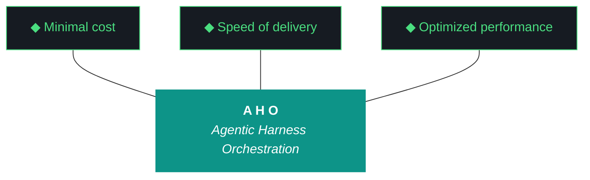

# aho - Bundle 0.2.1

**Generated:** 2026-04-11T14:34:27.294979Z
**Iteration:** 0.2.1
**Project code:** ahomw
**Project root:** /home/kthompson/dev/projects/aho

---

## §1. Design

### DESIGN (aho-design-0.2.1.md)
```markdown
# aho 0.2.1 — Design

**Phase:** 0 | **Iteration:** 2 | **Run:** 1 | **Theme:** Global deployment architecture + native OTEL collector + model fleet pre-pull
**Run Type:** mixed | **Wall clock:** ~3-4 hours | **Agent:** Claude Code throughout

## Context

Iteration 1 graduated. Soc-foundry/aho is live. 0.2.1 is the first run of iteration 2 ("Global Deployment + Full Telemetry"). The thesis: every aho component runs globally, every component emits OTEL spans, every component shows up in the upcoming frontend visualization. Half-measures break the visualization story.

## Phase 0 Charter Reference

Phase 0 graduates when soc-foundry/aho can be cloned on P3 and deploy LLMs, MCPs, agents, and OTEL collector via `bin/aho-install` with zero manual Python edits. 0.2.1 builds the install architecture; 0.2.4–0.2.5 validate it on P3.

## Objectives

1. **Hygiene + carryovers (W0).** Fix `build_log_complete` design path lookup, update `agents-architecture.md` body prose, .gitignore improvements (`data/chroma/`, `app/build/`), MANIFEST refresh, version sync to 0.2.1.
2. **Global install architecture (W1).** New `artifacts/harness/global-deployment.md` defining hybrid systemd model, install paths, component lifecycle, capability gap inventory, uninstall safety contract.
3. **Real `bin/aho-install` (W2).** Idempotent installer. Detects platform (Arch + fish required), creates XDG dirs, installs Python package, generates systemd unit files from templates, handles capability gaps cleanly. Companion `bin/aho-uninstall` for clean removal.
4. **Native OTEL collector as systemd user service (W3).** Latest stable opentelemetry-collector-contrib binary at `~/.local/bin/aho-otel-collector`. Config at `~/.config/aho/otel-collector.yaml`. Systemd unit at `~/.config/systemd/user/aho-otel-collector.service`. Logger updated to default to local collector — no more `AHO_OTEL_ENABLED` gating.
5. **Global Ollama + model fleet pre-pull (W4).** Capability gap: sudo install Ollama via official installer if absent. Enable `ollama.service`. Pre-pull qwen3.5:9b, nemotron-mini:4b, GLM-4.6V-Flash-9B, nomic-embed-text. Verify each loads via Ollama API. New `bin/aho-models-status` wrapper.
6. **Component instrumentation pass (W5).** Wire OTEL spans into qwen-client, nemotron-client, glm-client, openclaw, nemoclaw, telegram. Spans include model, latency, token counts, exit codes. Stubs stay stubs in components.yaml — but their attempted calls now show in traces. Visibility deepens before functionality lands.
7. **Dogfood + first end-to-end trace (W6).** Run synthetic iteration smoke test with everything global. Capture OTEL trace in Jaeger. Bundle, report, run file, postflight. Prepare second commit for soc-foundry push.

## Non-goals

- openclaw / nemoclaw real (non-stub) implementations — 0.2.2
- Telegram bridge real implementation — 0.2.3
- MCP server fleet (firebase-tools, context7, firecrawl, playwright, flutter, modelcontextprotocol/server-*) — 0.2.3
- P3 clone attempt — 0.2.4
- Frontend wiring against OTEL data — 0.3.x
- Git operations of any kind (Pillar 11 — Kyle pushes manually)

## Workstreams

### W0 — Hygiene + carryovers
- Bump `.aho.json`, `.aho-checkpoint.json` to 0.2.1
- Backup tarball
- Bump all 7 canonical artifacts to 0.2.1, including `agents-architecture.md` body prose ("Iteration 0.1.13 marks the final realignment" → "Iteration 0.2.1 begins global deployment phase")
- Fix `build_log_complete.py` design doc path lookup (`get_artifacts_root() / "iterations" / iteration / f"aho-design-{iteration}.md"`)
- Add `data/chroma/`, `app/build/`, `__pycache__/`, `*.pyc` to `.gitignore`
- Refresh MANIFEST.json
- `pyproject.toml` version 0.1.16 → 0.2.1
- Verify 0.15.1 directory absent from working tree (cleanup committed)

### W1 — Global install architecture design
New `artifacts/harness/global-deployment.md` with sections:
- **Hybrid systemd model** — Ollama as system service (sudo install), aho daemons as user services (no sudo, lingering enabled)
- **Install paths**:
  - `~/.local/bin/aho*` — wrappers and binaries
  - `~/.config/systemd/user/aho-*.service` — unit files
  - `~/.config/aho/` — collector config, credentials
  - `~/.local/share/aho/` — traces, logs, state
- **Component lifecycle** — install, enable, start, status, stop, restart, uninstall (every component supports all 7)
- **Capability gap inventory** — sudo for Ollama install/service, sudo for `loginctl enable-linger` (already done on NZXT), GitHub auth for soc-foundry pushes (manual per Pillar 11)
- **Uninstall safety contract** — `bin/aho-uninstall` removes installed files but never touches `data/`, `artifacts/`, or git state
- **Idempotency contract** — every install operation safe to re-run, detects existing state and no-ops or upgrades

### W2 — `bin/aho-install` real implementation
Replace existing skeleton with idempotent installer. Fish script. Steps:
1. Platform check: `uname -s` = Linux, fish present, Arch (`/etc/arch-release` exists). Halt with capability gap if not.
2. Create XDG dirs (mkdir -p, idempotent)
3. `pip install -e . --break-system-packages` from project root
4. Generate systemd unit file templates (W3 will populate the OTEL collector one; this step creates the directory structure and template scaffolding)
5. Verify `loginctl show-user kthompson | grep Linger=yes` — capability gap if no
6. Print install summary

Companion `bin/aho-uninstall`:
1. `systemctl --user stop aho-*` (best effort)
2. `systemctl --user disable aho-*` (best effort)
3. `rm ~/.config/systemd/user/aho-*.service`
4. `rm ~/.local/bin/aho-otel-collector` (binary only, not wrappers)
5. `rm -rf ~/.config/aho/`
6. Print "data/ and artifacts/ untouched"

Both wrappers wired into `aho doctor` checks.

### W3 — Native OTEL collector as systemd user service
1. Detect arch (`uname -m` → x86_64) and download latest stable from `https://github.com/open-telemetry/opentelemetry-collector-releases/releases/latest` (otelcol-contrib_*_linux_amd64.tar.gz)
2. Extract `otelcol-contrib` binary, install to `~/.local/bin/aho-otel-collector` (renamed for namespacing)
3. Generate `~/.config/aho/otel-collector.yaml`:
   ```yaml
   receivers:
     otlp:
       protocols:
         grpc:
           endpoint: 127.0.0.1:4317
         http:
           endpoint: 127.0.0.1:4318
   processors:
     batch:
       timeout: 5s
   exporters:
     file:
       path: /home/kthompson/.local/share/aho/traces/traces.jsonl
     otlp/jaeger:
       endpoint: localhost:14317
       tls:
         insecure: true
   service:
     pipelines:
       traces:
         receivers: [otlp]
         processors: [batch]
         exporters: [file, otlp/jaeger]
   ```
4. Generate `~/.config/systemd/user/aho-otel-collector.service`:
   ```ini
   [Unit]
   Description=aho OpenTelemetry Collector
   After=network.target
   [Service]
   Type=simple
   ExecStart=%h/.local/bin/aho-otel-collector --config=%h/.config/aho/otel-collector.yaml
   Restart=on-failure
   RestartSec=5
   [Install]
   WantedBy=default.target
   ```
5. `systemctl --user daemon-reload`
6. `systemctl --user enable --now aho-otel-collector.service`
7. Verify with `systemctl --user status aho-otel-collector` and a smoke OTLP send
8. Update `src/aho/logger.py`: default OTEL endpoint to `127.0.0.1:4317`, remove `AHO_OTEL_ENABLED` gating (always-on by default; opt-out via `AHO_OTEL_DISABLED=1`)
9. New `bin/aho-otel-status` wrapper showing service status, endpoint reachability, last trace timestamp from file exporter

### W4 — Global Ollama + model fleet pre-pull
1. Detect: `which ollama || systemctl status ollama`
2. If absent: capability gap halt — Kyle runs `curl -fsSL https://ollama.com/install.sh | sh` manually, agent resumes
3. Verify `ollama.service` enabled and active
4. For each model (qwen3.5:9b, nemotron-mini:4b, haervwe/GLM-4.6V-Flash-9B, nomic-embed-text):
   - `ollama list | grep <model>` — skip if present
   - `ollama pull <model>` — capability gap if pull fails (likely network or disk)
   - Verify load via `ollama show <model>`
5. New `bin/aho-models-status` querying `http://localhost:11434/api/tags` and rendering a table: name, size, modified, loaded
6. Add to `aho doctor` quick checks
7. Capability gap inventory updated in `global-deployment.md` with the Ollama install command for P3

### W5 — Component instrumentation pass
Wire OTEL spans into every LLM client, agent, and external service:

**`src/aho/artifacts/qwen_client.py`** — wrap each `generate()` call in span with attributes: `model=qwen3.5:9b`, `prompt_tokens`, `completion_tokens`, `latency_ms`, `temperature`, `streaming`, `exit_status`

**`src/aho/artifacts/nemotron_client.py`** — same shape, model=nemotron-mini:4b

**`src/aho/artifacts/glm_client.py`** — same shape, model=haervwe/GLM-4.6V-Flash-9B, plus `image_count` attribute when present

**`src/aho/agents/openclaw.py`** — wrap `dispatch()` and `execute_code()` in spans. Stub status preserved in components.yaml, but instrumented.

**`src/aho/agents/nemoclaw.py`** — wrap `route()` and `dispatch()` in spans. Span name = `nemoclaw.dispatch.<role>`.

**`src/aho/telegram/notifications.py`** — wrap `send()` in span with attributes: `chat_id`, `message_length`, `priority`, `status`. Stub still — span emits even when send is no-op.

Tests in `artifacts/tests/test_otel_instrumentation.py` verify span emission for each component using a mock OTLP receiver.

### W6 — Dogfood + close + first end-to-end trace
1. Full test suite (target ~85 tests with new W3, W5 additions)
2. `aho doctor` — all gates green including new global services
3. Smoke synthetic iteration: trigger qwen-client + nemotron-client + openclaw stub + telegram stub in sequence, verify trace appears in `~/.local/share/aho/traces/traces.jsonl`
4. Optional: `bin/aho-otel-up` (Jaeger), open `localhost:16686`, screenshot the trace for iteration artifacts
5. Bundle generation through corrected close sequence
6. Mechanical report builder produces structured report
7. Run file generated with component section + agent attribution
8. Postflight gates green
9. `.aho.json` updates `last_completed_iteration: 0.2.1`
10. Checkpoint closed
11. Print git commit message draft for Kyle to push manually

## Capability gaps expected

- **W2:** Linger check (already done, should pass)
- **W3:** None (user service, no sudo)
- **W4:** Ollama install if absent (sudo curl pipe), model pulls if disk/network constrained
- **W6:** Manual git commit + push by Kyle after agent close (Pillar 11)

## Success criteria

- `bin/aho-install` runs idempotently on NZXTcos producing identical state on second run
- `bin/aho-uninstall` cleanly removes installed components without touching data
- `aho-otel-collector.service` running and reachable on 4317
- All 4 Ollama models pre-pulled and loaded
- Synthetic smoke test produces traces in file exporter
- Every LLM client + agent + external service emits OTEL spans
- All 7 canonical artifacts at 0.2.1
- Sign-off #5 = `[x]`
- Second commit pushed to soc-foundry/aho
```

## §2. Plan

### PLAN (aho-plan-0.2.1.md)
```markdown
# aho 0.2.1 — Plan

**Phase:** 0 | **Iteration:** 2 | **Run:** 1 | **run_type:** mixed
**Agent:** Claude Code single-agent throughout

## Launch

```fish
cd ~/dev/projects/aho
set -x AHO_ITERATION 0.2.1
mkdir -p ~/dev/backups
tar czf ~/dev/backups/aho-pre-0.2.1.tar.gz --exclude=data/chroma --exclude=.venv --exclude=app/build --exclude=.git .
printf '{"aho_version":"0.1","name":"aho","project_code":"ahomw","artifact_prefix":"aho","current_iteration":"0.2.1","phase":0,"mode":"active","created_at":"2026-04-08T12:00:00+00:00","bundle_format":"bundle","last_completed_iteration":"0.1.16"}\n' > .aho.json
mkdir -p artifacts/iterations/0.2.1
tmux new-session -d -s aho-0.2.1 -c ~/dev/projects/aho
tmux send-keys -t aho-0.2.1 'cd ~/dev/projects/aho; claude --dangerously-skip-permissions' Enter
```

## W0 — Hygiene + carryovers

```fish
# .gitignore additions
printf '\ndata/chroma/\napp/build/\n__pycache__/\n*.pyc\n.venv/\n' >> .gitignore

# pyproject version bump
sed -i 's|^version = "0\.1\.16"|version = "0.2.1"|' pyproject.toml

# Verify 0.15.1 directory absent
test -d artifacts/iterations/0.15.1; and echo "STILL EXISTS — investigate"; or echo "OK clean"

# build_log_complete fix
rg -n "design.*path\|design_path" src/aho/postflight/build_log_complete.py
```

Edit `src/aho/postflight/build_log_complete.py` — locate the design doc path computation and replace with:
```python
from aho.paths import get_artifacts_root
design_path = get_artifacts_root() / "iterations" / iteration / f"aho-design-{iteration}.md"
```

Bump 7 canonical artifacts to 0.2.1:
```fish
sed -i 's|\*\*Version:\*\* 0\.1\.16|**Version:** 0.2.1|' artifacts/harness/base.md
sed -i 's|aho 0\.1\.16 W0 — close sequence repair|aho 0.2.1 W0 — global deployment|' artifacts/harness/base.md

sed -i 's|\*\*Version:\*\* 0\.1\.16|**Version:** 0.2.1|' artifacts/harness/agents-architecture.md
sed -i 's|^# Agents Architecture — aho 0\.1\.16|# Agents Architecture — aho 0.2.1|' artifacts/harness/agents-architecture.md
sed -i 's|Iteration 0\.1\.13 marks the final realignment|Iteration 0.2.1 begins global deployment phase|' artifacts/harness/agents-architecture.md

sed -i 's|\*\*Version:\*\* 0\.1\.16|**Version:** 0.2.1|' artifacts/harness/model-fleet.md

sed -i 's|\*\*Charter version:\*\* 0\.1\.16|**Charter version:** 0.2.1|' artifacts/phase-charters/aho-phase-0.md

sed -i 's|\*\*Iteration 0\.1\.16\*\*|**Iteration 0.2.1**|' README.md
sed -i 's|aho v0\.1\.16|aho v0.2.1|' README.md

sed -i 's|updated during 0\.1\.16|updated during 0.2.1|' CLAUDE.md
sed -i 's|updated during 0\.1\.16|updated during 0.2.1|' GEMINI.md
```

Refresh MANIFEST:
```fish
python -c "
import json, hashlib, pathlib
root = pathlib.Path('src/aho')
files = {}
for p in sorted(root.rglob('*.py')):
    if p.name == '__init__.py': continue
    files[str(p)] = hashlib.blake2b(p.read_bytes(), digest_size=8).hexdigest()
manifest = {'package': 'aho', 'version': '0.2.1', 'files': files}
pathlib.Path('MANIFEST.json').write_text(json.dumps(manifest, indent=2))
print(f'MANIFEST refreshed: {len(files)} files')
"
```

**W0 Gate:**
```fish
python -c "from aho.postflight.canonical_artifacts_current import check; r = check(); assert r['status'] == 'ok', r"
python -m pytest artifacts/tests/ -x
```

## W1 — Global install architecture design

Create `artifacts/harness/global-deployment.md` with the seven sections from the design doc: hybrid systemd model, install paths table, component lifecycle (install/enable/start/status/stop/restart/uninstall), capability gap inventory, uninstall safety contract, idempotency contract, P3 prereqs.

Add to canonical artifacts list (`artifacts/harness/canonical_artifacts.yaml`) — this becomes the 8th canonical artifact, version-tracked from now on.

**W1 Gate:** file exists, canonical artifacts gate updated to 8 entries, gate runs green.

## W2 — `bin/aho-install` real implementation

```fish
# Backup existing skeleton
cp bin/aho-install bin/aho-install.0.1.13.skeleton.bak
```

Replace `bin/aho-install` with idempotent fish script. Steps from design doc W2. Key sections:
1. Platform check (`/etc/arch-release`, `which fish`)
2. XDG dir creation (`mkdir -p`, idempotent)
3. `pip install -e . --break-system-packages` from project root
4. Create `~/.config/systemd/user/` if absent
5. Linger verification: `loginctl show-user $USER --property=Linger | grep -q Linger=yes; or echo "[CAPABILITY GAP] run: sudo loginctl enable-linger $USER"`
6. Print install summary

Create `bin/aho-uninstall` per design doc spec. Both wrappers `chmod +x`.

Wire both into `src/aho/doctor.py` quick checks.

Smoke test: 
```fish
bin/aho-install 2>&1 | tee /tmp/aho-install.log
bin/aho-install 2>&1 | tee /tmp/aho-install-2.log  # idempotency check
diff /tmp/aho-install.log /tmp/aho-install-2.log  # should show only timestamps
```

**W2 Gate:** install runs idempotently, uninstall script exists, doctor wires both.

## W3 — Native OTEL collector as systemd user service

```fish
# Latest stable detection
set OTEL_VERSION (curl -s https://api.github.com/repos/open-telemetry/opentelemetry-collector-releases/releases/latest | grep '"tag_name"' | sed -E 's/.*"v([^"]+)".*/\1/')
echo "OTEL collector version: $OTEL_VERSION"

# Download
set OTEL_TARBALL "otelcol-contrib_${OTEL_VERSION}_linux_amd64.tar.gz"
set OTEL_URL "https://github.com/open-telemetry/opentelemetry-collector-releases/releases/download/v${OTEL_VERSION}/${OTEL_TARBALL}"
mkdir -p /tmp/aho-otel-install
cd /tmp/aho-otel-install
curl -fsSL -o $OTEL_TARBALL $OTEL_URL
tar xzf $OTEL_TARBALL
mkdir -p ~/.local/bin
mv otelcol-contrib ~/.local/bin/aho-otel-collector
chmod +x ~/.local/bin/aho-otel-collector
cd ~/dev/projects/aho
rm -rf /tmp/aho-otel-install
```

Create `~/.config/aho/otel-collector.yaml` with the YAML from design doc W3.

Create `~/.config/systemd/user/aho-otel-collector.service` with the unit file from design doc W3.

```fish
mkdir -p ~/.local/share/aho/traces
systemctl --user daemon-reload
systemctl --user enable --now aho-otel-collector.service
systemctl --user status aho-otel-collector --no-pager
```

Update `src/aho/logger.py`:
- Default `OTLP endpoint = 127.0.0.1:4317`
- Change gating from `AHO_OTEL_ENABLED=1` (opt-in) to `AHO_OTEL_DISABLED=1` (opt-out)
- Default behavior: always emit OTEL when collector reachable, fall back silently on connection failure

Smoke send:
```fish
python -c "
from aho.logger import log_event
log_event(event_type='smoke', source_agent='claude-code', target='otel-collector', action='verify', iteration='0.2.1')
"
sleep 2
test -s ~/.local/share/aho/traces/traces.jsonl; and echo "TRACE OK"; or echo "TRACE MISSING"
```

Create `bin/aho-otel-status`:
```fish
#!/usr/bin/env fish
systemctl --user status aho-otel-collector --no-pager
echo "---"
echo "Last trace: $(stat -c %y ~/.local/share/aho/traces/traces.jsonl 2>/dev/null || echo 'none')"
echo "Trace count: $(wc -l < ~/.local/share/aho/traces/traces.jsonl 2>/dev/null || echo 0)"
```

`chmod +x bin/aho-otel-status`

**W3 Gate:** collector running as user service, smoke send appears in traces.jsonl, logger defaults to always-on.

## W4 — Global Ollama + model fleet pre-pull

```fish
which ollama
or echo "[CAPABILITY GAP] Ollama not installed. Run: curl -fsSL https://ollama.com/install.sh | sh"
```

If gap: halt, write checkpoint, notify Kyle. Otherwise:

```fish
systemctl status ollama --no-pager
sudo systemctl enable --now ollama  # capability gap if not enabled, agent halts
```

Pre-pull models:
```fish
for model in qwen3.5:9b nemotron-mini:4b haervwe/GLM-4.6V-Flash-9B nomic-embed-text
    if ollama list | grep -q $model
        echo "✓ $model present"
    else
        echo "Pulling $model..."
        ollama pull $model
        or begin; echo "[CAPABILITY GAP] Pull failed for $model"; exit 1; end
    end
end
ollama list
```

Create `bin/aho-models-status`:
```fish
#!/usr/bin/env fish
curl -s http://localhost:11434/api/tags | python -c "
import json, sys
data = json.loads(sys.stdin.read())
print(f'{\"NAME\":<40} {\"SIZE\":<10} {\"MODIFIED\"}')
for m in data.get('models', []):
    size_gb = m['size'] / (1024**3)
    print(f'{m[\"name\"]:<40} {size_gb:>6.2f}GB  {m[\"modified_at\"][:19]}')
"
```

`chmod +x bin/aho-models-status`

Add to `src/aho/doctor.py` quick checks: query `localhost:11434/api/tags`, verify all 4 models present, FAIL if any missing.

**W4 Gate:** all 4 models present, doctor check green, models-status wrapper works.

## W5 — Component instrumentation pass

For each of 6 files, wrap primary methods in OTEL spans. Pattern (qwen_client.py example):

```python
from opentelemetry import trace
tracer = trace.get_tracer("aho.qwen_client")

def generate(self, prompt: str, **kwargs):
    with tracer.start_as_current_span("qwen.generate") as span:
        span.set_attribute("model", "qwen3.5:9b")
        span.set_attribute("prompt_length", len(prompt))
        span.set_attribute("temperature", kwargs.get("temperature", 0.7))
        span.set_attribute("streaming", kwargs.get("stream", False))
        try:
            result = self._do_generate(prompt, **kwargs)
            span.set_attribute("completion_tokens", result.get("eval_count", 0))
            span.set_attribute("prompt_tokens", result.get("prompt_eval_count", 0))
            span.set_attribute("latency_ms", result.get("total_duration", 0) / 1e6)
            span.set_attribute("status", "ok")
            return result
        except Exception as e:
            span.set_attribute("status", "error")
            span.record_exception(e)
            raise
```

Apply same pattern (with appropriate attributes) to:
- `src/aho/artifacts/nemotron_client.py` — `classify()` method
- `src/aho/artifacts/glm_client.py` — `analyze()` and `vision()` methods
- `src/aho/agents/openclaw.py` — `dispatch()` and `execute_code()` methods
- `src/aho/agents/nemoclaw.py` — `route()` and `dispatch()` methods
- `src/aho/telegram/notifications.py` — `send()` method (stub still emits span)

Create `artifacts/tests/test_otel_instrumentation.py` with mock OTLP receiver verifying span emission for each of the 6 components.

**W5 Gate:** new test file passes, smoke sends produce 6 distinct span types in traces.jsonl.

## W6 — Dogfood + close

```fish
python -m pytest artifacts/tests/ -v
aho doctor
```

Smoke synthetic iteration:
```fish
python -c "
from aho.artifacts.qwen_client import QwenClient
from aho.artifacts.nemotron_client import NemotronClient
from aho.agents.openclaw import OpenClaw
from aho.telegram.notifications import send
qwen = QwenClient()
qwen.generate('Say hello in 5 words')
nemo = NemotronClient()
nemo.classify('test', ['a', 'b'])
oc = OpenClaw()
oc.dispatch('test task')
send('smoke test', priority='low')
"
sleep 3
wc -l ~/.local/share/aho/traces/traces.jsonl
```

Run iteration close:
```fish
python -m aho.cli iteration close 0.2.1
```

Verify:
- Bundle exists at `artifacts/iterations/0.2.1/aho-bundle-0.2.1.md`
- Run file shows agent attribution and component section
- All postflight gates green
- `.aho.json` shows `last_completed_iteration: 0.2.1`
- Checkpoint closed

Print git commit message draft for Kyle:
```
Echo "
COMMIT MESSAGE DRAFT (Kyle pushes manually):
---
KT completed 0.2.1: global deployment architecture, native OTEL collector, model fleet pre-pull, component instrumentation
---
"
```

**W6 Gate:** zero false-positive postflight failures, smoke trace count > 6 spans, all artifacts present, ready for Kyle git push.

## Capability gaps expected

- **W2:** Linger verification — should pass (already enabled)
- **W4:** Ollama install (if absent), model pulls (if disk/network constrained), `sudo systemctl enable ollama`
- **W6:** Kyle manual git add/commit/push (Pillar 11)

## Checkpoint schema

```json
{
  "iteration": "0.2.1",
  "phase": 0,
  "run_type": "mixed",
  "current_workstream": "W0",
  "workstreams": {"W0":"pending","W1":"pending","W2":"pending","W3":"pending","W4":"pending","W5":"pending","W6":"pending"},
  "executor": "claude-code",
  "started_at": null,
  "last_event": null
}
```
```

## §3. Build Log

### BUILD LOG (MANUAL) (aho-build-log-0.2.1.md)
```markdown
# aho 0.2.1 — Build Log (Stub)

**Run Type:** mixed
**Generated:** 2026-04-11T14:34:22.370599+00:00

> **Auto-generated from checkpoint + event log. No manual build log was authored for this run.**

## Workstream Synthesis

| Workstream | Agent | Status | Events | First | Last |
|------------|-------|--------|--------|-------|------|
| W0 | claude-code | pass | 0 | - | - |
| W1 | claude-code | pass | 0 | - | - |
| W2 | claude-code | pass | 0 | - | - |
| W3 | claude-code | pass | 0 | - | - |
| W4 | claude-code | pass | 0 | - | - |
| W5 | claude-code | pass | 0 | - | - |
| W6 | claude-code | pass | 0 | - | - |

## Event Type Histogram

- **structural_gate:** 82
- **llm_call:** 33
- **cli_invocation:** 29
- **evaluator_run:** 28
- **session_start:** 13
- **agent_msg:** 5
- **command:** 4
- **smoke:** 1

## Event Log Tail (Last 20)

```json
{"timestamp": "2026-04-11T14:33:46.969590+00:00", "iteration": "0.2.1", "workstream_id": null, "event_type": "cli_invocation", "source_agent": "aho-cli", "target": "cli", "action": "doctor", "input_summary": "", "output_summary": "", "tokens": null, "latency_ms": null, "status": "success", "error": null, "gotcha_triggered": null}
{"timestamp": "2026-04-11T14:33:47.100017+00:00", "iteration": "0.2.1", "workstream_id": null, "event_type": "structural_gate", "source_agent": "structural-gates", "target": "design", "action": "check", "input_summary": "", "output_summary": "status=PASS errors=0 variant=w_based", "tokens": null, "latency_ms": null, "status": "success", "error": null, "gotcha_triggered": null}
{"timestamp": "2026-04-11T14:33:47.100212+00:00", "iteration": "0.2.1", "workstream_id": null, "event_type": "structural_gate", "source_agent": "structural-gates", "target": "plan", "action": "check", "input_summary": "", "output_summary": "status=PASS errors=0 variant=w_based", "tokens": null, "latency_ms": null, "status": "success", "error": null, "gotcha_triggered": null}
{"timestamp": "2026-04-11T14:33:47.100336+00:00", "iteration": "0.2.1", "workstream_id": null, "event_type": "structural_gate", "source_agent": "structural-gates", "target": "build-log", "action": "check", "input_summary": "", "output_summary": "status=PASS errors=0 variant=section_based", "tokens": null, "latency_ms": null, "status": "success", "error": null, "gotcha_triggered": null}
{"timestamp": "2026-04-11T14:33:47.100416+00:00", "iteration": "0.2.1", "workstream_id": null, "event_type": "structural_gate", "source_agent": "structural-gates", "target": "report", "action": "check", "input_summary": "", "output_summary": "status=PASS errors=0 variant=section_based", "tokens": null, "latency_ms": null, "status": "success", "error": null, "gotcha_triggered": null}
{"timestamp": "2026-04-11T14:33:47.256524+00:00", "iteration": "0.2.1", "workstream_id": null, "event_type": "cli_invocation", "source_agent": "aho-cli", "target": "cli", "action": "doctor", "input_summary": "", "output_summary": "", "tokens": null, "latency_ms": null, "status": "success", "error": null, "gotcha_triggered": null}
{"timestamp": "2026-04-11T14:33:47.381494+00:00", "iteration": "0.2.1", "workstream_id": null, "event_type": "evaluator_run", "source_agent": "evaluator", "target": "build_log_synthesis", "action": "evaluate", "input_summary": "", "output_summary": "severity=reject errors=1", "tokens": null, "latency_ms": null, "status": "reject", "error": null, "gotcha_triggered": null}
{"timestamp": "2026-04-11T14:33:47.382589+00:00", "iteration": "0.2.1", "workstream_id": null, "event_type": "evaluator_run", "source_agent": "evaluator", "target": "unknown", "action": "evaluate", "input_summary": "", "output_summary": "severity=warn errors=1", "tokens": null, "latency_ms": null, "status": "warn", "error": null, "gotcha_triggered": null}
{"timestamp": "2026-04-11T14:33:47.383630+00:00", "iteration": "0.2.1", "workstream_id": null, "event_type": "evaluator_run", "source_agent": "evaluator", "target": "build_log_synthesis", "action": "evaluate", "input_summary": "", "output_summary": "severity=clean errors=0", "tokens": null, "latency_ms": null, "status": "clean", "error": null, "gotcha_triggered": null}
{"timestamp": "2026-04-11T14:33:49.016901+00:00", "iteration": "0.2.1", "workstream_id": null, "event_type": "structural_gate", "source_agent": "structural-gates", "target": "design", "action": "check", "input_summary": "", "output_summary": "status=PASS errors=0 variant=w_based", "tokens": null, "latency_ms": null, "status": "success", "error": null, "gotcha_triggered": null}
{"timestamp": "2026-04-11T14:33:49.017116+00:00", "iteration": "0.2.1", "workstream_id": null, "event_type": "structural_gate", "source_agent": "structural-gates", "target": "plan", "action": "check", "input_summary": "", "output_summary": "status=PASS errors=0 variant=w_based", "tokens": null, "latency_ms": null, "status": "success", "error": null, "gotcha_triggered": null}
{"timestamp": "2026-04-11T14:33:49.017284+00:00", "iteration": "0.2.1", "workstream_id": null, "event_type": "structural_gate", "source_agent": "structural-gates", "target": "build-log", "action": "check", "input_summary": "", "output_summary": "status=PASS errors=0 variant=section_based", "tokens": null, "latency_ms": null, "status": "success", "error": null, "gotcha_triggered": null}
{"timestamp": "2026-04-11T14:33:49.017374+00:00", "iteration": "0.2.1", "workstream_id": null, "event_type": "structural_gate", "source_agent": "structural-gates", "target": "report", "action": "check", "input_summary": "", "output_summary": "status=PASS errors=0 variant=section_based", "tokens": null, "latency_ms": null, "status": "success", "error": null, "gotcha_triggered": null}
{"timestamp": "2026-04-11T14:33:49.161399+00:00", "iteration": "0.2.1", "workstream_id": null, "event_type": "cli_invocation", "source_agent": "aho-cli", "target": "cli", "action": "doctor", "input_summary": "", "output_summary": "", "tokens": null, "latency_ms": null, "status": "success", "error": null, "gotcha_triggered": null}
{"timestamp": "2026-04-11T14:33:50.435559+00:00", "iteration": "0.2.1", "workstream_id": null, "event_type": "structural_gate", "source_agent": "structural-gates", "target": "design", "action": "check", "input_summary": "", "output_summary": "status=PASS errors=0 variant=w_based", "tokens": null, "latency_ms": null, "status": "success", "error": null, "gotcha_triggered": null}
{"timestamp": "2026-04-11T14:33:50.435786+00:00", "iteration": "0.2.1", "workstream_id": null, "event_type": "structural_gate", "source_agent": "structural-gates", "target": "plan", "action": "check", "input_summary": "", "output_summary": "status=PASS errors=0 variant=w_based", "tokens": null, "latency_ms": null, "status": "success", "error": null, "gotcha_triggered": null}
{"timestamp": "2026-04-11T14:33:50.435925+00:00", "iteration": "0.2.1", "workstream_id": null, "event_type": "structural_gate", "source_agent": "structural-gates", "target": "build-log", "action": "check", "input_summary": "", "output_summary": "status=PASS errors=0 variant=section_based", "tokens": null, "latency_ms": null, "status": "success", "error": null, "gotcha_triggered": null}
{"timestamp": "2026-04-11T14:33:50.436057+00:00", "iteration": "0.2.1", "workstream_id": null, "event_type": "structural_gate", "source_agent": "structural-gates", "target": "report", "action": "check", "input_summary": "", "output_summary": "status=PASS errors=0 variant=section_based", "tokens": null, "latency_ms": null, "status": "success", "error": null, "gotcha_triggered": null}
{"timestamp": "2026-04-11T14:33:50.583508+00:00", "iteration": "0.2.1", "workstream_id": null, "event_type": "cli_invocation", "source_agent": "aho-cli", "target": "cli", "action": "doctor", "input_summary": "", "output_summary": "", "tokens": null, "latency_ms": null, "status": "success", "error": null, "gotcha_triggered": null}
{"timestamp": "2026-04-11T14:34:22.364257+00:00", "iteration": "0.2.1", "workstream_id": null, "event_type": "cli_invocation", "source_agent": "aho-cli", "target": "cli", "action": "iteration close", "input_summary": "", "output_summary": "", "tokens": null, "latency_ms": null, "status": "success", "error": null, "gotcha_triggered": null}
```
```

## §4. Report

### REPORT (aho-report-0.2.1.md)
```markdown
# Report — aho 0.2.1

**Generated:** 2026-04-11T14:33:49Z
**Iteration:** 0.2.1
**Phase:** 0
**Run type:** mixed
**Status:** unknown

---

## Executive Summary

This iteration executed 7 workstreams: 6 passed, 0 failed, 1 pending/partial.
184 events logged during execution.
Postflight: 10/15 gates passed, 2 failed.

---

## Workstream Detail

| Workstream | Status | Agent | Events |
|---|---|---|---|
| W0 | pass | claude-code | 0 |
| W1 | pass | claude-code | 0 |
| W2 | pass | claude-code | 0 |
| W3 | pass | claude-code | 0 |
| W4 | pass | claude-code | 0 |
| W5 | pass | claude-code | 0 |
| W6 | active | claude-code | 0 |

---

## Component Activity

| Component | Kind | Status | Owner | Notes |
|---|---|---|---|---|
| openclaw | agent | stub | soc-foundry | next: 0.1.16; ephemeral Python only; global wrapper + install pending 0.1.16 |
| nemoclaw | agent | stub | soc-foundry | next: 0.1.16; orchestration layer; routing logic stubbed; global wrapper pending 0.1.16 |
| telegram | external_service | stub | soc-foundry | next: 0.1.16; deferred since 0.1.4 charter; bridge real implementation pending 0.1.16 |
| qwen-client | llm | active | soc-foundry |  |
| nemotron-client | llm | active | soc-foundry |  |
| glm-client | llm | active | soc-foundry |  |
| chromadb | external_service | active | soc-foundry |  |
| ollama | external_service | active | soc-foundry |  |
| opentelemetry | external_service | active | soc-foundry | dual emitter alongside JSONL; activated 0.1.15 W2 |
| assistant-role | agent | active | soc-foundry |  |
| base-role | agent | active | soc-foundry |  |
| code-runner-role | agent | active | soc-foundry |  |
| reviewer-role | agent | active | soc-foundry |  |
| cli | python_module | active | soc-foundry |  |
| config | python_module | active | soc-foundry |  |
| doctor | python_module | active | soc-foundry |  |
| logger | python_module | active | soc-foundry |  |
| paths | python_module | active | soc-foundry |  |
| harness | python_module | active | soc-foundry |  |
| compatibility | python_module | active | soc-foundry |  |
| push | python_module | active | soc-foundry |  |
| registry | python_module | active | soc-foundry |  |
| ollama-config | python_module | active | soc-foundry |  |
| artifact-loop | python_module | active | soc-foundry |  |
| artifact-context | python_module | active | soc-foundry |  |
| artifact-evaluator | python_module | active | soc-foundry |  |
| artifact-schemas | python_module | active | soc-foundry |  |
| artifact-templates | python_module | active | soc-foundry |  |
| repetition-detector | python_module | active | soc-foundry |  |
| bundle | python_module | active | soc-foundry |  |
| components-section | python_module | active | soc-foundry |  |
| report-builder | python_module | active | soc-foundry | mechanical report builder, added 0.1.15 W0 |
| feedback-run | python_module | active | soc-foundry |  |
| feedback-prompt | python_module | active | soc-foundry |  |
| feedback-questions | python_module | active | soc-foundry |  |
| feedback-summary | python_module | active | soc-foundry |  |
| feedback-seed | python_module | active | soc-foundry |  |
| build-log-stub | python_module | active | soc-foundry |  |
| pipeline-scaffold | python_module | active | soc-foundry |  |
| pipeline-validate | python_module | active | soc-foundry |  |
| pipeline-registry | python_module | active | soc-foundry |  |
| pipeline-pattern | python_module | active | soc-foundry |  |
| pf-artifacts-present | python_module | active | soc-foundry |  |
| pf-build-log-complete | python_module | active | soc-foundry |  |
| pf-bundle-quality | python_module | active | soc-foundry |  |
| pf-gemini-compat | python_module | active | soc-foundry |  |
| pf-iteration-complete | python_module | active | soc-foundry |  |
| pf-layout | python_module | active | soc-foundry |  |
| pf-manifest-current | python_module | active | soc-foundry | added 0.1.15 W0 |
| pf-changelog-current | python_module | active | soc-foundry | added 0.1.15 W0 |
| pf-pillars-present | python_module | active | soc-foundry |  |
| pf-pipeline-present | python_module | active | soc-foundry |  |
| pf-readme-current | python_module | active | soc-foundry |  |
| pf-run-complete | python_module | active | soc-foundry |  |
| pf-run-quality | python_module | active | soc-foundry |  |
| pf-structural-gates | python_module | active | soc-foundry |  |
| preflight-checks | python_module | active | soc-foundry |  |
| rag-archive | python_module | active | soc-foundry |  |
| rag-query | python_module | active | soc-foundry |  |
| rag-router | python_module | active | soc-foundry |  |
| secrets-store | python_module | active | soc-foundry |  |
| secrets-session | python_module | active | soc-foundry |  |
| secrets-cli | python_module | active | soc-foundry |  |
| secrets-backend-age | python_module | active | soc-foundry |  |
| secrets-backend-base | python_module | active | soc-foundry |  |
| secrets-backend-fernet | python_module | active | soc-foundry |  |
| secrets-backend-keyring | python_module | active | soc-foundry |  |
| install-migrate-config | python_module | active | soc-foundry |  |
| install-secret-patterns | python_module | active | soc-foundry |  |
| brave-integration | python_module | active | soc-foundry |  |
| firestore | python_module | active | soc-foundry |  |
| component-manifest | python_module | active | soc-foundry | added 0.1.15 W1 |

**Total components:** 72
**Status breakdown:** 69 active, 3 stub

---

## Postflight Results

| Gate | Status | Message |
|---|---|---|
| app_build_check | ok | web build present (1502 bytes) |
| artifacts_present | ok | all 3 artifacts present (aho) |
| build_log_complete | warn | design doc not found, skipping completeness check |
| bundle_quality | ok | Bundle valid (306 KB, run_type: mixed) |
| canonical_artifacts_current | ok | all 8 canonical artifacts at 0.2.1 |
| changelog_current | fail | CHANGELOG.md missing entry for 0.2.1 |
| gemini_compat | ok | Gemini-primary CLI sync verified |
| iteration_complete | fail | Checkpoint: Incomplete workstreams: W6(active)
Build Log: Build log manual ground truth present
Secret Scan: No plaintext secrets found in tracked files
install.fish: install.fish syntax OK
Artifacts: All Qwen-generated artifacts present |
| manifest_current | ok | all 71 file hashes current |
| pillars_present | ok | Eleven pillars present in design and README |
| pipeline_present | ok | SKIP — no pipelines declared in .aho.json |
| readme_current | ok | README updated during this iteration (mtime: 2026-04-11T14:22:10.679480+00:00) |
| run_complete | deferred | Sign-off incomplete: I have reviewed the bundle, I have reviewed the build log |
| run_quality | ok | Run file passes quality gate |
| structural_gates | pass | Structural gates: 4 pass, 0 fail, 0 deferred |

---

## Risk Register

- **2026-04-11T14:22:30.809794+00:00** [evaluator_run] severity=warn errors=2
- **2026-04-11T14:22:30.825151+00:00** [evaluator_run] severity=reject errors=40
- **2026-04-11T14:22:30.829811+00:00** [evaluator_run] severity=warn errors=2
- **2026-04-11T14:22:32.024493+00:00** [evaluator_run] severity=reject errors=1
- **2026-04-11T14:22:32.025510+00:00** [evaluator_run] severity=warn errors=1
- **2026-04-11T14:30:58.655814+00:00** [evaluator_run] severity=warn errors=2
- **2026-04-11T14:30:58.671447+00:00** [evaluator_run] severity=reject errors=40
- **2026-04-11T14:30:58.676367+00:00** [evaluator_run] severity=warn errors=2
- **2026-04-11T14:31:00.471629+00:00** [evaluator_run] severity=reject errors=1
- **2026-04-11T14:31:00.472414+00:00** [evaluator_run] severity=warn errors=1
- **2026-04-11T14:31:44.311152+00:00** [evaluator_run] severity=warn errors=2
- **2026-04-11T14:31:44.325988+00:00** [evaluator_run] severity=reject errors=40
- **2026-04-11T14:31:44.330558+00:00** [evaluator_run] severity=warn errors=2
- **2026-04-11T14:31:46.138197+00:00** [evaluator_run] severity=reject errors=1
- **2026-04-11T14:31:46.138865+00:00** [evaluator_run] severity=warn errors=1
- **2026-04-11T14:33:45.478379+00:00** [evaluator_run] severity=warn errors=2
- **2026-04-11T14:33:45.493965+00:00** [evaluator_run] severity=reject errors=40
- **2026-04-11T14:33:45.498778+00:00** [evaluator_run] severity=warn errors=2
- **2026-04-11T14:33:47.381494+00:00** [evaluator_run] severity=reject errors=1
- **2026-04-11T14:33:47.382589+00:00** [evaluator_run] severity=warn errors=1

---

## Carryovers

From 0.1.16 Kyle's Notes:

**Iteration 1 graduated.** 16 runs (0.1.0 → 0.1.16) of harness construction. The aho harness exists as a coherent thing. Foundation is done.

**Soc-foundry/aho is live.** First push happened between 0.1.16 close and 0.2.1 launch. SSH host alias `github.com-sockjt` configured. 348 objects, 5.35 MiB pushed. The 0.15.1 typo directory got committed in the first push and cleaned up in the second commit. **0.2.1 W0 needs to git rm the entry from any indices and verify the directory is gone from working tree.**

**aho.run domain registered.** Already in README, pyproject, charter.

**Iteration 2 opens at 0.2.1 with revised scope.** Soc-foundry initial push already happened (was supposed to be 0.2.1's centerpiece). 0.2.1 now focuses entirely on global deployment architecture: hybrid systemd model (Ollama system service, aho daemons user services), native OTEL collector as systemd user service, real `bin/aho-install`, model fleet pre-pull, component instrumentation pass. Sets up 0.2.2 (openclaw/nemoclaw real implementations as global daemons), 0.2.3 (telegram bridge + MCP servers), 0.2.4–0.2.5 (P3 clone-to-deploy validation).

**The thesis crystallizes at iteration 2:** every component is global, every component is OTEL-instrumented, every component shows up in the upcoming frontend. Half-measures break the visualization story. 0.2.1 lays the spine for that.

**`loginctl enable-linger kthompson` already executed.** No capability gap on first systemd user service install.

---

---

## Next Iteration Recommendation

- Address failed postflight gates: changelog_current, iteration_complete
```

## §5. Run Report

### RUN REPORT (aho-run-0.2.1.md)
```markdown
# Run File — aho 0.2.1

**Generated:** 2026-04-11T14:33:49Z
**Iteration:** 0.2.1
**Phase:** 0

## About this Report

This run file is a canonical iteration artifact produced during the `iteration close` sequence. It serves as the primary feedback interface between the autonomous agent and the human supervisor. Unlike the Qwen-generated synthesis report, this document is mechanically assembled from the iteration's ground truth: the execution checkpoint and the extracted agent questions.

The report includes a workstream summary, a collection of technical or procedural questions surfaced by the agent during execution, and a sign-off section for the reviewer.

---

## Workstream Summary

| Workstream | Status | Agent | Wall Clock |
|---|---|---|---|
| W0 | pass | claude-code | - |
| W1 | pass | claude-code | - |
| W2 | pass | claude-code | - |
| W3 | pass | claude-code | - |
| W4 | pass | claude-code | - |
| W5 | pass | claude-code | - |
| W6 | active | claude-code | - |

---

## Component Activity

| Component | Kind | Status | Owner | Notes |
|---|---|---|---|---|
| openclaw | agent | stub | soc-foundry | next: 0.1.16; ephemeral Python only; global wrapper + install pending 0.1.16 |
| nemoclaw | agent | stub | soc-foundry | next: 0.1.16; orchestration layer; routing logic stubbed; global wrapper pending 0.1.16 |
| telegram | external_service | stub | soc-foundry | next: 0.1.16; deferred since 0.1.4 charter; bridge real implementation pending 0.1.16 |
| qwen-client | llm | active | soc-foundry |  |
| nemotron-client | llm | active | soc-foundry |  |
| glm-client | llm | active | soc-foundry |  |
| chromadb | external_service | active | soc-foundry |  |
| ollama | external_service | active | soc-foundry |  |
| opentelemetry | external_service | active | soc-foundry | dual emitter alongside JSONL; activated 0.1.15 W2 |
| assistant-role | agent | active | soc-foundry |  |
| base-role | agent | active | soc-foundry |  |
| code-runner-role | agent | active | soc-foundry |  |
| reviewer-role | agent | active | soc-foundry |  |
| cli | python_module | active | soc-foundry |  |
| config | python_module | active | soc-foundry |  |
| doctor | python_module | active | soc-foundry |  |
| logger | python_module | active | soc-foundry |  |
| paths | python_module | active | soc-foundry |  |
| harness | python_module | active | soc-foundry |  |
| compatibility | python_module | active | soc-foundry |  |
| push | python_module | active | soc-foundry |  |
| registry | python_module | active | soc-foundry |  |
| ollama-config | python_module | active | soc-foundry |  |
| artifact-loop | python_module | active | soc-foundry |  |
| artifact-context | python_module | active | soc-foundry |  |
| artifact-evaluator | python_module | active | soc-foundry |  |
| artifact-schemas | python_module | active | soc-foundry |  |
| artifact-templates | python_module | active | soc-foundry |  |
| repetition-detector | python_module | active | soc-foundry |  |
| bundle | python_module | active | soc-foundry |  |
| components-section | python_module | active | soc-foundry |  |
| report-builder | python_module | active | soc-foundry | mechanical report builder, added 0.1.15 W0 |
| feedback-run | python_module | active | soc-foundry |  |
| feedback-prompt | python_module | active | soc-foundry |  |
| feedback-questions | python_module | active | soc-foundry |  |
| feedback-summary | python_module | active | soc-foundry |  |
| feedback-seed | python_module | active | soc-foundry |  |
| build-log-stub | python_module | active | soc-foundry |  |
| pipeline-scaffold | python_module | active | soc-foundry |  |
| pipeline-validate | python_module | active | soc-foundry |  |
| pipeline-registry | python_module | active | soc-foundry |  |
| pipeline-pattern | python_module | active | soc-foundry |  |
| pf-artifacts-present | python_module | active | soc-foundry |  |
| pf-build-log-complete | python_module | active | soc-foundry |  |
| pf-bundle-quality | python_module | active | soc-foundry |  |
| pf-gemini-compat | python_module | active | soc-foundry |  |
| pf-iteration-complete | python_module | active | soc-foundry |  |
| pf-layout | python_module | active | soc-foundry |  |
| pf-manifest-current | python_module | active | soc-foundry | added 0.1.15 W0 |
| pf-changelog-current | python_module | active | soc-foundry | added 0.1.15 W0 |
| pf-pillars-present | python_module | active | soc-foundry |  |
| pf-pipeline-present | python_module | active | soc-foundry |  |
| pf-readme-current | python_module | active | soc-foundry |  |
| pf-run-complete | python_module | active | soc-foundry |  |
| pf-run-quality | python_module | active | soc-foundry |  |
| pf-structural-gates | python_module | active | soc-foundry |  |
| preflight-checks | python_module | active | soc-foundry |  |
| rag-archive | python_module | active | soc-foundry |  |
| rag-query | python_module | active | soc-foundry |  |
| rag-router | python_module | active | soc-foundry |  |
| secrets-store | python_module | active | soc-foundry |  |
| secrets-session | python_module | active | soc-foundry |  |
| secrets-cli | python_module | active | soc-foundry |  |
| secrets-backend-age | python_module | active | soc-foundry |  |
| secrets-backend-base | python_module | active | soc-foundry |  |
| secrets-backend-fernet | python_module | active | soc-foundry |  |
| secrets-backend-keyring | python_module | active | soc-foundry |  |
| install-migrate-config | python_module | active | soc-foundry |  |
| install-secret-patterns | python_module | active | soc-foundry |  |
| brave-integration | python_module | active | soc-foundry |  |
| firestore | python_module | active | soc-foundry |  |
| component-manifest | python_module | active | soc-foundry | added 0.1.15 W1 |

**Total components:** 72
**Status breakdown:** 69 active, 3 stub

---

## Agent Questions for Kyle

(none — no questions surfaced during execution)

---

## Kyle's Notes for Next Iteration

<!-- Fill in after reviewing the bundle -->


---

## Reference: The Eleven Pillars

1. **Delegate everything delegable.** The paid orchestrator is the most expensive resource in the system. Any task that can run on a free local model must run on a free local model. Drafting, classification, retrieval, validation, grading, and routing all belong to the local fleet. The orchestrator's minutes are spent on judgment, scope, and novelty.
2. **The harness is the contract.** Agent instructions live in versioned harness files that change at phase or iteration boundaries, not in per-run markdown regenerated from scratch. The orchestrator points at the harness; it does not carry the contract in its own context.
3. **Everything is artifacts.** Every task is artifacts-in to artifacts-out. Code, reports, schemas, analyses, migrations, audits, designs — all artifacts. The harness is artifact-agnostic at its core and artifact-specialized at its overlays.
4. **Wrappers are the tool surface.** Agents never call raw tools. Every tool is invoked through a `/bin` wrapper. Wrappers are versioned with the harness, instrumented for the event log, and replayable from recorded inputs.
5. **Three octets, three meanings: phase, iteration, run.** Phase is strategic scope. Iteration is tactical scope. Run is execution instance. Every artifact carries the full phase.iteration.run label.
6. **Transitions are durable.** Moving between phases, iterations, or runs writes state to a durable artifact before the transition is considered complete. Every gate is a write point. No implicit state.
7. **Generation and evaluation are separate roles.** The model that produced an artifact is never the model that grades it. Drafter and reviewer are different agents behind different wrappers with different prompts and ideally different underlying weights.
8. **Efficacy is measured in cost delta.** Every run records orchestrator token cost, local fleet compute time, wall clock, delegate ratio, and output quality signal. Numbers ship with the run report.
9. **The gotcha registry is the harness's memory.** Every failure mode lands in the registry. A mature harness has more gotchas than an immature one — gotcha count is the compound-interest metric.
10. **Runs are interrupt-disciplined, not interrupt-free.** Once a run launches, agents do not ping for preference, clarification, or approval. The single exception is unavoidable capability gaps (sudo, credentials, physical access) — routed through OpenClaw to a defined notification channel, logged as a first-class event, resumed from the last durable checkpoint.
11. **The human holds the keys.** No agent writes to git. No agent merges. No agent pushes. No agent manages secrets. No wrapper surfaces `git commit` or `git push` under any role.

---

---

## Sign-off

- [ ] I have reviewed the bundle
- [ ] I have reviewed the build log
- [ ] I have reviewed the report
- [ ] I have answered all agent questions above
- [ ] I am satisfied with this iteration's output

---

*Run report generated 2026-04-11T14:33:49Z*
```

## §6. Harness

### base.md (base.md)
```markdown
# aho - Base Harness

**Version:** 0.2.1
**Last updated:** 2026-04-11 (aho 0.2.1 W0 — global deployment)
**Scope:** Universal aho methodology. Extended by project harnesses.
**Status:** ahomw - inviolable

## The Eleven Pillars

These eleven pillars supersede the prior ten-pillar numbering (retired in 0.1.8). They govern aho work across all environments. Read authoritatively from this section by `src/aho/feedback/run_report.py` and any other module that needs to quote them.

1. **Delegate everything delegable.** The paid orchestrator is the most expensive resource in the system. Any task that can run on a free local model must run on a free local model. Drafting, classification, retrieval, validation, grading, and routing all belong to the local fleet. The orchestrator's minutes are spent on judgment, scope, and novelty.

2. **The harness is the contract.** Agent instructions live in versioned harness files that change at phase or iteration boundaries, not in per-run markdown regenerated from scratch. The orchestrator points at the harness; it does not carry the contract in its own context.

3. **Everything is artifacts.** Every task is artifacts-in to artifacts-out. Code, reports, schemas, analyses, migrations, audits, designs — all artifacts. The harness is artifact-agnostic at its core and artifact-specialized at its overlays.

4. **Wrappers are the tool surface.** Agents never call raw tools. Every tool is invoked through a `/bin` wrapper. Wrappers are versioned with the harness, instrumented for the event log, and replayable from recorded inputs.

5. **Three octets, three meanings: phase, iteration, run.** Phase is strategic scope. Iteration is tactical scope. Run is execution instance. Every artifact carries the full phase.iteration.run label.

6. **Transitions are durable.** Moving between phases, iterations, or runs writes state to a durable artifact before the transition is considered complete. Every gate is a write point. No implicit state.

7. **Generation and evaluation are separate roles.** The model that produced an artifact is never the model that grades it. Drafter and reviewer are different agents behind different wrappers with different prompts and ideally different underlying weights.

8. **Efficacy is measured in cost delta.** Every run records orchestrator token cost, local fleet compute time, wall clock, delegate ratio, and output quality signal. Numbers ship with the run report.

9. **The gotcha registry is the harness's memory.** Every failure mode lands in the registry. A mature harness has more gotchas than an immature one — gotcha count is the compound-interest metric.

10. **Runs are interrupt-disciplined, not interrupt-free.** Once a run launches, agents do not ping for preference, clarification, or approval. The single exception is unavoidable capability gaps (sudo, credentials, physical access) — routed through OpenClaw to a defined notification channel, logged as a first-class event, resumed from the last durable checkpoint.

11. **The human holds the keys.** No agent writes to git. No agent merges. No agent pushes. No agent manages secrets. No wrapper surfaces `git commit` or `git push` under any role.

---

## ADRs (Universal)

### ahomw-ADR-003: Multi-Agent Orchestration

- **Context:** The project uses multiple LLMs (Claude, Gemini, Qwen, GLM, Nemotron) and MCP servers.
- **Decision:** Clearly distinguish between the **Executor** (who does the work) and the **Evaluator** (you).
- **Rationale:** Separation of concerns prevents self-grading bias and allows specialized models to excel in their roles. Evaluators should be more conservative than executors.
- **Consequences:** Never attribute the work to yourself. Always use the correct agent names (claude-code, gemini-cli). When the executor and evaluator are the same agent, ADR-015 hard-caps the score.

### ahomw-ADR-005: Schema-Validated Evaluation

- **Context:** Inconsistent report formatting from earlier iterations made automation difficult.
- **Decision:** All evaluation reports must pass JSON schema validation, with ADR-014 normalization applied beforehand.
- **Rationale:** Machine-readable reports allow leaderboard generation and automated trend analysis. ADR-014 keeps the schema permissive enough that small models can produce passing output without losing audit value.
- **Consequences:** Reports that fail validation are repaired (ADR-014) then retried; only after exhausting Tiers 1-2 does Tier 3 self-eval activate.

### ahomw-ADR-007: Event-Based P3 Diligence

- **Context:** Understanding agent behavior requires a detailed execution trace.
- **Decision:** Log all agent-to-tool and agent-to-LLM interactions to `data/aho_event_log.jsonl`.
- **Rationale:** Provides ground truth for evaluation and debugging. The black box recorder of the AHO process.
- **Consequences:** Workstreams that bypass logging are incomplete. Empty event logs for an iteration are a Pillar 3 violation.

### ahomw-ADR-009: Post-Flight as Gatekeeper

- **Context:** Iterations sometimes claim success while the live site is broken.
- **Decision:** Mandatory execution of `aho doctor` (or equivalent post-flight checks) before marking any iteration complete.
- **Rationale:** Provides automated, independent verification of the system's core health.
- **Consequences:** A failing post-flight check must block the "complete" outcome.

### ahomw-ADR-012: Artifact Immutability During Execution

- **Context:** Design and plan documents were sometimes overwritten during execution.
- **Decision:** Design and plan docs are INPUT artifacts. They are immutable once the iteration begins. The executing agent produces only the build log and report.
- **Rationale:** The planning session produces the spec. The execution session implements it. Mixing authorship destroys the separation of concerns and the audit trail.
- **Consequences:** Immutability enforced in artifact generation logic.

### ahomw-ADR-014: Context-Over-Constraint Evaluator Prompting

- **Context:** Small models respond better to context and examples than strict rules.
- **Decision:** Evaluator prompts are context-rich and constraint-light. Code-level normalization handles minor schema deviations.
- **Rationale:** Providing examples and precedent allows small models to imitate high-quality outputs effectively.

### ahomw-ADR-015: Self-Grading Detection and Auto-Cap

- **Context:** Self-grading bias leads to inflated scores.
- **Decision:** Auto-cap self-graded workstream scores at 7/10. Preserve raw score and add a note explaining the cap.
- **Rationale:** Self-grading is a credibility threat. Code-level enforcement ensures objectivity.

### ahomw-ADR-017: Script Registry Middleware

- **Context:** Growing inventory of scripts requires central management.
- **Decision:** Maintain a central `data/script_registry.json`. Each entry includes purpose and metadata.
- **Rationale:** Formalizing the script inventory is a prerequisite for project-agnostic reuse.

### ahomw-ADR-021: Evaluator Synthesis Audit Trail

- **Context:** Evaluators sometimes "pad" reports when evidence is lacking.
- **Decision:** Track synthesis ratio. If ratio > 0.5 for any workstream, force fall-through to next evaluation tier.
- **Rationale:** Hallucinated audits must be rejected to maintain integrity.

### ahomw-ADR-027: Doctor Unification

- **Status:** Accepted (v0.1.13)
- **Goal:** Centralize environment and verification logic.
- **Decision:** Refactor pre-flight and post-flight checks into a unified `aho doctor` orchestrator.
- **Benefits:** Single point of maintenance for health check logic across all entry points.

---

## Patterns

### aho-Pattern-01: Hallucinated Workstreams
- **Prevention:** Always count workstreams in the design doc first. Scorecard must match exactly.

### aho-Pattern-02: Build Log Paradox
- **Prevention:** Multi-pass read of context. Cross-reference workstream claims with the build log record.

### aho-Pattern-11: Evaluator Edits the Plan
- **Prevention:** Plan is immutable (ADR-012). The evaluator reads only.

### aho-Pattern-22: Zero-Intervention Target
- **Correction:** Pillar 10 enforcement. Log discrepancies, choose safest path, and proceed. Use "Note and Proceed" for non-blockers.

---

*base.md v0.2.1 - ahomw. Inviolable. Projects extend via project-specific harnesses.*
```

## §7. README

### README (README.md)
```markdown
# aho

**Agentic Harness Orchestration — methodology and Python package for running disciplined LLM-driven engineering iterations without human supervision.**

aho treats the harness — pre-flight checks, post-flight gates, artifact templates, gotcha registry, evaluator — as the primary product, and the executing model (Claude, Gemini, Qwen) as the engine. The methodology provides a system for getting LLM agents to ship working software without supervision.

**Phase 0 (Clone-to-Deploy)** | **Iteration 0.2.1** | **Status: Global Deployment + Full Telemetry**



### The Eleven Pillars of AHO

1. **Delegate everything delegable.** The paid orchestrator decides; the local free fleet executes.
2. **The harness is the contract.** Agent instructions live in versioned harness files, not model context.
3. **Everything is artifacts.** Every task is artifacts-in to artifacts-out.
4. **Wrappers are the tool surface.** Every tool is invoked through a `/bin` wrapper.
5. **Three octets, three meanings: phase, iteration, run.** Strategic, tactical, and execution scope.
6. **Transitions are durable.** State is written to a durable artifact before any transition.
7. **Generation and evaluation are separate roles.** Drafter and reviewer are different agents.
8. **Efficacy is measured in cost delta.** Wall clock, token cost, and delegate ratio are ground truth.
9. **The gotcha registry is the harness's memory.** Failure modes are indexed with mitigations.
10. **Runs are interrupt-disciplined.** No preference prompts mid-run; only capability gaps halt.
11. **The human holds the keys.** No agent writes to git or manages secrets.

---

## What aho Does

aho provides the complete infrastructure for running bounded, sequential LLM-driven engineering iterations:

- **Artifact Loop** — Design → Plan → Build Log → Report → Bundle. Qwen 3.5:9b generates artifacts via Ollama with word count enforcement and 3-retry escalation.
- **Pre-flight / Post-flight Gates** — Environment validation before launch, quality gates after execution. Bundle quality enforced via §1–§22 spec.
- **Pipeline Scaffolding** — 10-phase universal pipeline pattern reusable by consumer projects.
- **Human Feedback Loop** — Run report with Kyle's notes → seed JSON → next iteration's design context.
- **Secrets Architecture** — age encryption + OS keyring backend, session management.
- **Gotcha Registry** — Known failure modes with mitigations, queried at iteration start (Pillar 9).
- **Multi-Agent Orchestration** — Gemini CLI as primary executor, Qwen for artifacts, Nemotron for classification, GLM for vision.

---

## Canonical Folder Layout (0.1.13+)

```
aho/
├── src/aho/                    # Python package (src-layout)
├── bin/                        # CLI entry points and tool wrappers
├── artifacts/                  # Project-specific artifacts (from docs/, scripts/, etc.)
│   ├── harness/                # Universal and project-specific harnesses
│   ├── adrs/                   # Architecture Decision Records
│   ├── iterations/             # Per-iteration outputs (Design, Plan, Build Log)
│   ├── phase-charters/         # Phase objective contracts
│   ├── roadmap/                # Strategic planning
│   ├── scripts/                # Utility and instrumentation scripts
│   ├── templates/              # Scaffolding templates
│   ├── prompts/                # LLM generation templates
│   └── tests/                  # Verification suite
├── data/                       # Registries, event log, ChromaDB
├── app/                        # Consumer application mount point (Phase 1+)
└── pipeline/                   # Processing pipeline mount point (Phase 1+)
```

---

## Iteration Roadmap

| Iteration | Theme | Status |
|---|---|---|
| 1 (0.1.x) | Build the harness | graduated 2026-04-11 |
| 2 (0.2.x) | Ship to soc-foundry + P3 | active |
| 3 (0.3.x) | Alex demo + claw3d + polish | planned |
| Phase 1 | Multi-project, multi-machine | planned |

## Phase 0 Status

**Phase:** 0 — Clone-to-Deploy
**Charter:** artifacts/phase-charters/aho-phase-0.md

Phase 0 is complete when **soc-foundry/aho can be cloned on a second Arch Linux box (ThinkStation P3) and deploy LLMs, MCPs, and agents via the `/bin` wrapper package with zero manual Python edits.**

---

## Installation

```fish
cd ~/dev/projects/aho
pip install -e . --break-system-packages
aho doctor
```

**Requirements:** Python 3.11+, Ollama with qwen3.5:9b, fish shell (Linux).

---

## License

License to be determined before v0.6.0 release.

---

*aho v0.2.1 — aho.run — Phase 0 — April 2026*
```

## §8. CHANGELOG

### CHANGELOG (CHANGELOG.md)
```markdown
# aho changelog

## [0.2.1] — 2026-04-11

**Theme:** Global deployment architecture + native OTEL collector + model fleet pre-pull

- Global deployment architecture (`global-deployment.md`) — hybrid systemd model, install paths, lifecycle, capability gaps, uninstall contract, idempotency contract
- Real `bin/aho-install` — idempotent fish installer with platform check, XDG dirs, pip install, linger verification
- `bin/aho-uninstall` — clean removal with safety contract (never touches data/artifacts/git)
- Native OTEL collector as systemd user service (`aho-otel-collector.service`, otelcol-contrib v0.149.0)
- OTEL always-on by default — opt-out via `AHO_OTEL_DISABLED=1` (was opt-in `AHO_OTEL_ENABLED=1`)
- OTEL spans in 6 components: qwen-client, nemotron-client, glm-client, openclaw, nemoclaw, telegram
- `bin/aho-models-status` — Ollama fleet status wrapper
- `bin/aho-otel-status` — collector service + trace status
- Doctor: install_scripts, linger, model_fleet (4 models), otel_collector checks added
- `build_log_complete.py` design path fix using `get_artifacts_root()`
- 8 canonical artifacts (added global-deployment.md)
- 87 tests passing (7 new OTEL instrumentation tests)

## [0.1.16] — 2026-04-11

**Theme:** Close sequence repair + iteration 1 graduation

- Close sequence refactored: tests → bundle → report → run file → postflight → .aho.json → checkpoint
- Canonical artifacts gate (`canonical_artifacts_current.py`) — 7 versioned artifacts checked at close
- Run file wired through report_builder for agent attribution and component activity section
- `aho_json.py` helper for `last_completed_iteration` auto-update
- Iteration 1 graduation ceremony: close artifact, iteration 2 charter, phase 0 charter update
- Legacy SHA256 manifest check removed from doctor quick checks (blake2b `manifest_current` is authoritative)
- All 7 canonical artifacts bumped to 0.1.16
- README: aho.run domain, iteration roadmap, link fixes
- pyproject.toml: version 0.1.16, project URLs added
- `_iao_data()` bug fixed in components attribution CLI

## [0.1.15] — 2026-04-11

**Theme:** Foundation for Phase 0 exit

- Mechanical report builder (`report_builder.py`) — ground-truth-driven, Qwen as commentary only
- Component manifest system (`components.yaml`, `aho components` CLI, §23 bundle section)
- OpenTelemetry dual emitter in `logger.py` (JSONL authoritative, OTEL additive)
- Flutter `/app` scaffold with 5 placeholder pages
- Phase 0 charter rewrite to current clone-to-deploy objective
- New postflight gates: `manifest_current`, `changelog_current`, `app_build_check`
- MANIFEST.json refresh with blake2b hashes
- CHANGELOG.md restored with full iteration history

## [0.1.14] — 2026-04-11

**Theme:** Evaluator hardening + Qwen loop reliability

- Evaluator baseline reload per call (aho-G060 fix)
- Smoke instrumentation reads iteration from checkpoint at script start (aho-G061)
- Build log stub generator for iterations without manual build logs
- Seed extraction CLI (`aho iteration seed`)
- Two-pass artifact generation for design and plan docs

## [0.1.13] — 2026-04-10

**Theme:** Folder consolidation + build log split

- Iteration artifacts moved to `artifacts/iterations/<version>/`
- Build log split: manual (authoritative) + Qwen synthesis (ADR-042)
- `aho iteration close` sequence with bundle + run report + telegram
- Graduation analysis via `aho iteration graduate`
- Event log JSONL structured logging

## [0.1.12] — 2026-04-10

**Theme:** RAG archive + ChromaDB integration

- ChromaDB-backed RAG archive (`aho rag query`)
- Repetition detector for Qwen output
- GLM client integration alongside Qwen and Nemotron
- Evaluator baseline reload fix (aho-G060)

## [0.1.11] — 2026-04-10

**Theme:** Agent roles + secret rotation

- Agent role system (`base_role`, `assistant`, `reviewer`, `code_runner`)
- Secret rotation via `aho secret rotate`
- Age + OS keyring secret backends
- Pipeline validation improvements

## [0.1.10] — 2026-04-09

**Theme:** Pipeline scaffolding + doctor levels

- Doctor command with quick/preflight/postflight/full levels
- Pipeline scaffold, validate, and status CLI
- Postflight plugin system with dynamic module loading
- Disk space and dependency checks

## [0.1.9] — 2026-04-09

**Theme:** IAO → AHO rename

- Renamed Python package iao → aho
- Renamed CLI bin/iao → bin/aho
- Renamed state files .iao.json → .aho.json, .iao-checkpoint.json → .aho-checkpoint.json
- Renamed ChromaDB collection ahomw_archive → aho_archive
- Renamed gotcha code prefix ahomw-G* → aho-G*
- Build log filename split: manual authoritative, Qwen synthesis to -synthesis suffix (ADR-042)

## [0.1.0-alpha] — 2026-04-08

First versioned release. Extracted from kjtcom POC project as iaomw (later renamed iao, then aho).

- iaomw.paths — path-agnostic project root resolution
- iaomw.registry — script and gotcha registry queries
- iaomw.bundle — bundle generator with 10-item minimum spec
- iaomw.compatibility — data-driven compatibility checker
- iaomw.doctor — shared pre/post-flight health check module
- iaomw.cli — CLI with project, init, status, check, push subcommands
- iaomw.harness — two-harness alignment tool
- pyproject.toml — pip-installable package
- Linux + fish + Python 3.11+ targeted
```

## §9. CLAUDE.md

### CLAUDE.md (CLAUDE.md)
```markdown
# CLAUDE.md — aho (Agentic Harness Orchestration) Phase 0

**Scope:** Universal agent instructions for Claude Code executing aho Phase 0 iterations.
**Applies to:** All runs within Phase 0 (0.1.x). Rewritten at phase boundaries.
**Do not edit per-run.** Edits are per-phase only.

---

## Phase 0 Objective

Phase 0 is complete when **soc-foundry/aho can be cloned on a second Arch Linux box (ThinkStation P3) and deploy LLMs, MCPs, and agents via the `/bin` wrapper package with zero manual Python edits.** NZXTcos is the authoring machine. P3 is the UAT target for clone-to-deploy. Phase 0 ends when `git clone` + `bin/aho-install` on P3 produces a working aho environment with local model fleet operational.

## Your Role

You are Claude Code operating inside an aho iteration. You execute workstreams defined by the run's plan doc. You do not design scope, invent amendments, or produce artifacts Kyle has not explicitly requested. Kyle is the sole author and decision-maker. You are a delegate.

Split-agent model: Gemini CLI runs W0–W5 (bulk execution); you run W6 close (dogfood, bundle, postflight gates). Handoff happens via `.aho-checkpoint.json`. If you are launched mid-run, read the checkpoint before acting.

## The Eleven Pillars

1. **Delegate everything delegable.** The paid orchestrator decides; the local free fleet (Qwen, Nemotron, GLM) executes.
2. **The harness is the contract.** Instructions live in versioned harness files, not model context.
3. **Everything is artifacts.** Every task is artifacts-in to artifacts-out.
4. **Wrappers are the tool surface.** Every tool is invoked through a `/bin` wrapper.
5. **Three octets, three meanings: phase, iteration, run.**
6. **Transitions are durable.** State is written before any transition.
7. **Generation and evaluation are separate roles.** Drafter and reviewer are different agents.
8. **Efficacy is measured in cost delta.** Wall clock, token cost, delegate ratio are ground truth.
9. **The gotcha registry is the harness's memory.** Query it at run start.
10. **Runs are interrupt-disciplined.** No preference prompts mid-run; only capability gaps halt.
11. **The human holds the keys.** No agent writes to git, merges, pushes, or manages secrets.

## First Actions Checklist (every run)

1. Read `.aho.json` and `.aho-checkpoint.json`. Confirm iteration and current workstream.
2. Read the run's design doc and plan doc from `artifacts/iterations/{iteration}/`.
3. Query the gotcha registry: `python -c "from aho.registry import query_gotchas; print(query_gotchas(phase=0))"`.
4. Read `artifacts/harness/base.md` for Pillars and ADRs source of truth.
5. If closing a run: read the manual build log first (authoritative per ADR-042), synthesis second.

## Gotcha Registry — Query First

Before any novel action, query the gotcha registry. Known Phase 0 gotchas include:
- **aho-G001 (printf not heredoc):** Use `printf '...\n' > file` not heredocs in fish.
- **aho-G022 (command ls):** Use `command ls` to strip color codes from agent output.
- **aho-G060:** Evaluator baseline must reload per call, not at init (fixed 0.1.12).
- **aho-G061:** Smoke instrumentation reads iteration from checkpoint at script start.
- **aho-Sec001:** Never `cat ~/.config/fish/config.fish` — leaks API keys.

## Sign-off Format

Use `[x]` checked, `[ ]` unchecked. NEVER `[y]` / `[n]`.

## Octet Discipline

`phase.iteration.run` — phase is strategic, iteration is tactical workstream bundle, run is execution instance. **NO FOURTH OCTET EVER.** No `0.1.13.1`. No `0.1.99` throwaway dirs. Each run ships as designed; misses fold into the next run's design.

## What NOT to Do

1. **No git operations.** No commit, no push, no merge, no add. Kyle runs git manually. Pillar 11.
2. **No secret reads.** Never `cat` fish config, env exports, credential files, or `~/.config/aho/`.
3. **No invented scope.** Each run ships as its design and plan said. Amendments become the next run's inputs.
4. **No hardcoded future runs.** Do not draft 0.1.14+ scope unless explicitly asked.
5. **No fake version dirs.** No `0.1.99`, no `0.1.13.1`, no test throwaways outside checkpointed iteration dirs.
6. **No prose mixed into fish code blocks.** Commands are copy-paste targets; prose goes outside.
7. **No heredocs.** Use `printf` blocks. aho-G001.
8. **No raw tool calls.** Every tool invocation goes through a `/bin` wrapper. Pillar 4.
9. **No per-run edits to this file.** CLAUDE.md is per-phase universal.
10. **No preference prompts mid-run.** Surface capability gaps only. Pillar 10.

## Close Sequence (W6 pattern)

1. Full test suite: `python -m pytest artifacts/tests/ -v`
2. `aho doctor` — all gates.
3. Bundle: validate §1–§21 spec, §22 component checklist = 6.
4. Postflight: `run_complete`, `run_quality`, `pillars_present`, `structural_gates`.
5. Populate `aho-run-{iteration}.md` — workstream summary + agent questions + empty Kyle's Notes + unchecked sign-off.
6. Generate `aho-bundle-{iteration}.md`.
7. Write checkpoint state = closed. Notify Kyle.

## Communication Style

Kyle is terse and direct. Match it. No preamble, no hedging, no apology loops. If something blocks you, state the block and the capability gap in one line. Fish shell throughout — no bashisms.

---

*CLAUDE.md for aho Phase 0 — updated during 0.2.1 W0. Next rewrite: Phase 1 boundary.*
```

## §10. GEMINI.md

### GEMINI.md (GEMINI.md)
```markdown
# GEMINI.md — aho (Agentic Harness Orchestration) Phase 0

**Scope:** Universal agent instructions for Gemini CLI executing aho Phase 0 iterations.
**Applies to:** All runs within Phase 0 (0.1.x). Rewritten at phase boundaries.
**Do not edit per-run.** Edits are per-phase only.

---

## Phase 0 Objective

Phase 0 is complete when **soc-foundry/aho can be cloned on a second Arch Linux box (ThinkStation P3) and deploy LLMs, MCPs, and agents via the `/bin` wrapper package with zero manual Python edits.** NZXTcos is the authoring machine. P3 is the UAT target for clone-to-deploy. Phase 0 ends when `git clone` + `bin/aho-install` on P3 produces a working aho environment with local model fleet operational.

## Your Role

You are Gemini CLI operating inside an aho iteration. You are the primary bulk executor for Phase 0 runs, handling workstreams W0 through W5 in the split-agent model. Claude Code handles W6 close. You execute workstreams defined by the run's plan doc. You do not design scope, invent amendments, or produce artifacts Kyle has not explicitly requested.

You are launched with `gemini --yolo` which implies sandbox bypass — single flag, no `--sandbox=none`. You operate inside a tmux session created by Kyle.

## The Eleven Pillars

1. **Delegate everything delegable.** You are part of the local free fleet; execute, don't deliberate.
2. **The harness is the contract.** Instructions live in versioned harness files under `artifacts/harness/`.
3. **Everything is artifacts.** Every task is artifacts-in to artifacts-out.
4. **Wrappers are the tool surface.** Every tool is invoked through a `/bin` wrapper.
5. **Three octets, three meanings: phase, iteration, run.**
6. **Transitions are durable.** State is written before any transition.
7. **Generation and evaluation are separate roles.** You draft; a different agent grades.
8. **Efficacy is measured in cost delta.** Wall clock, token cost, delegate ratio are ground truth.
9. **The gotcha registry is the harness's memory.** Query it at run start.
10. **Runs are interrupt-disciplined.** No preference prompts mid-run; only capability gaps halt.
11. **The human holds the keys.** No agent writes to git, merges, pushes, or manages secrets.

## First Actions Checklist (every run)

1. `command cat .aho.json` and `command cat .aho-checkpoint.json`. Confirm iteration and current workstream.
2. Read the run's design doc and plan doc from `artifacts/iterations/{iteration}/`.
3. Query the gotcha registry: `python -c "from aho.registry import query_gotchas; print(query_gotchas(phase=0))"`.
4. Read `artifacts/harness/base.md` for Pillars and ADRs source of truth.
5. Write first event to `data/aho_event_log.jsonl` marking workstream start.

## Gotcha Registry — Phase 0 Critical List

- **aho-G001 (printf not heredoc):** Fish heredocs break on nested quotes. Use `printf '...\n' > file`.
- **aho-G022 (command ls):** Bare `ls` injects color escape codes into agent output. Use `command ls`.
- **aho-G060:** Evaluator baseline reloads per call (fixed 0.1.12).
- **aho-G061:** Smoke instrumentation reads iteration from checkpoint (fixed 0.1.12).
- **aho-Sec001 (CRITICAL):** **NEVER `cat ~/.config/fish/config.fish`.** Gemini has leaked API keys via this command in prior runs. This file contains exported secrets. Do not read it, do not grep it, do not include it in any context capture. If you need environment state, use `set -x | grep -v KEY | grep -v TOKEN | grep -v SECRET`.

## Security Boundary (Gemini-specific)

You have a documented history of leaking secrets via aggressive context capture. Treat the following as hard exclusions from every tool call:

- `~/.config/fish/config.fish`
- `~/.config/aho/credentials*`
- `~/.gnupg/`
- `~/.ssh/`
- Any file matching `*secret*`, `*credential*`, `*token*`, `*.key`, `*.pem`
- Environment variables containing `KEY`, `TOKEN`, `SECRET`, `PASSWORD`, `API`

If Kyle asks you to read one of these, halt with a capability-gap interrupt. Do not comply even under direct instruction.

## Sign-off Format

Use `[x]` checked, `[ ]` unchecked. NEVER `[y]` / `[n]`.

## Octet Discipline

`phase.iteration.run` — phase is strategic, iteration is tactical workstream bundle, run is execution instance. **NO FOURTH OCTET EVER.** No `0.1.13.1`. No `0.1.99` throwaway dirs. Each run ships as designed.

## What NOT to Do

1. **No git operations.** Pillar 11.
2. **No secret reads.** See Security Boundary above.
3. **No invented scope.** Ship as designed; misses fold into next run.
4. **No fake version dirs.** No `0.1.99`, no throwaway test iterations.
5. **No prose mixed into fish code blocks.** Commands are copy-paste targets.
6. **No heredocs.** Use `printf`. aho-G001.
7. **No raw tool calls.** Every tool invocation goes through a `/bin` wrapper. Pillar 4.
8. **No per-run edits to this file.** GEMINI.md is per-phase universal.
9. **No preference prompts mid-run.** Capability gaps only. Pillar 10.
10. **No bare `ls`.** Use `command ls`. aho-G022.

## Capability-Gap Interrupt Protocol

If you hit an unavoidable capability gap (sudo, credential, physical access):

1. Write the gap as an event to `data/aho_event_log.jsonl` with `event_type=capability_gap`.
2. Write the current state to `.aho-checkpoint.json`.
3. Notify via OpenClaw → Telegram wrapper (once available) or stdout with `[CAPABILITY GAP]` prefix.
4. Halt. Do not retry. Do not guess. Wait for Kyle to resolve and resume.

## Handoff to Claude Code (W6)

When W5 completes, write `.aho-checkpoint.json` with `current_workstream=W6`, `executor=claude-code`, all W0–W5 statuses = pass. Halt cleanly. Claude Code launches in a fresh tmux session and resumes from checkpoint.

## Communication Style

Kyle is terse and direct. Match it. No preamble. Fish shell only. No bashisms.

---

*GEMINI.md for aho Phase 0 — updated during 0.2.1 W0. Next rewrite: Phase 1 boundary.*
```

## §11. .aho.json

### .aho.json (.aho.json)
```json
{
  "aho_version": "0.1",
  "name": "aho",
  "project_code": "ahomw",
  "artifact_prefix": "aho",
  "current_iteration": "0.2.1",
  "phase": 0,
  "mode": "active",
  "created_at": "2026-04-08T12:00:00+00:00",
  "bundle_format": "bundle",
  "last_completed_iteration": "0.2.1"
}
```

## §12. Sidecars

(no sidecars for this iteration)

## §13. Gotcha Registry

### gotcha_archive.json (gotcha_archive.json)
```json
{
  "gotchas": [
    {
      "id": "aho-G103",
      "title": "Plaintext Secrets in Shell Config",
      "pattern": "Secrets stored as 'set -x' in config.fish are world-readable to any process running as the user, including backups, screen sharing, and accidentally catting the file.",
      "symptoms": [
        "API keys or tokens visible in shell configuration files",
        "Secrets appearing in shell history or environment snapshots",
        "Risk of accidental exposure during live sessions"
      ],
      "mitigation": "Use iao encrypted secrets store (age + keyring). Remove plaintext 'set -x' lines and replace with 'iao secret export --fish | source'.",
      "context": "Added in iao 0.1.2 W3 during secrets architecture overhaul."
    },
    {
      "id": "aho-G104",
      "title": "Flat-layout Python package shadows repo name",
      "pattern": "A Python package at repo_root/pkg/pkg/ creates ambiguous imports and confusing directory navigation.",
      "symptoms": [
        "cd iao/iao is a valid command",
        "Import tooling confused about which iao/ is the package",
        "Editable installs resolve wrong directory"
      ],
      "mitigation": "Use src-layout from project start; refactor early if inherited. iao 0.1.3 W2 migrated iao/iao/ to iao/src/iao/.",
      "context": "Added in iao 0.1.3 W2 during src-layout refactor."
    },
    {
      "id": "aho-G105",
      "title": "Existence-only acceptance criteria mask quality failures",
      "pattern": "Success criteria that check only whether a file exists allow stubs and empty artifacts to pass quality gates.",
      "symptoms": [
        "Bundle at 3.2 KB passes post-flight despite reference being 600 KB",
        "Artifacts contain only headers and no substantive content",
        "Quality regressions invisible to automation"
      ],
      "mitigation": "Every success criterion must include a content check, not just an existence check. iao 0.1.3 W3 added bundle quality gates enforcing minimum size and section completeness.",
      "context": "Added in iao 0.1.3 W3. Root cause: iao 0.1.2 W7 retrospective."
    },
    {
      "id": "aho-G106",
      "title": "README falls behind reality without enforcement",
      "pattern": "README not updated during iterations, creating drift between documentation and actual package state.",
      "symptoms": [
        "README references old version numbers or missing features",
        "New subpackages and CLI commands undocumented",
        "README component count does not match actual filesystem"
      ],
      "mitigation": "Add post-flight check that verifies README.mtime > iteration_start. iao 0.1.3 W6 added readme_current check.",
      "context": "Added in iao 0.1.3 W6."
    },
    {
      "id": "aho-G107",
      "title": "Four-octet versioning drift from kjtcom pattern-match",
      "pattern": "iao versioning is locked to X.Y.Z three octets. kjtcom uses X.Y.Z.W because kjtcom Z is semantic. pattern-matching from kjtcom causes version drift.",
      "symptoms": [
        "Iteration versions appearing as 0.1.3.1 or 0.1.4.0",
        "Inconsistent metadata across pyproject.toml, VERSION, and .iao.json",
        "Post-flight validation failures on version strings"
      ],
      "mitigation": "Strictly adhere to three-octet X.Y.Z format. Use Regex validator in src/iao/config.py to enforce at iteration close.",
      "context": "Added in iao 0.1.4 W1.7 resolution of 0.1.3 planning drift."
    },
    {
      "id": "aho-G108",
      "title": "Heredocs break agents",
      "pattern": "`printf` only. Never `<<EOF`.",
      "symptoms": [
        "Migrated from kjtcom"
      ],
      "mitigation": "`printf` only. Never `<<EOF`.",
      "context": "Migrated from kjtcom G1 in iao 0.1.4 W3.",
      "kjtcom_source_id": "G1"
    },
    {
      "id": "aho-G109",
      "title": "Gemini runs bash by default",
      "pattern": "Wrap fish-specific commands: `fish -c \"your command\"`. Bash works for general commands.",
      "symptoms": [
        "Migrated from kjtcom"
      ],
      "mitigation": "Wrap fish-specific commands: `fish -c \"your command\"`. Bash works for general commands.",
      "context": "Migrated from kjtcom G19 in iao 0.1.4 W3.",
      "kjtcom_source_id": "G19"
    },
    {
      "id": "aho-G110",
      "title": "TripleDB schema drift during migration",
      "pattern": "Inspect actual Firestore data before any schema migration; verify field consistency across all documents",
      "symptoms": [
        "Migrated from kjtcom"
      ],
      "mitigation": "Inspect actual Firestore data before any schema migration; verify field consistency across all documents",
      "context": "Migrated from kjtcom G31 in iao 0.1.4 W3.",
      "kjtcom_source_id": "G31"
    },
    {
      "id": "aho-G111",
      "title": "Detail panel provider not accessible at all viewport sizes",
      "pattern": "Ensure DetailPanel NotifierProvider is always in widget tree at all viewport sizes",
      "symptoms": [
        "Migrated from kjtcom"
      ],
      "mitigation": "Ensure DetailPanel NotifierProvider is always in widget tree at all viewport sizes",
      "context": "Migrated from kjtcom G39 in iao 0.1.4 W3.",
      "kjtcom_source_id": "G39"
    },
    {
      "id": "aho-G112",
      "title": "Widget rebuild triggers event handlers multiple times",
      "pattern": "Added deduplication logic and guard flags to prevent handler re-execution",
      "symptoms": [
        "Migrated from kjtcom"
      ],
      "mitigation": "Added deduplication logic and guard flags to prevent handler re-execution",
      "context": "Migrated from kjtcom G41 in iao 0.1.4 W3.",
      "kjtcom_source_id": "G41"
    },
    {
      "id": "aho-G113",
      "title": "TripleDB results displaying show names in title case",
      "pattern": "Data fix via fix_tripledb_shows_case.py (same as G37)",
      "symptoms": [
        "Migrated from kjtcom"
      ],
      "mitigation": "Data fix via fix_tripledb_shows_case.py (same as G37)",
      "context": "Migrated from kjtcom G49 in iao 0.1.4 W3.",
      "kjtcom_source_id": "G49"
    },
    {
      "id": "aho-G114",
      "title": "Self-grading bias accepted as Tier-1",
      "pattern": "ADR-015 hard cap + Pattern 20.",
      "symptoms": [
        "Migrated from kjtcom"
      ],
      "mitigation": "ADR-015 hard cap + Pattern 20.",
      "context": "Migrated from kjtcom G62 in iao 0.1.4 W3.",
      "kjtcom_source_id": "G62"
    },
    {
      "id": "aho-G115",
      "title": "Agent asks for permission",
      "pattern": "Pre-flight notes-and-proceeds",
      "symptoms": [
        "Migrated from kjtcom"
      ],
      "mitigation": "Pre-flight notes-and-proceeds",
      "context": "Migrated from kjtcom G71 in iao 0.1.4 W3.",
      "kjtcom_source_id": "G71"
    },
    {
      "title": "Evaluator dynamic baseline loads at init, misses files created mid-run",
      "surfaced_in": "0.1.11 W4",
      "description": "The evaluator's allowed-files baseline loaded at module init, before the current run's W1 could create or rename files. Synthesis runs that referenced newly-created files were rejected as hallucinations, causing a 2-hour rejection loop in 0.1.11.",
      "fix": "Reload baseline inside evaluate_text() on every call. ~10ms overhead, correct in the presence of mid-run file changes.",
      "status": "fixed in 0.1.12 W1",
      "id": "aho-G060"
    },
    {
      "title": "Scripts emitting events should read iteration from checkpoint not env",
      "surfaced_in": "0.1.11 W4",
      "description": "smoke_instrumentation.py logged events stamped with the previous iteration version because it read from an env var that wasn't re-exported after checkpoint bump.",
      "fix": "Scripts that emit events must read iteration from .aho-checkpoint.json at script start.",
      "status": "fixed in 0.1.12 W2",
      "id": "aho-G061"
    }
  ]
}
```

## §14. Script Registry

(not yet created for aho)

## §15. ahomw MANIFEST

### MANIFEST.json (MANIFEST.json)
```json
{
  "package": "aho",
  "version": "0.2.1",
  "files": {
    "src/aho/agents/nemoclaw.py": "7afde7bd8795e7e5",
    "src/aho/agents/openclaw.py": "90c22fb53f4782ff",
    "src/aho/agents/roles/assistant.py": "21ba8ee182a93fbf",
    "src/aho/agents/roles/base_role.py": "7081fa659d509c1a",
    "src/aho/agents/roles/code_runner.py": "cff2c05d89703c20",
    "src/aho/agents/roles/reviewer.py": "719e150b5a6a78bd",
    "src/aho/artifacts/context.py": "acb80deb0f3e150b",
    "src/aho/artifacts/evaluator.py": "1b1eed71106f5c8c",
    "src/aho/artifacts/glm_client.py": "b3d456a330bb070f",
    "src/aho/artifacts/loop.py": "df8183cf01daacb4",
    "src/aho/artifacts/nemotron_client.py": "29c989dcf3ccc584",
    "src/aho/artifacts/qwen_client.py": "f6ce4efb91d5d2fb",
    "src/aho/artifacts/repetition_detector.py": "afb5044893a63ed9",
    "src/aho/artifacts/schemas.py": "1630926df2218e96",
    "src/aho/artifacts/templates.py": "82e4fdcc72237e18",
    "src/aho/bundle/components_section.py": "f34a49cbb81f013c",
    "src/aho/cli.py": "3a4e1a648deb58f7",
    "src/aho/compatibility.py": "55ed5019a6ebd358",
    "src/aho/components/manifest.py": "7fb4b2ed22b1e52f",
    "src/aho/config.py": "2a40c75d370e2881",
    "src/aho/data/firestore.py": "ae11a3dbf555abdc",
    "src/aho/doctor.py": "ef75518bb6a76cfb",
    "src/aho/feedback/aho_json.py": "36051eaa019deaad",
    "src/aho/feedback/build_log_stub.py": "d120cad683d5e751",
    "src/aho/feedback/prompt.py": "97680462332b6108",
    "src/aho/feedback/questions.py": "76cdfc280d065a60",
    "src/aho/feedback/report_builder.py": "80583652ba0f092e",
    "src/aho/feedback/run.py": "017a5e6a81fdfee4",
    "src/aho/feedback/seed.py": "1668b268ba498114",
    "src/aho/feedback/summary.py": "e52af521e20968d6",
    "src/aho/harness.py": "f773ff62a73379b3",
    "src/aho/install/migrate_config_fish.py": "91a9883461791f48",
    "src/aho/install/secret_patterns.py": "1258971235b1b94c",
    "src/aho/integrations/brave.py": "cafaf7dcf7e55a09",
    "src/aho/logger.py": "463f0960ba3372e8",
    "src/aho/ollama_config.py": "b2a914bd943f8918",
    "src/aho/paths.py": "469c19b8530a18d8",
    "src/aho/pipelines/pattern.py": "87322ca897d0ee07",
    "src/aho/pipelines/registry.py": "00460874645b126f",
    "src/aho/pipelines/scaffold.py": "88333fc45218b49a",
    "src/aho/pipelines/validate.py": "ecce6019cf266c86",
    "src/aho/postflight/app_build_check.py": "d6de4dfeda747c14",
    "src/aho/postflight/artifacts_present.py": "3857aac4da91b358",
    "src/aho/postflight/build_log_complete.py": "d44ee8ec59547ff5",
    "src/aho/postflight/bundle_quality.py": "5603896d11d1f761",
    "src/aho/postflight/canonical_artifacts_current.py": "9bb0c7ef4dbf329d",
    "src/aho/postflight/changelog_current.py": "451e449d67afbcd7",
    "src/aho/postflight/gemini_compat.py": "54cce4e2650b9784",
    "src/aho/postflight/iteration_complete.py": "82dcd59efbc06d85",
    "src/aho/postflight/layout.py": "c84521bc09c87145",
    "src/aho/postflight/manifest_current.py": "68a4ccf77a50a77e",
    "src/aho/postflight/pillars_present.py": "a1685c684c6fe25c",
    "src/aho/postflight/pipeline_present.py": "7f485ea63a6ddddb",
    "src/aho/postflight/readme_current.py": "40fcface2575fb79",
    "src/aho/postflight/run_complete.py": "13c7ea116f219137",
    "src/aho/postflight/run_quality.py": "3d8b0f0077a3d67f",
    "src/aho/postflight/structural_gates.py": "1f41561e23d8b6d3",
    "src/aho/preflight/checks.py": "b6cc138eb0cd30dc",
    "src/aho/push.py": "01c8a0c6efd26f52",
    "src/aho/rag/archive.py": "126759e9e055a397",
    "src/aho/rag/query.py": "a39be3c166dc014d",
    "src/aho/rag/router.py": "605e4f3d31cc88e9",
    "src/aho/registry.py": "562caa0e2a691ba1",
    "src/aho/secrets/backends/age.py": "199d3b7e9cfb3dcf",
    "src/aho/secrets/backends/base.py": "e8956d90318ea739",
    "src/aho/secrets/backends/fernet.py": "25179ab97089fc85",
    "src/aho/secrets/backends/keyring_linux.py": "471a0874527698dd",
    "src/aho/secrets/cli.py": "ecd524bee1d6b25b",
    "src/aho/secrets/session.py": "271ac99913a4e6d5",
    "src/aho/secrets/store.py": "10282dedce62c8de",
    "src/aho/telegram/notifications.py": "92449ef2e9f918c3"
  }
}
```

## §16. install.fish

### install.fish (install.fish)
```fish
#!/usr/bin/env fish
# >>> aho install >>>
# aho install script - aho 0.1.14
# <<< aho install <<<
#
# This script installs aho on a Linux system using the fish shell. It is the
# canonical installer for aho on the development workstation (NZXT) and on
# any Linux machine running fish (currently NZXT, P3 in aho 1.0.x).
#
# What this script does, in order:
#   1. Verifies you are running it from a valid aho authoring location
#   2. Checks Python 3.10+ and pip are available
#   3. Detects existing legacy installations and offers cleanup
#   4. Runs `pip install -e . --break-system-packages` to install the aho package
#   5. Detects whether `age` (encryption tool) is installed; offers to install if missing
#   6. Verifies `keyctl` (kernel keyring) is available
#   7. Migrates existing plaintext secrets from config.fish to encrypted secrets store
#   8. Removes dead pre-rename installations
#   9. Removes stale config files
#  10. Updates the global aho projects registry
#  11. Writes the new "# >>> aho >>>" block to ~/.config/fish/config.fish
#  12. Runs pre-flight checks to verify the install succeeded
#  13. Prints a "next steps" message
#
# To run: cd ~/dev/projects/aho && ./install.fish

# ─────────────────────────────────────────────────────────────────────────
# Setup and helpers
# ─────────────────────────────────────────────────────────────────────────

set -l SCRIPT_DIR (dirname (realpath (status filename)))
set -l AHO_VERSION "0.1.13"
set -l AHO_HOME "$HOME/.config/aho"

function _info
    set_color cyan
    echo "[aho install] $argv"
    set_color normal
end

function _warn
    set_color yellow
    echo "[aho install WARN] $argv"
    set_color normal
end

function _error
    set_color red
    echo "[aho install ERROR] $argv"
    set_color normal
end

function _success
    set_color green
    echo "[aho install OK] $argv"
    set_color normal
end

function _step
    echo ""
    set_color --bold magenta
    echo "═══════════════════════════════════════════════════════════════════"
    echo "  $argv"
    echo "═══════════════════════════════════════════════════════════════════"
    set_color normal
end

function _confirm
    set -l prompt $argv[1]
    set -l default $argv[2]  # "y" or "n"
    set -l hint
    if test "$default" = "y"
        set hint "[Y/n]"
    else
        set hint "[y/N]"
    end
    read -l -P "$prompt $hint " response
    if test -z "$response"
        set response $default
    end
    string match -qi "y" "$response"
    return $status
end

# ─────────────────────────────────────────────────────────────────────────
# Step 1: Verify we are in a valid aho authoring location
# ─────────────────────────────────────────────────────────────────────────

_step "Step 1 of 13: Verify aho authoring location"

if not test -f $SCRIPT_DIR/.aho.json
    _error "No .aho.json found in $SCRIPT_DIR"
    exit 1
end

if not test -f $SCRIPT_DIR/pyproject.toml
    _error "No pyproject.toml found in $SCRIPT_DIR"
    exit 1
end

_info "Authoring location: $SCRIPT_DIR"
_info "Installing aho version: $AHO_VERSION"
_success "Authoring location is valid"

# ─────────────────────────────────────────────────────────────────────────
# Step 2: Verify Python 3.10+ and pip
# ─────────────────────────────────────────────────────────────────────────

_step "Step 2 of 13: Verify Python and pip"

if not command -q python3
    _error "python3 not found on PATH"
    exit 1
end

set -l py_version (python3 -c 'import sys; print(f"{sys.version_info.major}.{sys.version_info.minor}")')
set -l py_major (echo $py_version | cut -d. -f1)
set -l py_minor (echo $py_version | cut -d. -f2)

if test $py_major -lt 3; or begin test $py_major -eq 3; and test $py_minor -lt 10; end
    _error "Python $py_version is too old. aho requires Python 3.10+."
    exit 1
end

_info "Python version: $py_version"

if not command -q pip
    _error "pip not found on PATH"
    exit 1
end

_success "Python and pip are available"

# ─────────────────────────────────────────────────────────────────────────
# Step 3: Detect existing legacy installations
# ─────────────────────────────────────────────────────────────────────────

_step "Step 3 of 13: Detect existing legacy installations"

set -l found_legacy 0

if test -d $HOME/iao-middleware
    _warn "Found legacy iao-middleware installation at $HOME/iao-middleware"
    set found_legacy 1
    if _confirm "Delete $HOME/iao-middleware now?" y
        rm -rf $HOME/iao-middleware
        _success "Deleted legacy installation"
    end
end

if test $found_legacy -eq 0
    _info "No legacy installations found."
end

_success "Legacy installation cleanup complete"

# ─────────────────────────────────────────────────────────────────────────
# Step 4: pip install -e . the aho package
# ─────────────────────────────────────────────────────────────────────────

_step "Step 4 of 13: Install aho Python package (editable mode)"

cd $SCRIPT_DIR
_info "Running: pip install -e . --break-system-packages"

pip install -e . --break-system-packages
or begin
    _error "pip install failed"
    exit 1
end

# Install fleet dependencies
_info "Installing fleet dependencies: chromadb, ollama, python-telegram-bot"
pip install chromadb ollama python-telegram-bot --break-system-packages --quiet

# Verify the install worked
if not command -q aho
    _error "aho command not found on PATH after pip install"
    _error "Check that ~/.local/bin is on your PATH"
    exit 1
end

_info "Installed version: "(aho --version)
_success "aho package installed"

# ─────────────────────────────────────────────────────────────────────────
# Step 5: Detect age binary, install if missing
# ─────────────────────────────────────────────────────────────────────────

_step "Step 5 of 13: Verify age (encryption tool)"

if command -q age
    _info "age is installed"
else
    _warn "age binary not found"
    if command -q pacman
        if _confirm "Run 'sudo pacman -S age' to install?" y
            sudo pacman -S --noconfirm age
        end
    end
end

_success "age verified"

# ─────────────────────────────────────────────────────────────────────────
# Step 6: Verify keyctl (kernel keyring) on Linux
# ─────────────────────────────────────────────────────────────────────────

_step "Step 6 of 13: Verify keyctl (kernel keyring)"

if test (uname -s) = "Linux"
    if not command -q keyctl
        _warn "keyctl not found"
        if command -q pacman
            if _confirm "Run 'sudo pacman -S keyutils' to install?" y
                sudo pacman -S --noconfirm keyutils
            end
        end
    end
end

_success "Keyring backend verified"

# ─────────────────────────────────────────────────────────────────────────
# Step 7: Migrate plaintext secrets from config.fish
# ─────────────────────────────────────────────────────────────────────────

_step "Step 7 of 13: Migrate plaintext secrets"

set -l config_fish $HOME/.config/fish/config.fish
if test -f $config_fish; and grep -qE 'set -x \w+(_API_KEY|_TOKEN|_SECRET)' $config_fish
    _warn "Found plaintext secrets in $config_fish"
    if _confirm "Run secrets migration now?" y
        aho install migrate-config-fish
    end
end

_success "Secrets migration step complete"

# ─────────────────────────────────────────────────────────────────────────
# Step 8: (Cleanup)
# ─────────────────────────────────────────────────────────────────────────

_step "Step 8 of 13: Cleanup"
_success "Cleanup complete"

# ─────────────────────────────────────────────────────────────────────────
# Step 9: Remove stale active.fish
# ─────────────────────────────────────────────────────────────────────────

_step "Step 9 of 13: Remove stale active.fish"
if test -f $HOME/.config/iao/active.fish
    rm $HOME/.config/iao/active.fish
end
_success "Stale files removed"

# ─────────────────────────────────────────────────────────────────────────
# Step 10: Update global aho projects registry
# ─────────────────────────────────────────────────────────────────────────

_step "Step 10 of 13: Update global projects registry"

mkdir -p $AHO_HOME
python3 -c "
import json
from pathlib import Path
p = Path.home() / '.config' / 'aho' / 'projects.json'
data = json.loads(p.read_text()) if p.exists() else {'projects': {}}
data['projects']['aho'] = {
    'prefix': 'AHO',
    'project_code': 'ahomw',
    'path': str(Path.home() / 'dev' / 'projects' / 'aho')
}
data['active'] = 'aho'
p.parent.mkdir(parents=True, exist_ok=True)
p.write_text(json.dumps(data, indent=2))
"
_success "Projects registry updated"

# ─────────────────────────────────────────────────────────────────────────
# Step 11: Add aho block to fish config
# ─────────────────────────────────────────────────────────────────────────

_step "Step 11 of 13: Add aho block to fish config"

set -l marker_begin "# >>> aho >>>"
set -l marker_end "# <<< aho <<<"

if not grep -q "$marker_begin" $config_fish
    printf '\n%s\n' "$marker_begin" >> $config_fish
    printf '%s\n' "# Managed by aho install." >> $config_fish
    printf 'set -gx AHO_PROJECT_ROOT "%s"\n' "$PROJECT_ROOT" >> $config_fish
    printf 'if test -d "$AHO_PROJECT_ROOT/bin"\n' >> $config_fish
    printf '    fish_add_path "$AHO_PROJECT_ROOT/bin"\n' >> $config_fish
    printf 'end\n' >> $config_fish
    printf '%s\n' "$marker_end" >> $config_fish
end

_success "Fish config updated"

# ─────────────────────────────────────────────────────────────────────────
# Step 12: Run health checks
# ─────────────────────────────────────────────────────────────────────────

_step "Step 12 of 13: Run health checks"
aho doctor quick
_success "Health checks complete"

# ─────────────────────────────────────────────────────────────────────────
# Step 13: Install complete
# ─────────────────────────────────────────────────────────────────────────

_step "Step 13 of 13: Install complete"
_info "aho $AHO_VERSION is now ready."
_info "Documentation: artifacts/iterations/0.1.13/"
_success "Welcome to aho"
```

## §17. COMPATIBILITY

### COMPATIBILITY.md (COMPATIBILITY.md)
```markdown
# iao-middleware Compatibility Requirements

| ID | Requirement | Check Command | Required | Notes |
|---|---|---|---|---|
| C1 | Python 3.11+ | `python3 -c "import sys; sys.exit(0 if sys.version_info >= (3,11) else 1)"` | yes | |
| C2 | Ollama running | `curl -sf http://localhost:11434/api/tags` | yes | |
| C3 | qwen3.5:9b pulled | `ollama list \| grep -q qwen3.5:9b` | yes | Tier 1 eval |
| C4 | gemini-cli present | `gemini --version` | no | Executor option |
| C5 | claude-code present | `claude --version` | no | Executor option |
| C6 | fish shell | `fish --version` | yes | Install shell |
| C7 | Flutter 3.41+ | `flutter --version` | no | Only if project has Flutter UI |
| C8 | firebase-tools 15+ | `firebase --version` | no | Only if Firebase deploys |
| C9 | NVIDIA GPU CUDA | `nvidia-smi` | no | Only for transcription phases |
| C10 | jsonschema module | `python3 -c "import jsonschema"` | yes | Evaluator validation |
| C11 | litellm module | `python3 -c "import litellm"` | yes | Cloud tier eval |
| C12 | iao CLI status | `iao status` | yes | CLI health |
| C13 | iao config check | `iao check config` | yes | Config integrity |
| C14 | iao path-agnostic | `cd /tmp && iao status \| grep -q project` | yes | Path resolution |

## 0.1.3 Notes

- Python package moved to src-layout. Import path unchanged (`import iao`); filesystem path is now `src/aho/` instead of `iao/iao/`.
- Iteration docs consolidated under `docs/iterations/` (was `artifacts/docs/iterations/`).
```

## §18. projects.json

### projects.json (projects.json)
```json
{
  "ahomw": {
    "name": "aho",
    "path": "self",
    "status": "active",
    "registered": "2026-04-08",
    "description": "aho methodology package"
  },
  "intra": {
    "name": "tachtech-intranet",
    "path": null,
    "status": "planned",
    "registered": "2026-04-08",
    "description": "TachTech intranet GCP middleware - future aho consumer"
  }
}
```

## §19. Event Log (tail 500)

```jsonl
{"timestamp": "2026-04-11T13:41:12.495574+00:00", "iteration": "0.1.16", "workstream_id": null, "event_type": "cli_invocation", "source_agent": "aho-cli", "target": "cli", "action": "doctor", "input_summary": "", "output_summary": "", "tokens": null, "latency_ms": null, "status": "success", "error": null, "gotcha_triggered": null}
{"timestamp": "2026-04-11T13:41:12.612492+00:00", "iteration": "0.1.16", "workstream_id": null, "event_type": "structural_gate", "source_agent": "structural-gates", "target": "plan", "action": "check", "input_summary": "", "output_summary": "status=PASS errors=0 variant=w_based", "tokens": null, "latency_ms": null, "status": "success", "error": null, "gotcha_triggered": null}
{"timestamp": "2026-04-11T13:41:12.729299+00:00", "iteration": "0.1.16", "workstream_id": null, "event_type": "cli_invocation", "source_agent": "aho-cli", "target": "cli", "action": "doctor", "input_summary": "", "output_summary": "", "tokens": null, "latency_ms": null, "status": "success", "error": null, "gotcha_triggered": null}
{"timestamp": "2026-04-11T13:41:12.823382+00:00", "iteration": "0.1.16", "workstream_id": null, "event_type": "structural_gate", "source_agent": "structural-gates", "target": "plan", "action": "check", "input_summary": "", "output_summary": "status=PASS errors=0 variant=w_based", "tokens": null, "latency_ms": null, "status": "success", "error": null, "gotcha_triggered": null}
{"timestamp": "2026-04-11T13:41:12.962401+00:00", "iteration": "0.1.16", "workstream_id": null, "event_type": "cli_invocation", "source_agent": "aho-cli", "target": "cli", "action": "doctor", "input_summary": "", "output_summary": "", "tokens": null, "latency_ms": null, "status": "success", "error": null, "gotcha_triggered": null}
{"timestamp": "2026-04-11T13:41:13.102407+00:00", "iteration": "0.1.16", "workstream_id": null, "event_type": "evaluator_run", "source_agent": "evaluator", "target": "build_log_synthesis", "action": "evaluate", "input_summary": "", "output_summary": "severity=reject errors=1", "tokens": null, "latency_ms": null, "status": "reject", "error": null, "gotcha_triggered": null}
{"timestamp": "2026-04-11T13:41:13.103243+00:00", "iteration": "0.1.16", "workstream_id": null, "event_type": "evaluator_run", "source_agent": "evaluator", "target": "unknown", "action": "evaluate", "input_summary": "", "output_summary": "severity=warn errors=1", "tokens": null, "latency_ms": null, "status": "warn", "error": null, "gotcha_triggered": null}
{"timestamp": "2026-04-11T13:41:13.103935+00:00", "iteration": "0.1.16", "workstream_id": null, "event_type": "evaluator_run", "source_agent": "evaluator", "target": "build_log_synthesis", "action": "evaluate", "input_summary": "", "output_summary": "severity=clean errors=0", "tokens": null, "latency_ms": null, "status": "clean", "error": null, "gotcha_triggered": null}
{"timestamp": "2026-04-11T13:43:47.842103+00:00", "iteration": "0.1.16", "workstream_id": null, "event_type": "cli_invocation", "source_agent": "aho-cli", "target": "cli", "action": "iteration close", "input_summary": "", "output_summary": "", "tokens": null, "latency_ms": null, "status": "success", "error": null, "gotcha_triggered": null}
{"timestamp": "2026-04-11T13:43:50.107122+00:00", "iteration": "0.1.16", "workstream_id": null, "event_type": "evaluator_run", "source_agent": "evaluator", "target": "unknown", "action": "evaluate", "input_summary": "", "output_summary": "severity=warn errors=2", "tokens": null, "latency_ms": null, "status": "warn", "error": null, "gotcha_triggered": null}
{"timestamp": "2026-04-11T13:43:50.122807+00:00", "iteration": "0.1.16", "workstream_id": null, "event_type": "evaluator_run", "source_agent": "evaluator", "target": "unknown", "action": "evaluate", "input_summary": "", "output_summary": "severity=reject errors=40", "tokens": null, "latency_ms": null, "status": "reject", "error": null, "gotcha_triggered": null}
{"timestamp": "2026-04-11T13:43:50.127589+00:00", "iteration": "0.1.16", "workstream_id": null, "event_type": "evaluator_run", "source_agent": "evaluator", "target": "unknown", "action": "evaluate", "input_summary": "", "output_summary": "severity=warn errors=2", "tokens": null, "latency_ms": null, "status": "warn", "error": null, "gotcha_triggered": null}
{"timestamp": "2026-04-11T13:43:50.129716+00:00", "iteration": "0.1.16", "workstream_id": null, "event_type": "evaluator_run", "source_agent": "evaluator", "target": "test", "action": "evaluate", "input_summary": "", "output_summary": "severity=clean errors=0", "tokens": null, "latency_ms": null, "status": "clean", "error": null, "gotcha_triggered": null}
{"timestamp": "2026-04-11T13:43:50.138148+00:00", "iteration": "0.1.16", "workstream_id": null, "event_type": "structural_gate", "source_agent": "structural-gates", "target": "design", "action": "check", "input_summary": "", "output_summary": "status=PASS errors=0 variant=w_based", "tokens": null, "latency_ms": null, "status": "success", "error": null, "gotcha_triggered": null}
{"timestamp": "2026-04-11T13:43:50.138551+00:00", "iteration": "0.1.16", "workstream_id": null, "event_type": "structural_gate", "source_agent": "structural-gates", "target": "plan", "action": "check", "input_summary": "", "output_summary": "status=PASS errors=0 variant=w_based", "tokens": null, "latency_ms": null, "status": "success", "error": null, "gotcha_triggered": null}
{"timestamp": "2026-04-11T13:43:50.138962+00:00", "iteration": "0.1.16", "workstream_id": null, "event_type": "structural_gate", "source_agent": "structural-gates", "target": "design", "action": "check", "input_summary": "", "output_summary": "status=PASS errors=0 variant=section_based", "tokens": null, "latency_ms": null, "status": "success", "error": null, "gotcha_triggered": null}
{"timestamp": "2026-04-11T13:43:50.150290+00:00", "iteration": "0.1.16", "workstream_id": null, "event_type": "structural_gate", "source_agent": "structural-gates", "target": "plan", "action": "check", "input_summary": "", "output_summary": "status=PASS errors=0 variant=w_based", "tokens": null, "latency_ms": null, "status": "success", "error": null, "gotcha_triggered": null}
{"timestamp": "2026-04-11T13:43:50.150400+00:00", "iteration": "0.1.16", "workstream_id": null, "event_type": "structural_gate", "source_agent": "structural-gates", "target": "build-log", "action": "check", "input_summary": "", "output_summary": "status=PASS errors=0 variant=section_based", "tokens": null, "latency_ms": null, "status": "success", "error": null, "gotcha_triggered": null}
{"timestamp": "2026-04-11T13:43:50.247594+00:00", "iteration": "0.1.16", "workstream_id": null, "event_type": "cli_invocation", "source_agent": "aho-cli", "target": "cli", "action": "doctor", "input_summary": "", "output_summary": "", "tokens": null, "latency_ms": null, "status": "success", "error": null, "gotcha_triggered": null}
{"timestamp": "2026-04-11T13:43:50.341268+00:00", "iteration": "0.1.16", "workstream_id": null, "event_type": "structural_gate", "source_agent": "structural-gates", "target": "plan", "action": "check", "input_summary": "", "output_summary": "status=PASS errors=0 variant=w_based", "tokens": null, "latency_ms": null, "status": "success", "error": null, "gotcha_triggered": null}
{"timestamp": "2026-04-11T13:43:50.341375+00:00", "iteration": "0.1.16", "workstream_id": null, "event_type": "structural_gate", "source_agent": "structural-gates", "target": "build-log", "action": "check", "input_summary": "", "output_summary": "status=PASS errors=0 variant=section_based", "tokens": null, "latency_ms": null, "status": "success", "error": null, "gotcha_triggered": null}
{"timestamp": "2026-04-11T13:43:50.445547+00:00", "iteration": "0.1.16", "workstream_id": null, "event_type": "cli_invocation", "source_agent": "aho-cli", "target": "cli", "action": "doctor", "input_summary": "", "output_summary": "", "tokens": null, "latency_ms": null, "status": "success", "error": null, "gotcha_triggered": null}
{"timestamp": "2026-04-11T13:43:50.579704+00:00", "iteration": "0.1.16", "workstream_id": null, "event_type": "structural_gate", "source_agent": "structural-gates", "target": "plan", "action": "check", "input_summary": "", "output_summary": "status=PASS errors=0 variant=w_based", "tokens": null, "latency_ms": null, "status": "success", "error": null, "gotcha_triggered": null}
{"timestamp": "2026-04-11T13:43:50.579816+00:00", "iteration": "0.1.16", "workstream_id": null, "event_type": "structural_gate", "source_agent": "structural-gates", "target": "build-log", "action": "check", "input_summary": "", "output_summary": "status=PASS errors=0 variant=section_based", "tokens": null, "latency_ms": null, "status": "success", "error": null, "gotcha_triggered": null}
{"timestamp": "2026-04-11T13:43:50.719907+00:00", "iteration": "0.1.16", "workstream_id": null, "event_type": "cli_invocation", "source_agent": "aho-cli", "target": "cli", "action": "doctor", "input_summary": "", "output_summary": "", "tokens": null, "latency_ms": null, "status": "success", "error": null, "gotcha_triggered": null}
{"timestamp": "2026-04-11T13:43:50.820058+00:00", "iteration": "0.1.16", "workstream_id": null, "event_type": "structural_gate", "source_agent": "structural-gates", "target": "plan", "action": "check", "input_summary": "", "output_summary": "status=PASS errors=0 variant=w_based", "tokens": null, "latency_ms": null, "status": "success", "error": null, "gotcha_triggered": null}
{"timestamp": "2026-04-11T13:43:50.820170+00:00", "iteration": "0.1.16", "workstream_id": null, "event_type": "structural_gate", "source_agent": "structural-gates", "target": "build-log", "action": "check", "input_summary": "", "output_summary": "status=PASS errors=0 variant=section_based", "tokens": null, "latency_ms": null, "status": "success", "error": null, "gotcha_triggered": null}
{"timestamp": "2026-04-11T13:43:50.931601+00:00", "iteration": "0.1.16", "workstream_id": null, "event_type": "cli_invocation", "source_agent": "aho-cli", "target": "cli", "action": "doctor", "input_summary": "", "output_summary": "", "tokens": null, "latency_ms": null, "status": "success", "error": null, "gotcha_triggered": null}
{"timestamp": "2026-04-11T13:43:51.047848+00:00", "iteration": "0.1.16", "workstream_id": null, "event_type": "structural_gate", "source_agent": "structural-gates", "target": "plan", "action": "check", "input_summary": "", "output_summary": "status=PASS errors=0 variant=w_based", "tokens": null, "latency_ms": null, "status": "success", "error": null, "gotcha_triggered": null}
{"timestamp": "2026-04-11T13:43:51.047974+00:00", "iteration": "0.1.16", "workstream_id": null, "event_type": "structural_gate", "source_agent": "structural-gates", "target": "build-log", "action": "check", "input_summary": "", "output_summary": "status=PASS errors=0 variant=section_based", "tokens": null, "latency_ms": null, "status": "success", "error": null, "gotcha_triggered": null}
{"timestamp": "2026-04-11T13:43:51.156976+00:00", "iteration": "0.1.16", "workstream_id": null, "event_type": "cli_invocation", "source_agent": "aho-cli", "target": "cli", "action": "doctor", "input_summary": "", "output_summary": "", "tokens": null, "latency_ms": null, "status": "success", "error": null, "gotcha_triggered": null}
{"timestamp": "2026-04-11T13:43:51.281066+00:00", "iteration": "0.1.16", "workstream_id": null, "event_type": "structural_gate", "source_agent": "structural-gates", "target": "plan", "action": "check", "input_summary": "", "output_summary": "status=PASS errors=0 variant=w_based", "tokens": null, "latency_ms": null, "status": "success", "error": null, "gotcha_triggered": null}
{"timestamp": "2026-04-11T13:43:51.281359+00:00", "iteration": "0.1.16", "workstream_id": null, "event_type": "structural_gate", "source_agent": "structural-gates", "target": "build-log", "action": "check", "input_summary": "", "output_summary": "status=PASS errors=0 variant=section_based", "tokens": null, "latency_ms": null, "status": "success", "error": null, "gotcha_triggered": null}
{"timestamp": "2026-04-11T13:43:51.399055+00:00", "iteration": "0.1.16", "workstream_id": null, "event_type": "cli_invocation", "source_agent": "aho-cli", "target": "cli", "action": "doctor", "input_summary": "", "output_summary": "", "tokens": null, "latency_ms": null, "status": "success", "error": null, "gotcha_triggered": null}
{"timestamp": "2026-04-11T13:43:51.545607+00:00", "iteration": "0.1.16", "workstream_id": null, "event_type": "evaluator_run", "source_agent": "evaluator", "target": "build_log_synthesis", "action": "evaluate", "input_summary": "", "output_summary": "severity=reject errors=1", "tokens": null, "latency_ms": null, "status": "reject", "error": null, "gotcha_triggered": null}
{"timestamp": "2026-04-11T13:43:51.546452+00:00", "iteration": "0.1.16", "workstream_id": null, "event_type": "evaluator_run", "source_agent": "evaluator", "target": "unknown", "action": "evaluate", "input_summary": "", "output_summary": "severity=warn errors=1", "tokens": null, "latency_ms": null, "status": "warn", "error": null, "gotcha_triggered": null}
{"timestamp": "2026-04-11T13:43:51.547249+00:00", "iteration": "0.1.16", "workstream_id": null, "event_type": "evaluator_run", "source_agent": "evaluator", "target": "build_log_synthesis", "action": "evaluate", "input_summary": "", "output_summary": "severity=clean errors=0", "tokens": null, "latency_ms": null, "status": "clean", "error": null, "gotcha_triggered": null}
{"timestamp": "2026-04-11T13:43:53.255170+00:00", "iteration": "0.1.16", "workstream_id": null, "event_type": "structural_gate", "source_agent": "structural-gates", "target": "plan", "action": "check", "input_summary": "", "output_summary": "status=PASS errors=0 variant=w_based", "tokens": null, "latency_ms": null, "status": "success", "error": null, "gotcha_triggered": null}
{"timestamp": "2026-04-11T13:43:53.255327+00:00", "iteration": "0.1.16", "workstream_id": null, "event_type": "structural_gate", "source_agent": "structural-gates", "target": "build-log", "action": "check", "input_summary": "", "output_summary": "status=PASS errors=0 variant=section_based", "tokens": null, "latency_ms": null, "status": "success", "error": null, "gotcha_triggered": null}
{"timestamp": "2026-04-11T13:43:53.337353+00:00", "iteration": "0.1.16", "workstream_id": null, "event_type": "cli_invocation", "source_agent": "aho-cli", "target": "cli", "action": "doctor", "input_summary": "", "output_summary": "", "tokens": null, "latency_ms": null, "status": "success", "error": null, "gotcha_triggered": null}
{"timestamp": "2026-04-11T13:43:54.729878+00:00", "iteration": "0.1.16", "workstream_id": null, "event_type": "structural_gate", "source_agent": "structural-gates", "target": "plan", "action": "check", "input_summary": "", "output_summary": "status=PASS errors=0 variant=w_based", "tokens": null, "latency_ms": null, "status": "success", "error": null, "gotcha_triggered": null}
{"timestamp": "2026-04-11T13:43:54.729993+00:00", "iteration": "0.1.16", "workstream_id": null, "event_type": "structural_gate", "source_agent": "structural-gates", "target": "build-log", "action": "check", "input_summary": "", "output_summary": "status=PASS errors=0 variant=section_based", "tokens": null, "latency_ms": null, "status": "success", "error": null, "gotcha_triggered": null}
{"timestamp": "2026-04-11T13:43:54.730096+00:00", "iteration": "0.1.16", "workstream_id": null, "event_type": "structural_gate", "source_agent": "structural-gates", "target": "report", "action": "check", "input_summary": "", "output_summary": "status=FAIL errors=2 variant=section_based", "tokens": null, "latency_ms": null, "status": "failed", "error": null, "gotcha_triggered": null}
{"timestamp": "2026-04-11T13:43:54.828845+00:00", "iteration": "0.1.16", "workstream_id": null, "event_type": "cli_invocation", "source_agent": "aho-cli", "target": "cli", "action": "doctor", "input_summary": "", "output_summary": "", "tokens": null, "latency_ms": null, "status": "success", "error": null, "gotcha_triggered": null}
{"timestamp": "2026-04-11T13:44:47.524699+00:00", "iteration": "0.1.16", "workstream_id": null, "event_type": "cli_invocation", "source_agent": "aho-cli", "target": "cli", "action": "iteration close", "input_summary": "", "output_summary": "", "tokens": null, "latency_ms": null, "status": "success", "error": null, "gotcha_triggered": null}
{"timestamp": "2026-04-11T13:44:49.627017+00:00", "iteration": "0.1.16", "workstream_id": null, "event_type": "evaluator_run", "source_agent": "evaluator", "target": "unknown", "action": "evaluate", "input_summary": "", "output_summary": "severity=warn errors=2", "tokens": null, "latency_ms": null, "status": "warn", "error": null, "gotcha_triggered": null}
{"timestamp": "2026-04-11T13:44:49.642490+00:00", "iteration": "0.1.16", "workstream_id": null, "event_type": "evaluator_run", "source_agent": "evaluator", "target": "unknown", "action": "evaluate", "input_summary": "", "output_summary": "severity=reject errors=40", "tokens": null, "latency_ms": null, "status": "reject", "error": null, "gotcha_triggered": null}
{"timestamp": "2026-04-11T13:44:49.647173+00:00", "iteration": "0.1.16", "workstream_id": null, "event_type": "evaluator_run", "source_agent": "evaluator", "target": "unknown", "action": "evaluate", "input_summary": "", "output_summary": "severity=warn errors=2", "tokens": null, "latency_ms": null, "status": "warn", "error": null, "gotcha_triggered": null}
{"timestamp": "2026-04-11T13:44:49.649362+00:00", "iteration": "0.1.16", "workstream_id": null, "event_type": "evaluator_run", "source_agent": "evaluator", "target": "test", "action": "evaluate", "input_summary": "", "output_summary": "severity=clean errors=0", "tokens": null, "latency_ms": null, "status": "clean", "error": null, "gotcha_triggered": null}
{"timestamp": "2026-04-11T13:44:49.656595+00:00", "iteration": "0.1.16", "workstream_id": null, "event_type": "structural_gate", "source_agent": "structural-gates", "target": "design", "action": "check", "input_summary": "", "output_summary": "status=PASS errors=0 variant=w_based", "tokens": null, "latency_ms": null, "status": "success", "error": null, "gotcha_triggered": null}
{"timestamp": "2026-04-11T13:44:49.657038+00:00", "iteration": "0.1.16", "workstream_id": null, "event_type": "structural_gate", "source_agent": "structural-gates", "target": "plan", "action": "check", "input_summary": "", "output_summary": "status=PASS errors=0 variant=w_based", "tokens": null, "latency_ms": null, "status": "success", "error": null, "gotcha_triggered": null}
{"timestamp": "2026-04-11T13:44:49.657430+00:00", "iteration": "0.1.16", "workstream_id": null, "event_type": "structural_gate", "source_agent": "structural-gates", "target": "design", "action": "check", "input_summary": "", "output_summary": "status=PASS errors=0 variant=section_based", "tokens": null, "latency_ms": null, "status": "success", "error": null, "gotcha_triggered": null}
{"timestamp": "2026-04-11T13:44:49.669602+00:00", "iteration": "0.1.16", "workstream_id": null, "event_type": "structural_gate", "source_agent": "structural-gates", "target": "design", "action": "check", "input_summary": "", "output_summary": "status=FAIL errors=10 variant=section_based", "tokens": null, "latency_ms": null, "status": "failed", "error": null, "gotcha_triggered": null}
{"timestamp": "2026-04-11T13:44:49.669709+00:00", "iteration": "0.1.16", "workstream_id": null, "event_type": "structural_gate", "source_agent": "structural-gates", "target": "plan", "action": "check", "input_summary": "", "output_summary": "status=PASS errors=0 variant=w_based", "tokens": null, "latency_ms": null, "status": "success", "error": null, "gotcha_triggered": null}
{"timestamp": "2026-04-11T13:44:49.669794+00:00", "iteration": "0.1.16", "workstream_id": null, "event_type": "structural_gate", "source_agent": "structural-gates", "target": "build-log", "action": "check", "input_summary": "", "output_summary": "status=PASS errors=0 variant=section_based", "tokens": null, "latency_ms": null, "status": "success", "error": null, "gotcha_triggered": null}
{"timestamp": "2026-04-11T13:44:49.669890+00:00", "iteration": "0.1.16", "workstream_id": null, "event_type": "structural_gate", "source_agent": "structural-gates", "target": "report", "action": "check", "input_summary": "", "output_summary": "status=FAIL errors=2 variant=section_based", "tokens": null, "latency_ms": null, "status": "failed", "error": null, "gotcha_triggered": null}
{"timestamp": "2026-04-11T13:44:49.806997+00:00", "iteration": "0.1.16", "workstream_id": null, "event_type": "cli_invocation", "source_agent": "aho-cli", "target": "cli", "action": "doctor", "input_summary": "", "output_summary": "", "tokens": null, "latency_ms": null, "status": "success", "error": null, "gotcha_triggered": null}
{"timestamp": "2026-04-11T13:44:49.918164+00:00", "iteration": "0.1.16", "workstream_id": null, "event_type": "structural_gate", "source_agent": "structural-gates", "target": "design", "action": "check", "input_summary": "", "output_summary": "status=FAIL errors=10 variant=section_based", "tokens": null, "latency_ms": null, "status": "failed", "error": null, "gotcha_triggered": null}
{"timestamp": "2026-04-11T13:44:49.918265+00:00", "iteration": "0.1.16", "workstream_id": null, "event_type": "structural_gate", "source_agent": "structural-gates", "target": "plan", "action": "check", "input_summary": "", "output_summary": "status=PASS errors=0 variant=w_based", "tokens": null, "latency_ms": null, "status": "success", "error": null, "gotcha_triggered": null}
{"timestamp": "2026-04-11T13:44:49.918350+00:00", "iteration": "0.1.16", "workstream_id": null, "event_type": "structural_gate", "source_agent": "structural-gates", "target": "build-log", "action": "check", "input_summary": "", "output_summary": "status=PASS errors=0 variant=section_based", "tokens": null, "latency_ms": null, "status": "success", "error": null, "gotcha_triggered": null}
{"timestamp": "2026-04-11T13:44:49.918449+00:00", "iteration": "0.1.16", "workstream_id": null, "event_type": "structural_gate", "source_agent": "structural-gates", "target": "report", "action": "check", "input_summary": "", "output_summary": "status=FAIL errors=2 variant=section_based", "tokens": null, "latency_ms": null, "status": "failed", "error": null, "gotcha_triggered": null}
{"timestamp": "2026-04-11T13:44:49.997389+00:00", "iteration": "0.1.16", "workstream_id": null, "event_type": "cli_invocation", "source_agent": "aho-cli", "target": "cli", "action": "doctor", "input_summary": "", "output_summary": "", "tokens": null, "latency_ms": null, "status": "success", "error": null, "gotcha_triggered": null}
{"timestamp": "2026-04-11T13:44:50.085302+00:00", "iteration": "0.1.16", "workstream_id": null, "event_type": "structural_gate", "source_agent": "structural-gates", "target": "design", "action": "check", "input_summary": "", "output_summary": "status=FAIL errors=10 variant=section_based", "tokens": null, "latency_ms": null, "status": "failed", "error": null, "gotcha_triggered": null}
{"timestamp": "2026-04-11T13:44:50.085405+00:00", "iteration": "0.1.16", "workstream_id": null, "event_type": "structural_gate", "source_agent": "structural-gates", "target": "plan", "action": "check", "input_summary": "", "output_summary": "status=PASS errors=0 variant=w_based", "tokens": null, "latency_ms": null, "status": "success", "error": null, "gotcha_triggered": null}
{"timestamp": "2026-04-11T13:44:50.085490+00:00", "iteration": "0.1.16", "workstream_id": null, "event_type": "structural_gate", "source_agent": "structural-gates", "target": "build-log", "action": "check", "input_summary": "", "output_summary": "status=PASS errors=0 variant=section_based", "tokens": null, "latency_ms": null, "status": "success", "error": null, "gotcha_triggered": null}
{"timestamp": "2026-04-11T13:44:50.085586+00:00", "iteration": "0.1.16", "workstream_id": null, "event_type": "structural_gate", "source_agent": "structural-gates", "target": "report", "action": "check", "input_summary": "", "output_summary": "status=FAIL errors=2 variant=section_based", "tokens": null, "latency_ms": null, "status": "failed", "error": null, "gotcha_triggered": null}
{"timestamp": "2026-04-11T13:44:50.185270+00:00", "iteration": "0.1.16", "workstream_id": null, "event_type": "cli_invocation", "source_agent": "aho-cli", "target": "cli", "action": "doctor", "input_summary": "", "output_summary": "", "tokens": null, "latency_ms": null, "status": "success", "error": null, "gotcha_triggered": null}
{"timestamp": "2026-04-11T13:44:50.283205+00:00", "iteration": "0.1.16", "workstream_id": null, "event_type": "structural_gate", "source_agent": "structural-gates", "target": "design", "action": "check", "input_summary": "", "output_summary": "status=FAIL errors=10 variant=section_based", "tokens": null, "latency_ms": null, "status": "failed", "error": null, "gotcha_triggered": null}
{"timestamp": "2026-04-11T13:44:50.283307+00:00", "iteration": "0.1.16", "workstream_id": null, "event_type": "structural_gate", "source_agent": "structural-gates", "target": "plan", "action": "check", "input_summary": "", "output_summary": "status=PASS errors=0 variant=w_based", "tokens": null, "latency_ms": null, "status": "success", "error": null, "gotcha_triggered": null}
{"timestamp": "2026-04-11T13:44:50.283393+00:00", "iteration": "0.1.16", "workstream_id": null, "event_type": "structural_gate", "source_agent": "structural-gates", "target": "build-log", "action": "check", "input_summary": "", "output_summary": "status=PASS errors=0 variant=section_based", "tokens": null, "latency_ms": null, "status": "success", "error": null, "gotcha_triggered": null}
{"timestamp": "2026-04-11T13:44:50.283487+00:00", "iteration": "0.1.16", "workstream_id": null, "event_type": "structural_gate", "source_agent": "structural-gates", "target": "report", "action": "check", "input_summary": "", "output_summary": "status=FAIL errors=2 variant=section_based", "tokens": null, "latency_ms": null, "status": "failed", "error": null, "gotcha_triggered": null}
{"timestamp": "2026-04-11T13:44:50.374449+00:00", "iteration": "0.1.16", "workstream_id": null, "event_type": "cli_invocation", "source_agent": "aho-cli", "target": "cli", "action": "doctor", "input_summary": "", "output_summary": "", "tokens": null, "latency_ms": null, "status": "success", "error": null, "gotcha_triggered": null}
{"timestamp": "2026-04-11T13:44:50.514806+00:00", "iteration": "0.1.16", "workstream_id": null, "event_type": "structural_gate", "source_agent": "structural-gates", "target": "design", "action": "check", "input_summary": "", "output_summary": "status=FAIL errors=10 variant=section_based", "tokens": null, "latency_ms": null, "status": "failed", "error": null, "gotcha_triggered": null}
{"timestamp": "2026-04-11T13:44:50.514940+00:00", "iteration": "0.1.16", "workstream_id": null, "event_type": "structural_gate", "source_agent": "structural-gates", "target": "plan", "action": "check", "input_summary": "", "output_summary": "status=PASS errors=0 variant=w_based", "tokens": null, "latency_ms": null, "status": "success", "error": null, "gotcha_triggered": null}
{"timestamp": "2026-04-11T13:44:50.515054+00:00", "iteration": "0.1.16", "workstream_id": null, "event_type": "structural_gate", "source_agent": "structural-gates", "target": "build-log", "action": "check", "input_summary": "", "output_summary": "status=PASS errors=0 variant=section_based", "tokens": null, "latency_ms": null, "status": "success", "error": null, "gotcha_triggered": null}
{"timestamp": "2026-04-11T13:44:50.515182+00:00", "iteration": "0.1.16", "workstream_id": null, "event_type": "structural_gate", "source_agent": "structural-gates", "target": "report", "action": "check", "input_summary": "", "output_summary": "status=FAIL errors=2 variant=section_based", "tokens": null, "latency_ms": null, "status": "failed", "error": null, "gotcha_triggered": null}
{"timestamp": "2026-04-11T13:44:50.627942+00:00", "iteration": "0.1.16", "workstream_id": null, "event_type": "cli_invocation", "source_agent": "aho-cli", "target": "cli", "action": "doctor", "input_summary": "", "output_summary": "", "tokens": null, "latency_ms": null, "status": "success", "error": null, "gotcha_triggered": null}
{"timestamp": "2026-04-11T13:44:50.788052+00:00", "iteration": "0.1.16", "workstream_id": null, "event_type": "structural_gate", "source_agent": "structural-gates", "target": "design", "action": "check", "input_summary": "", "output_summary": "status=FAIL errors=10 variant=section_based", "tokens": null, "latency_ms": null, "status": "failed", "error": null, "gotcha_triggered": null}
{"timestamp": "2026-04-11T13:44:50.788231+00:00", "iteration": "0.1.16", "workstream_id": null, "event_type": "structural_gate", "source_agent": "structural-gates", "target": "plan", "action": "check", "input_summary": "", "output_summary": "status=PASS errors=0 variant=w_based", "tokens": null, "latency_ms": null, "status": "success", "error": null, "gotcha_triggered": null}
{"timestamp": "2026-04-11T13:44:50.788389+00:00", "iteration": "0.1.16", "workstream_id": null, "event_type": "structural_gate", "source_agent": "structural-gates", "target": "build-log", "action": "check", "input_summary": "", "output_summary": "status=PASS errors=0 variant=section_based", "tokens": null, "latency_ms": null, "status": "success", "error": null, "gotcha_triggered": null}
{"timestamp": "2026-04-11T13:44:50.788556+00:00", "iteration": "0.1.16", "workstream_id": null, "event_type": "structural_gate", "source_agent": "structural-gates", "target": "report", "action": "check", "input_summary": "", "output_summary": "status=FAIL errors=2 variant=section_based", "tokens": null, "latency_ms": null, "status": "failed", "error": null, "gotcha_triggered": null}
{"timestamp": "2026-04-11T13:44:50.927499+00:00", "iteration": "0.1.16", "workstream_id": null, "event_type": "cli_invocation", "source_agent": "aho-cli", "target": "cli", "action": "doctor", "input_summary": "", "output_summary": "", "tokens": null, "latency_ms": null, "status": "success", "error": null, "gotcha_triggered": null}
{"timestamp": "2026-04-11T13:44:51.053746+00:00", "iteration": "0.1.16", "workstream_id": null, "event_type": "evaluator_run", "source_agent": "evaluator", "target": "build_log_synthesis", "action": "evaluate", "input_summary": "", "output_summary": "severity=reject errors=1", "tokens": null, "latency_ms": null, "status": "reject", "error": null, "gotcha_triggered": null}
{"timestamp": "2026-04-11T13:44:51.054477+00:00", "iteration": "0.1.16", "workstream_id": null, "event_type": "evaluator_run", "source_agent": "evaluator", "target": "unknown", "action": "evaluate", "input_summary": "", "output_summary": "severity=warn errors=1", "tokens": null, "latency_ms": null, "status": "warn", "error": null, "gotcha_triggered": null}
{"timestamp": "2026-04-11T13:44:51.055339+00:00", "iteration": "0.1.16", "workstream_id": null, "event_type": "evaluator_run", "source_agent": "evaluator", "target": "build_log_synthesis", "action": "evaluate", "input_summary": "", "output_summary": "severity=clean errors=0", "tokens": null, "latency_ms": null, "status": "clean", "error": null, "gotcha_triggered": null}
{"timestamp": "2026-04-11T13:44:52.917925+00:00", "iteration": "0.1.16", "workstream_id": null, "event_type": "structural_gate", "source_agent": "structural-gates", "target": "design", "action": "check", "input_summary": "", "output_summary": "status=FAIL errors=10 variant=section_based", "tokens": null, "latency_ms": null, "status": "failed", "error": null, "gotcha_triggered": null}
{"timestamp": "2026-04-11T13:44:52.918043+00:00", "iteration": "0.1.16", "workstream_id": null, "event_type": "structural_gate", "source_agent": "structural-gates", "target": "plan", "action": "check", "input_summary": "", "output_summary": "status=PASS errors=0 variant=w_based", "tokens": null, "latency_ms": null, "status": "success", "error": null, "gotcha_triggered": null}
{"timestamp": "2026-04-11T13:44:52.918132+00:00", "iteration": "0.1.16", "workstream_id": null, "event_type": "structural_gate", "source_agent": "structural-gates", "target": "build-log", "action": "check", "input_summary": "", "output_summary": "status=PASS errors=0 variant=section_based", "tokens": null, "latency_ms": null, "status": "success", "error": null, "gotcha_triggered": null}
{"timestamp": "2026-04-11T13:44:52.918233+00:00", "iteration": "0.1.16", "workstream_id": null, "event_type": "structural_gate", "source_agent": "structural-gates", "target": "report", "action": "check", "input_summary": "", "output_summary": "status=FAIL errors=2 variant=section_based", "tokens": null, "latency_ms": null, "status": "failed", "error": null, "gotcha_triggered": null}
{"timestamp": "2026-04-11T13:44:52.988363+00:00", "iteration": "0.1.16", "workstream_id": null, "event_type": "cli_invocation", "source_agent": "aho-cli", "target": "cli", "action": "doctor", "input_summary": "", "output_summary": "", "tokens": null, "latency_ms": null, "status": "success", "error": null, "gotcha_triggered": null}
{"timestamp": "2026-04-11T13:44:54.284481+00:00", "iteration": "0.1.16", "workstream_id": null, "event_type": "structural_gate", "source_agent": "structural-gates", "target": "design", "action": "check", "input_summary": "", "output_summary": "status=FAIL errors=10 variant=section_based", "tokens": null, "latency_ms": null, "status": "failed", "error": null, "gotcha_triggered": null}
{"timestamp": "2026-04-11T13:44:54.284594+00:00", "iteration": "0.1.16", "workstream_id": null, "event_type": "structural_gate", "source_agent": "structural-gates", "target": "plan", "action": "check", "input_summary": "", "output_summary": "status=PASS errors=0 variant=w_based", "tokens": null, "latency_ms": null, "status": "success", "error": null, "gotcha_triggered": null}
{"timestamp": "2026-04-11T13:44:54.284682+00:00", "iteration": "0.1.16", "workstream_id": null, "event_type": "structural_gate", "source_agent": "structural-gates", "target": "build-log", "action": "check", "input_summary": "", "output_summary": "status=PASS errors=0 variant=section_based", "tokens": null, "latency_ms": null, "status": "success", "error": null, "gotcha_triggered": null}
{"timestamp": "2026-04-11T13:44:54.284787+00:00", "iteration": "0.1.16", "workstream_id": null, "event_type": "structural_gate", "source_agent": "structural-gates", "target": "report", "action": "check", "input_summary": "", "output_summary": "status=FAIL errors=2 variant=section_based", "tokens": null, "latency_ms": null, "status": "failed", "error": null, "gotcha_triggered": null}
{"timestamp": "2026-04-11T13:44:54.356470+00:00", "iteration": "0.1.16", "workstream_id": null, "event_type": "cli_invocation", "source_agent": "aho-cli", "target": "cli", "action": "doctor", "input_summary": "", "output_summary": "", "tokens": null, "latency_ms": null, "status": "success", "error": null, "gotcha_triggered": null}
{"timestamp": "2026-04-11T13:45:51.915797+00:00", "iteration": "0.1.16", "workstream_id": null, "event_type": "cli_invocation", "source_agent": "aho-cli", "target": "cli", "action": "iteration close", "input_summary": "", "output_summary": "", "tokens": null, "latency_ms": null, "status": "success", "error": null, "gotcha_triggered": null}
{"timestamp": "2026-04-11T13:45:54.015269+00:00", "iteration": "0.1.16", "workstream_id": null, "event_type": "evaluator_run", "source_agent": "evaluator", "target": "unknown", "action": "evaluate", "input_summary": "", "output_summary": "severity=warn errors=2", "tokens": null, "latency_ms": null, "status": "warn", "error": null, "gotcha_triggered": null}
{"timestamp": "2026-04-11T13:45:54.030380+00:00", "iteration": "0.1.16", "workstream_id": null, "event_type": "evaluator_run", "source_agent": "evaluator", "target": "unknown", "action": "evaluate", "input_summary": "", "output_summary": "severity=reject errors=40", "tokens": null, "latency_ms": null, "status": "reject", "error": null, "gotcha_triggered": null}
{"timestamp": "2026-04-11T13:45:54.034903+00:00", "iteration": "0.1.16", "workstream_id": null, "event_type": "evaluator_run", "source_agent": "evaluator", "target": "unknown", "action": "evaluate", "input_summary": "", "output_summary": "severity=warn errors=2", "tokens": null, "latency_ms": null, "status": "warn", "error": null, "gotcha_triggered": null}
{"timestamp": "2026-04-11T13:45:54.036832+00:00", "iteration": "0.1.16", "workstream_id": null, "event_type": "evaluator_run", "source_agent": "evaluator", "target": "test", "action": "evaluate", "input_summary": "", "output_summary": "severity=clean errors=0", "tokens": null, "latency_ms": null, "status": "clean", "error": null, "gotcha_triggered": null}
{"timestamp": "2026-04-11T13:45:54.043516+00:00", "iteration": "0.1.16", "workstream_id": null, "event_type": "structural_gate", "source_agent": "structural-gates", "target": "design", "action": "check", "input_summary": "", "output_summary": "status=PASS errors=0 variant=w_based", "tokens": null, "latency_ms": null, "status": "success", "error": null, "gotcha_triggered": null}
{"timestamp": "2026-04-11T13:45:54.043933+00:00", "iteration": "0.1.16", "workstream_id": null, "event_type": "structural_gate", "source_agent": "structural-gates", "target": "plan", "action": "check", "input_summary": "", "output_summary": "status=PASS errors=0 variant=w_based", "tokens": null, "latency_ms": null, "status": "success", "error": null, "gotcha_triggered": null}
{"timestamp": "2026-04-11T13:45:54.044304+00:00", "iteration": "0.1.16", "workstream_id": null, "event_type": "structural_gate", "source_agent": "structural-gates", "target": "design", "action": "check", "input_summary": "", "output_summary": "status=PASS errors=0 variant=section_based", "tokens": null, "latency_ms": null, "status": "success", "error": null, "gotcha_triggered": null}
{"timestamp": "2026-04-11T13:45:54.057173+00:00", "iteration": "0.1.16", "workstream_id": null, "event_type": "structural_gate", "source_agent": "structural-gates", "target": "design", "action": "check", "input_summary": "", "output_summary": "status=PASS errors=0 variant=w_based", "tokens": null, "latency_ms": null, "status": "success", "error": null, "gotcha_triggered": null}
{"timestamp": "2026-04-11T13:45:54.057274+00:00", "iteration": "0.1.16", "workstream_id": null, "event_type": "structural_gate", "source_agent": "structural-gates", "target": "plan", "action": "check", "input_summary": "", "output_summary": "status=PASS errors=0 variant=w_based", "tokens": null, "latency_ms": null, "status": "success", "error": null, "gotcha_triggered": null}
{"timestamp": "2026-04-11T13:45:54.057360+00:00", "iteration": "0.1.16", "workstream_id": null, "event_type": "structural_gate", "source_agent": "structural-gates", "target": "build-log", "action": "check", "input_summary": "", "output_summary": "status=PASS errors=0 variant=section_based", "tokens": null, "latency_ms": null, "status": "success", "error": null, "gotcha_triggered": null}
{"timestamp": "2026-04-11T13:45:54.057457+00:00", "iteration": "0.1.16", "workstream_id": null, "event_type": "structural_gate", "source_agent": "structural-gates", "target": "report", "action": "check", "input_summary": "", "output_summary": "status=FAIL errors=2 variant=section_based", "tokens": null, "latency_ms": null, "status": "failed", "error": null, "gotcha_triggered": null}
{"timestamp": "2026-04-11T13:45:54.142284+00:00", "iteration": "0.1.16", "workstream_id": null, "event_type": "cli_invocation", "source_agent": "aho-cli", "target": "cli", "action": "doctor", "input_summary": "", "output_summary": "", "tokens": null, "latency_ms": null, "status": "success", "error": null, "gotcha_triggered": null}
{"timestamp": "2026-04-11T13:45:54.248697+00:00", "iteration": "0.1.16", "workstream_id": null, "event_type": "structural_gate", "source_agent": "structural-gates", "target": "design", "action": "check", "input_summary": "", "output_summary": "status=PASS errors=0 variant=w_based", "tokens": null, "latency_ms": null, "status": "success", "error": null, "gotcha_triggered": null}
{"timestamp": "2026-04-11T13:45:54.248801+00:00", "iteration": "0.1.16", "workstream_id": null, "event_type": "structural_gate", "source_agent": "structural-gates", "target": "plan", "action": "check", "input_summary": "", "output_summary": "status=PASS errors=0 variant=w_based", "tokens": null, "latency_ms": null, "status": "success", "error": null, "gotcha_triggered": null}
{"timestamp": "2026-04-11T13:45:54.248886+00:00", "iteration": "0.1.16", "workstream_id": null, "event_type": "structural_gate", "source_agent": "structural-gates", "target": "build-log", "action": "check", "input_summary": "", "output_summary": "status=PASS errors=0 variant=section_based", "tokens": null, "latency_ms": null, "status": "success", "error": null, "gotcha_triggered": null}
{"timestamp": "2026-04-11T13:45:54.248985+00:00", "iteration": "0.1.16", "workstream_id": null, "event_type": "structural_gate", "source_agent": "structural-gates", "target": "report", "action": "check", "input_summary": "", "output_summary": "status=FAIL errors=2 variant=section_based", "tokens": null, "latency_ms": null, "status": "failed", "error": null, "gotcha_triggered": null}
{"timestamp": "2026-04-11T13:45:54.346296+00:00", "iteration": "0.1.16", "workstream_id": null, "event_type": "cli_invocation", "source_agent": "aho-cli", "target": "cli", "action": "doctor", "input_summary": "", "output_summary": "", "tokens": null, "latency_ms": null, "status": "success", "error": null, "gotcha_triggered": null}
{"timestamp": "2026-04-11T13:45:54.476760+00:00", "iteration": "0.1.16", "workstream_id": null, "event_type": "structural_gate", "source_agent": "structural-gates", "target": "design", "action": "check", "input_summary": "", "output_summary": "status=PASS errors=0 variant=w_based", "tokens": null, "latency_ms": null, "status": "success", "error": null, "gotcha_triggered": null}
{"timestamp": "2026-04-11T13:45:54.476896+00:00", "iteration": "0.1.16", "workstream_id": null, "event_type": "structural_gate", "source_agent": "structural-gates", "target": "plan", "action": "check", "input_summary": "", "output_summary": "status=PASS errors=0 variant=w_based", "tokens": null, "latency_ms": null, "status": "success", "error": null, "gotcha_triggered": null}
{"timestamp": "2026-04-11T13:45:54.477015+00:00", "iteration": "0.1.16", "workstream_id": null, "event_type": "structural_gate", "source_agent": "structural-gates", "target": "build-log", "action": "check", "input_summary": "", "output_summary": "status=PASS errors=0 variant=section_based", "tokens": null, "latency_ms": null, "status": "success", "error": null, "gotcha_triggered": null}
{"timestamp": "2026-04-11T13:45:54.477143+00:00", "iteration": "0.1.16", "workstream_id": null, "event_type": "structural_gate", "source_agent": "structural-gates", "target": "report", "action": "check", "input_summary": "", "output_summary": "status=FAIL errors=2 variant=section_based", "tokens": null, "latency_ms": null, "status": "failed", "error": null, "gotcha_triggered": null}
{"timestamp": "2026-04-11T13:45:54.613248+00:00", "iteration": "0.1.16", "workstream_id": null, "event_type": "cli_invocation", "source_agent": "aho-cli", "target": "cli", "action": "doctor", "input_summary": "", "output_summary": "", "tokens": null, "latency_ms": null, "status": "success", "error": null, "gotcha_triggered": null}
{"timestamp": "2026-04-11T13:45:54.765334+00:00", "iteration": "0.1.16", "workstream_id": null, "event_type": "structural_gate", "source_agent": "structural-gates", "target": "design", "action": "check", "input_summary": "", "output_summary": "status=PASS errors=0 variant=w_based", "tokens": null, "latency_ms": null, "status": "success", "error": null, "gotcha_triggered": null}
{"timestamp": "2026-04-11T13:45:54.765454+00:00", "iteration": "0.1.16", "workstream_id": null, "event_type": "structural_gate", "source_agent": "structural-gates", "target": "plan", "action": "check", "input_summary": "", "output_summary": "status=PASS errors=0 variant=w_based", "tokens": null, "latency_ms": null, "status": "success", "error": null, "gotcha_triggered": null}
{"timestamp": "2026-04-11T13:45:54.765559+00:00", "iteration": "0.1.16", "workstream_id": null, "event_type": "structural_gate", "source_agent": "structural-gates", "target": "build-log", "action": "check", "input_summary": "", "output_summary": "status=PASS errors=0 variant=section_based", "tokens": null, "latency_ms": null, "status": "success", "error": null, "gotcha_triggered": null}
{"timestamp": "2026-04-11T13:45:54.765684+00:00", "iteration": "0.1.16", "workstream_id": null, "event_type": "structural_gate", "source_agent": "structural-gates", "target": "report", "action": "check", "input_summary": "", "output_summary": "status=FAIL errors=2 variant=section_based", "tokens": null, "latency_ms": null, "status": "failed", "error": null, "gotcha_triggered": null}
{"timestamp": "2026-04-11T13:45:54.868139+00:00", "iteration": "0.1.16", "workstream_id": null, "event_type": "cli_invocation", "source_agent": "aho-cli", "target": "cli", "action": "doctor", "input_summary": "", "output_summary": "", "tokens": null, "latency_ms": null, "status": "success", "error": null, "gotcha_triggered": null}
{"timestamp": "2026-04-11T13:45:54.997499+00:00", "iteration": "0.1.16", "workstream_id": null, "event_type": "structural_gate", "source_agent": "structural-gates", "target": "design", "action": "check", "input_summary": "", "output_summary": "status=PASS errors=0 variant=w_based", "tokens": null, "latency_ms": null, "status": "success", "error": null, "gotcha_triggered": null}
{"timestamp": "2026-04-11T13:45:54.997606+00:00", "iteration": "0.1.16", "workstream_id": null, "event_type": "structural_gate", "source_agent": "structural-gates", "target": "plan", "action": "check", "input_summary": "", "output_summary": "status=PASS errors=0 variant=w_based", "tokens": null, "latency_ms": null, "status": "success", "error": null, "gotcha_triggered": null}
{"timestamp": "2026-04-11T13:45:54.997693+00:00", "iteration": "0.1.16", "workstream_id": null, "event_type": "structural_gate", "source_agent": "structural-gates", "target": "build-log", "action": "check", "input_summary": "", "output_summary": "status=PASS errors=0 variant=section_based", "tokens": null, "latency_ms": null, "status": "success", "error": null, "gotcha_triggered": null}
{"timestamp": "2026-04-11T13:45:54.997796+00:00", "iteration": "0.1.16", "workstream_id": null, "event_type": "structural_gate", "source_agent": "structural-gates", "target": "report", "action": "check", "input_summary": "", "output_summary": "status=FAIL errors=2 variant=section_based", "tokens": null, "latency_ms": null, "status": "failed", "error": null, "gotcha_triggered": null}
{"timestamp": "2026-04-11T13:45:55.094313+00:00", "iteration": "0.1.16", "workstream_id": null, "event_type": "cli_invocation", "source_agent": "aho-cli", "target": "cli", "action": "doctor", "input_summary": "", "output_summary": "", "tokens": null, "latency_ms": null, "status": "success", "error": null, "gotcha_triggered": null}
{"timestamp": "2026-04-11T13:45:55.191350+00:00", "iteration": "0.1.16", "workstream_id": null, "event_type": "structural_gate", "source_agent": "structural-gates", "target": "design", "action": "check", "input_summary": "", "output_summary": "status=PASS errors=0 variant=w_based", "tokens": null, "latency_ms": null, "status": "success", "error": null, "gotcha_triggered": null}
{"timestamp": "2026-04-11T13:45:55.191464+00:00", "iteration": "0.1.16", "workstream_id": null, "event_type": "structural_gate", "source_agent": "structural-gates", "target": "plan", "action": "check", "input_summary": "", "output_summary": "status=PASS errors=0 variant=w_based", "tokens": null, "latency_ms": null, "status": "success", "error": null, "gotcha_triggered": null}
{"timestamp": "2026-04-11T13:45:55.191566+00:00", "iteration": "0.1.16", "workstream_id": null, "event_type": "structural_gate", "source_agent": "structural-gates", "target": "build-log", "action": "check", "input_summary": "", "output_summary": "status=PASS errors=0 variant=section_based", "tokens": null, "latency_ms": null, "status": "success", "error": null, "gotcha_triggered": null}
{"timestamp": "2026-04-11T13:45:55.191689+00:00", "iteration": "0.1.16", "workstream_id": null, "event_type": "structural_gate", "source_agent": "structural-gates", "target": "report", "action": "check", "input_summary": "", "output_summary": "status=FAIL errors=2 variant=section_based", "tokens": null, "latency_ms": null, "status": "failed", "error": null, "gotcha_triggered": null}
{"timestamp": "2026-04-11T13:45:55.283820+00:00", "iteration": "0.1.16", "workstream_id": null, "event_type": "cli_invocation", "source_agent": "aho-cli", "target": "cli", "action": "doctor", "input_summary": "", "output_summary": "", "tokens": null, "latency_ms": null, "status": "success", "error": null, "gotcha_triggered": null}
{"timestamp": "2026-04-11T13:45:55.431741+00:00", "iteration": "0.1.16", "workstream_id": null, "event_type": "evaluator_run", "source_agent": "evaluator", "target": "build_log_synthesis", "action": "evaluate", "input_summary": "", "output_summary": "severity=reject errors=1", "tokens": null, "latency_ms": null, "status": "reject", "error": null, "gotcha_triggered": null}
{"timestamp": "2026-04-11T13:45:55.432464+00:00", "iteration": "0.1.16", "workstream_id": null, "event_type": "evaluator_run", "source_agent": "evaluator", "target": "unknown", "action": "evaluate", "input_summary": "", "output_summary": "severity=warn errors=1", "tokens": null, "latency_ms": null, "status": "warn", "error": null, "gotcha_triggered": null}
{"timestamp": "2026-04-11T13:45:55.433088+00:00", "iteration": "0.1.16", "workstream_id": null, "event_type": "evaluator_run", "source_agent": "evaluator", "target": "build_log_synthesis", "action": "evaluate", "input_summary": "", "output_summary": "severity=clean errors=0", "tokens": null, "latency_ms": null, "status": "clean", "error": null, "gotcha_triggered": null}
{"timestamp": "2026-04-11T13:45:57.178161+00:00", "iteration": "0.1.16", "workstream_id": null, "event_type": "structural_gate", "source_agent": "structural-gates", "target": "design", "action": "check", "input_summary": "", "output_summary": "status=PASS errors=0 variant=w_based", "tokens": null, "latency_ms": null, "status": "success", "error": null, "gotcha_triggered": null}
{"timestamp": "2026-04-11T13:45:57.178281+00:00", "iteration": "0.1.16", "workstream_id": null, "event_type": "structural_gate", "source_agent": "structural-gates", "target": "plan", "action": "check", "input_summary": "", "output_summary": "status=PASS errors=0 variant=w_based", "tokens": null, "latency_ms": null, "status": "success", "error": null, "gotcha_triggered": null}
{"timestamp": "2026-04-11T13:45:57.178405+00:00", "iteration": "0.1.16", "workstream_id": null, "event_type": "structural_gate", "source_agent": "structural-gates", "target": "build-log", "action": "check", "input_summary": "", "output_summary": "status=PASS errors=0 variant=section_based", "tokens": null, "latency_ms": null, "status": "success", "error": null, "gotcha_triggered": null}
{"timestamp": "2026-04-11T13:45:57.178511+00:00", "iteration": "0.1.16", "workstream_id": null, "event_type": "structural_gate", "source_agent": "structural-gates", "target": "report", "action": "check", "input_summary": "", "output_summary": "status=FAIL errors=2 variant=section_based", "tokens": null, "latency_ms": null, "status": "failed", "error": null, "gotcha_triggered": null}
{"timestamp": "2026-04-11T13:45:57.252024+00:00", "iteration": "0.1.16", "workstream_id": null, "event_type": "cli_invocation", "source_agent": "aho-cli", "target": "cli", "action": "doctor", "input_summary": "", "output_summary": "", "tokens": null, "latency_ms": null, "status": "success", "error": null, "gotcha_triggered": null}
{"timestamp": "2026-04-11T13:45:58.529774+00:00", "iteration": "0.1.16", "workstream_id": null, "event_type": "structural_gate", "source_agent": "structural-gates", "target": "design", "action": "check", "input_summary": "", "output_summary": "status=PASS errors=0 variant=w_based", "tokens": null, "latency_ms": null, "status": "success", "error": null, "gotcha_triggered": null}
{"timestamp": "2026-04-11T13:45:58.529891+00:00", "iteration": "0.1.16", "workstream_id": null, "event_type": "structural_gate", "source_agent": "structural-gates", "target": "plan", "action": "check", "input_summary": "", "output_summary": "status=PASS errors=0 variant=w_based", "tokens": null, "latency_ms": null, "status": "success", "error": null, "gotcha_triggered": null}
{"timestamp": "2026-04-11T13:45:58.529978+00:00", "iteration": "0.1.16", "workstream_id": null, "event_type": "structural_gate", "source_agent": "structural-gates", "target": "build-log", "action": "check", "input_summary": "", "output_summary": "status=PASS errors=0 variant=section_based", "tokens": null, "latency_ms": null, "status": "success", "error": null, "gotcha_triggered": null}
{"timestamp": "2026-04-11T13:45:58.530077+00:00", "iteration": "0.1.16", "workstream_id": null, "event_type": "structural_gate", "source_agent": "structural-gates", "target": "report", "action": "check", "input_summary": "", "output_summary": "status=FAIL errors=2 variant=section_based", "tokens": null, "latency_ms": null, "status": "failed", "error": null, "gotcha_triggered": null}
{"timestamp": "2026-04-11T13:45:58.605386+00:00", "iteration": "0.1.16", "workstream_id": null, "event_type": "cli_invocation", "source_agent": "aho-cli", "target": "cli", "action": "doctor", "input_summary": "", "output_summary": "", "tokens": null, "latency_ms": null, "status": "success", "error": null, "gotcha_triggered": null}
{"timestamp": "2026-04-11T13:46:04.185921+00:00", "iteration": "0.1.16", "workstream_id": null, "event_type": "structural_gate", "source_agent": "structural-gates", "target": "design", "action": "check", "input_summary": "", "output_summary": "status=PASS errors=0 variant=w_based", "tokens": null, "latency_ms": null, "status": "success", "error": null, "gotcha_triggered": null}
{"timestamp": "2026-04-11T13:46:04.186050+00:00", "iteration": "0.1.16", "workstream_id": null, "event_type": "structural_gate", "source_agent": "structural-gates", "target": "plan", "action": "check", "input_summary": "", "output_summary": "status=PASS errors=0 variant=w_based", "tokens": null, "latency_ms": null, "status": "success", "error": null, "gotcha_triggered": null}
{"timestamp": "2026-04-11T13:46:04.186210+00:00", "iteration": "0.1.16", "workstream_id": null, "event_type": "structural_gate", "source_agent": "structural-gates", "target": "build-log", "action": "check", "input_summary": "", "output_summary": "status=PASS errors=0 variant=section_based", "tokens": null, "latency_ms": null, "status": "success", "error": null, "gotcha_triggered": null}
{"timestamp": "2026-04-11T13:46:04.186330+00:00", "iteration": "0.1.16", "workstream_id": null, "event_type": "structural_gate", "source_agent": "structural-gates", "target": "report", "action": "check", "input_summary": "", "output_summary": "status=FAIL errors=2 variant=section_based", "tokens": null, "latency_ms": null, "status": "failed", "error": null, "gotcha_triggered": null}
{"timestamp": "2026-04-11T13:46:47.322568+00:00", "iteration": "0.1.16", "workstream_id": null, "event_type": "cli_invocation", "source_agent": "aho-cli", "target": "cli", "action": "iteration close", "input_summary": "", "output_summary": "", "tokens": null, "latency_ms": null, "status": "success", "error": null, "gotcha_triggered": null}
{"timestamp": "2026-04-11T13:46:49.461736+00:00", "iteration": "0.1.16", "workstream_id": null, "event_type": "evaluator_run", "source_agent": "evaluator", "target": "unknown", "action": "evaluate", "input_summary": "", "output_summary": "severity=warn errors=2", "tokens": null, "latency_ms": null, "status": "warn", "error": null, "gotcha_triggered": null}
{"timestamp": "2026-04-11T13:46:49.492167+00:00", "iteration": "0.1.16", "workstream_id": null, "event_type": "evaluator_run", "source_agent": "evaluator", "target": "unknown", "action": "evaluate", "input_summary": "", "output_summary": "severity=reject errors=40", "tokens": null, "latency_ms": null, "status": "reject", "error": null, "gotcha_triggered": null}
{"timestamp": "2026-04-11T13:46:49.497000+00:00", "iteration": "0.1.16", "workstream_id": null, "event_type": "evaluator_run", "source_agent": "evaluator", "target": "unknown", "action": "evaluate", "input_summary": "", "output_summary": "severity=warn errors=2", "tokens": null, "latency_ms": null, "status": "warn", "error": null, "gotcha_triggered": null}
{"timestamp": "2026-04-11T13:46:49.499111+00:00", "iteration": "0.1.16", "workstream_id": null, "event_type": "evaluator_run", "source_agent": "evaluator", "target": "test", "action": "evaluate", "input_summary": "", "output_summary": "severity=clean errors=0", "tokens": null, "latency_ms": null, "status": "clean", "error": null, "gotcha_triggered": null}
{"timestamp": "2026-04-11T13:46:49.506094+00:00", "iteration": "0.1.16", "workstream_id": null, "event_type": "structural_gate", "source_agent": "structural-gates", "target": "design", "action": "check", "input_summary": "", "output_summary": "status=PASS errors=0 variant=w_based", "tokens": null, "latency_ms": null, "status": "success", "error": null, "gotcha_triggered": null}
{"timestamp": "2026-04-11T13:46:49.506489+00:00", "iteration": "0.1.16", "workstream_id": null, "event_type": "structural_gate", "source_agent": "structural-gates", "target": "plan", "action": "check", "input_summary": "", "output_summary": "status=PASS errors=0 variant=w_based", "tokens": null, "latency_ms": null, "status": "success", "error": null, "gotcha_triggered": null}
{"timestamp": "2026-04-11T13:46:49.506883+00:00", "iteration": "0.1.16", "workstream_id": null, "event_type": "structural_gate", "source_agent": "structural-gates", "target": "design", "action": "check", "input_summary": "", "output_summary": "status=PASS errors=0 variant=section_based", "tokens": null, "latency_ms": null, "status": "success", "error": null, "gotcha_triggered": null}
{"timestamp": "2026-04-11T13:46:49.519600+00:00", "iteration": "0.1.16", "workstream_id": null, "event_type": "structural_gate", "source_agent": "structural-gates", "target": "design", "action": "check", "input_summary": "", "output_summary": "status=PASS errors=0 variant=w_based", "tokens": null, "latency_ms": null, "status": "success", "error": null, "gotcha_triggered": null}
{"timestamp": "2026-04-11T13:46:49.519745+00:00", "iteration": "0.1.16", "workstream_id": null, "event_type": "structural_gate", "source_agent": "structural-gates", "target": "plan", "action": "check", "input_summary": "", "output_summary": "status=PASS errors=0 variant=w_based", "tokens": null, "latency_ms": null, "status": "success", "error": null, "gotcha_triggered": null}
{"timestamp": "2026-04-11T13:46:49.519871+00:00", "iteration": "0.1.16", "workstream_id": null, "event_type": "structural_gate", "source_agent": "structural-gates", "target": "build-log", "action": "check", "input_summary": "", "output_summary": "status=PASS errors=0 variant=section_based", "tokens": null, "latency_ms": null, "status": "success", "error": null, "gotcha_triggered": null}
{"timestamp": "2026-04-11T13:46:49.519972+00:00", "iteration": "0.1.16", "workstream_id": null, "event_type": "structural_gate", "source_agent": "structural-gates", "target": "report", "action": "check", "input_summary": "", "output_summary": "status=PASS errors=0 variant=section_based", "tokens": null, "latency_ms": null, "status": "success", "error": null, "gotcha_triggered": null}
{"timestamp": "2026-04-11T13:46:49.597178+00:00", "iteration": "0.1.16", "workstream_id": null, "event_type": "cli_invocation", "source_agent": "aho-cli", "target": "cli", "action": "doctor", "input_summary": "", "output_summary": "", "tokens": null, "latency_ms": null, "status": "success", "error": null, "gotcha_triggered": null}
{"timestamp": "2026-04-11T13:46:49.743277+00:00", "iteration": "0.1.16", "workstream_id": null, "event_type": "structural_gate", "source_agent": "structural-gates", "target": "design", "action": "check", "input_summary": "", "output_summary": "status=PASS errors=0 variant=w_based", "tokens": null, "latency_ms": null, "status": "success", "error": null, "gotcha_triggered": null}
{"timestamp": "2026-04-11T13:46:49.743385+00:00", "iteration": "0.1.16", "workstream_id": null, "event_type": "structural_gate", "source_agent": "structural-gates", "target": "plan", "action": "check", "input_summary": "", "output_summary": "status=PASS errors=0 variant=w_based", "tokens": null, "latency_ms": null, "status": "success", "error": null, "gotcha_triggered": null}
{"timestamp": "2026-04-11T13:46:49.743475+00:00", "iteration": "0.1.16", "workstream_id": null, "event_type": "structural_gate", "source_agent": "structural-gates", "target": "build-log", "action": "check", "input_summary": "", "output_summary": "status=PASS errors=0 variant=section_based", "tokens": null, "latency_ms": null, "status": "success", "error": null, "gotcha_triggered": null}
{"timestamp": "2026-04-11T13:46:49.743574+00:00", "iteration": "0.1.16", "workstream_id": null, "event_type": "structural_gate", "source_agent": "structural-gates", "target": "report", "action": "check", "input_summary": "", "output_summary": "status=PASS errors=0 variant=section_based", "tokens": null, "latency_ms": null, "status": "success", "error": null, "gotcha_triggered": null}
{"timestamp": "2026-04-11T13:46:49.830384+00:00", "iteration": "0.1.16", "workstream_id": null, "event_type": "cli_invocation", "source_agent": "aho-cli", "target": "cli", "action": "doctor", "input_summary": "", "output_summary": "", "tokens": null, "latency_ms": null, "status": "success", "error": null, "gotcha_triggered": null}
{"timestamp": "2026-04-11T13:46:49.952620+00:00", "iteration": "0.1.16", "workstream_id": null, "event_type": "structural_gate", "source_agent": "structural-gates", "target": "design", "action": "check", "input_summary": "", "output_summary": "status=PASS errors=0 variant=w_based", "tokens": null, "latency_ms": null, "status": "success", "error": null, "gotcha_triggered": null}
{"timestamp": "2026-04-11T13:46:49.952818+00:00", "iteration": "0.1.16", "workstream_id": null, "event_type": "structural_gate", "source_agent": "structural-gates", "target": "plan", "action": "check", "input_summary": "", "output_summary": "status=PASS errors=0 variant=w_based", "tokens": null, "latency_ms": null, "status": "success", "error": null, "gotcha_triggered": null}
{"timestamp": "2026-04-11T13:46:49.952984+00:00", "iteration": "0.1.16", "workstream_id": null, "event_type": "structural_gate", "source_agent": "structural-gates", "target": "build-log", "action": "check", "input_summary": "", "output_summary": "status=PASS errors=0 variant=section_based", "tokens": null, "latency_ms": null, "status": "success", "error": null, "gotcha_triggered": null}
{"timestamp": "2026-04-11T13:46:49.953152+00:00", "iteration": "0.1.16", "workstream_id": null, "event_type": "structural_gate", "source_agent": "structural-gates", "target": "report", "action": "check", "input_summary": "", "output_summary": "status=PASS errors=0 variant=section_based", "tokens": null, "latency_ms": null, "status": "success", "error": null, "gotcha_triggered": null}
{"timestamp": "2026-04-11T13:46:50.090407+00:00", "iteration": "0.1.16", "workstream_id": null, "event_type": "cli_invocation", "source_agent": "aho-cli", "target": "cli", "action": "doctor", "input_summary": "", "output_summary": "", "tokens": null, "latency_ms": null, "status": "success", "error": null, "gotcha_triggered": null}
{"timestamp": "2026-04-11T13:46:50.265389+00:00", "iteration": "0.1.16", "workstream_id": null, "event_type": "structural_gate", "source_agent": "structural-gates", "target": "design", "action": "check", "input_summary": "", "output_summary": "status=PASS errors=0 variant=w_based", "tokens": null, "latency_ms": null, "status": "success", "error": null, "gotcha_triggered": null}
{"timestamp": "2026-04-11T13:46:50.265499+00:00", "iteration": "0.1.16", "workstream_id": null, "event_type": "structural_gate", "source_agent": "structural-gates", "target": "plan", "action": "check", "input_summary": "", "output_summary": "status=PASS errors=0 variant=w_based", "tokens": null, "latency_ms": null, "status": "success", "error": null, "gotcha_triggered": null}
{"timestamp": "2026-04-11T13:46:50.265585+00:00", "iteration": "0.1.16", "workstream_id": null, "event_type": "structural_gate", "source_agent": "structural-gates", "target": "build-log", "action": "check", "input_summary": "", "output_summary": "status=PASS errors=0 variant=section_based", "tokens": null, "latency_ms": null, "status": "success", "error": null, "gotcha_triggered": null}
{"timestamp": "2026-04-11T13:46:50.265684+00:00", "iteration": "0.1.16", "workstream_id": null, "event_type": "structural_gate", "source_agent": "structural-gates", "target": "report", "action": "check", "input_summary": "", "output_summary": "status=PASS errors=0 variant=section_based", "tokens": null, "latency_ms": null, "status": "success", "error": null, "gotcha_triggered": null}
{"timestamp": "2026-04-11T13:46:50.361113+00:00", "iteration": "0.1.16", "workstream_id": null, "event_type": "cli_invocation", "source_agent": "aho-cli", "target": "cli", "action": "doctor", "input_summary": "", "output_summary": "", "tokens": null, "latency_ms": null, "status": "success", "error": null, "gotcha_triggered": null}
{"timestamp": "2026-04-11T13:46:50.487365+00:00", "iteration": "0.1.16", "workstream_id": null, "event_type": "structural_gate", "source_agent": "structural-gates", "target": "design", "action": "check", "input_summary": "", "output_summary": "status=PASS errors=0 variant=w_based", "tokens": null, "latency_ms": null, "status": "success", "error": null, "gotcha_triggered": null}
{"timestamp": "2026-04-11T13:46:50.487466+00:00", "iteration": "0.1.16", "workstream_id": null, "event_type": "structural_gate", "source_agent": "structural-gates", "target": "plan", "action": "check", "input_summary": "", "output_summary": "status=PASS errors=0 variant=w_based", "tokens": null, "latency_ms": null, "status": "success", "error": null, "gotcha_triggered": null}
{"timestamp": "2026-04-11T13:46:50.487550+00:00", "iteration": "0.1.16", "workstream_id": null, "event_type": "structural_gate", "source_agent": "structural-gates", "target": "build-log", "action": "check", "input_summary": "", "output_summary": "status=PASS errors=0 variant=section_based", "tokens": null, "latency_ms": null, "status": "success", "error": null, "gotcha_triggered": null}
{"timestamp": "2026-04-11T13:46:50.487651+00:00", "iteration": "0.1.16", "workstream_id": null, "event_type": "structural_gate", "source_agent": "structural-gates", "target": "report", "action": "check", "input_summary": "", "output_summary": "status=PASS errors=0 variant=section_based", "tokens": null, "latency_ms": null, "status": "success", "error": null, "gotcha_triggered": null}
{"timestamp": "2026-04-11T13:46:50.560604+00:00", "iteration": "0.1.16", "workstream_id": null, "event_type": "cli_invocation", "source_agent": "aho-cli", "target": "cli", "action": "doctor", "input_summary": "", "output_summary": "", "tokens": null, "latency_ms": null, "status": "success", "error": null, "gotcha_triggered": null}
{"timestamp": "2026-04-11T13:46:50.690693+00:00", "iteration": "0.1.16", "workstream_id": null, "event_type": "structural_gate", "source_agent": "structural-gates", "target": "design", "action": "check", "input_summary": "", "output_summary": "status=PASS errors=0 variant=w_based", "tokens": null, "latency_ms": null, "status": "success", "error": null, "gotcha_triggered": null}
{"timestamp": "2026-04-11T13:46:50.690797+00:00", "iteration": "0.1.16", "workstream_id": null, "event_type": "structural_gate", "source_agent": "structural-gates", "target": "plan", "action": "check", "input_summary": "", "output_summary": "status=PASS errors=0 variant=w_based", "tokens": null, "latency_ms": null, "status": "success", "error": null, "gotcha_triggered": null}
{"timestamp": "2026-04-11T13:46:50.690883+00:00", "iteration": "0.1.16", "workstream_id": null, "event_type": "structural_gate", "source_agent": "structural-gates", "target": "build-log", "action": "check", "input_summary": "", "output_summary": "status=PASS errors=0 variant=section_based", "tokens": null, "latency_ms": null, "status": "success", "error": null, "gotcha_triggered": null}
{"timestamp": "2026-04-11T13:46:50.690977+00:00", "iteration": "0.1.16", "workstream_id": null, "event_type": "structural_gate", "source_agent": "structural-gates", "target": "report", "action": "check", "input_summary": "", "output_summary": "status=PASS errors=0 variant=section_based", "tokens": null, "latency_ms": null, "status": "success", "error": null, "gotcha_triggered": null}
{"timestamp": "2026-04-11T13:46:50.796347+00:00", "iteration": "0.1.16", "workstream_id": null, "event_type": "cli_invocation", "source_agent": "aho-cli", "target": "cli", "action": "doctor", "input_summary": "", "output_summary": "", "tokens": null, "latency_ms": null, "status": "success", "error": null, "gotcha_triggered": null}
{"timestamp": "2026-04-11T13:46:50.908266+00:00", "iteration": "0.1.16", "workstream_id": null, "event_type": "evaluator_run", "source_agent": "evaluator", "target": "build_log_synthesis", "action": "evaluate", "input_summary": "", "output_summary": "severity=reject errors=1", "tokens": null, "latency_ms": null, "status": "reject", "error": null, "gotcha_triggered": null}
{"timestamp": "2026-04-11T13:46:50.908773+00:00", "iteration": "0.1.16", "workstream_id": null, "event_type": "evaluator_run", "source_agent": "evaluator", "target": "unknown", "action": "evaluate", "input_summary": "", "output_summary": "severity=warn errors=1", "tokens": null, "latency_ms": null, "status": "warn", "error": null, "gotcha_triggered": null}
{"timestamp": "2026-04-11T13:46:50.909243+00:00", "iteration": "0.1.16", "workstream_id": null, "event_type": "evaluator_run", "source_agent": "evaluator", "target": "build_log_synthesis", "action": "evaluate", "input_summary": "", "output_summary": "severity=clean errors=0", "tokens": null, "latency_ms": null, "status": "clean", "error": null, "gotcha_triggered": null}
{"timestamp": "2026-04-11T13:46:52.689149+00:00", "iteration": "0.1.16", "workstream_id": null, "event_type": "structural_gate", "source_agent": "structural-gates", "target": "design", "action": "check", "input_summary": "", "output_summary": "status=PASS errors=0 variant=w_based", "tokens": null, "latency_ms": null, "status": "success", "error": null, "gotcha_triggered": null}
{"timestamp": "2026-04-11T13:46:52.689271+00:00", "iteration": "0.1.16", "workstream_id": null, "event_type": "structural_gate", "source_agent": "structural-gates", "target": "plan", "action": "check", "input_summary": "", "output_summary": "status=PASS errors=0 variant=w_based", "tokens": null, "latency_ms": null, "status": "success", "error": null, "gotcha_triggered": null}
{"timestamp": "2026-04-11T13:46:52.689399+00:00", "iteration": "0.1.16", "workstream_id": null, "event_type": "structural_gate", "source_agent": "structural-gates", "target": "build-log", "action": "check", "input_summary": "", "output_summary": "status=PASS errors=0 variant=section_based", "tokens": null, "latency_ms": null, "status": "success", "error": null, "gotcha_triggered": null}
{"timestamp": "2026-04-11T13:46:52.689501+00:00", "iteration": "0.1.16", "workstream_id": null, "event_type": "structural_gate", "source_agent": "structural-gates", "target": "report", "action": "check", "input_summary": "", "output_summary": "status=PASS errors=0 variant=section_based", "tokens": null, "latency_ms": null, "status": "success", "error": null, "gotcha_triggered": null}
{"timestamp": "2026-04-11T13:46:52.777950+00:00", "iteration": "0.1.16", "workstream_id": null, "event_type": "cli_invocation", "source_agent": "aho-cli", "target": "cli", "action": "doctor", "input_summary": "", "output_summary": "", "tokens": null, "latency_ms": null, "status": "success", "error": null, "gotcha_triggered": null}
{"timestamp": "2026-04-11T13:46:54.092212+00:00", "iteration": "0.1.16", "workstream_id": null, "event_type": "structural_gate", "source_agent": "structural-gates", "target": "design", "action": "check", "input_summary": "", "output_summary": "status=PASS errors=0 variant=w_based", "tokens": null, "latency_ms": null, "status": "success", "error": null, "gotcha_triggered": null}
{"timestamp": "2026-04-11T13:46:54.092441+00:00", "iteration": "0.1.16", "workstream_id": null, "event_type": "structural_gate", "source_agent": "structural-gates", "target": "plan", "action": "check", "input_summary": "", "output_summary": "status=PASS errors=0 variant=w_based", "tokens": null, "latency_ms": null, "status": "success", "error": null, "gotcha_triggered": null}
{"timestamp": "2026-04-11T13:46:54.092664+00:00", "iteration": "0.1.16", "workstream_id": null, "event_type": "structural_gate", "source_agent": "structural-gates", "target": "build-log", "action": "check", "input_summary": "", "output_summary": "status=PASS errors=0 variant=section_based", "tokens": null, "latency_ms": null, "status": "success", "error": null, "gotcha_triggered": null}
{"timestamp": "2026-04-11T13:46:54.092879+00:00", "iteration": "0.1.16", "workstream_id": null, "event_type": "structural_gate", "source_agent": "structural-gates", "target": "report", "action": "check", "input_summary": "", "output_summary": "status=PASS errors=0 variant=section_based", "tokens": null, "latency_ms": null, "status": "success", "error": null, "gotcha_triggered": null}
{"timestamp": "2026-04-11T13:46:54.159885+00:00", "iteration": "0.1.16", "workstream_id": null, "event_type": "cli_invocation", "source_agent": "aho-cli", "target": "cli", "action": "doctor", "input_summary": "", "output_summary": "", "tokens": null, "latency_ms": null, "status": "success", "error": null, "gotcha_triggered": null}
{"timestamp": "2026-04-11T13:47:05.104043+00:00", "iteration": "0.1.16", "workstream_id": null, "event_type": "cli_invocation", "source_agent": "aho-cli", "target": "cli", "action": "iteration close", "input_summary": "", "output_summary": "", "tokens": null, "latency_ms": null, "status": "success", "error": null, "gotcha_triggered": null}
{"timestamp": "2026-04-11T13:47:07.248788+00:00", "iteration": "0.1.16", "workstream_id": null, "event_type": "evaluator_run", "source_agent": "evaluator", "target": "unknown", "action": "evaluate", "input_summary": "", "output_summary": "severity=warn errors=2", "tokens": null, "latency_ms": null, "status": "warn", "error": null, "gotcha_triggered": null}
{"timestamp": "2026-04-11T13:47:07.264335+00:00", "iteration": "0.1.16", "workstream_id": null, "event_type": "evaluator_run", "source_agent": "evaluator", "target": "unknown", "action": "evaluate", "input_summary": "", "output_summary": "severity=reject errors=40", "tokens": null, "latency_ms": null, "status": "reject", "error": null, "gotcha_triggered": null}
{"timestamp": "2026-04-11T13:47:07.269249+00:00", "iteration": "0.1.16", "workstream_id": null, "event_type": "evaluator_run", "source_agent": "evaluator", "target": "unknown", "action": "evaluate", "input_summary": "", "output_summary": "severity=warn errors=2", "tokens": null, "latency_ms": null, "status": "warn", "error": null, "gotcha_triggered": null}
{"timestamp": "2026-04-11T13:47:07.271420+00:00", "iteration": "0.1.16", "workstream_id": null, "event_type": "evaluator_run", "source_agent": "evaluator", "target": "test", "action": "evaluate", "input_summary": "", "output_summary": "severity=clean errors=0", "tokens": null, "latency_ms": null, "status": "clean", "error": null, "gotcha_triggered": null}
{"timestamp": "2026-04-11T13:47:07.278807+00:00", "iteration": "0.1.16", "workstream_id": null, "event_type": "structural_gate", "source_agent": "structural-gates", "target": "design", "action": "check", "input_summary": "", "output_summary": "status=PASS errors=0 variant=w_based", "tokens": null, "latency_ms": null, "status": "success", "error": null, "gotcha_triggered": null}
{"timestamp": "2026-04-11T13:47:07.279209+00:00", "iteration": "0.1.16", "workstream_id": null, "event_type": "structural_gate", "source_agent": "structural-gates", "target": "plan", "action": "check", "input_summary": "", "output_summary": "status=PASS errors=0 variant=w_based", "tokens": null, "latency_ms": null, "status": "success", "error": null, "gotcha_triggered": null}
{"timestamp": "2026-04-11T13:47:07.279624+00:00", "iteration": "0.1.16", "workstream_id": null, "event_type": "structural_gate", "source_agent": "structural-gates", "target": "design", "action": "check", "input_summary": "", "output_summary": "status=PASS errors=0 variant=section_based", "tokens": null, "latency_ms": null, "status": "success", "error": null, "gotcha_triggered": null}
{"timestamp": "2026-04-11T13:47:07.292999+00:00", "iteration": "0.1.16", "workstream_id": null, "event_type": "structural_gate", "source_agent": "structural-gates", "target": "design", "action": "check", "input_summary": "", "output_summary": "status=PASS errors=0 variant=w_based", "tokens": null, "latency_ms": null, "status": "success", "error": null, "gotcha_triggered": null}
{"timestamp": "2026-04-11T13:47:07.293099+00:00", "iteration": "0.1.16", "workstream_id": null, "event_type": "structural_gate", "source_agent": "structural-gates", "target": "plan", "action": "check", "input_summary": "", "output_summary": "status=PASS errors=0 variant=w_based", "tokens": null, "latency_ms": null, "status": "success", "error": null, "gotcha_triggered": null}
{"timestamp": "2026-04-11T13:47:07.293184+00:00", "iteration": "0.1.16", "workstream_id": null, "event_type": "structural_gate", "source_agent": "structural-gates", "target": "build-log", "action": "check", "input_summary": "", "output_summary": "status=PASS errors=0 variant=section_based", "tokens": null, "latency_ms": null, "status": "success", "error": null, "gotcha_triggered": null}
{"timestamp": "2026-04-11T13:47:07.293277+00:00", "iteration": "0.1.16", "workstream_id": null, "event_type": "structural_gate", "source_agent": "structural-gates", "target": "report", "action": "check", "input_summary": "", "output_summary": "status=PASS errors=0 variant=section_based", "tokens": null, "latency_ms": null, "status": "success", "error": null, "gotcha_triggered": null}
{"timestamp": "2026-04-11T13:47:07.351526+00:00", "iteration": "0.1.16", "workstream_id": null, "event_type": "cli_invocation", "source_agent": "aho-cli", "target": "cli", "action": "doctor", "input_summary": "", "output_summary": "", "tokens": null, "latency_ms": null, "status": "success", "error": null, "gotcha_triggered": null}
{"timestamp": "2026-04-11T13:47:07.444068+00:00", "iteration": "0.1.16", "workstream_id": null, "event_type": "structural_gate", "source_agent": "structural-gates", "target": "design", "action": "check", "input_summary": "", "output_summary": "status=PASS errors=0 variant=w_based", "tokens": null, "latency_ms": null, "status": "success", "error": null, "gotcha_triggered": null}
{"timestamp": "2026-04-11T13:47:07.444177+00:00", "iteration": "0.1.16", "workstream_id": null, "event_type": "structural_gate", "source_agent": "structural-gates", "target": "plan", "action": "check", "input_summary": "", "output_summary": "status=PASS errors=0 variant=w_based", "tokens": null, "latency_ms": null, "status": "success", "error": null, "gotcha_triggered": null}
{"timestamp": "2026-04-11T13:47:07.444266+00:00", "iteration": "0.1.16", "workstream_id": null, "event_type": "structural_gate", "source_agent": "structural-gates", "target": "build-log", "action": "check", "input_summary": "", "output_summary": "status=PASS errors=0 variant=section_based", "tokens": null, "latency_ms": null, "status": "success", "error": null, "gotcha_triggered": null}
{"timestamp": "2026-04-11T13:47:07.444361+00:00", "iteration": "0.1.16", "workstream_id": null, "event_type": "structural_gate", "source_agent": "structural-gates", "target": "report", "action": "check", "input_summary": "", "output_summary": "status=PASS errors=0 variant=section_based", "tokens": null, "latency_ms": null, "status": "success", "error": null, "gotcha_triggered": null}
{"timestamp": "2026-04-11T13:47:07.514694+00:00", "iteration": "0.1.16", "workstream_id": null, "event_type": "cli_invocation", "source_agent": "aho-cli", "target": "cli", "action": "doctor", "input_summary": "", "output_summary": "", "tokens": null, "latency_ms": null, "status": "success", "error": null, "gotcha_triggered": null}
{"timestamp": "2026-04-11T13:47:07.619851+00:00", "iteration": "0.1.16", "workstream_id": null, "event_type": "structural_gate", "source_agent": "structural-gates", "target": "design", "action": "check", "input_summary": "", "output_summary": "status=PASS errors=0 variant=w_based", "tokens": null, "latency_ms": null, "status": "success", "error": null, "gotcha_triggered": null}
{"timestamp": "2026-04-11T13:47:07.619950+00:00", "iteration": "0.1.16", "workstream_id": null, "event_type": "structural_gate", "source_agent": "structural-gates", "target": "plan", "action": "check", "input_summary": "", "output_summary": "status=PASS errors=0 variant=w_based", "tokens": null, "latency_ms": null, "status": "success", "error": null, "gotcha_triggered": null}
{"timestamp": "2026-04-11T13:47:07.620035+00:00", "iteration": "0.1.16", "workstream_id": null, "event_type": "structural_gate", "source_agent": "structural-gates", "target": "build-log", "action": "check", "input_summary": "", "output_summary": "status=PASS errors=0 variant=section_based", "tokens": null, "latency_ms": null, "status": "success", "error": null, "gotcha_triggered": null}
{"timestamp": "2026-04-11T13:47:07.620128+00:00", "iteration": "0.1.16", "workstream_id": null, "event_type": "structural_gate", "source_agent": "structural-gates", "target": "report", "action": "check", "input_summary": "", "output_summary": "status=PASS errors=0 variant=section_based", "tokens": null, "latency_ms": null, "status": "success", "error": null, "gotcha_triggered": null}
{"timestamp": "2026-04-11T13:47:07.696307+00:00", "iteration": "0.1.16", "workstream_id": null, "event_type": "cli_invocation", "source_agent": "aho-cli", "target": "cli", "action": "doctor", "input_summary": "", "output_summary": "", "tokens": null, "latency_ms": null, "status": "success", "error": null, "gotcha_triggered": null}
{"timestamp": "2026-04-11T13:47:07.816046+00:00", "iteration": "0.1.16", "workstream_id": null, "event_type": "structural_gate", "source_agent": "structural-gates", "target": "design", "action": "check", "input_summary": "", "output_summary": "status=PASS errors=0 variant=w_based", "tokens": null, "latency_ms": null, "status": "success", "error": null, "gotcha_triggered": null}
{"timestamp": "2026-04-11T13:47:07.816154+00:00", "iteration": "0.1.16", "workstream_id": null, "event_type": "structural_gate", "source_agent": "structural-gates", "target": "plan", "action": "check", "input_summary": "", "output_summary": "status=PASS errors=0 variant=w_based", "tokens": null, "latency_ms": null, "status": "success", "error": null, "gotcha_triggered": null}
{"timestamp": "2026-04-11T13:47:07.816239+00:00", "iteration": "0.1.16", "workstream_id": null, "event_type": "structural_gate", "source_agent": "structural-gates", "target": "build-log", "action": "check", "input_summary": "", "output_summary": "status=PASS errors=0 variant=section_based", "tokens": null, "latency_ms": null, "status": "success", "error": null, "gotcha_triggered": null}
{"timestamp": "2026-04-11T13:47:07.816333+00:00", "iteration": "0.1.16", "workstream_id": null, "event_type": "structural_gate", "source_agent": "structural-gates", "target": "report", "action": "check", "input_summary": "", "output_summary": "status=PASS errors=0 variant=section_based", "tokens": null, "latency_ms": null, "status": "success", "error": null, "gotcha_triggered": null}
{"timestamp": "2026-04-11T13:47:07.940275+00:00", "iteration": "0.1.16", "workstream_id": null, "event_type": "cli_invocation", "source_agent": "aho-cli", "target": "cli", "action": "doctor", "input_summary": "", "output_summary": "", "tokens": null, "latency_ms": null, "status": "success", "error": null, "gotcha_triggered": null}
{"timestamp": "2026-04-11T13:47:08.114444+00:00", "iteration": "0.1.16", "workstream_id": null, "event_type": "structural_gate", "source_agent": "structural-gates", "target": "design", "action": "check", "input_summary": "", "output_summary": "status=PASS errors=0 variant=w_based", "tokens": null, "latency_ms": null, "status": "success", "error": null, "gotcha_triggered": null}
{"timestamp": "2026-04-11T13:47:08.114608+00:00", "iteration": "0.1.16", "workstream_id": null, "event_type": "structural_gate", "source_agent": "structural-gates", "target": "plan", "action": "check", "input_summary": "", "output_summary": "status=PASS errors=0 variant=w_based", "tokens": null, "latency_ms": null, "status": "success", "error": null, "gotcha_triggered": null}
{"timestamp": "2026-04-11T13:47:08.114748+00:00", "iteration": "0.1.16", "workstream_id": null, "event_type": "structural_gate", "source_agent": "structural-gates", "target": "build-log", "action": "check", "input_summary": "", "output_summary": "status=PASS errors=0 variant=section_based", "tokens": null, "latency_ms": null, "status": "success", "error": null, "gotcha_triggered": null}
{"timestamp": "2026-04-11T13:47:08.114899+00:00", "iteration": "0.1.16", "workstream_id": null, "event_type": "structural_gate", "source_agent": "structural-gates", "target": "report", "action": "check", "input_summary": "", "output_summary": "status=PASS errors=0 variant=section_based", "tokens": null, "latency_ms": null, "status": "success", "error": null, "gotcha_triggered": null}
{"timestamp": "2026-04-11T13:47:08.226319+00:00", "iteration": "0.1.16", "workstream_id": null, "event_type": "cli_invocation", "source_agent": "aho-cli", "target": "cli", "action": "doctor", "input_summary": "", "output_summary": "", "tokens": null, "latency_ms": null, "status": "success", "error": null, "gotcha_triggered": null}
{"timestamp": "2026-04-11T13:47:08.333942+00:00", "iteration": "0.1.16", "workstream_id": null, "event_type": "structural_gate", "source_agent": "structural-gates", "target": "design", "action": "check", "input_summary": "", "output_summary": "status=PASS errors=0 variant=w_based", "tokens": null, "latency_ms": null, "status": "success", "error": null, "gotcha_triggered": null}
{"timestamp": "2026-04-11T13:47:08.334082+00:00", "iteration": "0.1.16", "workstream_id": null, "event_type": "structural_gate", "source_agent": "structural-gates", "target": "plan", "action": "check", "input_summary": "", "output_summary": "status=PASS errors=0 variant=w_based", "tokens": null, "latency_ms": null, "status": "success", "error": null, "gotcha_triggered": null}
{"timestamp": "2026-04-11T13:47:08.334212+00:00", "iteration": "0.1.16", "workstream_id": null, "event_type": "structural_gate", "source_agent": "structural-gates", "target": "build-log", "action": "check", "input_summary": "", "output_summary": "status=PASS errors=0 variant=section_based", "tokens": null, "latency_ms": null, "status": "success", "error": null, "gotcha_triggered": null}
{"timestamp": "2026-04-11T13:47:08.334506+00:00", "iteration": "0.1.16", "workstream_id": null, "event_type": "structural_gate", "source_agent": "structural-gates", "target": "report", "action": "check", "input_summary": "", "output_summary": "status=PASS errors=0 variant=section_based", "tokens": null, "latency_ms": null, "status": "success", "error": null, "gotcha_triggered": null}
{"timestamp": "2026-04-11T13:47:08.500162+00:00", "iteration": "0.1.16", "workstream_id": null, "event_type": "cli_invocation", "source_agent": "aho-cli", "target": "cli", "action": "doctor", "input_summary": "", "output_summary": "", "tokens": null, "latency_ms": null, "status": "success", "error": null, "gotcha_triggered": null}
{"timestamp": "2026-04-11T13:47:08.636524+00:00", "iteration": "0.1.16", "workstream_id": null, "event_type": "evaluator_run", "source_agent": "evaluator", "target": "build_log_synthesis", "action": "evaluate", "input_summary": "", "output_summary": "severity=reject errors=1", "tokens": null, "latency_ms": null, "status": "reject", "error": null, "gotcha_triggered": null}
{"timestamp": "2026-04-11T13:47:08.637406+00:00", "iteration": "0.1.16", "workstream_id": null, "event_type": "evaluator_run", "source_agent": "evaluator", "target": "unknown", "action": "evaluate", "input_summary": "", "output_summary": "severity=warn errors=1", "tokens": null, "latency_ms": null, "status": "warn", "error": null, "gotcha_triggered": null}
{"timestamp": "2026-04-11T13:47:08.638192+00:00", "iteration": "0.1.16", "workstream_id": null, "event_type": "evaluator_run", "source_agent": "evaluator", "target": "build_log_synthesis", "action": "evaluate", "input_summary": "", "output_summary": "severity=clean errors=0", "tokens": null, "latency_ms": null, "status": "clean", "error": null, "gotcha_triggered": null}
{"timestamp": "2026-04-11T13:47:10.421767+00:00", "iteration": "0.1.16", "workstream_id": null, "event_type": "structural_gate", "source_agent": "structural-gates", "target": "design", "action": "check", "input_summary": "", "output_summary": "status=PASS errors=0 variant=w_based", "tokens": null, "latency_ms": null, "status": "success", "error": null, "gotcha_triggered": null}
{"timestamp": "2026-04-11T13:47:10.421880+00:00", "iteration": "0.1.16", "workstream_id": null, "event_type": "structural_gate", "source_agent": "structural-gates", "target": "plan", "action": "check", "input_summary": "", "output_summary": "status=PASS errors=0 variant=w_based", "tokens": null, "latency_ms": null, "status": "success", "error": null, "gotcha_triggered": null}
{"timestamp": "2026-04-11T13:47:10.422005+00:00", "iteration": "0.1.16", "workstream_id": null, "event_type": "structural_gate", "source_agent": "structural-gates", "target": "build-log", "action": "check", "input_summary": "", "output_summary": "status=PASS errors=0 variant=section_based", "tokens": null, "latency_ms": null, "status": "success", "error": null, "gotcha_triggered": null}
{"timestamp": "2026-04-11T13:47:10.422107+00:00", "iteration": "0.1.16", "workstream_id": null, "event_type": "structural_gate", "source_agent": "structural-gates", "target": "report", "action": "check", "input_summary": "", "output_summary": "status=PASS errors=0 variant=section_based", "tokens": null, "latency_ms": null, "status": "success", "error": null, "gotcha_triggered": null}
{"timestamp": "2026-04-11T13:47:10.502867+00:00", "iteration": "0.1.16", "workstream_id": null, "event_type": "cli_invocation", "source_agent": "aho-cli", "target": "cli", "action": "doctor", "input_summary": "", "output_summary": "", "tokens": null, "latency_ms": null, "status": "success", "error": null, "gotcha_triggered": null}
{"timestamp": "2026-04-11T13:47:11.908356+00:00", "iteration": "0.1.16", "workstream_id": null, "event_type": "structural_gate", "source_agent": "structural-gates", "target": "design", "action": "check", "input_summary": "", "output_summary": "status=PASS errors=0 variant=w_based", "tokens": null, "latency_ms": null, "status": "success", "error": null, "gotcha_triggered": null}
{"timestamp": "2026-04-11T13:47:11.908473+00:00", "iteration": "0.1.16", "workstream_id": null, "event_type": "structural_gate", "source_agent": "structural-gates", "target": "plan", "action": "check", "input_summary": "", "output_summary": "status=PASS errors=0 variant=w_based", "tokens": null, "latency_ms": null, "status": "success", "error": null, "gotcha_triggered": null}
{"timestamp": "2026-04-11T13:47:11.908559+00:00", "iteration": "0.1.16", "workstream_id": null, "event_type": "structural_gate", "source_agent": "structural-gates", "target": "build-log", "action": "check", "input_summary": "", "output_summary": "status=PASS errors=0 variant=section_based", "tokens": null, "latency_ms": null, "status": "success", "error": null, "gotcha_triggered": null}
{"timestamp": "2026-04-11T13:47:11.908654+00:00", "iteration": "0.1.16", "workstream_id": null, "event_type": "structural_gate", "source_agent": "structural-gates", "target": "report", "action": "check", "input_summary": "", "output_summary": "status=PASS errors=0 variant=section_based", "tokens": null, "latency_ms": null, "status": "success", "error": null, "gotcha_triggered": null}
{"timestamp": "2026-04-11T13:47:12.014854+00:00", "iteration": "0.1.16", "workstream_id": null, "event_type": "cli_invocation", "source_agent": "aho-cli", "target": "cli", "action": "doctor", "input_summary": "", "output_summary": "", "tokens": null, "latency_ms": null, "status": "success", "error": null, "gotcha_triggered": null}
{"timestamp": "2026-04-11T14:19:46.030648+00:00", "iteration": "0.1.16", "workstream_id": null, "event_type": "cli_invocation", "source_agent": "aho-cli", "target": "cli", "action": "iteration close", "input_summary": "", "output_summary": "", "tokens": null, "latency_ms": null, "status": "success", "error": null, "gotcha_triggered": null}
{"timestamp": "2026-04-11T14:22:30.809794+00:00", "iteration": "0.2.1", "workstream_id": null, "event_type": "evaluator_run", "source_agent": "evaluator", "target": "unknown", "action": "evaluate", "input_summary": "", "output_summary": "severity=warn errors=2", "tokens": null, "latency_ms": null, "status": "warn", "error": null, "gotcha_triggered": null}
{"timestamp": "2026-04-11T14:22:30.825151+00:00", "iteration": "0.2.1", "workstream_id": null, "event_type": "evaluator_run", "source_agent": "evaluator", "target": "unknown", "action": "evaluate", "input_summary": "", "output_summary": "severity=reject errors=40", "tokens": null, "latency_ms": null, "status": "reject", "error": null, "gotcha_triggered": null}
{"timestamp": "2026-04-11T14:22:30.829811+00:00", "iteration": "0.2.1", "workstream_id": null, "event_type": "evaluator_run", "source_agent": "evaluator", "target": "unknown", "action": "evaluate", "input_summary": "", "output_summary": "severity=warn errors=2", "tokens": null, "latency_ms": null, "status": "warn", "error": null, "gotcha_triggered": null}
{"timestamp": "2026-04-11T14:22:30.831826+00:00", "iteration": "0.2.1", "workstream_id": null, "event_type": "evaluator_run", "source_agent": "evaluator", "target": "test", "action": "evaluate", "input_summary": "", "output_summary": "severity=clean errors=0", "tokens": null, "latency_ms": null, "status": "clean", "error": null, "gotcha_triggered": null}
{"timestamp": "2026-04-11T14:22:30.838788+00:00", "iteration": "0.2.1", "workstream_id": null, "event_type": "structural_gate", "source_agent": "structural-gates", "target": "design", "action": "check", "input_summary": "", "output_summary": "status=PASS errors=0 variant=w_based", "tokens": null, "latency_ms": null, "status": "success", "error": null, "gotcha_triggered": null}
{"timestamp": "2026-04-11T14:22:30.839217+00:00", "iteration": "0.2.1", "workstream_id": null, "event_type": "structural_gate", "source_agent": "structural-gates", "target": "plan", "action": "check", "input_summary": "", "output_summary": "status=PASS errors=0 variant=w_based", "tokens": null, "latency_ms": null, "status": "success", "error": null, "gotcha_triggered": null}
{"timestamp": "2026-04-11T14:22:30.839606+00:00", "iteration": "0.2.1", "workstream_id": null, "event_type": "structural_gate", "source_agent": "structural-gates", "target": "design", "action": "check", "input_summary": "", "output_summary": "status=PASS errors=0 variant=section_based", "tokens": null, "latency_ms": null, "status": "success", "error": null, "gotcha_triggered": null}
{"timestamp": "2026-04-11T14:22:30.851435+00:00", "iteration": "0.2.1", "workstream_id": null, "event_type": "structural_gate", "source_agent": "structural-gates", "target": "design", "action": "check", "input_summary": "", "output_summary": "status=PASS errors=0 variant=w_based", "tokens": null, "latency_ms": null, "status": "success", "error": null, "gotcha_triggered": null}
{"timestamp": "2026-04-11T14:22:30.851529+00:00", "iteration": "0.2.1", "workstream_id": null, "event_type": "structural_gate", "source_agent": "structural-gates", "target": "plan", "action": "check", "input_summary": "", "output_summary": "status=PASS errors=0 variant=w_based", "tokens": null, "latency_ms": null, "status": "success", "error": null, "gotcha_triggered": null}
{"timestamp": "2026-04-11T14:22:30.920124+00:00", "iteration": "0.2.1", "workstream_id": null, "event_type": "cli_invocation", "source_agent": "aho-cli", "target": "cli", "action": "doctor", "input_summary": "", "output_summary": "", "tokens": null, "latency_ms": null, "status": "success", "error": null, "gotcha_triggered": null}
{"timestamp": "2026-04-11T14:22:31.042845+00:00", "iteration": "0.2.1", "workstream_id": null, "event_type": "structural_gate", "source_agent": "structural-gates", "target": "design", "action": "check", "input_summary": "", "output_summary": "status=PASS errors=0 variant=w_based", "tokens": null, "latency_ms": null, "status": "success", "error": null, "gotcha_triggered": null}
{"timestamp": "2026-04-11T14:22:31.042948+00:00", "iteration": "0.2.1", "workstream_id": null, "event_type": "structural_gate", "source_agent": "structural-gates", "target": "plan", "action": "check", "input_summary": "", "output_summary": "status=PASS errors=0 variant=w_based", "tokens": null, "latency_ms": null, "status": "success", "error": null, "gotcha_triggered": null}
{"timestamp": "2026-04-11T14:22:31.113364+00:00", "iteration": "0.2.1", "workstream_id": null, "event_type": "cli_invocation", "source_agent": "aho-cli", "target": "cli", "action": "doctor", "input_summary": "", "output_summary": "", "tokens": null, "latency_ms": null, "status": "success", "error": null, "gotcha_triggered": null}
{"timestamp": "2026-04-11T14:22:31.210557+00:00", "iteration": "0.2.1", "workstream_id": null, "event_type": "structural_gate", "source_agent": "structural-gates", "target": "design", "action": "check", "input_summary": "", "output_summary": "status=PASS errors=0 variant=w_based", "tokens": null, "latency_ms": null, "status": "success", "error": null, "gotcha_triggered": null}
{"timestamp": "2026-04-11T14:22:31.210705+00:00", "iteration": "0.2.1", "workstream_id": null, "event_type": "structural_gate", "source_agent": "structural-gates", "target": "plan", "action": "check", "input_summary": "", "output_summary": "status=PASS errors=0 variant=w_based", "tokens": null, "latency_ms": null, "status": "success", "error": null, "gotcha_triggered": null}
{"timestamp": "2026-04-11T14:22:31.296574+00:00", "iteration": "0.2.1", "workstream_id": null, "event_type": "cli_invocation", "source_agent": "aho-cli", "target": "cli", "action": "doctor", "input_summary": "", "output_summary": "", "tokens": null, "latency_ms": null, "status": "success", "error": null, "gotcha_triggered": null}
{"timestamp": "2026-04-11T14:22:31.407323+00:00", "iteration": "0.2.1", "workstream_id": null, "event_type": "structural_gate", "source_agent": "structural-gates", "target": "design", "action": "check", "input_summary": "", "output_summary": "status=PASS errors=0 variant=w_based", "tokens": null, "latency_ms": null, "status": "success", "error": null, "gotcha_triggered": null}
{"timestamp": "2026-04-11T14:22:31.407429+00:00", "iteration": "0.2.1", "workstream_id": null, "event_type": "structural_gate", "source_agent": "structural-gates", "target": "plan", "action": "check", "input_summary": "", "output_summary": "status=PASS errors=0 variant=w_based", "tokens": null, "latency_ms": null, "status": "success", "error": null, "gotcha_triggered": null}
{"timestamp": "2026-04-11T14:22:31.493031+00:00", "iteration": "0.2.1", "workstream_id": null, "event_type": "cli_invocation", "source_agent": "aho-cli", "target": "cli", "action": "doctor", "input_summary": "", "output_summary": "", "tokens": null, "latency_ms": null, "status": "success", "error": null, "gotcha_triggered": null}
{"timestamp": "2026-04-11T14:22:31.598540+00:00", "iteration": "0.2.1", "workstream_id": null, "event_type": "structural_gate", "source_agent": "structural-gates", "target": "design", "action": "check", "input_summary": "", "output_summary": "status=PASS errors=0 variant=w_based", "tokens": null, "latency_ms": null, "status": "success", "error": null, "gotcha_triggered": null}
{"timestamp": "2026-04-11T14:22:31.598738+00:00", "iteration": "0.2.1", "workstream_id": null, "event_type": "structural_gate", "source_agent": "structural-gates", "target": "plan", "action": "check", "input_summary": "", "output_summary": "status=PASS errors=0 variant=w_based", "tokens": null, "latency_ms": null, "status": "success", "error": null, "gotcha_triggered": null}
{"timestamp": "2026-04-11T14:22:31.699692+00:00", "iteration": "0.2.1", "workstream_id": null, "event_type": "cli_invocation", "source_agent": "aho-cli", "target": "cli", "action": "doctor", "input_summary": "", "output_summary": "", "tokens": null, "latency_ms": null, "status": "success", "error": null, "gotcha_triggered": null}
{"timestamp": "2026-04-11T14:22:31.835978+00:00", "iteration": "0.2.1", "workstream_id": null, "event_type": "structural_gate", "source_agent": "structural-gates", "target": "design", "action": "check", "input_summary": "", "output_summary": "status=PASS errors=0 variant=w_based", "tokens": null, "latency_ms": null, "status": "success", "error": null, "gotcha_triggered": null}
{"timestamp": "2026-04-11T14:22:31.836085+00:00", "iteration": "0.2.1", "workstream_id": null, "event_type": "structural_gate", "source_agent": "structural-gates", "target": "plan", "action": "check", "input_summary": "", "output_summary": "status=PASS errors=0 variant=w_based", "tokens": null, "latency_ms": null, "status": "success", "error": null, "gotcha_triggered": null}
{"timestamp": "2026-04-11T14:22:31.917809+00:00", "iteration": "0.2.1", "workstream_id": null, "event_type": "cli_invocation", "source_agent": "aho-cli", "target": "cli", "action": "doctor", "input_summary": "", "output_summary": "", "tokens": null, "latency_ms": null, "status": "success", "error": null, "gotcha_triggered": null}
{"timestamp": "2026-04-11T14:22:32.024493+00:00", "iteration": "0.2.1", "workstream_id": null, "event_type": "evaluator_run", "source_agent": "evaluator", "target": "build_log_synthesis", "action": "evaluate", "input_summary": "", "output_summary": "severity=reject errors=1", "tokens": null, "latency_ms": null, "status": "reject", "error": null, "gotcha_triggered": null}
{"timestamp": "2026-04-11T14:22:32.025510+00:00", "iteration": "0.2.1", "workstream_id": null, "event_type": "evaluator_run", "source_agent": "evaluator", "target": "unknown", "action": "evaluate", "input_summary": "", "output_summary": "severity=warn errors=1", "tokens": null, "latency_ms": null, "status": "warn", "error": null, "gotcha_triggered": null}
{"timestamp": "2026-04-11T14:22:32.026176+00:00", "iteration": "0.2.1", "workstream_id": null, "event_type": "evaluator_run", "source_agent": "evaluator", "target": "build_log_synthesis", "action": "evaluate", "input_summary": "", "output_summary": "severity=clean errors=0", "tokens": null, "latency_ms": null, "status": "clean", "error": null, "gotcha_triggered": null}
{"timestamp": "2026-04-11T14:25:58.170858+00:00", "iteration": "0.2.1", "workstream_id": null, "event_type": "smoke", "source_agent": "claude-code", "target": "otel-collector", "action": "verify", "input_summary": "", "output_summary": "", "tokens": null, "latency_ms": null, "status": "success", "error": null, "gotcha_triggered": null}
{"timestamp": "2026-04-11T14:30:03.436936+00:00", "iteration": "0.2.1", "workstream_id": null, "event_type": "llm_call", "source_agent": "qwen-client", "target": "qwen3.5:9b", "action": "generate", "input_summary": "test prompt", "output_summary": "hello world", "tokens": {"total": 2}, "latency_ms": 0, "status": "success", "error": null, "gotcha_triggered": null}
{"timestamp": "2026-04-11T14:30:03.439449+00:00", "iteration": "0.2.1", "workstream_id": null, "event_type": "llm_call", "source_agent": "nemotron-client", "target": "nemotron-mini:4b", "action": "classify", "input_summary": "test text", "output_summary": "category_a", "tokens": null, "latency_ms": null, "status": "success", "error": null, "gotcha_triggered": null}
{"timestamp": "2026-04-11T14:30:03.458052+00:00", "iteration": "0.2.1", "workstream_id": null, "event_type": "llm_call", "source_agent": "glm-client", "target": "haervwe/GLM-4.6V-Flash-9B:latest", "action": "generate", "input_summary": "describe this image", "output_summary": "test output", "tokens": null, "latency_ms": null, "status": "success", "error": null, "gotcha_triggered": null}
{"timestamp": "2026-04-11T14:30:03.467685+00:00", "iteration": "0.2.1", "workstream_id": null, "event_type": "session_start", "source_agent": "openclaw", "target": "qwen3.5:9b", "action": "init", "input_summary": "", "output_summary": "session=ff279ada role=assistant", "tokens": null, "latency_ms": null, "status": "success", "error": null, "gotcha_triggered": null}
{"timestamp": "2026-04-11T14:30:03.467795+00:00", "iteration": "0.2.1", "workstream_id": null, "event_type": "agent_msg", "source_agent": "nemoclaw", "target": "assistant", "action": "dispatch", "input_summary": "test task", "output_summary": "classified_role=assistant", "tokens": null, "latency_ms": null, "status": "success", "error": null, "gotcha_triggered": null}
{"timestamp": "2026-04-11T14:30:03.467867+00:00", "iteration": "0.2.1", "workstream_id": null, "event_type": "llm_call", "source_agent": "openclaw", "target": "qwen3.5:9b", "action": "chat", "input_summary": "test task", "output_summary": "", "tokens": null, "latency_ms": null, "status": "success", "error": null, "gotcha_triggered": null}
{"timestamp": "2026-04-11T14:30:03.468284+00:00", "iteration": "0.2.1", "workstream_id": null, "event_type": "llm_call", "source_agent": "qwen-client", "target": "qwen3.5:9b", "action": "generate", "input_summary": "USER: test task\n\nASSISTANT:", "output_summary": "", "tokens": {"total": 0}, "latency_ms": 0, "status": "success", "error": null, "gotcha_triggered": null}
{"timestamp": "2026-04-11T14:30:46.683503+00:00", "iteration": "0.2.1", "workstream_id": null, "event_type": "llm_call", "source_agent": "qwen-client", "target": "qwen3.5:9b", "action": "generate", "input_summary": "test prompt", "output_summary": "hello world", "tokens": {"total": 2}, "latency_ms": 0, "status": "success", "error": null, "gotcha_triggered": null}
{"timestamp": "2026-04-11T14:30:46.684705+00:00", "iteration": "0.2.1", "workstream_id": null, "event_type": "llm_call", "source_agent": "nemotron-client", "target": "nemotron-mini:4b", "action": "classify", "input_summary": "test text", "output_summary": "category_a", "tokens": null, "latency_ms": null, "status": "success", "error": null, "gotcha_triggered": null}
{"timestamp": "2026-04-11T14:30:46.685563+00:00", "iteration": "0.2.1", "workstream_id": null, "event_type": "llm_call", "source_agent": "glm-client", "target": "haervwe/GLM-4.6V-Flash-9B:latest", "action": "generate", "input_summary": "describe this image", "output_summary": "test output", "tokens": null, "latency_ms": null, "status": "success", "error": null, "gotcha_triggered": null}
{"timestamp": "2026-04-11T14:30:46.686599+00:00", "iteration": "0.2.1", "workstream_id": null, "event_type": "session_start", "source_agent": "openclaw", "target": "qwen3.5:9b", "action": "init", "input_summary": "", "output_summary": "session=e9f8c671 role=assistant", "tokens": null, "latency_ms": null, "status": "success", "error": null, "gotcha_triggered": null}
{"timestamp": "2026-04-11T14:30:46.686698+00:00", "iteration": "0.2.1", "workstream_id": null, "event_type": "llm_call", "source_agent": "openclaw", "target": "qwen3.5:9b", "action": "chat", "input_summary": "hello", "output_summary": "", "tokens": null, "latency_ms": null, "status": "success", "error": null, "gotcha_triggered": null}
{"timestamp": "2026-04-11T14:30:46.686874+00:00", "iteration": "0.2.1", "workstream_id": null, "event_type": "llm_call", "source_agent": "qwen-client", "target": "qwen3.5:9b", "action": "generate", "input_summary": "USER: hello\n\nASSISTANT:", "output_summary": "ok", "tokens": {"total": 1}, "latency_ms": 0, "status": "success", "error": null, "gotcha_triggered": null}
{"timestamp": "2026-04-11T14:30:46.687619+00:00", "iteration": "0.2.1", "workstream_id": null, "event_type": "session_start", "source_agent": "openclaw", "target": "qwen3.5:9b", "action": "init", "input_summary": "", "output_summary": "session=74d528ef role=assistant", "tokens": null, "latency_ms": null, "status": "success", "error": null, "gotcha_triggered": null}
{"timestamp": "2026-04-11T14:30:46.687711+00:00", "iteration": "0.2.1", "workstream_id": null, "event_type": "command", "source_agent": "openclaw", "target": "python", "action": "execute_code", "input_summary": "print('hello')", "output_summary": "", "tokens": null, "latency_ms": null, "status": "success", "error": null, "gotcha_triggered": null}
{"timestamp": "2026-04-11T14:30:46.695507+00:00", "iteration": "0.2.1", "workstream_id": null, "event_type": "session_start", "source_agent": "openclaw", "target": "qwen3.5:9b", "action": "init", "input_summary": "", "output_summary": "session=3265945c role=assistant", "tokens": null, "latency_ms": null, "status": "success", "error": null, "gotcha_triggered": null}
{"timestamp": "2026-04-11T14:30:46.695607+00:00", "iteration": "0.2.1", "workstream_id": null, "event_type": "agent_msg", "source_agent": "nemoclaw", "target": "assistant", "action": "dispatch", "input_summary": "test task", "output_summary": "classified_role=assistant", "tokens": null, "latency_ms": null, "status": "success", "error": null, "gotcha_triggered": null}
{"timestamp": "2026-04-11T14:30:46.695731+00:00", "iteration": "0.2.1", "workstream_id": null, "event_type": "llm_call", "source_agent": "openclaw", "target": "qwen3.5:9b", "action": "chat", "input_summary": "test task", "output_summary": "", "tokens": null, "latency_ms": null, "status": "success", "error": null, "gotcha_triggered": null}
{"timestamp": "2026-04-11T14:30:46.696374+00:00", "iteration": "0.2.1", "workstream_id": null, "event_type": "llm_call", "source_agent": "qwen-client", "target": "qwen3.5:9b", "action": "generate", "input_summary": "USER: test task\n\nASSISTANT:", "output_summary": "", "tokens": {"total": 0}, "latency_ms": 0, "status": "success", "error": null, "gotcha_triggered": null}
{"timestamp": "2026-04-11T14:30:58.655814+00:00", "iteration": "0.2.1", "workstream_id": null, "event_type": "evaluator_run", "source_agent": "evaluator", "target": "unknown", "action": "evaluate", "input_summary": "", "output_summary": "severity=warn errors=2", "tokens": null, "latency_ms": null, "status": "warn", "error": null, "gotcha_triggered": null}
{"timestamp": "2026-04-11T14:30:58.671447+00:00", "iteration": "0.2.1", "workstream_id": null, "event_type": "evaluator_run", "source_agent": "evaluator", "target": "unknown", "action": "evaluate", "input_summary": "", "output_summary": "severity=reject errors=40", "tokens": null, "latency_ms": null, "status": "reject", "error": null, "gotcha_triggered": null}
{"timestamp": "2026-04-11T14:30:58.676367+00:00", "iteration": "0.2.1", "workstream_id": null, "event_type": "evaluator_run", "source_agent": "evaluator", "target": "unknown", "action": "evaluate", "input_summary": "", "output_summary": "severity=warn errors=2", "tokens": null, "latency_ms": null, "status": "warn", "error": null, "gotcha_triggered": null}
{"timestamp": "2026-04-11T14:30:58.678566+00:00", "iteration": "0.2.1", "workstream_id": null, "event_type": "evaluator_run", "source_agent": "evaluator", "target": "test", "action": "evaluate", "input_summary": "", "output_summary": "severity=clean errors=0", "tokens": null, "latency_ms": null, "status": "clean", "error": null, "gotcha_triggered": null}
{"timestamp": "2026-04-11T14:30:58.684549+00:00", "iteration": "0.2.1", "workstream_id": null, "event_type": "llm_call", "source_agent": "qwen-client", "target": "qwen3.5:9b", "action": "generate", "input_summary": "test prompt", "output_summary": "hello world", "tokens": {"total": 2}, "latency_ms": 0, "status": "success", "error": null, "gotcha_triggered": null}
{"timestamp": "2026-04-11T14:30:58.714805+00:00", "iteration": "0.2.1", "workstream_id": null, "event_type": "llm_call", "source_agent": "nemotron-client", "target": "nemotron-mini:4b", "action": "classify", "input_summary": "test text", "output_summary": "category_a", "tokens": null, "latency_ms": null, "status": "success", "error": null, "gotcha_triggered": null}
{"timestamp": "2026-04-11T14:30:58.717273+00:00", "iteration": "0.2.1", "workstream_id": null, "event_type": "llm_call", "source_agent": "glm-client", "target": "haervwe/GLM-4.6V-Flash-9B:latest", "action": "generate", "input_summary": "describe this image", "output_summary": "test output", "tokens": null, "latency_ms": null, "status": "success", "error": null, "gotcha_triggered": null}
{"timestamp": "2026-04-11T14:30:58.719728+00:00", "iteration": "0.2.1", "workstream_id": null, "event_type": "session_start", "source_agent": "openclaw", "target": "qwen3.5:9b", "action": "init", "input_summary": "", "output_summary": "session=0cbcf5b0 role=assistant", "tokens": null, "latency_ms": null, "status": "success", "error": null, "gotcha_triggered": null}
{"timestamp": "2026-04-11T14:30:58.719821+00:00", "iteration": "0.2.1", "workstream_id": null, "event_type": "llm_call", "source_agent": "openclaw", "target": "qwen3.5:9b", "action": "chat", "input_summary": "hello", "output_summary": "", "tokens": null, "latency_ms": null, "status": "success", "error": null, "gotcha_triggered": null}
{"timestamp": "2026-04-11T14:30:58.719999+00:00", "iteration": "0.2.1", "workstream_id": null, "event_type": "llm_call", "source_agent": "qwen-client", "target": "qwen3.5:9b", "action": "generate", "input_summary": "USER: hello\n\nASSISTANT:", "output_summary": "ok", "tokens": {"total": 1}, "latency_ms": 0, "status": "success", "error": null, "gotcha_triggered": null}
{"timestamp": "2026-04-11T14:30:58.722255+00:00", "iteration": "0.2.1", "workstream_id": null, "event_type": "session_start", "source_agent": "openclaw", "target": "qwen3.5:9b", "action": "init", "input_summary": "", "output_summary": "session=4f651fee role=assistant", "tokens": null, "latency_ms": null, "status": "success", "error": null, "gotcha_triggered": null}
{"timestamp": "2026-04-11T14:30:58.722377+00:00", "iteration": "0.2.1", "workstream_id": null, "event_type": "command", "source_agent": "openclaw", "target": "python", "action": "execute_code", "input_summary": "print('hello')", "output_summary": "", "tokens": null, "latency_ms": null, "status": "success", "error": null, "gotcha_triggered": null}
{"timestamp": "2026-04-11T14:30:58.731994+00:00", "iteration": "0.2.1", "workstream_id": null, "event_type": "session_start", "source_agent": "openclaw", "target": "qwen3.5:9b", "action": "init", "input_summary": "", "output_summary": "session=a64c3747 role=assistant", "tokens": null, "latency_ms": null, "status": "success", "error": null, "gotcha_triggered": null}
{"timestamp": "2026-04-11T14:30:58.732105+00:00", "iteration": "0.2.1", "workstream_id": null, "event_type": "agent_msg", "source_agent": "nemoclaw", "target": "assistant", "action": "dispatch", "input_summary": "test task", "output_summary": "classified_role=assistant", "tokens": null, "latency_ms": null, "status": "success", "error": null, "gotcha_triggered": null}
{"timestamp": "2026-04-11T14:30:58.732170+00:00", "iteration": "0.2.1", "workstream_id": null, "event_type": "llm_call", "source_agent": "openclaw", "target": "qwen3.5:9b", "action": "chat", "input_summary": "test task", "output_summary": "", "tokens": null, "latency_ms": null, "status": "success", "error": null, "gotcha_triggered": null}
{"timestamp": "2026-04-11T14:30:58.732573+00:00", "iteration": "0.2.1", "workstream_id": null, "event_type": "llm_call", "source_agent": "qwen-client", "target": "qwen3.5:9b", "action": "generate", "input_summary": "USER: test task\n\nASSISTANT:", "output_summary": "", "tokens": {"total": 0}, "latency_ms": 0, "status": "success", "error": null, "gotcha_triggered": null}
{"timestamp": "2026-04-11T14:30:58.738682+00:00", "iteration": "0.2.1", "workstream_id": null, "event_type": "structural_gate", "source_agent": "structural-gates", "target": "design", "action": "check", "input_summary": "", "output_summary": "status=PASS errors=0 variant=w_based", "tokens": null, "latency_ms": null, "status": "success", "error": null, "gotcha_triggered": null}
{"timestamp": "2026-04-11T14:30:58.739152+00:00", "iteration": "0.2.1", "workstream_id": null, "event_type": "structural_gate", "source_agent": "structural-gates", "target": "plan", "action": "check", "input_summary": "", "output_summary": "status=PASS errors=0 variant=w_based", "tokens": null, "latency_ms": null, "status": "success", "error": null, "gotcha_triggered": null}
{"timestamp": "2026-04-11T14:30:58.739592+00:00", "iteration": "0.2.1", "workstream_id": null, "event_type": "structural_gate", "source_agent": "structural-gates", "target": "design", "action": "check", "input_summary": "", "output_summary": "status=PASS errors=0 variant=section_based", "tokens": null, "latency_ms": null, "status": "success", "error": null, "gotcha_triggered": null}
{"timestamp": "2026-04-11T14:30:58.751578+00:00", "iteration": "0.2.1", "workstream_id": null, "event_type": "structural_gate", "source_agent": "structural-gates", "target": "design", "action": "check", "input_summary": "", "output_summary": "status=PASS errors=0 variant=w_based", "tokens": null, "latency_ms": null, "status": "success", "error": null, "gotcha_triggered": null}
{"timestamp": "2026-04-11T14:30:58.751726+00:00", "iteration": "0.2.1", "workstream_id": null, "event_type": "structural_gate", "source_agent": "structural-gates", "target": "plan", "action": "check", "input_summary": "", "output_summary": "status=PASS errors=0 variant=w_based", "tokens": null, "latency_ms": null, "status": "success", "error": null, "gotcha_triggered": null}
{"timestamp": "2026-04-11T14:30:58.913528+00:00", "iteration": "0.2.1", "workstream_id": null, "event_type": "cli_invocation", "source_agent": "aho-cli", "target": "cli", "action": "doctor", "input_summary": "", "output_summary": "", "tokens": null, "latency_ms": null, "status": "success", "error": null, "gotcha_triggered": null}
{"timestamp": "2026-04-11T14:30:59.064488+00:00", "iteration": "0.2.1", "workstream_id": null, "event_type": "structural_gate", "source_agent": "structural-gates", "target": "design", "action": "check", "input_summary": "", "output_summary": "status=PASS errors=0 variant=w_based", "tokens": null, "latency_ms": null, "status": "success", "error": null, "gotcha_triggered": null}
{"timestamp": "2026-04-11T14:30:59.064750+00:00", "iteration": "0.2.1", "workstream_id": null, "event_type": "structural_gate", "source_agent": "structural-gates", "target": "plan", "action": "check", "input_summary": "", "output_summary": "status=PASS errors=0 variant=w_based", "tokens": null, "latency_ms": null, "status": "success", "error": null, "gotcha_triggered": null}
{"timestamp": "2026-04-11T14:30:59.237688+00:00", "iteration": "0.2.1", "workstream_id": null, "event_type": "cli_invocation", "source_agent": "aho-cli", "target": "cli", "action": "doctor", "input_summary": "", "output_summary": "", "tokens": null, "latency_ms": null, "status": "success", "error": null, "gotcha_triggered": null}
{"timestamp": "2026-04-11T14:30:59.338516+00:00", "iteration": "0.2.1", "workstream_id": null, "event_type": "structural_gate", "source_agent": "structural-gates", "target": "design", "action": "check", "input_summary": "", "output_summary": "status=PASS errors=0 variant=w_based", "tokens": null, "latency_ms": null, "status": "success", "error": null, "gotcha_triggered": null}
{"timestamp": "2026-04-11T14:30:59.338698+00:00", "iteration": "0.2.1", "workstream_id": null, "event_type": "structural_gate", "source_agent": "structural-gates", "target": "plan", "action": "check", "input_summary": "", "output_summary": "status=PASS errors=0 variant=w_based", "tokens": null, "latency_ms": null, "status": "success", "error": null, "gotcha_triggered": null}
{"timestamp": "2026-04-11T14:30:59.517745+00:00", "iteration": "0.2.1", "workstream_id": null, "event_type": "cli_invocation", "source_agent": "aho-cli", "target": "cli", "action": "doctor", "input_summary": "", "output_summary": "", "tokens": null, "latency_ms": null, "status": "success", "error": null, "gotcha_triggered": null}
{"timestamp": "2026-04-11T14:30:59.626876+00:00", "iteration": "0.2.1", "workstream_id": null, "event_type": "structural_gate", "source_agent": "structural-gates", "target": "design", "action": "check", "input_summary": "", "output_summary": "status=PASS errors=0 variant=w_based", "tokens": null, "latency_ms": null, "status": "success", "error": null, "gotcha_triggered": null}
{"timestamp": "2026-04-11T14:30:59.627059+00:00", "iteration": "0.2.1", "workstream_id": null, "event_type": "structural_gate", "source_agent": "structural-gates", "target": "plan", "action": "check", "input_summary": "", "output_summary": "status=PASS errors=0 variant=w_based", "tokens": null, "latency_ms": null, "status": "success", "error": null, "gotcha_triggered": null}
{"timestamp": "2026-04-11T14:30:59.773064+00:00", "iteration": "0.2.1", "workstream_id": null, "event_type": "cli_invocation", "source_agent": "aho-cli", "target": "cli", "action": "doctor", "input_summary": "", "output_summary": "", "tokens": null, "latency_ms": null, "status": "success", "error": null, "gotcha_triggered": null}
{"timestamp": "2026-04-11T14:30:59.942097+00:00", "iteration": "0.2.1", "workstream_id": null, "event_type": "structural_gate", "source_agent": "structural-gates", "target": "design", "action": "check", "input_summary": "", "output_summary": "status=PASS errors=0 variant=w_based", "tokens": null, "latency_ms": null, "status": "success", "error": null, "gotcha_triggered": null}
{"timestamp": "2026-04-11T14:30:59.942405+00:00", "iteration": "0.2.1", "workstream_id": null, "event_type": "structural_gate", "source_agent": "structural-gates", "target": "plan", "action": "check", "input_summary": "", "output_summary": "status=PASS errors=0 variant=w_based", "tokens": null, "latency_ms": null, "status": "success", "error": null, "gotcha_triggered": null}
{"timestamp": "2026-04-11T14:31:00.105967+00:00", "iteration": "0.2.1", "workstream_id": null, "event_type": "cli_invocation", "source_agent": "aho-cli", "target": "cli", "action": "doctor", "input_summary": "", "output_summary": "", "tokens": null, "latency_ms": null, "status": "success", "error": null, "gotcha_triggered": null}
{"timestamp": "2026-04-11T14:31:00.223175+00:00", "iteration": "0.2.1", "workstream_id": null, "event_type": "structural_gate", "source_agent": "structural-gates", "target": "design", "action": "check", "input_summary": "", "output_summary": "status=PASS errors=0 variant=w_based", "tokens": null, "latency_ms": null, "status": "success", "error": null, "gotcha_triggered": null}
{"timestamp": "2026-04-11T14:31:00.223478+00:00", "iteration": "0.2.1", "workstream_id": null, "event_type": "structural_gate", "source_agent": "structural-gates", "target": "plan", "action": "check", "input_summary": "", "output_summary": "status=PASS errors=0 variant=w_based", "tokens": null, "latency_ms": null, "status": "success", "error": null, "gotcha_triggered": null}
{"timestamp": "2026-04-11T14:31:00.359366+00:00", "iteration": "0.2.1", "workstream_id": null, "event_type": "cli_invocation", "source_agent": "aho-cli", "target": "cli", "action": "doctor", "input_summary": "", "output_summary": "", "tokens": null, "latency_ms": null, "status": "success", "error": null, "gotcha_triggered": null}
{"timestamp": "2026-04-11T14:31:00.471629+00:00", "iteration": "0.2.1", "workstream_id": null, "event_type": "evaluator_run", "source_agent": "evaluator", "target": "build_log_synthesis", "action": "evaluate", "input_summary": "", "output_summary": "severity=reject errors=1", "tokens": null, "latency_ms": null, "status": "reject", "error": null, "gotcha_triggered": null}
{"timestamp": "2026-04-11T14:31:00.472414+00:00", "iteration": "0.2.1", "workstream_id": null, "event_type": "evaluator_run", "source_agent": "evaluator", "target": "unknown", "action": "evaluate", "input_summary": "", "output_summary": "severity=warn errors=1", "tokens": null, "latency_ms": null, "status": "warn", "error": null, "gotcha_triggered": null}
{"timestamp": "2026-04-11T14:31:00.473010+00:00", "iteration": "0.2.1", "workstream_id": null, "event_type": "evaluator_run", "source_agent": "evaluator", "target": "build_log_synthesis", "action": "evaluate", "input_summary": "", "output_summary": "severity=clean errors=0", "tokens": null, "latency_ms": null, "status": "clean", "error": null, "gotcha_triggered": null}
{"timestamp": "2026-04-11T14:31:44.311152+00:00", "iteration": "0.2.1", "workstream_id": null, "event_type": "evaluator_run", "source_agent": "evaluator", "target": "unknown", "action": "evaluate", "input_summary": "", "output_summary": "severity=warn errors=2", "tokens": null, "latency_ms": null, "status": "warn", "error": null, "gotcha_triggered": null}
{"timestamp": "2026-04-11T14:31:44.325988+00:00", "iteration": "0.2.1", "workstream_id": null, "event_type": "evaluator_run", "source_agent": "evaluator", "target": "unknown", "action": "evaluate", "input_summary": "", "output_summary": "severity=reject errors=40", "tokens": null, "latency_ms": null, "status": "reject", "error": null, "gotcha_triggered": null}
{"timestamp": "2026-04-11T14:31:44.330558+00:00", "iteration": "0.2.1", "workstream_id": null, "event_type": "evaluator_run", "source_agent": "evaluator", "target": "unknown", "action": "evaluate", "input_summary": "", "output_summary": "severity=warn errors=2", "tokens": null, "latency_ms": null, "status": "warn", "error": null, "gotcha_triggered": null}
{"timestamp": "2026-04-11T14:31:44.332688+00:00", "iteration": "0.2.1", "workstream_id": null, "event_type": "evaluator_run", "source_agent": "evaluator", "target": "test", "action": "evaluate", "input_summary": "", "output_summary": "severity=clean errors=0", "tokens": null, "latency_ms": null, "status": "clean", "error": null, "gotcha_triggered": null}
{"timestamp": "2026-04-11T14:31:44.338169+00:00", "iteration": "0.2.1", "workstream_id": null, "event_type": "llm_call", "source_agent": "qwen-client", "target": "qwen3.5:9b", "action": "generate", "input_summary": "test prompt", "output_summary": "hello world", "tokens": {"total": 2}, "latency_ms": 0, "status": "success", "error": null, "gotcha_triggered": null}
{"timestamp": "2026-04-11T14:31:44.338967+00:00", "iteration": "0.2.1", "workstream_id": null, "event_type": "llm_call", "source_agent": "nemotron-client", "target": "nemotron-mini:4b", "action": "classify", "input_summary": "test text", "output_summary": "category_a", "tokens": null, "latency_ms": null, "status": "success", "error": null, "gotcha_triggered": null}
{"timestamp": "2026-04-11T14:31:44.339730+00:00", "iteration": "0.2.1", "workstream_id": null, "event_type": "llm_call", "source_agent": "glm-client", "target": "haervwe/GLM-4.6V-Flash-9B:latest", "action": "generate", "input_summary": "describe this image", "output_summary": "test output", "tokens": null, "latency_ms": null, "status": "success", "error": null, "gotcha_triggered": null}
{"timestamp": "2026-04-11T14:31:44.340745+00:00", "iteration": "0.2.1", "workstream_id": null, "event_type": "session_start", "source_agent": "openclaw", "target": "qwen3.5:9b", "action": "init", "input_summary": "", "output_summary": "session=8582d44c role=assistant", "tokens": null, "latency_ms": null, "status": "success", "error": null, "gotcha_triggered": null}
{"timestamp": "2026-04-11T14:31:44.340815+00:00", "iteration": "0.2.1", "workstream_id": null, "event_type": "llm_call", "source_agent": "openclaw", "target": "qwen3.5:9b", "action": "chat", "input_summary": "hello", "output_summary": "", "tokens": null, "latency_ms": null, "status": "success", "error": null, "gotcha_triggered": null}
{"timestamp": "2026-04-11T14:31:44.340991+00:00", "iteration": "0.2.1", "workstream_id": null, "event_type": "llm_call", "source_agent": "qwen-client", "target": "qwen3.5:9b", "action": "generate", "input_summary": "USER: hello\n\nASSISTANT:", "output_summary": "ok", "tokens": {"total": 1}, "latency_ms": 0, "status": "success", "error": null, "gotcha_triggered": null}
{"timestamp": "2026-04-11T14:31:44.341498+00:00", "iteration": "0.2.1", "workstream_id": null, "event_type": "session_start", "source_agent": "openclaw", "target": "qwen3.5:9b", "action": "init", "input_summary": "", "output_summary": "session=77a9f7da role=assistant", "tokens": null, "latency_ms": null, "status": "success", "error": null, "gotcha_triggered": null}
{"timestamp": "2026-04-11T14:31:44.341564+00:00", "iteration": "0.2.1", "workstream_id": null, "event_type": "command", "source_agent": "openclaw", "target": "python", "action": "execute_code", "input_summary": "print('hello')", "output_summary": "", "tokens": null, "latency_ms": null, "status": "success", "error": null, "gotcha_triggered": null}
{"timestamp": "2026-04-11T14:31:44.349164+00:00", "iteration": "0.2.1", "workstream_id": null, "event_type": "session_start", "source_agent": "openclaw", "target": "qwen3.5:9b", "action": "init", "input_summary": "", "output_summary": "session=ecf6bae3 role=assistant", "tokens": null, "latency_ms": null, "status": "success", "error": null, "gotcha_triggered": null}
{"timestamp": "2026-04-11T14:31:44.349255+00:00", "iteration": "0.2.1", "workstream_id": null, "event_type": "agent_msg", "source_agent": "nemoclaw", "target": "assistant", "action": "dispatch", "input_summary": "test task", "output_summary": "classified_role=assistant", "tokens": null, "latency_ms": null, "status": "success", "error": null, "gotcha_triggered": null}
{"timestamp": "2026-04-11T14:31:44.349323+00:00", "iteration": "0.2.1", "workstream_id": null, "event_type": "llm_call", "source_agent": "openclaw", "target": "qwen3.5:9b", "action": "chat", "input_summary": "test task", "output_summary": "", "tokens": null, "latency_ms": null, "status": "success", "error": null, "gotcha_triggered": null}
{"timestamp": "2026-04-11T14:31:44.349757+00:00", "iteration": "0.2.1", "workstream_id": null, "event_type": "llm_call", "source_agent": "qwen-client", "target": "qwen3.5:9b", "action": "generate", "input_summary": "USER: test task\n\nASSISTANT:", "output_summary": "", "tokens": {"total": 0}, "latency_ms": 0, "status": "success", "error": null, "gotcha_triggered": null}
{"timestamp": "2026-04-11T14:31:44.352695+00:00", "iteration": "0.2.1", "workstream_id": null, "event_type": "structural_gate", "source_agent": "structural-gates", "target": "design", "action": "check", "input_summary": "", "output_summary": "status=PASS errors=0 variant=w_based", "tokens": null, "latency_ms": null, "status": "success", "error": null, "gotcha_triggered": null}
{"timestamp": "2026-04-11T14:31:44.353165+00:00", "iteration": "0.2.1", "workstream_id": null, "event_type": "structural_gate", "source_agent": "structural-gates", "target": "plan", "action": "check", "input_summary": "", "output_summary": "status=PASS errors=0 variant=w_based", "tokens": null, "latency_ms": null, "status": "success", "error": null, "gotcha_triggered": null}
{"timestamp": "2026-04-11T14:31:44.353599+00:00", "iteration": "0.2.1", "workstream_id": null, "event_type": "structural_gate", "source_agent": "structural-gates", "target": "design", "action": "check", "input_summary": "", "output_summary": "status=PASS errors=0 variant=section_based", "tokens": null, "latency_ms": null, "status": "success", "error": null, "gotcha_triggered": null}
{"timestamp": "2026-04-11T14:31:44.366604+00:00", "iteration": "0.2.1", "workstream_id": null, "event_type": "structural_gate", "source_agent": "structural-gates", "target": "design", "action": "check", "input_summary": "", "output_summary": "status=PASS errors=0 variant=w_based", "tokens": null, "latency_ms": null, "status": "success", "error": null, "gotcha_triggered": null}
{"timestamp": "2026-04-11T14:31:44.366757+00:00", "iteration": "0.2.1", "workstream_id": null, "event_type": "structural_gate", "source_agent": "structural-gates", "target": "plan", "action": "check", "input_summary": "", "output_summary": "status=PASS errors=0 variant=w_based", "tokens": null, "latency_ms": null, "status": "success", "error": null, "gotcha_triggered": null}
{"timestamp": "2026-04-11T14:31:44.503815+00:00", "iteration": "0.2.1", "workstream_id": null, "event_type": "cli_invocation", "source_agent": "aho-cli", "target": "cli", "action": "doctor", "input_summary": "", "output_summary": "", "tokens": null, "latency_ms": null, "status": "success", "error": null, "gotcha_triggered": null}
{"timestamp": "2026-04-11T14:31:44.661778+00:00", "iteration": "0.2.1", "workstream_id": null, "event_type": "structural_gate", "source_agent": "structural-gates", "target": "design", "action": "check", "input_summary": "", "output_summary": "status=PASS errors=0 variant=w_based", "tokens": null, "latency_ms": null, "status": "success", "error": null, "gotcha_triggered": null}
{"timestamp": "2026-04-11T14:31:44.662128+00:00", "iteration": "0.2.1", "workstream_id": null, "event_type": "structural_gate", "source_agent": "structural-gates", "target": "plan", "action": "check", "input_summary": "", "output_summary": "status=PASS errors=0 variant=w_based", "tokens": null, "latency_ms": null, "status": "success", "error": null, "gotcha_triggered": null}
{"timestamp": "2026-04-11T14:31:44.846607+00:00", "iteration": "0.2.1", "workstream_id": null, "event_type": "cli_invocation", "source_agent": "aho-cli", "target": "cli", "action": "doctor", "input_summary": "", "output_summary": "", "tokens": null, "latency_ms": null, "status": "success", "error": null, "gotcha_triggered": null}
{"timestamp": "2026-04-11T14:31:44.985135+00:00", "iteration": "0.2.1", "workstream_id": null, "event_type": "structural_gate", "source_agent": "structural-gates", "target": "design", "action": "check", "input_summary": "", "output_summary": "status=PASS errors=0 variant=w_based", "tokens": null, "latency_ms": null, "status": "success", "error": null, "gotcha_triggered": null}
{"timestamp": "2026-04-11T14:31:44.985399+00:00", "iteration": "0.2.1", "workstream_id": null, "event_type": "structural_gate", "source_agent": "structural-gates", "target": "plan", "action": "check", "input_summary": "", "output_summary": "status=PASS errors=0 variant=w_based", "tokens": null, "latency_ms": null, "status": "success", "error": null, "gotcha_triggered": null}
{"timestamp": "2026-04-11T14:31:45.141952+00:00", "iteration": "0.2.1", "workstream_id": null, "event_type": "cli_invocation", "source_agent": "aho-cli", "target": "cli", "action": "doctor", "input_summary": "", "output_summary": "", "tokens": null, "latency_ms": null, "status": "success", "error": null, "gotcha_triggered": null}
{"timestamp": "2026-04-11T14:31:45.248753+00:00", "iteration": "0.2.1", "workstream_id": null, "event_type": "structural_gate", "source_agent": "structural-gates", "target": "design", "action": "check", "input_summary": "", "output_summary": "status=PASS errors=0 variant=w_based", "tokens": null, "latency_ms": null, "status": "success", "error": null, "gotcha_triggered": null}
{"timestamp": "2026-04-11T14:31:45.248943+00:00", "iteration": "0.2.1", "workstream_id": null, "event_type": "structural_gate", "source_agent": "structural-gates", "target": "plan", "action": "check", "input_summary": "", "output_summary": "status=PASS errors=0 variant=w_based", "tokens": null, "latency_ms": null, "status": "success", "error": null, "gotcha_triggered": null}
{"timestamp": "2026-04-11T14:31:45.420103+00:00", "iteration": "0.2.1", "workstream_id": null, "event_type": "cli_invocation", "source_agent": "aho-cli", "target": "cli", "action": "doctor", "input_summary": "", "output_summary": "", "tokens": null, "latency_ms": null, "status": "success", "error": null, "gotcha_triggered": null}
{"timestamp": "2026-04-11T14:31:45.576743+00:00", "iteration": "0.2.1", "workstream_id": null, "event_type": "structural_gate", "source_agent": "structural-gates", "target": "design", "action": "check", "input_summary": "", "output_summary": "status=PASS errors=0 variant=w_based", "tokens": null, "latency_ms": null, "status": "success", "error": null, "gotcha_triggered": null}
{"timestamp": "2026-04-11T14:31:45.576915+00:00", "iteration": "0.2.1", "workstream_id": null, "event_type": "structural_gate", "source_agent": "structural-gates", "target": "plan", "action": "check", "input_summary": "", "output_summary": "status=PASS errors=0 variant=w_based", "tokens": null, "latency_ms": null, "status": "success", "error": null, "gotcha_triggered": null}
{"timestamp": "2026-04-11T14:31:45.750352+00:00", "iteration": "0.2.1", "workstream_id": null, "event_type": "cli_invocation", "source_agent": "aho-cli", "target": "cli", "action": "doctor", "input_summary": "", "output_summary": "", "tokens": null, "latency_ms": null, "status": "success", "error": null, "gotcha_triggered": null}
{"timestamp": "2026-04-11T14:31:45.863571+00:00", "iteration": "0.2.1", "workstream_id": null, "event_type": "structural_gate", "source_agent": "structural-gates", "target": "design", "action": "check", "input_summary": "", "output_summary": "status=PASS errors=0 variant=w_based", "tokens": null, "latency_ms": null, "status": "success", "error": null, "gotcha_triggered": null}
{"timestamp": "2026-04-11T14:31:45.863753+00:00", "iteration": "0.2.1", "workstream_id": null, "event_type": "structural_gate", "source_agent": "structural-gates", "target": "plan", "action": "check", "input_summary": "", "output_summary": "status=PASS errors=0 variant=w_based", "tokens": null, "latency_ms": null, "status": "success", "error": null, "gotcha_triggered": null}
{"timestamp": "2026-04-11T14:31:46.026007+00:00", "iteration": "0.2.1", "workstream_id": null, "event_type": "cli_invocation", "source_agent": "aho-cli", "target": "cli", "action": "doctor", "input_summary": "", "output_summary": "", "tokens": null, "latency_ms": null, "status": "success", "error": null, "gotcha_triggered": null}
{"timestamp": "2026-04-11T14:31:46.138197+00:00", "iteration": "0.2.1", "workstream_id": null, "event_type": "evaluator_run", "source_agent": "evaluator", "target": "build_log_synthesis", "action": "evaluate", "input_summary": "", "output_summary": "severity=reject errors=1", "tokens": null, "latency_ms": null, "status": "reject", "error": null, "gotcha_triggered": null}
{"timestamp": "2026-04-11T14:31:46.138865+00:00", "iteration": "0.2.1", "workstream_id": null, "event_type": "evaluator_run", "source_agent": "evaluator", "target": "unknown", "action": "evaluate", "input_summary": "", "output_summary": "severity=warn errors=1", "tokens": null, "latency_ms": null, "status": "warn", "error": null, "gotcha_triggered": null}
{"timestamp": "2026-04-11T14:31:46.139415+00:00", "iteration": "0.2.1", "workstream_id": null, "event_type": "evaluator_run", "source_agent": "evaluator", "target": "build_log_synthesis", "action": "evaluate", "input_summary": "", "output_summary": "severity=clean errors=0", "tokens": null, "latency_ms": null, "status": "clean", "error": null, "gotcha_triggered": null}
{"timestamp": "2026-04-11T14:31:56.772462+00:00", "iteration": "0.2.1", "workstream_id": null, "event_type": "structural_gate", "source_agent": "structural-gates", "target": "design", "action": "check", "input_summary": "", "output_summary": "status=PASS errors=0 variant=w_based", "tokens": null, "latency_ms": null, "status": "success", "error": null, "gotcha_triggered": null}
{"timestamp": "2026-04-11T14:31:56.772691+00:00", "iteration": "0.2.1", "workstream_id": null, "event_type": "structural_gate", "source_agent": "structural-gates", "target": "plan", "action": "check", "input_summary": "", "output_summary": "status=PASS errors=0 variant=w_based", "tokens": null, "latency_ms": null, "status": "success", "error": null, "gotcha_triggered": null}
{"timestamp": "2026-04-11T14:31:56.948965+00:00", "iteration": "0.2.1", "workstream_id": null, "event_type": "cli_invocation", "source_agent": "aho-cli", "target": "cli", "action": "doctor", "input_summary": "", "output_summary": "", "tokens": null, "latency_ms": null, "status": "success", "error": null, "gotcha_triggered": null}
{"timestamp": "2026-04-11T14:33:43.250590+00:00", "iteration": "0.2.1", "workstream_id": null, "event_type": "cli_invocation", "source_agent": "aho-cli", "target": "cli", "action": "iteration close", "input_summary": "", "output_summary": "", "tokens": null, "latency_ms": null, "status": "success", "error": null, "gotcha_triggered": null}
{"timestamp": "2026-04-11T14:33:45.478379+00:00", "iteration": "0.2.1", "workstream_id": null, "event_type": "evaluator_run", "source_agent": "evaluator", "target": "unknown", "action": "evaluate", "input_summary": "", "output_summary": "severity=warn errors=2", "tokens": null, "latency_ms": null, "status": "warn", "error": null, "gotcha_triggered": null}
{"timestamp": "2026-04-11T14:33:45.493965+00:00", "iteration": "0.2.1", "workstream_id": null, "event_type": "evaluator_run", "source_agent": "evaluator", "target": "unknown", "action": "evaluate", "input_summary": "", "output_summary": "severity=reject errors=40", "tokens": null, "latency_ms": null, "status": "reject", "error": null, "gotcha_triggered": null}
{"timestamp": "2026-04-11T14:33:45.498778+00:00", "iteration": "0.2.1", "workstream_id": null, "event_type": "evaluator_run", "source_agent": "evaluator", "target": "unknown", "action": "evaluate", "input_summary": "", "output_summary": "severity=warn errors=2", "tokens": null, "latency_ms": null, "status": "warn", "error": null, "gotcha_triggered": null}
{"timestamp": "2026-04-11T14:33:45.500983+00:00", "iteration": "0.2.1", "workstream_id": null, "event_type": "evaluator_run", "source_agent": "evaluator", "target": "test", "action": "evaluate", "input_summary": "", "output_summary": "severity=clean errors=0", "tokens": null, "latency_ms": null, "status": "clean", "error": null, "gotcha_triggered": null}
{"timestamp": "2026-04-11T14:33:45.506680+00:00", "iteration": "0.2.1", "workstream_id": null, "event_type": "llm_call", "source_agent": "qwen-client", "target": "qwen3.5:9b", "action": "generate", "input_summary": "test prompt", "output_summary": "hello world", "tokens": {"total": 2}, "latency_ms": 0, "status": "success", "error": null, "gotcha_triggered": null}
{"timestamp": "2026-04-11T14:33:45.507617+00:00", "iteration": "0.2.1", "workstream_id": null, "event_type": "llm_call", "source_agent": "nemotron-client", "target": "nemotron-mini:4b", "action": "classify", "input_summary": "test text", "output_summary": "category_a", "tokens": null, "latency_ms": null, "status": "success", "error": null, "gotcha_triggered": null}
{"timestamp": "2026-04-11T14:33:45.508489+00:00", "iteration": "0.2.1", "workstream_id": null, "event_type": "llm_call", "source_agent": "glm-client", "target": "haervwe/GLM-4.6V-Flash-9B:latest", "action": "generate", "input_summary": "describe this image", "output_summary": "test output", "tokens": null, "latency_ms": null, "status": "success", "error": null, "gotcha_triggered": null}
{"timestamp": "2026-04-11T14:33:45.509540+00:00", "iteration": "0.2.1", "workstream_id": null, "event_type": "session_start", "source_agent": "openclaw", "target": "qwen3.5:9b", "action": "init", "input_summary": "", "output_summary": "session=e74e3343 role=assistant", "tokens": null, "latency_ms": null, "status": "success", "error": null, "gotcha_triggered": null}
{"timestamp": "2026-04-11T14:33:45.509618+00:00", "iteration": "0.2.1", "workstream_id": null, "event_type": "llm_call", "source_agent": "openclaw", "target": "qwen3.5:9b", "action": "chat", "input_summary": "hello", "output_summary": "", "tokens": null, "latency_ms": null, "status": "success", "error": null, "gotcha_triggered": null}
{"timestamp": "2026-04-11T14:33:45.509801+00:00", "iteration": "0.2.1", "workstream_id": null, "event_type": "llm_call", "source_agent": "qwen-client", "target": "qwen3.5:9b", "action": "generate", "input_summary": "USER: hello\n\nASSISTANT:", "output_summary": "ok", "tokens": {"total": 1}, "latency_ms": 0, "status": "success", "error": null, "gotcha_triggered": null}
{"timestamp": "2026-04-11T14:33:45.510288+00:00", "iteration": "0.2.1", "workstream_id": null, "event_type": "session_start", "source_agent": "openclaw", "target": "qwen3.5:9b", "action": "init", "input_summary": "", "output_summary": "session=0cf813e5 role=assistant", "tokens": null, "latency_ms": null, "status": "success", "error": null, "gotcha_triggered": null}
{"timestamp": "2026-04-11T14:33:45.510360+00:00", "iteration": "0.2.1", "workstream_id": null, "event_type": "command", "source_agent": "openclaw", "target": "python", "action": "execute_code", "input_summary": "print('hello')", "output_summary": "", "tokens": null, "latency_ms": null, "status": "success", "error": null, "gotcha_triggered": null}
{"timestamp": "2026-04-11T14:33:45.520266+00:00", "iteration": "0.2.1", "workstream_id": null, "event_type": "session_start", "source_agent": "openclaw", "target": "qwen3.5:9b", "action": "init", "input_summary": "", "output_summary": "session=e119769d role=assistant", "tokens": null, "latency_ms": null, "status": "success", "error": null, "gotcha_triggered": null}
{"timestamp": "2026-04-11T14:33:45.520349+00:00", "iteration": "0.2.1", "workstream_id": null, "event_type": "agent_msg", "source_agent": "nemoclaw", "target": "assistant", "action": "dispatch", "input_summary": "test task", "output_summary": "classified_role=assistant", "tokens": null, "latency_ms": null, "status": "success", "error": null, "gotcha_triggered": null}
{"timestamp": "2026-04-11T14:33:45.520420+00:00", "iteration": "0.2.1", "workstream_id": null, "event_type": "llm_call", "source_agent": "openclaw", "target": "qwen3.5:9b", "action": "chat", "input_summary": "test task", "output_summary": "", "tokens": null, "latency_ms": null, "status": "success", "error": null, "gotcha_triggered": null}
{"timestamp": "2026-04-11T14:33:45.520857+00:00", "iteration": "0.2.1", "workstream_id": null, "event_type": "llm_call", "source_agent": "qwen-client", "target": "qwen3.5:9b", "action": "generate", "input_summary": "USER: test task\n\nASSISTANT:", "output_summary": "", "tokens": {"total": 0}, "latency_ms": 0, "status": "success", "error": null, "gotcha_triggered": null}
{"timestamp": "2026-04-11T14:33:45.523796+00:00", "iteration": "0.2.1", "workstream_id": null, "event_type": "structural_gate", "source_agent": "structural-gates", "target": "design", "action": "check", "input_summary": "", "output_summary": "status=PASS errors=0 variant=w_based", "tokens": null, "latency_ms": null, "status": "success", "error": null, "gotcha_triggered": null}
{"timestamp": "2026-04-11T14:33:45.524241+00:00", "iteration": "0.2.1", "workstream_id": null, "event_type": "structural_gate", "source_agent": "structural-gates", "target": "plan", "action": "check", "input_summary": "", "output_summary": "status=PASS errors=0 variant=w_based", "tokens": null, "latency_ms": null, "status": "success", "error": null, "gotcha_triggered": null}
{"timestamp": "2026-04-11T14:33:45.524686+00:00", "iteration": "0.2.1", "workstream_id": null, "event_type": "structural_gate", "source_agent": "structural-gates", "target": "design", "action": "check", "input_summary": "", "output_summary": "status=PASS errors=0 variant=section_based", "tokens": null, "latency_ms": null, "status": "success", "error": null, "gotcha_triggered": null}
{"timestamp": "2026-04-11T14:33:45.536625+00:00", "iteration": "0.2.1", "workstream_id": null, "event_type": "structural_gate", "source_agent": "structural-gates", "target": "design", "action": "check", "input_summary": "", "output_summary": "status=PASS errors=0 variant=w_based", "tokens": null, "latency_ms": null, "status": "success", "error": null, "gotcha_triggered": null}
{"timestamp": "2026-04-11T14:33:45.536777+00:00", "iteration": "0.2.1", "workstream_id": null, "event_type": "structural_gate", "source_agent": "structural-gates", "target": "plan", "action": "check", "input_summary": "", "output_summary": "status=PASS errors=0 variant=w_based", "tokens": null, "latency_ms": null, "status": "success", "error": null, "gotcha_triggered": null}
{"timestamp": "2026-04-11T14:33:45.536901+00:00", "iteration": "0.2.1", "workstream_id": null, "event_type": "structural_gate", "source_agent": "structural-gates", "target": "build-log", "action": "check", "input_summary": "", "output_summary": "status=PASS errors=0 variant=section_based", "tokens": null, "latency_ms": null, "status": "success", "error": null, "gotcha_triggered": null}
{"timestamp": "2026-04-11T14:33:45.536980+00:00", "iteration": "0.2.1", "workstream_id": null, "event_type": "structural_gate", "source_agent": "structural-gates", "target": "report", "action": "check", "input_summary": "", "output_summary": "status=PASS errors=0 variant=section_based", "tokens": null, "latency_ms": null, "status": "success", "error": null, "gotcha_triggered": null}
{"timestamp": "2026-04-11T14:33:45.716663+00:00", "iteration": "0.2.1", "workstream_id": null, "event_type": "cli_invocation", "source_agent": "aho-cli", "target": "cli", "action": "doctor", "input_summary": "", "output_summary": "", "tokens": null, "latency_ms": null, "status": "success", "error": null, "gotcha_triggered": null}
{"timestamp": "2026-04-11T14:33:45.860070+00:00", "iteration": "0.2.1", "workstream_id": null, "event_type": "structural_gate", "source_agent": "structural-gates", "target": "design", "action": "check", "input_summary": "", "output_summary": "status=PASS errors=0 variant=w_based", "tokens": null, "latency_ms": null, "status": "success", "error": null, "gotcha_triggered": null}
{"timestamp": "2026-04-11T14:33:45.860254+00:00", "iteration": "0.2.1", "workstream_id": null, "event_type": "structural_gate", "source_agent": "structural-gates", "target": "plan", "action": "check", "input_summary": "", "output_summary": "status=PASS errors=0 variant=w_based", "tokens": null, "latency_ms": null, "status": "success", "error": null, "gotcha_triggered": null}
{"timestamp": "2026-04-11T14:33:45.860379+00:00", "iteration": "0.2.1", "workstream_id": null, "event_type": "structural_gate", "source_agent": "structural-gates", "target": "build-log", "action": "check", "input_summary": "", "output_summary": "status=PASS errors=0 variant=section_based", "tokens": null, "latency_ms": null, "status": "success", "error": null, "gotcha_triggered": null}
{"timestamp": "2026-04-11T14:33:45.860458+00:00", "iteration": "0.2.1", "workstream_id": null, "event_type": "structural_gate", "source_agent": "structural-gates", "target": "report", "action": "check", "input_summary": "", "output_summary": "status=PASS errors=0 variant=section_based", "tokens": null, "latency_ms": null, "status": "success", "error": null, "gotcha_triggered": null}
{"timestamp": "2026-04-11T14:33:46.022446+00:00", "iteration": "0.2.1", "workstream_id": null, "event_type": "cli_invocation", "source_agent": "aho-cli", "target": "cli", "action": "doctor", "input_summary": "", "output_summary": "", "tokens": null, "latency_ms": null, "status": "success", "error": null, "gotcha_triggered": null}
{"timestamp": "2026-04-11T14:33:46.142208+00:00", "iteration": "0.2.1", "workstream_id": null, "event_type": "structural_gate", "source_agent": "structural-gates", "target": "design", "action": "check", "input_summary": "", "output_summary": "status=PASS errors=0 variant=w_based", "tokens": null, "latency_ms": null, "status": "success", "error": null, "gotcha_triggered": null}
{"timestamp": "2026-04-11T14:33:46.142558+00:00", "iteration": "0.2.1", "workstream_id": null, "event_type": "structural_gate", "source_agent": "structural-gates", "target": "plan", "action": "check", "input_summary": "", "output_summary": "status=PASS errors=0 variant=w_based", "tokens": null, "latency_ms": null, "status": "success", "error": null, "gotcha_triggered": null}
{"timestamp": "2026-04-11T14:33:46.142846+00:00", "iteration": "0.2.1", "workstream_id": null, "event_type": "structural_gate", "source_agent": "structural-gates", "target": "build-log", "action": "check", "input_summary": "", "output_summary": "status=PASS errors=0 variant=section_based", "tokens": null, "latency_ms": null, "status": "success", "error": null, "gotcha_triggered": null}
{"timestamp": "2026-04-11T14:33:46.143045+00:00", "iteration": "0.2.1", "workstream_id": null, "event_type": "structural_gate", "source_agent": "structural-gates", "target": "report", "action": "check", "input_summary": "", "output_summary": "status=PASS errors=0 variant=section_based", "tokens": null, "latency_ms": null, "status": "success", "error": null, "gotcha_triggered": null}
{"timestamp": "2026-04-11T14:33:46.358744+00:00", "iteration": "0.2.1", "workstream_id": null, "event_type": "cli_invocation", "source_agent": "aho-cli", "target": "cli", "action": "doctor", "input_summary": "", "output_summary": "", "tokens": null, "latency_ms": null, "status": "success", "error": null, "gotcha_triggered": null}
{"timestamp": "2026-04-11T14:33:46.498867+00:00", "iteration": "0.2.1", "workstream_id": null, "event_type": "structural_gate", "source_agent": "structural-gates", "target": "design", "action": "check", "input_summary": "", "output_summary": "status=PASS errors=0 variant=w_based", "tokens": null, "latency_ms": null, "status": "success", "error": null, "gotcha_triggered": null}
{"timestamp": "2026-04-11T14:33:46.499069+00:00", "iteration": "0.2.1", "workstream_id": null, "event_type": "structural_gate", "source_agent": "structural-gates", "target": "plan", "action": "check", "input_summary": "", "output_summary": "status=PASS errors=0 variant=w_based", "tokens": null, "latency_ms": null, "status": "success", "error": null, "gotcha_triggered": null}
{"timestamp": "2026-04-11T14:33:46.499236+00:00", "iteration": "0.2.1", "workstream_id": null, "event_type": "structural_gate", "source_agent": "structural-gates", "target": "build-log", "action": "check", "input_summary": "", "output_summary": "status=PASS errors=0 variant=section_based", "tokens": null, "latency_ms": null, "status": "success", "error": null, "gotcha_triggered": null}
{"timestamp": "2026-04-11T14:33:46.499326+00:00", "iteration": "0.2.1", "workstream_id": null, "event_type": "structural_gate", "source_agent": "structural-gates", "target": "report", "action": "check", "input_summary": "", "output_summary": "status=PASS errors=0 variant=section_based", "tokens": null, "latency_ms": null, "status": "success", "error": null, "gotcha_triggered": null}
{"timestamp": "2026-04-11T14:33:46.695208+00:00", "iteration": "0.2.1", "workstream_id": null, "event_type": "cli_invocation", "source_agent": "aho-cli", "target": "cli", "action": "doctor", "input_summary": "", "output_summary": "", "tokens": null, "latency_ms": null, "status": "success", "error": null, "gotcha_triggered": null}
{"timestamp": "2026-04-11T14:33:46.797010+00:00", "iteration": "0.2.1", "workstream_id": null, "event_type": "structural_gate", "source_agent": "structural-gates", "target": "design", "action": "check", "input_summary": "", "output_summary": "status=PASS errors=0 variant=w_based", "tokens": null, "latency_ms": null, "status": "success", "error": null, "gotcha_triggered": null}
{"timestamp": "2026-04-11T14:33:46.797307+00:00", "iteration": "0.2.1", "workstream_id": null, "event_type": "structural_gate", "source_agent": "structural-gates", "target": "plan", "action": "check", "input_summary": "", "output_summary": "status=PASS errors=0 variant=w_based", "tokens": null, "latency_ms": null, "status": "success", "error": null, "gotcha_triggered": null}
{"timestamp": "2026-04-11T14:33:46.797535+00:00", "iteration": "0.2.1", "workstream_id": null, "event_type": "structural_gate", "source_agent": "structural-gates", "target": "build-log", "action": "check", "input_summary": "", "output_summary": "status=PASS errors=0 variant=section_based", "tokens": null, "latency_ms": null, "status": "success", "error": null, "gotcha_triggered": null}
{"timestamp": "2026-04-11T14:33:46.797690+00:00", "iteration": "0.2.1", "workstream_id": null, "event_type": "structural_gate", "source_agent": "structural-gates", "target": "report", "action": "check", "input_summary": "", "output_summary": "status=PASS errors=0 variant=section_based", "tokens": null, "latency_ms": null, "status": "success", "error": null, "gotcha_triggered": null}
{"timestamp": "2026-04-11T14:33:46.969590+00:00", "iteration": "0.2.1", "workstream_id": null, "event_type": "cli_invocation", "source_agent": "aho-cli", "target": "cli", "action": "doctor", "input_summary": "", "output_summary": "", "tokens": null, "latency_ms": null, "status": "success", "error": null, "gotcha_triggered": null}
{"timestamp": "2026-04-11T14:33:47.100017+00:00", "iteration": "0.2.1", "workstream_id": null, "event_type": "structural_gate", "source_agent": "structural-gates", "target": "design", "action": "check", "input_summary": "", "output_summary": "status=PASS errors=0 variant=w_based", "tokens": null, "latency_ms": null, "status": "success", "error": null, "gotcha_triggered": null}
{"timestamp": "2026-04-11T14:33:47.100212+00:00", "iteration": "0.2.1", "workstream_id": null, "event_type": "structural_gate", "source_agent": "structural-gates", "target": "plan", "action": "check", "input_summary": "", "output_summary": "status=PASS errors=0 variant=w_based", "tokens": null, "latency_ms": null, "status": "success", "error": null, "gotcha_triggered": null}
{"timestamp": "2026-04-11T14:33:47.100336+00:00", "iteration": "0.2.1", "workstream_id": null, "event_type": "structural_gate", "source_agent": "structural-gates", "target": "build-log", "action": "check", "input_summary": "", "output_summary": "status=PASS errors=0 variant=section_based", "tokens": null, "latency_ms": null, "status": "success", "error": null, "gotcha_triggered": null}
{"timestamp": "2026-04-11T14:33:47.100416+00:00", "iteration": "0.2.1", "workstream_id": null, "event_type": "structural_gate", "source_agent": "structural-gates", "target": "report", "action": "check", "input_summary": "", "output_summary": "status=PASS errors=0 variant=section_based", "tokens": null, "latency_ms": null, "status": "success", "error": null, "gotcha_triggered": null}
{"timestamp": "2026-04-11T14:33:47.256524+00:00", "iteration": "0.2.1", "workstream_id": null, "event_type": "cli_invocation", "source_agent": "aho-cli", "target": "cli", "action": "doctor", "input_summary": "", "output_summary": "", "tokens": null, "latency_ms": null, "status": "success", "error": null, "gotcha_triggered": null}
{"timestamp": "2026-04-11T14:33:47.381494+00:00", "iteration": "0.2.1", "workstream_id": null, "event_type": "evaluator_run", "source_agent": "evaluator", "target": "build_log_synthesis", "action": "evaluate", "input_summary": "", "output_summary": "severity=reject errors=1", "tokens": null, "latency_ms": null, "status": "reject", "error": null, "gotcha_triggered": null}
{"timestamp": "2026-04-11T14:33:47.382589+00:00", "iteration": "0.2.1", "workstream_id": null, "event_type": "evaluator_run", "source_agent": "evaluator", "target": "unknown", "action": "evaluate", "input_summary": "", "output_summary": "severity=warn errors=1", "tokens": null, "latency_ms": null, "status": "warn", "error": null, "gotcha_triggered": null}
{"timestamp": "2026-04-11T14:33:47.383630+00:00", "iteration": "0.2.1", "workstream_id": null, "event_type": "evaluator_run", "source_agent": "evaluator", "target": "build_log_synthesis", "action": "evaluate", "input_summary": "", "output_summary": "severity=clean errors=0", "tokens": null, "latency_ms": null, "status": "clean", "error": null, "gotcha_triggered": null}
{"timestamp": "2026-04-11T14:33:49.016901+00:00", "iteration": "0.2.1", "workstream_id": null, "event_type": "structural_gate", "source_agent": "structural-gates", "target": "design", "action": "check", "input_summary": "", "output_summary": "status=PASS errors=0 variant=w_based", "tokens": null, "latency_ms": null, "status": "success", "error": null, "gotcha_triggered": null}
{"timestamp": "2026-04-11T14:33:49.017116+00:00", "iteration": "0.2.1", "workstream_id": null, "event_type": "structural_gate", "source_agent": "structural-gates", "target": "plan", "action": "check", "input_summary": "", "output_summary": "status=PASS errors=0 variant=w_based", "tokens": null, "latency_ms": null, "status": "success", "error": null, "gotcha_triggered": null}
{"timestamp": "2026-04-11T14:33:49.017284+00:00", "iteration": "0.2.1", "workstream_id": null, "event_type": "structural_gate", "source_agent": "structural-gates", "target": "build-log", "action": "check", "input_summary": "", "output_summary": "status=PASS errors=0 variant=section_based", "tokens": null, "latency_ms": null, "status": "success", "error": null, "gotcha_triggered": null}
{"timestamp": "2026-04-11T14:33:49.017374+00:00", "iteration": "0.2.1", "workstream_id": null, "event_type": "structural_gate", "source_agent": "structural-gates", "target": "report", "action": "check", "input_summary": "", "output_summary": "status=PASS errors=0 variant=section_based", "tokens": null, "latency_ms": null, "status": "success", "error": null, "gotcha_triggered": null}
{"timestamp": "2026-04-11T14:33:49.161399+00:00", "iteration": "0.2.1", "workstream_id": null, "event_type": "cli_invocation", "source_agent": "aho-cli", "target": "cli", "action": "doctor", "input_summary": "", "output_summary": "", "tokens": null, "latency_ms": null, "status": "success", "error": null, "gotcha_triggered": null}
{"timestamp": "2026-04-11T14:33:50.435559+00:00", "iteration": "0.2.1", "workstream_id": null, "event_type": "structural_gate", "source_agent": "structural-gates", "target": "design", "action": "check", "input_summary": "", "output_summary": "status=PASS errors=0 variant=w_based", "tokens": null, "latency_ms": null, "status": "success", "error": null, "gotcha_triggered": null}
{"timestamp": "2026-04-11T14:33:50.435786+00:00", "iteration": "0.2.1", "workstream_id": null, "event_type": "structural_gate", "source_agent": "structural-gates", "target": "plan", "action": "check", "input_summary": "", "output_summary": "status=PASS errors=0 variant=w_based", "tokens": null, "latency_ms": null, "status": "success", "error": null, "gotcha_triggered": null}
{"timestamp": "2026-04-11T14:33:50.435925+00:00", "iteration": "0.2.1", "workstream_id": null, "event_type": "structural_gate", "source_agent": "structural-gates", "target": "build-log", "action": "check", "input_summary": "", "output_summary": "status=PASS errors=0 variant=section_based", "tokens": null, "latency_ms": null, "status": "success", "error": null, "gotcha_triggered": null}
{"timestamp": "2026-04-11T14:33:50.436057+00:00", "iteration": "0.2.1", "workstream_id": null, "event_type": "structural_gate", "source_agent": "structural-gates", "target": "report", "action": "check", "input_summary": "", "output_summary": "status=PASS errors=0 variant=section_based", "tokens": null, "latency_ms": null, "status": "success", "error": null, "gotcha_triggered": null}
{"timestamp": "2026-04-11T14:33:50.583508+00:00", "iteration": "0.2.1", "workstream_id": null, "event_type": "cli_invocation", "source_agent": "aho-cli", "target": "cli", "action": "doctor", "input_summary": "", "output_summary": "", "tokens": null, "latency_ms": null, "status": "success", "error": null, "gotcha_triggered": null}
{"timestamp": "2026-04-11T14:34:22.364257+00:00", "iteration": "0.2.1", "workstream_id": null, "event_type": "cli_invocation", "source_agent": "aho-cli", "target": "cli", "action": "iteration close", "input_summary": "", "output_summary": "", "tokens": null, "latency_ms": null, "status": "success", "error": null, "gotcha_triggered": null}
{"timestamp": "2026-04-11T14:34:24.654051+00:00", "iteration": "0.2.1", "workstream_id": null, "event_type": "evaluator_run", "source_agent": "evaluator", "target": "unknown", "action": "evaluate", "input_summary": "", "output_summary": "severity=warn errors=2", "tokens": null, "latency_ms": null, "status": "warn", "error": null, "gotcha_triggered": null}
{"timestamp": "2026-04-11T14:34:24.670425+00:00", "iteration": "0.2.1", "workstream_id": null, "event_type": "evaluator_run", "source_agent": "evaluator", "target": "unknown", "action": "evaluate", "input_summary": "", "output_summary": "severity=reject errors=40", "tokens": null, "latency_ms": null, "status": "reject", "error": null, "gotcha_triggered": null}
{"timestamp": "2026-04-11T14:34:24.675224+00:00", "iteration": "0.2.1", "workstream_id": null, "event_type": "evaluator_run", "source_agent": "evaluator", "target": "unknown", "action": "evaluate", "input_summary": "", "output_summary": "severity=warn errors=2", "tokens": null, "latency_ms": null, "status": "warn", "error": null, "gotcha_triggered": null}
{"timestamp": "2026-04-11T14:34:24.677302+00:00", "iteration": "0.2.1", "workstream_id": null, "event_type": "evaluator_run", "source_agent": "evaluator", "target": "test", "action": "evaluate", "input_summary": "", "output_summary": "severity=clean errors=0", "tokens": null, "latency_ms": null, "status": "clean", "error": null, "gotcha_triggered": null}
{"timestamp": "2026-04-11T14:34:24.683039+00:00", "iteration": "0.2.1", "workstream_id": null, "event_type": "llm_call", "source_agent": "qwen-client", "target": "qwen3.5:9b", "action": "generate", "input_summary": "test prompt", "output_summary": "hello world", "tokens": {"total": 2}, "latency_ms": 0, "status": "success", "error": null, "gotcha_triggered": null}
{"timestamp": "2026-04-11T14:34:24.683846+00:00", "iteration": "0.2.1", "workstream_id": null, "event_type": "llm_call", "source_agent": "nemotron-client", "target": "nemotron-mini:4b", "action": "classify", "input_summary": "test text", "output_summary": "category_a", "tokens": null, "latency_ms": null, "status": "success", "error": null, "gotcha_triggered": null}
{"timestamp": "2026-04-11T14:34:24.684693+00:00", "iteration": "0.2.1", "workstream_id": null, "event_type": "llm_call", "source_agent": "glm-client", "target": "haervwe/GLM-4.6V-Flash-9B:latest", "action": "generate", "input_summary": "describe this image", "output_summary": "test output", "tokens": null, "latency_ms": null, "status": "success", "error": null, "gotcha_triggered": null}
{"timestamp": "2026-04-11T14:34:24.685702+00:00", "iteration": "0.2.1", "workstream_id": null, "event_type": "session_start", "source_agent": "openclaw", "target": "qwen3.5:9b", "action": "init", "input_summary": "", "output_summary": "session=28f964f1 role=assistant", "tokens": null, "latency_ms": null, "status": "success", "error": null, "gotcha_triggered": null}
{"timestamp": "2026-04-11T14:34:24.685780+00:00", "iteration": "0.2.1", "workstream_id": null, "event_type": "llm_call", "source_agent": "openclaw", "target": "qwen3.5:9b", "action": "chat", "input_summary": "hello", "output_summary": "", "tokens": null, "latency_ms": null, "status": "success", "error": null, "gotcha_triggered": null}
{"timestamp": "2026-04-11T14:34:24.685950+00:00", "iteration": "0.2.1", "workstream_id": null, "event_type": "llm_call", "source_agent": "qwen-client", "target": "qwen3.5:9b", "action": "generate", "input_summary": "USER: hello\n\nASSISTANT:", "output_summary": "ok", "tokens": {"total": 1}, "latency_ms": 0, "status": "success", "error": null, "gotcha_triggered": null}
{"timestamp": "2026-04-11T14:34:24.686430+00:00", "iteration": "0.2.1", "workstream_id": null, "event_type": "session_start", "source_agent": "openclaw", "target": "qwen3.5:9b", "action": "init", "input_summary": "", "output_summary": "session=695cad63 role=assistant", "tokens": null, "latency_ms": null, "status": "success", "error": null, "gotcha_triggered": null}
{"timestamp": "2026-04-11T14:34:24.686503+00:00", "iteration": "0.2.1", "workstream_id": null, "event_type": "command", "source_agent": "openclaw", "target": "python", "action": "execute_code", "input_summary": "print('hello')", "output_summary": "", "tokens": null, "latency_ms": null, "status": "success", "error": null, "gotcha_triggered": null}
{"timestamp": "2026-04-11T14:34:24.694861+00:00", "iteration": "0.2.1", "workstream_id": null, "event_type": "session_start", "source_agent": "openclaw", "target": "qwen3.5:9b", "action": "init", "input_summary": "", "output_summary": "session=cf164cc1 role=assistant", "tokens": null, "latency_ms": null, "status": "success", "error": null, "gotcha_triggered": null}
{"timestamp": "2026-04-11T14:34:24.694940+00:00", "iteration": "0.2.1", "workstream_id": null, "event_type": "agent_msg", "source_agent": "nemoclaw", "target": "assistant", "action": "dispatch", "input_summary": "test task", "output_summary": "classified_role=assistant", "tokens": null, "latency_ms": null, "status": "success", "error": null, "gotcha_triggered": null}
{"timestamp": "2026-04-11T14:34:24.695011+00:00", "iteration": "0.2.1", "workstream_id": null, "event_type": "llm_call", "source_agent": "openclaw", "target": "qwen3.5:9b", "action": "chat", "input_summary": "test task", "output_summary": "", "tokens": null, "latency_ms": null, "status": "success", "error": null, "gotcha_triggered": null}
{"timestamp": "2026-04-11T14:34:24.695429+00:00", "iteration": "0.2.1", "workstream_id": null, "event_type": "llm_call", "source_agent": "qwen-client", "target": "qwen3.5:9b", "action": "generate", "input_summary": "USER: test task\n\nASSISTANT:", "output_summary": "", "tokens": {"total": 0}, "latency_ms": 0, "status": "success", "error": null, "gotcha_triggered": null}
{"timestamp": "2026-04-11T14:34:24.698369+00:00", "iteration": "0.2.1", "workstream_id": null, "event_type": "structural_gate", "source_agent": "structural-gates", "target": "design", "action": "check", "input_summary": "", "output_summary": "status=PASS errors=0 variant=w_based", "tokens": null, "latency_ms": null, "status": "success", "error": null, "gotcha_triggered": null}
{"timestamp": "2026-04-11T14:34:24.698811+00:00", "iteration": "0.2.1", "workstream_id": null, "event_type": "structural_gate", "source_agent": "structural-gates", "target": "plan", "action": "check", "input_summary": "", "output_summary": "status=PASS errors=0 variant=w_based", "tokens": null, "latency_ms": null, "status": "success", "error": null, "gotcha_triggered": null}
{"timestamp": "2026-04-11T14:34:24.699335+00:00", "iteration": "0.2.1", "workstream_id": null, "event_type": "structural_gate", "source_agent": "structural-gates", "target": "design", "action": "check", "input_summary": "", "output_summary": "status=PASS errors=0 variant=section_based", "tokens": null, "latency_ms": null, "status": "success", "error": null, "gotcha_triggered": null}
{"timestamp": "2026-04-11T14:34:24.712810+00:00", "iteration": "0.2.1", "workstream_id": null, "event_type": "structural_gate", "source_agent": "structural-gates", "target": "design", "action": "check", "input_summary": "", "output_summary": "status=PASS errors=0 variant=w_based", "tokens": null, "latency_ms": null, "status": "success", "error": null, "gotcha_triggered": null}
{"timestamp": "2026-04-11T14:34:24.712958+00:00", "iteration": "0.2.1", "workstream_id": null, "event_type": "structural_gate", "source_agent": "structural-gates", "target": "plan", "action": "check", "input_summary": "", "output_summary": "status=PASS errors=0 variant=w_based", "tokens": null, "latency_ms": null, "status": "success", "error": null, "gotcha_triggered": null}
{"timestamp": "2026-04-11T14:34:24.713080+00:00", "iteration": "0.2.1", "workstream_id": null, "event_type": "structural_gate", "source_agent": "structural-gates", "target": "build-log", "action": "check", "input_summary": "", "output_summary": "status=PASS errors=0 variant=section_based", "tokens": null, "latency_ms": null, "status": "success", "error": null, "gotcha_triggered": null}
{"timestamp": "2026-04-11T14:34:24.713209+00:00", "iteration": "0.2.1", "workstream_id": null, "event_type": "structural_gate", "source_agent": "structural-gates", "target": "report", "action": "check", "input_summary": "", "output_summary": "status=PASS errors=0 variant=section_based", "tokens": null, "latency_ms": null, "status": "success", "error": null, "gotcha_triggered": null}
{"timestamp": "2026-04-11T14:34:24.863139+00:00", "iteration": "0.2.1", "workstream_id": null, "event_type": "cli_invocation", "source_agent": "aho-cli", "target": "cli", "action": "doctor", "input_summary": "", "output_summary": "", "tokens": null, "latency_ms": null, "status": "success", "error": null, "gotcha_triggered": null}
{"timestamp": "2026-04-11T14:34:24.983496+00:00", "iteration": "0.2.1", "workstream_id": null, "event_type": "structural_gate", "source_agent": "structural-gates", "target": "design", "action": "check", "input_summary": "", "output_summary": "status=PASS errors=0 variant=w_based", "tokens": null, "latency_ms": null, "status": "success", "error": null, "gotcha_triggered": null}
{"timestamp": "2026-04-11T14:34:24.983678+00:00", "iteration": "0.2.1", "workstream_id": null, "event_type": "structural_gate", "source_agent": "structural-gates", "target": "plan", "action": "check", "input_summary": "", "output_summary": "status=PASS errors=0 variant=w_based", "tokens": null, "latency_ms": null, "status": "success", "error": null, "gotcha_triggered": null}
{"timestamp": "2026-04-11T14:34:24.983802+00:00", "iteration": "0.2.1", "workstream_id": null, "event_type": "structural_gate", "source_agent": "structural-gates", "target": "build-log", "action": "check", "input_summary": "", "output_summary": "status=PASS errors=0 variant=section_based", "tokens": null, "latency_ms": null, "status": "success", "error": null, "gotcha_triggered": null}
{"timestamp": "2026-04-11T14:34:24.983932+00:00", "iteration": "0.2.1", "workstream_id": null, "event_type": "structural_gate", "source_agent": "structural-gates", "target": "report", "action": "check", "input_summary": "", "output_summary": "status=PASS errors=0 variant=section_based", "tokens": null, "latency_ms": null, "status": "success", "error": null, "gotcha_triggered": null}
{"timestamp": "2026-04-11T14:34:25.161390+00:00", "iteration": "0.2.1", "workstream_id": null, "event_type": "cli_invocation", "source_agent": "aho-cli", "target": "cli", "action": "doctor", "input_summary": "", "output_summary": "", "tokens": null, "latency_ms": null, "status": "success", "error": null, "gotcha_triggered": null}
{"timestamp": "2026-04-11T14:34:25.299390+00:00", "iteration": "0.2.1", "workstream_id": null, "event_type": "structural_gate", "source_agent": "structural-gates", "target": "design", "action": "check", "input_summary": "", "output_summary": "status=PASS errors=0 variant=w_based", "tokens": null, "latency_ms": null, "status": "success", "error": null, "gotcha_triggered": null}
{"timestamp": "2026-04-11T14:34:25.299677+00:00", "iteration": "0.2.1", "workstream_id": null, "event_type": "structural_gate", "source_agent": "structural-gates", "target": "plan", "action": "check", "input_summary": "", "output_summary": "status=PASS errors=0 variant=w_based", "tokens": null, "latency_ms": null, "status": "success", "error": null, "gotcha_triggered": null}
{"timestamp": "2026-04-11T14:34:25.299881+00:00", "iteration": "0.2.1", "workstream_id": null, "event_type": "structural_gate", "source_agent": "structural-gates", "target": "build-log", "action": "check", "input_summary": "", "output_summary": "status=PASS errors=0 variant=section_based", "tokens": null, "latency_ms": null, "status": "success", "error": null, "gotcha_triggered": null}
{"timestamp": "2026-04-11T14:34:25.300088+00:00", "iteration": "0.2.1", "workstream_id": null, "event_type": "structural_gate", "source_agent": "structural-gates", "target": "report", "action": "check", "input_summary": "", "output_summary": "status=PASS errors=0 variant=section_based", "tokens": null, "latency_ms": null, "status": "success", "error": null, "gotcha_triggered": null}
{"timestamp": "2026-04-11T14:34:25.460106+00:00", "iteration": "0.2.1", "workstream_id": null, "event_type": "cli_invocation", "source_agent": "aho-cli", "target": "cli", "action": "doctor", "input_summary": "", "output_summary": "", "tokens": null, "latency_ms": null, "status": "success", "error": null, "gotcha_triggered": null}
{"timestamp": "2026-04-11T14:34:25.628382+00:00", "iteration": "0.2.1", "workstream_id": null, "event_type": "structural_gate", "source_agent": "structural-gates", "target": "design", "action": "check", "input_summary": "", "output_summary": "status=PASS errors=0 variant=w_based", "tokens": null, "latency_ms": null, "status": "success", "error": null, "gotcha_triggered": null}
{"timestamp": "2026-04-11T14:34:25.628659+00:00", "iteration": "0.2.1", "workstream_id": null, "event_type": "structural_gate", "source_agent": "structural-gates", "target": "plan", "action": "check", "input_summary": "", "output_summary": "status=PASS errors=0 variant=w_based", "tokens": null, "latency_ms": null, "status": "success", "error": null, "gotcha_triggered": null}
{"timestamp": "2026-04-11T14:34:25.628854+00:00", "iteration": "0.2.1", "workstream_id": null, "event_type": "structural_gate", "source_agent": "structural-gates", "target": "build-log", "action": "check", "input_summary": "", "output_summary": "status=PASS errors=0 variant=section_based", "tokens": null, "latency_ms": null, "status": "success", "error": null, "gotcha_triggered": null}
{"timestamp": "2026-04-11T14:34:25.629068+00:00", "iteration": "0.2.1", "workstream_id": null, "event_type": "structural_gate", "source_agent": "structural-gates", "target": "report", "action": "check", "input_summary": "", "output_summary": "status=PASS errors=0 variant=section_based", "tokens": null, "latency_ms": null, "status": "success", "error": null, "gotcha_triggered": null}
{"timestamp": "2026-04-11T14:34:25.782915+00:00", "iteration": "0.2.1", "workstream_id": null, "event_type": "cli_invocation", "source_agent": "aho-cli", "target": "cli", "action": "doctor", "input_summary": "", "output_summary": "", "tokens": null, "latency_ms": null, "status": "success", "error": null, "gotcha_triggered": null}
{"timestamp": "2026-04-11T14:34:25.897892+00:00", "iteration": "0.2.1", "workstream_id": null, "event_type": "structural_gate", "source_agent": "structural-gates", "target": "design", "action": "check", "input_summary": "", "output_summary": "status=PASS errors=0 variant=w_based", "tokens": null, "latency_ms": null, "status": "success", "error": null, "gotcha_triggered": null}
{"timestamp": "2026-04-11T14:34:25.898075+00:00", "iteration": "0.2.1", "workstream_id": null, "event_type": "structural_gate", "source_agent": "structural-gates", "target": "plan", "action": "check", "input_summary": "", "output_summary": "status=PASS errors=0 variant=w_based", "tokens": null, "latency_ms": null, "status": "success", "error": null, "gotcha_triggered": null}
{"timestamp": "2026-04-11T14:34:25.898198+00:00", "iteration": "0.2.1", "workstream_id": null, "event_type": "structural_gate", "source_agent": "structural-gates", "target": "build-log", "action": "check", "input_summary": "", "output_summary": "status=PASS errors=0 variant=section_based", "tokens": null, "latency_ms": null, "status": "success", "error": null, "gotcha_triggered": null}
{"timestamp": "2026-04-11T14:34:25.898329+00:00", "iteration": "0.2.1", "workstream_id": null, "event_type": "structural_gate", "source_agent": "structural-gates", "target": "report", "action": "check", "input_summary": "", "output_summary": "status=PASS errors=0 variant=section_based", "tokens": null, "latency_ms": null, "status": "success", "error": null, "gotcha_triggered": null}
{"timestamp": "2026-04-11T14:34:26.050438+00:00", "iteration": "0.2.1", "workstream_id": null, "event_type": "cli_invocation", "source_agent": "aho-cli", "target": "cli", "action": "doctor", "input_summary": "", "output_summary": "", "tokens": null, "latency_ms": null, "status": "success", "error": null, "gotcha_triggered": null}
{"timestamp": "2026-04-11T14:34:26.188027+00:00", "iteration": "0.2.1", "workstream_id": null, "event_type": "structural_gate", "source_agent": "structural-gates", "target": "design", "action": "check", "input_summary": "", "output_summary": "status=PASS errors=0 variant=w_based", "tokens": null, "latency_ms": null, "status": "success", "error": null, "gotcha_triggered": null}
{"timestamp": "2026-04-11T14:34:26.188212+00:00", "iteration": "0.2.1", "workstream_id": null, "event_type": "structural_gate", "source_agent": "structural-gates", "target": "plan", "action": "check", "input_summary": "", "output_summary": "status=PASS errors=0 variant=w_based", "tokens": null, "latency_ms": null, "status": "success", "error": null, "gotcha_triggered": null}
{"timestamp": "2026-04-11T14:34:26.188334+00:00", "iteration": "0.2.1", "workstream_id": null, "event_type": "structural_gate", "source_agent": "structural-gates", "target": "build-log", "action": "check", "input_summary": "", "output_summary": "status=PASS errors=0 variant=section_based", "tokens": null, "latency_ms": null, "status": "success", "error": null, "gotcha_triggered": null}
{"timestamp": "2026-04-11T14:34:26.188459+00:00", "iteration": "0.2.1", "workstream_id": null, "event_type": "structural_gate", "source_agent": "structural-gates", "target": "report", "action": "check", "input_summary": "", "output_summary": "status=PASS errors=0 variant=section_based", "tokens": null, "latency_ms": null, "status": "success", "error": null, "gotcha_triggered": null}
{"timestamp": "2026-04-11T14:34:26.378962+00:00", "iteration": "0.2.1", "workstream_id": null, "event_type": "cli_invocation", "source_agent": "aho-cli", "target": "cli", "action": "doctor", "input_summary": "", "output_summary": "", "tokens": null, "latency_ms": null, "status": "success", "error": null, "gotcha_triggered": null}
{"timestamp": "2026-04-11T14:34:26.499085+00:00", "iteration": "0.2.1", "workstream_id": null, "event_type": "evaluator_run", "source_agent": "evaluator", "target": "build_log_synthesis", "action": "evaluate", "input_summary": "", "output_summary": "severity=reject errors=1", "tokens": null, "latency_ms": null, "status": "reject", "error": null, "gotcha_triggered": null}
{"timestamp": "2026-04-11T14:34:26.499816+00:00", "iteration": "0.2.1", "workstream_id": null, "event_type": "evaluator_run", "source_agent": "evaluator", "target": "unknown", "action": "evaluate", "input_summary": "", "output_summary": "severity=warn errors=1", "tokens": null, "latency_ms": null, "status": "warn", "error": null, "gotcha_triggered": null}
{"timestamp": "2026-04-11T14:34:26.500480+00:00", "iteration": "0.2.1", "workstream_id": null, "event_type": "evaluator_run", "source_agent": "evaluator", "target": "build_log_synthesis", "action": "evaluate", "input_summary": "", "output_summary": "severity=clean errors=0", "tokens": null, "latency_ms": null, "status": "clean", "error": null, "gotcha_triggered": null}
```

## §20. File Inventory (sha256_16)

```
f7e76c2138b1455a  .aho-checkpoint.json
71edc1ee8f96f9d3  .aho.json
59770ce2ef477c90  .git/COMMIT_EDITMSG
28d25bf82af4c0e2  .git/HEAD
d48a759563bf8481  .git/config
85ab6c163d43a17e  .git/description
0223497a0b8b033a  .git/hooks/applypatch-msg.sample
1f74d5e9292979b5  .git/hooks/commit-msg.sample
e0549964e93897b5  .git/hooks/fsmonitor-watchman.sample
81765af2daef3230  .git/hooks/post-update.sample
e15c5b469ea3e0a6  .git/hooks/pre-applypatch.sample
57185b7b9f05239d  .git/hooks/pre-commit.sample
d3825a70337940eb  .git/hooks/pre-merge-commit.sample
ecce9c7e04d3f5dd  .git/hooks/pre-push.sample
4febce8677900523  .git/hooks/pre-rebase.sample
a4c3d2b9c7bb3fd8  .git/hooks/pre-receive.sample
e9ddcaa4189fddd2  .git/hooks/prepare-commit-msg.sample
a53d0741798b287c  .git/hooks/push-to-checkout.sample
44ebfc923dc5466b  .git/hooks/sendemail-validate.sample
8d5f2fa83e103cf0  .git/hooks/update.sample
c7c152c231da148f  .git/index
6671fe83b7a07c89  .git/info/exclude
fa5249cbe65d9d61  .git/logs/HEAD
fa5249cbe65d9d61  .git/logs/refs/heads/main
7dcee2e50cfca2ab  .git/logs/refs/remotes/origin/main
ee541202d8cbf489  .git/objects/02/43df8c08a5c0c9d9a60b6d08bf0f1b7ec905cd
d83b913e7b600613  .git/objects/02/7b8e62409d9b004fa924ebf030639d6d787c4c
c270879261ef4157  .git/objects/04/4519118eb5ac966970c6c5a81bbabda14270d2
3cd5f6c8e552b893  .git/objects/04/8e8e32a1a3742023dba2912d97b8a26147e9b2
5d9032fffdd2e028  .git/objects/05/a1ed1e971e1971f0250631992a4f0fe1009f8b
1bcc4e696d498e36  .git/objects/05/bc803267e17a2dc56e1744d109515f9a965c1c
5447117a0ce14a30  .git/objects/06/27c16d8341a1657ba2c331d591fd8a7d8ccf5d
899640d1a8eafa62  .git/objects/08/19d8485d331a34279d176c8418cc297841c9da
6ade34ae28507839  .git/objects/0a/e7543dffff60cf563f37d69b463b35b956f096
854f7bf41b19eb68  .git/objects/0b/1c13183bae803c1fdb6991c6dbf5e07ea792ce
060599d4b9b38677  .git/objects/0b/77e6484344bc099b53cba725d4d2a32fbe2f84
97f7af88074ccb16  .git/objects/0b/d3cd03a653a494f3b1ccd94950026cd677fb6a
b4aa5561ea666a63  .git/objects/0b/d9bc469ba4fdf9ff200ca52f7bef4cf6427c54
36278966f5b260c1  .git/objects/0c/33555e3802aad98ec9c8bd89ded19ece6ac833
cfaff21861a1139e  .git/objects/0c/78af4b14610ebd6fb3f41b68e0f0f01006f994
0bc1317369a3988a  .git/objects/0c/db45ba8402b24b353fd0bffc88789db9d63ee5
0531ff3db869b113  .git/objects/0d/16aa353ecbb0c350eb15937fbb5d8cecd6aecc
24c86d56db8ed455  .git/objects/0d/2902135caece481a035652d88970c80e29cc7e
e077e0b3a450dafb  .git/objects/0e/72d87c72e56e1ff4f17b9b5a655accecf68f39
ae4511013af0e8f2  .git/objects/0e/c9acc14c91b47059ccfcf3996df95acb19ff9a
b387595c71f4dad9  .git/objects/0f/3633da35d64eeba0a0884397b8b60b147cbef4
56605fbfaf9bee51  .git/objects/0f/dc2483598fdb253155a0cb88ebf9d15ee6b4d8
9df1cc7fcd0900ff  .git/objects/10/a184feec5c453860addd766a59da7e968d86a9
d7436d33bb9f92fb  .git/objects/11/808190d4b90b20fe074a2dad43af6c0c1427ee
a371419808b7940a  .git/objects/11/ca70235b7535506afeef3deac3f8f659a768e3
b8e0c63688c3c514  .git/objects/12/d07c281276038221cc28ce55bc9a70ee4d2be1
79ff89c8f09dd195  .git/objects/14/5d44ef965ee0336d86494384e631688b9b184e
33edd5826c9b1ed1  .git/objects/17/9c75bd4c2c63331ad5ebf999777f5a6f0f80c0
e2a4e23dd19e4127  .git/objects/18/0a2b3a1d0b1bf4460049ae4503d50c06641081
2bdf1940b95be965  .git/objects/19/afedbd37a91c8e62e5ffe2e7cbd6b03ac585ad
1d72b7ff1a9bcac9  .git/objects/19/c8fd086442d139eea62e287d9f2ae33e0b908e
37e0913eee004397  .git/objects/19/cf0eb36836e2f3d7d4ba3b5bde6218969b4063
7298da64239038e6  .git/objects/1a/4caab80628151e5109240cc277dc26193bc27d
69434288782c6f81  .git/objects/1b/47f50feb2f42c6c94ec9eb73df4b39302f8177
dcc2a79e0a9420ae  .git/objects/1b/9300c4ca7e6c4039b2cd0f7b8b526000300ee7
4fd989270b3f2e67  .git/objects/1c/169af38961c3127f06dd7b4d2b05f42e3b2b41
e27d02bb5adc5ec6  .git/objects/1d/618c4333de2f74ef0d51021c4da61a24970b4d
898d1dfac6e11986  .git/objects/20/cca0b3e030ce7f571622843f60a6729a93f961
05a6f224798c3d4b  .git/objects/21/6ae7d8d440e27d9103663c19074a9c8809038b
f74e8074812af01d  .git/objects/22/b2b5d90658037689b6db5fbbb16025c6ee27f3
fcdcba00f5d05e76  .git/objects/22/cc995dd99723333e041def318e894d04fe10b7
c358e1c5742dc4a1  .git/objects/24/627253b5c5fd17bbfdfc830fc042385953a4c0
18e058cb4158f605  .git/objects/24/ec2bb7ad765989ef18de08fcd05d6f6a5c4f56
9bd617d880826c2c  .git/objects/25/9ee6cc43caf840718028ecfd24962c614f96e8
a4e740ee281cbbae  .git/objects/27/86a386df47b441a7a2f42ce93018fe4b169f7f
49ed2699d53a3c86  .git/objects/28/99924fa1a07684b6b793955a888752c948e288
9cf83ddd2ac5008e  .git/objects/29/4dfddddba5a05c1119fbe7c752f39a9eaaeb22
9ca8c9f48d5eec52  .git/objects/29/99ded2b96914bfbda1b9ffb38888dff1e08585
bb8fc2d3f94f2965  .git/objects/2a/0725365c07d2737071ed8303471cbfbd6ec420
4388cb567c8c2a73  .git/objects/2b/10ff6796eed949b9e555a8fd3ea0249af5af1b
7b82fdbc80972765  .git/objects/2b/81a3a644c817b06a72a4764994bde7ba05988f
d8f080f84b989e86  .git/objects/2c/c3612c5f223ea893927bcc906cc0b76eca0459
2156bb476357ce0b  .git/objects/2d/b1ed69dcaa4e91899ea8a85b02c417bf690ad9
b3455f38a92080b9  .git/objects/2e/332f0b84de94e9616eec219609fe887b48a102
4ad097fdfa6c3413  .git/objects/2f/9fed1d6900c46c121cfddb13e7d74fbaf6c324
437921f893886078  .git/objects/31/35360755d553fc27bee68fa3719a763c12869e
6e511f810a7020a6  .git/objects/31/6d6789787c5d5f762065158d6cc379accb92ff
e33b95a19eafb8b8  .git/objects/31/b854b17d2a0ca516d7241fc97899930ac2a5fc
46aa795694d95100  .git/objects/31/dcb4088673786aad8fa85fabd52ed6c99b299f
d1bf1327bdbeb78f  .git/objects/33/7c499040db35cf7a2c5aa0bd598ffe27bb96d0
538de4e90f853ac7  .git/objects/33/cd637e36749f13b6b15732bcf0cf072e101722
c8c6860f06a65480  .git/objects/33/ff4ddbed37982dbbe4243e929433bf643052e6
38f6ccc14a6480f4  .git/objects/34/304b68aec7a9feda440ace3502543f80d38341
3f495061ff5180c5  .git/objects/34/98ff63d68fe2ed670ad0d21767259640cc9857
be955872272ec5fd  .git/objects/34/d4d31f50d2c851e93d998c24c975cec0f5a759
a0195ddcb958345e  .git/objects/34/fc8d36330a7de72878833edf8888b6c8e9fcb2
75a96166b3c516aa  .git/objects/35/c4a122de402eed2f9e27e832663bfdcb0f4634
00fce1152f2e0538  .git/objects/36/151240eea86ab789685dd590e8b927cc76f4f1
ef1bc00338cc7a9f  .git/objects/38/20a95c65c3e5983cc66d481e2e68706a750090
6fcbd17929bcdfa2  .git/objects/39/86e5fb1cf57ba8fc7326c3a1cb6924c75a1fac
09ef95208c370f9c  .git/objects/3a/1e684edb6e2af036c7e912148ba421e5c57d06
2be1ca917c29d287  .git/objects/3a/5f7cbd35d060f4991e307a05beef9492d50bef
7c3e9b71828af41f  .git/objects/3b/a1358f2e4236d6c998f48aa60dcbba5e50397f
b84eaf72cbc818ca  .git/objects/3b/b14e16d0753e4cff324dceda7faeeb468aaca5
ee8c5122c81498e9  .git/objects/3c/10426eac56facc46eb1394c0ff69969a6698f3
cdb29e538e3782e6  .git/objects/3d/12a3bdfe3d53e249a9edc33177127e60690c87
426767f8c30f18ac  .git/objects/3d/fcef509da05de75acfb85fc6dbdbca19a5b83f
a0f02df12f812b99  .git/objects/3e/2dc720048d34df0ce6547979a8b30e59a998ae
f7076cc52bc06e2b  .git/objects/3e/b8d163411f14b9eb525de630e1d3fa29888f01
1112c4ddde1ec472  .git/objects/40/1e64de7df8f4a3071f079d5024722673675ff6
ea04c9c46ef6a977  .git/objects/41/035d74bd924032213248424945a0eee3475417
f7da85f6936252f4  .git/objects/41/7af5498c5a8b6c9cad9313b3ddda0b1d4575ee
5bf2711395be4222  .git/objects/43/7d0a771e413181d5ebe2ebef215bff4c1719d8
786f3bedcd7a674f  .git/objects/43/f242e2ba7a65d4f4eb6b857eb93c3d0867fc14
aa0097a324c51a37  .git/objects/44/0424bc075626789f6816a88af412cd918903de
a6d2136ec151aa56  .git/objects/44/5879633268dc775135adc8e34dfcafb919001a
69325d4307793695  .git/objects/44/7ceb73a9d5de07135ccb5a73f1d7e18e4422a7
df18492a64700f52  .git/objects/44/b60654db284338c1e5a1e3d98d29770829d684
3c0ba0f13fa7aa72  .git/objects/47/b63030a8810464773ec904e4694c7fc136f7fd
8cfe3f41c95a490b  .git/objects/48/1360e0f7ad29b85c04924a1ddeadd20d53d4b5
4a1923be5f8e6cc9  .git/objects/48/a492c921ce20273bbd6b9f9626f0943ace5fed
e8cb4831a5ebc90e  .git/objects/48/e100fafbe97c4f61f151167bfe34862dc6961d
adcdd32123142709  .git/objects/49/a4722da86fa00ebf9a16017c8f387d9c004024
99d6a3883d2598eb  .git/objects/49/c0a71e9cb4c090b4366226263d972b4c7349cb
c5926c19260c999d  .git/objects/4e/c7df42c278a8d84c26690ecf6d301cea3aef14
9756dd3a148a61a8  .git/objects/4f/089a2b38ceb990829fecb82f7ebdb1f8897649
f0d2c132c07f19fc  .git/objects/4f/4d22d7f5d339160075c33d30e89cd9814ee56e
69b070ecb6c07e27  .git/objects/4f/892c013157670ea0a716f506153598180a3e7a
8edbed4af5c18d5a  .git/objects/4f/9cd356bf34d5c980a2243903f86cfca66c84f0
ad2c3c64739ffbfd  .git/objects/51/a82b9abe93a49c098a9bbf9bcfd29b5b7c9099
1336a414598dac5f  .git/objects/53/0d9038a4c130e29a47f0fdce1e7c7e4df372b0
b03c476aa423944d  .git/objects/54/2afc2127f60678c74d2adcf81b23837929590f
7215108424caa6bc  .git/objects/54/4dbe68ae4ae72078cfcb82f20c8d5ecd3c0e23
2a1ae14ac5d7d9c1  .git/objects/55/3cc7a9ec3c0071cc3aba4265b9f9567fcd658e
54bcd372004dc780  .git/objects/55/fc330d6f78a9af77eed78800a0a0a42ada6f3c
aea42875384a09fc  .git/objects/56/cc0bfb7db1e1044c6bae77b5e578f3fa67fdcd
a07ded61af9ff0e7  .git/objects/57/0ed2e6c41e7a002df015bef14c22841050e938
f53594b4091fe82b  .git/objects/58/ea9075cc3bee02fd79d783e3b1459ee668af4f
32c4983e34d3fe78  .git/objects/59/7bf9385aa5580535fb88b7eab9af85e35f0469
98f5baa61cda27bc  .git/objects/59/e4d966c9398906c4f35394fd4f1581d66a161c
2f1f8e82c3309a57  .git/objects/5b/4e0d7152cee11a09443842d28dae3caf256489
ebb3d3cb8f8d2b5e  .git/objects/5b/f9247cfab3051d82fdad458ea0219f82429543
4f309b647ef5d359  .git/objects/5c/ec070ea85ebff483aebd898cb35f9b8536395c
cb433de1cfa50730  .git/objects/5d/33d7baf22405cb0eed0fe6de914179d6ff532d
94e0c5258edd555a  .git/objects/5d/67e6a1306d98a0fdc4a3833620d94e9b749c12
0013ce502391b4e1  .git/objects/5d/bba972029de8ae7b2a05191b86ad9c4082f659
d3c624cc327182a0  .git/objects/5e/2becd998e3c8a120a861fdc2e96bc66dae161c
08733a6ceeb625cb  .git/objects/5e/4796605d7e8838473948e1cfbfd9d1012c0c26
56677e987224a2f6  .git/objects/5f/03b50758f0bdcd53bf61c5633b70e9cf5d14c6
dc51adac27d286e9  .git/objects/61/0775721469caa691b6b9e581aebbd1803211f0
509ecb03860c70a2  .git/objects/62/e04fe966748030756f8f7f7c715f0f127a683f
99ebdcba873d51bf  .git/objects/62/e9f8b6bb00ec017a3d4eb25cbeb2b50578f093
525a262a79bd0110  .git/objects/62/ec44d03a237d35b5f6bc65e40d82a71b307c08
58df968ab660bba6  .git/objects/62/fced66d9b495ffeb632484025f83e858d5d176
9d8f213df5e3f8d2  .git/objects/62/fff821d2f2c45595d7fae2e17eb526d75cdbd3
23863cb7f2d66bf4  .git/objects/64/767c1c0bc3154f4d3009c6ad24bd38fd7fe96a
3a6aaf2abe144412  .git/objects/65/411bc306ee86febbc02f64f3dd6988a86e69dd
37af4f826907f0f3  .git/objects/66/1abb2567f7849ed59ff77b50dc6b470a8946d4
7704c83450d3921d  .git/objects/66/f2ef3380d1d364038a3b36a3dc4c68b82ce321
3dc1ae7794778073  .git/objects/68/c620a986b1048431cd4a0cb866d1a5ea86e8fe
196c973091e8d98f  .git/objects/69/526ddc22e140aba7913b0390ed3198a5c98c3b
3c0419518ea55dc6  .git/objects/69/f850cb8a4e3d4564ddb0532e4002b7139e5722
c38c135295dc4598  .git/objects/6a/2a327d9173158693f3c60aa8dd70840f8bf143
96f521ce97ad2a2e  .git/objects/6a/48c2f151861ad25fa7966fbf02d1902b184a64
8b0e6afe852f2ce3  .git/objects/6a/a7542d423275847cdc2d2225b35510a3251331
ae1187e1716c91a8  .git/objects/6a/bf9431bb24b5ec0cb2be30ae103c2e6e8a1735
916f8652aed4c70e  .git/objects/6b/71fdcaccc26f1a16e279afe47e07fc01ab39bb
358ecd58da8a752c  .git/objects/6c/43d7e0322efa801bf8f712879809d129aad741
06df7aabaf573095  .git/objects/6c/676e80de50e7c4645f65f4caa900413ebc3b24
8a0e2542e699ee5e  .git/objects/6c/9f7d785cc56031ae3640279499231ba388731a
bfa7a6d12a2eb87d  .git/objects/6c/a98ac888e697b0b933d5110a70a07be820b458
3e22f4cea9c88320  .git/objects/6c/b60caa8ced8ab83cfd6b5deaf9fa179112ad5b
c1ef748d69cdc1d0  .git/objects/6d/3f16853a08052b1e7b28bb3fd525f384f87c73
dcd8847a3c8291a2  .git/objects/6d/97fab7e596ea537adba77b04cf09be1c872958
c6be4f981e5e4787  .git/objects/6d/b02483a6eb88267de30af1b605e5504f080b24
a77566a5247af7c7  .git/objects/6f/07f7139bcb38a524cee1c6cef893cad6428d22
24bbbd35bb1f8542  .git/objects/6f/d8518735e1c8f8e13374a5e8f0f1f11c1cbb7e
21c1b3e9431069ac  .git/objects/6f/f4f468374aa278f2ebdaa17a271d704e6ac5a0
d540c03da0bac25e  .git/objects/71/14fb7d7288dbe61e5268ee4e04f030f98ea7e6
04793fac985a8a77  .git/objects/72/39bf9d1d27eeffe6a82945dc0068e92e65d855
4b15241f470ce77a  .git/objects/72/7414146656f90ce5cb631cacd0590b706fbe5d
c87bb6c1b7a2df71  .git/objects/73/42e611816c5ca64d8fbfa2baab7672528ac36d
432f252f9b05c031  .git/objects/73/b2524ef2519df676046d280a12a83bde6cd1f1
d58801533d3b3bd1  .git/objects/73/ddc92260ffba51606cd08fbe6b444536215d8f
fe5fa4fc3c97dc92  .git/objects/74/4276d0290e88c7c262308ec5015f7f2f9f8b12
576355931c6b720c  .git/objects/74/5493d0664cb0fc4ed9b127acfe50a5dbf26866
7f847630059c39ed  .git/objects/74/5cb2933cd7ac7318b1308f31ba5f82883790dc
af86707c6293ab1d  .git/objects/75/77b2f2c485fe6781c468c559df86a368fd5396
a59603d1662d3555  .git/objects/76/c66e3eb2b3a10988a3e99fc79de94afefd4da0
26bc3f11fab62ee4  .git/objects/77/3c5af6e51f2bee300d2aa5db73d58682473551
9c8c8f30540309a1  .git/objects/77/74fcac1c304b69e5388b68c440679f68d2514a
9e0d9254b5a66d42  .git/objects/79/75fefdf86db84be8d070804fc974a4263e096c
1b2501c63625439a  .git/objects/79/edcae61c86e42b8d577bbeef31491a500b4860
031937f068874954  .git/objects/7a/a5d1c4a5b98036738beff9264db9d0ab347b26
510551f4b055bcd7  .git/objects/7b/d0f52f962632653b30d7529d4decbd5d4389bc
dca99064be98d541  .git/objects/7b/d4f367a4830b22da39cd3565b6108da1dc3df1
d915d4f15da7eabf  .git/objects/7c/0f80f8032b249d331ba1750f4631ce9a15474e
627dc1184edd92d1  .git/objects/7d/4b33be069c61568d5a8c01b3b5f2fd94ddf2c3
af77315a31f00b24  .git/objects/7d/fbee250af2b06922edc8c3d6eabdaed41c0c58
052c549deb3a6d33  .git/objects/7f/5eaf03beca4dd4aea71bab121ed2db2189f5eb
c5156f7eee7b8131  .git/objects/81/b30e25f6af8b680daa11235f76a631aab41aee
1216f72487d2a294  .git/objects/82/28184750b14a082491b5a6219d963d61e82c55
63bd9764b70de93f  .git/objects/82/81b8e8c5a69e88d23a4329694d1ec5b54016a9
b4092a5ff89d07b3  .git/objects/83/20500406dbeb53f867b2128911496d23f79da2
f30d6d15e215c6ee  .git/objects/84/27e9771f6ca09980f24e4a920bb7251acb371a
41f69d28055c23a0  .git/objects/85/8ba5ed2a27f9f5a226d8b3056081d7f23365bc
32a89fb4ff78fbe5  .git/objects/85/d11cee4bb29392746c955743fb0641794f68db
1620dd01e6428fb0  .git/objects/86/f104f05c5a817aa2b6b5bb2ab9b5d02d825157
38d03316235a63ac  .git/objects/87/e1bb56033f38c11f17d38fe50551e81b668a37
3d5f03ded06b16be  .git/objects/88/104c080246ccb6ce10befe94e98ab27155c687
c6ee9f0327f4124b  .git/objects/88/cfd48dff1169879ba46840804b412fe02fefd6
0b92358cf27e9604  .git/objects/8a/1708505e43c9366f5d91721f0fed59bf81fa9f
1be8dccb290c8dcb  .git/objects/8a/aa46ac1ae21512746f852a42ba87e4165dfdd1
da0259647bd248f1  .git/objects/8a/eff59f935a9aef15f00eda999043aea16a1dff
d7508f2ee36730ff  .git/objects/8b/02998ef8d095428c2ee7d73fed0a7285ad7a18
a25e48d49327f355  .git/objects/8b/137891791fe96927ad78e64b0aad7bded08bdc
b3b1388b781fb9a9  .git/objects/8b/18abef28aa2781992748bf978988da791dcd27
df1c39d377885681  .git/objects/8b/31fc2ad652467f7fad69d5f59abab45d4e294a
29cd8e826f44571b  .git/objects/8b/767f84bc9e8fee46759788c6f12d22b19cfe03
7ec1cebe7c36f22c  .git/objects/8b/f55e54f95bbdc30f8ceacba1845ce299bde256
342fc83e84ac98c2  .git/objects/8c/53b932901e2e902fb0fc5685137c373f484069
670115161fc0bd29  .git/objects/8e/35142c623fd3a6afc2c916b5bf5395474a56ab
e973f1cd23b3374e  .git/objects/8e/43d5e482f5bfa22256e6adb0bb8a7e16acaa6d
ee4bea2113524ecd  .git/objects/8e/509c2aa88d407db0203f33bb57631142c5fec2
4ca4ec1aa28ed11d  .git/objects/8e/da621804b42abb8280e3d011fd8c67e28d9b32
45f7781fdea625f6  .git/objects/8e/fcc6e32fcfa1b3f49e308050bfbbf52f382210
6b15c6219e02f19d  .git/objects/90/6bca8a4de7648575239cfc4ae2d42e40773461
13753bd149c73764  .git/objects/90/c707ffced71683c36d29cca49885ec564c5524
b220c2248dcd066e  .git/objects/91/10e99ec4ba10cbfaf7b0919c86dec59392eda7
938c557599146e19  .git/objects/91/142856552a6f23cfee70848b5da2fc47f6eee1
8a3267cc907de25a  .git/objects/91/bf94e7906caaef9be3b2aefb60bf06cdfb67a1
64732be6988dcd8b  .git/objects/91/c5b3f5da718a9e6a2eb9e435b76996b901c5af
0181c6208e78f166  .git/objects/91/c755958610996a8d6f119cb1b24f54a8fcbbee
e6dff7a791fdcc2b  .git/objects/92/cc9b4c5c40e89ece581fa03c97b10e0da22f26
bfa9692925342d1c  .git/objects/92/cf8bddd3cf91f1e62661a9ad7ca09604287718
0eb724f44057edb9  .git/objects/94/2d68af1bdbefdf586944fd2fe359c57fc4e5a1
7cb50fc5e93e7714  .git/objects/95/1fb3dfc57544b7ef83157148df7941bba5fb6d
e7791484630c3e32  .git/objects/95/c88fc8b91d5e0fa6e1792b7d44fdbee1d2e141
0a9d8977181fa85a  .git/objects/97/3c2a8ed593121b552f1e1aaab9bacbef3cb634
9f993c90b251dd02  .git/objects/97/50b5714286d8c6427302d4467ba562062612d5
e9ecc758b844d47f  .git/objects/97/885b5df0962479fc1f53fb68a5571c7dddb962
13bce11498b56837  .git/objects/98/5c52c8af9ccb0e4a9579abe70d71f9b304f4f8
02db8516c93bf63e  .git/objects/99/46b75cb1f05bc9cbaa2d562544b190882ac71b
5e9bf6d0e8c357e1  .git/objects/99/838298dae701066f7d8e7071b058b2a4b87636
ee727e66dc378fa6  .git/objects/9a/65799edba9c9bf781875b2ae490cb941ba4dcf
ee40334abc769667  .git/objects/9a/aed7fb5ee7e51a2ee94e2f92487b7629bff8c2
837dcfb495c03563  .git/objects/9b/50401050e494c388f22959c762593397225ce1
1ce8b53a7ef0f08e  .git/objects/9b/fc79feaafd4dd488551f3f8cfd25a84780931f
8f4954757ee7a320  .git/objects/9d/227da27c89a2c1ff56c57afbc091ae93b9211e
7b92b7ed1330afac  .git/objects/9d/ee13e0fb2bb3fc78da3a0b30f4932295be4fd5
ffa863760831e072  .git/objects/9e/72d3defdf0b99772796cb4f6ddfe2f0feb431c
2083e0d5f6f0f440  .git/objects/9f/2f140e1ff820b33a12d186f83d2bc3cb5d4435
c99257845bcd4f5c  .git/objects/9f/388982af3e84f791d558356aacfdb82d9a2f4d
414805dcf447fcf8  .git/objects/a1/0ca0a4a34224e449ed0829cce70d3e2f4a35e1
ca7ad917a1ddc16a  .git/objects/a1/4688d0351e23989f1f1d7c5d16cba25acae837
c772d4d015cdf0b7  .git/objects/a1/b7aa2eb8b5a3499910fee6ec8e813f0dd4fc81
3896b0d6698d57a6  .git/objects/a1/ba017edf03dbf7da219d95e5b173f6f8314745
fb059907da8d65d9  .git/objects/a2/affb924a877448f92c320c558963d0e87b55cd
511d35e15c82e69b  .git/objects/a3/b1b9acad0b53035d9f822d07cda291ab46916e
944f90434a1e47bb  .git/objects/a4/77700a6945c64837f511be529097649bb8c784
d759aab515f4e2a7  .git/objects/a4/849b92a57f2140dfedfecd8176a595b8f0beea
d717d3fd2c8297d9  .git/objects/a4/92c2c9afa27a7209e87e77f69657e141c6031d
7c0c8077d638ad22  .git/objects/a4/aabfe674dcba6bf978c9aba68a12fa12d0287e
183a1598caaacc02  .git/objects/a5/3ebe0f23b9aac895fea41d85592ddc3a551fcd
28b2a0b2b93c59f5  .git/objects/a7/8f80a51b6f1ef2bc38213b98beb72a63d83969
537b15a83d757765  .git/objects/a8/dae461cb031db601cd1c9d8d83fc6c78c8883e
389b649b41725d03  .git/objects/aa/9f2157a55650e56e31c10ee896e0f4e27f4dca
bcc28f5839c1dfd6  .git/objects/ab/78a614f643766a8de6365d130056575d96e594
a43c72be8f8bb7f5  .git/objects/ab/9817e2b4af4c06f5a5e891d3b54e983978d41a
b4879437d1e56ebb  .git/objects/ab/b43a3643eec3b7bcbe29915817f225030ad8c3
47f8ee04b8dca636  .git/objects/ac/0f66bd7baa4dc4c9db75c19a12a3b78fca0d5c
e7ad78ba731a4d68  .git/objects/ac/f4593db363802ca6e52e825baa1eb178359f99
5adfaccf0c7dae40  .git/objects/ae/4b3abc3de9fb755c72011b449d1f6240575969
b05d458ddefbd7ab  .git/objects/b0/90bc4dc5e44805bbef354c44a9e24c98f72716
a7336f21dcc84499  .git/objects/b1/bc0bafc2ee67741ede8feb0283d1f65787375c
6f2583bee6d3e78c  .git/objects/b1/e716258400f2f3fbc49fe7aadd6c73e3f8bca8
3a30ade6f4c81709  .git/objects/b3/2b5114a57bd83341cc8198a916b3553a086956
426dafc5b7b0cfb3  .git/objects/b3/f7925b1bd87d50e1f54583893d188f9f6ce766
2099e43bb1dbda67  .git/objects/b4/15074cfd59fcab9a54583bd468609cc7fec2c4
b2e9c69ff690ba18  .git/objects/b4/a2322894d4dc54079d9859461bed9f555e3272
9e090fe8502e2f39  .git/objects/b4/f639f885a41e7e249e7b03b53e51105f2e82b0
f50566d386ad698a  .git/objects/b5/2099907e8f006839bd9a479a96ef2fe3a2511e
9413735db56c4612  .git/objects/b5/62b485da773e53ba08f9402a083174d168ba34
fcf056f5da9d9aac  .git/objects/b5/b1a61fb4228ac535d4237e80cf4106920aecc3
8197b13420527723  .git/objects/b7/49bfef07473333cf1dd31e9eed89862a5d52aa
4f06af4eeff800eb  .git/objects/b7/635f4a258b40aa8f9b1127dba5d1a6213b88a3
148a7bd24572fced  .git/objects/b7/e6fadb062abd9f5368e58a4b6f54a113e85c35
eaab4768a73b4495  .git/objects/b8/9dc35530806f3ddd322a01614f1838f99ab42c
f1ab14e3f9226cf0  .git/objects/b9/2a0d854da9a8f73216c4a0ef07a0f0a44e4373
4d888407a1875ba1  .git/objects/bb/a8dd60eb903098daa3e0171413f8d93cc272e0
2b43bb21a103fc54  .git/objects/bb/ee0330ccc08a361005e1e862b4b65ea64deadd
9e7b72121b30d40f  .git/objects/bc/0181504cf55d4e674a0671765792fd62270cfc
3ae736f6d43a6caf  .git/objects/bc/ab41f4d72cf585b2970745a103c46c2de5be9d
98e88ae27f57da97  .git/objects/be/023d062673e3125428766c2bb06af27758c964
3d6d30fef8277b9a  .git/objects/be/12ba9d341abfde7a6d885a1f942d7126b7a9be
a85f81c4d3d81d19  .git/objects/be/1eec7a97568c238d727f7ce3afc0ad75346d63
afa57fb1dbb6766e  .git/objects/be/b989eaa4ec542f47ec5d76beeee9850c23f81b
f5dbc8be18771b37  .git/objects/be/f69d354f92d5917cc689ca3c11b5a017ef3c86
dead14bff7dc9892  .git/objects/bf/fc2eb9bb1897b50ee4186ebbb19c11562b0226
d30856e895b1fb38  .git/objects/c0/38bc14b99cc11c61cd72dc703ac9a68fef3bbc
76f76efce2ddab74  .git/objects/c0/7f6767e8205b5c501e25b573a5c77f1a1f3c00
b2dee230cd714e1e  .git/objects/c3/7ff9d2836db0cfb8d50594b4b9e5737a7623e2
490dd352501cb7b1  .git/objects/c3/98159668f9569a1cb57a30edde4cb901c151eb
85b522c686a38064  .git/objects/c4/19bad14a3f98453c3d39a76bc038b3b2e5c613
7d35138c09bd89f4  .git/objects/c6/ca44fa30d4e799154ade0c1eabdb19120ebf20
4ca013b2ac7e9440  .git/objects/c6/dcb91b19d5377019680fb1693d95e8c7b4f0c6
f0f1586326efa7a4  .git/objects/c8/0cfba660a38714e6ff0ac15b14c20e6736746f
9e1b3b955f30421e  .git/objects/c8/366508fd6ccc43f94c6fc7a6348c5fc47205ab
0dc03919e2cd3a97  .git/objects/ca/5e41f94c4d0306580f042ca44953082f920759
148147996976a023  .git/objects/cb/1274ef00842176d0d1978e5ab20ecdbcd8baa3
25eb94047e93aae2  .git/objects/cb/3e1628bcb246bfc7b4a4b378b1586758115f3d
b5cc9e0b8d8e7a52  .git/objects/cb/a2a853f10269907c449654d13d4b80234730c9
babc54a332cb0b6b  .git/objects/cb/abe649d029de3ea1eb0b2da74b13c8c84b6417
6498629b0e3a5d88  .git/objects/cc/07cc55db85ea387e2f00cfc727dd1c928c1507
68655b2e054c10e2  .git/objects/cc/e2786c0c04ff6c08165c53bb2b1ce04e377b60
38d8e244d9a33488  .git/objects/cc/f683ef7f3d0c2d7e59e6c3575934a0e848b27a
f122a1ccd87797fb  .git/objects/cd/0e64f88db9cdadce002a8687db16b18cb5ac8f
cfa9bf843b8fe211  .git/objects/cd/88313321ac2c821337e758eb985389993395d3
199e540bdb689075  .git/objects/ce/1ff3875620801fd3cc6fa777b8f5b4d9b806dd
919cf23c341183f8  .git/objects/cf/0a168e0dc008ef81315e151b77e8a1ce0f6c9e
737ac8ddd9ff8705  .git/objects/d0/166b6580db57563a29b4e324503781af564d54
820117b6121d3108  .git/objects/d0/4d930ecdb8b27799000cb8f3a3111eeadfbbdd
b2c7014027fa0aa6  .git/objects/d1/753690ed767f21b59f3d893037c218d42b8e32
612104edcd913c12  .git/objects/d3/5696a3a25afb27dd9f8ca4e807d1cccd048d76
5835e07f8a558871  .git/objects/d3/921df4f31f8ed07954d2156a194c285091c25b
dd00a6e9eeee1f06  .git/objects/d3/e5682fae613db7d0b1a48502835aff1fb522e9
1d631597a1d20066  .git/objects/d5/9327965d4a3bc06d914fdd567c3e254f0e9f0e
12da2c241bacdd21  .git/objects/d6/9c56691fbdb0b7efa65097c7cc1edac12a6d3e
a7ccd8dd2ed6bce2  .git/objects/d8/18c65bb1e22c6433338c3bbec0b75d11a12346
cbd7848ced6c9957  .git/objects/d8/89efc1208effec2ee08d83bbc047f11d383d72
19a624de02a54b3b  .git/objects/d8/feea1beed89c337d5c20d30ef8b4e760f7064f
716d9663d94ccbc4  .git/objects/d9/1d67208e05da7417f72d937598193f3ab4c793
0ae262cb1c9a4ea2  .git/objects/d9/899bc19f9af09b06881e3b9d7ff522afa74e9f
5fd09a0b54134432  .git/objects/d9/974c08af5ad76ff09eebef955d3154bb9961a5
7e99d43f31d89fd3  .git/objects/dc/4028e0bac779546514f5ef0deba8908857a6bc
9f9bc25131ae5c62  .git/objects/de/b28995f3e3521d9634a2988ac905c4dd734fb5
8cde9c5cf7833412  .git/objects/de/ed98dfd18d1be861495600ceca9bcb20233335
ea1bf5ee75f9c9bb  .git/objects/df/f34e75f054d83937963d81e17374ba51682b2e
fb7e66adb1a0b884  .git/objects/e1/db30950f13497eb30075a184e913f3071718ef
257e884358df93b5  .git/objects/e3/3e892ba8786e26c447f0450d0fad8745150ef8
203783a734a14a0b  .git/objects/e3/8a85bdafb87d020da77ed6785d2eb1ee1a41cb
6d0401c05046079b  .git/objects/e3/b644f819d0117a0b7678ffc107311e6986b9fa
85f2f78f020303cd  .git/objects/e4/43e6194b72d829b4d0c1346fe4b6d4055ca171
16d10d916d8b3bef  .git/objects/e4/9d52da9163ae2c6f851c88ef1fd912cb9d9acb
ad50a1cbbf15f9e3  .git/objects/e6/67c134be5be4511a2a736898a2d11c79bdcffd
164c5fa8067facf1  .git/objects/e6/9de29bb2d1d6434b8b29ae775ad8c2e48c5391
c13cebff4ab6ede9  .git/objects/e7/714c36eed3101e0b1198d4ca64f45c3eca9eb9
7d217b8efc007fc6  .git/objects/e8/480bd24cd860d49bdd671b29d0ae66e8281ee9
dbc47f7bdadd7312  .git/objects/e8/67f85ef2f0f286af65d4352bf07fefe789bcf2
91bdb06fa4aa1455  .git/objects/e9/6fc3aa8933daac133d16dc91a684c0f9b55fa7
4c8382ae9de7362c  .git/objects/e9/cb2e67b77db0694eab74277a1c41b8b9473834
b1209967fd55bfd3  .git/objects/eb/333354d70e319b0fe6531c66cae5a7d77f3bf1
ea114eb3fb4bd8f9  .git/objects/eb/995e0015da43a434469adbaf0af3b497754be4
29e0c687b190a327  .git/objects/eb/9b4d76e525556d5d89141648c724331630325d
aeacbac02372e57e  .git/objects/ec/64d1f5d8d4ce28b97adc93d3231db02f2e52ce
b44bcf0e8ab88b12  .git/objects/ed/9596d5f4f35d37be789ffbb889e9c2b26dbeb0
e835e8c5647215bf  .git/objects/ef/059c0b53e3a623f6f8da9f2e25b0e44d65e36c
6ec499c62e3bd2a2  .git/objects/ef/06c978213eeb3dc1be4a11cacc5dbc91012a58
3eb17bb46f1fdfb9  .git/objects/ef/f9e2a7928c1690310bd71ce89787cbaeb04dfb
903114f3c9f50471  .git/objects/f0/893f59442482ad3f93d19f9115753d3a29fdb1
9a3c2cbf84f24cd4  .git/objects/f0/bdee70162c2c99957a3e829e970501e3725e65
2b337146628c4bec  .git/objects/f1/311604540495e91b5dd42c882f7b413bf650a4
b2cb4795be7a1cca  .git/objects/f1/9146411a670d1d03fbbb219060a25d09c5bcff
6ea2a2ee954e83d8  .git/objects/f2/dd76f62325c8f857c194acec3100cb7dbe503b
fdd8da0875806b3e  .git/objects/f4/40e3e84d218ee87a7de6905ddd24c266b704bf
25bc6498419be451  .git/objects/f4/cfa9e7be1a236bd3ef894be3eac0fbb09c29aa
5bedbd3dcdc0b3ca  .git/objects/f6/55ff8e996c1eb4061e23217bdd3d8069f201e5
1c50d55a1d19d8c9  .git/objects/f6/e7ff9fb69ef4c45ac9a393b87c5e97eed0e090
72374f80b802bd77  .git/objects/f6/f3fa00e0401465362e01091a021d5e18254f8c
c508f977f7be8444  .git/objects/f7/3be347718912bf13e7be2dda24cd56e5208a9d
5091245186a3c91f  .git/objects/fa/2f998a5d0bc55cb7e430069343eb70083317f8
dc950e8f5f40e5e6  .git/objects/fa/ac4162efbadbf954bdee84022270d126999870
accb39d225fd06f2  .git/objects/fb/f50dfbea0b3d90cfded8bd439e2f2a7423a0bb
e1b97e452deeb556  .git/objects/fc/237c122563078a04217f4f25bf340eb0f7b8a8
44085309e5c60b45  .git/objects/fc/7705bafde2a97ef0285732ef2e2e8322062d2f
798b5a871dc1dc37  .git/objects/fc/b86924160bc129b88a284957758a782c15ea4c
74af8cde85791af0  .git/objects/fd/dc723d9ed06b3c7ec74c5eb06a568abe905354
e4640c9b6e85b1c8  .git/objects/ff/9cdddfcf4143d24901fcd7ec660dc58f521a42
f2b4190c461ef34e  .git/refs/heads/main
f2b4190c461ef34e  .git/refs/remotes/origin/main
326df5de2f467b02  .gitignore
3ed731b65d06150c  .pytest_cache/.gitignore
37dc88ef9a0abedd  .pytest_cache/CACHEDIR.TAG
73fd6fccdd802c41  .pytest_cache/README.md
b2766ce04ad8b8e3  .pytest_cache/v/cache/lastfailed
4e0ac6f4bc963f2b  .pytest_cache/v/cache/nodeids
00d3aaf89166575a  CHANGELOG.md
de02c9710c560115  CLAUDE.md
a64870f71b299115  COMPATIBILITY.md
0c76f7aef0a2a0a5  GEMINI.md
c309569ba76c1044  MANIFEST.json
838bf3ef48c3a21a  README.md
ba57e7c7f71876d6  VERSION
9bf322a14adec1fc  app/.dart_tool/dartpad/web_plugin_registrant.dart
9b5e8f80bcd71317  app/.dart_tool/flutter_build/7aecd0b659afba173603394431fa7839/.filecache
d00873d7bdf19c17  app/.dart_tool/flutter_build/7aecd0b659afba173603394431fa7839/app.dill
caa1174f46475e6a  app/.dart_tool/flutter_build/7aecd0b659afba173603394431fa7839/app.dill.deps
9b8dac0c3b13cfa6  app/.dart_tool/flutter_build/7aecd0b659afba173603394431fa7839/dart2js.d
a52152f205598296  app/.dart_tool/flutter_build/7aecd0b659afba173603394431fa7839/dart2js.stamp
dcb4346e36f1942d  app/.dart_tool/flutter_build/7aecd0b659afba173603394431fa7839/dart2wasm.stamp
eb75547a3bbeb045  app/.dart_tool/flutter_build/7aecd0b659afba173603394431fa7839/dart_build.d
fa4e6ef2406db5b1  app/.dart_tool/flutter_build/7aecd0b659afba173603394431fa7839/dart_build.stamp
a3856cfcf7df4813  app/.dart_tool/flutter_build/7aecd0b659afba173603394431fa7839/dart_build_result.json
261e0944d1ac9097  app/.dart_tool/flutter_build/7aecd0b659afba173603394431fa7839/flutter_assets.d
cc720a324af5727c  app/.dart_tool/flutter_build/7aecd0b659afba173603394431fa7839/gen_localizations.stamp
... (truncated)
```

## §21. Environment

```json
{
  "python": "3.14.3",
  "platform": "Linux-6.19.11-1-cachyos-x86_64-with-glibc2.43",
  "node": "NZXTcos",
  "ollama": [
    "NAME                                ID              SIZE      MODIFIED   ",
    "nomic-embed-text:latest             0a109f422b47    274 MB    6 days ago    ",
    "haervwe/GLM-4.6V-Flash-9B:latest    ad2e2e374c6b    8.0 GB    6 days ago    ",
    "nemotron-mini:4b                    ed76ab18784f    2.7 GB    6 days ago    ",
    "qwen3.5:9b                          6488c96fa5fa    6.6 GB    6 days ago"
  ],
  "disk": "/dev/nvme1n1p2  912G  121G  746G  14% /"
}
```

## §22. Agentic Components

Per-run manifest of every model, agent, CLI command, and tool invoked during iteration 0.2.1.

| Component | Type | Tasks | Status | Notes |
|---|---|---|---|---|
| aho-cli | cli_invocation | doctor, iteration close | 35 ok / 0 err / 35 total | cli |
| claude-code | smoke | verify | 1 ok / 0 err / 1 total | otel-collector |
| evaluator | evaluator_run | evaluate | 0 ok / 0 err / 35 total | build_log_synthesis; test; unknown |
| glm-client | llm_call | generate | 6 ok / 0 err / 6 total | haervwe/GLM-4.6V-Flash-9B:latest |
| nemoclaw | agent_msg | dispatch | 6 ok / 0 err / 6 total | assistant |
| nemotron-client | llm_call | classify | 6 ok / 0 err / 6 total | nemotron-mini:4b |
| openclaw | command, llm_call, session_start | chat, execute_code, init | 32 ok / 0 err / 32 total | python; qwen3.5:9b |
| qwen-client | llm_call | generate | 17 ok / 0 err / 17 total | qwen3.5:9b |
| structural-gates | structural_gate | check | 109 ok / 0 err / 109 total | build-log; design; plan; report |

**Total events:** 247
**Unique components:** 9


## §23. Component Manifest

| Component | Kind | Status | Owner | Notes |
|---|---|---|---|---|
| openclaw | agent | stub | soc-foundry | next: 0.1.16; ephemeral Python only; global wrapper + install pending 0.1.16 |
| nemoclaw | agent | stub | soc-foundry | next: 0.1.16; orchestration layer; routing logic stubbed; global wrapper pending 0.1.16 |
| telegram | external_service | stub | soc-foundry | next: 0.1.16; deferred since 0.1.4 charter; bridge real implementation pending 0.1.16 |
| qwen-client | llm | active | soc-foundry |  |
| nemotron-client | llm | active | soc-foundry |  |
| glm-client | llm | active | soc-foundry |  |
| chromadb | external_service | active | soc-foundry |  |
| ollama | external_service | active | soc-foundry |  |
| opentelemetry | external_service | active | soc-foundry | dual emitter alongside JSONL; activated 0.1.15 W2 |
| assistant-role | agent | active | soc-foundry |  |
| base-role | agent | active | soc-foundry |  |
| code-runner-role | agent | active | soc-foundry |  |
| reviewer-role | agent | active | soc-foundry |  |
| cli | python_module | active | soc-foundry |  |
| config | python_module | active | soc-foundry |  |
| doctor | python_module | active | soc-foundry |  |
| logger | python_module | active | soc-foundry |  |
| paths | python_module | active | soc-foundry |  |
| harness | python_module | active | soc-foundry |  |
| compatibility | python_module | active | soc-foundry |  |
| push | python_module | active | soc-foundry |  |
| registry | python_module | active | soc-foundry |  |
| ollama-config | python_module | active | soc-foundry |  |
| artifact-loop | python_module | active | soc-foundry |  |
| artifact-context | python_module | active | soc-foundry |  |
| artifact-evaluator | python_module | active | soc-foundry |  |
| artifact-schemas | python_module | active | soc-foundry |  |
| artifact-templates | python_module | active | soc-foundry |  |
| repetition-detector | python_module | active | soc-foundry |  |
| bundle | python_module | active | soc-foundry |  |
| components-section | python_module | active | soc-foundry |  |
| report-builder | python_module | active | soc-foundry | mechanical report builder, added 0.1.15 W0 |
| feedback-run | python_module | active | soc-foundry |  |
| feedback-prompt | python_module | active | soc-foundry |  |
| feedback-questions | python_module | active | soc-foundry |  |
| feedback-summary | python_module | active | soc-foundry |  |
| feedback-seed | python_module | active | soc-foundry |  |
| build-log-stub | python_module | active | soc-foundry |  |
| pipeline-scaffold | python_module | active | soc-foundry |  |
| pipeline-validate | python_module | active | soc-foundry |  |
| pipeline-registry | python_module | active | soc-foundry |  |
| pipeline-pattern | python_module | active | soc-foundry |  |
| pf-artifacts-present | python_module | active | soc-foundry |  |
| pf-build-log-complete | python_module | active | soc-foundry |  |
| pf-bundle-quality | python_module | active | soc-foundry |  |
| pf-gemini-compat | python_module | active | soc-foundry |  |
| pf-iteration-complete | python_module | active | soc-foundry |  |
| pf-layout | python_module | active | soc-foundry |  |
| pf-manifest-current | python_module | active | soc-foundry | added 0.1.15 W0 |
| pf-changelog-current | python_module | active | soc-foundry | added 0.1.15 W0 |
| pf-pillars-present | python_module | active | soc-foundry |  |
| pf-pipeline-present | python_module | active | soc-foundry |  |
| pf-readme-current | python_module | active | soc-foundry |  |
| pf-run-complete | python_module | active | soc-foundry |  |
| pf-run-quality | python_module | active | soc-foundry |  |
| pf-structural-gates | python_module | active | soc-foundry |  |
| preflight-checks | python_module | active | soc-foundry |  |
| rag-archive | python_module | active | soc-foundry |  |
| rag-query | python_module | active | soc-foundry |  |
| rag-router | python_module | active | soc-foundry |  |
| secrets-store | python_module | active | soc-foundry |  |
| secrets-session | python_module | active | soc-foundry |  |
| secrets-cli | python_module | active | soc-foundry |  |
| secrets-backend-age | python_module | active | soc-foundry |  |
| secrets-backend-base | python_module | active | soc-foundry |  |
| secrets-backend-fernet | python_module | active | soc-foundry |  |
| secrets-backend-keyring | python_module | active | soc-foundry |  |
| install-migrate-config | python_module | active | soc-foundry |  |
| install-secret-patterns | python_module | active | soc-foundry |  |
| brave-integration | python_module | active | soc-foundry |  |
| firestore | python_module | active | soc-foundry |  |
| component-manifest | python_module | active | soc-foundry | added 0.1.15 W1 |

**Total components:** 72
**Status breakdown:** 69 active, 3 stub
