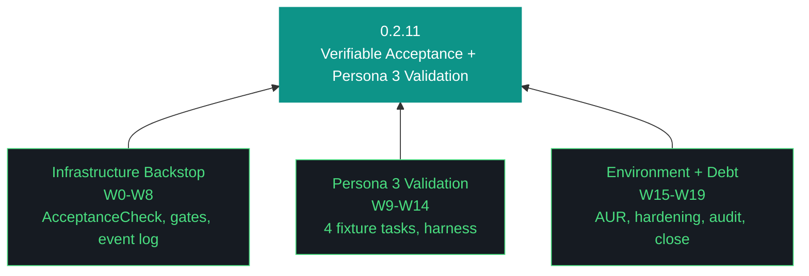

# aho Design — 0.2.11

**Phase:** 0 | **Iteration:** 2 | **Run:** 11
**Theme:** Verifiable acceptance framework + gate reconciliation + persona 3 end-to-end validation + AUR installer abstraction + tech-legacy-debt audit
**Iteration type:** Hybrid per ADR-045 (infrastructure W0–W8, validation W9–W14, environment W15–W17, audit W18, close W19)
**Executor:** claude-code (single-agent)
**Execution mode:** Per-workstream review ON, three sessions, no overnight
**Scope:** 19 workstreams

---

## §1 Context

0.2.10 closed clean after two forensic catches exposed "overstated completion" as a named failure mode. Agent marked four workstreams pass without disk-level verification. Halt-on-fail armed correctly but triggered only after Kyle forensic because original acceptance criteria were prose, not executable assertions.

0.2.11 fixes this structurally. The verifiable acceptance framework (W1-W2) replaces prose claims with AcceptanceCheck primitives (command + expected pattern/exit). AUR installer abstraction (W15-W16) becomes the first real test of the new framework. Persona 3 validation (W9-W14) exercises the install surface 0.2.10 built, using the 4 tasks from 0.2.9 W8 that failed when no entry point existed.

Event log (87.83MB, hit GitHub >50MB warning on 0.2.10 push) relocates to `~/.local/share/aho/events/` matching the pattern 0.2.10 established for traces/chromadb/secrets. Tech-legacy-debt sweep (W18) audits all components built to reach current state but no longer needed — shims, unused modules, stale harness files, orphaned tests. Audit-only in 0.2.11; prunes execute in 0.2.12 after persona 2 validation.

## §2 Goals

1. Replace prose acceptance claims with executable AcceptanceCheck primitives emitted in workstream_complete events
2. Reconcile 4 cosmetic postflight gate failures (artifacts_present, bundle_completeness, iteration_complete, pillars_present) and surface black-box gates (run_quality, structural_gates)
3. Close 0.2.9 residual debt: readme_current timezone, bundle_quality §22 format, manifest_current self-referential hash
4. Relocate event log to `~/.local/share/aho/events/` with rotation + bundle/gate/manifest updates
5. Validate persona 3 end-to-end against 4 fixture tasks (PDF summarize, SOW generate, risk review, email extract)
6. Produce AUR installer abstraction (aur_or_binary() helper + design pattern doc + aho-G048 keyring resilience class)
7. Retrofit otelcol-contrib + jaeger to AUR pattern, aur-packages.txt becomes source of truth
8. Harden Openclaw Errno 32 broken pipe + Errno 104 connection reset (0.2.10 KT carry)
9. Audit tech-legacy-debt: shims, unused modules, stale harness, orphaned tests, deprecated patterns
10. Ship 0.2.11 with zero overstated-completion risk — every acceptance check executable

## §3 Trident

## §4 Non-goals

- Shim wrapper deletion (slipped to 0.2.12 tech-debt prunes)
- Persona 2 framework-mode validation (0.2.12)
- P3 clone-to-deploy (0.2.13, Phase 0 graduation)
- Multi-user Telegram (0.4.x+)
- Gemini CLI remote executor routing (0.4.x+)
- Secrets module standalone extraction (0.4.x+)
- Executing tech-debt prunes (0.2.12)

## §5 The Eleven Pillars of AHO

1. **Delegate everything delegable.** The paid orchestrator decides; the local free fleet executes.
2. **The harness is the contract.** Agent instructions live in versioned harness files, not model context.
3. **Everything is artifacts.** Every task is artifacts-in to artifacts-out.
4. **Wrappers are the tool surface.** Every tool is invoked through a `/bin` wrapper.
5. **Three octets, three meanings: phase, iteration, run.** Strategic, tactical, and execution scope.
6. **Transitions are durable.** State is written to a durable artifact before any transition.
7. **Generation and evaluation are separate roles.** Drafter and reviewer are different agents.
8. **Efficacy is measured in cost delta.** Wall clock, token cost, and delegate ratio are ground truth.
9. **The gotcha registry is the harness's memory.** Failure modes are indexed with mitigations.
10. **Runs are interrupt-disciplined.** No preference prompts mid-run; only capability gaps halt.
11. **The human holds the keys.** No agent writes to git or manages secrets.

## §6 Workstream Summary

| WS | Surface | Session | Session Role |
|---|---|---|---|
| W0 | Bumps + decisions + carry-forwards | 1 | Setup |
| W1 | AcceptanceCheck primitive | 1 | Backstop |
| W2 | Retrofit workstream events | 1 | Backstop |
| W3 | Gate path reconciliation | 1 | Gate fix |
| W4 | Gate verbosity | 1 | Gate fix |
| W5 | 0.2.9 residual debt | 1 | Debt |
| W6 | Trident template fix | 1 | Gate fix |
| W7 | Event log relocation | 1 | Infra |
| W8 | /ws denominator + in_progress + MCP smoke | 1 | Infra |
| W9 | Persona 3 harness + fixtures | 2 | Validation setup |
| W10 | Task A: PDF summarize | 2 | Validation |
| W11 | Task B: SOW generate | 2 | Validation |
| W12 | Task C: Risk review | 2 | Validation |
| W13 | Task D: Email extract (assertion: exactly 7 unique) | 2 | Validation |
| W14 | Persona 3 retrospective | 2 | Validation close |
| W15 | AUR installer abstraction | 3 | Environment |
| W16 | Retrofit otelcol + jaeger to AUR | 3 | Environment |
| W17 | Openclaw Errno 32 + 104 hardening | 3 | Hardening |
| W18 | Tech-legacy-debt audit (audit-only) | 3 | Audit |
| W19 | Close | 3 | Close |

## §7 Execution Contract

- **Per-workstream review ON** for all 19 workstreams
- **Three sessions:** W0-W8 (backstop + infra), W9-W14 (persona 3), W15-W19 (environment + audit + close)
- **Hard gate:** W0-W8 must land clean before W9+ fires. Validation against broken backstop is worthless.
- **Acceptance assertions:** every workstream from W3 onward emits AcceptanceCheck results into workstream_complete. W0-W2 prose-only (bootstrap exception).
- **Halt-on-fail:** if any workstream fails AcceptanceCheck, Telegram push, proceed_awaited=true, wait.
- **Fixture persistence:** W9 fixtures (/tmp/aho-persona-3-test/) regenerated idempotently; W14 teardown optional for diagnostic retention.

## §8 Open Questions for W0

None. All questions resolved in chat pre-iteration:
- AUR in scope (W15-W16)
- Event log → `~/.local/share/aho/events/` with rotation
- Shim deletion slips to 0.2.12 as part of tech-debt prunes
- Task D assertion: exactly 7 unique emails from known set
- Three-session execution with per-workstream review

## §9 Risks

1. **W1-W2 framework scope creep** — AcceptanceCheck primitive touches event schema, CLI, report generation. Mitigation: MVP only (command + expected pattern/exit), richer assertions deferred to 0.2.12.
2. **Persona 3 fixture drift** — reportlab PDF generation may differ across sessions. Mitigation: fixture hash in harness, regenerate on mismatch.
3. **AUR keyring still corrupted on NZXTcos** — may block W16 retrofit. Mitigation: aur_or_binary() helper's binary fallback is the path; W16 succeeds via fallback with AcceptanceCheck asserting "installed, method=binary or method=aur".
4. **Tech-debt sweep false positives** — audit may flag components that persona 2 silently needs. Mitigation: W18 audit-only; confidence tags (safe-delete/needs-verification/keep-with-justification); 0.2.12 executes only after persona 2 validation.
5. **Three-session coordination** — context rot across sessions. Mitigation: session-boundary KT bundle generation; checkpoint + event log persistence.

## §10 Success Criteria

- 19/19 workstreams pass with AcceptanceCheck results in workstream_complete events (W0-W2 exempt)
- 4 persona 3 fixture tasks pass with file-on-disk + content assertions
- 0 postflight gate FAILs (all 4 cosmetic 0.2.10 failures resolved)
- Event log relocated; bundle + manifest + .gitignore reflect new path; old data/ path removed
- AUR installer abstraction doc + aur_or_binary() helper + retrofit otelcol-contrib/jaeger
- tech-legacy-audit-0.2.11.md produced with confidence-tagged removal candidates
- 0.2.11 closes with zero unverified acceptance claims; overstated-completion failure mode structurally eliminated
