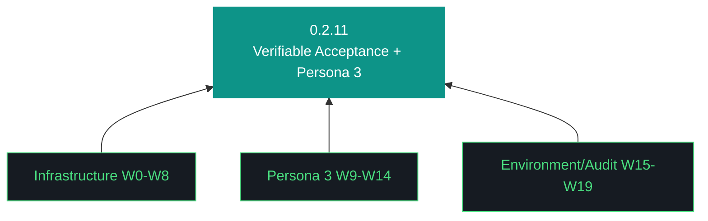

# aho Plan — 0.2.11

**Phase:** 0 | **Iteration:** 2 | **Run:** 11
**Theme:** Verifiable acceptance + gate reconciliation + persona 3 validation + AUR abstraction + tech-debt audit
**Executor:** claude-code | **Review:** per-workstream ON | **Sessions:** 3

---

## Trident

## The Eleven Pillars of AHO
(See design §5 — all 11 inherited verbatim.)

## Session Split

**Session 1 (W0-W8): Backstop + Infra** — ~3-4 hrs
**Session 2 (W9-W14): Persona 3 Validation** — ~3 hrs
**Session 3 (W15-W19): Environment + Audit + Close** — ~3 hrs

Hard gate: W0-W8 green before W9 fires. If blocked, halt, Telegram push, wait.

---

## Workstreams

### W0 — Bumps + decisions + carry-forwards
**Surface:** 12 canonical artifacts bumped 0.2.10→0.2.11. decisions.md captures: AUR in (W15-W16), event log → ~/.local/share/aho/events/, shim slip to 0.2.12 tech-debt sweep, Task D assertion spec. carry-forwards.md logs 0.2.12/0.2.13/0.4.x+.
**MCP:** none — bump workstream.
**Acceptance:** `ls artifacts/iterations/0.2.11/decisions.md` exists; grep "0.2.11" CHANGELOG.md; all 12 canonical files contain "0.2.11".

### W1 — AcceptanceCheck primitive
**Surface:** New `src/aho/acceptance.py`. `AcceptanceCheck(name, command, expected_exit, expected_pattern)` dataclass. `run()` executes command via subprocess, returns `AcceptanceResult(passed, actual_exit, actual_output, matched)`. Emit schema extended for workstream_complete event payload.
**MCP:** none — Python primitive.
**Acceptance:** `pytest tests/test_acceptance.py` green (7+ tests: happy path, exit mismatch, pattern miss, command not found, timeout, shell escape, exit+pattern combo).

### W2 — Retrofit workstream events
**Surface:** Extend `workstream_events.emit_workstream_complete()` to accept `acceptance_results: list[AcceptanceResult]`. Schema versioned v2. Backward compat: missing = empty list. CLI `aho iteration workstream complete --acceptance-file path.json` loads results from JSON. Run report template renders acceptance table per workstream.
**MCP:** none — event schema work.
**Acceptance:** emit event with 2 acceptance results; `jq` extract from log confirms v2 schema with results array; old v1 events still parseable.

### W3 — Gate path reconciliation
**Surface:** Fix `artifacts_present`, `bundle_completeness`, `iteration_complete` gates — all currently look for `aho-report-X.Y.Z.md` at wrong path. Actual path: `artifacts/iterations/X.Y.Z/aho-run-X.Y.Z.md` (run report) and `aho-bundle-X.Y.Z.md`. Update gate lookup logic. Add canonical filename → path resolver helper.
**MCP:** none.
**Acceptance:** run postflight on 0.2.10 artifacts; these three gates transition FAIL→PASS. No other gates regress.

### W4 — Gate verbosity
**Surface:** `run_quality` and `structural_gates` currently emit pass/fail count with no detail. Extend to per-check output: `{name, status, message, evidence_path}`. Update report template to render.
**MCP:** none.
**Acceptance:** run postflight; both gates emit check-by-check JSON; report doc shows each check with message.

### W5 — 0.2.9 residual debt
**Surface:** Three fixes: (a) `readme_current` timezone — compare UTC to UTC not mixed tz; (b) `bundle_quality` §22 component count — format string alignment; (c) `manifest_current` self-referential — exclude MANIFEST.json from its own hash set.
**MCP:** none.
**Acceptance:** all three gates PASS on clean iteration; regression test for each.

### W6 — Trident template fix
**Surface:** Update design doc template to include §3 Trident section with Mermaid `graph BT` + classDef specs. `pillars_present` gate checks for §3 presence.
**MCP:** none.
**Acceptance:** `pillars_present` on this iteration's design doc PASS; gate rejects design missing §3.

### W7 — Event log relocation
**Surface:** Move `data/aho_event_log.jsonl` → `~/.local/share/aho/events/aho_event_log.jsonl`. Rotation policy: size-based (100MB rotate, keep 3). Update `aho.logger`, bundle §8 gate, manifest scanner, `.gitignore` remove `data/`. Migration: copy-verify-delete on first run post-upgrade.
**MCP:** none.
**Acceptance:** `ls ~/.local/share/aho/events/aho_event_log.jsonl`; `ls data/aho_event_log.jsonl` returns not-found; bundle contains events; rotation trigger creates `.1`, `.2`, `.3` siblings.

### W8 — /ws denominator + in_progress + MCP smoke
**Surface:** Three small fixes — (a) /ws status shows `completed/planned` not `completed/completed`; (b) `workstream_start` updates checkpoint.workstreams[wid]="in_progress"; (c) mcp-readiness.md adds "protocol_smoke" column with last-successful timestamp.
**MCP:** none — telegram + checkpoint + doc fix.
**Acceptance:** `/ws status` via telegram test shows correct denominator; checkpoint diff shows in_progress transition; mcp-readiness.md renders new column.

### Session 1 Boundary
KT bundle generated. W0-W8 acceptance results archived. Halt if any FAIL.

---

### W9 — Persona 3 harness + fixtures
**Surface:** New `tests/persona_3/harness.py`. Fixture generator creates `/tmp/aho-persona-3-test/` with `sample-contract.pdf` (reportlab, 1-page professional services agreement), `sample-emails.txt` (8 emails, 7 unique), `sow-template.md` (empty scaffold). Known-hash verification; idempotent regen. Teardown optional (`--keep` flag for diagnostic).
**MCP:** none — test infrastructure.
**Acceptance:** fixtures present at known hashes; regen idempotent (second run no-op if hashes match).

### W10 — Task A: PDF summarize
**Surface:** `cd /tmp/aho-persona-3-test && aho run "Summarize sample-contract.pdf"`. Exercises PDF text extraction, OpenClaw file bridge (0.2.10 W6), LLM routing (Claude API likely due to size), output writer.
**MCP:** none at runtime; validation only.
**Acceptance:** exit 0; `aho-output/run-*.md` exists; file contains >100 chars; contains keyword from contract (e.g., "services" or "agreement").

### W11 — Task B: SOW generate
**Surface:** `aho run "Generate a SOW using sow-template.md as starting structure"`. Exercises template-as-input pattern, file-write path.
**MCP:** none at runtime.
**Acceptance:** exit 0; `aho-output/run-*.md` contains markdown headers (##); contains "scope" or "deliverable" keyword; length >200 chars.

### W12 — Task C: Risk review
**Surface:** `aho run "Review sample-contract.pdf for risks"`. Exercises longer-context PDF reasoning; Claude API routing likely.
**MCP:** none at runtime.
**Acceptance:** exit 0; output file exists; contains "risk" keyword; length >300 chars.

### W13 — Task D: Email extract (strict assertion)
**Surface:** `aho run "Extract unique email addresses from sample-emails.txt"`. Output must dedupe.
**MCP:** none at runtime.
**Acceptance:** exit 0; output file exists; extracted email set === known 7-email set (sorted comparison); no duplicates; no extras. This is the strictest assertion in 0.2.11 — exercises framework under real pattern-match load.

### W14 — Persona 3 retrospective
**Surface:** `persona-3-retrospective-0.2.11.md`. Which tasks passed first-try vs required iteration. Failure modes surfaced. Routing decisions (Qwen vs Claude API) empirical distribution. Gaps feeding 0.2.12.
**MCP:** none.
**Acceptance:** retrospective doc exists; references all 4 tasks with pass/fail; lists ≥1 carry-forward to 0.2.12.

### Session 2 Boundary
KT bundle. Persona 3 acceptance results archived.

---

### W15 — AUR installer abstraction
**Surface:** New `src/aho/installer.py` with `aur_or_binary(pkg, aur_name, binary_url, verify_cmd)` helper. AUR-primary; on failure (keyring corruption, network, build fail) falls back to direct binary install. Design pattern doc `artifacts/harness/installer-pattern.md`. aho-G048 keyring resilience class formalized in gotcha registry.
**MCP:** none — design + Python.
**Acceptance:** `pytest tests/test_installer.py` green (AUR happy, AUR fails→binary fallback, binary verify fail, already installed skip).

### W16 — Retrofit otelcol-contrib + jaeger to AUR
**Surface:** Both packages use aur_or_binary(). aur-packages.txt becomes source of truth. Install method recorded in install-manifest.json. Acceptance asserts "installed" regardless of method.
**MCP:** none.
**Acceptance:** `otelcol-contrib --version` exit 0 AND `jaeger-all-in-one --help` exit 0 AND install-manifest.json shows method ∈ {aur, binary} for both.

### W17 — Openclaw Errno 32 + 104 hardening
**Surface:** `src/aho/agents/openclaw.py` catch `BrokenPipeError` (Errno 32) on socket write, log+retry once. Catch `ConnectionResetError` (Errno 104) on read, log+reconnect. Unit tests simulate both via mock socket.
**MCP:** none.
**Acceptance:** `pytest tests/test_openclaw_errors.py` green; journal grep no uncaught Errno 32/104 after 10-min soak.

### W18 — Tech-legacy-debt audit (audit-only)
**Surface:** `tech-legacy-audit-0.2.11.md`. Inventory: (a) 8 aho-* shim wrappers, (b) unused Python modules (AST import scan), (c) stale harness files not referenced by install surface, (d) orphaned tests (no module under test), (e) dead bin/ scripts, (f) deprecated ADR-superseded patterns. Confidence tags: safe-delete / needs-verification / keep-with-justification.
**MCP:** none — static analysis.
**Acceptance:** audit doc exists; every entry has confidence tag + rationale; summary counts per category; 0.2.12 prune candidate list enumerated.

### W19 — Close
**Surface:** Test suite (target 240+, actual TBD). Doctor full. Bundle generation. CHANGELOG finalized. Run report Kyle's Notes placeholder. Sign-off ready.
**MCP:** none.
**Acceptance:** pytest green; `aho doctor full` exit 0 (or known-failures only); bundle >500KB <900KB; run report §Sign-off present.

### Session 3 Boundary
Final KT. 0.2.11 closes.

---

## Checkpoint / Resume

Standard resume via .aho-checkpoint.json. Per-workstream review pauses between each for Kyle approval. No `--start` flag (scripts use checkpoint resume per contract).

## MCP-First Declaration

Every workstream declares `mcp_used` in run report. 0.2.11 workstreams are largely Python/fixture/doc work with no technology-specific MCP domain — expected `none` for most, justified per-workstream.

## Halt-on-Fail

Per-workstream review is the primary backstop. AcceptanceCheck framework (W1-W2) adds secondary: any workstream where acceptance returns `passed=False` triggers proceed_awaited=true + Telegram push + halt at next boundary.

## Sign-off

Kyle reviews each workstream inline. Final sign-off at W19 close after all acceptance results reviewed.
