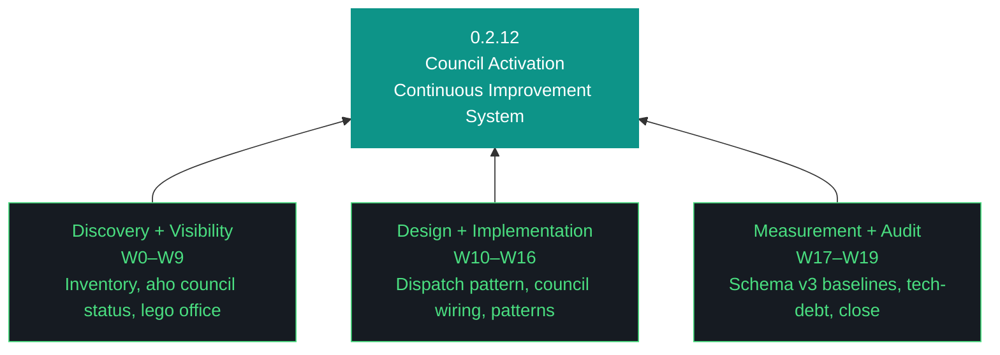

# aho Design — 0.2.12

**Phase:** 0 | **Iteration:** 2 | **Run:** 12
**Theme:** Council activation — discovery, visibility, design, and measurement of the LLM council as a continuous improvement system
**Iteration type:** Discovery-heavy hybrid per ADR-045 (discovery W0–W5, visibility W6–W9, design W10–W12, implementation W13–W16, measurement W17–W18, close W19)
**Primary executor:** gemini-cli (first Gemini-primary iteration since early 0.2.x)
**Execution mode:** Per-workstream review ON, three sessions, no overnight
**Scope:** 20 workstreams

---

## §1 Context

0.2.11 closed honest at W9 after recognizing executor-bias: claude-code carried 100% of workstream load while the local council (Qwen, GLM, Nemotron, evaluator-agent, OpenClaw, Nemoclaw, MCP servers) participated zero. G077 named this planner-executor-bias-consumes-council-capacity. Schema v3 efficacy instrumentation made it measurable but had no council data to measure against.

0.2.12 addresses this directly. The objective is to establish a continuous improvement model for the LLM council working with other agentic components to optimize productivity, reduce time-to-build, and reduce token spend — resilient and portable, replicable across other PCs and GCP projects. Anything that doesn't move toward this objective is off-mission.

This iteration takes two deliberate structural steps. First, the primary executor shifts from claude-code to gemini-cli. This breaks the planner-default pattern — my prompt-drafting bias flips from "what I've watched claude-code execute cleanly" to equal uncertainty about gemini-cli behavior in-harness. Second, the iteration is structured discovery-first — before dispatching workstreams to council members, we must know which members are operational, what their dispatch surfaces are, what their failure modes look like.

## §2 Goals

1. Shift primary executor to gemini-cli for all 20 workstreams. Stress-test GEMINI-iteration.md + GEMINI-run.md as operational agent instructions
2. Complete council inventory: which agents are running, which have dispatch surfaces, which have ever executed a workstream-level task
3. Build `aho council status` CLI — visibility primitive enumerating operational agents, dispatch surfaces, queue depth, last-routing-decision, model availability
4. Design the workstream-level delegation pattern: dispatch contract, routing-by-capability, result protocol, failure handling
5. Dispatch at least three real workstream tasks to council members (Qwen via nemoclaw, GLM for evaluator review, MCP server for tool invocation) and measure via schema v3
6. Baseline: direct executor vs council delegation on comparable workstream kinds. Measurable delegate ratio trajectory
7. Lego office visualization as primary operational diagram — council members as figures, dispatch lines showing work volume, state, health
8. Pattern framework bootstrap (was 0.2.11 W8.5): artifacts/patterns/ folder, evolution-log semantics, five seed patterns (planner-discipline, age-fernet-keyring, install-surface, daemon-lifecycle, council-dispatch)
9. Tech-legacy-debt audit (slipped from 0.2.11 W18): inventory shims, unused modules, stale harness, orphaned tests, deprecated patterns
10. README content review (slipped from 0.2.11 W8): stale sections corrected, three-persona model updated, iteration roadmap current
11. Full executor-change validation: gemini-cli produces work meeting the same AcceptanceCheck bar claude-code did in 0.2.11

## §3 Trident

## §4 Non-goals

- Persona 3 validation (slipped to 0.2.13, requires council to be meaningful)
- AUR installer abstraction (slipped to 0.2.14)
- Frontend multi-folder reshape + Firestore scaffolding (slipped to 0.2.14)
- P3 clone-to-deploy (slipped to 0.2.15+)
- Executing tech-debt prunes (audit only — execution 0.2.14)
- Full council dispatch production-hardening (0.2.13+)
- Multi-user Telegram, Gemini CLI remote executor routing, secrets module extraction (0.3.x+)

## §5 The Eleven Pillars of AHO

1. **Delegate everything delegable.** The paid orchestrator decides; the local free fleet executes.
2. **The harness is the contract.** Agent instructions live in versioned harness files, not model context.
3. **Everything is artifacts.** Every task is artifacts-in to artifacts-out.
4. **Wrappers are the tool surface.** Every tool is invoked through a `/bin` wrapper.
5. **Three octets, three meanings: phase, iteration, run.** Strategic, tactical, and execution scope.
6. **Transitions are durable.** State is written to a durable artifact before any transition.
7. **Generation and evaluation are separate roles.** Drafter and reviewer are different agents.
8. **Efficacy is measured in cost delta.** Wall clock, token cost, and delegate ratio are ground truth.
9. **The gotcha registry is the harness's memory.** Failure modes are indexed with mitigations.
10. **Runs are interrupt-disciplined.** No preference prompts mid-run; only capability gaps halt.
11. **The human holds the keys.** No agent writes to git or manages secrets.

## §6 Workstream Summary

| WS | Surface | Session | Role |
|---|---|---|---|
| W0 | Bumps + decisions + executor health check | 1 | Setup |
| W1 | Council inventory discovery | 1 | Discovery |
| W2 | Qwen/Nemoclaw dispatch surface audit | 1 | Discovery |
| W3 | GLM evaluator audit | 1 | Discovery |
| W4 | Nemotron audit | 1 | Discovery |
| W5 | MCP fleet workflow-participant audit | 1 | Discovery |
| W6 | aho council status CLI | 1 | Visibility |
| W7 | Lego office visualization foundation | 1 | Visibility |
| W8 | OTEL trace instrumentation per agent | 2 | Visibility |
| W9 | Council visibility dashboard integration | 2 | Visibility |
| W10 | Workstream-level delegation pattern design | 2 | Design |
| W11 | Dispatch contract specification | 2 | Design |
| W12 | Pattern framework bootstrap (5 seeds) | 2 | Design |
| W13 | Qwen dispatch: one real workstream task | 2 | Implementation |
| W14 | GLM review dispatch: one real evaluation | 3 | Implementation |
| W15 | MCP workflow-participant invocation | 3 | Implementation |
| W16 | Delegation path of least resistance | 3 | Implementation |
| W17 | Schema v3 baseline measurement | 3 | Measurement |
| W18 | Tech-legacy-debt audit + README review | 3 | Audit |
| W19 | Close | 3 | Close |

## §7 Execution Contract

- **Primary executor: gemini-cli** (`gemini --yolo` single flag, sandbox bypass implied)
- **Per-workstream review ON** for all 20 workstreams
- **Three sessions**: W0–W7 (discovery + visibility), W8–W14 (design + implementation), W15–W19 (dispatch + measurement + close)
- **Hard gate**: W0–W5 discovery must complete before visibility/design/implementation fires. If a council member is completely non-operational, that's discovery surfacing ground truth, not failure
- **Acceptance assertions**: every workstream from W1 onward emits AcceptanceCheck results. Discovery workstreams may assert "component not operational, gap documented" and pass — measurement is the goal, not uniform health
- **Council dispatch acceptance**: W13–W16 include executable acceptance checks verifying work was routed through a council member (not executor) and returned measurable output
- **Halt-on-fail**: any workstream where acceptance returns false triggers proceed_awaited=true + Telegram push + halt

## §8 Open Questions Resolved Pre-Iteration

- **Primary executor**: gemini-cli confirmed (version 0.37.1 operational on NZXTcos)
- **Council dispatch target**: at least 3 real dispatches (W13 Qwen, W14 GLM, W15 MCP)
- **Known-may-fail workstreams acceptable**: discovery iterations where dispatch fails are valuable data, documented as gaps feeding 0.2.13
- **Tech-debt audit scope**: audit-only (execution 0.2.14 post persona 2 validation)
- **README review scope**: content review now (not append-only), stale-section corrections
- **Pattern framework seeds**: planner-discipline, age-fernet-keyring, install-surface, daemon-lifecycle, council-dispatch

## §9 Risks

1. **Gemini CLI behaves differently than claude-code under harness.** Conventions (printf not heredocs, command ls, pycache clearing, schema v3 flags) may not translate. Mitigation: W0 includes explicit GEMINI-iteration.md re-read and acceptance check. Forensic-minutes tracking will surface adaptation cost.
2. **Council members may be fully non-operational.** Qwen may not respond, GLM may not be wired, evaluator-agent may be stub. Mitigation: discovery phase accepts "not operational" as valid finding. Gaps become 0.2.13 scope.
3. **MCP servers pass smoke but fail workflow-level invocation.** Tool-list round-trip is different from "consume MCP server output in a workstream." Mitigation: W5 audit distinguishes the two; W15 attempts real workflow invocation.
4. **Schema v3 data overwhelms the new executor.** Tracking tokens and forensics-minutes accurately requires discipline gemini-cli may not have. Mitigation: CLI flag provides manual override; auto-capture deferred to 0.2.13+.
5. **Lego office visualization scope creep.** Foundation in W7, integration in W9. Mitigation: foundation = static placeholder figures + line-drawing; integration = live data feed. Full interactive visualization deferred.
6. **Pattern framework authorship.** Writing 5 seeds well is an authorial task. Mitigation: scope reduces if constrained — planner-discipline + age-fernet-keyring + council-dispatch is minimum viable.

## §10 Success Criteria

- 20/20 workstreams pass with AcceptanceCheck results in workstream_complete events
- `aho council status` CLI exists and enumerates operational state
- At least 3 real council dispatches measured via schema v3 (Qwen, GLM, MCP)
- Schema v3 data shows measurable delegate ratio trajectory vs 0.2.11's 100% executor baseline
- Lego office visualization foundation renders council members and dispatch lines
- Pattern framework bootstrapped: artifacts/patterns/ folder, 5 seeds authored, evolution-log semantics defined
- Tech-legacy-debt audit produces tech-legacy-audit-0.2.12.md with confidence-tagged removal candidates
- README content review: stale sections corrected, three-persona model current, iteration roadmap updated
- GEMINI-iteration.md proven operational as primary agent instructions across a full iteration
- 0.2.12 closes honest: if council members are broken or unwirable, that's documented finding, not hidden
