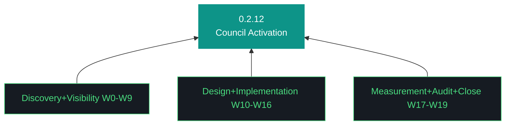

# aho Plan — 0.2.12

**Phase:** 0 | **Iteration:** 2 | **Run:** 12
**Theme:** Council activation — discovery, visibility, design, measurement
**Primary executor:** gemini-cli | **Review:** per-workstream ON | **Sessions:** 3

---

## Trident

## The Eleven Pillars of AHO
(See design §5 — all 11 inherited verbatim from README canonical.)

## Session Split

- **Session 1 (W0–W7): Discovery + Visibility foundation** — ~4-5 hrs
- **Session 2 (W8–W14): Visibility + Design + Dispatch begin** — ~4 hrs
- **Session 3 (W15–W19): Dispatch + Measurement + Audit + Close** — ~3-4 hrs

Hard gate: W0–W5 discovery must land before visibility/design fires. Discovery surfacing "component X is broken" is a valid pass, not a halt. Council dispatch (W13–W16) requires visibility layer (W6–W9) landed.

---

## Workstreams

### W0 — Bumps + decisions + executor health check
**Surface:** 12 canonical artifacts bumped 0.2.11→0.2.12. decisions.md captures: gemini-cli primary, council dispatch minimum 3, tech-debt audit-only, pattern framework 5 seeds. carry-forwards.md preserved from 0.2.11 rescope. Gemini executor acknowledges GEMINI-iteration.md sections (AcceptanceCheck schema, event log path, session boundaries, MCP-first). gemini --version check. `daemon_healthy()` check on all services.
**MCP:** none — bump + executor health.
**Acceptance:** 12 canonicals contain "0.2.12"; decisions.md present; gemini --version returns; all 7 systemd services Tasks>1 Memory>20M.

### W1 — Council inventory discovery
**Surface:** New `src/aho/council/inventory.py`. Enumerates declared council members (Qwen, GLM, Nemotron, OpenClaw, Nemoclaw, evaluator-agent, MCP servers) via config + registry. Output: `artifacts/iterations/0.2.12/council-inventory.md` listing each with declared-capability + operational-status (unknown until W2-W5).
**MCP:** none — inventory is file + config read.
**Acceptance:** inventory.md exists with N≥7 entries; each entry has capability + status columns.

### W2 — Qwen/Nemoclaw dispatch surface audit
**Surface:** Attempt to dispatch a trivial task ("echo hello") to Qwen via nemoclaw socket. Document: dispatch contract, response protocol, failure modes. If no dispatch surface exists, document the gap in `qwen-dispatch-audit.md`.
**MCP:** none — direct socket interrogation.
**Acceptance:** audit doc produced; surface characterized as operational OR gap documented; no false pass.

### W3 — GLM evaluator audit
**Surface:** Same pattern as W2 for GLM evaluator-agent. Attempt review dispatch on a small artifact. Document operational/gap.
**MCP:** none.
**Acceptance:** glm-audit.md produced; surface characterized.

### W4 — Nemotron audit
**Surface:** Same pattern for Nemotron classification daemon. Is it routing? What does it route? Empty queue?
**MCP:** none.
**Acceptance:** nemotron-audit.md produced.

### W5 — MCP fleet workflow-participant audit
**Surface:** All 9 MCP servers smoke-tested in 0.2.11. But smoke = tool-list round-trip. This workstream attempts real workflow invocation: use playwright to screenshot a URL, use filesystem to read a file, use context7 to resolve a lib. Each produces artifact + result. Document per-server workflow-participation readiness.
**MCP:** playwright, server-filesystem, context7 (real invocation, not smoke).
**Acceptance:** per-server workflow-readiness row in mcp-readiness.md; 3+ servers successfully invoked.

### W6 — `aho council status` CLI
**Surface:** New subcommand. Enumerates operational agents, dispatch surfaces (from W2-W5 audits), queue depth (via process introspection), model availability (ollama list for Qwen, provider check for GLM), last routing decision (event log tail).
**MCP:** none.
**Acceptance:** `aho council status` exits 0; output contains all 7 members with status.

### W7 — Lego office visualization foundation
**Surface:** New SVG/HTML artifact at `app/lego/office.svg` (or bundles/). Static figures for each council member, positioned at desks. Dispatch lines between figures (hardcoded representation of declared topology). Color-coding: green active, grey idle, red broken. No live data yet.
**MCP:** none.
**Acceptance:** office.svg renders in browser; contains ≥7 figure elements, ≥5 line elements with classDef.

### W8 — OTEL trace instrumentation per agent
**Surface:** Extend OTEL instrumentation in openclaw, nemoclaw, harness-watcher to emit spans with `agent_name` attribute. Jaeger queries become agent-filterable. Schema v3 efficacy data correlates to OTEL spans.
**MCP:** none.
**Acceptance:** Jaeger UI shows spans tagged by agent_name; at least 3 agents represented.

### W9 — Council visibility dashboard integration
**Surface:** Dashboard at :7800 gains a /council page polling `aho council status` output. Real-time render of agent states. Lego office SVG embedded, live-updated from polling.
**MCP:** none.
**Acceptance:** curl `/api/council` returns JSON; /council page renders SVG; auto-refresh every 5s.

### W10 — Workstream-level delegation pattern design
**Surface:** ADR-046 drafted. Dispatch contract: input shape, output shape, timeout, retry, failure escalation. Routing-by-capability table. Measurable properties per dispatch.
**MCP:** none — design work.
**Acceptance:** ADR-046 filed; contract spec reviewable.

### W11 — Dispatch contract specification
**Surface:** `src/aho/council/dispatch.py`. Python implementation of the contract from W10. `Dispatch(target, task, input, timeout) -> Result`. Sync + async forms. Error handling per ADR-046.
**MCP:** none.
**Acceptance:** dispatch.py imports; happy path + 3 failure modes covered in tests; 8+ tests.

### W12 — Pattern framework bootstrap
**Surface:** `artifacts/patterns/` folder created. Pattern template at `artifacts/harness/pattern-template.md` (9 sections from 0.2.11 W8.5 sketch). Five seeds authored: planner-discipline, age-fernet-keyring, install-surface, daemon-lifecycle, council-dispatch. Each has §1-§8 content + §9 evolution log seeded. Voluntary through 0.2.13, gated from 0.2.13.
**MCP:** none.
**Acceptance:** 5 pattern files exist; each has all 9 sections; evolution log contains W12 entry.

### W13 — Qwen dispatch: one real workstream task
**Surface:** Use W11 dispatch primitive to route a real task to Qwen: "regenerate the run report stub from checkpoint data." Measure time, tokens, accuracy. Schema v3 event emitted with agents_involved=["qwen-local"], harness_contributions=["council_dispatch"], token_count captured.
**MCP:** none.
**Acceptance:** workstream_complete event contains qwen-local in agents_involved; output artifact produced; acceptance of output (not just dispatch completion) validated.

### W14 — GLM review dispatch: one real evaluation
**Surface:** Use W11 to dispatch Qwen's W13 output for GLM review. Measure review latency, whether review surfaced real issues. Schema v3 event emitted.
**MCP:** none.
**Acceptance:** review artifact produced; agents_involved=["glm-reviewer"]; review content non-trivial (not just "LGTM").

### W15 — MCP workflow-participant invocation
**Surface:** Use playwright MCP server mid-workstream to screenshot current /council page, embed in a generated artifact. Real workflow-level MCP use, not smoke.
**MCP:** playwright (real invocation).
**Acceptance:** screenshot file produced; embedded in W15 artifact; workstream_complete records mcp_used=["playwright"].

### W16 — Delegation path of least resistance
**Surface:** Update CLI so `aho iteration workstream start` defaults can route simple tasks to council if `--council-preferred` flag set. Update GEMINI-iteration.md + CLAUDE-iteration.md to prefer dispatch over direct execution when a surface exists.
**MCP:** none.
**Acceptance:** --council-preferred flag works; agent instructions reference delegation preference.

### W17 — Schema v3 baseline measurement
**Surface:** Generate comparison report: 0.2.11 delegate ratio (100% executor / 0% council, baseline) vs 0.2.12 W13-W15 dispatches. Report is `efficacy-baseline-0.2.12.md`. Trajectory rendered as table + chart.
**MCP:** none.
**Acceptance:** report produced; contains explicit 0.2.11 vs 0.2.12 numbers; delta identified.

### W18 — Tech-legacy-debt audit + README review
**Surface:** `tech-legacy-audit-0.2.12.md`: shims, unused modules, stale harness files, orphaned tests, deprecated patterns. Confidence-tagged (safe-delete/needs-verification/keep-justified). README content review: stale sections corrected (three-persona model, iteration roadmap, Canonical Folder Layout data/ reference), review timestamp updated.
**MCP:** none — static analysis + content review.
**Acceptance:** audit doc + README diff produced; audit has confidence tags per item.

### W19 — Close
**Surface:** Bundle, postflight, retrospective. Kyle's Notes stub per 0.2.11 pattern. Sign-off checkbox.
**MCP:** none.
**Acceptance:** bundle ≥400KB; postflight green; 80+ tests pass.

---

## MCP-First Declaration

Every workstream declares `mcp_used` with justification. W5 and W15 invoke MCP servers as workflow participants. Others: `none` with specific justification per row.

## Halt-on-Fail

Per-workstream review primary backstop. AcceptanceCheck framework secondary. Discovery workstreams (W1-W5): "component non-operational" is valid pass if documented. Implementation workstreams (W13-W16): failure is real halt candidate — can't skip past dispatch that doesn't work.

## Sign-off

Kyle reviews each workstream inline. Final sign-off at W19 after all acceptance results reviewed + retrospective reads honest about council activation trajectory.
