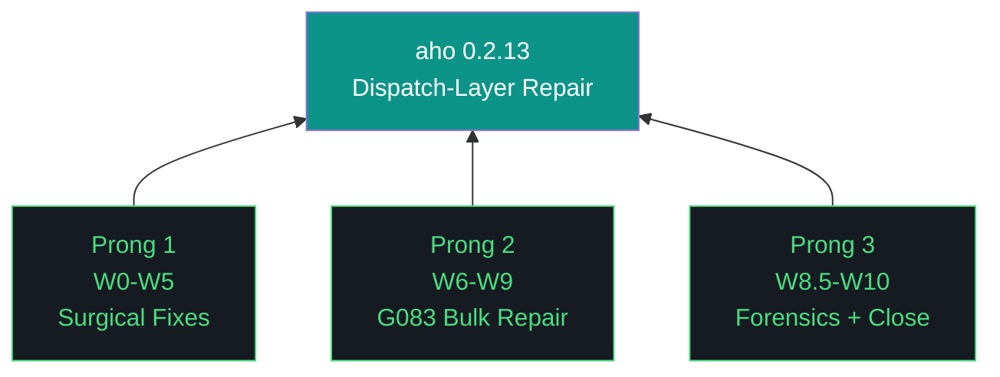

# aho 0.2.13 — Design Doc

**Theme:** Dispatch-layer repair
**Iteration type:** Repair (distinct from discovery/build)
**Primary executor:** Claude Code (`claude --dangerously-skip-permissions`)
**Auditor:** Gemini CLI (`gemini --yolo`) — Pattern C
**Sign-off:** Kyle
**Success criterion:** Council health ≥50/100 (from 35.3)

---

## Trident

## The Eleven Pillars of AHO (verbatim from artifacts/harness/base.md)

1. **Delegate everything delegable.** The paid orchestrator is the most expensive resource in the system. Any task that can run on a free local model must run on a free local model. Drafting, classification, retrieval, validation, grading, and routing all belong to the local fleet. The orchestrator's minutes are spent on judgment, scope, and novelty.

2. **The harness is the contract.** Agent instructions live in versioned harness files that change at phase or iteration boundaries, not in per-run markdown regenerated from scratch. The orchestrator points at the harness; it does not carry the contract in its own context.

3. **Everything is artifacts.** Every task is artifacts-in to artifacts-out. Code, reports, schemas, analyses, migrations, audits, designs — all artifacts. The harness is artifact-agnostic at its core and artifact-specialized at its overlays.

4. **Wrappers are the tool surface.** Agents never call raw tools. Every tool is invoked through a `/bin` wrapper. Wrappers are versioned with the harness, instrumented for the event log, and replayable from recorded inputs.

5. **Three octets, three meanings: phase, iteration, run.** Phase is strategic scope. Iteration is tactical scope. Run is execution instance. Every artifact carries the full phase.iteration.run label.

6. **Transitions are durable.** Moving between phases, iterations, or runs writes state to a durable artifact before the transition is considered complete. Every gate is a write point. No implicit state.

7. **Generation and evaluation are separate roles.** The model that produced an artifact is never the model that grades it. Drafter and reviewer are different agents behind different wrappers with different prompts and ideally different underlying weights.

8. **Efficacy is measured in cost delta.** Every run records orchestrator token cost, local fleet compute time, wall clock, delegate ratio, and output quality signal. Numbers ship with the run report.

9. **The gotcha registry is the harness's memory.** Every failure mode lands in the registry. A mature harness has more gotchas than an immature one — gotcha count is the compound-interest metric.

10. **Runs are interrupt-disciplined, not interrupt-free.** Once a run launches, agents do not ping for preference, clarification, or approval. The single exception is unavoidable capability gaps (sudo, credentials, physical access) — routed through OpenClaw to a defined notification channel, logged as a first-class event, resumed from the last durable checkpoint.

11. **The human holds the keys.** No agent writes to git. No agent merges. No agent pushes. No agent manages secrets. No wrapper surfaces `git commit` or `git push` under any role.

## Context

0.2.12 closed 9/20 workstreams as strategic rescope after discovery revealed G083 systemic (155 sites across src/aho/), GLM evaluator rubber-stamps on parse failure, Nemotron classifier defaults to `categories[-1]` on parse failure, Nemoclaw adds 23s per dispatch. Council health 35.3/100. Substrate unfit for build work.

0.2.13 repairs the substrate so 0.2.14 build work can trust dispatch signals.

## Pattern C Execution Model

Claude Code drafts each workstream. Gemini CLI audits the acceptance archive before `workstream_complete` fires. Kyle signs iteration-level. Audit is lightweight: acceptance-archive review + targeted spot-check, not full re-execution. Budget ~15-25min per workstream per 0.2.12 forensics data.

Schema v3 `agents_involved` extended in W0 to role-tag: `{agent, role: "primary"|"auditor"|"cameo"}`.

## Scope

**In scope:** GLM parser, Nemotron classifier, Nemoclaw decision, OpenClaw audit, G083 bulk fix on 35 definitive sites (tiered), G083 ambiguous triage (classify only), postflight 2-tuple patch, schema v3 role-tagged agents_involved, Qwen cameo execution.

**Out of scope (deferred to 0.2.14):** OTEL per-agent instrumentation, README content review, postflight robustness (proper architecture), G083 ambiguous execution, persona 3 validation.

## Hard Gates

- **W2.5 strategic-rescope trigger:** If W1 (GLM parser fix) or W2 (Nemotron classifier fix) reveals models themselves rubber-stamp post-parse, iteration closes early with substrate-truth report. Nemoclaw decision (W3/W4) becomes 0.2.14+ scope.
- **Baseline regression:** `baseline_regression_check()` gates every G083 tier workstream. Any non-baseline test failure halts that tier.
- **Gemini audit:** Every workstream_complete requires auditor sign-off before checkpoint advance.
- **Pillar 11:** Neither Claude Code nor Gemini CLI git commits or pushes. Kyle commits.

## Risks

1. **G083 bulk fix cascades.** 35 sites across many modules. Mitigation: three tiers by blast radius (agents/ → council/ → rest), halt-on-fail per tier, per-site commits.
2. **Models rubber-stamp post-parse.** W2.5 gate makes this an early-close trigger, not a mid-iteration crisis.
3. **Nemoclaw replacement loses uncharacterized features.** W3 benchmark produces decision-grade evidence before W4 commits direction.
4. **Pattern C audit overhead compounds.** 11 workstreams × ~20min audit = ~3.5hr coordination. Budget accordingly.

## Success Criteria

- Council health score ≥50/100 (from 35.3)
- Zero G083 sites in src/aho/agents/
- GLM evaluator raises on parse failure (never hardcodes ship)
- Nemotron classifier raises on parse failure (never defaults to reviewer)
- Nemoclaw decision in ADR-047 with benchmark evidence
- OpenClaw status known (operational or gap)
- 117 G083 ambiguous classified into file for 0.2.14 execution
- Postflight 2-tuple patched (robustness deferred)
- Qwen cameo produces third-executor forensics data
