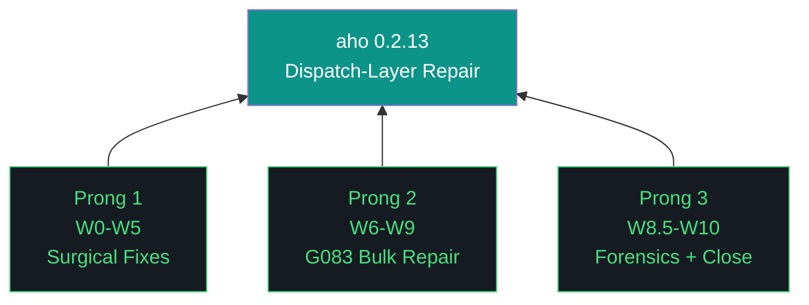

# aho 0.2.13 — Design Doc

**Theme:** Dispatch-layer repair
**Iteration type:** Repair (distinct from discovery/build)
**Primary executor:** Claude Code (`claude --dangerously-skip-permissions`)
**Auditor:** Gemini CLI (`gemini --yolo`) — Pattern C
**Sign-off:** Kyle
**Success criterion:** Council health ≥50/100 (from 35.3)

---

## Trident

## The 10 IAO Pillars

1. Reproducibility over cleverness
2. Canonical artifacts over ephemeral state
3. Checkpoints over resumption guesswork
4. Gotcha registry as middleware, not documentation
5. Harness is code, not convention
6. Executor parity through playbook precision
7. Review precedes accept; Kyle signs
8. Cost delta as ground truth
9. One canonical path, many resolvers
10. Honest characterization over celebratory framing

## Context

0.2.12 closed 9/20 workstreams as strategic rescope after discovery revealed G083 systemic (155 sites across src/aho/), GLM evaluator rubber-stamps on parse failure, Nemotron classifier defaults to `categories[-1]` on parse failure, Nemoclaw adds 23s per dispatch. Council health 35.3/100. Substrate unfit for build work.

0.2.13 repairs the substrate so 0.2.14 build work can trust dispatch signals.

## Pattern C Execution Model

Claude Code drafts each workstream. Gemini CLI audits the acceptance archive before `workstream_complete` fires. Kyle signs iteration-level. Audit is lightweight: acceptance-archive review + targeted spot-check, not full re-execution. Budget ~15-25min per workstream per 0.2.12 forensics data.

Schema v3 `agents_involved` extended in W0 to role-tag: `{agent, role: "primary"|"auditor"|"cameo"}`.

## Scope

**In scope:** GLM parser, Nemotron classifier, Nemoclaw decision, OpenClaw audit, G083 bulk fix on 35 definitive sites (tiered), G083 ambiguous triage (classify only), postflight 2-tuple patch, schema v3 role-tagged agents_involved, Qwen cameo execution.

**Out of scope (deferred to 0.2.14):** OTEL per-agent instrumentation, README content review, postflight robustness (proper architecture), G083 ambiguous execution, persona 3 validation.

## Hard Gates

- **W2.5 strategic-rescope trigger:** If W1 (GLM parser fix) or W2 (Nemotron classifier fix) reveals models themselves rubber-stamp post-parse, iteration closes early with substrate-truth report. Nemoclaw decision (W3/W4) becomes 0.2.14+ scope.
- **Baseline regression:** `baseline_regression_check()` gates every G083 tier workstream. Any non-baseline test failure halts that tier.
- **Gemini audit:** Every workstream_complete requires auditor sign-off before checkpoint advance.
- **Pillar 11:** Neither Claude Code nor Gemini CLI git commits or pushes. Kyle commits.

## Risks

1. **G083 bulk fix cascades.** 35 sites across many modules. Mitigation: three tiers by blast radius (agents/ → council/ → rest), halt-on-fail per tier, per-site commits.
2. **Models rubber-stamp post-parse.** W2.5 gate makes this an early-close trigger, not a mid-iteration crisis.
3. **Nemoclaw replacement loses uncharacterized features.** W3 benchmark produces decision-grade evidence before W4 commits direction.
4. **Pattern C audit overhead compounds.** 11 workstreams × ~20min audit = ~3.5hr coordination. Budget accordingly.

## Success Criteria

- Council health score ≥50/100 (from 35.3)
- Zero G083 sites in src/aho/agents/
- GLM evaluator raises on parse failure (never hardcodes ship)
- Nemotron classifier raises on parse failure (never defaults to reviewer)
- Nemoclaw decision in ADR-047 with benchmark evidence
- OpenClaw status known (operational or gap)
- 117 G083 ambiguous classified into file for 0.2.14 execution
- Postflight 2-tuple patched (robustness deferred)
- Qwen cameo produces third-executor forensics data
