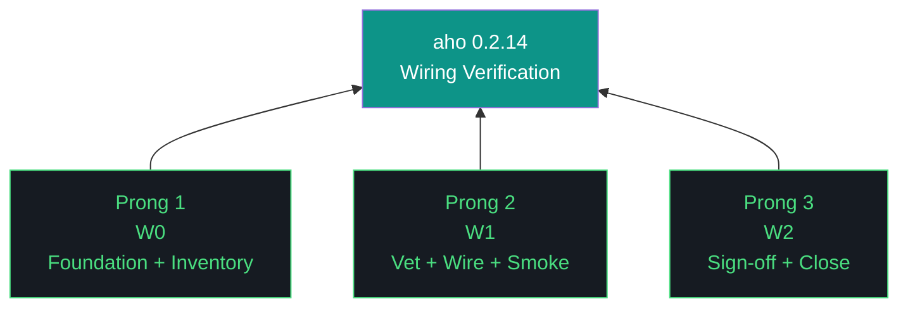

# aho 0.2.14 — Design Doc

**Theme:** Council wiring verification + cascade smoke test
**Iteration type:** Wiring (distinct from discovery/build/repair/measurement)
**Primary executor:** Claude Code | **Auditor:** Gemini CLI | **Sign-off:** Kyle
**Success criterion:** Council exists as verifiable wired system. Sign-off achieved on which members are operational, which are gap, which are unknown. NoSQL manual smoke test executes 5-stage cascade end-to-end on at least one verified role assignment.

---

## Trident

## The Eleven Pillars of AHO (verbatim from artifacts/harness/base.md)

1. **Delegate everything delegable.** The paid orchestrator is the most expensive resource in the system. Any task that can run on a free local model must run on a free local model. Drafting, classification, retrieval, validation, grading, and routing all belong to the local fleet. The orchestrator's minutes are spent on judgment, scope, and novelty.

2. **The harness is the contract.** Agent instructions live in versioned harness files that change at phase or iteration boundaries, not in per-run markdown regenerated from scratch. The orchestrator points at the harness; it does not carry the contract in its own context.

3. **Everything is artifacts.** Every task is artifacts-in to artifacts-out. Code, reports, schemas, analyses, migrations, audits, designs — all artifacts.

4. **Wrappers are the tool surface.** Agents never call raw tools. Every tool is invoked through a `/bin` wrapper. Wrappers are versioned with the harness, instrumented for the event log, and replayable from recorded inputs.

5. **Three octets, three meanings: phase, iteration, run.** Every artifact carries the full phase.iteration.run label.

6. **Transitions are durable.** Moving between phases, iterations, or runs writes state to a durable artifact before the transition is considered complete. Every gate is a write point. No implicit state.

7. **Generation and evaluation are separate roles.** The model that produced an artifact is never the model that grades it. Drafter and reviewer are different agents behind different wrappers with different prompts and ideally different underlying weights.

8. **Efficacy is measured in cost delta.** Every run records orchestrator token cost, local fleet compute time, wall clock, delegate ratio, and output quality signal.

9. **The gotcha registry is the harness's memory.** Every failure mode lands in the registry. Gotcha count is the compound-interest metric.

10. **Runs are interrupt-disciplined, not interrupt-free.** Once a run launches, agents do not ping for preference, clarification, or approval. Capability gaps routed through OpenClaw, logged as first-class events, resumed from last durable checkpoint.

11. **The human holds the keys.** No agent writes to git. No agent merges. No agent pushes. No agent manages secrets.

## Context

0.2.13 closed with parsers honest (W1 GLM, W2 Nemotron) but W2.5 surfacing model-output compromise. Honest reflection at 0.2.14 planning: **the council as a wired system has never been verified end-to-end.** Two iterations of parser fixes and individual model invocations. Zero iterations of "Producer → Indexer → Auditor → Indexer → Assessor cascade actually runs." 9 of 17 council members claimed-operational, 6 unknown, 2 gap. No verification that Nemoclaw can route to anything other than Nemotron classify. No agent-to-agent handoff in cascade architecture has ever been exercised.

0.2.14 verifies wiring. No measurement of model quality, no architectural decisions, no matrix testing, no dashboard. Wire it, prove the wire works, sign off, hand to 0.2.15 for measurement. Aligned with Direction 4 from 0.2.13 close: full vet, wire, visualize before any architecture shift. 0.2.14 = vet + wire. Visualize and measure = 0.2.15+.

## Architecture (target, to be wired)

**Target context:** aho is heading to Firestore-hosted (NoSQL document store, kjtcom data layer pattern). Pipeline architecture must be Firestore-aware in its data flow even when 0.2.14 still operates on local filesystem staging. NoSQL manual being the smoke-test document is intentional — first council exposure to the data architecture they'll be operating against.

**Pipeline roles (5 slots, 4 distinct roles — Indexer appears twice):**

1. **Indexer-in** — Pre-producer. Scans input against registries. Flags gotchas, ADRs, patterns. Proposes deltas if input reveals gaps.
2. **Producer** — Initial analysis from input.
3. **Auditor** — Receives Producer's work product AND Indexer-in's proposed deltas. Validates both.
4. **Indexer-out** — Post-auditor. Scans Auditor's findings. Proposes deltas based on what audit surfaced.
5. **Assessor** — Receives all prior work products + Indexer-out's proposed deltas. Meta-assessment. Validates Indexer-out's deltas. Final work product.

**Malleable role assignment.** Roles bind to models per-run. 0.2.14 verifies binding mechanism works for at least one assignment; 0.2.15+ matrix-tests systematically.

**Delta disposition (Pattern-C-extended):** Indexer proposes → Auditor/Assessor validates → staging artifact → Kyle commits. No registry write-back automation in 0.2.14.

## Pattern C (Continued, Modified)

Claude drafts. Gemini audits. Kyle commits. Modifications:

- Emitter table: Claude emits `workstream_start`, `pending_audit`, `workstream_complete`. Gemini emits `audit_complete`. No other emitters.
- `workstream_start` REQUIRED at workstream begin.
- Audit archive overwrites forbidden — re-audits versioned (`W{N}-v2.json`).
- `emit_workstream_complete()` side-effect bug patched in W0.

## Scope

**In scope:** Harness hygiene (root cleanup, README/CHANGELOG, protocol patches, emit fix), model docs review, council member vetting (every declared member invoked), pipeline schemas (role, trace, delta — minimum viable), 5-stage cascade orchestrator built and wired, NoSQL manual smoke test on verified members with one role assignment, sign-off package.

**Out of scope (deferred to 0.2.15+):** Matrix testing, dashboards, role-model fit measurement, council architecture decisions (GLM requantization, Nemotron policy, council health formula, casing-variants), registry write-back automation, G083 bulk fix, Firestore migration of staging, OpenClaw deep audit beyond vetting inclusion.

## Hard Gates

**Gate 1 (within W1):** Vetting must produce explicit operational/gap/unknown status for every declared council member before cascade wiring begins. Wiring against unverified members is the anti-pattern this iteration exists to avoid.

**Gate 2 (W1 acceptance):** 5-stage cascade executes end-to-end on the NoSQL manual with at least one role assignment composed of verified-operational members. Every handoff emits trace event. Every role produces non-null output. Auditor validates at least one delta proposal. Assessor produces final work product.

**Gate 3 (W2 sign-off):** Kyle reviews wiring sign-off package. Decides: (a) wiring complete, 0.2.15 may proceed to measurement; (b) wiring partial, 0.2.15 reshapes around what's wired; (c) wiring incomplete, 0.2.15 continues vetting/wiring.

## Risks

1. **Member vetting reveals most are not reachable.** If 10 of 17 fail invocation, cascade has 7 viable members across 4 roles — Pillar 7 gets thin. Mitigation: that's the substrate truth this iteration exists to surface.

2. **Cascade smoke test fails.** Some handoff doesn't work; some role can't produce output on 201-page document. Mitigation: each failure is a finding for 0.2.15. Iteration still closes honestly.

3. **NoSQL manual at 201 pages overwhelms small models.** Mitigation: that's measurement, not failure. Smoke test only requires one role assignment to succeed — if Qwen handles all five roles solo (Pillar 7 violation but viable for smoke), that proves cascade.

4. **Pattern C audit overhead on 3 workstreams.** Less compounding risk than 6+ workstream iterations. Should land cleanly.

## Success Criteria

- Every declared council member has operational/gap/unknown status
- Pipeline schemas defined and validated
- 5-stage cascade orchestrator built; integration test passes on dummy document
- NoSQL manual smoke test executes end-to-end on at least one verified assignment; produces full trace, role artifacts, validated delta, Assessor final output
- Sign-off package presented to Kyle in W2; Kyle's decision recorded
- Root directory cleaned per 0.2.13 carry-forward
- README + CHANGELOG narrative current through 0.2.13
- Pattern C protocol doc patched
- `emit_workstream_complete()` side-effect bug fixed
- 3-workstream cap respected

## Workstream Count: 3 (W0, W1, W2)
2 sessions. W1 contains internal hard gates (Gate 1 before wiring, Gate 2 before W1 close).
