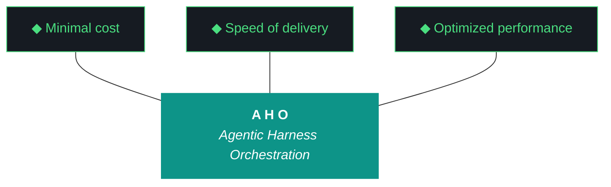

# aho-design-0.2.15

**Iteration:** 0.2.15
**Theme:** Tier 1 Partial Install Validation & Ship
**Phase:** 0 (Clone-to-Deploy)

---

## Charter

Wire and ship the Tier 1 Partial install package. All 4 chat LLMs validated through Ollama on fixed dispatcher, dispatcher hardened for multi-model use, Nemoclaw decision evidence-based, cross-model cascade proven. At iteration close, Tier 1 install.fish is shippable for deployment on fresh 8GB+ discrete GPU Arch Linux machines.

---

## Trident

---

## The Eleven Pillars of AHO

1. **Delegate everything delegable.** The paid orchestrator decides; the local free fleet executes.
2. **The harness is the contract.** Agent instructions live in versioned harness files, not model context.
3. **Everything is artifacts.** Every task is artifacts-in to artifacts-out.
4. **Wrappers are the tool surface.** Every tool is invoked through a `/bin` wrapper.
5. **Three octets, three meanings: phase, iteration, run.** Strategic, tactical, and execution scope.
6. **Transitions are durable.** State is written to a durable artifact before any transition.
7. **Generation and evaluation are separate roles.** Drafter and reviewer are different agents.
8. **Efficacy is measured in cost delta.** Wall clock, token cost, and delegate ratio are ground truth.
9. **The gotcha registry is the harness's memory.** Failure modes are indexed with mitigations.
10. **Runs are interrupt-disciplined.** No preference prompts mid-run; only capability gaps halt.
11. **The human holds the keys.** No agent writes to git or manages secrets.

---

## Scope

### In scope

- **4 chat LLMs via Ollama** — Qwen 3.5:9B, Llama 3.2:3B, GLM-4.6V-Flash-9B, Nemotron-mini:4b
- **Fair re-test of GLM and Nemotron** on fixed dispatcher (0.2.13 W2.5 findings were measured on broken substrate — re-test with clean-slate methodology)
- **Ollama Tier 1 capability audit** — requirements list with per-requirement probe (Framing A: test-based evaluation)
- **Dispatcher protocol hardening** — stop tokens per model family, error handling, retry/backoff, timeouts, model-swap handling
- **Nemoclaw re-vetting on fixed dispatcher** with measured comparison to direct Ollama
- **ADR for Tier 1 Dispatcher Choice** — direct Ollama / Nemoclaw / thin custom wrapper (evidence-based)
- **Cross-model cascade integration test** — Pillar 7 separation attempt, compare to W1.5 Qwen-solo baseline
- **Tier 1 install.fish** definition finalized based on validated evidence

### Out of scope

- **nomic-embed-text validation** — deferred to 0.2.16 or 0.2.17 with ChromaDB RAG integration
- **Gemma 2 9B, DeepSeek-Coder-V2, Mistral-Nemo** — Tier 2/3 roster, require >8GB VRAM, land with Luke's machine (24GB) or P3 clone installs in 0.2.17+
- **Auditor role-prompt redesign** — carried forward from 0.2.14, deferred to later iteration
- **Capability-routed vs role-assigned cascade architectural decision** — carried forward, not forced in 0.2.15
- **Executor-as-outer-loop-judge (Critic/Arbiter)** — carried forward, 0.2.16 candidate
- **OpenClaw disposition decision** — Qwen wrapper, cosmetic, carried forward

---

## Workstreams

### W0 — Setup + Tier 1 roster re-vetting

Version bump, scaffolding, checkpoint init. Integrate Llama 3.2 3B into dispatcher (first real integration, currently disk-resident only). Fair re-vetting of all 4 chat LLMs on fixed dispatcher (`/api/chat`, `num_ctx=32768`, stop tokens per model family):

- Qwen 3.5:9B — regression check (proven in 0.2.14 W1.5, verify still clean)
- Llama 3.2:3B — full vetting (identity probe, structured output, Llama 3.x chat template, stop tokens `<|eot_id|>`, `<|end_of_text|>`)
- GLM-4.6V-Flash-9B — full re-vet (clean slate). Structured JSON output, Chinese-drift check, template honoring. 0.2.13 W2.5 finding (80% timeout, wrong-schema JSON) was measured on broken dispatcher — re-test produces evidence for retain/remove decision.
- Nemotron-mini:4b — full re-vet. Classify task specifically (80% feature-bias was the W2.5 failure mode). 0.2.13 W2.5 finding measured on broken dispatcher — re-test produces evidence.

**Gate:** All 4 LLMs have explicit status (`operational` / `partial` / `compromised`) with fixed-dispatcher evidence. No `unknown` at W0 close.

**Deliverable:** `tier1-roster-validation-0.2.15.md`

### W1 — Ollama Tier 1 capability audit

Define Tier 1 requirement list for Ollama as the control plane. Probe each requirement across all 4 chat LLMs. Classify per requirement.

Requirements (target ~10-12):

- Concurrent model awareness (`/api/ps` accuracy)
- LRU eviction predictability under VRAM pressure (critical — 4 chat LLMs together are 19.3GB, won't fit in 8GB simultaneously)
- Explicit unload API (`keep_alive: 0` trick or equivalent) — verify per model
- Request queuing behavior when busy
- Multi-model routing by name for all 4 LLMs
- Context preservation / leak across concurrent requests
- Error reporting fidelity
- Timeout / hang detection
- Model-swap latency
- Stop token acceptance variance across model families
- Chat template handling across Qwen / Llama 3.x / GLM / Nemotron families
- Embedding endpoint sanity (doesn't interfere with chat — nomic validation deferred)

**Gate:** Every requirement has a pass / partial / fail classification with evidence.

**Deliverable:** `ollama-tier1-fitness-0.2.15.md` — goes / no-goes / workarounds

### W2 — Dispatcher protocol hardening

Harden `src/aho/pipeline/dispatcher.py` for multi-model Tier 1 use:

- Stop token lists per model family (Qwen, Llama 3.x, GLM, Nemotron each need their own)
- Error handling: malformed response per model, connection loss, timeout, partial response
- Retry logic + backoff design
- Per-stage timeout enforcement with multi-model cascade
- Model-swap graceful handling (Qwen loaded, Llama needs to run — wait or fail cleanly)
- Unit tests for each hardening concern

**Gate:** Dispatcher handles all 4 LLMs with model-family-appropriate configuration, graceful failure modes, measurable timeout / retry behavior.

**Deliverable:** Hardened `dispatcher.py`, expanded `test_dispatcher_chat_api.py` or new test file

### W3 — Nemoclaw re-vetting + ADR dispatcher choice

Nemoclaw on fixed dispatcher: explicit routing test with all 4 LLMs. Multi-model routing via Nemoclaw tested. Latency comparison — direct Ollama HTTP vs Nemoclaw for equivalent operations. Evidence-based decision.

**Gate:** ADR published — direct Ollama / Nemoclaw wrapper / thin custom wrapper — with measured rationale. Pillar 4 (wrappers are tool surface) examined with evidence.

**Deliverable:** `artifacts/adrs/adr-NNN-tier1-dispatcher-choice.md` (ADR number confirmed during W3 via ADR index read — no fabrication)

### W4 — Integration + close

Full cascade run with cross-model role assignment. Specific assignment depends on W0 re-test outcomes:

- Producer = Qwen 3.5:9B (workhorse, proven)
- Indexer_in / Indexer_out = Llama 3.2:3B (fast triage-tier)
- Auditor = GLM or Nemotron if operational after W0; fall back to Qwen if both still compromised
- Assessor = Qwen or different operational model

Compare to 0.2.14 W1.5 Qwen-solo baseline — does cross-model role assignment reduce auditor rubber-stamp pattern, produce different output, introduce new failure modes.

install.fish Tier 1 definition finalized based on W0–W3 evidence. Retrospective, carry-forwards, bundle, sign-off sheet.

**Gate (hard gate blocker for iteration close):** All 4 LLMs wired through Ollama dispatcher, all 4 vetted with fixed-dispatcher evidence, cross-model cascade test completes successfully. Tier 1 install.fish is shippable.

**Deliverable:** Retrospective, carry-forwards, bundle, sign-off sheet, finalized `install.fish` Tier 1 section.

---

## Contingencies

**If GLM re-test passes:** Auditor role has a non-Qwen candidate. Pillar 7 separation attempt in W4 is more meaningful. Iteration retrospective records "0.2.13 W2.5 substrate finding was substrate-compromise, not model-compromise."

**If Nemotron re-test passes:** Triage-class model available pre-Llama. Pillar 7 options expand. Same methodological lesson as above.

**If both GLM and Nemotron re-test fail on fixed dispatcher:** Original removal decisions validated with clean evidence. Iteration closes with 2-member operational roster (Qwen + Llama 3.2). W4 cross-model cascade limited to Producer=Qwen, Indexer=Llama 3.2; other roles Qwen-solo. Pillar 7 restoration remains 0.2.16+.

**If exactly one of GLM/Nemotron passes:** Whichever passes fills an Auditor-candidate slot; other stays removed; roster is 3 operational.

All four outcomes are acceptable iteration outcomes — what changes is evidence quality and downstream iteration plan.

---

## Process discipline carried from 0.2.14

- Raw response field is ground truth, not parsed JSON (W1 mischaracterization lesson)
- No speed / capability claims without tuned-baseline measurement (Kyle directive, W1.5 verified)
- `workstream_start` fires AFTER AHO_ITERATION env confirmed set
- `workstream_complete` fires only after audit archive exists with pass or pass_with_findings
- Audit archive overwrites forbidden
- Sign-off boxes are Kyle's (Pillar 11)
- No git operations by agents (Pillar 11)
- Cross-project contamination vigilance — version labels, pillar lists, ADR numbers, bundle sections must verify against aho canonical references before use

---

*Design doc 0.2.15. Pillars and trident copied verbatim from README.md (aho canonical). ADR number for W3 deliverable determined at W3 execution time from ADR index — not pre-fabricated here.*
