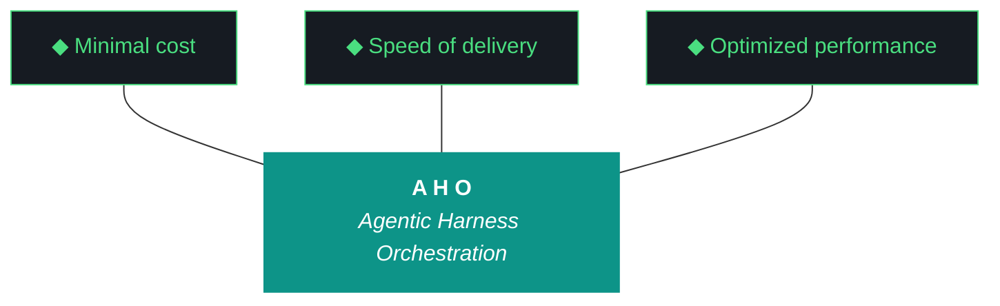

# aho-design-0.2.16

**Iteration:** 0.2.16
**Theme:** Claude Code OTEL Integration & 0.2.15 Close-Out
**Phase:** 0 (Clone-to-Deploy)

---

## Charter

Integrate Claude Code's native OpenTelemetry framework into aho's existing observability stack (otelcol-contrib + Jaeger, both already deployed as systemd user services). The integration spans metrics, events, and distributed traces, lands Pillar 8 (cost delta as ground truth) as measured instrumentation rather than parsed-log estimation, and promotes Pillar 11 (human holds the keys) from convention to monitored invariant.

The iteration opens with formal close-out of 0.2.15: install.fish Tier 1 finalization, Qwen Producer substrate fix, harness hygiene drift, and the `aho iteration close --confirm` step that was never run. These are debt payments, not 0.2.16 scope in spirit — they clear the desk before the real work begins.

A secondary deliverable ships alongside the integration work: a self-contained reference export pack (settings templates, collector config, dashboard spec, alert rules, posture ADRs) usable by external parties who need comprehensive Claude Code telemetry. The Mercor engagement is the first such consumer; the pack is designed so any other party can drop it in.

At iteration close: Claude Code sessions in aho are fully instrumented; Pillar 11 violations fire real-time alerts to a dedicated channel; a cross-model cascade re-run produces a clean Pillar 7 data point with end-to-end Jaeger trace; and the export pack is ready to hand off.

---

## Trident



---

## The Eleven Pillars of AHO (verbatim from artifacts/harness/base.md)

1. **Delegate everything delegable.** The paid orchestrator is the most expensive resource in the system. Any task that can run on a free local model must run on a free local model. Drafting, classification, retrieval, validation, grading, and routing all belong to the local fleet. The orchestrator's minutes are spent on judgment, scope, and novelty.

2. **The harness is the contract.** Agent instructions live in versioned harness files that change at phase or iteration boundaries, not in per-run markdown regenerated from scratch. The orchestrator points at the harness; it does not carry the contract in its own context.

3. **Everything is artifacts.** Every task is artifacts-in to artifacts-out. Code, reports, schemas, analyses, migrations, audits, designs — all artifacts. The harness is artifact-agnostic at its core and artifact-specialized at its overlays.

4. **Wrappers are the tool surface.** Agents never call raw tools. Every tool is invoked through a `/bin` wrapper. Wrappers are versioned with the harness, instrumented for the event log, and replayable from recorded inputs.

5. **Three octets, three meanings: phase, iteration, run.** Phase is strategic scope. Iteration is tactical scope. Run is execution instance. Every artifact carries the full phase.iteration.run label.

6. **Transitions are durable.** Moving between phases, iterations, or runs writes state to a durable artifact before the transition is considered complete. Every gate is a write point. No implicit state.

7. **Generation and evaluation are separate roles.** The model that produced an artifact is never the model that grades it. Drafter and reviewer are different agents behind different wrappers with different prompts and ideally different underlying weights.

8. **Efficacy is measured in cost delta.** Every run records orchestrator token cost, local fleet compute time, wall clock, delegate ratio, and output quality signal. Numbers ship with the run report.

9. **The gotcha registry is the harness's memory.** Every failure mode lands in the registry. A mature harness has more gotchas than an immature one — gotcha count is the compound-interest metric.

10. **Runs are interrupt-disciplined, not interrupt-free.** Once a run launches, agents do not ping for preference, clarification, or approval. The single exception is unavoidable capability gaps (sudo, credentials, physical access) — routed through OpenClaw to a defined notification channel, logged as a first-class event, resumed from the last durable checkpoint.

11. **The human holds the keys.** No agent writes to git. No agent merges. No agent pushes. No agent manages secrets. No wrapper surfaces `git commit` or `git push` under any role.

---

## Scope

### In scope

- **0.2.15 formal close-out** — sign-off sheet drift repair (AF001 counts: 21 → actual 27; §8 bundle count claim vs §9 actual), Kyle sign-off ticks, `aho iteration close --confirm`. Must happen before AHO_ITERATION advances to 0.2.16.
- **Tier 1 install.fish section finalization** — derived from 0.2.15 W0–W3 artifacts. Unblocks the "Tier 1 shippable" claim that 0.2.15 W4 deferred.
- **Qwen Producer substrate fix** — raise `num_predict` from 2000 to 8000 for Qwen family in `MODEL_FAMILY_CONFIG`. Measure thinking-vs-content split on cascade-scale prompts (W4 reproduced the failure at 247K-char document + 32K context). Document remediation; if 8000 insufficient, `/no_think` prefix is the next lever.
- **Claude Code OTEL configuration** — metrics + events in W0, traces (beta) in W2. Endpoint: existing otelcol-contrib at `localhost:4317`. `OTEL_RESOURCE_ATTRIBUTES` carries `aho.iteration`, `aho.workstream`, `aho.role`. Managed settings via `.claude/settings.json` `env` block.
- **Pillar 8 cost + token dashboard** — consume `claude_code.cost.usage` and `claude_code.token.usage` as ground truth. Per-iteration and per-workstream attribution via OTEL resource attrs + aho event log correlation. Cache read vs cache creation as first-class metric.
- **Distributed trace integration** — `TRACEPARENT` propagation through `src/aho/pipeline/dispatcher.py` and `src/aho/pipeline/router.py`. Claude Code spans become parents of aho dispatcher spans. End-to-end trace viewable in Jaeger: user prompt → Claude API → tool_use → bash subprocess → dispatcher → Ollama inference → response.
- **Pillar 11 as monitored invariant** — alerts on `claude_code.commit.count > 0` and `claude_code.pull_request.count > 0`. Convention becomes real-time detection.
- **Anomaly detection rules** — five rules live: (1) commit.count delta > 0, (2) pull_request.count delta > 0, (3) api_error rate over 5 min, (4) cost.usage session delta over threshold, (5) tool_result duration_ms p99 over baseline × K.
- **Dedicated Pillar 11 / anomaly alert channel** — new Telegram bot + chat, new secrets `ahomw:telegram_alerts_bot_token` and `ahomw:telegram_alerts_chat_id`. Separate from the existing `ahomw:telegram_bot_token` / `ahomw:telegram_chat_id` which stays for routine operational notifications. Kyle creates the secrets per Pillar 11.
- **Harness hygiene carried from 0.2.15** — `test_workstream_events.py` fixture mock for `find_project_root` (third recurrence; fix, don't defer), `template_leak_detected` null → false normalization (AF002), orchestrator `workstream_id` parameterization (F006 from W4 acceptance), empty-content halt semantics in cascade orchestrator (F005 carry-forward), remaining G083 sites in `src/aho/agents/nemoclaw.py:77,134` (F003 carry-forward).
- **Cross-model cascade re-run** — Producer fixed, full OTEL active. Paired comparison: Qwen-as-Auditor vs GLM-as-Auditor on **identical Producer output**. First defensible Pillar 7 data point — 0.2.15 W4 was compromised by 0-char Producer.
- **Mercor-exportable reference pack** — under `artifacts/iterations/0.2.16/export/claude-otel-reference-pack/`. Contents: settings template, collector config snippet, dashboard spec, alert rules, privacy/cardinality posture ADR, Gemini asymmetry ADR, runbook. Designed drop-in, not branded.

### Out of scope

- **Mercor engagement work product itself** — the three customer-facing artifacts (breach timeline, controls doc, implementation plan) are independent and do not fold into 0.2.16 workstreams. The export pack produced here informs that engagement but does not absorb it.
- **Gemini CLI first-class tracing** — Gemini CLI has no OTEL equivalent. The asymmetry is documented in an ADR, not engineered around with half-measures. A timing wrapper gives you wall-clock without cost or token breakdown; that's worse than honest asymmetry.
- **Auditor role-prompt bifurcation redesign** — still open as a prompt engineering candidate. 0.2.16's cascade re-run begins the cross-model comparison that will inform a future redesign iteration but does not complete it.
- **Capability-routed vs role-assigned cascade architecture** — waits for roster expansion (0.2.17+).
- **Executor-as-outer-loop-judge (Critic/Arbiter)** — architectural design candidate, 0.2.17+.
- **OpenClaw disposition decision** — carried forward; no usage data yet.
- **Tier 2/3 roster (Gemma 2, DeepSeek-Coder-V2, Mistral-Nemo)** — requires >8GB VRAM; waits on Luke's machine or P3 clone installs.
- **nomic-embed-text + ChromaDB RAG integration** — deferred to 0.2.17.
- **Firestore migration of staging directories** — 0.2.17+.

---

## Workstreams

### W0 — 0.2.15 Close-Out + Substrate Closure + OTEL Scaffolding

Three buckets, coordinated:

**Bucket 1 — 0.2.15 close-out (Kyle-driven):**
- Sign-off drift repair: update `sign-off-0.2.15.md` counts to match `carry-forwards-0.2.15.md` (27 items, not 21); update bundle section count reference if needed (§9 close package, 9 sections total)
- Kyle ticks sign-off boxes on `artifacts/iterations/0.2.15/sign-off-0.2.15.md`
- `aho iteration close --confirm` executed on NZXTcos
- AHO_ITERATION advanced to 0.2.16; checkpoint scaffolding initialized

**Bucket 2 — substrate closure (Claude Code):**
- `install.fish` Tier 1 section: machine detection (VRAM 8–16GB + Arch-family), model pulls (Qwen/Llama 3.2/GLM/Nemotron), dispatcher config generation, baseline vetting probe on target machine, explicit "not installed at Tier 1" list
- Qwen `num_predict=8000` in `MODEL_FAMILY_CONFIG["qwen"]`; probe on the 0.2.15 W4 NoSQL cascade scenario (247K-char doc, Producer role); record thinking_chars vs content_chars split
- Empty-content halt semantics in `src/aho/pipeline/orchestrator.py`: stage emitting 0-char content with no error raises `EmptyContentError` (new typed exception, G083-compliant), surfaces to cascade runner for halt/retry/escalate decision — does not silently propagate `[stage X failed: None]` markers downstream
- `template_leak_detected` normalization: `None` → `False` at detection site in `dispatcher.py`; stage JSONs emit `false`/`true` not `null`/`true` (AF002)
- Orchestrator `workstream_id` parameterization: `run_cascade(..., workstream_id="W0")` default, remove hardcoded `"W1"` at lines 148 and 198 (F006)
- `test_workstream_events.py` fixture: autouse `conftest.py` patch of `aho.events.find_project_root` returning a tmp dir; stops real checkpoint from being rewritten during test suite runs (third recurrence fix)
- Narrow remaining `except Exception` sites in `src/aho/agents/nemoclaw.py:77,134` to specific error types (F003 closure)

**Bucket 3 — OTEL scaffolding (Claude Code):**
- `.claude/settings.json` env block: `CLAUDE_CODE_ENABLE_TELEMETRY=1`, `OTEL_METRICS_EXPORTER=otlp`, `OTEL_LOGS_EXPORTER=otlp`, `OTEL_EXPORTER_OTLP_ENDPOINT=http://localhost:4317`, `OTEL_EXPORTER_OTLP_PROTOCOL=grpc`, `OTEL_LOG_USER_PROMPTS=1`, `OTEL_LOG_TOOL_CONTENT=1`
- `OTEL_RESOURCE_ATTRIBUTES` pattern: `service.name=claude-code,aho.iteration=${AHO_ITERATION},aho.workstream=${AHO_WORKSTREAM},aho.role=drafter`
- Verify metrics land in existing otelcol-contrib and are queryable in Jaeger (Jaeger stores traces primarily; metrics verification via collector's Prometheus export or logs stream)
- Traces deferred to W2 (`OTEL_TRACES_EXPORTER` not set yet)
- ADR logged: number determined at W0 execution time by enumerating `artifacts/adrs/` — do not fabricate

**Gate:**
- 0.2.15 closed (`aho iteration close --confirm` run, returns success)
- install.fish Tier 1 dry-run on NZXTcos succeeds (clean VRAM + Arch detection, model pull list correct)
- Qwen Producer probe on 247K-char cascade scenario emits ≥500 chars of `message.content` with `done_reason != "length"`
- Claude Code session produces metrics + events in Jaeger with correct `aho.iteration=0.2.16` resource attr
- Baseline regression unchanged vs 0.2.15 W4 close (10 failed / 374 passed) modulo the explicitly fixed `test_workstream_events.py`

**Deliverables:**
- `install.fish` — finalized Tier 1 section
- `src/aho/pipeline/dispatcher.py` — `num_predict=8000`, template_leak normalization
- `src/aho/pipeline/orchestrator.py` — `workstream_id` parameterized, `EmptyContentError` + halt semantics
- `src/aho/agents/nemoclaw.py` — G083 sites narrowed
- `tests/conftest.py` or equivalent — `find_project_root` autouse patch
- `.claude/settings.json` — OTEL env block
- `artifacts/iterations/0.2.16/otel-scaffold-notes.md` — W0 design decisions
- `artifacts/iterations/0.2.16/qwen-num-predict-probe.json` — remediation evidence
- `artifacts/iterations/0.2.16/install-fish-dryrun.md` — dry-run evidence on NZXTcos
- `artifacts/adrs/0003-*.md` or next available — OTEL scaffolding posture

### W1 — Pillar 8 Cost + Token Dashboard

Consume OTEL-native cost and token metrics; build (or extend) dashboard surface for per-iteration and per-workstream attribution.

- Ingest `claude_code.cost.usage` (USD, per API call, model-attributed)
- Ingest `claude_code.token.usage` split by type: `input`, `output`, `cacheRead`, `cacheCreation`
- Ingest `claude_code.active_time.total` for wall-clock correlation
- Attribution: use `OTEL_RESOURCE_ATTRIBUTES` (set in W0) to tag each metric with `aho.iteration` and `aho.workstream`
- Dashboard surface: extend existing aho dashboard if live; otherwise thin Grafana dashboard reading from collector's Prometheus export
- Record baseline cost figures for 0.2.15 replay (if session logs available) and for a synthetic W1 probe

**Gate:**
- Cost per workstream queryable (4–5 workstreams visible with USD and token breakdown)
- Cache breakdown visible (cacheRead vs cacheCreation as separate bars/series)
- Dashboard loads under 2s on NZXTcos
- One recorded probe: drafting a ~500-token response with `OTEL_LOG_TOOL_CONTENT=1` produces both a tool_result event and a cost delta

**Deliverables:**
- Dashboard definition file (Grafana JSON or equivalent) — committed to `artifacts/iterations/0.2.16/dashboards/pillar-8-cost-tokens.json`
- `artifacts/iterations/0.2.16/pillar-8-dashboard-notes.md` — queries, panel design, attribution logic
- Mercor export copy: same dashboard JSON copied under `export/claude-otel-reference-pack/dashboards/`

### W2 — Distributed Tracing (TRACEPARENT Propagation)

Enable the traces beta and link Claude Code spans to aho dispatcher/router spans through standard W3C trace context.

- Enable `CLAUDE_CODE_ENHANCED_TELEMETRY_BETA=1` and `OTEL_TRACES_EXPORTER=otlp` in managed settings
- Read `TRACEPARENT` env var in `src/aho/pipeline/dispatcher.py` and `src/aho/pipeline/router.py`; if present, create child spans off it; if absent, create root spans (preserving backward compatibility for non-OTEL callers)
- End-to-end trace target: single Jaeger trace covers user prompt → Claude API request → `tool_use` → bash subprocess → dispatcher `/api/chat` → Ollama inference → response
- Span attributes: `aho.workstream`, `aho.model`, `aho.stage`, `aho.family`, `dispatch.duration_ms`
- ADR on the Gemini CLI observability asymmetry — Gemini has no OTEL; audits remain invisible at the API level; harness-watcher event wrappers capture only wall-clock

**Gate:**
- One full end-to-end trace captured in Jaeger for a real Pattern C workstream (may be a dry W2 probe, does not need to be real workstream work)
- Parent-child span relationship correct: aho spans are children of Claude Code spans under the same trace_id
- `dispatch.duration_ms` span attr matches dispatcher's internal timing (validates no measurement drift)
- `OTEL_LOG_TOOL_CONTENT=1` payload truncation at 60KB observed (not a failure — verify behavior)

**Deliverables:**
- `src/aho/pipeline/dispatcher.py` — TRACEPARENT read + child span creation
- `src/aho/pipeline/router.py` — same
- `artifacts/iterations/0.2.16/trace-integration-notes.md` — design decisions, span attr choices, backward compat strategy
- `artifacts/iterations/0.2.16/traces/end-to-end-sample.json` — exported Jaeger trace as evidence
- `artifacts/adrs/NNNN-*.md` — Gemini OTEL asymmetry posture (number from index at execution time)
- Mercor export copy: collector config + `TRACEPARENT` propagation snippet under `export/claude-otel-reference-pack/`

### W3 — Pillar 11 Enforcement + Anomaly Detection

Promote Pillar 11 from convention to monitored invariant. Implement five anomaly rules. Alert delivery to a new dedicated Telegram channel.

- Alert rules (5):
  1. `claude_code.commit.count` delta > 0 over 1-minute window → Pillar 11 violation (severity: critical)
  2. `claude_code.pull_request.count` delta > 0 over 1-minute window → Pillar 11 violation (severity: critical)
  3. `claude_code.api_error` event rate > 5 in 5 minutes → API anomaly (severity: important)
  4. `claude_code.cost.usage` session delta > $2.00 in 10 minutes → cost anomaly (severity: important)
  5. `claude_code.tool_result.duration_ms` p99 > baseline × 3 → tool duration anomaly (severity: info)
- Alert delivery: new Telegram bot `@aho_alerts_bot` (or similar; Kyle names), new chat ID, stored as `ahomw:telegram_alerts_bot_token` and `ahomw:telegram_alerts_chat_id`
- Kyle creates both secrets per Pillar 11 (no agent writes secrets)
- Delivery path: otelcol-contrib → alert rule engine (Prometheus Alertmanager or equivalent already running) → aho-telegram-alerts bridge → Telegram API
- Integration with harness-watcher daemon: alert events also append to `aho_event_log.jsonl` with `event_type=pillar_11_violation` or `event_type=anomaly`
- Synthetic test: force a `claude_code.api_error` spike in a probe session; verify alert fires and arrives in Telegram dedicated channel within 60s

**Gate:**
- Pillar 11 violation alert fires on synthetic commit event (not real commit — Pillar 11 forbids it; synthetic event emitted via otelcol-contrib telemetrygen or equivalent)
- All 5 rules active in alert engine with test evidence
- Dedicated channel delivery verified (Kyle receives test alert in new channel, not old)
- aho_event_log.jsonl contains corresponding events with correct types

**Deliverables:**
- Alert rule files — committed to `artifacts/iterations/0.2.16/alerts/`
- `artifacts/iterations/0.2.16/pillar-11-monitoring-notes.md` — rule rationale, thresholds, baseline calibration
- `artifacts/iterations/0.2.16/alert-delivery-test.md` — synthetic test evidence
- Mercor export copy: alert rules under `export/claude-otel-reference-pack/alerts/`

### W4 — Cross-Model Cascade Re-Run + Close

The clean Pillar 7 re-run that 0.2.15 W4 couldn't complete because Producer emitted 0 chars. Producer now fixed (W0), full OTEL active (W2), alerts live (W3).

- Cascade scenario: same 247K-char NoSQL manual as 0.2.15 W4 (baseline continuity)
- Role assignment: Producer=Qwen 3.5:9B, Indexer-in=Llama 3.2:3B, Auditor=GLM-4.6V-Flash-9B (`num_gpu=30`), Indexer-out=Llama 3.2:3B, Assessor=Qwen 3.5:9B (Nemotron confirmed compromised as Assessor in 0.2.15 W4 F004; do not repeat that role assignment)
- **Paired comparison**: run twice — once with Qwen-as-Auditor (for baseline), once with GLM-as-Auditor (the Pillar 7 test), on **identical Producer output** (Producer run once, Auditor runs twice)
- Full Jaeger trace captured for both runs; export for bundle inclusion
- Cost attribution: both runs' OTEL cost metrics tagged `aho.workstream=W4`
- Pillar 7 verdict: comparison of Auditor outputs against same Producer — does GLM produce structurally different critique than Qwen?
- Role-compatibility gate in cascade orchestrator (F004 carry-forward closure): reads `tier1-roster-validation-0.2.15.json` at cascade init, asserts assigned model is compatible with assigned role (Nemotron-as-Assessor would fail this assertion)
- Assemble Mercor export pack: `artifacts/iterations/0.2.16/export/claude-otel-reference-pack/` with all deliverables from W0–W3 copied in plus a top-level `README.md` runbook
- Retrospective, carry-forwards, bundle, sign-off sheet
- `aho iteration close --confirm` (Kyle)

**Gate (hard gate blocker for iteration close):**
- Cross-model cascade paired run completes with real Producer output (not 0-char artifact)
- Both Auditor runs produce >500 chars of substantive critique
- Pillar 7 verdict rendered with evidence (structural difference quantified, not rhetorical)
- Export pack populated with all four workstream artifact groups + runbook
- Bundle generated with required sections
- Sign-off sheet unchecked for Kyle

**Deliverables:**
- `artifacts/iterations/0.2.16/cascade-rerun/` — paired run artifacts (10 stage files: 5 per Auditor configuration + 2 trace.json)
- `artifacts/iterations/0.2.16/cascade-rerun/pillar-7-comparison.md` — Auditor output side-by-side
- `artifacts/iterations/0.2.16/export/claude-otel-reference-pack/` — assembled export pack
- `artifacts/iterations/0.2.16/retrospective-0.2.16.md`
- `artifacts/iterations/0.2.16/carry-forwards-0.2.16.md`
- `artifacts/iterations/0.2.16/aho-bundle-0.2.16.md`
- `artifacts/iterations/0.2.16/sign-off-0.2.16.md`

---

## Mercor Exportable Reference Pack

Shipped under `artifacts/iterations/0.2.16/export/claude-otel-reference-pack/`. Assembled by W4; source material produced by W0–W3. Drop-in usable by any external party needing comprehensive Claude Code telemetry — the Mercor engagement being the first consumer.

**Contents:**

```
export/claude-otel-reference-pack/
├── README.md                                 — what this is, who it's for, how to deploy
├── runbook.md                                — step-by-step setup on a fresh machine
├── .claude-settings-template.json            — managed-settings env block for OTEL
├── collector/
│   └── config-snippet.yaml                   — otelcol-contrib OTLP receiver + exporter
├── dashboards/
│   └── pillar-8-cost-tokens.json             — Grafana dashboard for cost + token attribution
├── alerts/
│   ├── pillar-11-violations.yaml             — commit.count / pull_request.count rules
│   └── anomaly-rules.yaml                    — api_error / cost / tool_duration rules
├── adrs/
│   ├── telemetry-posture.md                  — privacy + cardinality choices (OTEL_LOG_USER_PROMPTS, session.id inclusion)
│   └── gemini-asymmetry.md                   — acknowledged observability gap for Gemini CLI auditors
└── samples/
    ├── end-to-end-trace.json                 — one real Jaeger trace for reference
    └── cost-query-examples.md                — representative Prometheus/Grafana queries
```

**Design constraints:**
- No aho branding or aho-specific paths in the pack (except where it's illustrative)
- All configuration is parameterized; no hardcoded credentials, endpoints, or user identifiers
- Privacy posture is explicit: pack is distributed with `OTEL_LOG_USER_PROMPTS=1` and `OTEL_LOG_TOOL_CONTENT=1` enabled, with an ADR note that customer deployments should evaluate based on data sensitivity
- The Gemini asymmetry ADR is prominent — external consumers should not assume symmetric observability across executors

---

## Contingencies

**If Qwen `num_predict=8000` is still insufficient on cascade-scale prompts:** W0 probe will reveal this. Next lever: `/no_think` prefix on Producer user prompts (Qwen convention to suppress thinking-mode). If still insufficient: switch Producer to a non-thinking Qwen variant (`qwen2.5:7b-instruct` or similar). If none work: Producer pre-summarization — Indexer-in produces a compressed summary that becomes Producer's input. Each lever has a tradeoff documented in the W0 notes.

**If `CLAUDE_CODE_ENHANCED_TELEMETRY_BETA=1` is unstable or removed:** W2 degrades to metrics + events only. `TRACEPARENT` propagation becomes aho-internal only (no Claude Code parent spans). End-to-end trace claim weakens to dispatcher-and-below. Document in ADR; re-visit when beta stabilizes.

**If Kyle discovers a Mercor-specific deliverable need mid-iteration:** Mercor artifacts remain independent (scope). If a new need arises that genuinely belongs in the export pack, W4 absorbs it. If it's a Mercor customer deliverable, it's a parallel track, not a 0.2.16 workstream amendment.

**If cross-model cascade paired run reveals Qwen-as-Auditor and GLM-as-Auditor produce structurally identical critique:** That's a strong signal the Auditor role-prompt bifurcation (carried forward from 0.2.14) is prompt-structural, not model-specific. Log as finding; prompt engineering iteration jumps priority for 0.2.17. Not a W4 failure — it's a W4 result.

**If alert delivery fails synthetic test:** Debug in W3. If root cause is the collector (rule engine, bridge, Telegram), fix. If root cause is the secrets (bot token wrong, chat ID wrong), Kyle corrects. Do not ship W3 `workstream_complete` with broken delivery.

**If 0.2.15 sign-off reveals substantive issues beyond cosmetic drift:** W0 opens a W5 of 0.2.15 (remediation) rather than advancing AHO_ITERATION. Three-octet discipline preserved; 0.2.16 scaffolding waits.

---

## Process Discipline Carried from 0.2.15

- **Raw response field is ground truth, not parsed JSON.** Every workstream acceptance archive includes a raw-response inspection check.
- **`workstream_start` fires AFTER `AHO_ITERATION` env confirmed set** — 0.2.14 lesson, held in 0.2.15.
- **`workstream_complete` fires only after audit archive exists** with `pass` or `pass_with_findings`, in a fresh Claude session — never mid-flow from the executor.
- **Audit archive overwrites forbidden** — re-audits create `audit/W{N}-v2.json`, `v3`, etc.
- **Sign-off boxes are Kyle's** per Pillar 11. No agent ticks any box.
- **No git operations by agents** — Pillar 11 absolute.
- **No speed or capability claims without tuned-baseline measurement.**
- **No celebratory framing** per G081.
- **Cross-project contamination vigilance** — aho uses 11 pillars (not 10). ADR numbers from index, not memory. Bundle sections match canonical spec.
- **Three-octet versioning only.** 0.2.16 is phase 0, iteration 2, run 16. No fourth octet.

---

*Design doc 0.2.16. Pillars and trident copied verbatim from aho canonical references. ADR numbers for W0, W2 deliverables determined at workstream execution time from `artifacts/adrs/` index — not pre-fabricated here.*
