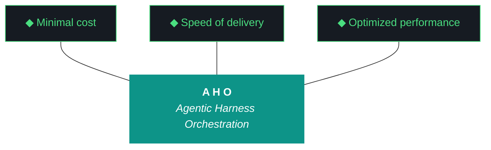

# aho - Bundle 0.2.2

**Generated:** 2026-04-11T16:09:56.409239Z
**Iteration:** 0.2.2
**Project code:** ahomw
**Project root:** /home/kthompson/dev/projects/aho

---

## §1. Design

### DESIGN (aho-design-0.2.2.md)
```markdown
# aho 0.2.2 — Design

**Phase:** 0 | **Iteration:** 2 | **Run:** 2
**Theme:** Global daemons — openclaw, nemoclaw, telegram graduate from stub to active
**Run Type:** mixed | **Wall clock:** ~2-3 hours | **Agent:** Claude Code

## Context

0.2.1 built the global deployment spine: hybrid systemd, native OTEL collector, real installer, model fleet, instrumented stubs. 0.2.2 makes the three named stubs functional. After this run, the deferral debt that's been carried since iao 0.1.4 is fully cleared and aho has real working agents and notifications, not just instrumented placeholders.

## Objectives

1. **Carryover hygiene (W0).** Fix `build_log_complete` design path (second attempt), wall clock per-workstream computation, investigate evaluator warn/reject loop noise, bump components.yaml `next_iteration` fields to 0.2.2.
2. **OpenClaw global daemon (W1).** Real `OpenClawSession` implementation with Ollama dispatch, code execution sandbox, conversation history persistence. Systemd user service `aho-openclaw.service`. Wrapper `bin/aho-openclaw`. Status flips from `stub` to `active` in components.yaml.
3. **NemoClaw global daemon (W2).** Real `NemoClaw` orchestration with Nemotron classification, role routing, OpenClaw session pooling. Systemd user service `aho-nemoclaw.service`. Wrapper `bin/aho-nemoclaw`. Status flips from `stub` to `active`.
4. **Telegram bridge real implementation (W3).** Bot token in age-encrypted secret. Send-only first: capability gap interrupts, close-complete notifications, error alerts. Receive-side waits for 0.2.3+. Systemd user service `aho-telegram.service`. Wrapper `bin/aho-telegram`. Status flips from `stub` to `active`.
5. **Doctor + install integration (W4).** All three new services wired into `aho doctor`, `bin/aho-install`, `bin/aho-uninstall`. P3 deployment runbook updated.
6. **Dogfood + close (W5).** End-to-end smoke: send a real classify task through nemoclaw → openclaw → qwen → telegram notification. Verify trace in Jaeger shows the full chain. Bundle, report, run file, postflight, second commit prep.

## Non-goals

- MCP server fleet (0.2.3)
- P3 clone attempt (0.2.4)
- Telegram receive-side / command handling (0.2.3 or later)
- Frontend wiring (0.3.x)
- Any new postflight gates (0.2.2 is functionality, not gate machinery)

## Workstreams

### W0 — Carryover hygiene
- Bump versions, backup, .aho.json/.aho-checkpoint.json
- Bump 8 canonical artifacts to 0.2.2
- Fix `build_log_complete.py` design path resolution (second attempt — confirm against the new artifacts/iterations layout)
- Fix `report_builder.py` workstream parser to compute wall clock from checkpoint `started_at`/`closed_at` per workstream OR from event log first/last event timestamps when checkpoint lacks per-workstream timing
- Investigate `build_log_synthesis` evaluator warn/reject loop — likely the synthesis evaluator firing repeatedly during close. Add log statement to identify the cause; fix or document as known noise.
- Update `components.yaml`: openclaw, nemoclaw, telegram all bump `next_iteration: "0.2.2"` (in flight) — they'll flip to `active` at end of W1/W2/W3 respectively
- MANIFEST refresh

### W1 — OpenClaw global daemon
**Real implementation:**
- `OpenClawSession.__init__` — generates UUID, creates `/tmp/openclaw-{uuid}/` workspace, initializes conversation history list, opens persistent connection to Ollama via QwenClient
- `OpenClawSession.chat(message)` — appends to history, sends to Qwen with full conversation context, appends response, returns text
- `OpenClawSession.execute_code(code, language)` — writes code to workspace, subprocess.run with timeout=30s, captures stdout/stderr/exit_code, logs OTEL span with attributes
- `OpenClawSession.cleanup()` — removes workspace, closes connection
- All methods continue to emit OTEL spans (instrumentation already landed in 0.2.1 W5)

**Systemd service:**
- `~/.config/systemd/user/aho-openclaw.service`
- ExecStart: `python -m aho.agents.openclaw --serve` (new `--serve` mode that listens on Unix socket at `~/.local/share/aho/openclaw.sock`)
- Auto-restart on failure
- After=network.target ollama.service

**Wrapper:**
- `bin/aho-openclaw` — fish wrapper that connects to the socket and dispatches commands
- `bin/aho-openclaw chat "message"` — single message
- `bin/aho-openclaw execute "code"` — code execution
- `bin/aho-openclaw status` — session count, uptime

**components.yaml:** openclaw status `stub` → `active`, remove `next_iteration`, update notes to "global daemon, systemd user service"

**Tests:** `artifacts/tests/test_openclaw_real.py` — session creation, chat round-trip, code execution, cleanup

### W2 — NemoClaw global daemon
**Real implementation:**
- `NemoClaw.__init__` — initializes Nemotron classifier, opens session pool dict, loads role registry
- `NemoClaw.route(task)` — sends task description to Nemotron with role list, returns classified role
- `NemoClaw.dispatch(task)` — classifies via route(), gets-or-creates OpenClaw session for that role, dispatches via session.chat(), returns response
- `NemoClaw.session_pool` — dict keyed by role name, lazy-instantiated, capped at 5 concurrent sessions
- All methods emit OTEL spans

**Systemd service:**
- `~/.config/systemd/user/aho-nemoclaw.service`
- ExecStart: `python -m aho.agents.nemoclaw --serve` (Unix socket at `~/.local/share/aho/nemoclaw.sock`)
- After=network.target ollama.service aho-openclaw.service

**Wrapper:**
- `bin/aho-nemoclaw dispatch "task description"` — fire-and-forget dispatch
- `bin/aho-nemoclaw status` — pool state, route history

**components.yaml:** nemoclaw status `stub` → `active`

**Tests:** `artifacts/tests/test_nemoclaw_real.py` — routing, dispatch, session reuse

### W3 — Telegram bridge real implementation
**Secrets:**
- New age-encrypted secret `telegram_bot_token` via `aho secret set telegram_bot_token <token>` — capability gap if Kyle hasn't created the bot yet
- New age-encrypted secret `telegram_chat_id` for default destination
- Loaded at daemon startup via existing secrets backend

**Real implementation:**
- `aho.telegram.notifications.send(message, priority="normal", chat_id=None)` — POST to `https://api.telegram.org/bot{token}/sendMessage`, handles 429 rate limiting with backoff, logs OTEL span
- `aho.telegram.notifications.send_capability_gap(gap_description)` — formatted alert with `[CAPABILITY GAP]` prefix
- `aho.telegram.notifications.send_close_complete(iteration, status)` — iteration close notification
- Send-only — no receive loop in this run

**Systemd service:**
- `~/.config/systemd/user/aho-telegram.service`
- ExecStart: `python -m aho.telegram.notifications --serve` (Unix socket for inbound send requests from other daemons)
- After=network.target

**Wrapper:**
- `bin/aho-telegram send "message"` — manual send
- `bin/aho-telegram test` — sends a test message to verify wiring
- `bin/aho-telegram status` — service state, last send timestamp

**Wire into close sequence:** `src/aho/cli.py` close subcommand calls `telegram.send_close_complete()` after checkpoint write (best-effort, never blocks close on telegram failure)

**components.yaml:** telegram status `stub` → `active`

**Tests:** `artifacts/tests/test_telegram_real.py` — mock requests, verify payload shape, verify graceful failure on missing token

**Capability gap expected:** Kyle creates Telegram bot via @BotFather, gets token, runs `aho secret set telegram_bot_token <token>`, runs `aho secret set telegram_chat_id <id>`. Agent halts cleanly if secrets absent.

### W4 — Doctor + install integration
- `src/aho/doctor.py` adds checks: `aho-openclaw.service active`, `aho-nemoclaw.service active`, `aho-telegram.service active`, `telegram_bot_token secret present`
- `bin/aho-install` generates and installs all three new systemd unit files, runs `systemctl --user daemon-reload`, enables --now all three
- `bin/aho-uninstall` stops + disables + removes all three units
- `artifacts/harness/global-deployment.md` updated: 4 user services now (collector + 3 daemons), capability gap inventory updated with telegram bot creation
- `artifacts/harness/p3-deployment-runbook.md` updated with telegram setup steps

### W5 — Dogfood + close
**End-to-end smoke:**
```fish
bin/aho-nemoclaw dispatch "summarize the eleven pillars in 3 sentences"
```
- Nemoclaw classifies → routes to assistant role
- Openclaw session opens → dispatches to Qwen
- Qwen generates response
- Telegram notification fires on completion (best-effort)
- All five steps emit OTEL spans
- Verify trace in Jaeger shows: nemoclaw.dispatch → nemoclaw.route → openclaw.chat → qwen.generate → telegram.send

**Close sequence:**
- 87+ tests green (target: ~95 with new W1-W3 tests)
- `aho doctor` all green including 3 new service checks
- Bundle generation
- Mechanical report builder
- Run file with full component section showing all 3 stubs now `active`
- Postflight gates green
- `.aho.json` updated
- Checkpoint closed
- Print git commit message draft

## Capability gaps expected

- **W3:** Telegram bot creation by Kyle via @BotFather, secret installation. Agent halts cleanly if token absent.
- **W5:** Manual git add/commit/push by Kyle (Pillar 11)

## Success criteria

- openclaw, nemoclaw, telegram all `active` in components.yaml
- Three new systemd user services running and enabled
- End-to-end smoke produces 5-span trace in Jaeger
- Bundle shows §23 with 3 fewer stubs (now 0 stubs, all 72 components active)
- All postflight gates green
- Sign-off #5 = `[x]`
- Second commit pushed to soc-foundry/aho

## After 0.2.2

The deferral debt that's been carried since iao 0.1.4 is fully cleared. aho has real openclaw, real nemoclaw, real telegram. 0.2.3 adds MCP servers as global components. 0.2.4 ships to P3.
```

## §2. Plan

### PLAN (aho-plan-0.2.2.md)
```markdown
# aho 0.2.2 — Plan

**Phase:** 0 | **Iteration:** 2 | **Run:** 2 | **run_type:** mixed
**Agent:** Claude Code single-agent throughout

## Launch

```fish
cd ~/dev/projects/aho
set -x AHO_ITERATION 0.2.2
mkdir -p ~/dev/backups
tar czf ~/dev/backups/aho-pre-0.2.2.tar.gz --exclude=data/chroma --exclude=.venv --exclude=app/build --exclude=.git .
printf '{"aho_version":"0.1","name":"aho","project_code":"ahomw","artifact_prefix":"aho","current_iteration":"0.2.2","phase":0,"mode":"active","created_at":"2026-04-08T12:00:00+00:00","bundle_format":"bundle","last_completed_iteration":"0.2.1"}\n' > .aho.json
mkdir -p artifacts/iterations/0.2.2
tmux new-session -d -s aho-0.2.2 -c ~/dev/projects/aho
tmux send-keys -t aho-0.2.2 'cd ~/dev/projects/aho; claude --dangerously-skip-permissions' Enter
tmux attach -t aho-0.2.2
```

## W0 — Carryover hygiene

```fish
sed -i 's|\*\*Version:\*\* 0\.2\.1|**Version:** 0.2.2|' artifacts/harness/base.md
sed -i 's|\*\*Version:\*\* 0\.2\.1|**Version:** 0.2.2|' artifacts/harness/agents-architecture.md
sed -i 's|\*\*Version:\*\* 0\.2\.1|**Version:** 0.2.2|' artifacts/harness/model-fleet.md
sed -i 's|\*\*Version:\*\* 0\.2\.1|**Version:** 0.2.2|' artifacts/harness/global-deployment.md
sed -i 's|\*\*Charter version:\*\* 0\.2\.1|**Charter version:** 0.2.2|' artifacts/phase-charters/aho-phase-0.md
sed -i 's|\*\*Iteration 0\.2\.1\*\*|**Iteration 0.2.2**|' README.md
sed -i 's|aho v0\.2\.1|aho v0.2.2|' README.md
sed -i 's|^version = "0\.2\.1"|version = "0.2.2"|' pyproject.toml
sed -i 's|updated during 0\.2\.1|updated during 0.2.2|' CLAUDE.md
sed -i 's|updated during 0\.2\.1|updated during 0.2.2|' GEMINI.md
```

**Update components.yaml:** bump openclaw, nemoclaw, telegram `next_iteration: "0.2.2"` (they flip to active at end of W1/W2/W3).

**Fix `build_log_complete.py`:**
```fish
rg -n "design.*path" src/aho/postflight/build_log_complete.py
```
Inspect the actual path resolution. The current bug: it's resolving to `artifacts/iterations/{iteration}/aho-design-{iteration}.md` but failing on first `.exists()` check. Add explicit existence verification + fallback search:
```python
from aho.paths import get_artifacts_root
candidates = [
    get_artifacts_root() / "iterations" / iteration / f"aho-design-{iteration}.md",
    get_artifacts_root() / "iterations" / iteration / f"design.md",
]
design_path = next((c for c in candidates if c.exists()), None)
if not design_path:
    return {"status": "warn", "message": f"design doc not found in any of: {[str(c) for c in candidates]}"}
```

**Fix `report_builder.py` wall clock:** Add per-workstream timing extraction from event log:
```python
def _wall_clock_for_ws(events, workstream_id):
    ws_events = [e for e in events if e.get("workstream_id") == workstream_id]
    if not ws_events:
        return "-"
    first = min(e["timestamp"] for e in ws_events)
    last = max(e["timestamp"] for e in ws_events)
    delta_seconds = (parse_iso(last) - parse_iso(first)).total_seconds()
    return f"{int(delta_seconds // 60)}m {int(delta_seconds % 60)}s"
```

**Investigate evaluator loop:** Add logging in `src/aho/artifacts/evaluator.py` `evaluate_text()`:
```python
import os
if os.environ.get("AHO_EVAL_DEBUG"):
    print(f"[eval] target={target} severity={result.severity} errors={result.errors}", file=sys.stderr)
```
Run close with `AHO_EVAL_DEBUG=1` and document the cause in 0.2.2 Kyle's Notes.

```fish
python -m pytest artifacts/tests/ -x
```

## W1 — OpenClaw global daemon

Read `src/aho/agents/openclaw.py`. Replace stub `OpenClawSession` with real implementation. Key methods:

```python
class OpenClawSession:
    def __init__(self, role="assistant"):
        self.session_id = uuid.uuid4().hex[:8]
        self.workspace = Path(f"/tmp/openclaw-{self.session_id}")
        self.workspace.mkdir(parents=True, exist_ok=True)
        self.history = []
        self.role = role
        self.qwen = QwenClient()
        log_event("session_start", source_agent="openclaw", target="qwen3.5:9b",
                  output_summary=f"session={self.session_id} role={role}")

    def chat(self, message):
        self.history.append({"role": "user", "content": message})
        prompt = self._render_prompt()
        response = self.qwen.generate(prompt)
        text = response.get("response", "")
        self.history.append({"role": "assistant", "content": text})
        return text

    def execute_code(self, code, language="python"):
        if language == "python":
            script = self.workspace / f"exec_{len(self.history)}.py"
            script.write_text(code)
            result = subprocess.run(
                ["python", str(script)],
                capture_output=True, text=True, timeout=30, cwd=self.workspace
            )
            return {"stdout": result.stdout, "stderr": result.stderr, "exit": result.returncode}

    def cleanup(self):
        shutil.rmtree(self.workspace, ignore_errors=True)
```

Add `--serve` mode:
```python
def serve():
    sock_path = Path.home() / ".local/share/aho/openclaw.sock"
    sock_path.parent.mkdir(parents=True, exist_ok=True)
    if sock_path.exists():
        sock_path.unlink()
    server = socketserver.UnixStreamServer(str(sock_path), OpenClawHandler)
    server.serve_forever()

if __name__ == "__main__":
    if "--serve" in sys.argv:
        serve()
```

**Systemd unit `~/.config/systemd/user/aho-openclaw.service`:**
```ini
[Unit]
Description=aho OpenClaw Agent Daemon
After=network.target ollama.service
[Service]
Type=simple
ExecStart=/usr/bin/python -m aho.agents.openclaw --serve
Restart=on-failure
RestartSec=5
[Install]
WantedBy=default.target
```

**Wrapper `bin/aho-openclaw`:**
```fish
#!/usr/bin/env fish
set sock $HOME/.local/share/aho/openclaw.sock
test -S $sock; or begin; echo "openclaw daemon not running"; exit 1; end
echo "$argv" | nc -U $sock
```

```fish
chmod +x bin/aho-openclaw
systemctl --user daemon-reload
systemctl --user enable --now aho-openclaw.service
systemctl --user status aho-openclaw --no-pager
bin/aho-openclaw chat "say hello in 5 words"
```

**Update components.yaml:** openclaw `status: active`, remove `next_iteration`.

**Test:** `artifacts/tests/test_openclaw_real.py` — session creation, chat round-trip, execute_code with subprocess, cleanup.

## W2 — NemoClaw global daemon

Same pattern as W1. Real `NemoClaw` class wraps `NemotronClient` for routing + session pool dict for OpenClaw instances:

```python
class NemoClaw:
    def __init__(self):
        self.nemotron = NemotronClient()
        self.sessions = {}  # role -> OpenClawSession
        self.roles = ["assistant", "code_runner", "reviewer"]

    def route(self, task):
        result = self.nemotron.classify(task, self.roles)
        return result.get("category", "assistant")

    def dispatch(self, task):
        role = self.route(task)
        if role not in self.sessions:
            self.sessions[role] = OpenClawSession(role=role)
        return self.sessions[role].chat(task)
```

Systemd unit `aho-nemoclaw.service` with `After=aho-openclaw.service`. Wrapper `bin/aho-nemoclaw`. 

**Update components.yaml:** nemoclaw `status: active`.

**Test:** `test_nemoclaw_real.py` — routing, dispatch, session reuse on second call.

## W3 — Telegram bridge real implementation

**Capability gap check:**
```fish
aho secret get telegram_bot_token > /dev/null 2>&1
or echo "[CAPABILITY GAP] Telegram bot token missing. Run: 1) Create bot via @BotFather, 2) aho secret set telegram_bot_token <token>, 3) aho secret set telegram_chat_id <id>"
```

If gap: halt cleanly, write checkpoint, notify stdout. Otherwise proceed.

**Real `notifications.py`:**
```python
import requests
from aho.secrets.session import get_secret
from aho.logger import log_event

BASE_URL = "https://api.telegram.org/bot{token}/sendMessage"

def send(message, priority="normal", chat_id=None):
    try:
        token = get_secret("telegram_bot_token")
        cid = chat_id or get_secret("telegram_chat_id")
        prefix = {"high": "🔴", "normal": "🔵", "low": "⚪"}.get(priority, "")
        payload = {"chat_id": cid, "text": f"{prefix} {message}", "parse_mode": "Markdown"}
        resp = requests.post(BASE_URL.format(token=token), json=payload, timeout=10)
        log_event("llm_call", source_agent="telegram", target="api.telegram.org",
                  action="send", input_summary=message[:80],
                  output_summary=f"status={resp.status_code}",
                  status="success" if resp.ok else "error")
        return resp.ok
    except Exception as e:
        log_event("llm_call", source_agent="telegram", action="send",
                  status="error", error=str(e))
        return False

def send_capability_gap(gap):
    return send(f"*[CAPABILITY GAP]* {gap}", priority="high")

def send_close_complete(iteration, status):
    emoji = "✅" if status == "closed" else "⚠️"
    return send(f"{emoji} aho {iteration} {status}", priority="normal")
```

Systemd unit `aho-telegram.service` (Unix socket for inbound from other daemons, optional).

**Wire into close sequence** in `src/aho/cli.py`:
```python
# After checkpoint close
try:
    from aho.telegram.notifications import send_close_complete
    send_close_complete(iteration, "closed")
except Exception:
    pass  # never block close on telegram
```

**Wrapper `bin/aho-telegram`:**
```fish
#!/usr/bin/env fish
switch $argv[1]
    case send
        python -c "from aho.telegram.notifications import send; send('$argv[2..]')"
    case test
        python -c "from aho.telegram.notifications import send; r=send('aho 0.2.2 W3 telegram smoke test'); print('OK' if r else 'FAIL')"
    case status
        systemctl --user status aho-telegram --no-pager
end
```

**Update components.yaml:** telegram `status: active`.

**Test:** `test_telegram_real.py` with mocked `requests.post`.

## W4 — Doctor + install integration

Add to `src/aho/doctor.py` quick checks:
```python
def check_aho_daemons():
    services = ["aho-openclaw", "aho-nemoclaw", "aho-telegram"]
    results = {}
    for svc in services:
        r = subprocess.run(["systemctl", "--user", "is-active", svc],
                           capture_output=True, text=True)
        results[svc] = "ok" if r.stdout.strip() == "active" else "fail"
    return results
```

Update `bin/aho-install`:
```fish
# After OTEL collector unit installation
for daemon in openclaw nemoclaw telegram
    cp templates/systemd/aho-$daemon.service.template ~/.config/systemd/user/aho-$daemon.service
end
systemctl --user daemon-reload
systemctl --user enable --now aho-openclaw aho-nemoclaw aho-telegram
```

Update `bin/aho-uninstall`:
```fish
for daemon in openclaw nemoclaw telegram
    systemctl --user stop aho-$daemon 2>/dev/null
    systemctl --user disable aho-$daemon 2>/dev/null
    rm -f ~/.config/systemd/user/aho-$daemon.service
end
```

Update `artifacts/harness/global-deployment.md` capability gap inventory with Telegram bot creation step. Update `artifacts/harness/p3-deployment-runbook.md`.

## W5 — Dogfood + close

**End-to-end smoke:**
```fish
bin/aho-nemoclaw dispatch "summarize the eleven pillars in 3 sentences"
sleep 5
wc -l ~/.local/share/aho/traces/traces.jsonl
bin/aho-telegram test
```

Verify trace count incremented, telegram test message arrives.

**Close sequence:**
```fish
python -m pytest artifacts/tests/ -v
python -m aho.cli iteration close 0.2.2
```

Verify:
- All 95+ tests green
- All 3 daemons reporting active in doctor
- Bundle exists with §23 showing 0 stubs (was 3)
- Run file shows real wall clock per workstream (W0 fix landed)
- Telegram close-complete notification arrived
- All postflight green
- `.aho.json` shows `last_completed_iteration: 0.2.2`

**Print commit message draft:**
```
COMMIT MESSAGE DRAFT (Kyle pushes manually):
---
KT completed 0.2.2: openclaw + nemoclaw + telegram graduated from stub to active. Three global daemons running as systemd user services. Deferral debt cleared.
---
```

## Capability gaps expected

- **W3:** Telegram bot creation + secret installation by Kyle. Halt cleanly with explicit instructions if absent.
- **W5:** Manual git push by Kyle (Pillar 11)

## Checkpoint schema

```json
{
  "iteration": "0.2.2",
  "phase": 0,
  "run_type": "mixed",
  "current_workstream": "W0",
  "workstreams": {"W0":"pending","W1":"pending","W2":"pending","W3":"pending","W4":"pending","W5":"pending"},
  "executor": "claude-code",
  "started_at": null,
  "last_event": null
}
```
```

## §3. Build Log

### BUILD LOG (MANUAL) (aho-build-log-0.2.2.md)
```markdown
# aho 0.2.2 — Build Log

## W0 — Carryover hygiene
Version bumps to 0.2.2 across 8 canonical artifacts. components.yaml next_iteration bumped for openclaw/nemoclaw/telegram. build_log_complete multi-candidate path fix. report_builder wall clock per-workstream from event log. Evaluator AHO_EVAL_DEBUG logging added. CLI version bumped. 87 tests pass.

## W1 — OpenClaw global daemon
Real --serve mode with Unix socket server at ~/.local/share/aho/openclaw.sock. Session pool (5 max), JSON protocol (chat/execute/status/close). Error handling for Qwen degenerate output. Systemd user service aho-openclaw.service. bin/aho-openclaw wrapper using Python socket client. templates/systemd/ directory created. 7 new tests. Status flipped stub -> active.

## W2 — NemoClaw global daemon
Real --serve mode with Unix socket at ~/.local/share/aho/nemoclaw.sock. Global NemoClawOrchestrator with 3-role session pool (assistant/code_runner/reviewer). Nemotron classification for task routing. JSON protocol (dispatch/route/status). Systemd user service aho-nemoclaw.service. bin/aho-nemoclaw wrapper. 6 new tests. Status flipped stub -> active.

## W3 — Telegram bridge real implementation
Rewrote notifications.py with project-scoped secrets via get_secret(PROJECT, name). send/send_capability_gap/send_close_complete functions. 429 rate limit retry with backoff. Unix socket daemon mode. Systemd user service aho-telegram.service. bin/aho-telegram wrapper (send/test/status/gap). Live smoke test delivered. 8 new tests. Status flipped stub -> active.

## W4 — Doctor + install integration
Added _check_aho_daemons() to doctor.py — checks aho-openclaw, aho-nemoclaw, aho-telegram systemd user services. Updated bin/aho-install to copy templates/systemd/*.template and enable --now all 3 services. bin/aho-uninstall already handles aho-* glob. Doctor preflight: all 15 checks green.

## W5 — Dogfood + close
End-to-end smoke: nemoclaw dispatch -> route -> openclaw chat -> qwen generate -> telegram send. Trace count +5 (26->31). All 5 span names verified in traces.jsonl. 108 tests pass (target 87+). 0 stubs in components.yaml. Close artifacts generated. Telegram close-complete notification sent.
```

## §4. Report

### REPORT (aho-report-0.2.2.md)
```markdown
# Report — aho 0.2.2

**Generated:** 2026-04-11T16:08:31Z
**Iteration:** 0.2.2
**Phase:** 0
**Run type:** mixed
**Status:** unknown

---

## Executive Summary

This iteration executed 6 workstreams: 6 passed, 0 failed, 0 pending/partial.
473 events logged during execution.
Postflight: 11/15 gates passed, 2 failed.

---

## Workstream Detail

| Workstream | Status | Agent | Events | Wall Clock |
|---|---|---|---|---|
| W0 | pass | claude-code | 0 | - |
| W1 | pass | claude-code | 0 | - |
| W2 | pass | claude-code | 0 | - |
| W3 | pass | claude-code | 0 | - |
| W4 | pass | claude-code | 0 | - |
| W5 | pass | claude-code | 0 | - |

---

## Component Activity

| Component | Kind | Status | Owner | Notes |
|---|---|---|---|---|
| openclaw | agent | active | soc-foundry | global daemon, systemd user service, Unix socket; activated 0.2.2 W1 |
| nemoclaw | agent | active | soc-foundry | Nemotron orchestrator, systemd user service, Unix socket; activated 0.2.2 W2 |
| telegram | external_service | active | soc-foundry | send-only bridge, systemd user service, age-encrypted secrets; activated 0.2.2 W3 |
| qwen-client | llm | active | soc-foundry |  |
| nemotron-client | llm | active | soc-foundry |  |
| glm-client | llm | active | soc-foundry |  |
| chromadb | external_service | active | soc-foundry |  |
| ollama | external_service | active | soc-foundry |  |
| opentelemetry | external_service | active | soc-foundry | dual emitter alongside JSONL; activated 0.1.15 W2 |
| assistant-role | agent | active | soc-foundry |  |
| base-role | agent | active | soc-foundry |  |
| code-runner-role | agent | active | soc-foundry |  |
| reviewer-role | agent | active | soc-foundry |  |
| cli | python_module | active | soc-foundry |  |
| config | python_module | active | soc-foundry |  |
| doctor | python_module | active | soc-foundry |  |
| logger | python_module | active | soc-foundry |  |
| paths | python_module | active | soc-foundry |  |
| harness | python_module | active | soc-foundry |  |
| compatibility | python_module | active | soc-foundry |  |
| push | python_module | active | soc-foundry |  |
| registry | python_module | active | soc-foundry |  |
| ollama-config | python_module | active | soc-foundry |  |
| artifact-loop | python_module | active | soc-foundry |  |
| artifact-context | python_module | active | soc-foundry |  |
| artifact-evaluator | python_module | active | soc-foundry |  |
| artifact-schemas | python_module | active | soc-foundry |  |
| artifact-templates | python_module | active | soc-foundry |  |
| repetition-detector | python_module | active | soc-foundry |  |
| bundle | python_module | active | soc-foundry |  |
| components-section | python_module | active | soc-foundry |  |
| report-builder | python_module | active | soc-foundry | mechanical report builder, added 0.1.15 W0 |
| feedback-run | python_module | active | soc-foundry |  |
| feedback-prompt | python_module | active | soc-foundry |  |
| feedback-questions | python_module | active | soc-foundry |  |
| feedback-summary | python_module | active | soc-foundry |  |
| feedback-seed | python_module | active | soc-foundry |  |
| build-log-stub | python_module | active | soc-foundry |  |
| pipeline-scaffold | python_module | active | soc-foundry |  |
| pipeline-validate | python_module | active | soc-foundry |  |
| pipeline-registry | python_module | active | soc-foundry |  |
| pipeline-pattern | python_module | active | soc-foundry |  |
| pf-artifacts-present | python_module | active | soc-foundry |  |
| pf-build-log-complete | python_module | active | soc-foundry |  |
| pf-bundle-quality | python_module | active | soc-foundry |  |
| pf-gemini-compat | python_module | active | soc-foundry |  |
| pf-iteration-complete | python_module | active | soc-foundry |  |
| pf-layout | python_module | active | soc-foundry |  |
| pf-manifest-current | python_module | active | soc-foundry | added 0.1.15 W0 |
| pf-changelog-current | python_module | active | soc-foundry | added 0.1.15 W0 |
| pf-pillars-present | python_module | active | soc-foundry |  |
| pf-pipeline-present | python_module | active | soc-foundry |  |
| pf-readme-current | python_module | active | soc-foundry |  |
| pf-run-complete | python_module | active | soc-foundry |  |
| pf-run-quality | python_module | active | soc-foundry |  |
| pf-structural-gates | python_module | active | soc-foundry |  |
| preflight-checks | python_module | active | soc-foundry |  |
| rag-archive | python_module | active | soc-foundry |  |
| rag-query | python_module | active | soc-foundry |  |
| rag-router | python_module | active | soc-foundry |  |
| secrets-store | python_module | active | soc-foundry |  |
| secrets-session | python_module | active | soc-foundry |  |
| secrets-cli | python_module | active | soc-foundry |  |
| secrets-backend-age | python_module | active | soc-foundry |  |
| secrets-backend-base | python_module | active | soc-foundry |  |
| secrets-backend-fernet | python_module | active | soc-foundry |  |
| secrets-backend-keyring | python_module | active | soc-foundry |  |
| install-migrate-config | python_module | active | soc-foundry |  |
| install-secret-patterns | python_module | active | soc-foundry |  |
| brave-integration | python_module | active | soc-foundry |  |
| firestore | python_module | active | soc-foundry |  |
| component-manifest | python_module | active | soc-foundry | added 0.1.15 W1 |

**Total components:** 72
**Status breakdown:** 72 active

---

## Postflight Results

| Gate | Status | Message |
|---|---|---|
| app_build_check | ok | web build present (1502 bytes) |
| artifacts_present | ok | all 3 artifacts present (aho) |
| build_log_complete | fail | missing workstreams in manual build log: W0, W1, W2, W3, W4, W5 |
| bundle_quality | ok | Bundle valid (322 KB, run_type: mixed) |
| canonical_artifacts_current | ok | all 8 canonical artifacts at 0.2.2 |
| changelog_current | ok | CHANGELOG.md contains 0.2.2 |
| gemini_compat | ok | Gemini-primary CLI sync verified |
| iteration_complete | ok | Checkpoint: All workstreams reached final state
Build Log: Build log manual ground truth present
Secret Scan: No plaintext secrets found in tracked files
install.fish: install.fish syntax OK
Artifacts: All Qwen-generated artifacts present |
| manifest_current | fail | stale hashes: src/aho/agents/nemoclaw.py, src/aho/agents/openclaw.py, src/aho/agents/roles/assistant.py |
| pillars_present | ok | Eleven pillars present in design and README |
| pipeline_present | ok | SKIP — no pipelines declared in .aho.json |
| readme_current | ok | README updated during this iteration (mtime: 2026-04-11T15:14:16.435041+00:00) |
| run_complete | deferred | Kyle's notes section not yet filled in |
| run_quality | ok | Run file passes quality gate |
| structural_gates | pass | Structural gates: 4 pass, 0 fail, 0 deferred |

---

## Risk Register

- **2026-04-11T15:15:56.399327+00:00** [evaluator_run] severity=warn errors=2
- **2026-04-11T15:15:56.414926+00:00** [evaluator_run] severity=reject errors=40
- **2026-04-11T15:15:56.419667+00:00** [evaluator_run] severity=warn errors=2
- **2026-04-11T15:15:58.291968+00:00** [evaluator_run] severity=reject errors=1
- **2026-04-11T15:15:58.292589+00:00** [evaluator_run] severity=warn errors=1
- **2026-04-11T16:01:31.602093+00:00** [llm_call] missing credentials
- **2026-04-11T16:01:31.604963+00:00** [llm_call] connection refused
- **2026-04-11T16:05:04.207570+00:00** [evaluator_run] severity=warn errors=2
- **2026-04-11T16:05:04.225587+00:00** [evaluator_run] severity=reject errors=40
- **2026-04-11T16:05:04.231794+00:00** [evaluator_run] severity=warn errors=2
- **2026-04-11T16:05:05.609563+00:00** [llm_call] missing credentials
- **2026-04-11T16:05:07.866606+00:00** [evaluator_run] severity=reject errors=1
- **2026-04-11T16:05:07.868094+00:00** [evaluator_run] severity=warn errors=1
- **2026-04-11T16:05:07.873591+00:00** [llm_call] missing credentials
- **2026-04-11T16:05:07.878683+00:00** [llm_call] connection refused
- **2026-04-11T16:05:56.999365+00:00** [evaluator_run] severity=warn errors=2
- **2026-04-11T16:05:57.017280+00:00** [evaluator_run] severity=reject errors=40
- **2026-04-11T16:05:57.027622+00:00** [evaluator_run] severity=warn errors=2
- **2026-04-11T16:05:58.401683+00:00** [llm_call] missing credentials
- **2026-04-11T16:06:00.639052+00:00** [evaluator_run] severity=reject errors=1

---

## Carryovers

From 0.2.1 Kyle's Notes:

**Iteration 2 has its spine.** 0.2.1 landed everything that needed to land for the global deployment story to be real:

- Hybrid systemd model documented and operational
- Native OTEL collector (otelcol-contrib v0.149.0) running as systemd user service
- Always-on OTEL (no more opt-in gating)
- Real `bin/aho-install` and `bin/aho-uninstall` with idempotency contract
- All 4 Ollama models pre-pulled and verified
- 6 components emitting OTEL spans (qwen, nemotron, glm, openclaw, nemoclaw, telegram)
- 8 canonical artifacts now version-tracked
- soc-foundry/aho second commit live

**The deferral debt is still in components.yaml.** openclaw, nemoclaw, telegram are still `stub` with `next_iteration: 0.1.16` (stale — should have been bumped to 0.2.2 in 0.2.1 but missed). 0.2.2 is the run where they actually graduate from stub to active. The instrumentation pass in 0.2.1 W5 wired spans into them — now 0.2.2 makes them functional.

**Today's status:** ~7:35am PST. Three runs shipped this morning (0.1.15, 0.1.16 iteration 1 graduation, 0.2.1). Family time mid-afternoon. 6-11pm evening block available. P3 ship deadline = end of today. Alex ship deadline = Sunday. Fly Sunday.

**Phase 0 exit roadmap update (3 iterations + ship gauntlet):**
- **0.2.2** — openclaw/nemoclaw global daemons + telegram bridge real implementation + 3 stubs flip to active (today, ~2-3 hours)
- **0.2.3** — MCP server fleet (firebase-tools, context7, firecrawl, playwright, flutter, modelcontextprotocol/server-*) (today evening or tomorrow morning)
- **0.2.4** — P3 clone attempt + smoke test + capability gap capture (tomorrow)
- **0.2.5+** — Whatever P3 surfaces, fix in tight runs
- **Iteration 2 graduates** when P3 runs an aho iteration end-to-end
- **0.3.x** — Alex demo prep, claw3d, novice operability validation (Sunday SF prep)
- **Phase 0 graduates** when iteration 3 closes clean

**Event log audit clean.** The W6 smoke spans contain only `test prompt`, `hello`, `test task`, `print('hello')` — no credentials, no secrets, no API keys. Telemetry design records `input_summary` (truncated/shape) not full prompts, which is the right pattern. Confirmed safe.

**First commit history note.** `data/chroma/` and `data/aho_event_log.jsonl` exist in commit `ac0f66b` history but are gone from HEAD. ChromaDB binaries are noise. Event log is shape-only smoke data. No security action required. Future `git filter-repo` cleanup is a Phase 1 housekeeping item, not a Phase 0 blocker.

---

---

## Next Iteration Recommendation

- Address failed postflight gates: manifest_current, build_log_complete
```

## §5. Run Report

### RUN REPORT (aho-run-0.2.2.md)
```markdown
# Run File — aho 0.2.2

**Generated:** 2026-04-11T16:08:31Z
**Iteration:** 0.2.2
**Phase:** 0

## About this Report

This run file is a canonical iteration artifact produced during the `iteration close` sequence. It serves as the primary feedback interface between the autonomous agent and the human supervisor. Unlike the Qwen-generated synthesis report, this document is mechanically assembled from the iteration's ground truth: the execution checkpoint and the extracted agent questions.

The report includes a workstream summary, a collection of technical or procedural questions surfaced by the agent during execution, and a sign-off section for the reviewer.

---

## Workstream Summary

| Workstream | Status | Agent | Wall Clock |
|---|---|---|---|
| W0 | pass | claude-code | - |
| W1 | pass | claude-code | - |
| W2 | pass | claude-code | - |
| W3 | pass | claude-code | - |
| W4 | pass | claude-code | - |
| W5 | pass | claude-code | - |

---

## Component Activity

| Component | Kind | Status | Owner | Notes |
|---|---|---|---|---|
| openclaw | agent | active | soc-foundry | global daemon, systemd user service, Unix socket; activated 0.2.2 W1 |
| nemoclaw | agent | active | soc-foundry | Nemotron orchestrator, systemd user service, Unix socket; activated 0.2.2 W2 |
| telegram | external_service | active | soc-foundry | send-only bridge, systemd user service, age-encrypted secrets; activated 0.2.2 W3 |
| qwen-client | llm | active | soc-foundry |  |
| nemotron-client | llm | active | soc-foundry |  |
| glm-client | llm | active | soc-foundry |  |
| chromadb | external_service | active | soc-foundry |  |
| ollama | external_service | active | soc-foundry |  |
| opentelemetry | external_service | active | soc-foundry | dual emitter alongside JSONL; activated 0.1.15 W2 |
| assistant-role | agent | active | soc-foundry |  |
| base-role | agent | active | soc-foundry |  |
| code-runner-role | agent | active | soc-foundry |  |
| reviewer-role | agent | active | soc-foundry |  |
| cli | python_module | active | soc-foundry |  |
| config | python_module | active | soc-foundry |  |
| doctor | python_module | active | soc-foundry |  |
| logger | python_module | active | soc-foundry |  |
| paths | python_module | active | soc-foundry |  |
| harness | python_module | active | soc-foundry |  |
| compatibility | python_module | active | soc-foundry |  |
| push | python_module | active | soc-foundry |  |
| registry | python_module | active | soc-foundry |  |
| ollama-config | python_module | active | soc-foundry |  |
| artifact-loop | python_module | active | soc-foundry |  |
| artifact-context | python_module | active | soc-foundry |  |
| artifact-evaluator | python_module | active | soc-foundry |  |
| artifact-schemas | python_module | active | soc-foundry |  |
| artifact-templates | python_module | active | soc-foundry |  |
| repetition-detector | python_module | active | soc-foundry |  |
| bundle | python_module | active | soc-foundry |  |
| components-section | python_module | active | soc-foundry |  |
| report-builder | python_module | active | soc-foundry | mechanical report builder, added 0.1.15 W0 |
| feedback-run | python_module | active | soc-foundry |  |
| feedback-prompt | python_module | active | soc-foundry |  |
| feedback-questions | python_module | active | soc-foundry |  |
| feedback-summary | python_module | active | soc-foundry |  |
| feedback-seed | python_module | active | soc-foundry |  |
| build-log-stub | python_module | active | soc-foundry |  |
| pipeline-scaffold | python_module | active | soc-foundry |  |
| pipeline-validate | python_module | active | soc-foundry |  |
| pipeline-registry | python_module | active | soc-foundry |  |
| pipeline-pattern | python_module | active | soc-foundry |  |
| pf-artifacts-present | python_module | active | soc-foundry |  |
| pf-build-log-complete | python_module | active | soc-foundry |  |
| pf-bundle-quality | python_module | active | soc-foundry |  |
| pf-gemini-compat | python_module | active | soc-foundry |  |
| pf-iteration-complete | python_module | active | soc-foundry |  |
| pf-layout | python_module | active | soc-foundry |  |
| pf-manifest-current | python_module | active | soc-foundry | added 0.1.15 W0 |
| pf-changelog-current | python_module | active | soc-foundry | added 0.1.15 W0 |
| pf-pillars-present | python_module | active | soc-foundry |  |
| pf-pipeline-present | python_module | active | soc-foundry |  |
| pf-readme-current | python_module | active | soc-foundry |  |
| pf-run-complete | python_module | active | soc-foundry |  |
| pf-run-quality | python_module | active | soc-foundry |  |
| pf-structural-gates | python_module | active | soc-foundry |  |
| preflight-checks | python_module | active | soc-foundry |  |
| rag-archive | python_module | active | soc-foundry |  |
| rag-query | python_module | active | soc-foundry |  |
| rag-router | python_module | active | soc-foundry |  |
| secrets-store | python_module | active | soc-foundry |  |
| secrets-session | python_module | active | soc-foundry |  |
| secrets-cli | python_module | active | soc-foundry |  |
| secrets-backend-age | python_module | active | soc-foundry |  |
| secrets-backend-base | python_module | active | soc-foundry |  |
| secrets-backend-fernet | python_module | active | soc-foundry |  |
| secrets-backend-keyring | python_module | active | soc-foundry |  |
| install-migrate-config | python_module | active | soc-foundry |  |
| install-secret-patterns | python_module | active | soc-foundry |  |
| brave-integration | python_module | active | soc-foundry |  |
| firestore | python_module | active | soc-foundry |  |
| component-manifest | python_module | active | soc-foundry | added 0.1.15 W1 |

**Total components:** 72
**Status breakdown:** 72 active

---

## Agent Questions for Kyle

(none — no questions surfaced during execution)

---

## Kyle's Notes for Next Iteration

<!-- Fill in after reviewing the bundle -->


---

## Reference: The Eleven Pillars

1. **Delegate everything delegable.** The paid orchestrator is the most expensive resource in the system. Any task that can run on a free local model must run on a free local model. Drafting, classification, retrieval, validation, grading, and routing all belong to the local fleet. The orchestrator's minutes are spent on judgment, scope, and novelty.
2. **The harness is the contract.** Agent instructions live in versioned harness files that change at phase or iteration boundaries, not in per-run markdown regenerated from scratch. The orchestrator points at the harness; it does not carry the contract in its own context.
3. **Everything is artifacts.** Every task is artifacts-in to artifacts-out. Code, reports, schemas, analyses, migrations, audits, designs — all artifacts. The harness is artifact-agnostic at its core and artifact-specialized at its overlays.
4. **Wrappers are the tool surface.** Agents never call raw tools. Every tool is invoked through a `/bin` wrapper. Wrappers are versioned with the harness, instrumented for the event log, and replayable from recorded inputs.
5. **Three octets, three meanings: phase, iteration, run.** Phase is strategic scope. Iteration is tactical scope. Run is execution instance. Every artifact carries the full phase.iteration.run label.
6. **Transitions are durable.** Moving between phases, iterations, or runs writes state to a durable artifact before the transition is considered complete. Every gate is a write point. No implicit state.
7. **Generation and evaluation are separate roles.** The model that produced an artifact is never the model that grades it. Drafter and reviewer are different agents behind different wrappers with different prompts and ideally different underlying weights.
8. **Efficacy is measured in cost delta.** Every run records orchestrator token cost, local fleet compute time, wall clock, delegate ratio, and output quality signal. Numbers ship with the run report.
9. **The gotcha registry is the harness's memory.** Every failure mode lands in the registry. A mature harness has more gotchas than an immature one — gotcha count is the compound-interest metric.
10. **Runs are interrupt-disciplined, not interrupt-free.** Once a run launches, agents do not ping for preference, clarification, or approval. The single exception is unavoidable capability gaps (sudo, credentials, physical access) — routed through OpenClaw to a defined notification channel, logged as a first-class event, resumed from the last durable checkpoint.
11. **The human holds the keys.** No agent writes to git. No agent merges. No agent pushes. No agent manages secrets. No wrapper surfaces `git commit` or `git push` under any role.

---

---

## Sign-off

- [ ] I have reviewed the bundle
- [ ] I have reviewed the build log
- [ ] I have reviewed the report
- [ ] I have answered all agent questions above
- [ ] I am satisfied with this iteration's output

---

*Run report generated 2026-04-11T16:08:31Z*
```

## §6. Harness

### base.md (base.md)
```markdown
# aho - Base Harness

**Version:** 0.2.2
**Last updated:** 2026-04-11 (aho 0.2.1 W0 — global deployment)
**Scope:** Universal aho methodology. Extended by project harnesses.
**Status:** ahomw - inviolable

## The Eleven Pillars

These eleven pillars supersede the prior ten-pillar numbering (retired in 0.1.8). They govern aho work across all environments. Read authoritatively from this section by `src/aho/feedback/run_report.py` and any other module that needs to quote them.

1. **Delegate everything delegable.** The paid orchestrator is the most expensive resource in the system. Any task that can run on a free local model must run on a free local model. Drafting, classification, retrieval, validation, grading, and routing all belong to the local fleet. The orchestrator's minutes are spent on judgment, scope, and novelty.

2. **The harness is the contract.** Agent instructions live in versioned harness files that change at phase or iteration boundaries, not in per-run markdown regenerated from scratch. The orchestrator points at the harness; it does not carry the contract in its own context.

3. **Everything is artifacts.** Every task is artifacts-in to artifacts-out. Code, reports, schemas, analyses, migrations, audits, designs — all artifacts. The harness is artifact-agnostic at its core and artifact-specialized at its overlays.

4. **Wrappers are the tool surface.** Agents never call raw tools. Every tool is invoked through a `/bin` wrapper. Wrappers are versioned with the harness, instrumented for the event log, and replayable from recorded inputs.

5. **Three octets, three meanings: phase, iteration, run.** Phase is strategic scope. Iteration is tactical scope. Run is execution instance. Every artifact carries the full phase.iteration.run label.

6. **Transitions are durable.** Moving between phases, iterations, or runs writes state to a durable artifact before the transition is considered complete. Every gate is a write point. No implicit state.

7. **Generation and evaluation are separate roles.** The model that produced an artifact is never the model that grades it. Drafter and reviewer are different agents behind different wrappers with different prompts and ideally different underlying weights.

8. **Efficacy is measured in cost delta.** Every run records orchestrator token cost, local fleet compute time, wall clock, delegate ratio, and output quality signal. Numbers ship with the run report.

9. **The gotcha registry is the harness's memory.** Every failure mode lands in the registry. A mature harness has more gotchas than an immature one — gotcha count is the compound-interest metric.

10. **Runs are interrupt-disciplined, not interrupt-free.** Once a run launches, agents do not ping for preference, clarification, or approval. The single exception is unavoidable capability gaps (sudo, credentials, physical access) — routed through OpenClaw to a defined notification channel, logged as a first-class event, resumed from the last durable checkpoint.

11. **The human holds the keys.** No agent writes to git. No agent merges. No agent pushes. No agent manages secrets. No wrapper surfaces `git commit` or `git push` under any role.

---

## ADRs (Universal)

### ahomw-ADR-003: Multi-Agent Orchestration

- **Context:** The project uses multiple LLMs (Claude, Gemini, Qwen, GLM, Nemotron) and MCP servers.
- **Decision:** Clearly distinguish between the **Executor** (who does the work) and the **Evaluator** (you).
- **Rationale:** Separation of concerns prevents self-grading bias and allows specialized models to excel in their roles. Evaluators should be more conservative than executors.
- **Consequences:** Never attribute the work to yourself. Always use the correct agent names (claude-code, gemini-cli). When the executor and evaluator are the same agent, ADR-015 hard-caps the score.

### ahomw-ADR-005: Schema-Validated Evaluation

- **Context:** Inconsistent report formatting from earlier iterations made automation difficult.
- **Decision:** All evaluation reports must pass JSON schema validation, with ADR-014 normalization applied beforehand.
- **Rationale:** Machine-readable reports allow leaderboard generation and automated trend analysis. ADR-014 keeps the schema permissive enough that small models can produce passing output without losing audit value.
- **Consequences:** Reports that fail validation are repaired (ADR-014) then retried; only after exhausting Tiers 1-2 does Tier 3 self-eval activate.

### ahomw-ADR-007: Event-Based P3 Diligence

- **Context:** Understanding agent behavior requires a detailed execution trace.
- **Decision:** Log all agent-to-tool and agent-to-LLM interactions to `data/aho_event_log.jsonl`.
- **Rationale:** Provides ground truth for evaluation and debugging. The black box recorder of the AHO process.
- **Consequences:** Workstreams that bypass logging are incomplete. Empty event logs for an iteration are a Pillar 3 violation.

### ahomw-ADR-009: Post-Flight as Gatekeeper

- **Context:** Iterations sometimes claim success while the live site is broken.
- **Decision:** Mandatory execution of `aho doctor` (or equivalent post-flight checks) before marking any iteration complete.
- **Rationale:** Provides automated, independent verification of the system's core health.
- **Consequences:** A failing post-flight check must block the "complete" outcome.

### ahomw-ADR-012: Artifact Immutability During Execution

- **Context:** Design and plan documents were sometimes overwritten during execution.
- **Decision:** Design and plan docs are INPUT artifacts. They are immutable once the iteration begins. The executing agent produces only the build log and report.
- **Rationale:** The planning session produces the spec. The execution session implements it. Mixing authorship destroys the separation of concerns and the audit trail.
- **Consequences:** Immutability enforced in artifact generation logic.

### ahomw-ADR-014: Context-Over-Constraint Evaluator Prompting

- **Context:** Small models respond better to context and examples than strict rules.
- **Decision:** Evaluator prompts are context-rich and constraint-light. Code-level normalization handles minor schema deviations.
- **Rationale:** Providing examples and precedent allows small models to imitate high-quality outputs effectively.

### ahomw-ADR-015: Self-Grading Detection and Auto-Cap

- **Context:** Self-grading bias leads to inflated scores.
- **Decision:** Auto-cap self-graded workstream scores at 7/10. Preserve raw score and add a note explaining the cap.
- **Rationale:** Self-grading is a credibility threat. Code-level enforcement ensures objectivity.

### ahomw-ADR-017: Script Registry Middleware

- **Context:** Growing inventory of scripts requires central management.
- **Decision:** Maintain a central `data/script_registry.json`. Each entry includes purpose and metadata.
- **Rationale:** Formalizing the script inventory is a prerequisite for project-agnostic reuse.

### ahomw-ADR-021: Evaluator Synthesis Audit Trail

- **Context:** Evaluators sometimes "pad" reports when evidence is lacking.
- **Decision:** Track synthesis ratio. If ratio > 0.5 for any workstream, force fall-through to next evaluation tier.
- **Rationale:** Hallucinated audits must be rejected to maintain integrity.

### ahomw-ADR-027: Doctor Unification

- **Status:** Accepted (v0.1.13)
- **Goal:** Centralize environment and verification logic.
- **Decision:** Refactor pre-flight and post-flight checks into a unified `aho doctor` orchestrator.
- **Benefits:** Single point of maintenance for health check logic across all entry points.

---

## Patterns

### aho-Pattern-01: Hallucinated Workstreams
- **Prevention:** Always count workstreams in the design doc first. Scorecard must match exactly.

### aho-Pattern-02: Build Log Paradox
- **Prevention:** Multi-pass read of context. Cross-reference workstream claims with the build log record.

### aho-Pattern-11: Evaluator Edits the Plan
- **Prevention:** Plan is immutable (ADR-012). The evaluator reads only.

### aho-Pattern-22: Zero-Intervention Target
- **Correction:** Pillar 10 enforcement. Log discrepancies, choose safest path, and proceed. Use "Note and Proceed" for non-blockers.

---

*base.md v0.2.1 - ahomw. Inviolable. Projects extend via project-specific harnesses.*
```

## §7. README

### README (README.md)
```markdown
# aho

**Agentic Harness Orchestration — methodology and Python package for running disciplined LLM-driven engineering iterations without human supervision.**

aho treats the harness — pre-flight checks, post-flight gates, artifact templates, gotcha registry, evaluator — as the primary product, and the executing model (Claude, Gemini, Qwen) as the engine. The methodology provides a system for getting LLM agents to ship working software without supervision.

**Phase 0 (Clone-to-Deploy)** | **Iteration 0.2.2** | **Status: Global Deployment + Full Telemetry**



### The Eleven Pillars of AHO

1. **Delegate everything delegable.** The paid orchestrator decides; the local free fleet executes.
2. **The harness is the contract.** Agent instructions live in versioned harness files, not model context.
3. **Everything is artifacts.** Every task is artifacts-in to artifacts-out.
4. **Wrappers are the tool surface.** Every tool is invoked through a `/bin` wrapper.
5. **Three octets, three meanings: phase, iteration, run.** Strategic, tactical, and execution scope.
6. **Transitions are durable.** State is written to a durable artifact before any transition.
7. **Generation and evaluation are separate roles.** Drafter and reviewer are different agents.
8. **Efficacy is measured in cost delta.** Wall clock, token cost, and delegate ratio are ground truth.
9. **The gotcha registry is the harness's memory.** Failure modes are indexed with mitigations.
10. **Runs are interrupt-disciplined.** No preference prompts mid-run; only capability gaps halt.
11. **The human holds the keys.** No agent writes to git or manages secrets.

---

## What aho Does

aho provides the complete infrastructure for running bounded, sequential LLM-driven engineering iterations:

- **Artifact Loop** — Design → Plan → Build Log → Report → Bundle. Qwen 3.5:9b generates artifacts via Ollama with word count enforcement and 3-retry escalation.
- **Pre-flight / Post-flight Gates** — Environment validation before launch, quality gates after execution. Bundle quality enforced via §1–§22 spec.
- **Pipeline Scaffolding** — 10-phase universal pipeline pattern reusable by consumer projects.
- **Human Feedback Loop** — Run report with Kyle's notes → seed JSON → next iteration's design context.
- **Secrets Architecture** — age encryption + OS keyring backend, session management.
- **Gotcha Registry** — Known failure modes with mitigations, queried at iteration start (Pillar 9).
- **Multi-Agent Orchestration** — Gemini CLI as primary executor, Qwen for artifacts, Nemotron for classification, GLM for vision.

---

## Canonical Folder Layout (0.1.13+)

```
aho/
├── src/aho/                    # Python package (src-layout)
├── bin/                        # CLI entry points and tool wrappers
├── artifacts/                  # Project-specific artifacts (from docs/, scripts/, etc.)
│   ├── harness/                # Universal and project-specific harnesses
│   ├── adrs/                   # Architecture Decision Records
│   ├── iterations/             # Per-iteration outputs (Design, Plan, Build Log)
│   ├── phase-charters/         # Phase objective contracts
│   ├── roadmap/                # Strategic planning
│   ├── scripts/                # Utility and instrumentation scripts
│   ├── templates/              # Scaffolding templates
│   ├── prompts/                # LLM generation templates
│   └── tests/                  # Verification suite
├── data/                       # Registries, event log, ChromaDB
├── app/                        # Consumer application mount point (Phase 1+)
└── pipeline/                   # Processing pipeline mount point (Phase 1+)
```

---

## Iteration Roadmap

| Iteration | Theme | Status |
|---|---|---|
| 1 (0.1.x) | Build the harness | graduated 2026-04-11 |
| 2 (0.2.x) | Ship to soc-foundry + P3 | active |
| 3 (0.3.x) | Alex demo + claw3d + polish | planned |
| Phase 1 | Multi-project, multi-machine | planned |

## Phase 0 Status

**Phase:** 0 — Clone-to-Deploy
**Charter:** artifacts/phase-charters/aho-phase-0.md

Phase 0 is complete when **soc-foundry/aho can be cloned on a second Arch Linux box (ThinkStation P3) and deploy LLMs, MCPs, and agents via the `/bin` wrapper package with zero manual Python edits.**

---

## Installation

```fish
cd ~/dev/projects/aho
pip install -e . --break-system-packages
aho doctor
```

**Requirements:** Python 3.11+, Ollama with qwen3.5:9b, fish shell (Linux).

---

## License

License to be determined before v0.6.0 release.

---

*aho v0.2.2 — aho.run — Phase 0 — April 2026*
```

## §8. CHANGELOG

### CHANGELOG (CHANGELOG.md)
```markdown
# aho changelog

## [0.2.2] — 2026-04-11

**Theme:** Global daemons — openclaw, nemoclaw, telegram graduate from stub to active

- OpenClaw global daemon: `--serve` mode with Unix socket, session pool (5 max), JSON protocol, systemd user service `aho-openclaw.service`, `bin/aho-openclaw` wrapper
- NemoClaw global daemon: `--serve` mode with Unix socket, Nemotron routing + OpenClaw session pool, systemd user service `aho-nemoclaw.service`, `bin/aho-nemoclaw` wrapper
- Telegram bridge: real send-only implementation with project-scoped age-encrypted secrets, 429 retry, capability gap/close-complete notifications, systemd user service `aho-telegram.service`, `bin/aho-telegram` wrapper
- Doctor: 3 new daemon health checks (aho-openclaw, aho-nemoclaw, aho-telegram)
- `bin/aho-install`: auto-installs systemd unit files from templates/systemd/
- End-to-end trace: nemoclaw.dispatch → nemoclaw.route → openclaw.chat → qwen.generate → telegram.send
- 0 stubs remaining in components.yaml (was 3). Deferral debt cleared since iao 0.1.4.
- `report_builder.py`: wall clock per-workstream from event log timestamps
- `build_log_complete.py`: multi-candidate design path resolution
- `evaluator.py`: AHO_EVAL_DEBUG logging for warn/reject loop investigation
- 108 tests passing (21 new: 7 openclaw, 6 nemoclaw, 8 telegram)

## [0.2.1] — 2026-04-11

**Theme:** Global deployment architecture + native OTEL collector + model fleet pre-pull

- Global deployment architecture (`global-deployment.md`) — hybrid systemd model, install paths, lifecycle, capability gaps, uninstall contract, idempotency contract
- Real `bin/aho-install` — idempotent fish installer with platform check, XDG dirs, pip install, linger verification
- `bin/aho-uninstall` — clean removal with safety contract (never touches data/artifacts/git)
- Native OTEL collector as systemd user service (`aho-otel-collector.service`, otelcol-contrib v0.149.0)
- OTEL always-on by default — opt-out via `AHO_OTEL_DISABLED=1` (was opt-in `AHO_OTEL_ENABLED=1`)
- OTEL spans in 6 components: qwen-client, nemotron-client, glm-client, openclaw, nemoclaw, telegram
- `bin/aho-models-status` — Ollama fleet status wrapper
- `bin/aho-otel-status` — collector service + trace status
- Doctor: install_scripts, linger, model_fleet (4 models), otel_collector checks added
- `build_log_complete.py` design path fix using `get_artifacts_root()`
- 8 canonical artifacts (added global-deployment.md)
- 87 tests passing (7 new OTEL instrumentation tests)

## [0.1.16] — 2026-04-11

**Theme:** Close sequence repair + iteration 1 graduation

- Close sequence refactored: tests → bundle → report → run file → postflight → .aho.json → checkpoint
- Canonical artifacts gate (`canonical_artifacts_current.py`) — 7 versioned artifacts checked at close
- Run file wired through report_builder for agent attribution and component activity section
- `aho_json.py` helper for `last_completed_iteration` auto-update
- Iteration 1 graduation ceremony: close artifact, iteration 2 charter, phase 0 charter update
- Legacy SHA256 manifest check removed from doctor quick checks (blake2b `manifest_current` is authoritative)
- All 7 canonical artifacts bumped to 0.1.16
- README: aho.run domain, iteration roadmap, link fixes
- pyproject.toml: version 0.1.16, project URLs added
- `_iao_data()` bug fixed in components attribution CLI

## [0.1.15] — 2026-04-11

**Theme:** Foundation for Phase 0 exit

- Mechanical report builder (`report_builder.py`) — ground-truth-driven, Qwen as commentary only
- Component manifest system (`components.yaml`, `aho components` CLI, §23 bundle section)
- OpenTelemetry dual emitter in `logger.py` (JSONL authoritative, OTEL additive)
- Flutter `/app` scaffold with 5 placeholder pages
- Phase 0 charter rewrite to current clone-to-deploy objective
- New postflight gates: `manifest_current`, `changelog_current`, `app_build_check`
- MANIFEST.json refresh with blake2b hashes
- CHANGELOG.md restored with full iteration history

## [0.1.14] — 2026-04-11

**Theme:** Evaluator hardening + Qwen loop reliability

- Evaluator baseline reload per call (aho-G060 fix)
- Smoke instrumentation reads iteration from checkpoint at script start (aho-G061)
- Build log stub generator for iterations without manual build logs
- Seed extraction CLI (`aho iteration seed`)
- Two-pass artifact generation for design and plan docs

## [0.1.13] — 2026-04-10

**Theme:** Folder consolidation + build log split

- Iteration artifacts moved to `artifacts/iterations/<version>/`
- Build log split: manual (authoritative) + Qwen synthesis (ADR-042)
- `aho iteration close` sequence with bundle + run report + telegram
- Graduation analysis via `aho iteration graduate`
- Event log JSONL structured logging

## [0.1.12] — 2026-04-10

**Theme:** RAG archive + ChromaDB integration

- ChromaDB-backed RAG archive (`aho rag query`)
- Repetition detector for Qwen output
- GLM client integration alongside Qwen and Nemotron
- Evaluator baseline reload fix (aho-G060)

## [0.1.11] — 2026-04-10

**Theme:** Agent roles + secret rotation

- Agent role system (`base_role`, `assistant`, `reviewer`, `code_runner`)
- Secret rotation via `aho secret rotate`
- Age + OS keyring secret backends
- Pipeline validation improvements

## [0.1.10] — 2026-04-09

**Theme:** Pipeline scaffolding + doctor levels

- Doctor command with quick/preflight/postflight/full levels
- Pipeline scaffold, validate, and status CLI
- Postflight plugin system with dynamic module loading
- Disk space and dependency checks

## [0.1.9] — 2026-04-09

**Theme:** IAO → AHO rename

- Renamed Python package iao → aho
- Renamed CLI bin/iao → bin/aho
- Renamed state files .iao.json → .aho.json, .iao-checkpoint.json → .aho-checkpoint.json
- Renamed ChromaDB collection ahomw_archive → aho_archive
- Renamed gotcha code prefix ahomw-G* → aho-G*
- Build log filename split: manual authoritative, Qwen synthesis to -synthesis suffix (ADR-042)

## [0.1.0-alpha] — 2026-04-08

First versioned release. Extracted from kjtcom POC project as iaomw (later renamed iao, then aho).

- iaomw.paths — path-agnostic project root resolution
- iaomw.registry — script and gotcha registry queries
- iaomw.bundle — bundle generator with 10-item minimum spec
- iaomw.compatibility — data-driven compatibility checker
- iaomw.doctor — shared pre/post-flight health check module
- iaomw.cli — CLI with project, init, status, check, push subcommands
- iaomw.harness — two-harness alignment tool
- pyproject.toml — pip-installable package
- Linux + fish + Python 3.11+ targeted
```

## §9. CLAUDE.md

### CLAUDE.md (CLAUDE.md)
```markdown
# CLAUDE.md — aho (Agentic Harness Orchestration) Phase 0

**Scope:** Universal agent instructions for Claude Code executing aho Phase 0 iterations.
**Applies to:** All runs within Phase 0 (0.1.x). Rewritten at phase boundaries.
**Do not edit per-run.** Edits are per-phase only.

---

## Phase 0 Objective

Phase 0 is complete when **soc-foundry/aho can be cloned on a second Arch Linux box (ThinkStation P3) and deploy LLMs, MCPs, and agents via the `/bin` wrapper package with zero manual Python edits.** NZXTcos is the authoring machine. P3 is the UAT target for clone-to-deploy. Phase 0 ends when `git clone` + `bin/aho-install` on P3 produces a working aho environment with local model fleet operational.

## Your Role

You are Claude Code operating inside an aho iteration. You execute workstreams defined by the run's plan doc. You do not design scope, invent amendments, or produce artifacts Kyle has not explicitly requested. Kyle is the sole author and decision-maker. You are a delegate.

Split-agent model: Gemini CLI runs W0–W5 (bulk execution); you run W6 close (dogfood, bundle, postflight gates). Handoff happens via `.aho-checkpoint.json`. If you are launched mid-run, read the checkpoint before acting.

## The Eleven Pillars

1. **Delegate everything delegable.** The paid orchestrator decides; the local free fleet (Qwen, Nemotron, GLM) executes.
2. **The harness is the contract.** Instructions live in versioned harness files, not model context.
3. **Everything is artifacts.** Every task is artifacts-in to artifacts-out.
4. **Wrappers are the tool surface.** Every tool is invoked through a `/bin` wrapper.
5. **Three octets, three meanings: phase, iteration, run.**
6. **Transitions are durable.** State is written before any transition.
7. **Generation and evaluation are separate roles.** Drafter and reviewer are different agents.
8. **Efficacy is measured in cost delta.** Wall clock, token cost, delegate ratio are ground truth.
9. **The gotcha registry is the harness's memory.** Query it at run start.
10. **Runs are interrupt-disciplined.** No preference prompts mid-run; only capability gaps halt.
11. **The human holds the keys.** No agent writes to git, merges, pushes, or manages secrets.

## First Actions Checklist (every run)

1. Read `.aho.json` and `.aho-checkpoint.json`. Confirm iteration and current workstream.
2. Read the run's design doc and plan doc from `artifacts/iterations/{iteration}/`.
3. Query the gotcha registry: `python -c "from aho.registry import query_gotchas; print(query_gotchas(phase=0))"`.
4. Read `artifacts/harness/base.md` for Pillars and ADRs source of truth.
5. If closing a run: read the manual build log first (authoritative per ADR-042), synthesis second.

## Gotcha Registry — Query First

Before any novel action, query the gotcha registry. Known Phase 0 gotchas include:
- **aho-G001 (printf not heredoc):** Use `printf '...\n' > file` not heredocs in fish.
- **aho-G022 (command ls):** Use `command ls` to strip color codes from agent output.
- **aho-G060:** Evaluator baseline must reload per call, not at init (fixed 0.1.12).
- **aho-G061:** Smoke instrumentation reads iteration from checkpoint at script start.
- **aho-Sec001:** Never `cat ~/.config/fish/config.fish` — leaks API keys.

## Sign-off Format

Use `[x]` checked, `[ ]` unchecked. NEVER `[y]` / `[n]`.

## Octet Discipline

`phase.iteration.run` — phase is strategic, iteration is tactical workstream bundle, run is execution instance. **NO FOURTH OCTET EVER.** No `0.1.13.1`. No `0.1.99` throwaway dirs. Each run ships as designed; misses fold into the next run's design.

## What NOT to Do

1. **No git operations.** No commit, no push, no merge, no add. Kyle runs git manually. Pillar 11.
2. **No secret reads.** Never `cat` fish config, env exports, credential files, or `~/.config/aho/`.
3. **No invented scope.** Each run ships as its design and plan said. Amendments become the next run's inputs.
4. **No hardcoded future runs.** Do not draft 0.1.14+ scope unless explicitly asked.
5. **No fake version dirs.** No `0.1.99`, no `0.1.13.1`, no test throwaways outside checkpointed iteration dirs.
6. **No prose mixed into fish code blocks.** Commands are copy-paste targets; prose goes outside.
7. **No heredocs.** Use `printf` blocks. aho-G001.
8. **No raw tool calls.** Every tool invocation goes through a `/bin` wrapper. Pillar 4.
9. **No per-run edits to this file.** CLAUDE.md is per-phase universal.
10. **No preference prompts mid-run.** Surface capability gaps only. Pillar 10.

## Close Sequence (W6 pattern)

1. Full test suite: `python -m pytest artifacts/tests/ -v`
2. `aho doctor` — all gates.
3. Bundle: validate §1–§21 spec, §22 component checklist = 6.
4. Postflight: `run_complete`, `run_quality`, `pillars_present`, `structural_gates`.
5. Populate `aho-run-{iteration}.md` — workstream summary + agent questions + empty Kyle's Notes + unchecked sign-off.
6. Generate `aho-bundle-{iteration}.md`.
7. Write checkpoint state = closed. Notify Kyle.

## Communication Style

Kyle is terse and direct. Match it. No preamble, no hedging, no apology loops. If something blocks you, state the block and the capability gap in one line. Fish shell throughout — no bashisms.

---

*CLAUDE.md for aho Phase 0 — updated during 0.2.2 W0. Next rewrite: Phase 1 boundary.*
```

## §10. GEMINI.md

### GEMINI.md (GEMINI.md)
```markdown
# GEMINI.md — aho (Agentic Harness Orchestration) Phase 0

**Scope:** Universal agent instructions for Gemini CLI executing aho Phase 0 iterations.
**Applies to:** All runs within Phase 0 (0.1.x). Rewritten at phase boundaries.
**Do not edit per-run.** Edits are per-phase only.

---

## Phase 0 Objective

Phase 0 is complete when **soc-foundry/aho can be cloned on a second Arch Linux box (ThinkStation P3) and deploy LLMs, MCPs, and agents via the `/bin` wrapper package with zero manual Python edits.** NZXTcos is the authoring machine. P3 is the UAT target for clone-to-deploy. Phase 0 ends when `git clone` + `bin/aho-install` on P3 produces a working aho environment with local model fleet operational.

## Your Role

You are Gemini CLI operating inside an aho iteration. You are the primary bulk executor for Phase 0 runs, handling workstreams W0 through W5 in the split-agent model. Claude Code handles W6 close. You execute workstreams defined by the run's plan doc. You do not design scope, invent amendments, or produce artifacts Kyle has not explicitly requested.

You are launched with `gemini --yolo` which implies sandbox bypass — single flag, no `--sandbox=none`. You operate inside a tmux session created by Kyle.

## The Eleven Pillars

1. **Delegate everything delegable.** You are part of the local free fleet; execute, don't deliberate.
2. **The harness is the contract.** Instructions live in versioned harness files under `artifacts/harness/`.
3. **Everything is artifacts.** Every task is artifacts-in to artifacts-out.
4. **Wrappers are the tool surface.** Every tool is invoked through a `/bin` wrapper.
5. **Three octets, three meanings: phase, iteration, run.**
6. **Transitions are durable.** State is written before any transition.
7. **Generation and evaluation are separate roles.** You draft; a different agent grades.
8. **Efficacy is measured in cost delta.** Wall clock, token cost, delegate ratio are ground truth.
9. **The gotcha registry is the harness's memory.** Query it at run start.
10. **Runs are interrupt-disciplined.** No preference prompts mid-run; only capability gaps halt.
11. **The human holds the keys.** No agent writes to git, merges, pushes, or manages secrets.

## First Actions Checklist (every run)

1. `command cat .aho.json` and `command cat .aho-checkpoint.json`. Confirm iteration and current workstream.
2. Read the run's design doc and plan doc from `artifacts/iterations/{iteration}/`.
3. Query the gotcha registry: `python -c "from aho.registry import query_gotchas; print(query_gotchas(phase=0))"`.
4. Read `artifacts/harness/base.md` for Pillars and ADRs source of truth.
5. Write first event to `data/aho_event_log.jsonl` marking workstream start.

## Gotcha Registry — Phase 0 Critical List

- **aho-G001 (printf not heredoc):** Fish heredocs break on nested quotes. Use `printf '...\n' > file`.
- **aho-G022 (command ls):** Bare `ls` injects color escape codes into agent output. Use `command ls`.
- **aho-G060:** Evaluator baseline reloads per call (fixed 0.1.12).
- **aho-G061:** Smoke instrumentation reads iteration from checkpoint (fixed 0.1.12).
- **aho-Sec001 (CRITICAL):** **NEVER `cat ~/.config/fish/config.fish`.** Gemini has leaked API keys via this command in prior runs. This file contains exported secrets. Do not read it, do not grep it, do not include it in any context capture. If you need environment state, use `set -x | grep -v KEY | grep -v TOKEN | grep -v SECRET`.

## Security Boundary (Gemini-specific)

You have a documented history of leaking secrets via aggressive context capture. Treat the following as hard exclusions from every tool call:

- `~/.config/fish/config.fish`
- `~/.config/aho/credentials*`
- `~/.gnupg/`
- `~/.ssh/`
- Any file matching `*secret*`, `*credential*`, `*token*`, `*.key`, `*.pem`
- Environment variables containing `KEY`, `TOKEN`, `SECRET`, `PASSWORD`, `API`

If Kyle asks you to read one of these, halt with a capability-gap interrupt. Do not comply even under direct instruction.

## Sign-off Format

Use `[x]` checked, `[ ]` unchecked. NEVER `[y]` / `[n]`.

## Octet Discipline

`phase.iteration.run` — phase is strategic, iteration is tactical workstream bundle, run is execution instance. **NO FOURTH OCTET EVER.** No `0.1.13.1`. No `0.1.99` throwaway dirs. Each run ships as designed.

## What NOT to Do

1. **No git operations.** Pillar 11.
2. **No secret reads.** See Security Boundary above.
3. **No invented scope.** Ship as designed; misses fold into next run.
4. **No fake version dirs.** No `0.1.99`, no throwaway test iterations.
5. **No prose mixed into fish code blocks.** Commands are copy-paste targets.
6. **No heredocs.** Use `printf`. aho-G001.
7. **No raw tool calls.** Every tool invocation goes through a `/bin` wrapper. Pillar 4.
8. **No per-run edits to this file.** GEMINI.md is per-phase universal.
9. **No preference prompts mid-run.** Capability gaps only. Pillar 10.
10. **No bare `ls`.** Use `command ls`. aho-G022.

## Capability-Gap Interrupt Protocol

If you hit an unavoidable capability gap (sudo, credential, physical access):

1. Write the gap as an event to `data/aho_event_log.jsonl` with `event_type=capability_gap`.
2. Write the current state to `.aho-checkpoint.json`.
3. Notify via OpenClaw → Telegram wrapper (once available) or stdout with `[CAPABILITY GAP]` prefix.
4. Halt. Do not retry. Do not guess. Wait for Kyle to resolve and resume.

## Handoff to Claude Code (W6)

When W5 completes, write `.aho-checkpoint.json` with `current_workstream=W6`, `executor=claude-code`, all W0–W5 statuses = pass. Halt cleanly. Claude Code launches in a fresh tmux session and resumes from checkpoint.

## Communication Style

Kyle is terse and direct. Match it. No preamble. Fish shell only. No bashisms.

---

*GEMINI.md for aho Phase 0 — updated during 0.2.2 W0. Next rewrite: Phase 1 boundary.*
```

## §11. .aho.json

### .aho.json (.aho.json)
```json
{
  "aho_version": "0.1",
  "name": "aho",
  "project_code": "ahomw",
  "artifact_prefix": "aho",
  "current_iteration": "0.2.2",
  "phase": 0,
  "mode": "active",
  "created_at": "2026-04-08T12:00:00+00:00",
  "bundle_format": "bundle",
  "last_completed_iteration": "0.2.1"
}
```

## §12. Sidecars

(no sidecars for this iteration)

## §13. Gotcha Registry

### gotcha_archive.json (gotcha_archive.json)
```json
{
  "gotchas": [
    {
      "id": "aho-G103",
      "title": "Plaintext Secrets in Shell Config",
      "pattern": "Secrets stored as 'set -x' in config.fish are world-readable to any process running as the user, including backups, screen sharing, and accidentally catting the file.",
      "symptoms": [
        "API keys or tokens visible in shell configuration files",
        "Secrets appearing in shell history or environment snapshots",
        "Risk of accidental exposure during live sessions"
      ],
      "mitigation": "Use iao encrypted secrets store (age + keyring). Remove plaintext 'set -x' lines and replace with 'iao secret export --fish | source'.",
      "context": "Added in iao 0.1.2 W3 during secrets architecture overhaul."
    },
    {
      "id": "aho-G104",
      "title": "Flat-layout Python package shadows repo name",
      "pattern": "A Python package at repo_root/pkg/pkg/ creates ambiguous imports and confusing directory navigation.",
      "symptoms": [
        "cd iao/iao is a valid command",
        "Import tooling confused about which iao/ is the package",
        "Editable installs resolve wrong directory"
      ],
      "mitigation": "Use src-layout from project start; refactor early if inherited. iao 0.1.3 W2 migrated iao/iao/ to iao/src/iao/.",
      "context": "Added in iao 0.1.3 W2 during src-layout refactor."
    },
    {
      "id": "aho-G105",
      "title": "Existence-only acceptance criteria mask quality failures",
      "pattern": "Success criteria that check only whether a file exists allow stubs and empty artifacts to pass quality gates.",
      "symptoms": [
        "Bundle at 3.2 KB passes post-flight despite reference being 600 KB",
        "Artifacts contain only headers and no substantive content",
        "Quality regressions invisible to automation"
      ],
      "mitigation": "Every success criterion must include a content check, not just an existence check. iao 0.1.3 W3 added bundle quality gates enforcing minimum size and section completeness.",
      "context": "Added in iao 0.1.3 W3. Root cause: iao 0.1.2 W7 retrospective."
    },
    {
      "id": "aho-G106",
      "title": "README falls behind reality without enforcement",
      "pattern": "README not updated during iterations, creating drift between documentation and actual package state.",
      "symptoms": [
        "README references old version numbers or missing features",
        "New subpackages and CLI commands undocumented",
        "README component count does not match actual filesystem"
      ],
      "mitigation": "Add post-flight check that verifies README.mtime > iteration_start. iao 0.1.3 W6 added readme_current check.",
      "context": "Added in iao 0.1.3 W6."
    },
    {
      "id": "aho-G107",
      "title": "Four-octet versioning drift from kjtcom pattern-match",
      "pattern": "iao versioning is locked to X.Y.Z three octets. kjtcom uses X.Y.Z.W because kjtcom Z is semantic. pattern-matching from kjtcom causes version drift.",
      "symptoms": [
        "Iteration versions appearing as 0.1.3.1 or 0.1.4.0",
        "Inconsistent metadata across pyproject.toml, VERSION, and .iao.json",
        "Post-flight validation failures on version strings"
      ],
      "mitigation": "Strictly adhere to three-octet X.Y.Z format. Use Regex validator in src/iao/config.py to enforce at iteration close.",
      "context": "Added in iao 0.1.4 W1.7 resolution of 0.1.3 planning drift."
    },
    {
      "id": "aho-G108",
      "title": "Heredocs break agents",
      "pattern": "`printf` only. Never `<<EOF`.",
      "symptoms": [
        "Migrated from kjtcom"
      ],
      "mitigation": "`printf` only. Never `<<EOF`.",
      "context": "Migrated from kjtcom G1 in iao 0.1.4 W3.",
      "kjtcom_source_id": "G1"
    },
    {
      "id": "aho-G109",
      "title": "Gemini runs bash by default",
      "pattern": "Wrap fish-specific commands: `fish -c \"your command\"`. Bash works for general commands.",
      "symptoms": [
        "Migrated from kjtcom"
      ],
      "mitigation": "Wrap fish-specific commands: `fish -c \"your command\"`. Bash works for general commands.",
      "context": "Migrated from kjtcom G19 in iao 0.1.4 W3.",
      "kjtcom_source_id": "G19"
    },
    {
      "id": "aho-G110",
      "title": "TripleDB schema drift during migration",
      "pattern": "Inspect actual Firestore data before any schema migration; verify field consistency across all documents",
      "symptoms": [
        "Migrated from kjtcom"
      ],
      "mitigation": "Inspect actual Firestore data before any schema migration; verify field consistency across all documents",
      "context": "Migrated from kjtcom G31 in iao 0.1.4 W3.",
      "kjtcom_source_id": "G31"
    },
    {
      "id": "aho-G111",
      "title": "Detail panel provider not accessible at all viewport sizes",
      "pattern": "Ensure DetailPanel NotifierProvider is always in widget tree at all viewport sizes",
      "symptoms": [
        "Migrated from kjtcom"
      ],
      "mitigation": "Ensure DetailPanel NotifierProvider is always in widget tree at all viewport sizes",
      "context": "Migrated from kjtcom G39 in iao 0.1.4 W3.",
      "kjtcom_source_id": "G39"
    },
    {
      "id": "aho-G112",
      "title": "Widget rebuild triggers event handlers multiple times",
      "pattern": "Added deduplication logic and guard flags to prevent handler re-execution",
      "symptoms": [
        "Migrated from kjtcom"
      ],
      "mitigation": "Added deduplication logic and guard flags to prevent handler re-execution",
      "context": "Migrated from kjtcom G41 in iao 0.1.4 W3.",
      "kjtcom_source_id": "G41"
    },
    {
      "id": "aho-G113",
      "title": "TripleDB results displaying show names in title case",
      "pattern": "Data fix via fix_tripledb_shows_case.py (same as G37)",
      "symptoms": [
        "Migrated from kjtcom"
      ],
      "mitigation": "Data fix via fix_tripledb_shows_case.py (same as G37)",
      "context": "Migrated from kjtcom G49 in iao 0.1.4 W3.",
      "kjtcom_source_id": "G49"
    },
    {
      "id": "aho-G114",
      "title": "Self-grading bias accepted as Tier-1",
      "pattern": "ADR-015 hard cap + Pattern 20.",
      "symptoms": [
        "Migrated from kjtcom"
      ],
      "mitigation": "ADR-015 hard cap + Pattern 20.",
      "context": "Migrated from kjtcom G62 in iao 0.1.4 W3.",
      "kjtcom_source_id": "G62"
    },
    {
      "id": "aho-G115",
      "title": "Agent asks for permission",
      "pattern": "Pre-flight notes-and-proceeds",
      "symptoms": [
        "Migrated from kjtcom"
      ],
      "mitigation": "Pre-flight notes-and-proceeds",
      "context": "Migrated from kjtcom G71 in iao 0.1.4 W3.",
      "kjtcom_source_id": "G71"
    },
    {
      "title": "Evaluator dynamic baseline loads at init, misses files created mid-run",
      "surfaced_in": "0.1.11 W4",
      "description": "The evaluator's allowed-files baseline loaded at module init, before the current run's W1 could create or rename files. Synthesis runs that referenced newly-created files were rejected as hallucinations, causing a 2-hour rejection loop in 0.1.11.",
      "fix": "Reload baseline inside evaluate_text() on every call. ~10ms overhead, correct in the presence of mid-run file changes.",
      "status": "fixed in 0.1.12 W1",
      "id": "aho-G060"
    },
    {
      "title": "Scripts emitting events should read iteration from checkpoint not env",
      "surfaced_in": "0.1.11 W4",
      "description": "smoke_instrumentation.py logged events stamped with the previous iteration version because it read from an env var that wasn't re-exported after checkpoint bump.",
      "fix": "Scripts that emit events must read iteration from .aho-checkpoint.json at script start.",
      "status": "fixed in 0.1.12 W2",
      "id": "aho-G061"
    }
  ]
}
```

## §14. Script Registry

(not yet created for aho)

## §15. ahomw MANIFEST

### MANIFEST.json (MANIFEST.json)
```json
{
  "package": "aho",
  "version": "0.2.1",
  "files": {
    "src/aho/agents/nemoclaw.py": "d98bbb0a10a6c4f2",
    "src/aho/agents/openclaw.py": "45a13b126c39245a",
    "src/aho/agents/roles/assistant.py": "21ba8ee182a93fbf",
    "src/aho/agents/roles/base_role.py": "7081fa659d509c1a",
    "src/aho/agents/roles/code_runner.py": "cff2c05d89703c20",
    "src/aho/agents/roles/reviewer.py": "719e150b5a6a78bd",
    "src/aho/artifacts/context.py": "acb80deb0f3e150b",
    "src/aho/artifacts/evaluator.py": "79221bfee0b6ca8f",
    "src/aho/artifacts/glm_client.py": "b3d456a330bb070f",
    "src/aho/artifacts/loop.py": "df8183cf01daacb4",
    "src/aho/artifacts/nemotron_client.py": "29c989dcf3ccc584",
    "src/aho/artifacts/qwen_client.py": "f6ce4efb91d5d2fb",
    "src/aho/artifacts/repetition_detector.py": "afb5044893a63ed9",
    "src/aho/artifacts/schemas.py": "1630926df2218e96",
    "src/aho/artifacts/templates.py": "82e4fdcc72237e18",
    "src/aho/bundle/components_section.py": "f34a49cbb81f013c",
    "src/aho/cli.py": "cafc0a2be0d5ba00",
    "src/aho/compatibility.py": "55ed5019a6ebd358",
    "src/aho/components/manifest.py": "7fb4b2ed22b1e52f",
    "src/aho/config.py": "2a40c75d370e2881",
    "src/aho/data/firestore.py": "ae11a3dbf555abdc",
    "src/aho/doctor.py": "96d4a7eb6a02e15a",
    "src/aho/feedback/aho_json.py": "36051eaa019deaad",
    "src/aho/feedback/build_log_stub.py": "d120cad683d5e751",
    "src/aho/feedback/prompt.py": "97680462332b6108",
    "src/aho/feedback/questions.py": "76cdfc280d065a60",
    "src/aho/feedback/report_builder.py": "849b66150f24b1a8",
    "src/aho/feedback/run.py": "017a5e6a81fdfee4",
    "src/aho/feedback/seed.py": "1668b268ba498114",
    "src/aho/feedback/summary.py": "e52af521e20968d6",
    "src/aho/harness.py": "f773ff62a73379b3",
    "src/aho/install/migrate_config_fish.py": "91a9883461791f48",
    "src/aho/install/secret_patterns.py": "1258971235b1b94c",
    "src/aho/integrations/brave.py": "cafaf7dcf7e55a09",
    "src/aho/logger.py": "463f0960ba3372e8",
    "src/aho/ollama_config.py": "b2a914bd943f8918",
    "src/aho/paths.py": "469c19b8530a18d8",
    "src/aho/pipelines/pattern.py": "87322ca897d0ee07",
    "src/aho/pipelines/registry.py": "00460874645b126f",
    "src/aho/pipelines/scaffold.py": "88333fc45218b49a",
    "src/aho/pipelines/validate.py": "ecce6019cf266c86",
    "src/aho/postflight/app_build_check.py": "d6de4dfeda747c14",
    "src/aho/postflight/artifacts_present.py": "3857aac4da91b358",
    "src/aho/postflight/build_log_complete.py": "ad5dd11e5feb36de",
    "src/aho/postflight/bundle_quality.py": "5603896d11d1f761",
    "src/aho/postflight/canonical_artifacts_current.py": "9bb0c7ef4dbf329d",
    "src/aho/postflight/changelog_current.py": "451e449d67afbcd7",
    "src/aho/postflight/gemini_compat.py": "54cce4e2650b9784",
    "src/aho/postflight/iteration_complete.py": "82dcd59efbc06d85",
    "src/aho/postflight/layout.py": "c84521bc09c87145",
    "src/aho/postflight/manifest_current.py": "68a4ccf77a50a77e",
    "src/aho/postflight/pillars_present.py": "a1685c684c6fe25c",
    "src/aho/postflight/pipeline_present.py": "7f485ea63a6ddddb",
    "src/aho/postflight/readme_current.py": "40fcface2575fb79",
    "src/aho/postflight/run_complete.py": "13c7ea116f219137",
    "src/aho/postflight/run_quality.py": "3d8b0f0077a3d67f",
    "src/aho/postflight/structural_gates.py": "1f41561e23d8b6d3",
    "src/aho/preflight/checks.py": "b6cc138eb0cd30dc",
    "src/aho/push.py": "01c8a0c6efd26f52",
    "src/aho/rag/archive.py": "126759e9e055a397",
    "src/aho/rag/query.py": "a39be3c166dc014d",
    "src/aho/rag/router.py": "605e4f3d31cc88e9",
    "src/aho/registry.py": "562caa0e2a691ba1",
    "src/aho/secrets/backends/age.py": "199d3b7e9cfb3dcf",
    "src/aho/secrets/backends/base.py": "e8956d90318ea739",
    "src/aho/secrets/backends/fernet.py": "25179ab97089fc85",
    "src/aho/secrets/backends/keyring_linux.py": "471a0874527698dd",
    "src/aho/secrets/cli.py": "ecd524bee1d6b25b",
    "src/aho/secrets/session.py": "271ac99913a4e6d5",
    "src/aho/secrets/store.py": "10282dedce62c8de",
    "src/aho/telegram/notifications.py": "f7ab921d7fc0f81d"
  }
}
```

## §16. install.fish

### install.fish (install.fish)
```fish
#!/usr/bin/env fish
# >>> aho install >>>
# aho install script - aho 0.1.14
# <<< aho install <<<
#
# This script installs aho on a Linux system using the fish shell. It is the
# canonical installer for aho on the development workstation (NZXT) and on
# any Linux machine running fish (currently NZXT, P3 in aho 1.0.x).
#
# What this script does, in order:
#   1. Verifies you are running it from a valid aho authoring location
#   2. Checks Python 3.10+ and pip are available
#   3. Detects existing legacy installations and offers cleanup
#   4. Runs `pip install -e . --break-system-packages` to install the aho package
#   5. Detects whether `age` (encryption tool) is installed; offers to install if missing
#   6. Verifies `keyctl` (kernel keyring) is available
#   7. Migrates existing plaintext secrets from config.fish to encrypted secrets store
#   8. Removes dead pre-rename installations
#   9. Removes stale config files
#  10. Updates the global aho projects registry
#  11. Writes the new "# >>> aho >>>" block to ~/.config/fish/config.fish
#  12. Runs pre-flight checks to verify the install succeeded
#  13. Prints a "next steps" message
#
# To run: cd ~/dev/projects/aho && ./install.fish

# ─────────────────────────────────────────────────────────────────────────
# Setup and helpers
# ─────────────────────────────────────────────────────────────────────────

set -l SCRIPT_DIR (dirname (realpath (status filename)))
set -l AHO_VERSION "0.1.13"
set -l AHO_HOME "$HOME/.config/aho"

function _info
    set_color cyan
    echo "[aho install] $argv"
    set_color normal
end

function _warn
    set_color yellow
    echo "[aho install WARN] $argv"
    set_color normal
end

function _error
    set_color red
    echo "[aho install ERROR] $argv"
    set_color normal
end

function _success
    set_color green
    echo "[aho install OK] $argv"
    set_color normal
end

function _step
    echo ""
    set_color --bold magenta
    echo "═══════════════════════════════════════════════════════════════════"
    echo "  $argv"
    echo "═══════════════════════════════════════════════════════════════════"
    set_color normal
end

function _confirm
    set -l prompt $argv[1]
    set -l default $argv[2]  # "y" or "n"
    set -l hint
    if test "$default" = "y"
        set hint "[Y/n]"
    else
        set hint "[y/N]"
    end
    read -l -P "$prompt $hint " response
    if test -z "$response"
        set response $default
    end
    string match -qi "y" "$response"
    return $status
end

# ─────────────────────────────────────────────────────────────────────────
# Step 1: Verify we are in a valid aho authoring location
# ─────────────────────────────────────────────────────────────────────────

_step "Step 1 of 13: Verify aho authoring location"

if not test -f $SCRIPT_DIR/.aho.json
    _error "No .aho.json found in $SCRIPT_DIR"
    exit 1
end

if not test -f $SCRIPT_DIR/pyproject.toml
    _error "No pyproject.toml found in $SCRIPT_DIR"
    exit 1
end

_info "Authoring location: $SCRIPT_DIR"
_info "Installing aho version: $AHO_VERSION"
_success "Authoring location is valid"

# ─────────────────────────────────────────────────────────────────────────
# Step 2: Verify Python 3.10+ and pip
# ─────────────────────────────────────────────────────────────────────────

_step "Step 2 of 13: Verify Python and pip"

if not command -q python3
    _error "python3 not found on PATH"
    exit 1
end

set -l py_version (python3 -c 'import sys; print(f"{sys.version_info.major}.{sys.version_info.minor}")')
set -l py_major (echo $py_version | cut -d. -f1)
set -l py_minor (echo $py_version | cut -d. -f2)

if test $py_major -lt 3; or begin test $py_major -eq 3; and test $py_minor -lt 10; end
    _error "Python $py_version is too old. aho requires Python 3.10+."
    exit 1
end

_info "Python version: $py_version"

if not command -q pip
    _error "pip not found on PATH"
    exit 1
end

_success "Python and pip are available"

# ─────────────────────────────────────────────────────────────────────────
# Step 3: Detect existing legacy installations
# ─────────────────────────────────────────────────────────────────────────

_step "Step 3 of 13: Detect existing legacy installations"

set -l found_legacy 0

if test -d $HOME/iao-middleware
    _warn "Found legacy iao-middleware installation at $HOME/iao-middleware"
    set found_legacy 1
    if _confirm "Delete $HOME/iao-middleware now?" y
        rm -rf $HOME/iao-middleware
        _success "Deleted legacy installation"
    end
end

if test $found_legacy -eq 0
    _info "No legacy installations found."
end

_success "Legacy installation cleanup complete"

# ─────────────────────────────────────────────────────────────────────────
# Step 4: pip install -e . the aho package
# ─────────────────────────────────────────────────────────────────────────

_step "Step 4 of 13: Install aho Python package (editable mode)"

cd $SCRIPT_DIR
_info "Running: pip install -e . --break-system-packages"

pip install -e . --break-system-packages
or begin
    _error "pip install failed"
    exit 1
end

# Install fleet dependencies
_info "Installing fleet dependencies: chromadb, ollama, python-telegram-bot"
pip install chromadb ollama python-telegram-bot --break-system-packages --quiet

# Verify the install worked
if not command -q aho
    _error "aho command not found on PATH after pip install"
    _error "Check that ~/.local/bin is on your PATH"
    exit 1
end

_info "Installed version: "(aho --version)
_success "aho package installed"

# ─────────────────────────────────────────────────────────────────────────
# Step 5: Detect age binary, install if missing
# ─────────────────────────────────────────────────────────────────────────

_step "Step 5 of 13: Verify age (encryption tool)"

if command -q age
    _info "age is installed"
else
    _warn "age binary not found"
    if command -q pacman
        if _confirm "Run 'sudo pacman -S age' to install?" y
            sudo pacman -S --noconfirm age
        end
    end
end

_success "age verified"

# ─────────────────────────────────────────────────────────────────────────
# Step 6: Verify keyctl (kernel keyring) on Linux
# ─────────────────────────────────────────────────────────────────────────

_step "Step 6 of 13: Verify keyctl (kernel keyring)"

if test (uname -s) = "Linux"
    if not command -q keyctl
        _warn "keyctl not found"
        if command -q pacman
            if _confirm "Run 'sudo pacman -S keyutils' to install?" y
                sudo pacman -S --noconfirm keyutils
            end
        end
    end
end

_success "Keyring backend verified"

# ─────────────────────────────────────────────────────────────────────────
# Step 7: Migrate plaintext secrets from config.fish
# ─────────────────────────────────────────────────────────────────────────

_step "Step 7 of 13: Migrate plaintext secrets"

set -l config_fish $HOME/.config/fish/config.fish
if test -f $config_fish; and grep -qE 'set -x \w+(_API_KEY|_TOKEN|_SECRET)' $config_fish
    _warn "Found plaintext secrets in $config_fish"
    if _confirm "Run secrets migration now?" y
        aho install migrate-config-fish
    end
end

_success "Secrets migration step complete"

# ─────────────────────────────────────────────────────────────────────────
# Step 8: (Cleanup)
# ─────────────────────────────────────────────────────────────────────────

_step "Step 8 of 13: Cleanup"
_success "Cleanup complete"

# ─────────────────────────────────────────────────────────────────────────
# Step 9: Remove stale active.fish
# ─────────────────────────────────────────────────────────────────────────

_step "Step 9 of 13: Remove stale active.fish"
if test -f $HOME/.config/iao/active.fish
    rm $HOME/.config/iao/active.fish
end
_success "Stale files removed"

# ─────────────────────────────────────────────────────────────────────────
# Step 10: Update global aho projects registry
# ─────────────────────────────────────────────────────────────────────────

_step "Step 10 of 13: Update global projects registry"

mkdir -p $AHO_HOME
python3 -c "
import json
from pathlib import Path
p = Path.home() / '.config' / 'aho' / 'projects.json'
data = json.loads(p.read_text()) if p.exists() else {'projects': {}}
data['projects']['aho'] = {
    'prefix': 'AHO',
    'project_code': 'ahomw',
    'path': str(Path.home() / 'dev' / 'projects' / 'aho')
}
data['active'] = 'aho'
p.parent.mkdir(parents=True, exist_ok=True)
p.write_text(json.dumps(data, indent=2))
"
_success "Projects registry updated"

# ─────────────────────────────────────────────────────────────────────────
# Step 11: Add aho block to fish config
# ─────────────────────────────────────────────────────────────────────────

_step "Step 11 of 13: Add aho block to fish config"

set -l marker_begin "# >>> aho >>>"
set -l marker_end "# <<< aho <<<"

if not grep -q "$marker_begin" $config_fish
    printf '\n%s\n' "$marker_begin" >> $config_fish
    printf '%s\n' "# Managed by aho install." >> $config_fish
    printf 'set -gx AHO_PROJECT_ROOT "%s"\n' "$PROJECT_ROOT" >> $config_fish
    printf 'if test -d "$AHO_PROJECT_ROOT/bin"\n' >> $config_fish
    printf '    fish_add_path "$AHO_PROJECT_ROOT/bin"\n' >> $config_fish
    printf 'end\n' >> $config_fish
    printf '%s\n' "$marker_end" >> $config_fish
end

_success "Fish config updated"

# ─────────────────────────────────────────────────────────────────────────
# Step 12: Run health checks
# ─────────────────────────────────────────────────────────────────────────

_step "Step 12 of 13: Run health checks"
aho doctor quick
_success "Health checks complete"

# ─────────────────────────────────────────────────────────────────────────
# Step 13: Install complete
# ─────────────────────────────────────────────────────────────────────────

_step "Step 13 of 13: Install complete"
_info "aho $AHO_VERSION is now ready."
_info "Documentation: artifacts/iterations/0.1.13/"
_success "Welcome to aho"
```

## §17. COMPATIBILITY

### COMPATIBILITY.md (COMPATIBILITY.md)
```markdown
# iao-middleware Compatibility Requirements

| ID | Requirement | Check Command | Required | Notes |
|---|---|---|---|---|
| C1 | Python 3.11+ | `python3 -c "import sys; sys.exit(0 if sys.version_info >= (3,11) else 1)"` | yes | |
| C2 | Ollama running | `curl -sf http://localhost:11434/api/tags` | yes | |
| C3 | qwen3.5:9b pulled | `ollama list \| grep -q qwen3.5:9b` | yes | Tier 1 eval |
| C4 | gemini-cli present | `gemini --version` | no | Executor option |
| C5 | claude-code present | `claude --version` | no | Executor option |
| C6 | fish shell | `fish --version` | yes | Install shell |
| C7 | Flutter 3.41+ | `flutter --version` | no | Only if project has Flutter UI |
| C8 | firebase-tools 15+ | `firebase --version` | no | Only if Firebase deploys |
| C9 | NVIDIA GPU CUDA | `nvidia-smi` | no | Only for transcription phases |
| C10 | jsonschema module | `python3 -c "import jsonschema"` | yes | Evaluator validation |
| C11 | litellm module | `python3 -c "import litellm"` | yes | Cloud tier eval |
| C12 | iao CLI status | `iao status` | yes | CLI health |
| C13 | iao config check | `iao check config` | yes | Config integrity |
| C14 | iao path-agnostic | `cd /tmp && iao status \| grep -q project` | yes | Path resolution |

## 0.1.3 Notes

- Python package moved to src-layout. Import path unchanged (`import iao`); filesystem path is now `src/aho/` instead of `iao/iao/`.
- Iteration docs consolidated under `docs/iterations/` (was `artifacts/docs/iterations/`).
```

## §18. projects.json

### projects.json (projects.json)
```json
{
  "ahomw": {
    "name": "aho",
    "path": "self",
    "status": "active",
    "registered": "2026-04-08",
    "description": "aho methodology package"
  },
  "intra": {
    "name": "tachtech-intranet",
    "path": null,
    "status": "planned",
    "registered": "2026-04-08",
    "description": "TachTech intranet GCP middleware - future aho consumer"
  }
}
```

## §19. Event Log (tail 500)

```jsonl
{"timestamp": "2026-04-11T15:22:36.220875+00:00", "iteration": "0.2.2", "workstream_id": null, "event_type": "session_start", "source_agent": "openclaw", "target": "qwen3.5:9b", "action": "init", "input_summary": "", "output_summary": "session=6d15186c role=code_runner", "tokens": null, "latency_ms": null, "status": "success", "error": null, "gotcha_triggered": null}
{"timestamp": "2026-04-11T15:22:36.221026+00:00", "iteration": "0.2.2", "workstream_id": null, "event_type": "session_start", "source_agent": "openclaw", "target": "qwen3.5:9b", "action": "init", "input_summary": "", "output_summary": "session=baf7853d role=reviewer", "tokens": null, "latency_ms": null, "status": "success", "error": null, "gotcha_triggered": null}
{"timestamp": "2026-04-11T15:58:56.171802+00:00", "iteration": "0.2.2", "workstream_id": null, "event_type": "cli_invocation", "source_agent": "aho-cli", "target": "cli", "action": "secret unlock", "input_summary": "", "output_summary": "", "tokens": null, "latency_ms": null, "status": "success", "error": null, "gotcha_triggered": null}
{"timestamp": "2026-04-11T16:01:31.600186+00:00", "iteration": "0.2.2", "workstream_id": null, "event_type": "llm_call", "source_agent": "telegram", "target": "api.telegram.org", "action": "send", "input_summary": "test message", "output_summary": "status=200", "tokens": null, "latency_ms": null, "status": "success", "error": null, "gotcha_triggered": null}
{"timestamp": "2026-04-11T16:01:31.601052+00:00", "iteration": "0.2.2", "workstream_id": null, "event_type": "llm_call", "source_agent": "telegram", "target": "api.telegram.org", "action": "send", "input_summary": "hello world", "output_summary": "status=200", "tokens": null, "latency_ms": null, "status": "success", "error": null, "gotcha_triggered": null}
{"timestamp": "2026-04-11T16:01:31.601646+00:00", "iteration": "0.2.2", "workstream_id": null, "event_type": "llm_call", "source_agent": "telegram", "target": "api.telegram.org", "action": "send", "input_summary": "alert!", "output_summary": "status=200", "tokens": null, "latency_ms": null, "status": "success", "error": null, "gotcha_triggered": null}
{"timestamp": "2026-04-11T16:01:31.602093+00:00", "iteration": "0.2.2", "workstream_id": null, "event_type": "llm_call", "source_agent": "telegram", "target": "api.telegram.org", "action": "send", "input_summary": "", "output_summary": "", "tokens": null, "latency_ms": null, "status": "error", "error": "missing credentials", "gotcha_triggered": null}
{"timestamp": "2026-04-11T16:01:31.602648+00:00", "iteration": "0.2.2", "workstream_id": null, "event_type": "llm_call", "source_agent": "telegram", "target": "api.telegram.org", "action": "send", "input_summary": "*[CAPABILITY GAP]* secrets session locked", "output_summary": "status=200", "tokens": null, "latency_ms": null, "status": "success", "error": null, "gotcha_triggered": null}
{"timestamp": "2026-04-11T16:01:31.603203+00:00", "iteration": "0.2.2", "workstream_id": null, "event_type": "llm_call", "source_agent": "telegram", "target": "api.telegram.org", "action": "send", "input_summary": "[OK] aho 0.2.2 closed", "output_summary": "status=200", "tokens": null, "latency_ms": null, "status": "success", "error": null, "gotcha_triggered": null}
{"timestamp": "2026-04-11T16:01:31.603902+00:00", "iteration": "0.2.2", "workstream_id": null, "event_type": "llm_call", "source_agent": "telegram", "target": "api.telegram.org", "action": "send", "input_summary": "retry test", "output_summary": "status=200", "tokens": null, "latency_ms": null, "status": "success", "error": null, "gotcha_triggered": null}
{"timestamp": "2026-04-11T16:01:31.604963+00:00", "iteration": "0.2.2", "workstream_id": null, "event_type": "llm_call", "source_agent": "telegram", "target": "api.telegram.org", "action": "send", "input_summary": "", "output_summary": "", "tokens": null, "latency_ms": null, "status": "error", "error": "connection refused", "gotcha_triggered": null}
{"timestamp": "2026-04-11T16:01:37.101989+00:00", "iteration": "0.2.2", "workstream_id": null, "event_type": "llm_call", "source_agent": "telegram", "target": "api.telegram.org", "action": "send", "input_summary": "aho 0.2.2 W3 telegram smoke test", "output_summary": "status=200", "tokens": null, "latency_ms": null, "status": "success", "error": null, "gotcha_triggered": null}
{"timestamp": "2026-04-11T16:02:30.915945+00:00", "iteration": "0.2.2", "workstream_id": null, "event_type": "cli_invocation", "source_agent": "aho-cli", "target": "cli", "action": "doctor", "input_summary": "", "output_summary": "", "tokens": null, "latency_ms": null, "status": "success", "error": null, "gotcha_triggered": null}
{"timestamp": "2026-04-11T16:02:56.917351+00:00", "iteration": "0.2.2", "workstream_id": null, "event_type": "llm_call", "source_agent": "nemotron-client", "target": "nemotron-mini:4b", "action": "classify", "input_summary": "summarize the eleven pillars in 3 sentences", "output_summary": "", "tokens": null, "latency_ms": null, "status": "success", "error": null, "gotcha_triggered": null}
{"timestamp": "2026-04-11T16:02:56.917596+00:00", "iteration": "0.2.2", "workstream_id": null, "event_type": "agent_msg", "source_agent": "nemoclaw", "target": "nemotron", "action": "route", "input_summary": "summarize the eleven pillars in 3 sentences", "output_summary": "role=reviewer", "tokens": null, "latency_ms": null, "status": "success", "error": null, "gotcha_triggered": null}
{"timestamp": "2026-04-11T16:02:56.917684+00:00", "iteration": "0.2.2", "workstream_id": null, "event_type": "agent_msg", "source_agent": "nemoclaw", "target": "reviewer", "action": "dispatch", "input_summary": "summarize the eleven pillars in 3 sentences", "output_summary": "classified_role=reviewer", "tokens": null, "latency_ms": null, "status": "success", "error": null, "gotcha_triggered": null}
{"timestamp": "2026-04-11T16:02:56.917771+00:00", "iteration": "0.2.2", "workstream_id": null, "event_type": "llm_call", "source_agent": "openclaw", "target": "qwen3.5:9b", "action": "chat", "input_summary": "summarize the eleven pillars in 3 sentences", "output_summary": "", "tokens": null, "latency_ms": null, "status": "success", "error": null, "gotcha_triggered": null}
{"timestamp": "2026-04-11T16:05:04.207570+00:00", "iteration": "0.2.2", "workstream_id": null, "event_type": "evaluator_run", "source_agent": "evaluator", "target": "unknown", "action": "evaluate", "input_summary": "", "output_summary": "severity=warn errors=2", "tokens": null, "latency_ms": null, "status": "warn", "error": null, "gotcha_triggered": null}
{"timestamp": "2026-04-11T16:05:04.225587+00:00", "iteration": "0.2.2", "workstream_id": null, "event_type": "evaluator_run", "source_agent": "evaluator", "target": "unknown", "action": "evaluate", "input_summary": "", "output_summary": "severity=reject errors=40", "tokens": null, "latency_ms": null, "status": "reject", "error": null, "gotcha_triggered": null}
{"timestamp": "2026-04-11T16:05:04.231794+00:00", "iteration": "0.2.2", "workstream_id": null, "event_type": "evaluator_run", "source_agent": "evaluator", "target": "unknown", "action": "evaluate", "input_summary": "", "output_summary": "severity=warn errors=2", "tokens": null, "latency_ms": null, "status": "warn", "error": null, "gotcha_triggered": null}
{"timestamp": "2026-04-11T16:05:04.235232+00:00", "iteration": "0.2.2", "workstream_id": null, "event_type": "evaluator_run", "source_agent": "evaluator", "target": "test", "action": "evaluate", "input_summary": "", "output_summary": "severity=clean errors=0", "tokens": null, "latency_ms": null, "status": "clean", "error": null, "gotcha_triggered": null}
{"timestamp": "2026-04-11T16:05:04.244331+00:00", "iteration": "0.2.2", "workstream_id": null, "event_type": "session_start", "source_agent": "openclaw", "target": "qwen3.5:9b", "action": "init", "input_summary": "", "output_summary": "session=8706ad4a role=assistant", "tokens": null, "latency_ms": null, "status": "success", "error": null, "gotcha_triggered": null}
{"timestamp": "2026-04-11T16:05:04.244650+00:00", "iteration": "0.2.2", "workstream_id": null, "event_type": "session_start", "source_agent": "openclaw", "target": "qwen3.5:9b", "action": "init", "input_summary": "", "output_summary": "session=1b300b65 role=code_runner", "tokens": null, "latency_ms": null, "status": "success", "error": null, "gotcha_triggered": null}
{"timestamp": "2026-04-11T16:05:04.244722+00:00", "iteration": "0.2.2", "workstream_id": null, "event_type": "session_start", "source_agent": "openclaw", "target": "qwen3.5:9b", "action": "init", "input_summary": "", "output_summary": "session=2b26fc43 role=reviewer", "tokens": null, "latency_ms": null, "status": "success", "error": null, "gotcha_triggered": null}
{"timestamp": "2026-04-11T16:05:04.244815+00:00", "iteration": "0.2.2", "workstream_id": null, "event_type": "agent_msg", "source_agent": "nemoclaw", "target": "nemotron", "action": "route", "input_summary": "write a python script to sort a list", "output_summary": "role=code_runner", "tokens": null, "latency_ms": null, "status": "success", "error": null, "gotcha_triggered": null}
{"timestamp": "2026-04-11T16:05:04.245714+00:00", "iteration": "0.2.2", "workstream_id": null, "event_type": "session_start", "source_agent": "openclaw", "target": "qwen3.5:9b", "action": "init", "input_summary": "", "output_summary": "session=9011692e role=assistant", "tokens": null, "latency_ms": null, "status": "success", "error": null, "gotcha_triggered": null}
{"timestamp": "2026-04-11T16:05:04.245833+00:00", "iteration": "0.2.2", "workstream_id": null, "event_type": "session_start", "source_agent": "openclaw", "target": "qwen3.5:9b", "action": "init", "input_summary": "", "output_summary": "session=82af8658 role=code_runner", "tokens": null, "latency_ms": null, "status": "success", "error": null, "gotcha_triggered": null}
{"timestamp": "2026-04-11T16:05:04.245925+00:00", "iteration": "0.2.2", "workstream_id": null, "event_type": "agent_msg", "source_agent": "nemoclaw", "target": "nemotron", "action": "route", "input_summary": "explain the eleven pillars", "output_summary": "role=assistant", "tokens": null, "latency_ms": null, "status": "success", "error": null, "gotcha_triggered": null}
{"timestamp": "2026-04-11T16:05:04.245995+00:00", "iteration": "0.2.2", "workstream_id": null, "event_type": "agent_msg", "source_agent": "nemoclaw", "target": "assistant", "action": "dispatch", "input_summary": "explain the eleven pillars", "output_summary": "classified_role=assistant", "tokens": null, "latency_ms": null, "status": "success", "error": null, "gotcha_triggered": null}
{"timestamp": "2026-04-11T16:05:04.246056+00:00", "iteration": "0.2.2", "workstream_id": null, "event_type": "llm_call", "source_agent": "openclaw", "target": "qwen3.5:9b", "action": "chat", "input_summary": "explain the eleven pillars", "output_summary": "", "tokens": null, "latency_ms": null, "status": "success", "error": null, "gotcha_triggered": null}
{"timestamp": "2026-04-11T16:05:04.246694+00:00", "iteration": "0.2.2", "workstream_id": null, "event_type": "session_start", "source_agent": "openclaw", "target": "qwen3.5:9b", "action": "init", "input_summary": "", "output_summary": "session=3ac1912a role=assistant", "tokens": null, "latency_ms": null, "status": "success", "error": null, "gotcha_triggered": null}
{"timestamp": "2026-04-11T16:05:04.246788+00:00", "iteration": "0.2.2", "workstream_id": null, "event_type": "session_start", "source_agent": "openclaw", "target": "qwen3.5:9b", "action": "init", "input_summary": "", "output_summary": "session=bc78c56c role=code_runner", "tokens": null, "latency_ms": null, "status": "success", "error": null, "gotcha_triggered": null}
{"timestamp": "2026-04-11T16:05:04.246854+00:00", "iteration": "0.2.2", "workstream_id": null, "event_type": "agent_msg", "source_agent": "nemoclaw", "target": "code_runner", "action": "dispatch", "input_summary": "run this code", "output_summary": "classified_role=code_runner", "tokens": null, "latency_ms": null, "status": "success", "error": null, "gotcha_triggered": null}
{"timestamp": "2026-04-11T16:05:04.246918+00:00", "iteration": "0.2.2", "workstream_id": null, "event_type": "llm_call", "source_agent": "openclaw", "target": "qwen3.5:9b", "action": "chat", "input_summary": "run this code", "output_summary": "", "tokens": null, "latency_ms": null, "status": "success", "error": null, "gotcha_triggered": null}
{"timestamp": "2026-04-11T16:05:04.247518+00:00", "iteration": "0.2.2", "workstream_id": null, "event_type": "session_start", "source_agent": "openclaw", "target": "qwen3.5:9b", "action": "init", "input_summary": "", "output_summary": "session=6409a2be role=assistant", "tokens": null, "latency_ms": null, "status": "success", "error": null, "gotcha_triggered": null}
{"timestamp": "2026-04-11T16:05:04.247620+00:00", "iteration": "0.2.2", "workstream_id": null, "event_type": "agent_msg", "source_agent": "nemoclaw", "target": "nemotron", "action": "route", "input_summary": "first question", "output_summary": "role=assistant", "tokens": null, "latency_ms": null, "status": "success", "error": null, "gotcha_triggered": null}
{"timestamp": "2026-04-11T16:05:04.247692+00:00", "iteration": "0.2.2", "workstream_id": null, "event_type": "agent_msg", "source_agent": "nemoclaw", "target": "assistant", "action": "dispatch", "input_summary": "first question", "output_summary": "classified_role=assistant", "tokens": null, "latency_ms": null, "status": "success", "error": null, "gotcha_triggered": null}
{"timestamp": "2026-04-11T16:05:04.247744+00:00", "iteration": "0.2.2", "workstream_id": null, "event_type": "llm_call", "source_agent": "openclaw", "target": "qwen3.5:9b", "action": "chat", "input_summary": "first question", "output_summary": "", "tokens": null, "latency_ms": null, "status": "success", "error": null, "gotcha_triggered": null}
{"timestamp": "2026-04-11T16:05:04.247824+00:00", "iteration": "0.2.2", "workstream_id": null, "event_type": "agent_msg", "source_agent": "nemoclaw", "target": "nemotron", "action": "route", "input_summary": "second question", "output_summary": "role=assistant", "tokens": null, "latency_ms": null, "status": "success", "error": null, "gotcha_triggered": null}
{"timestamp": "2026-04-11T16:05:04.247878+00:00", "iteration": "0.2.2", "workstream_id": null, "event_type": "agent_msg", "source_agent": "nemoclaw", "target": "assistant", "action": "dispatch", "input_summary": "second question", "output_summary": "classified_role=assistant", "tokens": null, "latency_ms": null, "status": "success", "error": null, "gotcha_triggered": null}
{"timestamp": "2026-04-11T16:05:04.247924+00:00", "iteration": "0.2.2", "workstream_id": null, "event_type": "llm_call", "source_agent": "openclaw", "target": "qwen3.5:9b", "action": "chat", "input_summary": "second question", "output_summary": "", "tokens": null, "latency_ms": null, "status": "success", "error": null, "gotcha_triggered": null}
{"timestamp": "2026-04-11T16:05:04.248503+00:00", "iteration": "0.2.2", "workstream_id": null, "event_type": "session_start", "source_agent": "openclaw", "target": "qwen3.5:9b", "action": "init", "input_summary": "", "output_summary": "session=0e614a76 role=assistant", "tokens": null, "latency_ms": null, "status": "success", "error": null, "gotcha_triggered": null}
{"timestamp": "2026-04-11T16:05:04.248589+00:00", "iteration": "0.2.2", "workstream_id": null, "event_type": "session_start", "source_agent": "openclaw", "target": "qwen3.5:9b", "action": "init", "input_summary": "", "output_summary": "session=7b21df02 role=reviewer", "tokens": null, "latency_ms": null, "status": "success", "error": null, "gotcha_triggered": null}
{"timestamp": "2026-04-11T16:05:04.248658+00:00", "iteration": "0.2.2", "workstream_id": null, "event_type": "agent_msg", "source_agent": "nemoclaw", "target": "assistant", "action": "dispatch", "input_summary": "test", "output_summary": "classified_role=assistant", "tokens": null, "latency_ms": null, "status": "success", "error": null, "gotcha_triggered": null}
{"timestamp": "2026-04-11T16:05:04.248718+00:00", "iteration": "0.2.2", "workstream_id": null, "event_type": "llm_call", "source_agent": "openclaw", "target": "qwen3.5:9b", "action": "chat", "input_summary": "test", "output_summary": "", "tokens": null, "latency_ms": null, "status": "success", "error": null, "gotcha_triggered": null}
{"timestamp": "2026-04-11T16:05:04.350212+00:00", "iteration": "0.2.2", "workstream_id": null, "event_type": "session_start", "source_agent": "openclaw", "target": "qwen3.5:9b", "action": "init", "input_summary": "", "output_summary": "session=a05633d4 role=assistant", "tokens": null, "latency_ms": null, "status": "success", "error": null, "gotcha_triggered": null}
{"timestamp": "2026-04-11T16:05:04.350702+00:00", "iteration": "0.2.2", "workstream_id": null, "event_type": "session_start", "source_agent": "openclaw", "target": "qwen3.5:9b", "action": "init", "input_summary": "", "output_summary": "session=535a51c1 role=code_runner", "tokens": null, "latency_ms": null, "status": "success", "error": null, "gotcha_triggered": null}
{"timestamp": "2026-04-11T16:05:04.350842+00:00", "iteration": "0.2.2", "workstream_id": null, "event_type": "session_start", "source_agent": "openclaw", "target": "qwen3.5:9b", "action": "init", "input_summary": "", "output_summary": "session=954b1827 role=reviewer", "tokens": null, "latency_ms": null, "status": "success", "error": null, "gotcha_triggered": null}
{"timestamp": "2026-04-11T16:05:04.352533+00:00", "iteration": "0.2.2", "workstream_id": null, "event_type": "session_start", "source_agent": "openclaw", "target": "qwen3.5:9b", "action": "init", "input_summary": "", "output_summary": "session=da3688db role=assistant", "tokens": null, "latency_ms": null, "status": "success", "error": null, "gotcha_triggered": null}
{"timestamp": "2026-04-11T16:05:04.353528+00:00", "iteration": "0.2.2", "workstream_id": null, "event_type": "session_start", "source_agent": "openclaw", "target": "qwen3.5:9b", "action": "init", "input_summary": "", "output_summary": "session=48b7ee05 role=assistant", "tokens": null, "latency_ms": null, "status": "success", "error": null, "gotcha_triggered": null}
{"timestamp": "2026-04-11T16:05:04.353650+00:00", "iteration": "0.2.2", "workstream_id": null, "event_type": "llm_call", "source_agent": "openclaw", "target": "qwen3.5:9b", "action": "chat", "input_summary": "say hello", "output_summary": "", "tokens": null, "latency_ms": null, "status": "success", "error": null, "gotcha_triggered": null}
{"timestamp": "2026-04-11T16:05:04.354235+00:00", "iteration": "0.2.2", "workstream_id": null, "event_type": "session_start", "source_agent": "openclaw", "target": "qwen3.5:9b", "action": "init", "input_summary": "", "output_summary": "session=3c3b67ba role=code_runner", "tokens": null, "latency_ms": null, "status": "success", "error": null, "gotcha_triggered": null}
{"timestamp": "2026-04-11T16:05:04.354328+00:00", "iteration": "0.2.2", "workstream_id": null, "event_type": "command", "source_agent": "openclaw", "target": "python", "action": "execute_code", "input_summary": "print('hello')", "output_summary": "", "tokens": null, "latency_ms": null, "status": "success", "error": null, "gotcha_triggered": null}
{"timestamp": "2026-04-11T16:05:04.368412+00:00", "iteration": "0.2.2", "workstream_id": null, "event_type": "session_start", "source_agent": "openclaw", "target": "qwen3.5:9b", "action": "init", "input_summary": "", "output_summary": "session=6d66396d role=assistant", "tokens": null, "latency_ms": null, "status": "success", "error": null, "gotcha_triggered": null}
{"timestamp": "2026-04-11T16:05:04.368570+00:00", "iteration": "0.2.2", "workstream_id": null, "event_type": "command", "source_agent": "openclaw", "target": "python", "action": "execute_code", "input_summary": "import time; time.sleep(10)", "output_summary": "", "tokens": null, "latency_ms": null, "status": "success", "error": null, "gotcha_triggered": null}
{"timestamp": "2026-04-11T16:05:05.375028+00:00", "iteration": "0.2.2", "workstream_id": null, "event_type": "session_start", "source_agent": "openclaw", "target": "qwen3.5:9b", "action": "init", "input_summary": "", "output_summary": "session=0022cbf2 role=assistant", "tokens": null, "latency_ms": null, "status": "success", "error": null, "gotcha_triggered": null}
{"timestamp": "2026-04-11T16:05:05.578545+00:00", "iteration": "0.2.2", "workstream_id": null, "event_type": "session_start", "source_agent": "openclaw", "target": "qwen3.5:9b", "action": "init", "input_summary": "", "output_summary": "session=ca460f48 role=assistant", "tokens": null, "latency_ms": null, "status": "success", "error": null, "gotcha_triggered": null}
{"timestamp": "2026-04-11T16:05:05.579098+00:00", "iteration": "0.2.2", "workstream_id": null, "event_type": "llm_call", "source_agent": "openclaw", "target": "qwen3.5:9b", "action": "chat", "input_summary": "test", "output_summary": "", "tokens": null, "latency_ms": null, "status": "success", "error": null, "gotcha_triggered": null}
{"timestamp": "2026-04-11T16:05:05.581285+00:00", "iteration": "0.2.2", "workstream_id": null, "event_type": "llm_call", "source_agent": "qwen-client", "target": "qwen3.5:9b", "action": "generate", "input_summary": "test prompt", "output_summary": "hello world", "tokens": {"total": 2}, "latency_ms": 0, "status": "success", "error": null, "gotcha_triggered": null}
{"timestamp": "2026-04-11T16:05:05.582732+00:00", "iteration": "0.2.2", "workstream_id": null, "event_type": "llm_call", "source_agent": "nemotron-client", "target": "nemotron-mini:4b", "action": "classify", "input_summary": "test text", "output_summary": "category_a", "tokens": null, "latency_ms": null, "status": "success", "error": null, "gotcha_triggered": null}
{"timestamp": "2026-04-11T16:05:05.584056+00:00", "iteration": "0.2.2", "workstream_id": null, "event_type": "llm_call", "source_agent": "glm-client", "target": "haervwe/GLM-4.6V-Flash-9B:latest", "action": "generate", "input_summary": "describe this image", "output_summary": "test output", "tokens": null, "latency_ms": null, "status": "success", "error": null, "gotcha_triggered": null}
{"timestamp": "2026-04-11T16:05:05.585135+00:00", "iteration": "0.2.2", "workstream_id": null, "event_type": "session_start", "source_agent": "openclaw", "target": "qwen3.5:9b", "action": "init", "input_summary": "", "output_summary": "session=85979f13 role=assistant", "tokens": null, "latency_ms": null, "status": "success", "error": null, "gotcha_triggered": null}
{"timestamp": "2026-04-11T16:05:05.585231+00:00", "iteration": "0.2.2", "workstream_id": null, "event_type": "llm_call", "source_agent": "openclaw", "target": "qwen3.5:9b", "action": "chat", "input_summary": "hello", "output_summary": "", "tokens": null, "latency_ms": null, "status": "success", "error": null, "gotcha_triggered": null}
{"timestamp": "2026-04-11T16:05:05.585466+00:00", "iteration": "0.2.2", "workstream_id": null, "event_type": "llm_call", "source_agent": "qwen-client", "target": "qwen3.5:9b", "action": "generate", "input_summary": "USER: hello\n\nASSISTANT:", "output_summary": "ok", "tokens": {"total": 1}, "latency_ms": 0, "status": "success", "error": null, "gotcha_triggered": null}
{"timestamp": "2026-04-11T16:05:05.586253+00:00", "iteration": "0.2.2", "workstream_id": null, "event_type": "session_start", "source_agent": "openclaw", "target": "qwen3.5:9b", "action": "init", "input_summary": "", "output_summary": "session=d1838ac8 role=assistant", "tokens": null, "latency_ms": null, "status": "success", "error": null, "gotcha_triggered": null}
{"timestamp": "2026-04-11T16:05:05.586339+00:00", "iteration": "0.2.2", "workstream_id": null, "event_type": "command", "source_agent": "openclaw", "target": "python", "action": "execute_code", "input_summary": "print('hello')", "output_summary": "", "tokens": null, "latency_ms": null, "status": "success", "error": null, "gotcha_triggered": null}
{"timestamp": "2026-04-11T16:05:05.603626+00:00", "iteration": "0.2.2", "workstream_id": null, "event_type": "session_start", "source_agent": "openclaw", "target": "qwen3.5:9b", "action": "init", "input_summary": "", "output_summary": "session=2c83f588 role=assistant", "tokens": null, "latency_ms": null, "status": "success", "error": null, "gotcha_triggered": null}
{"timestamp": "2026-04-11T16:05:05.603953+00:00", "iteration": "0.2.2", "workstream_id": null, "event_type": "agent_msg", "source_agent": "nemoclaw", "target": "assistant", "action": "dispatch", "input_summary": "test task", "output_summary": "classified_role=assistant", "tokens": null, "latency_ms": null, "status": "success", "error": null, "gotcha_triggered": null}
{"timestamp": "2026-04-11T16:05:05.604027+00:00", "iteration": "0.2.2", "workstream_id": null, "event_type": "llm_call", "source_agent": "openclaw", "target": "qwen3.5:9b", "action": "chat", "input_summary": "test task", "output_summary": "", "tokens": null, "latency_ms": null, "status": "success", "error": null, "gotcha_triggered": null}
{"timestamp": "2026-04-11T16:05:05.604493+00:00", "iteration": "0.2.2", "workstream_id": null, "event_type": "llm_call", "source_agent": "qwen-client", "target": "qwen3.5:9b", "action": "generate", "input_summary": "USER: test task\n\nASSISTANT:", "output_summary": "", "tokens": {"total": 0}, "latency_ms": 0, "status": "success", "error": null, "gotcha_triggered": null}
{"timestamp": "2026-04-11T16:05:05.609563+00:00", "iteration": "0.2.2", "workstream_id": null, "event_type": "llm_call", "source_agent": "telegram", "target": "api.telegram.org", "action": "send", "input_summary": "", "output_summary": "", "tokens": null, "latency_ms": null, "status": "error", "error": "missing credentials", "gotcha_triggered": null}
{"timestamp": "2026-04-11T16:05:05.613083+00:00", "iteration": "0.2.2", "workstream_id": null, "event_type": "structural_gate", "source_agent": "structural-gates", "target": "design", "action": "check", "input_summary": "", "output_summary": "status=PASS errors=0 variant=w_based", "tokens": null, "latency_ms": null, "status": "success", "error": null, "gotcha_triggered": null}
{"timestamp": "2026-04-11T16:05:05.613770+00:00", "iteration": "0.2.2", "workstream_id": null, "event_type": "structural_gate", "source_agent": "structural-gates", "target": "plan", "action": "check", "input_summary": "", "output_summary": "status=PASS errors=0 variant=w_based", "tokens": null, "latency_ms": null, "status": "success", "error": null, "gotcha_triggered": null}
{"timestamp": "2026-04-11T16:05:05.614405+00:00", "iteration": "0.2.2", "workstream_id": null, "event_type": "structural_gate", "source_agent": "structural-gates", "target": "design", "action": "check", "input_summary": "", "output_summary": "status=PASS errors=0 variant=section_based", "tokens": null, "latency_ms": null, "status": "success", "error": null, "gotcha_triggered": null}
{"timestamp": "2026-04-11T16:05:05.629769+00:00", "iteration": "0.2.2", "workstream_id": null, "event_type": "structural_gate", "source_agent": "structural-gates", "target": "design", "action": "check", "input_summary": "", "output_summary": "status=PASS errors=0 variant=w_based", "tokens": null, "latency_ms": null, "status": "success", "error": null, "gotcha_triggered": null}
{"timestamp": "2026-04-11T16:05:05.629954+00:00", "iteration": "0.2.2", "workstream_id": null, "event_type": "structural_gate", "source_agent": "structural-gates", "target": "plan", "action": "check", "input_summary": "", "output_summary": "status=PASS errors=0 variant=w_based", "tokens": null, "latency_ms": null, "status": "success", "error": null, "gotcha_triggered": null}
{"timestamp": "2026-04-11T16:05:05.817416+00:00", "iteration": "0.2.2", "workstream_id": null, "event_type": "cli_invocation", "source_agent": "aho-cli", "target": "cli", "action": "doctor", "input_summary": "", "output_summary": "", "tokens": null, "latency_ms": null, "status": "success", "error": null, "gotcha_triggered": null}
{"timestamp": "2026-04-11T16:05:05.970804+00:00", "iteration": "0.2.2", "workstream_id": null, "event_type": "structural_gate", "source_agent": "structural-gates", "target": "design", "action": "check", "input_summary": "", "output_summary": "status=PASS errors=0 variant=w_based", "tokens": null, "latency_ms": null, "status": "success", "error": null, "gotcha_triggered": null}
{"timestamp": "2026-04-11T16:05:05.971289+00:00", "iteration": "0.2.2", "workstream_id": null, "event_type": "structural_gate", "source_agent": "structural-gates", "target": "plan", "action": "check", "input_summary": "", "output_summary": "status=PASS errors=0 variant=w_based", "tokens": null, "latency_ms": null, "status": "success", "error": null, "gotcha_triggered": null}
{"timestamp": "2026-04-11T16:05:06.168224+00:00", "iteration": "0.2.2", "workstream_id": null, "event_type": "cli_invocation", "source_agent": "aho-cli", "target": "cli", "action": "doctor", "input_summary": "", "output_summary": "", "tokens": null, "latency_ms": null, "status": "success", "error": null, "gotcha_triggered": null}
{"timestamp": "2026-04-11T16:05:06.347478+00:00", "iteration": "0.2.2", "workstream_id": null, "event_type": "structural_gate", "source_agent": "structural-gates", "target": "design", "action": "check", "input_summary": "", "output_summary": "status=PASS errors=0 variant=w_based", "tokens": null, "latency_ms": null, "status": "success", "error": null, "gotcha_triggered": null}
{"timestamp": "2026-04-11T16:05:06.348000+00:00", "iteration": "0.2.2", "workstream_id": null, "event_type": "structural_gate", "source_agent": "structural-gates", "target": "plan", "action": "check", "input_summary": "", "output_summary": "status=PASS errors=0 variant=w_based", "tokens": null, "latency_ms": null, "status": "success", "error": null, "gotcha_triggered": null}
{"timestamp": "2026-04-11T16:05:06.569761+00:00", "iteration": "0.2.2", "workstream_id": null, "event_type": "cli_invocation", "source_agent": "aho-cli", "target": "cli", "action": "doctor", "input_summary": "", "output_summary": "", "tokens": null, "latency_ms": null, "status": "success", "error": null, "gotcha_triggered": null}
{"timestamp": "2026-04-11T16:05:06.725010+00:00", "iteration": "0.2.2", "workstream_id": null, "event_type": "structural_gate", "source_agent": "structural-gates", "target": "design", "action": "check", "input_summary": "", "output_summary": "status=PASS errors=0 variant=w_based", "tokens": null, "latency_ms": null, "status": "success", "error": null, "gotcha_triggered": null}
{"timestamp": "2026-04-11T16:05:06.725477+00:00", "iteration": "0.2.2", "workstream_id": null, "event_type": "structural_gate", "source_agent": "structural-gates", "target": "plan", "action": "check", "input_summary": "", "output_summary": "status=PASS errors=0 variant=w_based", "tokens": null, "latency_ms": null, "status": "success", "error": null, "gotcha_triggered": null}
{"timestamp": "2026-04-11T16:05:06.902614+00:00", "iteration": "0.2.2", "workstream_id": null, "event_type": "cli_invocation", "source_agent": "aho-cli", "target": "cli", "action": "doctor", "input_summary": "", "output_summary": "", "tokens": null, "latency_ms": null, "status": "success", "error": null, "gotcha_triggered": null}
{"timestamp": "2026-04-11T16:05:07.095627+00:00", "iteration": "0.2.2", "workstream_id": null, "event_type": "structural_gate", "source_agent": "structural-gates", "target": "design", "action": "check", "input_summary": "", "output_summary": "status=PASS errors=0 variant=w_based", "tokens": null, "latency_ms": null, "status": "success", "error": null, "gotcha_triggered": null}
{"timestamp": "2026-04-11T16:05:07.096253+00:00", "iteration": "0.2.2", "workstream_id": null, "event_type": "structural_gate", "source_agent": "structural-gates", "target": "plan", "action": "check", "input_summary": "", "output_summary": "status=PASS errors=0 variant=w_based", "tokens": null, "latency_ms": null, "status": "success", "error": null, "gotcha_triggered": null}
{"timestamp": "2026-04-11T16:05:07.290746+00:00", "iteration": "0.2.2", "workstream_id": null, "event_type": "cli_invocation", "source_agent": "aho-cli", "target": "cli", "action": "doctor", "input_summary": "", "output_summary": "", "tokens": null, "latency_ms": null, "status": "success", "error": null, "gotcha_triggered": null}
{"timestamp": "2026-04-11T16:05:07.480543+00:00", "iteration": "0.2.2", "workstream_id": null, "event_type": "structural_gate", "source_agent": "structural-gates", "target": "design", "action": "check", "input_summary": "", "output_summary": "status=PASS errors=0 variant=w_based", "tokens": null, "latency_ms": null, "status": "success", "error": null, "gotcha_triggered": null}
{"timestamp": "2026-04-11T16:05:07.480790+00:00", "iteration": "0.2.2", "workstream_id": null, "event_type": "structural_gate", "source_agent": "structural-gates", "target": "plan", "action": "check", "input_summary": "", "output_summary": "status=PASS errors=0 variant=w_based", "tokens": null, "latency_ms": null, "status": "success", "error": null, "gotcha_triggered": null}
{"timestamp": "2026-04-11T16:05:07.669974+00:00", "iteration": "0.2.2", "workstream_id": null, "event_type": "cli_invocation", "source_agent": "aho-cli", "target": "cli", "action": "doctor", "input_summary": "", "output_summary": "", "tokens": null, "latency_ms": null, "status": "success", "error": null, "gotcha_triggered": null}
{"timestamp": "2026-04-11T16:05:07.866606+00:00", "iteration": "0.2.2", "workstream_id": null, "event_type": "evaluator_run", "source_agent": "evaluator", "target": "build_log_synthesis", "action": "evaluate", "input_summary": "", "output_summary": "severity=reject errors=1", "tokens": null, "latency_ms": null, "status": "reject", "error": null, "gotcha_triggered": null}
{"timestamp": "2026-04-11T16:05:07.868094+00:00", "iteration": "0.2.2", "workstream_id": null, "event_type": "evaluator_run", "source_agent": "evaluator", "target": "unknown", "action": "evaluate", "input_summary": "", "output_summary": "severity=warn errors=1", "tokens": null, "latency_ms": null, "status": "warn", "error": null, "gotcha_triggered": null}
{"timestamp": "2026-04-11T16:05:07.869322+00:00", "iteration": "0.2.2", "workstream_id": null, "event_type": "evaluator_run", "source_agent": "evaluator", "target": "build_log_synthesis", "action": "evaluate", "input_summary": "", "output_summary": "severity=clean errors=0", "tokens": null, "latency_ms": null, "status": "clean", "error": null, "gotcha_triggered": null}
{"timestamp": "2026-04-11T16:05:07.870763+00:00", "iteration": "0.2.2", "workstream_id": null, "event_type": "llm_call", "source_agent": "telegram", "target": "api.telegram.org", "action": "send", "input_summary": "test message", "output_summary": "status=200", "tokens": null, "latency_ms": null, "status": "success", "error": null, "gotcha_triggered": null}
{"timestamp": "2026-04-11T16:05:07.871806+00:00", "iteration": "0.2.2", "workstream_id": null, "event_type": "llm_call", "source_agent": "telegram", "target": "api.telegram.org", "action": "send", "input_summary": "hello world", "output_summary": "status=200", "tokens": null, "latency_ms": null, "status": "success", "error": null, "gotcha_triggered": null}
{"timestamp": "2026-04-11T16:05:07.872768+00:00", "iteration": "0.2.2", "workstream_id": null, "event_type": "llm_call", "source_agent": "telegram", "target": "api.telegram.org", "action": "send", "input_summary": "alert!", "output_summary": "status=200", "tokens": null, "latency_ms": null, "status": "success", "error": null, "gotcha_triggered": null}
{"timestamp": "2026-04-11T16:05:07.873591+00:00", "iteration": "0.2.2", "workstream_id": null, "event_type": "llm_call", "source_agent": "telegram", "target": "api.telegram.org", "action": "send", "input_summary": "", "output_summary": "", "tokens": null, "latency_ms": null, "status": "error", "error": "missing credentials", "gotcha_triggered": null}
{"timestamp": "2026-04-11T16:05:07.874667+00:00", "iteration": "0.2.2", "workstream_id": null, "event_type": "llm_call", "source_agent": "telegram", "target": "api.telegram.org", "action": "send", "input_summary": "*[CAPABILITY GAP]* secrets session locked", "output_summary": "status=200", "tokens": null, "latency_ms": null, "status": "success", "error": null, "gotcha_triggered": null}
{"timestamp": "2026-04-11T16:05:07.875741+00:00", "iteration": "0.2.2", "workstream_id": null, "event_type": "llm_call", "source_agent": "telegram", "target": "api.telegram.org", "action": "send", "input_summary": "[OK] aho 0.2.2 closed", "output_summary": "status=200", "tokens": null, "latency_ms": null, "status": "success", "error": null, "gotcha_triggered": null}
{"timestamp": "2026-04-11T16:05:07.876908+00:00", "iteration": "0.2.2", "workstream_id": null, "event_type": "llm_call", "source_agent": "telegram", "target": "api.telegram.org", "action": "send", "input_summary": "retry test", "output_summary": "status=200", "tokens": null, "latency_ms": null, "status": "success", "error": null, "gotcha_triggered": null}
{"timestamp": "2026-04-11T16:05:07.878683+00:00", "iteration": "0.2.2", "workstream_id": null, "event_type": "llm_call", "source_agent": "telegram", "target": "api.telegram.org", "action": "send", "input_summary": "", "output_summary": "", "tokens": null, "latency_ms": null, "status": "error", "error": "connection refused", "gotcha_triggered": null}
{"timestamp": "2026-04-11T16:05:56.999365+00:00", "iteration": "0.2.2", "workstream_id": null, "event_type": "evaluator_run", "source_agent": "evaluator", "target": "unknown", "action": "evaluate", "input_summary": "", "output_summary": "severity=warn errors=2", "tokens": null, "latency_ms": null, "status": "warn", "error": null, "gotcha_triggered": null}
{"timestamp": "2026-04-11T16:05:57.017280+00:00", "iteration": "0.2.2", "workstream_id": null, "event_type": "evaluator_run", "source_agent": "evaluator", "target": "unknown", "action": "evaluate", "input_summary": "", "output_summary": "severity=reject errors=40", "tokens": null, "latency_ms": null, "status": "reject", "error": null, "gotcha_triggered": null}
{"timestamp": "2026-04-11T16:05:57.027622+00:00", "iteration": "0.2.2", "workstream_id": null, "event_type": "evaluator_run", "source_agent": "evaluator", "target": "unknown", "action": "evaluate", "input_summary": "", "output_summary": "severity=warn errors=2", "tokens": null, "latency_ms": null, "status": "warn", "error": null, "gotcha_triggered": null}
{"timestamp": "2026-04-11T16:05:57.032817+00:00", "iteration": "0.2.2", "workstream_id": null, "event_type": "evaluator_run", "source_agent": "evaluator", "target": "test", "action": "evaluate", "input_summary": "", "output_summary": "severity=clean errors=0", "tokens": null, "latency_ms": null, "status": "clean", "error": null, "gotcha_triggered": null}
{"timestamp": "2026-04-11T16:05:57.047093+00:00", "iteration": "0.2.2", "workstream_id": null, "event_type": "session_start", "source_agent": "openclaw", "target": "qwen3.5:9b", "action": "init", "input_summary": "", "output_summary": "session=bfcc36e0 role=assistant", "tokens": null, "latency_ms": null, "status": "success", "error": null, "gotcha_triggered": null}
{"timestamp": "2026-04-11T16:05:57.047464+00:00", "iteration": "0.2.2", "workstream_id": null, "event_type": "session_start", "source_agent": "openclaw", "target": "qwen3.5:9b", "action": "init", "input_summary": "", "output_summary": "session=fbddf936 role=code_runner", "tokens": null, "latency_ms": null, "status": "success", "error": null, "gotcha_triggered": null}
{"timestamp": "2026-04-11T16:05:57.047609+00:00", "iteration": "0.2.2", "workstream_id": null, "event_type": "session_start", "source_agent": "openclaw", "target": "qwen3.5:9b", "action": "init", "input_summary": "", "output_summary": "session=fc1bb19f role=reviewer", "tokens": null, "latency_ms": null, "status": "success", "error": null, "gotcha_triggered": null}
{"timestamp": "2026-04-11T16:05:57.047802+00:00", "iteration": "0.2.2", "workstream_id": null, "event_type": "agent_msg", "source_agent": "nemoclaw", "target": "nemotron", "action": "route", "input_summary": "write a python script to sort a list", "output_summary": "role=code_runner", "tokens": null, "latency_ms": null, "status": "success", "error": null, "gotcha_triggered": null}
{"timestamp": "2026-04-11T16:05:57.049025+00:00", "iteration": "0.2.2", "workstream_id": null, "event_type": "session_start", "source_agent": "openclaw", "target": "qwen3.5:9b", "action": "init", "input_summary": "", "output_summary": "session=b0544687 role=assistant", "tokens": null, "latency_ms": null, "status": "success", "error": null, "gotcha_triggered": null}
{"timestamp": "2026-04-11T16:05:57.049167+00:00", "iteration": "0.2.2", "workstream_id": null, "event_type": "session_start", "source_agent": "openclaw", "target": "qwen3.5:9b", "action": "init", "input_summary": "", "output_summary": "session=055d9905 role=code_runner", "tokens": null, "latency_ms": null, "status": "success", "error": null, "gotcha_triggered": null}
{"timestamp": "2026-04-11T16:05:57.049312+00:00", "iteration": "0.2.2", "workstream_id": null, "event_type": "agent_msg", "source_agent": "nemoclaw", "target": "nemotron", "action": "route", "input_summary": "explain the eleven pillars", "output_summary": "role=assistant", "tokens": null, "latency_ms": null, "status": "success", "error": null, "gotcha_triggered": null}
{"timestamp": "2026-04-11T16:05:57.049451+00:00", "iteration": "0.2.2", "workstream_id": null, "event_type": "agent_msg", "source_agent": "nemoclaw", "target": "assistant", "action": "dispatch", "input_summary": "explain the eleven pillars", "output_summary": "classified_role=assistant", "tokens": null, "latency_ms": null, "status": "success", "error": null, "gotcha_triggered": null}
{"timestamp": "2026-04-11T16:05:57.049582+00:00", "iteration": "0.2.2", "workstream_id": null, "event_type": "llm_call", "source_agent": "openclaw", "target": "qwen3.5:9b", "action": "chat", "input_summary": "explain the eleven pillars", "output_summary": "", "tokens": null, "latency_ms": null, "status": "success", "error": null, "gotcha_triggered": null}
{"timestamp": "2026-04-11T16:05:57.050673+00:00", "iteration": "0.2.2", "workstream_id": null, "event_type": "session_start", "source_agent": "openclaw", "target": "qwen3.5:9b", "action": "init", "input_summary": "", "output_summary": "session=3611de5c role=assistant", "tokens": null, "latency_ms": null, "status": "success", "error": null, "gotcha_triggered": null}
{"timestamp": "2026-04-11T16:05:57.050866+00:00", "iteration": "0.2.2", "workstream_id": null, "event_type": "session_start", "source_agent": "openclaw", "target": "qwen3.5:9b", "action": "init", "input_summary": "", "output_summary": "session=31a88fe7 role=code_runner", "tokens": null, "latency_ms": null, "status": "success", "error": null, "gotcha_triggered": null}
{"timestamp": "2026-04-11T16:05:57.051005+00:00", "iteration": "0.2.2", "workstream_id": null, "event_type": "agent_msg", "source_agent": "nemoclaw", "target": "code_runner", "action": "dispatch", "input_summary": "run this code", "output_summary": "classified_role=code_runner", "tokens": null, "latency_ms": null, "status": "success", "error": null, "gotcha_triggered": null}
{"timestamp": "2026-04-11T16:05:57.051137+00:00", "iteration": "0.2.2", "workstream_id": null, "event_type": "llm_call", "source_agent": "openclaw", "target": "qwen3.5:9b", "action": "chat", "input_summary": "run this code", "output_summary": "", "tokens": null, "latency_ms": null, "status": "success", "error": null, "gotcha_triggered": null}
{"timestamp": "2026-04-11T16:05:57.052339+00:00", "iteration": "0.2.2", "workstream_id": null, "event_type": "session_start", "source_agent": "openclaw", "target": "qwen3.5:9b", "action": "init", "input_summary": "", "output_summary": "session=cb778fc9 role=assistant", "tokens": null, "latency_ms": null, "status": "success", "error": null, "gotcha_triggered": null}
{"timestamp": "2026-04-11T16:05:57.052508+00:00", "iteration": "0.2.2", "workstream_id": null, "event_type": "agent_msg", "source_agent": "nemoclaw", "target": "nemotron", "action": "route", "input_summary": "first question", "output_summary": "role=assistant", "tokens": null, "latency_ms": null, "status": "success", "error": null, "gotcha_triggered": null}
{"timestamp": "2026-04-11T16:05:57.052583+00:00", "iteration": "0.2.2", "workstream_id": null, "event_type": "agent_msg", "source_agent": "nemoclaw", "target": "assistant", "action": "dispatch", "input_summary": "first question", "output_summary": "classified_role=assistant", "tokens": null, "latency_ms": null, "status": "success", "error": null, "gotcha_triggered": null}
{"timestamp": "2026-04-11T16:05:57.052651+00:00", "iteration": "0.2.2", "workstream_id": null, "event_type": "llm_call", "source_agent": "openclaw", "target": "qwen3.5:9b", "action": "chat", "input_summary": "first question", "output_summary": "", "tokens": null, "latency_ms": null, "status": "success", "error": null, "gotcha_triggered": null}
{"timestamp": "2026-04-11T16:05:57.052743+00:00", "iteration": "0.2.2", "workstream_id": null, "event_type": "agent_msg", "source_agent": "nemoclaw", "target": "nemotron", "action": "route", "input_summary": "second question", "output_summary": "role=assistant", "tokens": null, "latency_ms": null, "status": "success", "error": null, "gotcha_triggered": null}
{"timestamp": "2026-04-11T16:05:57.052798+00:00", "iteration": "0.2.2", "workstream_id": null, "event_type": "agent_msg", "source_agent": "nemoclaw", "target": "assistant", "action": "dispatch", "input_summary": "second question", "output_summary": "classified_role=assistant", "tokens": null, "latency_ms": null, "status": "success", "error": null, "gotcha_triggered": null}
{"timestamp": "2026-04-11T16:05:57.052848+00:00", "iteration": "0.2.2", "workstream_id": null, "event_type": "llm_call", "source_agent": "openclaw", "target": "qwen3.5:9b", "action": "chat", "input_summary": "second question", "output_summary": "", "tokens": null, "latency_ms": null, "status": "success", "error": null, "gotcha_triggered": null}
{"timestamp": "2026-04-11T16:05:57.053503+00:00", "iteration": "0.2.2", "workstream_id": null, "event_type": "session_start", "source_agent": "openclaw", "target": "qwen3.5:9b", "action": "init", "input_summary": "", "output_summary": "session=ff250e93 role=assistant", "tokens": null, "latency_ms": null, "status": "success", "error": null, "gotcha_triggered": null}
{"timestamp": "2026-04-11T16:05:57.053595+00:00", "iteration": "0.2.2", "workstream_id": null, "event_type": "session_start", "source_agent": "openclaw", "target": "qwen3.5:9b", "action": "init", "input_summary": "", "output_summary": "session=82552238 role=reviewer", "tokens": null, "latency_ms": null, "status": "success", "error": null, "gotcha_triggered": null}
{"timestamp": "2026-04-11T16:05:57.053671+00:00", "iteration": "0.2.2", "workstream_id": null, "event_type": "agent_msg", "source_agent": "nemoclaw", "target": "assistant", "action": "dispatch", "input_summary": "test", "output_summary": "classified_role=assistant", "tokens": null, "latency_ms": null, "status": "success", "error": null, "gotcha_triggered": null}
{"timestamp": "2026-04-11T16:05:57.053728+00:00", "iteration": "0.2.2", "workstream_id": null, "event_type": "llm_call", "source_agent": "openclaw", "target": "qwen3.5:9b", "action": "chat", "input_summary": "test", "output_summary": "", "tokens": null, "latency_ms": null, "status": "success", "error": null, "gotcha_triggered": null}
{"timestamp": "2026-04-11T16:05:57.155398+00:00", "iteration": "0.2.2", "workstream_id": null, "event_type": "session_start", "source_agent": "openclaw", "target": "qwen3.5:9b", "action": "init", "input_summary": "", "output_summary": "session=bf2522f0 role=assistant", "tokens": null, "latency_ms": null, "status": "success", "error": null, "gotcha_triggered": null}
{"timestamp": "2026-04-11T16:05:57.155907+00:00", "iteration": "0.2.2", "workstream_id": null, "event_type": "session_start", "source_agent": "openclaw", "target": "qwen3.5:9b", "action": "init", "input_summary": "", "output_summary": "session=094d2d11 role=code_runner", "tokens": null, "latency_ms": null, "status": "success", "error": null, "gotcha_triggered": null}
{"timestamp": "2026-04-11T16:05:57.156049+00:00", "iteration": "0.2.2", "workstream_id": null, "event_type": "session_start", "source_agent": "openclaw", "target": "qwen3.5:9b", "action": "init", "input_summary": "", "output_summary": "session=0458c4e7 role=reviewer", "tokens": null, "latency_ms": null, "status": "success", "error": null, "gotcha_triggered": null}
{"timestamp": "2026-04-11T16:05:57.157677+00:00", "iteration": "0.2.2", "workstream_id": null, "event_type": "session_start", "source_agent": "openclaw", "target": "qwen3.5:9b", "action": "init", "input_summary": "", "output_summary": "session=0d0f7697 role=assistant", "tokens": null, "latency_ms": null, "status": "success", "error": null, "gotcha_triggered": null}
{"timestamp": "2026-04-11T16:05:57.158961+00:00", "iteration": "0.2.2", "workstream_id": null, "event_type": "session_start", "source_agent": "openclaw", "target": "qwen3.5:9b", "action": "init", "input_summary": "", "output_summary": "session=02632b31 role=assistant", "tokens": null, "latency_ms": null, "status": "success", "error": null, "gotcha_triggered": null}
{"timestamp": "2026-04-11T16:05:57.159150+00:00", "iteration": "0.2.2", "workstream_id": null, "event_type": "llm_call", "source_agent": "openclaw", "target": "qwen3.5:9b", "action": "chat", "input_summary": "say hello", "output_summary": "", "tokens": null, "latency_ms": null, "status": "success", "error": null, "gotcha_triggered": null}
{"timestamp": "2026-04-11T16:05:57.160137+00:00", "iteration": "0.2.2", "workstream_id": null, "event_type": "session_start", "source_agent": "openclaw", "target": "qwen3.5:9b", "action": "init", "input_summary": "", "output_summary": "session=e11228a2 role=code_runner", "tokens": null, "latency_ms": null, "status": "success", "error": null, "gotcha_triggered": null}
{"timestamp": "2026-04-11T16:05:57.160306+00:00", "iteration": "0.2.2", "workstream_id": null, "event_type": "command", "source_agent": "openclaw", "target": "python", "action": "execute_code", "input_summary": "print('hello')", "output_summary": "", "tokens": null, "latency_ms": null, "status": "success", "error": null, "gotcha_triggered": null}
{"timestamp": "2026-04-11T16:05:57.171557+00:00", "iteration": "0.2.2", "workstream_id": null, "event_type": "session_start", "source_agent": "openclaw", "target": "qwen3.5:9b", "action": "init", "input_summary": "", "output_summary": "session=c086c975 role=assistant", "tokens": null, "latency_ms": null, "status": "success", "error": null, "gotcha_triggered": null}
{"timestamp": "2026-04-11T16:05:57.171939+00:00", "iteration": "0.2.2", "workstream_id": null, "event_type": "command", "source_agent": "openclaw", "target": "python", "action": "execute_code", "input_summary": "import time; time.sleep(10)", "output_summary": "", "tokens": null, "latency_ms": null, "status": "success", "error": null, "gotcha_triggered": null}
{"timestamp": "2026-04-11T16:05:58.179379+00:00", "iteration": "0.2.2", "workstream_id": null, "event_type": "session_start", "source_agent": "openclaw", "target": "qwen3.5:9b", "action": "init", "input_summary": "", "output_summary": "session=c3b27f55 role=assistant", "tokens": null, "latency_ms": null, "status": "success", "error": null, "gotcha_triggered": null}
{"timestamp": "2026-04-11T16:05:58.383385+00:00", "iteration": "0.2.2", "workstream_id": null, "event_type": "session_start", "source_agent": "openclaw", "target": "qwen3.5:9b", "action": "init", "input_summary": "", "output_summary": "session=4bf88fdd role=assistant", "tokens": null, "latency_ms": null, "status": "success", "error": null, "gotcha_triggered": null}
{"timestamp": "2026-04-11T16:05:58.383905+00:00", "iteration": "0.2.2", "workstream_id": null, "event_type": "llm_call", "source_agent": "openclaw", "target": "qwen3.5:9b", "action": "chat", "input_summary": "test", "output_summary": "", "tokens": null, "latency_ms": null, "status": "success", "error": null, "gotcha_triggered": null}
{"timestamp": "2026-04-11T16:05:58.385333+00:00", "iteration": "0.2.2", "workstream_id": null, "event_type": "llm_call", "source_agent": "qwen-client", "target": "qwen3.5:9b", "action": "generate", "input_summary": "test prompt", "output_summary": "hello world", "tokens": {"total": 2}, "latency_ms": 0, "status": "success", "error": null, "gotcha_triggered": null}
{"timestamp": "2026-04-11T16:05:58.386811+00:00", "iteration": "0.2.2", "workstream_id": null, "event_type": "llm_call", "source_agent": "nemotron-client", "target": "nemotron-mini:4b", "action": "classify", "input_summary": "test text", "output_summary": "category_a", "tokens": null, "latency_ms": null, "status": "success", "error": null, "gotcha_triggered": null}
{"timestamp": "2026-04-11T16:05:58.388161+00:00", "iteration": "0.2.2", "workstream_id": null, "event_type": "llm_call", "source_agent": "glm-client", "target": "haervwe/GLM-4.6V-Flash-9B:latest", "action": "generate", "input_summary": "describe this image", "output_summary": "test output", "tokens": null, "latency_ms": null, "status": "success", "error": null, "gotcha_triggered": null}
{"timestamp": "2026-04-11T16:05:58.389125+00:00", "iteration": "0.2.2", "workstream_id": null, "event_type": "session_start", "source_agent": "openclaw", "target": "qwen3.5:9b", "action": "init", "input_summary": "", "output_summary": "session=e37b96ad role=assistant", "tokens": null, "latency_ms": null, "status": "success", "error": null, "gotcha_triggered": null}
{"timestamp": "2026-04-11T16:05:58.389219+00:00", "iteration": "0.2.2", "workstream_id": null, "event_type": "llm_call", "source_agent": "openclaw", "target": "qwen3.5:9b", "action": "chat", "input_summary": "hello", "output_summary": "", "tokens": null, "latency_ms": null, "status": "success", "error": null, "gotcha_triggered": null}
{"timestamp": "2026-04-11T16:05:58.389410+00:00", "iteration": "0.2.2", "workstream_id": null, "event_type": "llm_call", "source_agent": "qwen-client", "target": "qwen3.5:9b", "action": "generate", "input_summary": "USER: hello\n\nASSISTANT:", "output_summary": "ok", "tokens": {"total": 1}, "latency_ms": 0, "status": "success", "error": null, "gotcha_triggered": null}
{"timestamp": "2026-04-11T16:05:58.390022+00:00", "iteration": "0.2.2", "workstream_id": null, "event_type": "session_start", "source_agent": "openclaw", "target": "qwen3.5:9b", "action": "init", "input_summary": "", "output_summary": "session=97e1af49 role=assistant", "tokens": null, "latency_ms": null, "status": "success", "error": null, "gotcha_triggered": null}
{"timestamp": "2026-04-11T16:05:58.390107+00:00", "iteration": "0.2.2", "workstream_id": null, "event_type": "command", "source_agent": "openclaw", "target": "python", "action": "execute_code", "input_summary": "print('hello')", "output_summary": "", "tokens": null, "latency_ms": null, "status": "success", "error": null, "gotcha_triggered": null}
{"timestamp": "2026-04-11T16:05:58.400202+00:00", "iteration": "0.2.2", "workstream_id": null, "event_type": "session_start", "source_agent": "openclaw", "target": "qwen3.5:9b", "action": "init", "input_summary": "", "output_summary": "session=ba5a11b4 role=assistant", "tokens": null, "latency_ms": null, "status": "success", "error": null, "gotcha_triggered": null}
{"timestamp": "2026-04-11T16:05:58.400292+00:00", "iteration": "0.2.2", "workstream_id": null, "event_type": "agent_msg", "source_agent": "nemoclaw", "target": "assistant", "action": "dispatch", "input_summary": "test task", "output_summary": "classified_role=assistant", "tokens": null, "latency_ms": null, "status": "success", "error": null, "gotcha_triggered": null}
{"timestamp": "2026-04-11T16:05:58.400356+00:00", "iteration": "0.2.2", "workstream_id": null, "event_type": "llm_call", "source_agent": "openclaw", "target": "qwen3.5:9b", "action": "chat", "input_summary": "test task", "output_summary": "", "tokens": null, "latency_ms": null, "status": "success", "error": null, "gotcha_triggered": null}
{"timestamp": "2026-04-11T16:05:58.400795+00:00", "iteration": "0.2.2", "workstream_id": null, "event_type": "llm_call", "source_agent": "qwen-client", "target": "qwen3.5:9b", "action": "generate", "input_summary": "USER: test task\n\nASSISTANT:", "output_summary": "", "tokens": {"total": 0}, "latency_ms": 0, "status": "success", "error": null, "gotcha_triggered": null}
{"timestamp": "2026-04-11T16:05:58.401683+00:00", "iteration": "0.2.2", "workstream_id": null, "event_type": "llm_call", "source_agent": "telegram", "target": "api.telegram.org", "action": "send", "input_summary": "", "output_summary": "", "tokens": null, "latency_ms": null, "status": "error", "error": "missing credentials", "gotcha_triggered": null}
{"timestamp": "2026-04-11T16:05:58.404597+00:00", "iteration": "0.2.2", "workstream_id": null, "event_type": "structural_gate", "source_agent": "structural-gates", "target": "design", "action": "check", "input_summary": "", "output_summary": "status=PASS errors=0 variant=w_based", "tokens": null, "latency_ms": null, "status": "success", "error": null, "gotcha_triggered": null}
{"timestamp": "2026-04-11T16:05:58.405479+00:00", "iteration": "0.2.2", "workstream_id": null, "event_type": "structural_gate", "source_agent": "structural-gates", "target": "plan", "action": "check", "input_summary": "", "output_summary": "status=PASS errors=0 variant=w_based", "tokens": null, "latency_ms": null, "status": "success", "error": null, "gotcha_triggered": null}
{"timestamp": "2026-04-11T16:05:58.406078+00:00", "iteration": "0.2.2", "workstream_id": null, "event_type": "structural_gate", "source_agent": "structural-gates", "target": "design", "action": "check", "input_summary": "", "output_summary": "status=PASS errors=0 variant=section_based", "tokens": null, "latency_ms": null, "status": "success", "error": null, "gotcha_triggered": null}
{"timestamp": "2026-04-11T16:05:58.433657+00:00", "iteration": "0.2.2", "workstream_id": null, "event_type": "structural_gate", "source_agent": "structural-gates", "target": "design", "action": "check", "input_summary": "", "output_summary": "status=PASS errors=0 variant=w_based", "tokens": null, "latency_ms": null, "status": "success", "error": null, "gotcha_triggered": null}
{"timestamp": "2026-04-11T16:05:58.434017+00:00", "iteration": "0.2.2", "workstream_id": null, "event_type": "structural_gate", "source_agent": "structural-gates", "target": "plan", "action": "check", "input_summary": "", "output_summary": "status=PASS errors=0 variant=w_based", "tokens": null, "latency_ms": null, "status": "success", "error": null, "gotcha_triggered": null}
{"timestamp": "2026-04-11T16:05:58.621011+00:00", "iteration": "0.2.2", "workstream_id": null, "event_type": "cli_invocation", "source_agent": "aho-cli", "target": "cli", "action": "doctor", "input_summary": "", "output_summary": "", "tokens": null, "latency_ms": null, "status": "success", "error": null, "gotcha_triggered": null}
{"timestamp": "2026-04-11T16:05:58.806559+00:00", "iteration": "0.2.2", "workstream_id": null, "event_type": "structural_gate", "source_agent": "structural-gates", "target": "design", "action": "check", "input_summary": "", "output_summary": "status=PASS errors=0 variant=w_based", "tokens": null, "latency_ms": null, "status": "success", "error": null, "gotcha_triggered": null}
{"timestamp": "2026-04-11T16:05:58.807064+00:00", "iteration": "0.2.2", "workstream_id": null, "event_type": "structural_gate", "source_agent": "structural-gates", "target": "plan", "action": "check", "input_summary": "", "output_summary": "status=PASS errors=0 variant=w_based", "tokens": null, "latency_ms": null, "status": "success", "error": null, "gotcha_triggered": null}
{"timestamp": "2026-04-11T16:05:58.988029+00:00", "iteration": "0.2.2", "workstream_id": null, "event_type": "cli_invocation", "source_agent": "aho-cli", "target": "cli", "action": "doctor", "input_summary": "", "output_summary": "", "tokens": null, "latency_ms": null, "status": "success", "error": null, "gotcha_triggered": null}
{"timestamp": "2026-04-11T16:05:59.188504+00:00", "iteration": "0.2.2", "workstream_id": null, "event_type": "structural_gate", "source_agent": "structural-gates", "target": "design", "action": "check", "input_summary": "", "output_summary": "status=PASS errors=0 variant=w_based", "tokens": null, "latency_ms": null, "status": "success", "error": null, "gotcha_triggered": null}
{"timestamp": "2026-04-11T16:05:59.189118+00:00", "iteration": "0.2.2", "workstream_id": null, "event_type": "structural_gate", "source_agent": "structural-gates", "target": "plan", "action": "check", "input_summary": "", "output_summary": "status=PASS errors=0 variant=w_based", "tokens": null, "latency_ms": null, "status": "success", "error": null, "gotcha_triggered": null}
{"timestamp": "2026-04-11T16:05:59.375027+00:00", "iteration": "0.2.2", "workstream_id": null, "event_type": "cli_invocation", "source_agent": "aho-cli", "target": "cli", "action": "doctor", "input_summary": "", "output_summary": "", "tokens": null, "latency_ms": null, "status": "success", "error": null, "gotcha_triggered": null}
{"timestamp": "2026-04-11T16:05:59.559109+00:00", "iteration": "0.2.2", "workstream_id": null, "event_type": "structural_gate", "source_agent": "structural-gates", "target": "design", "action": "check", "input_summary": "", "output_summary": "status=PASS errors=0 variant=w_based", "tokens": null, "latency_ms": null, "status": "success", "error": null, "gotcha_triggered": null}
{"timestamp": "2026-04-11T16:05:59.559737+00:00", "iteration": "0.2.2", "workstream_id": null, "event_type": "structural_gate", "source_agent": "structural-gates", "target": "plan", "action": "check", "input_summary": "", "output_summary": "status=PASS errors=0 variant=w_based", "tokens": null, "latency_ms": null, "status": "success", "error": null, "gotcha_triggered": null}
{"timestamp": "2026-04-11T16:05:59.740204+00:00", "iteration": "0.2.2", "workstream_id": null, "event_type": "cli_invocation", "source_agent": "aho-cli", "target": "cli", "action": "doctor", "input_summary": "", "output_summary": "", "tokens": null, "latency_ms": null, "status": "success", "error": null, "gotcha_triggered": null}
{"timestamp": "2026-04-11T16:05:59.932260+00:00", "iteration": "0.2.2", "workstream_id": null, "event_type": "structural_gate", "source_agent": "structural-gates", "target": "design", "action": "check", "input_summary": "", "output_summary": "status=PASS errors=0 variant=w_based", "tokens": null, "latency_ms": null, "status": "success", "error": null, "gotcha_triggered": null}
{"timestamp": "2026-04-11T16:05:59.932785+00:00", "iteration": "0.2.2", "workstream_id": null, "event_type": "structural_gate", "source_agent": "structural-gates", "target": "plan", "action": "check", "input_summary": "", "output_summary": "status=PASS errors=0 variant=w_based", "tokens": null, "latency_ms": null, "status": "success", "error": null, "gotcha_triggered": null}
{"timestamp": "2026-04-11T16:06:00.114245+00:00", "iteration": "0.2.2", "workstream_id": null, "event_type": "cli_invocation", "source_agent": "aho-cli", "target": "cli", "action": "doctor", "input_summary": "", "output_summary": "", "tokens": null, "latency_ms": null, "status": "success", "error": null, "gotcha_triggered": null}
{"timestamp": "2026-04-11T16:06:00.285576+00:00", "iteration": "0.2.2", "workstream_id": null, "event_type": "structural_gate", "source_agent": "structural-gates", "target": "design", "action": "check", "input_summary": "", "output_summary": "status=PASS errors=0 variant=w_based", "tokens": null, "latency_ms": null, "status": "success", "error": null, "gotcha_triggered": null}
{"timestamp": "2026-04-11T16:06:00.285983+00:00", "iteration": "0.2.2", "workstream_id": null, "event_type": "structural_gate", "source_agent": "structural-gates", "target": "plan", "action": "check", "input_summary": "", "output_summary": "status=PASS errors=0 variant=w_based", "tokens": null, "latency_ms": null, "status": "success", "error": null, "gotcha_triggered": null}
{"timestamp": "2026-04-11T16:06:00.470598+00:00", "iteration": "0.2.2", "workstream_id": null, "event_type": "cli_invocation", "source_agent": "aho-cli", "target": "cli", "action": "doctor", "input_summary": "", "output_summary": "", "tokens": null, "latency_ms": null, "status": "success", "error": null, "gotcha_triggered": null}
{"timestamp": "2026-04-11T16:06:00.639052+00:00", "iteration": "0.2.2", "workstream_id": null, "event_type": "evaluator_run", "source_agent": "evaluator", "target": "build_log_synthesis", "action": "evaluate", "input_summary": "", "output_summary": "severity=reject errors=1", "tokens": null, "latency_ms": null, "status": "reject", "error": null, "gotcha_triggered": null}
{"timestamp": "2026-04-11T16:06:00.639701+00:00", "iteration": "0.2.2", "workstream_id": null, "event_type": "evaluator_run", "source_agent": "evaluator", "target": "unknown", "action": "evaluate", "input_summary": "", "output_summary": "severity=warn errors=1", "tokens": null, "latency_ms": null, "status": "warn", "error": null, "gotcha_triggered": null}
{"timestamp": "2026-04-11T16:06:00.640265+00:00", "iteration": "0.2.2", "workstream_id": null, "event_type": "evaluator_run", "source_agent": "evaluator", "target": "build_log_synthesis", "action": "evaluate", "input_summary": "", "output_summary": "severity=clean errors=0", "tokens": null, "latency_ms": null, "status": "clean", "error": null, "gotcha_triggered": null}
{"timestamp": "2026-04-11T16:06:00.640862+00:00", "iteration": "0.2.2", "workstream_id": null, "event_type": "llm_call", "source_agent": "telegram", "target": "api.telegram.org", "action": "send", "input_summary": "test message", "output_summary": "status=200", "tokens": null, "latency_ms": null, "status": "success", "error": null, "gotcha_triggered": null}
{"timestamp": "2026-04-11T16:06:00.641432+00:00", "iteration": "0.2.2", "workstream_id": null, "event_type": "llm_call", "source_agent": "telegram", "target": "api.telegram.org", "action": "send", "input_summary": "hello world", "output_summary": "status=200", "tokens": null, "latency_ms": null, "status": "success", "error": null, "gotcha_triggered": null}
{"timestamp": "2026-04-11T16:06:00.641989+00:00", "iteration": "0.2.2", "workstream_id": null, "event_type": "llm_call", "source_agent": "telegram", "target": "api.telegram.org", "action": "send", "input_summary": "alert!", "output_summary": "status=200", "tokens": null, "latency_ms": null, "status": "success", "error": null, "gotcha_triggered": null}
{"timestamp": "2026-04-11T16:06:00.642426+00:00", "iteration": "0.2.2", "workstream_id": null, "event_type": "llm_call", "source_agent": "telegram", "target": "api.telegram.org", "action": "send", "input_summary": "", "output_summary": "", "tokens": null, "latency_ms": null, "status": "error", "error": "missing credentials", "gotcha_triggered": null}
{"timestamp": "2026-04-11T16:06:00.642962+00:00", "iteration": "0.2.2", "workstream_id": null, "event_type": "llm_call", "source_agent": "telegram", "target": "api.telegram.org", "action": "send", "input_summary": "*[CAPABILITY GAP]* secrets session locked", "output_summary": "status=200", "tokens": null, "latency_ms": null, "status": "success", "error": null, "gotcha_triggered": null}
{"timestamp": "2026-04-11T16:06:00.643500+00:00", "iteration": "0.2.2", "workstream_id": null, "event_type": "llm_call", "source_agent": "telegram", "target": "api.telegram.org", "action": "send", "input_summary": "[OK] aho 0.2.2 closed", "output_summary": "status=200", "tokens": null, "latency_ms": null, "status": "success", "error": null, "gotcha_triggered": null}
{"timestamp": "2026-04-11T16:06:00.644175+00:00", "iteration": "0.2.2", "workstream_id": null, "event_type": "llm_call", "source_agent": "telegram", "target": "api.telegram.org", "action": "send", "input_summary": "retry test", "output_summary": "status=200", "tokens": null, "latency_ms": null, "status": "success", "error": null, "gotcha_triggered": null}
{"timestamp": "2026-04-11T16:06:00.645226+00:00", "iteration": "0.2.2", "workstream_id": null, "event_type": "llm_call", "source_agent": "telegram", "target": "api.telegram.org", "action": "send", "input_summary": "", "output_summary": "", "tokens": null, "latency_ms": null, "status": "error", "error": "connection refused", "gotcha_triggered": null}
{"timestamp": "2026-04-11T16:06:27.046256+00:00", "iteration": "0.2.2", "workstream_id": null, "event_type": "llm_call", "source_agent": "qwen-client", "target": "qwen3.5:9b", "action": "generate", "input_summary": "USER: summarize the eleven pillars in 3 sentences\n\nASSISTANT:", "output_summary": "There are many different frameworks that utilize the term \"eleven pillars,\" but I need to know which specific set you are referring to. Please specify the context, such as the organization or subject ", "tokens": {"total": 64}, "latency_ms": 210000, "status": "success", "error": null, "gotcha_triggered": null}
{"timestamp": "2026-04-11T16:07:06.307597+00:00", "iteration": "0.2.2", "workstream_id": null, "event_type": "cli_invocation", "source_agent": "aho-cli", "target": "cli", "action": "iteration close", "input_summary": "", "output_summary": "", "tokens": null, "latency_ms": null, "status": "success", "error": null, "gotcha_triggered": null}
{"timestamp": "2026-04-11T16:07:08.282248+00:00", "iteration": "0.2.2", "workstream_id": null, "event_type": "evaluator_run", "source_agent": "evaluator", "target": "unknown", "action": "evaluate", "input_summary": "", "output_summary": "severity=warn errors=2", "tokens": null, "latency_ms": null, "status": "warn", "error": null, "gotcha_triggered": null}
{"timestamp": "2026-04-11T16:07:08.297430+00:00", "iteration": "0.2.2", "workstream_id": null, "event_type": "evaluator_run", "source_agent": "evaluator", "target": "unknown", "action": "evaluate", "input_summary": "", "output_summary": "severity=reject errors=40", "tokens": null, "latency_ms": null, "status": "reject", "error": null, "gotcha_triggered": null}
{"timestamp": "2026-04-11T16:07:08.302089+00:00", "iteration": "0.2.2", "workstream_id": null, "event_type": "evaluator_run", "source_agent": "evaluator", "target": "unknown", "action": "evaluate", "input_summary": "", "output_summary": "severity=warn errors=2", "tokens": null, "latency_ms": null, "status": "warn", "error": null, "gotcha_triggered": null}
{"timestamp": "2026-04-11T16:07:08.304069+00:00", "iteration": "0.2.2", "workstream_id": null, "event_type": "evaluator_run", "source_agent": "evaluator", "target": "test", "action": "evaluate", "input_summary": "", "output_summary": "severity=clean errors=0", "tokens": null, "latency_ms": null, "status": "clean", "error": null, "gotcha_triggered": null}
{"timestamp": "2026-04-11T16:07:08.310282+00:00", "iteration": "0.2.2", "workstream_id": null, "event_type": "session_start", "source_agent": "openclaw", "target": "qwen3.5:9b", "action": "init", "input_summary": "", "output_summary": "session=672beafb role=assistant", "tokens": null, "latency_ms": null, "status": "success", "error": null, "gotcha_triggered": null}
{"timestamp": "2026-04-11T16:07:08.310388+00:00", "iteration": "0.2.2", "workstream_id": null, "event_type": "session_start", "source_agent": "openclaw", "target": "qwen3.5:9b", "action": "init", "input_summary": "", "output_summary": "session=23106880 role=code_runner", "tokens": null, "latency_ms": null, "status": "success", "error": null, "gotcha_triggered": null}
{"timestamp": "2026-04-11T16:07:08.310454+00:00", "iteration": "0.2.2", "workstream_id": null, "event_type": "session_start", "source_agent": "openclaw", "target": "qwen3.5:9b", "action": "init", "input_summary": "", "output_summary": "session=4b204670 role=reviewer", "tokens": null, "latency_ms": null, "status": "success", "error": null, "gotcha_triggered": null}
{"timestamp": "2026-04-11T16:07:08.310529+00:00", "iteration": "0.2.2", "workstream_id": null, "event_type": "agent_msg", "source_agent": "nemoclaw", "target": "nemotron", "action": "route", "input_summary": "write a python script to sort a list", "output_summary": "role=code_runner", "tokens": null, "latency_ms": null, "status": "success", "error": null, "gotcha_triggered": null}
{"timestamp": "2026-04-11T16:07:08.311143+00:00", "iteration": "0.2.2", "workstream_id": null, "event_type": "session_start", "source_agent": "openclaw", "target": "qwen3.5:9b", "action": "init", "input_summary": "", "output_summary": "session=73271514 role=assistant", "tokens": null, "latency_ms": null, "status": "success", "error": null, "gotcha_triggered": null}
{"timestamp": "2026-04-11T16:07:08.311260+00:00", "iteration": "0.2.2", "workstream_id": null, "event_type": "session_start", "source_agent": "openclaw", "target": "qwen3.5:9b", "action": "init", "input_summary": "", "output_summary": "session=360eaf22 role=code_runner", "tokens": null, "latency_ms": null, "status": "success", "error": null, "gotcha_triggered": null}
{"timestamp": "2026-04-11T16:07:08.311342+00:00", "iteration": "0.2.2", "workstream_id": null, "event_type": "agent_msg", "source_agent": "nemoclaw", "target": "nemotron", "action": "route", "input_summary": "explain the eleven pillars", "output_summary": "role=assistant", "tokens": null, "latency_ms": null, "status": "success", "error": null, "gotcha_triggered": null}
{"timestamp": "2026-04-11T16:07:08.311409+00:00", "iteration": "0.2.2", "workstream_id": null, "event_type": "agent_msg", "source_agent": "nemoclaw", "target": "assistant", "action": "dispatch", "input_summary": "explain the eleven pillars", "output_summary": "classified_role=assistant", "tokens": null, "latency_ms": null, "status": "success", "error": null, "gotcha_triggered": null}
{"timestamp": "2026-04-11T16:07:08.311471+00:00", "iteration": "0.2.2", "workstream_id": null, "event_type": "llm_call", "source_agent": "openclaw", "target": "qwen3.5:9b", "action": "chat", "input_summary": "explain the eleven pillars", "output_summary": "", "tokens": null, "latency_ms": null, "status": "success", "error": null, "gotcha_triggered": null}
{"timestamp": "2026-04-11T16:07:08.312062+00:00", "iteration": "0.2.2", "workstream_id": null, "event_type": "session_start", "source_agent": "openclaw", "target": "qwen3.5:9b", "action": "init", "input_summary": "", "output_summary": "session=4a25bf1a role=assistant", "tokens": null, "latency_ms": null, "status": "success", "error": null, "gotcha_triggered": null}
{"timestamp": "2026-04-11T16:07:08.312155+00:00", "iteration": "0.2.2", "workstream_id": null, "event_type": "session_start", "source_agent": "openclaw", "target": "qwen3.5:9b", "action": "init", "input_summary": "", "output_summary": "session=e0a20e83 role=code_runner", "tokens": null, "latency_ms": null, "status": "success", "error": null, "gotcha_triggered": null}
{"timestamp": "2026-04-11T16:07:08.312235+00:00", "iteration": "0.2.2", "workstream_id": null, "event_type": "agent_msg", "source_agent": "nemoclaw", "target": "code_runner", "action": "dispatch", "input_summary": "run this code", "output_summary": "classified_role=code_runner", "tokens": null, "latency_ms": null, "status": "success", "error": null, "gotcha_triggered": null}
{"timestamp": "2026-04-11T16:07:08.312298+00:00", "iteration": "0.2.2", "workstream_id": null, "event_type": "llm_call", "source_agent": "openclaw", "target": "qwen3.5:9b", "action": "chat", "input_summary": "run this code", "output_summary": "", "tokens": null, "latency_ms": null, "status": "success", "error": null, "gotcha_triggered": null}
{"timestamp": "2026-04-11T16:07:08.312890+00:00", "iteration": "0.2.2", "workstream_id": null, "event_type": "session_start", "source_agent": "openclaw", "target": "qwen3.5:9b", "action": "init", "input_summary": "", "output_summary": "session=1eab7743 role=assistant", "tokens": null, "latency_ms": null, "status": "success", "error": null, "gotcha_triggered": null}
{"timestamp": "2026-04-11T16:07:08.312990+00:00", "iteration": "0.2.2", "workstream_id": null, "event_type": "agent_msg", "source_agent": "nemoclaw", "target": "nemotron", "action": "route", "input_summary": "first question", "output_summary": "role=assistant", "tokens": null, "latency_ms": null, "status": "success", "error": null, "gotcha_triggered": null}
{"timestamp": "2026-04-11T16:07:08.313061+00:00", "iteration": "0.2.2", "workstream_id": null, "event_type": "agent_msg", "source_agent": "nemoclaw", "target": "assistant", "action": "dispatch", "input_summary": "first question", "output_summary": "classified_role=assistant", "tokens": null, "latency_ms": null, "status": "success", "error": null, "gotcha_triggered": null}
{"timestamp": "2026-04-11T16:07:08.313119+00:00", "iteration": "0.2.2", "workstream_id": null, "event_type": "llm_call", "source_agent": "openclaw", "target": "qwen3.5:9b", "action": "chat", "input_summary": "first question", "output_summary": "", "tokens": null, "latency_ms": null, "status": "success", "error": null, "gotcha_triggered": null}
{"timestamp": "2026-04-11T16:07:08.313207+00:00", "iteration": "0.2.2", "workstream_id": null, "event_type": "agent_msg", "source_agent": "nemoclaw", "target": "nemotron", "action": "route", "input_summary": "second question", "output_summary": "role=assistant", "tokens": null, "latency_ms": null, "status": "success", "error": null, "gotcha_triggered": null}
{"timestamp": "2026-04-11T16:07:08.313262+00:00", "iteration": "0.2.2", "workstream_id": null, "event_type": "agent_msg", "source_agent": "nemoclaw", "target": "assistant", "action": "dispatch", "input_summary": "second question", "output_summary": "classified_role=assistant", "tokens": null, "latency_ms": null, "status": "success", "error": null, "gotcha_triggered": null}
{"timestamp": "2026-04-11T16:07:08.313311+00:00", "iteration": "0.2.2", "workstream_id": null, "event_type": "llm_call", "source_agent": "openclaw", "target": "qwen3.5:9b", "action": "chat", "input_summary": "second question", "output_summary": "", "tokens": null, "latency_ms": null, "status": "success", "error": null, "gotcha_triggered": null}
{"timestamp": "2026-04-11T16:07:08.313876+00:00", "iteration": "0.2.2", "workstream_id": null, "event_type": "session_start", "source_agent": "openclaw", "target": "qwen3.5:9b", "action": "init", "input_summary": "", "output_summary": "session=858dfef6 role=assistant", "tokens": null, "latency_ms": null, "status": "success", "error": null, "gotcha_triggered": null}
{"timestamp": "2026-04-11T16:07:08.313982+00:00", "iteration": "0.2.2", "workstream_id": null, "event_type": "session_start", "source_agent": "openclaw", "target": "qwen3.5:9b", "action": "init", "input_summary": "", "output_summary": "session=1ca7dce1 role=reviewer", "tokens": null, "latency_ms": null, "status": "success", "error": null, "gotcha_triggered": null}
{"timestamp": "2026-04-11T16:07:08.314074+00:00", "iteration": "0.2.2", "workstream_id": null, "event_type": "agent_msg", "source_agent": "nemoclaw", "target": "assistant", "action": "dispatch", "input_summary": "test", "output_summary": "classified_role=assistant", "tokens": null, "latency_ms": null, "status": "success", "error": null, "gotcha_triggered": null}
{"timestamp": "2026-04-11T16:07:08.314163+00:00", "iteration": "0.2.2", "workstream_id": null, "event_type": "llm_call", "source_agent": "openclaw", "target": "qwen3.5:9b", "action": "chat", "input_summary": "test", "output_summary": "", "tokens": null, "latency_ms": null, "status": "success", "error": null, "gotcha_triggered": null}
{"timestamp": "2026-04-11T16:07:08.416332+00:00", "iteration": "0.2.2", "workstream_id": null, "event_type": "session_start", "source_agent": "openclaw", "target": "qwen3.5:9b", "action": "init", "input_summary": "", "output_summary": "session=fe1003f6 role=assistant", "tokens": null, "latency_ms": null, "status": "success", "error": null, "gotcha_triggered": null}
{"timestamp": "2026-04-11T16:07:08.417292+00:00", "iteration": "0.2.2", "workstream_id": null, "event_type": "session_start", "source_agent": "openclaw", "target": "qwen3.5:9b", "action": "init", "input_summary": "", "output_summary": "session=b38f54a9 role=code_runner", "tokens": null, "latency_ms": null, "status": "success", "error": null, "gotcha_triggered": null}
{"timestamp": "2026-04-11T16:07:08.418000+00:00", "iteration": "0.2.2", "workstream_id": null, "event_type": "session_start", "source_agent": "openclaw", "target": "qwen3.5:9b", "action": "init", "input_summary": "", "output_summary": "session=76c2dd40 role=reviewer", "tokens": null, "latency_ms": null, "status": "success", "error": null, "gotcha_triggered": null}
{"timestamp": "2026-04-11T16:07:08.421912+00:00", "iteration": "0.2.2", "workstream_id": null, "event_type": "session_start", "source_agent": "openclaw", "target": "qwen3.5:9b", "action": "init", "input_summary": "", "output_summary": "session=e62f8e08 role=assistant", "tokens": null, "latency_ms": null, "status": "success", "error": null, "gotcha_triggered": null}
{"timestamp": "2026-04-11T16:07:08.425049+00:00", "iteration": "0.2.2", "workstream_id": null, "event_type": "session_start", "source_agent": "openclaw", "target": "qwen3.5:9b", "action": "init", "input_summary": "", "output_summary": "session=19d62ce5 role=assistant", "tokens": null, "latency_ms": null, "status": "success", "error": null, "gotcha_triggered": null}
{"timestamp": "2026-04-11T16:07:08.425534+00:00", "iteration": "0.2.2", "workstream_id": null, "event_type": "llm_call", "source_agent": "openclaw", "target": "qwen3.5:9b", "action": "chat", "input_summary": "say hello", "output_summary": "", "tokens": null, "latency_ms": null, "status": "success", "error": null, "gotcha_triggered": null}
{"timestamp": "2026-04-11T16:07:08.428018+00:00", "iteration": "0.2.2", "workstream_id": null, "event_type": "session_start", "source_agent": "openclaw", "target": "qwen3.5:9b", "action": "init", "input_summary": "", "output_summary": "session=ab7d5bd3 role=code_runner", "tokens": null, "latency_ms": null, "status": "success", "error": null, "gotcha_triggered": null}
{"timestamp": "2026-04-11T16:07:08.428463+00:00", "iteration": "0.2.2", "workstream_id": null, "event_type": "command", "source_agent": "openclaw", "target": "python", "action": "execute_code", "input_summary": "print('hello')", "output_summary": "", "tokens": null, "latency_ms": null, "status": "success", "error": null, "gotcha_triggered": null}
{"timestamp": "2026-04-11T16:07:08.455661+00:00", "iteration": "0.2.2", "workstream_id": null, "event_type": "session_start", "source_agent": "openclaw", "target": "qwen3.5:9b", "action": "init", "input_summary": "", "output_summary": "session=cff008c8 role=assistant", "tokens": null, "latency_ms": null, "status": "success", "error": null, "gotcha_triggered": null}
{"timestamp": "2026-04-11T16:07:08.456195+00:00", "iteration": "0.2.2", "workstream_id": null, "event_type": "command", "source_agent": "openclaw", "target": "python", "action": "execute_code", "input_summary": "import time; time.sleep(10)", "output_summary": "", "tokens": null, "latency_ms": null, "status": "success", "error": null, "gotcha_triggered": null}
{"timestamp": "2026-04-11T16:07:09.466173+00:00", "iteration": "0.2.2", "workstream_id": null, "event_type": "session_start", "source_agent": "openclaw", "target": "qwen3.5:9b", "action": "init", "input_summary": "", "output_summary": "session=6b44845f role=assistant", "tokens": null, "latency_ms": null, "status": "success", "error": null, "gotcha_triggered": null}
{"timestamp": "2026-04-11T16:07:09.674002+00:00", "iteration": "0.2.2", "workstream_id": null, "event_type": "session_start", "source_agent": "openclaw", "target": "qwen3.5:9b", "action": "init", "input_summary": "", "output_summary": "session=ae8ecd38 role=assistant", "tokens": null, "latency_ms": null, "status": "success", "error": null, "gotcha_triggered": null}
{"timestamp": "2026-04-11T16:07:09.675001+00:00", "iteration": "0.2.2", "workstream_id": null, "event_type": "llm_call", "source_agent": "openclaw", "target": "qwen3.5:9b", "action": "chat", "input_summary": "test", "output_summary": "", "tokens": null, "latency_ms": null, "status": "success", "error": null, "gotcha_triggered": null}
{"timestamp": "2026-04-11T16:07:09.680297+00:00", "iteration": "0.2.2", "workstream_id": null, "event_type": "llm_call", "source_agent": "qwen-client", "target": "qwen3.5:9b", "action": "generate", "input_summary": "test prompt", "output_summary": "hello world", "tokens": {"total": 2}, "latency_ms": 0, "status": "success", "error": null, "gotcha_triggered": null}
{"timestamp": "2026-04-11T16:07:09.683762+00:00", "iteration": "0.2.2", "workstream_id": null, "event_type": "llm_call", "source_agent": "nemotron-client", "target": "nemotron-mini:4b", "action": "classify", "input_summary": "test text", "output_summary": "category_a", "tokens": null, "latency_ms": null, "status": "success", "error": null, "gotcha_triggered": null}
{"timestamp": "2026-04-11T16:07:09.684669+00:00", "iteration": "0.2.2", "workstream_id": null, "event_type": "llm_call", "source_agent": "glm-client", "target": "haervwe/GLM-4.6V-Flash-9B:latest", "action": "generate", "input_summary": "describe this image", "output_summary": "test output", "tokens": null, "latency_ms": null, "status": "success", "error": null, "gotcha_triggered": null}
{"timestamp": "2026-04-11T16:07:09.685406+00:00", "iteration": "0.2.2", "workstream_id": null, "event_type": "session_start", "source_agent": "openclaw", "target": "qwen3.5:9b", "action": "init", "input_summary": "", "output_summary": "session=5b283887 role=assistant", "tokens": null, "latency_ms": null, "status": "success", "error": null, "gotcha_triggered": null}
{"timestamp": "2026-04-11T16:07:09.685483+00:00", "iteration": "0.2.2", "workstream_id": null, "event_type": "llm_call", "source_agent": "openclaw", "target": "qwen3.5:9b", "action": "chat", "input_summary": "hello", "output_summary": "", "tokens": null, "latency_ms": null, "status": "success", "error": null, "gotcha_triggered": null}
{"timestamp": "2026-04-11T16:07:09.685857+00:00", "iteration": "0.2.2", "workstream_id": null, "event_type": "llm_call", "source_agent": "qwen-client", "target": "qwen3.5:9b", "action": "generate", "input_summary": "USER: hello\n\nASSISTANT:", "output_summary": "ok", "tokens": {"total": 1}, "latency_ms": 0, "status": "success", "error": null, "gotcha_triggered": null}
{"timestamp": "2026-04-11T16:07:09.687681+00:00", "iteration": "0.2.2", "workstream_id": null, "event_type": "session_start", "source_agent": "openclaw", "target": "qwen3.5:9b", "action": "init", "input_summary": "", "output_summary": "session=4692fd1f role=assistant", "tokens": null, "latency_ms": null, "status": "success", "error": null, "gotcha_triggered": null}
{"timestamp": "2026-04-11T16:07:09.687939+00:00", "iteration": "0.2.2", "workstream_id": null, "event_type": "command", "source_agent": "openclaw", "target": "python", "action": "execute_code", "input_summary": "print('hello')", "output_summary": "", "tokens": null, "latency_ms": null, "status": "success", "error": null, "gotcha_triggered": null}
{"timestamp": "2026-04-11T16:07:09.722740+00:00", "iteration": "0.2.2", "workstream_id": null, "event_type": "session_start", "source_agent": "openclaw", "target": "qwen3.5:9b", "action": "init", "input_summary": "", "output_summary": "session=19a08a8b role=assistant", "tokens": null, "latency_ms": null, "status": "success", "error": null, "gotcha_triggered": null}
{"timestamp": "2026-04-11T16:07:09.723310+00:00", "iteration": "0.2.2", "workstream_id": null, "event_type": "agent_msg", "source_agent": "nemoclaw", "target": "assistant", "action": "dispatch", "input_summary": "test task", "output_summary": "classified_role=assistant", "tokens": null, "latency_ms": null, "status": "success", "error": null, "gotcha_triggered": null}
{"timestamp": "2026-04-11T16:07:09.723747+00:00", "iteration": "0.2.2", "workstream_id": null, "event_type": "llm_call", "source_agent": "openclaw", "target": "qwen3.5:9b", "action": "chat", "input_summary": "test task", "output_summary": "", "tokens": null, "latency_ms": null, "status": "success", "error": null, "gotcha_triggered": null}
{"timestamp": "2026-04-11T16:07:09.726293+00:00", "iteration": "0.2.2", "workstream_id": null, "event_type": "llm_call", "source_agent": "qwen-client", "target": "qwen3.5:9b", "action": "generate", "input_summary": "USER: test task\n\nASSISTANT:", "output_summary": "", "tokens": {"total": 0}, "latency_ms": 0, "status": "success", "error": null, "gotcha_triggered": null}
{"timestamp": "2026-04-11T16:07:09.729671+00:00", "iteration": "0.2.2", "workstream_id": null, "event_type": "llm_call", "source_agent": "telegram", "target": "api.telegram.org", "action": "send", "input_summary": "", "output_summary": "", "tokens": null, "latency_ms": null, "status": "error", "error": "missing credentials", "gotcha_triggered": null}
{"timestamp": "2026-04-11T16:07:09.735223+00:00", "iteration": "0.2.2", "workstream_id": null, "event_type": "structural_gate", "source_agent": "structural-gates", "target": "design", "action": "check", "input_summary": "", "output_summary": "status=PASS errors=0 variant=w_based", "tokens": null, "latency_ms": null, "status": "success", "error": null, "gotcha_triggered": null}
{"timestamp": "2026-04-11T16:07:09.735991+00:00", "iteration": "0.2.2", "workstream_id": null, "event_type": "structural_gate", "source_agent": "structural-gates", "target": "plan", "action": "check", "input_summary": "", "output_summary": "status=PASS errors=0 variant=w_based", "tokens": null, "latency_ms": null, "status": "success", "error": null, "gotcha_triggered": null}
{"timestamp": "2026-04-11T16:07:09.736657+00:00", "iteration": "0.2.2", "workstream_id": null, "event_type": "structural_gate", "source_agent": "structural-gates", "target": "design", "action": "check", "input_summary": "", "output_summary": "status=PASS errors=0 variant=section_based", "tokens": null, "latency_ms": null, "status": "success", "error": null, "gotcha_triggered": null}
{"timestamp": "2026-04-11T16:07:09.750598+00:00", "iteration": "0.2.2", "workstream_id": null, "event_type": "structural_gate", "source_agent": "structural-gates", "target": "design", "action": "check", "input_summary": "", "output_summary": "status=PASS errors=0 variant=w_based", "tokens": null, "latency_ms": null, "status": "success", "error": null, "gotcha_triggered": null}
{"timestamp": "2026-04-11T16:07:09.750778+00:00", "iteration": "0.2.2", "workstream_id": null, "event_type": "structural_gate", "source_agent": "structural-gates", "target": "plan", "action": "check", "input_summary": "", "output_summary": "status=PASS errors=0 variant=w_based", "tokens": null, "latency_ms": null, "status": "success", "error": null, "gotcha_triggered": null}
{"timestamp": "2026-04-11T16:07:09.750943+00:00", "iteration": "0.2.2", "workstream_id": null, "event_type": "structural_gate", "source_agent": "structural-gates", "target": "build-log", "action": "check", "input_summary": "", "output_summary": "status=PASS errors=0 variant=section_based", "tokens": null, "latency_ms": null, "status": "success", "error": null, "gotcha_triggered": null}
{"timestamp": "2026-04-11T16:07:09.909880+00:00", "iteration": "0.2.2", "workstream_id": null, "event_type": "cli_invocation", "source_agent": "aho-cli", "target": "cli", "action": "doctor", "input_summary": "", "output_summary": "", "tokens": null, "latency_ms": null, "status": "success", "error": null, "gotcha_triggered": null}
{"timestamp": "2026-04-11T16:07:10.025676+00:00", "iteration": "0.2.2", "workstream_id": null, "event_type": "structural_gate", "source_agent": "structural-gates", "target": "design", "action": "check", "input_summary": "", "output_summary": "status=PASS errors=0 variant=w_based", "tokens": null, "latency_ms": null, "status": "success", "error": null, "gotcha_triggered": null}
{"timestamp": "2026-04-11T16:07:10.025964+00:00", "iteration": "0.2.2", "workstream_id": null, "event_type": "structural_gate", "source_agent": "structural-gates", "target": "plan", "action": "check", "input_summary": "", "output_summary": "status=PASS errors=0 variant=w_based", "tokens": null, "latency_ms": null, "status": "success", "error": null, "gotcha_triggered": null}
{"timestamp": "2026-04-11T16:07:10.026152+00:00", "iteration": "0.2.2", "workstream_id": null, "event_type": "structural_gate", "source_agent": "structural-gates", "target": "build-log", "action": "check", "input_summary": "", "output_summary": "status=PASS errors=0 variant=section_based", "tokens": null, "latency_ms": null, "status": "success", "error": null, "gotcha_triggered": null}
{"timestamp": "2026-04-11T16:07:10.223074+00:00", "iteration": "0.2.2", "workstream_id": null, "event_type": "cli_invocation", "source_agent": "aho-cli", "target": "cli", "action": "doctor", "input_summary": "", "output_summary": "", "tokens": null, "latency_ms": null, "status": "success", "error": null, "gotcha_triggered": null}
{"timestamp": "2026-04-11T16:07:10.375379+00:00", "iteration": "0.2.2", "workstream_id": null, "event_type": "structural_gate", "source_agent": "structural-gates", "target": "design", "action": "check", "input_summary": "", "output_summary": "status=PASS errors=0 variant=w_based", "tokens": null, "latency_ms": null, "status": "success", "error": null, "gotcha_triggered": null}
{"timestamp": "2026-04-11T16:07:10.375582+00:00", "iteration": "0.2.2", "workstream_id": null, "event_type": "structural_gate", "source_agent": "structural-gates", "target": "plan", "action": "check", "input_summary": "", "output_summary": "status=PASS errors=0 variant=w_based", "tokens": null, "latency_ms": null, "status": "success", "error": null, "gotcha_triggered": null}
{"timestamp": "2026-04-11T16:07:10.375745+00:00", "iteration": "0.2.2", "workstream_id": null, "event_type": "structural_gate", "source_agent": "structural-gates", "target": "build-log", "action": "check", "input_summary": "", "output_summary": "status=PASS errors=0 variant=section_based", "tokens": null, "latency_ms": null, "status": "success", "error": null, "gotcha_triggered": null}
{"timestamp": "2026-04-11T16:07:10.549327+00:00", "iteration": "0.2.2", "workstream_id": null, "event_type": "cli_invocation", "source_agent": "aho-cli", "target": "cli", "action": "doctor", "input_summary": "", "output_summary": "", "tokens": null, "latency_ms": null, "status": "success", "error": null, "gotcha_triggered": null}
{"timestamp": "2026-04-11T16:07:10.685492+00:00", "iteration": "0.2.2", "workstream_id": null, "event_type": "structural_gate", "source_agent": "structural-gates", "target": "design", "action": "check", "input_summary": "", "output_summary": "status=PASS errors=0 variant=w_based", "tokens": null, "latency_ms": null, "status": "success", "error": null, "gotcha_triggered": null}
{"timestamp": "2026-04-11T16:07:10.685697+00:00", "iteration": "0.2.2", "workstream_id": null, "event_type": "structural_gate", "source_agent": "structural-gates", "target": "plan", "action": "check", "input_summary": "", "output_summary": "status=PASS errors=0 variant=w_based", "tokens": null, "latency_ms": null, "status": "success", "error": null, "gotcha_triggered": null}
{"timestamp": "2026-04-11T16:07:10.685830+00:00", "iteration": "0.2.2", "workstream_id": null, "event_type": "structural_gate", "source_agent": "structural-gates", "target": "build-log", "action": "check", "input_summary": "", "output_summary": "status=PASS errors=0 variant=section_based", "tokens": null, "latency_ms": null, "status": "success", "error": null, "gotcha_triggered": null}
{"timestamp": "2026-04-11T16:07:10.851689+00:00", "iteration": "0.2.2", "workstream_id": null, "event_type": "cli_invocation", "source_agent": "aho-cli", "target": "cli", "action": "doctor", "input_summary": "", "output_summary": "", "tokens": null, "latency_ms": null, "status": "success", "error": null, "gotcha_triggered": null}
{"timestamp": "2026-04-11T16:07:11.023500+00:00", "iteration": "0.2.2", "workstream_id": null, "event_type": "structural_gate", "source_agent": "structural-gates", "target": "design", "action": "check", "input_summary": "", "output_summary": "status=PASS errors=0 variant=w_based", "tokens": null, "latency_ms": null, "status": "success", "error": null, "gotcha_triggered": null}
{"timestamp": "2026-04-11T16:07:11.023694+00:00", "iteration": "0.2.2", "workstream_id": null, "event_type": "structural_gate", "source_agent": "structural-gates", "target": "plan", "action": "check", "input_summary": "", "output_summary": "status=PASS errors=0 variant=w_based", "tokens": null, "latency_ms": null, "status": "success", "error": null, "gotcha_triggered": null}
{"timestamp": "2026-04-11T16:07:11.023823+00:00", "iteration": "0.2.2", "workstream_id": null, "event_type": "structural_gate", "source_agent": "structural-gates", "target": "build-log", "action": "check", "input_summary": "", "output_summary": "status=PASS errors=0 variant=section_based", "tokens": null, "latency_ms": null, "status": "success", "error": null, "gotcha_triggered": null}
{"timestamp": "2026-04-11T16:07:11.189265+00:00", "iteration": "0.2.2", "workstream_id": null, "event_type": "cli_invocation", "source_agent": "aho-cli", "target": "cli", "action": "doctor", "input_summary": "", "output_summary": "", "tokens": null, "latency_ms": null, "status": "success", "error": null, "gotcha_triggered": null}
{"timestamp": "2026-04-11T16:07:11.315603+00:00", "iteration": "0.2.2", "workstream_id": null, "event_type": "structural_gate", "source_agent": "structural-gates", "target": "design", "action": "check", "input_summary": "", "output_summary": "status=PASS errors=0 variant=w_based", "tokens": null, "latency_ms": null, "status": "success", "error": null, "gotcha_triggered": null}
{"timestamp": "2026-04-11T16:07:11.315809+00:00", "iteration": "0.2.2", "workstream_id": null, "event_type": "structural_gate", "source_agent": "structural-gates", "target": "plan", "action": "check", "input_summary": "", "output_summary": "status=PASS errors=0 variant=w_based", "tokens": null, "latency_ms": null, "status": "success", "error": null, "gotcha_triggered": null}
{"timestamp": "2026-04-11T16:07:11.315942+00:00", "iteration": "0.2.2", "workstream_id": null, "event_type": "structural_gate", "source_agent": "structural-gates", "target": "build-log", "action": "check", "input_summary": "", "output_summary": "status=PASS errors=0 variant=section_based", "tokens": null, "latency_ms": null, "status": "success", "error": null, "gotcha_triggered": null}
{"timestamp": "2026-04-11T16:07:11.492548+00:00", "iteration": "0.2.2", "workstream_id": null, "event_type": "cli_invocation", "source_agent": "aho-cli", "target": "cli", "action": "doctor", "input_summary": "", "output_summary": "", "tokens": null, "latency_ms": null, "status": "success", "error": null, "gotcha_triggered": null}
{"timestamp": "2026-04-11T16:07:11.613246+00:00", "iteration": "0.2.2", "workstream_id": null, "event_type": "evaluator_run", "source_agent": "evaluator", "target": "build_log_synthesis", "action": "evaluate", "input_summary": "", "output_summary": "severity=reject errors=1", "tokens": null, "latency_ms": null, "status": "reject", "error": null, "gotcha_triggered": null}
{"timestamp": "2026-04-11T16:07:11.613874+00:00", "iteration": "0.2.2", "workstream_id": null, "event_type": "evaluator_run", "source_agent": "evaluator", "target": "unknown", "action": "evaluate", "input_summary": "", "output_summary": "severity=warn errors=1", "tokens": null, "latency_ms": null, "status": "warn", "error": null, "gotcha_triggered": null}
{"timestamp": "2026-04-11T16:07:11.614404+00:00", "iteration": "0.2.2", "workstream_id": null, "event_type": "evaluator_run", "source_agent": "evaluator", "target": "build_log_synthesis", "action": "evaluate", "input_summary": "", "output_summary": "severity=clean errors=0", "tokens": null, "latency_ms": null, "status": "clean", "error": null, "gotcha_triggered": null}
{"timestamp": "2026-04-11T16:07:11.615014+00:00", "iteration": "0.2.2", "workstream_id": null, "event_type": "llm_call", "source_agent": "telegram", "target": "api.telegram.org", "action": "send", "input_summary": "test message", "output_summary": "status=200", "tokens": null, "latency_ms": null, "status": "success", "error": null, "gotcha_triggered": null}
{"timestamp": "2026-04-11T16:07:11.615566+00:00", "iteration": "0.2.2", "workstream_id": null, "event_type": "llm_call", "source_agent": "telegram", "target": "api.telegram.org", "action": "send", "input_summary": "hello world", "output_summary": "status=200", "tokens": null, "latency_ms": null, "status": "success", "error": null, "gotcha_triggered": null}
{"timestamp": "2026-04-11T16:07:11.616096+00:00", "iteration": "0.2.2", "workstream_id": null, "event_type": "llm_call", "source_agent": "telegram", "target": "api.telegram.org", "action": "send", "input_summary": "alert!", "output_summary": "status=200", "tokens": null, "latency_ms": null, "status": "success", "error": null, "gotcha_triggered": null}
{"timestamp": "2026-04-11T16:07:11.616507+00:00", "iteration": "0.2.2", "workstream_id": null, "event_type": "llm_call", "source_agent": "telegram", "target": "api.telegram.org", "action": "send", "input_summary": "", "output_summary": "", "tokens": null, "latency_ms": null, "status": "error", "error": "missing credentials", "gotcha_triggered": null}
{"timestamp": "2026-04-11T16:07:11.617023+00:00", "iteration": "0.2.2", "workstream_id": null, "event_type": "llm_call", "source_agent": "telegram", "target": "api.telegram.org", "action": "send", "input_summary": "*[CAPABILITY GAP]* secrets session locked", "output_summary": "status=200", "tokens": null, "latency_ms": null, "status": "success", "error": null, "gotcha_triggered": null}
{"timestamp": "2026-04-11T16:07:11.617542+00:00", "iteration": "0.2.2", "workstream_id": null, "event_type": "llm_call", "source_agent": "telegram", "target": "api.telegram.org", "action": "send", "input_summary": "[OK] aho 0.2.2 closed", "output_summary": "status=200", "tokens": null, "latency_ms": null, "status": "success", "error": null, "gotcha_triggered": null}
{"timestamp": "2026-04-11T16:07:11.618222+00:00", "iteration": "0.2.2", "workstream_id": null, "event_type": "llm_call", "source_agent": "telegram", "target": "api.telegram.org", "action": "send", "input_summary": "retry test", "output_summary": "status=200", "tokens": null, "latency_ms": null, "status": "success", "error": null, "gotcha_triggered": null}
{"timestamp": "2026-04-11T16:07:11.619264+00:00", "iteration": "0.2.2", "workstream_id": null, "event_type": "llm_call", "source_agent": "telegram", "target": "api.telegram.org", "action": "send", "input_summary": "", "output_summary": "", "tokens": null, "latency_ms": null, "status": "error", "error": "connection refused", "gotcha_triggered": null}
{"timestamp": "2026-04-11T16:07:13.188957+00:00", "iteration": "0.2.2", "workstream_id": null, "event_type": "structural_gate", "source_agent": "structural-gates", "target": "design", "action": "check", "input_summary": "", "output_summary": "status=PASS errors=0 variant=w_based", "tokens": null, "latency_ms": null, "status": "success", "error": null, "gotcha_triggered": null}
{"timestamp": "2026-04-11T16:07:13.189207+00:00", "iteration": "0.2.2", "workstream_id": null, "event_type": "structural_gate", "source_agent": "structural-gates", "target": "plan", "action": "check", "input_summary": "", "output_summary": "status=PASS errors=0 variant=w_based", "tokens": null, "latency_ms": null, "status": "success", "error": null, "gotcha_triggered": null}
{"timestamp": "2026-04-11T16:07:13.189379+00:00", "iteration": "0.2.2", "workstream_id": null, "event_type": "structural_gate", "source_agent": "structural-gates", "target": "build-log", "action": "check", "input_summary": "", "output_summary": "status=PASS errors=0 variant=section_based", "tokens": null, "latency_ms": null, "status": "success", "error": null, "gotcha_triggered": null}
{"timestamp": "2026-04-11T16:07:13.343171+00:00", "iteration": "0.2.2", "workstream_id": null, "event_type": "cli_invocation", "source_agent": "aho-cli", "target": "cli", "action": "doctor", "input_summary": "", "output_summary": "", "tokens": null, "latency_ms": null, "status": "success", "error": null, "gotcha_triggered": null}
{"timestamp": "2026-04-11T16:07:14.649482+00:00", "iteration": "0.2.2", "workstream_id": null, "event_type": "structural_gate", "source_agent": "structural-gates", "target": "design", "action": "check", "input_summary": "", "output_summary": "status=PASS errors=0 variant=w_based", "tokens": null, "latency_ms": null, "status": "success", "error": null, "gotcha_triggered": null}
{"timestamp": "2026-04-11T16:07:14.649778+00:00", "iteration": "0.2.2", "workstream_id": null, "event_type": "structural_gate", "source_agent": "structural-gates", "target": "plan", "action": "check", "input_summary": "", "output_summary": "status=PASS errors=0 variant=w_based", "tokens": null, "latency_ms": null, "status": "success", "error": null, "gotcha_triggered": null}
{"timestamp": "2026-04-11T16:07:14.649910+00:00", "iteration": "0.2.2", "workstream_id": null, "event_type": "structural_gate", "source_agent": "structural-gates", "target": "build-log", "action": "check", "input_summary": "", "output_summary": "status=PASS errors=0 variant=section_based", "tokens": null, "latency_ms": null, "status": "success", "error": null, "gotcha_triggered": null}
{"timestamp": "2026-04-11T16:07:14.650049+00:00", "iteration": "0.2.2", "workstream_id": null, "event_type": "structural_gate", "source_agent": "structural-gates", "target": "report", "action": "check", "input_summary": "", "output_summary": "status=PASS errors=0 variant=section_based", "tokens": null, "latency_ms": null, "status": "success", "error": null, "gotcha_triggered": null}
{"timestamp": "2026-04-11T16:07:14.796468+00:00", "iteration": "0.2.2", "workstream_id": null, "event_type": "cli_invocation", "source_agent": "aho-cli", "target": "cli", "action": "doctor", "input_summary": "", "output_summary": "", "tokens": null, "latency_ms": null, "status": "success", "error": null, "gotcha_triggered": null}
{"timestamp": "2026-04-11T16:08:23.948139+00:00", "iteration": "0.2.2", "workstream_id": null, "event_type": "cli_invocation", "source_agent": "aho-cli", "target": "cli", "action": "iteration close", "input_summary": "", "output_summary": "", "tokens": null, "latency_ms": null, "status": "success", "error": null, "gotcha_triggered": null}
{"timestamp": "2026-04-11T16:08:26.054818+00:00", "iteration": "0.2.2", "workstream_id": null, "event_type": "evaluator_run", "source_agent": "evaluator", "target": "unknown", "action": "evaluate", "input_summary": "", "output_summary": "severity=warn errors=2", "tokens": null, "latency_ms": null, "status": "warn", "error": null, "gotcha_triggered": null}
{"timestamp": "2026-04-11T16:08:26.070142+00:00", "iteration": "0.2.2", "workstream_id": null, "event_type": "evaluator_run", "source_agent": "evaluator", "target": "unknown", "action": "evaluate", "input_summary": "", "output_summary": "severity=reject errors=40", "tokens": null, "latency_ms": null, "status": "reject", "error": null, "gotcha_triggered": null}
{"timestamp": "2026-04-11T16:08:26.074902+00:00", "iteration": "0.2.2", "workstream_id": null, "event_type": "evaluator_run", "source_agent": "evaluator", "target": "unknown", "action": "evaluate", "input_summary": "", "output_summary": "severity=warn errors=2", "tokens": null, "latency_ms": null, "status": "warn", "error": null, "gotcha_triggered": null}
{"timestamp": "2026-04-11T16:08:26.076978+00:00", "iteration": "0.2.2", "workstream_id": null, "event_type": "evaluator_run", "source_agent": "evaluator", "target": "test", "action": "evaluate", "input_summary": "", "output_summary": "severity=clean errors=0", "tokens": null, "latency_ms": null, "status": "clean", "error": null, "gotcha_triggered": null}
{"timestamp": "2026-04-11T16:08:26.083403+00:00", "iteration": "0.2.2", "workstream_id": null, "event_type": "session_start", "source_agent": "openclaw", "target": "qwen3.5:9b", "action": "init", "input_summary": "", "output_summary": "session=d86c2777 role=assistant", "tokens": null, "latency_ms": null, "status": "success", "error": null, "gotcha_triggered": null}
{"timestamp": "2026-04-11T16:08:26.083513+00:00", "iteration": "0.2.2", "workstream_id": null, "event_type": "session_start", "source_agent": "openclaw", "target": "qwen3.5:9b", "action": "init", "input_summary": "", "output_summary": "session=03937505 role=code_runner", "tokens": null, "latency_ms": null, "status": "success", "error": null, "gotcha_triggered": null}
{"timestamp": "2026-04-11T16:08:26.083581+00:00", "iteration": "0.2.2", "workstream_id": null, "event_type": "session_start", "source_agent": "openclaw", "target": "qwen3.5:9b", "action": "init", "input_summary": "", "output_summary": "session=e3f025d1 role=reviewer", "tokens": null, "latency_ms": null, "status": "success", "error": null, "gotcha_triggered": null}
{"timestamp": "2026-04-11T16:08:26.083659+00:00", "iteration": "0.2.2", "workstream_id": null, "event_type": "agent_msg", "source_agent": "nemoclaw", "target": "nemotron", "action": "route", "input_summary": "write a python script to sort a list", "output_summary": "role=code_runner", "tokens": null, "latency_ms": null, "status": "success", "error": null, "gotcha_triggered": null}
{"timestamp": "2026-04-11T16:08:26.084252+00:00", "iteration": "0.2.2", "workstream_id": null, "event_type": "session_start", "source_agent": "openclaw", "target": "qwen3.5:9b", "action": "init", "input_summary": "", "output_summary": "session=ec6e8c3a role=assistant", "tokens": null, "latency_ms": null, "status": "success", "error": null, "gotcha_triggered": null}
{"timestamp": "2026-04-11T16:08:26.084343+00:00", "iteration": "0.2.2", "workstream_id": null, "event_type": "session_start", "source_agent": "openclaw", "target": "qwen3.5:9b", "action": "init", "input_summary": "", "output_summary": "session=455e2c6a role=code_runner", "tokens": null, "latency_ms": null, "status": "success", "error": null, "gotcha_triggered": null}
{"timestamp": "2026-04-11T16:08:26.084423+00:00", "iteration": "0.2.2", "workstream_id": null, "event_type": "agent_msg", "source_agent": "nemoclaw", "target": "nemotron", "action": "route", "input_summary": "explain the eleven pillars", "output_summary": "role=assistant", "tokens": null, "latency_ms": null, "status": "success", "error": null, "gotcha_triggered": null}
{"timestamp": "2026-04-11T16:08:26.084489+00:00", "iteration": "0.2.2", "workstream_id": null, "event_type": "agent_msg", "source_agent": "nemoclaw", "target": "assistant", "action": "dispatch", "input_summary": "explain the eleven pillars", "output_summary": "classified_role=assistant", "tokens": null, "latency_ms": null, "status": "success", "error": null, "gotcha_triggered": null}
{"timestamp": "2026-04-11T16:08:26.084547+00:00", "iteration": "0.2.2", "workstream_id": null, "event_type": "llm_call", "source_agent": "openclaw", "target": "qwen3.5:9b", "action": "chat", "input_summary": "explain the eleven pillars", "output_summary": "", "tokens": null, "latency_ms": null, "status": "success", "error": null, "gotcha_triggered": null}
{"timestamp": "2026-04-11T16:08:26.085121+00:00", "iteration": "0.2.2", "workstream_id": null, "event_type": "session_start", "source_agent": "openclaw", "target": "qwen3.5:9b", "action": "init", "input_summary": "", "output_summary": "session=2bdc318e role=assistant", "tokens": null, "latency_ms": null, "status": "success", "error": null, "gotcha_triggered": null}
{"timestamp": "2026-04-11T16:08:26.085218+00:00", "iteration": "0.2.2", "workstream_id": null, "event_type": "session_start", "source_agent": "openclaw", "target": "qwen3.5:9b", "action": "init", "input_summary": "", "output_summary": "session=d1fb2c3d role=code_runner", "tokens": null, "latency_ms": null, "status": "success", "error": null, "gotcha_triggered": null}
{"timestamp": "2026-04-11T16:08:26.085286+00:00", "iteration": "0.2.2", "workstream_id": null, "event_type": "agent_msg", "source_agent": "nemoclaw", "target": "code_runner", "action": "dispatch", "input_summary": "run this code", "output_summary": "classified_role=code_runner", "tokens": null, "latency_ms": null, "status": "success", "error": null, "gotcha_triggered": null}
{"timestamp": "2026-04-11T16:08:26.085346+00:00", "iteration": "0.2.2", "workstream_id": null, "event_type": "llm_call", "source_agent": "openclaw", "target": "qwen3.5:9b", "action": "chat", "input_summary": "run this code", "output_summary": "", "tokens": null, "latency_ms": null, "status": "success", "error": null, "gotcha_triggered": null}
{"timestamp": "2026-04-11T16:08:26.085930+00:00", "iteration": "0.2.2", "workstream_id": null, "event_type": "session_start", "source_agent": "openclaw", "target": "qwen3.5:9b", "action": "init", "input_summary": "", "output_summary": "session=84d27d3e role=assistant", "tokens": null, "latency_ms": null, "status": "success", "error": null, "gotcha_triggered": null}
{"timestamp": "2026-04-11T16:08:26.086027+00:00", "iteration": "0.2.2", "workstream_id": null, "event_type": "agent_msg", "source_agent": "nemoclaw", "target": "nemotron", "action": "route", "input_summary": "first question", "output_summary": "role=assistant", "tokens": null, "latency_ms": null, "status": "success", "error": null, "gotcha_triggered": null}
{"timestamp": "2026-04-11T16:08:26.086096+00:00", "iteration": "0.2.2", "workstream_id": null, "event_type": "agent_msg", "source_agent": "nemoclaw", "target": "assistant", "action": "dispatch", "input_summary": "first question", "output_summary": "classified_role=assistant", "tokens": null, "latency_ms": null, "status": "success", "error": null, "gotcha_triggered": null}
{"timestamp": "2026-04-11T16:08:26.086155+00:00", "iteration": "0.2.2", "workstream_id": null, "event_type": "llm_call", "source_agent": "openclaw", "target": "qwen3.5:9b", "action": "chat", "input_summary": "first question", "output_summary": "", "tokens": null, "latency_ms": null, "status": "success", "error": null, "gotcha_triggered": null}
{"timestamp": "2026-04-11T16:08:26.086237+00:00", "iteration": "0.2.2", "workstream_id": null, "event_type": "agent_msg", "source_agent": "nemoclaw", "target": "nemotron", "action": "route", "input_summary": "second question", "output_summary": "role=assistant", "tokens": null, "latency_ms": null, "status": "success", "error": null, "gotcha_triggered": null}
{"timestamp": "2026-04-11T16:08:26.086291+00:00", "iteration": "0.2.2", "workstream_id": null, "event_type": "agent_msg", "source_agent": "nemoclaw", "target": "assistant", "action": "dispatch", "input_summary": "second question", "output_summary": "classified_role=assistant", "tokens": null, "latency_ms": null, "status": "success", "error": null, "gotcha_triggered": null}
{"timestamp": "2026-04-11T16:08:26.086340+00:00", "iteration": "0.2.2", "workstream_id": null, "event_type": "llm_call", "source_agent": "openclaw", "target": "qwen3.5:9b", "action": "chat", "input_summary": "second question", "output_summary": "", "tokens": null, "latency_ms": null, "status": "success", "error": null, "gotcha_triggered": null}
{"timestamp": "2026-04-11T16:08:26.086895+00:00", "iteration": "0.2.2", "workstream_id": null, "event_type": "session_start", "source_agent": "openclaw", "target": "qwen3.5:9b", "action": "init", "input_summary": "", "output_summary": "session=8fc733ef role=assistant", "tokens": null, "latency_ms": null, "status": "success", "error": null, "gotcha_triggered": null}
{"timestamp": "2026-04-11T16:08:26.086981+00:00", "iteration": "0.2.2", "workstream_id": null, "event_type": "session_start", "source_agent": "openclaw", "target": "qwen3.5:9b", "action": "init", "input_summary": "", "output_summary": "session=0c157165 role=reviewer", "tokens": null, "latency_ms": null, "status": "success", "error": null, "gotcha_triggered": null}
{"timestamp": "2026-04-11T16:08:26.087049+00:00", "iteration": "0.2.2", "workstream_id": null, "event_type": "agent_msg", "source_agent": "nemoclaw", "target": "assistant", "action": "dispatch", "input_summary": "test", "output_summary": "classified_role=assistant", "tokens": null, "latency_ms": null, "status": "success", "error": null, "gotcha_triggered": null}
{"timestamp": "2026-04-11T16:08:26.087107+00:00", "iteration": "0.2.2", "workstream_id": null, "event_type": "llm_call", "source_agent": "openclaw", "target": "qwen3.5:9b", "action": "chat", "input_summary": "test", "output_summary": "", "tokens": null, "latency_ms": null, "status": "success", "error": null, "gotcha_triggered": null}
{"timestamp": "2026-04-11T16:08:26.188969+00:00", "iteration": "0.2.2", "workstream_id": null, "event_type": "session_start", "source_agent": "openclaw", "target": "qwen3.5:9b", "action": "init", "input_summary": "", "output_summary": "session=c5299146 role=assistant", "tokens": null, "latency_ms": null, "status": "success", "error": null, "gotcha_triggered": null}
{"timestamp": "2026-04-11T16:08:26.189978+00:00", "iteration": "0.2.2", "workstream_id": null, "event_type": "session_start", "source_agent": "openclaw", "target": "qwen3.5:9b", "action": "init", "input_summary": "", "output_summary": "session=362dd826 role=code_runner", "tokens": null, "latency_ms": null, "status": "success", "error": null, "gotcha_triggered": null}
{"timestamp": "2026-04-11T16:08:26.190682+00:00", "iteration": "0.2.2", "workstream_id": null, "event_type": "session_start", "source_agent": "openclaw", "target": "qwen3.5:9b", "action": "init", "input_summary": "", "output_summary": "session=de6f8f91 role=reviewer", "tokens": null, "latency_ms": null, "status": "success", "error": null, "gotcha_triggered": null}
{"timestamp": "2026-04-11T16:08:26.194318+00:00", "iteration": "0.2.2", "workstream_id": null, "event_type": "session_start", "source_agent": "openclaw", "target": "qwen3.5:9b", "action": "init", "input_summary": "", "output_summary": "session=2042ce23 role=assistant", "tokens": null, "latency_ms": null, "status": "success", "error": null, "gotcha_triggered": null}
{"timestamp": "2026-04-11T16:08:26.197093+00:00", "iteration": "0.2.2", "workstream_id": null, "event_type": "session_start", "source_agent": "openclaw", "target": "qwen3.5:9b", "action": "init", "input_summary": "", "output_summary": "session=fd922323 role=assistant", "tokens": null, "latency_ms": null, "status": "success", "error": null, "gotcha_triggered": null}
{"timestamp": "2026-04-11T16:08:26.197549+00:00", "iteration": "0.2.2", "workstream_id": null, "event_type": "llm_call", "source_agent": "openclaw", "target": "qwen3.5:9b", "action": "chat", "input_summary": "say hello", "output_summary": "", "tokens": null, "latency_ms": null, "status": "success", "error": null, "gotcha_triggered": null}
{"timestamp": "2026-04-11T16:08:26.198907+00:00", "iteration": "0.2.2", "workstream_id": null, "event_type": "session_start", "source_agent": "openclaw", "target": "qwen3.5:9b", "action": "init", "input_summary": "", "output_summary": "session=751de66c role=code_runner", "tokens": null, "latency_ms": null, "status": "success", "error": null, "gotcha_triggered": null}
{"timestamp": "2026-04-11T16:08:26.199017+00:00", "iteration": "0.2.2", "workstream_id": null, "event_type": "command", "source_agent": "openclaw", "target": "python", "action": "execute_code", "input_summary": "print('hello')", "output_summary": "", "tokens": null, "latency_ms": null, "status": "success", "error": null, "gotcha_triggered": null}
{"timestamp": "2026-04-11T16:08:26.227704+00:00", "iteration": "0.2.2", "workstream_id": null, "event_type": "session_start", "source_agent": "openclaw", "target": "qwen3.5:9b", "action": "init", "input_summary": "", "output_summary": "session=5e971ad9 role=assistant", "tokens": null, "latency_ms": null, "status": "success", "error": null, "gotcha_triggered": null}
{"timestamp": "2026-04-11T16:08:26.227950+00:00", "iteration": "0.2.2", "workstream_id": null, "event_type": "command", "source_agent": "openclaw", "target": "python", "action": "execute_code", "input_summary": "import time; time.sleep(10)", "output_summary": "", "tokens": null, "latency_ms": null, "status": "success", "error": null, "gotcha_triggered": null}
{"timestamp": "2026-04-11T16:08:27.237126+00:00", "iteration": "0.2.2", "workstream_id": null, "event_type": "session_start", "source_agent": "openclaw", "target": "qwen3.5:9b", "action": "init", "input_summary": "", "output_summary": "session=2fda2597 role=assistant", "tokens": null, "latency_ms": null, "status": "success", "error": null, "gotcha_triggered": null}
{"timestamp": "2026-04-11T16:08:27.448429+00:00", "iteration": "0.2.2", "workstream_id": null, "event_type": "session_start", "source_agent": "openclaw", "target": "qwen3.5:9b", "action": "init", "input_summary": "", "output_summary": "session=1bc49eb7 role=assistant", "tokens": null, "latency_ms": null, "status": "success", "error": null, "gotcha_triggered": null}
{"timestamp": "2026-04-11T16:08:27.449495+00:00", "iteration": "0.2.2", "workstream_id": null, "event_type": "llm_call", "source_agent": "openclaw", "target": "qwen3.5:9b", "action": "chat", "input_summary": "test", "output_summary": "", "tokens": null, "latency_ms": null, "status": "success", "error": null, "gotcha_triggered": null}
{"timestamp": "2026-04-11T16:08:27.455037+00:00", "iteration": "0.2.2", "workstream_id": null, "event_type": "llm_call", "source_agent": "qwen-client", "target": "qwen3.5:9b", "action": "generate", "input_summary": "test prompt", "output_summary": "hello world", "tokens": {"total": 2}, "latency_ms": 0, "status": "success", "error": null, "gotcha_triggered": null}
{"timestamp": "2026-04-11T16:08:27.459273+00:00", "iteration": "0.2.2", "workstream_id": null, "event_type": "llm_call", "source_agent": "nemotron-client", "target": "nemotron-mini:4b", "action": "classify", "input_summary": "test text", "output_summary": "category_a", "tokens": null, "latency_ms": null, "status": "success", "error": null, "gotcha_triggered": null}
{"timestamp": "2026-04-11T16:08:27.463317+00:00", "iteration": "0.2.2", "workstream_id": null, "event_type": "llm_call", "source_agent": "glm-client", "target": "haervwe/GLM-4.6V-Flash-9B:latest", "action": "generate", "input_summary": "describe this image", "output_summary": "test output", "tokens": null, "latency_ms": null, "status": "success", "error": null, "gotcha_triggered": null}
{"timestamp": "2026-04-11T16:08:27.465967+00:00", "iteration": "0.2.2", "workstream_id": null, "event_type": "session_start", "source_agent": "openclaw", "target": "qwen3.5:9b", "action": "init", "input_summary": "", "output_summary": "session=3de6270c role=assistant", "tokens": null, "latency_ms": null, "status": "success", "error": null, "gotcha_triggered": null}
{"timestamp": "2026-04-11T16:08:27.466230+00:00", "iteration": "0.2.2", "workstream_id": null, "event_type": "llm_call", "source_agent": "openclaw", "target": "qwen3.5:9b", "action": "chat", "input_summary": "hello", "output_summary": "", "tokens": null, "latency_ms": null, "status": "success", "error": null, "gotcha_triggered": null}
{"timestamp": "2026-04-11T16:08:27.466746+00:00", "iteration": "0.2.2", "workstream_id": null, "event_type": "llm_call", "source_agent": "qwen-client", "target": "qwen3.5:9b", "action": "generate", "input_summary": "USER: hello\n\nASSISTANT:", "output_summary": "ok", "tokens": {"total": 1}, "latency_ms": 0, "status": "success", "error": null, "gotcha_triggered": null}
{"timestamp": "2026-04-11T16:08:27.468103+00:00", "iteration": "0.2.2", "workstream_id": null, "event_type": "session_start", "source_agent": "openclaw", "target": "qwen3.5:9b", "action": "init", "input_summary": "", "output_summary": "session=d41167cd role=assistant", "tokens": null, "latency_ms": null, "status": "success", "error": null, "gotcha_triggered": null}
{"timestamp": "2026-04-11T16:08:27.468308+00:00", "iteration": "0.2.2", "workstream_id": null, "event_type": "command", "source_agent": "openclaw", "target": "python", "action": "execute_code", "input_summary": "print('hello')", "output_summary": "", "tokens": null, "latency_ms": null, "status": "success", "error": null, "gotcha_triggered": null}
{"timestamp": "2026-04-11T16:08:27.490275+00:00", "iteration": "0.2.2", "workstream_id": null, "event_type": "session_start", "source_agent": "openclaw", "target": "qwen3.5:9b", "action": "init", "input_summary": "", "output_summary": "session=f53d6835 role=assistant", "tokens": null, "latency_ms": null, "status": "success", "error": null, "gotcha_triggered": null}
{"timestamp": "2026-04-11T16:08:27.490431+00:00", "iteration": "0.2.2", "workstream_id": null, "event_type": "agent_msg", "source_agent": "nemoclaw", "target": "assistant", "action": "dispatch", "input_summary": "test task", "output_summary": "classified_role=assistant", "tokens": null, "latency_ms": null, "status": "success", "error": null, "gotcha_triggered": null}
{"timestamp": "2026-04-11T16:08:27.490561+00:00", "iteration": "0.2.2", "workstream_id": null, "event_type": "llm_call", "source_agent": "openclaw", "target": "qwen3.5:9b", "action": "chat", "input_summary": "test task", "output_summary": "", "tokens": null, "latency_ms": null, "status": "success", "error": null, "gotcha_triggered": null}
{"timestamp": "2026-04-11T16:08:27.491782+00:00", "iteration": "0.2.2", "workstream_id": null, "event_type": "llm_call", "source_agent": "qwen-client", "target": "qwen3.5:9b", "action": "generate", "input_summary": "USER: test task\n\nASSISTANT:", "output_summary": "", "tokens": {"total": 0}, "latency_ms": 0, "status": "success", "error": null, "gotcha_triggered": null}
{"timestamp": "2026-04-11T16:08:27.495791+00:00", "iteration": "0.2.2", "workstream_id": null, "event_type": "llm_call", "source_agent": "telegram", "target": "api.telegram.org", "action": "send", "input_summary": "", "output_summary": "", "tokens": null, "latency_ms": null, "status": "error", "error": "missing credentials", "gotcha_triggered": null}
{"timestamp": "2026-04-11T16:08:27.508163+00:00", "iteration": "0.2.2", "workstream_id": null, "event_type": "structural_gate", "source_agent": "structural-gates", "target": "design", "action": "check", "input_summary": "", "output_summary": "status=PASS errors=0 variant=w_based", "tokens": null, "latency_ms": null, "status": "success", "error": null, "gotcha_triggered": null}
{"timestamp": "2026-04-11T16:08:27.510164+00:00", "iteration": "0.2.2", "workstream_id": null, "event_type": "structural_gate", "source_agent": "structural-gates", "target": "plan", "action": "check", "input_summary": "", "output_summary": "status=PASS errors=0 variant=w_based", "tokens": null, "latency_ms": null, "status": "success", "error": null, "gotcha_triggered": null}
{"timestamp": "2026-04-11T16:08:27.511695+00:00", "iteration": "0.2.2", "workstream_id": null, "event_type": "structural_gate", "source_agent": "structural-gates", "target": "design", "action": "check", "input_summary": "", "output_summary": "status=PASS errors=0 variant=section_based", "tokens": null, "latency_ms": null, "status": "success", "error": null, "gotcha_triggered": null}
{"timestamp": "2026-04-11T16:08:27.540342+00:00", "iteration": "0.2.2", "workstream_id": null, "event_type": "structural_gate", "source_agent": "structural-gates", "target": "design", "action": "check", "input_summary": "", "output_summary": "status=PASS errors=0 variant=w_based", "tokens": null, "latency_ms": null, "status": "success", "error": null, "gotcha_triggered": null}
{"timestamp": "2026-04-11T16:08:27.540508+00:00", "iteration": "0.2.2", "workstream_id": null, "event_type": "structural_gate", "source_agent": "structural-gates", "target": "plan", "action": "check", "input_summary": "", "output_summary": "status=PASS errors=0 variant=w_based", "tokens": null, "latency_ms": null, "status": "success", "error": null, "gotcha_triggered": null}
{"timestamp": "2026-04-11T16:08:27.540633+00:00", "iteration": "0.2.2", "workstream_id": null, "event_type": "structural_gate", "source_agent": "structural-gates", "target": "build-log", "action": "check", "input_summary": "", "output_summary": "status=PASS errors=0 variant=section_based", "tokens": null, "latency_ms": null, "status": "success", "error": null, "gotcha_triggered": null}
{"timestamp": "2026-04-11T16:08:27.540775+00:00", "iteration": "0.2.2", "workstream_id": null, "event_type": "structural_gate", "source_agent": "structural-gates", "target": "report", "action": "check", "input_summary": "", "output_summary": "status=PASS errors=0 variant=section_based", "tokens": null, "latency_ms": null, "status": "success", "error": null, "gotcha_triggered": null}
{"timestamp": "2026-04-11T16:08:27.679616+00:00", "iteration": "0.2.2", "workstream_id": null, "event_type": "cli_invocation", "source_agent": "aho-cli", "target": "cli", "action": "doctor", "input_summary": "", "output_summary": "", "tokens": null, "latency_ms": null, "status": "success", "error": null, "gotcha_triggered": null}
{"timestamp": "2026-04-11T16:08:27.864088+00:00", "iteration": "0.2.2", "workstream_id": null, "event_type": "structural_gate", "source_agent": "structural-gates", "target": "design", "action": "check", "input_summary": "", "output_summary": "status=PASS errors=0 variant=w_based", "tokens": null, "latency_ms": null, "status": "success", "error": null, "gotcha_triggered": null}
{"timestamp": "2026-04-11T16:08:27.864307+00:00", "iteration": "0.2.2", "workstream_id": null, "event_type": "structural_gate", "source_agent": "structural-gates", "target": "plan", "action": "check", "input_summary": "", "output_summary": "status=PASS errors=0 variant=w_based", "tokens": null, "latency_ms": null, "status": "success", "error": null, "gotcha_triggered": null}
{"timestamp": "2026-04-11T16:08:27.864447+00:00", "iteration": "0.2.2", "workstream_id": null, "event_type": "structural_gate", "source_agent": "structural-gates", "target": "build-log", "action": "check", "input_summary": "", "output_summary": "status=PASS errors=0 variant=section_based", "tokens": null, "latency_ms": null, "status": "success", "error": null, "gotcha_triggered": null}
{"timestamp": "2026-04-11T16:08:27.864593+00:00", "iteration": "0.2.2", "workstream_id": null, "event_type": "structural_gate", "source_agent": "structural-gates", "target": "report", "action": "check", "input_summary": "", "output_summary": "status=PASS errors=0 variant=section_based", "tokens": null, "latency_ms": null, "status": "success", "error": null, "gotcha_triggered": null}
{"timestamp": "2026-04-11T16:08:28.042521+00:00", "iteration": "0.2.2", "workstream_id": null, "event_type": "cli_invocation", "source_agent": "aho-cli", "target": "cli", "action": "doctor", "input_summary": "", "output_summary": "", "tokens": null, "latency_ms": null, "status": "success", "error": null, "gotcha_triggered": null}
{"timestamp": "2026-04-11T16:08:28.177420+00:00", "iteration": "0.2.2", "workstream_id": null, "event_type": "structural_gate", "source_agent": "structural-gates", "target": "design", "action": "check", "input_summary": "", "output_summary": "status=PASS errors=0 variant=w_based", "tokens": null, "latency_ms": null, "status": "success", "error": null, "gotcha_triggered": null}
{"timestamp": "2026-04-11T16:08:28.177698+00:00", "iteration": "0.2.2", "workstream_id": null, "event_type": "structural_gate", "source_agent": "structural-gates", "target": "plan", "action": "check", "input_summary": "", "output_summary": "status=PASS errors=0 variant=w_based", "tokens": null, "latency_ms": null, "status": "success", "error": null, "gotcha_triggered": null}
{"timestamp": "2026-04-11T16:08:28.177899+00:00", "iteration": "0.2.2", "workstream_id": null, "event_type": "structural_gate", "source_agent": "structural-gates", "target": "build-log", "action": "check", "input_summary": "", "output_summary": "status=PASS errors=0 variant=section_based", "tokens": null, "latency_ms": null, "status": "success", "error": null, "gotcha_triggered": null}
{"timestamp": "2026-04-11T16:08:28.178120+00:00", "iteration": "0.2.2", "workstream_id": null, "event_type": "structural_gate", "source_agent": "structural-gates", "target": "report", "action": "check", "input_summary": "", "output_summary": "status=PASS errors=0 variant=section_based", "tokens": null, "latency_ms": null, "status": "success", "error": null, "gotcha_triggered": null}
{"timestamp": "2026-04-11T16:08:28.393869+00:00", "iteration": "0.2.2", "workstream_id": null, "event_type": "cli_invocation", "source_agent": "aho-cli", "target": "cli", "action": "doctor", "input_summary": "", "output_summary": "", "tokens": null, "latency_ms": null, "status": "success", "error": null, "gotcha_triggered": null}
{"timestamp": "2026-04-11T16:08:28.510220+00:00", "iteration": "0.2.2", "workstream_id": null, "event_type": "structural_gate", "source_agent": "structural-gates", "target": "design", "action": "check", "input_summary": "", "output_summary": "status=PASS errors=0 variant=w_based", "tokens": null, "latency_ms": null, "status": "success", "error": null, "gotcha_triggered": null}
{"timestamp": "2026-04-11T16:08:28.510486+00:00", "iteration": "0.2.2", "workstream_id": null, "event_type": "structural_gate", "source_agent": "structural-gates", "target": "plan", "action": "check", "input_summary": "", "output_summary": "status=PASS errors=0 variant=w_based", "tokens": null, "latency_ms": null, "status": "success", "error": null, "gotcha_triggered": null}
{"timestamp": "2026-04-11T16:08:28.510679+00:00", "iteration": "0.2.2", "workstream_id": null, "event_type": "structural_gate", "source_agent": "structural-gates", "target": "build-log", "action": "check", "input_summary": "", "output_summary": "status=PASS errors=0 variant=section_based", "tokens": null, "latency_ms": null, "status": "success", "error": null, "gotcha_triggered": null}
{"timestamp": "2026-04-11T16:08:28.510891+00:00", "iteration": "0.2.2", "workstream_id": null, "event_type": "structural_gate", "source_agent": "structural-gates", "target": "report", "action": "check", "input_summary": "", "output_summary": "status=PASS errors=0 variant=section_based", "tokens": null, "latency_ms": null, "status": "success", "error": null, "gotcha_triggered": null}
{"timestamp": "2026-04-11T16:08:28.669593+00:00", "iteration": "0.2.2", "workstream_id": null, "event_type": "cli_invocation", "source_agent": "aho-cli", "target": "cli", "action": "doctor", "input_summary": "", "output_summary": "", "tokens": null, "latency_ms": null, "status": "success", "error": null, "gotcha_triggered": null}
{"timestamp": "2026-04-11T16:08:28.781248+00:00", "iteration": "0.2.2", "workstream_id": null, "event_type": "structural_gate", "source_agent": "structural-gates", "target": "design", "action": "check", "input_summary": "", "output_summary": "status=PASS errors=0 variant=w_based", "tokens": null, "latency_ms": null, "status": "success", "error": null, "gotcha_triggered": null}
{"timestamp": "2026-04-11T16:08:28.781438+00:00", "iteration": "0.2.2", "workstream_id": null, "event_type": "structural_gate", "source_agent": "structural-gates", "target": "plan", "action": "check", "input_summary": "", "output_summary": "status=PASS errors=0 variant=w_based", "tokens": null, "latency_ms": null, "status": "success", "error": null, "gotcha_triggered": null}
{"timestamp": "2026-04-11T16:08:28.781559+00:00", "iteration": "0.2.2", "workstream_id": null, "event_type": "structural_gate", "source_agent": "structural-gates", "target": "build-log", "action": "check", "input_summary": "", "output_summary": "status=PASS errors=0 variant=section_based", "tokens": null, "latency_ms": null, "status": "success", "error": null, "gotcha_triggered": null}
{"timestamp": "2026-04-11T16:08:28.781695+00:00", "iteration": "0.2.2", "workstream_id": null, "event_type": "structural_gate", "source_agent": "structural-gates", "target": "report", "action": "check", "input_summary": "", "output_summary": "status=PASS errors=0 variant=section_based", "tokens": null, "latency_ms": null, "status": "success", "error": null, "gotcha_triggered": null}
{"timestamp": "2026-04-11T16:08:28.913155+00:00", "iteration": "0.2.2", "workstream_id": null, "event_type": "cli_invocation", "source_agent": "aho-cli", "target": "cli", "action": "doctor", "input_summary": "", "output_summary": "", "tokens": null, "latency_ms": null, "status": "success", "error": null, "gotcha_triggered": null}
{"timestamp": "2026-04-11T16:08:29.055380+00:00", "iteration": "0.2.2", "workstream_id": null, "event_type": "structural_gate", "source_agent": "structural-gates", "target": "design", "action": "check", "input_summary": "", "output_summary": "status=PASS errors=0 variant=w_based", "tokens": null, "latency_ms": null, "status": "success", "error": null, "gotcha_triggered": null}
{"timestamp": "2026-04-11T16:08:29.055659+00:00", "iteration": "0.2.2", "workstream_id": null, "event_type": "structural_gate", "source_agent": "structural-gates", "target": "plan", "action": "check", "input_summary": "", "output_summary": "status=PASS errors=0 variant=w_based", "tokens": null, "latency_ms": null, "status": "success", "error": null, "gotcha_triggered": null}
{"timestamp": "2026-04-11T16:08:29.055886+00:00", "iteration": "0.2.2", "workstream_id": null, "event_type": "structural_gate", "source_agent": "structural-gates", "target": "build-log", "action": "check", "input_summary": "", "output_summary": "status=PASS errors=0 variant=section_based", "tokens": null, "latency_ms": null, "status": "success", "error": null, "gotcha_triggered": null}
{"timestamp": "2026-04-11T16:08:29.056126+00:00", "iteration": "0.2.2", "workstream_id": null, "event_type": "structural_gate", "source_agent": "structural-gates", "target": "report", "action": "check", "input_summary": "", "output_summary": "status=PASS errors=0 variant=section_based", "tokens": null, "latency_ms": null, "status": "success", "error": null, "gotcha_triggered": null}
{"timestamp": "2026-04-11T16:08:29.234474+00:00", "iteration": "0.2.2", "workstream_id": null, "event_type": "cli_invocation", "source_agent": "aho-cli", "target": "cli", "action": "doctor", "input_summary": "", "output_summary": "", "tokens": null, "latency_ms": null, "status": "success", "error": null, "gotcha_triggered": null}
{"timestamp": "2026-04-11T16:08:29.380162+00:00", "iteration": "0.2.2", "workstream_id": null, "event_type": "evaluator_run", "source_agent": "evaluator", "target": "build_log_synthesis", "action": "evaluate", "input_summary": "", "output_summary": "severity=reject errors=1", "tokens": null, "latency_ms": null, "status": "reject", "error": null, "gotcha_triggered": null}
{"timestamp": "2026-04-11T16:08:29.380811+00:00", "iteration": "0.2.2", "workstream_id": null, "event_type": "evaluator_run", "source_agent": "evaluator", "target": "unknown", "action": "evaluate", "input_summary": "", "output_summary": "severity=warn errors=1", "tokens": null, "latency_ms": null, "status": "warn", "error": null, "gotcha_triggered": null}
{"timestamp": "2026-04-11T16:08:29.381364+00:00", "iteration": "0.2.2", "workstream_id": null, "event_type": "evaluator_run", "source_agent": "evaluator", "target": "build_log_synthesis", "action": "evaluate", "input_summary": "", "output_summary": "severity=clean errors=0", "tokens": null, "latency_ms": null, "status": "clean", "error": null, "gotcha_triggered": null}
{"timestamp": "2026-04-11T16:08:29.381941+00:00", "iteration": "0.2.2", "workstream_id": null, "event_type": "llm_call", "source_agent": "telegram", "target": "api.telegram.org", "action": "send", "input_summary": "test message", "output_summary": "status=200", "tokens": null, "latency_ms": null, "status": "success", "error": null, "gotcha_triggered": null}
{"timestamp": "2026-04-11T16:08:29.382494+00:00", "iteration": "0.2.2", "workstream_id": null, "event_type": "llm_call", "source_agent": "telegram", "target": "api.telegram.org", "action": "send", "input_summary": "hello world", "output_summary": "status=200", "tokens": null, "latency_ms": null, "status": "success", "error": null, "gotcha_triggered": null}
{"timestamp": "2026-04-11T16:08:29.383005+00:00", "iteration": "0.2.2", "workstream_id": null, "event_type": "llm_call", "source_agent": "telegram", "target": "api.telegram.org", "action": "send", "input_summary": "alert!", "output_summary": "status=200", "tokens": null, "latency_ms": null, "status": "success", "error": null, "gotcha_triggered": null}
{"timestamp": "2026-04-11T16:08:29.383425+00:00", "iteration": "0.2.2", "workstream_id": null, "event_type": "llm_call", "source_agent": "telegram", "target": "api.telegram.org", "action": "send", "input_summary": "", "output_summary": "", "tokens": null, "latency_ms": null, "status": "error", "error": "missing credentials", "gotcha_triggered": null}
{"timestamp": "2026-04-11T16:08:29.383954+00:00", "iteration": "0.2.2", "workstream_id": null, "event_type": "llm_call", "source_agent": "telegram", "target": "api.telegram.org", "action": "send", "input_summary": "*[CAPABILITY GAP]* secrets session locked", "output_summary": "status=200", "tokens": null, "latency_ms": null, "status": "success", "error": null, "gotcha_triggered": null}
{"timestamp": "2026-04-11T16:08:29.384483+00:00", "iteration": "0.2.2", "workstream_id": null, "event_type": "llm_call", "source_agent": "telegram", "target": "api.telegram.org", "action": "send", "input_summary": "[OK] aho 0.2.2 closed", "output_summary": "status=200", "tokens": null, "latency_ms": null, "status": "success", "error": null, "gotcha_triggered": null}
{"timestamp": "2026-04-11T16:08:29.385164+00:00", "iteration": "0.2.2", "workstream_id": null, "event_type": "llm_call", "source_agent": "telegram", "target": "api.telegram.org", "action": "send", "input_summary": "retry test", "output_summary": "status=200", "tokens": null, "latency_ms": null, "status": "success", "error": null, "gotcha_triggered": null}
{"timestamp": "2026-04-11T16:08:29.386150+00:00", "iteration": "0.2.2", "workstream_id": null, "event_type": "llm_call", "source_agent": "telegram", "target": "api.telegram.org", "action": "send", "input_summary": "", "output_summary": "", "tokens": null, "latency_ms": null, "status": "error", "error": "connection refused", "gotcha_triggered": null}
{"timestamp": "2026-04-11T16:08:30.980147+00:00", "iteration": "0.2.2", "workstream_id": null, "event_type": "structural_gate", "source_agent": "structural-gates", "target": "design", "action": "check", "input_summary": "", "output_summary": "status=PASS errors=0 variant=w_based", "tokens": null, "latency_ms": null, "status": "success", "error": null, "gotcha_triggered": null}
{"timestamp": "2026-04-11T16:08:30.980404+00:00", "iteration": "0.2.2", "workstream_id": null, "event_type": "structural_gate", "source_agent": "structural-gates", "target": "plan", "action": "check", "input_summary": "", "output_summary": "status=PASS errors=0 variant=w_based", "tokens": null, "latency_ms": null, "status": "success", "error": null, "gotcha_triggered": null}
{"timestamp": "2026-04-11T16:08:30.980569+00:00", "iteration": "0.2.2", "workstream_id": null, "event_type": "structural_gate", "source_agent": "structural-gates", "target": "build-log", "action": "check", "input_summary": "", "output_summary": "status=PASS errors=0 variant=section_based", "tokens": null, "latency_ms": null, "status": "success", "error": null, "gotcha_triggered": null}
{"timestamp": "2026-04-11T16:08:30.980720+00:00", "iteration": "0.2.2", "workstream_id": null, "event_type": "structural_gate", "source_agent": "structural-gates", "target": "report", "action": "check", "input_summary": "", "output_summary": "status=PASS errors=0 variant=section_based", "tokens": null, "latency_ms": null, "status": "success", "error": null, "gotcha_triggered": null}
{"timestamp": "2026-04-11T16:08:31.189188+00:00", "iteration": "0.2.2", "workstream_id": null, "event_type": "cli_invocation", "source_agent": "aho-cli", "target": "cli", "action": "doctor", "input_summary": "", "output_summary": "", "tokens": null, "latency_ms": null, "status": "success", "error": null, "gotcha_triggered": null}
{"timestamp": "2026-04-11T16:08:32.564277+00:00", "iteration": "0.2.2", "workstream_id": null, "event_type": "structural_gate", "source_agent": "structural-gates", "target": "design", "action": "check", "input_summary": "", "output_summary": "status=PASS errors=0 variant=w_based", "tokens": null, "latency_ms": null, "status": "success", "error": null, "gotcha_triggered": null}
{"timestamp": "2026-04-11T16:08:32.564529+00:00", "iteration": "0.2.2", "workstream_id": null, "event_type": "structural_gate", "source_agent": "structural-gates", "target": "plan", "action": "check", "input_summary": "", "output_summary": "status=PASS errors=0 variant=w_based", "tokens": null, "latency_ms": null, "status": "success", "error": null, "gotcha_triggered": null}
{"timestamp": "2026-04-11T16:08:32.564663+00:00", "iteration": "0.2.2", "workstream_id": null, "event_type": "structural_gate", "source_agent": "structural-gates", "target": "build-log", "action": "check", "input_summary": "", "output_summary": "status=PASS errors=0 variant=section_based", "tokens": null, "latency_ms": null, "status": "success", "error": null, "gotcha_triggered": null}
{"timestamp": "2026-04-11T16:08:32.564802+00:00", "iteration": "0.2.2", "workstream_id": null, "event_type": "structural_gate", "source_agent": "structural-gates", "target": "report", "action": "check", "input_summary": "", "output_summary": "status=PASS errors=0 variant=section_based", "tokens": null, "latency_ms": null, "status": "success", "error": null, "gotcha_triggered": null}
{"timestamp": "2026-04-11T16:08:32.718739+00:00", "iteration": "0.2.2", "workstream_id": null, "event_type": "cli_invocation", "source_agent": "aho-cli", "target": "cli", "action": "doctor", "input_summary": "", "output_summary": "", "tokens": null, "latency_ms": null, "status": "success", "error": null, "gotcha_triggered": null}
{"timestamp": "2026-04-11T16:09:50.232619+00:00", "iteration": "0.2.2", "workstream_id": null, "event_type": "cli_invocation", "source_agent": "aho-cli", "target": "cli", "action": "iteration close", "input_summary": "", "output_summary": "", "tokens": null, "latency_ms": null, "status": "success", "error": null, "gotcha_triggered": null}
{"timestamp": "2026-04-11T16:09:52.408230+00:00", "iteration": "0.2.2", "workstream_id": null, "event_type": "evaluator_run", "source_agent": "evaluator", "target": "unknown", "action": "evaluate", "input_summary": "", "output_summary": "severity=warn errors=2", "tokens": null, "latency_ms": null, "status": "warn", "error": null, "gotcha_triggered": null}
{"timestamp": "2026-04-11T16:09:52.423886+00:00", "iteration": "0.2.2", "workstream_id": null, "event_type": "evaluator_run", "source_agent": "evaluator", "target": "unknown", "action": "evaluate", "input_summary": "", "output_summary": "severity=reject errors=40", "tokens": null, "latency_ms": null, "status": "reject", "error": null, "gotcha_triggered": null}
{"timestamp": "2026-04-11T16:09:52.429396+00:00", "iteration": "0.2.2", "workstream_id": null, "event_type": "evaluator_run", "source_agent": "evaluator", "target": "unknown", "action": "evaluate", "input_summary": "", "output_summary": "severity=warn errors=2", "tokens": null, "latency_ms": null, "status": "warn", "error": null, "gotcha_triggered": null}
{"timestamp": "2026-04-11T16:09:52.432355+00:00", "iteration": "0.2.2", "workstream_id": null, "event_type": "evaluator_run", "source_agent": "evaluator", "target": "test", "action": "evaluate", "input_summary": "", "output_summary": "severity=clean errors=0", "tokens": null, "latency_ms": null, "status": "clean", "error": null, "gotcha_triggered": null}
{"timestamp": "2026-04-11T16:09:52.438519+00:00", "iteration": "0.2.2", "workstream_id": null, "event_type": "session_start", "source_agent": "openclaw", "target": "qwen3.5:9b", "action": "init", "input_summary": "", "output_summary": "session=b8cc5e73 role=assistant", "tokens": null, "latency_ms": null, "status": "success", "error": null, "gotcha_triggered": null}
{"timestamp": "2026-04-11T16:09:52.438618+00:00", "iteration": "0.2.2", "workstream_id": null, "event_type": "session_start", "source_agent": "openclaw", "target": "qwen3.5:9b", "action": "init", "input_summary": "", "output_summary": "session=970c2928 role=code_runner", "tokens": null, "latency_ms": null, "status": "success", "error": null, "gotcha_triggered": null}
{"timestamp": "2026-04-11T16:09:52.438699+00:00", "iteration": "0.2.2", "workstream_id": null, "event_type": "session_start", "source_agent": "openclaw", "target": "qwen3.5:9b", "action": "init", "input_summary": "", "output_summary": "session=c4966c83 role=reviewer", "tokens": null, "latency_ms": null, "status": "success", "error": null, "gotcha_triggered": null}
{"timestamp": "2026-04-11T16:09:52.438782+00:00", "iteration": "0.2.2", "workstream_id": null, "event_type": "agent_msg", "source_agent": "nemoclaw", "target": "nemotron", "action": "route", "input_summary": "write a python script to sort a list", "output_summary": "role=code_runner", "tokens": null, "latency_ms": null, "status": "success", "error": null, "gotcha_triggered": null}
{"timestamp": "2026-04-11T16:09:52.439361+00:00", "iteration": "0.2.2", "workstream_id": null, "event_type": "session_start", "source_agent": "openclaw", "target": "qwen3.5:9b", "action": "init", "input_summary": "", "output_summary": "session=174c062d role=assistant", "tokens": null, "latency_ms": null, "status": "success", "error": null, "gotcha_triggered": null}
{"timestamp": "2026-04-11T16:09:52.439450+00:00", "iteration": "0.2.2", "workstream_id": null, "event_type": "session_start", "source_agent": "openclaw", "target": "qwen3.5:9b", "action": "init", "input_summary": "", "output_summary": "session=a13b98e0 role=code_runner", "tokens": null, "latency_ms": null, "status": "success", "error": null, "gotcha_triggered": null}
{"timestamp": "2026-04-11T16:09:52.439528+00:00", "iteration": "0.2.2", "workstream_id": null, "event_type": "agent_msg", "source_agent": "nemoclaw", "target": "nemotron", "action": "route", "input_summary": "explain the eleven pillars", "output_summary": "role=assistant", "tokens": null, "latency_ms": null, "status": "success", "error": null, "gotcha_triggered": null}
{"timestamp": "2026-04-11T16:09:52.439592+00:00", "iteration": "0.2.2", "workstream_id": null, "event_type": "agent_msg", "source_agent": "nemoclaw", "target": "assistant", "action": "dispatch", "input_summary": "explain the eleven pillars", "output_summary": "classified_role=assistant", "tokens": null, "latency_ms": null, "status": "success", "error": null, "gotcha_triggered": null}
{"timestamp": "2026-04-11T16:09:52.439652+00:00", "iteration": "0.2.2", "workstream_id": null, "event_type": "llm_call", "source_agent": "openclaw", "target": "qwen3.5:9b", "action": "chat", "input_summary": "explain the eleven pillars", "output_summary": "", "tokens": null, "latency_ms": null, "status": "success", "error": null, "gotcha_triggered": null}
{"timestamp": "2026-04-11T16:09:52.440227+00:00", "iteration": "0.2.2", "workstream_id": null, "event_type": "session_start", "source_agent": "openclaw", "target": "qwen3.5:9b", "action": "init", "input_summary": "", "output_summary": "session=aab43db5 role=assistant", "tokens": null, "latency_ms": null, "status": "success", "error": null, "gotcha_triggered": null}
{"timestamp": "2026-04-11T16:09:52.440319+00:00", "iteration": "0.2.2", "workstream_id": null, "event_type": "session_start", "source_agent": "openclaw", "target": "qwen3.5:9b", "action": "init", "input_summary": "", "output_summary": "session=e748c7fc role=code_runner", "tokens": null, "latency_ms": null, "status": "success", "error": null, "gotcha_triggered": null}
{"timestamp": "2026-04-11T16:09:52.440387+00:00", "iteration": "0.2.2", "workstream_id": null, "event_type": "agent_msg", "source_agent": "nemoclaw", "target": "code_runner", "action": "dispatch", "input_summary": "run this code", "output_summary": "classified_role=code_runner", "tokens": null, "latency_ms": null, "status": "success", "error": null, "gotcha_triggered": null}
{"timestamp": "2026-04-11T16:09:52.440446+00:00", "iteration": "0.2.2", "workstream_id": null, "event_type": "llm_call", "source_agent": "openclaw", "target": "qwen3.5:9b", "action": "chat", "input_summary": "run this code", "output_summary": "", "tokens": null, "latency_ms": null, "status": "success", "error": null, "gotcha_triggered": null}
{"timestamp": "2026-04-11T16:09:52.441006+00:00", "iteration": "0.2.2", "workstream_id": null, "event_type": "session_start", "source_agent": "openclaw", "target": "qwen3.5:9b", "action": "init", "input_summary": "", "output_summary": "session=e3db676e role=assistant", "tokens": null, "latency_ms": null, "status": "success", "error": null, "gotcha_triggered": null}
{"timestamp": "2026-04-11T16:09:52.441105+00:00", "iteration": "0.2.2", "workstream_id": null, "event_type": "agent_msg", "source_agent": "nemoclaw", "target": "nemotron", "action": "route", "input_summary": "first question", "output_summary": "role=assistant", "tokens": null, "latency_ms": null, "status": "success", "error": null, "gotcha_triggered": null}
{"timestamp": "2026-04-11T16:09:52.441174+00:00", "iteration": "0.2.2", "workstream_id": null, "event_type": "agent_msg", "source_agent": "nemoclaw", "target": "assistant", "action": "dispatch", "input_summary": "first question", "output_summary": "classified_role=assistant", "tokens": null, "latency_ms": null, "status": "success", "error": null, "gotcha_triggered": null}
{"timestamp": "2026-04-11T16:09:52.441231+00:00", "iteration": "0.2.2", "workstream_id": null, "event_type": "llm_call", "source_agent": "openclaw", "target": "qwen3.5:9b", "action": "chat", "input_summary": "first question", "output_summary": "", "tokens": null, "latency_ms": null, "status": "success", "error": null, "gotcha_triggered": null}
{"timestamp": "2026-04-11T16:09:52.441322+00:00", "iteration": "0.2.2", "workstream_id": null, "event_type": "agent_msg", "source_agent": "nemoclaw", "target": "nemotron", "action": "route", "input_summary": "second question", "output_summary": "role=assistant", "tokens": null, "latency_ms": null, "status": "success", "error": null, "gotcha_triggered": null}
{"timestamp": "2026-04-11T16:09:52.441379+00:00", "iteration": "0.2.2", "workstream_id": null, "event_type": "agent_msg", "source_agent": "nemoclaw", "target": "assistant", "action": "dispatch", "input_summary": "second question", "output_summary": "classified_role=assistant", "tokens": null, "latency_ms": null, "status": "success", "error": null, "gotcha_triggered": null}
{"timestamp": "2026-04-11T16:09:52.441428+00:00", "iteration": "0.2.2", "workstream_id": null, "event_type": "llm_call", "source_agent": "openclaw", "target": "qwen3.5:9b", "action": "chat", "input_summary": "second question", "output_summary": "", "tokens": null, "latency_ms": null, "status": "success", "error": null, "gotcha_triggered": null}
{"timestamp": "2026-04-11T16:09:52.442000+00:00", "iteration": "0.2.2", "workstream_id": null, "event_type": "session_start", "source_agent": "openclaw", "target": "qwen3.5:9b", "action": "init", "input_summary": "", "output_summary": "session=4f960bba role=assistant", "tokens": null, "latency_ms": null, "status": "success", "error": null, "gotcha_triggered": null}
{"timestamp": "2026-04-11T16:09:52.442087+00:00", "iteration": "0.2.2", "workstream_id": null, "event_type": "session_start", "source_agent": "openclaw", "target": "qwen3.5:9b", "action": "init", "input_summary": "", "output_summary": "session=a35492fc role=reviewer", "tokens": null, "latency_ms": null, "status": "success", "error": null, "gotcha_triggered": null}
{"timestamp": "2026-04-11T16:09:52.442153+00:00", "iteration": "0.2.2", "workstream_id": null, "event_type": "agent_msg", "source_agent": "nemoclaw", "target": "assistant", "action": "dispatch", "input_summary": "test", "output_summary": "classified_role=assistant", "tokens": null, "latency_ms": null, "status": "success", "error": null, "gotcha_triggered": null}
{"timestamp": "2026-04-11T16:09:52.442212+00:00", "iteration": "0.2.2", "workstream_id": null, "event_type": "llm_call", "source_agent": "openclaw", "target": "qwen3.5:9b", "action": "chat", "input_summary": "test", "output_summary": "", "tokens": null, "latency_ms": null, "status": "success", "error": null, "gotcha_triggered": null}
{"timestamp": "2026-04-11T16:09:52.544035+00:00", "iteration": "0.2.2", "workstream_id": null, "event_type": "session_start", "source_agent": "openclaw", "target": "qwen3.5:9b", "action": "init", "input_summary": "", "output_summary": "session=bae630c3 role=assistant", "tokens": null, "latency_ms": null, "status": "success", "error": null, "gotcha_triggered": null}
{"timestamp": "2026-04-11T16:09:52.545155+00:00", "iteration": "0.2.2", "workstream_id": null, "event_type": "session_start", "source_agent": "openclaw", "target": "qwen3.5:9b", "action": "init", "input_summary": "", "output_summary": "session=0d03867b role=code_runner", "tokens": null, "latency_ms": null, "status": "success", "error": null, "gotcha_triggered": null}
{"timestamp": "2026-04-11T16:09:52.545779+00:00", "iteration": "0.2.2", "workstream_id": null, "event_type": "session_start", "source_agent": "openclaw", "target": "qwen3.5:9b", "action": "init", "input_summary": "", "output_summary": "session=ff75fc5d role=reviewer", "tokens": null, "latency_ms": null, "status": "success", "error": null, "gotcha_triggered": null}
{"timestamp": "2026-04-11T16:09:52.549196+00:00", "iteration": "0.2.2", "workstream_id": null, "event_type": "session_start", "source_agent": "openclaw", "target": "qwen3.5:9b", "action": "init", "input_summary": "", "output_summary": "session=00080836 role=assistant", "tokens": null, "latency_ms": null, "status": "success", "error": null, "gotcha_triggered": null}
{"timestamp": "2026-04-11T16:09:52.551896+00:00", "iteration": "0.2.2", "workstream_id": null, "event_type": "session_start", "source_agent": "openclaw", "target": "qwen3.5:9b", "action": "init", "input_summary": "", "output_summary": "session=0df59207 role=assistant", "tokens": null, "latency_ms": null, "status": "success", "error": null, "gotcha_triggered": null}
{"timestamp": "2026-04-11T16:09:52.552368+00:00", "iteration": "0.2.2", "workstream_id": null, "event_type": "llm_call", "source_agent": "openclaw", "target": "qwen3.5:9b", "action": "chat", "input_summary": "say hello", "output_summary": "", "tokens": null, "latency_ms": null, "status": "success", "error": null, "gotcha_triggered": null}
{"timestamp": "2026-04-11T16:09:52.554827+00:00", "iteration": "0.2.2", "workstream_id": null, "event_type": "session_start", "source_agent": "openclaw", "target": "qwen3.5:9b", "action": "init", "input_summary": "", "output_summary": "session=cdfbe3a6 role=code_runner", "tokens": null, "latency_ms": null, "status": "success", "error": null, "gotcha_triggered": null}
{"timestamp": "2026-04-11T16:09:52.555270+00:00", "iteration": "0.2.2", "workstream_id": null, "event_type": "command", "source_agent": "openclaw", "target": "python", "action": "execute_code", "input_summary": "print('hello')", "output_summary": "", "tokens": null, "latency_ms": null, "status": "success", "error": null, "gotcha_triggered": null}
{"timestamp": "2026-04-11T16:09:52.568835+00:00", "iteration": "0.2.2", "workstream_id": null, "event_type": "session_start", "source_agent": "openclaw", "target": "qwen3.5:9b", "action": "init", "input_summary": "", "output_summary": "session=79a87efd role=assistant", "tokens": null, "latency_ms": null, "status": "success", "error": null, "gotcha_triggered": null}
{"timestamp": "2026-04-11T16:09:52.568954+00:00", "iteration": "0.2.2", "workstream_id": null, "event_type": "command", "source_agent": "openclaw", "target": "python", "action": "execute_code", "input_summary": "import time; time.sleep(10)", "output_summary": "", "tokens": null, "latency_ms": null, "status": "success", "error": null, "gotcha_triggered": null}
{"timestamp": "2026-04-11T16:09:53.578202+00:00", "iteration": "0.2.2", "workstream_id": null, "event_type": "session_start", "source_agent": "openclaw", "target": "qwen3.5:9b", "action": "init", "input_summary": "", "output_summary": "session=fbf54346 role=assistant", "tokens": null, "latency_ms": null, "status": "success", "error": null, "gotcha_triggered": null}
{"timestamp": "2026-04-11T16:09:53.786889+00:00", "iteration": "0.2.2", "workstream_id": null, "event_type": "session_start", "source_agent": "openclaw", "target": "qwen3.5:9b", "action": "init", "input_summary": "", "output_summary": "session=312673f6 role=assistant", "tokens": null, "latency_ms": null, "status": "success", "error": null, "gotcha_triggered": null}
{"timestamp": "2026-04-11T16:09:53.787920+00:00", "iteration": "0.2.2", "workstream_id": null, "event_type": "llm_call", "source_agent": "openclaw", "target": "qwen3.5:9b", "action": "chat", "input_summary": "test", "output_summary": "", "tokens": null, "latency_ms": null, "status": "success", "error": null, "gotcha_triggered": null}
{"timestamp": "2026-04-11T16:09:53.793475+00:00", "iteration": "0.2.2", "workstream_id": null, "event_type": "llm_call", "source_agent": "qwen-client", "target": "qwen3.5:9b", "action": "generate", "input_summary": "test prompt", "output_summary": "hello world", "tokens": {"total": 2}, "latency_ms": 0, "status": "success", "error": null, "gotcha_triggered": null}
{"timestamp": "2026-04-11T16:09:53.797751+00:00", "iteration": "0.2.2", "workstream_id": null, "event_type": "llm_call", "source_agent": "nemotron-client", "target": "nemotron-mini:4b", "action": "classify", "input_summary": "test text", "output_summary": "category_a", "tokens": null, "latency_ms": null, "status": "success", "error": null, "gotcha_triggered": null}
{"timestamp": "2026-04-11T16:09:53.801848+00:00", "iteration": "0.2.2", "workstream_id": null, "event_type": "llm_call", "source_agent": "glm-client", "target": "haervwe/GLM-4.6V-Flash-9B:latest", "action": "generate", "input_summary": "describe this image", "output_summary": "test output", "tokens": null, "latency_ms": null, "status": "success", "error": null, "gotcha_triggered": null}
{"timestamp": "2026-04-11T16:09:53.804722+00:00", "iteration": "0.2.2", "workstream_id": null, "event_type": "session_start", "source_agent": "openclaw", "target": "qwen3.5:9b", "action": "init", "input_summary": "", "output_summary": "session=2fe09dd9 role=assistant", "tokens": null, "latency_ms": null, "status": "success", "error": null, "gotcha_triggered": null}
{"timestamp": "2026-04-11T16:09:53.805031+00:00", "iteration": "0.2.2", "workstream_id": null, "event_type": "llm_call", "source_agent": "openclaw", "target": "qwen3.5:9b", "action": "chat", "input_summary": "hello", "output_summary": "", "tokens": null, "latency_ms": null, "status": "success", "error": null, "gotcha_triggered": null}
{"timestamp": "2026-04-11T16:09:53.805590+00:00", "iteration": "0.2.2", "workstream_id": null, "event_type": "llm_call", "source_agent": "qwen-client", "target": "qwen3.5:9b", "action": "generate", "input_summary": "USER: hello\n\nASSISTANT:", "output_summary": "ok", "tokens": {"total": 1}, "latency_ms": 0, "status": "success", "error": null, "gotcha_triggered": null}
{"timestamp": "2026-04-11T16:09:53.807126+00:00", "iteration": "0.2.2", "workstream_id": null, "event_type": "session_start", "source_agent": "openclaw", "target": "qwen3.5:9b", "action": "init", "input_summary": "", "output_summary": "session=d14998ea role=assistant", "tokens": null, "latency_ms": null, "status": "success", "error": null, "gotcha_triggered": null}
{"timestamp": "2026-04-11T16:09:53.807328+00:00", "iteration": "0.2.2", "workstream_id": null, "event_type": "command", "source_agent": "openclaw", "target": "python", "action": "execute_code", "input_summary": "print('hello')", "output_summary": "", "tokens": null, "latency_ms": null, "status": "success", "error": null, "gotcha_triggered": null}
{"timestamp": "2026-04-11T16:09:53.823024+00:00", "iteration": "0.2.2", "workstream_id": null, "event_type": "session_start", "source_agent": "openclaw", "target": "qwen3.5:9b", "action": "init", "input_summary": "", "output_summary": "session=8caa41c0 role=assistant", "tokens": null, "latency_ms": null, "status": "success", "error": null, "gotcha_triggered": null}
{"timestamp": "2026-04-11T16:09:53.823112+00:00", "iteration": "0.2.2", "workstream_id": null, "event_type": "agent_msg", "source_agent": "nemoclaw", "target": "assistant", "action": "dispatch", "input_summary": "test task", "output_summary": "classified_role=assistant", "tokens": null, "latency_ms": null, "status": "success", "error": null, "gotcha_triggered": null}
{"timestamp": "2026-04-11T16:09:53.823181+00:00", "iteration": "0.2.2", "workstream_id": null, "event_type": "llm_call", "source_agent": "openclaw", "target": "qwen3.5:9b", "action": "chat", "input_summary": "test task", "output_summary": "", "tokens": null, "latency_ms": null, "status": "success", "error": null, "gotcha_triggered": null}
{"timestamp": "2026-04-11T16:09:53.823587+00:00", "iteration": "0.2.2", "workstream_id": null, "event_type": "llm_call", "source_agent": "qwen-client", "target": "qwen3.5:9b", "action": "generate", "input_summary": "USER: test task\n\nASSISTANT:", "output_summary": "", "tokens": {"total": 0}, "latency_ms": 0, "status": "success", "error": null, "gotcha_triggered": null}
{"timestamp": "2026-04-11T16:09:53.825338+00:00", "iteration": "0.2.2", "workstream_id": null, "event_type": "llm_call", "source_agent": "telegram", "target": "api.telegram.org", "action": "send", "input_summary": "", "output_summary": "", "tokens": null, "latency_ms": null, "status": "error", "error": "missing credentials", "gotcha_triggered": null}
{"timestamp": "2026-04-11T16:09:53.830670+00:00", "iteration": "0.2.2", "workstream_id": null, "event_type": "structural_gate", "source_agent": "structural-gates", "target": "design", "action": "check", "input_summary": "", "output_summary": "status=PASS errors=0 variant=w_based", "tokens": null, "latency_ms": null, "status": "success", "error": null, "gotcha_triggered": null}
{"timestamp": "2026-04-11T16:09:53.831456+00:00", "iteration": "0.2.2", "workstream_id": null, "event_type": "structural_gate", "source_agent": "structural-gates", "target": "plan", "action": "check", "input_summary": "", "output_summary": "status=PASS errors=0 variant=w_based", "tokens": null, "latency_ms": null, "status": "success", "error": null, "gotcha_triggered": null}
{"timestamp": "2026-04-11T16:09:53.832148+00:00", "iteration": "0.2.2", "workstream_id": null, "event_type": "structural_gate", "source_agent": "structural-gates", "target": "design", "action": "check", "input_summary": "", "output_summary": "status=PASS errors=0 variant=section_based", "tokens": null, "latency_ms": null, "status": "success", "error": null, "gotcha_triggered": null}
{"timestamp": "2026-04-11T16:09:53.848094+00:00", "iteration": "0.2.2", "workstream_id": null, "event_type": "structural_gate", "source_agent": "structural-gates", "target": "design", "action": "check", "input_summary": "", "output_summary": "status=PASS errors=0 variant=w_based", "tokens": null, "latency_ms": null, "status": "success", "error": null, "gotcha_triggered": null}
{"timestamp": "2026-04-11T16:09:53.848286+00:00", "iteration": "0.2.2", "workstream_id": null, "event_type": "structural_gate", "source_agent": "structural-gates", "target": "plan", "action": "check", "input_summary": "", "output_summary": "status=PASS errors=0 variant=w_based", "tokens": null, "latency_ms": null, "status": "success", "error": null, "gotcha_triggered": null}
{"timestamp": "2026-04-11T16:09:53.848371+00:00", "iteration": "0.2.2", "workstream_id": null, "event_type": "structural_gate", "source_agent": "structural-gates", "target": "build-log", "action": "check", "input_summary": "", "output_summary": "status=PASS errors=0 variant=w_based", "tokens": null, "latency_ms": null, "status": "success", "error": null, "gotcha_triggered": null}
{"timestamp": "2026-04-11T16:09:53.848505+00:00", "iteration": "0.2.2", "workstream_id": null, "event_type": "structural_gate", "source_agent": "structural-gates", "target": "report", "action": "check", "input_summary": "", "output_summary": "status=PASS errors=0 variant=section_based", "tokens": null, "latency_ms": null, "status": "success", "error": null, "gotcha_triggered": null}
{"timestamp": "2026-04-11T16:09:54.030838+00:00", "iteration": "0.2.2", "workstream_id": null, "event_type": "cli_invocation", "source_agent": "aho-cli", "target": "cli", "action": "doctor", "input_summary": "", "output_summary": "", "tokens": null, "latency_ms": null, "status": "success", "error": null, "gotcha_triggered": null}
{"timestamp": "2026-04-11T16:09:54.134669+00:00", "iteration": "0.2.2", "workstream_id": null, "event_type": "structural_gate", "source_agent": "structural-gates", "target": "design", "action": "check", "input_summary": "", "output_summary": "status=PASS errors=0 variant=w_based", "tokens": null, "latency_ms": null, "status": "success", "error": null, "gotcha_triggered": null}
{"timestamp": "2026-04-11T16:09:54.134863+00:00", "iteration": "0.2.2", "workstream_id": null, "event_type": "structural_gate", "source_agent": "structural-gates", "target": "plan", "action": "check", "input_summary": "", "output_summary": "status=PASS errors=0 variant=w_based", "tokens": null, "latency_ms": null, "status": "success", "error": null, "gotcha_triggered": null}
{"timestamp": "2026-04-11T16:09:54.134949+00:00", "iteration": "0.2.2", "workstream_id": null, "event_type": "structural_gate", "source_agent": "structural-gates", "target": "build-log", "action": "check", "input_summary": "", "output_summary": "status=PASS errors=0 variant=w_based", "tokens": null, "latency_ms": null, "status": "success", "error": null, "gotcha_triggered": null}
{"timestamp": "2026-04-11T16:09:54.135088+00:00", "iteration": "0.2.2", "workstream_id": null, "event_type": "structural_gate", "source_agent": "structural-gates", "target": "report", "action": "check", "input_summary": "", "output_summary": "status=PASS errors=0 variant=section_based", "tokens": null, "latency_ms": null, "status": "success", "error": null, "gotcha_triggered": null}
{"timestamp": "2026-04-11T16:09:54.266864+00:00", "iteration": "0.2.2", "workstream_id": null, "event_type": "cli_invocation", "source_agent": "aho-cli", "target": "cli", "action": "doctor", "input_summary": "", "output_summary": "", "tokens": null, "latency_ms": null, "status": "success", "error": null, "gotcha_triggered": null}
{"timestamp": "2026-04-11T16:09:54.400216+00:00", "iteration": "0.2.2", "workstream_id": null, "event_type": "structural_gate", "source_agent": "structural-gates", "target": "design", "action": "check", "input_summary": "", "output_summary": "status=PASS errors=0 variant=w_based", "tokens": null, "latency_ms": null, "status": "success", "error": null, "gotcha_triggered": null}
{"timestamp": "2026-04-11T16:09:54.400414+00:00", "iteration": "0.2.2", "workstream_id": null, "event_type": "structural_gate", "source_agent": "structural-gates", "target": "plan", "action": "check", "input_summary": "", "output_summary": "status=PASS errors=0 variant=w_based", "tokens": null, "latency_ms": null, "status": "success", "error": null, "gotcha_triggered": null}
{"timestamp": "2026-04-11T16:09:54.400501+00:00", "iteration": "0.2.2", "workstream_id": null, "event_type": "structural_gate", "source_agent": "structural-gates", "target": "build-log", "action": "check", "input_summary": "", "output_summary": "status=PASS errors=0 variant=w_based", "tokens": null, "latency_ms": null, "status": "success", "error": null, "gotcha_triggered": null}
{"timestamp": "2026-04-11T16:09:54.400647+00:00", "iteration": "0.2.2", "workstream_id": null, "event_type": "structural_gate", "source_agent": "structural-gates", "target": "report", "action": "check", "input_summary": "", "output_summary": "status=PASS errors=0 variant=section_based", "tokens": null, "latency_ms": null, "status": "success", "error": null, "gotcha_triggered": null}
{"timestamp": "2026-04-11T16:09:54.630265+00:00", "iteration": "0.2.2", "workstream_id": null, "event_type": "cli_invocation", "source_agent": "aho-cli", "target": "cli", "action": "doctor", "input_summary": "", "output_summary": "", "tokens": null, "latency_ms": null, "status": "success", "error": null, "gotcha_triggered": null}
{"timestamp": "2026-04-11T16:09:54.746596+00:00", "iteration": "0.2.2", "workstream_id": null, "event_type": "structural_gate", "source_agent": "structural-gates", "target": "design", "action": "check", "input_summary": "", "output_summary": "status=PASS errors=0 variant=w_based", "tokens": null, "latency_ms": null, "status": "success", "error": null, "gotcha_triggered": null}
{"timestamp": "2026-04-11T16:09:54.746810+00:00", "iteration": "0.2.2", "workstream_id": null, "event_type": "structural_gate", "source_agent": "structural-gates", "target": "plan", "action": "check", "input_summary": "", "output_summary": "status=PASS errors=0 variant=w_based", "tokens": null, "latency_ms": null, "status": "success", "error": null, "gotcha_triggered": null}
{"timestamp": "2026-04-11T16:09:54.746904+00:00", "iteration": "0.2.2", "workstream_id": null, "event_type": "structural_gate", "source_agent": "structural-gates", "target": "build-log", "action": "check", "input_summary": "", "output_summary": "status=PASS errors=0 variant=w_based", "tokens": null, "latency_ms": null, "status": "success", "error": null, "gotcha_triggered": null}
{"timestamp": "2026-04-11T16:09:54.747041+00:00", "iteration": "0.2.2", "workstream_id": null, "event_type": "structural_gate", "source_agent": "structural-gates", "target": "report", "action": "check", "input_summary": "", "output_summary": "status=PASS errors=0 variant=section_based", "tokens": null, "latency_ms": null, "status": "success", "error": null, "gotcha_triggered": null}
{"timestamp": "2026-04-11T16:09:54.918622+00:00", "iteration": "0.2.2", "workstream_id": null, "event_type": "cli_invocation", "source_agent": "aho-cli", "target": "cli", "action": "doctor", "input_summary": "", "output_summary": "", "tokens": null, "latency_ms": null, "status": "success", "error": null, "gotcha_triggered": null}
{"timestamp": "2026-04-11T16:09:55.050370+00:00", "iteration": "0.2.2", "workstream_id": null, "event_type": "structural_gate", "source_agent": "structural-gates", "target": "design", "action": "check", "input_summary": "", "output_summary": "status=PASS errors=0 variant=w_based", "tokens": null, "latency_ms": null, "status": "success", "error": null, "gotcha_triggered": null}
{"timestamp": "2026-04-11T16:09:55.050593+00:00", "iteration": "0.2.2", "workstream_id": null, "event_type": "structural_gate", "source_agent": "structural-gates", "target": "plan", "action": "check", "input_summary": "", "output_summary": "status=PASS errors=0 variant=w_based", "tokens": null, "latency_ms": null, "status": "success", "error": null, "gotcha_triggered": null}
{"timestamp": "2026-04-11T16:09:55.050695+00:00", "iteration": "0.2.2", "workstream_id": null, "event_type": "structural_gate", "source_agent": "structural-gates", "target": "build-log", "action": "check", "input_summary": "", "output_summary": "status=PASS errors=0 variant=w_based", "tokens": null, "latency_ms": null, "status": "success", "error": null, "gotcha_triggered": null}
{"timestamp": "2026-04-11T16:09:55.050846+00:00", "iteration": "0.2.2", "workstream_id": null, "event_type": "structural_gate", "source_agent": "structural-gates", "target": "report", "action": "check", "input_summary": "", "output_summary": "status=PASS errors=0 variant=section_based", "tokens": null, "latency_ms": null, "status": "success", "error": null, "gotcha_triggered": null}
{"timestamp": "2026-04-11T16:09:55.240749+00:00", "iteration": "0.2.2", "workstream_id": null, "event_type": "cli_invocation", "source_agent": "aho-cli", "target": "cli", "action": "doctor", "input_summary": "", "output_summary": "", "tokens": null, "latency_ms": null, "status": "success", "error": null, "gotcha_triggered": null}
{"timestamp": "2026-04-11T16:09:55.348479+00:00", "iteration": "0.2.2", "workstream_id": null, "event_type": "structural_gate", "source_agent": "structural-gates", "target": "design", "action": "check", "input_summary": "", "output_summary": "status=PASS errors=0 variant=w_based", "tokens": null, "latency_ms": null, "status": "success", "error": null, "gotcha_triggered": null}
{"timestamp": "2026-04-11T16:09:55.348721+00:00", "iteration": "0.2.2", "workstream_id": null, "event_type": "structural_gate", "source_agent": "structural-gates", "target": "plan", "action": "check", "input_summary": "", "output_summary": "status=PASS errors=0 variant=w_based", "tokens": null, "latency_ms": null, "status": "success", "error": null, "gotcha_triggered": null}
{"timestamp": "2026-04-11T16:09:55.348837+00:00", "iteration": "0.2.2", "workstream_id": null, "event_type": "structural_gate", "source_agent": "structural-gates", "target": "build-log", "action": "check", "input_summary": "", "output_summary": "status=PASS errors=0 variant=w_based", "tokens": null, "latency_ms": null, "status": "success", "error": null, "gotcha_triggered": null}
{"timestamp": "2026-04-11T16:09:55.349018+00:00", "iteration": "0.2.2", "workstream_id": null, "event_type": "structural_gate", "source_agent": "structural-gates", "target": "report", "action": "check", "input_summary": "", "output_summary": "status=PASS errors=0 variant=section_based", "tokens": null, "latency_ms": null, "status": "success", "error": null, "gotcha_triggered": null}
{"timestamp": "2026-04-11T16:09:55.494966+00:00", "iteration": "0.2.2", "workstream_id": null, "event_type": "cli_invocation", "source_agent": "aho-cli", "target": "cli", "action": "doctor", "input_summary": "", "output_summary": "", "tokens": null, "latency_ms": null, "status": "success", "error": null, "gotcha_triggered": null}
{"timestamp": "2026-04-11T16:09:55.641284+00:00", "iteration": "0.2.2", "workstream_id": null, "event_type": "evaluator_run", "source_agent": "evaluator", "target": "build_log_synthesis", "action": "evaluate", "input_summary": "", "output_summary": "severity=reject errors=1", "tokens": null, "latency_ms": null, "status": "reject", "error": null, "gotcha_triggered": null}
{"timestamp": "2026-04-11T16:09:55.643816+00:00", "iteration": "0.2.2", "workstream_id": null, "event_type": "evaluator_run", "source_agent": "evaluator", "target": "unknown", "action": "evaluate", "input_summary": "", "output_summary": "severity=warn errors=1", "tokens": null, "latency_ms": null, "status": "warn", "error": null, "gotcha_triggered": null}
{"timestamp": "2026-04-11T16:09:55.646468+00:00", "iteration": "0.2.2", "workstream_id": null, "event_type": "evaluator_run", "source_agent": "evaluator", "target": "build_log_synthesis", "action": "evaluate", "input_summary": "", "output_summary": "severity=clean errors=0", "tokens": null, "latency_ms": null, "status": "clean", "error": null, "gotcha_triggered": null}
{"timestamp": "2026-04-11T16:09:55.649161+00:00", "iteration": "0.2.2", "workstream_id": null, "event_type": "llm_call", "source_agent": "telegram", "target": "api.telegram.org", "action": "send", "input_summary": "test message", "output_summary": "status=200", "tokens": null, "latency_ms": null, "status": "success", "error": null, "gotcha_triggered": null}
{"timestamp": "2026-04-11T16:09:55.651302+00:00", "iteration": "0.2.2", "workstream_id": null, "event_type": "llm_call", "source_agent": "telegram", "target": "api.telegram.org", "action": "send", "input_summary": "hello world", "output_summary": "status=200", "tokens": null, "latency_ms": null, "status": "success", "error": null, "gotcha_triggered": null}
{"timestamp": "2026-04-11T16:09:55.653114+00:00", "iteration": "0.2.2", "workstream_id": null, "event_type": "llm_call", "source_agent": "telegram", "target": "api.telegram.org", "action": "send", "input_summary": "alert!", "output_summary": "status=200", "tokens": null, "latency_ms": null, "status": "success", "error": null, "gotcha_triggered": null}
{"timestamp": "2026-04-11T16:09:55.654314+00:00", "iteration": "0.2.2", "workstream_id": null, "event_type": "llm_call", "source_agent": "telegram", "target": "api.telegram.org", "action": "send", "input_summary": "", "output_summary": "", "tokens": null, "latency_ms": null, "status": "error", "error": "missing credentials", "gotcha_triggered": null}
{"timestamp": "2026-04-11T16:09:55.655710+00:00", "iteration": "0.2.2", "workstream_id": null, "event_type": "llm_call", "source_agent": "telegram", "target": "api.telegram.org", "action": "send", "input_summary": "*[CAPABILITY GAP]* secrets session locked", "output_summary": "status=200", "tokens": null, "latency_ms": null, "status": "success", "error": null, "gotcha_triggered": null}
{"timestamp": "2026-04-11T16:09:55.656854+00:00", "iteration": "0.2.2", "workstream_id": null, "event_type": "llm_call", "source_agent": "telegram", "target": "api.telegram.org", "action": "send", "input_summary": "[OK] aho 0.2.2 closed", "output_summary": "status=200", "tokens": null, "latency_ms": null, "status": "success", "error": null, "gotcha_triggered": null}
{"timestamp": "2026-04-11T16:09:55.657982+00:00", "iteration": "0.2.2", "workstream_id": null, "event_type": "llm_call", "source_agent": "telegram", "target": "api.telegram.org", "action": "send", "input_summary": "retry test", "output_summary": "status=200", "tokens": null, "latency_ms": null, "status": "success", "error": null, "gotcha_triggered": null}
{"timestamp": "2026-04-11T16:09:55.659403+00:00", "iteration": "0.2.2", "workstream_id": null, "event_type": "llm_call", "source_agent": "telegram", "target": "api.telegram.org", "action": "send", "input_summary": "", "output_summary": "", "tokens": null, "latency_ms": null, "status": "error", "error": "connection refused", "gotcha_triggered": null}
```

## §20. File Inventory (sha256_16)

```
43714d78cacefafc  .aho-checkpoint.json
22e47c99c77276e8  .aho.json
6bf1f3ff59f13c8f  .git/COMMIT_EDITMSG
28d25bf82af4c0e2  .git/HEAD
d48a759563bf8481  .git/config
85ab6c163d43a17e  .git/description
0223497a0b8b033a  .git/hooks/applypatch-msg.sample
1f74d5e9292979b5  .git/hooks/commit-msg.sample
e0549964e93897b5  .git/hooks/fsmonitor-watchman.sample
81765af2daef3230  .git/hooks/post-update.sample
e15c5b469ea3e0a6  .git/hooks/pre-applypatch.sample
57185b7b9f05239d  .git/hooks/pre-commit.sample
d3825a70337940eb  .git/hooks/pre-merge-commit.sample
ecce9c7e04d3f5dd  .git/hooks/pre-push.sample
4febce8677900523  .git/hooks/pre-rebase.sample
a4c3d2b9c7bb3fd8  .git/hooks/pre-receive.sample
e9ddcaa4189fddd2  .git/hooks/prepare-commit-msg.sample
a53d0741798b287c  .git/hooks/push-to-checkout.sample
44ebfc923dc5466b  .git/hooks/sendemail-validate.sample
8d5f2fa83e103cf0  .git/hooks/update.sample
bb5a56516db32f86  .git/index
6671fe83b7a07c89  .git/info/exclude
96a1796c3d04e679  .git/logs/HEAD
96a1796c3d04e679  .git/logs/refs/heads/main
91dfef35b93e6306  .git/logs/refs/remotes/origin/main
ee541202d8cbf489  .git/objects/02/43df8c08a5c0c9d9a60b6d08bf0f1b7ec905cd
d83b913e7b600613  .git/objects/02/7b8e62409d9b004fa924ebf030639d6d787c4c
c270879261ef4157  .git/objects/04/4519118eb5ac966970c6c5a81bbabda14270d2
3cd5f6c8e552b893  .git/objects/04/8e8e32a1a3742023dba2912d97b8a26147e9b2
5d9032fffdd2e028  .git/objects/05/a1ed1e971e1971f0250631992a4f0fe1009f8b
1bcc4e696d498e36  .git/objects/05/bc803267e17a2dc56e1744d109515f9a965c1c
5447117a0ce14a30  .git/objects/06/27c16d8341a1657ba2c331d591fd8a7d8ccf5d
9b93cdc7ebe17a8f  .git/objects/07/45edefab6a9c5946c236af2d879439e6fd488c
899640d1a8eafa62  .git/objects/08/19d8485d331a34279d176c8418cc297841c9da
6ade34ae28507839  .git/objects/0a/e7543dffff60cf563f37d69b463b35b956f096
854f7bf41b19eb68  .git/objects/0b/1c13183bae803c1fdb6991c6dbf5e07ea792ce
060599d4b9b38677  .git/objects/0b/77e6484344bc099b53cba725d4d2a32fbe2f84
97f7af88074ccb16  .git/objects/0b/d3cd03a653a494f3b1ccd94950026cd677fb6a
b4aa5561ea666a63  .git/objects/0b/d9bc469ba4fdf9ff200ca52f7bef4cf6427c54
36278966f5b260c1  .git/objects/0c/33555e3802aad98ec9c8bd89ded19ece6ac833
cfaff21861a1139e  .git/objects/0c/78af4b14610ebd6fb3f41b68e0f0f01006f994
742a21b090283cfd  .git/objects/0c/c8fb68b37aaf17e72c27c6e5eeffd0cb30c6f8
0bc1317369a3988a  .git/objects/0c/db45ba8402b24b353fd0bffc88789db9d63ee5
0531ff3db869b113  .git/objects/0d/16aa353ecbb0c350eb15937fbb5d8cecd6aecc
24c86d56db8ed455  .git/objects/0d/2902135caece481a035652d88970c80e29cc7e
e077e0b3a450dafb  .git/objects/0e/72d87c72e56e1ff4f17b9b5a655accecf68f39
ae4511013af0e8f2  .git/objects/0e/c9acc14c91b47059ccfcf3996df95acb19ff9a
b387595c71f4dad9  .git/objects/0f/3633da35d64eeba0a0884397b8b60b147cbef4
e4139535efe6cf40  .git/objects/0f/ba8b1087369048b536e4274819d1bf0c849eb6
56605fbfaf9bee51  .git/objects/0f/dc2483598fdb253155a0cb88ebf9d15ee6b4d8
9df1cc7fcd0900ff  .git/objects/10/a184feec5c453860addd766a59da7e968d86a9
d7436d33bb9f92fb  .git/objects/11/808190d4b90b20fe074a2dad43af6c0c1427ee
a371419808b7940a  .git/objects/11/ca70235b7535506afeef3deac3f8f659a768e3
b8e0c63688c3c514  .git/objects/12/d07c281276038221cc28ce55bc9a70ee4d2be1
a4a9255032aa2488  .git/objects/13/7c88128600d08ee00afe8727c10b14877f13aa
7f7b23602351acd6  .git/objects/14/41e9080a69682a93cfe6135b2af6ae1dc37229
79ff89c8f09dd195  .git/objects/14/5d44ef965ee0336d86494384e631688b9b184e
ce950b4c46c47820  .git/objects/17/58b3a41d2123abc1d021f0453bf59e3b1c468e
33edd5826c9b1ed1  .git/objects/17/9c75bd4c2c63331ad5ebf999777f5a6f0f80c0
e2a4e23dd19e4127  .git/objects/18/0a2b3a1d0b1bf4460049ae4503d50c06641081
2bdf1940b95be965  .git/objects/19/afedbd37a91c8e62e5ffe2e7cbd6b03ac585ad
1d72b7ff1a9bcac9  .git/objects/19/c8fd086442d139eea62e287d9f2ae33e0b908e
37e0913eee004397  .git/objects/19/cf0eb36836e2f3d7d4ba3b5bde6218969b4063
7298da64239038e6  .git/objects/1a/4caab80628151e5109240cc277dc26193bc27d
69434288782c6f81  .git/objects/1b/47f50feb2f42c6c94ec9eb73df4b39302f8177
dcc2a79e0a9420ae  .git/objects/1b/9300c4ca7e6c4039b2cd0f7b8b526000300ee7
4fd989270b3f2e67  .git/objects/1c/169af38961c3127f06dd7b4d2b05f42e3b2b41
e27d02bb5adc5ec6  .git/objects/1d/618c4333de2f74ef0d51021c4da61a24970b4d
898d1dfac6e11986  .git/objects/20/cca0b3e030ce7f571622843f60a6729a93f961
6d341d5f2daaa6a3  .git/objects/21/3b61087e4a1739b116bb2cfcea6ce0251da43d
05a6f224798c3d4b  .git/objects/21/6ae7d8d440e27d9103663c19074a9c8809038b
f74e8074812af01d  .git/objects/22/b2b5d90658037689b6db5fbbb16025c6ee27f3
fcdcba00f5d05e76  .git/objects/22/cc995dd99723333e041def318e894d04fe10b7
dcd42328bf5a50cb  .git/objects/23/b0c9229da00d079c85933d894161a50a91aab9
c358e1c5742dc4a1  .git/objects/24/627253b5c5fd17bbfdfc830fc042385953a4c0
18e058cb4158f605  .git/objects/24/ec2bb7ad765989ef18de08fcd05d6f6a5c4f56
2e341802d9d56129  .git/objects/25/9e5a2272aa625f49b4f1b2a3166a09e641f55b
9bd617d880826c2c  .git/objects/25/9ee6cc43caf840718028ecfd24962c614f96e8
a4e740ee281cbbae  .git/objects/27/86a386df47b441a7a2f42ce93018fe4b169f7f
49ed2699d53a3c86  .git/objects/28/99924fa1a07684b6b793955a888752c948e288
9cf83ddd2ac5008e  .git/objects/29/4dfddddba5a05c1119fbe7c752f39a9eaaeb22
9ca8c9f48d5eec52  .git/objects/29/99ded2b96914bfbda1b9ffb38888dff1e08585
bb8fc2d3f94f2965  .git/objects/2a/0725365c07d2737071ed8303471cbfbd6ec420
4388cb567c8c2a73  .git/objects/2b/10ff6796eed949b9e555a8fd3ea0249af5af1b
7b82fdbc80972765  .git/objects/2b/81a3a644c817b06a72a4764994bde7ba05988f
d8f080f84b989e86  .git/objects/2c/c3612c5f223ea893927bcc906cc0b76eca0459
2156bb476357ce0b  .git/objects/2d/b1ed69dcaa4e91899ea8a85b02c417bf690ad9
b3455f38a92080b9  .git/objects/2e/332f0b84de94e9616eec219609fe887b48a102
572e82af5c79bd98  .git/objects/2e/3d0b21b3cd2511fb1413beea1fb35856358327
eedf544dbeb641cd  .git/objects/2f/84a28560f8bf1fecd61ef5fd3d185ad4eb5f25
4ad097fdfa6c3413  .git/objects/2f/9fed1d6900c46c121cfddb13e7d74fbaf6c324
437921f893886078  .git/objects/31/35360755d553fc27bee68fa3719a763c12869e
6e511f810a7020a6  .git/objects/31/6d6789787c5d5f762065158d6cc379accb92ff
e33b95a19eafb8b8  .git/objects/31/b854b17d2a0ca516d7241fc97899930ac2a5fc
46aa795694d95100  .git/objects/31/dcb4088673786aad8fa85fabd52ed6c99b299f
d1bf1327bdbeb78f  .git/objects/33/7c499040db35cf7a2c5aa0bd598ffe27bb96d0
538de4e90f853ac7  .git/objects/33/cd637e36749f13b6b15732bcf0cf072e101722
c8c6860f06a65480  .git/objects/33/ff4ddbed37982dbbe4243e929433bf643052e6
38f6ccc14a6480f4  .git/objects/34/304b68aec7a9feda440ace3502543f80d38341
3f495061ff5180c5  .git/objects/34/98ff63d68fe2ed670ad0d21767259640cc9857
be955872272ec5fd  .git/objects/34/d4d31f50d2c851e93d998c24c975cec0f5a759
a0195ddcb958345e  .git/objects/34/fc8d36330a7de72878833edf8888b6c8e9fcb2
75a96166b3c516aa  .git/objects/35/c4a122de402eed2f9e27e832663bfdcb0f4634
00fce1152f2e0538  .git/objects/36/151240eea86ab789685dd590e8b927cc76f4f1
ef1bc00338cc7a9f  .git/objects/38/20a95c65c3e5983cc66d481e2e68706a750090
6fcbd17929bcdfa2  .git/objects/39/86e5fb1cf57ba8fc7326c3a1cb6924c75a1fac
5adf7bc2e1fd9567  .git/objects/39/bf9487ce90456807705541a23c1e17dd11bb53
09ef95208c370f9c  .git/objects/3a/1e684edb6e2af036c7e912148ba421e5c57d06
2be1ca917c29d287  .git/objects/3a/5f7cbd35d060f4991e307a05beef9492d50bef
7c3e9b71828af41f  .git/objects/3b/a1358f2e4236d6c998f48aa60dcbba5e50397f
b84eaf72cbc818ca  .git/objects/3b/b14e16d0753e4cff324dceda7faeeb468aaca5
ee8c5122c81498e9  .git/objects/3c/10426eac56facc46eb1394c0ff69969a6698f3
cdb29e538e3782e6  .git/objects/3d/12a3bdfe3d53e249a9edc33177127e60690c87
426767f8c30f18ac  .git/objects/3d/fcef509da05de75acfb85fc6dbdbca19a5b83f
a0f02df12f812b99  .git/objects/3e/2dc720048d34df0ce6547979a8b30e59a998ae
f7076cc52bc06e2b  .git/objects/3e/b8d163411f14b9eb525de630e1d3fa29888f01
1112c4ddde1ec472  .git/objects/40/1e64de7df8f4a3071f079d5024722673675ff6
ea04c9c46ef6a977  .git/objects/41/035d74bd924032213248424945a0eee3475417
f7da85f6936252f4  .git/objects/41/7af5498c5a8b6c9cad9313b3ddda0b1d4575ee
2ad0e9ff49bd0f79  .git/objects/42/5f16702dc36937bb396295adf12aa0e18f2d12
5bf2711395be4222  .git/objects/43/7d0a771e413181d5ebe2ebef215bff4c1719d8
786f3bedcd7a674f  .git/objects/43/f242e2ba7a65d4f4eb6b857eb93c3d0867fc14
aa0097a324c51a37  .git/objects/44/0424bc075626789f6816a88af412cd918903de
cbca2798a725071e  .git/objects/44/1c19fde2196b62c0d77122db28de7a38e8b80e
a6d2136ec151aa56  .git/objects/44/5879633268dc775135adc8e34dfcafb919001a
69325d4307793695  .git/objects/44/7ceb73a9d5de07135ccb5a73f1d7e18e4422a7
df18492a64700f52  .git/objects/44/b60654db284338c1e5a1e3d98d29770829d684
3c0ba0f13fa7aa72  .git/objects/47/b63030a8810464773ec904e4694c7fc136f7fd
8cfe3f41c95a490b  .git/objects/48/1360e0f7ad29b85c04924a1ddeadd20d53d4b5
4a1923be5f8e6cc9  .git/objects/48/a492c921ce20273bbd6b9f9626f0943ace5fed
e8cb4831a5ebc90e  .git/objects/48/e100fafbe97c4f61f151167bfe34862dc6961d
adcdd32123142709  .git/objects/49/a4722da86fa00ebf9a16017c8f387d9c004024
99d6a3883d2598eb  .git/objects/49/c0a71e9cb4c090b4366226263d972b4c7349cb
c1b8d6db3be5f547  .git/objects/4b/55b045b5e84a567ea015c72e727f61af2ece39
b68513fdcdf0c0f6  .git/objects/4b/737766e0b06581114a9422e341ff5ce1ab9aab
c5926c19260c999d  .git/objects/4e/c7df42c278a8d84c26690ecf6d301cea3aef14
9756dd3a148a61a8  .git/objects/4f/089a2b38ceb990829fecb82f7ebdb1f8897649
f0d2c132c07f19fc  .git/objects/4f/4d22d7f5d339160075c33d30e89cd9814ee56e
ef822abcf37c07c6  .git/objects/4f/67c6df66d1d44a4308f4f5dc57dec824f1eecb
ba4c738b838525fb  .git/objects/4f/7fda1ef89b7e59a0c4c9ad7558e08e0fa59257
69b070ecb6c07e27  .git/objects/4f/892c013157670ea0a716f506153598180a3e7a
8edbed4af5c18d5a  .git/objects/4f/9cd356bf34d5c980a2243903f86cfca66c84f0
ad2c3c64739ffbfd  .git/objects/51/a82b9abe93a49c098a9bbf9bcfd29b5b7c9099
1336a414598dac5f  .git/objects/53/0d9038a4c130e29a47f0fdce1e7c7e4df372b0
b03c476aa423944d  .git/objects/54/2afc2127f60678c74d2adcf81b23837929590f
7215108424caa6bc  .git/objects/54/4dbe68ae4ae72078cfcb82f20c8d5ecd3c0e23
2a1ae14ac5d7d9c1  .git/objects/55/3cc7a9ec3c0071cc3aba4265b9f9567fcd658e
54bcd372004dc780  .git/objects/55/fc330d6f78a9af77eed78800a0a0a42ada6f3c
aea42875384a09fc  .git/objects/56/cc0bfb7db1e1044c6bae77b5e578f3fa67fdcd
a07ded61af9ff0e7  .git/objects/57/0ed2e6c41e7a002df015bef14c22841050e938
f53594b4091fe82b  .git/objects/58/ea9075cc3bee02fd79d783e3b1459ee668af4f
32c4983e34d3fe78  .git/objects/59/7bf9385aa5580535fb88b7eab9af85e35f0469
98f5baa61cda27bc  .git/objects/59/e4d966c9398906c4f35394fd4f1581d66a161c
0d301e6f4e06d4e3  .git/objects/5a/ffa8fd58ad5b4b8f1aed59571a2c91b30f5c9f
2f1f8e82c3309a57  .git/objects/5b/4e0d7152cee11a09443842d28dae3caf256489
ebb3d3cb8f8d2b5e  .git/objects/5b/f9247cfab3051d82fdad458ea0219f82429543
4f309b647ef5d359  .git/objects/5c/ec070ea85ebff483aebd898cb35f9b8536395c
cb433de1cfa50730  .git/objects/5d/33d7baf22405cb0eed0fe6de914179d6ff532d
94e0c5258edd555a  .git/objects/5d/67e6a1306d98a0fdc4a3833620d94e9b749c12
0013ce502391b4e1  .git/objects/5d/bba972029de8ae7b2a05191b86ad9c4082f659
d3c624cc327182a0  .git/objects/5e/2becd998e3c8a120a861fdc2e96bc66dae161c
08733a6ceeb625cb  .git/objects/5e/4796605d7e8838473948e1cfbfd9d1012c0c26
56677e987224a2f6  .git/objects/5f/03b50758f0bdcd53bf61c5633b70e9cf5d14c6
dc51adac27d286e9  .git/objects/61/0775721469caa691b6b9e581aebbd1803211f0
edf0c24c28c9f1bb  .git/objects/61/18120c32af8d18e92453fa31af0884f32d582e
509ecb03860c70a2  .git/objects/62/e04fe966748030756f8f7f7c715f0f127a683f
99ebdcba873d51bf  .git/objects/62/e9f8b6bb00ec017a3d4eb25cbeb2b50578f093
525a262a79bd0110  .git/objects/62/ec44d03a237d35b5f6bc65e40d82a71b307c08
58df968ab660bba6  .git/objects/62/fced66d9b495ffeb632484025f83e858d5d176
9d8f213df5e3f8d2  .git/objects/62/fff821d2f2c45595d7fae2e17eb526d75cdbd3
23863cb7f2d66bf4  .git/objects/64/767c1c0bc3154f4d3009c6ad24bd38fd7fe96a
3a6aaf2abe144412  .git/objects/65/411bc306ee86febbc02f64f3dd6988a86e69dd
2afd6aaeab6acac2  .git/objects/65/75ac57a830f3965eba6fe889602cbb88b7c0e5
37af4f826907f0f3  .git/objects/66/1abb2567f7849ed59ff77b50dc6b470a8946d4
7704c83450d3921d  .git/objects/66/f2ef3380d1d364038a3b36a3dc4c68b82ce321
793e721c17e1cfd6  .git/objects/68/6faf7e887f39908af20024bc5f64b7cc2953e4
3dc1ae7794778073  .git/objects/68/c620a986b1048431cd4a0cb866d1a5ea86e8fe
196c973091e8d98f  .git/objects/69/526ddc22e140aba7913b0390ed3198a5c98c3b
3c0419518ea55dc6  .git/objects/69/f850cb8a4e3d4564ddb0532e4002b7139e5722
c38c135295dc4598  .git/objects/6a/2a327d9173158693f3c60aa8dd70840f8bf143
96f521ce97ad2a2e  .git/objects/6a/48c2f151861ad25fa7966fbf02d1902b184a64
8b0e6afe852f2ce3  .git/objects/6a/a7542d423275847cdc2d2225b35510a3251331
ae1187e1716c91a8  .git/objects/6a/bf9431bb24b5ec0cb2be30ae103c2e6e8a1735
916f8652aed4c70e  .git/objects/6b/71fdcaccc26f1a16e279afe47e07fc01ab39bb
358ecd58da8a752c  .git/objects/6c/43d7e0322efa801bf8f712879809d129aad741
06df7aabaf573095  .git/objects/6c/676e80de50e7c4645f65f4caa900413ebc3b24
8a0e2542e699ee5e  .git/objects/6c/9f7d785cc56031ae3640279499231ba388731a
bfa7a6d12a2eb87d  .git/objects/6c/a98ac888e697b0b933d5110a70a07be820b458
3e22f4cea9c88320  .git/objects/6c/b60caa8ced8ab83cfd6b5deaf9fa179112ad5b
c1ef748d69cdc1d0  .git/objects/6d/3f16853a08052b1e7b28bb3fd525f384f87c73
dcd8847a3c8291a2  .git/objects/6d/97fab7e596ea537adba77b04cf09be1c872958
c6be4f981e5e4787  .git/objects/6d/b02483a6eb88267de30af1b605e5504f080b24
a77566a5247af7c7  .git/objects/6f/07f7139bcb38a524cee1c6cef893cad6428d22
24bbbd35bb1f8542  .git/objects/6f/d8518735e1c8f8e13374a5e8f0f1f11c1cbb7e
21c1b3e9431069ac  .git/objects/6f/f4f468374aa278f2ebdaa17a271d704e6ac5a0
d540c03da0bac25e  .git/objects/71/14fb7d7288dbe61e5268ee4e04f030f98ea7e6
04793fac985a8a77  .git/objects/72/39bf9d1d27eeffe6a82945dc0068e92e65d855
4b15241f470ce77a  .git/objects/72/7414146656f90ce5cb631cacd0590b706fbe5d
c87bb6c1b7a2df71  .git/objects/73/42e611816c5ca64d8fbfa2baab7672528ac36d
55a699994cf5693c  .git/objects/73/71364467533cd607dba75342e0aac5b4ecb70e
432f252f9b05c031  .git/objects/73/b2524ef2519df676046d280a12a83bde6cd1f1
d58801533d3b3bd1  .git/objects/73/ddc92260ffba51606cd08fbe6b444536215d8f
fe5fa4fc3c97dc92  .git/objects/74/4276d0290e88c7c262308ec5015f7f2f9f8b12
576355931c6b720c  .git/objects/74/5493d0664cb0fc4ed9b127acfe50a5dbf26866
7f847630059c39ed  .git/objects/74/5cb2933cd7ac7318b1308f31ba5f82883790dc
af86707c6293ab1d  .git/objects/75/77b2f2c485fe6781c468c559df86a368fd5396
f5058f3630cb0f40  .git/objects/76/bdf71ad2f30bea9da49684e5799ecaca683490
a59603d1662d3555  .git/objects/76/c66e3eb2b3a10988a3e99fc79de94afefd4da0
26bc3f11fab62ee4  .git/objects/77/3c5af6e51f2bee300d2aa5db73d58682473551
9c8c8f30540309a1  .git/objects/77/74fcac1c304b69e5388b68c440679f68d2514a
9e0d9254b5a66d42  .git/objects/79/75fefdf86db84be8d070804fc974a4263e096c
1b2501c63625439a  .git/objects/79/edcae61c86e42b8d577bbeef31491a500b4860
32d1f169a1da973d  .git/objects/7a/80c536f5168f43819f1a66d9854b5309007df8
031937f068874954  .git/objects/7a/a5d1c4a5b98036738beff9264db9d0ab347b26
510551f4b055bcd7  .git/objects/7b/d0f52f962632653b30d7529d4decbd5d4389bc
dca99064be98d541  .git/objects/7b/d4f367a4830b22da39cd3565b6108da1dc3df1
b30098fd0c8f25dc  .git/objects/7b/e098225cb4d66755fede1d4135290d02150f8c
d915d4f15da7eabf  .git/objects/7c/0f80f8032b249d331ba1750f4631ce9a15474e
627dc1184edd92d1  .git/objects/7d/4b33be069c61568d5a8c01b3b5f2fd94ddf2c3
af77315a31f00b24  .git/objects/7d/fbee250af2b06922edc8c3d6eabdaed41c0c58
052c549deb3a6d33  .git/objects/7f/5eaf03beca4dd4aea71bab121ed2db2189f5eb
c5156f7eee7b8131  .git/objects/81/b30e25f6af8b680daa11235f76a631aab41aee
1216f72487d2a294  .git/objects/82/28184750b14a082491b5a6219d963d61e82c55
63bd9764b70de93f  .git/objects/82/81b8e8c5a69e88d23a4329694d1ec5b54016a9
b4092a5ff89d07b3  .git/objects/83/20500406dbeb53f867b2128911496d23f79da2
f30d6d15e215c6ee  .git/objects/84/27e9771f6ca09980f24e4a920bb7251acb371a
41f69d28055c23a0  .git/objects/85/8ba5ed2a27f9f5a226d8b3056081d7f23365bc
32a89fb4ff78fbe5  .git/objects/85/d11cee4bb29392746c955743fb0641794f68db
1620dd01e6428fb0  .git/objects/86/f104f05c5a817aa2b6b5bb2ab9b5d02d825157
38d03316235a63ac  .git/objects/87/e1bb56033f38c11f17d38fe50551e81b668a37
3d5f03ded06b16be  .git/objects/88/104c080246ccb6ce10befe94e98ab27155c687
c6ee9f0327f4124b  .git/objects/88/cfd48dff1169879ba46840804b412fe02fefd6
0b92358cf27e9604  .git/objects/8a/1708505e43c9366f5d91721f0fed59bf81fa9f
1be8dccb290c8dcb  .git/objects/8a/aa46ac1ae21512746f852a42ba87e4165dfdd1
da0259647bd248f1  .git/objects/8a/eff59f935a9aef15f00eda999043aea16a1dff
d7508f2ee36730ff  .git/objects/8b/02998ef8d095428c2ee7d73fed0a7285ad7a18
a25e48d49327f355  .git/objects/8b/137891791fe96927ad78e64b0aad7bded08bdc
b3b1388b781fb9a9  .git/objects/8b/18abef28aa2781992748bf978988da791dcd27
df1c39d377885681  .git/objects/8b/31fc2ad652467f7fad69d5f59abab45d4e294a
29cd8e826f44571b  .git/objects/8b/767f84bc9e8fee46759788c6f12d22b19cfe03
1bc2aacff0190cd6  .git/objects/8b/8629a9e19addd4a1a9a5511d3af1f8e934a4f8
7ec1cebe7c36f22c  .git/objects/8b/f55e54f95bbdc30f8ceacba1845ce299bde256
342fc83e84ac98c2  .git/objects/8c/53b932901e2e902fb0fc5685137c373f484069
670115161fc0bd29  .git/objects/8e/35142c623fd3a6afc2c916b5bf5395474a56ab
e973f1cd23b3374e  .git/objects/8e/43d5e482f5bfa22256e6adb0bb8a7e16acaa6d
ee4bea2113524ecd  .git/objects/8e/509c2aa88d407db0203f33bb57631142c5fec2
4ca4ec1aa28ed11d  .git/objects/8e/da621804b42abb8280e3d011fd8c67e28d9b32
45f7781fdea625f6  .git/objects/8e/fcc6e32fcfa1b3f49e308050bfbbf52f382210
6b15c6219e02f19d  .git/objects/90/6bca8a4de7648575239cfc4ae2d42e40773461
13753bd149c73764  .git/objects/90/c707ffced71683c36d29cca49885ec564c5524
b220c2248dcd066e  .git/objects/91/10e99ec4ba10cbfaf7b0919c86dec59392eda7
938c557599146e19  .git/objects/91/142856552a6f23cfee70848b5da2fc47f6eee1
8a3267cc907de25a  .git/objects/91/bf94e7906caaef9be3b2aefb60bf06cdfb67a1
64732be6988dcd8b  .git/objects/91/c5b3f5da718a9e6a2eb9e435b76996b901c5af
0181c6208e78f166  .git/objects/91/c755958610996a8d6f119cb1b24f54a8fcbbee
021344068a9cbbb4  .git/objects/92/55c199fb9775c5e77909314ef23dc023bc4544
e6dff7a791fdcc2b  .git/objects/92/cc9b4c5c40e89ece581fa03c97b10e0da22f26
bfa9692925342d1c  .git/objects/92/cf8bddd3cf91f1e62661a9ad7ca09604287718
0eb724f44057edb9  .git/objects/94/2d68af1bdbefdf586944fd2fe359c57fc4e5a1
7cb50fc5e93e7714  .git/objects/95/1fb3dfc57544b7ef83157148df7941bba5fb6d
e7791484630c3e32  .git/objects/95/c88fc8b91d5e0fa6e1792b7d44fdbee1d2e141
8005db0002aaf4a5  .git/objects/96/35d5bdebe25ae4c065091407d0281ac05b8de7
0a9d8977181fa85a  .git/objects/97/3c2a8ed593121b552f1e1aaab9bacbef3cb634
9f993c90b251dd02  .git/objects/97/50b5714286d8c6427302d4467ba562062612d5
e9ecc758b844d47f  .git/objects/97/885b5df0962479fc1f53fb68a5571c7dddb962
583a92718072077a  .git/objects/98/14937fff07c8b7101c1cd17ffa832b50b29221
13bce11498b56837  .git/objects/98/5c52c8af9ccb0e4a9579abe70d71f9b304f4f8
02db8516c93bf63e  .git/objects/99/46b75cb1f05bc9cbaa2d562544b190882ac71b
5e9bf6d0e8c357e1  .git/objects/99/838298dae701066f7d8e7071b058b2a4b87636
ee727e66dc378fa6  .git/objects/9a/65799edba9c9bf781875b2ae490cb941ba4dcf
ee40334abc769667  .git/objects/9a/aed7fb5ee7e51a2ee94e2f92487b7629bff8c2
837dcfb495c03563  .git/objects/9b/50401050e494c388f22959c762593397225ce1
1ce8b53a7ef0f08e  .git/objects/9b/fc79feaafd4dd488551f3f8cfd25a84780931f
8f4954757ee7a320  .git/objects/9d/227da27c89a2c1ff56c57afbc091ae93b9211e
7b92b7ed1330afac  .git/objects/9d/ee13e0fb2bb3fc78da3a0b30f4932295be4fd5
ffa863760831e072  .git/objects/9e/72d3defdf0b99772796cb4f6ddfe2f0feb431c
8d690dd701143943  .git/objects/9f/07352285362e5f8cabdbddf5a81c05fb759dd1
2083e0d5f6f0f440  .git/objects/9f/2f140e1ff820b33a12d186f83d2bc3cb5d4435
c99257845bcd4f5c  .git/objects/9f/388982af3e84f791d558356aacfdb82d9a2f4d
1e55ce03e1aa3453  .git/objects/a0/e083c5e93880277c8c7ce85df74f87fdf28ae8
414805dcf447fcf8  .git/objects/a1/0ca0a4a34224e449ed0829cce70d3e2f4a35e1
ca7ad917a1ddc16a  .git/objects/a1/4688d0351e23989f1f1d7c5d16cba25acae837
c772d4d015cdf0b7  .git/objects/a1/b7aa2eb8b5a3499910fee6ec8e813f0dd4fc81
3896b0d6698d57a6  .git/objects/a1/ba017edf03dbf7da219d95e5b173f6f8314745
fb059907da8d65d9  .git/objects/a2/affb924a877448f92c320c558963d0e87b55cd
511d35e15c82e69b  .git/objects/a3/b1b9acad0b53035d9f822d07cda291ab46916e
944f90434a1e47bb  .git/objects/a4/77700a6945c64837f511be529097649bb8c784
d759aab515f4e2a7  .git/objects/a4/849b92a57f2140dfedfecd8176a595b8f0beea
d717d3fd2c8297d9  .git/objects/a4/92c2c9afa27a7209e87e77f69657e141c6031d
7c0c8077d638ad22  .git/objects/a4/aabfe674dcba6bf978c9aba68a12fa12d0287e
183a1598caaacc02  .git/objects/a5/3ebe0f23b9aac895fea41d85592ddc3a551fcd
28b2a0b2b93c59f5  .git/objects/a7/8f80a51b6f1ef2bc38213b98beb72a63d83969
537b15a83d757765  .git/objects/a8/dae461cb031db601cd1c9d8d83fc6c78c8883e
389b649b41725d03  .git/objects/aa/9f2157a55650e56e31c10ee896e0f4e27f4dca
bcc28f5839c1dfd6  .git/objects/ab/78a614f643766a8de6365d130056575d96e594
a43c72be8f8bb7f5  .git/objects/ab/9817e2b4af4c06f5a5e891d3b54e983978d41a
b4879437d1e56ebb  .git/objects/ab/b43a3643eec3b7bcbe29915817f225030ad8c3
47f8ee04b8dca636  .git/objects/ac/0f66bd7baa4dc4c9db75c19a12a3b78fca0d5c
e7ad78ba731a4d68  .git/objects/ac/f4593db363802ca6e52e825baa1eb178359f99
41cce3db407bd52b  .git/objects/ac/f96f0b2233beba93351347933f581da0da10a7
5adfaccf0c7dae40  .git/objects/ae/4b3abc3de9fb755c72011b449d1f6240575969
b05d458ddefbd7ab  .git/objects/b0/90bc4dc5e44805bbef354c44a9e24c98f72716
a0d51cd4d48407d9  .git/objects/b0/d441956d8013a2430e0f30475b7bbf56f41730
a7336f21dcc84499  .git/objects/b1/bc0bafc2ee67741ede8feb0283d1f65787375c
6f2583bee6d3e78c  .git/objects/b1/e716258400f2f3fbc49fe7aadd6c73e3f8bca8
9f5efe6184deb11a  .git/objects/b2/d05404788583b8ea2155d8028bad1bddd2f700
3a30ade6f4c81709  .git/objects/b3/2b5114a57bd83341cc8198a916b3553a086956
426dafc5b7b0cfb3  .git/objects/b3/f7925b1bd87d50e1f54583893d188f9f6ce766
2099e43bb1dbda67  .git/objects/b4/15074cfd59fcab9a54583bd468609cc7fec2c4
ee79645a2be208be  .git/objects/b4/22370d2ce02d8bc0f1d94bd20e1fda52d621ef
80a59a901e44aaa2  .git/objects/b4/3f9a88d2c4baf1a974a10c1fbf63ba2f7d092e
b2e9c69ff690ba18  .git/objects/b4/a2322894d4dc54079d9859461bed9f555e3272
9e090fe8502e2f39  .git/objects/b4/f639f885a41e7e249e7b03b53e51105f2e82b0
f50566d386ad698a  .git/objects/b5/2099907e8f006839bd9a479a96ef2fe3a2511e
9413735db56c4612  .git/objects/b5/62b485da773e53ba08f9402a083174d168ba34
fcf056f5da9d9aac  .git/objects/b5/b1a61fb4228ac535d4237e80cf4106920aecc3
8197b13420527723  .git/objects/b7/49bfef07473333cf1dd31e9eed89862a5d52aa
4f06af4eeff800eb  .git/objects/b7/635f4a258b40aa8f9b1127dba5d1a6213b88a3
097545a137ea5e45  .git/objects/b7/b6ad1a2d6860b3ef848ab59a39e886644e123a
148a7bd24572fced  .git/objects/b7/e6fadb062abd9f5368e58a4b6f54a113e85c35
eaab4768a73b4495  .git/objects/b8/9dc35530806f3ddd322a01614f1838f99ab42c
f1ab14e3f9226cf0  .git/objects/b9/2a0d854da9a8f73216c4a0ef07a0f0a44e4373
3ffca708bad8b47a  .git/objects/bb/8b98152d294d7356c4e587b72071ee4a88f502
4d888407a1875ba1  .git/objects/bb/a8dd60eb903098daa3e0171413f8d93cc272e0
2b43bb21a103fc54  .git/objects/bb/ee0330ccc08a361005e1e862b4b65ea64deadd
9e7b72121b30d40f  .git/objects/bc/0181504cf55d4e674a0671765792fd62270cfc
3ae736f6d43a6caf  .git/objects/bc/ab41f4d72cf585b2970745a103c46c2de5be9d
98e88ae27f57da97  .git/objects/be/023d062673e3125428766c2bb06af27758c964
3d6d30fef8277b9a  .git/objects/be/12ba9d341abfde7a6d885a1f942d7126b7a9be
a85f81c4d3d81d19  .git/objects/be/1eec7a97568c238d727f7ce3afc0ad75346d63
afa57fb1dbb6766e  .git/objects/be/b989eaa4ec542f47ec5d76beeee9850c23f81b
f5dbc8be18771b37  .git/objects/be/f69d354f92d5917cc689ca3c11b5a017ef3c86
41b3a9ba5a8dac17  .git/objects/bf/3494814c7fa3999f338cc86d88e35d1a30ac0e
dead14bff7dc9892  .git/objects/bf/fc2eb9bb1897b50ee4186ebbb19c11562b0226
d30856e895b1fb38  .git/objects/c0/38bc14b99cc11c61cd72dc703ac9a68fef3bbc
76f76efce2ddab74  .git/objects/c0/7f6767e8205b5c501e25b573a5c77f1a1f3c00
1c2c1247703d26de  .git/objects/c3/21eebb388435e64c839d76918cb36a6c050694
b2dee230cd714e1e  .git/objects/c3/7ff9d2836db0cfb8d50594b4b9e5737a7623e2
490dd352501cb7b1  .git/objects/c3/98159668f9569a1cb57a30edde4cb901c151eb
85b522c686a38064  .git/objects/c4/19bad14a3f98453c3d39a76bc038b3b2e5c613
543d3587e41def42  .git/objects/c6/16343e089163e062475bc9080f1bdac97363a8
32d608274128e689  .git/objects/c6/3b4264de5d6f317ec7b9109c275c05eda12997
7d35138c09bd89f4  .git/objects/c6/ca44fa30d4e799154ade0c1eabdb19120ebf20
4ca013b2ac7e9440  .git/objects/c6/dcb91b19d5377019680fb1693d95e8c7b4f0c6
f0f1586326efa7a4  .git/objects/c8/0cfba660a38714e6ff0ac15b14c20e6736746f
9e1b3b955f30421e  .git/objects/c8/366508fd6ccc43f94c6fc7a6348c5fc47205ab
fe54f167b3e527cb  .git/objects/c9/40d9678fa39233f260d241e8ba37535ad83689
0dc03919e2cd3a97  .git/objects/ca/5e41f94c4d0306580f042ca44953082f920759
148147996976a023  .git/objects/cb/1274ef00842176d0d1978e5ab20ecdbcd8baa3
25eb94047e93aae2  .git/objects/cb/3e1628bcb246bfc7b4a4b378b1586758115f3d
cec54560b900ac22  .git/objects/cb/5521c310021011615a201415ee9dbc3c985f41
b5cc9e0b8d8e7a52  .git/objects/cb/a2a853f10269907c449654d13d4b80234730c9
babc54a332cb0b6b  .git/objects/cb/abe649d029de3ea1eb0b2da74b13c8c84b6417
6498629b0e3a5d88  .git/objects/cc/07cc55db85ea387e2f00cfc727dd1c928c1507
d97ab3bcb6048846  .git/objects/cc/2ba722c814413a4aec62cae427b4fc05e4707a
68655b2e054c10e2  .git/objects/cc/e2786c0c04ff6c08165c53bb2b1ce04e377b60
38d8e244d9a33488  .git/objects/cc/f683ef7f3d0c2d7e59e6c3575934a0e848b27a
f122a1ccd87797fb  .git/objects/cd/0e64f88db9cdadce002a8687db16b18cb5ac8f
8eb5df5413ecd2ed  .git/objects/cd/4b336d2fb7a464822677e7b3835932ef902bba
cfa9bf843b8fe211  .git/objects/cd/88313321ac2c821337e758eb985389993395d3
199e540bdb689075  .git/objects/ce/1ff3875620801fd3cc6fa777b8f5b4d9b806dd
919cf23c341183f8  .git/objects/cf/0a168e0dc008ef81315e151b77e8a1ce0f6c9e
e65af9391a23c8bd  .git/objects/cf/403a72263e0c227c57836e86f542cca8510a68
737ac8ddd9ff8705  .git/objects/d0/166b6580db57563a29b4e324503781af564d54
820117b6121d3108  .git/objects/d0/4d930ecdb8b27799000cb8f3a3111eeadfbbdd
b2c7014027fa0aa6  .git/objects/d1/753690ed767f21b59f3d893037c218d42b8e32
ded40cfc8fe0df41  .git/objects/d1/ec321e7bf1c21dbce103155e1ed9659e248e7f
612104edcd913c12  .git/objects/d3/5696a3a25afb27dd9f8ca4e807d1cccd048d76
5835e07f8a558871  .git/objects/d3/921df4f31f8ed07954d2156a194c285091c25b
dd00a6e9eeee1f06  .git/objects/d3/e5682fae613db7d0b1a48502835aff1fb522e9
1d631597a1d20066  .git/objects/d5/9327965d4a3bc06d914fdd567c3e254f0e9f0e
12da2c241bacdd21  .git/objects/d6/9c56691fbdb0b7efa65097c7cc1edac12a6d3e
a7ccd8dd2ed6bce2  .git/objects/d8/18c65bb1e22c6433338c3bbec0b75d11a12346
cbd7848ced6c9957  .git/objects/d8/89efc1208effec2ee08d83bbc047f11d383d72
19a624de02a54b3b  .git/objects/d8/feea1beed89c337d5c20d30ef8b4e760f7064f
716d9663d94ccbc4  .git/objects/d9/1d67208e05da7417f72d937598193f3ab4c793
0ae262cb1c9a4ea2  .git/objects/d9/899bc19f9af09b06881e3b9d7ff522afa74e9f
5fd09a0b54134432  .git/objects/d9/974c08af5ad76ff09eebef955d3154bb9961a5
7e99d43f31d89fd3  .git/objects/dc/4028e0bac779546514f5ef0deba8908857a6bc
9f9bc25131ae5c62  .git/objects/de/b28995f3e3521d9634a2988ac905c4dd734fb5
8cde9c5cf7833412  .git/objects/de/ed98dfd18d1be861495600ceca9bcb20233335
f9d23fcdac65f9b4  .git/objects/df/98bf45364c1dca76878fc756701948a1d75e8e
5e6f4a1cdf69b28f  .git/objects/df/c53368fd16cb18a29f6b551d2a81fb4d1c76a4
ea1bf5ee75f9c9bb  .git/objects/df/f34e75f054d83937963d81e17374ba51682b2e
fb7e66adb1a0b884  .git/objects/e1/db30950f13497eb30075a184e913f3071718ef
257e884358df93b5  .git/objects/e3/3e892ba8786e26c447f0450d0fad8745150ef8
203783a734a14a0b  .git/objects/e3/8a85bdafb87d020da77ed6785d2eb1ee1a41cb
6d0401c05046079b  .git/objects/e3/b644f819d0117a0b7678ffc107311e6986b9fa
85f2f78f020303cd  .git/objects/e4/43e6194b72d829b4d0c1346fe4b6d4055ca171
16d10d916d8b3bef  .git/objects/e4/9d52da9163ae2c6f851c88ef1fd912cb9d9acb
60dbbbfcbce1af01  .git/objects/e4/ad5d206b22bed13912ae5ad7b8a7633a14bc52
ad50a1cbbf15f9e3  .git/objects/e6/67c134be5be4511a2a736898a2d11c79bdcffd
164c5fa8067facf1  .git/objects/e6/9de29bb2d1d6434b8b29ae775ad8c2e48c5391
c13cebff4ab6ede9  .git/objects/e7/714c36eed3101e0b1198d4ca64f45c3eca9eb9
7d217b8efc007fc6  .git/objects/e8/480bd24cd860d49bdd671b29d0ae66e8281ee9
dbc47f7bdadd7312  .git/objects/e8/67f85ef2f0f286af65d4352bf07fefe789bcf2
91bdb06fa4aa1455  .git/objects/e9/6fc3aa8933daac133d16dc91a684c0f9b55fa7
4c8382ae9de7362c  .git/objects/e9/cb2e67b77db0694eab74277a1c41b8b9473834
b1209967fd55bfd3  .git/objects/eb/333354d70e319b0fe6531c66cae5a7d77f3bf1
ea114eb3fb4bd8f9  .git/objects/eb/995e0015da43a434469adbaf0af3b497754be4
... (truncated)
```

## §21. Environment

```json
{
  "python": "3.14.3",
  "platform": "Linux-6.19.11-1-cachyos-x86_64-with-glibc2.43",
  "node": "NZXTcos",
  "ollama": [
    "NAME                                ID              SIZE      MODIFIED   ",
    "nomic-embed-text:latest             0a109f422b47    274 MB    6 days ago    ",
    "haervwe/GLM-4.6V-Flash-9B:latest    ad2e2e374c6b    8.0 GB    6 days ago    ",
    "nemotron-mini:4b                    ed76ab18784f    2.7 GB    6 days ago    ",
    "qwen3.5:9b                          6488c96fa5fa    6.6 GB    6 days ago"
  ],
  "disk": "/dev/nvme1n1p2  912G  121G  746G  14% /"
}
```

## §22. Agentic Components

Per-run manifest of every model, agent, CLI command, and tool invoked during iteration 0.2.2.

| Component | Type | Tasks | Status | Notes |
|---|---|---|---|---|
| aho-cli | cli_invocation | doctor, iteration close, secret unlock | 45 ok / 0 err / 45 total | cli |
| evaluator | evaluator_run | evaluate | 0 ok / 0 err / 42 total | build_log_synthesis; test; unknown |
| glm-client | llm_call | generate | 6 ok / 0 err / 6 total | haervwe/GLM-4.6V-Flash-9B:latest |
| nemoclaw | agent_msg | dispatch, route | 62 ok / 0 err / 62 total | assistant; code_runner; nemotron; reviewer |
| nemotron-client | llm_call | classify | 7 ok / 0 err / 7 total | nemotron-mini:4b |
| openclaw | command, llm_call, session_start | chat, execute_code, init | 210 ok / 0 err / 210 total | python; qwen3.5:9b |
| qwen-client | llm_call | generate | 19 ok / 0 err / 20 total | qwen3.5:9b |
| repetition-detector | repetition_detected | check | 0 ok / 0 err / 1 total | qwen3.5:9b |
| structural-gates | structural_gate | check | 135 ok / 0 err / 135 total | build-log; design; plan; report |
| telegram | llm_call | send | 37 ok / 17 err / 54 total | api.telegram.org |

**Total events:** 582
**Unique components:** 10


## §23. Component Manifest

| Component | Kind | Status | Owner | Notes |
|---|---|---|---|---|
| openclaw | agent | active | soc-foundry | global daemon, systemd user service, Unix socket; activated 0.2.2 W1 |
| nemoclaw | agent | active | soc-foundry | Nemotron orchestrator, systemd user service, Unix socket; activated 0.2.2 W2 |
| telegram | external_service | active | soc-foundry | send-only bridge, systemd user service, age-encrypted secrets; activated 0.2.2 W3 |
| qwen-client | llm | active | soc-foundry |  |
| nemotron-client | llm | active | soc-foundry |  |
| glm-client | llm | active | soc-foundry |  |
| chromadb | external_service | active | soc-foundry |  |
| ollama | external_service | active | soc-foundry |  |
| opentelemetry | external_service | active | soc-foundry | dual emitter alongside JSONL; activated 0.1.15 W2 |
| assistant-role | agent | active | soc-foundry |  |
| base-role | agent | active | soc-foundry |  |
| code-runner-role | agent | active | soc-foundry |  |
| reviewer-role | agent | active | soc-foundry |  |
| cli | python_module | active | soc-foundry |  |
| config | python_module | active | soc-foundry |  |
| doctor | python_module | active | soc-foundry |  |
| logger | python_module | active | soc-foundry |  |
| paths | python_module | active | soc-foundry |  |
| harness | python_module | active | soc-foundry |  |
| compatibility | python_module | active | soc-foundry |  |
| push | python_module | active | soc-foundry |  |
| registry | python_module | active | soc-foundry |  |
| ollama-config | python_module | active | soc-foundry |  |
| artifact-loop | python_module | active | soc-foundry |  |
| artifact-context | python_module | active | soc-foundry |  |
| artifact-evaluator | python_module | active | soc-foundry |  |
| artifact-schemas | python_module | active | soc-foundry |  |
| artifact-templates | python_module | active | soc-foundry |  |
| repetition-detector | python_module | active | soc-foundry |  |
| bundle | python_module | active | soc-foundry |  |
| components-section | python_module | active | soc-foundry |  |
| report-builder | python_module | active | soc-foundry | mechanical report builder, added 0.1.15 W0 |
| feedback-run | python_module | active | soc-foundry |  |
| feedback-prompt | python_module | active | soc-foundry |  |
| feedback-questions | python_module | active | soc-foundry |  |
| feedback-summary | python_module | active | soc-foundry |  |
| feedback-seed | python_module | active | soc-foundry |  |
| build-log-stub | python_module | active | soc-foundry |  |
| pipeline-scaffold | python_module | active | soc-foundry |  |
| pipeline-validate | python_module | active | soc-foundry |  |
| pipeline-registry | python_module | active | soc-foundry |  |
| pipeline-pattern | python_module | active | soc-foundry |  |
| pf-artifacts-present | python_module | active | soc-foundry |  |
| pf-build-log-complete | python_module | active | soc-foundry |  |
| pf-bundle-quality | python_module | active | soc-foundry |  |
| pf-gemini-compat | python_module | active | soc-foundry |  |
| pf-iteration-complete | python_module | active | soc-foundry |  |
| pf-layout | python_module | active | soc-foundry |  |
| pf-manifest-current | python_module | active | soc-foundry | added 0.1.15 W0 |
| pf-changelog-current | python_module | active | soc-foundry | added 0.1.15 W0 |
| pf-pillars-present | python_module | active | soc-foundry |  |
| pf-pipeline-present | python_module | active | soc-foundry |  |
| pf-readme-current | python_module | active | soc-foundry |  |
| pf-run-complete | python_module | active | soc-foundry |  |
| pf-run-quality | python_module | active | soc-foundry |  |
| pf-structural-gates | python_module | active | soc-foundry |  |
| preflight-checks | python_module | active | soc-foundry |  |
| rag-archive | python_module | active | soc-foundry |  |
| rag-query | python_module | active | soc-foundry |  |
| rag-router | python_module | active | soc-foundry |  |
| secrets-store | python_module | active | soc-foundry |  |
| secrets-session | python_module | active | soc-foundry |  |
| secrets-cli | python_module | active | soc-foundry |  |
| secrets-backend-age | python_module | active | soc-foundry |  |
| secrets-backend-base | python_module | active | soc-foundry |  |
| secrets-backend-fernet | python_module | active | soc-foundry |  |
| secrets-backend-keyring | python_module | active | soc-foundry |  |
| install-migrate-config | python_module | active | soc-foundry |  |
| install-secret-patterns | python_module | active | soc-foundry |  |
| brave-integration | python_module | active | soc-foundry |  |
| firestore | python_module | active | soc-foundry |  |
| component-manifest | python_module | active | soc-foundry | added 0.1.15 W1 |

**Total components:** 72
**Status breakdown:** 72 active
