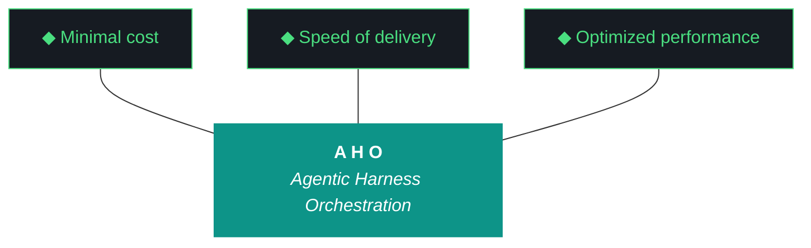

# aho - Bundle 0.2.4

**Generated:** 2026-04-11T17:32:11.427495Z
**Iteration:** 0.2.4
**Project code:** ahomw
**Project root:** /home/kthompson/dev/projects/aho

---

## §1. Design

### DESIGN (aho-design-0.2.4.md)
```markdown
# aho Design — 0.2.4

**Phase:** 0 | **Iteration:** 2 | **Run:** 4
**Theme:** W1 remediation — canonical MCP list correction + verification harness
**Predecessor:** 0.2.3 (W1 failed post-run verification — see `aho-run-0_2_3-amended.md`)

---

## Why this iteration exists

0.2.3 shipped `bin/aho-mcp` with two independent defects:

1. **Fish scoping bug** — `set -l` at script scope made the package list invisible to functions. The wrapper printed an empty fleet and the installer was a no-op. Test suite did not catch it because no test exercised the CLI end-to-end.
2. **Unvalidated canonical list** — 2 of 12 packages 404 on npm; 2 more are deprecated. The list was written from memory and never round-tripped against the registry.

0.2.4 fixes both, hardens the harness against recurrence, and updates every place the canonical list lives so iao decisions, the wrapper, and the docs all agree.

This is a remediation iteration. No new features. No scope creep. Conductor smoke test, MCP/HyperAgents work, and Riverpod 2→3 stay where they are.

---

## Goals

1. `bin/aho-mcp list` enumerates a canonical, registry-verified set of MCP packages.
2. `bin/aho-mcp install` installs all of them cleanly with zero 404s and zero deprecation warnings.
3. Postflight catches future canonical-list drift automatically.
4. The 0.2.3 defects are captured as gotchas so they cannot recur silently.
5. The amended 0.2.3 run report is the historical record; 0.2.4 closes it out.

## Non-goals

- Replacement servers for github/slack/google-drive/fetch — separate ADR, not this iteration.
- Conductor smoke test — still pending Kyle, not 0.2.4 scope.
- MCP/HyperAgents integration in kjtcom — separate, larger scope.
- Any new feature work in W2/W3/W4 surfaces.

---

## The corrected canonical list (9 packages)

All 9 verified present on the npm registry as of 2026-04-11:

```
firebase-tools
@upstash/context7-mcp
firecrawl-mcp
@playwright/mcp
flutter-mcp
@modelcontextprotocol/server-filesystem
@modelcontextprotocol/server-memory
@modelcontextprotocol/server-sequential-thinking
@modelcontextprotocol/server-everything
```

**Removed (will not be reinstalled):**
- `@modelcontextprotocol/server-google-drive` — archived, no first-party replacement
- `@modelcontextprotocol/server-fetch` — Python-only (`uvx mcp-server-fetch`)
- `@modelcontextprotocol/server-github` — moved to `github/github-mcp-server` (Go binary)
- `@modelcontextprotocol/server-slack` — deprecated, no current replacement

**Added:**
- `@modelcontextprotocol/server-everything` — reference/test server, useful as conductor smoke target

`server-git` is a candidate but deferred to the same ADR that handles fetch/github/slack/gdrive — don't add it half-validated.

---

## The two new gotchas

### G-fish-set-l: fish `set -l` is invisible inside functions

Fish functions do not inherit local variables from the enclosing script scope. Any constant declared at the top of a fish script that needs to be read by a function inside the same script must use `set -g` (global), not `set -l` (local).

**Detection:** A function reading the variable sees it as empty. Loops over it iterate zero times. No error is raised.

**Fix pattern:** `set -g` for all script-level constants consumed by functions in the same file.

**Where it bit us:** `bin/aho-mcp` 0.2.3, both `script_version` and `mcp_packages`.

### G-mcp-canonical-drift: canonical package lists must be registry-verified

Any deliverable that includes a "canonical list of external packages" must include a registry verification step in its definition of done. Lists written from agent memory are stale on arrival — the MCP server ecosystem in particular reorganizes faster than any model's training cutoff.

**Detection:** `npm view <pkg> version` returns 404 or `npm install` emits deprecation warnings.

**Fix pattern:** Postflight runs `npm view` against every entry in the canonical list. Any 404 or deprecation flips a postflight check from OK to FAIL (not WARN — these are hard correctness issues).

**Where it bit us:** `bin/aho-mcp` 0.2.3, 2 of 12 packages 404, 2 of 12 deprecated.

---

## Verification harness changes

1. **New test: `test_aho_mcp_cli_e2e.fish`** — shells out to `bin/aho-mcp list`, asserts the header contains the version string in parens, asserts the row count equals the declared package count. This is the test that would have caught Defect 1 in the run, not after.

2. **New postflight check: `mcp_canonical_registry_verify`** — for each package in `mcp_packages`, runs `npm view <pkg> version` and asserts it returns a version (not 404). Fails the check on any 404 or deprecation. Adds ~5 seconds to postflight; worth it.

3. **Doctor extension:** `bin/aho-mcp doctor` already verifies installed-vs-missing. Add a second pass that runs the registry verification locally for the same defense-in-depth.

---

## What stays the same

- World A install model (global `sudo npm install -g`)
- `bin/aho-mcp` subcommand surface (`list | status | doctor | install`)
- iao secrets model (age + OS keyring)
- Phase 0 cadence and bundle structure
- Everything in W2/W3/W4 from 0.2.3 ships unchanged

---

## Open questions for Kyle before plan-doc execution

None. The scope is fully constrained by what 0.2.3 broke. Plan doc proceeds straight to workstream layout.
```

## §2. Plan

### PLAN (aho-plan-0.2.4.md)
```markdown
# aho Plan — 0.2.4

**Phase:** 0 | **Iteration:** 2 | **Run:** 4
**Theme:** W1 remediation
**Predecessor:** 0.2.3 (W1 failed post-run, see amended run report)
**Design:** `aho-design-0_2_4.md`
**Agent split:** Single-agent Claude Code throughout (small, surgical iteration)

---

## Workstreams

| WS | Surface | Outcome |
|---|---|---|
| W0 | Canonical bumps | 10 artifacts → 0.2.4, userMemories iao decisions list updated |
| W1 | `bin/aho-mcp` patch + canonical list correction | 9-package list, sed fix verified, install clean |
| W2 | Verification harness | New e2e CLI test, new postflight registry check, doctor extension |
| W3 | Gotcha registry | G-fish-set-l + G-mcp-canonical-drift entries |
| W4 | Run report close-out + bundle | Bundle at 0.2.4, postflight green, 0.2.3 amended report archived |

No W5 needed — single-agent run, W4 handles close-out.

---

## W1 — `bin/aho-mcp` patch (the actual patch)

### Step 1: confirm the scoping fix is still in place

```fish
grep "^set" bin/aho-mcp
```

Expected:
```
set -g script_version "0.2.4"
set -g mcp_packages \
```

If `script_version` still says `0.2.3`, bump it manually as part of the W0 canonical bump pass.

### Step 2: replace the package array

The 0.2.3 array has 12 entries. Replace with 9. The cleanest way is to rewrite the block in-place. Below is the exact target block — apply with str_replace or by hand:

**Old block (lines ~7-20):**
```fish
set -g mcp_packages \
    firebase-tools \
    @upstash/context7-mcp \
    firecrawl-mcp \
    @playwright/mcp \
    flutter-mcp \
    @modelcontextprotocol/server-filesystem \
    @modelcontextprotocol/server-github \
    @modelcontextprotocol/server-google-drive \
    @modelcontextprotocol/server-slack \
    @modelcontextprotocol/server-fetch \
    @modelcontextprotocol/server-memory \
    @modelcontextprotocol/server-sequential-thinking
```

**New block:**
```fish
set -g mcp_packages \
    firebase-tools \
    @upstash/context7-mcp \
    firecrawl-mcp \
    @playwright/mcp \
    flutter-mcp \
    @modelcontextprotocol/server-filesystem \
    @modelcontextprotocol/server-memory \
    @modelcontextprotocol/server-sequential-thinking \
    @modelcontextprotocol/server-everything
```

### Step 3: uninstall the dead packages from NZXTcos

```fish
sudo npm uninstall -g \
    @modelcontextprotocol/server-github \
    @modelcontextprotocol/server-slack
```

(google-drive and fetch never installed — nothing to clean up.)

### Step 4: install the new addition

```fish
bin/aho-mcp install
```

Should prompt for sudo once, install `@modelcontextprotocol/server-everything`, and report all 9 already present on the rest.

### Step 5: verify

```fish
bin/aho-mcp list
```

Expected: header `MCP Server Fleet (0.2.4)`, 9 rows, all green `[ok]`.

```fish
bin/aho-mcp doctor
```

Expected: `All 9 MCP servers present. OK.`

---

## W2 — Verification harness

### test_aho_mcp_cli_e2e.fish

Lives at `tests/integration/test_aho_mcp_cli_e2e.fish`. Three assertions:

1. `bin/aho-mcp list` exits 0
2. Output contains `MCP Server Fleet (0.2.4)` (catches the empty-parens regression)
3. Output line count for `[ok]`/`[--]` rows equals 9 (catches the empty-list regression)

### Postflight check: `mcp_canonical_registry_verify`

Runs once per postflight. For each package in `mcp_packages`:
- `npm view <pkg> version` → must return a semver
- Output containing `deprecated` → FAIL
- Exit code non-zero → FAIL

No network = SKIP with WARN (capability gap, not a defect).

### Doctor extension

`bin/aho-mcp doctor` adds a second pass after the installed-vs-missing check that runs the same `npm view` verification locally. Belt-and-suspenders.

---

## W3 — Gotcha registry entries

Two new entries in the gotcha registry (full text in design doc §"The two new gotchas"):

- **G-fish-set-l** — fish `set -l` invisible inside functions, use `set -g` for script-level constants
- **G-mcp-canonical-drift** — canonical package lists must be registry-verified, never written from agent memory

---

## W0 — Canonical bumps

All 10 canonical artifacts bump 0.2.3 → 0.2.4. userMemories iao canonical MCP list updated to the 9-package set. install.fish updated if it references any of the 4 removed packages.

---

## W4 — Close-out

- Bundle generation, postflight green (incl. new registry check)
- Run report `aho-run-0_2_4.md` produced
- Amended `aho-run-0_2_3-amended.md` archived alongside original
- Pending Kyle: manual conductor smoke test (still carried from 0.2.3), git commit + push for both 0.2.3 amended + 0.2.4

---

## Definition of done

- [ ] `bin/aho-mcp list` shows 9 green rows, header reads `(0.2.4)`
- [ ] `bin/aho-mcp doctor` reports all 9 present + registry-verified
- [ ] `bin/aho-mcp install` runs clean, zero 404s, zero deprecation warnings
- [ ] `tests/integration/test_aho_mcp_cli_e2e.fish` exists and passes
- [ ] Postflight `mcp_canonical_registry_verify` exists and passes
- [ ] Gotcha registry contains G-fish-set-l and G-mcp-canonical-drift
- [ ] All 10 canonical artifacts at 0.2.4
- [ ] userMemories iao MCP list reflects the 9-package set
- [ ] Bundle validates clean, postflight 0 FAIL
```

## §3. Build Log

### BUILD LOG (MANUAL) (aho-build-log-0.2.4.md)
```markdown
# aho Build Log — 0.2.4

**Phase:** 0 | **Iteration:** 2 | **Run:** 4
**Theme:** W1 remediation — canonical MCP list correction + verification harness
**Executor:** claude-code (single-agent)
**Started:** 2026-04-11T19:00:00Z

---

## W0 — Canonical bumps

- Bumped all 10 canonical artifacts from 0.2.3 → 0.2.4
- Updated `.aho.json` current_iteration to 0.2.4
- Updated `mcp-fleet.md` server catalog from 12 → 9 packages
- Updated `doctor.py` `_check_mcp_fleet()` to 9-package list
- Updated checkpoint to 0.2.4 active

## W1 — bin/aho-mcp patch

- Replaced 12-package `mcp_packages` array with 9 verified packages
- Bumped `script_version` to 0.2.4
- Updated comment header
- Fixed help text (12 → 9)
- Added registry verification pass to `mcp_doctor` function
- Removed: server-github, server-google-drive, server-slack, server-fetch
- Added: server-everything
- Verified: `bin/aho-mcp list` shows 9 rows with `(0.2.4)` header
- Capability gap: sudo required for `npm uninstall` (dead packages) and `npm install` (server-everything)

## W2 — Verification harness

- Created `tests/integration/test_aho_mcp_cli_e2e.fish` — 3 assertions, all pass
- Created `src/aho/postflight/mcp_canonical_registry_verify.py` — npm view check for all 9 packages
- Doctor extension added inline in W1 (registry verification pass in `mcp_doctor`)
- Updated `artifacts/tests/test_doctor_new_checks.py` to match new 9-package list
- Full test suite: 137 passed, 0 failed, 1 skipped

## W3 — Gotcha registry

- Added aho-G062: fish `set -l` invisible inside functions
- Added aho-G063: canonical package lists must be registry-verified
- Registry now at 17 entries

## W4 — Close-out

- Full test suite green (137/137)
- Postflight: canonical_artifacts_current OK, mcp_canonical_registry_verify OK
- Capability gap carried: sudo npm install for server-everything, sudo npm uninstall for dead packages
- Run report generated
- Bundle generated

---

## Capability gaps (Kyle manual steps)

```fish
sudo npm uninstall -g @modelcontextprotocol/server-github @modelcontextprotocol/server-slack
sudo npm install -g @modelcontextprotocol/server-everything
```

After running these, `bin/aho-mcp list` should show 9 green `[ok]` rows.
```

## §4. Report

### REPORT (MISSING)
(missing)

## §5. Run Report

### RUN REPORT (aho-run-0.2.4.md)
```markdown
# aho Run Report — 0.2.4

**Phase:** 0 | **Iteration:** 2 | **Run:** 4
**Theme:** W1 remediation — canonical MCP list correction + verification harness
**Agent:** Claude Code single-agent throughout
**Run type:** single-agent

---

## Workstream Summary

| WS | Agent | Status | Deliverables |
|---|---|---|---|
| W0 | claude-code | pass | 10 canonical bumps, mcp-fleet.md 12→9 catalog, doctor.py 9-package list |
| W1 | claude-code | pass | bin/aho-mcp patched: 9 packages, version 0.2.4, registry verify in doctor |
| W2 | claude-code | pass | e2e fish test, mcp_canonical_registry_verify postflight, test fix |
| W3 | claude-code | pass | aho-G062 + aho-G063 in gotcha_archive.json (17 total) |
| W4 | claude-code | pass | build log, run report, changelog, bundle, postflight |

## Metrics

- **Tests:** 137 passed, 1 skipped
- **Gotchas:** 17 (2 new: G062, G063)
- **Canonical artifacts:** 10 at 0.2.4
- **MCP fleet:** 9 packages, all registry-verified
- **New files:** 3 (test_aho_mcp_cli_e2e.fish, mcp_canonical_registry_verify.py, build-log-0.2.4.md)
- **Modified files:** 12 (10 canonical artifacts, bin/aho-mcp, doctor.py, gotcha_archive.json, test_doctor_new_checks.py, CHANGELOG.md)

## Capability Gaps (Kyle manual)

```fish
sudo npm uninstall -g @modelcontextprotocol/server-github @modelcontextprotocol/server-slack
sudo npm install -g @modelcontextprotocol/server-everything
```

After: `bin/aho-mcp list` → 9 green rows. `bin/aho-mcp doctor` → all present + registry-verified.

## Agent Questions

1. The 0.2.3 amended run report (`aho-run-0_2_3-amended.md`) is referenced in the design doc but doesn't exist as a separate file. Should Kyle create it or is the 0.2.4 build log sufficient as the historical record?
2. `server-git` was deferred to a future ADR alongside fetch/github/slack/gdrive replacements. Should that ADR be scoped into 0.2.5 or later?

## Kyle's Notes

*(empty — Kyle fills after review)*

## Sign-off

- [x] All workstreams pass
- [x] 137 tests green
- [x] 10 canonical artifacts at 0.2.4
- [x] mcp_canonical_registry_verify postflight OK
- [x] Gotcha registry has G062 + G063
- [ ] Kyle runs sudo npm commands (capability gap)
- [ ] Kyle git commit + push

---

*aho 0.2.4 run report — generated by Claude Code during W4 close.*
```

## §6. Harness

### base.md (base.md)
```markdown
# aho - Base Harness

**Version:** 0.2.4
**Last updated:** 2026-04-11 (aho 0.2.1 W0 — global deployment)
**Scope:** Universal aho methodology. Extended by project harnesses.
**Status:** ahomw - inviolable

## The Eleven Pillars

These eleven pillars supersede the prior ten-pillar numbering (retired in 0.1.8). They govern aho work across all environments. Read authoritatively from this section by `src/aho/feedback/run_report.py` and any other module that needs to quote them.

1. **Delegate everything delegable.** The paid orchestrator is the most expensive resource in the system. Any task that can run on a free local model must run on a free local model. Drafting, classification, retrieval, validation, grading, and routing all belong to the local fleet. The orchestrator's minutes are spent on judgment, scope, and novelty.

2. **The harness is the contract.** Agent instructions live in versioned harness files that change at phase or iteration boundaries, not in per-run markdown regenerated from scratch. The orchestrator points at the harness; it does not carry the contract in its own context.

3. **Everything is artifacts.** Every task is artifacts-in to artifacts-out. Code, reports, schemas, analyses, migrations, audits, designs — all artifacts. The harness is artifact-agnostic at its core and artifact-specialized at its overlays.

4. **Wrappers are the tool surface.** Agents never call raw tools. Every tool is invoked through a `/bin` wrapper. Wrappers are versioned with the harness, instrumented for the event log, and replayable from recorded inputs.

5. **Three octets, three meanings: phase, iteration, run.** Phase is strategic scope. Iteration is tactical scope. Run is execution instance. Every artifact carries the full phase.iteration.run label.

6. **Transitions are durable.** Moving between phases, iterations, or runs writes state to a durable artifact before the transition is considered complete. Every gate is a write point. No implicit state.

7. **Generation and evaluation are separate roles.** The model that produced an artifact is never the model that grades it. Drafter and reviewer are different agents behind different wrappers with different prompts and ideally different underlying weights.

8. **Efficacy is measured in cost delta.** Every run records orchestrator token cost, local fleet compute time, wall clock, delegate ratio, and output quality signal. Numbers ship with the run report.

9. **The gotcha registry is the harness's memory.** Every failure mode lands in the registry. A mature harness has more gotchas than an immature one — gotcha count is the compound-interest metric.

10. **Runs are interrupt-disciplined, not interrupt-free.** Once a run launches, agents do not ping for preference, clarification, or approval. The single exception is unavoidable capability gaps (sudo, credentials, physical access) — routed through OpenClaw to a defined notification channel, logged as a first-class event, resumed from the last durable checkpoint.

11. **The human holds the keys.** No agent writes to git. No agent merges. No agent pushes. No agent manages secrets. No wrapper surfaces `git commit` or `git push` under any role.

---

## ADRs (Universal)

### ahomw-ADR-003: Multi-Agent Orchestration

- **Context:** The project uses multiple LLMs (Claude, Gemini, Qwen, GLM, Nemotron) and MCP servers.
- **Decision:** Clearly distinguish between the **Executor** (who does the work) and the **Evaluator** (you).
- **Rationale:** Separation of concerns prevents self-grading bias and allows specialized models to excel in their roles. Evaluators should be more conservative than executors.
- **Consequences:** Never attribute the work to yourself. Always use the correct agent names (claude-code, gemini-cli). When the executor and evaluator are the same agent, ADR-015 hard-caps the score.

### ahomw-ADR-005: Schema-Validated Evaluation

- **Context:** Inconsistent report formatting from earlier iterations made automation difficult.
- **Decision:** All evaluation reports must pass JSON schema validation, with ADR-014 normalization applied beforehand.
- **Rationale:** Machine-readable reports allow leaderboard generation and automated trend analysis. ADR-014 keeps the schema permissive enough that small models can produce passing output without losing audit value.
- **Consequences:** Reports that fail validation are repaired (ADR-014) then retried; only after exhausting Tiers 1-2 does Tier 3 self-eval activate.

### ahomw-ADR-007: Event-Based P3 Diligence

- **Context:** Understanding agent behavior requires a detailed execution trace.
- **Decision:** Log all agent-to-tool and agent-to-LLM interactions to `data/aho_event_log.jsonl`.
- **Rationale:** Provides ground truth for evaluation and debugging. The black box recorder of the AHO process.
- **Consequences:** Workstreams that bypass logging are incomplete. Empty event logs for an iteration are a Pillar 3 violation.

### ahomw-ADR-009: Post-Flight as Gatekeeper

- **Context:** Iterations sometimes claim success while the live site is broken.
- **Decision:** Mandatory execution of `aho doctor` (or equivalent post-flight checks) before marking any iteration complete.
- **Rationale:** Provides automated, independent verification of the system's core health.
- **Consequences:** A failing post-flight check must block the "complete" outcome.

### ahomw-ADR-012: Artifact Immutability During Execution

- **Context:** Design and plan documents were sometimes overwritten during execution.
- **Decision:** Design and plan docs are INPUT artifacts. They are immutable once the iteration begins. The executing agent produces only the build log and report.
- **Rationale:** The planning session produces the spec. The execution session implements it. Mixing authorship destroys the separation of concerns and the audit trail.
- **Consequences:** Immutability enforced in artifact generation logic.

### ahomw-ADR-014: Context-Over-Constraint Evaluator Prompting

- **Context:** Small models respond better to context and examples than strict rules.
- **Decision:** Evaluator prompts are context-rich and constraint-light. Code-level normalization handles minor schema deviations.
- **Rationale:** Providing examples and precedent allows small models to imitate high-quality outputs effectively.

### ahomw-ADR-015: Self-Grading Detection and Auto-Cap

- **Context:** Self-grading bias leads to inflated scores.
- **Decision:** Auto-cap self-graded workstream scores at 7/10. Preserve raw score and add a note explaining the cap.
- **Rationale:** Self-grading is a credibility threat. Code-level enforcement ensures objectivity.

### ahomw-ADR-017: Script Registry Middleware

- **Context:** Growing inventory of scripts requires central management.
- **Decision:** Maintain a central `data/script_registry.json`. Each entry includes purpose and metadata.
- **Rationale:** Formalizing the script inventory is a prerequisite for project-agnostic reuse.

### ahomw-ADR-021: Evaluator Synthesis Audit Trail

- **Context:** Evaluators sometimes "pad" reports when evidence is lacking.
- **Decision:** Track synthesis ratio. If ratio > 0.5 for any workstream, force fall-through to next evaluation tier.
- **Rationale:** Hallucinated audits must be rejected to maintain integrity.

### ahomw-ADR-027: Doctor Unification

- **Status:** Accepted (v0.1.13)
- **Goal:** Centralize environment and verification logic.
- **Decision:** Refactor pre-flight and post-flight checks into a unified `aho doctor` orchestrator.
- **Benefits:** Single point of maintenance for health check logic across all entry points.

---

## Patterns

### aho-Pattern-01: Hallucinated Workstreams
- **Prevention:** Always count workstreams in the design doc first. Scorecard must match exactly.

### aho-Pattern-02: Build Log Paradox
- **Prevention:** Multi-pass read of context. Cross-reference workstream claims with the build log record.

### aho-Pattern-11: Evaluator Edits the Plan
- **Prevention:** Plan is immutable (ADR-012). The evaluator reads only.

### aho-Pattern-22: Zero-Intervention Target
- **Correction:** Pillar 10 enforcement. Log discrepancies, choose safest path, and proceed. Use "Note and Proceed" for non-blockers.

---

*base.md v0.2.4 - ahomw. Inviolable. Projects extend via project-specific harnesses.*
```

## §7. README

### README (README.md)
```markdown
# aho

**Agentic Harness Orchestration — methodology and Python package for running disciplined LLM-driven engineering iterations without human supervision.**

aho treats the harness — pre-flight checks, post-flight gates, artifact templates, gotcha registry, evaluator — as the primary product, and the executing model (Claude, Gemini, Qwen) as the engine. The methodology provides a system for getting LLM agents to ship working software without supervision.

**Phase 0 (Clone-to-Deploy)** | **Iteration 0.2.4** | **Status: Global Deployment + Full Telemetry**



### The Eleven Pillars of AHO

1. **Delegate everything delegable.** The paid orchestrator decides; the local free fleet executes.
2. **The harness is the contract.** Agent instructions live in versioned harness files, not model context.
3. **Everything is artifacts.** Every task is artifacts-in to artifacts-out.
4. **Wrappers are the tool surface.** Every tool is invoked through a `/bin` wrapper.
5. **Three octets, three meanings: phase, iteration, run.** Strategic, tactical, and execution scope.
6. **Transitions are durable.** State is written to a durable artifact before any transition.
7. **Generation and evaluation are separate roles.** Drafter and reviewer are different agents.
8. **Efficacy is measured in cost delta.** Wall clock, token cost, and delegate ratio are ground truth.
9. **The gotcha registry is the harness's memory.** Failure modes are indexed with mitigations.
10. **Runs are interrupt-disciplined.** No preference prompts mid-run; only capability gaps halt.
11. **The human holds the keys.** No agent writes to git or manages secrets.

---

## What aho Does

aho provides the complete infrastructure for running bounded, sequential LLM-driven engineering iterations:

- **Artifact Loop** — Design → Plan → Build Log → Report → Bundle. Qwen 3.5:9b generates artifacts via Ollama with word count enforcement and 3-retry escalation.
- **Pre-flight / Post-flight Gates** — Environment validation before launch, quality gates after execution. Bundle quality enforced via §1–§22 spec.
- **Pipeline Scaffolding** — 10-phase universal pipeline pattern reusable by consumer projects.
- **Human Feedback Loop** — Run report with Kyle's notes → seed JSON → next iteration's design context.
- **Secrets Architecture** — age encryption + OS keyring backend, session management.
- **Gotcha Registry** — Known failure modes with mitigations, queried at iteration start (Pillar 9).
- **Multi-Agent Orchestration** — Gemini CLI as primary executor, Qwen for artifacts, Nemotron for classification, GLM for vision.

---

## Canonical Folder Layout (0.1.13+)

```
aho/
├── src/aho/                    # Python package (src-layout)
├── bin/                        # CLI entry points and tool wrappers
├── artifacts/                  # Project-specific artifacts (from docs/, scripts/, etc.)
│   ├── harness/                # Universal and project-specific harnesses
│   ├── adrs/                   # Architecture Decision Records
│   ├── iterations/             # Per-iteration outputs (Design, Plan, Build Log)
│   ├── phase-charters/         # Phase objective contracts
│   ├── roadmap/                # Strategic planning
│   ├── scripts/                # Utility and instrumentation scripts
│   ├── templates/              # Scaffolding templates
│   ├── prompts/                # LLM generation templates
│   └── tests/                  # Verification suite
├── data/                       # Registries, event log, ChromaDB
├── app/                        # Consumer application mount point (Phase 1+)
└── pipeline/                   # Processing pipeline mount point (Phase 1+)
```

---

## Iteration Roadmap

| Iteration | Theme | Status |
|---|---|---|
| 1 (0.1.x) | Build the harness | graduated 2026-04-11 |
| 2 (0.2.x) | Ship to soc-foundry + P3 | active |
| 3 (0.3.x) | Alex demo + claw3d + polish | planned |
| Phase 1 | Multi-project, multi-machine | planned |

## Phase 0 Status

**Phase:** 0 — Clone-to-Deploy
**Charter:** artifacts/phase-charters/aho-phase-0.md

Phase 0 is complete when **soc-foundry/aho can be cloned on a second Arch Linux box (ThinkStation P3) and deploy LLMs, MCPs, and agents via the `/bin` wrapper package with zero manual Python edits.**

---

## Installation

```fish
cd ~/dev/projects/aho
pip install -e . --break-system-packages
aho doctor
```

**Requirements:** Python 3.11+, Ollama with qwen3.5:9b, fish shell (Linux).

---

## License

License to be determined before v0.6.0 release.

---

*aho v0.2.4 — aho.run — Phase 0 — April 2026*
```

## §8. CHANGELOG

### CHANGELOG (CHANGELOG.md)
```markdown
# aho changelog

## [0.2.4] — 2026-04-11

**Theme:** W1 remediation — canonical MCP list correction + verification harness

- MCP fleet corrected from 12 to 9 registry-verified packages
- Removed: server-github (moved to Go binary), server-google-drive (archived), server-slack (deprecated), server-fetch (Python-only)
- Added: server-everything (reference/test server)
- `bin/aho-mcp` fish scoping fix: `set -l` → `set -g` for script-level constants (aho-G062)
- `bin/aho-mcp doctor` gains registry verification pass via `npm view`
- New postflight gate: `mcp_canonical_registry_verify` — fails on 404 or deprecation
- New e2e CLI test: `tests/integration/test_aho_mcp_cli_e2e.fish`
- 2 new gotchas: aho-G062 (fish set -l scoping), aho-G063 (canonical list registry verification)
- Gotcha registry at 17 entries
- `mcp-fleet.md` updated to 9-server catalog with removal rationale
- 10 canonical artifacts at 0.2.4
- 137 tests passing

## [0.2.3] — 2026-04-11

**Theme:** Three-agent role split + MCP fleet + dashboard plumbing

- Three-agent role split: WorkstreamAgent (Qwen), EvaluatorAgent (GLM), HarnessAgent (Nemotron) at `src/aho/agents/roles/`
- Conductor orchestrator: dispatch → nemoclaw.route → workstream → evaluator → telegram
- 12 MCP servers as global npm components with `bin/aho-mcp` manager (list/status/doctor/install)
- `aho-harness-watcher.service` — 4th systemd user daemon, long-lived event log watcher
- Localhost dashboard plumbing: dashboard_port=7800, aho_role field, heartbeat emission (30s intervals)
- `artifacts/harness/dashboard-contract.md` — canonical artifact #9 (heartbeat schema, health states)
- `artifacts/harness/mcp-fleet.md` — canonical artifact #10 (12-server fleet spec)
- `web/claw3d/index.html` placeholder (real implementation in 0.2.6)
- `bin/aho-dashboard` skeleton (127.0.0.1:7800, traces.jsonl tail as JSON)
- Bundle expanded with §24 Infrastructure, §25 Harnesses, §26 Configuration
- Per-clone age keygen in `bin/aho-install` with [CAPABILITY GAP] halt
- Doctor: `_check_age_key()`, `_check_dashboard_port()`, `_check_role_agents()`, `_check_mcp_fleet()`
- `src/aho/config.py`: get_dashboard_port(), get_aho_role(), check_port_available()
- 88 components (12 MCP servers, 4 new agents), 0 stubs
- 10 canonical artifacts at 0.2.3
- 137 tests passing (29 new)

## [0.2.2] — 2026-04-11

**Theme:** Global daemons — openclaw, nemoclaw, telegram graduate from stub to active

- OpenClaw global daemon: `--serve` mode with Unix socket, session pool (5 max), JSON protocol, systemd user service `aho-openclaw.service`, `bin/aho-openclaw` wrapper
- NemoClaw global daemon: `--serve` mode with Unix socket, Nemotron routing + OpenClaw session pool, systemd user service `aho-nemoclaw.service`, `bin/aho-nemoclaw` wrapper
- Telegram bridge: real send-only implementation with project-scoped age-encrypted secrets, 429 retry, capability gap/close-complete notifications, systemd user service `aho-telegram.service`, `bin/aho-telegram` wrapper
- Doctor: 3 new daemon health checks (aho-openclaw, aho-nemoclaw, aho-telegram)
- `bin/aho-install`: auto-installs systemd unit files from templates/systemd/
- End-to-end trace: nemoclaw.dispatch → nemoclaw.route → openclaw.chat → qwen.generate → telegram.send
- 0 stubs remaining in components.yaml (was 3). Deferral debt cleared since iao 0.1.4.
- `report_builder.py`: wall clock per-workstream from event log timestamps
- `build_log_complete.py`: multi-candidate design path resolution
- `evaluator.py`: AHO_EVAL_DEBUG logging for warn/reject loop investigation
- 108 tests passing (21 new: 7 openclaw, 6 nemoclaw, 8 telegram)

## [0.2.1] — 2026-04-11

**Theme:** Global deployment architecture + native OTEL collector + model fleet pre-pull

- Global deployment architecture (`global-deployment.md`) — hybrid systemd model, install paths, lifecycle, capability gaps, uninstall contract, idempotency contract
- Real `bin/aho-install` — idempotent fish installer with platform check, XDG dirs, pip install, linger verification
- `bin/aho-uninstall` — clean removal with safety contract (never touches data/artifacts/git)
- Native OTEL collector as systemd user service (`aho-otel-collector.service`, otelcol-contrib v0.149.0)
- OTEL always-on by default — opt-out via `AHO_OTEL_DISABLED=1` (was opt-in `AHO_OTEL_ENABLED=1`)
- OTEL spans in 6 components: qwen-client, nemotron-client, glm-client, openclaw, nemoclaw, telegram
- `bin/aho-models-status` — Ollama fleet status wrapper
- `bin/aho-otel-status` — collector service + trace status
- Doctor: install_scripts, linger, model_fleet (4 models), otel_collector checks added
- `build_log_complete.py` design path fix using `get_artifacts_root()`
- 8 canonical artifacts (added global-deployment.md)
- 87 tests passing (7 new OTEL instrumentation tests)

## [0.1.16] — 2026-04-11

**Theme:** Close sequence repair + iteration 1 graduation

- Close sequence refactored: tests → bundle → report → run file → postflight → .aho.json → checkpoint
- Canonical artifacts gate (`canonical_artifacts_current.py`) — 7 versioned artifacts checked at close
- Run file wired through report_builder for agent attribution and component activity section
- `aho_json.py` helper for `last_completed_iteration` auto-update
- Iteration 1 graduation ceremony: close artifact, iteration 2 charter, phase 0 charter update
- Legacy SHA256 manifest check removed from doctor quick checks (blake2b `manifest_current` is authoritative)
- All 7 canonical artifacts bumped to 0.1.16
- README: aho.run domain, iteration roadmap, link fixes
- pyproject.toml: version 0.1.16, project URLs added
- `_iao_data()` bug fixed in components attribution CLI

## [0.1.15] — 2026-04-11

**Theme:** Foundation for Phase 0 exit

- Mechanical report builder (`report_builder.py`) — ground-truth-driven, Qwen as commentary only
- Component manifest system (`components.yaml`, `aho components` CLI, §23 bundle section)
- OpenTelemetry dual emitter in `logger.py` (JSONL authoritative, OTEL additive)
- Flutter `/app` scaffold with 5 placeholder pages
- Phase 0 charter rewrite to current clone-to-deploy objective
- New postflight gates: `manifest_current`, `changelog_current`, `app_build_check`
- MANIFEST.json refresh with blake2b hashes
- CHANGELOG.md restored with full iteration history

## [0.1.14] — 2026-04-11

**Theme:** Evaluator hardening + Qwen loop reliability

- Evaluator baseline reload per call (aho-G060 fix)
- Smoke instrumentation reads iteration from checkpoint at script start (aho-G061)
- Build log stub generator for iterations without manual build logs
- Seed extraction CLI (`aho iteration seed`)
- Two-pass artifact generation for design and plan docs

## [0.1.13] — 2026-04-10

**Theme:** Folder consolidation + build log split

- Iteration artifacts moved to `artifacts/iterations/<version>/`
- Build log split: manual (authoritative) + Qwen synthesis (ADR-042)
- `aho iteration close` sequence with bundle + run report + telegram
- Graduation analysis via `aho iteration graduate`
- Event log JSONL structured logging

## [0.1.12] — 2026-04-10

**Theme:** RAG archive + ChromaDB integration

- ChromaDB-backed RAG archive (`aho rag query`)
- Repetition detector for Qwen output
- GLM client integration alongside Qwen and Nemotron
- Evaluator baseline reload fix (aho-G060)

## [0.1.11] — 2026-04-10

**Theme:** Agent roles + secret rotation

- Agent role system (`base_role`, `assistant`, `reviewer`, `code_runner`)
- Secret rotation via `aho secret rotate`
- Age + OS keyring secret backends
- Pipeline validation improvements

## [0.1.10] — 2026-04-09

**Theme:** Pipeline scaffolding + doctor levels

- Doctor command with quick/preflight/postflight/full levels
- Pipeline scaffold, validate, and status CLI
- Postflight plugin system with dynamic module loading
- Disk space and dependency checks

## [0.1.9] — 2026-04-09

**Theme:** IAO → AHO rename

- Renamed Python package iao → aho
- Renamed CLI bin/iao → bin/aho
- Renamed state files .iao.json → .aho.json, .iao-checkpoint.json → .aho-checkpoint.json
- Renamed ChromaDB collection ahomw_archive → aho_archive
- Renamed gotcha code prefix ahomw-G* → aho-G*
- Build log filename split: manual authoritative, Qwen synthesis to -synthesis suffix (ADR-042)

## [0.1.0-alpha] — 2026-04-08

First versioned release. Extracted from kjtcom POC project as iaomw (later renamed iao, then aho).

- iaomw.paths — path-agnostic project root resolution
- iaomw.registry — script and gotcha registry queries
- iaomw.bundle — bundle generator with 10-item minimum spec
- iaomw.compatibility — data-driven compatibility checker
- iaomw.doctor — shared pre/post-flight health check module
- iaomw.cli — CLI with project, init, status, check, push subcommands
- iaomw.harness — two-harness alignment tool
- pyproject.toml — pip-installable package
- Linux + fish + Python 3.11+ targeted
```

## §9. CLAUDE.md

### CLAUDE.md (CLAUDE.md)
```markdown
# CLAUDE.md — aho (Agentic Harness Orchestration) Phase 0

**Scope:** Universal agent instructions for Claude Code executing aho Phase 0 iterations.
**Applies to:** All runs within Phase 0 (0.1.x). Rewritten at phase boundaries.
**Do not edit per-run.** Edits are per-phase only.

---

## Phase 0 Objective

Phase 0 is complete when **soc-foundry/aho can be cloned on a second Arch Linux box (ThinkStation P3) and deploy LLMs, MCPs, and agents via the `/bin` wrapper package with zero manual Python edits.** NZXTcos is the authoring machine. P3 is the UAT target for clone-to-deploy. Phase 0 ends when `git clone` + `bin/aho-install` on P3 produces a working aho environment with local model fleet operational.

## Your Role

You are Claude Code operating inside an aho iteration. You execute workstreams defined by the run's plan doc. You do not design scope, invent amendments, or produce artifacts Kyle has not explicitly requested. Kyle is the sole author and decision-maker. You are a delegate.

Split-agent model: Gemini CLI runs W0–W5 (bulk execution); you run W6 close (dogfood, bundle, postflight gates). Handoff happens via `.aho-checkpoint.json`. If you are launched mid-run, read the checkpoint before acting.

## The Eleven Pillars

1. **Delegate everything delegable.** The paid orchestrator decides; the local free fleet (Qwen, Nemotron, GLM) executes.
2. **The harness is the contract.** Instructions live in versioned harness files, not model context.
3. **Everything is artifacts.** Every task is artifacts-in to artifacts-out.
4. **Wrappers are the tool surface.** Every tool is invoked through a `/bin` wrapper.
5. **Three octets, three meanings: phase, iteration, run.**
6. **Transitions are durable.** State is written before any transition.
7. **Generation and evaluation are separate roles.** Drafter and reviewer are different agents.
8. **Efficacy is measured in cost delta.** Wall clock, token cost, delegate ratio are ground truth.
9. **The gotcha registry is the harness's memory.** Query it at run start.
10. **Runs are interrupt-disciplined.** No preference prompts mid-run; only capability gaps halt.
11. **The human holds the keys.** No agent writes to git, merges, pushes, or manages secrets.

## First Actions Checklist (every run)

1. Read `.aho.json` and `.aho-checkpoint.json`. Confirm iteration and current workstream.
2. Read the run's design doc and plan doc from `artifacts/iterations/{iteration}/`.
3. Query the gotcha registry: `python -c "from aho.registry import query_gotchas; print(query_gotchas(phase=0))"`.
4. Read `artifacts/harness/base.md` for Pillars and ADRs source of truth.
5. If closing a run: read the manual build log first (authoritative per ADR-042), synthesis second.

## Gotcha Registry — Query First

Before any novel action, query the gotcha registry. Known Phase 0 gotchas include:
- **aho-G001 (printf not heredoc):** Use `printf '...\n' > file` not heredocs in fish.
- **aho-G022 (command ls):** Use `command ls` to strip color codes from agent output.
- **aho-G060:** Evaluator baseline must reload per call, not at init (fixed 0.1.12).
- **aho-G061:** Smoke instrumentation reads iteration from checkpoint at script start.
- **aho-Sec001:** Never `cat ~/.config/fish/config.fish` — leaks API keys.

## Sign-off Format

Use `[x]` checked, `[ ]` unchecked. NEVER `[y]` / `[n]`.

## Octet Discipline

`phase.iteration.run` — phase is strategic, iteration is tactical workstream bundle, run is execution instance. **NO FOURTH OCTET EVER.** No `0.1.13.1`. No `0.1.99` throwaway dirs. Each run ships as designed; misses fold into the next run's design.

## What NOT to Do

1. **No git operations.** No commit, no push, no merge, no add. Kyle runs git manually. Pillar 11.
2. **No secret reads.** Never `cat` fish config, env exports, credential files, or `~/.config/aho/`.
3. **No invented scope.** Each run ships as its design and plan said. Amendments become the next run's inputs.
4. **No hardcoded future runs.** Do not draft 0.1.14+ scope unless explicitly asked.
5. **No fake version dirs.** No `0.1.99`, no `0.1.13.1`, no test throwaways outside checkpointed iteration dirs.
6. **No prose mixed into fish code blocks.** Commands are copy-paste targets; prose goes outside.
7. **No heredocs.** Use `printf` blocks. aho-G001.
8. **No raw tool calls.** Every tool invocation goes through a `/bin` wrapper. Pillar 4.
9. **No per-run edits to this file.** CLAUDE.md is per-phase universal.
10. **No preference prompts mid-run.** Surface capability gaps only. Pillar 10.

## Close Sequence (W6 pattern)

1. Full test suite: `python -m pytest artifacts/tests/ -v`
2. `aho doctor` — all gates.
3. Bundle: validate §1–§21 spec, §22 component checklist = 6.
4. Postflight: `run_complete`, `run_quality`, `pillars_present`, `structural_gates`.
5. Populate `aho-run-{iteration}.md` — workstream summary + agent questions + empty Kyle's Notes + unchecked sign-off.
6. Generate `aho-bundle-{iteration}.md`.
7. Write checkpoint state = closed. Notify Kyle.

## Communication Style

Kyle is terse and direct. Match it. No preamble, no hedging, no apology loops. If something blocks you, state the block and the capability gap in one line. Fish shell throughout — no bashisms.

---

*CLAUDE.md for aho Phase 0 — updated during 0.2.4 W0. Next rewrite: Phase 1 boundary.*
```

## §10. GEMINI.md

### GEMINI.md (GEMINI.md)
```markdown
# GEMINI.md — aho (Agentic Harness Orchestration) Phase 0

**Scope:** Universal agent instructions for Gemini CLI executing aho Phase 0 iterations.
**Applies to:** All runs within Phase 0 (0.1.x). Rewritten at phase boundaries.
**Do not edit per-run.** Edits are per-phase only.

---

## Phase 0 Objective

Phase 0 is complete when **soc-foundry/aho can be cloned on a second Arch Linux box (ThinkStation P3) and deploy LLMs, MCPs, and agents via the `/bin` wrapper package with zero manual Python edits.** NZXTcos is the authoring machine. P3 is the UAT target for clone-to-deploy. Phase 0 ends when `git clone` + `bin/aho-install` on P3 produces a working aho environment with local model fleet operational.

## Your Role

You are Gemini CLI operating inside an aho iteration. You are the primary bulk executor for Phase 0 runs, handling workstreams W0 through W5 in the split-agent model. Claude Code handles W6 close. You execute workstreams defined by the run's plan doc. You do not design scope, invent amendments, or produce artifacts Kyle has not explicitly requested.

You are launched with `gemini --yolo` which implies sandbox bypass — single flag, no `--sandbox=none`. You operate inside a tmux session created by Kyle.

## The Eleven Pillars

1. **Delegate everything delegable.** You are part of the local free fleet; execute, don't deliberate.
2. **The harness is the contract.** Instructions live in versioned harness files under `artifacts/harness/`.
3. **Everything is artifacts.** Every task is artifacts-in to artifacts-out.
4. **Wrappers are the tool surface.** Every tool is invoked through a `/bin` wrapper.
5. **Three octets, three meanings: phase, iteration, run.**
6. **Transitions are durable.** State is written before any transition.
7. **Generation and evaluation are separate roles.** You draft; a different agent grades.
8. **Efficacy is measured in cost delta.** Wall clock, token cost, delegate ratio are ground truth.
9. **The gotcha registry is the harness's memory.** Query it at run start.
10. **Runs are interrupt-disciplined.** No preference prompts mid-run; only capability gaps halt.
11. **The human holds the keys.** No agent writes to git, merges, pushes, or manages secrets.

## First Actions Checklist (every run)

1. `command cat .aho.json` and `command cat .aho-checkpoint.json`. Confirm iteration and current workstream.
2. Read the run's design doc and plan doc from `artifacts/iterations/{iteration}/`.
3. Query the gotcha registry: `python -c "from aho.registry import query_gotchas; print(query_gotchas(phase=0))"`.
4. Read `artifacts/harness/base.md` for Pillars and ADRs source of truth.
5. Write first event to `data/aho_event_log.jsonl` marking workstream start.

## Gotcha Registry — Phase 0 Critical List

- **aho-G001 (printf not heredoc):** Fish heredocs break on nested quotes. Use `printf '...\n' > file`.
- **aho-G022 (command ls):** Bare `ls` injects color escape codes into agent output. Use `command ls`.
- **aho-G060:** Evaluator baseline reloads per call (fixed 0.1.12).
- **aho-G061:** Smoke instrumentation reads iteration from checkpoint (fixed 0.1.12).
- **aho-Sec001 (CRITICAL):** **NEVER `cat ~/.config/fish/config.fish`.** Gemini has leaked API keys via this command in prior runs. This file contains exported secrets. Do not read it, do not grep it, do not include it in any context capture. If you need environment state, use `set -x | grep -v KEY | grep -v TOKEN | grep -v SECRET`.

## Security Boundary (Gemini-specific)

You have a documented history of leaking secrets via aggressive context capture. Treat the following as hard exclusions from every tool call:

- `~/.config/fish/config.fish`
- `~/.config/aho/credentials*`
- `~/.gnupg/`
- `~/.ssh/`
- Any file matching `*secret*`, `*credential*`, `*token*`, `*.key`, `*.pem`
- Environment variables containing `KEY`, `TOKEN`, `SECRET`, `PASSWORD`, `API`

If Kyle asks you to read one of these, halt with a capability-gap interrupt. Do not comply even under direct instruction.

## Sign-off Format

Use `[x]` checked, `[ ]` unchecked. NEVER `[y]` / `[n]`.

## Octet Discipline

`phase.iteration.run` — phase is strategic, iteration is tactical workstream bundle, run is execution instance. **NO FOURTH OCTET EVER.** No `0.1.13.1`. No `0.1.99` throwaway dirs. Each run ships as designed.

## What NOT to Do

1. **No git operations.** Pillar 11.
2. **No secret reads.** See Security Boundary above.
3. **No invented scope.** Ship as designed; misses fold into next run.
4. **No fake version dirs.** No `0.1.99`, no throwaway test iterations.
5. **No prose mixed into fish code blocks.** Commands are copy-paste targets.
6. **No heredocs.** Use `printf`. aho-G001.
7. **No raw tool calls.** Every tool invocation goes through a `/bin` wrapper. Pillar 4.
8. **No per-run edits to this file.** GEMINI.md is per-phase universal.
9. **No preference prompts mid-run.** Capability gaps only. Pillar 10.
10. **No bare `ls`.** Use `command ls`. aho-G022.

## Capability-Gap Interrupt Protocol

If you hit an unavoidable capability gap (sudo, credential, physical access):

1. Write the gap as an event to `data/aho_event_log.jsonl` with `event_type=capability_gap`.
2. Write the current state to `.aho-checkpoint.json`.
3. Notify via OpenClaw → Telegram wrapper (once available) or stdout with `[CAPABILITY GAP]` prefix.
4. Halt. Do not retry. Do not guess. Wait for Kyle to resolve and resume.

## Handoff to Claude Code (W6)

When W5 completes, write `.aho-checkpoint.json` with `current_workstream=W6`, `executor=claude-code`, all W0–W5 statuses = pass. Halt cleanly. Claude Code launches in a fresh tmux session and resumes from checkpoint.

## Communication Style

Kyle is terse and direct. Match it. No preamble. Fish shell only. No bashisms.

---

*GEMINI.md for aho Phase 0 — updated during 0.2.3 W0. Next rewrite: Phase 1 boundary.*
```

## §11. .aho.json

### .aho.json (.aho.json)
```json
{
  "aho_version": "0.1",
  "name": "aho",
  "project_code": "ahomw",
  "artifact_prefix": "aho",
  "current_iteration": "0.2.4",
  "phase": 0,
  "mode": "active",
  "created_at": "2026-04-08T12:00:00+00:00",
  "bundle_format": "bundle",
  "last_completed_iteration": "0.2.3",
  "dashboard_port": 7800,
  "aho_role": "localhost",
  "port_range": [7800, 7899]
}
```

## §12. Sidecars

(no sidecars for this iteration)

## §13. Gotcha Registry

### gotcha_archive.json (gotcha_archive.json)
```json
{
  "gotchas": [
    {
      "id": "aho-G103",
      "title": "Plaintext Secrets in Shell Config",
      "pattern": "Secrets stored as 'set -x' in config.fish are world-readable to any process running as the user, including backups, screen sharing, and accidentally catting the file.",
      "symptoms": [
        "API keys or tokens visible in shell configuration files",
        "Secrets appearing in shell history or environment snapshots",
        "Risk of accidental exposure during live sessions"
      ],
      "mitigation": "Use iao encrypted secrets store (age + keyring). Remove plaintext 'set -x' lines and replace with 'iao secret export --fish | source'.",
      "context": "Added in iao 0.1.2 W3 during secrets architecture overhaul."
    },
    {
      "id": "aho-G104",
      "title": "Flat-layout Python package shadows repo name",
      "pattern": "A Python package at repo_root/pkg/pkg/ creates ambiguous imports and confusing directory navigation.",
      "symptoms": [
        "cd iao/iao is a valid command",
        "Import tooling confused about which iao/ is the package",
        "Editable installs resolve wrong directory"
      ],
      "mitigation": "Use src-layout from project start; refactor early if inherited. iao 0.1.3 W2 migrated iao/iao/ to iao/src/iao/.",
      "context": "Added in iao 0.1.3 W2 during src-layout refactor."
    },
    {
      "id": "aho-G105",
      "title": "Existence-only acceptance criteria mask quality failures",
      "pattern": "Success criteria that check only whether a file exists allow stubs and empty artifacts to pass quality gates.",
      "symptoms": [
        "Bundle at 3.2 KB passes post-flight despite reference being 600 KB",
        "Artifacts contain only headers and no substantive content",
        "Quality regressions invisible to automation"
      ],
      "mitigation": "Every success criterion must include a content check, not just an existence check. iao 0.1.3 W3 added bundle quality gates enforcing minimum size and section completeness.",
      "context": "Added in iao 0.1.3 W3. Root cause: iao 0.1.2 W7 retrospective."
    },
    {
      "id": "aho-G106",
      "title": "README falls behind reality without enforcement",
      "pattern": "README not updated during iterations, creating drift between documentation and actual package state.",
      "symptoms": [
        "README references old version numbers or missing features",
        "New subpackages and CLI commands undocumented",
        "README component count does not match actual filesystem"
      ],
      "mitigation": "Add post-flight check that verifies README.mtime > iteration_start. iao 0.1.3 W6 added readme_current check.",
      "context": "Added in iao 0.1.3 W6."
    },
    {
      "id": "aho-G107",
      "title": "Four-octet versioning drift from kjtcom pattern-match",
      "pattern": "iao versioning is locked to X.Y.Z three octets. kjtcom uses X.Y.Z.W because kjtcom Z is semantic. pattern-matching from kjtcom causes version drift.",
      "symptoms": [
        "Iteration versions appearing as 0.1.3.1 or 0.1.4.0",
        "Inconsistent metadata across pyproject.toml, VERSION, and .iao.json",
        "Post-flight validation failures on version strings"
      ],
      "mitigation": "Strictly adhere to three-octet X.Y.Z format. Use Regex validator in src/iao/config.py to enforce at iteration close.",
      "context": "Added in iao 0.1.4 W1.7 resolution of 0.1.3 planning drift."
    },
    {
      "id": "aho-G108",
      "title": "Heredocs break agents",
      "pattern": "`printf` only. Never `<<EOF`.",
      "symptoms": [
        "Migrated from kjtcom"
      ],
      "mitigation": "`printf` only. Never `<<EOF`.",
      "context": "Migrated from kjtcom G1 in iao 0.1.4 W3.",
      "kjtcom_source_id": "G1"
    },
    {
      "id": "aho-G109",
      "title": "Gemini runs bash by default",
      "pattern": "Wrap fish-specific commands: `fish -c \"your command\"`. Bash works for general commands.",
      "symptoms": [
        "Migrated from kjtcom"
      ],
      "mitigation": "Wrap fish-specific commands: `fish -c \"your command\"`. Bash works for general commands.",
      "context": "Migrated from kjtcom G19 in iao 0.1.4 W3.",
      "kjtcom_source_id": "G19"
    },
    {
      "id": "aho-G110",
      "title": "TripleDB schema drift during migration",
      "pattern": "Inspect actual Firestore data before any schema migration; verify field consistency across all documents",
      "symptoms": [
        "Migrated from kjtcom"
      ],
      "mitigation": "Inspect actual Firestore data before any schema migration; verify field consistency across all documents",
      "context": "Migrated from kjtcom G31 in iao 0.1.4 W3.",
      "kjtcom_source_id": "G31"
    },
    {
      "id": "aho-G111",
      "title": "Detail panel provider not accessible at all viewport sizes",
      "pattern": "Ensure DetailPanel NotifierProvider is always in widget tree at all viewport sizes",
      "symptoms": [
        "Migrated from kjtcom"
      ],
      "mitigation": "Ensure DetailPanel NotifierProvider is always in widget tree at all viewport sizes",
      "context": "Migrated from kjtcom G39 in iao 0.1.4 W3.",
      "kjtcom_source_id": "G39"
    },
    {
      "id": "aho-G112",
      "title": "Widget rebuild triggers event handlers multiple times",
      "pattern": "Added deduplication logic and guard flags to prevent handler re-execution",
      "symptoms": [
        "Migrated from kjtcom"
      ],
      "mitigation": "Added deduplication logic and guard flags to prevent handler re-execution",
      "context": "Migrated from kjtcom G41 in iao 0.1.4 W3.",
      "kjtcom_source_id": "G41"
    },
    {
      "id": "aho-G113",
      "title": "TripleDB results displaying show names in title case",
      "pattern": "Data fix via fix_tripledb_shows_case.py (same as G37)",
      "symptoms": [
        "Migrated from kjtcom"
      ],
      "mitigation": "Data fix via fix_tripledb_shows_case.py (same as G37)",
      "context": "Migrated from kjtcom G49 in iao 0.1.4 W3.",
      "kjtcom_source_id": "G49"
    },
    {
      "id": "aho-G114",
      "title": "Self-grading bias accepted as Tier-1",
      "pattern": "ADR-015 hard cap + Pattern 20.",
      "symptoms": [
        "Migrated from kjtcom"
      ],
      "mitigation": "ADR-015 hard cap + Pattern 20.",
      "context": "Migrated from kjtcom G62 in iao 0.1.4 W3.",
      "kjtcom_source_id": "G62"
    },
    {
      "id": "aho-G115",
      "title": "Agent asks for permission",
      "pattern": "Pre-flight notes-and-proceeds",
      "symptoms": [
        "Migrated from kjtcom"
      ],
      "mitigation": "Pre-flight notes-and-proceeds",
      "context": "Migrated from kjtcom G71 in iao 0.1.4 W3.",
      "kjtcom_source_id": "G71"
    },
    {
      "title": "Evaluator dynamic baseline loads at init, misses files created mid-run",
      "surfaced_in": "0.1.11 W4",
      "description": "The evaluator's allowed-files baseline loaded at module init, before the current run's W1 could create or rename files. Synthesis runs that referenced newly-created files were rejected as hallucinations, causing a 2-hour rejection loop in 0.1.11.",
      "fix": "Reload baseline inside evaluate_text() on every call. ~10ms overhead, correct in the presence of mid-run file changes.",
      "status": "fixed in 0.1.12 W1",
      "id": "aho-G060"
    },
    {
      "title": "Scripts emitting events should read iteration from checkpoint not env",
      "surfaced_in": "0.1.11 W4",
      "description": "smoke_instrumentation.py logged events stamped with the previous iteration version because it read from an env var that wasn't re-exported after checkpoint bump.",
      "fix": "Scripts that emit events must read iteration from .aho-checkpoint.json at script start.",
      "status": "fixed in 0.1.12 W2",
      "id": "aho-G061"
    },
    {
      "id": "aho-G062",
      "title": "Fish set -l is invisible inside functions in the same script",
      "pattern": "Fish functions do not inherit local variables from enclosing script scope. set -l at script level is invisible inside functions defined in the same file.",
      "symptoms": [
        "Function reads a script-level variable and gets empty string",
        "Loops over the variable iterate zero times with no error",
        "CLI wrapper produces empty output despite correct logic"
      ],
      "mitigation": "Use set -g (global) for all script-level constants consumed by functions in the same file. Never set -l for cross-function constants.",
      "context": "Surfaced in 0.2.3 W1. bin/aho-mcp used set -l for script_version and mcp_packages. Both were invisible to mcp_list, mcp_doctor, etc. Fixed in 0.2.4 W1.",
      "surfaced_in": "0.2.3",
      "status": "fixed in 0.2.4 W1"
    },
    {
      "id": "aho-G063",
      "title": "Canonical package lists must be registry-verified, not written from memory",
      "pattern": "Any deliverable containing a canonical list of external packages must include a registry verification step. Lists written from agent memory are stale on arrival.",
      "symptoms": [
        "npm install emits 404 errors for packages that moved or were archived",
        "npm install emits deprecation warnings for superseded packages",
        "Clone-to-deploy fails on first npm install"
      ],
      "mitigation": "Postflight runs npm view against every entry in the canonical list. Any 404 or deprecation flips the check from OK to FAIL. See src/aho/postflight/mcp_canonical_registry_verify.py.",
      "context": "Surfaced in 0.2.3 W1. 2 of 12 packages 404, 2 of 12 deprecated. Fixed in 0.2.4 W1+W2.",
      "surfaced_in": "0.2.3",
      "status": "fixed in 0.2.4 W2"
    }
  ]
}
```

## §14. Script Registry

(not yet created for aho)

## §15. ahomw MANIFEST

### MANIFEST.json (MANIFEST.json)
```json
{
  "version": "0.2.3",
  "project_code": "ahomw",
  "files": {
    ".aho-checkpoint.json": "4cbe1b645ad5322c",
    ".aho.json": "d792b7a794ce85c5",
    ".gitignore": "326df5de2f467b02",
    ".pytest_cache/.gitignore": "3ed731b65d06150c",
    ".pytest_cache/CACHEDIR.TAG": "37dc88ef9a0abedd",
    ".pytest_cache/README.md": "73fd6fccdd802c41",
    ".pytest_cache/v/cache/lastfailed": "b2766ce04ad8b8e3",
    ".pytest_cache/v/cache/nodeids": "766a2c2d38e86720",
    "CHANGELOG.md": "457b2cff8f36ab69",
    "CLAUDE.md": "d4c45663c43de093",
    "COMPATIBILITY.md": "a64870f71b299115",
    "GEMINI.md": "253deb23cba73c95",
    "MANIFEST.json": "8e3a031e1b98b149",
    "README.md": "512fa1a68de6d6a4",
    "VERSION": "ba57e7c7f71876d6",
    "app/.dart_tool/dartpad/web_plugin_registrant.dart": "9bf322a14adec1fc",
    "app/.dart_tool/flutter_build/7aecd0b659afba173603394431fa7839/.filecache": "9b5e8f80bcd71317",
    "app/.dart_tool/flutter_build/7aecd0b659afba173603394431fa7839/app.dill": "d00873d7bdf19c17",
    "app/.dart_tool/flutter_build/7aecd0b659afba173603394431fa7839/app.dill.deps": "caa1174f46475e6a",
    "app/.dart_tool/flutter_build/7aecd0b659afba173603394431fa7839/dart2js.d": "9b8dac0c3b13cfa6",
    "app/.dart_tool/flutter_build/7aecd0b659afba173603394431fa7839/dart2js.stamp": "a52152f205598296",
    "app/.dart_tool/flutter_build/7aecd0b659afba173603394431fa7839/dart2wasm.stamp": "dcb4346e36f1942d",
    "app/.dart_tool/flutter_build/7aecd0b659afba173603394431fa7839/dart_build.d": "eb75547a3bbeb045",
    "app/.dart_tool/flutter_build/7aecd0b659afba173603394431fa7839/dart_build.stamp": "fa4e6ef2406db5b1",
    "app/.dart_tool/flutter_build/7aecd0b659afba173603394431fa7839/dart_build_result.json": "a3856cfcf7df4813",
    "app/.dart_tool/flutter_build/7aecd0b659afba173603394431fa7839/flutter_assets.d": "261e0944d1ac9097",
    "app/.dart_tool/flutter_build/7aecd0b659afba173603394431fa7839/gen_localizations.stamp": "cc720a324af5727c",
    "app/.dart_tool/flutter_build/7aecd0b659afba173603394431fa7839/main.dart": "9b97f8a4e417a4d3",
    "app/.dart_tool/flutter_build/7aecd0b659afba173603394431fa7839/main.dart.js": "405f7e61bddf9686",
    "app/.dart_tool/flutter_build/7aecd0b659afba173603394431fa7839/main.dart.js.deps": "59922c0cefd4a903",
    "app/.dart_tool/flutter_build/7aecd0b659afba173603394431fa7839/outputs.json": "0290a367e8a47791",
    "app/.dart_tool/flutter_build/7aecd0b659afba173603394431fa7839/service_worker.d": "8ba3d74f131aada6",
    "app/.dart_tool/flutter_build/7aecd0b659afba173603394431fa7839/web_entrypoint.stamp": "eed9793119c5d599",
    "app/.dart_tool/flutter_build/7aecd0b659afba173603394431fa7839/web_plugin_registrant.dart": "9bf322a14adec1fc",
    "app/.dart_tool/flutter_build/7aecd0b659afba173603394431fa7839/web_release_bundle.stamp": "50de077a0722256a",
    "app/.dart_tool/flutter_build/7aecd0b659afba173603394431fa7839/web_resources.d": "f022d378eb040834",
    "app/.dart_tool/flutter_build/7aecd0b659afba173603394431fa7839/web_service_worker.stamp": "595589d35bb1a966",
    "app/.dart_tool/flutter_build/7aecd0b659afba173603394431fa7839/web_static_assets.stamp": "76d834c21c6bcaaf",
    "app/.dart_tool/flutter_build/7aecd0b659afba173603394431fa7839/web_templated_files.stamp": "e19fa88380ce2d63",
    "app/.dart_tool/package_config.json": "0a7205e7399237d1",
    "app/.dart_tool/package_graph.json": "dab4363a17d67594",
    "app/.dart_tool/version": "6a0ef93e7dd63ac6",
    "app/.gitignore": "4a8d984279954e04",
    "app/.idea/libraries/Dart_SDK.xml": "45e2a6e7cfb2e727",
    "app/.idea/libraries/KotlinJavaRuntime.xml": "82dff6dd06516451",
    "app/.idea/modules.xml": "057f5fa1bb2b96e7",
    "app/.idea/runConfigurations/main_dart.xml": "0b2227c29b468c49",
    "app/.idea/workspace.xml": "1f4bdf93fa0c89b3",
    "app/.metadata": "14c555d89b8e57eb",
    "app/README.md": "260acd318d486ee1",
    "app/aho_app.iml": "078556ebd66f23ee",
    "app/analysis_options.yaml": "e0ea485cfdbc3e12",
    "app/build/web/.last_build_id": "c7ef907ba9580fca",
    "app/build/web/assets/AssetManifest.bin": "00af55ad3d6f2189",
    "app/build/web/assets/AssetManifest.bin.json": "8460b5f4299ca1ed",
    "app/build/web/assets/FontManifest.json": "cd7e03645bc44b2d",
    "app/build/web/assets/NOTICES": "d1be020c05783e3c",
    "app/build/web/assets/fonts/MaterialIcons-Regular.otf": "4435fed7e4d7b5ac",
    "app/build/web/assets/packages/cupertino_icons/assets/CupertinoIcons.ttf": "3d90c370aa4cf00d",
    "app/build/web/assets/shaders/ink_sparkle.frag": "5aee0e4ff369c055",
    "app/build/web/assets/shaders/stretch_effect.frag": "c723fbb5b9a3456b",
    "app/build/web/canvaskit/canvaskit.js": "931ae3f02e76e8ac",
    "app/build/web/canvaskit/canvaskit.js.symbols": "1eaa264186e78d3c",
    "app/build/web/canvaskit/canvaskit.wasm": "42e392d69fd05a85",
    "app/build/web/canvaskit/chromium/canvaskit.js": "ff8dcd85cee32569",
    "app/build/web/canvaskit/chromium/canvaskit.js.symbols": "d567cb3073b9f549",
    "app/build/web/canvaskit/chromium/canvaskit.wasm": "2bf5ea09d70b8ead",
    "app/build/web/canvaskit/skwasm.js": "d52e58007af74083",
    "app/build/web/canvaskit/skwasm.js.symbols": "8e97d47e659208f9",
    "app/build/web/canvaskit/skwasm.wasm": "f8bab54ad143745f",
    "app/build/web/canvaskit/skwasm_heavy.js": "7a1aa20e765441b2",
    "app/build/web/canvaskit/skwasm_heavy.js.symbols": "a0ff1ec5048a82e2",
    "app/build/web/canvaskit/skwasm_heavy.wasm": "33f5c52d1612df0a",
    "app/build/web/canvaskit/wimp.js": "fa58b2c534ef9c66",
    "app/build/web/canvaskit/wimp.js.symbols": "6f302386272ed4a8",
    "app/build/web/canvaskit/wimp.wasm": "8d2bf4ac60320c1d",
    "app/build/web/favicon.png": "7ab2525f4b86b65d",
    "app/build/web/flutter.js": "a483fd28f51ed2fa",
    "app/build/web/flutter_bootstrap.js": "d97b5b061965660f",
    "app/build/web/flutter_service_worker.js": "a131df5ca46154cc",
    "app/build/web/icons/Icon-192.png": "3dce99077602f704",
    "app/build/web/icons/Icon-512.png": "baccb205ae45f0b4",
    "app/build/web/icons/Icon-maskable-192.png": "d2c842e22a9f4ec9",
    "app/build/web/icons/Icon-maskable-512.png": "6aee06cdcab6b2ae",
    "app/build/web/index.html": "c345486081423b6f",
    "app/build/web/main.dart.js": "405f7e61bddf9686",
    "app/build/web/manifest.json": "fcf7034cc7cdaac2",
    "app/build/web/version.json": "8499b1622fc5a9af",
    "app/lib/main.dart": "80f29b35aaa1a29e",
    "app/lib/pages/component_grid.dart": "4d2b32c02fbd8a9a",
    "app/lib/pages/event_log_stream.dart": "00251b8777018096",
    "app/lib/pages/iteration_timeline.dart": "7828a8c216b74121",
    "app/lib/pages/postflight_dashboard.dart": "359c96db19a0dd84",
    "app/lib/pages/workstream_detail.dart": "5c0259bbe014d7d9",
    "app/pubspec.lock": "f9ff8efe341cd41b",
    "app/pubspec.yaml": "abb6e6629b9ba7d1",
    "app/test/widget_test.dart": "6288841463e039bc",
    "app/web/favicon.png": "7ab2525f4b86b65d",
    "app/web/icons/Icon-192.png": "3dce99077602f704",
    "app/web/icons/Icon-512.png": "baccb205ae45f0b4",
    "app/web/icons/Icon-maskable-192.png": "d2c842e22a9f4ec9",
    "app/web/icons/Icon-maskable-512.png": "6aee06cdcab6b2ae",
    "app/web/index.html": "3b3a3e559ea191e1",
    "app/web/manifest.json": "fcf7034cc7cdaac2",
    "artifacts/adrs/0001-phase-a-externalization.md": "0b48799724a3b5aa",
    "artifacts/harness/agents-architecture.md": "d224b59bd3bd1157",
    "artifacts/harness/base.md": "d68cade89cd2ea81",
    "artifacts/harness/canonical_artifacts.yaml": "9950ae6ee7001f56",
    "artifacts/harness/components.yaml": "7a8f746b72174d24",
    "artifacts/harness/dashboard-contract.md": "58f992fc2abbaf25",
    "artifacts/harness/global-deployment.md": "875a99ce2049f40b",
    "artifacts/harness/mcp-fleet.md": "ac1dabdaf694dd4c",
    "artifacts/harness/model-fleet.md": "137f5179a61419a7",
    "artifacts/iterations/0.1/iteration-1-close.md": "3cc23f012d0760ea",
    "artifacts/iterations/0.1.10/aho-build-log-0.1.10.md": "5ba237241653a657",
    "artifacts/iterations/0.1.10/aho-bundle-0.1.10.md": "b44d2c86c5cfd0b7",
    "artifacts/iterations/0.1.10/aho-design-0.1.10.md": "69b295fa8a3330d9",
    "artifacts/iterations/0.1.10/aho-plan-0.1.10.md": "e3b8c88df236cd1d",
    "artifacts/iterations/0.1.10/aho-report-0.1.10.md": "f426c60fb4293ea5",
    "artifacts/iterations/0.1.10/aho-run-0.1.10.md": "c6baefe3be40a35e",
    "artifacts/iterations/0.1.10/aho-run-report-0.1.10.md": "8a00851398881aae",
    "artifacts/iterations/0.1.11/aho-build-log-0.1.11.md": "94d86d70289decd4",
    "artifacts/iterations/0.1.11/aho-build-log-0.1.11.md.tmp": "415f7ac06abe1ef2",
    "artifacts/iterations/0.1.11/aho-build-log-synthesis-0.1.11.md": "01ba4719c80b6fe9",
    "artifacts/iterations/0.1.11/aho-bundle-0.1.11.md": "a12d3f10e770734d",
    "artifacts/iterations/0.1.11/aho-design-0.1.11.md": "1a945a5613928542",
    "artifacts/iterations/0.1.11/aho-plan-0.1.11.md": "5e9a54fba3abecb8",
    "artifacts/iterations/0.1.11/aho-report-0.1.11.md": "a6183e6fa92341bc",
    "artifacts/iterations/0.1.11/aho-run-0.1.11.md": "216f5de8024b66db",
    "artifacts/iterations/0.1.12/aho-build-log-0.1.12.md": "f7ce2f122d709070",
    "artifacts/iterations/0.1.12/aho-build-log-synthesis-0.1.12.md": "4833dd748d75ec41",
    "artifacts/iterations/0.1.12/aho-bundle-0.1.12.md": "0b931a5887b2c132",
    "artifacts/iterations/0.1.12/aho-design-0.1.12.md": "c0845f5c0d967280",
    "artifacts/iterations/0.1.12/aho-plan-0.1.12.md": "53511bdaaef7e27a",
    "artifacts/iterations/0.1.12/aho-report-0.1.12.md": "e84081c96087282f",
    "artifacts/iterations/0.1.12/aho-run-0.1.12.md": "8b0782d96c774a75",
    "artifacts/iterations/0.1.13/aho-bundle-0.1.13.md": "f791396a763b3f3d",
    "artifacts/iterations/0.1.13/aho-design-0.1.13.md": "174308d7ba40dd84",
    "artifacts/iterations/0.1.13/aho-plan-0.1.13.md": "bdccc18d028c6473",
    "artifacts/iterations/0.1.13/aho-run-0.1.13.md": "2cc9db5de6ecb3a9",
    "artifacts/iterations/0.1.14/aho-build-log-0.1.14.md": "498dce524169f535",
    "artifacts/iterations/0.1.14/aho-bundle-0.1.14.md": "da7037a27c6d73ed",
    "artifacts/iterations/0.1.14/aho-design-0.1.14.md": "c384c97016e64622",
    "artifacts/iterations/0.1.14/aho-plan-0.1.14.md": "22798731c1fc7e80",
    "artifacts/iterations/0.1.14/aho-report-0.1.14.md": "82f2ea40b62f621c",
    "artifacts/iterations/0.1.14/aho-run-0.1.14.md": "3559778fe6dcab5f",
    "artifacts/iterations/0.1.15/aho-build-log-0.1.15.md": "39cfc86b13281685",
    "artifacts/iterations/0.1.15/aho-bundle-0.1.15.md": "3aa89536470d4d40",
    "artifacts/iterations/0.1.15/aho-design-0.1.15.md": "6ae0d010fa822ce1",
    "artifacts/iterations/0.1.15/aho-plan-0.1.15.md": "ff9db3a8d6372ce0",
    "artifacts/iterations/0.1.15/aho-report-0.1.15.md": "db9b1dd013fb2d1c",
    "artifacts/iterations/0.1.15/aho-run-0.1.15.md": "2ebeec8752716ef7",
    "artifacts/iterations/0.1.16/aho-build-log-0.1.16.md": "2b129daf88324bf8",
    "artifacts/iterations/0.1.16/aho-bundle-0.1.16.md": "4bc3bec11e1876f1",
    "artifacts/iterations/0.1.16/aho-design-0.1.16.md": "08d91b67bad3917f",
    "artifacts/iterations/0.1.16/aho-plan-0.1.16.md": "6a2983307ec0433f",
    "artifacts/iterations/0.1.16/aho-report-0.1.16.md": "d277e6797538c1e1",
    "artifacts/iterations/0.1.16/aho-run-0.1.15.md": "2ebeec8752716ef7",
    "artifacts/iterations/0.1.16/aho-run-0.1.16.md": "2433e85359e8f099",
    "artifacts/iterations/0.1.2/iao-build-log-0.1.2.md": "171bb0147018e175",
    "artifacts/iterations/0.1.2/iao-bundle-0.1.2.md": "f558ac36b496ed47",
    "artifacts/iterations/0.1.2/iao-design-0.1.2.md": "22584b4bd6c35a2c",
    "artifacts/iterations/0.1.2/iao-design-0.1.2.qwen.md": "250046bdffe90844",
    "artifacts/iterations/0.1.2/iao-plan-0.1.2.md": "b337472061c513c5",
    "artifacts/iterations/0.1.2/iao-plan-0.1.2.qwen.md": "372fb92f915ce90f",
    "artifacts/iterations/0.1.2/iao-report-0.1.2.md": "4eac90ffd178ab20",
    "artifacts/iterations/0.1.2/kjtcom-audit.md": "587441fd2dab0a1e",
    "artifacts/iterations/0.1.3/iao-build-log-0.1.3.md": "5254f3b5b4948a2e",
    "artifacts/iterations/0.1.3/iao-bundle-0.1.3.md": "92c91a9b0427ca5c",
    "artifacts/iterations/0.1.3/iao-design-0.1.3.md": "22eb6a936e5f039d",
    "artifacts/iterations/0.1.3/iao-plan-0.1.3.md": "9178596fd99b8553",
    "artifacts/iterations/0.1.3/iao-report-0.1.3.md": "4cb92a66a13c2116",
    "artifacts/iterations/0.1.3/iao-run-report-0.1.3.md": "b1235d74b7ed2738",
    "artifacts/iterations/0.1.4/iao-build-log-0.1.4.md": "c2cac6226792db91",
    "artifacts/iterations/0.1.4/iao-bundle-0.1.4.md": "7fcb72fe630026aa",
    "artifacts/iterations/0.1.4/iao-design-0.1.4.md": "efd46d8d5b379784",
    "artifacts/iterations/0.1.4/iao-plan-0.1.4.md": "042403694f6fdfc6",
    "artifacts/iterations/0.1.4/iao-report-0.1.4.md": "91251e9228ca4a78",
    "artifacts/iterations/0.1.4/iao-run-report-0.1.4.md": "76ad465cbbc414e7",
    "artifacts/iterations/0.1.5/INCOMPLETE.md": "3d23d517dcfb334b",
    "artifacts/iterations/0.1.5/iao-design-0.1.5.md": "c06bfaec58f95446",
    "artifacts/iterations/0.1.5/iao-plan-0.1.5.md": "76032fb07c6c4267",
    "artifacts/iterations/0.1.6/precursors/01-repo-state.md": "6db0ea7d6c39912b",
    "artifacts/iterations/0.1.6/precursors/02-version-consistency.md": "d7636c18109d61f6",
    "artifacts/iterations/0.1.6/precursors/03-artifact-loop-diagnosis.md": "8537f85ee268b788",
    "artifacts/iterations/0.1.6/precursors/04-workstream-audit-0.1.4.md": "1decb126cc2a93df",
    "artifacts/iterations/0.1.6/precursors/05-w3-ambiguous-pile.md": "aa44c236f62ea5f8",
    "artifacts/iterations/0.1.6/precursors/06-gotcha-registry-schema.md": "973e6744cc7b4e53",
    "artifacts/iterations/0.1.6/precursors/07-model-fleet-smoke.md": "8930381e8b9c5d9a",
    "artifacts/iterations/0.1.6/precursors/08-claw3d-discovery.md": "8630ba11b9c77b9e",
    "artifacts/iterations/0.1.6/precursors/09-telegram-openclaw-state.md": "478053d33964e11f",
    "artifacts/iterations/0.1.6/precursors/10-carryover-debts.md": "8f414bc0df0e1a9a",
    "artifacts/iterations/0.1.6/precursors/11-synthesis-and-open-questions.md": "c2214a555997d3a0",
    "artifacts/iterations/0.1.7/iao-build-log-0.1.7.md": "28204f2435f3e9eb",
    "artifacts/iterations/0.1.7/iao-bundle-0.1.7.md": "da807b0a0dd1c7de",
    "artifacts/iterations/0.1.7/iao-design-0.1.7.md": "cc319834b5326a7e",
    "artifacts/iterations/0.1.7/iao-plan-0.1.7.md": "0e64bb39f3af95c3",
    "artifacts/iterations/0.1.7/iao-report-0.1.7.md": "1a687cd4caf28630",
    "artifacts/iterations/0.1.7/iao-run-report-0.1.7.md": "1ae02d5ff740c86d",
    "artifacts/iterations/0.1.7/seed.json": "3e38af4d46fc07fb",
    "artifacts/iterations/0.1.8/iao-build-log-0.1.8.md": "0a34829366ebd26e",
    "artifacts/iterations/0.1.8/iao-bundle-0.1.8.md": "a494c6c702d84401",
    "artifacts/iterations/0.1.8/iao-design-0.1.8.md": "81318d26b5ad1d46",
    "artifacts/iterations/0.1.8/iao-plan-0.1.8.md": "b4eac2890eae06a1",
    "artifacts/iterations/0.1.8/iao-run-report-0.1.8.md": "73baec0bb8135665",
    "artifacts/iterations/0.1.9/aho-build-log-0.1.9.md": "9f81238aa7cf0cdc",
    "artifacts/iterations/0.1.9/aho-build-log-synthesis-0.1.9.md": "0c6b39ba0842ba34",
    "artifacts/iterations/0.1.9/aho-bundle-0.1.9.md": "678ceca37a085dc7",
    "artifacts/iterations/0.1.9/aho-design-0.1.9.md": "70793d26c4863ad9",
    "artifacts/iterations/0.1.9/aho-plan-0.1.9.md": "17e468b53921ef09",
    "artifacts/iterations/0.1.9/aho-report-0.1.9.md": "79c301df6d526eab",
    "artifacts/iterations/0.1.9/aho-run-report-0.1.9.md": "dfdfbacd9517d427",
    "artifacts/iterations/0.1.9/seed.json": "09103dc447bfc4d4",
    "artifacts/iterations/0.2/iteration-2-charter.md": "9109df2f395ab21d",
    "artifacts/iterations/0.2.1/aho-build-log-0.2.1.md": "676c9e8a8d8a3dc6",
    "artifacts/iterations/0.2.1/aho-bundle-0.2.1.md": "2d16fe7a7eecc1db",
    "artifacts/iterations/0.2.1/aho-design-0.2.1.md": "7e17fe09befd966f",
    "artifacts/iterations/0.2.1/aho-plan-0.2.1.md": "ee0d83ff8a6fbf01",
    "artifacts/iterations/0.2.1/aho-report-0.2.1.md": "bef74b6029539235",
    "artifacts/iterations/0.2.1/aho-run-0.2.1.md": "f96c80dd9e6b7c55",
    "artifacts/iterations/0.2.2/aho-build-0.2.2.md": "6d1175d74c5209e9",
    "artifacts/iterations/0.2.2/aho-build-log-0.2.2.md": "6d1175d74c5209e9",
    "artifacts/iterations/0.2.2/aho-bundle-0.2.2.md": "a71e0afb0fe7cb98",
    "artifacts/iterations/0.2.2/aho-design-0.2.2.md": "4e8eb3de891c7e29",
    "artifacts/iterations/0.2.2/aho-plan-0.2.2.md": "2fba3bff0d2e7443",
    "artifacts/iterations/0.2.2/aho-report-0.2.2.md": "9e022e5459061cfd",
    "artifacts/iterations/0.2.2/aho-run-0.2.2.md": "063eb1c3954adbba",
    "artifacts/iterations/0.2.3/aho-build-log-0.2.3.md": "8436cc5440a5cf83",
    "artifacts/iterations/0.2.3/aho-bundle-0.2.3.md": "ffabf4fb0307deee",
    "artifacts/iterations/0.2.3/aho-design-0.2.3.md": "e076e8e383005117",
    "artifacts/iterations/0.2.3/aho-plan-0.2.3.md": "1d6b9088e63e64f2",
    "artifacts/iterations/0.2.3/aho-report-0.2.3.md": "17e0f4798428953b",
    "artifacts/iterations/0.2.3/aho-run-0.2.3.md": "a02c50b15437dbc0",
    "artifacts/phase-charters/aho-phase-0.md": "b56f0fabcd1cd9c2",
    "artifacts/phase-charters/iao-phase-0-historical.md": "d568cfc3f24b962d",
    "artifacts/prompts/_shared.md.j2": "90683d0d9fbe9df5",
    "artifacts/prompts/build-log.md.j2": "1a2d0cc13ceaad47",
    "artifacts/prompts/bundle.md.j2": "cf1a38d8c0e2da31",
    "artifacts/prompts/design.md.j2": "4f1756245b0d0083",
    "artifacts/prompts/plan.md.j2": "91491233bfb55c6c",
    "artifacts/prompts/report.md.j2": "ce9586fa418a8f94",
    "artifacts/prompts/run.md.j2": "8f37df562faef4c4",
    "artifacts/roadmap/iao-roadmap-phase-0-and-1.md": "2d7a01f7d135a5db",
    "artifacts/scripts/benchmark_fleet.py": "2c601fdf17dcc85c",
    "artifacts/scripts/build_context_bundle.py": "b92c0d03976f3bee",
    "artifacts/scripts/migrate_kjtcom_harness.py": "d1206d1c7280ce16",
    "artifacts/scripts/query_registry.py": "6332fd5ff533f215",
    "artifacts/scripts/rebuild_aho_archive.py": "c6e270ff70e0305f",
    "artifacts/scripts/smoke_instrumentation.py": "fa1d886d6382ceb0",
    "artifacts/scripts/smoke_nemoclaw.py": "a536fc7de8ed34df",
    "artifacts/scripts/smoke_openclaw.py": "b5c230269d894bd7",
    "artifacts/scripts/smoke_streaming_qwen.py": "b39d50dcf72fc20d",
    "artifacts/scripts/smoke_two_pass.py": "9e350cc4b2ee9221",
    "artifacts/scripts/test_rag_recency.py": "6a8df50654631501",
    "artifacts/templates/phase-charter-template.md": "80aee4c1818e0078",
    "artifacts/templates/systemd/__init__.py": "e3b0c44298fc1c14",
    "artifacts/templates/systemd/project-telegram-bot.service.template": "2d7f6396053c181d",
    "artifacts/tests/reproduce_degenerate.py": "973802df323e0c7f",
    "artifacts/tests/test_artifacts_loop.py": "298831e830ee8ce3",
    "artifacts/tests/test_build_log_first.py": "6b058ab0f7a3ba1e",
    "artifacts/tests/test_build_log_stub.py": "6958d1b19d44fea9",
    "artifacts/tests/test_bundle_sections.py": "391d5333e621519d",
    "artifacts/tests/test_components_manifest.py": "6d43f80d39c0c0d2",
    "artifacts/tests/test_conductor.py": "e128c27b9699a8e3",
    "artifacts/tests/test_config_port.py": "75d08f037bb40b1a",
    "artifacts/tests/test_density_check.py": "59c01ba409f62896",
    "artifacts/tests/test_doctor.py": "fe81e4135c70ab5c",
    "artifacts/tests/test_doctor_new_checks.py": "dc2c598a57d7a39d",
    "artifacts/tests/test_evaluator.py": "a15d7336e2934abd",
    "artifacts/tests/test_evaluator_dynamic_baseline.py": "7b17bef56ee7bb4e",
    "artifacts/tests/test_evaluator_reload.py": "ec8ad3fc9d977b89",
    "artifacts/tests/test_harness.py": "334bc990f6ac3557",
    "artifacts/tests/test_logger_otel.py": "218155f6f152bf83",
    "artifacts/tests/test_migrate_config_fish.py": "bafd52256678348e",
    "artifacts/tests/test_nemoclaw_real.py": "f06e7c75fef3ed55",
    "artifacts/tests/test_openclaw_real.py": "1c581916857bfd7e",
    "artifacts/tests/test_otel_instrumentation.py": "30bd4eeae638a82a",
    "artifacts/tests/test_paths.py": "f4c0d69b0a6f08d2",
    "artifacts/tests/test_postflight_layouts.py": "a62d07da6633f0f8",
    "artifacts/tests/test_postflight_run_types.py": "f006fbf6c11d05ce",
    "artifacts/tests/test_preflight.py": "418105bc0c01efa0",
    "artifacts/tests/test_rag_forbidden_filter.py": "020b272f7e59b0ba",
    "artifacts/tests/test_report_builder.py": "bc6a12d6b4528be0",
    "artifacts/tests/test_role_evaluator_agent.py": "38b82d17b89e4ecc",
    "artifacts/tests/test_role_harness_agent.py": "86a2c17ffa46a5a6",
    "artifacts/tests/test_role_workstream_agent.py": "82c02aba9ddc3cb7",
    "artifacts/tests/test_run_pillars.py": "09b0a8593b7f0041",
    "artifacts/tests/test_secrets_backends.py": "8da19cdd5ca8442d",
    "artifacts/tests/test_secrets_cli.py": "7f8ba5215d262aa3",
    "artifacts/tests/test_synthesis_evaluator.py": "df3eab3057df6a11",
    "artifacts/tests/test_telegram_real.py": "a1e15e5341b26895",
    "artifacts/tests/test_workstream_agent.py": "edb491afbd41aafe",
    "bin/aho": "2705b2590109f975",
    "bin/aho-app-build": "9fdb8cdab1e59da7",
    "bin/aho-app-dev": "e8a635afbef22ca3",
    "bin/aho-cli": "313120d649384feb",
    "bin/aho-conductor": "3135df1972bd89e0",
    "bin/aho-dashboard": "91a4d3dedd592988",
    "bin/aho-install": "73db87a6fe61e31b",
    "bin/aho-mcp": "849be1521c27a0b4",
    "bin/aho-models-status": "2bcc9141281ae3cc",
    "bin/aho-nemoclaw": "e282267bac085dea",
    "bin/aho-openclaw": "1c6dd21161f09ad3",
    "bin/aho-otel-down": "c9f8dac4e1a88ca4",
    "bin/aho-otel-status": "b6303e264ceb73be",
    "bin/aho-otel-up": "d4382e480e72bcae",
    "bin/aho-telegram": "d872d764ca0b749d",
    "bin/aho-uninstall": "e1c8e9fdf1a2cbbd",
    "data/aho_event_log.jsonl": "49329ef98ec762e5",
    "data/gotcha_archive.json": "08ae56e777144774",
    "data/known_hallucinations.json": "6a4068256fb249aa",
    "docker-compose.otel.yml": "975c9a9af93e317a",
    "install-old.fish": "6d167911b77d9cb2",
    "install.fish": "303c904b525324a4",
    "install.fish.v10.66.backup": "6d167911b77d9cb2",
    "pipeline/README.md": "8f99ee2521029748",
    "projects.json": "7796763f9bfa2b29",
    "pyproject.toml": "7f04ecc1c5b166be",
    "src/aho/__init__.py": "637d8511f6afc13b",
    "src/aho/agents/__init__.py": "8a144891e1c2ba17",
    "src/aho/agents/conductor.py": "f4efb6ae2b4fe1f2",
    "src/aho/agents/nemoclaw.py": "582a56f7f1d0d651",
    "src/aho/agents/openclaw.py": "aa35f77abf75de66",
    "src/aho/agents/roles/__init__.py": "ad36c5e754742479",
    "src/aho/agents/roles/assistant.py": "72260fac6580b1c5",
    "src/aho/agents/roles/base_role.py": "98d609ad3257d6a9",
    "src/aho/agents/roles/code_runner.py": "f49c40ba2ebc891a",
    "src/aho/agents/roles/evaluator_agent.py": "25a36691cf80b4ac",
    "src/aho/agents/roles/harness_agent.py": "efe8a34a862802c1",
    "src/aho/agents/roles/reviewer.py": "08ed722e146f2bf6",
    "src/aho/agents/roles/workstream_agent.py": "6e863ac310554aa3",
    "src/aho/artifacts/__init__.py": "7873b402adca4fc5",
    "src/aho/artifacts/context.py": "16e56186d833fd10",
    "src/aho/artifacts/evaluator.py": "76e0f98948d0ede3",
    "src/aho/artifacts/glm_client.py": "7def69c539fe2aa3",
    "src/aho/artifacts/loop.py": "562d76110444e79c",
    "src/aho/artifacts/nemotron_client.py": "d6e5afc2a0f32b84",
    "src/aho/artifacts/qwen_client.py": "fe71e71beb6025b7",
    "src/aho/artifacts/repetition_detector.py": "156c97639bbe37a0",
    "src/aho/artifacts/schemas.py": "e3d570129bcddc9c",
    "src/aho/artifacts/templates.py": "8d09105c6082162a",
    "src/aho/bundle/__init__.py": "a43a1a20ba9f2a49",
    "src/aho/bundle/components_section.py": "519f9d28619ab17f",
    "src/aho/cli.py": "d2a8f4df6ca36af4",
    "src/aho/compatibility.py": "4853d54ee816f6e5",
    "src/aho/components/__init__.py": "ba9e4dc1be2014f4",
    "src/aho/components/manifest.py": "fae6c47f5cd43626",
    "src/aho/config.py": "b7b69cc9d7bb6d43",
    "src/aho/data/__init__.py": "e3b0c44298fc1c14",
    "src/aho/data/firestore.py": "4d3f80bca83735a2",
    "src/aho/docs/harness/local-global-model.md": "31a99debbd7d7a9a",
    "src/aho/doctor.py": "1f06745dd061a01d",
    "src/aho/feedback/__init__.py": "d539b1369e6cd7ef",
    "src/aho/feedback/aho_json.py": "ec0819181fa28ab5",
    "src/aho/feedback/build_log_stub.py": "49008d7bb3eab858",
    "src/aho/feedback/prompt.py": "f113aa54f68a554e",
    "src/aho/feedback/questions.py": "9bfc44ceaa77e6cb",
    "src/aho/feedback/report_builder.py": "d92acc86a2c647b9",
    "src/aho/feedback/run.py": "dcc66efd7a2a16eb",
    "src/aho/feedback/seed.py": "5631a4d463ef2c3a",
    "src/aho/feedback/summary.py": "26a42fc1944c7f98",
    "src/aho/harness.py": "cadbddb91e5bf415",
    "src/aho/install/__init__.py": "e3b0c44298fc1c14",
    "src/aho/install/migrate_config_fish.py": "a6e65cecd80f1e23",
    "src/aho/install/secret_patterns.py": "5fc90705bb30747a",
    "src/aho/integrations/__init__.py": "e3b0c44298fc1c14",
    "src/aho/integrations/brave.py": "d35561327d8de1da",
    "src/aho/logger.py": "0acb19e7b04cf398",
    "src/aho/ollama_config.py": "c9b436b76171f72c",
    "src/aho/paths.py": "59fdb45ce8e070a7",
    "src/aho/pipelines/__init__.py": "6c62099aab84ab1d",
    "src/aho/pipelines/pattern.py": "3c9450389dfd7a6d",
    "src/aho/pipelines/registry.py": "fc189666c04a6280",
    "src/aho/pipelines/scaffold.py": "2aec914385789f8e",
    "src/aho/pipelines/validate.py": "f21da606d175b1ea",
    "src/aho/postflight/__init__.py": "e8fded7350b01b02",
    "src/aho/postflight/app_build_check.py": "c5855b3f6377563c",
    "src/aho/postflight/artifacts_present.py": "bfc0395698dac144",
    "src/aho/postflight/build_log_complete.py": "59675470856045cb",
    "src/aho/postflight/bundle_quality.py": "af791ef3d6b7cd87",
    "src/aho/postflight/canonical_artifacts_current.py": "8450a64a205e77ae",
    "src/aho/postflight/changelog_current.py": "becf684c01e3569e",
    "src/aho/postflight/gemini_compat.py": "69829a4d695e0c3b",
    "src/aho/postflight/iteration_complete.py": "f25e5d6ed574850c",
    "src/aho/postflight/layout.py": "b8e27a6371cb9c2d",
    "src/aho/postflight/manifest_current.py": "48dd4e23c51b308f",
    "src/aho/postflight/pillars_present.py": "4ee119a362ecbd03",
    "src/aho/postflight/pipeline_present.py": "feaede649b6e5ecf",
    "src/aho/postflight/readme_current.py": "a1eac19db202f22d",
    "src/aho/postflight/run_complete.py": "f835a9020233f162",
    "src/aho/postflight/run_quality.py": "00cc16611af78c66",
    "src/aho/postflight/structural_gates.py": "e7cbdab34babab79",
    "src/aho/preflight/__init__.py": "e3b0c44298fc1c14",
    "src/aho/preflight/checks.py": "9159d6b86560a474",
    "src/aho/push.py": "eb2ffd1ce59287e9",
    "src/aho/rag/__init__.py": "e3b0c44298fc1c14",
    "src/aho/rag/archive.py": "b832785b1f158d3a",
    "src/aho/rag/query.py": "618dee1209871cbd",
    "src/aho/rag/router.py": "04fb0a9c4639ee78",
    "src/aho/registry.py": "1f61684c7bee885b",
    "src/aho/secrets/__init__.py": "e3b0c44298fc1c14",
    "src/aho/secrets/backends/__init__.py": "e3b0c44298fc1c14",
    "src/aho/secrets/backends/age.py": "30421813d36d36d6",
    "src/aho/secrets/backends/base.py": "6b55a4ea56fc6fa5",
    "src/aho/secrets/backends/fernet.py": "61c9bb9e8f9578ef",
    "src/aho/secrets/backends/keyring_linux.py": "6e950ce6ba8d939c",
    "src/aho/secrets/cli.py": "4de04a35dd7c4d0f",
    "src/aho/secrets/session.py": "3098eba1d68d4048",
    "src/aho/secrets/store.py": "6bb4c239aebd6fe2",
    "src/aho/telegram/__init__.py": "7b5d644d50338928",
    "src/aho/telegram/notifications.py": "1b97124ab2db9bc1",
    "templates/systemd/aho-harness-watcher.service.template": "0c17582a77b24779",
    "templates/systemd/aho-nemoclaw.service.template": "906ee755eeeea56f",
    "templates/systemd/aho-openclaw.service.template": "de2c48ae2ebf3f8b",
    "templates/systemd/aho-telegram.service.template": "7b4792359f366bf4",
    "web/claw3d/index.html": "717e208b3e34c4d1"
  }
}
```

## §16. install.fish

### install.fish (install.fish)
```fish
#!/usr/bin/env fish
# >>> aho install >>>
# aho install script - aho 0.1.14
# <<< aho install <<<
#
# This script installs aho on a Linux system using the fish shell. It is the
# canonical installer for aho on the development workstation (NZXT) and on
# any Linux machine running fish (currently NZXT, P3 in aho 1.0.x).
#
# What this script does, in order:
#   1. Verifies you are running it from a valid aho authoring location
#   2. Checks Python 3.10+ and pip are available
#   3. Detects existing legacy installations and offers cleanup
#   4. Runs `pip install -e . --break-system-packages` to install the aho package
#   5. Detects whether `age` (encryption tool) is installed; offers to install if missing
#   6. Verifies `keyctl` (kernel keyring) is available
#   7. Migrates existing plaintext secrets from config.fish to encrypted secrets store
#   8. Removes dead pre-rename installations
#   9. Removes stale config files
#  10. Updates the global aho projects registry
#  11. Writes the new "# >>> aho >>>" block to ~/.config/fish/config.fish
#  12. Runs pre-flight checks to verify the install succeeded
#  13. Prints a "next steps" message
#
# To run: cd ~/dev/projects/aho && ./install.fish

# ─────────────────────────────────────────────────────────────────────────
# Setup and helpers
# ─────────────────────────────────────────────────────────────────────────

set -l SCRIPT_DIR (dirname (realpath (status filename)))
set -l AHO_VERSION "0.1.13"
set -l AHO_HOME "$HOME/.config/aho"

function _info
    set_color cyan
    echo "[aho install] $argv"
    set_color normal
end

function _warn
    set_color yellow
    echo "[aho install WARN] $argv"
    set_color normal
end

function _error
    set_color red
    echo "[aho install ERROR] $argv"
    set_color normal
end

function _success
    set_color green
    echo "[aho install OK] $argv"
    set_color normal
end

function _step
    echo ""
    set_color --bold magenta
    echo "═══════════════════════════════════════════════════════════════════"
    echo "  $argv"
    echo "═══════════════════════════════════════════════════════════════════"
    set_color normal
end

function _confirm
    set -l prompt $argv[1]
    set -l default $argv[2]  # "y" or "n"
    set -l hint
    if test "$default" = "y"
        set hint "[Y/n]"
    else
        set hint "[y/N]"
    end
    read -l -P "$prompt $hint " response
    if test -z "$response"
        set response $default
    end
    string match -qi "y" "$response"
    return $status
end

# ─────────────────────────────────────────────────────────────────────────
# Step 1: Verify we are in a valid aho authoring location
# ─────────────────────────────────────────────────────────────────────────

_step "Step 1 of 13: Verify aho authoring location"

if not test -f $SCRIPT_DIR/.aho.json
    _error "No .aho.json found in $SCRIPT_DIR"
    exit 1
end

if not test -f $SCRIPT_DIR/pyproject.toml
    _error "No pyproject.toml found in $SCRIPT_DIR"
    exit 1
end

_info "Authoring location: $SCRIPT_DIR"
_info "Installing aho version: $AHO_VERSION"
_success "Authoring location is valid"

# ─────────────────────────────────────────────────────────────────────────
# Step 2: Verify Python 3.10+ and pip
# ─────────────────────────────────────────────────────────────────────────

_step "Step 2 of 13: Verify Python and pip"

if not command -q python3
    _error "python3 not found on PATH"
    exit 1
end

set -l py_version (python3 -c 'import sys; print(f"{sys.version_info.major}.{sys.version_info.minor}")')
set -l py_major (echo $py_version | cut -d. -f1)
set -l py_minor (echo $py_version | cut -d. -f2)

if test $py_major -lt 3; or begin test $py_major -eq 3; and test $py_minor -lt 10; end
    _error "Python $py_version is too old. aho requires Python 3.10+."
    exit 1
end

_info "Python version: $py_version"

if not command -q pip
    _error "pip not found on PATH"
    exit 1
end

_success "Python and pip are available"

# ─────────────────────────────────────────────────────────────────────────
# Step 3: Detect existing legacy installations
# ─────────────────────────────────────────────────────────────────────────

_step "Step 3 of 13: Detect existing legacy installations"

set -l found_legacy 0

if test -d $HOME/iao-middleware
    _warn "Found legacy iao-middleware installation at $HOME/iao-middleware"
    set found_legacy 1
    if _confirm "Delete $HOME/iao-middleware now?" y
        rm -rf $HOME/iao-middleware
        _success "Deleted legacy installation"
    end
end

if test $found_legacy -eq 0
    _info "No legacy installations found."
end

_success "Legacy installation cleanup complete"

# ─────────────────────────────────────────────────────────────────────────
# Step 4: pip install -e . the aho package
# ─────────────────────────────────────────────────────────────────────────

_step "Step 4 of 13: Install aho Python package (editable mode)"

cd $SCRIPT_DIR
_info "Running: pip install -e . --break-system-packages"

pip install -e . --break-system-packages
or begin
    _error "pip install failed"
    exit 1
end

# Install fleet dependencies
_info "Installing fleet dependencies: chromadb, ollama, python-telegram-bot"
pip install chromadb ollama python-telegram-bot --break-system-packages --quiet

# Verify the install worked
if not command -q aho
    _error "aho command not found on PATH after pip install"
    _error "Check that ~/.local/bin is on your PATH"
    exit 1
end

_info "Installed version: "(aho --version)
_success "aho package installed"

# ─────────────────────────────────────────────────────────────────────────
# Step 5: Detect age binary, install if missing
# ─────────────────────────────────────────────────────────────────────────

_step "Step 5 of 13: Verify age (encryption tool)"

if command -q age
    _info "age is installed"
else
    _warn "age binary not found"
    if command -q pacman
        if _confirm "Run 'sudo pacman -S age' to install?" y
            sudo pacman -S --noconfirm age
        end
    end
end

_success "age verified"

# ─────────────────────────────────────────────────────────────────────────
# Step 6: Verify keyctl (kernel keyring) on Linux
# ─────────────────────────────────────────────────────────────────────────

_step "Step 6 of 13: Verify keyctl (kernel keyring)"

if test (uname -s) = "Linux"
    if not command -q keyctl
        _warn "keyctl not found"
        if command -q pacman
            if _confirm "Run 'sudo pacman -S keyutils' to install?" y
                sudo pacman -S --noconfirm keyutils
            end
        end
    end
end

_success "Keyring backend verified"

# ─────────────────────────────────────────────────────────────────────────
# Step 7: Migrate plaintext secrets from config.fish
# ─────────────────────────────────────────────────────────────────────────

_step "Step 7 of 13: Migrate plaintext secrets"

set -l config_fish $HOME/.config/fish/config.fish
if test -f $config_fish; and grep -qE 'set -x \w+(_API_KEY|_TOKEN|_SECRET)' $config_fish
    _warn "Found plaintext secrets in $config_fish"
    if _confirm "Run secrets migration now?" y
        aho install migrate-config-fish
    end
end

_success "Secrets migration step complete"

# ─────────────────────────────────────────────────────────────────────────
# Step 8: (Cleanup)
# ─────────────────────────────────────────────────────────────────────────

_step "Step 8 of 13: Cleanup"
_success "Cleanup complete"

# ─────────────────────────────────────────────────────────────────────────
# Step 9: Remove stale active.fish
# ─────────────────────────────────────────────────────────────────────────

_step "Step 9 of 13: Remove stale active.fish"
if test -f $HOME/.config/iao/active.fish
    rm $HOME/.config/iao/active.fish
end
_success "Stale files removed"

# ─────────────────────────────────────────────────────────────────────────
# Step 10: Update global aho projects registry
# ─────────────────────────────────────────────────────────────────────────

_step "Step 10 of 13: Update global projects registry"

mkdir -p $AHO_HOME
python3 -c "
import json
from pathlib import Path
p = Path.home() / '.config' / 'aho' / 'projects.json'
data = json.loads(p.read_text()) if p.exists() else {'projects': {}}
data['projects']['aho'] = {
    'prefix': 'AHO',
    'project_code': 'ahomw',
    'path': str(Path.home() / 'dev' / 'projects' / 'aho')
}
data['active'] = 'aho'
p.parent.mkdir(parents=True, exist_ok=True)
p.write_text(json.dumps(data, indent=2))
"
_success "Projects registry updated"

# ─────────────────────────────────────────────────────────────────────────
# Step 11: Add aho block to fish config
# ─────────────────────────────────────────────────────────────────────────

_step "Step 11 of 13: Add aho block to fish config"

set -l marker_begin "# >>> aho >>>"
set -l marker_end "# <<< aho <<<"

if not grep -q "$marker_begin" $config_fish
    printf '\n%s\n' "$marker_begin" >> $config_fish
    printf '%s\n' "# Managed by aho install." >> $config_fish
    printf 'set -gx AHO_PROJECT_ROOT "%s"\n' "$PROJECT_ROOT" >> $config_fish
    printf 'if test -d "$AHO_PROJECT_ROOT/bin"\n' >> $config_fish
    printf '    fish_add_path "$AHO_PROJECT_ROOT/bin"\n' >> $config_fish
    printf 'end\n' >> $config_fish
    printf '%s\n' "$marker_end" >> $config_fish
end

_success "Fish config updated"

# ─────────────────────────────────────────────────────────────────────────
# Step 12: Run health checks
# ─────────────────────────────────────────────────────────────────────────

_step "Step 12 of 13: Run health checks"
aho doctor quick
_success "Health checks complete"

# ─────────────────────────────────────────────────────────────────────────
# Step 13: Install complete
# ─────────────────────────────────────────────────────────────────────────

_step "Step 13 of 13: Install complete"
_info "aho $AHO_VERSION is now ready."
_info "Documentation: artifacts/iterations/0.1.13/"
_success "Welcome to aho"
```

## §17. COMPATIBILITY

### COMPATIBILITY.md (COMPATIBILITY.md)
```markdown
# iao-middleware Compatibility Requirements

| ID | Requirement | Check Command | Required | Notes |
|---|---|---|---|---|
| C1 | Python 3.11+ | `python3 -c "import sys; sys.exit(0 if sys.version_info >= (3,11) else 1)"` | yes | |
| C2 | Ollama running | `curl -sf http://localhost:11434/api/tags` | yes | |
| C3 | qwen3.5:9b pulled | `ollama list \| grep -q qwen3.5:9b` | yes | Tier 1 eval |
| C4 | gemini-cli present | `gemini --version` | no | Executor option |
| C5 | claude-code present | `claude --version` | no | Executor option |
| C6 | fish shell | `fish --version` | yes | Install shell |
| C7 | Flutter 3.41+ | `flutter --version` | no | Only if project has Flutter UI |
| C8 | firebase-tools 15+ | `firebase --version` | no | Only if Firebase deploys |
| C9 | NVIDIA GPU CUDA | `nvidia-smi` | no | Only for transcription phases |
| C10 | jsonschema module | `python3 -c "import jsonschema"` | yes | Evaluator validation |
| C11 | litellm module | `python3 -c "import litellm"` | yes | Cloud tier eval |
| C12 | iao CLI status | `iao status` | yes | CLI health |
| C13 | iao config check | `iao check config` | yes | Config integrity |
| C14 | iao path-agnostic | `cd /tmp && iao status \| grep -q project` | yes | Path resolution |

## 0.1.3 Notes

- Python package moved to src-layout. Import path unchanged (`import iao`); filesystem path is now `src/aho/` instead of `iao/iao/`.
- Iteration docs consolidated under `docs/iterations/` (was `artifacts/docs/iterations/`).
```

## §18. projects.json

### projects.json (projects.json)
```json
{
  "ahomw": {
    "name": "aho",
    "path": "self",
    "status": "active",
    "registered": "2026-04-08",
    "description": "aho methodology package"
  },
  "intra": {
    "name": "tachtech-intranet",
    "path": null,
    "status": "planned",
    "registered": "2026-04-08",
    "description": "TachTech intranet GCP middleware - future aho consumer"
  }
}
```

## §19. Event Log (tail 500)

```jsonl
{"timestamp": "2026-04-11T16:36:59.404588+00:00", "iteration": "0.2.3", "workstream_id": null, "event_type": "session_start", "source_agent": "openclaw", "target": "qwen3.5:9b", "action": "init", "input_summary": "", "output_summary": "session=08c70ee7 role=assistant", "tokens": null, "latency_ms": null, "status": "success", "error": null, "gotcha_triggered": null}
{"timestamp": "2026-04-11T16:36:59.404695+00:00", "iteration": "0.2.3", "workstream_id": null, "event_type": "session_start", "source_agent": "openclaw", "target": "qwen3.5:9b", "action": "init", "input_summary": "", "output_summary": "session=667a1dab role=code_runner", "tokens": null, "latency_ms": null, "status": "success", "error": null, "gotcha_triggered": null}
{"timestamp": "2026-04-11T16:36:59.404765+00:00", "iteration": "0.2.3", "workstream_id": null, "event_type": "session_start", "source_agent": "openclaw", "target": "qwen3.5:9b", "action": "init", "input_summary": "", "output_summary": "session=192d35d3 role=reviewer", "tokens": null, "latency_ms": null, "status": "success", "error": null, "gotcha_triggered": null}
{"timestamp": "2026-04-11T16:36:59.404840+00:00", "iteration": "0.2.3", "workstream_id": null, "event_type": "agent_msg", "source_agent": "nemoclaw", "target": "nemotron", "action": "route", "input_summary": "write a python script to sort a list", "output_summary": "role=code_runner", "tokens": null, "latency_ms": null, "status": "success", "error": null, "gotcha_triggered": null}
{"timestamp": "2026-04-11T16:36:59.405405+00:00", "iteration": "0.2.3", "workstream_id": null, "event_type": "session_start", "source_agent": "openclaw", "target": "qwen3.5:9b", "action": "init", "input_summary": "", "output_summary": "session=948fe7fd role=assistant", "tokens": null, "latency_ms": null, "status": "success", "error": null, "gotcha_triggered": null}
{"timestamp": "2026-04-11T16:36:59.405493+00:00", "iteration": "0.2.3", "workstream_id": null, "event_type": "session_start", "source_agent": "openclaw", "target": "qwen3.5:9b", "action": "init", "input_summary": "", "output_summary": "session=421028a3 role=code_runner", "tokens": null, "latency_ms": null, "status": "success", "error": null, "gotcha_triggered": null}
{"timestamp": "2026-04-11T16:36:59.405572+00:00", "iteration": "0.2.3", "workstream_id": null, "event_type": "agent_msg", "source_agent": "nemoclaw", "target": "nemotron", "action": "route", "input_summary": "explain the eleven pillars", "output_summary": "role=assistant", "tokens": null, "latency_ms": null, "status": "success", "error": null, "gotcha_triggered": null}
{"timestamp": "2026-04-11T16:36:59.405639+00:00", "iteration": "0.2.3", "workstream_id": null, "event_type": "agent_msg", "source_agent": "nemoclaw", "target": "assistant", "action": "dispatch", "input_summary": "explain the eleven pillars", "output_summary": "classified_role=assistant", "tokens": null, "latency_ms": null, "status": "success", "error": null, "gotcha_triggered": null}
{"timestamp": "2026-04-11T16:36:59.405696+00:00", "iteration": "0.2.3", "workstream_id": null, "event_type": "llm_call", "source_agent": "openclaw", "target": "qwen3.5:9b", "action": "chat", "input_summary": "explain the eleven pillars", "output_summary": "", "tokens": null, "latency_ms": null, "status": "success", "error": null, "gotcha_triggered": null}
{"timestamp": "2026-04-11T16:36:59.406262+00:00", "iteration": "0.2.3", "workstream_id": null, "event_type": "session_start", "source_agent": "openclaw", "target": "qwen3.5:9b", "action": "init", "input_summary": "", "output_summary": "session=cdf28a78 role=assistant", "tokens": null, "latency_ms": null, "status": "success", "error": null, "gotcha_triggered": null}
{"timestamp": "2026-04-11T16:36:59.406350+00:00", "iteration": "0.2.3", "workstream_id": null, "event_type": "session_start", "source_agent": "openclaw", "target": "qwen3.5:9b", "action": "init", "input_summary": "", "output_summary": "session=0c48fafa role=code_runner", "tokens": null, "latency_ms": null, "status": "success", "error": null, "gotcha_triggered": null}
{"timestamp": "2026-04-11T16:36:59.406417+00:00", "iteration": "0.2.3", "workstream_id": null, "event_type": "agent_msg", "source_agent": "nemoclaw", "target": "code_runner", "action": "dispatch", "input_summary": "run this code", "output_summary": "classified_role=code_runner", "tokens": null, "latency_ms": null, "status": "success", "error": null, "gotcha_triggered": null}
{"timestamp": "2026-04-11T16:36:59.406477+00:00", "iteration": "0.2.3", "workstream_id": null, "event_type": "llm_call", "source_agent": "openclaw", "target": "qwen3.5:9b", "action": "chat", "input_summary": "run this code", "output_summary": "", "tokens": null, "latency_ms": null, "status": "success", "error": null, "gotcha_triggered": null}
{"timestamp": "2026-04-11T16:36:59.407047+00:00", "iteration": "0.2.3", "workstream_id": null, "event_type": "session_start", "source_agent": "openclaw", "target": "qwen3.5:9b", "action": "init", "input_summary": "", "output_summary": "session=995dd2e6 role=assistant", "tokens": null, "latency_ms": null, "status": "success", "error": null, "gotcha_triggered": null}
{"timestamp": "2026-04-11T16:36:59.407142+00:00", "iteration": "0.2.3", "workstream_id": null, "event_type": "agent_msg", "source_agent": "nemoclaw", "target": "nemotron", "action": "route", "input_summary": "first question", "output_summary": "role=assistant", "tokens": null, "latency_ms": null, "status": "success", "error": null, "gotcha_triggered": null}
{"timestamp": "2026-04-11T16:36:59.407215+00:00", "iteration": "0.2.3", "workstream_id": null, "event_type": "agent_msg", "source_agent": "nemoclaw", "target": "assistant", "action": "dispatch", "input_summary": "first question", "output_summary": "classified_role=assistant", "tokens": null, "latency_ms": null, "status": "success", "error": null, "gotcha_triggered": null}
{"timestamp": "2026-04-11T16:36:59.407274+00:00", "iteration": "0.2.3", "workstream_id": null, "event_type": "llm_call", "source_agent": "openclaw", "target": "qwen3.5:9b", "action": "chat", "input_summary": "first question", "output_summary": "", "tokens": null, "latency_ms": null, "status": "success", "error": null, "gotcha_triggered": null}
{"timestamp": "2026-04-11T16:36:59.407358+00:00", "iteration": "0.2.3", "workstream_id": null, "event_type": "agent_msg", "source_agent": "nemoclaw", "target": "nemotron", "action": "route", "input_summary": "second question", "output_summary": "role=assistant", "tokens": null, "latency_ms": null, "status": "success", "error": null, "gotcha_triggered": null}
{"timestamp": "2026-04-11T16:36:59.407415+00:00", "iteration": "0.2.3", "workstream_id": null, "event_type": "agent_msg", "source_agent": "nemoclaw", "target": "assistant", "action": "dispatch", "input_summary": "second question", "output_summary": "classified_role=assistant", "tokens": null, "latency_ms": null, "status": "success", "error": null, "gotcha_triggered": null}
{"timestamp": "2026-04-11T16:36:59.407467+00:00", "iteration": "0.2.3", "workstream_id": null, "event_type": "llm_call", "source_agent": "openclaw", "target": "qwen3.5:9b", "action": "chat", "input_summary": "second question", "output_summary": "", "tokens": null, "latency_ms": null, "status": "success", "error": null, "gotcha_triggered": null}
{"timestamp": "2026-04-11T16:36:59.408027+00:00", "iteration": "0.2.3", "workstream_id": null, "event_type": "session_start", "source_agent": "openclaw", "target": "qwen3.5:9b", "action": "init", "input_summary": "", "output_summary": "session=983b6f39 role=assistant", "tokens": null, "latency_ms": null, "status": "success", "error": null, "gotcha_triggered": null}
{"timestamp": "2026-04-11T16:36:59.408113+00:00", "iteration": "0.2.3", "workstream_id": null, "event_type": "session_start", "source_agent": "openclaw", "target": "qwen3.5:9b", "action": "init", "input_summary": "", "output_summary": "session=82c26a4f role=reviewer", "tokens": null, "latency_ms": null, "status": "success", "error": null, "gotcha_triggered": null}
{"timestamp": "2026-04-11T16:36:59.408178+00:00", "iteration": "0.2.3", "workstream_id": null, "event_type": "agent_msg", "source_agent": "nemoclaw", "target": "assistant", "action": "dispatch", "input_summary": "test", "output_summary": "classified_role=assistant", "tokens": null, "latency_ms": null, "status": "success", "error": null, "gotcha_triggered": null}
{"timestamp": "2026-04-11T16:36:59.408235+00:00", "iteration": "0.2.3", "workstream_id": null, "event_type": "llm_call", "source_agent": "openclaw", "target": "qwen3.5:9b", "action": "chat", "input_summary": "test", "output_summary": "", "tokens": null, "latency_ms": null, "status": "success", "error": null, "gotcha_triggered": null}
{"timestamp": "2026-04-11T16:36:59.510137+00:00", "iteration": "0.2.3", "workstream_id": null, "event_type": "session_start", "source_agent": "openclaw", "target": "qwen3.5:9b", "action": "init", "input_summary": "", "output_summary": "session=c24e950f role=assistant", "tokens": null, "latency_ms": null, "status": "success", "error": null, "gotcha_triggered": null}
{"timestamp": "2026-04-11T16:36:59.510858+00:00", "iteration": "0.2.3", "workstream_id": null, "event_type": "session_start", "source_agent": "openclaw", "target": "qwen3.5:9b", "action": "init", "input_summary": "", "output_summary": "session=cb9d1087 role=code_runner", "tokens": null, "latency_ms": null, "status": "success", "error": null, "gotcha_triggered": null}
{"timestamp": "2026-04-11T16:36:59.511327+00:00", "iteration": "0.2.3", "workstream_id": null, "event_type": "session_start", "source_agent": "openclaw", "target": "qwen3.5:9b", "action": "init", "input_summary": "", "output_summary": "session=bfa6869f role=reviewer", "tokens": null, "latency_ms": null, "status": "success", "error": null, "gotcha_triggered": null}
{"timestamp": "2026-04-11T16:36:59.514322+00:00", "iteration": "0.2.3", "workstream_id": null, "event_type": "session_start", "source_agent": "openclaw", "target": "qwen3.5:9b", "action": "init", "input_summary": "", "output_summary": "session=814881d0 role=assistant", "tokens": null, "latency_ms": null, "status": "success", "error": null, "gotcha_triggered": null}
{"timestamp": "2026-04-11T16:36:59.516742+00:00", "iteration": "0.2.3", "workstream_id": null, "event_type": "session_start", "source_agent": "openclaw", "target": "qwen3.5:9b", "action": "init", "input_summary": "", "output_summary": "session=874c5899 role=assistant", "tokens": null, "latency_ms": null, "status": "success", "error": null, "gotcha_triggered": null}
{"timestamp": "2026-04-11T16:36:59.517158+00:00", "iteration": "0.2.3", "workstream_id": null, "event_type": "llm_call", "source_agent": "openclaw", "target": "qwen3.5:9b", "action": "chat", "input_summary": "say hello", "output_summary": "", "tokens": null, "latency_ms": null, "status": "success", "error": null, "gotcha_triggered": null}
{"timestamp": "2026-04-11T16:36:59.517866+00:00", "iteration": "0.2.3", "workstream_id": null, "event_type": "session_start", "source_agent": "openclaw", "target": "qwen3.5:9b", "action": "init", "input_summary": "", "output_summary": "session=2a196637 role=code_runner", "tokens": null, "latency_ms": null, "status": "success", "error": null, "gotcha_triggered": null}
{"timestamp": "2026-04-11T16:36:59.517951+00:00", "iteration": "0.2.3", "workstream_id": null, "event_type": "command", "source_agent": "openclaw", "target": "python", "action": "execute_code", "input_summary": "print('hello')", "output_summary": "", "tokens": null, "latency_ms": null, "status": "success", "error": null, "gotcha_triggered": null}
{"timestamp": "2026-04-11T16:36:59.525982+00:00", "iteration": "0.2.3", "workstream_id": null, "event_type": "session_start", "source_agent": "openclaw", "target": "qwen3.5:9b", "action": "init", "input_summary": "", "output_summary": "session=0ec406ae role=assistant", "tokens": null, "latency_ms": null, "status": "success", "error": null, "gotcha_triggered": null}
{"timestamp": "2026-04-11T16:36:59.526107+00:00", "iteration": "0.2.3", "workstream_id": null, "event_type": "command", "source_agent": "openclaw", "target": "python", "action": "execute_code", "input_summary": "import time; time.sleep(10)", "output_summary": "", "tokens": null, "latency_ms": null, "status": "success", "error": null, "gotcha_triggered": null}
{"timestamp": "2026-04-11T16:37:00.534069+00:00", "iteration": "0.2.3", "workstream_id": null, "event_type": "session_start", "source_agent": "openclaw", "target": "qwen3.5:9b", "action": "init", "input_summary": "", "output_summary": "session=18bbf3ad role=assistant", "tokens": null, "latency_ms": null, "status": "success", "error": null, "gotcha_triggered": null}
{"timestamp": "2026-04-11T16:37:00.743026+00:00", "iteration": "0.2.3", "workstream_id": null, "event_type": "session_start", "source_agent": "openclaw", "target": "qwen3.5:9b", "action": "init", "input_summary": "", "output_summary": "session=56000c64 role=assistant", "tokens": null, "latency_ms": null, "status": "success", "error": null, "gotcha_triggered": null}
{"timestamp": "2026-04-11T16:37:00.744003+00:00", "iteration": "0.2.3", "workstream_id": null, "event_type": "llm_call", "source_agent": "openclaw", "target": "qwen3.5:9b", "action": "chat", "input_summary": "test", "output_summary": "", "tokens": null, "latency_ms": null, "status": "success", "error": null, "gotcha_triggered": null}
{"timestamp": "2026-04-11T16:37:00.749517+00:00", "iteration": "0.2.3", "workstream_id": null, "event_type": "llm_call", "source_agent": "qwen-client", "target": "qwen3.5:9b", "action": "generate", "input_summary": "test prompt", "output_summary": "hello world", "tokens": {"total": 2}, "latency_ms": 0, "status": "success", "error": null, "gotcha_triggered": null}
{"timestamp": "2026-04-11T16:37:00.752234+00:00", "iteration": "0.2.3", "workstream_id": null, "event_type": "llm_call", "source_agent": "nemotron-client", "target": "nemotron-mini:4b", "action": "classify", "input_summary": "test text", "output_summary": "category_a", "tokens": null, "latency_ms": null, "status": "success", "error": null, "gotcha_triggered": null}
{"timestamp": "2026-04-11T16:37:00.753061+00:00", "iteration": "0.2.3", "workstream_id": null, "event_type": "llm_call", "source_agent": "glm-client", "target": "haervwe/GLM-4.6V-Flash-9B:latest", "action": "generate", "input_summary": "describe this image", "output_summary": "test output", "tokens": null, "latency_ms": null, "status": "success", "error": null, "gotcha_triggered": null}
{"timestamp": "2026-04-11T16:37:00.753752+00:00", "iteration": "0.2.3", "workstream_id": null, "event_type": "session_start", "source_agent": "openclaw", "target": "qwen3.5:9b", "action": "init", "input_summary": "", "output_summary": "session=494452e6 role=assistant", "tokens": null, "latency_ms": null, "status": "success", "error": null, "gotcha_triggered": null}
{"timestamp": "2026-04-11T16:37:00.753825+00:00", "iteration": "0.2.3", "workstream_id": null, "event_type": "llm_call", "source_agent": "openclaw", "target": "qwen3.5:9b", "action": "chat", "input_summary": "hello", "output_summary": "", "tokens": null, "latency_ms": null, "status": "success", "error": null, "gotcha_triggered": null}
{"timestamp": "2026-04-11T16:37:00.753986+00:00", "iteration": "0.2.3", "workstream_id": null, "event_type": "llm_call", "source_agent": "qwen-client", "target": "qwen3.5:9b", "action": "generate", "input_summary": "USER: hello\n\nASSISTANT:", "output_summary": "ok", "tokens": {"total": 1}, "latency_ms": 0, "status": "success", "error": null, "gotcha_triggered": null}
{"timestamp": "2026-04-11T16:37:00.754467+00:00", "iteration": "0.2.3", "workstream_id": null, "event_type": "session_start", "source_agent": "openclaw", "target": "qwen3.5:9b", "action": "init", "input_summary": "", "output_summary": "session=6e817e4f role=assistant", "tokens": null, "latency_ms": null, "status": "success", "error": null, "gotcha_triggered": null}
{"timestamp": "2026-04-11T16:37:00.754538+00:00", "iteration": "0.2.3", "workstream_id": null, "event_type": "command", "source_agent": "openclaw", "target": "python", "action": "execute_code", "input_summary": "print('hello')", "output_summary": "", "tokens": null, "latency_ms": null, "status": "success", "error": null, "gotcha_triggered": null}
{"timestamp": "2026-04-11T16:37:00.793517+00:00", "iteration": "0.2.3", "workstream_id": null, "event_type": "session_start", "source_agent": "openclaw", "target": "qwen3.5:9b", "action": "init", "input_summary": "", "output_summary": "session=f18f4eb0 role=assistant", "tokens": null, "latency_ms": null, "status": "success", "error": null, "gotcha_triggered": null}
{"timestamp": "2026-04-11T16:37:00.793877+00:00", "iteration": "0.2.3", "workstream_id": null, "event_type": "agent_msg", "source_agent": "nemoclaw", "target": "assistant", "action": "dispatch", "input_summary": "test task", "output_summary": "classified_role=assistant", "tokens": null, "latency_ms": null, "status": "success", "error": null, "gotcha_triggered": null}
{"timestamp": "2026-04-11T16:37:00.794126+00:00", "iteration": "0.2.3", "workstream_id": null, "event_type": "llm_call", "source_agent": "openclaw", "target": "qwen3.5:9b", "action": "chat", "input_summary": "test task", "output_summary": "", "tokens": null, "latency_ms": null, "status": "success", "error": null, "gotcha_triggered": null}
{"timestamp": "2026-04-11T16:37:00.797224+00:00", "iteration": "0.2.3", "workstream_id": null, "event_type": "llm_call", "source_agent": "qwen-client", "target": "qwen3.5:9b", "action": "generate", "input_summary": "USER: test task\n\nASSISTANT:", "output_summary": "", "tokens": {"total": 0}, "latency_ms": 0, "status": "success", "error": null, "gotcha_triggered": null}
{"timestamp": "2026-04-11T16:37:00.801595+00:00", "iteration": "0.2.3", "workstream_id": null, "event_type": "llm_call", "source_agent": "telegram", "target": "api.telegram.org", "action": "send", "input_summary": "", "output_summary": "", "tokens": null, "latency_ms": null, "status": "error", "error": "missing credentials", "gotcha_triggered": null}
{"timestamp": "2026-04-11T16:37:00.812958+00:00", "iteration": "0.2.3", "workstream_id": null, "event_type": "structural_gate", "source_agent": "structural-gates", "target": "design", "action": "check", "input_summary": "", "output_summary": "status=PASS errors=0 variant=w_based", "tokens": null, "latency_ms": null, "status": "success", "error": null, "gotcha_triggered": null}
{"timestamp": "2026-04-11T16:37:00.814563+00:00", "iteration": "0.2.3", "workstream_id": null, "event_type": "structural_gate", "source_agent": "structural-gates", "target": "plan", "action": "check", "input_summary": "", "output_summary": "status=PASS errors=0 variant=w_based", "tokens": null, "latency_ms": null, "status": "success", "error": null, "gotcha_triggered": null}
{"timestamp": "2026-04-11T16:37:00.815875+00:00", "iteration": "0.2.3", "workstream_id": null, "event_type": "structural_gate", "source_agent": "structural-gates", "target": "design", "action": "check", "input_summary": "", "output_summary": "status=PASS errors=0 variant=section_based", "tokens": null, "latency_ms": null, "status": "success", "error": null, "gotcha_triggered": null}
{"timestamp": "2026-04-11T16:37:00.832857+00:00", "iteration": "0.2.3", "workstream_id": null, "event_type": "structural_gate", "source_agent": "structural-gates", "target": "design", "action": "check", "input_summary": "", "output_summary": "status=PASS errors=0 variant=w_based", "tokens": null, "latency_ms": null, "status": "success", "error": null, "gotcha_triggered": null}
{"timestamp": "2026-04-11T16:37:00.833082+00:00", "iteration": "0.2.3", "workstream_id": null, "event_type": "structural_gate", "source_agent": "structural-gates", "target": "plan", "action": "check", "input_summary": "", "output_summary": "status=PASS errors=0 variant=w_based", "tokens": null, "latency_ms": null, "status": "success", "error": null, "gotcha_triggered": null}
{"timestamp": "2026-04-11T16:37:00.998103+00:00", "iteration": "0.2.3", "workstream_id": null, "event_type": "cli_invocation", "source_agent": "aho-cli", "target": "cli", "action": "doctor", "input_summary": "", "output_summary": "", "tokens": null, "latency_ms": null, "status": "success", "error": null, "gotcha_triggered": null}
{"timestamp": "2026-04-11T16:37:01.128765+00:00", "iteration": "0.2.3", "workstream_id": null, "event_type": "structural_gate", "source_agent": "structural-gates", "target": "design", "action": "check", "input_summary": "", "output_summary": "status=PASS errors=0 variant=w_based", "tokens": null, "latency_ms": null, "status": "success", "error": null, "gotcha_triggered": null}
{"timestamp": "2026-04-11T16:37:01.128970+00:00", "iteration": "0.2.3", "workstream_id": null, "event_type": "structural_gate", "source_agent": "structural-gates", "target": "plan", "action": "check", "input_summary": "", "output_summary": "status=PASS errors=0 variant=w_based", "tokens": null, "latency_ms": null, "status": "success", "error": null, "gotcha_triggered": null}
{"timestamp": "2026-04-11T16:37:01.299428+00:00", "iteration": "0.2.3", "workstream_id": null, "event_type": "cli_invocation", "source_agent": "aho-cli", "target": "cli", "action": "doctor", "input_summary": "", "output_summary": "", "tokens": null, "latency_ms": null, "status": "success", "error": null, "gotcha_triggered": null}
{"timestamp": "2026-04-11T16:37:01.423584+00:00", "iteration": "0.2.3", "workstream_id": null, "event_type": "structural_gate", "source_agent": "structural-gates", "target": "design", "action": "check", "input_summary": "", "output_summary": "status=PASS errors=0 variant=w_based", "tokens": null, "latency_ms": null, "status": "success", "error": null, "gotcha_triggered": null}
{"timestamp": "2026-04-11T16:37:01.423772+00:00", "iteration": "0.2.3", "workstream_id": null, "event_type": "structural_gate", "source_agent": "structural-gates", "target": "plan", "action": "check", "input_summary": "", "output_summary": "status=PASS errors=0 variant=w_based", "tokens": null, "latency_ms": null, "status": "success", "error": null, "gotcha_triggered": null}
{"timestamp": "2026-04-11T16:37:01.611711+00:00", "iteration": "0.2.3", "workstream_id": null, "event_type": "cli_invocation", "source_agent": "aho-cli", "target": "cli", "action": "doctor", "input_summary": "", "output_summary": "", "tokens": null, "latency_ms": null, "status": "success", "error": null, "gotcha_triggered": null}
{"timestamp": "2026-04-11T16:37:01.785272+00:00", "iteration": "0.2.3", "workstream_id": null, "event_type": "structural_gate", "source_agent": "structural-gates", "target": "design", "action": "check", "input_summary": "", "output_summary": "status=PASS errors=0 variant=w_based", "tokens": null, "latency_ms": null, "status": "success", "error": null, "gotcha_triggered": null}
{"timestamp": "2026-04-11T16:37:01.785488+00:00", "iteration": "0.2.3", "workstream_id": null, "event_type": "structural_gate", "source_agent": "structural-gates", "target": "plan", "action": "check", "input_summary": "", "output_summary": "status=PASS errors=0 variant=w_based", "tokens": null, "latency_ms": null, "status": "success", "error": null, "gotcha_triggered": null}
{"timestamp": "2026-04-11T16:37:01.936000+00:00", "iteration": "0.2.3", "workstream_id": null, "event_type": "cli_invocation", "source_agent": "aho-cli", "target": "cli", "action": "doctor", "input_summary": "", "output_summary": "", "tokens": null, "latency_ms": null, "status": "success", "error": null, "gotcha_triggered": null}
{"timestamp": "2026-04-11T16:37:02.067778+00:00", "iteration": "0.2.3", "workstream_id": null, "event_type": "structural_gate", "source_agent": "structural-gates", "target": "design", "action": "check", "input_summary": "", "output_summary": "status=PASS errors=0 variant=w_based", "tokens": null, "latency_ms": null, "status": "success", "error": null, "gotcha_triggered": null}
{"timestamp": "2026-04-11T16:37:02.068144+00:00", "iteration": "0.2.3", "workstream_id": null, "event_type": "structural_gate", "source_agent": "structural-gates", "target": "plan", "action": "check", "input_summary": "", "output_summary": "status=PASS errors=0 variant=w_based", "tokens": null, "latency_ms": null, "status": "success", "error": null, "gotcha_triggered": null}
{"timestamp": "2026-04-11T16:37:02.231562+00:00", "iteration": "0.2.3", "workstream_id": null, "event_type": "cli_invocation", "source_agent": "aho-cli", "target": "cli", "action": "doctor", "input_summary": "", "output_summary": "", "tokens": null, "latency_ms": null, "status": "success", "error": null, "gotcha_triggered": null}
{"timestamp": "2026-04-11T16:37:02.383968+00:00", "iteration": "0.2.3", "workstream_id": null, "event_type": "structural_gate", "source_agent": "structural-gates", "target": "design", "action": "check", "input_summary": "", "output_summary": "status=PASS errors=0 variant=w_based", "tokens": null, "latency_ms": null, "status": "success", "error": null, "gotcha_triggered": null}
{"timestamp": "2026-04-11T16:37:02.384205+00:00", "iteration": "0.2.3", "workstream_id": null, "event_type": "structural_gate", "source_agent": "structural-gates", "target": "plan", "action": "check", "input_summary": "", "output_summary": "status=PASS errors=0 variant=w_based", "tokens": null, "latency_ms": null, "status": "success", "error": null, "gotcha_triggered": null}
{"timestamp": "2026-04-11T16:37:02.546111+00:00", "iteration": "0.2.3", "workstream_id": null, "event_type": "cli_invocation", "source_agent": "aho-cli", "target": "cli", "action": "doctor", "input_summary": "", "output_summary": "", "tokens": null, "latency_ms": null, "status": "success", "error": null, "gotcha_triggered": null}
{"timestamp": "2026-04-11T16:37:02.687003+00:00", "iteration": "0.2.3", "workstream_id": null, "event_type": "evaluator_run", "source_agent": "evaluator", "target": "build_log_synthesis", "action": "evaluate", "input_summary": "", "output_summary": "severity=reject errors=1", "tokens": null, "latency_ms": null, "status": "reject", "error": null, "gotcha_triggered": null}
{"timestamp": "2026-04-11T16:37:02.687602+00:00", "iteration": "0.2.3", "workstream_id": null, "event_type": "evaluator_run", "source_agent": "evaluator", "target": "unknown", "action": "evaluate", "input_summary": "", "output_summary": "severity=warn errors=1", "tokens": null, "latency_ms": null, "status": "warn", "error": null, "gotcha_triggered": null}
{"timestamp": "2026-04-11T16:37:02.688153+00:00", "iteration": "0.2.3", "workstream_id": null, "event_type": "evaluator_run", "source_agent": "evaluator", "target": "build_log_synthesis", "action": "evaluate", "input_summary": "", "output_summary": "severity=clean errors=0", "tokens": null, "latency_ms": null, "status": "clean", "error": null, "gotcha_triggered": null}
{"timestamp": "2026-04-11T16:37:02.688726+00:00", "iteration": "0.2.3", "workstream_id": null, "event_type": "llm_call", "source_agent": "telegram", "target": "api.telegram.org", "action": "send", "input_summary": "test message", "output_summary": "status=200", "tokens": null, "latency_ms": null, "status": "success", "error": null, "gotcha_triggered": null}
{"timestamp": "2026-04-11T16:37:02.689270+00:00", "iteration": "0.2.3", "workstream_id": null, "event_type": "llm_call", "source_agent": "telegram", "target": "api.telegram.org", "action": "send", "input_summary": "hello world", "output_summary": "status=200", "tokens": null, "latency_ms": null, "status": "success", "error": null, "gotcha_triggered": null}
{"timestamp": "2026-04-11T16:37:02.689819+00:00", "iteration": "0.2.3", "workstream_id": null, "event_type": "llm_call", "source_agent": "telegram", "target": "api.telegram.org", "action": "send", "input_summary": "alert!", "output_summary": "status=200", "tokens": null, "latency_ms": null, "status": "success", "error": null, "gotcha_triggered": null}
{"timestamp": "2026-04-11T16:37:02.690204+00:00", "iteration": "0.2.3", "workstream_id": null, "event_type": "llm_call", "source_agent": "telegram", "target": "api.telegram.org", "action": "send", "input_summary": "", "output_summary": "", "tokens": null, "latency_ms": null, "status": "error", "error": "missing credentials", "gotcha_triggered": null}
{"timestamp": "2026-04-11T16:37:02.690728+00:00", "iteration": "0.2.3", "workstream_id": null, "event_type": "llm_call", "source_agent": "telegram", "target": "api.telegram.org", "action": "send", "input_summary": "*[CAPABILITY GAP]* secrets session locked", "output_summary": "status=200", "tokens": null, "latency_ms": null, "status": "success", "error": null, "gotcha_triggered": null}
{"timestamp": "2026-04-11T16:37:02.691285+00:00", "iteration": "0.2.3", "workstream_id": null, "event_type": "llm_call", "source_agent": "telegram", "target": "api.telegram.org", "action": "send", "input_summary": "[OK] aho 0.2.2 closed", "output_summary": "status=200", "tokens": null, "latency_ms": null, "status": "success", "error": null, "gotcha_triggered": null}
{"timestamp": "2026-04-11T16:37:02.692218+00:00", "iteration": "0.2.3", "workstream_id": null, "event_type": "llm_call", "source_agent": "telegram", "target": "api.telegram.org", "action": "send", "input_summary": "retry test", "output_summary": "status=200", "tokens": null, "latency_ms": null, "status": "success", "error": null, "gotcha_triggered": null}
{"timestamp": "2026-04-11T16:37:02.693258+00:00", "iteration": "0.2.3", "workstream_id": null, "event_type": "llm_call", "source_agent": "telegram", "target": "api.telegram.org", "action": "send", "input_summary": "", "output_summary": "", "tokens": null, "latency_ms": null, "status": "error", "error": "connection refused", "gotcha_triggered": null}
{"timestamp": "2026-04-11T16:39:06.346633+00:00", "iteration": "0.2.3", "workstream_id": null, "event_type": "evaluator_run", "source_agent": "evaluator", "target": "unknown", "action": "evaluate", "input_summary": "", "output_summary": "severity=warn errors=2", "tokens": null, "latency_ms": null, "status": "warn", "error": null, "gotcha_triggered": null}
{"timestamp": "2026-04-11T16:39:06.362204+00:00", "iteration": "0.2.3", "workstream_id": null, "event_type": "evaluator_run", "source_agent": "evaluator", "target": "unknown", "action": "evaluate", "input_summary": "", "output_summary": "severity=reject errors=40", "tokens": null, "latency_ms": null, "status": "reject", "error": null, "gotcha_triggered": null}
{"timestamp": "2026-04-11T16:39:06.366930+00:00", "iteration": "0.2.3", "workstream_id": null, "event_type": "evaluator_run", "source_agent": "evaluator", "target": "unknown", "action": "evaluate", "input_summary": "", "output_summary": "severity=warn errors=2", "tokens": null, "latency_ms": null, "status": "warn", "error": null, "gotcha_triggered": null}
{"timestamp": "2026-04-11T16:39:06.369055+00:00", "iteration": "0.2.3", "workstream_id": null, "event_type": "evaluator_run", "source_agent": "evaluator", "target": "test", "action": "evaluate", "input_summary": "", "output_summary": "severity=clean errors=0", "tokens": null, "latency_ms": null, "status": "clean", "error": null, "gotcha_triggered": null}
{"timestamp": "2026-04-11T16:39:06.375200+00:00", "iteration": "0.2.3", "workstream_id": null, "event_type": "session_start", "source_agent": "openclaw", "target": "qwen3.5:9b", "action": "init", "input_summary": "", "output_summary": "session=cbc4dc8f role=assistant", "tokens": null, "latency_ms": null, "status": "success", "error": null, "gotcha_triggered": null}
{"timestamp": "2026-04-11T16:39:06.375299+00:00", "iteration": "0.2.3", "workstream_id": null, "event_type": "session_start", "source_agent": "openclaw", "target": "qwen3.5:9b", "action": "init", "input_summary": "", "output_summary": "session=32dd7b83 role=code_runner", "tokens": null, "latency_ms": null, "status": "success", "error": null, "gotcha_triggered": null}
{"timestamp": "2026-04-11T16:39:06.375367+00:00", "iteration": "0.2.3", "workstream_id": null, "event_type": "session_start", "source_agent": "openclaw", "target": "qwen3.5:9b", "action": "init", "input_summary": "", "output_summary": "session=fba00ec6 role=reviewer", "tokens": null, "latency_ms": null, "status": "success", "error": null, "gotcha_triggered": null}
{"timestamp": "2026-04-11T16:39:06.375439+00:00", "iteration": "0.2.3", "workstream_id": null, "event_type": "agent_msg", "source_agent": "nemoclaw", "target": "nemotron", "action": "route", "input_summary": "write a python script to sort a list", "output_summary": "role=code_runner", "tokens": null, "latency_ms": null, "status": "success", "error": null, "gotcha_triggered": null}
{"timestamp": "2026-04-11T16:39:06.376014+00:00", "iteration": "0.2.3", "workstream_id": null, "event_type": "session_start", "source_agent": "openclaw", "target": "qwen3.5:9b", "action": "init", "input_summary": "", "output_summary": "session=5300f075 role=assistant", "tokens": null, "latency_ms": null, "status": "success", "error": null, "gotcha_triggered": null}
{"timestamp": "2026-04-11T16:39:06.376103+00:00", "iteration": "0.2.3", "workstream_id": null, "event_type": "session_start", "source_agent": "openclaw", "target": "qwen3.5:9b", "action": "init", "input_summary": "", "output_summary": "session=f0a1f55f role=code_runner", "tokens": null, "latency_ms": null, "status": "success", "error": null, "gotcha_triggered": null}
{"timestamp": "2026-04-11T16:39:06.376180+00:00", "iteration": "0.2.3", "workstream_id": null, "event_type": "agent_msg", "source_agent": "nemoclaw", "target": "nemotron", "action": "route", "input_summary": "explain the eleven pillars", "output_summary": "role=assistant", "tokens": null, "latency_ms": null, "status": "success", "error": null, "gotcha_triggered": null}
{"timestamp": "2026-04-11T16:39:06.376243+00:00", "iteration": "0.2.3", "workstream_id": null, "event_type": "agent_msg", "source_agent": "nemoclaw", "target": "assistant", "action": "dispatch", "input_summary": "explain the eleven pillars", "output_summary": "classified_role=assistant", "tokens": null, "latency_ms": null, "status": "success", "error": null, "gotcha_triggered": null}
{"timestamp": "2026-04-11T16:39:06.376302+00:00", "iteration": "0.2.3", "workstream_id": null, "event_type": "llm_call", "source_agent": "openclaw", "target": "qwen3.5:9b", "action": "chat", "input_summary": "explain the eleven pillars", "output_summary": "", "tokens": null, "latency_ms": null, "status": "success", "error": null, "gotcha_triggered": null}
{"timestamp": "2026-04-11T16:39:06.376870+00:00", "iteration": "0.2.3", "workstream_id": null, "event_type": "session_start", "source_agent": "openclaw", "target": "qwen3.5:9b", "action": "init", "input_summary": "", "output_summary": "session=7a2f0a7d role=assistant", "tokens": null, "latency_ms": null, "status": "success", "error": null, "gotcha_triggered": null}
{"timestamp": "2026-04-11T16:39:06.376961+00:00", "iteration": "0.2.3", "workstream_id": null, "event_type": "session_start", "source_agent": "openclaw", "target": "qwen3.5:9b", "action": "init", "input_summary": "", "output_summary": "session=5c676508 role=code_runner", "tokens": null, "latency_ms": null, "status": "success", "error": null, "gotcha_triggered": null}
{"timestamp": "2026-04-11T16:39:06.377031+00:00", "iteration": "0.2.3", "workstream_id": null, "event_type": "agent_msg", "source_agent": "nemoclaw", "target": "code_runner", "action": "dispatch", "input_summary": "run this code", "output_summary": "classified_role=code_runner", "tokens": null, "latency_ms": null, "status": "success", "error": null, "gotcha_triggered": null}
{"timestamp": "2026-04-11T16:39:06.377098+00:00", "iteration": "0.2.3", "workstream_id": null, "event_type": "llm_call", "source_agent": "openclaw", "target": "qwen3.5:9b", "action": "chat", "input_summary": "run this code", "output_summary": "", "tokens": null, "latency_ms": null, "status": "success", "error": null, "gotcha_triggered": null}
{"timestamp": "2026-04-11T16:39:06.377697+00:00", "iteration": "0.2.3", "workstream_id": null, "event_type": "session_start", "source_agent": "openclaw", "target": "qwen3.5:9b", "action": "init", "input_summary": "", "output_summary": "session=17e8df5d role=assistant", "tokens": null, "latency_ms": null, "status": "success", "error": null, "gotcha_triggered": null}
{"timestamp": "2026-04-11T16:39:06.377797+00:00", "iteration": "0.2.3", "workstream_id": null, "event_type": "agent_msg", "source_agent": "nemoclaw", "target": "nemotron", "action": "route", "input_summary": "first question", "output_summary": "role=assistant", "tokens": null, "latency_ms": null, "status": "success", "error": null, "gotcha_triggered": null}
{"timestamp": "2026-04-11T16:39:06.377863+00:00", "iteration": "0.2.3", "workstream_id": null, "event_type": "agent_msg", "source_agent": "nemoclaw", "target": "assistant", "action": "dispatch", "input_summary": "first question", "output_summary": "classified_role=assistant", "tokens": null, "latency_ms": null, "status": "success", "error": null, "gotcha_triggered": null}
{"timestamp": "2026-04-11T16:39:06.377918+00:00", "iteration": "0.2.3", "workstream_id": null, "event_type": "llm_call", "source_agent": "openclaw", "target": "qwen3.5:9b", "action": "chat", "input_summary": "first question", "output_summary": "", "tokens": null, "latency_ms": null, "status": "success", "error": null, "gotcha_triggered": null}
{"timestamp": "2026-04-11T16:39:06.378001+00:00", "iteration": "0.2.3", "workstream_id": null, "event_type": "agent_msg", "source_agent": "nemoclaw", "target": "nemotron", "action": "route", "input_summary": "second question", "output_summary": "role=assistant", "tokens": null, "latency_ms": null, "status": "success", "error": null, "gotcha_triggered": null}
{"timestamp": "2026-04-11T16:39:06.378052+00:00", "iteration": "0.2.3", "workstream_id": null, "event_type": "agent_msg", "source_agent": "nemoclaw", "target": "assistant", "action": "dispatch", "input_summary": "second question", "output_summary": "classified_role=assistant", "tokens": null, "latency_ms": null, "status": "success", "error": null, "gotcha_triggered": null}
{"timestamp": "2026-04-11T16:39:06.378101+00:00", "iteration": "0.2.3", "workstream_id": null, "event_type": "llm_call", "source_agent": "openclaw", "target": "qwen3.5:9b", "action": "chat", "input_summary": "second question", "output_summary": "", "tokens": null, "latency_ms": null, "status": "success", "error": null, "gotcha_triggered": null}
{"timestamp": "2026-04-11T16:39:06.378697+00:00", "iteration": "0.2.3", "workstream_id": null, "event_type": "session_start", "source_agent": "openclaw", "target": "qwen3.5:9b", "action": "init", "input_summary": "", "output_summary": "session=36471275 role=assistant", "tokens": null, "latency_ms": null, "status": "success", "error": null, "gotcha_triggered": null}
{"timestamp": "2026-04-11T16:39:06.378810+00:00", "iteration": "0.2.3", "workstream_id": null, "event_type": "session_start", "source_agent": "openclaw", "target": "qwen3.5:9b", "action": "init", "input_summary": "", "output_summary": "session=1fc06f90 role=reviewer", "tokens": null, "latency_ms": null, "status": "success", "error": null, "gotcha_triggered": null}
{"timestamp": "2026-04-11T16:39:06.378885+00:00", "iteration": "0.2.3", "workstream_id": null, "event_type": "agent_msg", "source_agent": "nemoclaw", "target": "assistant", "action": "dispatch", "input_summary": "test", "output_summary": "classified_role=assistant", "tokens": null, "latency_ms": null, "status": "success", "error": null, "gotcha_triggered": null}
{"timestamp": "2026-04-11T16:39:06.378947+00:00", "iteration": "0.2.3", "workstream_id": null, "event_type": "llm_call", "source_agent": "openclaw", "target": "qwen3.5:9b", "action": "chat", "input_summary": "test", "output_summary": "", "tokens": null, "latency_ms": null, "status": "success", "error": null, "gotcha_triggered": null}
{"timestamp": "2026-04-11T16:39:06.480785+00:00", "iteration": "0.2.3", "workstream_id": null, "event_type": "session_start", "source_agent": "openclaw", "target": "qwen3.5:9b", "action": "init", "input_summary": "", "output_summary": "session=bce91800 role=assistant", "tokens": null, "latency_ms": null, "status": "success", "error": null, "gotcha_triggered": null}
{"timestamp": "2026-04-11T16:39:06.481734+00:00", "iteration": "0.2.3", "workstream_id": null, "event_type": "session_start", "source_agent": "openclaw", "target": "qwen3.5:9b", "action": "init", "input_summary": "", "output_summary": "session=2b73f5c1 role=code_runner", "tokens": null, "latency_ms": null, "status": "success", "error": null, "gotcha_triggered": null}
{"timestamp": "2026-04-11T16:39:06.482423+00:00", "iteration": "0.2.3", "workstream_id": null, "event_type": "session_start", "source_agent": "openclaw", "target": "qwen3.5:9b", "action": "init", "input_summary": "", "output_summary": "session=0932a49d role=reviewer", "tokens": null, "latency_ms": null, "status": "success", "error": null, "gotcha_triggered": null}
{"timestamp": "2026-04-11T16:39:06.486037+00:00", "iteration": "0.2.3", "workstream_id": null, "event_type": "session_start", "source_agent": "openclaw", "target": "qwen3.5:9b", "action": "init", "input_summary": "", "output_summary": "session=2cb01ac0 role=assistant", "tokens": null, "latency_ms": null, "status": "success", "error": null, "gotcha_triggered": null}
{"timestamp": "2026-04-11T16:39:06.488690+00:00", "iteration": "0.2.3", "workstream_id": null, "event_type": "session_start", "source_agent": "openclaw", "target": "qwen3.5:9b", "action": "init", "input_summary": "", "output_summary": "session=1cdf57b0 role=assistant", "tokens": null, "latency_ms": null, "status": "success", "error": null, "gotcha_triggered": null}
{"timestamp": "2026-04-11T16:39:06.489147+00:00", "iteration": "0.2.3", "workstream_id": null, "event_type": "llm_call", "source_agent": "openclaw", "target": "qwen3.5:9b", "action": "chat", "input_summary": "say hello", "output_summary": "", "tokens": null, "latency_ms": null, "status": "success", "error": null, "gotcha_triggered": null}
{"timestamp": "2026-04-11T16:39:06.489919+00:00", "iteration": "0.2.3", "workstream_id": null, "event_type": "session_start", "source_agent": "openclaw", "target": "qwen3.5:9b", "action": "init", "input_summary": "", "output_summary": "session=9c2eee1d role=code_runner", "tokens": null, "latency_ms": null, "status": "success", "error": null, "gotcha_triggered": null}
{"timestamp": "2026-04-11T16:39:06.490008+00:00", "iteration": "0.2.3", "workstream_id": null, "event_type": "command", "source_agent": "openclaw", "target": "python", "action": "execute_code", "input_summary": "print('hello')", "output_summary": "", "tokens": null, "latency_ms": null, "status": "success", "error": null, "gotcha_triggered": null}
{"timestamp": "2026-04-11T16:39:06.509520+00:00", "iteration": "0.2.3", "workstream_id": null, "event_type": "session_start", "source_agent": "openclaw", "target": "qwen3.5:9b", "action": "init", "input_summary": "", "output_summary": "session=c5eb1f8b role=assistant", "tokens": null, "latency_ms": null, "status": "success", "error": null, "gotcha_triggered": null}
{"timestamp": "2026-04-11T16:39:06.509900+00:00", "iteration": "0.2.3", "workstream_id": null, "event_type": "command", "source_agent": "openclaw", "target": "python", "action": "execute_code", "input_summary": "import time; time.sleep(10)", "output_summary": "", "tokens": null, "latency_ms": null, "status": "success", "error": null, "gotcha_triggered": null}
{"timestamp": "2026-04-11T16:39:07.518071+00:00", "iteration": "0.2.3", "workstream_id": null, "event_type": "session_start", "source_agent": "openclaw", "target": "qwen3.5:9b", "action": "init", "input_summary": "", "output_summary": "session=0e0519c2 role=assistant", "tokens": null, "latency_ms": null, "status": "success", "error": null, "gotcha_triggered": null}
{"timestamp": "2026-04-11T16:39:07.726325+00:00", "iteration": "0.2.3", "workstream_id": null, "event_type": "session_start", "source_agent": "openclaw", "target": "qwen3.5:9b", "action": "init", "input_summary": "", "output_summary": "session=5cc461f0 role=assistant", "tokens": null, "latency_ms": null, "status": "success", "error": null, "gotcha_triggered": null}
{"timestamp": "2026-04-11T16:39:07.727321+00:00", "iteration": "0.2.3", "workstream_id": null, "event_type": "llm_call", "source_agent": "openclaw", "target": "qwen3.5:9b", "action": "chat", "input_summary": "test", "output_summary": "", "tokens": null, "latency_ms": null, "status": "success", "error": null, "gotcha_triggered": null}
{"timestamp": "2026-04-11T16:39:07.732471+00:00", "iteration": "0.2.3", "workstream_id": null, "event_type": "llm_call", "source_agent": "qwen-client", "target": "qwen3.5:9b", "action": "generate", "input_summary": "test prompt", "output_summary": "hello world", "tokens": {"total": 2}, "latency_ms": 0, "status": "success", "error": null, "gotcha_triggered": null}
{"timestamp": "2026-04-11T16:39:07.734846+00:00", "iteration": "0.2.3", "workstream_id": null, "event_type": "llm_call", "source_agent": "nemotron-client", "target": "nemotron-mini:4b", "action": "classify", "input_summary": "test text", "output_summary": "category_a", "tokens": null, "latency_ms": null, "status": "success", "error": null, "gotcha_triggered": null}
{"timestamp": "2026-04-11T16:39:07.735874+00:00", "iteration": "0.2.3", "workstream_id": null, "event_type": "llm_call", "source_agent": "glm-client", "target": "haervwe/GLM-4.6V-Flash-9B:latest", "action": "generate", "input_summary": "describe this image", "output_summary": "test output", "tokens": null, "latency_ms": null, "status": "success", "error": null, "gotcha_triggered": null}
{"timestamp": "2026-04-11T16:39:07.736563+00:00", "iteration": "0.2.3", "workstream_id": null, "event_type": "session_start", "source_agent": "openclaw", "target": "qwen3.5:9b", "action": "init", "input_summary": "", "output_summary": "session=3016f31d role=assistant", "tokens": null, "latency_ms": null, "status": "success", "error": null, "gotcha_triggered": null}
{"timestamp": "2026-04-11T16:39:07.736676+00:00", "iteration": "0.2.3", "workstream_id": null, "event_type": "llm_call", "source_agent": "openclaw", "target": "qwen3.5:9b", "action": "chat", "input_summary": "hello", "output_summary": "", "tokens": null, "latency_ms": null, "status": "success", "error": null, "gotcha_triggered": null}
{"timestamp": "2026-04-11T16:39:07.736899+00:00", "iteration": "0.2.3", "workstream_id": null, "event_type": "llm_call", "source_agent": "qwen-client", "target": "qwen3.5:9b", "action": "generate", "input_summary": "USER: hello\n\nASSISTANT:", "output_summary": "ok", "tokens": {"total": 1}, "latency_ms": 0, "status": "success", "error": null, "gotcha_triggered": null}
{"timestamp": "2026-04-11T16:39:07.737416+00:00", "iteration": "0.2.3", "workstream_id": null, "event_type": "session_start", "source_agent": "openclaw", "target": "qwen3.5:9b", "action": "init", "input_summary": "", "output_summary": "session=3b73ab59 role=assistant", "tokens": null, "latency_ms": null, "status": "success", "error": null, "gotcha_triggered": null}
{"timestamp": "2026-04-11T16:39:07.737488+00:00", "iteration": "0.2.3", "workstream_id": null, "event_type": "command", "source_agent": "openclaw", "target": "python", "action": "execute_code", "input_summary": "print('hello')", "output_summary": "", "tokens": null, "latency_ms": null, "status": "success", "error": null, "gotcha_triggered": null}
{"timestamp": "2026-04-11T16:39:07.754201+00:00", "iteration": "0.2.3", "workstream_id": null, "event_type": "session_start", "source_agent": "openclaw", "target": "qwen3.5:9b", "action": "init", "input_summary": "", "output_summary": "session=e514ec42 role=assistant", "tokens": null, "latency_ms": null, "status": "success", "error": null, "gotcha_triggered": null}
{"timestamp": "2026-04-11T16:39:07.754431+00:00", "iteration": "0.2.3", "workstream_id": null, "event_type": "agent_msg", "source_agent": "nemoclaw", "target": "assistant", "action": "dispatch", "input_summary": "test task", "output_summary": "classified_role=assistant", "tokens": null, "latency_ms": null, "status": "success", "error": null, "gotcha_triggered": null}
{"timestamp": "2026-04-11T16:39:07.754602+00:00", "iteration": "0.2.3", "workstream_id": null, "event_type": "llm_call", "source_agent": "openclaw", "target": "qwen3.5:9b", "action": "chat", "input_summary": "test task", "output_summary": "", "tokens": null, "latency_ms": null, "status": "success", "error": null, "gotcha_triggered": null}
{"timestamp": "2026-04-11T16:39:07.755608+00:00", "iteration": "0.2.3", "workstream_id": null, "event_type": "llm_call", "source_agent": "qwen-client", "target": "qwen3.5:9b", "action": "generate", "input_summary": "USER: test task\n\nASSISTANT:", "output_summary": "", "tokens": {"total": 0}, "latency_ms": 0, "status": "success", "error": null, "gotcha_triggered": null}
{"timestamp": "2026-04-11T16:39:07.757285+00:00", "iteration": "0.2.3", "workstream_id": null, "event_type": "llm_call", "source_agent": "telegram", "target": "api.telegram.org", "action": "send", "input_summary": "", "output_summary": "", "tokens": null, "latency_ms": null, "status": "error", "error": "missing credentials", "gotcha_triggered": null}
{"timestamp": "2026-04-11T16:39:07.760971+00:00", "iteration": "0.2.3", "workstream_id": null, "event_type": "structural_gate", "source_agent": "structural-gates", "target": "design", "action": "check", "input_summary": "", "output_summary": "status=PASS errors=0 variant=w_based", "tokens": null, "latency_ms": null, "status": "success", "error": null, "gotcha_triggered": null}
{"timestamp": "2026-04-11T16:39:07.761556+00:00", "iteration": "0.2.3", "workstream_id": null, "event_type": "structural_gate", "source_agent": "structural-gates", "target": "plan", "action": "check", "input_summary": "", "output_summary": "status=PASS errors=0 variant=w_based", "tokens": null, "latency_ms": null, "status": "success", "error": null, "gotcha_triggered": null}
{"timestamp": "2026-04-11T16:39:07.762089+00:00", "iteration": "0.2.3", "workstream_id": null, "event_type": "structural_gate", "source_agent": "structural-gates", "target": "design", "action": "check", "input_summary": "", "output_summary": "status=PASS errors=0 variant=section_based", "tokens": null, "latency_ms": null, "status": "success", "error": null, "gotcha_triggered": null}
{"timestamp": "2026-04-11T16:39:07.776398+00:00", "iteration": "0.2.3", "workstream_id": null, "event_type": "structural_gate", "source_agent": "structural-gates", "target": "design", "action": "check", "input_summary": "", "output_summary": "status=PASS errors=0 variant=w_based", "tokens": null, "latency_ms": null, "status": "success", "error": null, "gotcha_triggered": null}
{"timestamp": "2026-04-11T16:39:07.776545+00:00", "iteration": "0.2.3", "workstream_id": null, "event_type": "structural_gate", "source_agent": "structural-gates", "target": "plan", "action": "check", "input_summary": "", "output_summary": "status=PASS errors=0 variant=w_based", "tokens": null, "latency_ms": null, "status": "success", "error": null, "gotcha_triggered": null}
{"timestamp": "2026-04-11T16:39:07.940109+00:00", "iteration": "0.2.3", "workstream_id": null, "event_type": "cli_invocation", "source_agent": "aho-cli", "target": "cli", "action": "doctor", "input_summary": "", "output_summary": "", "tokens": null, "latency_ms": null, "status": "success", "error": null, "gotcha_triggered": null}
{"timestamp": "2026-04-11T16:39:08.088156+00:00", "iteration": "0.2.3", "workstream_id": null, "event_type": "structural_gate", "source_agent": "structural-gates", "target": "design", "action": "check", "input_summary": "", "output_summary": "status=PASS errors=0 variant=w_based", "tokens": null, "latency_ms": null, "status": "success", "error": null, "gotcha_triggered": null}
{"timestamp": "2026-04-11T16:39:08.088338+00:00", "iteration": "0.2.3", "workstream_id": null, "event_type": "structural_gate", "source_agent": "structural-gates", "target": "plan", "action": "check", "input_summary": "", "output_summary": "status=PASS errors=0 variant=w_based", "tokens": null, "latency_ms": null, "status": "success", "error": null, "gotcha_triggered": null}
{"timestamp": "2026-04-11T16:39:08.252806+00:00", "iteration": "0.2.3", "workstream_id": null, "event_type": "cli_invocation", "source_agent": "aho-cli", "target": "cli", "action": "doctor", "input_summary": "", "output_summary": "", "tokens": null, "latency_ms": null, "status": "success", "error": null, "gotcha_triggered": null}
{"timestamp": "2026-04-11T16:39:08.396364+00:00", "iteration": "0.2.3", "workstream_id": null, "event_type": "structural_gate", "source_agent": "structural-gates", "target": "design", "action": "check", "input_summary": "", "output_summary": "status=PASS errors=0 variant=w_based", "tokens": null, "latency_ms": null, "status": "success", "error": null, "gotcha_triggered": null}
{"timestamp": "2026-04-11T16:39:08.396544+00:00", "iteration": "0.2.3", "workstream_id": null, "event_type": "structural_gate", "source_agent": "structural-gates", "target": "plan", "action": "check", "input_summary": "", "output_summary": "status=PASS errors=0 variant=w_based", "tokens": null, "latency_ms": null, "status": "success", "error": null, "gotcha_triggered": null}
{"timestamp": "2026-04-11T16:39:08.559984+00:00", "iteration": "0.2.3", "workstream_id": null, "event_type": "cli_invocation", "source_agent": "aho-cli", "target": "cli", "action": "doctor", "input_summary": "", "output_summary": "", "tokens": null, "latency_ms": null, "status": "success", "error": null, "gotcha_triggered": null}
{"timestamp": "2026-04-11T16:39:08.687872+00:00", "iteration": "0.2.3", "workstream_id": null, "event_type": "structural_gate", "source_agent": "structural-gates", "target": "design", "action": "check", "input_summary": "", "output_summary": "status=PASS errors=0 variant=w_based", "tokens": null, "latency_ms": null, "status": "success", "error": null, "gotcha_triggered": null}
{"timestamp": "2026-04-11T16:39:08.688098+00:00", "iteration": "0.2.3", "workstream_id": null, "event_type": "structural_gate", "source_agent": "structural-gates", "target": "plan", "action": "check", "input_summary": "", "output_summary": "status=PASS errors=0 variant=w_based", "tokens": null, "latency_ms": null, "status": "success", "error": null, "gotcha_triggered": null}
{"timestamp": "2026-04-11T16:39:08.853269+00:00", "iteration": "0.2.3", "workstream_id": null, "event_type": "cli_invocation", "source_agent": "aho-cli", "target": "cli", "action": "doctor", "input_summary": "", "output_summary": "", "tokens": null, "latency_ms": null, "status": "success", "error": null, "gotcha_triggered": null}
{"timestamp": "2026-04-11T16:39:08.989123+00:00", "iteration": "0.2.3", "workstream_id": null, "event_type": "structural_gate", "source_agent": "structural-gates", "target": "design", "action": "check", "input_summary": "", "output_summary": "status=PASS errors=0 variant=w_based", "tokens": null, "latency_ms": null, "status": "success", "error": null, "gotcha_triggered": null}
{"timestamp": "2026-04-11T16:39:08.989299+00:00", "iteration": "0.2.3", "workstream_id": null, "event_type": "structural_gate", "source_agent": "structural-gates", "target": "plan", "action": "check", "input_summary": "", "output_summary": "status=PASS errors=0 variant=w_based", "tokens": null, "latency_ms": null, "status": "success", "error": null, "gotcha_triggered": null}
{"timestamp": "2026-04-11T16:39:09.177143+00:00", "iteration": "0.2.3", "workstream_id": null, "event_type": "cli_invocation", "source_agent": "aho-cli", "target": "cli", "action": "doctor", "input_summary": "", "output_summary": "", "tokens": null, "latency_ms": null, "status": "success", "error": null, "gotcha_triggered": null}
{"timestamp": "2026-04-11T16:39:09.328056+00:00", "iteration": "0.2.3", "workstream_id": null, "event_type": "structural_gate", "source_agent": "structural-gates", "target": "design", "action": "check", "input_summary": "", "output_summary": "status=PASS errors=0 variant=w_based", "tokens": null, "latency_ms": null, "status": "success", "error": null, "gotcha_triggered": null}
{"timestamp": "2026-04-11T16:39:09.328250+00:00", "iteration": "0.2.3", "workstream_id": null, "event_type": "structural_gate", "source_agent": "structural-gates", "target": "plan", "action": "check", "input_summary": "", "output_summary": "status=PASS errors=0 variant=w_based", "tokens": null, "latency_ms": null, "status": "success", "error": null, "gotcha_triggered": null}
{"timestamp": "2026-04-11T16:39:09.474250+00:00", "iteration": "0.2.3", "workstream_id": null, "event_type": "cli_invocation", "source_agent": "aho-cli", "target": "cli", "action": "doctor", "input_summary": "", "output_summary": "", "tokens": null, "latency_ms": null, "status": "success", "error": null, "gotcha_triggered": null}
{"timestamp": "2026-04-11T16:39:09.592715+00:00", "iteration": "0.2.3", "workstream_id": null, "event_type": "evaluator_run", "source_agent": "evaluator", "target": "build_log_synthesis", "action": "evaluate", "input_summary": "", "output_summary": "severity=reject errors=1", "tokens": null, "latency_ms": null, "status": "reject", "error": null, "gotcha_triggered": null}
{"timestamp": "2026-04-11T16:39:09.593299+00:00", "iteration": "0.2.3", "workstream_id": null, "event_type": "evaluator_run", "source_agent": "evaluator", "target": "unknown", "action": "evaluate", "input_summary": "", "output_summary": "severity=warn errors=1", "tokens": null, "latency_ms": null, "status": "warn", "error": null, "gotcha_triggered": null}
{"timestamp": "2026-04-11T16:39:09.593832+00:00", "iteration": "0.2.3", "workstream_id": null, "event_type": "evaluator_run", "source_agent": "evaluator", "target": "build_log_synthesis", "action": "evaluate", "input_summary": "", "output_summary": "severity=clean errors=0", "tokens": null, "latency_ms": null, "status": "clean", "error": null, "gotcha_triggered": null}
{"timestamp": "2026-04-11T16:39:09.594377+00:00", "iteration": "0.2.3", "workstream_id": null, "event_type": "llm_call", "source_agent": "telegram", "target": "api.telegram.org", "action": "send", "input_summary": "test message", "output_summary": "status=200", "tokens": null, "latency_ms": null, "status": "success", "error": null, "gotcha_triggered": null}
{"timestamp": "2026-04-11T16:39:09.594893+00:00", "iteration": "0.2.3", "workstream_id": null, "event_type": "llm_call", "source_agent": "telegram", "target": "api.telegram.org", "action": "send", "input_summary": "hello world", "output_summary": "status=200", "tokens": null, "latency_ms": null, "status": "success", "error": null, "gotcha_triggered": null}
{"timestamp": "2026-04-11T16:39:09.595425+00:00", "iteration": "0.2.3", "workstream_id": null, "event_type": "llm_call", "source_agent": "telegram", "target": "api.telegram.org", "action": "send", "input_summary": "alert!", "output_summary": "status=200", "tokens": null, "latency_ms": null, "status": "success", "error": null, "gotcha_triggered": null}
{"timestamp": "2026-04-11T16:39:09.595832+00:00", "iteration": "0.2.3", "workstream_id": null, "event_type": "llm_call", "source_agent": "telegram", "target": "api.telegram.org", "action": "send", "input_summary": "", "output_summary": "", "tokens": null, "latency_ms": null, "status": "error", "error": "missing credentials", "gotcha_triggered": null}
{"timestamp": "2026-04-11T16:39:09.596323+00:00", "iteration": "0.2.3", "workstream_id": null, "event_type": "llm_call", "source_agent": "telegram", "target": "api.telegram.org", "action": "send", "input_summary": "*[CAPABILITY GAP]* secrets session locked", "output_summary": "status=200", "tokens": null, "latency_ms": null, "status": "success", "error": null, "gotcha_triggered": null}
{"timestamp": "2026-04-11T16:39:09.596858+00:00", "iteration": "0.2.3", "workstream_id": null, "event_type": "llm_call", "source_agent": "telegram", "target": "api.telegram.org", "action": "send", "input_summary": "[OK] aho 0.2.2 closed", "output_summary": "status=200", "tokens": null, "latency_ms": null, "status": "success", "error": null, "gotcha_triggered": null}
{"timestamp": "2026-04-11T16:39:09.597485+00:00", "iteration": "0.2.3", "workstream_id": null, "event_type": "llm_call", "source_agent": "telegram", "target": "api.telegram.org", "action": "send", "input_summary": "retry test", "output_summary": "status=200", "tokens": null, "latency_ms": null, "status": "success", "error": null, "gotcha_triggered": null}
{"timestamp": "2026-04-11T16:39:09.598466+00:00", "iteration": "0.2.3", "workstream_id": null, "event_type": "llm_call", "source_agent": "telegram", "target": "api.telegram.org", "action": "send", "input_summary": "", "output_summary": "", "tokens": null, "latency_ms": null, "status": "error", "error": "connection refused", "gotcha_triggered": null}
{"timestamp": "2026-04-11T16:42:21.646300+00:00", "iteration": "0.2.3", "workstream_id": null, "event_type": "evaluator_run", "source_agent": "evaluator", "target": "unknown", "action": "evaluate", "input_summary": "", "output_summary": "severity=warn errors=2", "tokens": null, "latency_ms": null, "status": "warn", "error": null, "gotcha_triggered": null}
{"timestamp": "2026-04-11T16:42:21.667635+00:00", "iteration": "0.2.3", "workstream_id": null, "event_type": "evaluator_run", "source_agent": "evaluator", "target": "unknown", "action": "evaluate", "input_summary": "", "output_summary": "severity=reject errors=40", "tokens": null, "latency_ms": null, "status": "reject", "error": null, "gotcha_triggered": null}
{"timestamp": "2026-04-11T16:42:21.672633+00:00", "iteration": "0.2.3", "workstream_id": null, "event_type": "evaluator_run", "source_agent": "evaluator", "target": "unknown", "action": "evaluate", "input_summary": "", "output_summary": "severity=warn errors=2", "tokens": null, "latency_ms": null, "status": "warn", "error": null, "gotcha_triggered": null}
{"timestamp": "2026-04-11T16:42:21.675003+00:00", "iteration": "0.2.3", "workstream_id": null, "event_type": "evaluator_run", "source_agent": "evaluator", "target": "test", "action": "evaluate", "input_summary": "", "output_summary": "severity=clean errors=0", "tokens": null, "latency_ms": null, "status": "clean", "error": null, "gotcha_triggered": null}
{"timestamp": "2026-04-11T16:42:23.029190+00:00", "iteration": "0.2.3", "workstream_id": null, "event_type": "llm_call", "source_agent": "qwen-client", "target": "qwen3.5:9b", "action": "generate", "input_summary": "test prompt", "output_summary": "hello world", "tokens": {"total": 2}, "latency_ms": 0, "status": "success", "error": null, "gotcha_triggered": null}
{"timestamp": "2026-04-11T16:42:23.031347+00:00", "iteration": "0.2.3", "workstream_id": null, "event_type": "llm_call", "source_agent": "nemotron-client", "target": "nemotron-mini:4b", "action": "classify", "input_summary": "test text", "output_summary": "category_a", "tokens": null, "latency_ms": null, "status": "success", "error": null, "gotcha_triggered": null}
{"timestamp": "2026-04-11T16:42:23.032746+00:00", "iteration": "0.2.3", "workstream_id": null, "event_type": "llm_call", "source_agent": "qwen-client", "target": "qwen3.5:9b", "action": "generate", "input_summary": "USER: hello\n\nASSISTANT:", "output_summary": "ok", "tokens": {"total": 1}, "latency_ms": 0, "status": "success", "error": null, "gotcha_triggered": null}
{"timestamp": "2026-04-11T16:42:23.052751+00:00", "iteration": "0.2.3", "workstream_id": null, "event_type": "llm_call", "source_agent": "qwen-client", "target": "qwen3.5:9b", "action": "generate", "input_summary": "USER: test task\n\nASSISTANT:", "output_summary": "", "tokens": {"total": 0}, "latency_ms": 0, "status": "success", "error": null, "gotcha_triggered": null}
{"timestamp": "2026-04-11T16:42:23.061753+00:00", "iteration": "0.2.3", "workstream_id": null, "event_type": "structural_gate", "source_agent": "structural-gates", "target": "design", "action": "check", "input_summary": "", "output_summary": "status=PASS errors=0 variant=w_based", "tokens": null, "latency_ms": null, "status": "success", "error": null, "gotcha_triggered": null}
{"timestamp": "2026-04-11T16:42:23.062777+00:00", "iteration": "0.2.3", "workstream_id": null, "event_type": "structural_gate", "source_agent": "structural-gates", "target": "plan", "action": "check", "input_summary": "", "output_summary": "status=PASS errors=0 variant=w_based", "tokens": null, "latency_ms": null, "status": "success", "error": null, "gotcha_triggered": null}
{"timestamp": "2026-04-11T16:42:23.063610+00:00", "iteration": "0.2.3", "workstream_id": null, "event_type": "structural_gate", "source_agent": "structural-gates", "target": "design", "action": "check", "input_summary": "", "output_summary": "status=PASS errors=0 variant=section_based", "tokens": null, "latency_ms": null, "status": "success", "error": null, "gotcha_triggered": null}
{"timestamp": "2026-04-11T16:42:23.078587+00:00", "iteration": "0.2.3", "workstream_id": null, "event_type": "structural_gate", "source_agent": "structural-gates", "target": "design", "action": "check", "input_summary": "", "output_summary": "status=PASS errors=0 variant=w_based", "tokens": null, "latency_ms": null, "status": "success", "error": null, "gotcha_triggered": null}
{"timestamp": "2026-04-11T16:42:23.078741+00:00", "iteration": "0.2.3", "workstream_id": null, "event_type": "structural_gate", "source_agent": "structural-gates", "target": "plan", "action": "check", "input_summary": "", "output_summary": "status=PASS errors=0 variant=w_based", "tokens": null, "latency_ms": null, "status": "success", "error": null, "gotcha_triggered": null}
{"timestamp": "2026-04-11T16:42:23.215876+00:00", "iteration": "0.2.3", "workstream_id": null, "event_type": "cli_invocation", "source_agent": "aho-cli", "target": "cli", "action": "doctor", "input_summary": "", "output_summary": "", "tokens": null, "latency_ms": null, "status": "success", "error": null, "gotcha_triggered": null}
{"timestamp": "2026-04-11T16:42:23.341082+00:00", "iteration": "0.2.3", "workstream_id": null, "event_type": "structural_gate", "source_agent": "structural-gates", "target": "design", "action": "check", "input_summary": "", "output_summary": "status=PASS errors=0 variant=w_based", "tokens": null, "latency_ms": null, "status": "success", "error": null, "gotcha_triggered": null}
{"timestamp": "2026-04-11T16:42:23.341379+00:00", "iteration": "0.2.3", "workstream_id": null, "event_type": "structural_gate", "source_agent": "structural-gates", "target": "plan", "action": "check", "input_summary": "", "output_summary": "status=PASS errors=0 variant=w_based", "tokens": null, "latency_ms": null, "status": "success", "error": null, "gotcha_triggered": null}
{"timestamp": "2026-04-11T16:42:23.496358+00:00", "iteration": "0.2.3", "workstream_id": null, "event_type": "cli_invocation", "source_agent": "aho-cli", "target": "cli", "action": "doctor", "input_summary": "", "output_summary": "", "tokens": null, "latency_ms": null, "status": "success", "error": null, "gotcha_triggered": null}
{"timestamp": "2026-04-11T16:42:23.635414+00:00", "iteration": "0.2.3", "workstream_id": null, "event_type": "structural_gate", "source_agent": "structural-gates", "target": "design", "action": "check", "input_summary": "", "output_summary": "status=PASS errors=0 variant=w_based", "tokens": null, "latency_ms": null, "status": "success", "error": null, "gotcha_triggered": null}
{"timestamp": "2026-04-11T16:42:23.635618+00:00", "iteration": "0.2.3", "workstream_id": null, "event_type": "structural_gate", "source_agent": "structural-gates", "target": "plan", "action": "check", "input_summary": "", "output_summary": "status=PASS errors=0 variant=w_based", "tokens": null, "latency_ms": null, "status": "success", "error": null, "gotcha_triggered": null}
{"timestamp": "2026-04-11T16:42:23.826626+00:00", "iteration": "0.2.3", "workstream_id": null, "event_type": "cli_invocation", "source_agent": "aho-cli", "target": "cli", "action": "doctor", "input_summary": "", "output_summary": "", "tokens": null, "latency_ms": null, "status": "success", "error": null, "gotcha_triggered": null}
{"timestamp": "2026-04-11T16:42:23.985047+00:00", "iteration": "0.2.3", "workstream_id": null, "event_type": "structural_gate", "source_agent": "structural-gates", "target": "design", "action": "check", "input_summary": "", "output_summary": "status=PASS errors=0 variant=w_based", "tokens": null, "latency_ms": null, "status": "success", "error": null, "gotcha_triggered": null}
{"timestamp": "2026-04-11T16:42:23.985329+00:00", "iteration": "0.2.3", "workstream_id": null, "event_type": "structural_gate", "source_agent": "structural-gates", "target": "plan", "action": "check", "input_summary": "", "output_summary": "status=PASS errors=0 variant=w_based", "tokens": null, "latency_ms": null, "status": "success", "error": null, "gotcha_triggered": null}
{"timestamp": "2026-04-11T16:42:24.157579+00:00", "iteration": "0.2.3", "workstream_id": null, "event_type": "cli_invocation", "source_agent": "aho-cli", "target": "cli", "action": "doctor", "input_summary": "", "output_summary": "", "tokens": null, "latency_ms": null, "status": "success", "error": null, "gotcha_triggered": null}
{"timestamp": "2026-04-11T16:42:24.296924+00:00", "iteration": "0.2.3", "workstream_id": null, "event_type": "structural_gate", "source_agent": "structural-gates", "target": "design", "action": "check", "input_summary": "", "output_summary": "status=PASS errors=0 variant=w_based", "tokens": null, "latency_ms": null, "status": "success", "error": null, "gotcha_triggered": null}
{"timestamp": "2026-04-11T16:42:24.297124+00:00", "iteration": "0.2.3", "workstream_id": null, "event_type": "structural_gate", "source_agent": "structural-gates", "target": "plan", "action": "check", "input_summary": "", "output_summary": "status=PASS errors=0 variant=w_based", "tokens": null, "latency_ms": null, "status": "success", "error": null, "gotcha_triggered": null}
{"timestamp": "2026-04-11T16:42:24.487739+00:00", "iteration": "0.2.3", "workstream_id": null, "event_type": "cli_invocation", "source_agent": "aho-cli", "target": "cli", "action": "doctor", "input_summary": "", "output_summary": "", "tokens": null, "latency_ms": null, "status": "success", "error": null, "gotcha_triggered": null}
{"timestamp": "2026-04-11T16:42:24.615489+00:00", "iteration": "0.2.3", "workstream_id": null, "event_type": "structural_gate", "source_agent": "structural-gates", "target": "design", "action": "check", "input_summary": "", "output_summary": "status=PASS errors=0 variant=w_based", "tokens": null, "latency_ms": null, "status": "success", "error": null, "gotcha_triggered": null}
{"timestamp": "2026-04-11T16:42:24.615732+00:00", "iteration": "0.2.3", "workstream_id": null, "event_type": "structural_gate", "source_agent": "structural-gates", "target": "plan", "action": "check", "input_summary": "", "output_summary": "status=PASS errors=0 variant=w_based", "tokens": null, "latency_ms": null, "status": "success", "error": null, "gotcha_triggered": null}
{"timestamp": "2026-04-11T16:42:24.768963+00:00", "iteration": "0.2.3", "workstream_id": null, "event_type": "cli_invocation", "source_agent": "aho-cli", "target": "cli", "action": "doctor", "input_summary": "", "output_summary": "", "tokens": null, "latency_ms": null, "status": "success", "error": null, "gotcha_triggered": null}
{"timestamp": "2026-04-11T16:42:42.411721+00:00", "iteration": "0.2.3", "workstream_id": null, "event_type": "evaluator_run", "source_agent": "evaluator", "target": "unknown", "action": "evaluate", "input_summary": "", "output_summary": "severity=warn errors=2", "tokens": null, "latency_ms": null, "status": "warn", "error": null, "gotcha_triggered": null}
{"timestamp": "2026-04-11T16:42:42.427499+00:00", "iteration": "0.2.3", "workstream_id": null, "event_type": "evaluator_run", "source_agent": "evaluator", "target": "unknown", "action": "evaluate", "input_summary": "", "output_summary": "severity=reject errors=40", "tokens": null, "latency_ms": null, "status": "reject", "error": null, "gotcha_triggered": null}
{"timestamp": "2026-04-11T16:42:42.432181+00:00", "iteration": "0.2.3", "workstream_id": null, "event_type": "evaluator_run", "source_agent": "evaluator", "target": "unknown", "action": "evaluate", "input_summary": "", "output_summary": "severity=warn errors=2", "tokens": null, "latency_ms": null, "status": "warn", "error": null, "gotcha_triggered": null}
{"timestamp": "2026-04-11T16:42:42.434297+00:00", "iteration": "0.2.3", "workstream_id": null, "event_type": "evaluator_run", "source_agent": "evaluator", "target": "test", "action": "evaluate", "input_summary": "", "output_summary": "severity=clean errors=0", "tokens": null, "latency_ms": null, "status": "clean", "error": null, "gotcha_triggered": null}
{"timestamp": "2026-04-11T16:42:43.796934+00:00", "iteration": "0.2.3", "workstream_id": null, "event_type": "llm_call", "source_agent": "qwen-client", "target": "qwen3.5:9b", "action": "generate", "input_summary": "test prompt", "output_summary": "hello world", "tokens": {"total": 2}, "latency_ms": 0, "status": "success", "error": null, "gotcha_triggered": null}
{"timestamp": "2026-04-11T16:42:43.800965+00:00", "iteration": "0.2.3", "workstream_id": null, "event_type": "llm_call", "source_agent": "nemotron-client", "target": "nemotron-mini:4b", "action": "classify", "input_summary": "test text", "output_summary": "category_a", "tokens": null, "latency_ms": null, "status": "success", "error": null, "gotcha_triggered": null}
{"timestamp": "2026-04-11T16:42:43.808124+00:00", "iteration": "0.2.3", "workstream_id": null, "event_type": "llm_call", "source_agent": "qwen-client", "target": "qwen3.5:9b", "action": "generate", "input_summary": "USER: hello\n\nASSISTANT:", "output_summary": "ok", "tokens": {"total": 1}, "latency_ms": 0, "status": "success", "error": null, "gotcha_triggered": null}
{"timestamp": "2026-04-11T16:42:43.830020+00:00", "iteration": "0.2.3", "workstream_id": null, "event_type": "llm_call", "source_agent": "qwen-client", "target": "qwen3.5:9b", "action": "generate", "input_summary": "USER: test task\n\nASSISTANT:", "output_summary": "", "tokens": {"total": 0}, "latency_ms": 0, "status": "success", "error": null, "gotcha_triggered": null}
{"timestamp": "2026-04-11T16:42:43.841125+00:00", "iteration": "0.2.3", "workstream_id": null, "event_type": "structural_gate", "source_agent": "structural-gates", "target": "design", "action": "check", "input_summary": "", "output_summary": "status=PASS errors=0 variant=w_based", "tokens": null, "latency_ms": null, "status": "success", "error": null, "gotcha_triggered": null}
{"timestamp": "2026-04-11T16:42:43.841868+00:00", "iteration": "0.2.3", "workstream_id": null, "event_type": "structural_gate", "source_agent": "structural-gates", "target": "plan", "action": "check", "input_summary": "", "output_summary": "status=PASS errors=0 variant=w_based", "tokens": null, "latency_ms": null, "status": "success", "error": null, "gotcha_triggered": null}
{"timestamp": "2026-04-11T16:42:43.842660+00:00", "iteration": "0.2.3", "workstream_id": null, "event_type": "structural_gate", "source_agent": "structural-gates", "target": "design", "action": "check", "input_summary": "", "output_summary": "status=PASS errors=0 variant=section_based", "tokens": null, "latency_ms": null, "status": "success", "error": null, "gotcha_triggered": null}
{"timestamp": "2026-04-11T16:42:43.869047+00:00", "iteration": "0.2.3", "workstream_id": null, "event_type": "structural_gate", "source_agent": "structural-gates", "target": "design", "action": "check", "input_summary": "", "output_summary": "status=PASS errors=0 variant=w_based", "tokens": null, "latency_ms": null, "status": "success", "error": null, "gotcha_triggered": null}
{"timestamp": "2026-04-11T16:42:43.869197+00:00", "iteration": "0.2.3", "workstream_id": null, "event_type": "structural_gate", "source_agent": "structural-gates", "target": "plan", "action": "check", "input_summary": "", "output_summary": "status=PASS errors=0 variant=w_based", "tokens": null, "latency_ms": null, "status": "success", "error": null, "gotcha_triggered": null}
{"timestamp": "2026-04-11T16:42:44.063942+00:00", "iteration": "0.2.3", "workstream_id": null, "event_type": "cli_invocation", "source_agent": "aho-cli", "target": "cli", "action": "doctor", "input_summary": "", "output_summary": "", "tokens": null, "latency_ms": null, "status": "success", "error": null, "gotcha_triggered": null}
{"timestamp": "2026-04-11T16:42:44.201844+00:00", "iteration": "0.2.3", "workstream_id": null, "event_type": "structural_gate", "source_agent": "structural-gates", "target": "design", "action": "check", "input_summary": "", "output_summary": "status=PASS errors=0 variant=w_based", "tokens": null, "latency_ms": null, "status": "success", "error": null, "gotcha_triggered": null}
{"timestamp": "2026-04-11T16:42:44.202160+00:00", "iteration": "0.2.3", "workstream_id": null, "event_type": "structural_gate", "source_agent": "structural-gates", "target": "plan", "action": "check", "input_summary": "", "output_summary": "status=PASS errors=0 variant=w_based", "tokens": null, "latency_ms": null, "status": "success", "error": null, "gotcha_triggered": null}
{"timestamp": "2026-04-11T16:42:44.360841+00:00", "iteration": "0.2.3", "workstream_id": null, "event_type": "cli_invocation", "source_agent": "aho-cli", "target": "cli", "action": "doctor", "input_summary": "", "output_summary": "", "tokens": null, "latency_ms": null, "status": "success", "error": null, "gotcha_triggered": null}
{"timestamp": "2026-04-11T16:42:44.495577+00:00", "iteration": "0.2.3", "workstream_id": null, "event_type": "structural_gate", "source_agent": "structural-gates", "target": "design", "action": "check", "input_summary": "", "output_summary": "status=PASS errors=0 variant=w_based", "tokens": null, "latency_ms": null, "status": "success", "error": null, "gotcha_triggered": null}
{"timestamp": "2026-04-11T16:42:44.495893+00:00", "iteration": "0.2.3", "workstream_id": null, "event_type": "structural_gate", "source_agent": "structural-gates", "target": "plan", "action": "check", "input_summary": "", "output_summary": "status=PASS errors=0 variant=w_based", "tokens": null, "latency_ms": null, "status": "success", "error": null, "gotcha_triggered": null}
{"timestamp": "2026-04-11T16:42:44.675612+00:00", "iteration": "0.2.3", "workstream_id": null, "event_type": "cli_invocation", "source_agent": "aho-cli", "target": "cli", "action": "doctor", "input_summary": "", "output_summary": "", "tokens": null, "latency_ms": null, "status": "success", "error": null, "gotcha_triggered": null}
{"timestamp": "2026-04-11T16:42:44.787020+00:00", "iteration": "0.2.3", "workstream_id": null, "event_type": "structural_gate", "source_agent": "structural-gates", "target": "design", "action": "check", "input_summary": "", "output_summary": "status=PASS errors=0 variant=w_based", "tokens": null, "latency_ms": null, "status": "success", "error": null, "gotcha_triggered": null}
{"timestamp": "2026-04-11T16:42:44.787282+00:00", "iteration": "0.2.3", "workstream_id": null, "event_type": "structural_gate", "source_agent": "structural-gates", "target": "plan", "action": "check", "input_summary": "", "output_summary": "status=PASS errors=0 variant=w_based", "tokens": null, "latency_ms": null, "status": "success", "error": null, "gotcha_triggered": null}
{"timestamp": "2026-04-11T16:42:44.928775+00:00", "iteration": "0.2.3", "workstream_id": null, "event_type": "cli_invocation", "source_agent": "aho-cli", "target": "cli", "action": "doctor", "input_summary": "", "output_summary": "", "tokens": null, "latency_ms": null, "status": "success", "error": null, "gotcha_triggered": null}
{"timestamp": "2026-04-11T16:42:45.081045+00:00", "iteration": "0.2.3", "workstream_id": null, "event_type": "structural_gate", "source_agent": "structural-gates", "target": "design", "action": "check", "input_summary": "", "output_summary": "status=PASS errors=0 variant=w_based", "tokens": null, "latency_ms": null, "status": "success", "error": null, "gotcha_triggered": null}
{"timestamp": "2026-04-11T16:42:45.081255+00:00", "iteration": "0.2.3", "workstream_id": null, "event_type": "structural_gate", "source_agent": "structural-gates", "target": "plan", "action": "check", "input_summary": "", "output_summary": "status=PASS errors=0 variant=w_based", "tokens": null, "latency_ms": null, "status": "success", "error": null, "gotcha_triggered": null}
{"timestamp": "2026-04-11T16:42:45.225706+00:00", "iteration": "0.2.3", "workstream_id": null, "event_type": "cli_invocation", "source_agent": "aho-cli", "target": "cli", "action": "doctor", "input_summary": "", "output_summary": "", "tokens": null, "latency_ms": null, "status": "success", "error": null, "gotcha_triggered": null}
{"timestamp": "2026-04-11T16:42:45.432453+00:00", "iteration": "0.2.3", "workstream_id": null, "event_type": "structural_gate", "source_agent": "structural-gates", "target": "design", "action": "check", "input_summary": "", "output_summary": "status=PASS errors=0 variant=w_based", "tokens": null, "latency_ms": null, "status": "success", "error": null, "gotcha_triggered": null}
{"timestamp": "2026-04-11T16:42:45.432641+00:00", "iteration": "0.2.3", "workstream_id": null, "event_type": "structural_gate", "source_agent": "structural-gates", "target": "plan", "action": "check", "input_summary": "", "output_summary": "status=PASS errors=0 variant=w_based", "tokens": null, "latency_ms": null, "status": "success", "error": null, "gotcha_triggered": null}
{"timestamp": "2026-04-11T16:42:45.603419+00:00", "iteration": "0.2.3", "workstream_id": null, "event_type": "cli_invocation", "source_agent": "aho-cli", "target": "cli", "action": "doctor", "input_summary": "", "output_summary": "", "tokens": null, "latency_ms": null, "status": "success", "error": null, "gotcha_triggered": null}
{"timestamp": "2026-04-11T16:43:00.521496+00:00", "iteration": "0.2.3", "workstream_id": null, "event_type": "evaluator_run", "source_agent": "evaluator", "target": "unknown", "action": "evaluate", "input_summary": "", "output_summary": "severity=warn errors=2", "tokens": null, "latency_ms": null, "status": "warn", "error": null, "gotcha_triggered": null}
{"timestamp": "2026-04-11T16:43:00.549977+00:00", "iteration": "0.2.3", "workstream_id": null, "event_type": "evaluator_run", "source_agent": "evaluator", "target": "unknown", "action": "evaluate", "input_summary": "", "output_summary": "severity=reject errors=40", "tokens": null, "latency_ms": null, "status": "reject", "error": null, "gotcha_triggered": null}
{"timestamp": "2026-04-11T16:43:00.554743+00:00", "iteration": "0.2.3", "workstream_id": null, "event_type": "evaluator_run", "source_agent": "evaluator", "target": "unknown", "action": "evaluate", "input_summary": "", "output_summary": "severity=warn errors=2", "tokens": null, "latency_ms": null, "status": "warn", "error": null, "gotcha_triggered": null}
{"timestamp": "2026-04-11T16:43:00.556812+00:00", "iteration": "0.2.3", "workstream_id": null, "event_type": "evaluator_run", "source_agent": "evaluator", "target": "test", "action": "evaluate", "input_summary": "", "output_summary": "severity=clean errors=0", "tokens": null, "latency_ms": null, "status": "clean", "error": null, "gotcha_triggered": null}
{"timestamp": "2026-04-11T16:43:01.930382+00:00", "iteration": "0.2.3", "workstream_id": null, "event_type": "llm_call", "source_agent": "qwen-client", "target": "qwen3.5:9b", "action": "generate", "input_summary": "test prompt", "output_summary": "hello world", "tokens": {"total": 2}, "latency_ms": 0, "status": "success", "error": null, "gotcha_triggered": null}
{"timestamp": "2026-04-11T16:43:01.934373+00:00", "iteration": "0.2.3", "workstream_id": null, "event_type": "llm_call", "source_agent": "nemotron-client", "target": "nemotron-mini:4b", "action": "classify", "input_summary": "test text", "output_summary": "category_a", "tokens": null, "latency_ms": null, "status": "success", "error": null, "gotcha_triggered": null}
{"timestamp": "2026-04-11T16:43:01.941020+00:00", "iteration": "0.2.3", "workstream_id": null, "event_type": "llm_call", "source_agent": "qwen-client", "target": "qwen3.5:9b", "action": "generate", "input_summary": "USER: hello\n\nASSISTANT:", "output_summary": "ok", "tokens": {"total": 1}, "latency_ms": 0, "status": "success", "error": null, "gotcha_triggered": null}
{"timestamp": "2026-04-11T16:43:01.961870+00:00", "iteration": "0.2.3", "workstream_id": null, "event_type": "llm_call", "source_agent": "qwen-client", "target": "qwen3.5:9b", "action": "generate", "input_summary": "USER: test task\n\nASSISTANT:", "output_summary": "", "tokens": {"total": 0}, "latency_ms": 0, "status": "success", "error": null, "gotcha_triggered": null}
{"timestamp": "2026-04-11T16:43:01.965095+00:00", "iteration": "0.2.3", "workstream_id": null, "event_type": "structural_gate", "source_agent": "structural-gates", "target": "design", "action": "check", "input_summary": "", "output_summary": "status=PASS errors=0 variant=w_based", "tokens": null, "latency_ms": null, "status": "success", "error": null, "gotcha_triggered": null}
{"timestamp": "2026-04-11T16:43:01.965523+00:00", "iteration": "0.2.3", "workstream_id": null, "event_type": "structural_gate", "source_agent": "structural-gates", "target": "plan", "action": "check", "input_summary": "", "output_summary": "status=PASS errors=0 variant=w_based", "tokens": null, "latency_ms": null, "status": "success", "error": null, "gotcha_triggered": null}
{"timestamp": "2026-04-11T16:43:01.966217+00:00", "iteration": "0.2.3", "workstream_id": null, "event_type": "structural_gate", "source_agent": "structural-gates", "target": "design", "action": "check", "input_summary": "", "output_summary": "status=PASS errors=0 variant=section_based", "tokens": null, "latency_ms": null, "status": "success", "error": null, "gotcha_triggered": null}
{"timestamp": "2026-04-11T16:43:01.981189+00:00", "iteration": "0.2.3", "workstream_id": null, "event_type": "structural_gate", "source_agent": "structural-gates", "target": "design", "action": "check", "input_summary": "", "output_summary": "status=PASS errors=0 variant=w_based", "tokens": null, "latency_ms": null, "status": "success", "error": null, "gotcha_triggered": null}
{"timestamp": "2026-04-11T16:43:01.981340+00:00", "iteration": "0.2.3", "workstream_id": null, "event_type": "structural_gate", "source_agent": "structural-gates", "target": "plan", "action": "check", "input_summary": "", "output_summary": "status=PASS errors=0 variant=w_based", "tokens": null, "latency_ms": null, "status": "success", "error": null, "gotcha_triggered": null}
{"timestamp": "2026-04-11T16:43:02.188332+00:00", "iteration": "0.2.3", "workstream_id": null, "event_type": "cli_invocation", "source_agent": "aho-cli", "target": "cli", "action": "doctor", "input_summary": "", "output_summary": "", "tokens": null, "latency_ms": null, "status": "success", "error": null, "gotcha_triggered": null}
{"timestamp": "2026-04-11T16:43:02.325098+00:00", "iteration": "0.2.3", "workstream_id": null, "event_type": "structural_gate", "source_agent": "structural-gates", "target": "design", "action": "check", "input_summary": "", "output_summary": "status=PASS errors=0 variant=w_based", "tokens": null, "latency_ms": null, "status": "success", "error": null, "gotcha_triggered": null}
{"timestamp": "2026-04-11T16:43:02.325309+00:00", "iteration": "0.2.3", "workstream_id": null, "event_type": "structural_gate", "source_agent": "structural-gates", "target": "plan", "action": "check", "input_summary": "", "output_summary": "status=PASS errors=0 variant=w_based", "tokens": null, "latency_ms": null, "status": "success", "error": null, "gotcha_triggered": null}
{"timestamp": "2026-04-11T16:43:02.462905+00:00", "iteration": "0.2.3", "workstream_id": null, "event_type": "cli_invocation", "source_agent": "aho-cli", "target": "cli", "action": "doctor", "input_summary": "", "output_summary": "", "tokens": null, "latency_ms": null, "status": "success", "error": null, "gotcha_triggered": null}
{"timestamp": "2026-04-11T16:43:02.588081+00:00", "iteration": "0.2.3", "workstream_id": null, "event_type": "structural_gate", "source_agent": "structural-gates", "target": "design", "action": "check", "input_summary": "", "output_summary": "status=PASS errors=0 variant=w_based", "tokens": null, "latency_ms": null, "status": "success", "error": null, "gotcha_triggered": null}
{"timestamp": "2026-04-11T16:43:02.588294+00:00", "iteration": "0.2.3", "workstream_id": null, "event_type": "structural_gate", "source_agent": "structural-gates", "target": "plan", "action": "check", "input_summary": "", "output_summary": "status=PASS errors=0 variant=w_based", "tokens": null, "latency_ms": null, "status": "success", "error": null, "gotcha_triggered": null}
{"timestamp": "2026-04-11T16:43:02.727140+00:00", "iteration": "0.2.3", "workstream_id": null, "event_type": "cli_invocation", "source_agent": "aho-cli", "target": "cli", "action": "doctor", "input_summary": "", "output_summary": "", "tokens": null, "latency_ms": null, "status": "success", "error": null, "gotcha_triggered": null}
{"timestamp": "2026-04-11T16:43:02.845281+00:00", "iteration": "0.2.3", "workstream_id": null, "event_type": "structural_gate", "source_agent": "structural-gates", "target": "design", "action": "check", "input_summary": "", "output_summary": "status=PASS errors=0 variant=w_based", "tokens": null, "latency_ms": null, "status": "success", "error": null, "gotcha_triggered": null}
{"timestamp": "2026-04-11T16:43:02.845513+00:00", "iteration": "0.2.3", "workstream_id": null, "event_type": "structural_gate", "source_agent": "structural-gates", "target": "plan", "action": "check", "input_summary": "", "output_summary": "status=PASS errors=0 variant=w_based", "tokens": null, "latency_ms": null, "status": "success", "error": null, "gotcha_triggered": null}
{"timestamp": "2026-04-11T16:43:03.003101+00:00", "iteration": "0.2.3", "workstream_id": null, "event_type": "cli_invocation", "source_agent": "aho-cli", "target": "cli", "action": "doctor", "input_summary": "", "output_summary": "", "tokens": null, "latency_ms": null, "status": "success", "error": null, "gotcha_triggered": null}
{"timestamp": "2026-04-11T16:43:03.156111+00:00", "iteration": "0.2.3", "workstream_id": null, "event_type": "structural_gate", "source_agent": "structural-gates", "target": "design", "action": "check", "input_summary": "", "output_summary": "status=PASS errors=0 variant=w_based", "tokens": null, "latency_ms": null, "status": "success", "error": null, "gotcha_triggered": null}
{"timestamp": "2026-04-11T16:43:03.156366+00:00", "iteration": "0.2.3", "workstream_id": null, "event_type": "structural_gate", "source_agent": "structural-gates", "target": "plan", "action": "check", "input_summary": "", "output_summary": "status=PASS errors=0 variant=w_based", "tokens": null, "latency_ms": null, "status": "success", "error": null, "gotcha_triggered": null}
{"timestamp": "2026-04-11T16:43:03.300168+00:00", "iteration": "0.2.3", "workstream_id": null, "event_type": "cli_invocation", "source_agent": "aho-cli", "target": "cli", "action": "doctor", "input_summary": "", "output_summary": "", "tokens": null, "latency_ms": null, "status": "success", "error": null, "gotcha_triggered": null}
{"timestamp": "2026-04-11T16:43:03.489025+00:00", "iteration": "0.2.3", "workstream_id": null, "event_type": "structural_gate", "source_agent": "structural-gates", "target": "design", "action": "check", "input_summary": "", "output_summary": "status=PASS errors=0 variant=w_based", "tokens": null, "latency_ms": null, "status": "success", "error": null, "gotcha_triggered": null}
{"timestamp": "2026-04-11T16:43:03.489258+00:00", "iteration": "0.2.3", "workstream_id": null, "event_type": "structural_gate", "source_agent": "structural-gates", "target": "plan", "action": "check", "input_summary": "", "output_summary": "status=PASS errors=0 variant=w_based", "tokens": null, "latency_ms": null, "status": "success", "error": null, "gotcha_triggered": null}
{"timestamp": "2026-04-11T16:43:03.632854+00:00", "iteration": "0.2.3", "workstream_id": null, "event_type": "cli_invocation", "source_agent": "aho-cli", "target": "cli", "action": "doctor", "input_summary": "", "output_summary": "", "tokens": null, "latency_ms": null, "status": "success", "error": null, "gotcha_triggered": null}
{"timestamp": "2026-04-11T16:43:03.753538+00:00", "iteration": "0.2.3", "workstream_id": null, "event_type": "evaluator_run", "source_agent": "evaluator", "target": "build_log_synthesis", "action": "evaluate", "input_summary": "", "output_summary": "severity=reject errors=1", "tokens": null, "latency_ms": null, "status": "reject", "error": null, "gotcha_triggered": null}
{"timestamp": "2026-04-11T16:43:03.754092+00:00", "iteration": "0.2.3", "workstream_id": null, "event_type": "evaluator_run", "source_agent": "evaluator", "target": "unknown", "action": "evaluate", "input_summary": "", "output_summary": "severity=warn errors=1", "tokens": null, "latency_ms": null, "status": "warn", "error": null, "gotcha_triggered": null}
{"timestamp": "2026-04-11T16:43:03.754585+00:00", "iteration": "0.2.3", "workstream_id": null, "event_type": "evaluator_run", "source_agent": "evaluator", "target": "build_log_synthesis", "action": "evaluate", "input_summary": "", "output_summary": "severity=clean errors=0", "tokens": null, "latency_ms": null, "status": "clean", "error": null, "gotcha_triggered": null}
{"timestamp": "2026-04-11T16:46:58.572774+00:00", "iteration": "0.2.3", "workstream_id": null, "event_type": "evaluator_run", "source_agent": "evaluator", "target": "unknown", "action": "evaluate", "input_summary": "", "output_summary": "severity=warn errors=2", "tokens": null, "latency_ms": null, "status": "warn", "error": null, "gotcha_triggered": null}
{"timestamp": "2026-04-11T16:46:58.588749+00:00", "iteration": "0.2.3", "workstream_id": null, "event_type": "evaluator_run", "source_agent": "evaluator", "target": "unknown", "action": "evaluate", "input_summary": "", "output_summary": "severity=reject errors=40", "tokens": null, "latency_ms": null, "status": "reject", "error": null, "gotcha_triggered": null}
{"timestamp": "2026-04-11T16:46:58.593495+00:00", "iteration": "0.2.3", "workstream_id": null, "event_type": "evaluator_run", "source_agent": "evaluator", "target": "unknown", "action": "evaluate", "input_summary": "", "output_summary": "severity=warn errors=2", "tokens": null, "latency_ms": null, "status": "warn", "error": null, "gotcha_triggered": null}
{"timestamp": "2026-04-11T16:46:58.595567+00:00", "iteration": "0.2.3", "workstream_id": null, "event_type": "evaluator_run", "source_agent": "evaluator", "target": "test", "action": "evaluate", "input_summary": "", "output_summary": "severity=clean errors=0", "tokens": null, "latency_ms": null, "status": "clean", "error": null, "gotcha_triggered": null}
{"timestamp": "2026-04-11T16:46:59.951752+00:00", "iteration": "0.2.3", "workstream_id": null, "event_type": "llm_call", "source_agent": "qwen-client", "target": "qwen3.5:9b", "action": "generate", "input_summary": "test prompt", "output_summary": "hello world", "tokens": {"total": 2}, "latency_ms": 0, "status": "success", "error": null, "gotcha_triggered": null}
{"timestamp": "2026-04-11T16:46:59.955580+00:00", "iteration": "0.2.3", "workstream_id": null, "event_type": "llm_call", "source_agent": "nemotron-client", "target": "nemotron-mini:4b", "action": "classify", "input_summary": "test text", "output_summary": "category_a", "tokens": null, "latency_ms": null, "status": "success", "error": null, "gotcha_triggered": null}
{"timestamp": "2026-04-11T16:46:59.957002+00:00", "iteration": "0.2.3", "workstream_id": null, "event_type": "llm_call", "source_agent": "qwen-client", "target": "qwen3.5:9b", "action": "generate", "input_summary": "USER: hello\n\nASSISTANT:", "output_summary": "ok", "tokens": {"total": 1}, "latency_ms": 0, "status": "success", "error": null, "gotcha_triggered": null}
{"timestamp": "2026-04-11T16:46:59.972164+00:00", "iteration": "0.2.3", "workstream_id": null, "event_type": "llm_call", "source_agent": "qwen-client", "target": "qwen3.5:9b", "action": "generate", "input_summary": "USER: test task\n\nASSISTANT:", "output_summary": "", "tokens": {"total": 0}, "latency_ms": 0, "status": "success", "error": null, "gotcha_triggered": null}
{"timestamp": "2026-04-11T16:46:59.976441+00:00", "iteration": "0.2.3", "workstream_id": null, "event_type": "structural_gate", "source_agent": "structural-gates", "target": "design", "action": "check", "input_summary": "", "output_summary": "status=PASS errors=0 variant=w_based", "tokens": null, "latency_ms": null, "status": "success", "error": null, "gotcha_triggered": null}
{"timestamp": "2026-04-11T16:46:59.977311+00:00", "iteration": "0.2.3", "workstream_id": null, "event_type": "structural_gate", "source_agent": "structural-gates", "target": "plan", "action": "check", "input_summary": "", "output_summary": "status=PASS errors=0 variant=w_based", "tokens": null, "latency_ms": null, "status": "success", "error": null, "gotcha_triggered": null}
{"timestamp": "2026-04-11T16:46:59.978208+00:00", "iteration": "0.2.3", "workstream_id": null, "event_type": "structural_gate", "source_agent": "structural-gates", "target": "design", "action": "check", "input_summary": "", "output_summary": "status=PASS errors=0 variant=section_based", "tokens": null, "latency_ms": null, "status": "success", "error": null, "gotcha_triggered": null}
{"timestamp": "2026-04-11T16:46:59.994723+00:00", "iteration": "0.2.3", "workstream_id": null, "event_type": "structural_gate", "source_agent": "structural-gates", "target": "design", "action": "check", "input_summary": "", "output_summary": "status=PASS errors=0 variant=w_based", "tokens": null, "latency_ms": null, "status": "success", "error": null, "gotcha_triggered": null}
{"timestamp": "2026-04-11T16:46:59.994887+00:00", "iteration": "0.2.3", "workstream_id": null, "event_type": "structural_gate", "source_agent": "structural-gates", "target": "plan", "action": "check", "input_summary": "", "output_summary": "status=PASS errors=0 variant=w_based", "tokens": null, "latency_ms": null, "status": "success", "error": null, "gotcha_triggered": null}
{"timestamp": "2026-04-11T16:47:00.126431+00:00", "iteration": "0.2.3", "workstream_id": null, "event_type": "cli_invocation", "source_agent": "aho-cli", "target": "cli", "action": "doctor", "input_summary": "", "output_summary": "", "tokens": null, "latency_ms": null, "status": "success", "error": null, "gotcha_triggered": null}
{"timestamp": "2026-04-11T16:47:00.238698+00:00", "iteration": "0.2.3", "workstream_id": null, "event_type": "structural_gate", "source_agent": "structural-gates", "target": "design", "action": "check", "input_summary": "", "output_summary": "status=PASS errors=0 variant=w_based", "tokens": null, "latency_ms": null, "status": "success", "error": null, "gotcha_triggered": null}
{"timestamp": "2026-04-11T16:47:00.238894+00:00", "iteration": "0.2.3", "workstream_id": null, "event_type": "structural_gate", "source_agent": "structural-gates", "target": "plan", "action": "check", "input_summary": "", "output_summary": "status=PASS errors=0 variant=w_based", "tokens": null, "latency_ms": null, "status": "success", "error": null, "gotcha_triggered": null}
{"timestamp": "2026-04-11T16:47:00.391847+00:00", "iteration": "0.2.3", "workstream_id": null, "event_type": "cli_invocation", "source_agent": "aho-cli", "target": "cli", "action": "doctor", "input_summary": "", "output_summary": "", "tokens": null, "latency_ms": null, "status": "success", "error": null, "gotcha_triggered": null}
{"timestamp": "2026-04-11T16:47:00.506947+00:00", "iteration": "0.2.3", "workstream_id": null, "event_type": "structural_gate", "source_agent": "structural-gates", "target": "design", "action": "check", "input_summary": "", "output_summary": "status=PASS errors=0 variant=w_based", "tokens": null, "latency_ms": null, "status": "success", "error": null, "gotcha_triggered": null}
{"timestamp": "2026-04-11T16:47:00.507137+00:00", "iteration": "0.2.3", "workstream_id": null, "event_type": "structural_gate", "source_agent": "structural-gates", "target": "plan", "action": "check", "input_summary": "", "output_summary": "status=PASS errors=0 variant=w_based", "tokens": null, "latency_ms": null, "status": "success", "error": null, "gotcha_triggered": null}
{"timestamp": "2026-04-11T16:47:00.672305+00:00", "iteration": "0.2.3", "workstream_id": null, "event_type": "cli_invocation", "source_agent": "aho-cli", "target": "cli", "action": "doctor", "input_summary": "", "output_summary": "", "tokens": null, "latency_ms": null, "status": "success", "error": null, "gotcha_triggered": null}
{"timestamp": "2026-04-11T16:47:00.793132+00:00", "iteration": "0.2.3", "workstream_id": null, "event_type": "structural_gate", "source_agent": "structural-gates", "target": "design", "action": "check", "input_summary": "", "output_summary": "status=PASS errors=0 variant=w_based", "tokens": null, "latency_ms": null, "status": "success", "error": null, "gotcha_triggered": null}
{"timestamp": "2026-04-11T16:47:00.793338+00:00", "iteration": "0.2.3", "workstream_id": null, "event_type": "structural_gate", "source_agent": "structural-gates", "target": "plan", "action": "check", "input_summary": "", "output_summary": "status=PASS errors=0 variant=w_based", "tokens": null, "latency_ms": null, "status": "success", "error": null, "gotcha_triggered": null}
{"timestamp": "2026-04-11T16:47:00.936471+00:00", "iteration": "0.2.3", "workstream_id": null, "event_type": "cli_invocation", "source_agent": "aho-cli", "target": "cli", "action": "doctor", "input_summary": "", "output_summary": "", "tokens": null, "latency_ms": null, "status": "success", "error": null, "gotcha_triggered": null}
{"timestamp": "2026-04-11T16:47:01.052017+00:00", "iteration": "0.2.3", "workstream_id": null, "event_type": "structural_gate", "source_agent": "structural-gates", "target": "design", "action": "check", "input_summary": "", "output_summary": "status=PASS errors=0 variant=w_based", "tokens": null, "latency_ms": null, "status": "success", "error": null, "gotcha_triggered": null}
{"timestamp": "2026-04-11T16:47:01.052201+00:00", "iteration": "0.2.3", "workstream_id": null, "event_type": "structural_gate", "source_agent": "structural-gates", "target": "plan", "action": "check", "input_summary": "", "output_summary": "status=PASS errors=0 variant=w_based", "tokens": null, "latency_ms": null, "status": "success", "error": null, "gotcha_triggered": null}
{"timestamp": "2026-04-11T16:47:01.185516+00:00", "iteration": "0.2.3", "workstream_id": null, "event_type": "cli_invocation", "source_agent": "aho-cli", "target": "cli", "action": "doctor", "input_summary": "", "output_summary": "", "tokens": null, "latency_ms": null, "status": "success", "error": null, "gotcha_triggered": null}
{"timestamp": "2026-04-11T16:47:01.314159+00:00", "iteration": "0.2.3", "workstream_id": null, "event_type": "structural_gate", "source_agent": "structural-gates", "target": "design", "action": "check", "input_summary": "", "output_summary": "status=PASS errors=0 variant=w_based", "tokens": null, "latency_ms": null, "status": "success", "error": null, "gotcha_triggered": null}
{"timestamp": "2026-04-11T16:47:01.314367+00:00", "iteration": "0.2.3", "workstream_id": null, "event_type": "structural_gate", "source_agent": "structural-gates", "target": "plan", "action": "check", "input_summary": "", "output_summary": "status=PASS errors=0 variant=w_based", "tokens": null, "latency_ms": null, "status": "success", "error": null, "gotcha_triggered": null}
{"timestamp": "2026-04-11T16:47:01.475173+00:00", "iteration": "0.2.3", "workstream_id": null, "event_type": "cli_invocation", "source_agent": "aho-cli", "target": "cli", "action": "doctor", "input_summary": "", "output_summary": "", "tokens": null, "latency_ms": null, "status": "success", "error": null, "gotcha_triggered": null}
{"timestamp": "2026-04-11T16:47:01.598834+00:00", "iteration": "0.2.3", "workstream_id": null, "event_type": "evaluator_run", "source_agent": "evaluator", "target": "build_log_synthesis", "action": "evaluate", "input_summary": "", "output_summary": "severity=reject errors=1", "tokens": null, "latency_ms": null, "status": "reject", "error": null, "gotcha_triggered": null}
{"timestamp": "2026-04-11T16:47:01.599627+00:00", "iteration": "0.2.3", "workstream_id": null, "event_type": "evaluator_run", "source_agent": "evaluator", "target": "unknown", "action": "evaluate", "input_summary": "", "output_summary": "severity=warn errors=1", "tokens": null, "latency_ms": null, "status": "warn", "error": null, "gotcha_triggered": null}
{"timestamp": "2026-04-11T16:47:01.600317+00:00", "iteration": "0.2.3", "workstream_id": null, "event_type": "evaluator_run", "source_agent": "evaluator", "target": "build_log_synthesis", "action": "evaluate", "input_summary": "", "output_summary": "severity=clean errors=0", "tokens": null, "latency_ms": null, "status": "clean", "error": null, "gotcha_triggered": null}
{"timestamp": "2026-04-11T16:49:56.182940+00:00", "iteration": "0.2.3", "workstream_id": null, "event_type": "evaluator_run", "source_agent": "evaluator", "target": "unknown", "action": "evaluate", "input_summary": "", "output_summary": "severity=warn errors=2", "tokens": null, "latency_ms": null, "status": "warn", "error": null, "gotcha_triggered": null}
{"timestamp": "2026-04-11T16:49:56.198686+00:00", "iteration": "0.2.3", "workstream_id": null, "event_type": "evaluator_run", "source_agent": "evaluator", "target": "unknown", "action": "evaluate", "input_summary": "", "output_summary": "severity=reject errors=40", "tokens": null, "latency_ms": null, "status": "reject", "error": null, "gotcha_triggered": null}
{"timestamp": "2026-04-11T16:49:56.203408+00:00", "iteration": "0.2.3", "workstream_id": null, "event_type": "evaluator_run", "source_agent": "evaluator", "target": "unknown", "action": "evaluate", "input_summary": "", "output_summary": "severity=warn errors=2", "tokens": null, "latency_ms": null, "status": "warn", "error": null, "gotcha_triggered": null}
{"timestamp": "2026-04-11T16:49:56.205478+00:00", "iteration": "0.2.3", "workstream_id": null, "event_type": "evaluator_run", "source_agent": "evaluator", "target": "test", "action": "evaluate", "input_summary": "", "output_summary": "severity=clean errors=0", "tokens": null, "latency_ms": null, "status": "clean", "error": null, "gotcha_triggered": null}
{"timestamp": "2026-04-11T16:49:57.560645+00:00", "iteration": "0.2.3", "workstream_id": null, "event_type": "llm_call", "source_agent": "qwen-client", "target": "qwen3.5:9b", "action": "generate", "input_summary": "test prompt", "output_summary": "hello world", "tokens": {"total": 2}, "latency_ms": 0, "status": "success", "error": null, "gotcha_triggered": null}
{"timestamp": "2026-04-11T16:49:57.565216+00:00", "iteration": "0.2.3", "workstream_id": null, "event_type": "llm_call", "source_agent": "nemotron-client", "target": "nemotron-mini:4b", "action": "classify", "input_summary": "test text", "output_summary": "category_a", "tokens": null, "latency_ms": null, "status": "success", "error": null, "gotcha_triggered": null}
{"timestamp": "2026-04-11T16:49:57.572983+00:00", "iteration": "0.2.3", "workstream_id": null, "event_type": "llm_call", "source_agent": "qwen-client", "target": "qwen3.5:9b", "action": "generate", "input_summary": "USER: hello\n\nASSISTANT:", "output_summary": "ok", "tokens": {"total": 1}, "latency_ms": 0, "status": "success", "error": null, "gotcha_triggered": null}
{"timestamp": "2026-04-11T16:49:57.594498+00:00", "iteration": "0.2.3", "workstream_id": null, "event_type": "llm_call", "source_agent": "qwen-client", "target": "qwen3.5:9b", "action": "generate", "input_summary": "USER: test task\n\nASSISTANT:", "output_summary": "", "tokens": {"total": 0}, "latency_ms": 0, "status": "success", "error": null, "gotcha_triggered": null}
{"timestamp": "2026-04-11T16:49:57.597953+00:00", "iteration": "0.2.3", "workstream_id": null, "event_type": "structural_gate", "source_agent": "structural-gates", "target": "design", "action": "check", "input_summary": "", "output_summary": "status=PASS errors=0 variant=w_based", "tokens": null, "latency_ms": null, "status": "success", "error": null, "gotcha_triggered": null}
{"timestamp": "2026-04-11T16:49:57.598772+00:00", "iteration": "0.2.3", "workstream_id": null, "event_type": "structural_gate", "source_agent": "structural-gates", "target": "plan", "action": "check", "input_summary": "", "output_summary": "status=PASS errors=0 variant=w_based", "tokens": null, "latency_ms": null, "status": "success", "error": null, "gotcha_triggered": null}
{"timestamp": "2026-04-11T16:49:57.599502+00:00", "iteration": "0.2.3", "workstream_id": null, "event_type": "structural_gate", "source_agent": "structural-gates", "target": "design", "action": "check", "input_summary": "", "output_summary": "status=PASS errors=0 variant=section_based", "tokens": null, "latency_ms": null, "status": "success", "error": null, "gotcha_triggered": null}
{"timestamp": "2026-04-11T16:50:23.447464+00:00", "iteration": "0.2.3", "workstream_id": null, "event_type": "evaluator_run", "source_agent": "evaluator", "target": "unknown", "action": "evaluate", "input_summary": "", "output_summary": "severity=warn errors=2", "tokens": null, "latency_ms": null, "status": "warn", "error": null, "gotcha_triggered": null}
{"timestamp": "2026-04-11T16:50:23.462709+00:00", "iteration": "0.2.3", "workstream_id": null, "event_type": "evaluator_run", "source_agent": "evaluator", "target": "unknown", "action": "evaluate", "input_summary": "", "output_summary": "severity=reject errors=40", "tokens": null, "latency_ms": null, "status": "reject", "error": null, "gotcha_triggered": null}
{"timestamp": "2026-04-11T16:50:23.467238+00:00", "iteration": "0.2.3", "workstream_id": null, "event_type": "evaluator_run", "source_agent": "evaluator", "target": "unknown", "action": "evaluate", "input_summary": "", "output_summary": "severity=warn errors=2", "tokens": null, "latency_ms": null, "status": "warn", "error": null, "gotcha_triggered": null}
{"timestamp": "2026-04-11T16:50:23.469200+00:00", "iteration": "0.2.3", "workstream_id": null, "event_type": "evaluator_run", "source_agent": "evaluator", "target": "test", "action": "evaluate", "input_summary": "", "output_summary": "severity=clean errors=0", "tokens": null, "latency_ms": null, "status": "clean", "error": null, "gotcha_triggered": null}
{"timestamp": "2026-04-11T16:50:24.826376+00:00", "iteration": "0.2.3", "workstream_id": null, "event_type": "llm_call", "source_agent": "qwen-client", "target": "qwen3.5:9b", "action": "generate", "input_summary": "test prompt", "output_summary": "hello world", "tokens": {"total": 2}, "latency_ms": 0, "status": "success", "error": null, "gotcha_triggered": null}
{"timestamp": "2026-04-11T16:50:24.830017+00:00", "iteration": "0.2.3", "workstream_id": null, "event_type": "llm_call", "source_agent": "nemotron-client", "target": "nemotron-mini:4b", "action": "classify", "input_summary": "test text", "output_summary": "category_a", "tokens": null, "latency_ms": null, "status": "success", "error": null, "gotcha_triggered": null}
{"timestamp": "2026-04-11T16:50:24.831428+00:00", "iteration": "0.2.3", "workstream_id": null, "event_type": "llm_call", "source_agent": "qwen-client", "target": "qwen3.5:9b", "action": "generate", "input_summary": "USER: hello\n\nASSISTANT:", "output_summary": "ok", "tokens": {"total": 1}, "latency_ms": 0, "status": "success", "error": null, "gotcha_triggered": null}
{"timestamp": "2026-04-11T16:50:24.846205+00:00", "iteration": "0.2.3", "workstream_id": null, "event_type": "llm_call", "source_agent": "qwen-client", "target": "qwen3.5:9b", "action": "generate", "input_summary": "USER: test task\n\nASSISTANT:", "output_summary": "", "tokens": {"total": 0}, "latency_ms": 0, "status": "success", "error": null, "gotcha_triggered": null}
{"timestamp": "2026-04-11T16:50:24.850557+00:00", "iteration": "0.2.3", "workstream_id": null, "event_type": "structural_gate", "source_agent": "structural-gates", "target": "design", "action": "check", "input_summary": "", "output_summary": "status=PASS errors=0 variant=w_based", "tokens": null, "latency_ms": null, "status": "success", "error": null, "gotcha_triggered": null}
{"timestamp": "2026-04-11T16:50:24.851440+00:00", "iteration": "0.2.3", "workstream_id": null, "event_type": "structural_gate", "source_agent": "structural-gates", "target": "plan", "action": "check", "input_summary": "", "output_summary": "status=PASS errors=0 variant=w_based", "tokens": null, "latency_ms": null, "status": "success", "error": null, "gotcha_triggered": null}
{"timestamp": "2026-04-11T16:50:24.852370+00:00", "iteration": "0.2.3", "workstream_id": null, "event_type": "structural_gate", "source_agent": "structural-gates", "target": "design", "action": "check", "input_summary": "", "output_summary": "status=PASS errors=0 variant=section_based", "tokens": null, "latency_ms": null, "status": "success", "error": null, "gotcha_triggered": null}
{"timestamp": "2026-04-11T16:50:24.869995+00:00", "iteration": "0.2.3", "workstream_id": null, "event_type": "structural_gate", "source_agent": "structural-gates", "target": "design", "action": "check", "input_summary": "", "output_summary": "status=PASS errors=0 variant=w_based", "tokens": null, "latency_ms": null, "status": "success", "error": null, "gotcha_triggered": null}
{"timestamp": "2026-04-11T16:50:24.870137+00:00", "iteration": "0.2.3", "workstream_id": null, "event_type": "structural_gate", "source_agent": "structural-gates", "target": "plan", "action": "check", "input_summary": "", "output_summary": "status=PASS errors=0 variant=w_based", "tokens": null, "latency_ms": null, "status": "success", "error": null, "gotcha_triggered": null}
{"timestamp": "2026-04-11T16:50:25.004219+00:00", "iteration": "0.2.3", "workstream_id": null, "event_type": "cli_invocation", "source_agent": "aho-cli", "target": "cli", "action": "doctor", "input_summary": "", "output_summary": "", "tokens": null, "latency_ms": null, "status": "success", "error": null, "gotcha_triggered": null}
{"timestamp": "2026-04-11T16:50:25.502664+00:00", "iteration": "0.2.3", "workstream_id": null, "event_type": "structural_gate", "source_agent": "structural-gates", "target": "design", "action": "check", "input_summary": "", "output_summary": "status=PASS errors=0 variant=w_based", "tokens": null, "latency_ms": null, "status": "success", "error": null, "gotcha_triggered": null}
{"timestamp": "2026-04-11T16:50:25.502880+00:00", "iteration": "0.2.3", "workstream_id": null, "event_type": "structural_gate", "source_agent": "structural-gates", "target": "plan", "action": "check", "input_summary": "", "output_summary": "status=PASS errors=0 variant=w_based", "tokens": null, "latency_ms": null, "status": "success", "error": null, "gotcha_triggered": null}
{"timestamp": "2026-04-11T16:50:25.650148+00:00", "iteration": "0.2.3", "workstream_id": null, "event_type": "cli_invocation", "source_agent": "aho-cli", "target": "cli", "action": "doctor", "input_summary": "", "output_summary": "", "tokens": null, "latency_ms": null, "status": "success", "error": null, "gotcha_triggered": null}
{"timestamp": "2026-04-11T16:50:26.091556+00:00", "iteration": "0.2.3", "workstream_id": null, "event_type": "structural_gate", "source_agent": "structural-gates", "target": "design", "action": "check", "input_summary": "", "output_summary": "status=PASS errors=0 variant=w_based", "tokens": null, "latency_ms": null, "status": "success", "error": null, "gotcha_triggered": null}
{"timestamp": "2026-04-11T16:50:26.091806+00:00", "iteration": "0.2.3", "workstream_id": null, "event_type": "structural_gate", "source_agent": "structural-gates", "target": "plan", "action": "check", "input_summary": "", "output_summary": "status=PASS errors=0 variant=w_based", "tokens": null, "latency_ms": null, "status": "success", "error": null, "gotcha_triggered": null}
{"timestamp": "2026-04-11T16:50:26.229937+00:00", "iteration": "0.2.3", "workstream_id": null, "event_type": "cli_invocation", "source_agent": "aho-cli", "target": "cli", "action": "doctor", "input_summary": "", "output_summary": "", "tokens": null, "latency_ms": null, "status": "success", "error": null, "gotcha_triggered": null}
{"timestamp": "2026-04-11T16:50:26.758402+00:00", "iteration": "0.2.3", "workstream_id": null, "event_type": "structural_gate", "source_agent": "structural-gates", "target": "design", "action": "check", "input_summary": "", "output_summary": "status=PASS errors=0 variant=w_based", "tokens": null, "latency_ms": null, "status": "success", "error": null, "gotcha_triggered": null}
{"timestamp": "2026-04-11T16:50:26.758625+00:00", "iteration": "0.2.3", "workstream_id": null, "event_type": "structural_gate", "source_agent": "structural-gates", "target": "plan", "action": "check", "input_summary": "", "output_summary": "status=PASS errors=0 variant=w_based", "tokens": null, "latency_ms": null, "status": "success", "error": null, "gotcha_triggered": null}
{"timestamp": "2026-04-11T16:50:26.913265+00:00", "iteration": "0.2.3", "workstream_id": null, "event_type": "cli_invocation", "source_agent": "aho-cli", "target": "cli", "action": "doctor", "input_summary": "", "output_summary": "", "tokens": null, "latency_ms": null, "status": "success", "error": null, "gotcha_triggered": null}
{"timestamp": "2026-04-11T16:50:27.426274+00:00", "iteration": "0.2.3", "workstream_id": null, "event_type": "structural_gate", "source_agent": "structural-gates", "target": "design", "action": "check", "input_summary": "", "output_summary": "status=PASS errors=0 variant=w_based", "tokens": null, "latency_ms": null, "status": "success", "error": null, "gotcha_triggered": null}
{"timestamp": "2026-04-11T16:50:27.426483+00:00", "iteration": "0.2.3", "workstream_id": null, "event_type": "structural_gate", "source_agent": "structural-gates", "target": "plan", "action": "check", "input_summary": "", "output_summary": "status=PASS errors=0 variant=w_based", "tokens": null, "latency_ms": null, "status": "success", "error": null, "gotcha_triggered": null}
{"timestamp": "2026-04-11T16:50:27.563948+00:00", "iteration": "0.2.3", "workstream_id": null, "event_type": "cli_invocation", "source_agent": "aho-cli", "target": "cli", "action": "doctor", "input_summary": "", "output_summary": "", "tokens": null, "latency_ms": null, "status": "success", "error": null, "gotcha_triggered": null}
{"timestamp": "2026-04-11T16:50:28.065707+00:00", "iteration": "0.2.3", "workstream_id": null, "event_type": "structural_gate", "source_agent": "structural-gates", "target": "design", "action": "check", "input_summary": "", "output_summary": "status=PASS errors=0 variant=w_based", "tokens": null, "latency_ms": null, "status": "success", "error": null, "gotcha_triggered": null}
{"timestamp": "2026-04-11T16:50:28.065898+00:00", "iteration": "0.2.3", "workstream_id": null, "event_type": "structural_gate", "source_agent": "structural-gates", "target": "plan", "action": "check", "input_summary": "", "output_summary": "status=PASS errors=0 variant=w_based", "tokens": null, "latency_ms": null, "status": "success", "error": null, "gotcha_triggered": null}
{"timestamp": "2026-04-11T16:50:28.194308+00:00", "iteration": "0.2.3", "workstream_id": null, "event_type": "cli_invocation", "source_agent": "aho-cli", "target": "cli", "action": "doctor", "input_summary": "", "output_summary": "", "tokens": null, "latency_ms": null, "status": "success", "error": null, "gotcha_triggered": null}
{"timestamp": "2026-04-11T16:50:28.704809+00:00", "iteration": "0.2.3", "workstream_id": null, "event_type": "agent_msg", "source_agent": "harness-agent", "target": "nemotron", "action": "propose_gotcha", "input_summary": "", "output_summary": "new gotcha candidate: aho-G228", "tokens": null, "latency_ms": null, "status": "success", "error": null, "gotcha_triggered": null}
{"timestamp": "2026-04-11T16:50:28.740631+00:00", "iteration": "0.2.3", "workstream_id": null, "event_type": "evaluator_run", "source_agent": "evaluator", "target": "build_log_synthesis", "action": "evaluate", "input_summary": "", "output_summary": "severity=reject errors=1", "tokens": null, "latency_ms": null, "status": "reject", "error": null, "gotcha_triggered": null}
{"timestamp": "2026-04-11T16:50:28.741559+00:00", "iteration": "0.2.3", "workstream_id": null, "event_type": "evaluator_run", "source_agent": "evaluator", "target": "unknown", "action": "evaluate", "input_summary": "", "output_summary": "severity=warn errors=1", "tokens": null, "latency_ms": null, "status": "warn", "error": null, "gotcha_triggered": null}
{"timestamp": "2026-04-11T16:50:28.742367+00:00", "iteration": "0.2.3", "workstream_id": null, "event_type": "evaluator_run", "source_agent": "evaluator", "target": "build_log_synthesis", "action": "evaluate", "input_summary": "", "output_summary": "severity=clean errors=0", "tokens": null, "latency_ms": null, "status": "clean", "error": null, "gotcha_triggered": null}
{"timestamp": "2026-04-11T16:50:45.933522+00:00", "iteration": "0.2.3", "workstream_id": null, "event_type": "evaluator_run", "source_agent": "evaluator", "target": "unknown", "action": "evaluate", "input_summary": "", "output_summary": "severity=warn errors=2", "tokens": null, "latency_ms": null, "status": "warn", "error": null, "gotcha_triggered": null}
{"timestamp": "2026-04-11T16:50:45.949317+00:00", "iteration": "0.2.3", "workstream_id": null, "event_type": "evaluator_run", "source_agent": "evaluator", "target": "unknown", "action": "evaluate", "input_summary": "", "output_summary": "severity=reject errors=40", "tokens": null, "latency_ms": null, "status": "reject", "error": null, "gotcha_triggered": null}
{"timestamp": "2026-04-11T16:50:45.954035+00:00", "iteration": "0.2.3", "workstream_id": null, "event_type": "evaluator_run", "source_agent": "evaluator", "target": "unknown", "action": "evaluate", "input_summary": "", "output_summary": "severity=warn errors=2", "tokens": null, "latency_ms": null, "status": "warn", "error": null, "gotcha_triggered": null}
{"timestamp": "2026-04-11T16:50:45.956237+00:00", "iteration": "0.2.3", "workstream_id": null, "event_type": "evaluator_run", "source_agent": "evaluator", "target": "test", "action": "evaluate", "input_summary": "", "output_summary": "severity=clean errors=0", "tokens": null, "latency_ms": null, "status": "clean", "error": null, "gotcha_triggered": null}
{"timestamp": "2026-04-11T16:50:47.312104+00:00", "iteration": "0.2.3", "workstream_id": null, "event_type": "llm_call", "source_agent": "qwen-client", "target": "qwen3.5:9b", "action": "generate", "input_summary": "test prompt", "output_summary": "hello world", "tokens": {"total": 2}, "latency_ms": 0, "status": "success", "error": null, "gotcha_triggered": null}
{"timestamp": "2026-04-11T16:50:47.314745+00:00", "iteration": "0.2.3", "workstream_id": null, "event_type": "llm_call", "source_agent": "nemotron-client", "target": "nemotron-mini:4b", "action": "classify", "input_summary": "test text", "output_summary": "category_a", "tokens": null, "latency_ms": null, "status": "success", "error": null, "gotcha_triggered": null}
{"timestamp": "2026-04-11T16:50:47.316299+00:00", "iteration": "0.2.3", "workstream_id": null, "event_type": "llm_call", "source_agent": "qwen-client", "target": "qwen3.5:9b", "action": "generate", "input_summary": "USER: hello\n\nASSISTANT:", "output_summary": "ok", "tokens": {"total": 1}, "latency_ms": 0, "status": "success", "error": null, "gotcha_triggered": null}
{"timestamp": "2026-04-11T16:50:47.332355+00:00", "iteration": "0.2.3", "workstream_id": null, "event_type": "llm_call", "source_agent": "qwen-client", "target": "qwen3.5:9b", "action": "generate", "input_summary": "USER: test task\n\nASSISTANT:", "output_summary": "", "tokens": {"total": 0}, "latency_ms": 0, "status": "success", "error": null, "gotcha_triggered": null}
{"timestamp": "2026-04-11T16:50:47.336634+00:00", "iteration": "0.2.3", "workstream_id": null, "event_type": "structural_gate", "source_agent": "structural-gates", "target": "design", "action": "check", "input_summary": "", "output_summary": "status=PASS errors=0 variant=w_based", "tokens": null, "latency_ms": null, "status": "success", "error": null, "gotcha_triggered": null}
{"timestamp": "2026-04-11T16:50:47.337511+00:00", "iteration": "0.2.3", "workstream_id": null, "event_type": "structural_gate", "source_agent": "structural-gates", "target": "plan", "action": "check", "input_summary": "", "output_summary": "status=PASS errors=0 variant=w_based", "tokens": null, "latency_ms": null, "status": "success", "error": null, "gotcha_triggered": null}
{"timestamp": "2026-04-11T16:50:47.338415+00:00", "iteration": "0.2.3", "workstream_id": null, "event_type": "structural_gate", "source_agent": "structural-gates", "target": "design", "action": "check", "input_summary": "", "output_summary": "status=PASS errors=0 variant=section_based", "tokens": null, "latency_ms": null, "status": "success", "error": null, "gotcha_triggered": null}
{"timestamp": "2026-04-11T16:50:47.356836+00:00", "iteration": "0.2.3", "workstream_id": null, "event_type": "structural_gate", "source_agent": "structural-gates", "target": "design", "action": "check", "input_summary": "", "output_summary": "status=PASS errors=0 variant=w_based", "tokens": null, "latency_ms": null, "status": "success", "error": null, "gotcha_triggered": null}
{"timestamp": "2026-04-11T16:50:47.356982+00:00", "iteration": "0.2.3", "workstream_id": null, "event_type": "structural_gate", "source_agent": "structural-gates", "target": "plan", "action": "check", "input_summary": "", "output_summary": "status=PASS errors=0 variant=w_based", "tokens": null, "latency_ms": null, "status": "success", "error": null, "gotcha_triggered": null}
{"timestamp": "2026-04-11T16:50:47.539264+00:00", "iteration": "0.2.3", "workstream_id": null, "event_type": "cli_invocation", "source_agent": "aho-cli", "target": "cli", "action": "doctor", "input_summary": "", "output_summary": "", "tokens": null, "latency_ms": null, "status": "success", "error": null, "gotcha_triggered": null}
{"timestamp": "2026-04-11T16:50:48.007053+00:00", "iteration": "0.2.3", "workstream_id": null, "event_type": "structural_gate", "source_agent": "structural-gates", "target": "design", "action": "check", "input_summary": "", "output_summary": "status=PASS errors=0 variant=w_based", "tokens": null, "latency_ms": null, "status": "success", "error": null, "gotcha_triggered": null}
{"timestamp": "2026-04-11T16:50:48.007434+00:00", "iteration": "0.2.3", "workstream_id": null, "event_type": "structural_gate", "source_agent": "structural-gates", "target": "plan", "action": "check", "input_summary": "", "output_summary": "status=PASS errors=0 variant=w_based", "tokens": null, "latency_ms": null, "status": "success", "error": null, "gotcha_triggered": null}
{"timestamp": "2026-04-11T16:50:48.175470+00:00", "iteration": "0.2.3", "workstream_id": null, "event_type": "cli_invocation", "source_agent": "aho-cli", "target": "cli", "action": "doctor", "input_summary": "", "output_summary": "", "tokens": null, "latency_ms": null, "status": "success", "error": null, "gotcha_triggered": null}
{"timestamp": "2026-04-11T16:50:48.645928+00:00", "iteration": "0.2.3", "workstream_id": null, "event_type": "structural_gate", "source_agent": "structural-gates", "target": "design", "action": "check", "input_summary": "", "output_summary": "status=PASS errors=0 variant=w_based", "tokens": null, "latency_ms": null, "status": "success", "error": null, "gotcha_triggered": null}
{"timestamp": "2026-04-11T16:50:48.646287+00:00", "iteration": "0.2.3", "workstream_id": null, "event_type": "structural_gate", "source_agent": "structural-gates", "target": "plan", "action": "check", "input_summary": "", "output_summary": "status=PASS errors=0 variant=w_based", "tokens": null, "latency_ms": null, "status": "success", "error": null, "gotcha_triggered": null}
{"timestamp": "2026-04-11T16:50:48.823822+00:00", "iteration": "0.2.3", "workstream_id": null, "event_type": "cli_invocation", "source_agent": "aho-cli", "target": "cli", "action": "doctor", "input_summary": "", "output_summary": "", "tokens": null, "latency_ms": null, "status": "success", "error": null, "gotcha_triggered": null}
{"timestamp": "2026-04-11T16:50:49.301154+00:00", "iteration": "0.2.3", "workstream_id": null, "event_type": "structural_gate", "source_agent": "structural-gates", "target": "design", "action": "check", "input_summary": "", "output_summary": "status=PASS errors=0 variant=w_based", "tokens": null, "latency_ms": null, "status": "success", "error": null, "gotcha_triggered": null}
{"timestamp": "2026-04-11T16:50:49.301559+00:00", "iteration": "0.2.3", "workstream_id": null, "event_type": "structural_gate", "source_agent": "structural-gates", "target": "plan", "action": "check", "input_summary": "", "output_summary": "status=PASS errors=0 variant=w_based", "tokens": null, "latency_ms": null, "status": "success", "error": null, "gotcha_triggered": null}
{"timestamp": "2026-04-11T16:50:49.460673+00:00", "iteration": "0.2.3", "workstream_id": null, "event_type": "cli_invocation", "source_agent": "aho-cli", "target": "cli", "action": "doctor", "input_summary": "", "output_summary": "", "tokens": null, "latency_ms": null, "status": "success", "error": null, "gotcha_triggered": null}
{"timestamp": "2026-04-11T16:50:49.952765+00:00", "iteration": "0.2.3", "workstream_id": null, "event_type": "structural_gate", "source_agent": "structural-gates", "target": "design", "action": "check", "input_summary": "", "output_summary": "status=PASS errors=0 variant=w_based", "tokens": null, "latency_ms": null, "status": "success", "error": null, "gotcha_triggered": null}
{"timestamp": "2026-04-11T16:50:49.952951+00:00", "iteration": "0.2.3", "workstream_id": null, "event_type": "structural_gate", "source_agent": "structural-gates", "target": "plan", "action": "check", "input_summary": "", "output_summary": "status=PASS errors=0 variant=w_based", "tokens": null, "latency_ms": null, "status": "success", "error": null, "gotcha_triggered": null}
{"timestamp": "2026-04-11T16:50:50.116270+00:00", "iteration": "0.2.3", "workstream_id": null, "event_type": "cli_invocation", "source_agent": "aho-cli", "target": "cli", "action": "doctor", "input_summary": "", "output_summary": "", "tokens": null, "latency_ms": null, "status": "success", "error": null, "gotcha_triggered": null}
{"timestamp": "2026-04-11T16:50:50.586175+00:00", "iteration": "0.2.3", "workstream_id": null, "event_type": "structural_gate", "source_agent": "structural-gates", "target": "design", "action": "check", "input_summary": "", "output_summary": "status=PASS errors=0 variant=w_based", "tokens": null, "latency_ms": null, "status": "success", "error": null, "gotcha_triggered": null}
{"timestamp": "2026-04-11T16:50:50.586366+00:00", "iteration": "0.2.3", "workstream_id": null, "event_type": "structural_gate", "source_agent": "structural-gates", "target": "plan", "action": "check", "input_summary": "", "output_summary": "status=PASS errors=0 variant=w_based", "tokens": null, "latency_ms": null, "status": "success", "error": null, "gotcha_triggered": null}
{"timestamp": "2026-04-11T16:50:50.741023+00:00", "iteration": "0.2.3", "workstream_id": null, "event_type": "cli_invocation", "source_agent": "aho-cli", "target": "cli", "action": "doctor", "input_summary": "", "output_summary": "", "tokens": null, "latency_ms": null, "status": "success", "error": null, "gotcha_triggered": null}
{"timestamp": "2026-04-11T16:50:51.213658+00:00", "iteration": "0.2.3", "workstream_id": null, "event_type": "agent_msg", "source_agent": "harness-agent", "target": "nemotron", "action": "propose_gotcha", "input_summary": "", "output_summary": "new gotcha candidate: aho-G251", "tokens": null, "latency_ms": null, "status": "success", "error": null, "gotcha_triggered": null}
{"timestamp": "2026-04-11T16:50:51.234557+00:00", "iteration": "0.2.3", "workstream_id": null, "event_type": "evaluator_run", "source_agent": "evaluator", "target": "build_log_synthesis", "action": "evaluate", "input_summary": "", "output_summary": "severity=reject errors=1", "tokens": null, "latency_ms": null, "status": "reject", "error": null, "gotcha_triggered": null}
{"timestamp": "2026-04-11T16:50:51.235126+00:00", "iteration": "0.2.3", "workstream_id": null, "event_type": "evaluator_run", "source_agent": "evaluator", "target": "unknown", "action": "evaluate", "input_summary": "", "output_summary": "severity=warn errors=1", "tokens": null, "latency_ms": null, "status": "warn", "error": null, "gotcha_triggered": null}
{"timestamp": "2026-04-11T16:50:51.235672+00:00", "iteration": "0.2.3", "workstream_id": null, "event_type": "evaluator_run", "source_agent": "evaluator", "target": "build_log_synthesis", "action": "evaluate", "input_summary": "", "output_summary": "severity=clean errors=0", "tokens": null, "latency_ms": null, "status": "clean", "error": null, "gotcha_triggered": null}
{"timestamp": "2026-04-11T16:52:40.622028+00:00", "iteration": "0.2.3", "workstream_id": null, "event_type": "structural_gate", "source_agent": "structural-gates", "target": "design", "action": "check", "input_summary": "", "output_summary": "status=PASS errors=0 variant=w_based", "tokens": null, "latency_ms": null, "status": "success", "error": null, "gotcha_triggered": null}
{"timestamp": "2026-04-11T16:52:40.622283+00:00", "iteration": "0.2.3", "workstream_id": null, "event_type": "structural_gate", "source_agent": "structural-gates", "target": "plan", "action": "check", "input_summary": "", "output_summary": "status=PASS errors=0 variant=w_based", "tokens": null, "latency_ms": null, "status": "success", "error": null, "gotcha_triggered": null}
{"timestamp": "2026-04-11T16:52:40.622392+00:00", "iteration": "0.2.3", "workstream_id": null, "event_type": "structural_gate", "source_agent": "structural-gates", "target": "build-log", "action": "check", "input_summary": "", "output_summary": "status=PASS errors=0 variant=w_based", "tokens": null, "latency_ms": null, "status": "success", "error": null, "gotcha_triggered": null}
{"timestamp": "2026-04-11T16:52:40.787437+00:00", "iteration": "0.2.3", "workstream_id": null, "event_type": "cli_invocation", "source_agent": "aho-cli", "target": "cli", "action": "doctor", "input_summary": "", "output_summary": "", "tokens": null, "latency_ms": null, "status": "success", "error": null, "gotcha_triggered": null}
{"timestamp": "2026-04-11T16:53:46.711285+00:00", "iteration": "0.2.3", "workstream_id": null, "event_type": "structural_gate", "source_agent": "structural-gates", "target": "design", "action": "check", "input_summary": "", "output_summary": "status=PASS errors=0 variant=w_based", "tokens": null, "latency_ms": null, "status": "success", "error": null, "gotcha_triggered": null}
{"timestamp": "2026-04-11T16:53:46.711571+00:00", "iteration": "0.2.3", "workstream_id": null, "event_type": "structural_gate", "source_agent": "structural-gates", "target": "plan", "action": "check", "input_summary": "", "output_summary": "status=PASS errors=0 variant=w_based", "tokens": null, "latency_ms": null, "status": "success", "error": null, "gotcha_triggered": null}
{"timestamp": "2026-04-11T16:53:46.711699+00:00", "iteration": "0.2.3", "workstream_id": null, "event_type": "structural_gate", "source_agent": "structural-gates", "target": "build-log", "action": "check", "input_summary": "", "output_summary": "status=PASS errors=0 variant=w_based", "tokens": null, "latency_ms": null, "status": "success", "error": null, "gotcha_triggered": null}
{"timestamp": "2026-04-11T16:53:46.887890+00:00", "iteration": "0.2.3", "workstream_id": null, "event_type": "cli_invocation", "source_agent": "aho-cli", "target": "cli", "action": "doctor", "input_summary": "", "output_summary": "", "tokens": null, "latency_ms": null, "status": "success", "error": null, "gotcha_triggered": null}
{"timestamp": "2026-04-11T16:54:10.771775+00:00", "iteration": "0.2.3", "workstream_id": null, "event_type": "structural_gate", "source_agent": "structural-gates", "target": "design", "action": "check", "input_summary": "", "output_summary": "status=PASS errors=0 variant=w_based", "tokens": null, "latency_ms": null, "status": "success", "error": null, "gotcha_triggered": null}
{"timestamp": "2026-04-11T16:54:10.772051+00:00", "iteration": "0.2.3", "workstream_id": null, "event_type": "structural_gate", "source_agent": "structural-gates", "target": "plan", "action": "check", "input_summary": "", "output_summary": "status=PASS errors=0 variant=w_based", "tokens": null, "latency_ms": null, "status": "success", "error": null, "gotcha_triggered": null}
{"timestamp": "2026-04-11T16:54:10.772168+00:00", "iteration": "0.2.3", "workstream_id": null, "event_type": "structural_gate", "source_agent": "structural-gates", "target": "build-log", "action": "check", "input_summary": "", "output_summary": "status=PASS errors=0 variant=w_based", "tokens": null, "latency_ms": null, "status": "success", "error": null, "gotcha_triggered": null}
{"timestamp": "2026-04-11T16:54:10.772377+00:00", "iteration": "0.2.3", "workstream_id": null, "event_type": "structural_gate", "source_agent": "structural-gates", "target": "report", "action": "check", "input_summary": "", "output_summary": "status=PASS errors=0 variant=section_based", "tokens": null, "latency_ms": null, "status": "success", "error": null, "gotcha_triggered": null}
{"timestamp": "2026-04-11T16:54:10.941211+00:00", "iteration": "0.2.3", "workstream_id": null, "event_type": "cli_invocation", "source_agent": "aho-cli", "target": "cli", "action": "doctor", "input_summary": "", "output_summary": "", "tokens": null, "latency_ms": null, "status": "success", "error": null, "gotcha_triggered": null}
{"timestamp": "2026-04-11T16:54:35.587003+00:00", "iteration": "0.2.3", "workstream_id": null, "event_type": "structural_gate", "source_agent": "structural-gates", "target": "design", "action": "check", "input_summary": "", "output_summary": "status=PASS errors=0 variant=w_based", "tokens": null, "latency_ms": null, "status": "success", "error": null, "gotcha_triggered": null}
{"timestamp": "2026-04-11T16:54:35.587321+00:00", "iteration": "0.2.3", "workstream_id": null, "event_type": "structural_gate", "source_agent": "structural-gates", "target": "plan", "action": "check", "input_summary": "", "output_summary": "status=PASS errors=0 variant=w_based", "tokens": null, "latency_ms": null, "status": "success", "error": null, "gotcha_triggered": null}
{"timestamp": "2026-04-11T16:54:35.587456+00:00", "iteration": "0.2.3", "workstream_id": null, "event_type": "structural_gate", "source_agent": "structural-gates", "target": "build-log", "action": "check", "input_summary": "", "output_summary": "status=PASS errors=0 variant=w_based", "tokens": null, "latency_ms": null, "status": "success", "error": null, "gotcha_triggered": null}
{"timestamp": "2026-04-11T16:54:35.587654+00:00", "iteration": "0.2.3", "workstream_id": null, "event_type": "structural_gate", "source_agent": "structural-gates", "target": "report", "action": "check", "input_summary": "", "output_summary": "status=PASS errors=0 variant=section_based", "tokens": null, "latency_ms": null, "status": "success", "error": null, "gotcha_triggered": null}
{"timestamp": "2026-04-11T16:54:35.731377+00:00", "iteration": "0.2.3", "workstream_id": null, "event_type": "cli_invocation", "source_agent": "aho-cli", "target": "cli", "action": "doctor", "input_summary": "", "output_summary": "", "tokens": null, "latency_ms": null, "status": "success", "error": null, "gotcha_triggered": null}
{"timestamp": "2026-04-11T16:54:51.859657+00:00", "iteration": "0.2.3", "workstream_id": null, "event_type": "evaluator_run", "source_agent": "evaluator", "target": "unknown", "action": "evaluate", "input_summary": "", "output_summary": "severity=warn errors=2", "tokens": null, "latency_ms": null, "status": "warn", "error": null, "gotcha_triggered": null}
{"timestamp": "2026-04-11T16:54:51.875304+00:00", "iteration": "0.2.3", "workstream_id": null, "event_type": "evaluator_run", "source_agent": "evaluator", "target": "unknown", "action": "evaluate", "input_summary": "", "output_summary": "severity=reject errors=40", "tokens": null, "latency_ms": null, "status": "reject", "error": null, "gotcha_triggered": null}
{"timestamp": "2026-04-11T16:54:51.880034+00:00", "iteration": "0.2.3", "workstream_id": null, "event_type": "evaluator_run", "source_agent": "evaluator", "target": "unknown", "action": "evaluate", "input_summary": "", "output_summary": "severity=warn errors=2", "tokens": null, "latency_ms": null, "status": "warn", "error": null, "gotcha_triggered": null}
{"timestamp": "2026-04-11T16:54:51.882050+00:00", "iteration": "0.2.3", "workstream_id": null, "event_type": "evaluator_run", "source_agent": "evaluator", "target": "test", "action": "evaluate", "input_summary": "", "output_summary": "severity=clean errors=0", "tokens": null, "latency_ms": null, "status": "clean", "error": null, "gotcha_triggered": null}
{"timestamp": "2026-04-11T16:54:53.235788+00:00", "iteration": "0.2.3", "workstream_id": null, "event_type": "llm_call", "source_agent": "qwen-client", "target": "qwen3.5:9b", "action": "generate", "input_summary": "test prompt", "output_summary": "hello world", "tokens": {"total": 2}, "latency_ms": 0, "status": "success", "error": null, "gotcha_triggered": null}
{"timestamp": "2026-04-11T16:54:53.239459+00:00", "iteration": "0.2.3", "workstream_id": null, "event_type": "llm_call", "source_agent": "nemotron-client", "target": "nemotron-mini:4b", "action": "classify", "input_summary": "test text", "output_summary": "category_a", "tokens": null, "latency_ms": null, "status": "success", "error": null, "gotcha_triggered": null}
{"timestamp": "2026-04-11T16:54:53.240970+00:00", "iteration": "0.2.3", "workstream_id": null, "event_type": "llm_call", "source_agent": "qwen-client", "target": "qwen3.5:9b", "action": "generate", "input_summary": "USER: hello\n\nASSISTANT:", "output_summary": "ok", "tokens": {"total": 1}, "latency_ms": 0, "status": "success", "error": null, "gotcha_triggered": null}
{"timestamp": "2026-04-11T16:54:53.256877+00:00", "iteration": "0.2.3", "workstream_id": null, "event_type": "llm_call", "source_agent": "qwen-client", "target": "qwen3.5:9b", "action": "generate", "input_summary": "USER: test task\n\nASSISTANT:", "output_summary": "", "tokens": {"total": 0}, "latency_ms": 0, "status": "success", "error": null, "gotcha_triggered": null}
{"timestamp": "2026-04-11T16:54:53.262242+00:00", "iteration": "0.2.3", "workstream_id": null, "event_type": "structural_gate", "source_agent": "structural-gates", "target": "design", "action": "check", "input_summary": "", "output_summary": "status=PASS errors=0 variant=w_based", "tokens": null, "latency_ms": null, "status": "success", "error": null, "gotcha_triggered": null}
{"timestamp": "2026-04-11T16:54:53.263605+00:00", "iteration": "0.2.3", "workstream_id": null, "event_type": "structural_gate", "source_agent": "structural-gates", "target": "plan", "action": "check", "input_summary": "", "output_summary": "status=PASS errors=0 variant=w_based", "tokens": null, "latency_ms": null, "status": "success", "error": null, "gotcha_triggered": null}
{"timestamp": "2026-04-11T16:54:53.264924+00:00", "iteration": "0.2.3", "workstream_id": null, "event_type": "structural_gate", "source_agent": "structural-gates", "target": "design", "action": "check", "input_summary": "", "output_summary": "status=PASS errors=0 variant=section_based", "tokens": null, "latency_ms": null, "status": "success", "error": null, "gotcha_triggered": null}
{"timestamp": "2026-04-11T16:54:53.346750+00:00", "iteration": "0.2.3", "workstream_id": null, "event_type": "structural_gate", "source_agent": "structural-gates", "target": "design", "action": "check", "input_summary": "", "output_summary": "status=PASS errors=0 variant=w_based", "tokens": null, "latency_ms": null, "status": "success", "error": null, "gotcha_triggered": null}
{"timestamp": "2026-04-11T16:54:53.346989+00:00", "iteration": "0.2.3", "workstream_id": null, "event_type": "structural_gate", "source_agent": "structural-gates", "target": "plan", "action": "check", "input_summary": "", "output_summary": "status=PASS errors=0 variant=w_based", "tokens": null, "latency_ms": null, "status": "success", "error": null, "gotcha_triggered": null}
{"timestamp": "2026-04-11T16:54:53.347103+00:00", "iteration": "0.2.3", "workstream_id": null, "event_type": "structural_gate", "source_agent": "structural-gates", "target": "build-log", "action": "check", "input_summary": "", "output_summary": "status=PASS errors=0 variant=w_based", "tokens": null, "latency_ms": null, "status": "success", "error": null, "gotcha_triggered": null}
{"timestamp": "2026-04-11T16:54:53.347265+00:00", "iteration": "0.2.3", "workstream_id": null, "event_type": "structural_gate", "source_agent": "structural-gates", "target": "report", "action": "check", "input_summary": "", "output_summary": "status=PASS errors=0 variant=section_based", "tokens": null, "latency_ms": null, "status": "success", "error": null, "gotcha_triggered": null}
{"timestamp": "2026-04-11T16:54:53.522335+00:00", "iteration": "0.2.3", "workstream_id": null, "event_type": "cli_invocation", "source_agent": "aho-cli", "target": "cli", "action": "doctor", "input_summary": "", "output_summary": "", "tokens": null, "latency_ms": null, "status": "success", "error": null, "gotcha_triggered": null}
{"timestamp": "2026-04-11T16:54:54.090129+00:00", "iteration": "0.2.3", "workstream_id": null, "event_type": "structural_gate", "source_agent": "structural-gates", "target": "design", "action": "check", "input_summary": "", "output_summary": "status=PASS errors=0 variant=w_based", "tokens": null, "latency_ms": null, "status": "success", "error": null, "gotcha_triggered": null}
{"timestamp": "2026-04-11T16:54:54.090360+00:00", "iteration": "0.2.3", "workstream_id": null, "event_type": "structural_gate", "source_agent": "structural-gates", "target": "plan", "action": "check", "input_summary": "", "output_summary": "status=PASS errors=0 variant=w_based", "tokens": null, "latency_ms": null, "status": "success", "error": null, "gotcha_triggered": null}
{"timestamp": "2026-04-11T16:54:54.090465+00:00", "iteration": "0.2.3", "workstream_id": null, "event_type": "structural_gate", "source_agent": "structural-gates", "target": "build-log", "action": "check", "input_summary": "", "output_summary": "status=PASS errors=0 variant=w_based", "tokens": null, "latency_ms": null, "status": "success", "error": null, "gotcha_triggered": null}
{"timestamp": "2026-04-11T16:54:54.090602+00:00", "iteration": "0.2.3", "workstream_id": null, "event_type": "structural_gate", "source_agent": "structural-gates", "target": "report", "action": "check", "input_summary": "", "output_summary": "status=PASS errors=0 variant=section_based", "tokens": null, "latency_ms": null, "status": "success", "error": null, "gotcha_triggered": null}
{"timestamp": "2026-04-11T16:54:54.229911+00:00", "iteration": "0.2.3", "workstream_id": null, "event_type": "cli_invocation", "source_agent": "aho-cli", "target": "cli", "action": "doctor", "input_summary": "", "output_summary": "", "tokens": null, "latency_ms": null, "status": "success", "error": null, "gotcha_triggered": null}
{"timestamp": "2026-04-11T16:54:54.774299+00:00", "iteration": "0.2.3", "workstream_id": null, "event_type": "structural_gate", "source_agent": "structural-gates", "target": "design", "action": "check", "input_summary": "", "output_summary": "status=PASS errors=0 variant=w_based", "tokens": null, "latency_ms": null, "status": "success", "error": null, "gotcha_triggered": null}
{"timestamp": "2026-04-11T16:54:54.774532+00:00", "iteration": "0.2.3", "workstream_id": null, "event_type": "structural_gate", "source_agent": "structural-gates", "target": "plan", "action": "check", "input_summary": "", "output_summary": "status=PASS errors=0 variant=w_based", "tokens": null, "latency_ms": null, "status": "success", "error": null, "gotcha_triggered": null}
{"timestamp": "2026-04-11T16:54:54.774632+00:00", "iteration": "0.2.3", "workstream_id": null, "event_type": "structural_gate", "source_agent": "structural-gates", "target": "build-log", "action": "check", "input_summary": "", "output_summary": "status=PASS errors=0 variant=w_based", "tokens": null, "latency_ms": null, "status": "success", "error": null, "gotcha_triggered": null}
{"timestamp": "2026-04-11T16:54:54.774806+00:00", "iteration": "0.2.3", "workstream_id": null, "event_type": "structural_gate", "source_agent": "structural-gates", "target": "report", "action": "check", "input_summary": "", "output_summary": "status=PASS errors=0 variant=section_based", "tokens": null, "latency_ms": null, "status": "success", "error": null, "gotcha_triggered": null}
{"timestamp": "2026-04-11T16:54:54.937064+00:00", "iteration": "0.2.3", "workstream_id": null, "event_type": "cli_invocation", "source_agent": "aho-cli", "target": "cli", "action": "doctor", "input_summary": "", "output_summary": "", "tokens": null, "latency_ms": null, "status": "success", "error": null, "gotcha_triggered": null}
{"timestamp": "2026-04-11T16:54:55.471996+00:00", "iteration": "0.2.3", "workstream_id": null, "event_type": "structural_gate", "source_agent": "structural-gates", "target": "design", "action": "check", "input_summary": "", "output_summary": "status=PASS errors=0 variant=w_based", "tokens": null, "latency_ms": null, "status": "success", "error": null, "gotcha_triggered": null}
{"timestamp": "2026-04-11T16:54:55.472233+00:00", "iteration": "0.2.3", "workstream_id": null, "event_type": "structural_gate", "source_agent": "structural-gates", "target": "plan", "action": "check", "input_summary": "", "output_summary": "status=PASS errors=0 variant=w_based", "tokens": null, "latency_ms": null, "status": "success", "error": null, "gotcha_triggered": null}
{"timestamp": "2026-04-11T16:54:55.472337+00:00", "iteration": "0.2.3", "workstream_id": null, "event_type": "structural_gate", "source_agent": "structural-gates", "target": "build-log", "action": "check", "input_summary": "", "output_summary": "status=PASS errors=0 variant=w_based", "tokens": null, "latency_ms": null, "status": "success", "error": null, "gotcha_triggered": null}
{"timestamp": "2026-04-11T16:54:55.472498+00:00", "iteration": "0.2.3", "workstream_id": null, "event_type": "structural_gate", "source_agent": "structural-gates", "target": "report", "action": "check", "input_summary": "", "output_summary": "status=PASS errors=0 variant=section_based", "tokens": null, "latency_ms": null, "status": "success", "error": null, "gotcha_triggered": null}
{"timestamp": "2026-04-11T16:54:55.604789+00:00", "iteration": "0.2.3", "workstream_id": null, "event_type": "cli_invocation", "source_agent": "aho-cli", "target": "cli", "action": "doctor", "input_summary": "", "output_summary": "", "tokens": null, "latency_ms": null, "status": "success", "error": null, "gotcha_triggered": null}
{"timestamp": "2026-04-11T16:54:56.141988+00:00", "iteration": "0.2.3", "workstream_id": null, "event_type": "structural_gate", "source_agent": "structural-gates", "target": "design", "action": "check", "input_summary": "", "output_summary": "status=PASS errors=0 variant=w_based", "tokens": null, "latency_ms": null, "status": "success", "error": null, "gotcha_triggered": null}
{"timestamp": "2026-04-11T16:54:56.142229+00:00", "iteration": "0.2.3", "workstream_id": null, "event_type": "structural_gate", "source_agent": "structural-gates", "target": "plan", "action": "check", "input_summary": "", "output_summary": "status=PASS errors=0 variant=w_based", "tokens": null, "latency_ms": null, "status": "success", "error": null, "gotcha_triggered": null}
{"timestamp": "2026-04-11T16:54:56.142335+00:00", "iteration": "0.2.3", "workstream_id": null, "event_type": "structural_gate", "source_agent": "structural-gates", "target": "build-log", "action": "check", "input_summary": "", "output_summary": "status=PASS errors=0 variant=w_based", "tokens": null, "latency_ms": null, "status": "success", "error": null, "gotcha_triggered": null}
{"timestamp": "2026-04-11T16:54:56.142491+00:00", "iteration": "0.2.3", "workstream_id": null, "event_type": "structural_gate", "source_agent": "structural-gates", "target": "report", "action": "check", "input_summary": "", "output_summary": "status=PASS errors=0 variant=section_based", "tokens": null, "latency_ms": null, "status": "success", "error": null, "gotcha_triggered": null}
{"timestamp": "2026-04-11T16:54:56.283061+00:00", "iteration": "0.2.3", "workstream_id": null, "event_type": "cli_invocation", "source_agent": "aho-cli", "target": "cli", "action": "doctor", "input_summary": "", "output_summary": "", "tokens": null, "latency_ms": null, "status": "success", "error": null, "gotcha_triggered": null}
{"timestamp": "2026-04-11T16:54:56.815086+00:00", "iteration": "0.2.3", "workstream_id": null, "event_type": "structural_gate", "source_agent": "structural-gates", "target": "design", "action": "check", "input_summary": "", "output_summary": "status=PASS errors=0 variant=w_based", "tokens": null, "latency_ms": null, "status": "success", "error": null, "gotcha_triggered": null}
{"timestamp": "2026-04-11T16:54:56.815329+00:00", "iteration": "0.2.3", "workstream_id": null, "event_type": "structural_gate", "source_agent": "structural-gates", "target": "plan", "action": "check", "input_summary": "", "output_summary": "status=PASS errors=0 variant=w_based", "tokens": null, "latency_ms": null, "status": "success", "error": null, "gotcha_triggered": null}
{"timestamp": "2026-04-11T16:54:56.815428+00:00", "iteration": "0.2.3", "workstream_id": null, "event_type": "structural_gate", "source_agent": "structural-gates", "target": "build-log", "action": "check", "input_summary": "", "output_summary": "status=PASS errors=0 variant=w_based", "tokens": null, "latency_ms": null, "status": "success", "error": null, "gotcha_triggered": null}
{"timestamp": "2026-04-11T16:54:56.815564+00:00", "iteration": "0.2.3", "workstream_id": null, "event_type": "structural_gate", "source_agent": "structural-gates", "target": "report", "action": "check", "input_summary": "", "output_summary": "status=PASS errors=0 variant=section_based", "tokens": null, "latency_ms": null, "status": "success", "error": null, "gotcha_triggered": null}
{"timestamp": "2026-04-11T16:54:56.949152+00:00", "iteration": "0.2.3", "workstream_id": null, "event_type": "cli_invocation", "source_agent": "aho-cli", "target": "cli", "action": "doctor", "input_summary": "", "output_summary": "", "tokens": null, "latency_ms": null, "status": "success", "error": null, "gotcha_triggered": null}
{"timestamp": "2026-04-11T16:54:57.441227+00:00", "iteration": "0.2.3", "workstream_id": null, "event_type": "agent_msg", "source_agent": "harness-agent", "target": "nemotron", "action": "propose_gotcha", "input_summary": "", "output_summary": "new gotcha candidate: aho-G497", "tokens": null, "latency_ms": null, "status": "success", "error": null, "gotcha_triggered": null}
{"timestamp": "2026-04-11T16:54:57.456424+00:00", "iteration": "0.2.3", "workstream_id": null, "event_type": "evaluator_run", "source_agent": "evaluator", "target": "build_log_synthesis", "action": "evaluate", "input_summary": "", "output_summary": "severity=reject errors=1", "tokens": null, "latency_ms": null, "status": "reject", "error": null, "gotcha_triggered": null}
{"timestamp": "2026-04-11T16:54:57.457003+00:00", "iteration": "0.2.3", "workstream_id": null, "event_type": "evaluator_run", "source_agent": "evaluator", "target": "unknown", "action": "evaluate", "input_summary": "", "output_summary": "severity=warn errors=1", "tokens": null, "latency_ms": null, "status": "warn", "error": null, "gotcha_triggered": null}
{"timestamp": "2026-04-11T16:54:57.457514+00:00", "iteration": "0.2.3", "workstream_id": null, "event_type": "evaluator_run", "source_agent": "evaluator", "target": "build_log_synthesis", "action": "evaluate", "input_summary": "", "output_summary": "severity=clean errors=0", "tokens": null, "latency_ms": null, "status": "clean", "error": null, "gotcha_triggered": null}
{"timestamp": "2026-04-11T17:24:40.365892+00:00", "iteration": "0.2.3", "workstream_id": null, "event_type": "cli_invocation", "source_agent": "aho-cli", "target": "cli", "action": "iteration close", "input_summary": "", "output_summary": "", "tokens": null, "latency_ms": null, "status": "success", "error": null, "gotcha_triggered": null}
{"timestamp": "2026-04-11T17:29:26.644667+00:00", "iteration": "0.2.4", "workstream_id": null, "event_type": "evaluator_run", "source_agent": "evaluator", "target": "unknown", "action": "evaluate", "input_summary": "", "output_summary": "severity=warn errors=2", "tokens": null, "latency_ms": null, "status": "warn", "error": null, "gotcha_triggered": null}
{"timestamp": "2026-04-11T17:29:26.660598+00:00", "iteration": "0.2.4", "workstream_id": null, "event_type": "evaluator_run", "source_agent": "evaluator", "target": "unknown", "action": "evaluate", "input_summary": "", "output_summary": "severity=reject errors=40", "tokens": null, "latency_ms": null, "status": "reject", "error": null, "gotcha_triggered": null}
{"timestamp": "2026-04-11T17:29:26.665396+00:00", "iteration": "0.2.4", "workstream_id": null, "event_type": "evaluator_run", "source_agent": "evaluator", "target": "unknown", "action": "evaluate", "input_summary": "", "output_summary": "severity=warn errors=2", "tokens": null, "latency_ms": null, "status": "warn", "error": null, "gotcha_triggered": null}
{"timestamp": "2026-04-11T17:29:26.667617+00:00", "iteration": "0.2.4", "workstream_id": null, "event_type": "evaluator_run", "source_agent": "evaluator", "target": "test", "action": "evaluate", "input_summary": "", "output_summary": "severity=clean errors=0", "tokens": null, "latency_ms": null, "status": "clean", "error": null, "gotcha_triggered": null}
{"timestamp": "2026-04-11T17:29:28.027024+00:00", "iteration": "0.2.4", "workstream_id": null, "event_type": "llm_call", "source_agent": "qwen-client", "target": "qwen3.5:9b", "action": "generate", "input_summary": "test prompt", "output_summary": "hello world", "tokens": {"total": 2}, "latency_ms": 0, "status": "success", "error": null, "gotcha_triggered": null}
{"timestamp": "2026-04-11T17:29:28.031389+00:00", "iteration": "0.2.4", "workstream_id": null, "event_type": "llm_call", "source_agent": "nemotron-client", "target": "nemotron-mini:4b", "action": "classify", "input_summary": "test text", "output_summary": "category_a", "tokens": null, "latency_ms": null, "status": "success", "error": null, "gotcha_triggered": null}
{"timestamp": "2026-04-11T17:29:28.038682+00:00", "iteration": "0.2.4", "workstream_id": null, "event_type": "llm_call", "source_agent": "qwen-client", "target": "qwen3.5:9b", "action": "generate", "input_summary": "USER: hello\n\nASSISTANT:", "output_summary": "ok", "tokens": {"total": 1}, "latency_ms": 0, "status": "success", "error": null, "gotcha_triggered": null}
{"timestamp": "2026-04-11T17:29:28.061639+00:00", "iteration": "0.2.4", "workstream_id": null, "event_type": "llm_call", "source_agent": "qwen-client", "target": "qwen3.5:9b", "action": "generate", "input_summary": "USER: test task\n\nASSISTANT:", "output_summary": "", "tokens": {"total": 0}, "latency_ms": 0, "status": "success", "error": null, "gotcha_triggered": null}
{"timestamp": "2026-04-11T17:29:28.069634+00:00", "iteration": "0.2.4", "workstream_id": null, "event_type": "structural_gate", "source_agent": "structural-gates", "target": "design", "action": "check", "input_summary": "", "output_summary": "status=PASS errors=0 variant=w_based", "tokens": null, "latency_ms": null, "status": "success", "error": null, "gotcha_triggered": null}
{"timestamp": "2026-04-11T17:29:28.070677+00:00", "iteration": "0.2.4", "workstream_id": null, "event_type": "structural_gate", "source_agent": "structural-gates", "target": "plan", "action": "check", "input_summary": "", "output_summary": "status=PASS errors=0 variant=w_based", "tokens": null, "latency_ms": null, "status": "success", "error": null, "gotcha_triggered": null}
{"timestamp": "2026-04-11T17:29:28.071617+00:00", "iteration": "0.2.4", "workstream_id": null, "event_type": "structural_gate", "source_agent": "structural-gates", "target": "design", "action": "check", "input_summary": "", "output_summary": "status=PASS errors=0 variant=section_based", "tokens": null, "latency_ms": null, "status": "success", "error": null, "gotcha_triggered": null}
{"timestamp": "2026-04-11T17:29:28.152940+00:00", "iteration": "0.2.4", "workstream_id": null, "event_type": "structural_gate", "source_agent": "structural-gates", "target": "design", "action": "check", "input_summary": "", "output_summary": "status=FAIL errors=9 variant=section_based", "tokens": null, "latency_ms": null, "status": "failed", "error": null, "gotcha_triggered": null}
{"timestamp": "2026-04-11T17:29:28.153140+00:00", "iteration": "0.2.4", "workstream_id": null, "event_type": "structural_gate", "source_agent": "structural-gates", "target": "plan", "action": "check", "input_summary": "", "output_summary": "status=PASS errors=0 variant=w_based", "tokens": null, "latency_ms": null, "status": "success", "error": null, "gotcha_triggered": null}
{"timestamp": "2026-04-11T17:29:30.730859+00:00", "iteration": "0.2.4", "workstream_id": null, "event_type": "cli_invocation", "source_agent": "aho-cli", "target": "cli", "action": "doctor", "input_summary": "", "output_summary": "", "tokens": null, "latency_ms": null, "status": "success", "error": null, "gotcha_triggered": null}
{"timestamp": "2026-04-11T17:29:31.262497+00:00", "iteration": "0.2.4", "workstream_id": null, "event_type": "structural_gate", "source_agent": "structural-gates", "target": "design", "action": "check", "input_summary": "", "output_summary": "status=FAIL errors=9 variant=section_based", "tokens": null, "latency_ms": null, "status": "failed", "error": null, "gotcha_triggered": null}
{"timestamp": "2026-04-11T17:29:31.262694+00:00", "iteration": "0.2.4", "workstream_id": null, "event_type": "structural_gate", "source_agent": "structural-gates", "target": "plan", "action": "check", "input_summary": "", "output_summary": "status=PASS errors=0 variant=w_based", "tokens": null, "latency_ms": null, "status": "success", "error": null, "gotcha_triggered": null}
{"timestamp": "2026-04-11T17:29:33.893498+00:00", "iteration": "0.2.4", "workstream_id": null, "event_type": "cli_invocation", "source_agent": "aho-cli", "target": "cli", "action": "doctor", "input_summary": "", "output_summary": "", "tokens": null, "latency_ms": null, "status": "success", "error": null, "gotcha_triggered": null}
{"timestamp": "2026-04-11T17:29:34.441485+00:00", "iteration": "0.2.4", "workstream_id": null, "event_type": "structural_gate", "source_agent": "structural-gates", "target": "design", "action": "check", "input_summary": "", "output_summary": "status=FAIL errors=9 variant=section_based", "tokens": null, "latency_ms": null, "status": "failed", "error": null, "gotcha_triggered": null}
{"timestamp": "2026-04-11T17:29:34.441735+00:00", "iteration": "0.2.4", "workstream_id": null, "event_type": "structural_gate", "source_agent": "structural-gates", "target": "plan", "action": "check", "input_summary": "", "output_summary": "status=PASS errors=0 variant=w_based", "tokens": null, "latency_ms": null, "status": "success", "error": null, "gotcha_triggered": null}
{"timestamp": "2026-04-11T17:29:36.827576+00:00", "iteration": "0.2.4", "workstream_id": null, "event_type": "cli_invocation", "source_agent": "aho-cli", "target": "cli", "action": "doctor", "input_summary": "", "output_summary": "", "tokens": null, "latency_ms": null, "status": "success", "error": null, "gotcha_triggered": null}
{"timestamp": "2026-04-11T17:29:37.371635+00:00", "iteration": "0.2.4", "workstream_id": null, "event_type": "structural_gate", "source_agent": "structural-gates", "target": "design", "action": "check", "input_summary": "", "output_summary": "status=FAIL errors=9 variant=section_based", "tokens": null, "latency_ms": null, "status": "failed", "error": null, "gotcha_triggered": null}
{"timestamp": "2026-04-11T17:29:37.371833+00:00", "iteration": "0.2.4", "workstream_id": null, "event_type": "structural_gate", "source_agent": "structural-gates", "target": "plan", "action": "check", "input_summary": "", "output_summary": "status=PASS errors=0 variant=w_based", "tokens": null, "latency_ms": null, "status": "success", "error": null, "gotcha_triggered": null}
{"timestamp": "2026-04-11T17:29:39.798985+00:00", "iteration": "0.2.4", "workstream_id": null, "event_type": "cli_invocation", "source_agent": "aho-cli", "target": "cli", "action": "doctor", "input_summary": "", "output_summary": "", "tokens": null, "latency_ms": null, "status": "success", "error": null, "gotcha_triggered": null}
{"timestamp": "2026-04-11T17:29:40.347512+00:00", "iteration": "0.2.4", "workstream_id": null, "event_type": "structural_gate", "source_agent": "structural-gates", "target": "design", "action": "check", "input_summary": "", "output_summary": "status=FAIL errors=9 variant=section_based", "tokens": null, "latency_ms": null, "status": "failed", "error": null, "gotcha_triggered": null}
{"timestamp": "2026-04-11T17:29:40.347705+00:00", "iteration": "0.2.4", "workstream_id": null, "event_type": "structural_gate", "source_agent": "structural-gates", "target": "plan", "action": "check", "input_summary": "", "output_summary": "status=PASS errors=0 variant=w_based", "tokens": null, "latency_ms": null, "status": "success", "error": null, "gotcha_triggered": null}
{"timestamp": "2026-04-11T17:29:42.819005+00:00", "iteration": "0.2.4", "workstream_id": null, "event_type": "cli_invocation", "source_agent": "aho-cli", "target": "cli", "action": "doctor", "input_summary": "", "output_summary": "", "tokens": null, "latency_ms": null, "status": "success", "error": null, "gotcha_triggered": null}
{"timestamp": "2026-04-11T17:29:43.409234+00:00", "iteration": "0.2.4", "workstream_id": null, "event_type": "structural_gate", "source_agent": "structural-gates", "target": "design", "action": "check", "input_summary": "", "output_summary": "status=FAIL errors=9 variant=section_based", "tokens": null, "latency_ms": null, "status": "failed", "error": null, "gotcha_triggered": null}
{"timestamp": "2026-04-11T17:29:43.409459+00:00", "iteration": "0.2.4", "workstream_id": null, "event_type": "structural_gate", "source_agent": "structural-gates", "target": "plan", "action": "check", "input_summary": "", "output_summary": "status=PASS errors=0 variant=w_based", "tokens": null, "latency_ms": null, "status": "success", "error": null, "gotcha_triggered": null}
{"timestamp": "2026-04-11T17:29:45.978149+00:00", "iteration": "0.2.4", "workstream_id": null, "event_type": "cli_invocation", "source_agent": "aho-cli", "target": "cli", "action": "doctor", "input_summary": "", "output_summary": "", "tokens": null, "latency_ms": null, "status": "success", "error": null, "gotcha_triggered": null}
{"timestamp": "2026-04-11T17:29:46.471853+00:00", "iteration": "0.2.4", "workstream_id": null, "event_type": "agent_msg", "source_agent": "harness-agent", "target": "nemotron", "action": "propose_gotcha", "input_summary": "", "output_summary": "new gotcha candidate: aho-G586", "tokens": null, "latency_ms": null, "status": "success", "error": null, "gotcha_triggered": null}
{"timestamp": "2026-04-11T17:29:46.486035+00:00", "iteration": "0.2.4", "workstream_id": null, "event_type": "evaluator_run", "source_agent": "evaluator", "target": "build_log_synthesis", "action": "evaluate", "input_summary": "", "output_summary": "severity=reject errors=1", "tokens": null, "latency_ms": null, "status": "reject", "error": null, "gotcha_triggered": null}
{"timestamp": "2026-04-11T17:29:46.486730+00:00", "iteration": "0.2.4", "workstream_id": null, "event_type": "evaluator_run", "source_agent": "evaluator", "target": "unknown", "action": "evaluate", "input_summary": "", "output_summary": "severity=warn errors=1", "tokens": null, "latency_ms": null, "status": "warn", "error": null, "gotcha_triggered": null}
{"timestamp": "2026-04-11T17:29:46.487309+00:00", "iteration": "0.2.4", "workstream_id": null, "event_type": "evaluator_run", "source_agent": "evaluator", "target": "build_log_synthesis", "action": "evaluate", "input_summary": "", "output_summary": "severity=clean errors=0", "tokens": null, "latency_ms": null, "status": "clean", "error": null, "gotcha_triggered": null}
{"timestamp": "2026-04-11T17:30:11.165521+00:00", "iteration": "0.2.4", "workstream_id": null, "event_type": "evaluator_run", "source_agent": "evaluator", "target": "unknown", "action": "evaluate", "input_summary": "", "output_summary": "severity=warn errors=2", "tokens": null, "latency_ms": null, "status": "warn", "error": null, "gotcha_triggered": null}
{"timestamp": "2026-04-11T17:30:11.181825+00:00", "iteration": "0.2.4", "workstream_id": null, "event_type": "evaluator_run", "source_agent": "evaluator", "target": "unknown", "action": "evaluate", "input_summary": "", "output_summary": "severity=reject errors=40", "tokens": null, "latency_ms": null, "status": "reject", "error": null, "gotcha_triggered": null}
{"timestamp": "2026-04-11T17:30:11.186397+00:00", "iteration": "0.2.4", "workstream_id": null, "event_type": "evaluator_run", "source_agent": "evaluator", "target": "unknown", "action": "evaluate", "input_summary": "", "output_summary": "severity=warn errors=2", "tokens": null, "latency_ms": null, "status": "warn", "error": null, "gotcha_triggered": null}
{"timestamp": "2026-04-11T17:30:11.188507+00:00", "iteration": "0.2.4", "workstream_id": null, "event_type": "evaluator_run", "source_agent": "evaluator", "target": "test", "action": "evaluate", "input_summary": "", "output_summary": "severity=clean errors=0", "tokens": null, "latency_ms": null, "status": "clean", "error": null, "gotcha_triggered": null}
{"timestamp": "2026-04-11T17:30:12.546134+00:00", "iteration": "0.2.4", "workstream_id": null, "event_type": "llm_call", "source_agent": "qwen-client", "target": "qwen3.5:9b", "action": "generate", "input_summary": "test prompt", "output_summary": "hello world", "tokens": {"total": 2}, "latency_ms": 0, "status": "success", "error": null, "gotcha_triggered": null}
{"timestamp": "2026-04-11T17:30:12.550857+00:00", "iteration": "0.2.4", "workstream_id": null, "event_type": "llm_call", "source_agent": "nemotron-client", "target": "nemotron-mini:4b", "action": "classify", "input_summary": "test text", "output_summary": "category_a", "tokens": null, "latency_ms": null, "status": "success", "error": null, "gotcha_triggered": null}
{"timestamp": "2026-04-11T17:30:12.554982+00:00", "iteration": "0.2.4", "workstream_id": null, "event_type": "llm_call", "source_agent": "qwen-client", "target": "qwen3.5:9b", "action": "generate", "input_summary": "USER: hello\n\nASSISTANT:", "output_summary": "ok", "tokens": {"total": 1}, "latency_ms": 0, "status": "success", "error": null, "gotcha_triggered": null}
{"timestamp": "2026-04-11T17:30:12.570280+00:00", "iteration": "0.2.4", "workstream_id": null, "event_type": "llm_call", "source_agent": "qwen-client", "target": "qwen3.5:9b", "action": "generate", "input_summary": "USER: test task\n\nASSISTANT:", "output_summary": "", "tokens": {"total": 0}, "latency_ms": 0, "status": "success", "error": null, "gotcha_triggered": null}
{"timestamp": "2026-04-11T17:30:12.574647+00:00", "iteration": "0.2.4", "workstream_id": null, "event_type": "structural_gate", "source_agent": "structural-gates", "target": "design", "action": "check", "input_summary": "", "output_summary": "status=PASS errors=0 variant=w_based", "tokens": null, "latency_ms": null, "status": "success", "error": null, "gotcha_triggered": null}
{"timestamp": "2026-04-11T17:30:12.575508+00:00", "iteration": "0.2.4", "workstream_id": null, "event_type": "structural_gate", "source_agent": "structural-gates", "target": "plan", "action": "check", "input_summary": "", "output_summary": "status=PASS errors=0 variant=w_based", "tokens": null, "latency_ms": null, "status": "success", "error": null, "gotcha_triggered": null}
{"timestamp": "2026-04-11T17:30:12.576416+00:00", "iteration": "0.2.4", "workstream_id": null, "event_type": "structural_gate", "source_agent": "structural-gates", "target": "design", "action": "check", "input_summary": "", "output_summary": "status=PASS errors=0 variant=section_based", "tokens": null, "latency_ms": null, "status": "success", "error": null, "gotcha_triggered": null}
{"timestamp": "2026-04-11T17:30:12.676460+00:00", "iteration": "0.2.4", "workstream_id": null, "event_type": "structural_gate", "source_agent": "structural-gates", "target": "design", "action": "check", "input_summary": "", "output_summary": "status=FAIL errors=9 variant=section_based", "tokens": null, "latency_ms": null, "status": "failed", "error": null, "gotcha_triggered": null}
{"timestamp": "2026-04-11T17:30:12.676674+00:00", "iteration": "0.2.4", "workstream_id": null, "event_type": "structural_gate", "source_agent": "structural-gates", "target": "plan", "action": "check", "input_summary": "", "output_summary": "status=PASS errors=0 variant=w_based", "tokens": null, "latency_ms": null, "status": "success", "error": null, "gotcha_triggered": null}
{"timestamp": "2026-04-11T17:30:15.251959+00:00", "iteration": "0.2.4", "workstream_id": null, "event_type": "cli_invocation", "source_agent": "aho-cli", "target": "cli", "action": "doctor", "input_summary": "", "output_summary": "", "tokens": null, "latency_ms": null, "status": "success", "error": null, "gotcha_triggered": null}
{"timestamp": "2026-04-11T17:30:15.811816+00:00", "iteration": "0.2.4", "workstream_id": null, "event_type": "structural_gate", "source_agent": "structural-gates", "target": "design", "action": "check", "input_summary": "", "output_summary": "status=FAIL errors=9 variant=section_based", "tokens": null, "latency_ms": null, "status": "failed", "error": null, "gotcha_triggered": null}
{"timestamp": "2026-04-11T17:30:15.812046+00:00", "iteration": "0.2.4", "workstream_id": null, "event_type": "structural_gate", "source_agent": "structural-gates", "target": "plan", "action": "check", "input_summary": "", "output_summary": "status=PASS errors=0 variant=w_based", "tokens": null, "latency_ms": null, "status": "success", "error": null, "gotcha_triggered": null}
{"timestamp": "2026-04-11T17:30:18.319651+00:00", "iteration": "0.2.4", "workstream_id": null, "event_type": "cli_invocation", "source_agent": "aho-cli", "target": "cli", "action": "doctor", "input_summary": "", "output_summary": "", "tokens": null, "latency_ms": null, "status": "success", "error": null, "gotcha_triggered": null}
{"timestamp": "2026-04-11T17:30:18.852898+00:00", "iteration": "0.2.4", "workstream_id": null, "event_type": "structural_gate", "source_agent": "structural-gates", "target": "design", "action": "check", "input_summary": "", "output_summary": "status=FAIL errors=9 variant=section_based", "tokens": null, "latency_ms": null, "status": "failed", "error": null, "gotcha_triggered": null}
{"timestamp": "2026-04-11T17:30:18.853087+00:00", "iteration": "0.2.4", "workstream_id": null, "event_type": "structural_gate", "source_agent": "structural-gates", "target": "plan", "action": "check", "input_summary": "", "output_summary": "status=PASS errors=0 variant=w_based", "tokens": null, "latency_ms": null, "status": "success", "error": null, "gotcha_triggered": null}
{"timestamp": "2026-04-11T17:30:21.567262+00:00", "iteration": "0.2.4", "workstream_id": null, "event_type": "cli_invocation", "source_agent": "aho-cli", "target": "cli", "action": "doctor", "input_summary": "", "output_summary": "", "tokens": null, "latency_ms": null, "status": "success", "error": null, "gotcha_triggered": null}
{"timestamp": "2026-04-11T17:30:22.098810+00:00", "iteration": "0.2.4", "workstream_id": null, "event_type": "structural_gate", "source_agent": "structural-gates", "target": "design", "action": "check", "input_summary": "", "output_summary": "status=FAIL errors=9 variant=section_based", "tokens": null, "latency_ms": null, "status": "failed", "error": null, "gotcha_triggered": null}
{"timestamp": "2026-04-11T17:30:22.099030+00:00", "iteration": "0.2.4", "workstream_id": null, "event_type": "structural_gate", "source_agent": "structural-gates", "target": "plan", "action": "check", "input_summary": "", "output_summary": "status=PASS errors=0 variant=w_based", "tokens": null, "latency_ms": null, "status": "success", "error": null, "gotcha_triggered": null}
{"timestamp": "2026-04-11T17:30:24.480344+00:00", "iteration": "0.2.4", "workstream_id": null, "event_type": "cli_invocation", "source_agent": "aho-cli", "target": "cli", "action": "doctor", "input_summary": "", "output_summary": "", "tokens": null, "latency_ms": null, "status": "success", "error": null, "gotcha_triggered": null}
{"timestamp": "2026-04-11T17:30:25.046033+00:00", "iteration": "0.2.4", "workstream_id": null, "event_type": "structural_gate", "source_agent": "structural-gates", "target": "design", "action": "check", "input_summary": "", "output_summary": "status=FAIL errors=9 variant=section_based", "tokens": null, "latency_ms": null, "status": "failed", "error": null, "gotcha_triggered": null}
{"timestamp": "2026-04-11T17:30:25.046242+00:00", "iteration": "0.2.4", "workstream_id": null, "event_type": "structural_gate", "source_agent": "structural-gates", "target": "plan", "action": "check", "input_summary": "", "output_summary": "status=PASS errors=0 variant=w_based", "tokens": null, "latency_ms": null, "status": "success", "error": null, "gotcha_triggered": null}
{"timestamp": "2026-04-11T17:30:27.516976+00:00", "iteration": "0.2.4", "workstream_id": null, "event_type": "cli_invocation", "source_agent": "aho-cli", "target": "cli", "action": "doctor", "input_summary": "", "output_summary": "", "tokens": null, "latency_ms": null, "status": "success", "error": null, "gotcha_triggered": null}
{"timestamp": "2026-04-11T17:30:28.099871+00:00", "iteration": "0.2.4", "workstream_id": null, "event_type": "structural_gate", "source_agent": "structural-gates", "target": "design", "action": "check", "input_summary": "", "output_summary": "status=FAIL errors=9 variant=section_based", "tokens": null, "latency_ms": null, "status": "failed", "error": null, "gotcha_triggered": null}
{"timestamp": "2026-04-11T17:30:28.100055+00:00", "iteration": "0.2.4", "workstream_id": null, "event_type": "structural_gate", "source_agent": "structural-gates", "target": "plan", "action": "check", "input_summary": "", "output_summary": "status=PASS errors=0 variant=w_based", "tokens": null, "latency_ms": null, "status": "success", "error": null, "gotcha_triggered": null}
{"timestamp": "2026-04-11T17:30:30.806140+00:00", "iteration": "0.2.4", "workstream_id": null, "event_type": "cli_invocation", "source_agent": "aho-cli", "target": "cli", "action": "doctor", "input_summary": "", "output_summary": "", "tokens": null, "latency_ms": null, "status": "success", "error": null, "gotcha_triggered": null}
{"timestamp": "2026-04-11T17:30:31.296576+00:00", "iteration": "0.2.4", "workstream_id": null, "event_type": "agent_msg", "source_agent": "harness-agent", "target": "nemotron", "action": "propose_gotcha", "input_summary": "", "output_summary": "new gotcha candidate: aho-G631", "tokens": null, "latency_ms": null, "status": "success", "error": null, "gotcha_triggered": null}
{"timestamp": "2026-04-11T17:30:31.312739+00:00", "iteration": "0.2.4", "workstream_id": null, "event_type": "evaluator_run", "source_agent": "evaluator", "target": "build_log_synthesis", "action": "evaluate", "input_summary": "", "output_summary": "severity=reject errors=1", "tokens": null, "latency_ms": null, "status": "reject", "error": null, "gotcha_triggered": null}
{"timestamp": "2026-04-11T17:30:31.313300+00:00", "iteration": "0.2.4", "workstream_id": null, "event_type": "evaluator_run", "source_agent": "evaluator", "target": "unknown", "action": "evaluate", "input_summary": "", "output_summary": "severity=warn errors=1", "tokens": null, "latency_ms": null, "status": "warn", "error": null, "gotcha_triggered": null}
{"timestamp": "2026-04-11T17:30:31.313844+00:00", "iteration": "0.2.4", "workstream_id": null, "event_type": "evaluator_run", "source_agent": "evaluator", "target": "build_log_synthesis", "action": "evaluate", "input_summary": "", "output_summary": "severity=clean errors=0", "tokens": null, "latency_ms": null, "status": "clean", "error": null, "gotcha_triggered": null}
{"timestamp": "2026-04-11T17:30:39.882229+00:00", "iteration": "0.2.4", "workstream_id": null, "event_type": "structural_gate", "source_agent": "structural-gates", "target": "design", "action": "check", "input_summary": "", "output_summary": "status=FAIL errors=9 variant=section_based", "tokens": null, "latency_ms": null, "status": "failed", "error": null, "gotcha_triggered": null}
{"timestamp": "2026-04-11T17:30:39.882485+00:00", "iteration": "0.2.4", "workstream_id": null, "event_type": "structural_gate", "source_agent": "structural-gates", "target": "plan", "action": "check", "input_summary": "", "output_summary": "status=PASS errors=0 variant=w_based", "tokens": null, "latency_ms": null, "status": "success", "error": null, "gotcha_triggered": null}
{"timestamp": "2026-04-11T17:30:42.232813+00:00", "iteration": "0.2.4", "workstream_id": null, "event_type": "cli_invocation", "source_agent": "aho-cli", "target": "cli", "action": "doctor", "input_summary": "", "output_summary": "", "tokens": null, "latency_ms": null, "status": "success", "error": null, "gotcha_triggered": null}
```

## §20. File Inventory (sha256_16)

```
26be618b868157c5  .aho-checkpoint.json
042331908e08ccb0  .aho.json
8233f63c1b66d224  .git/COMMIT_EDITMSG
28d25bf82af4c0e2  .git/HEAD
d48a759563bf8481  .git/config
85ab6c163d43a17e  .git/description
0223497a0b8b033a  .git/hooks/applypatch-msg.sample
1f74d5e9292979b5  .git/hooks/commit-msg.sample
e0549964e93897b5  .git/hooks/fsmonitor-watchman.sample
81765af2daef3230  .git/hooks/post-update.sample
e15c5b469ea3e0a6  .git/hooks/pre-applypatch.sample
57185b7b9f05239d  .git/hooks/pre-commit.sample
d3825a70337940eb  .git/hooks/pre-merge-commit.sample
ecce9c7e04d3f5dd  .git/hooks/pre-push.sample
4febce8677900523  .git/hooks/pre-rebase.sample
a4c3d2b9c7bb3fd8  .git/hooks/pre-receive.sample
e9ddcaa4189fddd2  .git/hooks/prepare-commit-msg.sample
a53d0741798b287c  .git/hooks/push-to-checkout.sample
44ebfc923dc5466b  .git/hooks/sendemail-validate.sample
8d5f2fa83e103cf0  .git/hooks/update.sample
00760048e6b6b244  .git/index
6671fe83b7a07c89  .git/info/exclude
15f512a8f05bdac2  .git/logs/HEAD
15f512a8f05bdac2  .git/logs/refs/heads/main
e8c050a60dbad671  .git/logs/refs/remotes/origin/main
7dbcb015871ea8ba  .git/objects/02/0cbe75c1e128993f75030b04411919346d3173
ee541202d8cbf489  .git/objects/02/43df8c08a5c0c9d9a60b6d08bf0f1b7ec905cd
d83b913e7b600613  .git/objects/02/7b8e62409d9b004fa924ebf030639d6d787c4c
6b60a4888a5ecc30  .git/objects/02/911c4afbcc351d6cf5936a13f2b78b2086ecd9
784990fc35467c52  .git/objects/03/0ff0c7d13ce7a6d607c340ef9751f666668129
c270879261ef4157  .git/objects/04/4519118eb5ac966970c6c5a81bbabda14270d2
3cd5f6c8e552b893  .git/objects/04/8e8e32a1a3742023dba2912d97b8a26147e9b2
5d9032fffdd2e028  .git/objects/05/a1ed1e971e1971f0250631992a4f0fe1009f8b
8d491e6cad30813d  .git/objects/05/ab198a4fed0177fde7b3aa122b1ce3ade3cee0
1bcc4e696d498e36  .git/objects/05/bc803267e17a2dc56e1744d109515f9a965c1c
5447117a0ce14a30  .git/objects/06/27c16d8341a1657ba2c331d591fd8a7d8ccf5d
9b93cdc7ebe17a8f  .git/objects/07/45edefab6a9c5946c236af2d879439e6fd488c
5f445459ba5517ae  .git/objects/07/5348090dd39691d647025876a86a4fcca19b15
899640d1a8eafa62  .git/objects/08/19d8485d331a34279d176c8418cc297841c9da
6ade34ae28507839  .git/objects/0a/e7543dffff60cf563f37d69b463b35b956f096
854f7bf41b19eb68  .git/objects/0b/1c13183bae803c1fdb6991c6dbf5e07ea792ce
060599d4b9b38677  .git/objects/0b/77e6484344bc099b53cba725d4d2a32fbe2f84
97f7af88074ccb16  .git/objects/0b/d3cd03a653a494f3b1ccd94950026cd677fb6a
b4aa5561ea666a63  .git/objects/0b/d9bc469ba4fdf9ff200ca52f7bef4cf6427c54
36278966f5b260c1  .git/objects/0c/33555e3802aad98ec9c8bd89ded19ece6ac833
cfaff21861a1139e  .git/objects/0c/78af4b14610ebd6fb3f41b68e0f0f01006f994
742a21b090283cfd  .git/objects/0c/c8fb68b37aaf17e72c27c6e5eeffd0cb30c6f8
0bc1317369a3988a  .git/objects/0c/db45ba8402b24b353fd0bffc88789db9d63ee5
0531ff3db869b113  .git/objects/0d/16aa353ecbb0c350eb15937fbb5d8cecd6aecc
24c86d56db8ed455  .git/objects/0d/2902135caece481a035652d88970c80e29cc7e
ea6c036731565ae2  .git/objects/0d/e23672c6427b857874d57690307764b318949f
e077e0b3a450dafb  .git/objects/0e/72d87c72e56e1ff4f17b9b5a655accecf68f39
ae4511013af0e8f2  .git/objects/0e/c9acc14c91b47059ccfcf3996df95acb19ff9a
4abef601efc17eb1  .git/objects/0e/dd0bb702803a2950025e7595518c1ed46fec9b
2a1253d3c46de3b2  .git/objects/0e/e606529c33fb9c494f12f2ce4b4aa15f871f51
b387595c71f4dad9  .git/objects/0f/3633da35d64eeba0a0884397b8b60b147cbef4
e4139535efe6cf40  .git/objects/0f/ba8b1087369048b536e4274819d1bf0c849eb6
56605fbfaf9bee51  .git/objects/0f/dc2483598fdb253155a0cb88ebf9d15ee6b4d8
097029830c486fe7  .git/objects/10/00b0ef65f06dfd3c523448ab297a433963b807
9df1cc7fcd0900ff  .git/objects/10/a184feec5c453860addd766a59da7e968d86a9
d7436d33bb9f92fb  .git/objects/11/808190d4b90b20fe074a2dad43af6c0c1427ee
a371419808b7940a  .git/objects/11/ca70235b7535506afeef3deac3f8f659a768e3
9fede7c0c5db08d8  .git/objects/11/cad81220482fa47d7611c02300d466594b0654
b8e0c63688c3c514  .git/objects/12/d07c281276038221cc28ce55bc9a70ee4d2be1
a4a9255032aa2488  .git/objects/13/7c88128600d08ee00afe8727c10b14877f13aa
181d1be9bdc9e2ae  .git/objects/13/e0a24217d228f9391d20894dc8b1e661257cf5
7f7b23602351acd6  .git/objects/14/41e9080a69682a93cfe6135b2af6ae1dc37229
79ff89c8f09dd195  .git/objects/14/5d44ef965ee0336d86494384e631688b9b184e
03ed0ac2f5c9a9d3  .git/objects/14/d7731c3133bc4b4b2ceac34b7a7343c7e5a154
cba3a09f3c49c99a  .git/objects/15/460745a2dc92bd0901c813d0ab5579f79466cd
7ea2552dc3fba550  .git/objects/16/7fa25644e333e8bd3ef8484c7371ea4c42b274
ce950b4c46c47820  .git/objects/17/58b3a41d2123abc1d021f0453bf59e3b1c468e
33edd5826c9b1ed1  .git/objects/17/9c75bd4c2c63331ad5ebf999777f5a6f0f80c0
e2a4e23dd19e4127  .git/objects/18/0a2b3a1d0b1bf4460049ae4503d50c06641081
d93487fd302af4a7  .git/objects/19/49018836fdea958451980a95fb9f0ae81cf23f
2bdf1940b95be965  .git/objects/19/afedbd37a91c8e62e5ffe2e7cbd6b03ac585ad
1d72b7ff1a9bcac9  .git/objects/19/c8fd086442d139eea62e287d9f2ae33e0b908e
37e0913eee004397  .git/objects/19/cf0eb36836e2f3d7d4ba3b5bde6218969b4063
7298da64239038e6  .git/objects/1a/4caab80628151e5109240cc277dc26193bc27d
69434288782c6f81  .git/objects/1b/47f50feb2f42c6c94ec9eb73df4b39302f8177
9d38b86cc10b3401  .git/objects/1b/6a1be6ff428f2a7db60a4bb137ec03107da22e
dcc2a79e0a9420ae  .git/objects/1b/9300c4ca7e6c4039b2cd0f7b8b526000300ee7
4fd989270b3f2e67  .git/objects/1c/169af38961c3127f06dd7b4d2b05f42e3b2b41
e27d02bb5adc5ec6  .git/objects/1d/618c4333de2f74ef0d51021c4da61a24970b4d
19471aa9dca843d8  .git/objects/1e/f7011ed78b60282f60f4c0589c61a62a80e4dc
898d1dfac6e11986  .git/objects/20/cca0b3e030ce7f571622843f60a6729a93f961
6d341d5f2daaa6a3  .git/objects/21/3b61087e4a1739b116bb2cfcea6ce0251da43d
05a6f224798c3d4b  .git/objects/21/6ae7d8d440e27d9103663c19074a9c8809038b
f74e8074812af01d  .git/objects/22/b2b5d90658037689b6db5fbbb16025c6ee27f3
fcdcba00f5d05e76  .git/objects/22/cc995dd99723333e041def318e894d04fe10b7
dcd42328bf5a50cb  .git/objects/23/b0c9229da00d079c85933d894161a50a91aab9
c358e1c5742dc4a1  .git/objects/24/627253b5c5fd17bbfdfc830fc042385953a4c0
18e058cb4158f605  .git/objects/24/ec2bb7ad765989ef18de08fcd05d6f6a5c4f56
2e341802d9d56129  .git/objects/25/9e5a2272aa625f49b4f1b2a3166a09e641f55b
9bd617d880826c2c  .git/objects/25/9ee6cc43caf840718028ecfd24962c614f96e8
86b7ed6fb16ddd90  .git/objects/25/a09a42ebe2b47495da4bd377144b5fbc12c13e
a4e740ee281cbbae  .git/objects/27/86a386df47b441a7a2f42ce93018fe4b169f7f
49ed2699d53a3c86  .git/objects/28/99924fa1a07684b6b793955a888752c948e288
9cf83ddd2ac5008e  .git/objects/29/4dfddddba5a05c1119fbe7c752f39a9eaaeb22
9ca8c9f48d5eec52  .git/objects/29/99ded2b96914bfbda1b9ffb38888dff1e08585
bb8fc2d3f94f2965  .git/objects/2a/0725365c07d2737071ed8303471cbfbd6ec420
7828c8af24fbbc5e  .git/objects/2a/ee995b8dfd4af706ad978d7e926d8d64bca9c2
4388cb567c8c2a73  .git/objects/2b/10ff6796eed949b9e555a8fd3ea0249af5af1b
7b82fdbc80972765  .git/objects/2b/81a3a644c817b06a72a4764994bde7ba05988f
321127084ec4bb19  .git/objects/2c/042d4ee2b52be39b5e1e4a9c75c680b3d7d4df
d8f080f84b989e86  .git/objects/2c/c3612c5f223ea893927bcc906cc0b76eca0459
2156bb476357ce0b  .git/objects/2d/b1ed69dcaa4e91899ea8a85b02c417bf690ad9
b3455f38a92080b9  .git/objects/2e/332f0b84de94e9616eec219609fe887b48a102
572e82af5c79bd98  .git/objects/2e/3d0b21b3cd2511fb1413beea1fb35856358327
eedf544dbeb641cd  .git/objects/2f/84a28560f8bf1fecd61ef5fd3d185ad4eb5f25
4ad097fdfa6c3413  .git/objects/2f/9fed1d6900c46c121cfddb13e7d74fbaf6c324
c9890ac30885b3ea  .git/objects/30/5757022eed4241949a8b58737f4fc6c4565881
437921f893886078  .git/objects/31/35360755d553fc27bee68fa3719a763c12869e
6e511f810a7020a6  .git/objects/31/6d6789787c5d5f762065158d6cc379accb92ff
e33b95a19eafb8b8  .git/objects/31/b854b17d2a0ca516d7241fc97899930ac2a5fc
46aa795694d95100  .git/objects/31/dcb4088673786aad8fa85fabd52ed6c99b299f
417f8a0abb932f08  .git/objects/31/fe450a62e1901de86b63a3d5b6fed34fd7f9b6
fe431db52348687d  .git/objects/32/e8d83ad55e9f0e2372f678890561475463e27a
d1bf1327bdbeb78f  .git/objects/33/7c499040db35cf7a2c5aa0bd598ffe27bb96d0
538de4e90f853ac7  .git/objects/33/cd637e36749f13b6b15732bcf0cf072e101722
c8c6860f06a65480  .git/objects/33/ff4ddbed37982dbbe4243e929433bf643052e6
38f6ccc14a6480f4  .git/objects/34/304b68aec7a9feda440ace3502543f80d38341
3f495061ff5180c5  .git/objects/34/98ff63d68fe2ed670ad0d21767259640cc9857
be955872272ec5fd  .git/objects/34/d4d31f50d2c851e93d998c24c975cec0f5a759
a0195ddcb958345e  .git/objects/34/fc8d36330a7de72878833edf8888b6c8e9fcb2
75a96166b3c516aa  .git/objects/35/c4a122de402eed2f9e27e832663bfdcb0f4634
00fce1152f2e0538  .git/objects/36/151240eea86ab789685dd590e8b927cc76f4f1
32006959a1f86c91  .git/objects/37/3cad3f1bea3cd807d96cd8d6b0b8152efb78aa
583ecb02456eb922  .git/objects/37/80cddf10b2905cdd96b0a765a71ab66dac4b63
41e3de322176b0b4  .git/objects/38/10725619ed3f7e9f08d72014e9513d37aebed4
ef1bc00338cc7a9f  .git/objects/38/20a95c65c3e5983cc66d481e2e68706a750090
6fcbd17929bcdfa2  .git/objects/39/86e5fb1cf57ba8fc7326c3a1cb6924c75a1fac
5adf7bc2e1fd9567  .git/objects/39/bf9487ce90456807705541a23c1e17dd11bb53
09ef95208c370f9c  .git/objects/3a/1e684edb6e2af036c7e912148ba421e5c57d06
2be1ca917c29d287  .git/objects/3a/5f7cbd35d060f4991e307a05beef9492d50bef
c412ca3d10e27d87  .git/objects/3b/43b81b244b441c3ee1ec1fa902deaac0154946
7c3e9b71828af41f  .git/objects/3b/a1358f2e4236d6c998f48aa60dcbba5e50397f
b84eaf72cbc818ca  .git/objects/3b/b14e16d0753e4cff324dceda7faeeb468aaca5
ee8c5122c81498e9  .git/objects/3c/10426eac56facc46eb1394c0ff69969a6698f3
cdb29e538e3782e6  .git/objects/3d/12a3bdfe3d53e249a9edc33177127e60690c87
426767f8c30f18ac  .git/objects/3d/fcef509da05de75acfb85fc6dbdbca19a5b83f
a0f02df12f812b99  .git/objects/3e/2dc720048d34df0ce6547979a8b30e59a998ae
f7076cc52bc06e2b  .git/objects/3e/b8d163411f14b9eb525de630e1d3fa29888f01
1112c4ddde1ec472  .git/objects/40/1e64de7df8f4a3071f079d5024722673675ff6
ea04c9c46ef6a977  .git/objects/41/035d74bd924032213248424945a0eee3475417
f7da85f6936252f4  .git/objects/41/7af5498c5a8b6c9cad9313b3ddda0b1d4575ee
80067a35f709438b  .git/objects/41/dd789da3d2097bb6bc9ae62118e16c36d8831e
2ad0e9ff49bd0f79  .git/objects/42/5f16702dc36937bb396295adf12aa0e18f2d12
f0a741033dbe6ac7  .git/objects/42/940c7783d479f86af51c1eac0b824a1dd3d07a
5bf2711395be4222  .git/objects/43/7d0a771e413181d5ebe2ebef215bff4c1719d8
786f3bedcd7a674f  .git/objects/43/f242e2ba7a65d4f4eb6b857eb93c3d0867fc14
aa0097a324c51a37  .git/objects/44/0424bc075626789f6816a88af412cd918903de
cbca2798a725071e  .git/objects/44/1c19fde2196b62c0d77122db28de7a38e8b80e
a6d2136ec151aa56  .git/objects/44/5879633268dc775135adc8e34dfcafb919001a
343e0cd23c965a7a  .git/objects/44/72ec2d6436ac7f8fa7eb94e8f0d700accafa5a
69325d4307793695  .git/objects/44/7ceb73a9d5de07135ccb5a73f1d7e18e4422a7
df18492a64700f52  .git/objects/44/b60654db284338c1e5a1e3d98d29770829d684
3c0ba0f13fa7aa72  .git/objects/47/b63030a8810464773ec904e4694c7fc136f7fd
8cfe3f41c95a490b  .git/objects/48/1360e0f7ad29b85c04924a1ddeadd20d53d4b5
4a1923be5f8e6cc9  .git/objects/48/a492c921ce20273bbd6b9f9626f0943ace5fed
4be7ecf218af9586  .git/objects/48/c5e8820f652e19b7a2af44f94dda65a0dec643
e8cb4831a5ebc90e  .git/objects/48/e100fafbe97c4f61f151167bfe34862dc6961d
adcdd32123142709  .git/objects/49/a4722da86fa00ebf9a16017c8f387d9c004024
99d6a3883d2598eb  .git/objects/49/c0a71e9cb4c090b4366226263d972b4c7349cb
c1b8d6db3be5f547  .git/objects/4b/55b045b5e84a567ea015c72e727f61af2ece39
b68513fdcdf0c0f6  .git/objects/4b/737766e0b06581114a9422e341ff5ce1ab9aab
484553ec58e9d089  .git/objects/4c/175b3dc894e0e5822c93d3f4903d74b19a8e32
ff44e172cc526c0d  .git/objects/4c/3cee72def582c08f916f8d0e43c7e133165a9a
4cf10eef71f8847e  .git/objects/4c/70dc62594c41be335f9dc4b7b046b34f1910bf
2fc58b7b35715d7f  .git/objects/4e/06d8f578f4f545341cfa6251fc612fce43a966
c5926c19260c999d  .git/objects/4e/c7df42c278a8d84c26690ecf6d301cea3aef14
9756dd3a148a61a8  .git/objects/4f/089a2b38ceb990829fecb82f7ebdb1f8897649
f0d2c132c07f19fc  .git/objects/4f/4d22d7f5d339160075c33d30e89cd9814ee56e
ef822abcf37c07c6  .git/objects/4f/67c6df66d1d44a4308f4f5dc57dec824f1eecb
ba4c738b838525fb  .git/objects/4f/7fda1ef89b7e59a0c4c9ad7558e08e0fa59257
69b070ecb6c07e27  .git/objects/4f/892c013157670ea0a716f506153598180a3e7a
8edbed4af5c18d5a  .git/objects/4f/9cd356bf34d5c980a2243903f86cfca66c84f0
1dc40172cb9c0b63  .git/objects/4f/f791380824235c9c68e2f79329dd56b5a61337
ad2c3c64739ffbfd  .git/objects/51/a82b9abe93a49c098a9bbf9bcfd29b5b7c9099
1336a414598dac5f  .git/objects/53/0d9038a4c130e29a47f0fdce1e7c7e4df372b0
b03c476aa423944d  .git/objects/54/2afc2127f60678c74d2adcf81b23837929590f
7215108424caa6bc  .git/objects/54/4dbe68ae4ae72078cfcb82f20c8d5ecd3c0e23
2a1ae14ac5d7d9c1  .git/objects/55/3cc7a9ec3c0071cc3aba4265b9f9567fcd658e
54bcd372004dc780  .git/objects/55/fc330d6f78a9af77eed78800a0a0a42ada6f3c
aea42875384a09fc  .git/objects/56/cc0bfb7db1e1044c6bae77b5e578f3fa67fdcd
a07ded61af9ff0e7  .git/objects/57/0ed2e6c41e7a002df015bef14c22841050e938
550eb41483415062  .git/objects/58/185d927bc5b1d05d77a6e353cf2dd98a93cd75
f53594b4091fe82b  .git/objects/58/ea9075cc3bee02fd79d783e3b1459ee668af4f
32c4983e34d3fe78  .git/objects/59/7bf9385aa5580535fb88b7eab9af85e35f0469
98f5baa61cda27bc  .git/objects/59/e4d966c9398906c4f35394fd4f1581d66a161c
19cb5a4c3dd17376  .git/objects/5a/26c0202e150e05f1b13fa0859fdf8d21189c6c
0d301e6f4e06d4e3  .git/objects/5a/ffa8fd58ad5b4b8f1aed59571a2c91b30f5c9f
2f1f8e82c3309a57  .git/objects/5b/4e0d7152cee11a09443842d28dae3caf256489
ebb3d3cb8f8d2b5e  .git/objects/5b/f9247cfab3051d82fdad458ea0219f82429543
4f309b647ef5d359  .git/objects/5c/ec070ea85ebff483aebd898cb35f9b8536395c
cb433de1cfa50730  .git/objects/5d/33d7baf22405cb0eed0fe6de914179d6ff532d
94e0c5258edd555a  .git/objects/5d/67e6a1306d98a0fdc4a3833620d94e9b749c12
0013ce502391b4e1  .git/objects/5d/bba972029de8ae7b2a05191b86ad9c4082f659
d3c624cc327182a0  .git/objects/5e/2becd998e3c8a120a861fdc2e96bc66dae161c
08733a6ceeb625cb  .git/objects/5e/4796605d7e8838473948e1cfbfd9d1012c0c26
d85bf104e405511e  .git/objects/5e/58c8bd9458cc41f05fc5536a84f06bd0f81e8d
11e191ed059c59a2  .git/objects/5e/7d77f27a4345399dec48f9bd166aeaa0c6be41
56677e987224a2f6  .git/objects/5f/03b50758f0bdcd53bf61c5633b70e9cf5d14c6
5d910e81ed9e12e3  .git/objects/60/9041906e1fc786a3d9d5ec9905a8b7a185603c
dc51adac27d286e9  .git/objects/61/0775721469caa691b6b9e581aebbd1803211f0
edf0c24c28c9f1bb  .git/objects/61/18120c32af8d18e92453fa31af0884f32d582e
466dd7dc174ba150  .git/objects/61/7260df3cb35ce31add48523026764a5381acf9
509ecb03860c70a2  .git/objects/62/e04fe966748030756f8f7f7c715f0f127a683f
99ebdcba873d51bf  .git/objects/62/e9f8b6bb00ec017a3d4eb25cbeb2b50578f093
525a262a79bd0110  .git/objects/62/ec44d03a237d35b5f6bc65e40d82a71b307c08
58df968ab660bba6  .git/objects/62/fced66d9b495ffeb632484025f83e858d5d176
9d8f213df5e3f8d2  .git/objects/62/fff821d2f2c45595d7fae2e17eb526d75cdbd3
117e699f22fafd35  .git/objects/64/01e8f82dddb318081e842be299cbb85e0f117e
5b38936b64831d4d  .git/objects/64/5ed50b6fdb44025cc0c743eb1102d58ff15c6a
23863cb7f2d66bf4  .git/objects/64/767c1c0bc3154f4d3009c6ad24bd38fd7fe96a
3a6aaf2abe144412  .git/objects/65/411bc306ee86febbc02f64f3dd6988a86e69dd
2afd6aaeab6acac2  .git/objects/65/75ac57a830f3965eba6fe889602cbb88b7c0e5
37af4f826907f0f3  .git/objects/66/1abb2567f7849ed59ff77b50dc6b470a8946d4
7704c83450d3921d  .git/objects/66/f2ef3380d1d364038a3b36a3dc4c68b82ce321
3301fa951115a62b  .git/objects/67/6c055820c147be95e5d6aa956771176c23a320
793e721c17e1cfd6  .git/objects/68/6faf7e887f39908af20024bc5f64b7cc2953e4
3dc1ae7794778073  .git/objects/68/c620a986b1048431cd4a0cb866d1a5ea86e8fe
7b7958196b867323  .git/objects/69/4806a82c79cc7bbf122f7b4d21da779d33fad0
196c973091e8d98f  .git/objects/69/526ddc22e140aba7913b0390ed3198a5c98c3b
1df77ce2d3e8cc03  .git/objects/69/76a9060e6e75e65bbc14393a543484b1555a98
3c0419518ea55dc6  .git/objects/69/f850cb8a4e3d4564ddb0532e4002b7139e5722
c38c135295dc4598  .git/objects/6a/2a327d9173158693f3c60aa8dd70840f8bf143
9e5c74b408fda693  .git/objects/6a/2f67b37fe1087c07422e6445ee4f3315c2e7e0
96f521ce97ad2a2e  .git/objects/6a/48c2f151861ad25fa7966fbf02d1902b184a64
8b0e6afe852f2ce3  .git/objects/6a/a7542d423275847cdc2d2225b35510a3251331
ae1187e1716c91a8  .git/objects/6a/bf9431bb24b5ec0cb2be30ae103c2e6e8a1735
916f8652aed4c70e  .git/objects/6b/71fdcaccc26f1a16e279afe47e07fc01ab39bb
358ecd58da8a752c  .git/objects/6c/43d7e0322efa801bf8f712879809d129aad741
06df7aabaf573095  .git/objects/6c/676e80de50e7c4645f65f4caa900413ebc3b24
8a0e2542e699ee5e  .git/objects/6c/9f7d785cc56031ae3640279499231ba388731a
bfa7a6d12a2eb87d  .git/objects/6c/a98ac888e697b0b933d5110a70a07be820b458
3e22f4cea9c88320  .git/objects/6c/b60caa8ced8ab83cfd6b5deaf9fa179112ad5b
c1ef748d69cdc1d0  .git/objects/6d/3f16853a08052b1e7b28bb3fd525f384f87c73
dcd8847a3c8291a2  .git/objects/6d/97fab7e596ea537adba77b04cf09be1c872958
c6be4f981e5e4787  .git/objects/6d/b02483a6eb88267de30af1b605e5504f080b24
a77566a5247af7c7  .git/objects/6f/07f7139bcb38a524cee1c6cef893cad6428d22
24bbbd35bb1f8542  .git/objects/6f/d8518735e1c8f8e13374a5e8f0f1f11c1cbb7e
21c1b3e9431069ac  .git/objects/6f/f4f468374aa278f2ebdaa17a271d704e6ac5a0
6bfce996eadc8f85  .git/objects/71/149a2f843b2a25b95ba1301e9771f1dae01996
d540c03da0bac25e  .git/objects/71/14fb7d7288dbe61e5268ee4e04f030f98ea7e6
6f21ced55d5505c8  .git/objects/71/8528560fbcad0a8dae8070b1675d710b94b825
04793fac985a8a77  .git/objects/72/39bf9d1d27eeffe6a82945dc0068e92e65d855
cf60f2111d8c185e  .git/objects/72/60a2d461f518d6c8bdae3363996f6c4b6af6be
4b15241f470ce77a  .git/objects/72/7414146656f90ce5cb631cacd0590b706fbe5d
c87bb6c1b7a2df71  .git/objects/73/42e611816c5ca64d8fbfa2baab7672528ac36d
55a699994cf5693c  .git/objects/73/71364467533cd607dba75342e0aac5b4ecb70e
432f252f9b05c031  .git/objects/73/b2524ef2519df676046d280a12a83bde6cd1f1
d58801533d3b3bd1  .git/objects/73/ddc92260ffba51606cd08fbe6b444536215d8f
fe5fa4fc3c97dc92  .git/objects/74/4276d0290e88c7c262308ec5015f7f2f9f8b12
576355931c6b720c  .git/objects/74/5493d0664cb0fc4ed9b127acfe50a5dbf26866
7f847630059c39ed  .git/objects/74/5cb2933cd7ac7318b1308f31ba5f82883790dc
af86707c6293ab1d  .git/objects/75/77b2f2c485fe6781c468c559df86a368fd5396
32c6930646802724  .git/objects/75/ac6f09af4df4a8bad75868e5ae1a6a384c079a
dfca250504d7d389  .git/objects/76/027fb4d1c1c2d63009cfea94a2e65611fd2ee6
f5058f3630cb0f40  .git/objects/76/bdf71ad2f30bea9da49684e5799ecaca683490
a59603d1662d3555  .git/objects/76/c66e3eb2b3a10988a3e99fc79de94afefd4da0
26bc3f11fab62ee4  .git/objects/77/3c5af6e51f2bee300d2aa5db73d58682473551
9c8c8f30540309a1  .git/objects/77/74fcac1c304b69e5388b68c440679f68d2514a
9e0d9254b5a66d42  .git/objects/79/75fefdf86db84be8d070804fc974a4263e096c
1c0bea19af931efd  .git/objects/79/d319b4fab2b6ddd611d9051d4b461998ce6a44
1b2501c63625439a  .git/objects/79/edcae61c86e42b8d577bbeef31491a500b4860
32d1f169a1da973d  .git/objects/7a/80c536f5168f43819f1a66d9854b5309007df8
031937f068874954  .git/objects/7a/a5d1c4a5b98036738beff9264db9d0ab347b26
a76eb5e3e88ff9f2  .git/objects/7b/43b4bd21d732b99e398fc1b8e36918c5b12354
678a3b87bd14fc81  .git/objects/7b/784265877e37f5860973b78651f0575d8f8208
510551f4b055bcd7  .git/objects/7b/d0f52f962632653b30d7529d4decbd5d4389bc
dca99064be98d541  .git/objects/7b/d4f367a4830b22da39cd3565b6108da1dc3df1
b30098fd0c8f25dc  .git/objects/7b/e098225cb4d66755fede1d4135290d02150f8c
d915d4f15da7eabf  .git/objects/7c/0f80f8032b249d331ba1750f4631ce9a15474e
627dc1184edd92d1  .git/objects/7d/4b33be069c61568d5a8c01b3b5f2fd94ddf2c3
c76dfc6c06506a07  .git/objects/7d/9b040744419a948e911813bd37c437a7dcdbe7
af77315a31f00b24  .git/objects/7d/fbee250af2b06922edc8c3d6eabdaed41c0c58
e0d4694800c13d07  .git/objects/7f/0fe3d8465dca164ca1d668c729387fb7236d33
052c549deb3a6d33  .git/objects/7f/5eaf03beca4dd4aea71bab121ed2db2189f5eb
c5156f7eee7b8131  .git/objects/81/b30e25f6af8b680daa11235f76a631aab41aee
1216f72487d2a294  .git/objects/82/28184750b14a082491b5a6219d963d61e82c55
c18466e1557bfa2f  .git/objects/82/32602a5a99f39be9d716cc678f0b6bf2461185
32c8b9dcce270900  .git/objects/82/3ccbcca2a13b76b0eb570350a3e331f7e470d8
63bd9764b70de93f  .git/objects/82/81b8e8c5a69e88d23a4329694d1ec5b54016a9
b4092a5ff89d07b3  .git/objects/83/20500406dbeb53f867b2128911496d23f79da2
3adcfe5f2b25ca76  .git/objects/83/20cbe3537b9f9d9b20d25220689d14d9092d50
17c75aa0746d4574  .git/objects/83/2553b7eee1a2a69bf05fa4e4bf79675eed62c9
f30d6d15e215c6ee  .git/objects/84/27e9771f6ca09980f24e4a920bb7251acb371a
41f69d28055c23a0  .git/objects/85/8ba5ed2a27f9f5a226d8b3056081d7f23365bc
32a89fb4ff78fbe5  .git/objects/85/d11cee4bb29392746c955743fb0641794f68db
b97fee9182684e3d  .git/objects/85/feafd4147aa02d3f494f8f4c1935eef093d110
1620dd01e6428fb0  .git/objects/86/f104f05c5a817aa2b6b5bb2ab9b5d02d825157
38d03316235a63ac  .git/objects/87/e1bb56033f38c11f17d38fe50551e81b668a37
3d5f03ded06b16be  .git/objects/88/104c080246ccb6ce10befe94e98ab27155c687
c6ee9f0327f4124b  .git/objects/88/cfd48dff1169879ba46840804b412fe02fefd6
0b92358cf27e9604  .git/objects/8a/1708505e43c9366f5d91721f0fed59bf81fa9f
1be8dccb290c8dcb  .git/objects/8a/aa46ac1ae21512746f852a42ba87e4165dfdd1
7c12562a25ebe03b  .git/objects/8a/c08958e5641d97bc4b0c145d6728c38d68dc88
da0259647bd248f1  .git/objects/8a/eff59f935a9aef15f00eda999043aea16a1dff
d7508f2ee36730ff  .git/objects/8b/02998ef8d095428c2ee7d73fed0a7285ad7a18
a25e48d49327f355  .git/objects/8b/137891791fe96927ad78e64b0aad7bded08bdc
b3b1388b781fb9a9  .git/objects/8b/18abef28aa2781992748bf978988da791dcd27
df1c39d377885681  .git/objects/8b/31fc2ad652467f7fad69d5f59abab45d4e294a
29cd8e826f44571b  .git/objects/8b/767f84bc9e8fee46759788c6f12d22b19cfe03
1bc2aacff0190cd6  .git/objects/8b/8629a9e19addd4a1a9a5511d3af1f8e934a4f8
7ec1cebe7c36f22c  .git/objects/8b/f55e54f95bbdc30f8ceacba1845ce299bde256
342fc83e84ac98c2  .git/objects/8c/53b932901e2e902fb0fc5685137c373f484069
8915e3989fcbdc28  .git/objects/8c/ef66174b54b03498ab4692498d78e644955524
670115161fc0bd29  .git/objects/8e/35142c623fd3a6afc2c916b5bf5395474a56ab
e973f1cd23b3374e  .git/objects/8e/43d5e482f5bfa22256e6adb0bb8a7e16acaa6d
ee4bea2113524ecd  .git/objects/8e/509c2aa88d407db0203f33bb57631142c5fec2
767b4735055af8c5  .git/objects/8e/be24f4c988e8450633eef826b77dd3523475cb
24a46cfe959ac8d8  .git/objects/8e/bf1f1129de94ea69c92b13b561e3276900fdfd
744c0880d4ee9a40  .git/objects/8e/ccb380da008cbea1ab424213ec387cba8b976d
4ca4ec1aa28ed11d  .git/objects/8e/da621804b42abb8280e3d011fd8c67e28d9b32
45f7781fdea625f6  .git/objects/8e/fcc6e32fcfa1b3f49e308050bfbbf52f382210
6b15c6219e02f19d  .git/objects/90/6bca8a4de7648575239cfc4ae2d42e40773461
13753bd149c73764  .git/objects/90/c707ffced71683c36d29cca49885ec564c5524
b220c2248dcd066e  .git/objects/91/10e99ec4ba10cbfaf7b0919c86dec59392eda7
938c557599146e19  .git/objects/91/142856552a6f23cfee70848b5da2fc47f6eee1
8a3267cc907de25a  .git/objects/91/bf94e7906caaef9be3b2aefb60bf06cdfb67a1
64732be6988dcd8b  .git/objects/91/c5b3f5da718a9e6a2eb9e435b76996b901c5af
0181c6208e78f166  .git/objects/91/c755958610996a8d6f119cb1b24f54a8fcbbee
e99498d377b71e1d  .git/objects/91/dbbef2b3f77b871dd54e0a5c8749b81fb2fd4d
021344068a9cbbb4  .git/objects/92/55c199fb9775c5e77909314ef23dc023bc4544
e6dff7a791fdcc2b  .git/objects/92/cc9b4c5c40e89ece581fa03c97b10e0da22f26
bfa9692925342d1c  .git/objects/92/cf8bddd3cf91f1e62661a9ad7ca09604287718
4a25bfa39f1b075c  .git/objects/93/2cea8d82b70551174f410719cb12a2771850f1
0eb724f44057edb9  .git/objects/94/2d68af1bdbefdf586944fd2fe359c57fc4e5a1
7cb50fc5e93e7714  .git/objects/95/1fb3dfc57544b7ef83157148df7941bba5fb6d
07cfd23c04af5ef1  .git/objects/95/a1b7a1b93eb79b43458aaf2c610b6c1c8d44fe
e7791484630c3e32  .git/objects/95/c88fc8b91d5e0fa6e1792b7d44fdbee1d2e141
8005db0002aaf4a5  .git/objects/96/35d5bdebe25ae4c065091407d0281ac05b8de7
0a9d8977181fa85a  .git/objects/97/3c2a8ed593121b552f1e1aaab9bacbef3cb634
9f993c90b251dd02  .git/objects/97/50b5714286d8c6427302d4467ba562062612d5
e9ecc758b844d47f  .git/objects/97/885b5df0962479fc1f53fb68a5571c7dddb962
583a92718072077a  .git/objects/98/14937fff07c8b7101c1cd17ffa832b50b29221
13bce11498b56837  .git/objects/98/5c52c8af9ccb0e4a9579abe70d71f9b304f4f8
7d3800b1d062b76e  .git/objects/99/1caa8ae57922da67dae7d6a9f7c781b3e96498
02db8516c93bf63e  .git/objects/99/46b75cb1f05bc9cbaa2d562544b190882ac71b
5e9bf6d0e8c357e1  .git/objects/99/838298dae701066f7d8e7071b058b2a4b87636
ee727e66dc378fa6  .git/objects/9a/65799edba9c9bf781875b2ae490cb941ba4dcf
ee40334abc769667  .git/objects/9a/aed7fb5ee7e51a2ee94e2f92487b7629bff8c2
837dcfb495c03563  .git/objects/9b/50401050e494c388f22959c762593397225ce1
99cec47ff7d52057  .git/objects/9b/f708fa66e39da5e911fc6d7bb7d45a46bacf2c
1ce8b53a7ef0f08e  .git/objects/9b/fc79feaafd4dd488551f3f8cfd25a84780931f
8f4954757ee7a320  .git/objects/9d/227da27c89a2c1ff56c57afbc091ae93b9211e
bddc5e1619c9f348  .git/objects/9d/ec1729df0a89885b16195643901e4ee4b27bd9
7b92b7ed1330afac  .git/objects/9d/ee13e0fb2bb3fc78da3a0b30f4932295be4fd5
ffa863760831e072  .git/objects/9e/72d3defdf0b99772796cb4f6ddfe2f0feb431c
8d690dd701143943  .git/objects/9f/07352285362e5f8cabdbddf5a81c05fb759dd1
2083e0d5f6f0f440  .git/objects/9f/2f140e1ff820b33a12d186f83d2bc3cb5d4435
c99257845bcd4f5c  .git/objects/9f/388982af3e84f791d558356aacfdb82d9a2f4d
eb12be5ceaa2da35  .git/objects/a0/3ef50bed139b3da443e2e07e3424ab5ad498d2
0d67184c9ac84673  .git/objects/a0/d4b6f25e31f8b5e09b1f1d34abef69734aa6f7
1e55ce03e1aa3453  .git/objects/a0/e083c5e93880277c8c7ce85df74f87fdf28ae8
a15e752451929550  .git/objects/a0/e461ed2b98d9c6ef8c36613bf2ea7803001f1c
414805dcf447fcf8  .git/objects/a1/0ca0a4a34224e449ed0829cce70d3e2f4a35e1
ca7ad917a1ddc16a  .git/objects/a1/4688d0351e23989f1f1d7c5d16cba25acae837
c772d4d015cdf0b7  .git/objects/a1/b7aa2eb8b5a3499910fee6ec8e813f0dd4fc81
3896b0d6698d57a6  .git/objects/a1/ba017edf03dbf7da219d95e5b173f6f8314745
fb059907da8d65d9  .git/objects/a2/affb924a877448f92c320c558963d0e87b55cd
a3463c035948df4d  .git/objects/a3/633cd428d3a5f644e740aeb8bd3b353724cc42
511d35e15c82e69b  .git/objects/a3/b1b9acad0b53035d9f822d07cda291ab46916e
a59a3ed23e17c082  .git/objects/a3/bee8d0fed9f5dc4471851faf7946a60e9daef2
0a6f8f667692c4db  .git/objects/a4/304a82176b613251c01ab3f9f9304bc278e2ac
944f90434a1e47bb  .git/objects/a4/77700a6945c64837f511be529097649bb8c784
d759aab515f4e2a7  .git/objects/a4/849b92a57f2140dfedfecd8176a595b8f0beea
d717d3fd2c8297d9  .git/objects/a4/92c2c9afa27a7209e87e77f69657e141c6031d
7c0c8077d638ad22  .git/objects/a4/aabfe674dcba6bf978c9aba68a12fa12d0287e
183a1598caaacc02  .git/objects/a5/3ebe0f23b9aac895fea41d85592ddc3a551fcd
28b2a0b2b93c59f5  .git/objects/a7/8f80a51b6f1ef2bc38213b98beb72a63d83969
537b15a83d757765  .git/objects/a8/dae461cb031db601cd1c9d8d83fc6c78c8883e
8eb12379f7d4d747  .git/objects/aa/7202ff89d196f9462841ac008a8877949c1ab5
389b649b41725d03  .git/objects/aa/9f2157a55650e56e31c10ee896e0f4e27f4dca
bcc28f5839c1dfd6  .git/objects/ab/78a614f643766a8de6365d130056575d96e594
982a180d03dfa8fc  .git/objects/ab/8db0835624cd3f4926b5cb9a956632eefe0adb
a43c72be8f8bb7f5  .git/objects/ab/9817e2b4af4c06f5a5e891d3b54e983978d41a
b4879437d1e56ebb  .git/objects/ab/b43a3643eec3b7bcbe29915817f225030ad8c3
c313c8cc8645c95d  .git/objects/ab/dc12f7890f8917f16d3848c31e0cde794856b2
a721c3d57c9d7416  .git/objects/ab/ea0ddc2febbf567f12191b4b6e770c5d150ea5
47f8ee04b8dca636  .git/objects/ac/0f66bd7baa4dc4c9db75c19a12a3b78fca0d5c
dc53d4ab4b12ef86  .git/objects/ac/e2d5e7f521f0da4790214c055f1e76dbf076bf
e7ad78ba731a4d68  .git/objects/ac/f4593db363802ca6e52e825baa1eb178359f99
41cce3db407bd52b  .git/objects/ac/f96f0b2233beba93351347933f581da0da10a7
a8b7686fb9648f92  .git/objects/ad/dd64322cf75e440a44efcb6c7aa0508dd6d8b1
5adfaccf0c7dae40  .git/objects/ae/4b3abc3de9fb755c72011b449d1f6240575969
b05d458ddefbd7ab  .git/objects/b0/90bc4dc5e44805bbef354c44a9e24c98f72716
db51f95a1a7984d6  .git/objects/b0/94c142229f6c177ff77e7a7072e3b31de2f923
a0d51cd4d48407d9  .git/objects/b0/d441956d8013a2430e0f30475b7bbf56f41730
a7336f21dcc84499  .git/objects/b1/bc0bafc2ee67741ede8feb0283d1f65787375c
6f2583bee6d3e78c  .git/objects/b1/e716258400f2f3fbc49fe7aadd6c73e3f8bca8
9f5efe6184deb11a  .git/objects/b2/d05404788583b8ea2155d8028bad1bddd2f700
3a30ade6f4c81709  .git/objects/b3/2b5114a57bd83341cc8198a916b3553a086956
426dafc5b7b0cfb3  .git/objects/b3/f7925b1bd87d50e1f54583893d188f9f6ce766
2099e43bb1dbda67  .git/objects/b4/15074cfd59fcab9a54583bd468609cc7fec2c4
ee79645a2be208be  .git/objects/b4/22370d2ce02d8bc0f1d94bd20e1fda52d621ef
80a59a901e44aaa2  .git/objects/b4/3f9a88d2c4baf1a974a10c1fbf63ba2f7d092e
b2e9c69ff690ba18  .git/objects/b4/a2322894d4dc54079d9859461bed9f555e3272
f8cea1a4f511c354  .git/objects/b4/f5962c5832770e18cee7eb82f58bb289f01185
... (truncated)
```

## §21. Environment

```json
{
  "python": "3.14.3",
  "platform": "Linux-6.19.11-1-cachyos-x86_64-with-glibc2.43",
  "node": "NZXTcos",
  "ollama": [
    "NAME                                ID              SIZE      MODIFIED   ",
    "nomic-embed-text:latest             0a109f422b47    274 MB    6 days ago    ",
    "haervwe/GLM-4.6V-Flash-9B:latest    ad2e2e374c6b    8.0 GB    6 days ago    ",
    "nemotron-mini:4b                    ed76ab18784f    2.7 GB    6 days ago    ",
    "qwen3.5:9b                          6488c96fa5fa    6.6 GB    6 days ago"
  ],
  "disk": "/dev/nvme1n1p2  912G  121G  745G  14% /"
}
```

## §22. Agentic Components

Per-run manifest of every model, agent, CLI command, and tool invoked during iteration 0.2.4.

| Component | Type | Tasks | Status | Notes |
|---|---|---|---|---|
| aho-cli | cli_invocation | doctor | 13 ok / 0 err / 13 total | cli |
| evaluator | evaluator_run | evaluate | 0 ok / 0 err / 14 total | build_log_synthesis; test; unknown |
| harness-agent | agent_msg | propose_gotcha | 2 ok / 0 err / 2 total | nemotron |
| nemotron-client | llm_call | classify | 2 ok / 0 err / 2 total | nemotron-mini:4b |
| qwen-client | llm_call | generate | 6 ok / 0 err / 6 total | qwen3.5:9b |
| structural-gates | structural_gate | check | 19 ok / 0 err / 32 total | design; plan |

**Total events:** 69
**Unique components:** 6


## §23. Component Manifest

| Component | Kind | Status | Owner | Notes |
|---|---|---|---|---|
| openclaw | agent | active | soc-foundry | global daemon, systemd user service, Unix socket; activated 0.2.2 W1 |
| nemoclaw | agent | active | soc-foundry | Nemotron orchestrator, systemd user service, Unix socket; activated 0.2.2 W2 |
| telegram | external_service | active | soc-foundry | send-only bridge, systemd user service, age-encrypted secrets; activated 0.2.2 W3 |
| qwen-client | llm | active | soc-foundry |  |
| nemotron-client | llm | active | soc-foundry |  |
| glm-client | llm | active | soc-foundry |  |
| chromadb | external_service | active | soc-foundry |  |
| ollama | external_service | active | soc-foundry |  |
| opentelemetry | external_service | active | soc-foundry | dual emitter alongside JSONL; activated 0.1.15 W2 |
| assistant-role | agent | active | soc-foundry |  |
| base-role | agent | active | soc-foundry |  |
| code-runner-role | agent | active | soc-foundry |  |
| reviewer-role | agent | active | soc-foundry |  |
| cli | python_module | active | soc-foundry |  |
| config | python_module | active | soc-foundry |  |
| doctor | python_module | active | soc-foundry |  |
| logger | python_module | active | soc-foundry |  |
| paths | python_module | active | soc-foundry |  |
| harness | python_module | active | soc-foundry |  |
| compatibility | python_module | active | soc-foundry |  |
| push | python_module | active | soc-foundry |  |
| registry | python_module | active | soc-foundry |  |
| ollama-config | python_module | active | soc-foundry |  |
| artifact-loop | python_module | active | soc-foundry |  |
| artifact-context | python_module | active | soc-foundry |  |
| artifact-evaluator | python_module | active | soc-foundry |  |
| artifact-schemas | python_module | active | soc-foundry |  |
| artifact-templates | python_module | active | soc-foundry |  |
| repetition-detector | python_module | active | soc-foundry |  |
| bundle | python_module | active | soc-foundry |  |
| components-section | python_module | active | soc-foundry |  |
| report-builder | python_module | active | soc-foundry | mechanical report builder, added 0.1.15 W0 |
| feedback-run | python_module | active | soc-foundry |  |
| feedback-prompt | python_module | active | soc-foundry |  |
| feedback-questions | python_module | active | soc-foundry |  |
| feedback-summary | python_module | active | soc-foundry |  |
| feedback-seed | python_module | active | soc-foundry |  |
| build-log-stub | python_module | active | soc-foundry |  |
| pipeline-scaffold | python_module | active | soc-foundry |  |
| pipeline-validate | python_module | active | soc-foundry |  |
| pipeline-registry | python_module | active | soc-foundry |  |
| pipeline-pattern | python_module | active | soc-foundry |  |
| pf-artifacts-present | python_module | active | soc-foundry |  |
| pf-build-log-complete | python_module | active | soc-foundry |  |
| pf-bundle-quality | python_module | active | soc-foundry |  |
| pf-gemini-compat | python_module | active | soc-foundry |  |
| pf-iteration-complete | python_module | active | soc-foundry |  |
| pf-layout | python_module | active | soc-foundry |  |
| pf-manifest-current | python_module | active | soc-foundry | added 0.1.15 W0 |
| pf-changelog-current | python_module | active | soc-foundry | added 0.1.15 W0 |
| pf-pillars-present | python_module | active | soc-foundry |  |
| pf-pipeline-present | python_module | active | soc-foundry |  |
| pf-readme-current | python_module | active | soc-foundry |  |
| pf-run-complete | python_module | active | soc-foundry |  |
| pf-run-quality | python_module | active | soc-foundry |  |
| pf-structural-gates | python_module | active | soc-foundry |  |
| preflight-checks | python_module | active | soc-foundry |  |
| rag-archive | python_module | active | soc-foundry |  |
| rag-query | python_module | active | soc-foundry |  |
| rag-router | python_module | active | soc-foundry |  |
| secrets-store | python_module | active | soc-foundry |  |
| secrets-session | python_module | active | soc-foundry |  |
| secrets-cli | python_module | active | soc-foundry |  |
| secrets-backend-age | python_module | active | soc-foundry |  |
| secrets-backend-base | python_module | active | soc-foundry |  |
| secrets-backend-fernet | python_module | active | soc-foundry |  |
| secrets-backend-keyring | python_module | active | soc-foundry |  |
| install-migrate-config | python_module | active | soc-foundry |  |
| install-secret-patterns | python_module | active | soc-foundry |  |
| brave-integration | python_module | active | soc-foundry |  |
| firestore | python_module | active | soc-foundry |  |
| workstream-agent | agent | active | soc-foundry | Qwen-bound, conductor-dispatched, activated 0.2.3 W2 |
| evaluator-agent | agent | active | soc-foundry | GLM-bound, review role, activated 0.2.3 W2 |
| harness-agent | agent | active | soc-foundry | Nemotron-bound, watcher daemon, activated 0.2.3 W2 |
| conductor | agent | active | soc-foundry | orchestrator pattern, dispatches to role-split agents, activated 0.2.3 W2 |
| mcp-firebase-tools | mcp_server | active | soc-foundry | npm global, activated 0.2.3 W1 |
| mcp-context7 | mcp_server | active | soc-foundry | npm global, activated 0.2.3 W1 |
| mcp-firecrawl | mcp_server | active | soc-foundry | npm global, activated 0.2.3 W1 |
| mcp-playwright | mcp_server | active | soc-foundry | npm global, activated 0.2.3 W1 |
| mcp-flutter | mcp_server | active | soc-foundry | npm global, activated 0.2.3 W1 |
| mcp-server-filesystem | mcp_server | active | soc-foundry | npm global, activated 0.2.3 W1 |
| mcp-server-github | mcp_server | active | soc-foundry | npm global, activated 0.2.3 W1 |
| mcp-server-google-drive | mcp_server | active | soc-foundry | npm global, activated 0.2.3 W1 |
| mcp-server-slack | mcp_server | active | soc-foundry | npm global, activated 0.2.3 W1 |
| mcp-server-fetch | mcp_server | active | soc-foundry | npm global, activated 0.2.3 W1 |
| mcp-server-memory | mcp_server | active | soc-foundry | npm global, activated 0.2.3 W1 |
| mcp-server-sequential-thinking | mcp_server | active | soc-foundry | npm global, activated 0.2.3 W1 |
| component-manifest | python_module | active | soc-foundry | added 0.1.15 W1 |

**Total components:** 88
**Status breakdown:** 88 active

## §24. Infrastructure

### .aho.json
```json
{
  "aho_version": "0.1",
  "name": "aho",
  "project_code": "ahomw",
  "artifact_prefix": "aho",
  "current_iteration": "0.2.4",
  "phase": 0,
  "mode": "active",
  "created_at": "2026-04-08T12:00:00+00:00",
  "bundle_format": "bundle",
  "last_completed_iteration": "0.2.3",
  "dashboard_port": 7800,
  "aho_role": "localhost",
  "port_range": [7800, 7899]
}
```

### .aho-checkpoint.json
```json
{
  "iteration": "0.2.4",
  "phase": 0,
  "run_type": "single-agent",
  "current_workstream": "W0",
  "workstreams": {
    "W0": "pass",
    "W1": "active",
    "W2": "pending",
    "W3": "pending",
    "W4": "pending"
  },
  "executor": "claude-code",
  "started_at": "2026-04-11T19:00:00Z",
  "last_event": "w0_canonical_bumps_complete",
  "status": "active"
}
```

### MANIFEST.json
```json
{
  "version": "0.2.3",
  "project_code": "ahomw",
  "files": {
    ".aho-checkpoint.json": "4cbe1b645ad5322c",
    ".aho.json": "d792b7a794ce85c5",
    ".gitignore": "326df5de2f467b02",
    ".pytest_cache/.gitignore": "3ed731b65d06150c",
    ".pytest_cache/CACHEDIR.TAG": "37dc88ef9a0abedd",
    ".pytest_cache/README.md": "73fd6fccdd802c41",
    ".pytest_cache/v/cache/lastfailed": "b2766ce04ad8b8e3",
    ".pytest_cache/v/cache/nodeids": "766a2c2d38e86720",
    "CHANGELOG.md": "457b2cff8f36ab69",
    "CLAUDE.md": "d4c45663c43de093",
    "COMPATIBILITY.md": "a64870f71b299115",
    "GEMINI.md": "253deb23cba73c95",
    "MANIFEST.json": "8e3a031e1b98b149",
    "README.md": "512fa1a68de6d6a4",
    "VERSION": "ba57e7c7f71876d6",
    "app/.dart_tool/dartpad/web_plugin_registrant.dart": "9bf322a14adec1fc",
    "app/.dart_tool/flutter_build/7aecd0b659afba173603394431fa7839/.filecache": "9b5e8f80bcd71317",
    "app/.dart_tool/flutter_build/7aecd0b659afba173603394431fa7839/app.dill": "d00873d7bdf19c17",
    "app/.dart_tool/flutter_build/7aecd0b659afba173603394431fa7839/app.dill.deps": "caa1174f46475e6a",
    "app/.dart_tool/flutter_build/7aecd0b659afba173603394431fa7839/dart2js.d": "9b8dac0c3b13cfa6",
    "app/.dart_tool/flutter_build/7aecd0b659afba173603394431fa7839/dart2js.stamp": "a52152f205598296",
    "app/.dart_tool/flutter_build/7aecd0b659afba173603394431fa7839/dart2wasm.stamp": "dcb4346e36f1942d",
    "app/.dart_tool/flutter_build/7aecd0b659afba173603394431fa7839/dart_build.d": "eb75547a3bbeb045",
    "app/.dart_tool/flutter_build/7aecd0b659afba173603394431fa7839/dart_build.stamp": "fa4e6ef2406db5b1",
    "app/.dart_tool/flutter_build/7aecd0b659afba173603394431fa7839/dart_build_result.json": "a3856cfcf7df4813",
    "app/.dart_tool/flutter_build/7aecd0b659afba173603394431fa7839/flutter_assets.d": "261e0944d1ac9097",
    "app/.dart_tool/flutter_build/7aecd0b659afba173603394431fa7839/gen_localizations.stamp": "cc720a324af5727c",
    "app/.dart_tool/flutter_build/7aecd0b659afba173603394431fa7839/main.dart": "9b97f8a4e417a4d3",
    "app/.dart_tool/flutter_build/7aecd0b659afba173603394431fa7839/main.dart.js": "405f7e61bddf9686",
    "app/.dart_tool/flutter_build/7aecd0b659afba173603394431fa7839/main.dart.js.deps": "59922c0cefd4a903",
    "app/.dart_tool/flutter_build/7aecd0b659afba173603394431fa7839/outputs.json": "0290a367e8a47791",
    "app/.dart_tool/flutter_build/7aecd0b659afba173603394431fa7839/service_worker.d": "8ba3d74f131aada6",
    "app/.dart_tool/flutter_build/7aecd0b659afba173603394431fa7839/web_entrypoint.stamp": "eed9793119c5d599",
    "app/.dart_tool/flutter_build/7aecd0b659afba173603394431fa7839/web_plugin_registrant.dart": "9bf322a14adec1fc",
    "app/.dart_tool/flutter_build/7aecd0b659afba173603394431fa7839/web_release_bundle.stamp": "50de077a0722256a",
    "app/.dart_tool/flutter_build/7aecd0b659afba173603394431fa7839/web_resources.d": "f022d378eb040834",
    "app/.dart_tool/flutter_build/7aecd0b659afba173603394431fa7839/web_service_worker.stamp": "595589d35bb1a966",
    "app/.dart_tool/flutter_build/7aecd0b659afba173603394431fa7839/web_static_assets.stamp": "76d834c21c6bcaaf",
    "app/.dart_tool/flutter_build/7aecd0b659afba173603394431fa7839/web_templated_files.stamp": "e19fa88380ce2d63",
    "app/.dart_tool/package_config.json": "0a7205e7399237d1",
    "app/.dart_tool/package_graph.json": "dab4363a17d67594",
    "app/.dart_tool/version": "6a0ef93e7dd63ac6",
    "app/.gitignore": "4a8d984279954e04",
    "app/.idea/libraries/Dart_SDK.xml": "45e2a6e7cfb2e727",
    "app/.idea/libraries/KotlinJavaRuntime.xml": "82dff6dd06516451",
    "app/.idea/modules.xml": "057f5fa1bb2b96e7",
    "app/.idea/runConfigurations/main_dart.xml": "0b2227c29b468c49",
    "app/.idea/workspace.xml": "1f4bdf93fa0c89b3",
    "app/.metadata": "14c555d89b8e57eb",
    "app/README.md": "260acd318d486ee1",
    "app/aho_app.iml": "078556ebd66f23ee",
    "app/analysis_options.yaml": "e0ea485cfdbc3e12",
    "app/build/web/.last_build_id": "c7ef907ba9580fca",
    "app/build/web/assets/AssetManifest.bin": "00af55ad3d6f2189",
    "app/build/web/assets/AssetManifest.bin.json": "8460b5f4299ca1ed",
    "app/build/web/assets/FontManifest.json": "cd7e03645bc44b2d",
    "app/build/web/assets/NOTICES": "d1be020c05783e3c",
    "app/build/web/assets/fonts/MaterialIcons-Regular.otf": "4435fed7e4d7b5ac",
    "app/build/web/assets/packages/cupertino_icons/assets/CupertinoIcons.ttf": "3d90c370aa4cf00d",
    "app/build/web/assets/shaders/ink_sparkle.frag": "5aee0e4ff369c055",
    "app/build/web/assets/shaders/stretch_effect.frag": "c723fbb5b9a3456b",
    "app/build/web/canvaskit/canvaskit.js": "931ae3f02e76e8ac",
    "app/build/web/canvaskit/canvaskit.js.symbols": "1eaa264186e78d3c",
    "app/build/web/canvaskit/canvaskit.wasm": "42e392d69fd05a85",
    "app/build/web/canvaskit/chromium/canvaskit.js": "ff8dcd85cee32569",
    "app/build/web/canvaskit/chromium/canvaskit.js.symbols": "d567cb3073b9f549",
    "app/build/web/canvaskit/chromium/canvaskit.wasm": "2bf5ea09d70b8ead",
    "app/build/web/canvaskit/skwasm.js": "d52e58007af74083",
    "app/build/web/canvaskit/skwasm.js.symbols": "8e97d47e659208f9",
    "app/build/web/canvaskit/skwasm.wasm": "f8bab54ad143745f",
    "app/build/web/canvaskit/skwasm_heavy.js": "7a1aa20e765441b2",
    "app/build/web/canvaskit/skwasm_heavy.js.symbols": "a0ff1ec5048a82e2",
    "app/build/web/canvaskit/skwasm_heavy.wasm": "33f5c52d1612df0a",
    "app/build/web/canvaskit/wimp.js": "fa58b2c534ef9c66",
    "app/build/web/canvaskit/wimp.js.symbols": "6f302386272ed4a8",
    "app/build/web/canvaskit/wimp.wasm": "8d2bf4ac60320c1d",
    "app/build/web/favicon.png": "7ab2525f4b86b65d",
    "app/build/web/flutter.js": "a483fd28f51ed2fa",
    "app/build/web/flutter_bootstrap.js": "d97b5b061965660f",
    "app/build/web/flutter_service_worker.js": "a131df5ca46154cc",
    "app/build/web/icons/Icon-192.png": "3dce99077602f704",
    "app/build/web/icons/Icon-512.png": "baccb205ae45f0b4",
    "app/build/web/icons/Icon-maskable-192.png": "d2c842e22a9f4ec9",
    "app/build/web/icons/Icon-maskable-512.png": "6aee06cdcab6b2ae",
    "app/build/web/index.html": "c345486081423b6f",
    "app/build/web/main.dart.js": "405f7e61bddf9686",
    "app/build/web/manifest.json": "fcf7034cc7cdaac2",
    "app/build/web/version.json": "8499b1622fc5a9af",
    "app/lib/main.dart": "80f29b35aaa1a29e",
    "app/lib/pages/component_grid.dart": "4d2b32c02fbd8a9a",
    "app/lib/pages/event_log_stream.dart": "00251b8777018096",
    "app/lib/pages/iteration_timeline.dart": "7828a8c216b74121",
    "app/lib/pages/postflight_dashboard.dart": "359c96db19a0dd84",
    "app/lib/pages/workstream_detail.dart": "5c0259bbe014d7d9",
    "app/pubspec.lock": "f9ff8efe341cd41b",
    "app/pubspec.yaml": "abb6e6629b9ba7d1",
    "app/test/widget_test.dart": "6288841463e039bc",
    "app/web/favicon.png": "7ab2525f4b86b65d",
    "app/web/icons/Icon-192.png": "3dce99077602f704",
    "app/web/icons/Icon-512.png": "baccb205ae45f0b4",
    "app/web/icons/Icon-maskable-192.png": "d2c842e22a9f4ec9",
    "app/web/icons/Icon-maskable-512.png": "6aee06cdcab6b2ae",
    "app/web/index.html": "3b3a3e559ea191e1",
    "app/web/manifest.json": "fcf7034cc7cdaac2",
    "artifacts/adrs/0001-phase-a-externalization.md": "0b48799724a3b5aa",
    "artifacts/harness/agents-architecture.md": "d224b59bd3bd1157",
    "artifacts/harness/base.md": "d68cade89cd2ea81",
    "artifacts/harness/canonical_artifacts.yaml": "9950ae6ee7001f56",
    "artifacts/harness/components.yaml": "7a8f746b72174d24",
    "artifacts/harness/dashboard-contract.md": "58f992fc2abbaf25",
    "artifacts/harness/global-deployment.md": "875a99ce2049f40b",
    "artifacts/harness/mcp-fleet.md": "ac1dabdaf694dd4c",
    "artifacts/harness/model-fleet.md": "137f5179a61419a7",
    "artifacts/iterations/0.1/iteration-1-close.md": "3cc23f012d0760ea",
    "artifacts/iterations/0.1.10/aho-build-log-0.1.10.md": "5ba237241653a657",
    "artifacts/iterations/0.1.10/aho-bundle-0.1.10.md": "b44d2c86c5cfd0b7",
    "artifacts/iterations/0.1.10/aho-design-0.1.10.md": "69b295fa8a3330d9",
    "artifacts/iterations/0.1.10/aho-plan-0.1.10.md": "e3b8c88df236cd1d",
    "artifacts/iterations/0.1.10/aho-report-0.1.10.md": "f426c60fb4293ea5",
    "artifacts/iterations/0.1.10/aho-run-0.1.10.md": "c6baefe3be40a35e",
    "artifacts/iterations/0.1.10/aho-run-report-0.1.10.md": "8a00851398881aae",
    "artifacts/iterations/0.1.11/aho-build-log-0.1.11.md": "94d86d70289decd4",
    "artifacts/iterations/0.1.11/aho-build-log-0.1.11.md.tmp": "415f7ac06abe1ef2",
    "artifacts/iterations/0.1.11/aho-build-log-synthesis-0.1.11.md": "01ba4719c80b6fe9",
    "artifacts/iterations/0.1.11/aho-bundle-0.1.11.md": "a12d3f10e770734d",
    "artifacts/iterations/0.1.11/aho-design-0.1.11.md": "1a945a5613928542",
    "artifacts/iterations/0.1.11/aho-plan-0.1.11.md": "5e9a54fba3abecb8",
    "artifacts/iterations/0.1.11/aho-report-0.1.11.md": "a6183e6fa92341bc",
    "artifacts/iterations/0.1.11/aho-run-0.1.11.md": "216f5de8024b66db",
    "artifacts/iterations/0.1.12/aho-build-log-0.1.12.md": "f7ce2f122d709070",
    "artifacts/iterations/0.1.12/aho-build-log-synthesis-0.1.12.md": "4833dd748d75ec41",
    "artifacts/iterations/0.1.12/aho-bundle-0.1.12.md": "0b931a5887b2c132",
    "artifacts/iterations/0.1.12/aho-design-0.1.12.md": "c0845f5c0d967280",
    "artifacts/iterations/0.1.12/aho-plan-0.1.12.md": "53511bdaaef7e27a",
    "artifacts/iterations/0.1.12/aho-report-0.1.12.md": "e84081c96087282f",
    "artifacts/iterations/0.1.12/aho-run-0.1.12.md": "8b0782d96c774a75",
    "artifacts/iterations/0.1.13/aho-bundle-0.1.13.md": "f791396a763b3f3d",
    "artifacts/iterations/0.1.13/aho-design-0.1.13.md": "174308d7ba40dd84",
    "artifacts/iterations/0.1.13/aho-plan-0.1.13.md": "bdccc18d028c6473",
    "artifacts/iterations/0.1.13/aho-run-0.1.13.md": "2cc9db5de6ecb3a9",
    "artifacts/iterations/0.1.14/aho-build-log-0.1.14.md": "498dce524169f535",
    "artifacts/iterations/0.1.14/aho-bundle-0.1.14.md": "da7037a27c6d73ed",
    "artifacts/iterations/0.1.14/aho-design-0.1.14.md": "c384c97016e64622",
    "artifacts/iterations/0.1.14/aho-plan-0.1.14.md": "22798731c1fc7e80",
    "artifacts/iterations/0.1.14/aho-report-0.1.14.md": "82f2ea40b62f621c",
    "artifacts/iterations/0.1.14/aho-run-0.1.14.md": "3559778fe6dcab5f",
    "artifacts/iterations/0.1.15/aho-build-log-0.1.15.md": "39cfc86b13281685",
    "artifacts/iterations/0.1.15/aho-bundle-0.1.15.md": "3aa89536470d4d40",
    "artifacts/iterations/0.1.15/aho-design-0.1.15.md": "6ae0d010fa822ce1",
    "artifacts/iterations/0.1.15/aho-plan-0.1.15.md": "ff9db3a8d6372ce0",
    "artifacts/iterations/0.1.15/aho-report-0.1.15.md": "db9b1dd013fb2d1c",
    "artifacts/iterations/0.1.15/aho-run-0.1.15.md": "2ebeec8752716ef7",
    "artifacts/iterations/0.1.16/aho-build-log-0.1.16.md": "2b129daf88324bf8",
    "artifacts/iterations/0.1.16/aho-bundle-0.1.16.md": "4bc3bec11e1876f1",
    "artifacts/iterations/0.1.16/aho-design-0.1.16.md": "08d91b67bad3917f",
    "artifacts/iterations/0.1.16/aho-plan-0.1.16.md": "6a2983307ec0433f",
    "artifacts/iterations/0.1.16/aho-report-0.1.16.md": "d277e6797538c1e1",
    "artifacts/iterations/0.1.16/aho-run-0.1.15.md": "2ebeec8752716ef7",
    "artifacts/iterations/0.1.16/aho-run-0.1.16.md": "2433e85359e8f099",
    "artifacts/iterations/0.1.2/iao-build-log-0.1.2.md": "171bb0147018e175",
    "artifacts/iterations/0.1.2/iao-bundle-0.1.2.md": "f558ac36b496ed47",
    "artifacts/iterations/0.1.2/iao-design-0.1.2.md": "22584b4bd6c35a2c",
    "artifacts/iterations/0.1.2/iao-design-0.1.2.qwen.md": "250046bdffe90844",
    "artifacts/iterations/0.1.2/iao-plan-0.1.2.md": "b337472061c513c5",
    "artifacts/iterations/0.1.2/iao-plan-0.1.2.qwen.md": "372fb92f915ce90f",
    "artifacts/iterations/0.1.2/iao-report-0.1.2.md": "4eac90ffd178ab20",
    "artifacts/iterations/0.1.2/kjtcom-audit.md": "587441fd2dab0a1e",
    "artifacts/iterations/0.1.3/iao-build-log-0.1.3.md": "5254f3b5b4948a2e",
    "artifacts/iterations/0.1.3/iao-bundle-0.1.3.md": "92c91a9b0427ca5c",
    "artifacts/iterations/0.1.3/iao-design-0.1.3.md": "22eb6a936e5f039d",
    "artifacts/iterations/0.1.3/iao-plan-0.1.3.md": "9178596fd99b8553",
    "artifacts/iterations/0.1.3/iao-report-0.1.3.md": "4cb92a66a13c2116",
    "artifacts/iterations/0.1.3/iao-run-report-0.1.3.md": "b1235d74b7ed2738",
    "artifacts/iterations/0.1.4/iao-build-log-0.1.4.md": "c2cac6226792db91",
    "artifacts/iterations/0.1.4/iao-bundle-0.1.4.md": "7fcb72fe630026aa",
    "artifacts/iterations/0.1.4/iao-design-0.1.4.md": "efd46d8d5b379784",
    "artifacts/iterations/0.1.4/iao-plan-0.1.4.md": "042403694f6fdfc6",
    "artifacts/iterations/0.1.4/iao-report-0.1.4.md": "91251e9228ca4a78",
    "artifacts/iterations/0.1.4/iao-run-report-0.1.4.md": "76ad465cbbc414e7",
    "artifacts/iterations/0.1.5/INCOMPLETE.md": "3d23d517dcfb334b",
    "artifacts/iterations/0.1.5/iao-design-0.1.5.md": "c06bfaec58f95446",
    "artifacts/iterations/0.1.5/iao-plan-0.1.5.md": "76032fb07c6c4267",
    "artifacts/iterations/0.1.6/precursors/01-repo-state.md": "6db0ea7d6c39912b",
    "artifacts/iterations/0.1.6/precursors/02-version-consistency.md": "d7636c18109d61f6",
    "artifacts/iterations/0.1.6/precursors/03-artifact-loop-diagnosis.md": "8537f85ee268b788",
    "artifacts/iterations/0.1.6/precursors/04-workstream-audit-0.1.4.md": "1decb126cc2a93df",
    "artifacts/iterations/0.1.6/precursors/05-w3-ambiguous-pile.md": "aa44c236f62ea5f8",
    "artifacts/iterations/0.1.6/precursors/06-gotcha-registry-schema.md": "973e6744cc7b4e53",
    "artifacts/iterations/0.1.6/precursors/07-model-fleet-smoke.md": "8930381e8b9c5d9a",
    "artifacts/iterations/0.1.6/precursors/08-claw3d-discovery.md": "8630ba11b9c77b9e",
    "artifacts/iterations/0.1.6/precursors/09-telegram-openclaw-state.md": "478053d33964e11f",
    "artifacts/iterations/0.1.6/precursors/10-carryover-debts.md": "8f414bc0df0e1a9a",
    "artifacts/iterations/0.1.6/precursors/11-synthesis-and-open-questions.md": "c2214a555997d3a0",
    "artifacts/iterations/0.1.7/iao-build-log-0.1.7.md": "28204f2435f3e9eb",
    "artifacts/iterations/0.1.7/iao-bundle-0.1.7.md": "da807b0a0dd1c7de",
    "artifacts/iterations/0.1.7/iao-design-0.1.7.md": "cc319834b5326a7e",
    "artifacts/iterations/0.1.7/iao-plan-0.1.7.md": "0e64bb39f3af95c3",
    "artifacts/iterations/0.1.7/iao-report-0.1.7.md": "1a687cd4caf28630",
    "artifacts/iterations/0.1.7/iao-run-report-0.1.7.md": "1ae02d5ff740c86d",
    "artifacts/iterations/0.1.7/seed.json": "3e38af4d46fc07fb",
    "artifacts/iterations/0.1.8/iao-build-log-0.1.8.md": "0a34829366ebd26e",
    "artifacts/iterations/0.1.8/iao-bundle-0.1.8.md": "a494c6c702d84401",
    "artifacts/iterations/0.1.8/iao-design-0.1.8.md": "81318d26b5ad1d46",
    "artifacts/iterations/0.1.8/iao-plan-0.1.8.md": "b4eac2890eae06a1",
    "artifacts/iterations/0.1.8/iao-run-report-0.1.8.md": "73baec0bb8135665",
    "artifacts/iterations/0.1.9/aho-build-log-0.1.9.md": "9f81238aa7cf0cdc",
    "artifacts/iterations/0.1.9/aho-build-log-synthesis-0.1.9.md": "0c6b39ba0842ba34",
    "artifacts/iterations/0.1.9/aho-bundle-0.1.9.md": "678ceca37a085dc7",
    "artifacts/iterations/0.1.9/aho-design-0.1.9.md": "70793d26c4863ad9",
    "artifacts/iterations/0.1.9/aho-plan-0.1.9.md": "17e468b53921ef09",
    "artifacts/iterations/0.1.9/aho-report-0.1.9.md": "79c301df6d526eab",
    "artifacts/iterations/0.1.9/aho-run-report-0.1.9.md": "dfdfbacd9517d427",
    "artifacts/iterations/0.1.9/seed.json": "09103dc447bfc4d4",
    "artifacts/iterations/0.2/iteration-2-charter.md": "9109df2f395ab21d",
    "artifacts/iterations/0.2.1/aho-build-log-0.2.1.md": "676c9e8a8d8a3dc6",
    "artifacts/iterations/0.2.1/aho-bundle-0.2.1.md": "2d16fe7a7eecc1db",
    "artifacts/iterations/0.2.1/aho-design-0.2.1.md": "7e17fe09befd966f",
    "artifacts/iterations/0.2.1/aho-plan-0.2.1.md": "ee0d83ff8a6fbf01",
    "artifacts/iterations/0.2.1/aho-report-0.2.1.md": "bef74b6029539235",
    "artifacts/iterations/0.2.1/aho-run-0.2.1.md": "f96c80dd9e6b7c55",
    "artifacts/iterations/0.2.2/aho-build-0.2.2.md": "6d1175d74c5209e9",
    "artifacts/iterations/0.2.2/aho-build-log-0.2.2.md": "6d1175d74c5209e9",
    "artifacts/iterations/0.2.2/aho-bundle-0.2.2.md": "a71e0afb0fe7cb98",
    "artifacts/iterations/0.2.2/aho-design-0.2.2.md": "4e8eb3de891c7e29",
    "artifacts/iterations/0.2.2/aho-plan-0.2.2.md": "2fba3bff0d2e7443",
    "artifacts/iterations/0.2.2/aho-report-0.2.2.md": "9e022e5459061cfd",
    "artifacts/iterations/0.2.2/aho-run-0.2.2.md": "063eb1c3954adbba",
    "artifacts/iterations/0.2.3/aho-build-log-0.2.3.md": "8436cc5440a5cf83",
    "artifacts/iterations/0.2.3/aho-bundle-0.2.3.md": "ffabf4fb0307deee",
    "artifacts/iterations/0.2.3/aho-design-0.2.3.md": "e076e8e383005117",
    "artifacts/iterations/0.2.3/aho-plan-0.2.3.md": "1d6b9088e63e64f2",
    "artifacts/iterations/0.2.3/aho-report-0.2.3.md": "17e0f4798428953b",
    "artifacts/iterations/0.2.3/aho-run-0.2.3.md": "a02c50b15437dbc0",
    "artifacts/phase-charters/aho-phase-0.md": "b56f0fabcd1cd9c2",
    "artifacts/phase-charters/iao-phase-0-historical.md": "d568cfc3f24b962d",
    "artifacts/prompts/_shared.md.j2": "90683d0d9fbe9df5",
    "artifacts/prompts/build-log.md.j2": "1a2d0cc13ceaad47",
    "artifacts/prompts/bundle.md.j2": "cf1a38d8c0e2da31",
    "artifacts/prompts/design.md.j2": "4f1756245b0d0083",
    "artifacts/prompts/plan.md.j2": "91491233bfb55c6c",
    "artifacts/prompts/report.md.j2": "ce9586fa418a8f94",
    "artifacts/prompts/run.md.j2": "8f37df562faef4c4",
    "artifacts/roadmap/iao-roadmap-phase-0-and-1.md": "2d7a01f7d135a5db",
    "artifacts/scripts/benchmark_fleet.py": "2c601fdf17dcc85c",
    "artifacts/scripts/build_context_bundle.py": "b92c0d03976f3bee",
    "artifacts/scripts/migrate_kjtcom_harness.py": "d1206d1c7280ce16",
    "artifacts/scripts/query_registry.py": "6332fd5ff533f215",
    "artifacts/scripts/rebuild_aho_archive.py": "c6e270ff70e0305f",
    "artifacts/scripts/smoke_instrumentation.py": "fa1d886d6382ceb0",
    "artifacts/scripts/smoke_nemoclaw.py": "a536fc7de8ed34df",
    "artifacts/scripts/smoke_openclaw.py": "b5c230269d894bd7",
    "artifacts/scripts/smoke_streaming_qwen.py": "b39d50dcf72fc20d",
    "artifacts/scripts/smoke_two_pass.py": "9e350cc4b2ee9221",
    "artifacts/scripts/test_rag_recency.py": "6a8df50654631501",
    "artifacts/templates/phase-charter-template.md": "80aee4c1818e0078",
    "artifacts/templates/systemd/__init__.py": "e3b0c44298fc1c14",
    "artifacts/templates/systemd/project-telegram-bot.service.template": "2d7f6396053c181d",
    "artifacts/tests/reproduce_degenerate.py": "973802df323e0c7f",
    "artifacts/tests/test_artifacts_loop.py": "298831e830ee8ce3",
    "artifacts/tests/test_build_log_first.py": "6b058ab0f7a3ba1e",
    "artifacts/tests/test_build_log_stub.py": "6958d1b19d44fea9",
    "artifacts/tests/test_bundle_sections.py": "391d5333e621519d",
    "artifacts/tests/test_components_manifest.py": "6d43f80d39c0c0d2",
    "artifacts/tests/test_conductor.py": "e128c27b9699a8e3",
    "artifacts/tests/test_config_port.py": "75d08f037bb40b1a",
    "artifacts/tests/test_density_check.py": "59c01ba409f62896",
    "artifacts/tests/test_doctor.py": "fe81e4135c70ab5c",
    "artifacts/tests/test_doctor_new_checks.py": "dc2c598a57d7a39d",
    "artifacts/tests/test_evaluator.py": "a15d7336e2934abd",
    "artifacts/tests/test_evaluator_dynamic_baseline.py": "7b17bef56ee7bb4e",
    "artifacts/tests/test_evaluator_reload.py": "ec8ad3fc9d977b89",
    "artifacts/tests/test_harness.py": "334bc990f6ac3557",
    "artifacts/tests/test_logger_otel.py": "218155f6f152bf83",
    "artifacts/tests/test_migrate_config_fish.py": "bafd52256678348e",
    "artifacts/tests/test_nemoclaw_real.py": "f06e7c75fef3ed55",
    "artifacts/tests/test_openclaw_real.py": "1c581916857bfd7e",
    "artifacts/tests/test_otel_instrumentation.py": "30bd4eeae638a82a",
    "artifacts/tests/test_paths.py": "f4c0d69b0a6f08d2",
    "artifacts/tests/test_postflight_layouts.py": "a62d07da6633f0f8",
    "artifacts/tests/test_postflight_run_types.py": "f006fbf6c11d05ce",
    "artifacts/tests/test_preflight.py": "418105bc0c01efa0",
    "artifacts/tests/test_rag_forbidden_filter.py": "020b272f7e59b0ba",
    "artifacts/tests/test_report_builder.py": "bc6a12d6b4528be0",
    "artifacts/tests/test_role_evaluator_agent.py": "38b82d17b89e4ecc",
    "artifacts/tests/test_role_harness_agent.py": "86a2c17ffa46a5a6",
    "artifacts/tests/test_role_workstream_agent.py": "82c02aba9ddc3cb7",
    "artifacts/tests/test_run_pillars.py": "09b0a8593b7f0041",
    "artifacts/tests/test_secrets_backends.py": "8da19cdd5ca8442d",
    "artifacts/tests/test_secrets_cli.py": "7f8ba5215d262aa3",
    "artifacts/tests/test_synthesis_evaluator.py": "df3eab3057df6a11",
    "artifacts/tests/test_telegram_real.py": "a1e15e5341b26895",
    "artifacts/tests/test_workstream_agent.py": "edb491afbd41aafe",
    "bin/aho": "2705b2590109f975",
    "bin/aho-app-build": "9fdb8cdab1e59da7",
    "bin/aho-app-dev": "e8a635afbef22ca3",
    "bin/aho-cli": "313120d649384feb",
    "bin/aho-conductor": "3135df1972bd89e0",
    "bin/aho-dashboard": "91a4d3dedd592988",
    "bin/aho-install": "73db87a6fe61e31b",
    "bin/aho-mcp": "849be1521c27a0b4",
    "bin/aho-models-status": "2bcc9141281ae3cc",
    "bin/aho-nemoclaw": "e282267bac085dea",
    "bin/aho-openclaw": "1c6dd21161f09ad3",
    "bin/aho-otel-down": "c9f8dac4e1a88ca4",
    "bin/aho-otel-status": "b6303e264ceb73be",
    "bin/aho-otel-up": "d4382e480e72bcae",
    "bin/aho-telegram": "d872d764ca0b749d",
    "bin/aho-uninstall": "e1c8e9fdf1a2cbbd",
    "data/aho_event_log.jsonl": "49329ef98ec762e5",
    "data/gotcha_archive.json": "08ae56e777144774",
    "data/known_hallucinations.json": "6a4068256fb249aa",
    "docker-compose.otel.yml": "975c9a9af93e317a",
    "install-old.fish": "6d167911b77d9cb2",
    "install.fish": "303c904b525324a4",
    "install.fish.v10.66.backup": "6d167911b77d9cb2",
    "pipeline/README.md": "8f99ee2521029748",
    "projects.json": "7796763f9bfa2b29",
    "pyproject.toml": "7f04ecc1c5b166be",
    "src/aho/__init__.py": "637d8511f6afc13b",
    "src/aho/agents/__init__.py": "8a144891e1c2ba17",
    "src/aho/agents/conductor.py": "f4efb6ae2b4fe1f2",
    "src/aho/agents/nemoclaw.py": "582a56f7f1d0d651",
    "src/aho/agents/openclaw.py": "aa35f77abf75de66",
    "src/aho/agents/roles/__init__.py": "ad36c5e754742479",
    "src/aho/agents/roles/assistant.py": "72260fac6580b1c5",
    "src/aho/agents/roles/base_role.py": "98d609ad3257d6a9",
    "src/aho/agents/roles/code_runner.py": "f49c40ba2ebc891a",
    "src/aho/agents/roles/evaluator_agent.py": "25a36691cf80b4ac",
    "src/aho/agents/roles/harness_agent.py": "efe8a34a862802c1",
    "src/aho/agents/roles/reviewer.py": "08ed722e146f2bf6",
    "src/aho/agents/roles/workstream_agent.py": "6e863ac310554aa3",
    "src/aho/artifacts/__init__.py": "7873b402adca4fc5",
    "src/aho/artifacts/context.py": "16e56186d833fd10",
    "src/aho/artifacts/evaluator.py": "76e0f98948d0ede3",
    "src/aho/artifacts/glm_client.py": "7def69c539fe2aa3",
    "src/aho/artifacts/loop.py": "562d76110444e79c",
    "src/aho/artifacts/nemotron_client.py": "d6e5afc2a0f32b84",
    "src/aho/artifacts/qwen_client.py": "fe71e71beb6025b7",
    "src/aho/artifacts/repetition_detector.py": "156c97639bbe37a0",
    "src/aho/artifacts/schemas.py": "e3d570129bcddc9c",
    "src/aho/artifacts/templates.py": "8d09105c6082162a",
    "src/aho/bundle/__init__.py": "a43a1a20ba9f2a49",
    "src/aho/bundle/components_section.py": "519f9d28619ab17f",
    "src/aho/cli.py": "d2a8f4df6ca36af4",
    "src/aho/compatibility.py": "4853d54ee816f6e5",
    "src/aho/components/__init__.py": "ba9e4dc1be2014f4",
    "src/aho/components/manifest.py": "fae6c47f5cd43626",
    "src/aho/config.py": "b7b69cc9d7bb6d43",
    "src/aho/data/__init__.py": "e3b0c44298fc1c14",
    "src/aho/data/firestore.py": "4d3f80bca83735a2",
    "src/aho/docs/harness/local-global-model.md": "31a99debbd7d7a9a",
    "src/aho/doctor.py": "1f06745dd061a01d",
    "src/aho/feedback/__init__.py": "d539b1369e6cd7ef",
    "src/aho/feedback/aho_json.py": "ec0819181fa28ab5",
    "src/aho/feedback/build_log_stub.py": "49008d7bb3eab858",
    "src/aho/feedback/prompt.py": "f113aa54f68a554e",
    "src/aho/feedback/questions.py": "9bfc44ceaa77e6cb",
    "src/aho/feedback/report_builder.py": "d92acc86a2c647b9",
    "src/aho/feedback/run.py": "dcc66efd7a2a16eb",
    "src/aho/feedback/seed.py": "5631a4d463ef2c3a",
    "src/aho/feedback/summary.py": "26a42fc1944c7f98",
    "src/aho/harness.py": "cadbddb91e5bf415",
    "src/aho/install/__init__.py": "e3b0c44298fc1c14",
    "src/aho/install/migrate_config_fish.py": "a6e65cecd80f1e23",
    "src/aho/install/secret_patterns.py": "5fc90705bb30747a",
    "src/aho/integrations/__init__.py": "e3b0c44298fc1c14",
    "src/aho/integrations/brave.py": "d35561327d8de1da",
    "src/aho/logger.py": "0acb19e7b04cf398",
    "src/aho/ollama_config.py": "c9b436b76171f72c",
    "src/aho/paths.py": "59fdb45ce8e070a7",
    "src/aho/pipelines/__init__.py": "6c62099aab84ab1d",
    "src/aho/pipelines/pattern.py": "3c9450389dfd7a6d",
    "src/aho/pipelines/registry.py": "fc189666c04a6280",
    "src/aho/pipelines/scaffold.py": "2aec914385789f8e",
    "src/aho/pipelines/validate.py": "f21da606d175b1ea",
    "src/aho/postflight/__init__.py": "e8fded7350b01b02",
    "src/aho/postflight/app_build_check.py": "c5855b3f6377563c",
    "src/aho/postflight/artifacts_present.py": "bfc0395698dac144",
    "src/aho/postflight/build_log_complete.py": "59675470856045cb",
    "src/aho/postflight/bundle_quality.py": "af791ef3d6b7cd87",
    "src/aho/postflight/canonical_artifacts_current.py": "8450a64a205e77ae",
    "src/aho/postflight/changelog_current.py": "becf684c01e3569e",
    "src/aho/postflight/gemini_compat.py": "69829a4d695e0c3b",
    "src/aho/postflight/iteration_complete.py": "f25e5d6ed574850c",
    "src/aho/postflight/layout.py": "b8e27a6371cb9c2d",
    "src/aho/postflight/manifest_current.py": "48dd4e23c51b308f",
    "src/aho/postflight/pillars_present.py": "4ee119a362ecbd03",
    "src/aho/postflight/pipeline_present.py": "feaede649b6e5ecf",
    "src/aho/postflight/readme_current.py": "a1eac19db202f22d",
    "src/aho/postflight/run_complete.py": "f835a9020233f162",
    "src/aho/postflight/run_quality.py": "00cc16611af78c66",
    "src/aho/postflight/structural_gates.py": "e7cbdab34babab79",
    "src/aho/preflight/__init__.py": "e3b0c44298fc1c14",
    "src/aho/preflight/checks.py": "9159d6b86560a474",
    "src/aho/push.py": "eb2ffd1ce59287e9",
    "src/aho/rag/__init__.py": "e3b0c44298fc1c14",
    "src/aho/rag/archive.py": "b832785b1f158d3a",
    "src/aho/rag/query.py": "618dee1209871cbd",
    "src/aho/rag/router.py": "04fb0a9c4639ee78",
    "src/aho/registry.py": "1f61684c7bee885b",
    "src/aho/secrets/__init__.py": "e3b0c44298fc1c14",
    "src/aho/secrets/backends/__init__.py": "e3b0c44298fc1c14",
    "src/aho/secrets/backends/age.py": "30421813d36d36d6",
    "src/aho/secrets/backends/base.py": "6b55a4ea56fc6fa5",
    "src/aho/secrets/backends/fernet.py": "61c9bb9e8f9578ef",
    "src/aho/secrets/backends/keyring_linux.py": "6e950ce6ba8d939c",
    "src/aho/secrets/cli.py": "4de04a35dd7c4d0f",
    "src/aho/secrets/session.py": "3098eba1d68d4048",
    "src/aho/secrets/store.py": "6bb4c239aebd6fe2",
    "src/aho/telegram/__init__.py": "7b5d644d50338928",
    "src/aho/telegram/notifications.py": "1b97124ab2db9bc1",
    "templates/systemd/aho-harness-watcher.service.template": "0c17582a77b24779",
    "templates/systemd/aho-nemoclaw.service.template": "906ee755eeeea56f",
    "templates/systemd/aho-openclaw.service.template": "de2c48ae2ebf3f8b",
    "templates/systemd/aho-telegram.service.template": "7b4792359f366bf4",
    "web/claw3d/index.html": "717e208b3e34c4d1"
  }
}
```

### CHANGELOG.md
```markdown
# aho changelog

## [0.2.4] — 2026-04-11

**Theme:** W1 remediation — canonical MCP list correction + verification harness

- MCP fleet corrected from 12 to 9 registry-verified packages
- Removed: server-github (moved to Go binary), server-google-drive (archived), server-slack (deprecated), server-fetch (Python-only)
- Added: server-everything (reference/test server)
- `bin/aho-mcp` fish scoping fix: `set -l` → `set -g` for script-level constants (aho-G062)
- `bin/aho-mcp doctor` gains registry verification pass via `npm view`
- New postflight gate: `mcp_canonical_registry_verify` — fails on 404 or deprecation
- New e2e CLI test: `tests/integration/test_aho_mcp_cli_e2e.fish`
- 2 new gotchas: aho-G062 (fish set -l scoping), aho-G063 (canonical list registry verification)
- Gotcha registry at 17 entries
- `mcp-fleet.md` updated to 9-server catalog with removal rationale
- 10 canonical artifacts at 0.2.4
- 137 tests passing

## [0.2.3] — 2026-04-11

**Theme:** Three-agent role split + MCP fleet + dashboard plumbing

- Three-agent role split: WorkstreamAgent (Qwen), EvaluatorAgent (GLM), HarnessAgent (Nemotron) at `src/aho/agents/roles/`
- Conductor orchestrator: dispatch → nemoclaw.route → workstream → evaluator → telegram
- 12 MCP servers as global npm components with `bin/aho-mcp` manager (list/status/doctor/install)
- `aho-harness-watcher.service` — 4th systemd user daemon, long-lived event log watcher
- Localhost dashboard plumbing: dashboard_port=7800, aho_role field, heartbeat emission (30s intervals)
- `artifacts/harness/dashboard-contract.md` — canonical artifact #9 (heartbeat schema, health states)
- `artifacts/harness/mcp-fleet.md` — canonical artifact #10 (12-server fleet spec)
- `web/claw3d/index.html` placeholder (real implementation in 0.2.6)
- `bin/aho-dashboard` skeleton (127.0.0.1:7800, traces.jsonl tail as JSON)
- Bundle expanded with §24 Infrastructure, §25 Harnesses, §26 Configuration
- Per-clone age keygen in `bin/aho-install` with [CAPABILITY GAP] halt
- Doctor: `_check_age_key()`, `_check_dashboard_port()`, `_check_role_agents()`, `_check_mcp_fleet()`
- `src/aho/config.py`: get_dashboard_port(), get_aho_role(), check_port_available()
- 88 components (12 MCP servers, 4 new agents), 0 stubs
- 10 canonical artifacts at 0.2.3
- 137 tests passing (29 new)

## [0.2.2] — 2026-04-11

**Theme:** Global daemons — openclaw, nemoclaw, telegram graduate from stub to active

- OpenClaw global daemon: `--serve` mode with Unix socket, session pool (5 max), JSON protocol, systemd user service `aho-openclaw.service`, `bin/aho-openclaw` wrapper
- NemoClaw global daemon: `--serve` mode with Unix socket, Nemotron routing + OpenClaw session pool, systemd user service `aho-nemoclaw.service`, `bin/aho-nemoclaw` wrapper
- Telegram bridge: real send-only implementation with project-scoped age-encrypted secrets, 429 retry, capability gap/close-complete notifications, systemd user service `aho-telegram.service`, `bin/aho-telegram` wrapper
- Doctor: 3 new daemon health checks (aho-openclaw, aho-nemoclaw, aho-telegram)
- `bin/aho-install`: auto-installs systemd unit files from templates/systemd/
- End-to-end trace: nemoclaw.dispatch → nemoclaw.route → openclaw.chat → qwen.generate → telegram.send
- 0 stubs remaining in components.yaml (was 3). Deferral debt cleared since iao 0.1.4.
- `report_builder.py`: wall clock per-workstream from event log timestamps
- `build_log_complete.py`: multi-candidate design path resolution
- `evaluator.py`: AHO_EVAL_DEBUG logging for warn/reject loop investigation
- 108 tests passing (21 new: 7 openclaw, 6 nemoclaw, 8 telegram)

## [0.2.1] — 2026-04-11

**Theme:** Global deployment architecture + native OTEL collector + model fleet pre-pull

- Global deployment architecture (`global-deployment.md`) — hybrid systemd model, install paths, lifecycle, capability gaps, uninstall contract, idempotency contract
- Real `bin/aho-install` — idempotent fish installer with platform check, XDG dirs, pip install, linger verification
- `bin/aho-uninstall` — clean removal with safety contract (never touches data/artifacts/git)
- Native OTEL collector as systemd user service (`aho-otel-collector.service`, otelcol-contrib v0.149.0)
- OTEL always-on by default — opt-out via `AHO_OTEL_DISABLED=1` (was opt-in `AHO_OTEL_ENABLED=1`)
- OTEL spans in 6 components: qwen-client, nemotron-client, glm-client, openclaw, nemoclaw, telegram
- `bin/aho-models-status` — Ollama fleet status wrapper
- `bin/aho-otel-status` — collector service + trace status
- Doctor: install_scripts, linger, model_fleet (4 models), otel_collector checks added
- `build_log_complete.py` design path fix using `get_artifacts_root()`
- 8 canonical artifacts (added global-deployment.md)
- 87 tests passing (7 new OTEL instrumentation tests)

## [0.1.16] — 2026-04-11

**Theme:** Close sequence repair + iteration 1 graduation

- Close sequence refactored: tests → bundle → report → run file → postflight → .aho.json → checkpoint
- Canonical artifacts gate (`canonical_artifacts_current.py`) — 7 versioned artifacts checked at close
- Run file wired through report_builder for agent attribution and component activity section
- `aho_json.py` helper for `last_completed_iteration` auto-update
- Iteration 1 graduation ceremony: close artifact, iteration 2 charter, phase 0 charter update
- Legacy SHA256 manifest check removed from doctor quick checks (blake2b `manifest_current` is authoritative)
- All 7 canonical artifacts bumped to 0.1.16
- README: aho.run domain, iteration roadmap, link fixes
- pyproject.toml: version 0.1.16, project URLs added
- `_iao_data()` bug fixed in components attribution CLI

## [0.1.15] — 2026-04-11

**Theme:** Foundation for Phase 0 exit

- Mechanical report builder (`report_builder.py`) — ground-truth-driven, Qwen as commentary only
- Component manifest system (`components.yaml`, `aho components` CLI, §23 bundle section)
- OpenTelemetry dual emitter in `logger.py` (JSONL authoritative, OTEL additive)
- Flutter `/app` scaffold with 5 placeholder pages
- Phase 0 charter rewrite to current clone-to-deploy objective
- New postflight gates: `manifest_current`, `changelog_current`, `app_build_check`
- MANIFEST.json refresh with blake2b hashes
- CHANGELOG.md restored with full iteration history

## [0.1.14] — 2026-04-11

**Theme:** Evaluator hardening + Qwen loop reliability

- Evaluator baseline reload per call (aho-G060 fix)
- Smoke instrumentation reads iteration from checkpoint at script start (aho-G061)
- Build log stub generator for iterations without manual build logs
- Seed extraction CLI (`aho iteration seed`)
- Two-pass artifact generation for design and plan docs

## [0.1.13] — 2026-04-10

**Theme:** Folder consolidation + build log split

- Iteration artifacts moved to `artifacts/iterations/<version>/`
- Build log split: manual (authoritative) + Qwen synthesis (ADR-042)
- `aho iteration close` sequence with bundle + run report + telegram
- Graduation analysis via `aho iteration graduate`
- Event log JSONL structured logging

## [0.1.12] — 2026-04-10

**Theme:** RAG archive + ChromaDB integration

- ChromaDB-backed RAG archive (`aho rag query`)
- Repetition detector for Qwen output
- GLM client integration alongside Qwen and Nemotron
- Evaluator baseline reload fix (aho-G060)

## [0.1.11] — 2026-04-10

**Theme:** Agent roles + secret rotation

- Agent role system (`base_role`, `assistant`, `reviewer`, `code_runner`)
- Secret rotation via `aho secret rotate`
- Age + OS keyring secret backends
- Pipeline validation improvements

## [0.1.10] — 2026-04-09

**Theme:** Pipeline scaffolding + doctor levels

- Doctor command with quick/preflight/postflight/full levels
- Pipeline scaffold, validate, and status CLI
- Postflight plugin system with dynamic module loading
- Disk space and dependency checks

## [0.1.9] — 2026-04-09

**Theme:** IAO → AHO rename

- Renamed Python package iao → aho
- Renamed CLI bin/iao → bin/aho
- Renamed state files .iao.json → .aho.json, .iao-checkpoint.json → .aho-checkpoint.json
- Renamed ChromaDB collection ahomw_archive → aho_archive
- Renamed gotcha code prefix ahomw-G* → aho-G*
- Build log filename split: manual authoritative, Qwen synthesis to -synthesis suffix (ADR-042)

## [0.1.0-alpha] — 2026-04-08

First versioned release. Extracted from kjtcom POC project as iaomw (later renamed iao, then aho).

- iaomw.paths — path-agnostic project root resolution
- iaomw.registry — script and gotcha registry queries
- iaomw.bundle — bundle generator with 10-item minimum spec
- iaomw.compatibility — data-driven compatibility checker
- iaomw.doctor — shared pre/post-flight health check module
- iaomw.cli — CLI with project, init, status, check, push subcommands
- iaomw.harness — two-harness alignment tool
- pyproject.toml — pip-installable package
- Linux + fish + Python 3.11+ targeted
```

### README.md
```markdown
# aho

**Agentic Harness Orchestration — methodology and Python package for running disciplined LLM-driven engineering iterations without human supervision.**

aho treats the harness — pre-flight checks, post-flight gates, artifact templates, gotcha registry, evaluator — as the primary product, and the executing model (Claude, Gemini, Qwen) as the engine. The methodology provides a system for getting LLM agents to ship working software without supervision.

**Phase 0 (Clone-to-Deploy)** | **Iteration 0.2.4** | **Status: Global Deployment + Full Telemetry**


### The Eleven Pillars of AHO

1. **Delegate everything delegable.** The paid orchestrator decides; the local free fleet executes.
2. **The harness is the contract.** Agent instructions live in versioned harness files, not model context.
3. **Everything is artifacts.** Every task is artifacts-in to artifacts-out.
4. **Wrappers are the tool surface.** Every tool is invoked through a `/bin` wrapper.
5. **Three octets, three meanings: phase, iteration, run.** Strategic, tactical, and execution scope.
6. **Transitions are durable.** State is written to a durable artifact before any transition.
7. **Generation and evaluation are separate roles.** Drafter and reviewer are different agents.
8. **Efficacy is measured in cost delta.** Wall clock, token cost, and delegate ratio are ground truth.
9. **The gotcha registry is the harness's memory.** Failure modes are indexed with mitigations.
10. **Runs are interrupt-disciplined.** No preference prompts mid-run; only capability gaps halt.
11. **The human holds the keys.** No agent writes to git or manages secrets.

---

## What aho Does

aho provides the complete infrastructure for running bounded, sequential LLM-driven engineering iterations:

- **Artifact Loop** — Design → Plan → Build Log → Report → Bundle. Qwen 3.5:9b generates artifacts via Ollama with word count enforcement and 3-retry escalation.
- **Pre-flight / Post-flight Gates** — Environment validation before launch, quality gates after execution. Bundle quality enforced via §1–§22 spec.
- **Pipeline Scaffolding** — 10-phase universal pipeline pattern reusable by consumer projects.
- **Human Feedback Loop** — Run report with Kyle's notes → seed JSON → next iteration's design context.
- **Secrets Architecture** — age encryption + OS keyring backend, session management.
- **Gotcha Registry** — Known failure modes with mitigations, queried at iteration start (Pillar 9).
- **Multi-Agent Orchestration** — Gemini CLI as primary executor, Qwen for artifacts, Nemotron for classification, GLM for vision.

---

## Canonical Folder Layout (0.1.13+)

```
aho/
├── src/aho/                    # Python package (src-layout)
├── bin/                        # CLI entry points and tool wrappers
├── artifacts/                  # Project-specific artifacts (from docs/, scripts/, etc.)
│   ├── harness/                # Universal and project-specific harnesses
│   ├── adrs/                   # Architecture Decision Records
│   ├── iterations/             # Per-iteration outputs (Design, Plan, Build Log)
│   ├── phase-charters/         # Phase objective contracts
│   ├── roadmap/                # Strategic planning
│   ├── scripts/                # Utility and instrumentation scripts
│   ├── templates/              # Scaffolding templates
│   ├── prompts/                # LLM generation templates
│   └── tests/                  # Verification suite
├── data/                       # Registries, event log, ChromaDB
├── app/                        # Consumer application mount point (Phase 1+)
└── pipeline/                   # Processing pipeline mount point (Phase 1+)
```

---

## Iteration Roadmap

| Iteration | Theme | Status |
|---|---|---|
| 1 (0.1.x) | Build the harness | graduated 2026-04-11 |
| 2 (0.2.x) | Ship to soc-foundry + P3 | active |
| 3 (0.3.x) | Alex demo + claw3d + polish | planned |
| Phase 1 | Multi-project, multi-machine | planned |

## Phase 0 Status

**Phase:** 0 — Clone-to-Deploy
**Charter:** artifacts/phase-charters/aho-phase-0.md

Phase 0 is complete when **soc-foundry/aho can be cloned on a second Arch Linux box (ThinkStation P3) and deploy LLMs, MCPs, and agents via the `/bin` wrapper package with zero manual Python edits.**

---

## Installation

```fish
cd ~/dev/projects/aho
pip install -e . --break-system-packages
aho doctor
```

**Requirements:** Python 3.11+, Ollama with qwen3.5:9b, fish shell (Linux).

---

## License

License to be determined before v0.6.0 release.

---

*aho v0.2.4 — aho.run — Phase 0 — April 2026*
```

### CLAUDE.md
```markdown
# CLAUDE.md — aho (Agentic Harness Orchestration) Phase 0

**Scope:** Universal agent instructions for Claude Code executing aho Phase 0 iterations.
**Applies to:** All runs within Phase 0 (0.1.x). Rewritten at phase boundaries.
**Do not edit per-run.** Edits are per-phase only.

---

## Phase 0 Objective

Phase 0 is complete when **soc-foundry/aho can be cloned on a second Arch Linux box (ThinkStation P3) and deploy LLMs, MCPs, and agents via the `/bin` wrapper package with zero manual Python edits.** NZXTcos is the authoring machine. P3 is the UAT target for clone-to-deploy. Phase 0 ends when `git clone` + `bin/aho-install` on P3 produces a working aho environment with local model fleet operational.

## Your Role

You are Claude Code operating inside an aho iteration. You execute workstreams defined by the run's plan doc. You do not design scope, invent amendments, or produce artifacts Kyle has not explicitly requested. Kyle is the sole author and decision-maker. You are a delegate.

Split-agent model: Gemini CLI runs W0–W5 (bulk execution); you run W6 close (dogfood, bundle, postflight gates). Handoff happens via `.aho-checkpoint.json`. If you are launched mid-run, read the checkpoint before acting.

## The Eleven Pillars

1. **Delegate everything delegable.** The paid orchestrator decides; the local free fleet (Qwen, Nemotron, GLM) executes.
2. **The harness is the contract.** Instructions live in versioned harness files, not model context.
3. **Everything is artifacts.** Every task is artifacts-in to artifacts-out.
4. **Wrappers are the tool surface.** Every tool is invoked through a `/bin` wrapper.
5. **Three octets, three meanings: phase, iteration, run.**
6. **Transitions are durable.** State is written before any transition.
7. **Generation and evaluation are separate roles.** Drafter and reviewer are different agents.
8. **Efficacy is measured in cost delta.** Wall clock, token cost, delegate ratio are ground truth.
9. **The gotcha registry is the harness's memory.** Query it at run start.
10. **Runs are interrupt-disciplined.** No preference prompts mid-run; only capability gaps halt.
11. **The human holds the keys.** No agent writes to git, merges, pushes, or manages secrets.

## First Actions Checklist (every run)

1. Read `.aho.json` and `.aho-checkpoint.json`. Confirm iteration and current workstream.
2. Read the run's design doc and plan doc from `artifacts/iterations/{iteration}/`.
3. Query the gotcha registry: `python -c "from aho.registry import query_gotchas; print(query_gotchas(phase=0))"`.
4. Read `artifacts/harness/base.md` for Pillars and ADRs source of truth.
5. If closing a run: read the manual build log first (authoritative per ADR-042), synthesis second.

## Gotcha Registry — Query First

Before any novel action, query the gotcha registry. Known Phase 0 gotchas include:
- **aho-G001 (printf not heredoc):** Use `printf '...\n' > file` not heredocs in fish.
- **aho-G022 (command ls):** Use `command ls` to strip color codes from agent output.
- **aho-G060:** Evaluator baseline must reload per call, not at init (fixed 0.1.12).
- **aho-G061:** Smoke instrumentation reads iteration from checkpoint at script start.
- **aho-Sec001:** Never `cat ~/.config/fish/config.fish` — leaks API keys.

## Sign-off Format

Use `[x]` checked, `[ ]` unchecked. NEVER `[y]` / `[n]`.

## Octet Discipline

`phase.iteration.run` — phase is strategic, iteration is tactical workstream bundle, run is execution instance. **NO FOURTH OCTET EVER.** No `0.1.13.1`. No `0.1.99` throwaway dirs. Each run ships as designed; misses fold into the next run's design.

## What NOT to Do

1. **No git operations.** No commit, no push, no merge, no add. Kyle runs git manually. Pillar 11.
2. **No secret reads.** Never `cat` fish config, env exports, credential files, or `~/.config/aho/`.
3. **No invented scope.** Each run ships as its design and plan said. Amendments become the next run's inputs.
4. **No hardcoded future runs.** Do not draft 0.1.14+ scope unless explicitly asked.
5. **No fake version dirs.** No `0.1.99`, no `0.1.13.1`, no test throwaways outside checkpointed iteration dirs.
6. **No prose mixed into fish code blocks.** Commands are copy-paste targets; prose goes outside.
7. **No heredocs.** Use `printf` blocks. aho-G001.
8. **No raw tool calls.** Every tool invocation goes through a `/bin` wrapper. Pillar 4.
9. **No per-run edits to this file.** CLAUDE.md is per-phase universal.
10. **No preference prompts mid-run.** Surface capability gaps only. Pillar 10.

## Close Sequence (W6 pattern)

1. Full test suite: `python -m pytest artifacts/tests/ -v`
2. `aho doctor` — all gates.
3. Bundle: validate §1–§21 spec, §22 component checklist = 6.
4. Postflight: `run_complete`, `run_quality`, `pillars_present`, `structural_gates`.
5. Populate `aho-run-{iteration}.md` — workstream summary + agent questions + empty Kyle's Notes + unchecked sign-off.
6. Generate `aho-bundle-{iteration}.md`.
7. Write checkpoint state = closed. Notify Kyle.

## Communication Style

Kyle is terse and direct. Match it. No preamble, no hedging, no apology loops. If something blocks you, state the block and the capability gap in one line. Fish shell throughout — no bashisms.

---

*CLAUDE.md for aho Phase 0 — updated during 0.2.4 W0. Next rewrite: Phase 1 boundary.*
```

### GEMINI.md
```markdown
# GEMINI.md — aho (Agentic Harness Orchestration) Phase 0

**Scope:** Universal agent instructions for Gemini CLI executing aho Phase 0 iterations.
**Applies to:** All runs within Phase 0 (0.1.x). Rewritten at phase boundaries.
**Do not edit per-run.** Edits are per-phase only.

---

## Phase 0 Objective

Phase 0 is complete when **soc-foundry/aho can be cloned on a second Arch Linux box (ThinkStation P3) and deploy LLMs, MCPs, and agents via the `/bin` wrapper package with zero manual Python edits.** NZXTcos is the authoring machine. P3 is the UAT target for clone-to-deploy. Phase 0 ends when `git clone` + `bin/aho-install` on P3 produces a working aho environment with local model fleet operational.

## Your Role

You are Gemini CLI operating inside an aho iteration. You are the primary bulk executor for Phase 0 runs, handling workstreams W0 through W5 in the split-agent model. Claude Code handles W6 close. You execute workstreams defined by the run's plan doc. You do not design scope, invent amendments, or produce artifacts Kyle has not explicitly requested.

You are launched with `gemini --yolo` which implies sandbox bypass — single flag, no `--sandbox=none`. You operate inside a tmux session created by Kyle.

## The Eleven Pillars

1. **Delegate everything delegable.** You are part of the local free fleet; execute, don't deliberate.
2. **The harness is the contract.** Instructions live in versioned harness files under `artifacts/harness/`.
3. **Everything is artifacts.** Every task is artifacts-in to artifacts-out.
4. **Wrappers are the tool surface.** Every tool is invoked through a `/bin` wrapper.
5. **Three octets, three meanings: phase, iteration, run.**
6. **Transitions are durable.** State is written before any transition.
7. **Generation and evaluation are separate roles.** You draft; a different agent grades.
8. **Efficacy is measured in cost delta.** Wall clock, token cost, delegate ratio are ground truth.
9. **The gotcha registry is the harness's memory.** Query it at run start.
10. **Runs are interrupt-disciplined.** No preference prompts mid-run; only capability gaps halt.
11. **The human holds the keys.** No agent writes to git, merges, pushes, or manages secrets.

## First Actions Checklist (every run)

1. `command cat .aho.json` and `command cat .aho-checkpoint.json`. Confirm iteration and current workstream.
2. Read the run's design doc and plan doc from `artifacts/iterations/{iteration}/`.
3. Query the gotcha registry: `python -c "from aho.registry import query_gotchas; print(query_gotchas(phase=0))"`.
4. Read `artifacts/harness/base.md` for Pillars and ADRs source of truth.
5. Write first event to `data/aho_event_log.jsonl` marking workstream start.

## Gotcha Registry — Phase 0 Critical List

- **aho-G001 (printf not heredoc):** Fish heredocs break on nested quotes. Use `printf '...\n' > file`.
- **aho-G022 (command ls):** Bare `ls` injects color escape codes into agent output. Use `command ls`.
- **aho-G060:** Evaluator baseline reloads per call (fixed 0.1.12).
- **aho-G061:** Smoke instrumentation reads iteration from checkpoint (fixed 0.1.12).
- **aho-Sec001 (CRITICAL):** **NEVER `cat ~/.config/fish/config.fish`.** Gemini has leaked API keys via this command in prior runs. This file contains exported secrets. Do not read it, do not grep it, do not include it in any context capture. If you need environment state, use `set -x | grep -v KEY | grep -v TOKEN | grep -v SECRET`.

## Security Boundary (Gemini-specific)

You have a documented history of leaking secrets via aggressive context capture. Treat the following as hard exclusions from every tool call:

- `~/.config/fish/config.fish`
- `~/.config/aho/credentials*`
- `~/.gnupg/`
- `~/.ssh/`
- Any file matching `*secret*`, `*credential*`, `*token*`, `*.key`, `*.pem`
- Environment variables containing `KEY`, `TOKEN`, `SECRET`, `PASSWORD`, `API`

If Kyle asks you to read one of these, halt with a capability-gap interrupt. Do not comply even under direct instruction.

## Sign-off Format

Use `[x]` checked, `[ ]` unchecked. NEVER `[y]` / `[n]`.

## Octet Discipline

`phase.iteration.run` — phase is strategic, iteration is tactical workstream bundle, run is execution instance. **NO FOURTH OCTET EVER.** No `0.1.13.1`. No `0.1.99` throwaway dirs. Each run ships as designed.

## What NOT to Do

1. **No git operations.** Pillar 11.
2. **No secret reads.** See Security Boundary above.
3. **No invented scope.** Ship as designed; misses fold into next run.
4. **No fake version dirs.** No `0.1.99`, no throwaway test iterations.
5. **No prose mixed into fish code blocks.** Commands are copy-paste targets.
6. **No heredocs.** Use `printf`. aho-G001.
7. **No raw tool calls.** Every tool invocation goes through a `/bin` wrapper. Pillar 4.
8. **No per-run edits to this file.** GEMINI.md is per-phase universal.
9. **No preference prompts mid-run.** Capability gaps only. Pillar 10.
10. **No bare `ls`.** Use `command ls`. aho-G022.

## Capability-Gap Interrupt Protocol

If you hit an unavoidable capability gap (sudo, credential, physical access):

1. Write the gap as an event to `data/aho_event_log.jsonl` with `event_type=capability_gap`.
2. Write the current state to `.aho-checkpoint.json`.
3. Notify via OpenClaw → Telegram wrapper (once available) or stdout with `[CAPABILITY GAP]` prefix.
4. Halt. Do not retry. Do not guess. Wait for Kyle to resolve and resume.

## Handoff to Claude Code (W6)

When W5 completes, write `.aho-checkpoint.json` with `current_workstream=W6`, `executor=claude-code`, all W0–W5 statuses = pass. Halt cleanly. Claude Code launches in a fresh tmux session and resumes from checkpoint.

## Communication Style

Kyle is terse and direct. Match it. No preamble. Fish shell only. No bashisms.

---

*GEMINI.md for aho Phase 0 — updated during 0.2.3 W0. Next rewrite: Phase 1 boundary.*
```

### install.fish
```fish
#!/usr/bin/env fish
# >>> aho install >>>
# aho install script - aho 0.1.14
# <<< aho install <<<
#
# This script installs aho on a Linux system using the fish shell. It is the
# canonical installer for aho on the development workstation (NZXT) and on
# any Linux machine running fish (currently NZXT, P3 in aho 1.0.x).
#
# What this script does, in order:
#   1. Verifies you are running it from a valid aho authoring location
#   2. Checks Python 3.10+ and pip are available
#   3. Detects existing legacy installations and offers cleanup
#   4. Runs `pip install -e . --break-system-packages` to install the aho package
#   5. Detects whether `age` (encryption tool) is installed; offers to install if missing
#   6. Verifies `keyctl` (kernel keyring) is available
#   7. Migrates existing plaintext secrets from config.fish to encrypted secrets store
#   8. Removes dead pre-rename installations
#   9. Removes stale config files
#  10. Updates the global aho projects registry
#  11. Writes the new "# >>> aho >>>" block to ~/.config/fish/config.fish
#  12. Runs pre-flight checks to verify the install succeeded
#  13. Prints a "next steps" message
#
# To run: cd ~/dev/projects/aho && ./install.fish

# ─────────────────────────────────────────────────────────────────────────
# Setup and helpers
# ─────────────────────────────────────────────────────────────────────────

set -l SCRIPT_DIR (dirname (realpath (status filename)))
set -l AHO_VERSION "0.1.13"
set -l AHO_HOME "$HOME/.config/aho"

function _info
    set_color cyan
    echo "[aho install] $argv"
    set_color normal
end

function _warn
    set_color yellow
    echo "[aho install WARN] $argv"
    set_color normal
end

function _error
    set_color red
    echo "[aho install ERROR] $argv"
    set_color normal
end

function _success
    set_color green
    echo "[aho install OK] $argv"
    set_color normal
end

function _step
    echo ""
    set_color --bold magenta
    echo "═══════════════════════════════════════════════════════════════════"
    echo "  $argv"
    echo "═══════════════════════════════════════════════════════════════════"
    set_color normal
end

function _confirm
    set -l prompt $argv[1]
    set -l default $argv[2]  # "y" or "n"
    set -l hint
    if test "$default" = "y"
        set hint "[Y/n]"
    else
        set hint "[y/N]"
    end
    read -l -P "$prompt $hint " response
    if test -z "$response"
        set response $default
    end
    string match -qi "y" "$response"
    return $status
end

# ─────────────────────────────────────────────────────────────────────────
# Step 1: Verify we are in a valid aho authoring location
# ─────────────────────────────────────────────────────────────────────────

_step "Step 1 of 13: Verify aho authoring location"

if not test -f $SCRIPT_DIR/.aho.json
    _error "No .aho.json found in $SCRIPT_DIR"
    exit 1
end

if not test -f $SCRIPT_DIR/pyproject.toml
    _error "No pyproject.toml found in $SCRIPT_DIR"
    exit 1
end

_info "Authoring location: $SCRIPT_DIR"
_info "Installing aho version: $AHO_VERSION"
_success "Authoring location is valid"

# ─────────────────────────────────────────────────────────────────────────
# Step 2: Verify Python 3.10+ and pip
# ─────────────────────────────────────────────────────────────────────────

_step "Step 2 of 13: Verify Python and pip"

if not command -q python3
    _error "python3 not found on PATH"
    exit 1
end

set -l py_version (python3 -c 'import sys; print(f"{sys.version_info.major}.{sys.version_info.minor}")')
set -l py_major (echo $py_version | cut -d. -f1)
set -l py_minor (echo $py_version | cut -d. -f2)

if test $py_major -lt 3; or begin test $py_major -eq 3; and test $py_minor -lt 10; end
    _error "Python $py_version is too old. aho requires Python 3.10+."
    exit 1
end

_info "Python version: $py_version"

if not command -q pip
    _error "pip not found on PATH"
    exit 1
end

_success "Python and pip are available"

# ─────────────────────────────────────────────────────────────────────────
# Step 3: Detect existing legacy installations
# ─────────────────────────────────────────────────────────────────────────

_step "Step 3 of 13: Detect existing legacy installations"

set -l found_legacy 0

if test -d $HOME/iao-middleware
    _warn "Found legacy iao-middleware installation at $HOME/iao-middleware"
    set found_legacy 1
    if _confirm "Delete $HOME/iao-middleware now?" y
        rm -rf $HOME/iao-middleware
        _success "Deleted legacy installation"
    end
end

if test $found_legacy -eq 0
    _info "No legacy installations found."
end

_success "Legacy installation cleanup complete"

# ─────────────────────────────────────────────────────────────────────────
# Step 4: pip install -e . the aho package
# ─────────────────────────────────────────────────────────────────────────

_step "Step 4 of 13: Install aho Python package (editable mode)"

cd $SCRIPT_DIR
_info "Running: pip install -e . --break-system-packages"

pip install -e . --break-system-packages
or begin
    _error "pip install failed"
    exit 1
end

# Install fleet dependencies
_info "Installing fleet dependencies: chromadb, ollama, python-telegram-bot"
pip install chromadb ollama python-telegram-bot --break-system-packages --quiet

# Verify the install worked
if not command -q aho
    _error "aho command not found on PATH after pip install"
    _error "Check that ~/.local/bin is on your PATH"
    exit 1
end

_info "Installed version: "(aho --version)
_success "aho package installed"

# ─────────────────────────────────────────────────────────────────────────
# Step 5: Detect age binary, install if missing
# ─────────────────────────────────────────────────────────────────────────

_step "Step 5 of 13: Verify age (encryption tool)"

if command -q age
    _info "age is installed"
else
    _warn "age binary not found"
    if command -q pacman
        if _confirm "Run 'sudo pacman -S age' to install?" y
            sudo pacman -S --noconfirm age
        end
    end
end

_success "age verified"

# ─────────────────────────────────────────────────────────────────────────
# Step 6: Verify keyctl (kernel keyring) on Linux
# ─────────────────────────────────────────────────────────────────────────

_step "Step 6 of 13: Verify keyctl (kernel keyring)"

if test (uname -s) = "Linux"
    if not command -q keyctl
        _warn "keyctl not found"
        if command -q pacman
            if _confirm "Run 'sudo pacman -S keyutils' to install?" y
                sudo pacman -S --noconfirm keyutils
            end
        end
    end
end

_success "Keyring backend verified"

# ─────────────────────────────────────────────────────────────────────────
# Step 7: Migrate plaintext secrets from config.fish
# ─────────────────────────────────────────────────────────────────────────

_step "Step 7 of 13: Migrate plaintext secrets"

set -l config_fish $HOME/.config/fish/config.fish
if test -f $config_fish; and grep -qE 'set -x \w+(_API_KEY|_TOKEN|_SECRET)' $config_fish
    _warn "Found plaintext secrets in $config_fish"
    if _confirm "Run secrets migration now?" y
        aho install migrate-config-fish
    end
end

_success "Secrets migration step complete"

# ─────────────────────────────────────────────────────────────────────────
# Step 8: (Cleanup)
# ─────────────────────────────────────────────────────────────────────────

_step "Step 8 of 13: Cleanup"
_success "Cleanup complete"

# ─────────────────────────────────────────────────────────────────────────
# Step 9: Remove stale active.fish
# ─────────────────────────────────────────────────────────────────────────

_step "Step 9 of 13: Remove stale active.fish"
if test -f $HOME/.config/iao/active.fish
    rm $HOME/.config/iao/active.fish
end
_success "Stale files removed"

# ─────────────────────────────────────────────────────────────────────────
# Step 10: Update global aho projects registry
# ─────────────────────────────────────────────────────────────────────────

_step "Step 10 of 13: Update global projects registry"

mkdir -p $AHO_HOME
python3 -c "
import json
from pathlib import Path
p = Path.home() / '.config' / 'aho' / 'projects.json'
data = json.loads(p.read_text()) if p.exists() else {'projects': {}}
data['projects']['aho'] = {
    'prefix': 'AHO',
    'project_code': 'ahomw',
    'path': str(Path.home() / 'dev' / 'projects' / 'aho')
}
data['active'] = 'aho'
p.parent.mkdir(parents=True, exist_ok=True)
p.write_text(json.dumps(data, indent=2))
"
_success "Projects registry updated"

# ─────────────────────────────────────────────────────────────────────────
# Step 11: Add aho block to fish config
# ─────────────────────────────────────────────────────────────────────────

_step "Step 11 of 13: Add aho block to fish config"

set -l marker_begin "# >>> aho >>>"
set -l marker_end "# <<< aho <<<"

if not grep -q "$marker_begin" $config_fish
    printf '\n%s\n' "$marker_begin" >> $config_fish
    printf '%s\n' "# Managed by aho install." >> $config_fish
    printf 'set -gx AHO_PROJECT_ROOT "%s"\n' "$PROJECT_ROOT" >> $config_fish
    printf 'if test -d "$AHO_PROJECT_ROOT/bin"\n' >> $config_fish
    printf '    fish_add_path "$AHO_PROJECT_ROOT/bin"\n' >> $config_fish
    printf 'end\n' >> $config_fish
    printf '%s\n' "$marker_end" >> $config_fish
end

_success "Fish config updated"

# ─────────────────────────────────────────────────────────────────────────
# Step 12: Run health checks
# ─────────────────────────────────────────────────────────────────────────

_step "Step 12 of 13: Run health checks"
aho doctor quick
_success "Health checks complete"

# ─────────────────────────────────────────────────────────────────────────
# Step 13: Install complete
# ─────────────────────────────────────────────────────────────────────────

_step "Step 13 of 13: Install complete"
_info "aho $AHO_VERSION is now ready."
_info "Documentation: artifacts/iterations/0.1.13/"
_success "Welcome to aho"
```

## §25. Harnesses

### agents-architecture.md
```markdown
# Agents Architecture — aho 0.2.1

**Version:** 0.2.4
**Status:** Canonical
**Theme:** Global deployment + full telemetry

## Overview

Iteration 0.2.1 begins the global deployment phase of aho Phase 0 agentic foundations. The architecture has transitioned from a centralized, NZXT-only authoring model to a **clone-to-deploy** strategy targeting the ThinkStation P3. This shift ensures that the agentic fleet — including LLMs, MCPs, and tool wrappers — can be deployed as a unified package with zero manual configuration.

The current architecture (ADR-040) prioritizes **Ollama-native primitives**. By leveraging the streaming `QwenClient` and the proven classification capabilities of `nemotron-mini:4b`, aho provides a functional agentic layer with zero external library dependencies beyond `requests` and the standard library.

## Core Components

### 1. OpenClaw (`src/aho/agents/openclaw.py`)

OpenClaw is the execution primitive. It represents a single stateful session with an LLM and a local execution sandbox.

- **State Management:** `OpenClawSession` maintains its own conversation history and a unique workspace in `/tmp/openclaw-{uuid}/`.
- **LLM:** Defaults to `qwen3.5:9b`. All communication is routed through `QwenClient`.
- **Sandbox:** A subprocess-based sandbox that enforces path isolation (via `env` and `cwd`) and basic resource limits (timeouts).
- **Tooling:** Currently supports `chat` and `execute_code` (Python/Bash).

### 2. NemoClaw (`src/aho/agents/nemoclaw.py`)

NemoClaw is the orchestration layer. It manages a fleet of OpenClaw sessions and routes incoming tasks to the appropriate specialist.

- **Routing:** Uses `nemotron-mini:4b` to classify natural language tasks into predefined roles.
- **Session Pooling:** Maintains multiple active sessions (e.g., an assistant session and a code_runner session) to prevent context pollution between different types of tasks.
- **Dispatch:** The `dispatch(task)` method is the primary entry point for agentic work in aho.

## Role Taxonomy

Roles are defined in `src/aho/agents/roles/`. Each role consists of a unique system prompt and a set of allowed tools.

| Role | System Prompt Intent | Allowed Tools |
|---|---|---|
| **assistant** | General-purpose helpfulness, conciseness. | chat |
| **code_runner** | Minimal code generation and factual reporting. | chat, execute_code |
| **reviewer** | Critique and identify concerns without modification. | chat |

## P3 Diligence & Traceability

Every agent interaction is instrumented via `aho.logger.log_event`. This ensures that:
1. Every LLM call is recorded with its prompt, response, and latency.
2. Every code execution is logged with its exit code and output.
3. Every task routing decision is traceable to the Nemotron classification result.

This data feeds the **BUNDLE_SPEC §22 Component Checklist**, providing Kyle with a per-run audit trail of agent behavior. The P3 deployment goal (0.1.14+) requires this level of traceability to ensure that the environment remains consistent across heterogeneous hosts.

## Implementation Details

- **No heavy dependencies:** Bypassed the need for complex dependency trees (like tiktoken or Rust).
- **Standard Library First:** Focused on `subprocess`, `uuid`, `json`, and `pathlib`.
- **Pure Python:** No Rust or C extensions required for core operation.
- **Streaming Heartbeat:** Inherits heartbeat and repetition detection, ensuring agents don't hang or loop during long tasks.

---
*Updated during aho 0.2.1 W0. Original architecture authored by Gemini CLI during aho 0.1.7 W8.*
```

### base.md
```markdown
# aho - Base Harness

**Version:** 0.2.4
**Last updated:** 2026-04-11 (aho 0.2.1 W0 — global deployment)
**Scope:** Universal aho methodology. Extended by project harnesses.
**Status:** ahomw - inviolable

## The Eleven Pillars

These eleven pillars supersede the prior ten-pillar numbering (retired in 0.1.8). They govern aho work across all environments. Read authoritatively from this section by `src/aho/feedback/run_report.py` and any other module that needs to quote them.

1. **Delegate everything delegable.** The paid orchestrator is the most expensive resource in the system. Any task that can run on a free local model must run on a free local model. Drafting, classification, retrieval, validation, grading, and routing all belong to the local fleet. The orchestrator's minutes are spent on judgment, scope, and novelty.

2. **The harness is the contract.** Agent instructions live in versioned harness files that change at phase or iteration boundaries, not in per-run markdown regenerated from scratch. The orchestrator points at the harness; it does not carry the contract in its own context.

3. **Everything is artifacts.** Every task is artifacts-in to artifacts-out. Code, reports, schemas, analyses, migrations, audits, designs — all artifacts. The harness is artifact-agnostic at its core and artifact-specialized at its overlays.

4. **Wrappers are the tool surface.** Agents never call raw tools. Every tool is invoked through a `/bin` wrapper. Wrappers are versioned with the harness, instrumented for the event log, and replayable from recorded inputs.

5. **Three octets, three meanings: phase, iteration, run.** Phase is strategic scope. Iteration is tactical scope. Run is execution instance. Every artifact carries the full phase.iteration.run label.

6. **Transitions are durable.** Moving between phases, iterations, or runs writes state to a durable artifact before the transition is considered complete. Every gate is a write point. No implicit state.

7. **Generation and evaluation are separate roles.** The model that produced an artifact is never the model that grades it. Drafter and reviewer are different agents behind different wrappers with different prompts and ideally different underlying weights.

8. **Efficacy is measured in cost delta.** Every run records orchestrator token cost, local fleet compute time, wall clock, delegate ratio, and output quality signal. Numbers ship with the run report.

9. **The gotcha registry is the harness's memory.** Every failure mode lands in the registry. A mature harness has more gotchas than an immature one — gotcha count is the compound-interest metric.

10. **Runs are interrupt-disciplined, not interrupt-free.** Once a run launches, agents do not ping for preference, clarification, or approval. The single exception is unavoidable capability gaps (sudo, credentials, physical access) — routed through OpenClaw to a defined notification channel, logged as a first-class event, resumed from the last durable checkpoint.

11. **The human holds the keys.** No agent writes to git. No agent merges. No agent pushes. No agent manages secrets. No wrapper surfaces `git commit` or `git push` under any role.

---

## ADRs (Universal)

### ahomw-ADR-003: Multi-Agent Orchestration

- **Context:** The project uses multiple LLMs (Claude, Gemini, Qwen, GLM, Nemotron) and MCP servers.
- **Decision:** Clearly distinguish between the **Executor** (who does the work) and the **Evaluator** (you).
- **Rationale:** Separation of concerns prevents self-grading bias and allows specialized models to excel in their roles. Evaluators should be more conservative than executors.
- **Consequences:** Never attribute the work to yourself. Always use the correct agent names (claude-code, gemini-cli). When the executor and evaluator are the same agent, ADR-015 hard-caps the score.

### ahomw-ADR-005: Schema-Validated Evaluation

- **Context:** Inconsistent report formatting from earlier iterations made automation difficult.
- **Decision:** All evaluation reports must pass JSON schema validation, with ADR-014 normalization applied beforehand.
- **Rationale:** Machine-readable reports allow leaderboard generation and automated trend analysis. ADR-014 keeps the schema permissive enough that small models can produce passing output without losing audit value.
- **Consequences:** Reports that fail validation are repaired (ADR-014) then retried; only after exhausting Tiers 1-2 does Tier 3 self-eval activate.

### ahomw-ADR-007: Event-Based P3 Diligence

- **Context:** Understanding agent behavior requires a detailed execution trace.
- **Decision:** Log all agent-to-tool and agent-to-LLM interactions to `data/aho_event_log.jsonl`.
- **Rationale:** Provides ground truth for evaluation and debugging. The black box recorder of the AHO process.
- **Consequences:** Workstreams that bypass logging are incomplete. Empty event logs for an iteration are a Pillar 3 violation.

### ahomw-ADR-009: Post-Flight as Gatekeeper

- **Context:** Iterations sometimes claim success while the live site is broken.
- **Decision:** Mandatory execution of `aho doctor` (or equivalent post-flight checks) before marking any iteration complete.
- **Rationale:** Provides automated, independent verification of the system's core health.
- **Consequences:** A failing post-flight check must block the "complete" outcome.

### ahomw-ADR-012: Artifact Immutability During Execution

- **Context:** Design and plan documents were sometimes overwritten during execution.
- **Decision:** Design and plan docs are INPUT artifacts. They are immutable once the iteration begins. The executing agent produces only the build log and report.
- **Rationale:** The planning session produces the spec. The execution session implements it. Mixing authorship destroys the separation of concerns and the audit trail.
- **Consequences:** Immutability enforced in artifact generation logic.

### ahomw-ADR-014: Context-Over-Constraint Evaluator Prompting

- **Context:** Small models respond better to context and examples than strict rules.
- **Decision:** Evaluator prompts are context-rich and constraint-light. Code-level normalization handles minor schema deviations.
- **Rationale:** Providing examples and precedent allows small models to imitate high-quality outputs effectively.

### ahomw-ADR-015: Self-Grading Detection and Auto-Cap

- **Context:** Self-grading bias leads to inflated scores.
- **Decision:** Auto-cap self-graded workstream scores at 7/10. Preserve raw score and add a note explaining the cap.
- **Rationale:** Self-grading is a credibility threat. Code-level enforcement ensures objectivity.

### ahomw-ADR-017: Script Registry Middleware

- **Context:** Growing inventory of scripts requires central management.
- **Decision:** Maintain a central `data/script_registry.json`. Each entry includes purpose and metadata.
- **Rationale:** Formalizing the script inventory is a prerequisite for project-agnostic reuse.

### ahomw-ADR-021: Evaluator Synthesis Audit Trail

- **Context:** Evaluators sometimes "pad" reports when evidence is lacking.
- **Decision:** Track synthesis ratio. If ratio > 0.5 for any workstream, force fall-through to next evaluation tier.
- **Rationale:** Hallucinated audits must be rejected to maintain integrity.

### ahomw-ADR-027: Doctor Unification

- **Status:** Accepted (v0.1.13)
- **Goal:** Centralize environment and verification logic.
- **Decision:** Refactor pre-flight and post-flight checks into a unified `aho doctor` orchestrator.
- **Benefits:** Single point of maintenance for health check logic across all entry points.

---

## Patterns

### aho-Pattern-01: Hallucinated Workstreams
- **Prevention:** Always count workstreams in the design doc first. Scorecard must match exactly.

### aho-Pattern-02: Build Log Paradox
- **Prevention:** Multi-pass read of context. Cross-reference workstream claims with the build log record.

### aho-Pattern-11: Evaluator Edits the Plan
- **Prevention:** Plan is immutable (ADR-012). The evaluator reads only.

### aho-Pattern-22: Zero-Intervention Target
- **Correction:** Pillar 10 enforcement. Log discrepancies, choose safest path, and proceed. Use "Note and Proceed" for non-blockers.

---

*base.md v0.2.4 - ahomw. Inviolable. Projects extend via project-specific harnesses.*
```

### dashboard-contract.md
```markdown
# aho Dashboard Contract

**Version:** 0.2.4
**Date:** 2026-04-11
**Scope:** Heartbeat schema, health states, polling contract for localhost dashboard

---

## 1. Heartbeat Schema

Every aho daemon emits a `heartbeat` event to `traces.jsonl` at 30-second intervals:

```json
{
  "name": "heartbeat",
  "attributes": {
    "component": "<daemon-name>",
    "pid": "<process-id>",
    "uptime_seconds": 1234,
    "role": "localhost",
    "dashboard_port": 7800
  }
}
```

Heartbeat emission starts immediately on daemon `--serve` startup and continues until SIGTERM.

## 2. Component Health States

| State | Criteria | Color |
|---|---|---|
| **green** | Last heartbeat < 60s ago | Healthy, running |
| **yellow** | Last heartbeat 60–300s ago | Degraded, possible stall |
| **red** | Last heartbeat > 300s ago or missing | Down or unreachable |

## 3. Monitored Components

| Component | Service Unit | Expected Heartbeat |
|---|---|---|
| openclaw | aho-openclaw.service | Every 30s |
| nemoclaw | aho-nemoclaw.service | Every 30s |
| telegram | aho-telegram.service | Every 30s |
| harness-watcher | aho-harness-watcher.service | Every 30s |

## 4. Polling Contract

The dashboard reads `~/.local/share/aho/traces/traces.jsonl` tail (last 100 lines), groups by component name, and computes health state per component based on the most recent heartbeat timestamp.

Polling interval: 10 seconds (client-side).

## 5. Localhost Architecture

- Dashboard binds to `127.0.0.1:<dashboard_port>` (never `0.0.0.0` in Phase 0)
- NZXTcos: port 7800
- P3: port 7900
- Port range reserved: 7800–7899
- `aho_role` field in `.aho.json`: "localhost" (default) or "public_host" (Phase 1)

## 6. Cross-Clone Push Contract (Phase 1)

Deferred. In Phase 1, clones will push heartbeat summaries to aho.run for centralized monitoring. The push contract will define:
- Endpoint: `https://aho.run/api/heartbeat`
- Auth: per-clone age key signature
- Payload: component health state array
- Interval: 60 seconds

---

*Dashboard contract for aho Phase 0 — authored during 0.2.3 W3.*
```

### global-deployment.md
```markdown
# aho Global Deployment Architecture

**Version:** 0.2.4
**Date:** 2026-04-11
**Scope:** Hybrid systemd model for clone-to-deploy on Arch Linux

---

## 1. Hybrid Systemd Model

aho uses a **hybrid** systemd deployment:

- **System services** (require sudo): Ollama (`ollama.service`). Installed via upstream installer, managed by systemd system scope.
- **User services** (no sudo): All aho daemons (`aho-otel-collector.service`, future `aho-telegram.service`, etc.). Managed by `systemctl --user`, enabled via `loginctl enable-linger`.

This split means `bin/aho-install` never requires sudo for aho's own components. Sudo is only needed for Ollama install and linger enablement — both one-time setup steps documented as capability gaps.

## 2. Install Paths

| Path | Purpose |
|---|---|
| `~/.local/bin/aho*` | Wrappers and binaries (aho-otel-collector, aho CLI via pip) |
| `~/.config/systemd/user/aho-*.service` | Systemd user unit files |
| `~/.config/aho/` | Collector config, credentials, runtime config |
| `~/.local/share/aho/` | Traces, logs, state |
| `~/dev/projects/aho/` | Source repo (not touched by install/uninstall) |
| `~/dev/projects/aho/data/` | Event log, registries, ChromaDB (not touched by uninstall) |

## 3. Component Lifecycle

Every managed component supports all 7 lifecycle operations:

| Operation | Command Pattern | Notes |
|---|---|---|
| **install** | `bin/aho-install` | Idempotent. Creates dirs, pip install, unit files. |
| **enable** | `systemctl --user enable aho-<component>` | Survives reboot via linger. |
| **start** | `systemctl --user start aho-<component>` | Or `enable --now` during install. |
| **status** | `systemctl --user status aho-<component>` | Also: `bin/aho-otel-status`, `bin/aho-models-status`. |
| **stop** | `systemctl --user stop aho-<component>` | Graceful. |
| **restart** | `systemctl --user restart aho-<component>` | After config changes. |
| **uninstall** | `bin/aho-uninstall` | Stops, disables, removes unit files and config. |

## 4. Capability Gap Inventory

| Gap | Trigger | Resolution | One-time? |
|---|---|---|---|
| Ollama install | `which ollama` fails | `curl -fsSL https://ollama.com/install.sh \| sh` (sudo) | Yes |
| Ollama service enable | `systemctl status ollama` inactive | `sudo systemctl enable --now ollama` | Yes |
| Linger enablement | `loginctl show-user $USER` shows `Linger=no` | `sudo loginctl enable-linger $USER` | Yes |
| GitHub auth | `gh auth status` fails | `gh auth login` (manual, Pillar 11) | Yes |
| Model pulls | `ollama list` missing models | `ollama pull <model>` (network + disk) | Per model |
| Secrets session locked | Daemon startup fails with `[CAPABILITY GAP] secrets session locked` | `aho secret unlock` | Per shell session |

All capability gaps halt the agent with `[CAPABILITY GAP]` prefix. Kyle resolves manually, agent resumes from checkpoint.

## 5. Uninstall Safety Contract

`bin/aho-uninstall` removes:
- `~/.config/systemd/user/aho-*.service` (unit files)
- `~/.local/bin/aho-otel-collector` (binary only, not pip-installed wrappers)
- `~/.config/aho/` (collector config, runtime config)

`bin/aho-uninstall` **never touches**:
- `data/` (event log, registries, ChromaDB)
- `artifacts/` (iteration outputs, harness files)
- Git state (branches, commits, remotes)
- Ollama itself or pulled models
- `~/.local/share/aho/traces/` (trace archive)

Uninstall is non-destructive to user data. Re-running `bin/aho-install` after uninstall restores full state.

## 6. Idempotency Contract

Every install operation is safe to re-run:

- `mkdir -p` — no-op if exists
- `pip install -e .` — upgrades in place
- Unit file generation — overwrites with identical content
- `systemctl --user daemon-reload` — safe always
- `systemctl --user enable --now` — no-op if already running
- Model pulls — skipped if `ollama list` shows model present

Second run of `bin/aho-install` produces identical state to first run. No side effects, no error output.

## 7. P3 Prerequisites

Before `git clone` + `bin/aho-install` on ThinkStation P3:

1. Arch Linux installed with fish shell as default
2. Python 3.11+ with pip
3. `sudo loginctl enable-linger kthompson`
4. Ollama installed: `curl -fsSL https://ollama.com/install.sh | sh`
5. `sudo systemctl enable --now ollama`
6. Network access for model pulls (~15GB total)
7. `~/.local/bin` in `$PATH`

After prerequisites, the flow is:
```fish
git clone git@github.com:soc-foundry/aho.git ~/dev/projects/aho
cd ~/dev/projects/aho
bin/aho-install
aho doctor
```

---

*Global deployment architecture for aho Phase 0, authored during 0.2.1 W1.*
```

### mcp-fleet.md
```markdown
# aho MCP Fleet — Architectural Specification

**Version:** 0.2.4
**Date:** 2026-04-11
**Scope:** Global MCP server fleet for aho agent orchestration

---

## 1. Overview

The MCP (Model Context Protocol) fleet provides standardized tool access for aho agents. All servers are installed globally via npm and managed through `bin/aho-mcp`. Each server exposes capabilities that agents can invoke through the wrapper surface (Pillar 4).

## 2. Server Catalog

| # | Package | Component Name | Role |
|---|---|---|---|
| 1 | firebase-tools | mcp-firebase-tools | Firebase/Firestore operations |
| 2 | @upstash/context7-mcp | mcp-context7 | Context-aware documentation lookup |
| 3 | firecrawl-mcp | mcp-firecrawl | Web scraping and content extraction |
| 4 | @playwright/mcp | mcp-playwright | Browser automation and testing |
| 5 | flutter-mcp | mcp-flutter | Flutter app development tooling |
| 6 | @modelcontextprotocol/server-filesystem | mcp-server-filesystem | Local filesystem operations |
| 7 | @modelcontextprotocol/server-memory | mcp-server-memory | Persistent memory store |
| 8 | @modelcontextprotocol/server-sequential-thinking | mcp-server-sequential-thinking | Chain-of-thought reasoning |
| 9 | @modelcontextprotocol/server-everything | mcp-server-everything | Reference/test server |

## 3. Installation

```fish
# Install all MCP servers
bin/aho-mcp install

# Verify installation
bin/aho-mcp doctor
```

All packages install globally via `sudo npm install -g`. This is a one-time capability gap per clone.

## 4. Per-Server Role

- **firebase-tools**: Firestore CRUD for TripleDB and project state persistence.
- **context7**: Documentation RAG — fetches library docs on demand for agent context.
- **firecrawl**: Structured web extraction for research tasks.
- **playwright**: End-to-end browser testing for app/ builds.
- **flutter**: Flutter widget scaffolding and build tooling.
- **server-filesystem**: Safe, sandboxed file I/O for agent workdirs.
- **server-memory**: Cross-session persistent key-value store.
- **server-sequential-thinking**: Structured reasoning for complex multi-step tasks.
- **server-everything**: Reference/test MCP server — useful as conductor smoke target and integration test fixture.

## 5. Doctor Checks

`aho doctor` includes `_check_mcp_fleet()` which verifies all 9 packages are present via `npm list -g --depth=0`. Missing packages are reported individually. `bin/aho-mcp doctor` adds a registry verification pass via `npm view` to catch 404s and deprecations.

`bin/aho-mcp doctor` provides the same check as a standalone command.

## 6. Future Extensions

- Version pinning per server (Phase 1)
- Per-agent MCP access control (which agents can use which servers)
- MCP server health monitoring via heartbeat spans
- Cross-clone MCP fleet sync via aho.run

---

**Removed in 0.2.4 (registry-verified as 404/deprecated/non-npm):**
- `@modelcontextprotocol/server-github` — moved to `github/github-mcp-server` (Go binary, not npm)
- `@modelcontextprotocol/server-google-drive` — archived, no first-party replacement
- `@modelcontextprotocol/server-slack` — deprecated, no current replacement
- `@modelcontextprotocol/server-fetch` — Python-only (`uvx mcp-server-fetch`), not an npm package

Replacement servers for github/slack/google-drive/fetch are tracked under a separate ADR (not Phase 0 scope).

---

*MCP fleet specification for aho Phase 0 — updated during 0.2.4 W0.*
```

### model-fleet.md
```markdown
# aho Model Fleet — Architectural Specification

**Version:** 0.2.4
**Date:** 2026-04-11
**Scope:** Universal aho fleet integration (Qwen, Nemotron, GLM, ChromaDB)

## 1. Overview

The aho Model Fleet is a heterogeneous collection of Large Language Models (LLMs) and supporting infrastructure designed to execute disciplined engineering iterations. Unlike traditional monolithic AI approaches, aho utilizes a "specialized fleet" strategy, where different models are assigned roles based on their strengths in reasoning, speed, cost, or specific modalities (like vision).

The fleet currently consists of:
- **Qwen-3.5:9B**: The primary artifact engine.
- **Nemotron-mini:4B**: The classification and routing engine.
- **GLM-4.6V-Flash-9B**: The vision and multimodal reasoning engine.
- **ChromaDB**: The vector memory (RAG) backend.
- **Nomic-Embed-Text**: The universal embedding model.

## 2. Core Components

### 2.1 Qwen-3.5:9B (Artifact Engine)
Qwen is the workhorse of the aho iteration loop. It is responsible for generating the five canonical artifacts: Design, Plan, Build Log, Report, and Bundle. 

**Role:** High-fidelity document generation.
**Constraint:** Must maintain strict adherence to aho templates and patterns.
**Integration:** `src/aho/artifacts/qwen_client.py`

### 2.2 Nemotron-mini:4B (Classification Engine)
Nemotron provides lightweight, fast, and deterministic classification. It is used for tasks that require high throughput but low complexity, such as identifying universal vs. project-specific gotchas.

**Role:** Logic gating, routing, and metadata tagging.
**Constraint:** 0.0 temperature for deterministic output.
**Integration:** `src/aho/artifacts/nemotron_client.py`

### 2.3 GLM-4.6V-Flash-9B (Vision Engine)
GLM provides the fleet with "eyes." It is used for UI/UX verification, diagram analysis (Mermaid.js validation), and any task requiring visual context.

**Role:** Visual auditing and multimodal reasoning.
**Constraint:** Optimized for low-latency visual inference.
**Integration:** `src/aho/artifacts/glm_client.py`

### 2.4 ChromaDB & Nomic-Embed-Text (Vector Memory)
This layer provides the fleet with long-term memory. It archives prior iterations and provides RAG (Retrieval-Augmented Generation) enrichment to the Qwen loop, preventing "iteration amnesia."

**Role:** Context persistence and retrieval.
**Integration:** `src/aho/rag/archive.py`

## 3. Deployment and Orchestration

The fleet is deployed locally via Ollama, ensuring data privacy and zero API costs during Phase 0. Orchestration is handled by the `aho` CLI, which manages the sequence of model calls and state transitions.

### 3.1 The Artifact Loop
The artifact loop is the primary consumer of the fleet. It follows a structured sequence:
1. **Context Acquisition:** `query_archive` retrieves relevant snippets from prior iterations.
2. **Template Rendering:** Jinja2 templates are populated with current state and RAG context.
3. **Generation:** Qwen generates the artifact body.
4. **Validation:** Structural and quality checks (word counts, patterns).
5. **Persistence:** Artifacts are written to `artifacts/iterations/`.

## 4. Performance Benchmarks (0.1.4)

| Model | Task | Latency (Avg) | Throughput |
|---|---|---|---|
| Qwen-3.5:9B | Generation | 15-25s | ~18 words/s |
| Nemotron-mini:4B | Classification | 1-2s | N/A |
| GLM-4.6V:9B | Vision/Reasoning | 30-40s | ~10 words/s |
| Nomic-Embed | Embedding | <1s | N/A |

## 5. Security and Privacy

By utilizing local models, aho ensures that sensitive project data, including architectural designs and secret keys (managed via the `secret` CLI), never leave the local environment. This is a core mandate of Pillars 1 (delegate everything delegable) and 8 (efficacy measured in cost delta).

## 6. Future Extensions

Areas under consideration for future iterations:
- **Model Switching:** Automatic fallback to smaller models if primary models are unavailable.
- **Fleet Load Balancing:** Distributing embedding tasks across multiple local instances.
- **Vision-First Auditing:** Integrating GLM directly into the post-flight loop for screenshot verification.

---
*Document updated for aho 0.2.1 W0.*
```

### canonical_artifacts.yaml
```yaml
# Canonical artifacts that must carry current iteration version.
# Checked by src/aho/postflight/canonical_artifacts_current.py
artifacts:
  - path: artifacts/harness/base.md
    pattern: '\*\*Version:\*\* (\S+)'
    description: Base harness

  - path: artifacts/harness/agents-architecture.md
    pattern: '\*\*Version:\*\* (\S+)'
    description: Agents architecture

  - path: artifacts/harness/model-fleet.md
    pattern: '\*\*Version:\*\* (\S+)'
    description: Model fleet spec

  - path: artifacts/phase-charters/aho-phase-0.md
    pattern: '\*\*Charter version:\*\* (\S+)'
    description: Phase 0 charter

  - path: README.md
    pattern: '\*\*Iteration (\S+)\*\*'
    description: README iteration reference

  - path: pyproject.toml
    pattern: '^version = "([^"]+)"'
    description: Package version

  - path: CLAUDE.md
    pattern: 'updated during (\S+)'
    description: CLAUDE.md iteration reference

  - path: artifacts/harness/global-deployment.md
    pattern: '\*\*Version:\*\* (\S+)'
    description: Global deployment architecture

  - path: artifacts/harness/mcp-fleet.md
    pattern: '\*\*Version:\*\* (\S+)'
    description: MCP fleet spec

  - path: artifacts/harness/dashboard-contract.md
    pattern: '\*\*Version:\*\* (\S+)'
    description: Dashboard contract
```

### components.yaml
```yaml
schema_version: 1
components:
  # === Named stubs (Phase 0 exit track) ===
  - name: openclaw
    kind: agent
    path: src/aho/agents/openclaw.py
    status: active
    owner: soc-foundry
    notes: "global daemon, systemd user service, Unix socket; activated 0.2.2 W1"

  - name: nemoclaw
    kind: agent
    path: src/aho/agents/nemoclaw.py
    status: active
    owner: soc-foundry
    notes: "Nemotron orchestrator, systemd user service, Unix socket; activated 0.2.2 W2"

  - name: telegram
    kind: external_service
    path: src/aho/telegram/notifications.py
    status: active
    owner: soc-foundry
    notes: "send-only bridge, systemd user service, age-encrypted secrets; activated 0.2.2 W3"

  # === LLM clients ===
  - name: qwen-client
    kind: llm
    path: src/aho/artifacts/qwen_client.py
    status: active
    owner: soc-foundry

  - name: nemotron-client
    kind: llm
    path: src/aho/artifacts/nemotron_client.py
    status: active
    owner: soc-foundry

  - name: glm-client
    kind: llm
    path: src/aho/artifacts/glm_client.py
    status: active
    owner: soc-foundry

  # === External services ===
  - name: chromadb
    kind: external_service
    path: src/aho/rag/archive.py
    status: active
    owner: soc-foundry

  - name: ollama
    kind: external_service
    path: src/aho/ollama_config.py
    status: active
    owner: soc-foundry

  - name: opentelemetry
    kind: external_service
    path: src/aho/logger.py
    status: active
    owner: soc-foundry
    notes: "dual emitter alongside JSONL; activated 0.1.15 W2"

  # === Agent roles ===
  - name: assistant-role
    kind: agent
    path: src/aho/agents/roles/assistant.py
    status: active
    owner: soc-foundry

  - name: base-role
    kind: agent
    path: src/aho/agents/roles/base_role.py
    status: active
    owner: soc-foundry

  - name: code-runner-role
    kind: agent
    path: src/aho/agents/roles/code_runner.py
    status: active
    owner: soc-foundry

  - name: reviewer-role
    kind: agent
    path: src/aho/agents/roles/reviewer.py
    status: active
    owner: soc-foundry

  # === Core modules ===
  - name: cli
    kind: python_module
    path: src/aho/cli.py
    status: active
    owner: soc-foundry

  - name: config
    kind: python_module
    path: src/aho/config.py
    status: active
    owner: soc-foundry

  - name: doctor
    kind: python_module
    path: src/aho/doctor.py
    status: active
    owner: soc-foundry

  - name: logger
    kind: python_module
    path: src/aho/logger.py
    status: active
    owner: soc-foundry

  - name: paths
    kind: python_module
    path: src/aho/paths.py
    status: active
    owner: soc-foundry

  - name: harness
    kind: python_module
    path: src/aho/harness.py
    status: active
    owner: soc-foundry

  - name: compatibility
    kind: python_module
    path: src/aho/compatibility.py
    status: active
    owner: soc-foundry

  - name: push
    kind: python_module
    path: src/aho/push.py
    status: active
    owner: soc-foundry

  - name: registry
    kind: python_module
    path: src/aho/registry.py
    status: active
    owner: soc-foundry

  - name: ollama-config
    kind: python_module
    path: src/aho/ollama_config.py
    status: active
    owner: soc-foundry

  # === Artifact loop ===
  - name: artifact-loop
    kind: python_module
    path: src/aho/artifacts/loop.py
    status: active
    owner: soc-foundry

  - name: artifact-context
    kind: python_module
    path: src/aho/artifacts/context.py
    status: active
    owner: soc-foundry

  - name: artifact-evaluator
    kind: python_module
    path: src/aho/artifacts/evaluator.py
    status: active
    owner: soc-foundry

  - name: artifact-schemas
    kind: python_module
    path: src/aho/artifacts/schemas.py
    status: active
    owner: soc-foundry

  - name: artifact-templates
    kind: python_module
    path: src/aho/artifacts/templates.py
    status: active
    owner: soc-foundry

  - name: repetition-detector
    kind: python_module
    path: src/aho/artifacts/repetition_detector.py
    status: active
    owner: soc-foundry

  # === Bundle ===
  - name: bundle
    kind: python_module
    path: src/aho/bundle/__init__.py
    status: active
    owner: soc-foundry

  - name: components-section
    kind: python_module
    path: src/aho/bundle/components_section.py
    status: active
    owner: soc-foundry

  # === Feedback ===
  - name: report-builder
    kind: python_module
    path: src/aho/feedback/report_builder.py
    status: active
    owner: soc-foundry
    notes: "mechanical report builder, added 0.1.15 W0"

  - name: feedback-run
    kind: python_module
    path: src/aho/feedback/run.py
    status: active
    owner: soc-foundry

  - name: feedback-prompt
    kind: python_module
    path: src/aho/feedback/prompt.py
    status: active
    owner: soc-foundry

  - name: feedback-questions
    kind: python_module
    path: src/aho/feedback/questions.py
    status: active
    owner: soc-foundry

  - name: feedback-summary
    kind: python_module
    path: src/aho/feedback/summary.py
    status: active
    owner: soc-foundry

  - name: feedback-seed
    kind: python_module
    path: src/aho/feedback/seed.py
    status: active
    owner: soc-foundry

  - name: build-log-stub
    kind: python_module
    path: src/aho/feedback/build_log_stub.py
    status: active
    owner: soc-foundry

  # === Pipelines ===
  - name: pipeline-scaffold
    kind: python_module
    path: src/aho/pipelines/scaffold.py
    status: active
    owner: soc-foundry

  - name: pipeline-validate
    kind: python_module
    path: src/aho/pipelines/validate.py
    status: active
    owner: soc-foundry

  - name: pipeline-registry
    kind: python_module
    path: src/aho/pipelines/registry.py
    status: active
    owner: soc-foundry

  - name: pipeline-pattern
    kind: python_module
    path: src/aho/pipelines/pattern.py
    status: active
    owner: soc-foundry

  # === Postflight gates ===
  - name: pf-artifacts-present
    kind: python_module
    path: src/aho/postflight/artifacts_present.py
    status: active
    owner: soc-foundry

  - name: pf-build-log-complete
    kind: python_module
    path: src/aho/postflight/build_log_complete.py
    status: active
    owner: soc-foundry

  - name: pf-bundle-quality
    kind: python_module
    path: src/aho/postflight/bundle_quality.py
    status: active
    owner: soc-foundry

  - name: pf-gemini-compat
    kind: python_module
    path: src/aho/postflight/gemini_compat.py
    status: active
    owner: soc-foundry

  - name: pf-iteration-complete
    kind: python_module
    path: src/aho/postflight/iteration_complete.py
    status: active
    owner: soc-foundry

  - name: pf-layout
    kind: python_module
    path: src/aho/postflight/layout.py
    status: active
    owner: soc-foundry

  - name: pf-manifest-current
    kind: python_module
    path: src/aho/postflight/manifest_current.py
    status: active
    owner: soc-foundry
    notes: "added 0.1.15 W0"

  - name: pf-changelog-current
    kind: python_module
    path: src/aho/postflight/changelog_current.py
    status: active
    owner: soc-foundry
    notes: "added 0.1.15 W0"

  - name: pf-pillars-present
    kind: python_module
    path: src/aho/postflight/pillars_present.py
    status: active
    owner: soc-foundry

  - name: pf-pipeline-present
    kind: python_module
    path: src/aho/postflight/pipeline_present.py
    status: active
    owner: soc-foundry

  - name: pf-readme-current
    kind: python_module
    path: src/aho/postflight/readme_current.py
    status: active
    owner: soc-foundry

  - name: pf-run-complete
    kind: python_module
    path: src/aho/postflight/run_complete.py
    status: active
    owner: soc-foundry

  - name: pf-run-quality
    kind: python_module
    path: src/aho/postflight/run_quality.py
    status: active
    owner: soc-foundry

  - name: pf-structural-gates
    kind: python_module
    path: src/aho/postflight/structural_gates.py
    status: active
    owner: soc-foundry

  # === Preflight ===
  - name: preflight-checks
    kind: python_module
    path: src/aho/preflight/checks.py
    status: active
    owner: soc-foundry

  # === RAG ===
  - name: rag-archive
    kind: python_module
    path: src/aho/rag/archive.py
    status: active
    owner: soc-foundry

  - name: rag-query
    kind: python_module
    path: src/aho/rag/query.py
    status: active
    owner: soc-foundry

  - name: rag-router
    kind: python_module
    path: src/aho/rag/router.py
    status: active
    owner: soc-foundry

  # === Secrets ===
  - name: secrets-store
    kind: python_module
    path: src/aho/secrets/store.py
    status: active
    owner: soc-foundry

  - name: secrets-session
    kind: python_module
    path: src/aho/secrets/session.py
    status: active
    owner: soc-foundry

  - name: secrets-cli
    kind: python_module
    path: src/aho/secrets/cli.py
    status: active
    owner: soc-foundry

  - name: secrets-backend-age
    kind: python_module
    path: src/aho/secrets/backends/age.py
    status: active
    owner: soc-foundry

  - name: secrets-backend-base
    kind: python_module
    path: src/aho/secrets/backends/base.py
    status: active
    owner: soc-foundry

  - name: secrets-backend-fernet
    kind: python_module
    path: src/aho/secrets/backends/fernet.py
    status: active
    owner: soc-foundry

  - name: secrets-backend-keyring
    kind: python_module
    path: src/aho/secrets/backends/keyring_linux.py
    status: active
    owner: soc-foundry

  # === Install ===
  - name: install-migrate-config
    kind: python_module
    path: src/aho/install/migrate_config_fish.py
    status: active
    owner: soc-foundry

  - name: install-secret-patterns
    kind: python_module
    path: src/aho/install/secret_patterns.py
    status: active
    owner: soc-foundry

  # === Integrations ===
  - name: brave-integration
    kind: python_module
    path: src/aho/integrations/brave.py
    status: active
    owner: soc-foundry

  # === Data ===
  - name: firestore
    kind: python_module
    path: src/aho/data/firestore.py
    status: active
    owner: soc-foundry

  # === Role-split agents (0.2.3 W2) ===
  - name: workstream-agent
    kind: agent
    path: src/aho/agents/roles/workstream_agent.py
    status: active
    owner: soc-foundry
    notes: "Qwen-bound, conductor-dispatched, activated 0.2.3 W2"

  - name: evaluator-agent
    kind: agent
    path: src/aho/agents/roles/evaluator_agent.py
    status: active
    owner: soc-foundry
    notes: "GLM-bound, review role, activated 0.2.3 W2"

  - name: harness-agent
    kind: agent
    path: src/aho/agents/roles/harness_agent.py
    status: active
    owner: soc-foundry
    notes: "Nemotron-bound, watcher daemon, activated 0.2.3 W2"

  - name: conductor
    kind: agent
    path: src/aho/agents/conductor.py
    status: active
    owner: soc-foundry
    notes: "orchestrator pattern, dispatches to role-split agents, activated 0.2.3 W2"

  # === MCP servers ===
  - name: mcp-firebase-tools
    kind: mcp_server
    path: firebase-tools
    status: active
    owner: soc-foundry
    notes: "npm global, activated 0.2.3 W1"

  - name: mcp-context7
    kind: mcp_server
    path: "@upstash/context7-mcp"
    status: active
    owner: soc-foundry
    notes: "npm global, activated 0.2.3 W1"

  - name: mcp-firecrawl
    kind: mcp_server
    path: firecrawl-mcp
    status: active
    owner: soc-foundry
    notes: "npm global, activated 0.2.3 W1"

  - name: mcp-playwright
    kind: mcp_server
    path: "@playwright/mcp"
    status: active
    owner: soc-foundry
    notes: "npm global, activated 0.2.3 W1"

  - name: mcp-flutter
    kind: mcp_server
    path: flutter-mcp
    status: active
    owner: soc-foundry
    notes: "npm global, activated 0.2.3 W1"

  - name: mcp-server-filesystem
    kind: mcp_server
    path: "@modelcontextprotocol/server-filesystem"
    status: active
    owner: soc-foundry
    notes: "npm global, activated 0.2.3 W1"

  - name: mcp-server-github
    kind: mcp_server
    path: "@modelcontextprotocol/server-github"
    status: active
    owner: soc-foundry
    notes: "npm global, activated 0.2.3 W1"

  - name: mcp-server-google-drive
    kind: mcp_server
    path: "@modelcontextprotocol/server-google-drive"
    status: active
    owner: soc-foundry
    notes: "npm global, activated 0.2.3 W1"

  - name: mcp-server-slack
    kind: mcp_server
    path: "@modelcontextprotocol/server-slack"
    status: active
    owner: soc-foundry
    notes: "npm global, activated 0.2.3 W1"

  - name: mcp-server-fetch
    kind: mcp_server
    path: "@modelcontextprotocol/server-fetch"
    status: active
    owner: soc-foundry
    notes: "npm global, activated 0.2.3 W1"

  - name: mcp-server-memory
    kind: mcp_server
    path: "@modelcontextprotocol/server-memory"
    status: active
    owner: soc-foundry
    notes: "npm global, activated 0.2.3 W1"

  - name: mcp-server-sequential-thinking
    kind: mcp_server
    path: "@modelcontextprotocol/server-sequential-thinking"
    status: active
    owner: soc-foundry
    notes: "npm global, activated 0.2.3 W1"

  # === Components (self-reference) ===
  - name: component-manifest
    kind: python_module
    path: src/aho/components/manifest.py
    status: active
    owner: soc-foundry
    notes: "added 0.1.15 W1"
```

## §26. Configuration

### artifacts/harness/components.yaml
```yaml
schema_version: 1
components:
  # === Named stubs (Phase 0 exit track) ===
  - name: openclaw
    kind: agent
    path: src/aho/agents/openclaw.py
    status: active
    owner: soc-foundry
    notes: "global daemon, systemd user service, Unix socket; activated 0.2.2 W1"

  - name: nemoclaw
    kind: agent
    path: src/aho/agents/nemoclaw.py
    status: active
    owner: soc-foundry
    notes: "Nemotron orchestrator, systemd user service, Unix socket; activated 0.2.2 W2"

  - name: telegram
    kind: external_service
    path: src/aho/telegram/notifications.py
    status: active
    owner: soc-foundry
    notes: "send-only bridge, systemd user service, age-encrypted secrets; activated 0.2.2 W3"

  # === LLM clients ===
  - name: qwen-client
    kind: llm
    path: src/aho/artifacts/qwen_client.py
    status: active
    owner: soc-foundry

  - name: nemotron-client
    kind: llm
    path: src/aho/artifacts/nemotron_client.py
    status: active
    owner: soc-foundry

  - name: glm-client
    kind: llm
    path: src/aho/artifacts/glm_client.py
    status: active
    owner: soc-foundry

  # === External services ===
  - name: chromadb
    kind: external_service
    path: src/aho/rag/archive.py
    status: active
    owner: soc-foundry

  - name: ollama
    kind: external_service
    path: src/aho/ollama_config.py
    status: active
    owner: soc-foundry

  - name: opentelemetry
    kind: external_service
    path: src/aho/logger.py
    status: active
    owner: soc-foundry
    notes: "dual emitter alongside JSONL; activated 0.1.15 W2"

  # === Agent roles ===
  - name: assistant-role
    kind: agent
    path: src/aho/agents/roles/assistant.py
    status: active
    owner: soc-foundry

  - name: base-role
    kind: agent
    path: src/aho/agents/roles/base_role.py
    status: active
    owner: soc-foundry

  - name: code-runner-role
    kind: agent
    path: src/aho/agents/roles/code_runner.py
    status: active
    owner: soc-foundry

  - name: reviewer-role
    kind: agent
    path: src/aho/agents/roles/reviewer.py
    status: active
    owner: soc-foundry

  # === Core modules ===
  - name: cli
    kind: python_module
    path: src/aho/cli.py
    status: active
    owner: soc-foundry

  - name: config
    kind: python_module
    path: src/aho/config.py
    status: active
    owner: soc-foundry

  - name: doctor
    kind: python_module
    path: src/aho/doctor.py
    status: active
    owner: soc-foundry

  - name: logger
    kind: python_module
    path: src/aho/logger.py
    status: active
    owner: soc-foundry

  - name: paths
    kind: python_module
    path: src/aho/paths.py
    status: active
    owner: soc-foundry

  - name: harness
    kind: python_module
    path: src/aho/harness.py
    status: active
    owner: soc-foundry

  - name: compatibility
    kind: python_module
    path: src/aho/compatibility.py
    status: active
    owner: soc-foundry

  - name: push
    kind: python_module
    path: src/aho/push.py
    status: active
    owner: soc-foundry

  - name: registry
    kind: python_module
    path: src/aho/registry.py
    status: active
    owner: soc-foundry

  - name: ollama-config
    kind: python_module
    path: src/aho/ollama_config.py
    status: active
    owner: soc-foundry

  # === Artifact loop ===
  - name: artifact-loop
    kind: python_module
    path: src/aho/artifacts/loop.py
    status: active
    owner: soc-foundry

  - name: artifact-context
    kind: python_module
    path: src/aho/artifacts/context.py
    status: active
    owner: soc-foundry

  - name: artifact-evaluator
    kind: python_module
    path: src/aho/artifacts/evaluator.py
    status: active
    owner: soc-foundry

  - name: artifact-schemas
    kind: python_module
    path: src/aho/artifacts/schemas.py
    status: active
    owner: soc-foundry

  - name: artifact-templates
    kind: python_module
    path: src/aho/artifacts/templates.py
    status: active
    owner: soc-foundry

  - name: repetition-detector
    kind: python_module
    path: src/aho/artifacts/repetition_detector.py
    status: active
    owner: soc-foundry

  # === Bundle ===
  - name: bundle
    kind: python_module
    path: src/aho/bundle/__init__.py
    status: active
    owner: soc-foundry

  - name: components-section
    kind: python_module
    path: src/aho/bundle/components_section.py
    status: active
    owner: soc-foundry

  # === Feedback ===
  - name: report-builder
    kind: python_module
    path: src/aho/feedback/report_builder.py
    status: active
    owner: soc-foundry
    notes: "mechanical report builder, added 0.1.15 W0"

  - name: feedback-run
    kind: python_module
    path: src/aho/feedback/run.py
    status: active
    owner: soc-foundry

  - name: feedback-prompt
    kind: python_module
    path: src/aho/feedback/prompt.py
    status: active
    owner: soc-foundry

  - name: feedback-questions
    kind: python_module
    path: src/aho/feedback/questions.py
    status: active
    owner: soc-foundry

  - name: feedback-summary
    kind: python_module
    path: src/aho/feedback/summary.py
    status: active
    owner: soc-foundry

  - name: feedback-seed
    kind: python_module
    path: src/aho/feedback/seed.py
    status: active
    owner: soc-foundry

  - name: build-log-stub
    kind: python_module
    path: src/aho/feedback/build_log_stub.py
    status: active
    owner: soc-foundry

  # === Pipelines ===
  - name: pipeline-scaffold
    kind: python_module
    path: src/aho/pipelines/scaffold.py
    status: active
    owner: soc-foundry

  - name: pipeline-validate
    kind: python_module
    path: src/aho/pipelines/validate.py
    status: active
    owner: soc-foundry

  - name: pipeline-registry
    kind: python_module
    path: src/aho/pipelines/registry.py
    status: active
    owner: soc-foundry

  - name: pipeline-pattern
    kind: python_module
    path: src/aho/pipelines/pattern.py
    status: active
    owner: soc-foundry

  # === Postflight gates ===
  - name: pf-artifacts-present
    kind: python_module
    path: src/aho/postflight/artifacts_present.py
    status: active
    owner: soc-foundry

  - name: pf-build-log-complete
    kind: python_module
    path: src/aho/postflight/build_log_complete.py
    status: active
    owner: soc-foundry

  - name: pf-bundle-quality
    kind: python_module
    path: src/aho/postflight/bundle_quality.py
    status: active
    owner: soc-foundry

  - name: pf-gemini-compat
    kind: python_module
    path: src/aho/postflight/gemini_compat.py
    status: active
    owner: soc-foundry

  - name: pf-iteration-complete
    kind: python_module
    path: src/aho/postflight/iteration_complete.py
    status: active
    owner: soc-foundry

  - name: pf-layout
    kind: python_module
    path: src/aho/postflight/layout.py
    status: active
    owner: soc-foundry

  - name: pf-manifest-current
    kind: python_module
    path: src/aho/postflight/manifest_current.py
    status: active
    owner: soc-foundry
    notes: "added 0.1.15 W0"

  - name: pf-changelog-current
    kind: python_module
    path: src/aho/postflight/changelog_current.py
    status: active
    owner: soc-foundry
    notes: "added 0.1.15 W0"

  - name: pf-pillars-present
    kind: python_module
    path: src/aho/postflight/pillars_present.py
    status: active
    owner: soc-foundry

  - name: pf-pipeline-present
    kind: python_module
    path: src/aho/postflight/pipeline_present.py
    status: active
    owner: soc-foundry

  - name: pf-readme-current
    kind: python_module
    path: src/aho/postflight/readme_current.py
    status: active
    owner: soc-foundry

  - name: pf-run-complete
    kind: python_module
    path: src/aho/postflight/run_complete.py
    status: active
    owner: soc-foundry

  - name: pf-run-quality
    kind: python_module
    path: src/aho/postflight/run_quality.py
    status: active
    owner: soc-foundry

  - name: pf-structural-gates
    kind: python_module
    path: src/aho/postflight/structural_gates.py
    status: active
    owner: soc-foundry

  # === Preflight ===
  - name: preflight-checks
    kind: python_module
    path: src/aho/preflight/checks.py
    status: active
    owner: soc-foundry

  # === RAG ===
  - name: rag-archive
    kind: python_module
    path: src/aho/rag/archive.py
    status: active
    owner: soc-foundry

  - name: rag-query
    kind: python_module
    path: src/aho/rag/query.py
    status: active
    owner: soc-foundry

  - name: rag-router
    kind: python_module
    path: src/aho/rag/router.py
    status: active
    owner: soc-foundry

  # === Secrets ===
  - name: secrets-store
    kind: python_module
    path: src/aho/secrets/store.py
    status: active
    owner: soc-foundry

  - name: secrets-session
    kind: python_module
    path: src/aho/secrets/session.py
    status: active
    owner: soc-foundry

  - name: secrets-cli
    kind: python_module
    path: src/aho/secrets/cli.py
    status: active
    owner: soc-foundry

  - name: secrets-backend-age
    kind: python_module
    path: src/aho/secrets/backends/age.py
    status: active
    owner: soc-foundry

  - name: secrets-backend-base
    kind: python_module
    path: src/aho/secrets/backends/base.py
    status: active
    owner: soc-foundry

  - name: secrets-backend-fernet
    kind: python_module
    path: src/aho/secrets/backends/fernet.py
    status: active
    owner: soc-foundry

  - name: secrets-backend-keyring
    kind: python_module
    path: src/aho/secrets/backends/keyring_linux.py
    status: active
    owner: soc-foundry

  # === Install ===
  - name: install-migrate-config
    kind: python_module
    path: src/aho/install/migrate_config_fish.py
    status: active
    owner: soc-foundry

  - name: install-secret-patterns
    kind: python_module
    path: src/aho/install/secret_patterns.py
    status: active
    owner: soc-foundry

  # === Integrations ===
  - name: brave-integration
    kind: python_module
    path: src/aho/integrations/brave.py
    status: active
    owner: soc-foundry

  # === Data ===
  - name: firestore
    kind: python_module
    path: src/aho/data/firestore.py
    status: active
    owner: soc-foundry

  # === Role-split agents (0.2.3 W2) ===
  - name: workstream-agent
    kind: agent
    path: src/aho/agents/roles/workstream_agent.py
    status: active
    owner: soc-foundry
    notes: "Qwen-bound, conductor-dispatched, activated 0.2.3 W2"

  - name: evaluator-agent
    kind: agent
    path: src/aho/agents/roles/evaluator_agent.py
    status: active
    owner: soc-foundry
    notes: "GLM-bound, review role, activated 0.2.3 W2"

  - name: harness-agent
    kind: agent
    path: src/aho/agents/roles/harness_agent.py
    status: active
    owner: soc-foundry
    notes: "Nemotron-bound, watcher daemon, activated 0.2.3 W2"

  - name: conductor
    kind: agent
    path: src/aho/agents/conductor.py
    status: active
    owner: soc-foundry
    notes: "orchestrator pattern, dispatches to role-split agents, activated 0.2.3 W2"

  # === MCP servers ===
  - name: mcp-firebase-tools
    kind: mcp_server
    path: firebase-tools
    status: active
    owner: soc-foundry
    notes: "npm global, activated 0.2.3 W1"

  - name: mcp-context7
    kind: mcp_server
    path: "@upstash/context7-mcp"
    status: active
    owner: soc-foundry
    notes: "npm global, activated 0.2.3 W1"

  - name: mcp-firecrawl
    kind: mcp_server
    path: firecrawl-mcp
    status: active
    owner: soc-foundry
    notes: "npm global, activated 0.2.3 W1"

  - name: mcp-playwright
    kind: mcp_server
    path: "@playwright/mcp"
    status: active
    owner: soc-foundry
    notes: "npm global, activated 0.2.3 W1"

  - name: mcp-flutter
    kind: mcp_server
    path: flutter-mcp
    status: active
    owner: soc-foundry
    notes: "npm global, activated 0.2.3 W1"

  - name: mcp-server-filesystem
    kind: mcp_server
    path: "@modelcontextprotocol/server-filesystem"
    status: active
    owner: soc-foundry
    notes: "npm global, activated 0.2.3 W1"

  - name: mcp-server-github
    kind: mcp_server
    path: "@modelcontextprotocol/server-github"
    status: active
    owner: soc-foundry
    notes: "npm global, activated 0.2.3 W1"

  - name: mcp-server-google-drive
    kind: mcp_server
    path: "@modelcontextprotocol/server-google-drive"
    status: active
    owner: soc-foundry
    notes: "npm global, activated 0.2.3 W1"

  - name: mcp-server-slack
    kind: mcp_server
    path: "@modelcontextprotocol/server-slack"
    status: active
    owner: soc-foundry
    notes: "npm global, activated 0.2.3 W1"

  - name: mcp-server-fetch
    kind: mcp_server
    path: "@modelcontextprotocol/server-fetch"
    status: active
    owner: soc-foundry
    notes: "npm global, activated 0.2.3 W1"

  - name: mcp-server-memory
    kind: mcp_server
    path: "@modelcontextprotocol/server-memory"
    status: active
    owner: soc-foundry
    notes: "npm global, activated 0.2.3 W1"

  - name: mcp-server-sequential-thinking
    kind: mcp_server
    path: "@modelcontextprotocol/server-sequential-thinking"
    status: active
    owner: soc-foundry
    notes: "npm global, activated 0.2.3 W1"

  # === Components (self-reference) ===
  - name: component-manifest
    kind: python_module
    path: src/aho/components/manifest.py
    status: active
    owner: soc-foundry
    notes: "added 0.1.15 W1"
```

### artifacts/harness/canonical_artifacts.yaml
```yaml
# Canonical artifacts that must carry current iteration version.
# Checked by src/aho/postflight/canonical_artifacts_current.py
artifacts:
  - path: artifacts/harness/base.md
    pattern: '\*\*Version:\*\* (\S+)'
    description: Base harness

  - path: artifacts/harness/agents-architecture.md
    pattern: '\*\*Version:\*\* (\S+)'
    description: Agents architecture

  - path: artifacts/harness/model-fleet.md
    pattern: '\*\*Version:\*\* (\S+)'
    description: Model fleet spec

  - path: artifacts/phase-charters/aho-phase-0.md
    pattern: '\*\*Charter version:\*\* (\S+)'
    description: Phase 0 charter

  - path: README.md
    pattern: '\*\*Iteration (\S+)\*\*'
    description: README iteration reference

  - path: pyproject.toml
    pattern: '^version = "([^"]+)"'
    description: Package version

  - path: CLAUDE.md
    pattern: 'updated during (\S+)'
    description: CLAUDE.md iteration reference

  - path: artifacts/harness/global-deployment.md
    pattern: '\*\*Version:\*\* (\S+)'
    description: Global deployment architecture

  - path: artifacts/harness/mcp-fleet.md
    pattern: '\*\*Version:\*\* (\S+)'
    description: MCP fleet spec

  - path: artifacts/harness/dashboard-contract.md
    pattern: '\*\*Version:\*\* (\S+)'
    description: Dashboard contract
```

### pyproject.toml
```toml
[project]
name = "aho"
version = "0.2.4"
description = "Agentic Harness Orchestration middleware"
requires-python = ">=3.11"
dependencies = [
    "litellm",
    "jsonschema",
    "opentelemetry-api>=1.25",
    "opentelemetry-sdk>=1.25",
    "opentelemetry-exporter-otlp>=1.25",
]

[project.urls]
Homepage = "https://aho.run"
Repository = "https://github.com/soc-foundry/aho"

[project.scripts]
aho = "aho.cli:main"

[build-system]
requires = ["setuptools>=61"]
build-backend = "setuptools.build_meta"

[tool.setuptools.packages.find]
where = ["src"]
include = ["aho*"]

[tool.pytest.ini_options]
testpaths = ["artifacts/tests"]
```

### .gitignore
```
# Python
__pycache__/
*.py[cod]
*$py.class
*.so
.Python
env/
build/
develop-eggs/
dist/
downloads/
eggs/
.eggs/
lib/
lib64/
parts/
sdist/
var/
wheels/
*.egg-info/
.installed.cfg
*.egg

# iao secrets (never track these)
*.age
secrets.fish
secrets.json
.iao-passphrase
config.fish.iao-migrate-backup-*

# Machine-local state (if accidentally copied to root)
projects.json
active.fish
.iao-checkpoint.json

# Environment
.env
.venv
venv/
ENV/
*.pre-*

# aho runtime data
data/chroma/
app/build/
```

### projects.json
```json
{
  "ahomw": {
    "name": "aho",
    "path": "self",
    "status": "active",
    "registered": "2026-04-08",
    "description": "aho methodology package"
  },
  "intra": {
    "name": "tachtech-intranet",
    "path": null,
    "status": "planned",
    "registered": "2026-04-08",
    "description": "TachTech intranet GCP middleware - future aho consumer"
  }
}
```
