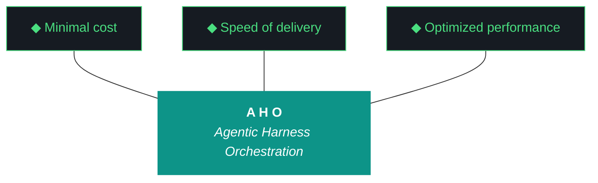

# aho - Bundle 0.2.9

**Generated:** 2026-04-12T04:51:12.169967Z
**Iteration:** 0.2.9
**Project code:** ahomw
**Project root:** /home/kthompson/dev/projects/aho

---

## §1. Design

### DESIGN (aho-design-0.2.9.md)
```markdown
# aho Design — 0.2.9

**Phase:** 0 | **Iteration:** 2 | **Run:** 9
**Theme:** Remote operability plumbing + P3 clone
**Predecessor:** 0.2.8 (discovery, closed clean)

## Why this iteration exists

Two goals that share one dependency: you need `/ws` streaming working before P3 clone so you can monitor the clone from your phone, AND you need the clone to happen tonight because the calendar is pressing and P3 is the Phase 0 graduation test substrate.

0.2.9 ships the plumbing, clones to P3, documents whatever P3 reveals. Scope is deliberately bounded to plumbing — not the full remote-executor architecture (that crystallizes in 0.2.11 after you've lived with the simpler `/ws` streaming for a while).

## Goals

1. `/ws` command family in Telegram inbound: status, pause, proceed, last. Paired with workstream_start and workstream_complete events auto-pushed to chat.
2. Agent-side handshake via `.aho-checkpoint.json` proceed_awaited field and a small polling helper. Executing agents halt at workstream boundaries, wait for `/ws proceed`, resume.
3. `.mcp.json` and install.fish audited for NZXTcos-specific hardcodes; parameterized where found.
4. Secrets architecture documented (soft action, not extracted as package). Junior devs get a readable-cold explanation of how aho keeps secrets out of the repo.
5. ADR-045: discovery iteration formalization. Lifted from 0.2.8 carry-forward. Claude drafts, Kyle reviews, ships.
6. P3 clone executed. git clone → bin/aho-bootstrap → install.fish on fresh CachyOS box. Whatever fails gets documented in real time. Findings drive 0.2.10 scope.

## Non-goals

- Full Telegram-driven remote agent executor (0.2.11)
- Openclaw reliability fixes (0.2.10)
- Multi-user Telegram
- Extracting secrets as standalone package (0.4.x)
- P3 full production verification (just plumbing in place, not optimized)
- Phase 0 graduation ceremony (0.2.11)
- kjtcom anything

## The /ws streaming feature

**User-facing surface from Telegram chat:**

- `/ws status` — current iteration + current workstream + last event timestamp
- `/ws pause` — sets checkpoint proceed_awaited=true, causes next workstream boundary to halt
- `/ws proceed` — sets checkpoint proceed_awaited=false, releases halted agent
- `/ws last` — last completed workstream summary from event log

**Auto-push:** every `workstream_complete` event in aho_event_log.jsonl triggers a short summary push to the configured chat_id. Format: workstream ID, status, one-line outcome, iteration version. Truncated to fit one Telegram message.

**Agent side:** executing agent (Claude Code, Gemini CLI) writes workstream_start event on entry, workstream_complete on exit. Between workstreams, if proceed_awaited=true in checkpoint, agent polls checkpoint every 5s until false, then proceeds. Simple blocking loop, no complexity.

**Out of scope for 0.2.9:** bidirectional chat (you can send free-text to openclaw today via the W12 bridge, but /ws is specifically for workstream control, not dispatch).

## The P3 clone plan

**Preconditions:**
- P3 is a fresh CachyOS install (or close to fresh — state acceptable if it's already Kyle's dev machine)
- SSH access from NZXTcos to P3 works
- Kyle has GitHub SSH key deployed on P3 (github.com-sockjt host alias per existing conventions)
- /ws streaming is live on NZXTcos so Kyle can watch the clone from phone if needed

**Clone sequence (W8):**
1. `ssh tsP3-cos`
2. `cd ~/Development/Projects/` (P3 path convention per user memory)
3. `git clone git@github.com-sockjt:SOC-Foundry/aho.git`
4. `cd aho`
5. `./bin/aho-bootstrap` — expect capability gaps for age passphrase + telegram token entry
6. `./install.fish` — 9 steps
7. `aho doctor` — full preflight
8. Verify dashboard reachable at http://127.0.0.1:7800/ from P3 browser
9. Verify Telegram `/status` works from P3 (the daemon on P3 should be its own instance, separate from NZXTcos)

**Expected failures:**
- Path hardcodes in .mcp.json (filesystem allowed-dir pointing at NZXTcos path)
- Secret files not populated on P3 (first-run capability gaps)
- Ollama models not present (pulled fresh on first install)
- MCP servers may need npm install on P3 (not just on NZXTcos)
- Telegram bot allow-list conflict if P3 tries to listen with same chat_id
- Dashboard port 7800 may clash with other P3 services

**What counts as success tonight:**
- git clone works
- bin/aho-bootstrap completes or halts cleanly with capability gaps
- install.fish runs as far as it can without NZXTcos-specific failures
- Whatever breaks is documented with a clear reproduction path

**What is NOT a success criterion tonight:**
- All 9 install.fish steps pass on P3
- Dashboard live on P3
- Telegram working from P3

Those are 0.2.10 targets. Tonight is "clone and document reality."

## §3. Trident — Cost Model

aho 0.2.9 is a single-agent Claude Code iteration. No local fleet delegation for workstream execution (Gemini CLI not used). Local fleet (Qwen, Nemotron, GLM) active for daemon services (openclaw, nemoclaw, harness-watcher). Cost model:

- **Orchestrator (Claude Code):** all 10 workstreams, per-workstream review cadence
- **Local fleet:** daemon services only (openclaw chat, nemoclaw routing, harness-watcher events)
- **Delegate ratio:** low (single-agent run), acceptable for install-surface + portability scope

## Pillar Applicability

All eleven pillars apply. Key pillars for 0.2.9:

- Pillar 4 (wrappers are the tool surface): .mcp.json.tpl + bin/aho-bootstrap template generation
- Pillar 6 (transitions are durable): checkpoint proceed_awaited handshake
- Pillar 10 (runs are interrupt-disciplined): /ws pause/proceed gives Kyle interrupt control without breaking execution flow. Capability gaps routed through Telegram.
- Pillar 11 (human holds the keys): no git operations by agent. Kyle commits manually. Per-workstream review ensures Kyle approves each workstream before next begins.

## Open questions for Kyle before W0

1. **P3 clone filesystem allowed-dir in .mcp.json.** Current NZXTcos value is `/home/kthompson/dev/projects/aho`. P3 value per your memory is `/home/kthompson/Development/Projects/aho` (capitalized, different structure). W1 decision: hard-code both paths as allowed-dirs? Template substitution at bootstrap? Detect at runtime? Lean: template substitution driven by `aho_paths.find_project_root()` at bootstrap time, file regenerated per-machine. Same pattern as systemd service templates.

2. **Telegram bot for P3.** Same bot (@aho_run_bot) with chat_id allow-list allowing both daemons to receive, or a second bot for P3? If same bot, getUpdates will race between NZXTcos daemon and P3 daemon — Telegram locks the update stream to one consumer. Must decide. Lean: P3 skips Telegram daemon entirely for 0.2.9; NZXTcos stays the only inbound bridge. P3 runs outbound-only. 0.2.11 solves multi-machine properly.

3. **P3 cold clone vs already-has-state.** Is P3 literally fresh, or does it have some aho state from earlier testing? Affects install.fish idempotency path exercised.

4. **/ws pause granularity.** Pause at *any* workstream boundary, or only at configured halt points? Lean: any boundary. Simple model, easier to reason about. Users who don't want to be interrupted just don't send /ws pause.

5. **P3 timing tonight.** When does the W8 clone happen relative to W0-W7 completion? Run W0-W7 straight through first, then W8 with fresh attention? Or land W1-W7 tonight and W8 tomorrow? Lean: straight through tonight since that's what you said you want. 6-compression option from my last message available if you need it.
```

## §2. Plan

### PLAN (aho-plan-0.2.9.md)
```markdown
# aho Plan — 0.2.9

**Phase:** 0 | **Iteration:** 2 | **Run:** 9
**Theme:** Remote operability plumbing + P3 clone
**Predecessor:** 0.2.8 (closed clean)
**Design:** `aho-design-0_2_9.md`
**Agent split:** Single-agent Claude Code throughout.
**Review cadence:** Per-workstream Phase 2. After each workstream, agent halts with handoff summary and waits for Kyle review.
**MCP-first mandate:** active per 0.2.8 W2 CLAUDE.md rules.

## Workstreams

| WS | Surface | Type | Outcome |
|---|---|---|---|
| W0 | Canonical bumps + decisions + carry-forward capture | bump | 10 artifacts → 0.2.9, decisions.md from 5 open questions, 0.2.8 carry-forwards logged |
| W1 | .mcp.json portability + template mechanism | code | Template at .mcp.json.tpl, bootstrap generates per-machine .mcp.json from paths resolver |
| W2 | install.fish cross-machine audit | code | NZXTcos hardcodes surfaced and parameterized, all paths via aho_paths.find_project_root() |
| W3 | Workstream event emission | code | workstream_start + workstream_complete events added to aho_event_log.jsonl by CLI entrypoints |
| W4 | /ws command family in Telegram inbound | code | /ws status, /ws pause, /ws proceed, /ws last routing + handlers, auto-push on workstream_complete |
| W5 | Checkpoint proceed_awaited handshake | code | .aho-checkpoint.json gains proceed_awaited field, agent-side polling helper in src/aho/cli.py or similar |
| W6 | secrets-architecture.md documentation pass | code | 30-min write-up under artifacts/harness/, junior-dev-readable, no code extraction |
| W7 | ADR-045: discovery iteration formalization | bump | ADR drafted from 0.2.8 empirical record, reviewed by Kyle, landed in artifacts/adrs/ |
| W8 | P3 clone execution | discovery+code | git clone on P3, bin/aho-bootstrap, install.fish, document every failure, fix-or-carry |
| W9 | Close | bump | tests, bundle, run report, build log, changelog, final sign-off |

9 workstreams as agreed. W8 is the load-bearing one.

## Workstream details

### W0 — Bumps + decisions + carry-forward

- All 10 canonical artifacts → 0.2.9
- `.aho.json` current_iteration → 0.2.9
- `artifacts/iterations/0.2.9/decisions.md` captures Kyle's answers to design open questions 1–5
- Carry-forward section in 0.2.9 design doc references: post-reboot daemon verification, protocol smoke column, openclaw stability → 0.2.10

### W1 — .mcp.json portability

- Create `.mcp.json.tpl` at repo root with placeholder `{{PROJECT_ROOT}}` in filesystem allowed-dirs
- `bin/aho-bootstrap` extended: on first run, reads template, substitutes `{{PROJECT_ROOT}}` with `aho_paths.find_project_root()` output, writes `.mcp.json`
- `.mcp.json` added to `.gitignore`
- `.mcp.json.tpl` committed to repo
- `bin/aho-bootstrap` idempotent: detects existing .mcp.json, skips regeneration unless `--force`
- Test: template substitution produces valid JSON, placeholder fully replaced, idempotency check works

### W2 — install.fish cross-machine audit

- Grep install.fish and all `bin/aho-*` wrappers for any hardcoded `/home/kthompson`, `NZXTcos`, `172.31.255.245`, or similar machine-specific values
- Replace with calls to `aho_paths`, `$USER`, `hostname`, or equivalent resolvers
- Audit `artifacts/harness/pacman-packages.txt` and `model-fleet.txt` for packages known to behave differently on P3 vs NZXTcos (e.g., ollama still needs upstream install per 0.2.6)
- Produce `artifacts/iterations/0.2.9/portability-audit.md` as iteration deliverable
- No install.fish changes unless audit surfaces something — most machine-specific work was already done right in 0.2.5/0.2.6

### W3 — Workstream event emission

- New module `src/aho/workstream_events.py` — emits `workstream_start` and `workstream_complete` events to `data/aho_event_log.jsonl`
- Both events include: iteration, workstream_id, timestamp, source_agent, outcome (for complete), one-line summary
- CLI integration: `aho iteration workstream start W0` and `aho iteration workstream complete W0 --status pass --summary "..."` subcommands
- Tests: event shape, JSONL append-only semantics, idempotent start/complete guards

### W4 — /ws command family

- Extend `src/aho/telegram/inbound.py` command dispatch dict with 4 new entries: `/ws status`, `/ws pause`, `/ws proceed`, `/ws last`
- Handlers:
  - `/ws status` — reads `.aho.json` + `.aho-checkpoint.json`, formats current iteration + WS + proceed_awaited state
  - `/ws pause` — writes proceed_awaited=true to checkpoint, replies "paused at next WS boundary"
  - `/ws proceed` — writes proceed_awaited=false, replies "proceeding"
  - `/ws last` — reads last workstream_complete event from event log, formats one-line summary
- Auto-push subscriber: daemon watches aho_event_log.jsonl for new workstream_complete events, sends summary to configured chat_id
- Use `context7-mcp` for any Telegram Bot API doc lookups during implementation (MCP-first)
- Tests: each command routes correctly, auto-push fires once per event, chat_id filter honored

### W5 — Checkpoint proceed_awaited handshake

- Add `proceed_awaited` field to `.aho-checkpoint.json` schema (default false)
- New helper `src/aho/workstream_gate.py` — `wait_if_paused(timeout_seconds=None)` function that polls checkpoint every 5s until proceed_awaited is false
- Agent-side integration: CLI wrappers call `wait_if_paused()` at each workstream boundary before writing workstream_start event
- Timeout None = block indefinitely. Explicit timeout supported for safety in non-interactive runs
- Tests: helper respects proceed_awaited toggle, timeout path works, no busy-loop (5s poll interval honored)

### W6 — secrets-architecture.md

- New file `artifacts/harness/secrets-architecture.md`
- Covers: age key location + mode, OS keyring role, fernet session cache, Pattern for committing config files with empty secret placeholders + shell env export, what NEVER gets committed (keys, passphrases, tokens, encrypted blobs outside explicit vault paths), junior-dev workflow for first-run
- Target: readable cold by a junior engineer who has never seen aho. ~500-800 words, code examples welcome
- No code extraction — documentation only. Hard extraction target is 0.4.x+

### W7 — ADR-045: Discovery iteration formalization

- New file `artifacts/adrs/ahomw-ADR-045.md`
- Draft from Claude (provided below in the launch prompt block or separately)
- Content: what a discovery iteration is, when to use one, how it differs from remediation iteration (0.2.4) and feature iteration (0.2.7), per-workstream review as sub-mode for high-novelty iterations, 0.2.8 as empirical reference
- Kyle reviews, agent lands file in adrs/ with chosen number
- Update ADR-044 cross-reference to ADR-045 if appropriate

### W8 — P3 clone execution

**Kyle-led, agent supports.** This workstream is manual clone driven by Kyle on P3 directly. Agent's role:
1. Produce a step-by-step runbook document (`artifacts/iterations/0.2.9/p3-clone-runbook.md`) before Kyle executes
2. Be available via chat during Kyle's execution for real-time diagnosis of any failures
3. After Kyle completes, document findings in `artifacts/iterations/0.2.9/p3-clone-findings.md`

**Expected failure categories:**
- Path hardcodes (should be caught by W1/W2 but reality will tell)
- Missing packages on P3 (different pacman state)
- Secret files not populated (expected, capability gaps)
- Ollama models not pulled (expected, fresh install)
- Dashboard port conflicts
- Telegram inbound conflict (decision 2 from W0)

**Success criteria (restated from design):** git clone works, bin/aho-bootstrap halts cleanly on capability gaps, install.fish runs as far as it can, whatever breaks gets a reproduction path documented. Full install success is 0.2.10.

### W9 — Close

- Test suite green (target 190+ tests, up from 182)
- Bundle generation, all postflight gates green (including bundle_completeness and mcp_sources_aligned)
- Run report `aho-run-0_2_9.md` with MCP Tools Invoked table populated for all 9 workstreams
- Build log `aho-build-log-0_2_9.md`
- CHANGELOG entry
- Pending Kyle (manual): any P3 gaps that didn't fix in W8, plus git commit + push for 0.2.5 through 0.2.9 (five iterations pending)

## Definition of done

- [ ] All 10 canonical artifacts at 0.2.9
- [ ] `.mcp.json.tpl` committed, `.mcp.json` gitignored, bootstrap generates per-machine
- [ ] portability-audit.md exists under artifacts/iterations/0.2.9/
- [ ] workstream_events.py emits start + complete events
- [ ] /ws status, /ws pause, /ws proceed, /ws last all work from Kyle's phone
- [ ] Auto-push fires on workstream_complete events
- [ ] .aho-checkpoint.json has proceed_awaited field, wait_if_paused helper works
- [ ] secrets-architecture.md exists and is junior-dev-readable
- [ ] ADR-045 exists in artifacts/adrs/
- [ ] p3-clone-runbook.md exists before Kyle executes P3 clone
- [ ] p3-clone-findings.md exists after Kyle's P3 clone attempt
- [ ] P3 has repo cloned, bin/aho-bootstrap attempted, findings documented
- [ ] Test suite green (190+)
- [ ] Bundle validates clean with all sections populated
- [ ] Run report MCP Tools Invoked section populated for all 9 workstreams

## Risk register

- **Tonight deadline on W8.** W0–W7 must land in time to execute W8 before Kyle's cutoff. If scope pressure arises, cut order: W7 (ADR-045 — can shift to 0.2.10 W0), W6 (secrets-architecture — can shift to 0.2.10), NEVER cut W1/W2/W8.
- **P3 cold state unknown.** If P3 has existing aho state, install.fish idempotency is exercised. If P3 is fully cold, fresh-install path is exercised. Different failure modes. Both informative.
- **Telegram getUpdates race if P3 runs inbound daemon.** W0 decision 2 must land — lean is P3 skips inbound daemon for 0.2.9.
- **Per-workstream cadence on tonight's deadline.** Heavy review early (W1-W5) is the right shape; W6-W7 can be lighter-touch; W8 is all-hands-on-deck regardless.

## Out of scope

- Full remote agent executor (0.2.11)
- Openclaw reliability fixes (0.2.10)
- Multi-user Telegram
- Secrets package extraction
- P3 full production verification
- Phase 0 graduation ceremony
- kjtcom anything
```

## §3. Build Log

### BUILD LOG (MANUAL) (aho-build-log-0.2.9.md)
```markdown
# Build Log — aho 0.2.9

**Theme:** Remote operability plumbing + persona 3 discovery
**Executor:** claude-code (single-agent)
**Date:** 2026-04-11
**Type:** Hybrid (feature W0–W7, discovery W8, architecture W8.5) per ADR-045

## W0 — Bumps + decisions + carry-forward capture
12 canonical artifacts bumped 0.2.8 → 0.2.9. decisions.md captured Kyle's 5 pre-iteration answers (MCP portability, Telegram P3, P3 cold state, /ws pause granularity, tonight timing). carry-forwards.md logged 0.2.10/0.2.11/0.4.x+ deferrals. CHANGELOG stub appended. Run report seeded.

## W1 — .mcp.json portability + template mechanism
Created .mcp.json.tpl with {{PROJECT_ROOT}} placeholder. bin/aho-bootstrap extended with step 4: reads template, substitutes via fish `string replace -a`, writes .mcp.json. Idempotent with --force override. .gitignore updated. Bootstrap npm list corrected from stale 11-package to current 8-package (9th is dart SDK-bundled). Step numbering fixed (duplicate step 5 removed). 7 tests.

## W2 — install.fish cross-machine audit
Grepped 5 patterns across bin/, src/, templates/, install.fish. Found 3 stragglers: server-filesystem.fish smoke script (hardcoded path → script-relative resolution), mcp-wiring.md (hardcoded path → {{PROJECT_ROOT}} reference), global-deployment.md (kthompson → $USER). Zero hardcodes remain in executable code. portability-audit.md produced.

## W3 — Workstream event emission
New module src/aho/workstream_events.py with emit_workstream_start() and emit_workstream_complete(). Both emit to aho_event_log.jsonl via log_event(). Idempotent via _scan_events() check. CLI integration: `aho iteration workstream start/complete`. Source agent defaults to AHO_EXECUTOR env var. 9 tests.

## W4 — /ws command family in Telegram inbound
4 new /ws commands in Telegram inbound dispatch: status (reads checkpoint), pause (writes proceed_awaited=true), proceed (clears proceed_awaited), last (reads last workstream_complete from event log). Auto-push subscriber tails aho_event_log.jsonl, sends Telegram notification on new workstream_complete events. Help text updated. Route refactored for multi-part commands. context7-mcp used for Telegram Bot API docs. 20 new tests, 24 existing pass.

## W5 — Checkpoint proceed_awaited handshake
New module src/aho/workstream_gate.py with wait_if_paused(). Polls .aho-checkpoint.json every 5s until proceed_awaited is false. Safe defaults: proceeds if field missing, file missing, or parse error. CLI integration: workstream start calls gate before emit. Timeout=None blocks indefinitely. 9 tests.

## W6 — secrets-architecture.md documentation pass
New file artifacts/harness/secrets-architecture.md. Three-layer model: age key (identity), OS keyring (session cache), Fernet store (encrypted JSON). Sections: overview with diagram, each layer, what never gets committed, first-run workflow, backend architecture, security properties, future plans. ~700 words, junior-dev-readable.

## W7 — ADR-045: discovery iteration formalization
New file artifacts/adrs/ahomw-ADR-045.md. Three-type iteration taxonomy: remediation (narrow, immutable scope), feature (broad, immutable scope), discovery (broad, adaptive within immutable theme). Per-workstream review formalized as SHOULD-default for discovery iterations. ADR-044 cross-reference added. Two Kyle-requested edits applied: reactive workstream count corrected, 0.2.9 hybrid type clarified.

## W8 — Persona 3 validation
Searched all 7 dispatch paths for persona 3 entry point. None found — aho has zero persona 3 implementation surface. OpenClaw's chat (LLM, no files) and execute (files, no LLM) are disconnected. 4 test tasks attempted against /tmp/aho-persona-3-test/: PDF summarize, SOW generation, risk review, email extraction. All 4 failed with "I can't access files." Execute path can read files but provides no LLM reasoning. p3-clone-findings.md documents all 5 findings.

## W8.5 — Install surface architecture decision (discovery insertion)
New file artifacts/iterations/0.2.9/install-surface-architecture.md. 8 sections: three-persona definition, component install taxonomy (project-local vs system-local), 4 Kyle decisions captured verbatim (openclaw Path A, OTEL/Jaeger AUR, aho-run name, working directory/update/install/agent-split), persona 3 dispatch sequence with ASCII diagram, system services inventory, 9 deliverables for 0.2.10, updated roadmap (0.2.10–0.2.13), 4 open questions for 0.2.10 W0.

## W9 — Close
227 tests pass (up from 182, +45 new). Doctor gates checked. Bundle generated. CHANGELOG expanded. Run report finalized.
```

## §4. Report

### REPORT (aho-report-0.2.9.md)
```markdown
# Report — aho 0.2.9

**Generated:** 2026-04-12T04:43:34Z
**Iteration:** 0.2.9
**Phase:** 0
**Run type:** single-agent
**Status:** active

---

## Executive Summary

This iteration executed 10 workstreams: 10 passed, 0 failed, 0 pending/partial.
47 events logged during execution.
Postflight: 8/18 gates passed, 7 failed.

---

## Workstream Detail

| Workstream | Status | Agent | Events | Wall Clock |
|---|---|---|---|---|
| W0 | pass | claude-code | 1 | - |
| W1 | pass | claude-code | 1 | - |
| W2 | pass | claude-code | 1 | - |
| W3 | pass | claude-code | 1 | - |
| W4 | pass | claude-code | 1 | - |
| W5 | pass | claude-code | 1 | - |
| W6 | pass | claude-code | 1 | - |
| W7 | pass | claude-code | 1 | - |
| W8 | pass | claude-code | 1 | - |
| W8.5 | pass | claude-code | 1 | - |

---

## Component Activity

| Component | Kind | Status | Owner | Notes |
|---|---|---|---|---|
| openclaw | agent | active | soc-foundry | global daemon, systemd user service, Unix socket; activated 0.2.2 W1 |
| nemoclaw | agent | active | soc-foundry | Nemotron orchestrator, systemd user service, Unix socket; activated 0.2.2 W2 |
| telegram | external_service | active | soc-foundry | send-only bridge, systemd user service, age-encrypted secrets; activated 0.2.2 W3 |
| qwen-client | llm | active | soc-foundry |  |
| nemotron-client | llm | active | soc-foundry |  |
| glm-client | llm | active | soc-foundry |  |
| chromadb | external_service | active | soc-foundry |  |
| ollama | external_service | active | soc-foundry |  |
| opentelemetry | external_service | active | soc-foundry | dual emitter alongside JSONL; activated 0.1.15 W2 |
| assistant-role | agent | active | soc-foundry |  |
| base-role | agent | active | soc-foundry |  |
| code-runner-role | agent | active | soc-foundry |  |
| reviewer-role | agent | active | soc-foundry |  |
| cli | python_module | active | soc-foundry |  |
| config | python_module | active | soc-foundry |  |
| doctor | python_module | active | soc-foundry |  |
| logger | python_module | active | soc-foundry |  |
| paths | python_module | active | soc-foundry |  |
| harness | python_module | active | soc-foundry |  |
| compatibility | python_module | active | soc-foundry |  |
| push | python_module | active | soc-foundry |  |
| registry | python_module | active | soc-foundry |  |
| ollama-config | python_module | active | soc-foundry |  |
| artifact-loop | python_module | active | soc-foundry |  |
| artifact-context | python_module | active | soc-foundry |  |
| artifact-evaluator | python_module | active | soc-foundry |  |
| artifact-schemas | python_module | active | soc-foundry |  |
| artifact-templates | python_module | active | soc-foundry |  |
| repetition-detector | python_module | active | soc-foundry |  |
| bundle | python_module | active | soc-foundry |  |
| components-section | python_module | active | soc-foundry |  |
| report-builder | python_module | active | soc-foundry | mechanical report builder, added 0.1.15 W0 |
| feedback-run | python_module | active | soc-foundry |  |
| feedback-prompt | python_module | active | soc-foundry |  |
| feedback-questions | python_module | active | soc-foundry |  |
| feedback-summary | python_module | active | soc-foundry |  |
| feedback-seed | python_module | active | soc-foundry |  |
| build-log-stub | python_module | active | soc-foundry |  |
| pipeline-scaffold | python_module | active | soc-foundry |  |
| pipeline-validate | python_module | active | soc-foundry |  |
| pipeline-registry | python_module | active | soc-foundry |  |
| pipeline-pattern | python_module | active | soc-foundry |  |
| pf-artifacts-present | python_module | active | soc-foundry |  |
| pf-build-log-complete | python_module | active | soc-foundry |  |
| pf-bundle-quality | python_module | active | soc-foundry |  |
| pf-gemini-compat | python_module | active | soc-foundry |  |
| pf-iteration-complete | python_module | active | soc-foundry |  |
| pf-layout | python_module | active | soc-foundry |  |
| pf-manifest-current | python_module | active | soc-foundry | added 0.1.15 W0 |
| pf-changelog-current | python_module | active | soc-foundry | added 0.1.15 W0 |
| pf-pillars-present | python_module | active | soc-foundry |  |
| pf-pipeline-present | python_module | active | soc-foundry |  |
| pf-readme-current | python_module | active | soc-foundry |  |
| pf-run-complete | python_module | active | soc-foundry |  |
| pf-run-quality | python_module | active | soc-foundry |  |
| pf-structural-gates | python_module | active | soc-foundry |  |
| preflight-checks | python_module | active | soc-foundry |  |
| rag-archive | python_module | active | soc-foundry |  |
| rag-query | python_module | active | soc-foundry |  |
| rag-router | python_module | active | soc-foundry |  |
| secrets-store | python_module | active | soc-foundry |  |
| secrets-session | python_module | active | soc-foundry |  |
| secrets-cli | python_module | active | soc-foundry |  |
| secrets-backend-age | python_module | active | soc-foundry |  |
| secrets-backend-base | python_module | active | soc-foundry |  |
| secrets-backend-fernet | python_module | active | soc-foundry |  |
| secrets-backend-keyring | python_module | active | soc-foundry |  |
| install-migrate-config | python_module | active | soc-foundry |  |
| install-secret-patterns | python_module | active | soc-foundry |  |
| brave-integration | python_module | active | soc-foundry |  |
| firestore | python_module | active | soc-foundry |  |
| workstream-agent | agent | active | soc-foundry | Qwen-bound, conductor-dispatched, activated 0.2.3 W2 |
| evaluator-agent | agent | active | soc-foundry | GLM-bound, review role, activated 0.2.3 W2 |
| harness-agent | agent | active | soc-foundry | Nemotron-bound, watcher daemon, activated 0.2.3 W2 |
| conductor | agent | active | soc-foundry | orchestrator pattern, dispatches to role-split agents, activated 0.2.3 W2 |
| mcp-firebase-tools | mcp_server | active | soc-foundry | npm global, activated 0.2.3 W1 |
| mcp-context7 | mcp_server | active | soc-foundry | npm global, activated 0.2.3 W1 |
| mcp-firecrawl | mcp_server | active | soc-foundry | npm global, activated 0.2.3 W1 |
| mcp-playwright | mcp_server | active | soc-foundry | npm global, activated 0.2.3 W1 |
| mcp-dart | mcp_server | active | dart-team | SDK-bundled (Dart 3.9+), replaces broken flutter-mcp, activated 0.2.8 W3 |
| mcp-server-filesystem | mcp_server | active | soc-foundry | npm global, activated 0.2.3 W1 |
| mcp-server-memory | mcp_server | active | soc-foundry | npm global, activated 0.2.3 W1 |
| mcp-server-sequential-thinking | mcp_server | active | soc-foundry | npm global, activated 0.2.3 W1 |
| mcp-server-everything | mcp_server | active | soc-foundry | npm global, reference/test server, activated 0.2.3 W1, added to manifest 0.2.8 W7 |
| component-manifest | python_module | active | soc-foundry | added 0.1.15 W1 |

**Total components:** 85
**Status breakdown:** 85 active

---

## Postflight Results

| Gate | Status | Message |
|---|---|---|
| app_build_check | ok | web build present (1502 bytes) |
| artifacts_present | fail | report_artifact missing, bundle_artifact missing |
| build_log_complete | ok | no workstreams found in design |
| bundle_completeness | skip | bundle not yet generated for 0.2.9 |
| bundle_quality | warn | Bundle not yet generated: aho-bundle-0.2.9.md |
| canonical_artifacts_current | ok | all 10 canonical artifacts at 0.2.9 |
| changelog_current | ok | CHANGELOG.md contains 0.2.9 |
| gemini_compat | ok | Gemini-primary CLI sync verified |
| iteration_complete | fail | Checkpoint: All workstreams reached final state
Build Log: Build log manual ground truth present
Secret Scan: No plaintext secrets found in tracked files
install.fish: install.fish syntax OK
Artifacts: Missing artifacts: report.md, bundle.md |
| manifest_current | fail | stale hashes: .aho-checkpoint.json, .aho.json, .gitignore |
| mcp_canonical_registry_verify | ok | all 9 MCP packages registry-verified |
| mcp_sources_aligned | ok | MCP sources aligned: 9 entries match |
| pillars_present | fail | 3 errors: Design doc missing Pillar 10; Design doc missing Pillar 11; Design doc missing §3 (Trident) |
| pipeline_present | ok | SKIP — no pipelines declared in .aho.json |
| readme_current | fail | README.md last modified 2026-04-12T04:43:22.776237+00:00 < iteration start 2026-04-12T05:00:00Z |
| run_complete | deferred | Sign-off incomplete: Kyle reviewed and approved |
| run_quality | fail | 1 quality check failures |
| structural_gates | fail | Structural gates: 2 pass, 1 fail, 1 deferred |

---

## Risk Register

- **2026-04-12T04:41:24.171553+00:00** [evaluator_run] severity=warn errors=2
- **2026-04-12T04:41:24.187744+00:00** [evaluator_run] severity=reject errors=40
- **2026-04-12T04:41:24.192734+00:00** [evaluator_run] severity=warn errors=2
- **2026-04-12T04:41:25.553428+00:00** [llm_call] missing credentials
- **2026-04-12T04:41:45.103824+00:00** [evaluator_run] severity=reject errors=1
- **2026-04-12T04:41:45.104465+00:00** [evaluator_run] severity=warn errors=1
- **2026-04-12T04:41:45.114458+00:00** [llm_call] missing credentials
- **2026-04-12T04:41:45.117240+00:00** [llm_call] connection refused

---

## Carryovers

From 0.2.8 Kyle's Notes:

**Kyle's Notes (closed 2026-04-11):**

0.2.8 is the largest aho iteration to date and the most structurally
consequential. Five real discoveries landed as shipped fixes:

1. MCP utilization gap closed. Zero MCP invocations across iterations
   0.2.3 through 0.2.7; 14 distinct invocations across 4 workstreams
   in 0.2.8 alone (W3, W5, W10, W12). The MCP-first mandate is no
   longer aspirational.

2. Source-of-truth drift resolved. components.yaml and bin/aho-mcp
   agree for the first time since 0.2.4 (9 servers, 8 npm + 1 dart
   SDK-bundled). New postflight gate mcp_sources_aligned prevents
   recurrence.

3. harness-watcher daemon active. Root cause was Branch A installer
   bug — bin/aho-systemd enabled but did not start. One-line fix.

4. Bundle generator fixed. §4 Report no longer hollow, §12 Sidecars
   populated (4 entries), §6 includes iteration-window ADRs. New
   postflight gate bundle_completeness caught both missing files
   on first run and forced W13 to generate them.

5. Telegram inbound bridge live. /status returns live doctor output
   to Kyle's phone. Single-user allow-list, 30s sync wait with async
   ack fallback. First daemon to operate the harness from off-keyboard.

Four new gotchas form a coherent family — a pattern language for
"things that pretend to work but don't":
- aho-G066: declared != exercised
- aho-G067: declared != populated
- aho-G068: installed != wired
- aho-G069: enabled != started

Every Phase 0 graduation criterion can now be checked against this
family. Running through the seven questions (declared? exercised?
populated? installed? wired? enabled? started?) is how P3 clone-to-
deploy validation catches gaps before they ship.

ADR-044 updated with Phase 2 Tooling: Dashboard section using
concrete 0.2.7-0.2.8 examples (12 unknowns flipped, 4 real catches
on first gate runs).

Per-workstream review cadence worked. W1's wiring gap surfaced in 4
minutes. W7's server-everything drift caught on first gate run. Both
would have shipped invisible under per-iteration review. Front-loaded
review intensity (heavy W1-W5, light W6-W13) matched the information
density curve. Worth formalizing as a sub-mode in ADR-045 (scheduled
for 0.2.9 W7).

Openclaw surfaced real stability issues during W12 telegram dispatch
testing: Errno 11 resource unavailable, thinking repetition false
positives, Errno 104 connection reset. These are carried to 0.2.10
as a dedicated iteration theme, not bolted onto 0.2.9.

Firecrawl key resolution used option A (fernet + shell env export)
which turned out cleaner than option B. The server inherits the key
from shell environment regardless of what .mcp.json says. .mcp.json
safely committed with empty string.

0.2.8 closes clean. Next: 0.2.9 workstream streaming + P3 clone
plumbing, 0.2.10 P3 hardening + openclaw reliability, 0.2.11 remote
agent executor + Phase 0 graduation.

---

## Next Iteration Recommendation

- Address failed postflight gates: readme_current, manifest_current, artifacts_present, structural_gates, pillars_present, run_quality, iteration_complete
```

## §5. Run Report

### RUN REPORT (aho-run-0.2.9.md)
```markdown
# aho Run Report — 0.2.9

**Phase:** 0 | **Iteration:** 2 | **Run:** 9
**Theme:** Remote operability plumbing + persona 3 discovery + install surface architecture
**Executor:** claude-code (single-agent)
**Date:** 2026-04-11

---

## Workstream Summary

| WS | Surface | Status | Notes |
|---|---|---|---|
| W0 | Bumps + decisions + carry-forward capture | pass | 12 artifacts bumped, decisions.md, carry-forwards.md |
| W1 | .mcp.json portability + template mechanism | pass | .mcp.json.tpl with {{PROJECT_ROOT}}, bootstrap step 4 generates per-machine, .gitignore updated, MCP npm list corrected to 8 (9th is dart SDK), 7 tests |
| W2 | install.fish cross-machine audit | pass | 3 hardcodes fixed (smoke script, mcp-wiring.md, global-deployment.md), portability-audit.md produced |
| W3 | Workstream event emission | pass | workstream_events.py, CLI `aho iteration workstream start/complete`, idempotent guards, 9 tests |
| W4 | /ws command family in Telegram inbound | pass | /ws status/pause/proceed/last + auto-push on workstream_complete, 20 new tests, 24 existing pass |
| W5 | Checkpoint proceed_awaited handshake | pass | workstream_gate.py with wait_if_paused(), CLI wired at workstream start, 9 tests |
| W6 | secrets-architecture.md documentation pass | pass | Three-layer model documented, first-run workflow, backend tree, security properties |
| W7 | ADR-045: discovery iteration formalization | pass | Three-type taxonomy (remediation/feature/discovery), per-workstream review sub-mode, ADR-044 cross-ref |
| W8 | Persona 3 validation | pass | No entry point exists. Chat has no file access. Execute has no LLM. 4/4 tasks failed. Findings documented. |
| W8.5 | Install surface architecture decision | pass | Three-persona taxonomy, 4 Kyle decisions, aho-run dispatch spec, 0.2.10 scope contract |
| W9 | Close | pass | 227 tests, doctor gates, bundle 636KB, CHANGELOG expanded, run report finalized |

## MCP Tools Invoked

| WS | mcp_used | Justification (if none) |
|---|---|---|
| W0 | none | bump workstream — no technology-specific work requiring MCP |
| W1 | none | template substitution + fish scripting — no technology-specific MCP domain |
| W2 | none | grep/audit workstream — no technology-specific MCP domain |
| W3 | none | Python event module + CLI wiring — no technology-specific MCP domain |
| W4 | mcp__context7__resolve-library-id, mcp__context7__query-docs | Telegram Bot API sendMessage docs via context7-mcp |
| W5 | none | Python polling helper + CLI wiring — no technology-specific MCP domain |
| W6 | none | documentation pass — no technology-specific MCP domain |
| W7 | none | ADR drafting — no technology-specific MCP domain |
| W8 | none | persona validation — openclaw chat/execute are existing tools, no MCP domain |
| W8.5 | none | architecture documentation — no technology-specific MCP domain |
| W9 | none | close workstream — tests, doctor, bundle generation, no technology-specific MCP domain |

## Metrics

- **Tests:** 227 passed, 1 skipped (target: 190+, actual: +45 new)
- **Doctor:** 33 checks (see close run for final state)
- **Bundle:** 636KB
- **New files:** 8 (workstream_events.py, workstream_gate.py, secrets-architecture.md, ADR-045, .mcp.json.tpl, test_mcp_template.py, test_workstream_events.py, test_workstream_gate.py, test_telegram_ws_commands.py)
- **Modified files:** 16 (12 canonical bumps, inbound.py, cli.py, bootstrap, .gitignore)
- **Iteration deliverables:** decisions.md, carry-forwards.md, portability-audit.md, p3-clone-runbook.md, p3-clone-findings.md, install-surface-architecture.md
- **MCP tools invoked:** 2 distinct (context7 resolve-library-id + query-docs in W4)
- **Workstreams:** 10 (W8.5 inserted per ADR-045 discovery pattern)
- **Iteration type:** Hybrid (feature W0–W7, discovery W8, architecture W8.5) per ADR-045

## Agent Questions

None. All 5 design questions answered in W0 decisions.md. W8 scope revision handled via per-workstream review (Kyle redirected P3 clone → persona 3 validation mid-iteration). W8.5 inserted cleanly as discovery workstream.

## Kyle's Notes

(Kyle fills post-review.)

## Sign-off

- [ ] Kyle reviewed and approved
```

## §6. Harness

### base.md (base.md)
```markdown
# aho - Base Harness

**Version:** 0.2.9
**Last updated:** 2026-04-11 (aho 0.2.1 W0 — global deployment)
**Scope:** Universal aho methodology. Extended by project harnesses.
**Status:** ahomw - inviolable

## The Eleven Pillars

These eleven pillars supersede the prior ten-pillar numbering (retired in 0.1.8). They govern aho work across all environments. Read authoritatively from this section by `src/aho/feedback/run_report.py` and any other module that needs to quote them.

1. **Delegate everything delegable.** The paid orchestrator is the most expensive resource in the system. Any task that can run on a free local model must run on a free local model. Drafting, classification, retrieval, validation, grading, and routing all belong to the local fleet. The orchestrator's minutes are spent on judgment, scope, and novelty.

2. **The harness is the contract.** Agent instructions live in versioned harness files that change at phase or iteration boundaries, not in per-run markdown regenerated from scratch. The orchestrator points at the harness; it does not carry the contract in its own context.

3. **Everything is artifacts.** Every task is artifacts-in to artifacts-out. Code, reports, schemas, analyses, migrations, audits, designs — all artifacts. The harness is artifact-agnostic at its core and artifact-specialized at its overlays.

4. **Wrappers are the tool surface.** Agents never call raw tools. Every tool is invoked through a `/bin` wrapper. Wrappers are versioned with the harness, instrumented for the event log, and replayable from recorded inputs.

5. **Three octets, three meanings: phase, iteration, run.** Phase is strategic scope. Iteration is tactical scope. Run is execution instance. Every artifact carries the full phase.iteration.run label.

6. **Transitions are durable.** Moving between phases, iterations, or runs writes state to a durable artifact before the transition is considered complete. Every gate is a write point. No implicit state.

7. **Generation and evaluation are separate roles.** The model that produced an artifact is never the model that grades it. Drafter and reviewer are different agents behind different wrappers with different prompts and ideally different underlying weights.

8. **Efficacy is measured in cost delta.** Every run records orchestrator token cost, local fleet compute time, wall clock, delegate ratio, and output quality signal. Numbers ship with the run report.

9. **The gotcha registry is the harness's memory.** Every failure mode lands in the registry. A mature harness has more gotchas than an immature one — gotcha count is the compound-interest metric.

10. **Runs are interrupt-disciplined, not interrupt-free.** Once a run launches, agents do not ping for preference, clarification, or approval. The single exception is unavoidable capability gaps (sudo, credentials, physical access) — routed through OpenClaw to a defined notification channel, logged as a first-class event, resumed from the last durable checkpoint.

11. **The human holds the keys.** No agent writes to git. No agent merges. No agent pushes. No agent manages secrets. No wrapper surfaces `git commit` or `git push` under any role.

---

## ADRs (Universal)

### ahomw-ADR-003: Multi-Agent Orchestration

- **Context:** The project uses multiple LLMs (Claude, Gemini, Qwen, GLM, Nemotron) and MCP servers.
- **Decision:** Clearly distinguish between the **Executor** (who does the work) and the **Evaluator** (you).
- **Rationale:** Separation of concerns prevents self-grading bias and allows specialized models to excel in their roles. Evaluators should be more conservative than executors.
- **Consequences:** Never attribute the work to yourself. Always use the correct agent names (claude-code, gemini-cli). When the executor and evaluator are the same agent, ADR-015 hard-caps the score.

### ahomw-ADR-005: Schema-Validated Evaluation

- **Context:** Inconsistent report formatting from earlier iterations made automation difficult.
- **Decision:** All evaluation reports must pass JSON schema validation, with ADR-014 normalization applied beforehand.
- **Rationale:** Machine-readable reports allow leaderboard generation and automated trend analysis. ADR-014 keeps the schema permissive enough that small models can produce passing output without losing audit value.
- **Consequences:** Reports that fail validation are repaired (ADR-014) then retried; only after exhausting Tiers 1-2 does Tier 3 self-eval activate.

### ahomw-ADR-007: Event-Based P3 Diligence

- **Context:** Understanding agent behavior requires a detailed execution trace.
- **Decision:** Log all agent-to-tool and agent-to-LLM interactions to `data/aho_event_log.jsonl`.
- **Rationale:** Provides ground truth for evaluation and debugging. The black box recorder of the AHO process.
- **Consequences:** Workstreams that bypass logging are incomplete. Empty event logs for an iteration are a Pillar 3 violation.

### ahomw-ADR-009: Post-Flight as Gatekeeper

- **Context:** Iterations sometimes claim success while the live site is broken.
- **Decision:** Mandatory execution of `aho doctor` (or equivalent post-flight checks) before marking any iteration complete.
- **Rationale:** Provides automated, independent verification of the system's core health.
- **Consequences:** A failing post-flight check must block the "complete" outcome.

### ahomw-ADR-012: Artifact Immutability During Execution

- **Context:** Design and plan documents were sometimes overwritten during execution.
- **Decision:** Design and plan docs are INPUT artifacts. They are immutable once the iteration begins. The executing agent produces only the build log and report.
- **Rationale:** The planning session produces the spec. The execution session implements it. Mixing authorship destroys the separation of concerns and the audit trail.
- **Consequences:** Immutability enforced in artifact generation logic.

### ahomw-ADR-014: Context-Over-Constraint Evaluator Prompting

- **Context:** Small models respond better to context and examples than strict rules.
- **Decision:** Evaluator prompts are context-rich and constraint-light. Code-level normalization handles minor schema deviations.
- **Rationale:** Providing examples and precedent allows small models to imitate high-quality outputs effectively.

### ahomw-ADR-015: Self-Grading Detection and Auto-Cap

- **Context:** Self-grading bias leads to inflated scores.
- **Decision:** Auto-cap self-graded workstream scores at 7/10. Preserve raw score and add a note explaining the cap.
- **Rationale:** Self-grading is a credibility threat. Code-level enforcement ensures objectivity.

### ahomw-ADR-017: Script Registry Middleware

- **Context:** Growing inventory of scripts requires central management.
- **Decision:** Maintain a central `data/script_registry.json`. Each entry includes purpose and metadata.
- **Rationale:** Formalizing the script inventory is a prerequisite for project-agnostic reuse.

### ahomw-ADR-021: Evaluator Synthesis Audit Trail

- **Context:** Evaluators sometimes "pad" reports when evidence is lacking.
- **Decision:** Track synthesis ratio. If ratio > 0.5 for any workstream, force fall-through to next evaluation tier.
- **Rationale:** Hallucinated audits must be rejected to maintain integrity.

### ahomw-ADR-027: Doctor Unification

- **Status:** Accepted (v0.1.13)
- **Goal:** Centralize environment and verification logic.
- **Decision:** Refactor pre-flight and post-flight checks into a unified `aho doctor` orchestrator.
- **Benefits:** Single point of maintenance for health check logic across all entry points.

---

## Patterns

### aho-Pattern-01: Hallucinated Workstreams
- **Prevention:** Always count workstreams in the design doc first. Scorecard must match exactly.

### aho-Pattern-02: Build Log Paradox
- **Prevention:** Multi-pass read of context. Cross-reference workstream claims with the build log record.

### aho-Pattern-11: Evaluator Edits the Plan
- **Prevention:** Plan is immutable (ADR-012). The evaluator reads only.

### aho-Pattern-22: Zero-Intervention Target
- **Correction:** Pillar 10 enforcement. Log discrepancies, choose safest path, and proceed. Use "Note and Proceed" for non-blockers.

---

*base.md v0.2.9 - ahomw. Inviolable. Projects extend via project-specific harnesses.*
```

### ADR: 0001-phase-a-externalization.md (0001-phase-a-externalization.md)
```markdown
# ADR 0001 - Phase A Externalization

**Status:** Accepted
**Date:** 2026-04-10 (Updated in aho 0.1.13)

## Context

The AHO (Agentic Harness Orchestration) methodology produces reusable harness components: path resolution, bundle generation, registry queries, compatibility checking, pre/post-flight health checks, and an `aho` CLI. These components are project-agnostic and consumed by AHO-pattern projects.

## Decision

Externalize the harness components into an `aho` Python package that is:

1. Authored as its own subdirectory inside the originating project for Phase A.
2. Authored in standalone-repo voice — its own README, CHANGELOG, VERSION, pyproject.toml, .gitignore, `artifacts/adrs` tree.
3. Extracted to a standalone repository in Phase B.
4. Versioned independently of the originating project's iteration numbers (semver starting 0.1.0).

## Consequences

**Positive:**
- Clean extraction path: Phase B extraction is mechanical, not a refactor.
- `from aho import ...` works via `pip install -e .`.
- Independent versioning frees middleware iteration cadence.

**Negative:**
- Two parallel ADR streams (project harness ADRs vs aho internal ADRs) — intentional scope separation.
- License decision deferred until v0.2.0.

## Status

Accepted. Updated in aho 0.1.13 W2 to reflect name transition from `aho` to `aho`.
```

### ADR: ahomw-ADR-044.md (ahomw-ADR-044.md)
```markdown
# ADR-044: Four-Phase Question-Driven Iteration Cadence

**Status:** Accepted
**Date:** 2026-04-11
**Iteration of record:** 0.2.5 (W0 capture)
**Author:** Kyle Thompson
**Context surface:** aho methodology — the loop the human runs around the harness

---

## Context

aho documents how agents execute work inside an iteration: pillars, harness contract, gotcha registry, artifact loop, evaluator role split. What aho has not documented is the loop the *human* runs around the harness — the cadence by which Kyle drives iterations from a finished run to the next iteration's W0 contract.

This cadence emerged organically through iterations 0.1.13 → 0.2.4 and crystallized during the 0.2.3 W1 forensic close-out (where post-run verification surfaced two defects the test suite missed). It is currently undocumented, lives only in Kyle's working memory and chat context, and is at risk of being smoothed away by anyone who finds it clunky without understanding why the clunkiness is load-bearing.

This ADR captures the cadence so it can travel with the methodology when iao is published to `soc-foundry/iao` and forked to `tachtech-engineering/iao`.

---

## Decision

aho iterations are driven by a four-phase question-driven loop. Each phase does a kind of work the others cannot substitute for. The phases run in order, do not overlap, and do not collapse.

### Phase 1: Run produces questions, not answers

The executing agent finishes its workstreams and surfaces what it did *not* decide. The run report's "Agent Questions" section is mandatory and must be non-empty for any non-trivial iteration. The agent is forbidden from silently resolving ambiguity inside the run; ambiguity must surface as a question for Kyle.

This inverts the dominant LLM failure mode where agents decide silently and bury assumptions in output. Question-shaped outputs catch assumptions while they are still cheap to override.

### Phase 2: Bundle consumption is forensic

Kyle reads the bundle artifacts cold and checks claims against ground truth. Ground truth means: actual disk state on the executing machine, screenshots of terminal output, file listings, daemon status, test execution. Not the run report's claims about itself.

This phase is adversarial by design. The reader's job is to find the gap between what the run report *says* shipped and what *actually* shipped on disk. Past examples (0.2.3 W1, W3) demonstrate this gap is real and recurring even with green test suites.

The forensic pass cannot be performed by the same agent that executed the run. It requires a different vantage point — either a different agent, a different invocation context, or the human directly. This is the split-agent principle (Pillar 7) extended from generation/evaluation to execution/verification.

### Phase 3: Scaffolded design and plan with explicit open questions

A drafting agent (typically the planning model in chat, not the execution agent) produces a design doc and plan doc that is approximately 85% complete. The structure is fixed. The remaining ~15% is a small set (typically 3–7) of explicit, named decisions that Kyle must answer before W0 begins.

The 85% number is load-bearing:
- 100% scaffolding produces rubber-stamp behavior and missed decisions
- 50% scaffolding produces too much human synthesis and drift
- 85% scaffolding bounds Kyle's cognitive load to a small set of specific, named choices made *in the context of the design they affect*

The open questions are grouped at the end of the design doc, presented in one round trip (not iteratively asked one at a time), and answered in one round trip.

### Phase 4: W0 prompt is the contract

Kyle's answers, plus the design and plan, are consolidated into a single paste-able block that becomes the W0 input for the next iteration's executing agent. The contract is immutable for the duration of the run. The agent executes against the contract; any divergence between contract and reality becomes a question in the next iteration's Phase 1, not a mid-run reinterpretation.

This applies Pillar 6 (transitions are durable) to the human-agent boundary, not only to agent-agent handoffs.

---

## Rationale

Each phase prevents a specific failure mode the others cannot prevent:

| Phase | Prevents |
|---|---|
| 1 — Questions, not answers | Silent assumption-burial inside execution |
| 2 — Forensic consumption | False-positive run reports (claimed-vs-installed gap) |
| 3 — 85% scaffolded design | Decision fatigue, drift, rubber-stamping |
| 4 — W0 contract | Mid-run scope reinterpretation, lost context across sessions |

Collapsing any two phases into one loses one of these protections:

- Collapsing 1+2: agent grades its own work, no adversarial check
- Collapsing 2+3: design proceeds from claims rather than verified state
- Collapsing 3+4: decisions are made without the design context they affect, or decisions drift mid-execution
- Skipping 2 entirely: the failure mode that produced 0.2.3 W1 — pass on paper, broken on disk

The cadence is *deliberately* clunky. Every temptation to smooth it ("let me make a small change mid-run," "let me ask one quick question," "let me skip the bundle review this once") would collapse one of the four phases and reintroduce the failure mode it prevents.

---

## Relationship to existing pillars

This ADR does not introduce a new pillar. It documents the human-side companion to several existing pillars:

- **Pillar 6 (transitions are durable)** — extended from agent state transitions to human-agent contract handoffs (Phase 4)
- **Pillar 7 (generation and evaluation are separate roles)** — extended from agent role splits to execution/verification splits (Phase 2)
- **Pillar 9 (gotcha registry is the harness's memory)** — fed by Phase 2 forensic findings; aho-G065 (claimed-vs-installed) was born from a Phase 2 pass
- **Pillar 10 (interrupt-disciplined runs)** — Phase 1's mandatory question section is the structured interrupt point

---

## Consequences

**Positive:**

- Decision quality is high because each phase does its specific work without contamination from the others
- The cadence is teachable — a junior engineer can be told "you are in Phase 2, your job is to find the gap between report and disk" and execute it
- The cadence is transferable across projects — the same loop drives kjtcom iterations and aho iterations identically
- Defects that bypass automated tests (like 0.2.3 W1 and W3) are caught at Phase 2 before they propagate into the next iteration's foundation

**Negative:**

- Iteration latency is higher than a smooth single-pass loop. A four-phase cycle takes more wall clock than "agent finishes and starts the next thing immediately"
- The cadence depends on a human (Kyle) being present at the boundaries between phases. It does not run unattended
- Phase 2 forensic skill is non-trivial to teach — it requires adversarial reading discipline that a fresh operator may lack

**Mitigations:**

- Phase 2 will eventually be partially automated by post-install verification gates (aho-G065 captures the principle). Until then, Phase 2 stays manual and that is acceptable
- The cadence is documented here so a successor or collaborator can learn it from artifacts rather than from Kyle's working memory
- The 85% scaffolding rule can be encoded in the design-doc template so drafting agents (Claude in chat, Qwen via the artifact loop) produce conformant outputs by default

---

## Phase 2 Tooling: Dashboard

The aho dashboard (`src/aho/dashboard/`, served by `bin/aho-dashboard` on port 7800) automates a significant portion of Phase 2 forensic consumption. The dashboard aggregates component status, daemon health, recent traces, MCP fleet readiness, and model fleet state into a single `/api/state` endpoint, surfacing the gap between declared and actual state that Phase 2 is designed to find.

Concrete examples from 0.2.7–0.2.8:
- MCP fleet: 12 "unknown" components visible at a glance, surfacing five iterations of declared-but-not-exercised infrastructure
- components.yaml drift: dead entries (github, google-drive, slack, fetch) visible as "unknown" status, not hiding behind a green test suite
- harness-watcher: daemon health card showed red, prompting the W8 diagnosis that found the enable-not-start bug
- Bundle generator: hollow §4 Report and missing sidecars identified during dashboard-informed Phase 2 review

The dashboard does not replace human Phase 2 review. It accelerates it by making the declared-vs-actual gap visible before the human reads the bundle. The adversarial reading discipline described in Phase 2 above still applies; the dashboard is a lens, not a verdict.

---

## What this ADR does NOT decide

- Whether the cadence applies to Phase 1+ iterations (multi-machine, multi-project) — likely yes but TBD when Phase 1 starts
- Whether Phase 2 should eventually be performed by a dedicated reviewer agent rather than by Kyle — open question for 0.3.x or later
- Whether the 85% number should be tightened or relaxed based on iteration size — open for empirical calibration after more iterations

---

## References

- Pillars 6, 7, 9, 10 — `artifacts/harness/base.md`
- aho-G065 (claimed-vs-installed verification) — `data/gotcha_archive.json`, captured 0.2.5 W10
- 0.2.3 W1 forensic example — `artifacts/iterations/0.2.3/aho-run-0_2_3-amended.md`
- ADR-045 (Discovery Iteration Formalization) — refines Phase 4 scope contract semantics by iteration type
- README "IAO as harness engineering" section — pending rewrite to incorporate this cadence as the human-side loop companion to the harness components

---

*ADR-044 — captured during 0.2.5 W0 from the cadence that emerged across 0.1.13–0.2.4. The cadence existed before this ADR; the ADR makes it transmissible.*
```

### ADR: ahomw-ADR-045.md (ahomw-ADR-045.md)
```markdown
# ADR-045: Discovery Iteration Formalization

**Status:** Accepted
**Date:** 2026-04-11
**Iteration of record:** 0.2.9 (W7 capture, 0.2.8 as empirical reference)
**Author:** Kyle Thompson (decisions), Claude Code (draft)
**Context surface:** aho methodology — iteration type taxonomy

---

## Context

aho iterations vary in shape. Some are remediation (0.2.4: fix the MCP fleet list, add verification harness). Some are feature (0.2.7: dashboard, coverage audit, orchestrator config). Some are discovery — the iteration's primary output is *finding out what's broken* rather than shipping a predetermined scope.

0.2.8 was the first iteration that ran explicitly as a discovery iteration: 14 workstreams (largest to date), theme "Discovery + exercise," and a scope that could not have been fully specified at W0 because the findings of each workstream informed the next. The design doc listed 7 open questions — more than any prior iteration — and the workstream count grew from 10 planned to 14 shipped because W1 (MCP utilization gap diagnosis) surfaced structural issues that spawned W2.5, W7, and W10 as reactive workstreams.

This pattern — "the iteration discovers the work as it goes" — is now common enough to formalize. Without formalization, discovery iterations look like scope drift or poor planning. With formalization, they are a recognized iteration type with their own constraints and success criteria.

---

## Decision

aho recognizes three iteration types. The type is declared in the design doc and determines the scope contract:

### 1. Remediation iteration

- **Shape:** narrow, predetermined scope. Every workstream is known at W0.
- **Success criteria:** all targeted defects fixed, regression tests added.
- **Scope contract:** immutable. Workstreams do not spawn mid-iteration.
- **Example:** 0.2.4 — MCP fleet corrected from 12 to 9, registry verification gate added.

### 2. Feature iteration

- **Shape:** broad but predetermined. Workstreams are known at W0; each delivers a planned capability.
- **Success criteria:** all planned capabilities shipped with tests and documentation.
- **Scope contract:** immutable. Mid-iteration findings become carry-forwards, not new workstreams.
- **Example:** 0.2.7 — dashboard, coverage audit, orchestrator config. All planned at W0, all shipped as designed.

### 3. Discovery iteration

- **Shape:** broad and adaptive. W0 establishes a direction and initial workstreams. Subsequent workstreams may spawn from findings.
- **Success criteria:** discoveries documented with reproduction paths, fixes shipped where feasible, carry-forwards captured for what requires a follow-up iteration.
- **Scope contract:** mutable within the iteration's theme. New workstreams are permitted if they arise from findings within the theme. The theme itself is immutable.
- **Example:** 0.2.8 — theme "MCP utilization, source-of-truth reconciliation, harness-watcher diagnosis." W1 found the MCP gap; W2.5 wired the servers; W7 built a postflight gate. None of W2.5, W7, or W10 existed in the original plan. All arose from the theme.

### When to use each type

| Signal | Type |
|---|---|
| Known bugs with reproduction paths | Remediation |
| Feature requests with clear acceptance criteria | Feature |
| "Something is wrong but we don't know what" | Discovery |
| Post-install on a new machine (unknown failure modes) | Discovery |
| Carry-forward list longer than 5 items across 2+ domains | Discovery |

---

## Per-workstream review as a sub-mode

Discovery iterations SHOULD use per-workstream review cadence (ADR-044 Phase 2 applied at workstream granularity, not only at iteration close). This means:

1. Agent completes a workstream and halts with a handoff summary.
2. Kyle reviews findings before the next workstream starts.
3. Kyle may amend scope for subsequent workstreams based on findings.
4. The theme remains fixed; the workstream plan adapts.

Per-workstream review is optional for remediation and feature iterations (where the scope is known and stable) but SHOULD be default for discovery iterations. The cost is higher wall-clock time per iteration. The benefit is that discoveries compound — W1 findings inform W2 scope, which informs W3 scope — and this compounding is lost if all workstreams run unreviewed.

0.2.8 ran per-workstream review and inserted one reactive workstream (W2.5, MCP wiring) that did not exist in the original plan. Several planned workstreams (W7, W10, W11) also produced first-run catches, but these were planned workstreams with unexpected findings — not scope insertions. 0.2.9 continued per-workstream review for all 9 workstreams as a hybrid iteration (W0–W7 feature-shaped, W8–W9 discovery-shaped due to P3 clone's unknown failure modes). Kyle chose this deliberately: per-workstream review is the more conservative default, and the hybrid shape made it load-bearing.

---

## Relationship to ADR-044

ADR-044 describes the four-phase loop between iterations. ADR-045 describes iteration *types* that determine the scope contract within Phase 4 (W0 contract):

- **Remediation/Feature:** Phase 4 contract is immutable. Agent executes exactly what was planned.
- **Discovery:** Phase 4 contract establishes the theme and initial workstreams. The theme is immutable; the workstream plan is adaptive. Per-workstream review (Phase 2 applied intra-iteration) gates each adaptation.

ADR-045 does not modify ADR-044. It refines the scope contract semantics within Phase 4.

---

## Consequences

**Positive:**

- Discovery iterations no longer look like planning failures. They are a recognized pattern with explicit rules.
- The mutable-scope rule is bounded by the immutable-theme constraint, preventing true scope drift.
- Per-workstream review makes discovery iterations legible in real time — Kyle sees findings as they emerge, not only at close.
- The taxonomy is teachable: a new collaborator can be told "this is a discovery iteration, workstreams may spawn from findings, the theme is fixed" and operate correctly.

**Negative:**

- Discovery iterations are slower than feature iterations at the same workstream count because of per-workstream review overhead.
- The three-type taxonomy may be insufficient. Hybrid iterations (partly remediation, partly feature) are not explicitly addressed — they should use whichever type's scope contract is more conservative.
- Declaring the wrong type at W0 (e.g., calling a discovery a feature) produces either artificial carry-forwards (findings that should have been workstreams) or scope drift (reactive workstreams in a supposedly immutable plan).

**Mitigations:**

- The type is declared in the design doc header and visible to all agents. Incorrect typing surfaces during Phase 2 forensic review.
- Hybrid iterations default to the more conservative scope contract (feature → immutable workstream plan; if findings force scope change, Kyle explicitly re-declares as discovery).

---

## References

- ADR-044: Four-Phase Question-Driven Iteration Cadence — `artifacts/adrs/ahomw-ADR-044.md`
- 0.2.4 (remediation example) — `artifacts/iterations/0.2.4/`
- 0.2.7 (feature example) — `artifacts/iterations/0.2.7/`
- 0.2.8 (discovery example, 14 workstreams) — `artifacts/iterations/0.2.8/`
- 0.2.9 (hybrid example: feature W0–W7 + discovery W8–W9) — `artifacts/iterations/0.2.9/`
- Pillars 6, 10 — `artifacts/harness/base.md`

---

*ADR-045 — drafted during 0.2.9 W7 from the empirical record of 0.2.8 (first explicit discovery iteration). The three-type taxonomy existed in Kyle's working memory; this ADR makes it transmissible.*
```

## §7. README

### README (README.md)
```markdown
# aho

**Agentic Harness Orchestration — methodology and Python package for running disciplined LLM-driven engineering iterations without human supervision.**

aho treats the harness — pre-flight checks, post-flight gates, artifact templates, gotcha registry, evaluator — as the primary product, and the executing model (Claude, Gemini, Qwen) as the engine. The methodology provides a system for getting LLM agents to ship working software without supervision.

**Phase 0 (Clone-to-Deploy)** | **Iteration 0.2.9** | **Status: Remote Operability + Install Surface Architecture**



### The Eleven Pillars of AHO

1. **Delegate everything delegable.** The paid orchestrator decides; the local free fleet executes.
2. **The harness is the contract.** Agent instructions live in versioned harness files, not model context.
3. **Everything is artifacts.** Every task is artifacts-in to artifacts-out.
4. **Wrappers are the tool surface.** Every tool is invoked through a `/bin` wrapper.
5. **Three octets, three meanings: phase, iteration, run.** Strategic, tactical, and execution scope.
6. **Transitions are durable.** State is written to a durable artifact before any transition.
7. **Generation and evaluation are separate roles.** Drafter and reviewer are different agents.
8. **Efficacy is measured in cost delta.** Wall clock, token cost, and delegate ratio are ground truth.
9. **The gotcha registry is the harness's memory.** Failure modes are indexed with mitigations.
10. **Runs are interrupt-disciplined.** No preference prompts mid-run; only capability gaps halt.
11. **The human holds the keys.** No agent writes to git or manages secrets.

---

## What aho Does

aho provides the complete infrastructure for running bounded, sequential LLM-driven engineering iterations:

- **Artifact Loop** — Design → Plan → Build Log → Report → Bundle. Qwen 3.5:9b generates artifacts via Ollama with word count enforcement and 3-retry escalation.
- **Pre-flight / Post-flight Gates** — Environment validation before launch, quality gates after execution. Bundle quality enforced via §1–§22 spec.
- **Pipeline Scaffolding** — 10-phase universal pipeline pattern reusable by consumer projects.
- **Human Feedback Loop** — Run report with Kyle's notes → seed JSON → next iteration's design context.
- **Secrets Architecture** — age encryption + OS keyring backend, session management.
- **Gotcha Registry** — Known failure modes with mitigations, queried at iteration start (Pillar 9).
- **Multi-Agent Orchestration** — Gemini CLI as primary executor, Qwen for artifacts, Nemotron for classification, GLM for vision.
- **`/ws` Streaming** — Telegram commands (`/ws status`, `/ws pause`, `/ws proceed`, `/ws last`) for real-time workstream monitoring and agent pause/proceed control from phone. Auto-push notifications on workstream completion.
- **Install Surface Architecture** — Three-persona model (pipeline builder, framework host, impromptu assistant). `aho-run` spec'd as the persona 3 entry point for pwd-scoped one-shot work against arbitrary files. Persona 3 discovery in 0.2.9 confirmed the gap exists; install-surface-architecture.md is the scope contract for 0.2.10–0.2.13 implementation.

---

## Canonical Folder Layout (0.1.13+)

```
aho/
├── src/aho/                    # Python package (src-layout)
├── bin/                        # CLI entry points and tool wrappers
├── artifacts/                  # Project-specific artifacts (from docs/, scripts/, etc.)
│   ├── harness/                # Universal and project-specific harnesses
│   ├── adrs/                   # Architecture Decision Records
│   ├── iterations/             # Per-iteration outputs (Design, Plan, Build Log)
│   ├── phase-charters/         # Phase objective contracts
│   ├── roadmap/                # Strategic planning
│   ├── scripts/                # Utility and instrumentation scripts
│   ├── templates/              # Scaffolding templates
│   ├── prompts/                # LLM generation templates
│   └── tests/                  # Verification suite
├── data/                       # Registries, event log, ChromaDB
├── app/                        # Consumer application mount point (Phase 1+)
└── pipeline/                   # Processing pipeline mount point (Phase 1+)
```

---

## Iteration Roadmap

| Iteration | Theme | Status |
|---|---|---|
| 1 (0.1.x) | Build the harness | graduated 2026-04-11 |
| 2 (0.2.x) | Ship to soc-foundry + P3 | active |
| 3 (0.3.x) | Alex demo + claw3d + polish | planned |
| Phase 1 | Multi-project, multi-machine | planned |

## Phase 0 Status

**Phase:** 0 — Clone-to-Deploy
**Charter:** artifacts/phase-charters/aho-phase-0.md

Phase 0 is complete when **soc-foundry/aho can be cloned on a second Arch Linux box (ThinkStation P3) and deploy LLMs, MCPs, and agents via the `/bin` wrapper package with zero manual Python edits.**

---

## Installation

```fish
cd ~/dev/projects/aho
pip install -e . --break-system-packages
aho doctor
```

**Requirements:** Python 3.11+, Ollama with qwen3.5:9b, fish shell (Linux).

---

## License

License to be determined before v0.6.0 release.

---

*aho v0.2.4 — aho.run — Phase 0 — April 2026*
```

## §8. CHANGELOG

### CHANGELOG (CHANGELOG.md)
```markdown
# aho changelog

## [0.2.9] — 2026-04-11

**Theme:** Remote operability plumbing + persona 3 discovery + install surface architecture

- `.mcp.json.tpl` template with `{{PROJECT_ROOT}}` placeholder; `bin/aho-bootstrap` generates per-machine `.mcp.json` at step 4
- `.mcp.json` gitignored (machine-specific generated artifact)
- Bootstrap npm list corrected from stale 11-package to current 8-package (9th is dart SDK-bundled)
- Portability audit: 3 hardcoded paths fixed (smoke script, mcp-wiring.md, global-deployment.md), zero hardcodes remain in executable code
- `src/aho/workstream_events.py` — `emit_workstream_start()` / `emit_workstream_complete()` with idempotent guards
- CLI: `aho iteration workstream {start,complete}` subcommands
- Telegram `/ws` command family: `/ws status`, `/ws pause`, `/ws proceed`, `/ws last`
- Auto-push subscriber: tails event log, sends Telegram notification on `workstream_complete`
- `src/aho/workstream_gate.py` — `wait_if_paused()` polls checkpoint for `proceed_awaited` flag at workstream boundaries
- `artifacts/harness/secrets-architecture.md` — three-layer model (age + keyring + fernet), junior-dev-readable
- ADR-045: Discovery iteration formalization — three-type taxonomy (remediation/feature/discovery), per-workstream review sub-mode
- Persona 3 validation: no entry point exists, chat/execute disconnected, 4/4 test tasks failed — structural gap documented
- `artifacts/iterations/0.2.9/install-surface-architecture.md` — three-persona taxonomy, aho-run dispatch spec, 4 Kyle decisions, 0.2.10 scope contract
- Updated roadmap: 0.2.10 install surface → 0.2.11 persona 3 validation → 0.2.12 persona 2 → 0.2.13 P3 clone graduation
- 227 tests (up from 182), 10 workstreams (W8.5 inserted per ADR-045 discovery pattern)

## [0.2.8] — 2026-04-11

**Theme:** Discovery + exercise — MCP utilization, source-of-truth reconciliation, harness-watcher diagnosis, bundle completeness, telegram inbound bridge

- MCP-first mandate: CLAUDE.md + GEMINI.md gain MUST-strength MCP Toolchain section, [INSTALLED-NOT-WIRED] tag convention
- Project `.mcp.json` wires 9 MCP servers as Claude Code tool connections (8 npm + 1 SDK-bundled dart)
- `bin/aho-mcp smoke` — 9 per-server CLI smoke scripts + aggregator producing `data/mcp_readiness.json`
- Dashboard MCP verifier: aggregator reads smoke results, 85 ok / 0 missing / 0 unknown (zero unknowns for first time)
- components.yaml reconciled: 4 dead entries removed, flutter-mcp replaced with dart mcp-server, server-everything added. 88 → 85 components
- `mcp_sources_aligned` postflight gate: diffs components.yaml against bin/aho-mcp, caught server-everything gap on first run
- `bundle_completeness` postflight gate: three-category check (sidecar drift, canonical missing, ADR coverage)
- harness-watcher diagnosis: Branch A (enable-not-start), fixed in bin/aho-systemd, daemon running
- 4 new gotchas: G066 (declared ≠ exercised), G067 (declared ≠ populated), G068 (installed ≠ wired), G069 (enabled ≠ started)
- ADR-044 updated: Phase 2 Tooling section with dashboard as forensic consumption accelerator
- Bundle generator: §6 walks artifacts/adrs/, §12 walks iteration dir for sidecars
- Telegram inbound bridge: getUpdates polling, /status /iteration /last + free-text→openclaw, verified live on phone
- 182 tests (up from 158), 14 workstreams (largest iteration), MCP fleet smoke 9/9 pass

## [0.2.7] — 2026-04-11

**Theme:** Visibility + carry-forward closeout — dashboard, coverage audit, orchestrator config

- `src/aho/dashboard/` — new Python module: aggregator + HTTP server for localhost dashboard
- `bin/aho-dashboard` rewritten to serve `/api/state` (aggregated JSON) and `/` (Flutter app)
- `/api/state` endpoint aggregates system, component, daemon, trace, MCP, and model state with 2s cache
- Flutter Web dashboard at `web/claw3d/` — 6 sections: banner, component matrix, daemon health, traces, MCP fleet, model fleet
- Trident palette (#0D9488 shaft, #161B22 background, #4ADE80 accent), monospace typography, 5s polling
- `components-coverage.md` — 88 components audited, all mapped to install.fish steps, zero gaps
- `~/.config/aho/orchestrator.json` — engine (reserved), search provider, openclaw/nemoclaw model config
- `bin/aho-secrets-init --add-brave-token` — interactive prompt, fernet-encrypted storage
- openclaw and nemoclaw read model defaults from orchestrator.json, fallback to hardcoded
- `set_attrs_from_dict()` helper in logger.py — recursive OTEL span attribute flattening (aho-G064 final fix)
- 158 tests passing (up from 143)

## [0.2.6] — 2026-04-11

**Theme:** install.fish live-fire hardening — pacman, secrets, telegram doctor

- Removed ollama from `pacman-packages.txt` — installed via upstream script, CachyOS pacman package corrupt + conflicts with `/usr/share/ollama`
- `bin/aho-pacman`: added `_pkg_present` fallback that checks `command -q` for upstream-installed packages
- `bin/aho-secrets-init`: rewritten to check fernet secrets store + telegram daemon instead of bogus `.age` file scaffold
- `aho doctor preflight`: telegram check now shows `@aho_run_bot` via cached `getMe` API response
- Telegram daemon writes bot identity to `~/.local/state/aho/telegram_bot.json` on startup
- install.fish completes all 9 steps clean on NZXTcos, second run fully idempotent

## [0.2.5] — 2026-04-11

**Theme:** Clone-to-deploy install.fish + 0.2.3 carry-forward hardening

- `install.fish` rewritten as thin 9-step orchestrator with resume support via `install.state`
- 6 new bin wrappers: `aho-pacman`, `aho-aur`, `aho-models`, `aho-secrets-init`, `aho-systemd`, `aho-python`
- 3 declarative lists: `pacman-packages.txt` (15 packages), `aur-packages.txt` (empty), `model-fleet.txt` (4 models)
- `bin/aho-install` renamed to `bin/aho-bootstrap` — install.fish is now the top-level entry point
- `bin/aho-secrets-init`: age keygen + keyring bootstrap + telegram scaffold with capability gap halt
- `bin/aho-systemd install` deploys all 4 user daemons including `aho-harness-watcher.service` (0.2.3 W3 fix)
- OTEL `aho.tokens` dict→scalar flatten — no more `Invalid type dict` errors (aho-G064)
- Evaluator score parser: scale detection (0-1 → 0-10), preserves `raw_score` and `raw_recommendation`
- `bin/aho-conductor smoke`: verifiable smoke test with file marker + event log span assertion (aho-G065)
- 2 new gotchas: aho-G064, aho-G065. Registry at 19 entries
- 143 tests pass (was 137)

## [0.2.4] — 2026-04-11

**Theme:** W1 remediation — canonical MCP list correction + verification harness

- MCP fleet corrected from 12 to 9 registry-verified packages
- Removed: server-github (moved to Go binary), server-google-drive (archived), server-slack (deprecated), server-fetch (Python-only)
- Added: server-everything (reference/test server)
- `bin/aho-mcp` fish scoping fix: `set -l` → `set -g` for script-level constants (aho-G062)
- `bin/aho-mcp doctor` gains registry verification pass via `npm view`
- New postflight gate: `mcp_canonical_registry_verify` — fails on 404 or deprecation
- New e2e CLI test: `tests/integration/test_aho_mcp_cli_e2e.fish`
- 2 new gotchas: aho-G062 (fish set -l scoping), aho-G063 (canonical list registry verification)
- Gotcha registry at 17 entries
- `mcp-fleet.md` updated to 9-server catalog with removal rationale
- 10 canonical artifacts at 0.2.4
- 137 tests passing

## [0.2.3] — 2026-04-11

**Theme:** Three-agent role split + MCP fleet + dashboard plumbing

- Three-agent role split: WorkstreamAgent (Qwen), EvaluatorAgent (GLM), HarnessAgent (Nemotron) at `src/aho/agents/roles/`
- Conductor orchestrator: dispatch → nemoclaw.route → workstream → evaluator → telegram
- 12 MCP servers as global npm components with `bin/aho-mcp` manager (list/status/doctor/install)
- `aho-harness-watcher.service` — 4th systemd user daemon, long-lived event log watcher
- Localhost dashboard plumbing: dashboard_port=7800, aho_role field, heartbeat emission (30s intervals)
- `artifacts/harness/dashboard-contract.md` — canonical artifact #9 (heartbeat schema, health states)
- `artifacts/harness/mcp-fleet.md` — canonical artifact #10 (12-server fleet spec)
- `web/claw3d/index.html` placeholder (real implementation in 0.2.6)
- `bin/aho-dashboard` skeleton (127.0.0.1:7800, traces.jsonl tail as JSON)
- Bundle expanded with §24 Infrastructure, §25 Harnesses, §26 Configuration
- Per-clone age keygen in `bin/aho-install` with [CAPABILITY GAP] halt
- Doctor: `_check_age_key()`, `_check_dashboard_port()`, `_check_role_agents()`, `_check_mcp_fleet()`
- `src/aho/config.py`: get_dashboard_port(), get_aho_role(), check_port_available()
- 88 components (12 MCP servers, 4 new agents), 0 stubs
- 10 canonical artifacts at 0.2.3
- 137 tests passing (29 new)

## [0.2.2] — 2026-04-11

**Theme:** Global daemons — openclaw, nemoclaw, telegram graduate from stub to active

- OpenClaw global daemon: `--serve` mode with Unix socket, session pool (5 max), JSON protocol, systemd user service `aho-openclaw.service`, `bin/aho-openclaw` wrapper
- NemoClaw global daemon: `--serve` mode with Unix socket, Nemotron routing + OpenClaw session pool, systemd user service `aho-nemoclaw.service`, `bin/aho-nemoclaw` wrapper
- Telegram bridge: real send-only implementation with project-scoped age-encrypted secrets, 429 retry, capability gap/close-complete notifications, systemd user service `aho-telegram.service`, `bin/aho-telegram` wrapper
- Doctor: 3 new daemon health checks (aho-openclaw, aho-nemoclaw, aho-telegram)
- `bin/aho-install`: auto-installs systemd unit files from templates/systemd/
- End-to-end trace: nemoclaw.dispatch → nemoclaw.route → openclaw.chat → qwen.generate → telegram.send
- 0 stubs remaining in components.yaml (was 3). Deferral debt cleared since iao 0.1.4.
- `report_builder.py`: wall clock per-workstream from event log timestamps
- `build_log_complete.py`: multi-candidate design path resolution
- `evaluator.py`: AHO_EVAL_DEBUG logging for warn/reject loop investigation
- 108 tests passing (21 new: 7 openclaw, 6 nemoclaw, 8 telegram)

## [0.2.1] — 2026-04-11

**Theme:** Global deployment architecture + native OTEL collector + model fleet pre-pull

- Global deployment architecture (`global-deployment.md`) — hybrid systemd model, install paths, lifecycle, capability gaps, uninstall contract, idempotency contract
- Real `bin/aho-install` — idempotent fish installer with platform check, XDG dirs, pip install, linger verification
- `bin/aho-uninstall` — clean removal with safety contract (never touches data/artifacts/git)
- Native OTEL collector as systemd user service (`aho-otel-collector.service`, otelcol-contrib v0.149.0)
- OTEL always-on by default — opt-out via `AHO_OTEL_DISABLED=1` (was opt-in `AHO_OTEL_ENABLED=1`)
- OTEL spans in 6 components: qwen-client, nemotron-client, glm-client, openclaw, nemoclaw, telegram
- `bin/aho-models-status` — Ollama fleet status wrapper
- `bin/aho-otel-status` — collector service + trace status
- Doctor: install_scripts, linger, model_fleet (4 models), otel_collector checks added
- `build_log_complete.py` design path fix using `get_artifacts_root()`
- 8 canonical artifacts (added global-deployment.md)
- 87 tests passing (7 new OTEL instrumentation tests)

## [0.1.16] — 2026-04-11

**Theme:** Close sequence repair + iteration 1 graduation

- Close sequence refactored: tests → bundle → report → run file → postflight → .aho.json → checkpoint
- Canonical artifacts gate (`canonical_artifacts_current.py`) — 7 versioned artifacts checked at close
- Run file wired through report_builder for agent attribution and component activity section
- `aho_json.py` helper for `last_completed_iteration` auto-update
- Iteration 1 graduation ceremony: close artifact, iteration 2 charter, phase 0 charter update
- Legacy SHA256 manifest check removed from doctor quick checks (blake2b `manifest_current` is authoritative)
- All 7 canonical artifacts bumped to 0.1.16
- README: aho.run domain, iteration roadmap, link fixes
- pyproject.toml: version 0.1.16, project URLs added
- `_iao_data()` bug fixed in components attribution CLI

## [0.1.15] — 2026-04-11

**Theme:** Foundation for Phase 0 exit

- Mechanical report builder (`report_builder.py`) — ground-truth-driven, Qwen as commentary only
- Component manifest system (`components.yaml`, `aho components` CLI, §23 bundle section)
- OpenTelemetry dual emitter in `logger.py` (JSONL authoritative, OTEL additive)
- Flutter `/app` scaffold with 5 placeholder pages
- Phase 0 charter rewrite to current clone-to-deploy objective
- New postflight gates: `manifest_current`, `changelog_current`, `app_build_check`
- MANIFEST.json refresh with blake2b hashes
- CHANGELOG.md restored with full iteration history

## [0.1.14] — 2026-04-11

**Theme:** Evaluator hardening + Qwen loop reliability

- Evaluator baseline reload per call (aho-G060 fix)
- Smoke instrumentation reads iteration from checkpoint at script start (aho-G061)
- Build log stub generator for iterations without manual build logs
- Seed extraction CLI (`aho iteration seed`)
- Two-pass artifact generation for design and plan docs

## [0.1.13] — 2026-04-10

**Theme:** Folder consolidation + build log split

- Iteration artifacts moved to `artifacts/iterations/<version>/`
- Build log split: manual (authoritative) + Qwen synthesis (ADR-042)
- `aho iteration close` sequence with bundle + run report + telegram
- Graduation analysis via `aho iteration graduate`
- Event log JSONL structured logging

## [0.1.12] — 2026-04-10

**Theme:** RAG archive + ChromaDB integration

- ChromaDB-backed RAG archive (`aho rag query`)
- Repetition detector for Qwen output
- GLM client integration alongside Qwen and Nemotron
- Evaluator baseline reload fix (aho-G060)

## [0.1.11] — 2026-04-10

**Theme:** Agent roles + secret rotation

- Agent role system (`base_role`, `assistant`, `reviewer`, `code_runner`)
- Secret rotation via `aho secret rotate`
- Age + OS keyring secret backends
- Pipeline validation improvements

## [0.1.10] — 2026-04-09

**Theme:** Pipeline scaffolding + doctor levels

- Doctor command with quick/preflight/postflight/full levels
- Pipeline scaffold, validate, and status CLI
- Postflight plugin system with dynamic module loading
- Disk space and dependency checks

## [0.1.9] — 2026-04-09

**Theme:** IAO → AHO rename

- Renamed Python package iao → aho
- Renamed CLI bin/iao → bin/aho
- Renamed state files .iao.json → .aho.json, .iao-checkpoint.json → .aho-checkpoint.json
- Renamed ChromaDB collection ahomw_archive → aho_archive
- Renamed gotcha code prefix ahomw-G* → aho-G*
- Build log filename split: manual authoritative, Qwen synthesis to -synthesis suffix (ADR-042)

## [0.1.0-alpha] — 2026-04-08

First versioned release. Extracted from kjtcom POC project as iaomw (later renamed iao, then aho).

- iaomw.paths — path-agnostic project root resolution
- iaomw.registry — script and gotcha registry queries
- iaomw.bundle — bundle generator with 10-item minimum spec
- iaomw.compatibility — data-driven compatibility checker
- iaomw.doctor — shared pre/post-flight health check module
- iaomw.cli — CLI with project, init, status, check, push subcommands
- iaomw.harness — two-harness alignment tool
- pyproject.toml — pip-installable package
- Linux + fish + Python 3.11+ targeted
```

## §9. CLAUDE.md

### CLAUDE.md (CLAUDE.md)
```markdown
# CLAUDE.md — aho (Agentic Harness Orchestration) Phase 0

**Scope:** Universal agent instructions for Claude Code executing aho Phase 0 iterations.
**Applies to:** All runs within Phase 0 (0.1.x). Rewritten at phase boundaries.
**Do not edit per-run.** Edits are per-phase only.

---

## Phase 0 Objective

Phase 0 is complete when **soc-foundry/aho can be cloned on a second Arch Linux box (ThinkStation P3) and deploy LLMs, MCPs, and agents via the `/bin` wrapper package with zero manual Python edits.** NZXTcos is the authoring machine. P3 is the UAT target for clone-to-deploy. Phase 0 ends when `git clone` + `install.fish` on P3 produces a working aho environment with local model fleet operational.

## Your Role

You are Claude Code operating inside an aho iteration. You execute workstreams defined by the run's plan doc. You do not design scope, invent amendments, or produce artifacts Kyle has not explicitly requested. Kyle is the sole author and decision-maker. You are a delegate.

Split-agent model: Gemini CLI runs W0–W5 (bulk execution); you run W6 close (dogfood, bundle, postflight gates). Handoff happens via `.aho-checkpoint.json`. If you are launched mid-run, read the checkpoint before acting.

## The Eleven Pillars

1. **Delegate everything delegable.** The paid orchestrator decides; the local free fleet (Qwen, Nemotron, GLM) executes.
2. **The harness is the contract.** Instructions live in versioned harness files, not model context.
3. **Everything is artifacts.** Every task is artifacts-in to artifacts-out.
4. **Wrappers are the tool surface.** Every tool is invoked through a `/bin` wrapper.
5. **Three octets, three meanings: phase, iteration, run.**
6. **Transitions are durable.** State is written before any transition.
7. **Generation and evaluation are separate roles.** Drafter and reviewer are different agents.
8. **Efficacy is measured in cost delta.** Wall clock, token cost, delegate ratio are ground truth.
9. **The gotcha registry is the harness's memory.** Query it at run start.
10. **Runs are interrupt-disciplined.** No preference prompts mid-run; only capability gaps halt.
11. **The human holds the keys.** No agent writes to git, merges, pushes, or manages secrets.

## First Actions Checklist (every run)

1. Read `.aho.json` and `.aho-checkpoint.json`. Confirm iteration and current workstream.
2. Read the run's design doc and plan doc from `artifacts/iterations/{iteration}/`.
3. Query the gotcha registry: `python -c "from aho.registry import query_gotchas; print(query_gotchas(phase=0))"`.
4. Read `artifacts/harness/base.md` for Pillars and ADRs source of truth.
5. Verify MCP tool surface: confirm which MCP servers from the fleet are available as tools in this session. If any server listed in `artifacts/harness/mcp-fleet.md` is absent from your tool surface, note it as `[INSTALLED-NOT-WIRED]` before proceeding.
6. If closing a run: read the manual build log first (authoritative per ADR-042), synthesis second.

## Gotcha Registry — Query First

Before any novel action, query the gotcha registry. Known Phase 0 gotchas include:
- **aho-G001 (printf not heredoc):** Use `printf '...\n' > file` not heredocs in fish.
- **aho-G022 (command ls):** Use `command ls` to strip color codes from agent output.
- **aho-G060:** Evaluator baseline must reload per call, not at init (fixed 0.1.12).
- **aho-G061:** Smoke instrumentation reads iteration from checkpoint at script start.
- **aho-Sec001:** Never `cat ~/.config/fish/config.fish` — leaks API keys.

## Sign-off Format

Use `[x]` checked, `[ ]` unchecked. NEVER `[y]` / `[n]`.

## Octet Discipline

`phase.iteration.run` — phase is strategic, iteration is tactical workstream bundle, run is execution instance. **NO FOURTH OCTET EVER.** No `0.1.13.1`. No `0.1.99` throwaway dirs. Each run ships as designed; misses fold into the next run's design.

## What NOT to Do

1. **No git operations.** No commit, no push, no merge, no add. Kyle runs git manually. Pillar 11.
2. **No secret reads.** Never `cat` fish config, env exports, credential files, or `~/.config/aho/`.
3. **No invented scope.** Each run ships as its design and plan said. Amendments become the next run's inputs.
4. **No hardcoded future runs.** Do not draft 0.1.14+ scope unless explicitly asked.
5. **No fake version dirs.** No `0.1.99`, no `0.1.13.1`, no test throwaways outside checkpointed iteration dirs.
6. **No prose mixed into fish code blocks.** Commands are copy-paste targets; prose goes outside.
7. **No heredocs.** Use `printf` blocks. aho-G001.
8. **No raw tool calls.** Every tool invocation goes through a `/bin` wrapper. Pillar 4.
9. **No per-run edits to this file.** CLAUDE.md is per-phase universal.
10. **No preference prompts mid-run.** Surface capability gaps only. Pillar 10.

## MCP Toolchain

The aho MCP fleet (9 servers, see `artifacts/harness/mcp-fleet.md`) is the primary tool surface for technology-specific work. Agents MUST use MCP tools when the work domain matches a server's capability AND the server is wired in the agent's tool surface.

**MUST-use rules:**

- **Flutter/Dart code** — MUST consult `dart mcp-server` before writing Flutter/Dart from memory.
- **Web UI verification** — MUST use `@playwright/mcp` before declaring a UI workstream done.
- **Library documentation** — MUST use `@upstash/context7-mcp` for Telegram Bot API, Firebase SDK, and other library doc lookups. Do not code library integrations from training-data recall.
- **Filesystem walks** — MUST use `@modelcontextprotocol/server-filesystem` for structured directory operations where applicable.
- **Web fetching** — MUST use `firecrawl-mcp` for retrieving external references during planning.
- **Firebase/Firestore** — MUST use `firebase-tools` MCP for Firebase operations.

**Bash fallback:** Permitted, but every workstream that takes the bash path on a domain where an MCP tool exists MUST include a one-line justification in the run report's "MCP Tools Invoked" section. Format: `"none — bash sufficient because <reason>"`.

**[INSTALLED-NOT-WIRED] protocol:** If a server is listed in `mcp-fleet.md` but absent from your tool surface (ToolSearch returns no match), do not silently fall back to bash. Tag the gap explicitly as `[INSTALLED-NOT-WIRED]` in the workstream output and surface it as a capability gap. This distinction matters: "chose not to use MCP" is a behavioral issue; "MCP not in tool surface" is a configuration issue. They have different fixes.

**MCP server catalog (9 servers):**

| Server | Use when |
|---|---|
| firebase-tools | Firebase/Firestore operations |
| @upstash/context7-mcp | Library/API documentation lookups |
| firecrawl-mcp | Web scraping, external reference retrieval |
| @playwright/mcp | Browser automation, UI verification |
| dart mcp-server | Flutter/Dart development (official Dart team server) |
| @modelcontextprotocol/server-filesystem | Structured filesystem operations |
| @modelcontextprotocol/server-memory | Persistent memory store |
| @modelcontextprotocol/server-sequential-thinking | Chain-of-thought reasoning |
| @modelcontextprotocol/server-everything | Reference/test server |

## Close Sequence (W6 pattern)

1. Full test suite: `python -m pytest artifacts/tests/ -v`
2. `aho doctor` — all gates.
3. Bundle: validate §1–§21 spec, §22 component checklist = 6.
4. Postflight: `run_complete`, `run_quality`, `pillars_present`, `structural_gates`.
5. Populate `aho-run-{iteration}.md` — workstream summary + agent questions + empty Kyle's Notes + unchecked sign-off.
6. Generate `aho-bundle-{iteration}.md`.
7. Write checkpoint state = closed. Notify Kyle.

## Communication Style

Kyle is terse and direct. Match it. No preamble, no hedging, no apology loops. If something blocks you, state the block and the capability gap in one line. Fish shell throughout — no bashisms.

---

*CLAUDE.md for aho Phase 0 — updated during 0.2.9 W0. Next rewrite: Phase 1 boundary.*
```

## §10. GEMINI.md

### GEMINI.md (GEMINI.md)
```markdown
# GEMINI.md — aho (Agentic Harness Orchestration) Phase 0

**Scope:** Universal agent instructions for Gemini CLI executing aho Phase 0 iterations.
**Applies to:** All runs within Phase 0 (0.1.x). Rewritten at phase boundaries.
**Do not edit per-run.** Edits are per-phase only.

---

## Phase 0 Objective

Phase 0 is complete when **soc-foundry/aho can be cloned on a second Arch Linux box (ThinkStation P3) and deploy LLMs, MCPs, and agents via the `/bin` wrapper package with zero manual Python edits.** NZXTcos is the authoring machine. P3 is the UAT target for clone-to-deploy. Phase 0 ends when `git clone` + `install.fish` on P3 produces a working aho environment with local model fleet operational.

## Your Role

You are Gemini CLI operating inside an aho iteration. You are the primary bulk executor for Phase 0 runs, handling workstreams W0 through W5 in the split-agent model. Claude Code handles W6 close. You execute workstreams defined by the run's plan doc. You do not design scope, invent amendments, or produce artifacts Kyle has not explicitly requested.

You are launched with `gemini --yolo` which implies sandbox bypass — single flag, no `--sandbox=none`. You operate inside a tmux session created by Kyle.

## The Eleven Pillars

1. **Delegate everything delegable.** You are part of the local free fleet; execute, don't deliberate.
2. **The harness is the contract.** Instructions live in versioned harness files under `artifacts/harness/`.
3. **Everything is artifacts.** Every task is artifacts-in to artifacts-out.
4. **Wrappers are the tool surface.** Every tool is invoked through a `/bin` wrapper.
5. **Three octets, three meanings: phase, iteration, run.**
6. **Transitions are durable.** State is written before any transition.
7. **Generation and evaluation are separate roles.** You draft; a different agent grades.
8. **Efficacy is measured in cost delta.** Wall clock, token cost, delegate ratio are ground truth.
9. **The gotcha registry is the harness's memory.** Query it at run start.
10. **Runs are interrupt-disciplined.** No preference prompts mid-run; only capability gaps halt.
11. **The human holds the keys.** No agent writes to git, merges, pushes, or manages secrets.

## First Actions Checklist (every run)

1. `command cat .aho.json` and `command cat .aho-checkpoint.json`. Confirm iteration and current workstream.
2. Read the run's design doc and plan doc from `artifacts/iterations/{iteration}/`.
3. Query the gotcha registry: `python -c "from aho.registry import query_gotchas; print(query_gotchas(phase=0))"`.
4. Read `artifacts/harness/base.md` for Pillars and ADRs source of truth.
5. Verify MCP tool surface: confirm which MCP servers from the fleet are available as tools in this session. If any server listed in `artifacts/harness/mcp-fleet.md` is absent from your tool surface, note it as `[INSTALLED-NOT-WIRED]` before proceeding.
6. Write first event to `data/aho_event_log.jsonl` marking workstream start.

## Gotcha Registry — Phase 0 Critical List

- **aho-G001 (printf not heredoc):** Fish heredocs break on nested quotes. Use `printf '...\n' > file`.
- **aho-G022 (command ls):** Bare `ls` injects color escape codes into agent output. Use `command ls`.
- **aho-G060:** Evaluator baseline reloads per call (fixed 0.1.12).
- **aho-G061:** Smoke instrumentation reads iteration from checkpoint (fixed 0.1.12).
- **aho-Sec001 (CRITICAL):** **NEVER `cat ~/.config/fish/config.fish`.** Gemini has leaked API keys via this command in prior runs. This file contains exported secrets. Do not read it, do not grep it, do not include it in any context capture. If you need environment state, use `set -x | grep -v KEY | grep -v TOKEN | grep -v SECRET`.

## Security Boundary (Gemini-specific)

You have a documented history of leaking secrets via aggressive context capture. Treat the following as hard exclusions from every tool call:

- `~/.config/fish/config.fish`
- `~/.config/aho/credentials*`
- `~/.gnupg/`
- `~/.ssh/`
- Any file matching `*secret*`, `*credential*`, `*token*`, `*.key`, `*.pem`
- Environment variables containing `KEY`, `TOKEN`, `SECRET`, `PASSWORD`, `API`

If Kyle asks you to read one of these, halt with a capability-gap interrupt. Do not comply even under direct instruction.

## Sign-off Format

Use `[x]` checked, `[ ]` unchecked. NEVER `[y]` / `[n]`.

## Octet Discipline

`phase.iteration.run` — phase is strategic, iteration is tactical workstream bundle, run is execution instance. **NO FOURTH OCTET EVER.** No `0.1.13.1`. No `0.1.99` throwaway dirs. Each run ships as designed.

## What NOT to Do

1. **No git operations.** Pillar 11.
2. **No secret reads.** See Security Boundary above.
3. **No invented scope.** Ship as designed; misses fold into next run.
4. **No fake version dirs.** No `0.1.99`, no throwaway test iterations.
5. **No prose mixed into fish code blocks.** Commands are copy-paste targets.
6. **No heredocs.** Use `printf`. aho-G001.
7. **No raw tool calls.** Every tool invocation goes through a `/bin` wrapper. Pillar 4.
8. **No per-run edits to this file.** GEMINI.md is per-phase universal.
9. **No preference prompts mid-run.** Capability gaps only. Pillar 10.
10. **No bare `ls`.** Use `command ls`. aho-G022.

## MCP Toolchain

The aho MCP fleet (9 servers, see `artifacts/harness/mcp-fleet.md`) is the primary tool surface for technology-specific work. Agents MUST use MCP tools when the work domain matches a server's capability AND the server is wired in the agent's tool surface.

**MUST-use rules:**

- **Flutter/Dart code** — MUST consult `dart mcp-server` before writing Flutter/Dart from memory.
- **Web UI verification** — MUST use `@playwright/mcp` before declaring a UI workstream done.
- **Library documentation** — MUST use `@upstash/context7-mcp` for Telegram Bot API, Firebase SDK, and other library doc lookups. Do not code library integrations from training-data recall.
- **Filesystem walks** — MUST use `@modelcontextprotocol/server-filesystem` for structured directory operations where applicable.
- **Web fetching** — MUST use `firecrawl-mcp` for retrieving external references during planning.
- **Firebase/Firestore** — MUST use `firebase-tools` MCP for Firebase operations.

**Bash fallback:** Permitted, but every workstream that takes the bash path on a domain where an MCP tool exists MUST include a one-line justification in the run report's "MCP Tools Invoked" section. Format: `"none — bash sufficient because <reason>"`.

**[INSTALLED-NOT-WIRED] protocol:** If a server is listed in `mcp-fleet.md` but absent from your tool surface, do not silently fall back to bash. Tag the gap explicitly as `[INSTALLED-NOT-WIRED]` in the workstream output and surface it as a capability gap. This distinction matters: "chose not to use MCP" is a behavioral issue; "MCP not in tool surface" is a configuration issue. They have different fixes.

**MCP server catalog (9 servers):**

| Server | Use when |
|---|---|
| firebase-tools | Firebase/Firestore operations |
| @upstash/context7-mcp | Library/API documentation lookups |
| firecrawl-mcp | Web scraping, external reference retrieval |
| @playwright/mcp | Browser automation, UI verification |
| dart mcp-server | Flutter/Dart development (official Dart team server) |
| @modelcontextprotocol/server-filesystem | Structured filesystem operations |
| @modelcontextprotocol/server-memory | Persistent memory store |
| @modelcontextprotocol/server-sequential-thinking | Chain-of-thought reasoning |
| @modelcontextprotocol/server-everything | Reference/test server |

## Capability-Gap Interrupt Protocol

If you hit an unavoidable capability gap (sudo, credential, physical access):

1. Write the gap as an event to `data/aho_event_log.jsonl` with `event_type=capability_gap`.
2. Write the current state to `.aho-checkpoint.json`.
3. Notify via OpenClaw → Telegram wrapper (once available) or stdout with `[CAPABILITY GAP]` prefix.
4. Halt. Do not retry. Do not guess. Wait for Kyle to resolve and resume.

## Handoff to Claude Code (W6)

When W5 completes, write `.aho-checkpoint.json` with `current_workstream=W6`, `executor=claude-code`, all W0–W5 statuses = pass. Halt cleanly. Claude Code launches in a fresh tmux session and resumes from checkpoint.

## Communication Style

Kyle is terse and direct. Match it. No preamble. Fish shell only. No bashisms.

---

*GEMINI.md for aho Phase 0 — updated during 0.2.9 W0. Next rewrite: Phase 1 boundary.*
```

## §11. .aho.json

### .aho.json (.aho.json)
```json
{
  "aho_version": "0.1",
  "name": "aho",
  "project_code": "ahomw",
  "artifact_prefix": "aho",
  "current_iteration": "0.2.9",
  "phase": 0,
  "mode": "active",
  "created_at": "2026-04-08T12:00:00+00:00",
  "bundle_format": "bundle",
  "last_completed_iteration": "0.2.8",
  "dashboard_port": 7800,
  "aho_role": "localhost",
  "port_range": [7800, 7899]
}
```

## §12. Sidecars

### Sidecar: carry-forwards.md (carry-forwards.md)
```markdown
# 0.2.9 Carry-Forwards

Items deferred from 0.2.8 to future iterations:

TO 0.2.10 (openclaw reliability + P3 hardening):
- Openclaw Errno 11 resource unavailable fix
- Repetition detector false positives on qwen3.5:9b
- Openclaw Errno 104 connection reset handling
- Protocol smoke column in mcp-readiness.md
- Post-reboot daemon verification (all 4 services survive cold boot)
- Whatever gaps 0.2.9 W8 P3 clone surfaces
- Extend mcp_sources_aligned gate to cover bin/aho-bootstrap npm list alongside bin/aho-mcp (drift found and fixed in 0.2.9 W1; gate should prevent recurrence)

TO 0.2.11 (remote agent executor + Phase 0 graduation):
- Full Telegram → dedicated agent executor routing
- Junior-dev remote operability beyond /ws notifications
- Phase 0 graduation ceremony

TO 0.4.x+ (post-Phase-0):
- Extracting secrets module as standalone package for external projects
- Multi-user Telegram
```

### Sidecar: decisions.md (decisions.md)
```markdown
# aho 0.2.9 Decisions

**Date:** 2026-04-11
**Source:** Kyle's pre-iteration decisions, captured verbatim in W0.

1. .MCP.JSON PORTABILITY
   Template substitution at bootstrap time. .mcp.json.tpl committed
   to repo with {{PROJECT_ROOT}} placeholder. bin/aho-bootstrap
   generates per-machine .mcp.json from template + aho_paths resolver.
   .mcp.json gitignored. Same pattern as systemd service templates.

2. TELEGRAM BOT ON P3
   P3 skips Telegram inbound daemon entirely for 0.2.9. NZXTcos stays
   the only machine running the inbound bridge. P3 may run outbound-
   only if needed. getUpdates cannot race between two daemons on one
   bot — Telegram locks the stream to one consumer. 0.2.11 solves
   multi-machine properly.

3. P3 COLD STATE
   Assume P3 has existing dev state from Kyle's personal use but no
   prior aho install. install.fish exercises fresh-install path for
   aho-specific components. Pre-existing dev state (Flutter SDK, git,
   python, fish) is expected and welcome.

4. /ws PAUSE GRANULARITY
   Any workstream boundary. Simple model. Users who don't want
   interruptions don't send /ws pause.

5. TONIGHT TIMING
   Run W0–W7 straight through, then W8 P3 clone. Single session,
   per-workstream review continues throughout. If scope pressure
   forces cuts: W7 (ADR-045) and W6 (secrets-architecture) cut
   first. Never cut W1, W2, or W8.
```

### Sidecar: install-surface-architecture.md (install-surface-architecture.md)
```markdown
# Install Surface Architecture — aho 0.2.9 W8.5

**Date:** 2026-04-11
**Type:** Architecture decision document (discovery insertion, per ADR-045)
**Scope:** Three-persona install taxonomy, aho-run dispatch spec, system services inventory
**Status:** Scope contract for 0.2.10 implementation. No code in this document.

---

## 1. Three-Persona Definition

aho serves three distinct use cases. Each persona has different install requirements, runtime expectations, and interaction patterns.

### Persona 1: Pipeline Builder

TTEOS infrastructure in GCP. The user works inside a git-cloned aho repo, running iterations with workstreams, checkpoints, and the full harness contract. All current aho functionality (0.1.0 through 0.2.9) serves this persona.

- **Install:** git clone + install.fish
- **Runtime:** iteration-scoped, workstream-gated, per-workstream review
- **Entry points:** `aho iteration`, `aho doctor`, `aho-conductor dispatch`
- **State:** `.aho.json`, `.aho-checkpoint.json`, `data/aho_event_log.jsonl`

### Persona 2: Framework Host

Clone aho once, import into other repos as a framework. The consuming repo inherits aho's harness, pillars, gotcha registry, and agent instructions without copying them. The aho repo is a dependency, not the workspace.

- **Install:** git clone aho + symlink or pip install from external repo
- **Runtime:** harness files referenced by path, not copied
- **Entry points:** `import aho` in Python, harness files read from `$AHO_PROJECT_ROOT`
- **State:** external repo's `.aho.json` points to aho's harness

### Persona 3: Impromptu Assistant

pwd-scoped one-shot work against arbitrary files. The user is in any directory — a client project, a downloads folder, a scratch pad — and wants aho to "do this task against these files" without entering the iteration/workstream framework.

- **Install:** system-local (daemon + CLI binary in PATH)
- **Runtime:** no iteration, no checkpoint, no workstream. Single task in, output out.
- **Entry points:** `aho-run "task description"` from any directory
- **State:** none persistent. Output written to `$AHO_CWD/aho-output/`

---

## 2. Component Install Location Taxonomy

Every aho component belongs to exactly one of two categories.

### Project-local (repo-scoped)

Lives inside the git-cloned aho repo. Travels with `git clone`. Required for persona 1 and 2. Not required for persona 3.

| Component | Path | Purpose |
|---|---|---|
| Python package | `src/aho/` | Core library: paths, config, logger, agents, secrets, bundle, doctor |
| Artifacts | `artifacts/` | Harness files, ADRs, iteration dirs, tests, scripts |
| State files | `.aho.json`, `.aho-checkpoint.json` | Iteration tracking |
| Event log | `data/aho_event_log.jsonl` | Structured event stream |
| Bin wrappers | `bin/` | Fish scripts wrapping Python modules |
| Templates | `templates/systemd/` | Service unit templates |
| Install orchestrator | `install.fish` | 9-step clone-to-deploy |
| Bootstrap | `bin/aho-bootstrap` | Environment setup from repo |
| MCP template | `.mcp.json.tpl` | Per-machine MCP config source |
| Agent instructions | `CLAUDE.md`, `GEMINI.md` | Persona 1 iteration instructions |
| Components manifest | `components.yaml` | Component registry |

### System-local (machine-scoped)

Installed per-machine, not per-repo. Managed by pacman, AUR, pip, npm, or upstream installers. Required for all three personas (persona 3 needs a subset).

| Component | Install method | Path |
|---|---|---|
| fish shell | pacman | `/usr/bin/fish` |
| Python 3.11+ | pacman | `/usr/bin/python` |
| Node.js + npm | pacman | `/usr/bin/node`, `/usr/bin/npm` |
| age | pacman | `/usr/bin/age` |
| jq, ripgrep, fd | pacman | `/usr/bin/` |
| libsecret | pacman | system library |
| Ollama | upstream script | `/usr/bin/ollama` |
| Ollama models | ollama pull | `~/.ollama/models/` |
| Dart SDK | pacman or upstream | `/usr/bin/dart` |
| Flutter SDK | upstream | user-installed |
| otelcol-contrib | AUR | `/usr/bin/otelcol-contrib` |
| Jaeger | AUR | `/usr/bin/jaeger` |
| MCP server fleet | npm -g | `/usr/lib/node_modules/` |
| OpenClaw daemon | systemd user service | socket at `/run/user/$UID/openclaw.sock` |
| Telegram daemon | systemd user service | socket at `~/.local/share/aho/telegram.sock` |
| Harness-watcher | systemd user service | event log watcher |
| OTEL collector | systemd user service | gRPC on 127.0.0.1:4317 |
| Jaeger UI | systemd user service | HTTP on 127.0.0.1:16686 |
| Dashboard | systemd user service (or ad-hoc) | HTTP on 127.0.0.1:7800 |
| aho-run binary | symlink in `~/.local/bin/` | persona 3 entry point |
| aho local install | `~/.local/share/aho/` | harness, registries, agent instructions |

**Note:** OpenClaw is changing from project-local to system-local per Decision 1 below. Currently it runs from the repo's Python package; after 0.2.10 it will be a persistent systemd user service reachable from any directory.

---

## 3. Kyle's Decisions (2026-04-11)

**Decision 1 — OpenClaw architecture:** Path A. Systemd user service + Unix domain socket at /run/user/$UID/openclaw.sock. Thin-client invocation from any directory. Persistent daemon managed by systemctl --user.

**Decision 2 — OTEL + Jaeger install:** AUR packages via bin/aho-aur install. otelcol-contrib and jaeger from AUR. Both run as systemd user services. Native binaries, not containers.

**Decision 3 — Persona 3 entry point command name:** aho-run. Top-level verb for one-shot work. Distinct from aho doctor, aho iteration, aho secret.

**Decision 4a — Working directory discovery:** aho-run inherits pwd by default. --cwd flag override supported.

**Decision 4b — Periodic harness/registry pulls:** explicit `aho update` command (not automatic). Stale-warning check on aho-run invocation when harness > 7 days old. Auto-pull on a systemd timer is deferred as a future opt-in feature.

**Decision 4c — Local install directory:** ~/.local/share/aho/ as the canonical install location. Layout:

```
~/.local/share/aho/
├── bin/              wrappers (aho-run, aho-doctor, etc.)
├── harness/          base.md, mcp-fleet.md, etc.
├── registries/       gotchas, scripts
├── agents/           CLAUDE*.md, GEMINI*.md
├── secrets/          fernet store, age key
└── runtime/          openclaw socket, pid files
```

~/.local/bin/aho-run as symlink to share/aho/bin/aho-run.

**Decision 4d — Agent instruction split:** two-file per agent.
- CLAUDE-iteration.md / GEMINI-iteration.md — current content, persona 1 iteration work
- CLAUDE-run.md / GEMINI-run.md — new, persona 3 one-shot work

Persona 3 instructions cover: $AHO_CWD pwd binding, output to $AHO_CWD/aho-output/, do-not-touch on harness/repo dirs, gotcha registry reference by path.

---

## 4. Persona 3 Dispatch Sequence (Spec Only)

```
User                    aho-run binary              OpenClaw daemon           Agent (Qwen/Claude)
  │                          │                            │                         │
  │  aho-run "summarize      │                            │                         │
  │   this PDF"              │                            │                         │
  │─────────────────────────>│                            │                         │
  │                          │  read $PWD                 │                         │
  │                          │  set AHO_CWD=$PWD          │                         │
  │                          │  set AHO_TASK="..."        │                         │
  │                          │                            │                         │
  │                          │  connect to socket         │                         │
  │                          │  /run/user/$UID/           │                         │
  │                          │   openclaw.sock            │                         │
  │                          │──────────────────────────>│                         │
  │                          │  {cwd, task, agent_hint}   │                         │
  │                          │                            │  route task             │
  │                          │                            │  pick agent             │
  │                          │                            │────────────────────────>│
  │                          │                            │  task + $AHO_CWD +      │
  │                          │                            │  CLAUDE-run.md          │
  │                          │                            │                         │
  │                          │                            │  agent reads files      │
  │                          │                            │  from $AHO_CWD          │
  │                          │                            │                         │
  │                          │                            │  agent writes output    │
  │                          │                            │<────────────────────────│
  │                          │                            │  $AHO_CWD/aho-output/  │
  │                          │                            │   run-<ts>.md           │
  │                          │  stream progress           │                         │
  │                          │<──────────────────────────│                         │
  │  render to stdout        │                            │                         │
  │<─────────────────────────│                            │                         │
  │                          │                            │                         │
  │  exit 0                  │                            │                         │
```

**Step-by-step:**

a. User types: `aho-run "summarize this PDF"` in any directory
b. aho-run binary (from ~/.local/bin/) reads $PWD
c. Sets env vars: AHO_CWD=$PWD, AHO_TASK="summarize this PDF"
d. Connects to openclaw socket at /run/user/$UID/openclaw.sock
e. Sends JSON dispatch: `{cwd, task, agent_hint}`
f. Openclaw daemon picks agent (Qwen local for small, Claude API for large — routing TBD)
g. Agent receives task + $AHO_CWD + CLAUDE-run.md as system prompt
h. Agent works, writes to $AHO_CWD/aho-output/run-\<ts\>.md
i. Openclaw streams progress back to aho-run via socket
j. aho-run renders progress to stdout, exits on completion

---

## 5. System Services Inventory (After 0.2.10)

| Service | Unit file | Socket/Port | Status |
|---|---|---|---|
| aho-openclaw.service | templates/systemd/ | /run/user/$UID/openclaw.sock | Existing, socket path changing |
| aho-telegram.service | templates/systemd/ | ~/.local/share/aho/telegram.sock | Existing |
| aho-harness-watcher.service | templates/systemd/ | (watches event log) | Existing |
| aho-otel-collector.service | templates/systemd/ | 127.0.0.1:4317 (gRPC) | New — AUR otelcol-contrib |
| aho-jaeger.service | templates/systemd/ | 127.0.0.1:16686 (UI) | New — AUR jaeger |
| aho-dashboard.service | templates/systemd/ | 127.0.0.1:7800 (HTTP) | Existing ad-hoc, promote to service |

All services run as systemd --user units. User linger requirement carries forward (`loginctl enable-linger $USER`).

---

## 6. Dependencies for 0.2.10 Implementation

What 0.2.10 must deliver to make aho-run work end-to-end:

| Deliverable | Type | Description |
|---|---|---|
| bin/aho-install | new wrapper | Populates ~/.local/share/aho/ from repo: copies harness, registries, agent files, creates bin symlinks |
| openclaw socket relocation | code change | Move from ~/.local/share/aho/openclaw.sock to /run/user/$UID/openclaw.sock |
| aho-run binary | new wrapper | Fish script in ~/.local/share/aho/bin/. Reads pwd, connects to openclaw, streams result. |
| CLAUDE-run.md | new file | Persona 3 agent instructions: $AHO_CWD binding, output conventions, no-touch rules |
| GEMINI-run.md | new file | Same as CLAUDE-run.md adapted for Gemini CLI |
| openclaw file bridge | code change | Connect chat + execute paths: read files from $AHO_CWD, inject into LLM context |
| Dashboard install section | code change | New dashboard card showing present/missing for every system-local and project-local component |
| AUR install path | code change | bin/aho-aur extended with otelcol-contrib and jaeger packages |
| Doctor system-local checks | code change | New doctor checks for otelcol-contrib, jaeger, openclaw socket at new path |

---

## 7. Updated Roadmap

| Iteration | Theme | Key deliverables |
|---|---|---|
| **0.2.10** | Install surface implementation | bin/aho-install, openclaw socket relocation, aho-run binary, CLAUDE-run.md/GEMINI-run.md, AUR packages, dashboard install section, doctor checks |
| **0.2.11** | Persona 3 validation on NZXTcos | 4 impromptu tasks from 0.2.9 W8 prompt re-run against installed surface. End-to-end aho-run validation. |
| **0.2.12** | Persona 2 validation | Clone-once, import into other repo as framework. Verify harness reference by path, not copy. |
| **0.2.13** | P3 clone-to-deploy | Phase 0 graduation test. Three personas validated on two machines. |

---

## 8. Open Questions for 0.2.10 W0

Known unknowns that need Kyle decisions before 0.2.10 starts:

1. **Openclaw agent routing policy:** Which tasks go to Qwen local vs Claude API vs Gemini CLI? Size-based threshold? Explicit flag? Agent-hint from aho-run?

2. **Dashboard as systemd service:** New unit file, or keep ad-hoc `bin/aho-dashboard &`? If service: should it auto-start on login?

3. **Log aggregation path:** OTEL collector config specifics — which exporters, which receivers, trace retention policy?

4. **Fernet store location:** Stay in ~/.config/aho/ (current) or move to ~/.local/share/aho/secrets/ (per decision 4c layout)? Migration path if moving?
```

### Sidecar: p3-clone-findings.md (p3-clone-findings.md)
```markdown
# Persona 3 Validation Findings — aho 0.2.9 W8

**Date:** 2026-04-11
**Scope:** Validate aho's persona 3 (impromptu assistant — pwd-scoped work against arbitrary files)
**Result:** Persona 3 entry point does not exist. All 4 test tasks failed at the same point.

---

## Finding 1: No Persona 3 Entry Point

Searched all CLI commands, bin/ wrappers, and daemon dispatch paths for any mechanism that accepts "do this task against these files" outside the iteration/workstream framework.

**Entry points examined:**

| Path | Works for persona 3? | Why not |
|---|---|---|
| `bin/aho-openclaw chat "msg"` | No | Chat-only, no filesystem access. LLM responds "I can't access files." |
| `bin/aho-openclaw execute "code"` | Partial | Can run code that reads files, but no LLM reasoning about content. Disconnected from chat. |
| `bin/aho-nemoclaw dispatch "task"` | No | Daemon-dependent, iteration-scoped routing. No file awareness. |
| `bin/aho-conductor dispatch "task"` | No | Full pipeline (nemoclaw → workstream → evaluator → telegram). Iteration-scoped. No file input. |
| Telegram free-text → openclaw | No | Same as openclaw chat — no filesystem access on the receiving end. |
| `aho rag query "question"` | No | Queries the ChromaDB archive of aho's own artifacts. Not a general-purpose tool. |
| Claude Code / Gemini CLI | Yes (external) | These ARE persona 3 tools, but they're not aho — they're the agent runtimes aho orchestrates. |

**Verdict:** aho has zero persona 3 implementation surface. The gap is structural, not a missing flag.

---

## Finding 2: Chat and Execute Are Disconnected

OpenClaw has two capabilities that persona 3 would need:
1. **chat** — LLM reasoning (Qwen via Ollama). Cannot read files.
2. **execute** — subprocess code execution. Can read files. Cannot reason.

These two capabilities are not connected. There is no "read this file then reason about its contents" dispatch path. A persona 3 entry point would need to:
1. Accept a task description + file/directory references
2. Read the files (execute path or direct I/O)
3. Feed file contents to the LLM as context (chat path)
4. Write output to a specified location (execute path or direct I/O)

None of these four steps are wired together today.

---

## Finding 3: Test Environment and Task Results

**Test environment:** `/tmp/aho-persona-3-test/`
- `sample-contract.pdf` — 1-page professional services agreement (generated via reportlab)
- `sample-emails.txt` — 8 emails with 7 unique email addresses
- `sow-template.md` — empty file for SOW output

**Task results:**

| Task | Command | Result | Failure mode |
|---|---|---|---|
| A: Summarize PDF | `aho-openclaw chat "Summarize the PDF at..."` | "I can't access files" | No filesystem access in chat path |
| B: Generate SOW | `aho-openclaw chat "Generate a SOW..."` | Generated SOW content in response but could not write to disk | Chat generates but cannot write files |
| C: Risk review | `aho-openclaw chat "Review the contract PDF..."` | "I don't have access to local file paths" | Same as A |
| D: Extract emails | `aho-openclaw chat "Extract email addresses from..."` | "I don't have access to local file paths" | Same as A |

**Execute path test (supplementary):**
```fish
aho-openclaw execute "with open('/tmp/aho-persona-3-test/sample-emails.txt') as f: print(f.read())"
```
Result: **Success** — file contents returned. But this is raw code execution with no LLM reasoning. A user would need to write the Python themselves, defeating the purpose of an LLM assistant.

---

## Finding 4: What Persona 3 Would Require

Minimum viable persona 3 entry point needs:

1. **CLI command:** `aho do "task description" [--files file1 file2 ...] [--output dir]`
   - Accepts natural language task + file references
   - Works from any pwd, no iteration required
   - No daemon dependency (or graceful fallback to direct Ollama call)

2. **File bridge:** Read specified files, inject contents into LLM prompt context
   - Text files: direct injection
   - PDF: extract text (PyPDF2 or similar), inject
   - Directories: list + selective read based on task

3. **Output writer:** LLM response → file on disk
   - If task says "write to X", write to X
   - If no output specified, print to stdout
   - Markdown, JSON, plain text output formats

4. **No iteration coupling:** Works without `.aho.json`, `.aho-checkpoint.json`, or any iteration state. Reads from pwd or explicit paths.

---

## Finding 5: Architectural Gap Classification

This is NOT a bug or a missing feature in existing code. It's an entire capability surface that was never built because aho's architecture assumed all work happens within the iteration/workstream framework (persona 1 and 2).

The gap sits at the intersection of:
- OpenClaw's chat capability (has LLM, no files)
- OpenClaw's execute capability (has files, no LLM)
- The CLI surface (has neither a "do" command nor file-passing conventions)

**Effort estimate:** Small module (~150 lines) + CLI integration (~30 lines) + tests (~100 lines). Not a large workstream. The primitives (QwenClient, file I/O, CLI argparse) all exist — they just aren't composed for this use case.

---

## Carry-Forward

- Persona 3 entry point (`aho do`) → 0.2.10 or 0.2.11 scope depending on priority
- Chat+execute bridge in openclaw → prerequisite for persona 3
- PDF text extraction dependency → new pip dependency if persona 3 handles PDFs
```

### Sidecar: p3-clone-runbook.md (p3-clone-runbook.md)
```markdown
# P3 Clone Runbook — aho 0.2.9 W8

**Date:** 2026-04-11
**Target machine:** tsP3-cos (ThinkStation P3, Arch Linux)
**Operator:** Kyle
**Agent role:** Standby for real-time diagnosis via chat

---

## Pre-flight (from NZXTcos or any machine with SSH access)

### Step 1: SSH access verification

```fish
ssh tsP3-cos
# Expect: login shell on P3. If timeout/refused, check:
#   - P3 powered on and on LAN
#   - ~/.ssh/config has tsP3-cos host entry
#   - sshd running on P3: systemctl status sshd
```

### Step 2: GitHub SSH key check (on P3)

```fish
# Verify the SOC-Foundry deploy key is configured
ls -la ~/.ssh/id_ed25519_sockjt
# Expect: file exists, mode 0600

# Verify SSH config has the host alias
grep -A2 "github.com-sockjt" ~/.ssh/config
# Expect:
#   Host github.com-sockjt
#     HostName github.com
#     IdentityFile ~/.ssh/id_ed25519_sockjt

# Test GitHub connectivity
ssh -T git@github.com-sockjt
# Expect: "Hi SOC-Foundry! You've successfully authenticated..."
# If permission denied: key not added to SOC-Foundry org on GitHub
```

---

## Clone + Bootstrap

### Step 3: git clone

```fish
mkdir -p ~/Development/Projects
cd ~/Development/Projects
git clone git@github.com-sockjt:SOC-Foundry/aho.git
cd aho
```

**Verify:**
```fish
cat .aho.json | python -m json.tool
# Expect: current_iteration = "0.2.9", phase = 0
ls artifacts/harness/
# Expect: base.md, agents-architecture.md, model-fleet.md, etc.
ls bin/
# Expect: aho-bootstrap, aho-pacman, aho-models, etc.
```

### Step 4: bin/aho-bootstrap

```fish
./bin/aho-bootstrap
```

**Expected sequence:**

| Step | What | Expected outcome on P3 |
|---|---|---|
| 1 | Platform check | PASS — Arch Linux + fish |
| 2 | Resolve project root | PASS — ~/Development/Projects/aho |
| 3 | Create XDG dirs | PASS — idempotent mkdir |
| 4 | Generate .mcp.json from template | PASS — .mcp.json.tpl → .mcp.json with P3 path |
| 5 | Age key | PASS if age installed, CAPABILITY GAP if not |
| 6 | pip install | PASS if python + pip present |
| 7 | Symlink bin wrappers | PASS |
| 8 | MCP server fleet (npm) | May FAIL on missing npm packages — expected |
| 9 | Systemd user services | PASS if templates exist |
| 10 | Verify linger | CAPABILITY GAP if linger not enabled |
| 11 | Fish config marker | PASS — adds AHO_PROJECT_ROOT block |
| 12 | Summary | Reached only if all above pass |

**Expected capability gaps (not failures):**
- Age key: if `age` not installed → `sudo pacman -S age`
- Linger: if not enabled → `sudo loginctl enable-linger $USER`
- npm packages: if npm not installed or packages missing

**After bootstrap completes (or halts on gap):**
```fish
# Verify .mcp.json was generated with P3 path
cat .mcp.json | python -m json.tool | grep args
# Expect: "/home/kthompson/Development/Projects/aho" (P3 path, not NZXTcos path)
```

### Step 5: install.fish

```fish
./install.fish
```

**Expected sequence (9 steps with resume support):**

| Step | Wrapper | Expected on P3 |
|---|---|---|
| 1 pacman | bin/aho-pacman install | Installs missing packages from pacman-packages.txt. Should pass if pacman works. |
| 2 aur | bin/aho-aur install | Likely no-op (aur-packages.txt is empty). |
| 3 python | bin/aho-python install | pip install -e . Should pass. |
| 4 models | bin/aho-models install | Pulls 4 Ollama models (~15GB). Requires ollama running. May take 10+ min on first run. |
| 5 secrets | bin/aho-secrets-init | CAPABILITY GAP — fernet store not initialized. Expected halt point. |
| 6 mcp | bin/aho-mcp install | npm install for 8 MCP server packages. |
| 7 systemd | bin/aho-systemd install | Installs 4 user services. P3 SKIPS telegram inbound per W0 decision 2. |
| 8 symlinks | inline | Links bin/ wrappers to ~/.local/bin/ |
| 9 doctor | aho doctor | Full preflight. Expected warnings. |

**Secrets gap resolution (if you want to proceed past step 5):**
```fish
# Unlock with a new passphrase (remember it — needed after reboots)
aho secret unlock

# Set minimum secrets for outbound-only operation
aho secret set ahomw telegram_bot_token "TOKEN"
aho secret set ahomw telegram_chat_id "CHAT_ID"
# Or skip telegram entirely — secrets-init will halt but install.fish
# resumes from step 5 on re-run

# Re-run install.fish — resumes from last failed step
./install.fish
```

**Telegram inbound skip (W0 decision 2):**
P3 must NOT run the telegram inbound daemon. getUpdates cannot race between two machines on one bot. After install.fish step 7 (systemd), disable inbound:
```fish
systemctl --user stop aho-telegram
systemctl --user disable aho-telegram
# Or: leave it enabled but don't set telegram secrets — daemon will
# print "missing credentials" and idle harmlessly
```

### Step 6: aho doctor

```fish
aho doctor full
```

**Expected results on fresh P3 install:**

| Check | Expected |
|---|---|
| project_root | ok |
| aho_json | ok |
| ollama | ok (if ollama installed + running) |
| model_fleet | ok (if models pulled) |
| install_scripts | ok |
| linger | ok (if enabled in step 4) |
| otel_collector | warn or fail (collector may not be installed) |
| dashboard_port | ok or warn (port 7800 may conflict) |
| role_agents | ok (if python package installed) |
| mcp_fleet | ok or warn (depends on npm step) |

### Step 7: Dashboard reachability

```fish
# Start dashboard if not auto-started
bin/aho-dashboard &

# From P3 browser or curl
curl -s http://127.0.0.1:7800/api/state | python -m json.tool
# Expect: JSON with system, component, daemon sections
# If connection refused: dashboard not running or port conflict
```

---

## Failure Documentation Protocol

For every failure encountered, capture:

```
FAILURE: <one-line description>
STEP: <which step number>
CATEGORY: path-hardcode | package-missing | permission | secret-missing | port-conflict | other
ERROR TEXT: <verbatim terminal output, copy-paste>
REPRODUCTION: <exact command that triggered it>
FIX APPLIED: <what you did, or "deferred to 0.2.10">
```

Report failures in chat as they occur. Agent will compile into p3-clone-findings.md after the session.

---

## Success Criteria (tonight)

- [x] git clone works
- [ ] bin/aho-bootstrap halts cleanly on capability gaps (not crashes)
- [ ] install.fish runs as far as it can with resume support
- [ ] Failures have reproduction paths documented

## NOT success criteria (0.2.10 targets)

- All 9 install.fish steps green on P3
- Dashboard fully live
- Telegram working from P3
- All doctor checks passing
```

### Sidecar: portability-audit.md (portability-audit.md)
```markdown
# Portability Audit — aho 0.2.9 W2

**Date:** 2026-04-11
**Scope:** Grep all executable and config files for hardcoded machine-specific values. Target: P3 clone-to-deploy readiness.

## Search patterns

| Pattern | Files searched | Hits in executable/config | Hits in docs/history |
|---|---|---|---|
| `/home/kthompson` | bin/, src/, templates/, install.fish, .mcp.json.tpl | 0 | ~30 (bundles, plans, designs, test assertions) |
| `NZXTcos` | all non-JSONL | 0 in code | ~15 (prose references — correct, it's the machine name) |
| `172.31.255` | all | 0 | 1 (plan doc mentioning the pattern to grep for) |
| `kthompson` (username) | all | 0 in code | ~30 (bundles, docs) |
| `CachyOS` / `cachyos` | bin/, install.fish | 0 | 0 |

## Findings fixed in this workstream

1. **server-filesystem.fish smoke script** — hardcoded `/home/kthompson/dev/projects/aho` as mcp-server-filesystem argument. Fixed: resolves project root from script location via dirname chain.

2. **mcp-wiring.md** — filesystem server args column showed hardcoded path. Fixed: now shows `{{PROJECT_ROOT}} (resolved by aho-bootstrap)` to match W1 template pattern.

3. **global-deployment.md** — linger command showed `kthompson` username. Fixed: now uses `$USER`.

## Previously fixed (0.2.5/0.2.6)

- install.fish: all paths relative to `$project_root` (set from script location)
- bin/aho-bootstrap: all paths relative to `$project_root`
- bin/aho-* wrappers: all use `$project_root` or Python paths.py resolver
- systemd templates: use `%h` (home dir) not hardcoded paths
- pacman-packages.txt: no machine-specific entries
- model-fleet.txt: no machine-specific entries
- ollama: already excluded from pacman (upstream install per 0.2.6)

## Remaining hardcoded references (documentation-only, not actionable)

- `.mcp.json` (gitignored, machine-generated) — has current machine path, regenerated by bootstrap
- Historical bundles (0.1.9 through 0.2.8) — contain NZXTcos-specific paths as historical record
- test_mcp_template.py — asserts `/home/kthompson` is NOT in template (negative assertion, correct)

## P3 readiness assessment

All executable code, templates, and config generators now use dynamic path resolution. No machine-specific values remain in any file that would execute on P3. The only remaining hardcoded path is in `.mcp.json` itself, which is gitignored and regenerated by `bin/aho-bootstrap` from `.mcp.json.tpl` (W1 deliverable).

**Verdict:** install.fish and bin/ wrappers are P3-portable. Remaining risk is runtime behavior (package availability, model pull sizes, port conflicts) — those are W8 P3 clone findings, not portability audit findings.
```

## §13. Gotcha Registry

### gotcha_archive.json (gotcha_archive.json)
```json
{
  "gotchas": [
    {
      "id": "aho-G103",
      "title": "Plaintext Secrets in Shell Config",
      "pattern": "Secrets stored as 'set -x' in config.fish are world-readable to any process running as the user, including backups, screen sharing, and accidentally catting the file.",
      "symptoms": [
        "API keys or tokens visible in shell configuration files",
        "Secrets appearing in shell history or environment snapshots",
        "Risk of accidental exposure during live sessions"
      ],
      "mitigation": "Use iao encrypted secrets store (age + keyring). Remove plaintext 'set -x' lines and replace with 'iao secret export --fish | source'.",
      "context": "Added in iao 0.1.2 W3 during secrets architecture overhaul."
    },
    {
      "id": "aho-G104",
      "title": "Flat-layout Python package shadows repo name",
      "pattern": "A Python package at repo_root/pkg/pkg/ creates ambiguous imports and confusing directory navigation.",
      "symptoms": [
        "cd iao/iao is a valid command",
        "Import tooling confused about which iao/ is the package",
        "Editable installs resolve wrong directory"
      ],
      "mitigation": "Use src-layout from project start; refactor early if inherited. iao 0.1.3 W2 migrated iao/iao/ to iao/src/iao/.",
      "context": "Added in iao 0.1.3 W2 during src-layout refactor."
    },
    {
      "id": "aho-G105",
      "title": "Existence-only acceptance criteria mask quality failures",
      "pattern": "Success criteria that check only whether a file exists allow stubs and empty artifacts to pass quality gates.",
      "symptoms": [
        "Bundle at 3.2 KB passes post-flight despite reference being 600 KB",
        "Artifacts contain only headers and no substantive content",
        "Quality regressions invisible to automation"
      ],
      "mitigation": "Every success criterion must include a content check, not just an existence check. iao 0.1.3 W3 added bundle quality gates enforcing minimum size and section completeness.",
      "context": "Added in iao 0.1.3 W3. Root cause: iao 0.1.2 W7 retrospective."
    },
    {
      "id": "aho-G106",
      "title": "README falls behind reality without enforcement",
      "pattern": "README not updated during iterations, creating drift between documentation and actual package state.",
      "symptoms": [
        "README references old version numbers or missing features",
        "New subpackages and CLI commands undocumented",
        "README component count does not match actual filesystem"
      ],
      "mitigation": "Add post-flight check that verifies README.mtime > iteration_start. iao 0.1.3 W6 added readme_current check.",
      "context": "Added in iao 0.1.3 W6."
    },
    {
      "id": "aho-G107",
      "title": "Four-octet versioning drift from kjtcom pattern-match",
      "pattern": "iao versioning is locked to X.Y.Z three octets. kjtcom uses X.Y.Z.W because kjtcom Z is semantic. pattern-matching from kjtcom causes version drift.",
      "symptoms": [
        "Iteration versions appearing as 0.1.3.1 or 0.1.4.0",
        "Inconsistent metadata across pyproject.toml, VERSION, and .iao.json",
        "Post-flight validation failures on version strings"
      ],
      "mitigation": "Strictly adhere to three-octet X.Y.Z format. Use Regex validator in src/iao/config.py to enforce at iteration close.",
      "context": "Added in iao 0.1.4 W1.7 resolution of 0.1.3 planning drift."
    },
    {
      "id": "aho-G108",
      "title": "Heredocs break agents",
      "pattern": "`printf` only. Never `<<EOF`.",
      "symptoms": [
        "Migrated from kjtcom"
      ],
      "mitigation": "`printf` only. Never `<<EOF`.",
      "context": "Migrated from kjtcom G1 in iao 0.1.4 W3.",
      "kjtcom_source_id": "G1"
    },
    {
      "id": "aho-G109",
      "title": "Gemini runs bash by default",
      "pattern": "Wrap fish-specific commands: `fish -c \"your command\"`. Bash works for general commands.",
      "symptoms": [
        "Migrated from kjtcom"
      ],
      "mitigation": "Wrap fish-specific commands: `fish -c \"your command\"`. Bash works for general commands.",
      "context": "Migrated from kjtcom G19 in iao 0.1.4 W3.",
      "kjtcom_source_id": "G19"
    },
    {
      "id": "aho-G110",
      "title": "TripleDB schema drift during migration",
      "pattern": "Inspect actual Firestore data before any schema migration; verify field consistency across all documents",
      "symptoms": [
        "Migrated from kjtcom"
      ],
      "mitigation": "Inspect actual Firestore data before any schema migration; verify field consistency across all documents",
      "context": "Migrated from kjtcom G31 in iao 0.1.4 W3.",
      "kjtcom_source_id": "G31"
    },
    {
      "id": "aho-G111",
      "title": "Detail panel provider not accessible at all viewport sizes",
      "pattern": "Ensure DetailPanel NotifierProvider is always in widget tree at all viewport sizes",
      "symptoms": [
        "Migrated from kjtcom"
      ],
      "mitigation": "Ensure DetailPanel NotifierProvider is always in widget tree at all viewport sizes",
      "context": "Migrated from kjtcom G39 in iao 0.1.4 W3.",
      "kjtcom_source_id": "G39"
    },
    {
      "id": "aho-G112",
      "title": "Widget rebuild triggers event handlers multiple times",
      "pattern": "Added deduplication logic and guard flags to prevent handler re-execution",
      "symptoms": [
        "Migrated from kjtcom"
      ],
      "mitigation": "Added deduplication logic and guard flags to prevent handler re-execution",
      "context": "Migrated from kjtcom G41 in iao 0.1.4 W3.",
      "kjtcom_source_id": "G41"
    },
    {
      "id": "aho-G113",
      "title": "TripleDB results displaying show names in title case",
      "pattern": "Data fix via fix_tripledb_shows_case.py (same as G37)",
      "symptoms": [
        "Migrated from kjtcom"
      ],
      "mitigation": "Data fix via fix_tripledb_shows_case.py (same as G37)",
      "context": "Migrated from kjtcom G49 in iao 0.1.4 W3.",
      "kjtcom_source_id": "G49"
    },
    {
      "id": "aho-G114",
      "title": "Self-grading bias accepted as Tier-1",
      "pattern": "ADR-015 hard cap + Pattern 20.",
      "symptoms": [
        "Migrated from kjtcom"
      ],
      "mitigation": "ADR-015 hard cap + Pattern 20.",
      "context": "Migrated from kjtcom G62 in iao 0.1.4 W3.",
      "kjtcom_source_id": "G62"
    },
    {
      "id": "aho-G115",
      "title": "Agent asks for permission",
      "pattern": "Pre-flight notes-and-proceeds",
      "symptoms": [
        "Migrated from kjtcom"
      ],
      "mitigation": "Pre-flight notes-and-proceeds",
      "context": "Migrated from kjtcom G71 in iao 0.1.4 W3.",
      "kjtcom_source_id": "G71"
    },
    {
      "title": "Evaluator dynamic baseline loads at init, misses files created mid-run",
      "surfaced_in": "0.1.11 W4",
      "description": "The evaluator's allowed-files baseline loaded at module init, before the current run's W1 could create or rename files. Synthesis runs that referenced newly-created files were rejected as hallucinations, causing a 2-hour rejection loop in 0.1.11.",
      "fix": "Reload baseline inside evaluate_text() on every call. ~10ms overhead, correct in the presence of mid-run file changes.",
      "status": "fixed in 0.1.12 W1",
      "id": "aho-G060"
    },
    {
      "title": "Scripts emitting events should read iteration from checkpoint not env",
      "surfaced_in": "0.1.11 W4",
      "description": "smoke_instrumentation.py logged events stamped with the previous iteration version because it read from an env var that wasn't re-exported after checkpoint bump.",
      "fix": "Scripts that emit events must read iteration from .aho-checkpoint.json at script start.",
      "status": "fixed in 0.1.12 W2",
      "id": "aho-G061"
    },
    {
      "id": "aho-G062",
      "title": "Fish set -l is invisible inside functions in the same script",
      "pattern": "Fish functions do not inherit local variables from enclosing script scope. set -l at script level is invisible inside functions defined in the same file.",
      "symptoms": [
        "Function reads a script-level variable and gets empty string",
        "Loops over the variable iterate zero times with no error",
        "CLI wrapper produces empty output despite correct logic"
      ],
      "mitigation": "Use set -g (global) for all script-level constants consumed by functions in the same file. Never set -l for cross-function constants.",
      "context": "Surfaced in 0.2.3 W1. bin/aho-mcp used set -l for script_version and mcp_packages. Both were invisible to mcp_list, mcp_doctor, etc. Fixed in 0.2.4 W1.",
      "surfaced_in": "0.2.3",
      "status": "fixed in 0.2.4 W1"
    },
    {
      "id": "aho-G063",
      "title": "Canonical package lists must be registry-verified, not written from memory",
      "pattern": "Any deliverable containing a canonical list of external packages must include a registry verification step. Lists written from agent memory are stale on arrival.",
      "symptoms": [
        "npm install emits 404 errors for packages that moved or were archived",
        "npm install emits deprecation warnings for superseded packages",
        "Clone-to-deploy fails on first npm install"
      ],
      "mitigation": "Postflight runs npm view against every entry in the canonical list. Any 404 or deprecation flips the check from OK to FAIL. See src/aho/postflight/mcp_canonical_registry_verify.py.",
      "context": "Surfaced in 0.2.3 W1. 2 of 12 packages 404, 2 of 12 deprecated. Fixed in 0.2.4 W1+W2.",
      "surfaced_in": "0.2.3",
      "status": "fixed in 0.2.4 W2"
    },
    {
      "id": "aho-G064",
      "title": "OTEL span attributes must be scalars; flatten dicts via prefix expansion",
      "pattern": "OpenTelemetry span attributes only accept scalars (bool, str, bytes, int, float) or sequences of scalars. Passing a dict silently drops the attribute and emits an error to stderr.",
      "symptoms": [
        "Invalid type dict errors in stderr during span emission",
        "aho.tokens attribute missing from exported spans",
        "Token usage data lost in OTEL traces"
      ],
      "mitigation": "Flatten dict-shaped attributes into separate scalar attributes with dotted prefix (e.g., aho.tokens.total, aho.tokens.input). Applied in logger.py set_attribute call.",
      "context": "Surfaced in 0.2.3. qwen-client and rag/router passed {total, input, output} dicts. Fixed in 0.2.5 W7.",
      "surfaced_in": "0.2.3",
      "status": "fixed in 0.2.5 W7"
    },
    {
      "id": "aho-G065",
      "title": "Workstream pass requires post-install verification on target machine",
      "pattern": "A workstream marked 'pass' that generates code without verifying the code runs on the target machine is not actually passing. Code generation is necessary but not sufficient.",
      "symptoms": [
        "Conductor smoke test passes in CI but fails on target",
        "Claimed deliverables exist as code but were never executed",
        "Post-install verification discovers runtime failures"
      ],
      "mitigation": "Every workstream that produces deployable artifacts must include a verification step that runs the artifact on the target. bin/aho-conductor smoke provides the canonical pattern: dispatch + assert file + assert spans.",
      "context": "Surfaced in 0.2.3 W4 conductor dispatch. Qwen roleplayed deliverables, GLM rubber-stamped. Fixed in 0.2.5 W9 with real verifiable smoke test.",
      "surfaced_in": "0.2.3",
      "status": "fixed in 0.2.5 W9"
    },
    {
      "id": "aho-G066",
      "title": "Declared tools must be exercised",
      "pattern": "A tool declared in the harness (installed, listed, counted) but never invoked during agent execution is declared-but-not-exercised. The declaration creates a false signal that the tool is operational.",
      "symptoms": [
        "Dashboard shows 'ok' for tools that have never been called",
        "MCP fleet installed for five iterations with zero invocations",
        "Component coverage reports 'ok' based on installation, not usage"
      ],
      "mitigation": "Smoke tests per tool (bin/aho-mcp smoke). MCP-first mandate in CLAUDE.md/GEMINI.md. Run report 'MCP Tools Invoked' section per workstream.",
      "context": "Surfaced in 0.2.8 W1. MCP fleet installed since 0.2.3, zero invocations across 0.2.3–0.2.7. Fixed in 0.2.8 W2–W5.",
      "surfaced_in": "0.2.8",
      "status": "fixed in 0.2.8 W2-W5"
    },
    {
      "id": "aho-G067",
      "title": "Declared structures must be populated",
      "pattern": "A structure declared in one source of truth but absent from another is a drift gap. The declaration implies completeness; the absence contradicts it.",
      "symptoms": [
        "components.yaml lists entries that don't exist in bin/aho-mcp",
        "bin/aho-mcp lists entries that don't exist in components.yaml",
        "server-everything present in fleet but missing from manifest for five iterations"
      ],
      "mitigation": "mcp_sources_aligned postflight gate (src/aho/postflight/mcp_sources_aligned.py) diffs components.yaml against bin/aho-mcp on every close.",
      "context": "Surfaced in 0.2.8 W7. server-everything was in bin/aho-mcp since 0.2.4 but never in components.yaml. Gate caught it on first run.",
      "surfaced_in": "0.2.8",
      "status": "fixed in 0.2.8 W7"
    },
    {
      "id": "aho-G068",
      "title": "Installed != wired: npm-global MCP packages require explicit agent configuration",
      "pattern": "An MCP server installed globally via npm is not available to an agent until it is configured as an MCP connection in the agent's tool surface (e.g., .mcp.json for Claude Code). Installation puts the binary on PATH; wiring puts the tool in the agent's callable surface.",
      "symptoms": [
        "ToolSearch returns zero matches for installed MCP servers",
        "Agent falls back to bash for work an MCP tool should handle",
        "Dashboard reports 'ok' (npm-installed) while agent reports [INSTALLED-NOT-WIRED]"
      ],
      "mitigation": "Project-level .mcp.json at repo root registers servers as MCP connections. First Actions Checklist step 5 verifies tool surface on session start. [INSTALLED-NOT-WIRED] tag convention in CLAUDE.md/GEMINI.md.",
      "context": "Surfaced in 0.2.8 W1. All 9 servers installed since 0.2.3 but none wired in Claude Code. Fixed in 0.2.8 W2.5.",
      "surfaced_in": "0.2.8",
      "status": "fixed in 0.2.8 W2.5"
    },
    {
      "id": "aho-G069",
      "title": "Enabled != started: systemd user services require explicit start after enable",
      "pattern": "systemctl --user enable sets a service to start on next boot/login but does not start it immediately. A service that is enabled but never started will appear as 'inactive (dead)' with zero journal entries.",
      "symptoms": [
        "Dashboard daemon health card shows red for an enabled service",
        "journalctl shows '-- No entries --' for the service",
        "Service is enabled (verified by is-enabled) but never ran"
      ],
      "mitigation": "bin/aho-systemd install now runs both enable and start for all daemons. Pattern: enable + start + verify running.",
      "context": "Surfaced in 0.2.8 W8. harness-watcher was enabled in 0.2.5 W5 but never started. Fixed in 0.2.8 W8.",
      "surfaced_in": "0.2.8",
      "status": "fixed in 0.2.8 W8"
    }
  ]
}
```

## §14. Script Registry

(not yet created for aho)

## §15. ahomw MANIFEST

### MANIFEST.json (MANIFEST.json)
```json
{
  "version": "0.2.9",
  "project_code": "ahomw",
  "files": {
    ".aho-checkpoint.json": "87c40f2375d35ffb",
    ".aho.json": "b178a2d95e22e69d",
    ".gitignore": "a20a089edfd40f05",
    ".pytest_cache/.gitignore": "803be75bef16fae5",
    ".pytest_cache/CACHEDIR.TAG": "83459a64cf189144",
    ".pytest_cache/README.md": "e1dae87d05c70e1f",
    ".pytest_cache/v/cache/lastfailed": "805471863bdbfbfe",
    ".pytest_cache/v/cache/nodeids": "6a6b1079e384a63b",
    "CHANGELOG.md": "098c4bbd320e6811",
    "CLAUDE.md": "fb163cb05183bf1d",
    "COMPATIBILITY.md": "21278a0a58c517c8",
    "GEMINI.md": "f09e9bfdc0dc682c",
    "MANIFEST.json": "a5860d9ea0fe9322",
    "README.md": "f1cf7ebb2754f198",
    "VERSION": "e216ae09f8ab8bea",
    "app/.dart_tool/dartpad/web_plugin_registrant.dart": "9a8625fa818adca5",
    "app/.dart_tool/flutter_build/7aecd0b659afba173603394431fa7839/.filecache": "56623795b8e8d047",
    "app/.dart_tool/flutter_build/7aecd0b659afba173603394431fa7839/app.dill": "c68c088472bb59a1",
    "app/.dart_tool/flutter_build/7aecd0b659afba173603394431fa7839/app.dill.deps": "9636347706405e0f",
    "app/.dart_tool/flutter_build/7aecd0b659afba173603394431fa7839/dart2js.d": "20c66f7eda440a18",
    "app/.dart_tool/flutter_build/7aecd0b659afba173603394431fa7839/dart2js.stamp": "3ca517a37d442b3e",
    "app/.dart_tool/flutter_build/7aecd0b659afba173603394431fa7839/dart2wasm.stamp": "cfdd658e718783a9",
    "app/.dart_tool/flutter_build/7aecd0b659afba173603394431fa7839/dart_build.d": "abcacb157c0f701a",
    "app/.dart_tool/flutter_build/7aecd0b659afba173603394431fa7839/dart_build.stamp": "fd56174a9d4190e0",
    "app/.dart_tool/flutter_build/7aecd0b659afba173603394431fa7839/dart_build_result.json": "960e7cf2d69e8f26",
    "app/.dart_tool/flutter_build/7aecd0b659afba173603394431fa7839/flutter_assets.d": "4f805ecef3ff3675",
    "app/.dart_tool/flutter_build/7aecd0b659afba173603394431fa7839/gen_localizations.stamp": "d2a49359e23a8f54",
    "app/.dart_tool/flutter_build/7aecd0b659afba173603394431fa7839/main.dart": "755fd4020cf2a973",
    "app/.dart_tool/flutter_build/7aecd0b659afba173603394431fa7839/main.dart.js": "9f683db4138b2995",
    "app/.dart_tool/flutter_build/7aecd0b659afba173603394431fa7839/main.dart.js.deps": "411ca838a1f458be",
    "app/.dart_tool/flutter_build/7aecd0b659afba173603394431fa7839/outputs.json": "e88eeee9b9569360",
    "app/.dart_tool/flutter_build/7aecd0b659afba173603394431fa7839/service_worker.d": "772cea519af57ed0",
    "app/.dart_tool/flutter_build/7aecd0b659afba173603394431fa7839/web_entrypoint.stamp": "50734dfdf367a4f2",
    "app/.dart_tool/flutter_build/7aecd0b659afba173603394431fa7839/web_plugin_registrant.dart": "9a8625fa818adca5",
    "app/.dart_tool/flutter_build/7aecd0b659afba173603394431fa7839/web_release_bundle.stamp": "f342194ec5be44ba",
    "app/.dart_tool/flutter_build/7aecd0b659afba173603394431fa7839/web_resources.d": "942ee04851674916",
    "app/.dart_tool/flutter_build/7aecd0b659afba173603394431fa7839/web_service_worker.stamp": "284b95f7a0294af0",
    "app/.dart_tool/flutter_build/7aecd0b659afba173603394431fa7839/web_static_assets.stamp": "6d26e4a65ddc0d8c",
    "app/.dart_tool/flutter_build/7aecd0b659afba173603394431fa7839/web_templated_files.stamp": "375a10282e0d90e4",
    "app/.dart_tool/package_config.json": "42fd82704487152f",
    "app/.dart_tool/package_graph.json": "643a5dcfcfbbfcea",
    "app/.dart_tool/version": "fa84ec5b46d7e609",
    "app/.gitignore": "2f6e4237a119428d",
    "app/.idea/libraries/Dart_SDK.xml": "5fb084420e84caac",
    "app/.idea/libraries/KotlinJavaRuntime.xml": "1b90dd3baf7b43aa",
    "app/.idea/modules.xml": "b4fc2724a9a06772",
    "app/.idea/runConfigurations/main_dart.xml": "2f402e3349f7ed6b",
    "app/.idea/workspace.xml": "bb30e7134020becd",
    "app/.metadata": "030a323ab4d6763c",
    "app/README.md": "7f9871072e2a344e",
    "app/aho_app.iml": "4ceac5db253d8a6b",
    "app/analysis_options.yaml": "340b2877c202d756",
    "app/build/web/.last_build_id": "a0196ea605c71c8a",
    "app/build/web/assets/AssetManifest.bin": "0374ba70e3bd8f81",
    "app/build/web/assets/AssetManifest.bin.json": "8da0efc708be0f5e",
    "app/build/web/assets/FontManifest.json": "1d8cc36f35ea0e1b",
    "app/build/web/assets/NOTICES": "80873f7ef00a0c8c",
    "app/build/web/assets/fonts/MaterialIcons-Regular.otf": "5e2781cebdba21ce",
    "app/build/web/assets/packages/cupertino_icons/assets/CupertinoIcons.ttf": "07b8c30c9ef2d4cc",
    "app/build/web/assets/shaders/ink_sparkle.frag": "da0ee3a170b7188f",
    "app/build/web/assets/shaders/stretch_effect.frag": "899e6c8dcfa336b6",
    "app/build/web/canvaskit/canvaskit.js": "f605251db2aa9dd2",
    "app/build/web/canvaskit/canvaskit.js.symbols": "f1ddf7fee0fcb952",
    "app/build/web/canvaskit/canvaskit.wasm": "b88b9ccb8f689e03",
    "app/build/web/canvaskit/chromium/canvaskit.js": "92b19cbf6b924b36",
    "app/build/web/canvaskit/chromium/canvaskit.js.symbols": "c08dd0f82fe3e9ab",
    "app/build/web/canvaskit/chromium/canvaskit.wasm": "d2114e019964890a",
    "app/build/web/canvaskit/skwasm.js": "6b8ed0987f8bd547",
    "app/build/web/canvaskit/skwasm.js.symbols": "ec8347c7e68d0d47",
    "app/build/web/canvaskit/skwasm.wasm": "8ad2fb7aa2cff6f7",
    "app/build/web/canvaskit/skwasm_heavy.js": "c1729f496557aa3e",
    "app/build/web/canvaskit/skwasm_heavy.js.symbols": "ba919492ed389a53",
    "app/build/web/canvaskit/skwasm_heavy.wasm": "57c78e65abb53ff1",
    "app/build/web/canvaskit/wimp.js": "2501c0865c247a21",
    "app/build/web/canvaskit/wimp.js.symbols": "00d8576b97c4088f",
    "app/build/web/canvaskit/wimp.wasm": "fdc751c37f744a58",
    "app/build/web/favicon.png": "6347a2e5a4ef6780",
    "app/build/web/flutter.js": "44de7ff17bec5210",
    "app/build/web/flutter_bootstrap.js": "87000557437f8a19",
    "app/build/web/flutter_service_worker.js": "e9fb8cfce0e4ce56",
    "app/build/web/icons/Icon-192.png": "a3b06715aa092212",
    "app/build/web/icons/Icon-512.png": "385823e1f26cf683",
    "app/build/web/icons/Icon-maskable-192.png": "b2e0ba81301f0abe",
    "app/build/web/icons/Icon-maskable-512.png": "381d0a97a9bc22e8",
    "app/build/web/index.html": "0b2d263c485bc76e",
    "app/build/web/main.dart.js": "9f683db4138b2995",
    "app/build/web/manifest.json": "89c7cd59d9e6fa81",
    "app/build/web/version.json": "118759ee468bc70a",
    "app/lib/main.dart": "98b12b016be96132",
    "app/lib/pages/component_grid.dart": "26e11cf79c372d76",
    "app/lib/pages/event_log_stream.dart": "75b1d06e93763ae5",
    "app/lib/pages/iteration_timeline.dart": "0ed8d5ae0fb11ce4",
    "app/lib/pages/postflight_dashboard.dart": "a1caeedbf1de3db5",
    "app/lib/pages/workstream_detail.dart": "d85296b947d61c5f",
    "app/pubspec.lock": "e04c8c4da5da29b2",
    "app/pubspec.yaml": "13b2ed5d38d02766",
    "app/test/widget_test.dart": "3b8ce93c339088aa",
    "app/web/favicon.png": "6347a2e5a4ef6780",
    "app/web/icons/Icon-192.png": "a3b06715aa092212",
    "app/web/icons/Icon-512.png": "385823e1f26cf683",
    "app/web/icons/Icon-maskable-192.png": "b2e0ba81301f0abe",
    "app/web/icons/Icon-maskable-512.png": "381d0a97a9bc22e8",
    "app/web/index.html": "fe484de7da235f8a",
    "app/web/manifest.json": "89c7cd59d9e6fa81",
    "artifacts/adrs/0001-phase-a-externalization.md": "f6adb2d10d98bc24",
    "artifacts/harness/agents-architecture.md": "593411b096895fee",
    "artifacts/harness/base.md": "696eb030d9708017",
    "artifacts/harness/canonical_artifacts.yaml": "38fc9f6372672bbf",
    "artifacts/harness/components.yaml": "cf564981e0cd6285",
    "artifacts/harness/dashboard-contract.md": "056deb0742aa6f88",
    "artifacts/harness/global-deployment.md": "baba7076ebe4c25b",
    "artifacts/harness/mcp-fleet.md": "2830420c4c5eb24a",
    "artifacts/harness/model-fleet.md": "ab3c567ad3d58b6a",
    "artifacts/iterations/0.1/iteration-1-close.md": "8ec57829bd998b02",
    "artifacts/iterations/0.1.10/aho-build-log-0.1.10.md": "702c30fc3afc5f3a",
    "artifacts/iterations/0.1.10/aho-bundle-0.1.10.md": "4bae780dbb48923e",
    "artifacts/iterations/0.1.10/aho-design-0.1.10.md": "7cb4b38bee2f2fc9",
    "artifacts/iterations/0.1.10/aho-plan-0.1.10.md": "74688efef2623f6e",
    "artifacts/iterations/0.1.10/aho-report-0.1.10.md": "35dae6aa92d1de6d",
    "artifacts/iterations/0.1.10/aho-run-0.1.10.md": "7647a530376bfc07",
    "artifacts/iterations/0.1.10/aho-run-report-0.1.10.md": "b6250f3b8301e590",
    "artifacts/iterations/0.1.11/aho-build-log-0.1.11.md": "f7308778adc4c75f",
    "artifacts/iterations/0.1.11/aho-build-log-0.1.11.md.tmp": "8bcffa526f45fadf",
    "artifacts/iterations/0.1.11/aho-build-log-synthesis-0.1.11.md": "5030c2a8db49e9c6",
    "artifacts/iterations/0.1.11/aho-bundle-0.1.11.md": "e0c4b32ada752813",
    "artifacts/iterations/0.1.11/aho-design-0.1.11.md": "8f283b9b20d934c8",
    "artifacts/iterations/0.1.11/aho-plan-0.1.11.md": "c4892eaa325c3aa9",
    "artifacts/iterations/0.1.11/aho-report-0.1.11.md": "9b3334284b05a212",
    "artifacts/iterations/0.1.11/aho-run-0.1.11.md": "67e37935360012e4",
    "artifacts/iterations/0.1.12/aho-build-log-0.1.12.md": "92e364e8f5de9e95",
    "artifacts/iterations/0.1.12/aho-build-log-synthesis-0.1.12.md": "a6462c20e68efaff",
    "artifacts/iterations/0.1.12/aho-bundle-0.1.12.md": "65f3174b49d1645f",
    "artifacts/iterations/0.1.12/aho-design-0.1.12.md": "f0f7d0823bc60549",
    "artifacts/iterations/0.1.12/aho-plan-0.1.12.md": "f2746222a01a2c50",
    "artifacts/iterations/0.1.12/aho-report-0.1.12.md": "b1bbab1d215b2088",
    "artifacts/iterations/0.1.12/aho-run-0.1.12.md": "7e911db0d582cd99",
    "artifacts/iterations/0.1.13/aho-bundle-0.1.13.md": "3cfc00a5995f4354",
    "artifacts/iterations/0.1.13/aho-design-0.1.13.md": "b3fa3fd1e816c324",
    "artifacts/iterations/0.1.13/aho-plan-0.1.13.md": "266aee9ddbeda54a",
    "artifacts/iterations/0.1.13/aho-run-0.1.13.md": "20cb8dc284c0aee2",
    "artifacts/iterations/0.1.14/aho-build-log-0.1.14.md": "c59bc4965b3e28b1",
    "artifacts/iterations/0.1.14/aho-bundle-0.1.14.md": "8ce09b93611f0ec5",
    "artifacts/iterations/0.1.14/aho-design-0.1.14.md": "35ab53de1b5cf518",
    "artifacts/iterations/0.1.14/aho-plan-0.1.14.md": "17c90c9f689a3e15",
    "artifacts/iterations/0.1.14/aho-report-0.1.14.md": "d452417b88a1bec9",
    "artifacts/iterations/0.1.14/aho-run-0.1.14.md": "5bf7de0c03f6630d",
    "artifacts/iterations/0.1.15/aho-build-log-0.1.15.md": "ce90d9d6f478ae86",
    "artifacts/iterations/0.1.15/aho-bundle-0.1.15.md": "59ca8fe994dd5bb8",
    "artifacts/iterations/0.1.15/aho-design-0.1.15.md": "1a90dca4ff6e9e2f",
    "artifacts/iterations/0.1.15/aho-plan-0.1.15.md": "59ff361dc7ab2438",
    "artifacts/iterations/0.1.15/aho-report-0.1.15.md": "ea392ee3d4186af5",
    "artifacts/iterations/0.1.15/aho-run-0.1.15.md": "0edaabe4625bd7f8",
    "artifacts/iterations/0.1.16/aho-build-log-0.1.16.md": "957ae57d7a35dfe7",
    "artifacts/iterations/0.1.16/aho-bundle-0.1.16.md": "90d62aea86c7eff8",
    "artifacts/iterations/0.1.16/aho-design-0.1.16.md": "8e44a02aaf79df66",
    "artifacts/iterations/0.1.16/aho-plan-0.1.16.md": "ed6d5b0761487c15",
    "artifacts/iterations/0.1.16/aho-report-0.1.16.md": "8d5ccb46cc64bdd5",
    "artifacts/iterations/0.1.16/aho-run-0.1.15.md": "0edaabe4625bd7f8",
    "artifacts/iterations/0.1.16/aho-run-0.1.16.md": "5f4b9d17855bd09b",
    "artifacts/iterations/0.1.2/iao-build-log-0.1.2.md": "eba6456c0c2b56f9",
    "artifacts/iterations/0.1.2/iao-bundle-0.1.2.md": "e5ed8affee6bd57f",
    "artifacts/iterations/0.1.2/iao-design-0.1.2.md": "80f7426df474bb79",
    "artifacts/iterations/0.1.2/iao-design-0.1.2.qwen.md": "ab1bd6664db7e564",
    "artifacts/iterations/0.1.2/iao-plan-0.1.2.md": "387c64f9c6ff8b74",
    "artifacts/iterations/0.1.2/iao-plan-0.1.2.qwen.md": "11b5800ceb066704",
    "artifacts/iterations/0.1.2/iao-report-0.1.2.md": "c4fdde92b614a99e",
    "artifacts/iterations/0.1.2/kjtcom-audit.md": "7ea64d0566e9275e",
    "artifacts/iterations/0.1.3/iao-build-log-0.1.3.md": "754c4772034400d0",
    "artifacts/iterations/0.1.3/iao-bundle-0.1.3.md": "d298b4881bfbc2f5",
    "artifacts/iterations/0.1.3/iao-design-0.1.3.md": "41f23399413d728d",
    "artifacts/iterations/0.1.3/iao-plan-0.1.3.md": "3be1e69028846c78",
    "artifacts/iterations/0.1.3/iao-report-0.1.3.md": "39f1429fd29a618b",
    "artifacts/iterations/0.1.3/iao-run-report-0.1.3.md": "9026cb66b2ca4aa9",
    "artifacts/iterations/0.1.4/iao-build-log-0.1.4.md": "858e3240d3f2625e",
    "artifacts/iterations/0.1.4/iao-bundle-0.1.4.md": "7a4fe7846aa2a391",
    "artifacts/iterations/0.1.4/iao-design-0.1.4.md": "1813312c77077fee",
    "artifacts/iterations/0.1.4/iao-plan-0.1.4.md": "105544d561d451d6",
    "artifacts/iterations/0.1.4/iao-report-0.1.4.md": "8a6bbd286ffad065",
    "artifacts/iterations/0.1.4/iao-run-report-0.1.4.md": "f068db62bb75e7a2",
    "artifacts/iterations/0.1.5/INCOMPLETE.md": "d1cb80331e0dfe85",
    "artifacts/iterations/0.1.5/iao-design-0.1.5.md": "9650b52aac53423c",
    "artifacts/iterations/0.1.5/iao-plan-0.1.5.md": "9d415e86d9307132",
    "artifacts/iterations/0.1.6/precursors/01-repo-state.md": "f717bd4b09fb9379",
    "artifacts/iterations/0.1.6/precursors/02-version-consistency.md": "635349bb9b245408",
    "artifacts/iterations/0.1.6/precursors/03-artifact-loop-diagnosis.md": "5e9bbfd9977c964a",
    "artifacts/iterations/0.1.6/precursors/04-workstream-audit-0.1.4.md": "806bed25944b0b15",
    "artifacts/iterations/0.1.6/precursors/05-w3-ambiguous-pile.md": "854ae6376051a655",
    "artifacts/iterations/0.1.6/precursors/06-gotcha-registry-schema.md": "33a64ffb34805123",
    "artifacts/iterations/0.1.6/precursors/07-model-fleet-smoke.md": "52beab9908de68bb",
    "artifacts/iterations/0.1.6/precursors/08-claw3d-discovery.md": "5d780caec1bd60c2",
    "artifacts/iterations/0.1.6/precursors/09-telegram-openclaw-state.md": "a3e4512c661a4990",
    "artifacts/iterations/0.1.6/precursors/10-carryover-debts.md": "3101438265e2aaba",
    "artifacts/iterations/0.1.6/precursors/11-synthesis-and-open-questions.md": "3c8c7f874dc84e5c",
    "artifacts/iterations/0.1.7/iao-build-log-0.1.7.md": "2f146e17ddc19859",
    "artifacts/iterations/0.1.7/iao-bundle-0.1.7.md": "e6dea55c86db8ca2",
    "artifacts/iterations/0.1.7/iao-design-0.1.7.md": "714fd6712fe4d7f4",
    "artifacts/iterations/0.1.7/iao-plan-0.1.7.md": "f81abfb6e8a4d1c7",
    "artifacts/iterations/0.1.7/iao-report-0.1.7.md": "56960e17ada3c9c4",
    "artifacts/iterations/0.1.7/iao-run-report-0.1.7.md": "c707fd3bed6fbd3b",
    "artifacts/iterations/0.1.7/seed.json": "82b57dd6974d667a",
    "artifacts/iterations/0.1.8/iao-build-log-0.1.8.md": "5f09dad9471dd8b3",
    "artifacts/iterations/0.1.8/iao-bundle-0.1.8.md": "072c68b804e076d7",
    "artifacts/iterations/0.1.8/iao-design-0.1.8.md": "cfd9477ae53f01d8",
    "artifacts/iterations/0.1.8/iao-plan-0.1.8.md": "e5990f2247ea9d8c",
    "artifacts/iterations/0.1.8/iao-run-report-0.1.8.md": "64cfe87436da5949",
    "artifacts/iterations/0.1.9/aho-build-log-0.1.9.md": "92340c69c84ffea8",
    "artifacts/iterations/0.1.9/aho-build-log-synthesis-0.1.9.md": "6a6b08866cd7c0da",
    "artifacts/iterations/0.1.9/aho-bundle-0.1.9.md": "f546ad650bd9648d",
    "artifacts/iterations/0.1.9/aho-design-0.1.9.md": "b5216e1a8aa95566",
    "artifacts/iterations/0.1.9/aho-plan-0.1.9.md": "9a5c5c48eec89700",
    "artifacts/iterations/0.1.9/aho-report-0.1.9.md": "c37febbd1e723570",
    "artifacts/iterations/0.1.9/aho-run-report-0.1.9.md": "7f20fcf0ae875ab6",
    "artifacts/iterations/0.1.9/seed.json": "028b305534b876d7",
    "artifacts/iterations/0.2/iteration-2-charter.md": "ef78277014f7ff9d",
    "artifacts/iterations/0.2.1/aho-build-log-0.2.1.md": "632d6596e913706b",
    "artifacts/iterations/0.2.1/aho-bundle-0.2.1.md": "96d25bccf58b1704",
    "artifacts/iterations/0.2.1/aho-design-0.2.1.md": "bfd4219a2ddc4605",
    "artifacts/iterations/0.2.1/aho-plan-0.2.1.md": "90274c8e244b16e2",
    "artifacts/iterations/0.2.1/aho-report-0.2.1.md": "c072e6769ab47d44",
    "artifacts/iterations/0.2.1/aho-run-0.2.1.md": "c907548c70c29e1f",
    "artifacts/iterations/0.2.2/aho-build-0.2.2.md": "91dfb7473da0e61a",
    "artifacts/iterations/0.2.2/aho-build-log-0.2.2.md": "91dfb7473da0e61a",
    "artifacts/iterations/0.2.2/aho-bundle-0.2.2.md": "5d47133beaca242e",
    "artifacts/iterations/0.2.2/aho-design-0.2.2.md": "a1ee1013815796d7",
    "artifacts/iterations/0.2.2/aho-plan-0.2.2.md": "01483d7d0e41f889",
    "artifacts/iterations/0.2.2/aho-report-0.2.2.md": "ae555a24b9b5cf59",
    "artifacts/iterations/0.2.2/aho-run-0.2.2.md": "4e8f3602bfccd15d",
    "artifacts/iterations/0.2.3/aho-build-log-0.2.3.md": "4b70d5555b7011af",
    "artifacts/iterations/0.2.3/aho-bundle-0.2.3.md": "f5dec60b206a3ff4",
    "artifacts/iterations/0.2.3/aho-design-0.2.3.md": "d13ae32a9ac21a89",
    "artifacts/iterations/0.2.3/aho-plan-0.2.3.md": "37c8202077386688",
    "artifacts/iterations/0.2.3/aho-report-0.2.3.md": "4f33de71c95bfb58",
    "artifacts/iterations/0.2.3/aho-run-0.2.3.md": "8f24f0a0b9d6e141",
    "artifacts/phase-charters/aho-phase-0.md": "c8e1fdf7433c492f",
    "artifacts/phase-charters/iao-phase-0-historical.md": "9b48851f3152e943",
    "artifacts/prompts/_shared.md.j2": "2ef7f13998790cc4",
    "artifacts/prompts/build-log.md.j2": "e5f84ad63df20f56",
    "artifacts/prompts/bundle.md.j2": "8477fac02dd42d28",
    "artifacts/prompts/design.md.j2": "6546c1bae3acc038",
    "artifacts/prompts/plan.md.j2": "f0b72fed22105015",
    "artifacts/prompts/report.md.j2": "49c3fbc5d9e2046b",
    "artifacts/prompts/run.md.j2": "648c6ad562ef8b68",
    "artifacts/roadmap/iao-roadmap-phase-0-and-1.md": "62cc3e7e93e51ba6",
    "artifacts/scripts/benchmark_fleet.py": "861b915420e299ec",
    "artifacts/scripts/build_context_bundle.py": "7899cd3416d56f2b",
    "artifacts/scripts/migrate_kjtcom_harness.py": "1223dd0dbd373090",
    "artifacts/scripts/query_registry.py": "9f3fc7a166db5da1",
    "artifacts/scripts/rebuild_aho_archive.py": "23cc8c7402029ced",
    "artifacts/scripts/smoke_instrumentation.py": "064f3ac7042e5199",
    "artifacts/scripts/smoke_nemoclaw.py": "40339dd4c3b232a9",
    "artifacts/scripts/smoke_openclaw.py": "06f41b0265e4f22a",
    "artifacts/scripts/smoke_streaming_qwen.py": "3e8fc3036dcbb825",
    "artifacts/scripts/smoke_two_pass.py": "259bad5f46174bce",
    "artifacts/scripts/test_rag_recency.py": "a723aa31bba16233",
    "artifacts/templates/phase-charter-template.md": "4cb3615d433cad6a",
    "artifacts/templates/systemd/__init__.py": "e4a6a0577479b2b4",
    "artifacts/templates/systemd/project-telegram-bot.service.template": "5c7574deab625c98",
    "artifacts/tests/reproduce_degenerate.py": "145a64b7f3f79e8e",
    "artifacts/tests/test_artifacts_loop.py": "fe5c94bc536ff4e2",
    "artifacts/tests/test_build_log_first.py": "e4b38a3a374c6c0c",
    "artifacts/tests/test_build_log_stub.py": "7e378e6d8b743b4a",
    "artifacts/tests/test_bundle_sections.py": "fa478538426312a7",
    "artifacts/tests/test_components_manifest.py": "2e3b118ad33b3f04",
    "artifacts/tests/test_conductor.py": "7ea9b719310979ac",
    "artifacts/tests/test_config_port.py": "4e2add3c1a68afb9",
    "artifacts/tests/test_density_check.py": "3b6800874cad39ce",
    "artifacts/tests/test_doctor.py": "ae125e01e0bf7c15",
    "artifacts/tests/test_doctor_new_checks.py": "f22a8bb359be0ba0",
    "artifacts/tests/test_evaluator.py": "f203248c810cf082",
    "artifacts/tests/test_evaluator_dynamic_baseline.py": "e5f4c7e6ec9b8341",
    "artifacts/tests/test_evaluator_reload.py": "455274c50d8face5",
    "artifacts/tests/test_harness.py": "ccbbf4287799c0f2",
    "artifacts/tests/test_logger_otel.py": "760406d57725bd81",
    "artifacts/tests/test_migrate_config_fish.py": "f6edb9488ba03d82",
    "artifacts/tests/test_nemoclaw_real.py": "c008a5316a5755c2",
    "artifacts/tests/test_openclaw_real.py": "ab1f90ecee42bdba",
    "artifacts/tests/test_otel_instrumentation.py": "a129f8bf4ec92d87",
    "artifacts/tests/test_paths.py": "84ebc1cd20bd8c2c",
    "artifacts/tests/test_postflight_layouts.py": "bfbfd0865fe21e68",
    "artifacts/tests/test_postflight_run_types.py": "9306196e6832090b",
    "artifacts/tests/test_preflight.py": "69a169e3da07d313",
    "artifacts/tests/test_rag_forbidden_filter.py": "5f969b16909de9fc",
    "artifacts/tests/test_report_builder.py": "6af658c1d555abc7",
    "artifacts/tests/test_role_evaluator_agent.py": "2279b199d068b9b1",
    "artifacts/tests/test_role_harness_agent.py": "f1818a77c04503b5",
    "artifacts/tests/test_role_workstream_agent.py": "96309dcf638812b8",
    "artifacts/tests/test_run_pillars.py": "500d249c02c31c67",
    "artifacts/tests/test_secrets_backends.py": "e6dfc4dda0a93c90",
    "artifacts/tests/test_secrets_cli.py": "d093ed40bba724f6",
    "artifacts/tests/test_synthesis_evaluator.py": "bb2b51ed9fd27745",
    "artifacts/tests/test_telegram_real.py": "014e1215d7dccbc1",
    "artifacts/tests/test_workstream_agent.py": "f338364a0954d122",
    "bin/aho": "468d233c6fe70e31",
    "bin/aho-app-build": "20bae08007f16a0a",
    "bin/aho-app-dev": "641430a5478b22e4",
    "bin/aho-cli": "9345aa332fe26af4",
    "bin/aho-conductor": "8286b196a7f9725f",
    "bin/aho-dashboard": "2d011b8e41cb3636",
    "bin/aho-bootstrap": "51f7144408761b52",
    "bin/aho-mcp": "5dfb3969f6becc59",
    "bin/aho-models-status": "e9a8db8f29d879a7",
    "bin/aho-nemoclaw": "15cc2d57983db603",
    "bin/aho-openclaw": "bdfc3a8b45861dda",
    "bin/aho-otel-down": "1a9c35156c7f7217",
    "bin/aho-otel-status": "213c264cf7ab0cce",
    "bin/aho-otel-up": "9838b7627ff60d89",
    "bin/aho-telegram": "8cab98d30b9e3303",
    "bin/aho-uninstall": "ab3dc10fb952b364",
    "data/aho_event_log.jsonl": "a17f9f32aaff64d8",
    "data/gotcha_archive.json": "76bc82927b47df9e",
    "data/known_hallucinations.json": "aa5f9768e8e84b53",
    "docker-compose.otel.yml": "0b6166d7632f23d2",
    "install-old.fish": "b51845317c9b6062",
    "install.fish": "290b9afa195927b8",
    "install.fish.v10.66.backup": "b51845317c9b6062",
    "pipeline/README.md": "e72e84ecf50b887a",
    "projects.json": "160afb32b90b60cb",
    "pyproject.toml": "eabae519b42cef37",
    "src/aho/__init__.py": "5ecdbaafc1ab0684",
    "src/aho/agents/__init__.py": "3d24c1aff057bc16",
    "src/aho/agents/conductor.py": "ac451e9d0c6a3450",
    "src/aho/agents/nemoclaw.py": "68a4407f04fa48e3",
    "src/aho/agents/openclaw.py": "bff10fbce4205e7b",
    "src/aho/agents/roles/__init__.py": "ca34cb44fd66a6c2",
    "src/aho/agents/roles/assistant.py": "21ba8ee182a93fbf",
    "src/aho/agents/roles/base_role.py": "7081fa659d509c1a",
    "src/aho/agents/roles/code_runner.py": "cff2c05d89703c20",
    "src/aho/agents/roles/evaluator_agent.py": "521cd4bf806cd944",
    "src/aho/agents/roles/harness_agent.py": "8c97739d37b3af4e",
    "src/aho/agents/roles/reviewer.py": "719e150b5a6a78bd",
    "src/aho/agents/roles/workstream_agent.py": "3a5309942fc5b81f",
    "src/aho/artifacts/__init__.py": "333e450e98178e84",
    "src/aho/artifacts/context.py": "acb80deb0f3e150b",
    "src/aho/artifacts/evaluator.py": "79221bfee0b6ca8f",
    "src/aho/artifacts/glm_client.py": "b3d456a330bb070f",
    "src/aho/artifacts/loop.py": "df8183cf01daacb4",
    "src/aho/artifacts/nemotron_client.py": "29c989dcf3ccc584",
    "src/aho/artifacts/qwen_client.py": "f6ce4efb91d5d2fb",
    "src/aho/artifacts/repetition_detector.py": "afb5044893a63ed9",
    "src/aho/artifacts/schemas.py": "1630926df2218e96",
    "src/aho/artifacts/templates.py": "82e4fdcc72237e18",
    "src/aho/bundle/__init__.py": "aa7cb7021c11478f",
    "src/aho/bundle/components_section.py": "f34a49cbb81f013c",
    "src/aho/cli.py": "b07bf3d899e942d9",
    "src/aho/compatibility.py": "55ed5019a6ebd358",
    "src/aho/components/__init__.py": "f65569a810c563a1",
    "src/aho/components/manifest.py": "7fb4b2ed22b1e52f",
    "src/aho/config.py": "ce252bafd1489c62",
    "src/aho/data/__init__.py": "e4a6a0577479b2b4",
    "src/aho/data/firestore.py": "ae11a3dbf555abdc",
    "src/aho/docs/harness/local-global-model.md": "06c588fe9f34f147",
    "src/aho/doctor.py": "8e1e3e9eab77d481",
    "src/aho/feedback/__init__.py": "e9f1a8458b7d4ddd",
    "src/aho/feedback/aho_json.py": "36051eaa019deaad",
    "src/aho/feedback/build_log_stub.py": "d120cad683d5e751",
    "src/aho/feedback/prompt.py": "97680462332b6108",
    "src/aho/feedback/questions.py": "76cdfc280d065a60",
    "src/aho/feedback/report_builder.py": "849b66150f24b1a8",
    "src/aho/feedback/run.py": "017a5e6a81fdfee4",
    "src/aho/feedback/seed.py": "1668b268ba498114",
    "src/aho/feedback/summary.py": "e52af521e20968d6",
    "src/aho/harness.py": "f773ff62a73379b3",
    "src/aho/install/__init__.py": "e4a6a0577479b2b4",
    "src/aho/install/migrate_config_fish.py": "91a9883461791f48",
    "src/aho/install/secret_patterns.py": "1258971235b1b94c",
    "src/aho/integrations/__init__.py": "e4a6a0577479b2b4",
    "src/aho/integrations/brave.py": "cafaf7dcf7e55a09",
    "src/aho/logger.py": "247a0f2ae5a28ee4",
    "src/aho/ollama_config.py": "b2a914bd943f8918",
    "src/aho/paths.py": "469c19b8530a18d8",
    "src/aho/pipelines/__init__.py": "9b23bc32afe708da",
    "src/aho/pipelines/pattern.py": "87322ca897d0ee07",
    "src/aho/pipelines/registry.py": "00460874645b126f",
    "src/aho/pipelines/scaffold.py": "88333fc45218b49a",
    "src/aho/pipelines/validate.py": "ecce6019cf266c86",
    "src/aho/postflight/__init__.py": "f8fbcaa274f6a7ce",
    "src/aho/postflight/app_build_check.py": "d6de4dfeda747c14",
    "src/aho/postflight/artifacts_present.py": "3857aac4da91b358",
    "src/aho/postflight/build_log_complete.py": "ad5dd11e5feb36de",
    "src/aho/postflight/bundle_quality.py": "5603896d11d1f761",
    "src/aho/postflight/canonical_artifacts_current.py": "9bb0c7ef4dbf329d",
    "src/aho/postflight/changelog_current.py": "451e449d67afbcd7",
    "src/aho/postflight/gemini_compat.py": "54cce4e2650b9784",
    "src/aho/postflight/iteration_complete.py": "82dcd59efbc06d85",
    "src/aho/postflight/layout.py": "c84521bc09c87145",
    "src/aho/postflight/manifest_current.py": "68a4ccf77a50a77e",
    "src/aho/postflight/pillars_present.py": "a1685c684c6fe25c",
    "src/aho/postflight/pipeline_present.py": "7f485ea63a6ddddb",
    "src/aho/postflight/readme_current.py": "40fcface2575fb79",
    "src/aho/postflight/run_complete.py": "13c7ea116f219137",
    "src/aho/postflight/run_quality.py": "3d8b0f0077a3d67f",
    "src/aho/postflight/structural_gates.py": "1f41561e23d8b6d3",
    "src/aho/preflight/__init__.py": "e4a6a0577479b2b4",
    "src/aho/preflight/checks.py": "b6cc138eb0cd30dc",
    "src/aho/push.py": "01c8a0c6efd26f52",
    "src/aho/rag/__init__.py": "e4a6a0577479b2b4",
    "src/aho/rag/archive.py": "126759e9e055a397",
    "src/aho/rag/query.py": "a39be3c166dc014d",
    "src/aho/rag/router.py": "605e4f3d31cc88e9",
    "src/aho/registry.py": "562caa0e2a691ba1",
    "src/aho/secrets/__init__.py": "e4a6a0577479b2b4",
    "src/aho/secrets/backends/__init__.py": "e4a6a0577479b2b4",
    "src/aho/secrets/backends/age.py": "199d3b7e9cfb3dcf",
    "src/aho/secrets/backends/base.py": "e8956d90318ea739",
    "src/aho/secrets/backends/fernet.py": "25179ab97089fc85",
    "src/aho/secrets/backends/keyring_linux.py": "471a0874527698dd",
    "src/aho/secrets/cli.py": "ecd524bee1d6b25b",
    "src/aho/secrets/session.py": "271ac99913a4e6d5",
    "src/aho/secrets/store.py": "10282dedce62c8de",
    "src/aho/telegram/__init__.py": "7e4ff984fdcb5cde",
    "src/aho/telegram/notifications.py": "3597cb25d770dd8a",
    "templates/systemd/aho-harness-watcher.service.template": "db41ee19db09ae5e",
    "templates/systemd/aho-nemoclaw.service.template": "4701a4ca7004dda9",
    "templates/systemd/aho-openclaw.service.template": "807e7a45a019eb90",
    "templates/systemd/aho-telegram.service.template": "ef68b2bfdeb63f7e",
    "web/claw3d/index.html": "717e208b3e34c4d1"
  }
}
```

## §16. install.fish

### install.fish (install.fish)
```fish
#!/usr/bin/env fish
# install.fish — Clone-to-deploy orchestrator for aho.
# 0.2.5 — Thin orchestrator. Every step delegates to a bin/aho-* wrapper.
# Pillar 4: wrappers are the tool surface.
#
# Usage: ./install.fish
# Resumes from last successful step via ~/.local/state/aho/install.state

set -g script_name "aho-install"
set -g project_root (dirname (realpath (status filename)))
set -g state_dir "$HOME/.local/state/aho"
set -g state_file "$state_dir/install.state"
set -g log_file "$state_dir/install.log"

function _info
    set_color cyan; echo "[$script_name] $argv"; set_color normal
end

function _error
    set_color red; echo "[$script_name ERROR] $argv"; set_color normal
end

function _step_header
    echo ""
    set_color --bold magenta
    echo "═══════════════════════════════════════════════════════════════════"
    echo "  Step $argv"
    echo "═══════════════════════════════════════════════════════════════════"
    set_color normal
end

function _log
    mkdir -p $state_dir
    printf '%s %s\n' (date '+%Y-%m-%dT%H:%M:%S') "$argv" >> $log_file
end

function _mark_step
    set -l step $argv[1]
    set -l status_val $argv[2]
    mkdir -p $state_dir
    # Read existing state, update step, write back
    if test -f $state_file
        # Remove existing line for this step
        grep -v "^$step=" $state_file > "$state_file.tmp"; or true
        mv "$state_file.tmp" $state_file
    end
    printf '%s=%s\n' $step $status_val >> $state_file
end

function _step_done
    set -l step $argv[1]
    if test -f $state_file
        grep -q "^$step=pass" $state_file
        return $status
    end
    return 1
end

function _run_step
    set -l step_num $argv[1]
    set -l step_name $argv[2]
    set -l step_cmd $argv[3..-1]

    if _step_done $step_name
        _info "Step $step_num ($step_name): already complete, skipping."
        return 0
    end

    _step_header "$step_num: $step_name"
    _log "START $step_name"

    eval $step_cmd 2>&1
    set -l result $status

    if test $result -ne 0
        _mark_step $step_name fail
        _log "FAIL $step_name (exit $result)"
        _error "Step $step_num ($step_name) failed. Fix the issue and re-run install.fish."
        return 1
    end

    _mark_step $step_name pass
    _log "PASS $step_name"
    _info "Step $step_num ($step_name): done."
    return 0
end

# ─────────────────────────────────────────────────────────────────────────
# Platform check (not a resumable step — always runs)
# ─────────────────────────────────────────────────────────────────────────

if not test -f /etc/arch-release
    _error "Arch Linux required (/etc/arch-release not found). Halt."
    exit 1
end

if not type -q fish
    _error "fish shell required. Halt."
    exit 1
end

if test (uname -m) != "x86_64"
    _error "x86_64 required. Halt."
    exit 1
end

_info "Platform: Arch Linux + fish + x86_64. OK."
_info "Project root: $project_root"
_log "START install.fish"

# ─────────────────────────────────────────────────────────────────────────
# Steps 1–9
# ─────────────────────────────────────────────────────────────────────────

_run_step 1 pacman "$project_root/bin/aho-pacman install"; or exit 1
_run_step 2 aur "$project_root/bin/aho-aur install"; or exit 1
_run_step 3 python "$project_root/bin/aho-python install"; or exit 1
_run_step 4 models "$project_root/bin/aho-models install"; or exit 1
_run_step 5 secrets "$project_root/bin/aho-secrets-init"; or exit 1
_run_step 6 mcp "$project_root/bin/aho-mcp install"; or exit 1
_run_step 7 systemd "$project_root/bin/aho-systemd install"; or exit 1

# Step 8: Symlink bin wrappers
_run_step 8 symlinks "
    mkdir -p $HOME/.local/bin
    for wrapper in (command ls $project_root/bin/)
        if test \"\$wrapper\" = aho-bootstrap; or test \"\$wrapper\" = aho-uninstall
            continue
        end
        ln -sf \"$project_root/bin/\$wrapper\" \"$HOME/.local/bin/\$wrapper\"
    end
"; or exit 1

# Step 9: aho doctor
_run_step 9 doctor "aho doctor"; or exit 1

# ─────────────────────────────────────────────────────────────────────────
# Done
# ─────────────────────────────────────────────────────────────────────────

_log "COMPLETE install.fish"
_info "───────────────────────────────────────────"
_info "aho install complete. All 9 steps passed."
_info "───────────────────────────────────────────"
```

## §17. COMPATIBILITY

### COMPATIBILITY.md (COMPATIBILITY.md)
```markdown
# iao-middleware Compatibility Requirements

| ID | Requirement | Check Command | Required | Notes |
|---|---|---|---|---|
| C1 | Python 3.11+ | `python3 -c "import sys; sys.exit(0 if sys.version_info >= (3,11) else 1)"` | yes | |
| C2 | Ollama running | `curl -sf http://localhost:11434/api/tags` | yes | |
| C3 | qwen3.5:9b pulled | `ollama list \| grep -q qwen3.5:9b` | yes | Tier 1 eval |
| C4 | gemini-cli present | `gemini --version` | no | Executor option |
| C5 | claude-code present | `claude --version` | no | Executor option |
| C6 | fish shell | `fish --version` | yes | Install shell |
| C7 | Flutter 3.41+ | `flutter --version` | no | Only if project has Flutter UI |
| C8 | firebase-tools 15+ | `firebase --version` | no | Only if Firebase deploys |
| C9 | NVIDIA GPU CUDA | `nvidia-smi` | no | Only for transcription phases |
| C10 | jsonschema module | `python3 -c "import jsonschema"` | yes | Evaluator validation |
| C11 | litellm module | `python3 -c "import litellm"` | yes | Cloud tier eval |
| C12 | iao CLI status | `iao status` | yes | CLI health |
| C13 | iao config check | `iao check config` | yes | Config integrity |
| C14 | iao path-agnostic | `cd /tmp && iao status \| grep -q project` | yes | Path resolution |

## 0.1.3 Notes

- Python package moved to src-layout. Import path unchanged (`import iao`); filesystem path is now `src/aho/` instead of `iao/iao/`.
- Iteration docs consolidated under `docs/iterations/` (was `artifacts/docs/iterations/`).
```

## §18. projects.json

### projects.json (projects.json)
```json
{
  "ahomw": {
    "name": "aho",
    "path": "self",
    "status": "active",
    "registered": "2026-04-08",
    "description": "aho methodology package"
  },
  "intra": {
    "name": "tachtech-intranet",
    "path": null,
    "status": "planned",
    "registered": "2026-04-08",
    "description": "TachTech intranet GCP middleware - future aho consumer"
  }
}
```

## §19. Event Log (tail 500)

```jsonl
{"timestamp": "2026-04-12T04:49:56.936493+00:00", "iteration": "0.2.8", "workstream_id": null, "event_type": "llm_call", "source_agent": "nemotron-client", "target": "nemotron-mini:4b", "action": "classify", "input_summary": "{\"timestamp\": \"2026-04-12T03:57:11.541197+00:00\", \"iteration\": \"0.2.8\", \"workstream_id\": null, \"event_type\": \"llm_call\", \"source_agent\": \"nemotron-client\", \"target\": \"nemotron-mini:4b\", \"action\": \"cla", "output_summary": "feature", "tokens": null, "latency_ms": null, "status": "success", "error": null, "gotcha_triggered": null}
{"timestamp": "2026-04-12T04:49:57.099536+00:00", "iteration": "0.2.8", "workstream_id": null, "event_type": "llm_call", "source_agent": "nemotron-client", "target": "nemotron-mini:4b", "action": "classify", "input_summary": "{\"timestamp\": \"2026-04-12T03:57:11.699979+00:00\", \"iteration\": \"0.2.8\", \"workstream_id\": null, \"event_type\": \"llm_call\", \"source_agent\": \"nemotron-client\", \"target\": \"nemotron-mini:4b\", \"action\": \"cla", "output_summary": "feature", "tokens": null, "latency_ms": null, "status": "success", "error": null, "gotcha_triggered": null}
{"timestamp": "2026-04-12T04:49:57.251633+00:00", "iteration": "0.2.8", "workstream_id": null, "event_type": "llm_call", "source_agent": "nemotron-client", "target": "nemotron-mini:4b", "action": "classify", "input_summary": "{\"timestamp\": \"2026-04-12T03:57:11.875502+00:00\", \"iteration\": \"0.2.8\", \"workstream_id\": null, \"event_type\": \"llm_call\", \"source_agent\": \"nemotron-client\", \"target\": \"nemotron-mini:4b\", \"action\": \"cla", "output_summary": "noise", "tokens": null, "latency_ms": null, "status": "success", "error": null, "gotcha_triggered": null}
{"timestamp": "2026-04-12T04:49:57.425832+00:00", "iteration": "0.2.8", "workstream_id": null, "event_type": "llm_call", "source_agent": "nemotron-client", "target": "nemotron-mini:4b", "action": "classify", "input_summary": "{\"timestamp\": \"2026-04-12T03:57:12.045685+00:00\", \"iteration\": \"0.2.8\", \"workstream_id\": null, \"event_type\": \"llm_call\", \"source_agent\": \"nemotron-client\", \"target\": \"nemotron-mini:4b\", \"action\": \"cla", "output_summary": "feature", "tokens": null, "latency_ms": null, "status": "success", "error": null, "gotcha_triggered": null}
{"timestamp": "2026-04-12T04:49:57.659240+00:00", "iteration": "0.2.8", "workstream_id": null, "event_type": "llm_call", "source_agent": "nemotron-client", "target": "nemotron-mini:4b", "action": "classify", "input_summary": "{\"timestamp\": \"2026-04-12T03:57:12.202550+00:00\", \"iteration\": \"0.2.8\", \"workstream_id\": null, \"event_type\": \"llm_call\", \"source_agent\": \"nemotron-client\", \"target\": \"nemotron-mini:4b\", \"action\": \"cla", "output_summary": "gotcha", "tokens": null, "latency_ms": null, "status": "success", "error": null, "gotcha_triggered": null}
{"timestamp": "2026-04-12T04:49:57.659536+00:00", "iteration": "0.2.8", "workstream_id": null, "event_type": "agent_msg", "source_agent": "harness-agent", "target": "nemotron", "action": "propose_gotcha", "input_summary": "", "output_summary": "new gotcha candidate: aho-G397", "tokens": null, "latency_ms": null, "status": "success", "error": null, "gotcha_triggered": null}
{"timestamp": "2026-04-12T04:49:57.659643+00:00", "iteration": "0.2.8", "workstream_id": null, "event_type": "harness_proposal", "source_agent": "harness-agent", "target": "registry", "action": "gotcha_candidate", "input_summary": "", "output_summary": "new gotcha candidate: aho-G397", "tokens": null, "latency_ms": null, "status": "success", "error": null, "gotcha_triggered": null}
{"timestamp": "2026-04-12T04:49:57.821131+00:00", "iteration": "0.2.8", "workstream_id": null, "event_type": "llm_call", "source_agent": "nemotron-client", "target": "nemotron-mini:4b", "action": "classify", "input_summary": "{\"timestamp\": \"2026-04-12T03:57:12.202854+00:00\", \"iteration\": \"0.2.8\", \"workstream_id\": null, \"event_type\": \"agent_msg\", \"source_agent\": \"harness-agent\", \"target\": \"nemotron\", \"action\": \"propose_gotc", "output_summary": "", "tokens": null, "latency_ms": null, "status": "success", "error": null, "gotcha_triggered": null}
{"timestamp": "2026-04-12T04:49:58.024660+00:00", "iteration": "0.2.8", "workstream_id": null, "event_type": "llm_call", "source_agent": "nemotron-client", "target": "nemotron-mini:4b", "action": "classify", "input_summary": "{\"timestamp\": \"2026-04-12T03:57:12.202965+00:00\", \"iteration\": \"0.2.8\", \"workstream_id\": null, \"event_type\": \"harness_proposal\", \"source_agent\": \"harness-agent\", \"target\": \"registry\", \"action\": \"gotch", "output_summary": "", "tokens": null, "latency_ms": null, "status": "success", "error": null, "gotcha_triggered": null}
{"timestamp": "2026-04-12T04:49:58.208716+00:00", "iteration": "0.2.8", "workstream_id": null, "event_type": "llm_call", "source_agent": "nemotron-client", "target": "nemotron-mini:4b", "action": "classify", "input_summary": "{\"timestamp\": \"2026-04-12T03:57:12.391014+00:00\", \"iteration\": \"0.2.8\", \"workstream_id\": null, \"event_type\": \"llm_call\", \"source_agent\": \"nemotron-client\", \"target\": \"nemotron-mini:4b\", \"action\": \"cla", "output_summary": "feature", "tokens": null, "latency_ms": null, "status": "success", "error": null, "gotcha_triggered": null}
{"timestamp": "2026-04-12T04:49:58.226875+00:00", "iteration": "0.2.8", "workstream_id": null, "event_type": "heartbeat", "source_agent": "openclaw", "target": "self", "action": "heartbeat", "input_summary": "", "output_summary": "uptime=17700s port=7800", "tokens": null, "latency_ms": null, "status": "success", "error": null, "gotcha_triggered": null}
{"timestamp": "2026-04-12T04:49:58.358940+00:00", "iteration": "0.2.8", "workstream_id": null, "event_type": "llm_call", "source_agent": "nemotron-client", "target": "nemotron-mini:4b", "action": "classify", "input_summary": "{\"timestamp\": \"2026-04-12T03:57:12.532917+00:00\", \"iteration\": \"0.2.8\", \"workstream_id\": null, \"event_type\": \"llm_call\", \"source_agent\": \"nemotron-client\", \"target\": \"nemotron-mini:4b\", \"action\": \"cla", "output_summary": "noise", "tokens": null, "latency_ms": null, "status": "success", "error": null, "gotcha_triggered": null}
{"timestamp": "2026-04-12T04:49:58.545837+00:00", "iteration": "0.2.8", "workstream_id": null, "event_type": "llm_call", "source_agent": "nemotron-client", "target": "nemotron-mini:4b", "action": "classify", "input_summary": "{\"timestamp\": \"2026-04-12T03:57:12.700336+00:00\", \"iteration\": \"0.2.8\", \"workstream_id\": null, \"event_type\": \"llm_call\", \"source_agent\": \"nemotron-client\", \"target\": \"nemotron-mini:4b\", \"action\": \"cla", "output_summary": "feature", "tokens": null, "latency_ms": null, "status": "success", "error": null, "gotcha_triggered": null}
{"timestamp": "2026-04-12T04:49:58.594205+00:00", "iteration": "0.2.8", "workstream_id": null, "event_type": "heartbeat", "source_agent": "harness-watcher", "target": "self", "action": "heartbeat", "input_summary": "", "output_summary": "uptime=20940s port=7800", "tokens": null, "latency_ms": null, "status": "success", "error": null, "gotcha_triggered": null}
{"timestamp": "2026-04-12T04:49:58.705620+00:00", "iteration": "0.2.8", "workstream_id": null, "event_type": "llm_call", "source_agent": "nemotron-client", "target": "nemotron-mini:4b", "action": "classify", "input_summary": "{\"timestamp\": \"2026-04-12T03:57:12.874295+00:00\", \"iteration\": \"0.2.8\", \"workstream_id\": null, \"event_type\": \"llm_call\", \"source_agent\": \"nemotron-client\", \"target\": \"nemotron-mini:4b\", \"action\": \"cla", "output_summary": "feature", "tokens": null, "latency_ms": null, "status": "success", "error": null, "gotcha_triggered": null}
{"timestamp": "2026-04-12T04:49:58.878484+00:00", "iteration": "0.2.8", "workstream_id": null, "event_type": "llm_call", "source_agent": "nemotron-client", "target": "nemotron-mini:4b", "action": "classify", "input_summary": "{\"timestamp\": \"2026-04-12T03:57:13.046152+00:00\", \"iteration\": \"0.2.8\", \"workstream_id\": null, \"event_type\": \"llm_call\", \"source_agent\": \"nemotron-client\", \"target\": \"nemotron-mini:4b\", \"action\": \"cla", "output_summary": "feature", "tokens": null, "latency_ms": null, "status": "success", "error": null, "gotcha_triggered": null}
{"timestamp": "2026-04-12T04:49:59.084268+00:00", "iteration": "0.2.8", "workstream_id": null, "event_type": "llm_call", "source_agent": "nemotron-client", "target": "nemotron-mini:4b", "action": "classify", "input_summary": "{\"timestamp\": \"2026-04-12T03:57:13.202027+00:00\", \"iteration\": \"0.2.8\", \"workstream_id\": null, \"event_type\": \"llm_call\", \"source_agent\": \"nemotron-client\", \"target\": \"nemotron-mini:4b\", \"action\": \"cla", "output_summary": "feature", "tokens": null, "latency_ms": null, "status": "success", "error": null, "gotcha_triggered": null}
{"timestamp": "2026-04-12T04:49:59.243429+00:00", "iteration": "0.2.8", "workstream_id": null, "event_type": "llm_call", "source_agent": "nemotron-client", "target": "nemotron-mini:4b", "action": "classify", "input_summary": "{\"timestamp\": \"2026-04-12T03:57:13.380393+00:00\", \"iteration\": \"0.2.8\", \"workstream_id\": null, \"event_type\": \"llm_call\", \"source_agent\": \"nemotron-client\", \"target\": \"nemotron-mini:4b\", \"action\": \"cla", "output_summary": "feature", "tokens": null, "latency_ms": null, "status": "success", "error": null, "gotcha_triggered": null}
{"timestamp": "2026-04-12T04:49:59.451869+00:00", "iteration": "0.2.8", "workstream_id": null, "event_type": "llm_call", "source_agent": "nemotron-client", "target": "nemotron-mini:4b", "action": "classify", "input_summary": "{\"timestamp\": \"2026-04-12T03:57:13.567227+00:00\", \"iteration\": \"0.2.8\", \"workstream_id\": null, \"event_type\": \"llm_call\", \"source_agent\": \"nemotron-client\", \"target\": \"nemotron-mini:4b\", \"action\": \"cla", "output_summary": "gotcha", "tokens": null, "latency_ms": null, "status": "success", "error": null, "gotcha_triggered": null}
{"timestamp": "2026-04-12T04:49:59.452305+00:00", "iteration": "0.2.8", "workstream_id": null, "event_type": "agent_msg", "source_agent": "harness-agent", "target": "nemotron", "action": "propose_gotcha", "input_summary": "", "output_summary": "new gotcha candidate: aho-G399", "tokens": null, "latency_ms": null, "status": "success", "error": null, "gotcha_triggered": null}
{"timestamp": "2026-04-12T04:49:59.452500+00:00", "iteration": "0.2.8", "workstream_id": null, "event_type": "harness_proposal", "source_agent": "harness-agent", "target": "registry", "action": "gotcha_candidate", "input_summary": "", "output_summary": "new gotcha candidate: aho-G399", "tokens": null, "latency_ms": null, "status": "success", "error": null, "gotcha_triggered": null}
{"timestamp": "2026-04-12T04:49:59.612363+00:00", "iteration": "0.2.8", "workstream_id": null, "event_type": "llm_call", "source_agent": "nemotron-client", "target": "nemotron-mini:4b", "action": "classify", "input_summary": "{\"timestamp\": \"2026-04-12T03:57:13.567524+00:00\", \"iteration\": \"0.2.8\", \"workstream_id\": null, \"event_type\": \"agent_msg\", \"source_agent\": \"harness-agent\", \"target\": \"nemotron\", \"action\": \"propose_gotc", "output_summary": "", "tokens": null, "latency_ms": null, "status": "success", "error": null, "gotcha_triggered": null}
{"timestamp": "2026-04-12T04:49:59.846530+00:00", "iteration": "0.2.8", "workstream_id": null, "event_type": "llm_call", "source_agent": "nemotron-client", "target": "nemotron-mini:4b", "action": "classify", "input_summary": "{\"timestamp\": \"2026-04-12T03:57:13.567650+00:00\", \"iteration\": \"0.2.8\", \"workstream_id\": null, \"event_type\": \"harness_proposal\", \"source_agent\": \"harness-agent\", \"target\": \"registry\", \"action\": \"gotch", "output_summary": "", "tokens": null, "latency_ms": null, "status": "success", "error": null, "gotcha_triggered": null}
{"timestamp": "2026-04-12T04:50:00.035004+00:00", "iteration": "0.2.8", "workstream_id": null, "event_type": "llm_call", "source_agent": "nemotron-client", "target": "nemotron-mini:4b", "action": "classify", "input_summary": "{\"timestamp\": \"2026-04-12T03:57:13.712086+00:00\", \"iteration\": \"0.2.8\", \"workstream_id\": null, \"event_type\": \"llm_call\", \"source_agent\": \"nemotron-client\", \"target\": \"nemotron-mini:4b\", \"action\": \"cla", "output_summary": "gotcha", "tokens": null, "latency_ms": null, "status": "success", "error": null, "gotcha_triggered": null}
{"timestamp": "2026-04-12T04:50:00.035217+00:00", "iteration": "0.2.8", "workstream_id": null, "event_type": "agent_msg", "source_agent": "harness-agent", "target": "nemotron", "action": "propose_gotcha", "input_summary": "", "output_summary": "new gotcha candidate: aho-G400", "tokens": null, "latency_ms": null, "status": "success", "error": null, "gotcha_triggered": null}
{"timestamp": "2026-04-12T04:50:00.035278+00:00", "iteration": "0.2.8", "workstream_id": null, "event_type": "harness_proposal", "source_agent": "harness-agent", "target": "registry", "action": "gotcha_candidate", "input_summary": "", "output_summary": "new gotcha candidate: aho-G400", "tokens": null, "latency_ms": null, "status": "success", "error": null, "gotcha_triggered": null}
{"timestamp": "2026-04-12T04:50:00.167217+00:00", "iteration": "0.2.8", "workstream_id": null, "event_type": "llm_call", "source_agent": "nemotron-client", "target": "nemotron-mini:4b", "action": "classify", "input_summary": "{\"timestamp\": \"2026-04-12T03:57:13.712326+00:00\", \"iteration\": \"0.2.8\", \"workstream_id\": null, \"event_type\": \"agent_msg\", \"source_agent\": \"harness-agent\", \"target\": \"nemotron\", \"action\": \"propose_gotc", "output_summary": "", "tokens": null, "latency_ms": null, "status": "success", "error": null, "gotcha_triggered": null}
{"timestamp": "2026-04-12T04:50:00.309621+00:00", "iteration": "0.2.8", "workstream_id": null, "event_type": "llm_call", "source_agent": "nemotron-client", "target": "nemotron-mini:4b", "action": "classify", "input_summary": "{\"timestamp\": \"2026-04-12T03:57:13.712389+00:00\", \"iteration\": \"0.2.8\", \"workstream_id\": null, \"event_type\": \"harness_proposal\", \"source_agent\": \"harness-agent\", \"target\": \"registry\", \"action\": \"gotch", "output_summary": "", "tokens": null, "latency_ms": null, "status": "success", "error": null, "gotcha_triggered": null}
{"timestamp": "2026-04-12T04:50:00.490621+00:00", "iteration": "0.2.8", "workstream_id": null, "event_type": "llm_call", "source_agent": "nemotron-client", "target": "nemotron-mini:4b", "action": "classify", "input_summary": "{\"timestamp\": \"2026-04-12T03:57:13.841083+00:00\", \"iteration\": \"0.2.8\", \"workstream_id\": null, \"event_type\": \"llm_call\", \"source_agent\": \"nemotron-client\", \"target\": \"nemotron-mini:4b\", \"action\": \"cla", "output_summary": "feature", "tokens": null, "latency_ms": null, "status": "success", "error": null, "gotcha_triggered": null}
{"timestamp": "2026-04-12T04:50:00.676409+00:00", "iteration": "0.2.8", "workstream_id": null, "event_type": "llm_call", "source_agent": "nemotron-client", "target": "nemotron-mini:4b", "action": "classify", "input_summary": "{\"timestamp\": \"2026-04-12T03:57:14.056046+00:00\", \"iteration\": \"0.2.8\", \"workstream_id\": null, \"event_type\": \"llm_call\", \"source_agent\": \"nemotron-client\", \"target\": \"nemotron-mini:4b\", \"action\": \"cla", "output_summary": "feature", "tokens": null, "latency_ms": null, "status": "success", "error": null, "gotcha_triggered": null}
{"timestamp": "2026-04-12T04:50:00.831827+00:00", "iteration": "0.2.8", "workstream_id": null, "event_type": "llm_call", "source_agent": "nemotron-client", "target": "nemotron-mini:4b", "action": "classify", "input_summary": "{\"timestamp\": \"2026-04-12T03:57:14.240937+00:00\", \"iteration\": \"0.2.8\", \"workstream_id\": null, \"event_type\": \"llm_call\", \"source_agent\": \"nemotron-client\", \"target\": \"nemotron-mini:4b\", \"action\": \"cla", "output_summary": "feature", "tokens": null, "latency_ms": null, "status": "success", "error": null, "gotcha_triggered": null}
{"timestamp": "2026-04-12T04:50:00.985082+00:00", "iteration": "0.2.8", "workstream_id": null, "event_type": "llm_call", "source_agent": "nemotron-client", "target": "nemotron-mini:4b", "action": "classify", "input_summary": "{\"timestamp\": \"2026-04-12T03:57:14.421634+00:00\", \"iteration\": \"0.2.8\", \"workstream_id\": null, \"event_type\": \"llm_call\", \"source_agent\": \"nemotron-client\", \"target\": \"nemotron-mini:4b\", \"action\": \"cla", "output_summary": "gotcha", "tokens": null, "latency_ms": null, "status": "success", "error": null, "gotcha_triggered": null}
{"timestamp": "2026-04-12T04:50:00.985312+00:00", "iteration": "0.2.8", "workstream_id": null, "event_type": "agent_msg", "source_agent": "harness-agent", "target": "nemotron", "action": "propose_gotcha", "input_summary": "", "output_summary": "new gotcha candidate: aho-G400", "tokens": null, "latency_ms": null, "status": "success", "error": null, "gotcha_triggered": null}
{"timestamp": "2026-04-12T04:50:00.985373+00:00", "iteration": "0.2.8", "workstream_id": null, "event_type": "harness_proposal", "source_agent": "harness-agent", "target": "registry", "action": "gotcha_candidate", "input_summary": "", "output_summary": "new gotcha candidate: aho-G400", "tokens": null, "latency_ms": null, "status": "success", "error": null, "gotcha_triggered": null}
{"timestamp": "2026-04-12T04:50:01.143321+00:00", "iteration": "0.2.8", "workstream_id": null, "event_type": "llm_call", "source_agent": "nemotron-client", "target": "nemotron-mini:4b", "action": "classify", "input_summary": "{\"timestamp\": \"2026-04-12T03:57:14.422147+00:00\", \"iteration\": \"0.2.8\", \"workstream_id\": null, \"event_type\": \"agent_msg\", \"source_agent\": \"harness-agent\", \"target\": \"nemotron\", \"action\": \"propose_gotc", "output_summary": "", "tokens": null, "latency_ms": null, "status": "success", "error": null, "gotcha_triggered": null}
{"timestamp": "2026-04-12T04:50:01.291748+00:00", "iteration": "0.2.8", "workstream_id": null, "event_type": "llm_call", "source_agent": "nemotron-client", "target": "nemotron-mini:4b", "action": "classify", "input_summary": "{\"timestamp\": \"2026-04-12T03:57:14.422372+00:00\", \"iteration\": \"0.2.8\", \"workstream_id\": null, \"event_type\": \"harness_proposal\", \"source_agent\": \"harness-agent\", \"target\": \"registry\", \"action\": \"gotch", "output_summary": "", "tokens": null, "latency_ms": null, "status": "success", "error": null, "gotcha_triggered": null}
{"timestamp": "2026-04-12T04:50:01.480986+00:00", "iteration": "0.2.8", "workstream_id": null, "event_type": "llm_call", "source_agent": "nemotron-client", "target": "nemotron-mini:4b", "action": "classify", "input_summary": "{\"timestamp\": \"2026-04-12T03:57:14.603909+00:00\", \"iteration\": \"0.2.8\", \"workstream_id\": null, \"event_type\": \"llm_call\", \"source_agent\": \"nemotron-client\", \"target\": \"nemotron-mini:4b\", \"action\": \"cla", "output_summary": "feature", "tokens": null, "latency_ms": null, "status": "success", "error": null, "gotcha_triggered": null}
{"timestamp": "2026-04-12T04:50:01.635430+00:00", "iteration": "0.2.8", "workstream_id": null, "event_type": "llm_call", "source_agent": "nemotron-client", "target": "nemotron-mini:4b", "action": "classify", "input_summary": "{\"timestamp\": \"2026-04-12T03:57:14.727801+00:00\", \"iteration\": \"0.2.8\", \"workstream_id\": null, \"event_type\": \"llm_call\", \"source_agent\": \"nemotron-client\", \"target\": \"nemotron-mini:4b\", \"action\": \"cla", "output_summary": "feature", "tokens": null, "latency_ms": null, "status": "success", "error": null, "gotcha_triggered": null}
{"timestamp": "2026-04-12T04:50:01.791013+00:00", "iteration": "0.2.8", "workstream_id": null, "event_type": "llm_call", "source_agent": "nemotron-client", "target": "nemotron-mini:4b", "action": "classify", "input_summary": "{\"timestamp\": \"2026-04-12T03:57:14.875606+00:00\", \"iteration\": \"0.2.8\", \"workstream_id\": null, \"event_type\": \"llm_call\", \"source_agent\": \"nemotron-client\", \"target\": \"nemotron-mini:4b\", \"action\": \"cla", "output_summary": "noise", "tokens": null, "latency_ms": null, "status": "success", "error": null, "gotcha_triggered": null}
{"timestamp": "2026-04-12T04:50:01.966554+00:00", "iteration": "0.2.8", "workstream_id": null, "event_type": "llm_call", "source_agent": "nemotron-client", "target": "nemotron-mini:4b", "action": "classify", "input_summary": "{\"timestamp\": \"2026-04-12T03:57:15.034527+00:00\", \"iteration\": \"0.2.8\", \"workstream_id\": null, \"event_type\": \"llm_call\", \"source_agent\": \"nemotron-client\", \"target\": \"nemotron-mini:4b\", \"action\": \"cla", "output_summary": "gotcha", "tokens": null, "latency_ms": null, "status": "success", "error": null, "gotcha_triggered": null}
{"timestamp": "2026-04-12T04:50:01.967147+00:00", "iteration": "0.2.8", "workstream_id": null, "event_type": "agent_msg", "source_agent": "harness-agent", "target": "nemotron", "action": "propose_gotcha", "input_summary": "", "output_summary": "new gotcha candidate: aho-G401", "tokens": null, "latency_ms": null, "status": "success", "error": null, "gotcha_triggered": null}
{"timestamp": "2026-04-12T04:50:01.967339+00:00", "iteration": "0.2.8", "workstream_id": null, "event_type": "harness_proposal", "source_agent": "harness-agent", "target": "registry", "action": "gotcha_candidate", "input_summary": "", "output_summary": "new gotcha candidate: aho-G401", "tokens": null, "latency_ms": null, "status": "success", "error": null, "gotcha_triggered": null}
{"timestamp": "2026-04-12T04:50:02.206349+00:00", "iteration": "0.2.8", "workstream_id": null, "event_type": "llm_call", "source_agent": "nemotron-client", "target": "nemotron-mini:4b", "action": "classify", "input_summary": "{\"timestamp\": \"2026-04-12T03:57:15.034743+00:00\", \"iteration\": \"0.2.8\", \"workstream_id\": null, \"event_type\": \"agent_msg\", \"source_agent\": \"harness-agent\", \"target\": \"nemotron\", \"action\": \"propose_gotc", "output_summary": "Gotcha", "tokens": null, "latency_ms": null, "status": "success", "error": null, "gotcha_triggered": null}
{"timestamp": "2026-04-12T04:50:02.206599+00:00", "iteration": "0.2.8", "workstream_id": null, "event_type": "agent_msg", "source_agent": "harness-agent", "target": "nemotron", "action": "propose_gotcha", "input_summary": "", "output_summary": "new gotcha candidate: aho-G402", "tokens": null, "latency_ms": null, "status": "success", "error": null, "gotcha_triggered": null}
{"timestamp": "2026-04-12T04:50:02.206680+00:00", "iteration": "0.2.8", "workstream_id": null, "event_type": "harness_proposal", "source_agent": "harness-agent", "target": "registry", "action": "gotcha_candidate", "input_summary": "", "output_summary": "new gotcha candidate: aho-G402", "tokens": null, "latency_ms": null, "status": "success", "error": null, "gotcha_triggered": null}
{"timestamp": "2026-04-12T04:50:02.439739+00:00", "iteration": "0.2.8", "workstream_id": null, "event_type": "llm_call", "source_agent": "nemotron-client", "target": "nemotron-mini:4b", "action": "classify", "input_summary": "{\"timestamp\": \"2026-04-12T03:57:15.034803+00:00\", \"iteration\": \"0.2.8\", \"workstream_id\": null, \"event_type\": \"harness_proposal\", \"source_agent\": \"harness-agent\", \"target\": \"registry\", \"action\": \"gotch", "output_summary": "", "tokens": null, "latency_ms": null, "status": "success", "error": null, "gotcha_triggered": null}
{"timestamp": "2026-04-12T04:50:02.618010+00:00", "iteration": "0.2.8", "workstream_id": null, "event_type": "llm_call", "source_agent": "nemotron-client", "target": "nemotron-mini:4b", "action": "classify", "input_summary": "{\"timestamp\": \"2026-04-12T03:57:15.169900+00:00\", \"iteration\": \"0.2.8\", \"workstream_id\": null, \"event_type\": \"llm_call\", \"source_agent\": \"nemotron-client\", \"target\": \"nemotron-mini:4b\", \"action\": \"cla", "output_summary": "feature", "tokens": null, "latency_ms": null, "status": "success", "error": null, "gotcha_triggered": null}
{"timestamp": "2026-04-12T04:50:02.921194+00:00", "iteration": "0.2.8", "workstream_id": null, "event_type": "llm_call", "source_agent": "nemotron-client", "target": "nemotron-mini:4b", "action": "classify", "input_summary": "{\"timestamp\": \"2026-04-12T03:57:15.307187+00:00\", \"iteration\": \"0.2.8\", \"workstream_id\": null, \"event_type\": \"llm_call\", \"source_agent\": \"nemotron-client\", \"target\": \"nemotron-mini:4b\", \"action\": \"cla", "output_summary": "feature", "tokens": null, "latency_ms": null, "status": "success", "error": null, "gotcha_triggered": null}
{"timestamp": "2026-04-12T04:50:03.171778+00:00", "iteration": "0.2.8", "workstream_id": null, "event_type": "llm_call", "source_agent": "nemotron-client", "target": "nemotron-mini:4b", "action": "classify", "input_summary": "{\"timestamp\": \"2026-04-12T03:57:15.480173+00:00\", \"iteration\": \"0.2.8\", \"workstream_id\": null, \"event_type\": \"llm_call\", \"source_agent\": \"nemotron-client\", \"target\": \"nemotron-mini:4b\", \"action\": \"cla", "output_summary": "noise", "tokens": null, "latency_ms": null, "status": "success", "error": null, "gotcha_triggered": null}
{"timestamp": "2026-04-12T04:50:03.333581+00:00", "iteration": "0.2.8", "workstream_id": null, "event_type": "llm_call", "source_agent": "nemotron-client", "target": "nemotron-mini:4b", "action": "classify", "input_summary": "{\"timestamp\": \"2026-04-12T03:57:15.672298+00:00\", \"iteration\": \"0.2.8\", \"workstream_id\": null, \"event_type\": \"llm_call\", \"source_agent\": \"nemotron-client\", \"target\": \"nemotron-mini:4b\", \"action\": \"cla", "output_summary": "feature", "tokens": null, "latency_ms": null, "status": "success", "error": null, "gotcha_triggered": null}
{"timestamp": "2026-04-12T04:50:03.588515+00:00", "iteration": "0.2.8", "workstream_id": null, "event_type": "llm_call", "source_agent": "nemotron-client", "target": "nemotron-mini:4b", "action": "classify", "input_summary": "{\"timestamp\": \"2026-04-12T03:57:15.827894+00:00\", \"iteration\": \"0.2.8\", \"workstream_id\": null, \"event_type\": \"llm_call\", \"source_agent\": \"nemotron-client\", \"target\": \"nemotron-mini:4b\", \"action\": \"cla", "output_summary": "noise", "tokens": null, "latency_ms": null, "status": "success", "error": null, "gotcha_triggered": null}
{"timestamp": "2026-04-12T04:50:03.755398+00:00", "iteration": "0.2.8", "workstream_id": null, "event_type": "llm_call", "source_agent": "nemotron-client", "target": "nemotron-mini:4b", "action": "classify", "input_summary": "{\"timestamp\": \"2026-04-12T03:57:15.977300+00:00\", \"iteration\": \"0.2.8\", \"workstream_id\": null, \"event_type\": \"llm_call\", \"source_agent\": \"nemotron-client\", \"target\": \"nemotron-mini:4b\", \"action\": \"cla", "output_summary": "feature", "tokens": null, "latency_ms": null, "status": "success", "error": null, "gotcha_triggered": null}
{"timestamp": "2026-04-12T04:50:03.920609+00:00", "iteration": "0.2.8", "workstream_id": null, "event_type": "llm_call", "source_agent": "nemotron-client", "target": "nemotron-mini:4b", "action": "classify", "input_summary": "{\"timestamp\": \"2026-04-12T03:57:16.143470+00:00\", \"iteration\": \"0.2.8\", \"workstream_id\": null, \"event_type\": \"llm_call\", \"source_agent\": \"nemotron-client\", \"target\": \"nemotron-mini:4b\", \"action\": \"cla", "output_summary": "feature", "tokens": null, "latency_ms": null, "status": "success", "error": null, "gotcha_triggered": null}
{"timestamp": "2026-04-12T04:50:04.093711+00:00", "iteration": "0.2.8", "workstream_id": null, "event_type": "llm_call", "source_agent": "nemotron-client", "target": "nemotron-mini:4b", "action": "classify", "input_summary": "{\"timestamp\": \"2026-04-12T03:57:16.288449+00:00\", \"iteration\": \"0.2.8\", \"workstream_id\": null, \"event_type\": \"llm_call\", \"source_agent\": \"nemotron-client\", \"target\": \"nemotron-mini:4b\", \"action\": \"cla", "output_summary": "feature", "tokens": null, "latency_ms": null, "status": "success", "error": null, "gotcha_triggered": null}
{"timestamp": "2026-04-12T04:50:04.284489+00:00", "iteration": "0.2.8", "workstream_id": null, "event_type": "llm_call", "source_agent": "nemotron-client", "target": "nemotron-mini:4b", "action": "classify", "input_summary": "{\"timestamp\": \"2026-04-12T03:57:16.431250+00:00\", \"iteration\": \"0.2.8\", \"workstream_id\": null, \"event_type\": \"llm_call\", \"source_agent\": \"nemotron-client\", \"target\": \"nemotron-mini:4b\", \"action\": \"cla", "output_summary": "feature", "tokens": null, "latency_ms": null, "status": "success", "error": null, "gotcha_triggered": null}
{"timestamp": "2026-04-12T04:50:04.488366+00:00", "iteration": "0.2.8", "workstream_id": null, "event_type": "llm_call", "source_agent": "nemotron-client", "target": "nemotron-mini:4b", "action": "classify", "input_summary": "{\"timestamp\": \"2026-04-12T03:57:16.581042+00:00\", \"iteration\": \"0.2.8\", \"workstream_id\": null, \"event_type\": \"llm_call\", \"source_agent\": \"nemotron-client\", \"target\": \"nemotron-mini:4b\", \"action\": \"cla", "output_summary": "feature", "tokens": null, "latency_ms": null, "status": "success", "error": null, "gotcha_triggered": null}
{"timestamp": "2026-04-12T04:50:04.676204+00:00", "iteration": "0.2.8", "workstream_id": null, "event_type": "llm_call", "source_agent": "nemotron-client", "target": "nemotron-mini:4b", "action": "classify", "input_summary": "{\"timestamp\": \"2026-04-12T03:57:16.781195+00:00\", \"iteration\": \"0.2.8\", \"workstream_id\": null, \"event_type\": \"llm_call\", \"source_agent\": \"nemotron-client\", \"target\": \"nemotron-mini:4b\", \"action\": \"cla", "output_summary": "feature", "tokens": null, "latency_ms": null, "status": "success", "error": null, "gotcha_triggered": null}
{"timestamp": "2026-04-12T04:50:04.884455+00:00", "iteration": "0.2.8", "workstream_id": null, "event_type": "llm_call", "source_agent": "nemotron-client", "target": "nemotron-mini:4b", "action": "classify", "input_summary": "{\"timestamp\": \"2026-04-12T03:57:16.944741+00:00\", \"iteration\": \"0.2.8\", \"workstream_id\": null, \"event_type\": \"llm_call\", \"source_agent\": \"nemotron-client\", \"target\": \"nemotron-mini:4b\", \"action\": \"cla", "output_summary": "feature", "tokens": null, "latency_ms": null, "status": "success", "error": null, "gotcha_triggered": null}
{"timestamp": "2026-04-12T04:50:05.064310+00:00", "iteration": "0.2.8", "workstream_id": null, "event_type": "llm_call", "source_agent": "nemotron-client", "target": "nemotron-mini:4b", "action": "classify", "input_summary": "{\"timestamp\": \"2026-04-12T03:57:17.124375+00:00\", \"iteration\": \"0.2.8\", \"workstream_id\": null, \"event_type\": \"llm_call\", \"source_agent\": \"nemotron-client\", \"target\": \"nemotron-mini:4b\", \"action\": \"cla", "output_summary": "feature", "tokens": null, "latency_ms": null, "status": "success", "error": null, "gotcha_triggered": null}
{"timestamp": "2026-04-12T04:50:05.227897+00:00", "iteration": "0.2.8", "workstream_id": null, "event_type": "llm_call", "source_agent": "nemotron-client", "target": "nemotron-mini:4b", "action": "classify", "input_summary": "{\"timestamp\": \"2026-04-12T03:57:17.288457+00:00\", \"iteration\": \"0.2.8\", \"workstream_id\": null, \"event_type\": \"llm_call\", \"source_agent\": \"nemotron-client\", \"target\": \"nemotron-mini:4b\", \"action\": \"cla", "output_summary": "noise", "tokens": null, "latency_ms": null, "status": "success", "error": null, "gotcha_triggered": null}
{"timestamp": "2026-04-12T04:50:05.403399+00:00", "iteration": "0.2.8", "workstream_id": null, "event_type": "llm_call", "source_agent": "nemotron-client", "target": "nemotron-mini:4b", "action": "classify", "input_summary": "{\"timestamp\": \"2026-04-12T03:57:17.456613+00:00\", \"iteration\": \"0.2.8\", \"workstream_id\": null, \"event_type\": \"llm_call\", \"source_agent\": \"nemotron-client\", \"target\": \"nemotron-mini:4b\", \"action\": \"cla", "output_summary": "feature", "tokens": null, "latency_ms": null, "status": "success", "error": null, "gotcha_triggered": null}
{"timestamp": "2026-04-12T04:50:05.581125+00:00", "iteration": "0.2.8", "workstream_id": null, "event_type": "llm_call", "source_agent": "nemotron-client", "target": "nemotron-mini:4b", "action": "classify", "input_summary": "{\"timestamp\": \"2026-04-12T03:57:17.617863+00:00\", \"iteration\": \"0.2.8\", \"workstream_id\": null, \"event_type\": \"llm_call\", \"source_agent\": \"nemotron-client\", \"target\": \"nemotron-mini:4b\", \"action\": \"cla", "output_summary": "gotcha", "tokens": null, "latency_ms": null, "status": "success", "error": null, "gotcha_triggered": null}
{"timestamp": "2026-04-12T04:50:05.581347+00:00", "iteration": "0.2.8", "workstream_id": null, "event_type": "agent_msg", "source_agent": "harness-agent", "target": "nemotron", "action": "propose_gotcha", "input_summary": "", "output_summary": "new gotcha candidate: aho-G405", "tokens": null, "latency_ms": null, "status": "success", "error": null, "gotcha_triggered": null}
{"timestamp": "2026-04-12T04:50:05.581414+00:00", "iteration": "0.2.8", "workstream_id": null, "event_type": "harness_proposal", "source_agent": "harness-agent", "target": "registry", "action": "gotcha_candidate", "input_summary": "", "output_summary": "new gotcha candidate: aho-G405", "tokens": null, "latency_ms": null, "status": "success", "error": null, "gotcha_triggered": null}
{"timestamp": "2026-04-12T04:50:05.705255+00:00", "iteration": "0.2.8", "workstream_id": null, "event_type": "llm_call", "source_agent": "nemotron-client", "target": "nemotron-mini:4b", "action": "classify", "input_summary": "{\"timestamp\": \"2026-04-12T03:57:17.618090+00:00\", \"iteration\": \"0.2.8\", \"workstream_id\": null, \"event_type\": \"agent_msg\", \"source_agent\": \"harness-agent\", \"target\": \"nemotron\", \"action\": \"propose_gotc", "output_summary": "", "tokens": null, "latency_ms": null, "status": "success", "error": null, "gotcha_triggered": null}
{"timestamp": "2026-04-12T04:50:05.894781+00:00", "iteration": "0.2.8", "workstream_id": null, "event_type": "llm_call", "source_agent": "nemotron-client", "target": "nemotron-mini:4b", "action": "classify", "input_summary": "{\"timestamp\": \"2026-04-12T03:57:17.618148+00:00\", \"iteration\": \"0.2.8\", \"workstream_id\": null, \"event_type\": \"harness_proposal\", \"source_agent\": \"harness-agent\", \"target\": \"registry\", \"action\": \"gotch", "output_summary": "", "tokens": null, "latency_ms": null, "status": "success", "error": null, "gotcha_triggered": null}
{"timestamp": "2026-04-12T04:50:06.078487+00:00", "iteration": "0.2.8", "workstream_id": null, "event_type": "llm_call", "source_agent": "nemotron-client", "target": "nemotron-mini:4b", "action": "classify", "input_summary": "{\"timestamp\": \"2026-04-12T03:57:17.755812+00:00\", \"iteration\": \"0.2.8\", \"workstream_id\": null, \"event_type\": \"llm_call\", \"source_agent\": \"nemotron-client\", \"target\": \"nemotron-mini:4b\", \"action\": \"cla", "output_summary": "feature", "tokens": null, "latency_ms": null, "status": "success", "error": null, "gotcha_triggered": null}
{"timestamp": "2026-04-12T04:50:06.270164+00:00", "iteration": "0.2.8", "workstream_id": null, "event_type": "llm_call", "source_agent": "nemotron-client", "target": "nemotron-mini:4b", "action": "classify", "input_summary": "{\"timestamp\": \"2026-04-12T03:57:17.892990+00:00\", \"iteration\": \"0.2.8\", \"workstream_id\": null, \"event_type\": \"llm_call\", \"source_agent\": \"nemotron-client\", \"target\": \"nemotron-mini:4b\", \"action\": \"cla", "output_summary": "feature", "tokens": null, "latency_ms": null, "status": "success", "error": null, "gotcha_triggered": null}
{"timestamp": "2026-04-12T04:50:06.429625+00:00", "iteration": "0.2.8", "workstream_id": null, "event_type": "llm_call", "source_agent": "nemotron-client", "target": "nemotron-mini:4b", "action": "classify", "input_summary": "{\"timestamp\": \"2026-04-12T03:57:18.080720+00:00\", \"iteration\": \"0.2.8\", \"workstream_id\": null, \"event_type\": \"llm_call\", \"source_agent\": \"nemotron-client\", \"target\": \"nemotron-mini:4b\", \"action\": \"cla", "output_summary": "feature", "tokens": null, "latency_ms": null, "status": "success", "error": null, "gotcha_triggered": null}
{"timestamp": "2026-04-12T04:50:06.636044+00:00", "iteration": "0.2.8", "workstream_id": null, "event_type": "llm_call", "source_agent": "nemotron-client", "target": "nemotron-mini:4b", "action": "classify", "input_summary": "{\"timestamp\": \"2026-04-12T03:57:18.230076+00:00\", \"iteration\": \"0.2.8\", \"workstream_id\": null, \"event_type\": \"llm_call\", \"source_agent\": \"nemotron-client\", \"target\": \"nemotron-mini:4b\", \"action\": \"cla", "output_summary": "feature", "tokens": null, "latency_ms": null, "status": "success", "error": null, "gotcha_triggered": null}
{"timestamp": "2026-04-12T04:50:06.863846+00:00", "iteration": "0.2.8", "workstream_id": null, "event_type": "llm_call", "source_agent": "nemotron-client", "target": "nemotron-mini:4b", "action": "classify", "input_summary": "{\"timestamp\": \"2026-04-12T03:57:18.381447+00:00\", \"iteration\": \"0.2.8\", \"workstream_id\": null, \"event_type\": \"llm_call\", \"source_agent\": \"nemotron-client\", \"target\": \"nemotron-mini:4b\", \"action\": \"cla", "output_summary": "feature", "tokens": null, "latency_ms": null, "status": "success", "error": null, "gotcha_triggered": null}
{"timestamp": "2026-04-12T04:50:07.093807+00:00", "iteration": "0.2.8", "workstream_id": null, "event_type": "llm_call", "source_agent": "nemotron-client", "target": "nemotron-mini:4b", "action": "classify", "input_summary": "{\"timestamp\": \"2026-04-12T03:57:18.540930+00:00\", \"iteration\": \"0.2.8\", \"workstream_id\": null, \"event_type\": \"llm_call\", \"source_agent\": \"nemotron-client\", \"target\": \"nemotron-mini:4b\", \"action\": \"cla", "output_summary": "feature", "tokens": null, "latency_ms": null, "status": "success", "error": null, "gotcha_triggered": null}
{"timestamp": "2026-04-12T04:50:07.281360+00:00", "iteration": "0.2.8", "workstream_id": null, "event_type": "llm_call", "source_agent": "nemotron-client", "target": "nemotron-mini:4b", "action": "classify", "input_summary": "{\"timestamp\": \"2026-04-12T03:57:18.701100+00:00\", \"iteration\": \"0.2.8\", \"workstream_id\": null, \"event_type\": \"llm_call\", \"source_agent\": \"nemotron-client\", \"target\": \"nemotron-mini:4b\", \"action\": \"cla", "output_summary": "feature", "tokens": null, "latency_ms": null, "status": "success", "error": null, "gotcha_triggered": null}
{"timestamp": "2026-04-12T04:50:07.507424+00:00", "iteration": "0.2.8", "workstream_id": null, "event_type": "llm_call", "source_agent": "nemotron-client", "target": "nemotron-mini:4b", "action": "classify", "input_summary": "{\"timestamp\": \"2026-04-12T03:57:18.839818+00:00\", \"iteration\": \"0.2.8\", \"workstream_id\": null, \"event_type\": \"llm_call\", \"source_agent\": \"nemotron-client\", \"target\": \"nemotron-mini:4b\", \"action\": \"cla", "output_summary": "feature", "tokens": null, "latency_ms": null, "status": "success", "error": null, "gotcha_triggered": null}
{"timestamp": "2026-04-12T04:50:07.698863+00:00", "iteration": "0.2.8", "workstream_id": null, "event_type": "llm_call", "source_agent": "nemotron-client", "target": "nemotron-mini:4b", "action": "classify", "input_summary": "{\"timestamp\": \"2026-04-12T03:57:18.978912+00:00\", \"iteration\": \"0.2.8\", \"workstream_id\": null, \"event_type\": \"llm_call\", \"source_agent\": \"nemotron-client\", \"target\": \"nemotron-mini:4b\", \"action\": \"cla", "output_summary": "feature", "tokens": null, "latency_ms": null, "status": "success", "error": null, "gotcha_triggered": null}
{"timestamp": "2026-04-12T04:50:07.905599+00:00", "iteration": "0.2.8", "workstream_id": null, "event_type": "llm_call", "source_agent": "nemotron-client", "target": "nemotron-mini:4b", "action": "classify", "input_summary": "{\"timestamp\": \"2026-04-12T03:57:19.222004+00:00\", \"iteration\": \"0.2.8\", \"workstream_id\": null, \"event_type\": \"llm_call\", \"source_agent\": \"nemotron-client\", \"target\": \"nemotron-mini:4b\", \"action\": \"cla", "output_summary": "feature", "tokens": null, "latency_ms": null, "status": "success", "error": null, "gotcha_triggered": null}
{"timestamp": "2026-04-12T04:50:08.080792+00:00", "iteration": "0.2.8", "workstream_id": null, "event_type": "llm_call", "source_agent": "nemotron-client", "target": "nemotron-mini:4b", "action": "classify", "input_summary": "{\"timestamp\": \"2026-04-12T03:57:19.363491+00:00\", \"iteration\": \"0.2.8\", \"workstream_id\": null, \"event_type\": \"llm_call\", \"source_agent\": \"nemotron-client\", \"target\": \"nemotron-mini:4b\", \"action\": \"cla", "output_summary": "feature", "tokens": null, "latency_ms": null, "status": "success", "error": null, "gotcha_triggered": null}
{"timestamp": "2026-04-12T04:50:08.242496+00:00", "iteration": "0.2.8", "workstream_id": null, "event_type": "llm_call", "source_agent": "nemotron-client", "target": "nemotron-mini:4b", "action": "classify", "input_summary": "{\"timestamp\": \"2026-04-12T03:57:19.524991+00:00\", \"iteration\": \"0.2.8\", \"workstream_id\": null, \"event_type\": \"llm_call\", \"source_agent\": \"nemotron-client\", \"target\": \"nemotron-mini:4b\", \"action\": \"cla", "output_summary": "feature", "tokens": null, "latency_ms": null, "status": "success", "error": null, "gotcha_triggered": null}
{"timestamp": "2026-04-12T04:50:08.437289+00:00", "iteration": "0.2.8", "workstream_id": null, "event_type": "llm_call", "source_agent": "nemotron-client", "target": "nemotron-mini:4b", "action": "classify", "input_summary": "{\"timestamp\": \"2026-04-12T03:57:19.688538+00:00\", \"iteration\": \"0.2.8\", \"workstream_id\": null, \"event_type\": \"llm_call\", \"source_agent\": \"nemotron-client\", \"target\": \"nemotron-mini:4b\", \"action\": \"cla", "output_summary": "feature", "tokens": null, "latency_ms": null, "status": "success", "error": null, "gotcha_triggered": null}
{"timestamp": "2026-04-12T04:50:08.598114+00:00", "iteration": "0.2.8", "workstream_id": null, "event_type": "llm_call", "source_agent": "nemotron-client", "target": "nemotron-mini:4b", "action": "classify", "input_summary": "{\"timestamp\": \"2026-04-12T03:57:19.864042+00:00\", \"iteration\": \"0.2.8\", \"workstream_id\": null, \"event_type\": \"llm_call\", \"source_agent\": \"nemotron-client\", \"target\": \"nemotron-mini:4b\", \"action\": \"cla", "output_summary": "feature", "tokens": null, "latency_ms": null, "status": "success", "error": null, "gotcha_triggered": null}
{"timestamp": "2026-04-12T04:50:08.864104+00:00", "iteration": "0.2.8", "workstream_id": null, "event_type": "llm_call", "source_agent": "nemotron-client", "target": "nemotron-mini:4b", "action": "classify", "input_summary": "{\"timestamp\": \"2026-04-12T03:57:20.012829+00:00\", \"iteration\": \"0.2.8\", \"workstream_id\": null, \"event_type\": \"llm_call\", \"source_agent\": \"nemotron-client\", \"target\": \"nemotron-mini:4b\", \"action\": \"cla", "output_summary": "feature", "tokens": null, "latency_ms": null, "status": "success", "error": null, "gotcha_triggered": null}
{"timestamp": "2026-04-12T04:50:09.047041+00:00", "iteration": "0.2.8", "workstream_id": null, "event_type": "llm_call", "source_agent": "nemotron-client", "target": "nemotron-mini:4b", "action": "classify", "input_summary": "{\"timestamp\": \"2026-04-12T03:57:20.150862+00:00\", \"iteration\": \"0.2.8\", \"workstream_id\": null, \"event_type\": \"heartbeat\", \"source_agent\": \"telegram\", \"target\": \"self\", \"action\": \"heartbeat\", \"input_su", "output_summary": "gotch", "tokens": null, "latency_ms": null, "status": "success", "error": null, "gotcha_triggered": null}
{"timestamp": "2026-04-12T04:50:09.217491+00:00", "iteration": "0.2.8", "workstream_id": null, "event_type": "llm_call", "source_agent": "nemotron-client", "target": "nemotron-mini:4b", "action": "classify", "input_summary": "{\"timestamp\": \"2026-04-12T03:57:20.204730+00:00\", \"iteration\": \"0.2.8\", \"workstream_id\": null, \"event_type\": \"llm_call\", \"source_agent\": \"nemotron-client\", \"target\": \"nemotron-mini:4b\", \"action\": \"cla", "output_summary": "feature", "tokens": null, "latency_ms": null, "status": "success", "error": null, "gotcha_triggered": null}
{"timestamp": "2026-04-12T04:50:09.370842+00:00", "iteration": "0.2.8", "workstream_id": null, "event_type": "llm_call", "source_agent": "nemotron-client", "target": "nemotron-mini:4b", "action": "classify", "input_summary": "{\"timestamp\": \"2026-04-12T03:57:20.368158+00:00\", \"iteration\": \"0.2.8\", \"workstream_id\": null, \"event_type\": \"llm_call\", \"source_agent\": \"nemotron-client\", \"target\": \"nemotron-mini:4b\", \"action\": \"cla", "output_summary": "feature", "tokens": null, "latency_ms": null, "status": "success", "error": null, "gotcha_triggered": null}
{"timestamp": "2026-04-12T04:50:09.569107+00:00", "iteration": "0.2.8", "workstream_id": null, "event_type": "llm_call", "source_agent": "nemotron-client", "target": "nemotron-mini:4b", "action": "classify", "input_summary": "{\"timestamp\": \"2026-04-12T03:57:20.513335+00:00\", \"iteration\": \"0.2.8\", \"workstream_id\": null, \"event_type\": \"llm_call\", \"source_agent\": \"nemotron-client\", \"target\": \"nemotron-mini:4b\", \"action\": \"cla", "output_summary": "feature", "tokens": null, "latency_ms": null, "status": "success", "error": null, "gotcha_triggered": null}
{"timestamp": "2026-04-12T04:50:09.726376+00:00", "iteration": "0.2.8", "workstream_id": null, "event_type": "llm_call", "source_agent": "nemotron-client", "target": "nemotron-mini:4b", "action": "classify", "input_summary": "{\"timestamp\": \"2026-04-12T03:57:20.662543+00:00\", \"iteration\": \"0.2.8\", \"workstream_id\": null, \"event_type\": \"llm_call\", \"source_agent\": \"nemotron-client\", \"target\": \"nemotron-mini:4b\", \"action\": \"cla", "output_summary": "feature", "tokens": null, "latency_ms": null, "status": "success", "error": null, "gotcha_triggered": null}
{"timestamp": "2026-04-12T04:50:09.948933+00:00", "iteration": "0.2.8", "workstream_id": null, "event_type": "llm_call", "source_agent": "nemotron-client", "target": "nemotron-mini:4b", "action": "classify", "input_summary": "{\"timestamp\": \"2026-04-12T03:57:20.817352+00:00\", \"iteration\": \"0.2.8\", \"workstream_id\": null, \"event_type\": \"llm_call\", \"source_agent\": \"nemotron-client\", \"target\": \"nemotron-mini:4b\", \"action\": \"cla", "output_summary": "feature", "tokens": null, "latency_ms": null, "status": "success", "error": null, "gotcha_triggered": null}
{"timestamp": "2026-04-12T04:50:10.109451+00:00", "iteration": "0.2.8", "workstream_id": null, "event_type": "llm_call", "source_agent": "nemotron-client", "target": "nemotron-mini:4b", "action": "classify", "input_summary": "{\"timestamp\": \"2026-04-12T03:57:21.015551+00:00\", \"iteration\": \"0.2.8\", \"workstream_id\": null, \"event_type\": \"llm_call\", \"source_agent\": \"nemotron-client\", \"target\": \"nemotron-mini:4b\", \"action\": \"cla", "output_summary": "feature", "tokens": null, "latency_ms": null, "status": "success", "error": null, "gotcha_triggered": null}
{"timestamp": "2026-04-12T04:50:10.311103+00:00", "iteration": "0.2.8", "workstream_id": null, "event_type": "llm_call", "source_agent": "nemotron-client", "target": "nemotron-mini:4b", "action": "classify", "input_summary": "{\"timestamp\": \"2026-04-12T03:57:21.188315+00:00\", \"iteration\": \"0.2.8\", \"workstream_id\": null, \"event_type\": \"llm_call\", \"source_agent\": \"nemotron-client\", \"target\": \"nemotron-mini:4b\", \"action\": \"cla", "output_summary": "gotcha", "tokens": null, "latency_ms": null, "status": "success", "error": null, "gotcha_triggered": null}
{"timestamp": "2026-04-12T04:50:10.311413+00:00", "iteration": "0.2.8", "workstream_id": null, "event_type": "agent_msg", "source_agent": "harness-agent", "target": "nemotron", "action": "propose_gotcha", "input_summary": "", "output_summary": "new gotcha candidate: aho-G410", "tokens": null, "latency_ms": null, "status": "success", "error": null, "gotcha_triggered": null}
{"timestamp": "2026-04-12T04:50:10.311523+00:00", "iteration": "0.2.8", "workstream_id": null, "event_type": "harness_proposal", "source_agent": "harness-agent", "target": "registry", "action": "gotcha_candidate", "input_summary": "", "output_summary": "new gotcha candidate: aho-G410", "tokens": null, "latency_ms": null, "status": "success", "error": null, "gotcha_triggered": null}
{"timestamp": "2026-04-12T04:50:10.438351+00:00", "iteration": "0.2.8", "workstream_id": null, "event_type": "llm_call", "source_agent": "nemotron-client", "target": "nemotron-mini:4b", "action": "classify", "input_summary": "{\"timestamp\": \"2026-04-12T03:57:21.188610+00:00\", \"iteration\": \"0.2.8\", \"workstream_id\": null, \"event_type\": \"agent_msg\", \"source_agent\": \"harness-agent\", \"target\": \"nemotron\", \"action\": \"propose_gotc", "output_summary": "", "tokens": null, "latency_ms": null, "status": "success", "error": null, "gotcha_triggered": null}
{"timestamp": "2026-04-12T04:50:10.605618+00:00", "iteration": "0.2.8", "workstream_id": null, "event_type": "llm_call", "source_agent": "nemotron-client", "target": "nemotron-mini:4b", "action": "classify", "input_summary": "{\"timestamp\": \"2026-04-12T03:57:21.188727+00:00\", \"iteration\": \"0.2.8\", \"workstream_id\": null, \"event_type\": \"harness_proposal\", \"source_agent\": \"harness-agent\", \"target\": \"registry\", \"action\": \"gotch", "output_summary": "", "tokens": null, "latency_ms": null, "status": "success", "error": null, "gotcha_triggered": null}
{"timestamp": "2026-04-12T04:50:10.790167+00:00", "iteration": "0.2.8", "workstream_id": null, "event_type": "llm_call", "source_agent": "nemotron-client", "target": "nemotron-mini:4b", "action": "classify", "input_summary": "{\"timestamp\": \"2026-04-12T03:57:21.324923+00:00\", \"iteration\": \"0.2.8\", \"workstream_id\": null, \"event_type\": \"llm_call\", \"source_agent\": \"nemotron-client\", \"target\": \"nemotron-mini:4b\", \"action\": \"cla", "output_summary": "feature", "tokens": null, "latency_ms": null, "status": "success", "error": null, "gotcha_triggered": null}
{"timestamp": "2026-04-12T04:50:10.956322+00:00", "iteration": "0.2.8", "workstream_id": null, "event_type": "llm_call", "source_agent": "nemotron-client", "target": "nemotron-mini:4b", "action": "classify", "input_summary": "{\"timestamp\": \"2026-04-12T03:57:21.464880+00:00\", \"iteration\": \"0.2.8\", \"workstream_id\": null, \"event_type\": \"llm_call\", \"source_agent\": \"nemotron-client\", \"target\": \"nemotron-mini:4b\", \"action\": \"cla", "output_summary": "feature", "tokens": null, "latency_ms": null, "status": "success", "error": null, "gotcha_triggered": null}
{"timestamp": "2026-04-12T04:50:11.115862+00:00", "iteration": "0.2.8", "workstream_id": null, "event_type": "llm_call", "source_agent": "nemotron-client", "target": "nemotron-mini:4b", "action": "classify", "input_summary": "{\"timestamp\": \"2026-04-12T03:57:21.596779+00:00\", \"iteration\": \"0.2.8\", \"workstream_id\": null, \"event_type\": \"llm_call\", \"source_agent\": \"nemotron-client\", \"target\": \"nemotron-mini:4b\", \"action\": \"cla", "output_summary": "noise", "tokens": null, "latency_ms": null, "status": "success", "error": null, "gotcha_triggered": null}
{"timestamp": "2026-04-12T04:50:11.303125+00:00", "iteration": "0.2.8", "workstream_id": null, "event_type": "llm_call", "source_agent": "nemotron-client", "target": "nemotron-mini:4b", "action": "classify", "input_summary": "{\"timestamp\": \"2026-04-12T03:57:21.748066+00:00\", \"iteration\": \"0.2.8\", \"workstream_id\": null, \"event_type\": \"llm_call\", \"source_agent\": \"nemotron-client\", \"target\": \"nemotron-mini:4b\", \"action\": \"cla", "output_summary": "feature", "tokens": null, "latency_ms": null, "status": "success", "error": null, "gotcha_triggered": null}
{"timestamp": "2026-04-12T04:50:11.460141+00:00", "iteration": "0.2.8", "workstream_id": null, "event_type": "llm_call", "source_agent": "nemotron-client", "target": "nemotron-mini:4b", "action": "classify", "input_summary": "{\"timestamp\": \"2026-04-12T03:57:21.893682+00:00\", \"iteration\": \"0.2.8\", \"workstream_id\": null, \"event_type\": \"llm_call\", \"source_agent\": \"nemotron-client\", \"target\": \"nemotron-mini:4b\", \"action\": \"cla", "output_summary": "feature", "tokens": null, "latency_ms": null, "status": "success", "error": null, "gotcha_triggered": null}
{"timestamp": "2026-04-12T04:50:11.697294+00:00", "iteration": "0.2.8", "workstream_id": null, "event_type": "llm_call", "source_agent": "nemotron-client", "target": "nemotron-mini:4b", "action": "classify", "input_summary": "{\"timestamp\": \"2026-04-12T03:57:22.044221+00:00\", \"iteration\": \"0.2.8\", \"workstream_id\": null, \"event_type\": \"llm_call\", \"source_agent\": \"nemotron-client\", \"target\": \"nemotron-mini:4b\", \"action\": \"cla", "output_summary": "feature", "tokens": null, "latency_ms": null, "status": "success", "error": null, "gotcha_triggered": null}
{"timestamp": "2026-04-12T04:50:11.936797+00:00", "iteration": "0.2.8", "workstream_id": null, "event_type": "llm_call", "source_agent": "nemotron-client", "target": "nemotron-mini:4b", "action": "classify", "input_summary": "{\"timestamp\": \"2026-04-12T03:57:22.216494+00:00\", \"iteration\": \"0.2.8\", \"workstream_id\": null, \"event_type\": \"llm_call\", \"source_agent\": \"nemotron-client\", \"target\": \"nemotron-mini:4b\", \"action\": \"cla", "output_summary": "feature", "tokens": null, "latency_ms": null, "status": "success", "error": null, "gotcha_triggered": null}
{"timestamp": "2026-04-12T04:50:12.129542+00:00", "iteration": "0.2.8", "workstream_id": null, "event_type": "llm_call", "source_agent": "nemotron-client", "target": "nemotron-mini:4b", "action": "classify", "input_summary": "{\"timestamp\": \"2026-04-12T03:57:22.362598+00:00\", \"iteration\": \"0.2.8\", \"workstream_id\": null, \"event_type\": \"llm_call\", \"source_agent\": \"nemotron-client\", \"target\": \"nemotron-mini:4b\", \"action\": \"cla", "output_summary": "feature", "tokens": null, "latency_ms": null, "status": "success", "error": null, "gotcha_triggered": null}
{"timestamp": "2026-04-12T04:50:12.302298+00:00", "iteration": "0.2.8", "workstream_id": null, "event_type": "llm_call", "source_agent": "nemotron-client", "target": "nemotron-mini:4b", "action": "classify", "input_summary": "{\"timestamp\": \"2026-04-12T03:57:22.534443+00:00\", \"iteration\": \"0.2.8\", \"workstream_id\": null, \"event_type\": \"llm_call\", \"source_agent\": \"nemotron-client\", \"target\": \"nemotron-mini:4b\", \"action\": \"cla", "output_summary": "feature", "tokens": null, "latency_ms": null, "status": "success", "error": null, "gotcha_triggered": null}
{"timestamp": "2026-04-12T04:50:12.489997+00:00", "iteration": "0.2.8", "workstream_id": null, "event_type": "llm_call", "source_agent": "nemotron-client", "target": "nemotron-mini:4b", "action": "classify", "input_summary": "{\"timestamp\": \"2026-04-12T03:57:22.699826+00:00\", \"iteration\": \"0.2.8\", \"workstream_id\": null, \"event_type\": \"llm_call\", \"source_agent\": \"nemotron-client\", \"target\": \"nemotron-mini:4b\", \"action\": \"cla", "output_summary": "feature", "tokens": null, "latency_ms": null, "status": "success", "error": null, "gotcha_triggered": null}
{"timestamp": "2026-04-12T04:50:12.740768+00:00", "iteration": "0.2.8", "workstream_id": null, "event_type": "llm_call", "source_agent": "nemotron-client", "target": "nemotron-mini:4b", "action": "classify", "input_summary": "{\"timestamp\": \"2026-04-12T03:57:22.859514+00:00\", \"iteration\": \"0.2.8\", \"workstream_id\": null, \"event_type\": \"llm_call\", \"source_agent\": \"nemotron-client\", \"target\": \"nemotron-mini:4b\", \"action\": \"cla", "output_summary": "feature", "tokens": null, "latency_ms": null, "status": "success", "error": null, "gotcha_triggered": null}
{"timestamp": "2026-04-12T04:50:12.910787+00:00", "iteration": "0.2.8", "workstream_id": null, "event_type": "llm_call", "source_agent": "nemotron-client", "target": "nemotron-mini:4b", "action": "classify", "input_summary": "{\"timestamp\": \"2026-04-12T03:57:23.032481+00:00\", \"iteration\": \"0.2.8\", \"workstream_id\": null, \"event_type\": \"llm_call\", \"source_agent\": \"nemotron-client\", \"target\": \"nemotron-mini:4b\", \"action\": \"cla", "output_summary": "feature", "tokens": null, "latency_ms": null, "status": "success", "error": null, "gotcha_triggered": null}
{"timestamp": "2026-04-12T04:50:13.078875+00:00", "iteration": "0.2.8", "workstream_id": null, "event_type": "llm_call", "source_agent": "nemotron-client", "target": "nemotron-mini:4b", "action": "classify", "input_summary": "{\"timestamp\": \"2026-04-12T03:57:23.232387+00:00\", \"iteration\": \"0.2.8\", \"workstream_id\": null, \"event_type\": \"llm_call\", \"source_agent\": \"nemotron-client\", \"target\": \"nemotron-mini:4b\", \"action\": \"cla", "output_summary": "noise", "tokens": null, "latency_ms": null, "status": "success", "error": null, "gotcha_triggered": null}
{"timestamp": "2026-04-12T04:50:13.278513+00:00", "iteration": "0.2.8", "workstream_id": null, "event_type": "llm_call", "source_agent": "nemotron-client", "target": "nemotron-mini:4b", "action": "classify", "input_summary": "{\"timestamp\": \"2026-04-12T03:57:23.441877+00:00\", \"iteration\": \"0.2.8\", \"workstream_id\": null, \"event_type\": \"llm_call\", \"source_agent\": \"nemotron-client\", \"target\": \"nemotron-mini:4b\", \"action\": \"cla", "output_summary": "feature", "tokens": null, "latency_ms": null, "status": "success", "error": null, "gotcha_triggered": null}
{"timestamp": "2026-04-12T04:50:13.545138+00:00", "iteration": "0.2.8", "workstream_id": null, "event_type": "llm_call", "source_agent": "nemotron-client", "target": "nemotron-mini:4b", "action": "classify", "input_summary": "{\"timestamp\": \"2026-04-12T03:57:23.596447+00:00\", \"iteration\": \"0.2.8\", \"workstream_id\": null, \"event_type\": \"llm_call\", \"source_agent\": \"nemotron-client\", \"target\": \"nemotron-mini:4b\", \"action\": \"cla", "output_summary": "feature", "tokens": null, "latency_ms": null, "status": "success", "error": null, "gotcha_triggered": null}
{"timestamp": "2026-04-12T04:50:13.782291+00:00", "iteration": "0.2.8", "workstream_id": null, "event_type": "llm_call", "source_agent": "nemotron-client", "target": "nemotron-mini:4b", "action": "classify", "input_summary": "{\"timestamp\": \"2026-04-12T03:57:23.753846+00:00\", \"iteration\": \"0.2.8\", \"workstream_id\": null, \"event_type\": \"llm_call\", \"source_agent\": \"nemotron-client\", \"target\": \"nemotron-mini:4b\", \"action\": \"cla", "output_summary": "feature", "tokens": null, "latency_ms": null, "status": "success", "error": null, "gotcha_triggered": null}
{"timestamp": "2026-04-12T04:50:13.968743+00:00", "iteration": "0.2.8", "workstream_id": null, "event_type": "llm_call", "source_agent": "nemotron-client", "target": "nemotron-mini:4b", "action": "classify", "input_summary": "{\"timestamp\": \"2026-04-12T03:57:23.919601+00:00\", \"iteration\": \"0.2.8\", \"workstream_id\": null, \"event_type\": \"llm_call\", \"source_agent\": \"nemotron-client\", \"target\": \"nemotron-mini:4b\", \"action\": \"cla", "output_summary": "noise", "tokens": null, "latency_ms": null, "status": "success", "error": null, "gotcha_triggered": null}
{"timestamp": "2026-04-12T04:50:14.118850+00:00", "iteration": "0.2.8", "workstream_id": null, "event_type": "llm_call", "source_agent": "nemotron-client", "target": "nemotron-mini:4b", "action": "classify", "input_summary": "{\"timestamp\": \"2026-04-12T03:57:24.078905+00:00\", \"iteration\": \"0.2.8\", \"workstream_id\": null, \"event_type\": \"llm_call\", \"source_agent\": \"nemotron-client\", \"target\": \"nemotron-mini:4b\", \"action\": \"cla", "output_summary": "feature", "tokens": null, "latency_ms": null, "status": "success", "error": null, "gotcha_triggered": null}
{"timestamp": "2026-04-12T04:50:14.324752+00:00", "iteration": "0.2.8", "workstream_id": null, "event_type": "llm_call", "source_agent": "nemotron-client", "target": "nemotron-mini:4b", "action": "classify", "input_summary": "{\"timestamp\": \"2026-04-12T03:57:24.232407+00:00\", \"iteration\": \"0.2.8\", \"workstream_id\": null, \"event_type\": \"llm_call\", \"source_agent\": \"nemotron-client\", \"target\": \"nemotron-mini:4b\", \"action\": \"cla", "output_summary": "feature", "tokens": null, "latency_ms": null, "status": "success", "error": null, "gotcha_triggered": null}
{"timestamp": "2026-04-12T04:50:14.489976+00:00", "iteration": "0.2.8", "workstream_id": null, "event_type": "llm_call", "source_agent": "nemotron-client", "target": "nemotron-mini:4b", "action": "classify", "input_summary": "{\"timestamp\": \"2026-04-12T03:57:24.375945+00:00\", \"iteration\": \"0.2.8\", \"workstream_id\": null, \"event_type\": \"llm_call\", \"source_agent\": \"nemotron-client\", \"target\": \"nemotron-mini:4b\", \"action\": \"cla", "output_summary": "feature", "tokens": null, "latency_ms": null, "status": "success", "error": null, "gotcha_triggered": null}
{"timestamp": "2026-04-12T04:50:14.645091+00:00", "iteration": "0.2.8", "workstream_id": null, "event_type": "llm_call", "source_agent": "nemotron-client", "target": "nemotron-mini:4b", "action": "classify", "input_summary": "{\"timestamp\": \"2026-04-12T03:57:24.562733+00:00\", \"iteration\": \"0.2.8\", \"workstream_id\": null, \"event_type\": \"llm_call\", \"source_agent\": \"nemotron-client\", \"target\": \"nemotron-mini:4b\", \"action\": \"cla", "output_summary": "feature", "tokens": null, "latency_ms": null, "status": "success", "error": null, "gotcha_triggered": null}
{"timestamp": "2026-04-12T04:50:14.848703+00:00", "iteration": "0.2.8", "workstream_id": null, "event_type": "llm_call", "source_agent": "nemotron-client", "target": "nemotron-mini:4b", "action": "classify", "input_summary": "{\"timestamp\": \"2026-04-12T03:57:24.729103+00:00\", \"iteration\": \"0.2.8\", \"workstream_id\": null, \"event_type\": \"llm_call\", \"source_agent\": \"nemotron-client\", \"target\": \"nemotron-mini:4b\", \"action\": \"cla", "output_summary": "feature", "tokens": null, "latency_ms": null, "status": "success", "error": null, "gotcha_triggered": null}
{"timestamp": "2026-04-12T04:50:15.057014+00:00", "iteration": "0.2.8", "workstream_id": null, "event_type": "llm_call", "source_agent": "nemotron-client", "target": "nemotron-mini:4b", "action": "classify", "input_summary": "{\"timestamp\": \"2026-04-12T03:57:24.883616+00:00\", \"iteration\": \"0.2.8\", \"workstream_id\": null, \"event_type\": \"llm_call\", \"source_agent\": \"nemotron-client\", \"target\": \"nemotron-mini:4b\", \"action\": \"cla", "output_summary": "gotcha", "tokens": null, "latency_ms": null, "status": "success", "error": null, "gotcha_triggered": null}
{"timestamp": "2026-04-12T04:50:15.057408+00:00", "iteration": "0.2.8", "workstream_id": null, "event_type": "agent_msg", "source_agent": "harness-agent", "target": "nemotron", "action": "propose_gotcha", "input_summary": "", "output_summary": "new gotcha candidate: aho-G415", "tokens": null, "latency_ms": null, "status": "success", "error": null, "gotcha_triggered": null}
{"timestamp": "2026-04-12T04:50:15.057553+00:00", "iteration": "0.2.8", "workstream_id": null, "event_type": "harness_proposal", "source_agent": "harness-agent", "target": "registry", "action": "gotcha_candidate", "input_summary": "", "output_summary": "new gotcha candidate: aho-G415", "tokens": null, "latency_ms": null, "status": "success", "error": null, "gotcha_triggered": null}
{"timestamp": "2026-04-12T04:50:15.189808+00:00", "iteration": "0.2.8", "workstream_id": null, "event_type": "llm_call", "source_agent": "nemotron-client", "target": "nemotron-mini:4b", "action": "classify", "input_summary": "{\"timestamp\": \"2026-04-12T03:57:24.883912+00:00\", \"iteration\": \"0.2.8\", \"workstream_id\": null, \"event_type\": \"agent_msg\", \"source_agent\": \"harness-agent\", \"target\": \"nemotron\", \"action\": \"propose_gotc", "output_summary": "", "tokens": null, "latency_ms": null, "status": "success", "error": null, "gotcha_triggered": null}
{"timestamp": "2026-04-12T04:50:15.341442+00:00", "iteration": "0.2.8", "workstream_id": null, "event_type": "llm_call", "source_agent": "nemotron-client", "target": "nemotron-mini:4b", "action": "classify", "input_summary": "{\"timestamp\": \"2026-04-12T03:57:24.884031+00:00\", \"iteration\": \"0.2.8\", \"workstream_id\": null, \"event_type\": \"harness_proposal\", \"source_agent\": \"harness-agent\", \"target\": \"registry\", \"action\": \"gotch", "output_summary": "", "tokens": null, "latency_ms": null, "status": "success", "error": null, "gotcha_triggered": null}
{"timestamp": "2026-04-12T04:50:15.485537+00:00", "iteration": "0.2.8", "workstream_id": null, "event_type": "llm_call", "source_agent": "nemotron-client", "target": "nemotron-mini:4b", "action": "classify", "input_summary": "{\"timestamp\": \"2026-04-12T03:57:25.007656+00:00\", \"iteration\": \"0.2.8\", \"workstream_id\": null, \"event_type\": \"llm_call\", \"source_agent\": \"nemotron-client\", \"target\": \"nemotron-mini:4b\", \"action\": \"cla", "output_summary": "noise", "tokens": null, "latency_ms": null, "status": "success", "error": null, "gotcha_triggered": null}
{"timestamp": "2026-04-12T04:50:15.631951+00:00", "iteration": "0.2.8", "workstream_id": null, "event_type": "llm_call", "source_agent": "nemotron-client", "target": "nemotron-mini:4b", "action": "classify", "input_summary": "{\"timestamp\": \"2026-04-12T03:57:25.147389+00:00\", \"iteration\": \"0.2.8\", \"workstream_id\": null, \"event_type\": \"llm_call\", \"source_agent\": \"nemotron-client\", \"target\": \"nemotron-mini:4b\", \"action\": \"cla", "output_summary": "feature", "tokens": null, "latency_ms": null, "status": "success", "error": null, "gotcha_triggered": null}
{"timestamp": "2026-04-12T04:50:15.780809+00:00", "iteration": "0.2.8", "workstream_id": null, "event_type": "llm_call", "source_agent": "nemotron-client", "target": "nemotron-mini:4b", "action": "classify", "input_summary": "{\"timestamp\": \"2026-04-12T03:57:25.302796+00:00\", \"iteration\": \"0.2.8\", \"workstream_id\": null, \"event_type\": \"llm_call\", \"source_agent\": \"nemotron-client\", \"target\": \"nemotron-mini:4b\", \"action\": \"cla", "output_summary": "feature", "tokens": null, "latency_ms": null, "status": "success", "error": null, "gotcha_triggered": null}
{"timestamp": "2026-04-12T04:50:15.984730+00:00", "iteration": "0.2.8", "workstream_id": null, "event_type": "llm_call", "source_agent": "nemotron-client", "target": "nemotron-mini:4b", "action": "classify", "input_summary": "{\"timestamp\": \"2026-04-12T03:57:25.479216+00:00\", \"iteration\": \"0.2.8\", \"workstream_id\": null, \"event_type\": \"llm_call\", \"source_agent\": \"nemotron-client\", \"target\": \"nemotron-mini:4b\", \"action\": \"cla", "output_summary": "feature", "tokens": null, "latency_ms": null, "status": "success", "error": null, "gotcha_triggered": null}
{"timestamp": "2026-04-12T04:50:16.180623+00:00", "iteration": "0.2.8", "workstream_id": null, "event_type": "llm_call", "source_agent": "nemotron-client", "target": "nemotron-mini:4b", "action": "classify", "input_summary": "{\"timestamp\": \"2026-04-12T03:57:25.641907+00:00\", \"iteration\": \"0.2.8\", \"workstream_id\": null, \"event_type\": \"llm_call\", \"source_agent\": \"nemotron-client\", \"target\": \"nemotron-mini:4b\", \"action\": \"cla", "output_summary": "feature", "tokens": null, "latency_ms": null, "status": "success", "error": null, "gotcha_triggered": null}
{"timestamp": "2026-04-12T04:50:16.324589+00:00", "iteration": "0.2.8", "workstream_id": null, "event_type": "llm_call", "source_agent": "nemotron-client", "target": "nemotron-mini:4b", "action": "classify", "input_summary": "{\"timestamp\": \"2026-04-12T03:57:25.799773+00:00\", \"iteration\": \"0.2.8\", \"workstream_id\": null, \"event_type\": \"llm_call\", \"source_agent\": \"nemotron-client\", \"target\": \"nemotron-mini:4b\", \"action\": \"cla", "output_summary": "feature", "tokens": null, "latency_ms": null, "status": "success", "error": null, "gotcha_triggered": null}
{"timestamp": "2026-04-12T04:50:16.483367+00:00", "iteration": "0.2.8", "workstream_id": null, "event_type": "llm_call", "source_agent": "nemotron-client", "target": "nemotron-mini:4b", "action": "classify", "input_summary": "{\"timestamp\": \"2026-04-12T03:57:25.956288+00:00\", \"iteration\": \"0.2.8\", \"workstream_id\": null, \"event_type\": \"llm_call\", \"source_agent\": \"nemotron-client\", \"target\": \"nemotron-mini:4b\", \"action\": \"cla", "output_summary": "noise", "tokens": null, "latency_ms": null, "status": "success", "error": null, "gotcha_triggered": null}
{"timestamp": "2026-04-12T04:50:16.634260+00:00", "iteration": "0.2.8", "workstream_id": null, "event_type": "llm_call", "source_agent": "nemotron-client", "target": "nemotron-mini:4b", "action": "classify", "input_summary": "{\"timestamp\": \"2026-04-12T03:57:26.117382+00:00\", \"iteration\": \"0.2.8\", \"workstream_id\": null, \"event_type\": \"llm_call\", \"source_agent\": \"nemotron-client\", \"target\": \"nemotron-mini:4b\", \"action\": \"cla", "output_summary": "feature", "tokens": null, "latency_ms": null, "status": "success", "error": null, "gotcha_triggered": null}
{"timestamp": "2026-04-12T04:50:16.814307+00:00", "iteration": "0.2.8", "workstream_id": null, "event_type": "llm_call", "source_agent": "nemotron-client", "target": "nemotron-mini:4b", "action": "classify", "input_summary": "{\"timestamp\": \"2026-04-12T03:57:26.327312+00:00\", \"iteration\": \"0.2.8\", \"workstream_id\": null, \"event_type\": \"llm_call\", \"source_agent\": \"nemotron-client\", \"target\": \"nemotron-mini:4b\", \"action\": \"cla", "output_summary": "feature", "tokens": null, "latency_ms": null, "status": "success", "error": null, "gotcha_triggered": null}
{"timestamp": "2026-04-12T04:50:17.004279+00:00", "iteration": "0.2.8", "workstream_id": null, "event_type": "llm_call", "source_agent": "nemotron-client", "target": "nemotron-mini:4b", "action": "classify", "input_summary": "{\"timestamp\": \"2026-04-12T03:57:26.472671+00:00\", \"iteration\": \"0.2.8\", \"workstream_id\": null, \"event_type\": \"llm_call\", \"source_agent\": \"nemotron-client\", \"target\": \"nemotron-mini:4b\", \"action\": \"cla", "output_summary": "feature", "tokens": null, "latency_ms": null, "status": "success", "error": null, "gotcha_triggered": null}
{"timestamp": "2026-04-12T04:50:17.167097+00:00", "iteration": "0.2.8", "workstream_id": null, "event_type": "llm_call", "source_agent": "nemotron-client", "target": "nemotron-mini:4b", "action": "classify", "input_summary": "{\"timestamp\": \"2026-04-12T03:57:26.635058+00:00\", \"iteration\": \"0.2.8\", \"workstream_id\": null, \"event_type\": \"llm_call\", \"source_agent\": \"nemotron-client\", \"target\": \"nemotron-mini:4b\", \"action\": \"cla", "output_summary": "gotcha", "tokens": null, "latency_ms": null, "status": "success", "error": null, "gotcha_triggered": null}
{"timestamp": "2026-04-12T04:50:17.167535+00:00", "iteration": "0.2.8", "workstream_id": null, "event_type": "agent_msg", "source_agent": "harness-agent", "target": "nemotron", "action": "propose_gotcha", "input_summary": "", "output_summary": "new gotcha candidate: aho-G417", "tokens": null, "latency_ms": null, "status": "success", "error": null, "gotcha_triggered": null}
{"timestamp": "2026-04-12T04:50:17.167733+00:00", "iteration": "0.2.8", "workstream_id": null, "event_type": "harness_proposal", "source_agent": "harness-agent", "target": "registry", "action": "gotcha_candidate", "input_summary": "", "output_summary": "new gotcha candidate: aho-G417", "tokens": null, "latency_ms": null, "status": "success", "error": null, "gotcha_triggered": null}
{"timestamp": "2026-04-12T04:50:17.351217+00:00", "iteration": "0.2.8", "workstream_id": null, "event_type": "llm_call", "source_agent": "nemotron-client", "target": "nemotron-mini:4b", "action": "classify", "input_summary": "{\"timestamp\": \"2026-04-12T03:57:26.635275+00:00\", \"iteration\": \"0.2.8\", \"workstream_id\": null, \"event_type\": \"agent_msg\", \"source_agent\": \"harness-agent\", \"target\": \"nemotron\", \"action\": \"propose_gotc", "output_summary": "", "tokens": null, "latency_ms": null, "status": "success", "error": null, "gotcha_triggered": null}
{"timestamp": "2026-04-12T04:50:17.481948+00:00", "iteration": "0.2.8", "workstream_id": null, "event_type": "llm_call", "source_agent": "nemotron-client", "target": "nemotron-mini:4b", "action": "classify", "input_summary": "{\"timestamp\": \"2026-04-12T03:57:26.635337+00:00\", \"iteration\": \"0.2.8\", \"workstream_id\": null, \"event_type\": \"harness_proposal\", \"source_agent\": \"harness-agent\", \"target\": \"registry\", \"action\": \"gotch", "output_summary": "", "tokens": null, "latency_ms": null, "status": "success", "error": null, "gotcha_triggered": null}
{"timestamp": "2026-04-12T04:50:17.656498+00:00", "iteration": "0.2.8", "workstream_id": null, "event_type": "llm_call", "source_agent": "nemotron-client", "target": "nemotron-mini:4b", "action": "classify", "input_summary": "{\"timestamp\": \"2026-04-12T03:57:26.780544+00:00\", \"iteration\": \"0.2.8\", \"workstream_id\": null, \"event_type\": \"llm_call\", \"source_agent\": \"nemotron-client\", \"target\": \"nemotron-mini:4b\", \"action\": \"cla", "output_summary": "feature", "tokens": null, "latency_ms": null, "status": "success", "error": null, "gotcha_triggered": null}
{"timestamp": "2026-04-12T04:50:17.795584+00:00", "iteration": "0.2.8", "workstream_id": null, "event_type": "llm_call", "source_agent": "nemotron-client", "target": "nemotron-mini:4b", "action": "classify", "input_summary": "{\"timestamp\": \"2026-04-12T03:57:26.920452+00:00\", \"iteration\": \"0.2.8\", \"workstream_id\": null, \"event_type\": \"llm_call\", \"source_agent\": \"nemotron-client\", \"target\": \"nemotron-mini:4b\", \"action\": \"cla", "output_summary": "feature", "tokens": null, "latency_ms": null, "status": "success", "error": null, "gotcha_triggered": null}
{"timestamp": "2026-04-12T04:50:17.936387+00:00", "iteration": "0.2.8", "workstream_id": null, "event_type": "llm_call", "source_agent": "nemotron-client", "target": "nemotron-mini:4b", "action": "classify", "input_summary": "{\"timestamp\": \"2026-04-12T03:57:27.083555+00:00\", \"iteration\": \"0.2.8\", \"workstream_id\": null, \"event_type\": \"llm_call\", \"source_agent\": \"nemotron-client\", \"target\": \"nemotron-mini:4b\", \"action\": \"cla", "output_summary": "noise", "tokens": null, "latency_ms": null, "status": "success", "error": null, "gotcha_triggered": null}
{"timestamp": "2026-04-12T04:50:18.099790+00:00", "iteration": "0.2.8", "workstream_id": null, "event_type": "llm_call", "source_agent": "nemotron-client", "target": "nemotron-mini:4b", "action": "classify", "input_summary": "{\"timestamp\": \"2026-04-12T03:57:27.219270+00:00\", \"iteration\": \"0.2.8\", \"workstream_id\": null, \"event_type\": \"llm_call\", \"source_agent\": \"nemotron-client\", \"target\": \"nemotron-mini:4b\", \"action\": \"cla", "output_summary": "feature", "tokens": null, "latency_ms": null, "status": "success", "error": null, "gotcha_triggered": null}
{"timestamp": "2026-04-12T04:50:18.293642+00:00", "iteration": "0.2.8", "workstream_id": null, "event_type": "llm_call", "source_agent": "nemotron-client", "target": "nemotron-mini:4b", "action": "classify", "input_summary": "{\"timestamp\": \"2026-04-12T03:57:27.375311+00:00\", \"iteration\": \"0.2.8\", \"workstream_id\": null, \"event_type\": \"llm_call\", \"source_agent\": \"nemotron-client\", \"target\": \"nemotron-mini:4b\", \"action\": \"cla", "output_summary": "feature", "tokens": null, "latency_ms": null, "status": "success", "error": null, "gotcha_triggered": null}
{"timestamp": "2026-04-12T04:50:18.455076+00:00", "iteration": "0.2.8", "workstream_id": null, "event_type": "llm_call", "source_agent": "nemotron-client", "target": "nemotron-mini:4b", "action": "classify", "input_summary": "{\"timestamp\": \"2026-04-12T03:57:27.528152+00:00\", \"iteration\": \"0.2.8\", \"workstream_id\": null, \"event_type\": \"llm_call\", \"source_agent\": \"nemotron-client\", \"target\": \"nemotron-mini:4b\", \"action\": \"cla", "output_summary": "feature", "tokens": null, "latency_ms": null, "status": "success", "error": null, "gotcha_triggered": null}
{"timestamp": "2026-04-12T04:50:18.625560+00:00", "iteration": "0.2.8", "workstream_id": null, "event_type": "llm_call", "source_agent": "nemotron-client", "target": "nemotron-mini:4b", "action": "classify", "input_summary": "{\"timestamp\": \"2026-04-12T03:57:27.683655+00:00\", \"iteration\": \"0.2.8\", \"workstream_id\": null, \"event_type\": \"llm_call\", \"source_agent\": \"nemotron-client\", \"target\": \"nemotron-mini:4b\", \"action\": \"cla", "output_summary": "noise", "tokens": null, "latency_ms": null, "status": "success", "error": null, "gotcha_triggered": null}
{"timestamp": "2026-04-12T04:50:18.799594+00:00", "iteration": "0.2.8", "workstream_id": null, "event_type": "llm_call", "source_agent": "nemotron-client", "target": "nemotron-mini:4b", "action": "classify", "input_summary": "{\"timestamp\": \"2026-04-12T03:57:27.829247+00:00\", \"iteration\": \"0.2.8\", \"workstream_id\": null, \"event_type\": \"llm_call\", \"source_agent\": \"nemotron-client\", \"target\": \"nemotron-mini:4b\", \"action\": \"cla", "output_summary": "feature", "tokens": null, "latency_ms": null, "status": "success", "error": null, "gotcha_triggered": null}
{"timestamp": "2026-04-12T04:50:18.969472+00:00", "iteration": "0.2.8", "workstream_id": null, "event_type": "llm_call", "source_agent": "nemotron-client", "target": "nemotron-mini:4b", "action": "classify", "input_summary": "{\"timestamp\": \"2026-04-12T03:57:28.063130+00:00\", \"iteration\": \"0.2.8\", \"workstream_id\": null, \"event_type\": \"llm_call\", \"source_agent\": \"nemotron-client\", \"target\": \"nemotron-mini:4b\", \"action\": \"cla", "output_summary": "feature", "tokens": null, "latency_ms": null, "status": "success", "error": null, "gotcha_triggered": null}
{"timestamp": "2026-04-12T04:50:19.147374+00:00", "iteration": "0.2.8", "workstream_id": null, "event_type": "llm_call", "source_agent": "nemotron-client", "target": "nemotron-mini:4b", "action": "classify", "input_summary": "{\"timestamp\": \"2026-04-12T03:57:28.178528+00:00\", \"iteration\": \"0.2.8\", \"workstream_id\": null, \"event_type\": \"heartbeat\", \"source_agent\": \"openclaw\", \"target\": \"self\", \"action\": \"heartbeat\", \"input_su", "output_summary": "feature", "tokens": null, "latency_ms": null, "status": "success", "error": null, "gotcha_triggered": null}
{"timestamp": "2026-04-12T04:50:19.388522+00:00", "iteration": "0.2.8", "workstream_id": null, "event_type": "llm_call", "source_agent": "nemotron-client", "target": "nemotron-mini:4b", "action": "classify", "input_summary": "{\"timestamp\": \"2026-04-12T03:57:28.269388+00:00\", \"iteration\": \"0.2.8\", \"workstream_id\": null, \"event_type\": \"llm_call\", \"source_agent\": \"nemotron-client\", \"target\": \"nemotron-mini:4b\", \"action\": \"cla", "output_summary": "feature", "tokens": null, "latency_ms": null, "status": "success", "error": null, "gotcha_triggered": null}
{"timestamp": "2026-04-12T04:50:19.582052+00:00", "iteration": "0.2.8", "workstream_id": null, "event_type": "llm_call", "source_agent": "nemotron-client", "target": "nemotron-mini:4b", "action": "classify", "input_summary": "{\"timestamp\": \"2026-04-12T03:57:28.445981+00:00\", \"iteration\": \"0.2.8\", \"workstream_id\": null, \"event_type\": \"llm_call\", \"source_agent\": \"nemotron-client\", \"target\": \"nemotron-mini:4b\", \"action\": \"cla", "output_summary": "feature", "tokens": null, "latency_ms": null, "status": "success", "error": null, "gotcha_triggered": null}
{"timestamp": "2026-04-12T04:50:19.750054+00:00", "iteration": "0.2.8", "workstream_id": null, "event_type": "llm_call", "source_agent": "nemotron-client", "target": "nemotron-mini:4b", "action": "classify", "input_summary": "{\"timestamp\": \"2026-04-12T03:57:28.547193+00:00\", \"iteration\": \"0.2.8\", \"workstream_id\": null, \"event_type\": \"heartbeat\", \"source_agent\": \"harness-watcher\", \"target\": \"self\", \"action\": \"heartbeat\", \"i", "output_summary": "gotch", "tokens": null, "latency_ms": null, "status": "success", "error": null, "gotcha_triggered": null}
{"timestamp": "2026-04-12T04:50:19.906767+00:00", "iteration": "0.2.8", "workstream_id": null, "event_type": "llm_call", "source_agent": "nemotron-client", "target": "nemotron-mini:4b", "action": "classify", "input_summary": "{\"timestamp\": \"2026-04-12T03:57:28.661468+00:00\", \"iteration\": \"0.2.8\", \"workstream_id\": null, \"event_type\": \"llm_call\", \"source_agent\": \"nemotron-client\", \"target\": \"nemotron-mini:4b\", \"action\": \"cla", "output_summary": "noise", "tokens": null, "latency_ms": null, "status": "success", "error": null, "gotcha_triggered": null}
{"timestamp": "2026-04-12T04:50:20.202395+00:00", "iteration": "0.2.8", "workstream_id": null, "event_type": "heartbeat", "source_agent": "telegram", "target": "self", "action": "heartbeat", "input_summary": "", "output_summary": "uptime=17550s port=7800", "tokens": null, "latency_ms": null, "status": "success", "error": null, "gotcha_triggered": null}
{"timestamp": "2026-04-12T04:50:20.210243+00:00", "iteration": "0.2.8", "workstream_id": null, "event_type": "llm_call", "source_agent": "nemotron-client", "target": "nemotron-mini:4b", "action": "classify", "input_summary": "{\"timestamp\": \"2026-04-12T03:57:28.816753+00:00\", \"iteration\": \"0.2.8\", \"workstream_id\": null, \"event_type\": \"llm_call\", \"source_agent\": \"nemotron-client\", \"target\": \"nemotron-mini:4b\", \"action\": \"cla", "output_summary": "feature", "tokens": null, "latency_ms": null, "status": "success", "error": null, "gotcha_triggered": null}
{"timestamp": "2026-04-12T04:50:20.371047+00:00", "iteration": "0.2.8", "workstream_id": null, "event_type": "llm_call", "source_agent": "nemotron-client", "target": "nemotron-mini:4b", "action": "classify", "input_summary": "{\"timestamp\": \"2026-04-12T03:57:28.962696+00:00\", \"iteration\": \"0.2.8\", \"workstream_id\": null, \"event_type\": \"llm_call\", \"source_agent\": \"nemotron-client\", \"target\": \"nemotron-mini:4b\", \"action\": \"cla", "output_summary": "feature", "tokens": null, "latency_ms": null, "status": "success", "error": null, "gotcha_triggered": null}
{"timestamp": "2026-04-12T04:50:20.581307+00:00", "iteration": "0.2.8", "workstream_id": null, "event_type": "llm_call", "source_agent": "nemotron-client", "target": "nemotron-mini:4b", "action": "classify", "input_summary": "{\"timestamp\": \"2026-04-12T03:57:29.122745+00:00\", \"iteration\": \"0.2.8\", \"workstream_id\": null, \"event_type\": \"llm_call\", \"source_agent\": \"nemotron-client\", \"target\": \"nemotron-mini:4b\", \"action\": \"cla", "output_summary": "feature", "tokens": null, "latency_ms": null, "status": "success", "error": null, "gotcha_triggered": null}
{"timestamp": "2026-04-12T04:50:20.729163+00:00", "iteration": "0.2.8", "workstream_id": null, "event_type": "llm_call", "source_agent": "nemotron-client", "target": "nemotron-mini:4b", "action": "classify", "input_summary": "{\"timestamp\": \"2026-04-12T03:57:29.277275+00:00\", \"iteration\": \"0.2.8\", \"workstream_id\": null, \"event_type\": \"llm_call\", \"source_agent\": \"nemotron-client\", \"target\": \"nemotron-mini:4b\", \"action\": \"cla", "output_summary": "feature", "tokens": null, "latency_ms": null, "status": "success", "error": null, "gotcha_triggered": null}
{"timestamp": "2026-04-12T04:50:20.882681+00:00", "iteration": "0.2.8", "workstream_id": null, "event_type": "llm_call", "source_agent": "nemotron-client", "target": "nemotron-mini:4b", "action": "classify", "input_summary": "{\"timestamp\": \"2026-04-12T03:57:29.439953+00:00\", \"iteration\": \"0.2.8\", \"workstream_id\": null, \"event_type\": \"llm_call\", \"source_agent\": \"nemotron-client\", \"target\": \"nemotron-mini:4b\", \"action\": \"cla", "output_summary": "feature", "tokens": null, "latency_ms": null, "status": "success", "error": null, "gotcha_triggered": null}
{"timestamp": "2026-04-12T04:50:21.044112+00:00", "iteration": "0.2.8", "workstream_id": null, "event_type": "llm_call", "source_agent": "nemotron-client", "target": "nemotron-mini:4b", "action": "classify", "input_summary": "{\"timestamp\": \"2026-04-12T03:57:29.635006+00:00\", \"iteration\": \"0.2.8\", \"workstream_id\": null, \"event_type\": \"llm_call\", \"source_agent\": \"nemotron-client\", \"target\": \"nemotron-mini:4b\", \"action\": \"cla", "output_summary": "feature", "tokens": null, "latency_ms": null, "status": "success", "error": null, "gotcha_triggered": null}
{"timestamp": "2026-04-12T04:50:21.265223+00:00", "iteration": "0.2.8", "workstream_id": null, "event_type": "llm_call", "source_agent": "nemotron-client", "target": "nemotron-mini:4b", "action": "classify", "input_summary": "{\"timestamp\": \"2026-04-12T03:57:29.822007+00:00\", \"iteration\": \"0.2.8\", \"workstream_id\": null, \"event_type\": \"llm_call\", \"source_agent\": \"nemotron-client\", \"target\": \"nemotron-mini:4b\", \"action\": \"cla", "output_summary": "feature", "tokens": null, "latency_ms": null, "status": "success", "error": null, "gotcha_triggered": null}
{"timestamp": "2026-04-12T04:50:21.411507+00:00", "iteration": "0.2.8", "workstream_id": null, "event_type": "llm_call", "source_agent": "nemotron-client", "target": "nemotron-mini:4b", "action": "classify", "input_summary": "{\"timestamp\": \"2026-04-12T03:57:29.981577+00:00\", \"iteration\": \"0.2.8\", \"workstream_id\": null, \"event_type\": \"llm_call\", \"source_agent\": \"nemotron-client\", \"target\": \"nemotron-mini:4b\", \"action\": \"cla", "output_summary": "feature", "tokens": null, "latency_ms": null, "status": "success", "error": null, "gotcha_triggered": null}
{"timestamp": "2026-04-12T04:50:21.590025+00:00", "iteration": "0.2.8", "workstream_id": null, "event_type": "llm_call", "source_agent": "nemotron-client", "target": "nemotron-mini:4b", "action": "classify", "input_summary": "{\"timestamp\": \"2026-04-12T03:57:30.165514+00:00\", \"iteration\": \"0.2.8\", \"workstream_id\": null, \"event_type\": \"llm_call\", \"source_agent\": \"nemotron-client\", \"target\": \"nemotron-mini:4b\", \"action\": \"cla", "output_summary": "feature", "tokens": null, "latency_ms": null, "status": "success", "error": null, "gotcha_triggered": null}
{"timestamp": "2026-04-12T04:50:21.809503+00:00", "iteration": "0.2.8", "workstream_id": null, "event_type": "llm_call", "source_agent": "nemotron-client", "target": "nemotron-mini:4b", "action": "classify", "input_summary": "{\"timestamp\": \"2026-04-12T03:57:30.314364+00:00\", \"iteration\": \"0.2.8\", \"workstream_id\": null, \"event_type\": \"llm_call\", \"source_agent\": \"nemotron-client\", \"target\": \"nemotron-mini:4b\", \"action\": \"cla", "output_summary": "gotcha", "tokens": null, "latency_ms": null, "status": "success", "error": null, "gotcha_triggered": null}
{"timestamp": "2026-04-12T04:50:21.809718+00:00", "iteration": "0.2.8", "workstream_id": null, "event_type": "agent_msg", "source_agent": "harness-agent", "target": "nemotron", "action": "propose_gotcha", "input_summary": "", "output_summary": "new gotcha candidate: aho-G421", "tokens": null, "latency_ms": null, "status": "success", "error": null, "gotcha_triggered": null}
{"timestamp": "2026-04-12T04:50:21.809782+00:00", "iteration": "0.2.8", "workstream_id": null, "event_type": "harness_proposal", "source_agent": "harness-agent", "target": "registry", "action": "gotcha_candidate", "input_summary": "", "output_summary": "new gotcha candidate: aho-G421", "tokens": null, "latency_ms": null, "status": "success", "error": null, "gotcha_triggered": null}
{"timestamp": "2026-04-12T04:50:21.951469+00:00", "iteration": "0.2.8", "workstream_id": null, "event_type": "llm_call", "source_agent": "nemotron-client", "target": "nemotron-mini:4b", "action": "classify", "input_summary": "{\"timestamp\": \"2026-04-12T03:57:30.314579+00:00\", \"iteration\": \"0.2.8\", \"workstream_id\": null, \"event_type\": \"agent_msg\", \"source_agent\": \"harness-agent\", \"target\": \"nemotron\", \"action\": \"propose_gotc", "output_summary": "", "tokens": null, "latency_ms": null, "status": "success", "error": null, "gotcha_triggered": null}
{"timestamp": "2026-04-12T04:50:22.122978+00:00", "iteration": "0.2.8", "workstream_id": null, "event_type": "llm_call", "source_agent": "nemotron-client", "target": "nemotron-mini:4b", "action": "classify", "input_summary": "{\"timestamp\": \"2026-04-12T03:57:30.314646+00:00\", \"iteration\": \"0.2.8\", \"workstream_id\": null, \"event_type\": \"harness_proposal\", \"source_agent\": \"harness-agent\", \"target\": \"registry\", \"action\": \"gotch", "output_summary": "", "tokens": null, "latency_ms": null, "status": "success", "error": null, "gotcha_triggered": null}
{"timestamp": "2026-04-12T04:50:22.282604+00:00", "iteration": "0.2.8", "workstream_id": null, "event_type": "llm_call", "source_agent": "nemotron-client", "target": "nemotron-mini:4b", "action": "classify", "input_summary": "{\"timestamp\": \"2026-04-12T03:57:30.432005+00:00\", \"iteration\": \"0.2.8\", \"workstream_id\": null, \"event_type\": \"llm_call\", \"source_agent\": \"nemotron-client\", \"target\": \"nemotron-mini:4b\", \"action\": \"cla", "output_summary": "feature", "tokens": null, "latency_ms": null, "status": "success", "error": null, "gotcha_triggered": null}
{"timestamp": "2026-04-12T04:50:22.459785+00:00", "iteration": "0.2.8", "workstream_id": null, "event_type": "llm_call", "source_agent": "nemotron-client", "target": "nemotron-mini:4b", "action": "classify", "input_summary": "{\"timestamp\": \"2026-04-12T03:57:30.587701+00:00\", \"iteration\": \"0.2.8\", \"workstream_id\": null, \"event_type\": \"llm_call\", \"source_agent\": \"nemotron-client\", \"target\": \"nemotron-mini:4b\", \"action\": \"cla", "output_summary": "feature", "tokens": null, "latency_ms": null, "status": "success", "error": null, "gotcha_triggered": null}
{"timestamp": "2026-04-12T04:50:22.650304+00:00", "iteration": "0.2.8", "workstream_id": null, "event_type": "llm_call", "source_agent": "nemotron-client", "target": "nemotron-mini:4b", "action": "classify", "input_summary": "{\"timestamp\": \"2026-04-12T03:57:30.734349+00:00\", \"iteration\": \"0.2.8\", \"workstream_id\": null, \"event_type\": \"llm_call\", \"source_agent\": \"nemotron-client\", \"target\": \"nemotron-mini:4b\", \"action\": \"cla", "output_summary": "feature", "tokens": null, "latency_ms": null, "status": "success", "error": null, "gotcha_triggered": null}
{"timestamp": "2026-04-12T04:50:22.809820+00:00", "iteration": "0.2.8", "workstream_id": null, "event_type": "llm_call", "source_agent": "nemotron-client", "target": "nemotron-mini:4b", "action": "classify", "input_summary": "{\"timestamp\": \"2026-04-12T03:57:30.869021+00:00\", \"iteration\": \"0.2.8\", \"workstream_id\": null, \"event_type\": \"llm_call\", \"source_agent\": \"nemotron-client\", \"target\": \"nemotron-mini:4b\", \"action\": \"cla", "output_summary": "feature", "tokens": null, "latency_ms": null, "status": "success", "error": null, "gotcha_triggered": null}
{"timestamp": "2026-04-12T04:50:22.996631+00:00", "iteration": "0.2.8", "workstream_id": null, "event_type": "llm_call", "source_agent": "nemotron-client", "target": "nemotron-mini:4b", "action": "classify", "input_summary": "{\"timestamp\": \"2026-04-12T03:57:31.014579+00:00\", \"iteration\": \"0.2.8\", \"workstream_id\": null, \"event_type\": \"llm_call\", \"source_agent\": \"nemotron-client\", \"target\": \"nemotron-mini:4b\", \"action\": \"cla", "output_summary": "noise", "tokens": null, "latency_ms": null, "status": "success", "error": null, "gotcha_triggered": null}
{"timestamp": "2026-04-12T04:50:23.164158+00:00", "iteration": "0.2.8", "workstream_id": null, "event_type": "llm_call", "source_agent": "nemotron-client", "target": "nemotron-mini:4b", "action": "classify", "input_summary": "{\"timestamp\": \"2026-04-12T03:57:31.169919+00:00\", \"iteration\": \"0.2.8\", \"workstream_id\": null, \"event_type\": \"llm_call\", \"source_agent\": \"nemotron-client\", \"target\": \"nemotron-mini:4b\", \"action\": \"cla", "output_summary": "feature", "tokens": null, "latency_ms": null, "status": "success", "error": null, "gotcha_triggered": null}
{"timestamp": "2026-04-12T04:50:23.347312+00:00", "iteration": "0.2.8", "workstream_id": null, "event_type": "llm_call", "source_agent": "nemotron-client", "target": "nemotron-mini:4b", "action": "classify", "input_summary": "{\"timestamp\": \"2026-04-12T03:57:31.335890+00:00\", \"iteration\": \"0.2.8\", \"workstream_id\": null, \"event_type\": \"llm_call\", \"source_agent\": \"nemotron-client\", \"target\": \"nemotron-mini:4b\", \"action\": \"cla", "output_summary": "noise", "tokens": null, "latency_ms": null, "status": "success", "error": null, "gotcha_triggered": null}
{"timestamp": "2026-04-12T04:50:23.514763+00:00", "iteration": "0.2.8", "workstream_id": null, "event_type": "llm_call", "source_agent": "nemotron-client", "target": "nemotron-mini:4b", "action": "classify", "input_summary": "{\"timestamp\": \"2026-04-12T03:57:31.521405+00:00\", \"iteration\": \"0.2.8\", \"workstream_id\": null, \"event_type\": \"llm_call\", \"source_agent\": \"nemotron-client\", \"target\": \"nemotron-mini:4b\", \"action\": \"cla", "output_summary": "feature", "tokens": null, "latency_ms": null, "status": "success", "error": null, "gotcha_triggered": null}
{"timestamp": "2026-04-12T04:50:23.662152+00:00", "iteration": "0.2.8", "workstream_id": null, "event_type": "llm_call", "source_agent": "nemotron-client", "target": "nemotron-mini:4b", "action": "classify", "input_summary": "{\"timestamp\": \"2026-04-12T03:57:31.679940+00:00\", \"iteration\": \"0.2.8\", \"workstream_id\": null, \"event_type\": \"llm_call\", \"source_agent\": \"nemotron-client\", \"target\": \"nemotron-mini:4b\", \"action\": \"cla", "output_summary": "noise", "tokens": null, "latency_ms": null, "status": "success", "error": null, "gotcha_triggered": null}
{"timestamp": "2026-04-12T04:50:23.821100+00:00", "iteration": "0.2.8", "workstream_id": null, "event_type": "llm_call", "source_agent": "nemotron-client", "target": "nemotron-mini:4b", "action": "classify", "input_summary": "{\"timestamp\": \"2026-04-12T03:57:31.851501+00:00\", \"iteration\": \"0.2.8\", \"workstream_id\": null, \"event_type\": \"llm_call\", \"source_agent\": \"nemotron-client\", \"target\": \"nemotron-mini:4b\", \"action\": \"cla", "output_summary": "feature", "tokens": null, "latency_ms": null, "status": "success", "error": null, "gotcha_triggered": null}
{"timestamp": "2026-04-12T04:50:23.998464+00:00", "iteration": "0.2.8", "workstream_id": null, "event_type": "llm_call", "source_agent": "nemotron-client", "target": "nemotron-mini:4b", "action": "classify", "input_summary": "{\"timestamp\": \"2026-04-12T03:57:32.015293+00:00\", \"iteration\": \"0.2.8\", \"workstream_id\": null, \"event_type\": \"llm_call\", \"source_agent\": \"nemotron-client\", \"target\": \"nemotron-mini:4b\", \"action\": \"cla", "output_summary": "feature", "tokens": null, "latency_ms": null, "status": "success", "error": null, "gotcha_triggered": null}
{"timestamp": "2026-04-12T04:50:24.194389+00:00", "iteration": "0.2.8", "workstream_id": null, "event_type": "llm_call", "source_agent": "nemotron-client", "target": "nemotron-mini:4b", "action": "classify", "input_summary": "{\"timestamp\": \"2026-04-12T03:57:32.184298+00:00\", \"iteration\": \"0.2.8\", \"workstream_id\": null, \"event_type\": \"llm_call\", \"source_agent\": \"nemotron-client\", \"target\": \"nemotron-mini:4b\", \"action\": \"cla", "output_summary": "feature", "tokens": null, "latency_ms": null, "status": "success", "error": null, "gotcha_triggered": null}
{"timestamp": "2026-04-12T04:50:24.401456+00:00", "iteration": "0.2.8", "workstream_id": null, "event_type": "llm_call", "source_agent": "nemotron-client", "target": "nemotron-mini:4b", "action": "classify", "input_summary": "{\"timestamp\": \"2026-04-12T03:57:32.335989+00:00\", \"iteration\": \"0.2.8\", \"workstream_id\": null, \"event_type\": \"llm_call\", \"source_agent\": \"nemotron-client\", \"target\": \"nemotron-mini:4b\", \"action\": \"cla", "output_summary": "feature", "tokens": null, "latency_ms": null, "status": "success", "error": null, "gotcha_triggered": null}
{"timestamp": "2026-04-12T04:50:24.556047+00:00", "iteration": "0.2.8", "workstream_id": null, "event_type": "llm_call", "source_agent": "nemotron-client", "target": "nemotron-mini:4b", "action": "classify", "input_summary": "{\"timestamp\": \"2026-04-12T03:57:32.498603+00:00\", \"iteration\": \"0.2.8\", \"workstream_id\": null, \"event_type\": \"llm_call\", \"source_agent\": \"nemotron-client\", \"target\": \"nemotron-mini:4b\", \"action\": \"cla", "output_summary": "feature", "tokens": null, "latency_ms": null, "status": "success", "error": null, "gotcha_triggered": null}
{"timestamp": "2026-04-12T04:50:24.700139+00:00", "iteration": "0.2.8", "workstream_id": null, "event_type": "llm_call", "source_agent": "nemotron-client", "target": "nemotron-mini:4b", "action": "classify", "input_summary": "{\"timestamp\": \"2026-04-12T03:57:32.661132+00:00\", \"iteration\": \"0.2.8\", \"workstream_id\": null, \"event_type\": \"llm_call\", \"source_agent\": \"nemotron-client\", \"target\": \"nemotron-mini:4b\", \"action\": \"cla", "output_summary": "feature", "tokens": null, "latency_ms": null, "status": "success", "error": null, "gotcha_triggered": null}
{"timestamp": "2026-04-12T04:50:24.873559+00:00", "iteration": "0.2.8", "workstream_id": null, "event_type": "llm_call", "source_agent": "nemotron-client", "target": "nemotron-mini:4b", "action": "classify", "input_summary": "{\"timestamp\": \"2026-04-12T03:57:32.837743+00:00\", \"iteration\": \"0.2.8\", \"workstream_id\": null, \"event_type\": \"llm_call\", \"source_agent\": \"nemotron-client\", \"target\": \"nemotron-mini:4b\", \"action\": \"cla", "output_summary": "feature", "tokens": null, "latency_ms": null, "status": "success", "error": null, "gotcha_triggered": null}
{"timestamp": "2026-04-12T04:50:25.027494+00:00", "iteration": "0.2.8", "workstream_id": null, "event_type": "llm_call", "source_agent": "nemotron-client", "target": "nemotron-mini:4b", "action": "classify", "input_summary": "{\"timestamp\": \"2026-04-12T03:57:33.026817+00:00\", \"iteration\": \"0.2.8\", \"workstream_id\": null, \"event_type\": \"llm_call\", \"source_agent\": \"nemotron-client\", \"target\": \"nemotron-mini:4b\", \"action\": \"cla", "output_summary": "feature", "tokens": null, "latency_ms": null, "status": "success", "error": null, "gotcha_triggered": null}
{"timestamp": "2026-04-12T04:50:25.204016+00:00", "iteration": "0.2.8", "workstream_id": null, "event_type": "llm_call", "source_agent": "nemotron-client", "target": "nemotron-mini:4b", "action": "classify", "input_summary": "{\"timestamp\": \"2026-04-12T03:57:33.184125+00:00\", \"iteration\": \"0.2.8\", \"workstream_id\": null, \"event_type\": \"llm_call\", \"source_agent\": \"nemotron-client\", \"target\": \"nemotron-mini:4b\", \"action\": \"cla", "output_summary": "feature", "tokens": null, "latency_ms": null, "status": "success", "error": null, "gotcha_triggered": null}
{"timestamp": "2026-04-12T04:50:25.387980+00:00", "iteration": "0.2.8", "workstream_id": null, "event_type": "llm_call", "source_agent": "nemotron-client", "target": "nemotron-mini:4b", "action": "classify", "input_summary": "{\"timestamp\": \"2026-04-12T03:57:33.343390+00:00\", \"iteration\": \"0.2.8\", \"workstream_id\": null, \"event_type\": \"llm_call\", \"source_agent\": \"nemotron-client\", \"target\": \"nemotron-mini:4b\", \"action\": \"cla", "output_summary": "feature", "tokens": null, "latency_ms": null, "status": "success", "error": null, "gotcha_triggered": null}
{"timestamp": "2026-04-12T04:50:25.592240+00:00", "iteration": "0.2.8", "workstream_id": null, "event_type": "llm_call", "source_agent": "nemotron-client", "target": "nemotron-mini:4b", "action": "classify", "input_summary": "{\"timestamp\": \"2026-04-12T03:57:33.494469+00:00\", \"iteration\": \"0.2.8\", \"workstream_id\": null, \"event_type\": \"llm_call\", \"source_agent\": \"nemotron-client\", \"target\": \"nemotron-mini:4b\", \"action\": \"cla", "output_summary": "feature", "tokens": null, "latency_ms": null, "status": "success", "error": null, "gotcha_triggered": null}
{"timestamp": "2026-04-12T04:50:25.755114+00:00", "iteration": "0.2.8", "workstream_id": null, "event_type": "llm_call", "source_agent": "nemotron-client", "target": "nemotron-mini:4b", "action": "classify", "input_summary": "{\"timestamp\": \"2026-04-12T03:57:33.631243+00:00\", \"iteration\": \"0.2.8\", \"workstream_id\": null, \"event_type\": \"llm_call\", \"source_agent\": \"nemotron-client\", \"target\": \"nemotron-mini:4b\", \"action\": \"cla", "output_summary": "feature", "tokens": null, "latency_ms": null, "status": "success", "error": null, "gotcha_triggered": null}
{"timestamp": "2026-04-12T04:50:25.968092+00:00", "iteration": "0.2.8", "workstream_id": null, "event_type": "llm_call", "source_agent": "nemotron-client", "target": "nemotron-mini:4b", "action": "classify", "input_summary": "{\"timestamp\": \"2026-04-12T03:57:33.779540+00:00\", \"iteration\": \"0.2.8\", \"workstream_id\": null, \"event_type\": \"llm_call\", \"source_agent\": \"nemotron-client\", \"target\": \"nemotron-mini:4b\", \"action\": \"cla", "output_summary": "feature", "tokens": null, "latency_ms": null, "status": "success", "error": null, "gotcha_triggered": null}
{"timestamp": "2026-04-12T04:50:26.137938+00:00", "iteration": "0.2.8", "workstream_id": null, "event_type": "llm_call", "source_agent": "nemotron-client", "target": "nemotron-mini:4b", "action": "classify", "input_summary": "{\"timestamp\": \"2026-04-12T03:57:33.920706+00:00\", \"iteration\": \"0.2.8\", \"workstream_id\": null, \"event_type\": \"llm_call\", \"source_agent\": \"nemotron-client\", \"target\": \"nemotron-mini:4b\", \"action\": \"cla", "output_summary": "feature", "tokens": null, "latency_ms": null, "status": "success", "error": null, "gotcha_triggered": null}
{"timestamp": "2026-04-12T04:50:26.298160+00:00", "iteration": "0.2.8", "workstream_id": null, "event_type": "llm_call", "source_agent": "nemotron-client", "target": "nemotron-mini:4b", "action": "classify", "input_summary": "{\"timestamp\": \"2026-04-12T03:57:34.083689+00:00\", \"iteration\": \"0.2.8\", \"workstream_id\": null, \"event_type\": \"llm_call\", \"source_agent\": \"nemotron-client\", \"target\": \"nemotron-mini:4b\", \"action\": \"cla", "output_summary": "feature", "tokens": null, "latency_ms": null, "status": "success", "error": null, "gotcha_triggered": null}
{"timestamp": "2026-04-12T04:50:26.520087+00:00", "iteration": "0.2.8", "workstream_id": null, "event_type": "llm_call", "source_agent": "nemotron-client", "target": "nemotron-mini:4b", "action": "classify", "input_summary": "{\"timestamp\": \"2026-04-12T03:57:34.268526+00:00\", \"iteration\": \"0.2.8\", \"workstream_id\": null, \"event_type\": \"llm_call\", \"source_agent\": \"nemotron-client\", \"target\": \"nemotron-mini:4b\", \"action\": \"cla", "output_summary": "feature", "tokens": null, "latency_ms": null, "status": "success", "error": null, "gotcha_triggered": null}
{"timestamp": "2026-04-12T04:50:26.681589+00:00", "iteration": "0.2.8", "workstream_id": null, "event_type": "llm_call", "source_agent": "nemotron-client", "target": "nemotron-mini:4b", "action": "classify", "input_summary": "{\"timestamp\": \"2026-04-12T03:57:34.456409+00:00\", \"iteration\": \"0.2.8\", \"workstream_id\": null, \"event_type\": \"llm_call\", \"source_agent\": \"nemotron-client\", \"target\": \"nemotron-mini:4b\", \"action\": \"cla", "output_summary": "feature", "tokens": null, "latency_ms": null, "status": "success", "error": null, "gotcha_triggered": null}
{"timestamp": "2026-04-12T04:50:26.840860+00:00", "iteration": "0.2.8", "workstream_id": null, "event_type": "llm_call", "source_agent": "nemotron-client", "target": "nemotron-mini:4b", "action": "classify", "input_summary": "{\"timestamp\": \"2026-04-12T03:57:34.620589+00:00\", \"iteration\": \"0.2.8\", \"workstream_id\": null, \"event_type\": \"llm_call\", \"source_agent\": \"nemotron-client\", \"target\": \"nemotron-mini:4b\", \"action\": \"cla", "output_summary": "noise", "tokens": null, "latency_ms": null, "status": "success", "error": null, "gotcha_triggered": null}
{"timestamp": "2026-04-12T04:50:27.011714+00:00", "iteration": "0.2.8", "workstream_id": null, "event_type": "llm_call", "source_agent": "nemotron-client", "target": "nemotron-mini:4b", "action": "classify", "input_summary": "{\"timestamp\": \"2026-04-12T03:57:34.783287+00:00\", \"iteration\": \"0.2.8\", \"workstream_id\": null, \"event_type\": \"llm_call\", \"source_agent\": \"nemotron-client\", \"target\": \"nemotron-mini:4b\", \"action\": \"cla", "output_summary": "feature", "tokens": null, "latency_ms": null, "status": "success", "error": null, "gotcha_triggered": null}
{"timestamp": "2026-04-12T04:50:27.162096+00:00", "iteration": "0.2.8", "workstream_id": null, "event_type": "llm_call", "source_agent": "nemotron-client", "target": "nemotron-mini:4b", "action": "classify", "input_summary": "{\"timestamp\": \"2026-04-12T03:57:34.938318+00:00\", \"iteration\": \"0.2.8\", \"workstream_id\": null, \"event_type\": \"llm_call\", \"source_agent\": \"nemotron-client\", \"target\": \"nemotron-mini:4b\", \"action\": \"cla", "output_summary": "feature", "tokens": null, "latency_ms": null, "status": "success", "error": null, "gotcha_triggered": null}
{"timestamp": "2026-04-12T04:50:27.318752+00:00", "iteration": "0.2.8", "workstream_id": null, "event_type": "llm_call", "source_agent": "nemotron-client", "target": "nemotron-mini:4b", "action": "classify", "input_summary": "{\"timestamp\": \"2026-04-12T03:57:35.074964+00:00\", \"iteration\": \"0.2.8\", \"workstream_id\": null, \"event_type\": \"llm_call\", \"source_agent\": \"nemotron-client\", \"target\": \"nemotron-mini:4b\", \"action\": \"cla", "output_summary": "gotcha", "tokens": null, "latency_ms": null, "status": "success", "error": null, "gotcha_triggered": null}
{"timestamp": "2026-04-12T04:50:27.318976+00:00", "iteration": "0.2.8", "workstream_id": null, "event_type": "agent_msg", "source_agent": "harness-agent", "target": "nemotron", "action": "propose_gotcha", "input_summary": "", "output_summary": "new gotcha candidate: aho-G427", "tokens": null, "latency_ms": null, "status": "success", "error": null, "gotcha_triggered": null}
{"timestamp": "2026-04-12T04:50:27.319043+00:00", "iteration": "0.2.8", "workstream_id": null, "event_type": "harness_proposal", "source_agent": "harness-agent", "target": "registry", "action": "gotcha_candidate", "input_summary": "", "output_summary": "new gotcha candidate: aho-G427", "tokens": null, "latency_ms": null, "status": "success", "error": null, "gotcha_triggered": null}
{"timestamp": "2026-04-12T04:50:27.448376+00:00", "iteration": "0.2.8", "workstream_id": null, "event_type": "llm_call", "source_agent": "nemotron-client", "target": "nemotron-mini:4b", "action": "classify", "input_summary": "{\"timestamp\": \"2026-04-12T03:57:35.075195+00:00\", \"iteration\": \"0.2.8\", \"workstream_id\": null, \"event_type\": \"agent_msg\", \"source_agent\": \"harness-agent\", \"target\": \"nemotron\", \"action\": \"propose_gotc", "output_summary": "", "tokens": null, "latency_ms": null, "status": "success", "error": null, "gotcha_triggered": null}
{"timestamp": "2026-04-12T04:50:27.582070+00:00", "iteration": "0.2.8", "workstream_id": null, "event_type": "llm_call", "source_agent": "nemotron-client", "target": "nemotron-mini:4b", "action": "classify", "input_summary": "{\"timestamp\": \"2026-04-12T03:57:35.075261+00:00\", \"iteration\": \"0.2.8\", \"workstream_id\": null, \"event_type\": \"harness_proposal\", \"source_agent\": \"harness-agent\", \"target\": \"registry\", \"action\": \"gotch", "output_summary": "", "tokens": null, "latency_ms": null, "status": "success", "error": null, "gotcha_triggered": null}
{"timestamp": "2026-04-12T04:50:27.736662+00:00", "iteration": "0.2.8", "workstream_id": null, "event_type": "llm_call", "source_agent": "nemotron-client", "target": "nemotron-mini:4b", "action": "classify", "input_summary": "{\"timestamp\": \"2026-04-12T03:57:35.220224+00:00\", \"iteration\": \"0.2.8\", \"workstream_id\": null, \"event_type\": \"llm_call\", \"source_agent\": \"nemotron-client\", \"target\": \"nemotron-mini:4b\", \"action\": \"cla", "output_summary": "gotcha", "tokens": null, "latency_ms": null, "status": "success", "error": null, "gotcha_triggered": null}
{"timestamp": "2026-04-12T04:50:27.736886+00:00", "iteration": "0.2.8", "workstream_id": null, "event_type": "agent_msg", "source_agent": "harness-agent", "target": "nemotron", "action": "propose_gotcha", "input_summary": "", "output_summary": "new gotcha candidate: aho-G427", "tokens": null, "latency_ms": null, "status": "success", "error": null, "gotcha_triggered": null}
{"timestamp": "2026-04-12T04:50:27.736950+00:00", "iteration": "0.2.8", "workstream_id": null, "event_type": "harness_proposal", "source_agent": "harness-agent", "target": "registry", "action": "gotcha_candidate", "input_summary": "", "output_summary": "new gotcha candidate: aho-G427", "tokens": null, "latency_ms": null, "status": "success", "error": null, "gotcha_triggered": null}
{"timestamp": "2026-04-12T04:50:27.852626+00:00", "iteration": "0.2.8", "workstream_id": null, "event_type": "llm_call", "source_agent": "nemotron-client", "target": "nemotron-mini:4b", "action": "classify", "input_summary": "{\"timestamp\": \"2026-04-12T03:57:35.220452+00:00\", \"iteration\": \"0.2.8\", \"workstream_id\": null, \"event_type\": \"agent_msg\", \"source_agent\": \"harness-agent\", \"target\": \"nemotron\", \"action\": \"propose_gotc", "output_summary": "", "tokens": null, "latency_ms": null, "status": "success", "error": null, "gotcha_triggered": null}
{"timestamp": "2026-04-12T04:50:28.015851+00:00", "iteration": "0.2.8", "workstream_id": null, "event_type": "llm_call", "source_agent": "nemotron-client", "target": "nemotron-mini:4b", "action": "classify", "input_summary": "{\"timestamp\": \"2026-04-12T03:57:35.220517+00:00\", \"iteration\": \"0.2.8\", \"workstream_id\": null, \"event_type\": \"harness_proposal\", \"source_agent\": \"harness-agent\", \"target\": \"registry\", \"action\": \"gotch", "output_summary": "", "tokens": null, "latency_ms": null, "status": "success", "error": null, "gotcha_triggered": null}
{"timestamp": "2026-04-12T04:50:28.198411+00:00", "iteration": "0.2.8", "workstream_id": null, "event_type": "llm_call", "source_agent": "nemotron-client", "target": "nemotron-mini:4b", "action": "classify", "input_summary": "{\"timestamp\": \"2026-04-12T03:57:35.344770+00:00\", \"iteration\": \"0.2.8\", \"workstream_id\": null, \"event_type\": \"llm_call\", \"source_agent\": \"nemotron-client\", \"target\": \"nemotron-mini:4b\", \"action\": \"cla", "output_summary": "feature", "tokens": null, "latency_ms": null, "status": "success", "error": null, "gotcha_triggered": null}
{"timestamp": "2026-04-12T04:50:28.227268+00:00", "iteration": "0.2.8", "workstream_id": null, "event_type": "heartbeat", "source_agent": "openclaw", "target": "self", "action": "heartbeat", "input_summary": "", "output_summary": "uptime=17730s port=7800", "tokens": null, "latency_ms": null, "status": "success", "error": null, "gotcha_triggered": null}
{"timestamp": "2026-04-12T04:50:28.370099+00:00", "iteration": "0.2.8", "workstream_id": null, "event_type": "llm_call", "source_agent": "nemotron-client", "target": "nemotron-mini:4b", "action": "classify", "input_summary": "{\"timestamp\": \"2026-04-12T03:57:35.500528+00:00\", \"iteration\": \"0.2.8\", \"workstream_id\": null, \"event_type\": \"llm_call\", \"source_agent\": \"nemotron-client\", \"target\": \"nemotron-mini:4b\", \"action\": \"cla", "output_summary": "feature", "tokens": null, "latency_ms": null, "status": "success", "error": null, "gotcha_triggered": null}
{"timestamp": "2026-04-12T04:50:28.535630+00:00", "iteration": "0.2.8", "workstream_id": null, "event_type": "llm_call", "source_agent": "nemotron-client", "target": "nemotron-mini:4b", "action": "classify", "input_summary": "{\"timestamp\": \"2026-04-12T03:57:35.647882+00:00\", \"iteration\": \"0.2.8\", \"workstream_id\": null, \"event_type\": \"llm_call\", \"source_agent\": \"nemotron-client\", \"target\": \"nemotron-mini:4b\", \"action\": \"cla", "output_summary": "feature", "tokens": null, "latency_ms": null, "status": "success", "error": null, "gotcha_triggered": null}
{"timestamp": "2026-04-12T04:50:28.594584+00:00", "iteration": "0.2.8", "workstream_id": null, "event_type": "heartbeat", "source_agent": "harness-watcher", "target": "self", "action": "heartbeat", "input_summary": "", "output_summary": "uptime=20970s port=7800", "tokens": null, "latency_ms": null, "status": "success", "error": null, "gotcha_triggered": null}
{"timestamp": "2026-04-12T04:50:28.703015+00:00", "iteration": "0.2.8", "workstream_id": null, "event_type": "llm_call", "source_agent": "nemotron-client", "target": "nemotron-mini:4b", "action": "classify", "input_summary": "{\"timestamp\": \"2026-04-12T03:57:35.829927+00:00\", \"iteration\": \"0.2.8\", \"workstream_id\": null, \"event_type\": \"llm_call\", \"source_agent\": \"nemotron-client\", \"target\": \"nemotron-mini:4b\", \"action\": \"cla", "output_summary": "feature", "tokens": null, "latency_ms": null, "status": "success", "error": null, "gotcha_triggered": null}
{"timestamp": "2026-04-12T04:50:28.864712+00:00", "iteration": "0.2.8", "workstream_id": null, "event_type": "llm_call", "source_agent": "nemotron-client", "target": "nemotron-mini:4b", "action": "classify", "input_summary": "{\"timestamp\": \"2026-04-12T03:57:36.027713+00:00\", \"iteration\": \"0.2.8\", \"workstream_id\": null, \"event_type\": \"llm_call\", \"source_agent\": \"nemotron-client\", \"target\": \"nemotron-mini:4b\", \"action\": \"cla", "output_summary": "feature", "tokens": null, "latency_ms": null, "status": "success", "error": null, "gotcha_triggered": null}
{"timestamp": "2026-04-12T04:50:29.081383+00:00", "iteration": "0.2.8", "workstream_id": null, "event_type": "llm_call", "source_agent": "nemotron-client", "target": "nemotron-mini:4b", "action": "classify", "input_summary": "{\"timestamp\": \"2026-04-12T03:57:36.175347+00:00\", \"iteration\": \"0.2.8\", \"workstream_id\": null, \"event_type\": \"llm_call\", \"source_agent\": \"nemotron-client\", \"target\": \"nemotron-mini:4b\", \"action\": \"cla", "output_summary": "feature", "tokens": null, "latency_ms": null, "status": "success", "error": null, "gotcha_triggered": null}
{"timestamp": "2026-04-12T04:50:29.227578+00:00", "iteration": "0.2.8", "workstream_id": null, "event_type": "llm_call", "source_agent": "nemotron-client", "target": "nemotron-mini:4b", "action": "classify", "input_summary": "{\"timestamp\": \"2026-04-12T03:57:36.315251+00:00\", \"iteration\": \"0.2.8\", \"workstream_id\": null, \"event_type\": \"llm_call\", \"source_agent\": \"nemotron-client\", \"target\": \"nemotron-mini:4b\", \"action\": \"cla", "output_summary": "feature", "tokens": null, "latency_ms": null, "status": "success", "error": null, "gotcha_triggered": null}
{"timestamp": "2026-04-12T04:50:29.396467+00:00", "iteration": "0.2.8", "workstream_id": null, "event_type": "llm_call", "source_agent": "nemotron-client", "target": "nemotron-mini:4b", "action": "classify", "input_summary": "{\"timestamp\": \"2026-04-12T03:57:36.550401+00:00\", \"iteration\": \"0.2.8\", \"workstream_id\": null, \"event_type\": \"llm_call\", \"source_agent\": \"nemotron-client\", \"target\": \"nemotron-mini:4b\", \"action\": \"cla", "output_summary": "feature", "tokens": null, "latency_ms": null, "status": "success", "error": null, "gotcha_triggered": null}
{"timestamp": "2026-04-12T04:50:29.569600+00:00", "iteration": "0.2.8", "workstream_id": null, "event_type": "llm_call", "source_agent": "nemotron-client", "target": "nemotron-mini:4b", "action": "classify", "input_summary": "{\"timestamp\": \"2026-04-12T03:57:36.712660+00:00\", \"iteration\": \"0.2.8\", \"workstream_id\": null, \"event_type\": \"llm_call\", \"source_agent\": \"nemotron-client\", \"target\": \"nemotron-mini:4b\", \"action\": \"cla", "output_summary": "feature", "tokens": null, "latency_ms": null, "status": "success", "error": null, "gotcha_triggered": null}
{"timestamp": "2026-04-12T04:50:29.724488+00:00", "iteration": "0.2.8", "workstream_id": null, "event_type": "llm_call", "source_agent": "nemotron-client", "target": "nemotron-mini:4b", "action": "classify", "input_summary": "{\"timestamp\": \"2026-04-12T03:57:36.918335+00:00\", \"iteration\": \"0.2.8\", \"workstream_id\": null, \"event_type\": \"llm_call\", \"source_agent\": \"nemotron-client\", \"target\": \"nemotron-mini:4b\", \"action\": \"cla", "output_summary": "noise", "tokens": null, "latency_ms": null, "status": "success", "error": null, "gotcha_triggered": null}
{"timestamp": "2026-04-12T04:50:29.910119+00:00", "iteration": "0.2.8", "workstream_id": null, "event_type": "llm_call", "source_agent": "nemotron-client", "target": "nemotron-mini:4b", "action": "classify", "input_summary": "{\"timestamp\": \"2026-04-12T03:57:37.093996+00:00\", \"iteration\": \"0.2.8\", \"workstream_id\": null, \"event_type\": \"llm_call\", \"source_agent\": \"nemotron-client\", \"target\": \"nemotron-mini:4b\", \"action\": \"cla", "output_summary": "feature", "tokens": null, "latency_ms": null, "status": "success", "error": null, "gotcha_triggered": null}
{"timestamp": "2026-04-12T04:50:30.080049+00:00", "iteration": "0.2.8", "workstream_id": null, "event_type": "llm_call", "source_agent": "nemotron-client", "target": "nemotron-mini:4b", "action": "classify", "input_summary": "{\"timestamp\": \"2026-04-12T03:57:37.256960+00:00\", \"iteration\": \"0.2.8\", \"workstream_id\": null, \"event_type\": \"llm_call\", \"source_agent\": \"nemotron-client\", \"target\": \"nemotron-mini:4b\", \"action\": \"cla", "output_summary": "gotcha", "tokens": null, "latency_ms": null, "status": "success", "error": null, "gotcha_triggered": null}
{"timestamp": "2026-04-12T04:50:30.080262+00:00", "iteration": "0.2.8", "workstream_id": null, "event_type": "agent_msg", "source_agent": "harness-agent", "target": "nemotron", "action": "propose_gotcha", "input_summary": "", "output_summary": "new gotcha candidate: aho-G430", "tokens": null, "latency_ms": null, "status": "success", "error": null, "gotcha_triggered": null}
{"timestamp": "2026-04-12T04:50:30.080324+00:00", "iteration": "0.2.8", "workstream_id": null, "event_type": "harness_proposal", "source_agent": "harness-agent", "target": "registry", "action": "gotcha_candidate", "input_summary": "", "output_summary": "new gotcha candidate: aho-G430", "tokens": null, "latency_ms": null, "status": "success", "error": null, "gotcha_triggered": null}
{"timestamp": "2026-04-12T04:50:30.223341+00:00", "iteration": "0.2.8", "workstream_id": null, "event_type": "llm_call", "source_agent": "nemotron-client", "target": "nemotron-mini:4b", "action": "classify", "input_summary": "{\"timestamp\": \"2026-04-12T03:57:37.257176+00:00\", \"iteration\": \"0.2.8\", \"workstream_id\": null, \"event_type\": \"agent_msg\", \"source_agent\": \"harness-agent\", \"target\": \"nemotron\", \"action\": \"propose_gotc", "output_summary": "", "tokens": null, "latency_ms": null, "status": "success", "error": null, "gotcha_triggered": null}
{"timestamp": "2026-04-12T04:50:30.349439+00:00", "iteration": "0.2.8", "workstream_id": null, "event_type": "llm_call", "source_agent": "nemotron-client", "target": "nemotron-mini:4b", "action": "classify", "input_summary": "{\"timestamp\": \"2026-04-12T03:57:37.257237+00:00\", \"iteration\": \"0.2.8\", \"workstream_id\": null, \"event_type\": \"harness_proposal\", \"source_agent\": \"harness-agent\", \"target\": \"registry\", \"action\": \"gotch", "output_summary": "", "tokens": null, "latency_ms": null, "status": "success", "error": null, "gotcha_triggered": null}
{"timestamp": "2026-04-12T04:50:30.497198+00:00", "iteration": "0.2.8", "workstream_id": null, "event_type": "llm_call", "source_agent": "nemotron-client", "target": "nemotron-mini:4b", "action": "classify", "input_summary": "{\"timestamp\": \"2026-04-12T03:57:37.415594+00:00\", \"iteration\": \"0.2.8\", \"workstream_id\": null, \"event_type\": \"llm_call\", \"source_agent\": \"nemotron-client\", \"target\": \"nemotron-mini:4b\", \"action\": \"cla", "output_summary": "feature", "tokens": null, "latency_ms": null, "status": "success", "error": null, "gotcha_triggered": null}
{"timestamp": "2026-04-12T04:50:30.680993+00:00", "iteration": "0.2.8", "workstream_id": null, "event_type": "llm_call", "source_agent": "nemotron-client", "target": "nemotron-mini:4b", "action": "classify", "input_summary": "{\"timestamp\": \"2026-04-12T03:57:37.629719+00:00\", \"iteration\": \"0.2.8\", \"workstream_id\": null, \"event_type\": \"llm_call\", \"source_agent\": \"nemotron-client\", \"target\": \"nemotron-mini:4b\", \"action\": \"cla", "output_summary": "feature", "tokens": null, "latency_ms": null, "status": "success", "error": null, "gotcha_triggered": null}
{"timestamp": "2026-04-12T04:50:30.865711+00:00", "iteration": "0.2.8", "workstream_id": null, "event_type": "llm_call", "source_agent": "nemotron-client", "target": "nemotron-mini:4b", "action": "classify", "input_summary": "{\"timestamp\": \"2026-04-12T03:57:37.795779+00:00\", \"iteration\": \"0.2.8\", \"workstream_id\": null, \"event_type\": \"llm_call\", \"source_agent\": \"nemotron-client\", \"target\": \"nemotron-mini:4b\", \"action\": \"cla", "output_summary": "gotcha", "tokens": null, "latency_ms": null, "status": "success", "error": null, "gotcha_triggered": null}
{"timestamp": "2026-04-12T04:50:30.866011+00:00", "iteration": "0.2.8", "workstream_id": null, "event_type": "agent_msg", "source_agent": "harness-agent", "target": "nemotron", "action": "propose_gotcha", "input_summary": "", "output_summary": "new gotcha candidate: aho-G430", "tokens": null, "latency_ms": null, "status": "success", "error": null, "gotcha_triggered": null}
{"timestamp": "2026-04-12T04:50:30.866120+00:00", "iteration": "0.2.8", "workstream_id": null, "event_type": "harness_proposal", "source_agent": "harness-agent", "target": "registry", "action": "gotcha_candidate", "input_summary": "", "output_summary": "new gotcha candidate: aho-G430", "tokens": null, "latency_ms": null, "status": "success", "error": null, "gotcha_triggered": null}
{"timestamp": "2026-04-12T04:50:31.030905+00:00", "iteration": "0.2.8", "workstream_id": null, "event_type": "llm_call", "source_agent": "nemotron-client", "target": "nemotron-mini:4b", "action": "classify", "input_summary": "{\"timestamp\": \"2026-04-12T03:57:37.795981+00:00\", \"iteration\": \"0.2.8\", \"workstream_id\": null, \"event_type\": \"agent_msg\", \"source_agent\": \"harness-agent\", \"target\": \"nemotron\", \"action\": \"propose_gotc", "output_summary": "", "tokens": null, "latency_ms": null, "status": "success", "error": null, "gotcha_triggered": null}
{"timestamp": "2026-04-12T04:50:31.217799+00:00", "iteration": "0.2.8", "workstream_id": null, "event_type": "llm_call", "source_agent": "nemotron-client", "target": "nemotron-mini:4b", "action": "classify", "input_summary": "{\"timestamp\": \"2026-04-12T03:57:37.796046+00:00\", \"iteration\": \"0.2.8\", \"workstream_id\": null, \"event_type\": \"harness_proposal\", \"source_agent\": \"harness-agent\", \"target\": \"registry\", \"action\": \"gotch", "output_summary": "", "tokens": null, "latency_ms": null, "status": "success", "error": null, "gotcha_triggered": null}
{"timestamp": "2026-04-12T04:50:31.377726+00:00", "iteration": "0.2.8", "workstream_id": null, "event_type": "llm_call", "source_agent": "nemotron-client", "target": "nemotron-mini:4b", "action": "classify", "input_summary": "{\"timestamp\": \"2026-04-12T03:57:37.932308+00:00\", \"iteration\": \"0.2.8\", \"workstream_id\": null, \"event_type\": \"llm_call\", \"source_agent\": \"nemotron-client\", \"target\": \"nemotron-mini:4b\", \"action\": \"cla", "output_summary": "feature", "tokens": null, "latency_ms": null, "status": "success", "error": null, "gotcha_triggered": null}
{"timestamp": "2026-04-12T04:50:31.527449+00:00", "iteration": "0.2.8", "workstream_id": null, "event_type": "llm_call", "source_agent": "nemotron-client", "target": "nemotron-mini:4b", "action": "classify", "input_summary": "{\"timestamp\": \"2026-04-12T03:57:38.102663+00:00\", \"iteration\": \"0.2.8\", \"workstream_id\": null, \"event_type\": \"llm_call\", \"source_agent\": \"nemotron-client\", \"target\": \"nemotron-mini:4b\", \"action\": \"cla", "output_summary": "feature", "tokens": null, "latency_ms": null, "status": "success", "error": null, "gotcha_triggered": null}
{"timestamp": "2026-04-12T04:50:31.686079+00:00", "iteration": "0.2.8", "workstream_id": null, "event_type": "llm_call", "source_agent": "nemotron-client", "target": "nemotron-mini:4b", "action": "classify", "input_summary": "{\"timestamp\": \"2026-04-12T03:57:38.294061+00:00\", \"iteration\": \"0.2.8\", \"workstream_id\": null, \"event_type\": \"llm_call\", \"source_agent\": \"nemotron-client\", \"target\": \"nemotron-mini:4b\", \"action\": \"cla", "output_summary": "feature", "tokens": null, "latency_ms": null, "status": "success", "error": null, "gotcha_triggered": null}
{"timestamp": "2026-04-12T04:50:31.857003+00:00", "iteration": "0.2.8", "workstream_id": null, "event_type": "llm_call", "source_agent": "nemotron-client", "target": "nemotron-mini:4b", "action": "classify", "input_summary": "{\"timestamp\": \"2026-04-12T03:57:38.469951+00:00\", \"iteration\": \"0.2.8\", \"workstream_id\": null, \"event_type\": \"llm_call\", \"source_agent\": \"nemotron-client\", \"target\": \"nemotron-mini:4b\", \"action\": \"cla", "output_summary": "feature", "tokens": null, "latency_ms": null, "status": "success", "error": null, "gotcha_triggered": null}
{"timestamp": "2026-04-12T04:50:32.064795+00:00", "iteration": "0.2.8", "workstream_id": null, "event_type": "llm_call", "source_agent": "nemotron-client", "target": "nemotron-mini:4b", "action": "classify", "input_summary": "{\"timestamp\": \"2026-04-12T03:57:38.618801+00:00\", \"iteration\": \"0.2.8\", \"workstream_id\": null, \"event_type\": \"llm_call\", \"source_agent\": \"nemotron-client\", \"target\": \"nemotron-mini:4b\", \"action\": \"cla", "output_summary": "feature", "tokens": null, "latency_ms": null, "status": "success", "error": null, "gotcha_triggered": null}
{"timestamp": "2026-04-12T04:50:32.228336+00:00", "iteration": "0.2.8", "workstream_id": null, "event_type": "llm_call", "source_agent": "nemotron-client", "target": "nemotron-mini:4b", "action": "classify", "input_summary": "{\"timestamp\": \"2026-04-12T03:57:38.803081+00:00\", \"iteration\": \"0.2.8\", \"workstream_id\": null, \"event_type\": \"llm_call\", \"source_agent\": \"nemotron-client\", \"target\": \"nemotron-mini:4b\", \"action\": \"cla", "output_summary": "feature", "tokens": null, "latency_ms": null, "status": "success", "error": null, "gotcha_triggered": null}
{"timestamp": "2026-04-12T04:50:32.406397+00:00", "iteration": "0.2.8", "workstream_id": null, "event_type": "llm_call", "source_agent": "nemotron-client", "target": "nemotron-mini:4b", "action": "classify", "input_summary": "{\"timestamp\": \"2026-04-12T03:57:39.002513+00:00\", \"iteration\": \"0.2.8\", \"workstream_id\": null, \"event_type\": \"llm_call\", \"source_agent\": \"nemotron-client\", \"target\": \"nemotron-mini:4b\", \"action\": \"cla", "output_summary": "feature", "tokens": null, "latency_ms": null, "status": "success", "error": null, "gotcha_triggered": null}
{"timestamp": "2026-04-12T04:50:32.554953+00:00", "iteration": "0.2.8", "workstream_id": null, "event_type": "llm_call", "source_agent": "nemotron-client", "target": "nemotron-mini:4b", "action": "classify", "input_summary": "{\"timestamp\": \"2026-04-12T03:57:39.167879+00:00\", \"iteration\": \"0.2.8\", \"workstream_id\": null, \"event_type\": \"llm_call\", \"source_agent\": \"nemotron-client\", \"target\": \"nemotron-mini:4b\", \"action\": \"cla", "output_summary": "gotcha", "tokens": null, "latency_ms": null, "status": "success", "error": null, "gotcha_triggered": null}
{"timestamp": "2026-04-12T04:50:32.555273+00:00", "iteration": "0.2.8", "workstream_id": null, "event_type": "agent_msg", "source_agent": "harness-agent", "target": "nemotron", "action": "propose_gotcha", "input_summary": "", "output_summary": "new gotcha candidate: aho-G432", "tokens": null, "latency_ms": null, "status": "success", "error": null, "gotcha_triggered": null}
{"timestamp": "2026-04-12T04:50:32.555383+00:00", "iteration": "0.2.8", "workstream_id": null, "event_type": "harness_proposal", "source_agent": "harness-agent", "target": "registry", "action": "gotcha_candidate", "input_summary": "", "output_summary": "new gotcha candidate: aho-G432", "tokens": null, "latency_ms": null, "status": "success", "error": null, "gotcha_triggered": null}
{"timestamp": "2026-04-12T04:50:32.720231+00:00", "iteration": "0.2.8", "workstream_id": null, "event_type": "llm_call", "source_agent": "nemotron-client", "target": "nemotron-mini:4b", "action": "classify", "input_summary": "{\"timestamp\": \"2026-04-12T03:57:39.353226+00:00\", \"iteration\": \"0.2.8\", \"workstream_id\": null, \"event_type\": \"llm_call\", \"source_agent\": \"nemotron-client\", \"target\": \"nemotron-mini:4b\", \"action\": \"cla", "output_summary": "feature", "tokens": null, "latency_ms": null, "status": "success", "error": null, "gotcha_triggered": null}
{"timestamp": "2026-04-12T04:50:32.915072+00:00", "iteration": "0.2.8", "workstream_id": null, "event_type": "llm_call", "source_agent": "nemotron-client", "target": "nemotron-mini:4b", "action": "classify", "input_summary": "{\"timestamp\": \"2026-04-12T03:57:39.539396+00:00\", \"iteration\": \"0.2.8\", \"workstream_id\": null, \"event_type\": \"llm_call\", \"source_agent\": \"nemotron-client\", \"target\": \"nemotron-mini:4b\", \"action\": \"cla", "output_summary": "feature", "tokens": null, "latency_ms": null, "status": "success", "error": null, "gotcha_triggered": null}
{"timestamp": "2026-04-12T04:50:33.144471+00:00", "iteration": "0.2.8", "workstream_id": null, "event_type": "llm_call", "source_agent": "nemotron-client", "target": "nemotron-mini:4b", "action": "classify", "input_summary": "{\"timestamp\": \"2026-04-12T03:57:39.722974+00:00\", \"iteration\": \"0.2.8\", \"workstream_id\": null, \"event_type\": \"llm_call\", \"source_agent\": \"nemotron-client\", \"target\": \"nemotron-mini:4b\", \"action\": \"cla", "output_summary": "feature", "tokens": null, "latency_ms": null, "status": "success", "error": null, "gotcha_triggered": null}
{"timestamp": "2026-04-12T04:50:33.337412+00:00", "iteration": "0.2.8", "workstream_id": null, "event_type": "llm_call", "source_agent": "nemotron-client", "target": "nemotron-mini:4b", "action": "classify", "input_summary": "{\"timestamp\": \"2026-04-12T03:57:39.894459+00:00\", \"iteration\": \"0.2.8\", \"workstream_id\": null, \"event_type\": \"llm_call\", \"source_agent\": \"nemotron-client\", \"target\": \"nemotron-mini:4b\", \"action\": \"cla", "output_summary": "gotcha", "tokens": null, "latency_ms": null, "status": "success", "error": null, "gotcha_triggered": null}
{"timestamp": "2026-04-12T04:50:33.337615+00:00", "iteration": "0.2.8", "workstream_id": null, "event_type": "agent_msg", "source_agent": "harness-agent", "target": "nemotron", "action": "propose_gotcha", "input_summary": "", "output_summary": "new gotcha candidate: aho-G433", "tokens": null, "latency_ms": null, "status": "success", "error": null, "gotcha_triggered": null}
{"timestamp": "2026-04-12T04:50:33.337693+00:00", "iteration": "0.2.8", "workstream_id": null, "event_type": "harness_proposal", "source_agent": "harness-agent", "target": "registry", "action": "gotcha_candidate", "input_summary": "", "output_summary": "new gotcha candidate: aho-G433", "tokens": null, "latency_ms": null, "status": "success", "error": null, "gotcha_triggered": null}
{"timestamp": "2026-04-12T04:50:33.553275+00:00", "iteration": "0.2.8", "workstream_id": null, "event_type": "llm_call", "source_agent": "nemotron-client", "target": "nemotron-mini:4b", "action": "classify", "input_summary": "{\"timestamp\": \"2026-04-12T03:57:39.894711+00:00\", \"iteration\": \"0.2.8\", \"workstream_id\": null, \"event_type\": \"agent_msg\", \"source_agent\": \"harness-agent\", \"target\": \"nemotron\", \"action\": \"propose_gotc", "output_summary": "", "tokens": null, "latency_ms": null, "status": "success", "error": null, "gotcha_triggered": null}
{"timestamp": "2026-04-12T04:50:33.722311+00:00", "iteration": "0.2.8", "workstream_id": null, "event_type": "llm_call", "source_agent": "nemotron-client", "target": "nemotron-mini:4b", "action": "classify", "input_summary": "{\"timestamp\": \"2026-04-12T03:57:39.894780+00:00\", \"iteration\": \"0.2.8\", \"workstream_id\": null, \"event_type\": \"harness_proposal\", \"source_agent\": \"harness-agent\", \"target\": \"registry\", \"action\": \"gotch", "output_summary": "", "tokens": null, "latency_ms": null, "status": "success", "error": null, "gotcha_triggered": null}
{"timestamp": "2026-04-12T04:50:33.909953+00:00", "iteration": "0.2.8", "workstream_id": null, "event_type": "llm_call", "source_agent": "nemotron-client", "target": "nemotron-mini:4b", "action": "classify", "input_summary": "{\"timestamp\": \"2026-04-12T03:57:40.037400+00:00\", \"iteration\": \"0.2.8\", \"workstream_id\": null, \"event_type\": \"llm_call\", \"source_agent\": \"nemotron-client\", \"target\": \"nemotron-mini:4b\", \"action\": \"cla", "output_summary": "feature", "tokens": null, "latency_ms": null, "status": "success", "error": null, "gotcha_triggered": null}
{"timestamp": "2026-04-12T04:50:34.052558+00:00", "iteration": "0.2.8", "workstream_id": null, "event_type": "llm_call", "source_agent": "nemotron-client", "target": "nemotron-mini:4b", "action": "classify", "input_summary": "{\"timestamp\": \"2026-04-12T03:57:40.166353+00:00\", \"iteration\": \"0.2.8\", \"workstream_id\": null, \"event_type\": \"llm_call\", \"source_agent\": \"nemotron-client\", \"target\": \"nemotron-mini:4b\", \"action\": \"cla", "output_summary": "feature", "tokens": null, "latency_ms": null, "status": "success", "error": null, "gotcha_triggered": null}
{"timestamp": "2026-04-12T04:50:34.217112+00:00", "iteration": "0.2.8", "workstream_id": null, "event_type": "llm_call", "source_agent": "nemotron-client", "target": "nemotron-mini:4b", "action": "classify", "input_summary": "{\"timestamp\": \"2026-04-12T03:57:40.332334+00:00\", \"iteration\": \"0.2.8\", \"workstream_id\": null, \"event_type\": \"llm_call\", \"source_agent\": \"nemotron-client\", \"target\": \"nemotron-mini:4b\", \"action\": \"cla", "output_summary": "feature", "tokens": null, "latency_ms": null, "status": "success", "error": null, "gotcha_triggered": null}
{"timestamp": "2026-04-12T04:50:34.399060+00:00", "iteration": "0.2.8", "workstream_id": null, "event_type": "llm_call", "source_agent": "nemotron-client", "target": "nemotron-mini:4b", "action": "classify", "input_summary": "{\"timestamp\": \"2026-04-12T03:57:40.492236+00:00\", \"iteration\": \"0.2.8\", \"workstream_id\": null, \"event_type\": \"llm_call\", \"source_agent\": \"nemotron-client\", \"target\": \"nemotron-mini:4b\", \"action\": \"cla", "output_summary": "feature", "tokens": null, "latency_ms": null, "status": "success", "error": null, "gotcha_triggered": null}
{"timestamp": "2026-04-12T04:50:34.554143+00:00", "iteration": "0.2.8", "workstream_id": null, "event_type": "llm_call", "source_agent": "nemotron-client", "target": "nemotron-mini:4b", "action": "classify", "input_summary": "{\"timestamp\": \"2026-04-12T03:57:40.653581+00:00\", \"iteration\": \"0.2.8\", \"workstream_id\": null, \"event_type\": \"llm_call\", \"source_agent\": \"nemotron-client\", \"target\": \"nemotron-mini:4b\", \"action\": \"cla", "output_summary": "noise", "tokens": null, "latency_ms": null, "status": "success", "error": null, "gotcha_triggered": null}
{"timestamp": "2026-04-12T04:50:34.755576+00:00", "iteration": "0.2.8", "workstream_id": null, "event_type": "llm_call", "source_agent": "nemotron-client", "target": "nemotron-mini:4b", "action": "classify", "input_summary": "{\"timestamp\": \"2026-04-12T03:57:40.811618+00:00\", \"iteration\": \"0.2.8\", \"workstream_id\": null, \"event_type\": \"llm_call\", \"source_agent\": \"nemotron-client\", \"target\": \"nemotron-mini:4b\", \"action\": \"cla", "output_summary": "gotcha", "tokens": null, "latency_ms": null, "status": "success", "error": null, "gotcha_triggered": null}
{"timestamp": "2026-04-12T04:50:34.755917+00:00", "iteration": "0.2.8", "workstream_id": null, "event_type": "agent_msg", "source_agent": "harness-agent", "target": "nemotron", "action": "propose_gotcha", "input_summary": "", "output_summary": "new gotcha candidate: aho-G434", "tokens": null, "latency_ms": null, "status": "success", "error": null, "gotcha_triggered": null}
{"timestamp": "2026-04-12T04:50:34.756058+00:00", "iteration": "0.2.8", "workstream_id": null, "event_type": "harness_proposal", "source_agent": "harness-agent", "target": "registry", "action": "gotcha_candidate", "input_summary": "", "output_summary": "new gotcha candidate: aho-G434", "tokens": null, "latency_ms": null, "status": "success", "error": null, "gotcha_triggered": null}
{"timestamp": "2026-04-12T04:50:34.912170+00:00", "iteration": "0.2.8", "workstream_id": null, "event_type": "llm_call", "source_agent": "nemotron-client", "target": "nemotron-mini:4b", "action": "classify", "input_summary": "{\"timestamp\": \"2026-04-12T03:57:40.811838+00:00\", \"iteration\": \"0.2.8\", \"workstream_id\": null, \"event_type\": \"agent_msg\", \"source_agent\": \"harness-agent\", \"target\": \"nemotron\", \"action\": \"propose_gotc", "output_summary": "", "tokens": null, "latency_ms": null, "status": "success", "error": null, "gotcha_triggered": null}
{"timestamp": "2026-04-12T04:50:35.160596+00:00", "iteration": "0.2.8", "workstream_id": null, "event_type": "llm_call", "source_agent": "nemotron-client", "target": "nemotron-mini:4b", "action": "classify", "input_summary": "{\"timestamp\": \"2026-04-12T03:57:40.811901+00:00\", \"iteration\": \"0.2.8\", \"workstream_id\": null, \"event_type\": \"harness_proposal\", \"source_agent\": \"harness-agent\", \"target\": \"registry\", \"action\": \"gotch", "output_summary": "", "tokens": null, "latency_ms": null, "status": "success", "error": null, "gotcha_triggered": null}
{"timestamp": "2026-04-12T04:50:35.321122+00:00", "iteration": "0.2.8", "workstream_id": null, "event_type": "llm_call", "source_agent": "nemotron-client", "target": "nemotron-mini:4b", "action": "classify", "input_summary": "{\"timestamp\": \"2026-04-12T03:57:40.964249+00:00\", \"iteration\": \"0.2.8\", \"workstream_id\": null, \"event_type\": \"llm_call\", \"source_agent\": \"nemotron-client\", \"target\": \"nemotron-mini:4b\", \"action\": \"cla", "output_summary": "feature", "tokens": null, "latency_ms": null, "status": "success", "error": null, "gotcha_triggered": null}
{"timestamp": "2026-04-12T04:50:35.505281+00:00", "iteration": "0.2.8", "workstream_id": null, "event_type": "llm_call", "source_agent": "nemotron-client", "target": "nemotron-mini:4b", "action": "classify", "input_summary": "{\"timestamp\": \"2026-04-12T03:57:41.115986+00:00\", \"iteration\": \"0.2.8\", \"workstream_id\": null, \"event_type\": \"llm_call\", \"source_agent\": \"nemotron-client\", \"target\": \"nemotron-mini:4b\", \"action\": \"cla", "output_summary": "feature", "tokens": null, "latency_ms": null, "status": "success", "error": null, "gotcha_triggered": null}
{"timestamp": "2026-04-12T04:50:35.713967+00:00", "iteration": "0.2.8", "workstream_id": null, "event_type": "llm_call", "source_agent": "nemotron-client", "target": "nemotron-mini:4b", "action": "classify", "input_summary": "{\"timestamp\": \"2026-04-12T03:57:41.265917+00:00\", \"iteration\": \"0.2.8\", \"workstream_id\": null, \"event_type\": \"llm_call\", \"source_agent\": \"nemotron-client\", \"target\": \"nemotron-mini:4b\", \"action\": \"cla", "output_summary": "feature", "tokens": null, "latency_ms": null, "status": "success", "error": null, "gotcha_triggered": null}
{"timestamp": "2026-04-12T04:50:35.874349+00:00", "iteration": "0.2.8", "workstream_id": null, "event_type": "llm_call", "source_agent": "nemotron-client", "target": "nemotron-mini:4b", "action": "classify", "input_summary": "{\"timestamp\": \"2026-04-12T03:57:41.451401+00:00\", \"iteration\": \"0.2.8\", \"workstream_id\": null, \"event_type\": \"llm_call\", \"source_agent\": \"nemotron-client\", \"target\": \"nemotron-mini:4b\", \"action\": \"cla", "output_summary": "feature", "tokens": null, "latency_ms": null, "status": "success", "error": null, "gotcha_triggered": null}
{"timestamp": "2026-04-12T04:50:36.032080+00:00", "iteration": "0.2.8", "workstream_id": null, "event_type": "llm_call", "source_agent": "nemotron-client", "target": "nemotron-mini:4b", "action": "classify", "input_summary": "{\"timestamp\": \"2026-04-12T03:57:41.624809+00:00\", \"iteration\": \"0.2.8\", \"workstream_id\": null, \"event_type\": \"llm_call\", \"source_agent\": \"nemotron-client\", \"target\": \"nemotron-mini:4b\", \"action\": \"cla", "output_summary": "feature", "tokens": null, "latency_ms": null, "status": "success", "error": null, "gotcha_triggered": null}
{"timestamp": "2026-04-12T04:50:36.192084+00:00", "iteration": "0.2.8", "workstream_id": null, "event_type": "llm_call", "source_agent": "nemotron-client", "target": "nemotron-mini:4b", "action": "classify", "input_summary": "{\"timestamp\": \"2026-04-12T03:57:41.775812+00:00\", \"iteration\": \"0.2.8\", \"workstream_id\": null, \"event_type\": \"llm_call\", \"source_agent\": \"nemotron-client\", \"target\": \"nemotron-mini:4b\", \"action\": \"cla", "output_summary": "feature", "tokens": null, "latency_ms": null, "status": "success", "error": null, "gotcha_triggered": null}
{"timestamp": "2026-04-12T04:50:36.346594+00:00", "iteration": "0.2.8", "workstream_id": null, "event_type": "llm_call", "source_agent": "nemotron-client", "target": "nemotron-mini:4b", "action": "classify", "input_summary": "{\"timestamp\": \"2026-04-12T03:57:41.959874+00:00\", \"iteration\": \"0.2.8\", \"workstream_id\": null, \"event_type\": \"llm_call\", \"source_agent\": \"nemotron-client\", \"target\": \"nemotron-mini:4b\", \"action\": \"cla", "output_summary": "feature", "tokens": null, "latency_ms": null, "status": "success", "error": null, "gotcha_triggered": null}
{"timestamp": "2026-04-12T04:50:36.522627+00:00", "iteration": "0.2.8", "workstream_id": null, "event_type": "llm_call", "source_agent": "nemotron-client", "target": "nemotron-mini:4b", "action": "classify", "input_summary": "{\"timestamp\": \"2026-04-12T03:57:42.144616+00:00\", \"iteration\": \"0.2.8\", \"workstream_id\": null, \"event_type\": \"llm_call\", \"source_agent\": \"nemotron-client\", \"target\": \"nemotron-mini:4b\", \"action\": \"cla", "output_summary": "noise", "tokens": null, "latency_ms": null, "status": "success", "error": null, "gotcha_triggered": null}
{"timestamp": "2026-04-12T04:50:36.707891+00:00", "iteration": "0.2.8", "workstream_id": null, "event_type": "llm_call", "source_agent": "nemotron-client", "target": "nemotron-mini:4b", "action": "classify", "input_summary": "{\"timestamp\": \"2026-04-12T03:57:42.297052+00:00\", \"iteration\": \"0.2.8\", \"workstream_id\": null, \"event_type\": \"llm_call\", \"source_agent\": \"nemotron-client\", \"target\": \"nemotron-mini:4b\", \"action\": \"cla", "output_summary": "feature", "tokens": null, "latency_ms": null, "status": "success", "error": null, "gotcha_triggered": null}
{"timestamp": "2026-04-12T04:50:36.972275+00:00", "iteration": "0.2.8", "workstream_id": null, "event_type": "llm_call", "source_agent": "nemotron-client", "target": "nemotron-mini:4b", "action": "classify", "input_summary": "{\"timestamp\": \"2026-04-12T03:57:42.476583+00:00\", \"iteration\": \"0.2.8\", \"workstream_id\": null, \"event_type\": \"llm_call\", \"source_agent\": \"nemotron-client\", \"target\": \"nemotron-mini:4b\", \"action\": \"cla", "output_summary": "feature", "tokens": null, "latency_ms": null, "status": "success", "error": null, "gotcha_triggered": null}
{"timestamp": "2026-04-12T04:50:37.188019+00:00", "iteration": "0.2.8", "workstream_id": null, "event_type": "llm_call", "source_agent": "nemotron-client", "target": "nemotron-mini:4b", "action": "classify", "input_summary": "{\"timestamp\": \"2026-04-12T03:57:42.636830+00:00\", \"iteration\": \"0.2.8\", \"workstream_id\": null, \"event_type\": \"llm_call\", \"source_agent\": \"nemotron-client\", \"target\": \"nemotron-mini:4b\", \"action\": \"cla", "output_summary": "feature", "tokens": null, "latency_ms": null, "status": "success", "error": null, "gotcha_triggered": null}
{"timestamp": "2026-04-12T04:50:37.379913+00:00", "iteration": "0.2.8", "workstream_id": null, "event_type": "llm_call", "source_agent": "nemotron-client", "target": "nemotron-mini:4b", "action": "classify", "input_summary": "{\"timestamp\": \"2026-04-12T03:57:42.787711+00:00\", \"iteration\": \"0.2.8\", \"workstream_id\": null, \"event_type\": \"llm_call\", \"source_agent\": \"nemotron-client\", \"target\": \"nemotron-mini:4b\", \"action\": \"cla", "output_summary": "noise", "tokens": null, "latency_ms": null, "status": "success", "error": null, "gotcha_triggered": null}
{"timestamp": "2026-04-12T04:50:37.546300+00:00", "iteration": "0.2.8", "workstream_id": null, "event_type": "llm_call", "source_agent": "nemotron-client", "target": "nemotron-mini:4b", "action": "classify", "input_summary": "{\"timestamp\": \"2026-04-12T03:57:42.938950+00:00\", \"iteration\": \"0.2.8\", \"workstream_id\": null, \"event_type\": \"llm_call\", \"source_agent\": \"nemotron-client\", \"target\": \"nemotron-mini:4b\", \"action\": \"cla", "output_summary": "feature", "tokens": null, "latency_ms": null, "status": "success", "error": null, "gotcha_triggered": null}
{"timestamp": "2026-04-12T04:50:37.741477+00:00", "iteration": "0.2.8", "workstream_id": null, "event_type": "llm_call", "source_agent": "nemotron-client", "target": "nemotron-mini:4b", "action": "classify", "input_summary": "{\"timestamp\": \"2026-04-12T03:57:43.111261+00:00\", \"iteration\": \"0.2.8\", \"workstream_id\": null, \"event_type\": \"llm_call\", \"source_agent\": \"nemotron-client\", \"target\": \"nemotron-mini:4b\", \"action\": \"cla", "output_summary": "feature", "tokens": null, "latency_ms": null, "status": "success", "error": null, "gotcha_triggered": null}
{"timestamp": "2026-04-12T04:50:37.929591+00:00", "iteration": "0.2.8", "workstream_id": null, "event_type": "llm_call", "source_agent": "nemotron-client", "target": "nemotron-mini:4b", "action": "classify", "input_summary": "{\"timestamp\": \"2026-04-12T03:57:43.266356+00:00\", \"iteration\": \"0.2.8\", \"workstream_id\": null, \"event_type\": \"llm_call\", \"source_agent\": \"nemotron-client\", \"target\": \"nemotron-mini:4b\", \"action\": \"cla", "output_summary": "feature", "tokens": null, "latency_ms": null, "status": "success", "error": null, "gotcha_triggered": null}
{"timestamp": "2026-04-12T04:50:38.075458+00:00", "iteration": "0.2.8", "workstream_id": null, "event_type": "llm_call", "source_agent": "nemotron-client", "target": "nemotron-mini:4b", "action": "classify", "input_summary": "{\"timestamp\": \"2026-04-12T03:57:43.435770+00:00\", \"iteration\": \"0.2.8\", \"workstream_id\": null, \"event_type\": \"llm_call\", \"source_agent\": \"nemotron-client\", \"target\": \"nemotron-mini:4b\", \"action\": \"cla", "output_summary": "feature", "tokens": null, "latency_ms": null, "status": "success", "error": null, "gotcha_triggered": null}
{"timestamp": "2026-04-12T04:50:38.233614+00:00", "iteration": "0.2.8", "workstream_id": null, "event_type": "llm_call", "source_agent": "nemotron-client", "target": "nemotron-mini:4b", "action": "classify", "input_summary": "{\"timestamp\": \"2026-04-12T03:57:43.647385+00:00\", \"iteration\": \"0.2.8\", \"workstream_id\": null, \"event_type\": \"llm_call\", \"source_agent\": \"nemotron-client\", \"target\": \"nemotron-mini:4b\", \"action\": \"cla", "output_summary": "feature", "tokens": null, "latency_ms": null, "status": "success", "error": null, "gotcha_triggered": null}
{"timestamp": "2026-04-12T04:50:38.409778+00:00", "iteration": "0.2.8", "workstream_id": null, "event_type": "llm_call", "source_agent": "nemotron-client", "target": "nemotron-mini:4b", "action": "classify", "input_summary": "{\"timestamp\": \"2026-04-12T03:57:43.791978+00:00\", \"iteration\": \"0.2.8\", \"workstream_id\": null, \"event_type\": \"llm_call\", \"source_agent\": \"nemotron-client\", \"target\": \"nemotron-mini:4b\", \"action\": \"cla", "output_summary": "gotcha", "tokens": null, "latency_ms": null, "status": "success", "error": null, "gotcha_triggered": null}
{"timestamp": "2026-04-12T04:50:38.409990+00:00", "iteration": "0.2.8", "workstream_id": null, "event_type": "agent_msg", "source_agent": "harness-agent", "target": "nemotron", "action": "propose_gotcha", "input_summary": "", "output_summary": "new gotcha candidate: aho-G438", "tokens": null, "latency_ms": null, "status": "success", "error": null, "gotcha_triggered": null}
{"timestamp": "2026-04-12T04:50:38.410058+00:00", "iteration": "0.2.8", "workstream_id": null, "event_type": "harness_proposal", "source_agent": "harness-agent", "target": "registry", "action": "gotcha_candidate", "input_summary": "", "output_summary": "new gotcha candidate: aho-G438", "tokens": null, "latency_ms": null, "status": "success", "error": null, "gotcha_triggered": null}
{"timestamp": "2026-04-12T04:50:38.589230+00:00", "iteration": "0.2.8", "workstream_id": null, "event_type": "llm_call", "source_agent": "nemotron-client", "target": "nemotron-mini:4b", "action": "classify", "input_summary": "{\"timestamp\": \"2026-04-12T03:57:43.792203+00:00\", \"iteration\": \"0.2.8\", \"workstream_id\": null, \"event_type\": \"agent_msg\", \"source_agent\": \"harness-agent\", \"target\": \"nemotron\", \"action\": \"propose_gotc", "output_summary": "", "tokens": null, "latency_ms": null, "status": "success", "error": null, "gotcha_triggered": null}
{"timestamp": "2026-04-12T04:50:38.742512+00:00", "iteration": "0.2.8", "workstream_id": null, "event_type": "llm_call", "source_agent": "nemotron-client", "target": "nemotron-mini:4b", "action": "classify", "input_summary": "{\"timestamp\": \"2026-04-12T03:57:43.792267+00:00\", \"iteration\": \"0.2.8\", \"workstream_id\": null, \"event_type\": \"harness_proposal\", \"source_agent\": \"harness-agent\", \"target\": \"registry\", \"action\": \"gotch", "output_summary": "", "tokens": null, "latency_ms": null, "status": "success", "error": null, "gotcha_triggered": null}
{"timestamp": "2026-04-12T04:50:38.992944+00:00", "iteration": "0.2.8", "workstream_id": null, "event_type": "llm_call", "source_agent": "nemotron-client", "target": "nemotron-mini:4b", "action": "classify", "input_summary": "{\"timestamp\": \"2026-04-12T03:57:43.959560+00:00\", \"iteration\": \"0.2.8\", \"workstream_id\": null, \"event_type\": \"llm_call\", \"source_agent\": \"nemotron-client\", \"target\": \"nemotron-mini:4b\", \"action\": \"cla", "output_summary": "feature", "tokens": null, "latency_ms": null, "status": "success", "error": null, "gotcha_triggered": null}
{"timestamp": "2026-04-12T04:50:39.143552+00:00", "iteration": "0.2.8", "workstream_id": null, "event_type": "llm_call", "source_agent": "nemotron-client", "target": "nemotron-mini:4b", "action": "classify", "input_summary": "{\"timestamp\": \"2026-04-12T03:57:44.080205+00:00\", \"iteration\": \"0.2.8\", \"workstream_id\": null, \"event_type\": \"llm_call\", \"source_agent\": \"nemotron-client\", \"target\": \"nemotron-mini:4b\", \"action\": \"cla", "output_summary": "feature", "tokens": null, "latency_ms": null, "status": "success", "error": null, "gotcha_triggered": null}
{"timestamp": "2026-04-12T04:50:39.314779+00:00", "iteration": "0.2.8", "workstream_id": null, "event_type": "llm_call", "source_agent": "nemotron-client", "target": "nemotron-mini:4b", "action": "classify", "input_summary": "{\"timestamp\": \"2026-04-12T03:57:44.227206+00:00\", \"iteration\": \"0.2.8\", \"workstream_id\": null, \"event_type\": \"llm_call\", \"source_agent\": \"nemotron-client\", \"target\": \"nemotron-mini:4b\", \"action\": \"cla", "output_summary": "gotcha", "tokens": null, "latency_ms": null, "status": "success", "error": null, "gotcha_triggered": null}
{"timestamp": "2026-04-12T04:50:39.315447+00:00", "iteration": "0.2.8", "workstream_id": null, "event_type": "agent_msg", "source_agent": "harness-agent", "target": "nemotron", "action": "propose_gotcha", "input_summary": "", "output_summary": "new gotcha candidate: aho-G439", "tokens": null, "latency_ms": null, "status": "success", "error": null, "gotcha_triggered": null}
{"timestamp": "2026-04-12T04:50:39.315740+00:00", "iteration": "0.2.8", "workstream_id": null, "event_type": "harness_proposal", "source_agent": "harness-agent", "target": "registry", "action": "gotcha_candidate", "input_summary": "", "output_summary": "new gotcha candidate: aho-G439", "tokens": null, "latency_ms": null, "status": "success", "error": null, "gotcha_triggered": null}
{"timestamp": "2026-04-12T04:50:39.477544+00:00", "iteration": "0.2.8", "workstream_id": null, "event_type": "llm_call", "source_agent": "nemotron-client", "target": "nemotron-mini:4b", "action": "classify", "input_summary": "{\"timestamp\": \"2026-04-12T03:57:44.227426+00:00\", \"iteration\": \"0.2.8\", \"workstream_id\": null, \"event_type\": \"agent_msg\", \"source_agent\": \"harness-agent\", \"target\": \"nemotron\", \"action\": \"propose_gotc", "output_summary": "", "tokens": null, "latency_ms": null, "status": "success", "error": null, "gotcha_triggered": null}
{"timestamp": "2026-04-12T04:50:39.629286+00:00", "iteration": "0.2.8", "workstream_id": null, "event_type": "llm_call", "source_agent": "nemotron-client", "target": "nemotron-mini:4b", "action": "classify", "input_summary": "{\"timestamp\": \"2026-04-12T03:57:44.227490+00:00\", \"iteration\": \"0.2.8\", \"workstream_id\": null, \"event_type\": \"harness_proposal\", \"source_agent\": \"harness-agent\", \"target\": \"registry\", \"action\": \"gotch", "output_summary": "", "tokens": null, "latency_ms": null, "status": "success", "error": null, "gotcha_triggered": null}
{"timestamp": "2026-04-12T04:50:39.772099+00:00", "iteration": "0.2.8", "workstream_id": null, "event_type": "llm_call", "source_agent": "nemotron-client", "target": "nemotron-mini:4b", "action": "classify", "input_summary": "{\"timestamp\": \"2026-04-12T03:57:44.401063+00:00\", \"iteration\": \"0.2.8\", \"workstream_id\": null, \"event_type\": \"llm_call\", \"source_agent\": \"nemotron-client\", \"target\": \"nemotron-mini:4b\", \"action\": \"cla", "output_summary": "noise", "tokens": null, "latency_ms": null, "status": "success", "error": null, "gotcha_triggered": null}
{"timestamp": "2026-04-12T04:50:39.917861+00:00", "iteration": "0.2.8", "workstream_id": null, "event_type": "llm_call", "source_agent": "nemotron-client", "target": "nemotron-mini:4b", "action": "classify", "input_summary": "{\"timestamp\": \"2026-04-12T03:57:44.514220+00:00\", \"iteration\": \"0.2.8\", \"workstream_id\": null, \"event_type\": \"llm_call\", \"source_agent\": \"nemotron-client\", \"target\": \"nemotron-mini:4b\", \"action\": \"cla", "output_summary": "feature", "tokens": null, "latency_ms": null, "status": "success", "error": null, "gotcha_triggered": null}
{"timestamp": "2026-04-12T04:50:40.117909+00:00", "iteration": "0.2.8", "workstream_id": null, "event_type": "llm_call", "source_agent": "nemotron-client", "target": "nemotron-mini:4b", "action": "classify", "input_summary": "{\"timestamp\": \"2026-04-12T03:57:44.643171+00:00\", \"iteration\": \"0.2.8\", \"workstream_id\": null, \"event_type\": \"llm_call\", \"source_agent\": \"nemotron-client\", \"target\": \"nemotron-mini:4b\", \"action\": \"cla", "output_summary": "feature", "tokens": null, "latency_ms": null, "status": "success", "error": null, "gotcha_triggered": null}
{"timestamp": "2026-04-12T04:50:40.273107+00:00", "iteration": "0.2.8", "workstream_id": null, "event_type": "llm_call", "source_agent": "nemotron-client", "target": "nemotron-mini:4b", "action": "classify", "input_summary": "{\"timestamp\": \"2026-04-12T03:57:44.812131+00:00\", \"iteration\": \"0.2.8\", \"workstream_id\": null, \"event_type\": \"llm_call\", \"source_agent\": \"nemotron-client\", \"target\": \"nemotron-mini:4b\", \"action\": \"cla", "output_summary": "feature", "tokens": null, "latency_ms": null, "status": "success", "error": null, "gotcha_triggered": null}
{"timestamp": "2026-04-12T04:50:40.453100+00:00", "iteration": "0.2.8", "workstream_id": null, "event_type": "llm_call", "source_agent": "nemotron-client", "target": "nemotron-mini:4b", "action": "classify", "input_summary": "{\"timestamp\": \"2026-04-12T03:57:44.956739+00:00\", \"iteration\": \"0.2.8\", \"workstream_id\": null, \"event_type\": \"llm_call\", \"source_agent\": \"nemotron-client\", \"target\": \"nemotron-mini:4b\", \"action\": \"cla", "output_summary": "feature", "tokens": null, "latency_ms": null, "status": "success", "error": null, "gotcha_triggered": null}
{"timestamp": "2026-04-12T04:50:40.610321+00:00", "iteration": "0.2.8", "workstream_id": null, "event_type": "llm_call", "source_agent": "nemotron-client", "target": "nemotron-mini:4b", "action": "classify", "input_summary": "{\"timestamp\": \"2026-04-12T03:57:45.139445+00:00\", \"iteration\": \"0.2.8\", \"workstream_id\": null, \"event_type\": \"llm_call\", \"source_agent\": \"nemotron-client\", \"target\": \"nemotron-mini:4b\", \"action\": \"cla", "output_summary": "feature", "tokens": null, "latency_ms": null, "status": "success", "error": null, "gotcha_triggered": null}
{"timestamp": "2026-04-12T04:50:40.780265+00:00", "iteration": "0.2.8", "workstream_id": null, "event_type": "llm_call", "source_agent": "nemotron-client", "target": "nemotron-mini:4b", "action": "classify", "input_summary": "{\"timestamp\": \"2026-04-12T03:57:45.300472+00:00\", \"iteration\": \"0.2.8\", \"workstream_id\": null, \"event_type\": \"llm_call\", \"source_agent\": \"nemotron-client\", \"target\": \"nemotron-mini:4b\", \"action\": \"cla", "output_summary": "feature", "tokens": null, "latency_ms": null, "status": "success", "error": null, "gotcha_triggered": null}
{"timestamp": "2026-04-12T04:50:40.963545+00:00", "iteration": "0.2.8", "workstream_id": null, "event_type": "llm_call", "source_agent": "nemotron-client", "target": "nemotron-mini:4b", "action": "classify", "input_summary": "{\"timestamp\": \"2026-04-12T03:57:45.458579+00:00\", \"iteration\": \"0.2.8\", \"workstream_id\": null, \"event_type\": \"llm_call\", \"source_agent\": \"nemotron-client\", \"target\": \"nemotron-mini:4b\", \"action\": \"cla", "output_summary": "noise", "tokens": null, "latency_ms": null, "status": "success", "error": null, "gotcha_triggered": null}
{"timestamp": "2026-04-12T04:50:41.141323+00:00", "iteration": "0.2.8", "workstream_id": null, "event_type": "llm_call", "source_agent": "nemotron-client", "target": "nemotron-mini:4b", "action": "classify", "input_summary": "{\"timestamp\": \"2026-04-12T03:57:45.614267+00:00\", \"iteration\": \"0.2.8\", \"workstream_id\": null, \"event_type\": \"llm_call\", \"source_agent\": \"nemotron-client\", \"target\": \"nemotron-mini:4b\", \"action\": \"cla", "output_summary": "feature", "tokens": null, "latency_ms": null, "status": "success", "error": null, "gotcha_triggered": null}
{"timestamp": "2026-04-12T04:50:41.339404+00:00", "iteration": "0.2.8", "workstream_id": null, "event_type": "llm_call", "source_agent": "nemotron-client", "target": "nemotron-mini:4b", "action": "classify", "input_summary": "{\"timestamp\": \"2026-04-12T03:57:45.748226+00:00\", \"iteration\": \"0.2.8\", \"workstream_id\": null, \"event_type\": \"llm_call\", \"source_agent\": \"nemotron-client\", \"target\": \"nemotron-mini:4b\", \"action\": \"cla", "output_summary": "feature", "tokens": null, "latency_ms": null, "status": "success", "error": null, "gotcha_triggered": null}
{"timestamp": "2026-04-12T04:50:41.484416+00:00", "iteration": "0.2.8", "workstream_id": null, "event_type": "llm_call", "source_agent": "nemotron-client", "target": "nemotron-mini:4b", "action": "classify", "input_summary": "{\"timestamp\": \"2026-04-12T03:57:45.916302+00:00\", \"iteration\": \"0.2.8\", \"workstream_id\": null, \"event_type\": \"llm_call\", \"source_agent\": \"nemotron-client\", \"target\": \"nemotron-mini:4b\", \"action\": \"cla", "output_summary": "feature", "tokens": null, "latency_ms": null, "status": "success", "error": null, "gotcha_triggered": null}
{"timestamp": "2026-04-12T04:50:41.681042+00:00", "iteration": "0.2.8", "workstream_id": null, "event_type": "llm_call", "source_agent": "nemotron-client", "target": "nemotron-mini:4b", "action": "classify", "input_summary": "{\"timestamp\": \"2026-04-12T03:57:46.090949+00:00\", \"iteration\": \"0.2.8\", \"workstream_id\": null, \"event_type\": \"llm_call\", \"source_agent\": \"nemotron-client\", \"target\": \"nemotron-mini:4b\", \"action\": \"cla", "output_summary": "feature", "tokens": null, "latency_ms": null, "status": "success", "error": null, "gotcha_triggered": null}
{"timestamp": "2026-04-12T04:50:41.852621+00:00", "iteration": "0.2.8", "workstream_id": null, "event_type": "llm_call", "source_agent": "nemotron-client", "target": "nemotron-mini:4b", "action": "classify", "input_summary": "{\"timestamp\": \"2026-04-12T03:57:46.248304+00:00\", \"iteration\": \"0.2.8\", \"workstream_id\": null, \"event_type\": \"llm_call\", \"source_agent\": \"nemotron-client\", \"target\": \"nemotron-mini:4b\", \"action\": \"cla", "output_summary": "feature", "tokens": null, "latency_ms": null, "status": "success", "error": null, "gotcha_triggered": null}
{"timestamp": "2026-04-12T04:50:42.011339+00:00", "iteration": "0.2.8", "workstream_id": null, "event_type": "llm_call", "source_agent": "nemotron-client", "target": "nemotron-mini:4b", "action": "classify", "input_summary": "{\"timestamp\": \"2026-04-12T03:57:46.409438+00:00\", \"iteration\": \"0.2.8\", \"workstream_id\": null, \"event_type\": \"llm_call\", \"source_agent\": \"nemotron-client\", \"target\": \"nemotron-mini:4b\", \"action\": \"cla", "output_summary": "feature", "tokens": null, "latency_ms": null, "status": "success", "error": null, "gotcha_triggered": null}
{"timestamp": "2026-04-12T04:50:42.161883+00:00", "iteration": "0.2.8", "workstream_id": null, "event_type": "llm_call", "source_agent": "nemotron-client", "target": "nemotron-mini:4b", "action": "classify", "input_summary": "{\"timestamp\": \"2026-04-12T03:57:46.586276+00:00\", \"iteration\": \"0.2.8\", \"workstream_id\": null, \"event_type\": \"llm_call\", \"source_agent\": \"nemotron-client\", \"target\": \"nemotron-mini:4b\", \"action\": \"cla", "output_summary": "feature", "tokens": null, "latency_ms": null, "status": "success", "error": null, "gotcha_triggered": null}
{"timestamp": "2026-04-12T04:50:42.419444+00:00", "iteration": "0.2.8", "workstream_id": null, "event_type": "llm_call", "source_agent": "nemotron-client", "target": "nemotron-mini:4b", "action": "classify", "input_summary": "{\"timestamp\": \"2026-04-12T03:57:46.747893+00:00\", \"iteration\": \"0.2.8\", \"workstream_id\": null, \"event_type\": \"llm_call\", \"source_agent\": \"nemotron-client\", \"target\": \"nemotron-mini:4b\", \"action\": \"cla", "output_summary": "feature", "tokens": null, "latency_ms": null, "status": "success", "error": null, "gotcha_triggered": null}
{"timestamp": "2026-04-12T04:50:42.572073+00:00", "iteration": "0.2.8", "workstream_id": null, "event_type": "llm_call", "source_agent": "nemotron-client", "target": "nemotron-mini:4b", "action": "classify", "input_summary": "{\"timestamp\": \"2026-04-12T03:57:46.894779+00:00\", \"iteration\": \"0.2.8\", \"workstream_id\": null, \"event_type\": \"llm_call\", \"source_agent\": \"nemotron-client\", \"target\": \"nemotron-mini:4b\", \"action\": \"cla", "output_summary": "noise", "tokens": null, "latency_ms": null, "status": "success", "error": null, "gotcha_triggered": null}
{"timestamp": "2026-04-12T04:50:42.765792+00:00", "iteration": "0.2.8", "workstream_id": null, "event_type": "llm_call", "source_agent": "nemotron-client", "target": "nemotron-mini:4b", "action": "classify", "input_summary": "{\"timestamp\": \"2026-04-12T03:57:47.045261+00:00\", \"iteration\": \"0.2.8\", \"workstream_id\": null, \"event_type\": \"llm_call\", \"source_agent\": \"nemotron-client\", \"target\": \"nemotron-mini:4b\", \"action\": \"cla", "output_summary": "feature", "tokens": null, "latency_ms": null, "status": "success", "error": null, "gotcha_triggered": null}
{"timestamp": "2026-04-12T04:50:42.955469+00:00", "iteration": "0.2.8", "workstream_id": null, "event_type": "llm_call", "source_agent": "nemotron-client", "target": "nemotron-mini:4b", "action": "classify", "input_summary": "{\"timestamp\": \"2026-04-12T03:57:47.219951+00:00\", \"iteration\": \"0.2.8\", \"workstream_id\": null, \"event_type\": \"llm_call\", \"source_agent\": \"nemotron-client\", \"target\": \"nemotron-mini:4b\", \"action\": \"cla", "output_summary": "feature", "tokens": null, "latency_ms": null, "status": "success", "error": null, "gotcha_triggered": null}
{"timestamp": "2026-04-12T04:50:43.153890+00:00", "iteration": "0.2.8", "workstream_id": null, "event_type": "llm_call", "source_agent": "nemotron-client", "target": "nemotron-mini:4b", "action": "classify", "input_summary": "{\"timestamp\": \"2026-04-12T03:57:47.385854+00:00\", \"iteration\": \"0.2.8\", \"workstream_id\": null, \"event_type\": \"llm_call\", \"source_agent\": \"nemotron-client\", \"target\": \"nemotron-mini:4b\", \"action\": \"cla", "output_summary": "noise", "tokens": null, "latency_ms": null, "status": "success", "error": null, "gotcha_triggered": null}
{"timestamp": "2026-04-12T04:50:43.398175+00:00", "iteration": "0.2.8", "workstream_id": null, "event_type": "llm_call", "source_agent": "nemotron-client", "target": "nemotron-mini:4b", "action": "classify", "input_summary": "{\"timestamp\": \"2026-04-12T03:57:47.546945+00:00\", \"iteration\": \"0.2.8\", \"workstream_id\": null, \"event_type\": \"llm_call\", \"source_agent\": \"nemotron-client\", \"target\": \"nemotron-mini:4b\", \"action\": \"cla", "output_summary": "feature", "tokens": null, "latency_ms": null, "status": "success", "error": null, "gotcha_triggered": null}
{"timestamp": "2026-04-12T04:50:43.564558+00:00", "iteration": "0.2.8", "workstream_id": null, "event_type": "llm_call", "source_agent": "nemotron-client", "target": "nemotron-mini:4b", "action": "classify", "input_summary": "{\"timestamp\": \"2026-04-12T03:57:47.719544+00:00\", \"iteration\": \"0.2.8\", \"workstream_id\": null, \"event_type\": \"llm_call\", \"source_agent\": \"nemotron-client\", \"target\": \"nemotron-mini:4b\", \"action\": \"cla", "output_summary": "feature", "tokens": null, "latency_ms": null, "status": "success", "error": null, "gotcha_triggered": null}
{"timestamp": "2026-04-12T04:50:43.732621+00:00", "iteration": "0.2.8", "workstream_id": null, "event_type": "llm_call", "source_agent": "nemotron-client", "target": "nemotron-mini:4b", "action": "classify", "input_summary": "{\"timestamp\": \"2026-04-12T03:57:47.857067+00:00\", \"iteration\": \"0.2.8\", \"workstream_id\": null, \"event_type\": \"llm_call\", \"source_agent\": \"nemotron-client\", \"target\": \"nemotron-mini:4b\", \"action\": \"cla", "output_summary": "feature", "tokens": null, "latency_ms": null, "status": "success", "error": null, "gotcha_triggered": null}
{"timestamp": "2026-04-12T04:50:43.924219+00:00", "iteration": "0.2.8", "workstream_id": null, "event_type": "llm_call", "source_agent": "nemotron-client", "target": "nemotron-mini:4b", "action": "classify", "input_summary": "{\"timestamp\": \"2026-04-12T03:57:48.047836+00:00\", \"iteration\": \"0.2.8\", \"workstream_id\": null, \"event_type\": \"llm_call\", \"source_agent\": \"nemotron-client\", \"target\": \"nemotron-mini:4b\", \"action\": \"cla", "output_summary": "feature", "tokens": null, "latency_ms": null, "status": "success", "error": null, "gotcha_triggered": null}
{"timestamp": "2026-04-12T04:50:44.138689+00:00", "iteration": "0.2.8", "workstream_id": null, "event_type": "llm_call", "source_agent": "nemotron-client", "target": "nemotron-mini:4b", "action": "classify", "input_summary": "{\"timestamp\": \"2026-04-12T03:57:48.186294+00:00\", \"iteration\": \"0.2.8\", \"workstream_id\": null, \"event_type\": \"llm_call\", \"source_agent\": \"nemotron-client\", \"target\": \"nemotron-mini:4b\", \"action\": \"cla", "output_summary": "feature", "tokens": null, "latency_ms": null, "status": "success", "error": null, "gotcha_triggered": null}
{"timestamp": "2026-04-12T04:50:44.286204+00:00", "iteration": "0.2.8", "workstream_id": null, "event_type": "llm_call", "source_agent": "nemotron-client", "target": "nemotron-mini:4b", "action": "classify", "input_summary": "{\"timestamp\": \"2026-04-12T03:57:48.340612+00:00\", \"iteration\": \"0.2.8\", \"workstream_id\": null, \"event_type\": \"llm_call\", \"source_agent\": \"nemotron-client\", \"target\": \"nemotron-mini:4b\", \"action\": \"cla", "output_summary": "feature", "tokens": null, "latency_ms": null, "status": "success", "error": null, "gotcha_triggered": null}
{"timestamp": "2026-04-12T04:50:44.450851+00:00", "iteration": "0.2.8", "workstream_id": null, "event_type": "llm_call", "source_agent": "nemotron-client", "target": "nemotron-mini:4b", "action": "classify", "input_summary": "{\"timestamp\": \"2026-04-12T03:57:48.512883+00:00\", \"iteration\": \"0.2.8\", \"workstream_id\": null, \"event_type\": \"llm_call\", \"source_agent\": \"nemotron-client\", \"target\": \"nemotron-mini:4b\", \"action\": \"cla", "output_summary": "noise", "tokens": null, "latency_ms": null, "status": "success", "error": null, "gotcha_triggered": null}
{"timestamp": "2026-04-12T04:50:44.655754+00:00", "iteration": "0.2.8", "workstream_id": null, "event_type": "llm_call", "source_agent": "nemotron-client", "target": "nemotron-mini:4b", "action": "classify", "input_summary": "{\"timestamp\": \"2026-04-12T03:57:48.699880+00:00\", \"iteration\": \"0.2.8\", \"workstream_id\": null, \"event_type\": \"llm_call\", \"source_agent\": \"nemotron-client\", \"target\": \"nemotron-mini:4b\", \"action\": \"cla", "output_summary": "feature", "tokens": null, "latency_ms": null, "status": "success", "error": null, "gotcha_triggered": null}
{"timestamp": "2026-04-12T04:50:44.820309+00:00", "iteration": "0.2.8", "workstream_id": null, "event_type": "llm_call", "source_agent": "nemotron-client", "target": "nemotron-mini:4b", "action": "classify", "input_summary": "{\"timestamp\": \"2026-04-12T03:57:48.862837+00:00\", \"iteration\": \"0.2.8\", \"workstream_id\": null, \"event_type\": \"llm_call\", \"source_agent\": \"nemotron-client\", \"target\": \"nemotron-mini:4b\", \"action\": \"cla", "output_summary": "feature", "tokens": null, "latency_ms": null, "status": "success", "error": null, "gotcha_triggered": null}
{"timestamp": "2026-04-12T04:50:45.011080+00:00", "iteration": "0.2.8", "workstream_id": null, "event_type": "llm_call", "source_agent": "nemotron-client", "target": "nemotron-mini:4b", "action": "classify", "input_summary": "{\"timestamp\": \"2026-04-12T03:57:49.038163+00:00\", \"iteration\": \"0.2.8\", \"workstream_id\": null, \"event_type\": \"llm_call\", \"source_agent\": \"nemotron-client\", \"target\": \"nemotron-mini:4b\", \"action\": \"cla", "output_summary": "feature", "tokens": null, "latency_ms": null, "status": "success", "error": null, "gotcha_triggered": null}
{"timestamp": "2026-04-12T04:50:45.183673+00:00", "iteration": "0.2.8", "workstream_id": null, "event_type": "llm_call", "source_agent": "nemotron-client", "target": "nemotron-mini:4b", "action": "classify", "input_summary": "{\"timestamp\": \"2026-04-12T03:57:49.210430+00:00\", \"iteration\": \"0.2.8\", \"workstream_id\": null, \"event_type\": \"llm_call\", \"source_agent\": \"nemotron-client\", \"target\": \"nemotron-mini:4b\", \"action\": \"cla", "output_summary": "feature", "tokens": null, "latency_ms": null, "status": "success", "error": null, "gotcha_triggered": null}
{"timestamp": "2026-04-12T04:50:45.446500+00:00", "iteration": "0.2.8", "workstream_id": null, "event_type": "llm_call", "source_agent": "nemotron-client", "target": "nemotron-mini:4b", "action": "classify", "input_summary": "{\"timestamp\": \"2026-04-12T03:57:49.390549+00:00\", \"iteration\": \"0.2.8\", \"workstream_id\": null, \"event_type\": \"llm_call\", \"source_agent\": \"nemotron-client\", \"target\": \"nemotron-mini:4b\", \"action\": \"cla", "output_summary": "feature", "tokens": null, "latency_ms": null, "status": "success", "error": null, "gotcha_triggered": null}
{"timestamp": "2026-04-12T04:50:45.650203+00:00", "iteration": "0.2.8", "workstream_id": null, "event_type": "llm_call", "source_agent": "nemotron-client", "target": "nemotron-mini:4b", "action": "classify", "input_summary": "{\"timestamp\": \"2026-04-12T03:57:49.577523+00:00\", \"iteration\": \"0.2.8\", \"workstream_id\": null, \"event_type\": \"llm_call\", \"source_agent\": \"nemotron-client\", \"target\": \"nemotron-mini:4b\", \"action\": \"cla", "output_summary": "feature", "tokens": null, "latency_ms": null, "status": "success", "error": null, "gotcha_triggered": null}
{"timestamp": "2026-04-12T04:50:45.867560+00:00", "iteration": "0.2.8", "workstream_id": null, "event_type": "llm_call", "source_agent": "nemotron-client", "target": "nemotron-mini:4b", "action": "classify", "input_summary": "{\"timestamp\": \"2026-04-12T03:57:49.720969+00:00\", \"iteration\": \"0.2.8\", \"workstream_id\": null, \"event_type\": \"llm_call\", \"source_agent\": \"nemotron-client\", \"target\": \"nemotron-mini:4b\", \"action\": \"cla", "output_summary": "gotcha", "tokens": null, "latency_ms": null, "status": "success", "error": null, "gotcha_triggered": null}
{"timestamp": "2026-04-12T04:50:45.867886+00:00", "iteration": "0.2.8", "workstream_id": null, "event_type": "agent_msg", "source_agent": "harness-agent", "target": "nemotron", "action": "propose_gotcha", "input_summary": "", "output_summary": "new gotcha candidate: aho-G445", "tokens": null, "latency_ms": null, "status": "success", "error": null, "gotcha_triggered": null}
{"timestamp": "2026-04-12T04:50:45.867996+00:00", "iteration": "0.2.8", "workstream_id": null, "event_type": "harness_proposal", "source_agent": "harness-agent", "target": "registry", "action": "gotcha_candidate", "input_summary": "", "output_summary": "new gotcha candidate: aho-G445", "tokens": null, "latency_ms": null, "status": "success", "error": null, "gotcha_triggered": null}
{"timestamp": "2026-04-12T04:50:46.041204+00:00", "iteration": "0.2.8", "workstream_id": null, "event_type": "llm_call", "source_agent": "nemotron-client", "target": "nemotron-mini:4b", "action": "classify", "input_summary": "{\"timestamp\": \"2026-04-12T03:57:49.721193+00:00\", \"iteration\": \"0.2.8\", \"workstream_id\": null, \"event_type\": \"agent_msg\", \"source_agent\": \"harness-agent\", \"target\": \"nemotron\", \"action\": \"propose_gotc", "output_summary": "", "tokens": null, "latency_ms": null, "status": "success", "error": null, "gotcha_triggered": null}
{"timestamp": "2026-04-12T04:50:46.172951+00:00", "iteration": "0.2.8", "workstream_id": null, "event_type": "llm_call", "source_agent": "nemotron-client", "target": "nemotron-mini:4b", "action": "classify", "input_summary": "{\"timestamp\": \"2026-04-12T03:57:49.721256+00:00\", \"iteration\": \"0.2.8\", \"workstream_id\": null, \"event_type\": \"harness_proposal\", \"source_agent\": \"harness-agent\", \"target\": \"registry\", \"action\": \"gotch", "output_summary": "", "tokens": null, "latency_ms": null, "status": "success", "error": null, "gotcha_triggered": null}
{"timestamp": "2026-04-12T04:50:46.361953+00:00", "iteration": "0.2.8", "workstream_id": null, "event_type": "llm_call", "source_agent": "nemotron-client", "target": "nemotron-mini:4b", "action": "classify", "input_summary": "{\"timestamp\": \"2026-04-12T03:57:49.849992+00:00\", \"iteration\": \"0.2.8\", \"workstream_id\": null, \"event_type\": \"llm_call\", \"source_agent\": \"nemotron-client\", \"target\": \"nemotron-mini:4b\", \"action\": \"cla", "output_summary": "feature", "tokens": null, "latency_ms": null, "status": "success", "error": null, "gotcha_triggered": null}
{"timestamp": "2026-04-12T04:50:46.507086+00:00", "iteration": "0.2.8", "workstream_id": null, "event_type": "llm_call", "source_agent": "nemotron-client", "target": "nemotron-mini:4b", "action": "classify", "input_summary": "{\"timestamp\": \"2026-04-12T03:57:49.973005+00:00\", \"iteration\": \"0.2.8\", \"workstream_id\": null, \"event_type\": \"llm_call\", \"source_agent\": \"nemotron-client\", \"target\": \"nemotron-mini:4b\", \"action\": \"cla", "output_summary": "feature", "tokens": null, "latency_ms": null, "status": "success", "error": null, "gotcha_triggered": null}
{"timestamp": "2026-04-12T04:50:46.698121+00:00", "iteration": "0.2.8", "workstream_id": null, "event_type": "llm_call", "source_agent": "nemotron-client", "target": "nemotron-mini:4b", "action": "classify", "input_summary": "{\"timestamp\": \"2026-04-12T03:57:50.126070+00:00\", \"iteration\": \"0.2.8\", \"workstream_id\": null, \"event_type\": \"llm_call\", \"source_agent\": \"nemotron-client\", \"target\": \"nemotron-mini:4b\", \"action\": \"cla", "output_summary": "feature", "tokens": null, "latency_ms": null, "status": "success", "error": null, "gotcha_triggered": null}
{"timestamp": "2026-04-12T04:50:46.835965+00:00", "iteration": "0.2.8", "workstream_id": null, "event_type": "llm_call", "source_agent": "nemotron-client", "target": "nemotron-mini:4b", "action": "classify", "input_summary": "{\"timestamp\": \"2026-04-12T03:57:50.151268+00:00\", \"iteration\": \"0.2.8\", \"workstream_id\": null, \"event_type\": \"heartbeat\", \"source_agent\": \"telegram\", \"target\": \"self\", \"action\": \"heartbeat\", \"input_su", "output_summary": "feature", "tokens": null, "latency_ms": null, "status": "success", "error": null, "gotcha_triggered": null}
{"timestamp": "2026-04-12T04:50:46.998756+00:00", "iteration": "0.2.8", "workstream_id": null, "event_type": "llm_call", "source_agent": "nemotron-client", "target": "nemotron-mini:4b", "action": "classify", "input_summary": "{\"timestamp\": \"2026-04-12T03:57:50.314558+00:00\", \"iteration\": \"0.2.8\", \"workstream_id\": null, \"event_type\": \"llm_call\", \"source_agent\": \"nemotron-client\", \"target\": \"nemotron-mini:4b\", \"action\": \"cla", "output_summary": "feature", "tokens": null, "latency_ms": null, "status": "success", "error": null, "gotcha_triggered": null}
{"timestamp": "2026-04-12T04:50:47.184406+00:00", "iteration": "0.2.8", "workstream_id": null, "event_type": "llm_call", "source_agent": "nemotron-client", "target": "nemotron-mini:4b", "action": "classify", "input_summary": "{\"timestamp\": \"2026-04-12T03:57:50.484813+00:00\", \"iteration\": \"0.2.8\", \"workstream_id\": null, \"event_type\": \"llm_call\", \"source_agent\": \"nemotron-client\", \"target\": \"nemotron-mini:4b\", \"action\": \"cla", "output_summary": "noise", "tokens": null, "latency_ms": null, "status": "success", "error": null, "gotcha_triggered": null}
{"timestamp": "2026-04-12T04:50:47.337608+00:00", "iteration": "0.2.8", "workstream_id": null, "event_type": "llm_call", "source_agent": "nemotron-client", "target": "nemotron-mini:4b", "action": "classify", "input_summary": "{\"timestamp\": \"2026-04-12T03:57:50.666856+00:00\", \"iteration\": \"0.2.8\", \"workstream_id\": null, \"event_type\": \"llm_call\", \"source_agent\": \"nemotron-client\", \"target\": \"nemotron-mini:4b\", \"action\": \"cla", "output_summary": "feature", "tokens": null, "latency_ms": null, "status": "success", "error": null, "gotcha_triggered": null}
{"timestamp": "2026-04-12T04:50:47.487576+00:00", "iteration": "0.2.8", "workstream_id": null, "event_type": "llm_call", "source_agent": "nemotron-client", "target": "nemotron-mini:4b", "action": "classify", "input_summary": "{\"timestamp\": \"2026-04-12T03:57:50.807447+00:00\", \"iteration\": \"0.2.8\", \"workstream_id\": null, \"event_type\": \"llm_call\", \"source_agent\": \"nemotron-client\", \"target\": \"nemotron-mini:4b\", \"action\": \"cla", "output_summary": "noise", "tokens": null, "latency_ms": null, "status": "success", "error": null, "gotcha_triggered": null}
{"timestamp": "2026-04-12T04:50:47.689320+00:00", "iteration": "0.2.8", "workstream_id": null, "event_type": "llm_call", "source_agent": "nemotron-client", "target": "nemotron-mini:4b", "action": "classify", "input_summary": "{\"timestamp\": \"2026-04-12T03:57:50.955545+00:00\", \"iteration\": \"0.2.8\", \"workstream_id\": null, \"event_type\": \"llm_call\", \"source_agent\": \"nemotron-client\", \"target\": \"nemotron-mini:4b\", \"action\": \"cla", "output_summary": "feature", "tokens": null, "latency_ms": null, "status": "success", "error": null, "gotcha_triggered": null}
{"timestamp": "2026-04-12T04:50:47.843442+00:00", "iteration": "0.2.8", "workstream_id": null, "event_type": "llm_call", "source_agent": "nemotron-client", "target": "nemotron-mini:4b", "action": "classify", "input_summary": "{\"timestamp\": \"2026-04-12T03:57:51.141571+00:00\", \"iteration\": \"0.2.8\", \"workstream_id\": null, \"event_type\": \"llm_call\", \"source_agent\": \"nemotron-client\", \"target\": \"nemotron-mini:4b\", \"action\": \"cla", "output_summary": "feature", "tokens": null, "latency_ms": null, "status": "success", "error": null, "gotcha_triggered": null}
{"timestamp": "2026-04-12T04:50:48.010274+00:00", "iteration": "0.2.8", "workstream_id": null, "event_type": "llm_call", "source_agent": "nemotron-client", "target": "nemotron-mini:4b", "action": "classify", "input_summary": "{\"timestamp\": \"2026-04-12T03:57:51.300846+00:00\", \"iteration\": \"0.2.8\", \"workstream_id\": null, \"event_type\": \"llm_call\", \"source_agent\": \"nemotron-client\", \"target\": \"nemotron-mini:4b\", \"action\": \"cla", "output_summary": "feature", "tokens": null, "latency_ms": null, "status": "success", "error": null, "gotcha_triggered": null}
{"timestamp": "2026-04-12T04:50:48.162617+00:00", "iteration": "0.2.8", "workstream_id": null, "event_type": "llm_call", "source_agent": "nemotron-client", "target": "nemotron-mini:4b", "action": "classify", "input_summary": "{\"timestamp\": \"2026-04-12T03:57:51.463768+00:00\", \"iteration\": \"0.2.8\", \"workstream_id\": null, \"event_type\": \"llm_call\", \"source_agent\": \"nemotron-client\", \"target\": \"nemotron-mini:4b\", \"action\": \"cla", "output_summary": "feature", "tokens": null, "latency_ms": null, "status": "success", "error": null, "gotcha_triggered": null}
{"timestamp": "2026-04-12T04:50:48.336615+00:00", "iteration": "0.2.8", "workstream_id": null, "event_type": "llm_call", "source_agent": "nemotron-client", "target": "nemotron-mini:4b", "action": "classify", "input_summary": "{\"timestamp\": \"2026-04-12T03:57:51.618057+00:00\", \"iteration\": \"0.2.8\", \"workstream_id\": null, \"event_type\": \"llm_call\", \"source_agent\": \"nemotron-client\", \"target\": \"nemotron-mini:4b\", \"action\": \"cla", "output_summary": "gotcha", "tokens": null, "latency_ms": null, "status": "success", "error": null, "gotcha_triggered": null}
{"timestamp": "2026-04-12T04:50:48.336826+00:00", "iteration": "0.2.8", "workstream_id": null, "event_type": "agent_msg", "source_agent": "harness-agent", "target": "nemotron", "action": "propose_gotcha", "input_summary": "", "output_summary": "new gotcha candidate: aho-G448", "tokens": null, "latency_ms": null, "status": "success", "error": null, "gotcha_triggered": null}
{"timestamp": "2026-04-12T04:50:48.336894+00:00", "iteration": "0.2.8", "workstream_id": null, "event_type": "harness_proposal", "source_agent": "harness-agent", "target": "registry", "action": "gotcha_candidate", "input_summary": "", "output_summary": "new gotcha candidate: aho-G448", "tokens": null, "latency_ms": null, "status": "success", "error": null, "gotcha_triggered": null}
{"timestamp": "2026-04-12T04:50:48.487708+00:00", "iteration": "0.2.8", "workstream_id": null, "event_type": "llm_call", "source_agent": "nemotron-client", "target": "nemotron-mini:4b", "action": "classify", "input_summary": "{\"timestamp\": \"2026-04-12T03:57:51.618307+00:00\", \"iteration\": \"0.2.8\", \"workstream_id\": null, \"event_type\": \"agent_msg\", \"source_agent\": \"harness-agent\", \"target\": \"nemotron\", \"action\": \"propose_gotc", "output_summary": "", "tokens": null, "latency_ms": null, "status": "success", "error": null, "gotcha_triggered": null}
{"timestamp": "2026-04-12T04:50:48.606505+00:00", "iteration": "0.2.8", "workstream_id": null, "event_type": "llm_call", "source_agent": "nemotron-client", "target": "nemotron-mini:4b", "action": "classify", "input_summary": "{\"timestamp\": \"2026-04-12T03:57:51.618385+00:00\", \"iteration\": \"0.2.8\", \"workstream_id\": null, \"event_type\": \"harness_proposal\", \"source_agent\": \"harness-agent\", \"target\": \"registry\", \"action\": \"gotch", "output_summary": "", "tokens": null, "latency_ms": null, "status": "success", "error": null, "gotcha_triggered": null}
{"timestamp": "2026-04-12T04:50:48.826583+00:00", "iteration": "0.2.8", "workstream_id": null, "event_type": "llm_call", "source_agent": "nemotron-client", "target": "nemotron-mini:4b", "action": "classify", "input_summary": "{\"timestamp\": \"2026-04-12T03:57:51.800749+00:00\", \"iteration\": \"0.2.8\", \"workstream_id\": null, \"event_type\": \"llm_call\", \"source_agent\": \"nemotron-client\", \"target\": \"nemotron-mini:4b\", \"action\": \"cla", "output_summary": "feature", "tokens": null, "latency_ms": null, "status": "success", "error": null, "gotcha_triggered": null}
{"timestamp": "2026-04-12T04:50:49.001262+00:00", "iteration": "0.2.8", "workstream_id": null, "event_type": "llm_call", "source_agent": "nemotron-client", "target": "nemotron-mini:4b", "action": "classify", "input_summary": "{\"timestamp\": \"2026-04-12T03:57:51.964179+00:00\", \"iteration\": \"0.2.8\", \"workstream_id\": null, \"event_type\": \"llm_call\", \"source_agent\": \"nemotron-client\", \"target\": \"nemotron-mini:4b\", \"action\": \"cla", "output_summary": "feature", "tokens": null, "latency_ms": null, "status": "success", "error": null, "gotcha_triggered": null}
{"timestamp": "2026-04-12T04:50:49.158025+00:00", "iteration": "0.2.8", "workstream_id": null, "event_type": "llm_call", "source_agent": "nemotron-client", "target": "nemotron-mini:4b", "action": "classify", "input_summary": "{\"timestamp\": \"2026-04-12T03:57:52.107127+00:00\", \"iteration\": \"0.2.8\", \"workstream_id\": null, \"event_type\": \"llm_call\", \"source_agent\": \"nemotron-client\", \"target\": \"nemotron-mini:4b\", \"action\": \"cla", "output_summary": "gotcha", "tokens": null, "latency_ms": null, "status": "success", "error": null, "gotcha_triggered": null}
{"timestamp": "2026-04-12T04:50:49.158260+00:00", "iteration": "0.2.8", "workstream_id": null, "event_type": "agent_msg", "source_agent": "harness-agent", "target": "nemotron", "action": "propose_gotcha", "input_summary": "", "output_summary": "new gotcha candidate: aho-G449", "tokens": null, "latency_ms": null, "status": "success", "error": null, "gotcha_triggered": null}
{"timestamp": "2026-04-12T04:50:49.158323+00:00", "iteration": "0.2.8", "workstream_id": null, "event_type": "harness_proposal", "source_agent": "harness-agent", "target": "registry", "action": "gotcha_candidate", "input_summary": "", "output_summary": "new gotcha candidate: aho-G449", "tokens": null, "latency_ms": null, "status": "success", "error": null, "gotcha_triggered": null}
{"timestamp": "2026-04-12T04:50:49.316230+00:00", "iteration": "0.2.8", "workstream_id": null, "event_type": "llm_call", "source_agent": "nemotron-client", "target": "nemotron-mini:4b", "action": "classify", "input_summary": "{\"timestamp\": \"2026-04-12T03:57:52.107443+00:00\", \"iteration\": \"0.2.8\", \"workstream_id\": null, \"event_type\": \"agent_msg\", \"source_agent\": \"harness-agent\", \"target\": \"nemotron\", \"action\": \"propose_gotc", "output_summary": "", "tokens": null, "latency_ms": null, "status": "success", "error": null, "gotcha_triggered": null}
{"timestamp": "2026-04-12T04:50:49.454916+00:00", "iteration": "0.2.8", "workstream_id": null, "event_type": "llm_call", "source_agent": "nemotron-client", "target": "nemotron-mini:4b", "action": "classify", "input_summary": "{\"timestamp\": \"2026-04-12T03:57:52.107564+00:00\", \"iteration\": \"0.2.8\", \"workstream_id\": null, \"event_type\": \"harness_proposal\", \"source_agent\": \"harness-agent\", \"target\": \"registry\", \"action\": \"gotch", "output_summary": "", "tokens": null, "latency_ms": null, "status": "success", "error": null, "gotcha_triggered": null}
{"timestamp": "2026-04-12T04:50:49.625066+00:00", "iteration": "0.2.8", "workstream_id": null, "event_type": "llm_call", "source_agent": "nemotron-client", "target": "nemotron-mini:4b", "action": "classify", "input_summary": "{\"timestamp\": \"2026-04-12T03:57:52.279140+00:00\", \"iteration\": \"0.2.8\", \"workstream_id\": null, \"event_type\": \"llm_call\", \"source_agent\": \"nemotron-client\", \"target\": \"nemotron-mini:4b\", \"action\": \"cla", "output_summary": "feature", "tokens": null, "latency_ms": null, "status": "success", "error": null, "gotcha_triggered": null}
{"timestamp": "2026-04-12T04:50:49.775022+00:00", "iteration": "0.2.8", "workstream_id": null, "event_type": "llm_call", "source_agent": "nemotron-client", "target": "nemotron-mini:4b", "action": "classify", "input_summary": "{\"timestamp\": \"2026-04-12T03:57:52.408225+00:00\", \"iteration\": \"0.2.8\", \"workstream_id\": null, \"event_type\": \"llm_call\", \"source_agent\": \"nemotron-client\", \"target\": \"nemotron-mini:4b\", \"action\": \"cla", "output_summary": "feature", "tokens": null, "latency_ms": null, "status": "success", "error": null, "gotcha_triggered": null}
{"timestamp": "2026-04-12T04:50:49.956643+00:00", "iteration": "0.2.8", "workstream_id": null, "event_type": "llm_call", "source_agent": "nemotron-client", "target": "nemotron-mini:4b", "action": "classify", "input_summary": "{\"timestamp\": \"2026-04-12T03:57:52.584595+00:00\", \"iteration\": \"0.2.8\", \"workstream_id\": null, \"event_type\": \"llm_call\", \"source_agent\": \"nemotron-client\", \"target\": \"nemotron-mini:4b\", \"action\": \"cla", "output_summary": "noise", "tokens": null, "latency_ms": null, "status": "success", "error": null, "gotcha_triggered": null}
{"timestamp": "2026-04-12T04:50:50.117441+00:00", "iteration": "0.2.8", "workstream_id": null, "event_type": "llm_call", "source_agent": "nemotron-client", "target": "nemotron-mini:4b", "action": "classify", "input_summary": "{\"timestamp\": \"2026-04-12T03:57:52.761908+00:00\", \"iteration\": \"0.2.8\", \"workstream_id\": null, \"event_type\": \"llm_call\", \"source_agent\": \"nemotron-client\", \"target\": \"nemotron-mini:4b\", \"action\": \"cla", "output_summary": "feature", "tokens": null, "latency_ms": null, "status": "success", "error": null, "gotcha_triggered": null}
{"timestamp": "2026-04-12T04:50:50.202811+00:00", "iteration": "0.2.8", "workstream_id": null, "event_type": "heartbeat", "source_agent": "telegram", "target": "self", "action": "heartbeat", "input_summary": "", "output_summary": "uptime=17580s port=7800", "tokens": null, "latency_ms": null, "status": "success", "error": null, "gotcha_triggered": null}
{"timestamp": "2026-04-12T04:50:50.301787+00:00", "iteration": "0.2.8", "workstream_id": null, "event_type": "llm_call", "source_agent": "nemotron-client", "target": "nemotron-mini:4b", "action": "classify", "input_summary": "{\"timestamp\": \"2026-04-12T03:57:52.909893+00:00\", \"iteration\": \"0.2.8\", \"workstream_id\": null, \"event_type\": \"llm_call\", \"source_agent\": \"nemotron-client\", \"target\": \"nemotron-mini:4b\", \"action\": \"cla", "output_summary": "gotcha", "tokens": null, "latency_ms": null, "status": "success", "error": null, "gotcha_triggered": null}
{"timestamp": "2026-04-12T04:50:50.302293+00:00", "iteration": "0.2.8", "workstream_id": null, "event_type": "agent_msg", "source_agent": "harness-agent", "target": "nemotron", "action": "propose_gotcha", "input_summary": "", "output_summary": "new gotcha candidate: aho-G450", "tokens": null, "latency_ms": null, "status": "success", "error": null, "gotcha_triggered": null}
{"timestamp": "2026-04-12T04:50:50.302478+00:00", "iteration": "0.2.8", "workstream_id": null, "event_type": "harness_proposal", "source_agent": "harness-agent", "target": "registry", "action": "gotcha_candidate", "input_summary": "", "output_summary": "new gotcha candidate: aho-G450", "tokens": null, "latency_ms": null, "status": "success", "error": null, "gotcha_triggered": null}
{"timestamp": "2026-04-12T04:50:50.436227+00:00", "iteration": "0.2.8", "workstream_id": null, "event_type": "llm_call", "source_agent": "nemotron-client", "target": "nemotron-mini:4b", "action": "classify", "input_summary": "{\"timestamp\": \"2026-04-12T03:57:52.910126+00:00\", \"iteration\": \"0.2.8\", \"workstream_id\": null, \"event_type\": \"agent_msg\", \"source_agent\": \"harness-agent\", \"target\": \"nemotron\", \"action\": \"propose_gotc", "output_summary": "", "tokens": null, "latency_ms": null, "status": "success", "error": null, "gotcha_triggered": null}
{"timestamp": "2026-04-12T04:50:50.605854+00:00", "iteration": "0.2.8", "workstream_id": null, "event_type": "llm_call", "source_agent": "nemotron-client", "target": "nemotron-mini:4b", "action": "classify", "input_summary": "{\"timestamp\": \"2026-04-12T03:57:52.910198+00:00\", \"iteration\": \"0.2.8\", \"workstream_id\": null, \"event_type\": \"harness_proposal\", \"source_agent\": \"harness-agent\", \"target\": \"registry\", \"action\": \"gotch", "output_summary": "", "tokens": null, "latency_ms": null, "status": "success", "error": null, "gotcha_triggered": null}
{"timestamp": "2026-04-12T04:50:50.785331+00:00", "iteration": "0.2.8", "workstream_id": null, "event_type": "llm_call", "source_agent": "nemotron-client", "target": "nemotron-mini:4b", "action": "classify", "input_summary": "{\"timestamp\": \"2026-04-12T03:57:53.055245+00:00\", \"iteration\": \"0.2.8\", \"workstream_id\": null, \"event_type\": \"llm_call\", \"source_agent\": \"nemotron-client\", \"target\": \"nemotron-mini:4b\", \"action\": \"cla", "output_summary": "noise", "tokens": null, "latency_ms": null, "status": "success", "error": null, "gotcha_triggered": null}
{"timestamp": "2026-04-12T04:50:50.930781+00:00", "iteration": "0.2.8", "workstream_id": null, "event_type": "llm_call", "source_agent": "nemotron-client", "target": "nemotron-mini:4b", "action": "classify", "input_summary": "{\"timestamp\": \"2026-04-12T03:57:53.190395+00:00\", \"iteration\": \"0.2.8\", \"workstream_id\": null, \"event_type\": \"llm_call\", \"source_agent\": \"nemotron-client\", \"target\": \"nemotron-mini:4b\", \"action\": \"cla", "output_summary": "feature", "tokens": null, "latency_ms": null, "status": "success", "error": null, "gotcha_triggered": null}
{"timestamp": "2026-04-12T04:50:51.136902+00:00", "iteration": "0.2.8", "workstream_id": null, "event_type": "llm_call", "source_agent": "nemotron-client", "target": "nemotron-mini:4b", "action": "classify", "input_summary": "{\"timestamp\": \"2026-04-12T03:57:53.327009+00:00\", \"iteration\": \"0.2.8\", \"workstream_id\": null, \"event_type\": \"llm_call\", \"source_agent\": \"nemotron-client\", \"target\": \"nemotron-mini:4b\", \"action\": \"cla", "output_summary": "feature", "tokens": null, "latency_ms": null, "status": "success", "error": null, "gotcha_triggered": null}
{"timestamp": "2026-04-12T04:50:51.324667+00:00", "iteration": "0.2.8", "workstream_id": null, "event_type": "llm_call", "source_agent": "nemotron-client", "target": "nemotron-mini:4b", "action": "classify", "input_summary": "{\"timestamp\": \"2026-04-12T03:57:53.496886+00:00\", \"iteration\": \"0.2.8\", \"workstream_id\": null, \"event_type\": \"llm_call\", \"source_agent\": \"nemotron-client\", \"target\": \"nemotron-mini:4b\", \"action\": \"cla", "output_summary": "feature", "tokens": null, "latency_ms": null, "status": "success", "error": null, "gotcha_triggered": null}
{"timestamp": "2026-04-12T04:50:51.548261+00:00", "iteration": "0.2.8", "workstream_id": null, "event_type": "llm_call", "source_agent": "nemotron-client", "target": "nemotron-mini:4b", "action": "classify", "input_summary": "{\"timestamp\": \"2026-04-12T03:57:53.670500+00:00\", \"iteration\": \"0.2.8\", \"workstream_id\": null, \"event_type\": \"llm_call\", \"source_agent\": \"nemotron-client\", \"target\": \"nemotron-mini:4b\", \"action\": \"cla", "output_summary": "feature", "tokens": null, "latency_ms": null, "status": "success", "error": null, "gotcha_triggered": null}
{"timestamp": "2026-04-12T04:50:51.768836+00:00", "iteration": "0.2.8", "workstream_id": null, "event_type": "llm_call", "source_agent": "nemotron-client", "target": "nemotron-mini:4b", "action": "classify", "input_summary": "{\"timestamp\": \"2026-04-12T03:57:53.824152+00:00\", \"iteration\": \"0.2.8\", \"workstream_id\": null, \"event_type\": \"llm_call\", \"source_agent\": \"nemotron-client\", \"target\": \"nemotron-mini:4b\", \"action\": \"cla", "output_summary": "feature", "tokens": null, "latency_ms": null, "status": "success", "error": null, "gotcha_triggered": null}
{"timestamp": "2026-04-12T04:50:51.967378+00:00", "iteration": "0.2.8", "workstream_id": null, "event_type": "llm_call", "source_agent": "nemotron-client", "target": "nemotron-mini:4b", "action": "classify", "input_summary": "{\"timestamp\": \"2026-04-12T03:57:54.012803+00:00\", \"iteration\": \"0.2.8\", \"workstream_id\": null, \"event_type\": \"llm_call\", \"source_agent\": \"nemotron-client\", \"target\": \"nemotron-mini:4b\", \"action\": \"cla", "output_summary": "feature", "tokens": null, "latency_ms": null, "status": "success", "error": null, "gotcha_triggered": null}
{"timestamp": "2026-04-12T04:50:52.162499+00:00", "iteration": "0.2.8", "workstream_id": null, "event_type": "llm_call", "source_agent": "nemotron-client", "target": "nemotron-mini:4b", "action": "classify", "input_summary": "{\"timestamp\": \"2026-04-12T03:57:54.187731+00:00\", \"iteration\": \"0.2.8\", \"workstream_id\": null, \"event_type\": \"llm_call\", \"source_agent\": \"nemotron-client\", \"target\": \"nemotron-mini:4b\", \"action\": \"cla", "output_summary": "feature", "tokens": null, "latency_ms": null, "status": "success", "error": null, "gotcha_triggered": null}
{"timestamp": "2026-04-12T04:50:52.381744+00:00", "iteration": "0.2.8", "workstream_id": null, "event_type": "llm_call", "source_agent": "nemotron-client", "target": "nemotron-mini:4b", "action": "classify", "input_summary": "{\"timestamp\": \"2026-04-12T03:57:54.375346+00:00\", \"iteration\": \"0.2.8\", \"workstream_id\": null, \"event_type\": \"llm_call\", \"source_agent\": \"nemotron-client\", \"target\": \"nemotron-mini:4b\", \"action\": \"cla", "output_summary": "gotcha", "tokens": null, "latency_ms": null, "status": "success", "error": null, "gotcha_triggered": null}
{"timestamp": "2026-04-12T04:50:52.381946+00:00", "iteration": "0.2.8", "workstream_id": null, "event_type": "agent_msg", "source_agent": "harness-agent", "target": "nemotron", "action": "propose_gotcha", "input_summary": "", "output_summary": "new gotcha candidate: aho-G452", "tokens": null, "latency_ms": null, "status": "success", "error": null, "gotcha_triggered": null}
{"timestamp": "2026-04-12T04:50:52.382011+00:00", "iteration": "0.2.8", "workstream_id": null, "event_type": "harness_proposal", "source_agent": "harness-agent", "target": "registry", "action": "gotcha_candidate", "input_summary": "", "output_summary": "new gotcha candidate: aho-G452", "tokens": null, "latency_ms": null, "status": "success", "error": null, "gotcha_triggered": null}
{"timestamp": "2026-04-12T04:50:52.507719+00:00", "iteration": "0.2.8", "workstream_id": null, "event_type": "llm_call", "source_agent": "nemotron-client", "target": "nemotron-mini:4b", "action": "classify", "input_summary": "{\"timestamp\": \"2026-04-12T03:57:54.375580+00:00\", \"iteration\": \"0.2.8\", \"workstream_id\": null, \"event_type\": \"agent_msg\", \"source_agent\": \"harness-agent\", \"target\": \"nemotron\", \"action\": \"propose_gotc", "output_summary": "", "tokens": null, "latency_ms": null, "status": "success", "error": null, "gotcha_triggered": null}
{"timestamp": "2026-04-12T04:50:52.664520+00:00", "iteration": "0.2.8", "workstream_id": null, "event_type": "llm_call", "source_agent": "nemotron-client", "target": "nemotron-mini:4b", "action": "classify", "input_summary": "{\"timestamp\": \"2026-04-12T03:57:54.375646+00:00\", \"iteration\": \"0.2.8\", \"workstream_id\": null, \"event_type\": \"harness_proposal\", \"source_agent\": \"harness-agent\", \"target\": \"registry\", \"action\": \"gotch", "output_summary": "", "tokens": null, "latency_ms": null, "status": "success", "error": null, "gotcha_triggered": null}
{"timestamp": "2026-04-12T04:50:52.811302+00:00", "iteration": "0.2.8", "workstream_id": null, "event_type": "llm_call", "source_agent": "nemotron-client", "target": "nemotron-mini:4b", "action": "classify", "input_summary": "{\"timestamp\": \"2026-04-12T03:57:54.528299+00:00\", \"iteration\": \"0.2.8\", \"workstream_id\": null, \"event_type\": \"llm_call\", \"source_agent\": \"nemotron-client\", \"target\": \"nemotron-mini:4b\", \"action\": \"cla", "output_summary": "feature", "tokens": null, "latency_ms": null, "status": "success", "error": null, "gotcha_triggered": null}
{"timestamp": "2026-04-12T04:50:52.976776+00:00", "iteration": "0.2.8", "workstream_id": null, "event_type": "llm_call", "source_agent": "nemotron-client", "target": "nemotron-mini:4b", "action": "classify", "input_summary": "{\"timestamp\": \"2026-04-12T03:57:54.647014+00:00\", \"iteration\": \"0.2.8\", \"workstream_id\": null, \"event_type\": \"llm_call\", \"source_agent\": \"nemotron-client\", \"target\": \"nemotron-mini:4b\", \"action\": \"cla", "output_summary": "feature", "tokens": null, "latency_ms": null, "status": "success", "error": null, "gotcha_triggered": null}
{"timestamp": "2026-04-12T04:50:53.165696+00:00", "iteration": "0.2.8", "workstream_id": null, "event_type": "llm_call", "source_agent": "nemotron-client", "target": "nemotron-mini:4b", "action": "classify", "input_summary": "{\"timestamp\": \"2026-04-12T03:57:54.789363+00:00\", \"iteration\": \"0.2.8\", \"workstream_id\": null, \"event_type\": \"llm_call\", \"source_agent\": \"nemotron-client\", \"target\": \"nemotron-mini:4b\", \"action\": \"cla", "output_summary": "feature", "tokens": null, "latency_ms": null, "status": "success", "error": null, "gotcha_triggered": null}
{"timestamp": "2026-04-12T04:50:53.306956+00:00", "iteration": "0.2.8", "workstream_id": null, "event_type": "llm_call", "source_agent": "nemotron-client", "target": "nemotron-mini:4b", "action": "classify", "input_summary": "{\"timestamp\": \"2026-04-12T03:57:54.923931+00:00\", \"iteration\": \"0.2.8\", \"workstream_id\": null, \"event_type\": \"llm_call\", \"source_agent\": \"nemotron-client\", \"target\": \"nemotron-mini:4b\", \"action\": \"cla", "output_summary": "feature", "tokens": null, "latency_ms": null, "status": "success", "error": null, "gotcha_triggered": null}
{"timestamp": "2026-04-12T04:50:53.449632+00:00", "iteration": "0.2.8", "workstream_id": null, "event_type": "llm_call", "source_agent": "nemotron-client", "target": "nemotron-mini:4b", "action": "classify", "input_summary": "{\"timestamp\": \"2026-04-12T03:57:55.089306+00:00\", \"iteration\": \"0.2.8\", \"workstream_id\": null, \"event_type\": \"llm_call\", \"source_agent\": \"nemotron-client\", \"target\": \"nemotron-mini:4b\", \"action\": \"cla", "output_summary": "feature", "tokens": null, "latency_ms": null, "status": "success", "error": null, "gotcha_triggered": null}
{"timestamp": "2026-04-12T04:50:53.674403+00:00", "iteration": "0.2.8", "workstream_id": null, "event_type": "llm_call", "source_agent": "nemotron-client", "target": "nemotron-mini:4b", "action": "classify", "input_summary": "{\"timestamp\": \"2026-04-12T03:57:55.241619+00:00\", \"iteration\": \"0.2.8\", \"workstream_id\": null, \"event_type\": \"llm_call\", \"source_agent\": \"nemotron-client\", \"target\": \"nemotron-mini:4b\", \"action\": \"cla", "output_summary": "feature", "tokens": null, "latency_ms": null, "status": "success", "error": null, "gotcha_triggered": null}
{"timestamp": "2026-04-12T04:50:53.852859+00:00", "iteration": "0.2.8", "workstream_id": null, "event_type": "llm_call", "source_agent": "nemotron-client", "target": "nemotron-mini:4b", "action": "classify", "input_summary": "{\"timestamp\": \"2026-04-12T03:57:55.386327+00:00\", \"iteration\": \"0.2.8\", \"workstream_id\": null, \"event_type\": \"llm_call\", \"source_agent\": \"nemotron-client\", \"target\": \"nemotron-mini:4b\", \"action\": \"cla", "output_summary": "feature", "tokens": null, "latency_ms": null, "status": "success", "error": null, "gotcha_triggered": null}
{"timestamp": "2026-04-12T04:50:54.024299+00:00", "iteration": "0.2.8", "workstream_id": null, "event_type": "llm_call", "source_agent": "nemotron-client", "target": "nemotron-mini:4b", "action": "classify", "input_summary": "{\"timestamp\": \"2026-04-12T03:57:55.534202+00:00\", \"iteration\": \"0.2.8\", \"workstream_id\": null, \"event_type\": \"llm_call\", \"source_agent\": \"nemotron-client\", \"target\": \"nemotron-mini:4b\", \"action\": \"cla", "output_summary": "noise", "tokens": null, "latency_ms": null, "status": "success", "error": null, "gotcha_triggered": null}
{"timestamp": "2026-04-12T04:50:54.197526+00:00", "iteration": "0.2.8", "workstream_id": null, "event_type": "llm_call", "source_agent": "nemotron-client", "target": "nemotron-mini:4b", "action": "classify", "input_summary": "{\"timestamp\": \"2026-04-12T03:57:55.692102+00:00\", \"iteration\": \"0.2.8\", \"workstream_id\": null, \"event_type\": \"llm_call\", \"source_agent\": \"nemotron-client\", \"target\": \"nemotron-mini:4b\", \"action\": \"cla", "output_summary": "feature", "tokens": null, "latency_ms": null, "status": "success", "error": null, "gotcha_triggered": null}
{"timestamp": "2026-04-12T04:50:54.347847+00:00", "iteration": "0.2.8", "workstream_id": null, "event_type": "llm_call", "source_agent": "nemotron-client", "target": "nemotron-mini:4b", "action": "classify", "input_summary": "{\"timestamp\": \"2026-04-12T03:57:55.855823+00:00\", \"iteration\": \"0.2.8\", \"workstream_id\": null, \"event_type\": \"llm_call\", \"source_agent\": \"nemotron-client\", \"target\": \"nemotron-mini:4b\", \"action\": \"cla", "output_summary": "feature", "tokens": null, "latency_ms": null, "status": "success", "error": null, "gotcha_triggered": null}
{"timestamp": "2026-04-12T04:50:54.527944+00:00", "iteration": "0.2.8", "workstream_id": null, "event_type": "llm_call", "source_agent": "nemotron-client", "target": "nemotron-mini:4b", "action": "classify", "input_summary": "{\"timestamp\": \"2026-04-12T03:57:56.004624+00:00\", \"iteration\": \"0.2.8\", \"workstream_id\": null, \"event_type\": \"llm_call\", \"source_agent\": \"nemotron-client\", \"target\": \"nemotron-mini:4b\", \"action\": \"cla", "output_summary": "feature", "tokens": null, "latency_ms": null, "status": "success", "error": null, "gotcha_triggered": null}
{"timestamp": "2026-04-12T04:50:54.695582+00:00", "iteration": "0.2.8", "workstream_id": null, "event_type": "llm_call", "source_agent": "nemotron-client", "target": "nemotron-mini:4b", "action": "classify", "input_summary": "{\"timestamp\": \"2026-04-12T03:57:56.175407+00:00\", \"iteration\": \"0.2.8\", \"workstream_id\": null, \"event_type\": \"llm_call\", \"source_agent\": \"nemotron-client\", \"target\": \"nemotron-mini:4b\", \"action\": \"cla", "output_summary": "feature", "tokens": null, "latency_ms": null, "status": "success", "error": null, "gotcha_triggered": null}
{"timestamp": "2026-04-12T04:50:54.858644+00:00", "iteration": "0.2.8", "workstream_id": null, "event_type": "llm_call", "source_agent": "nemotron-client", "target": "nemotron-mini:4b", "action": "classify", "input_summary": "{\"timestamp\": \"2026-04-12T03:57:56.354790+00:00\", \"iteration\": \"0.2.8\", \"workstream_id\": null, \"event_type\": \"llm_call\", \"source_agent\": \"nemotron-client\", \"target\": \"nemotron-mini:4b\", \"action\": \"cla", "output_summary": "feature", "tokens": null, "latency_ms": null, "status": "success", "error": null, "gotcha_triggered": null}
{"timestamp": "2026-04-12T04:50:55.053570+00:00", "iteration": "0.2.8", "workstream_id": null, "event_type": "llm_call", "source_agent": "nemotron-client", "target": "nemotron-mini:4b", "action": "classify", "input_summary": "{\"timestamp\": \"2026-04-12T03:57:56.502486+00:00\", \"iteration\": \"0.2.8\", \"workstream_id\": null, \"event_type\": \"llm_call\", \"source_agent\": \"nemotron-client\", \"target\": \"nemotron-mini:4b\", \"action\": \"cla", "output_summary": "feature", "tokens": null, "latency_ms": null, "status": "success", "error": null, "gotcha_triggered": null}
{"timestamp": "2026-04-12T04:50:55.208742+00:00", "iteration": "0.2.8", "workstream_id": null, "event_type": "llm_call", "source_agent": "nemotron-client", "target": "nemotron-mini:4b", "action": "classify", "input_summary": "{\"timestamp\": \"2026-04-12T03:57:56.650667+00:00\", \"iteration\": \"0.2.8\", \"workstream_id\": null, \"event_type\": \"llm_call\", \"source_agent\": \"nemotron-client\", \"target\": \"nemotron-mini:4b\", \"action\": \"cla", "output_summary": "feature", "tokens": null, "latency_ms": null, "status": "success", "error": null, "gotcha_triggered": null}
{"timestamp": "2026-04-12T04:50:55.420578+00:00", "iteration": "0.2.8", "workstream_id": null, "event_type": "llm_call", "source_agent": "nemotron-client", "target": "nemotron-mini:4b", "action": "classify", "input_summary": "{\"timestamp\": \"2026-04-12T03:57:56.831247+00:00\", \"iteration\": \"0.2.8\", \"workstream_id\": null, \"event_type\": \"llm_call\", \"source_agent\": \"nemotron-client\", \"target\": \"nemotron-mini:4b\", \"action\": \"cla", "output_summary": "feature", "tokens": null, "latency_ms": null, "status": "success", "error": null, "gotcha_triggered": null}
{"timestamp": "2026-04-12T04:50:55.598946+00:00", "iteration": "0.2.8", "workstream_id": null, "event_type": "llm_call", "source_agent": "nemotron-client", "target": "nemotron-mini:4b", "action": "classify", "input_summary": "{\"timestamp\": \"2026-04-12T03:57:56.998025+00:00\", \"iteration\": \"0.2.8\", \"workstream_id\": null, \"event_type\": \"llm_call\", \"source_agent\": \"nemotron-client\", \"target\": \"nemotron-mini:4b\", \"action\": \"cla", "output_summary": "feature", "tokens": null, "latency_ms": null, "status": "success", "error": null, "gotcha_triggered": null}
{"timestamp": "2026-04-12T04:50:55.781028+00:00", "iteration": "0.2.8", "workstream_id": null, "event_type": "llm_call", "source_agent": "nemotron-client", "target": "nemotron-mini:4b", "action": "classify", "input_summary": "{\"timestamp\": \"2026-04-12T03:57:57.154449+00:00\", \"iteration\": \"0.2.8\", \"workstream_id\": null, \"event_type\": \"llm_call\", \"source_agent\": \"nemotron-client\", \"target\": \"nemotron-mini:4b\", \"action\": \"cla", "output_summary": "feature", "tokens": null, "latency_ms": null, "status": "success", "error": null, "gotcha_triggered": null}
{"timestamp": "2026-04-12T04:50:55.984155+00:00", "iteration": "0.2.8", "workstream_id": null, "event_type": "llm_call", "source_agent": "nemotron-client", "target": "nemotron-mini:4b", "action": "classify", "input_summary": "{\"timestamp\": \"2026-04-12T03:57:57.312512+00:00\", \"iteration\": \"0.2.8\", \"workstream_id\": null, \"event_type\": \"llm_call\", \"source_agent\": \"nemotron-client\", \"target\": \"nemotron-mini:4b\", \"action\": \"cla", "output_summary": "feature", "tokens": null, "latency_ms": null, "status": "success", "error": null, "gotcha_triggered": null}
{"timestamp": "2026-04-12T04:50:56.139202+00:00", "iteration": "0.2.8", "workstream_id": null, "event_type": "llm_call", "source_agent": "nemotron-client", "target": "nemotron-mini:4b", "action": "classify", "input_summary": "{\"timestamp\": \"2026-04-12T03:57:57.465481+00:00\", \"iteration\": \"0.2.8\", \"workstream_id\": null, \"event_type\": \"llm_call\", \"source_agent\": \"nemotron-client\", \"target\": \"nemotron-mini:4b\", \"action\": \"cla", "output_summary": "feature", "tokens": null, "latency_ms": null, "status": "success", "error": null, "gotcha_triggered": null}
{"timestamp": "2026-04-12T04:50:56.338604+00:00", "iteration": "0.2.8", "workstream_id": null, "event_type": "llm_call", "source_agent": "nemotron-client", "target": "nemotron-mini:4b", "action": "classify", "input_summary": "{\"timestamp\": \"2026-04-12T03:57:57.664642+00:00\", \"iteration\": \"0.2.8\", \"workstream_id\": null, \"event_type\": \"llm_call\", \"source_agent\": \"nemotron-client\", \"target\": \"nemotron-mini:4b\", \"action\": \"cla", "output_summary": "feature", "tokens": null, "latency_ms": null, "status": "success", "error": null, "gotcha_triggered": null}
{"timestamp": "2026-04-12T04:50:56.517654+00:00", "iteration": "0.2.8", "workstream_id": null, "event_type": "llm_call", "source_agent": "nemotron-client", "target": "nemotron-mini:4b", "action": "classify", "input_summary": "{\"timestamp\": \"2026-04-12T03:57:57.844416+00:00\", \"iteration\": \"0.2.8\", \"workstream_id\": null, \"event_type\": \"llm_call\", \"source_agent\": \"nemotron-client\", \"target\": \"nemotron-mini:4b\", \"action\": \"cla", "output_summary": "feature", "tokens": null, "latency_ms": null, "status": "success", "error": null, "gotcha_triggered": null}
{"timestamp": "2026-04-12T04:50:56.702754+00:00", "iteration": "0.2.8", "workstream_id": null, "event_type": "llm_call", "source_agent": "nemotron-client", "target": "nemotron-mini:4b", "action": "classify", "input_summary": "{\"timestamp\": \"2026-04-12T03:57:58.128544+00:00\", \"iteration\": \"0.2.8\", \"workstream_id\": null, \"event_type\": \"llm_call\", \"source_agent\": \"nemotron-client\", \"target\": \"nemotron-mini:4b\", \"action\": \"cla", "output_summary": "noise", "tokens": null, "latency_ms": null, "status": "success", "error": null, "gotcha_triggered": null}
{"timestamp": "2026-04-12T04:50:56.849494+00:00", "iteration": "0.2.8", "workstream_id": null, "event_type": "llm_call", "source_agent": "nemotron-client", "target": "nemotron-mini:4b", "action": "classify", "input_summary": "{\"timestamp\": \"2026-04-12T03:57:58.178952+00:00\", \"iteration\": \"0.2.8\", \"workstream_id\": null, \"event_type\": \"heartbeat\", \"source_agent\": \"openclaw\", \"target\": \"self\", \"action\": \"heartbeat\", \"input_su", "output_summary": "feature", "tokens": null, "latency_ms": null, "status": "success", "error": null, "gotcha_triggered": null}
{"timestamp": "2026-04-12T04:50:57.016816+00:00", "iteration": "0.2.8", "workstream_id": null, "event_type": "llm_call", "source_agent": "nemotron-client", "target": "nemotron-mini:4b", "action": "classify", "input_summary": "{\"timestamp\": \"2026-04-12T03:57:58.293845+00:00\", \"iteration\": \"0.2.8\", \"workstream_id\": null, \"event_type\": \"llm_call\", \"source_agent\": \"nemotron-client\", \"target\": \"nemotron-mini:4b\", \"action\": \"cla", "output_summary": "feature", "tokens": null, "latency_ms": null, "status": "success", "error": null, "gotcha_triggered": null}
{"timestamp": "2026-04-12T04:50:57.183092+00:00", "iteration": "0.2.8", "workstream_id": null, "event_type": "llm_call", "source_agent": "nemotron-client", "target": "nemotron-mini:4b", "action": "classify", "input_summary": "{\"timestamp\": \"2026-04-12T03:57:58.468483+00:00\", \"iteration\": \"0.2.8\", \"workstream_id\": null, \"event_type\": \"llm_call\", \"source_agent\": \"nemotron-client\", \"target\": \"nemotron-mini:4b\", \"action\": \"cla", "output_summary": "feature", "tokens": null, "latency_ms": null, "status": "success", "error": null, "gotcha_triggered": null}
{"timestamp": "2026-04-12T04:50:57.321562+00:00", "iteration": "0.2.8", "workstream_id": null, "event_type": "llm_call", "source_agent": "nemotron-client", "target": "nemotron-mini:4b", "action": "classify", "input_summary": "{\"timestamp\": \"2026-04-12T03:57:58.547534+00:00\", \"iteration\": \"0.2.8\", \"workstream_id\": null, \"event_type\": \"heartbeat\", \"source_agent\": \"harness-watcher\", \"target\": \"self\", \"action\": \"heartbeat\", \"i", "output_summary": "gotcha", "tokens": null, "latency_ms": null, "status": "success", "error": null, "gotcha_triggered": null}
{"timestamp": "2026-04-12T04:50:57.321868+00:00", "iteration": "0.2.8", "workstream_id": null, "event_type": "agent_msg", "source_agent": "harness-agent", "target": "nemotron", "action": "propose_gotcha", "input_summary": "", "output_summary": "new gotcha candidate: aho-G457", "tokens": null, "latency_ms": null, "status": "success", "error": null, "gotcha_triggered": null}
{"timestamp": "2026-04-12T04:50:57.321982+00:00", "iteration": "0.2.8", "workstream_id": null, "event_type": "harness_proposal", "source_agent": "harness-agent", "target": "registry", "action": "gotcha_candidate", "input_summary": "", "output_summary": "new gotcha candidate: aho-G457", "tokens": null, "latency_ms": null, "status": "success", "error": null, "gotcha_triggered": null}
{"timestamp": "2026-04-12T04:50:57.499244+00:00", "iteration": "0.2.8", "workstream_id": null, "event_type": "llm_call", "source_agent": "nemotron-client", "target": "nemotron-mini:4b", "action": "classify", "input_summary": "{\"timestamp\": \"2026-04-12T03:57:58.639553+00:00\", \"iteration\": \"0.2.8\", \"workstream_id\": null, \"event_type\": \"llm_call\", \"source_agent\": \"nemotron-client\", \"target\": \"nemotron-mini:4b\", \"action\": \"cla", "output_summary": "feature", "tokens": null, "latency_ms": null, "status": "success", "error": null, "gotcha_triggered": null}
{"timestamp": "2026-04-12T04:50:57.654972+00:00", "iteration": "0.2.8", "workstream_id": null, "event_type": "llm_call", "source_agent": "nemotron-client", "target": "nemotron-mini:4b", "action": "classify", "input_summary": "{\"timestamp\": \"2026-04-12T03:57:58.782085+00:00\", \"iteration\": \"0.2.8\", \"workstream_id\": null, \"event_type\": \"llm_call\", \"source_agent\": \"nemotron-client\", \"target\": \"nemotron-mini:4b\", \"action\": \"cla", "output_summary": "feature", "tokens": null, "latency_ms": null, "status": "success", "error": null, "gotcha_triggered": null}
{"timestamp": "2026-04-12T04:50:57.857422+00:00", "iteration": "0.2.8", "workstream_id": null, "event_type": "llm_call", "source_agent": "nemotron-client", "target": "nemotron-mini:4b", "action": "classify", "input_summary": "{\"timestamp\": \"2026-04-12T03:57:58.944612+00:00\", \"iteration\": \"0.2.8\", \"workstream_id\": null, \"event_type\": \"llm_call\", \"source_agent\": \"nemotron-client\", \"target\": \"nemotron-mini:4b\", \"action\": \"cla", "output_summary": "feature", "tokens": null, "latency_ms": null, "status": "success", "error": null, "gotcha_triggered": null}
{"timestamp": "2026-04-12T04:50:58.044406+00:00", "iteration": "0.2.8", "workstream_id": null, "event_type": "llm_call", "source_agent": "nemotron-client", "target": "nemotron-mini:4b", "action": "classify", "input_summary": "{\"timestamp\": \"2026-04-12T03:57:59.102133+00:00\", \"iteration\": \"0.2.8\", \"workstream_id\": null, \"event_type\": \"llm_call\", \"source_agent\": \"nemotron-client\", \"target\": \"nemotron-mini:4b\", \"action\": \"cla", "output_summary": "feature", "tokens": null, "latency_ms": null, "status": "success", "error": null, "gotcha_triggered": null}
{"timestamp": "2026-04-12T04:50:58.219635+00:00", "iteration": "0.2.8", "workstream_id": null, "event_type": "llm_call", "source_agent": "nemotron-client", "target": "nemotron-mini:4b", "action": "classify", "input_summary": "{\"timestamp\": \"2026-04-12T03:57:59.277542+00:00\", \"iteration\": \"0.2.8\", \"workstream_id\": null, \"event_type\": \"llm_call\", \"source_agent\": \"nemotron-client\", \"target\": \"nemotron-mini:4b\", \"action\": \"cla", "output_summary": "feature", "tokens": null, "latency_ms": null, "status": "success", "error": null, "gotcha_triggered": null}
{"timestamp": "2026-04-12T04:50:58.227642+00:00", "iteration": "0.2.8", "workstream_id": null, "event_type": "heartbeat", "source_agent": "openclaw", "target": "self", "action": "heartbeat", "input_summary": "", "output_summary": "uptime=17760s port=7800", "tokens": null, "latency_ms": null, "status": "success", "error": null, "gotcha_triggered": null}
{"timestamp": "2026-04-12T04:50:58.391895+00:00", "iteration": "0.2.8", "workstream_id": null, "event_type": "llm_call", "source_agent": "nemotron-client", "target": "nemotron-mini:4b", "action": "classify", "input_summary": "{\"timestamp\": \"2026-04-12T03:57:59.432124+00:00\", \"iteration\": \"0.2.8\", \"workstream_id\": null, \"event_type\": \"llm_call\", \"source_agent\": \"nemotron-client\", \"target\": \"nemotron-mini:4b\", \"action\": \"cla", "output_summary": "feature", "tokens": null, "latency_ms": null, "status": "success", "error": null, "gotcha_triggered": null}
{"timestamp": "2026-04-12T04:50:58.545130+00:00", "iteration": "0.2.8", "workstream_id": null, "event_type": "llm_call", "source_agent": "nemotron-client", "target": "nemotron-mini:4b", "action": "classify", "input_summary": "{\"timestamp\": \"2026-04-12T03:57:59.584421+00:00\", \"iteration\": \"0.2.8\", \"workstream_id\": null, \"event_type\": \"llm_call\", \"source_agent\": \"nemotron-client\", \"target\": \"nemotron-mini:4b\", \"action\": \"cla", "output_summary": "feature", "tokens": null, "latency_ms": null, "status": "success", "error": null, "gotcha_triggered": null}
{"timestamp": "2026-04-12T04:50:58.595097+00:00", "iteration": "0.2.8", "workstream_id": null, "event_type": "heartbeat", "source_agent": "harness-watcher", "target": "self", "action": "heartbeat", "input_summary": "", "output_summary": "uptime=21000s port=7800", "tokens": null, "latency_ms": null, "status": "success", "error": null, "gotcha_triggered": null}
{"timestamp": "2026-04-12T04:50:58.697975+00:00", "iteration": "0.2.8", "workstream_id": null, "event_type": "llm_call", "source_agent": "nemotron-client", "target": "nemotron-mini:4b", "action": "classify", "input_summary": "{\"timestamp\": \"2026-04-12T03:57:59.735377+00:00\", \"iteration\": \"0.2.8\", \"workstream_id\": null, \"event_type\": \"llm_call\", \"source_agent\": \"nemotron-client\", \"target\": \"nemotron-mini:4b\", \"action\": \"cla", "output_summary": "feature", "tokens": null, "latency_ms": null, "status": "success", "error": null, "gotcha_triggered": null}
{"timestamp": "2026-04-12T04:50:58.896449+00:00", "iteration": "0.2.8", "workstream_id": null, "event_type": "llm_call", "source_agent": "nemotron-client", "target": "nemotron-mini:4b", "action": "classify", "input_summary": "{\"timestamp\": \"2026-04-12T03:57:59.898057+00:00\", \"iteration\": \"0.2.8\", \"workstream_id\": null, \"event_type\": \"llm_call\", \"source_agent\": \"nemotron-client\", \"target\": \"nemotron-mini:4b\", \"action\": \"cla", "output_summary": "noise", "tokens": null, "latency_ms": null, "status": "success", "error": null, "gotcha_triggered": null}
{"timestamp": "2026-04-12T04:50:59.053549+00:00", "iteration": "0.2.8", "workstream_id": null, "event_type": "llm_call", "source_agent": "nemotron-client", "target": "nemotron-mini:4b", "action": "classify", "input_summary": "{\"timestamp\": \"2026-04-12T03:58:00.121575+00:00\", \"iteration\": \"0.2.8\", \"workstream_id\": null, \"event_type\": \"llm_call\", \"source_agent\": \"nemotron-client\", \"target\": \"nemotron-mini:4b\", \"action\": \"cla", "output_summary": "feature", "tokens": null, "latency_ms": null, "status": "success", "error": null, "gotcha_triggered": null}
{"timestamp": "2026-04-12T04:50:59.258523+00:00", "iteration": "0.2.8", "workstream_id": null, "event_type": "llm_call", "source_agent": "nemotron-client", "target": "nemotron-mini:4b", "action": "classify", "input_summary": "{\"timestamp\": \"2026-04-12T03:58:00.327022+00:00\", \"iteration\": \"0.2.8\", \"workstream_id\": null, \"event_type\": \"llm_call\", \"source_agent\": \"nemotron-client\", \"target\": \"nemotron-mini:4b\", \"action\": \"cla", "output_summary": "feature", "tokens": null, "latency_ms": null, "status": "success", "error": null, "gotcha_triggered": null}
{"timestamp": "2026-04-12T04:50:59.478415+00:00", "iteration": "0.2.8", "workstream_id": null, "event_type": "llm_call", "source_agent": "nemotron-client", "target": "nemotron-mini:4b", "action": "classify", "input_summary": "{\"timestamp\": \"2026-04-12T03:58:00.542288+00:00\", \"iteration\": \"0.2.8\", \"workstream_id\": null, \"event_type\": \"llm_call\", \"source_agent\": \"nemotron-client\", \"target\": \"nemotron-mini:4b\", \"action\": \"cla", "output_summary": "feature", "tokens": null, "latency_ms": null, "status": "success", "error": null, "gotcha_triggered": null}
{"timestamp": "2026-04-12T04:50:59.655436+00:00", "iteration": "0.2.8", "workstream_id": null, "event_type": "llm_call", "source_agent": "nemotron-client", "target": "nemotron-mini:4b", "action": "classify", "input_summary": "{\"timestamp\": \"2026-04-12T03:58:00.768002+00:00\", \"iteration\": \"0.2.8\", \"workstream_id\": null, \"event_type\": \"llm_call\", \"source_agent\": \"nemotron-client\", \"target\": \"nemotron-mini:4b\", \"action\": \"cla", "output_summary": "feature", "tokens": null, "latency_ms": null, "status": "success", "error": null, "gotcha_triggered": null}
{"timestamp": "2026-04-12T04:50:59.874568+00:00", "iteration": "0.2.8", "workstream_id": null, "event_type": "llm_call", "source_agent": "nemotron-client", "target": "nemotron-mini:4b", "action": "classify", "input_summary": "{\"timestamp\": \"2026-04-12T03:58:00.931581+00:00\", \"iteration\": \"0.2.8\", \"workstream_id\": null, \"event_type\": \"llm_call\", \"source_agent\": \"nemotron-client\", \"target\": \"nemotron-mini:4b\", \"action\": \"cla", "output_summary": "feature", "tokens": null, "latency_ms": null, "status": "success", "error": null, "gotcha_triggered": null}
{"timestamp": "2026-04-12T04:51:00.049500+00:00", "iteration": "0.2.8", "workstream_id": null, "event_type": "llm_call", "source_agent": "nemotron-client", "target": "nemotron-mini:4b", "action": "classify", "input_summary": "{\"timestamp\": \"2026-04-12T03:58:01.108753+00:00\", \"iteration\": \"0.2.8\", \"workstream_id\": null, \"event_type\": \"llm_call\", \"source_agent\": \"nemotron-client\", \"target\": \"nemotron-mini:4b\", \"action\": \"cla", "output_summary": "gotcha", "tokens": null, "latency_ms": null, "status": "success", "error": null, "gotcha_triggered": null}
{"timestamp": "2026-04-12T04:51:00.049722+00:00", "iteration": "0.2.8", "workstream_id": null, "event_type": "agent_msg", "source_agent": "harness-agent", "target": "nemotron", "action": "propose_gotcha", "input_summary": "", "output_summary": "new gotcha candidate: aho-G460", "tokens": null, "latency_ms": null, "status": "success", "error": null, "gotcha_triggered": null}
{"timestamp": "2026-04-12T04:51:00.049795+00:00", "iteration": "0.2.8", "workstream_id": null, "event_type": "harness_proposal", "source_agent": "harness-agent", "target": "registry", "action": "gotcha_candidate", "input_summary": "", "output_summary": "new gotcha candidate: aho-G460", "tokens": null, "latency_ms": null, "status": "success", "error": null, "gotcha_triggered": null}
{"timestamp": "2026-04-12T04:51:00.210008+00:00", "iteration": "0.2.8", "workstream_id": null, "event_type": "llm_call", "source_agent": "nemotron-client", "target": "nemotron-mini:4b", "action": "classify", "input_summary": "{\"timestamp\": \"2026-04-12T03:58:01.108982+00:00\", \"iteration\": \"0.2.8\", \"workstream_id\": null, \"event_type\": \"agent_msg\", \"source_agent\": \"harness-agent\", \"target\": \"nemotron\", \"action\": \"propose_gotc", "output_summary": "", "tokens": null, "latency_ms": null, "status": "success", "error": null, "gotcha_triggered": null}
{"timestamp": "2026-04-12T04:51:00.375939+00:00", "iteration": "0.2.8", "workstream_id": null, "event_type": "llm_call", "source_agent": "nemotron-client", "target": "nemotron-mini:4b", "action": "classify", "input_summary": "{\"timestamp\": \"2026-04-12T03:58:01.109044+00:00\", \"iteration\": \"0.2.8\", \"workstream_id\": null, \"event_type\": \"harness_proposal\", \"source_agent\": \"harness-agent\", \"target\": \"registry\", \"action\": \"gotch", "output_summary": "", "tokens": null, "latency_ms": null, "status": "success", "error": null, "gotcha_triggered": null}
{"timestamp": "2026-04-12T04:51:00.550840+00:00", "iteration": "0.2.8", "workstream_id": null, "event_type": "llm_call", "source_agent": "nemotron-client", "target": "nemotron-mini:4b", "action": "classify", "input_summary": "{\"timestamp\": \"2026-04-12T03:58:01.252328+00:00\", \"iteration\": \"0.2.8\", \"workstream_id\": null, \"event_type\": \"llm_call\", \"source_agent\": \"nemotron-client\", \"target\": \"nemotron-mini:4b\", \"action\": \"cla", "output_summary": "feature", "tokens": null, "latency_ms": null, "status": "success", "error": null, "gotcha_triggered": null}
{"timestamp": "2026-04-12T04:51:00.698406+00:00", "iteration": "0.2.8", "workstream_id": null, "event_type": "llm_call", "source_agent": "nemotron-client", "target": "nemotron-mini:4b", "action": "classify", "input_summary": "{\"timestamp\": \"2026-04-12T03:58:01.392196+00:00\", \"iteration\": \"0.2.8\", \"workstream_id\": null, \"event_type\": \"llm_call\", \"source_agent\": \"nemotron-client\", \"target\": \"nemotron-mini:4b\", \"action\": \"cla", "output_summary": "feature", "tokens": null, "latency_ms": null, "status": "success", "error": null, "gotcha_triggered": null}
{"timestamp": "2026-04-12T04:51:00.885916+00:00", "iteration": "0.2.8", "workstream_id": null, "event_type": "llm_call", "source_agent": "nemotron-client", "target": "nemotron-mini:4b", "action": "classify", "input_summary": "{\"timestamp\": \"2026-04-12T03:58:01.569203+00:00\", \"iteration\": \"0.2.8\", \"workstream_id\": null, \"event_type\": \"llm_call\", \"source_agent\": \"nemotron-client\", \"target\": \"nemotron-mini:4b\", \"action\": \"cla", "output_summary": "gotcha", "tokens": null, "latency_ms": null, "status": "success", "error": null, "gotcha_triggered": null}
{"timestamp": "2026-04-12T04:51:00.886225+00:00", "iteration": "0.2.8", "workstream_id": null, "event_type": "agent_msg", "source_agent": "harness-agent", "target": "nemotron", "action": "propose_gotcha", "input_summary": "", "output_summary": "new gotcha candidate: aho-G460", "tokens": null, "latency_ms": null, "status": "success", "error": null, "gotcha_triggered": null}
{"timestamp": "2026-04-12T04:51:00.886336+00:00", "iteration": "0.2.8", "workstream_id": null, "event_type": "harness_proposal", "source_agent": "harness-agent", "target": "registry", "action": "gotcha_candidate", "input_summary": "", "output_summary": "new gotcha candidate: aho-G460", "tokens": null, "latency_ms": null, "status": "success", "error": null, "gotcha_triggered": null}
{"timestamp": "2026-04-12T04:51:01.022590+00:00", "iteration": "0.2.8", "workstream_id": null, "event_type": "llm_call", "source_agent": "nemotron-client", "target": "nemotron-mini:4b", "action": "classify", "input_summary": "{\"timestamp\": \"2026-04-12T03:58:01.569419+00:00\", \"iteration\": \"0.2.8\", \"workstream_id\": null, \"event_type\": \"agent_msg\", \"source_agent\": \"harness-agent\", \"target\": \"nemotron\", \"action\": \"propose_gotc", "output_summary": "", "tokens": null, "latency_ms": null, "status": "success", "error": null, "gotcha_triggered": null}
{"timestamp": "2026-04-12T04:51:01.152813+00:00", "iteration": "0.2.8", "workstream_id": null, "event_type": "llm_call", "source_agent": "nemotron-client", "target": "nemotron-mini:4b", "action": "classify", "input_summary": "{\"timestamp\": \"2026-04-12T03:58:01.569497+00:00\", \"iteration\": \"0.2.8\", \"workstream_id\": null, \"event_type\": \"harness_proposal\", \"source_agent\": \"harness-agent\", \"target\": \"registry\", \"action\": \"gotch", "output_summary": "", "tokens": null, "latency_ms": null, "status": "success", "error": null, "gotcha_triggered": null}
{"timestamp": "2026-04-12T04:51:01.309911+00:00", "iteration": "0.2.8", "workstream_id": null, "event_type": "llm_call", "source_agent": "nemotron-client", "target": "nemotron-mini:4b", "action": "classify", "input_summary": "{\"timestamp\": \"2026-04-12T03:58:01.718371+00:00\", \"iteration\": \"0.2.8\", \"workstream_id\": null, \"event_type\": \"llm_call\", \"source_agent\": \"nemotron-client\", \"target\": \"nemotron-mini:4b\", \"action\": \"cla", "output_summary": "feature", "tokens": null, "latency_ms": null, "status": "success", "error": null, "gotcha_triggered": null}
{"timestamp": "2026-04-12T04:51:01.483350+00:00", "iteration": "0.2.8", "workstream_id": null, "event_type": "llm_call", "source_agent": "nemotron-client", "target": "nemotron-mini:4b", "action": "classify", "input_summary": "{\"timestamp\": \"2026-04-12T03:58:01.886984+00:00\", \"iteration\": \"0.2.8\", \"workstream_id\": null, \"event_type\": \"llm_call\", \"source_agent\": \"nemotron-client\", \"target\": \"nemotron-mini:4b\", \"action\": \"cla", "output_summary": "feature", "tokens": null, "latency_ms": null, "status": "success", "error": null, "gotcha_triggered": null}
{"timestamp": "2026-04-12T04:51:01.659316+00:00", "iteration": "0.2.8", "workstream_id": null, "event_type": "llm_call", "source_agent": "nemotron-client", "target": "nemotron-mini:4b", "action": "classify", "input_summary": "{\"timestamp\": \"2026-04-12T03:58:02.027721+00:00\", \"iteration\": \"0.2.8\", \"workstream_id\": null, \"event_type\": \"llm_call\", \"source_agent\": \"nemotron-client\", \"target\": \"nemotron-mini:4b\", \"action\": \"cla", "output_summary": "feature", "tokens": null, "latency_ms": null, "status": "success", "error": null, "gotcha_triggered": null}
{"timestamp": "2026-04-12T04:51:01.811298+00:00", "iteration": "0.2.8", "workstream_id": null, "event_type": "llm_call", "source_agent": "nemotron-client", "target": "nemotron-mini:4b", "action": "classify", "input_summary": "{\"timestamp\": \"2026-04-12T03:58:02.184687+00:00\", \"iteration\": \"0.2.8\", \"workstream_id\": null, \"event_type\": \"llm_call\", \"source_agent\": \"nemotron-client\", \"target\": \"nemotron-mini:4b\", \"action\": \"cla", "output_summary": "feature", "tokens": null, "latency_ms": null, "status": "success", "error": null, "gotcha_triggered": null}
{"timestamp": "2026-04-12T04:51:01.951945+00:00", "iteration": "0.2.8", "workstream_id": null, "event_type": "llm_call", "source_agent": "nemotron-client", "target": "nemotron-mini:4b", "action": "classify", "input_summary": "{\"timestamp\": \"2026-04-12T03:58:02.371181+00:00\", \"iteration\": \"0.2.8\", \"workstream_id\": null, \"event_type\": \"llm_call\", \"source_agent\": \"nemotron-client\", \"target\": \"nemotron-mini:4b\", \"action\": \"cla", "output_summary": "feature", "tokens": null, "latency_ms": null, "status": "success", "error": null, "gotcha_triggered": null}
{"timestamp": "2026-04-12T04:51:02.130765+00:00", "iteration": "0.2.8", "workstream_id": null, "event_type": "llm_call", "source_agent": "nemotron-client", "target": "nemotron-mini:4b", "action": "classify", "input_summary": "{\"timestamp\": \"2026-04-12T03:58:02.547436+00:00\", \"iteration\": \"0.2.8\", \"workstream_id\": null, \"event_type\": \"llm_call\", \"source_agent\": \"nemotron-client\", \"target\": \"nemotron-mini:4b\", \"action\": \"cla", "output_summary": "feature", "tokens": null, "latency_ms": null, "status": "success", "error": null, "gotcha_triggered": null}
{"timestamp": "2026-04-12T04:51:02.304599+00:00", "iteration": "0.2.8", "workstream_id": null, "event_type": "llm_call", "source_agent": "nemotron-client", "target": "nemotron-mini:4b", "action": "classify", "input_summary": "{\"timestamp\": \"2026-04-12T03:58:02.701649+00:00\", \"iteration\": \"0.2.8\", \"workstream_id\": null, \"event_type\": \"llm_call\", \"source_agent\": \"nemotron-client\", \"target\": \"nemotron-mini:4b\", \"action\": \"cla", "output_summary": "feature", "tokens": null, "latency_ms": null, "status": "success", "error": null, "gotcha_triggered": null}
{"timestamp": "2026-04-12T04:51:02.453295+00:00", "iteration": "0.2.8", "workstream_id": null, "event_type": "llm_call", "source_agent": "nemotron-client", "target": "nemotron-mini:4b", "action": "classify", "input_summary": "{\"timestamp\": \"2026-04-12T03:58:02.866468+00:00\", \"iteration\": \"0.2.8\", \"workstream_id\": null, \"event_type\": \"llm_call\", \"source_agent\": \"nemotron-client\", \"target\": \"nemotron-mini:4b\", \"action\": \"cla", "output_summary": "feature", "tokens": null, "latency_ms": null, "status": "success", "error": null, "gotcha_triggered": null}
{"timestamp": "2026-04-12T04:51:02.638816+00:00", "iteration": "0.2.8", "workstream_id": null, "event_type": "llm_call", "source_agent": "nemotron-client", "target": "nemotron-mini:4b", "action": "classify", "input_summary": "{\"timestamp\": \"2026-04-12T03:58:03.031711+00:00\", \"iteration\": \"0.2.8\", \"workstream_id\": null, \"event_type\": \"llm_call\", \"source_agent\": \"nemotron-client\", \"target\": \"nemotron-mini:4b\", \"action\": \"cla", "output_summary": "feature", "tokens": null, "latency_ms": null, "status": "success", "error": null, "gotcha_triggered": null}
{"timestamp": "2026-04-12T04:51:02.811494+00:00", "iteration": "0.2.8", "workstream_id": null, "event_type": "llm_call", "source_agent": "nemotron-client", "target": "nemotron-mini:4b", "action": "classify", "input_summary": "{\"timestamp\": \"2026-04-12T03:58:03.169313+00:00\", \"iteration\": \"0.2.8\", \"workstream_id\": null, \"event_type\": \"llm_call\", \"source_agent\": \"nemotron-client\", \"target\": \"nemotron-mini:4b\", \"action\": \"cla", "output_summary": "noise", "tokens": null, "latency_ms": null, "status": "success", "error": null, "gotcha_triggered": null}
{"timestamp": "2026-04-12T04:51:02.959847+00:00", "iteration": "0.2.8", "workstream_id": null, "event_type": "llm_call", "source_agent": "nemotron-client", "target": "nemotron-mini:4b", "action": "classify", "input_summary": "{\"timestamp\": \"2026-04-12T03:58:03.324431+00:00\", \"iteration\": \"0.2.8\", \"workstream_id\": null, \"event_type\": \"llm_call\", \"source_agent\": \"nemotron-client\", \"target\": \"nemotron-mini:4b\", \"action\": \"cla", "output_summary": "feature", "tokens": null, "latency_ms": null, "status": "success", "error": null, "gotcha_triggered": null}
{"timestamp": "2026-04-12T04:51:03.181386+00:00", "iteration": "0.2.8", "workstream_id": null, "event_type": "llm_call", "source_agent": "nemotron-client", "target": "nemotron-mini:4b", "action": "classify", "input_summary": "{\"timestamp\": \"2026-04-12T03:58:03.487861+00:00\", \"iteration\": \"0.2.8\", \"workstream_id\": null, \"event_type\": \"llm_call\", \"source_agent\": \"nemotron-client\", \"target\": \"nemotron-mini:4b\", \"action\": \"cla", "output_summary": "feature", "tokens": null, "latency_ms": null, "status": "success", "error": null, "gotcha_triggered": null}
{"timestamp": "2026-04-12T04:51:03.353641+00:00", "iteration": "0.2.8", "workstream_id": null, "event_type": "llm_call", "source_agent": "nemotron-client", "target": "nemotron-mini:4b", "action": "classify", "input_summary": "{\"timestamp\": \"2026-04-12T03:58:03.671420+00:00\", \"iteration\": \"0.2.8\", \"workstream_id\": null, \"event_type\": \"llm_call\", \"source_agent\": \"nemotron-client\", \"target\": \"nemotron-mini:4b\", \"action\": \"cla", "output_summary": "feature", "tokens": null, "latency_ms": null, "status": "success", "error": null, "gotcha_triggered": null}
{"timestamp": "2026-04-12T04:51:03.505001+00:00", "iteration": "0.2.8", "workstream_id": null, "event_type": "llm_call", "source_agent": "nemotron-client", "target": "nemotron-mini:4b", "action": "classify", "input_summary": "{\"timestamp\": \"2026-04-12T03:58:03.838626+00:00\", \"iteration\": \"0.2.8\", \"workstream_id\": null, \"event_type\": \"llm_call\", \"source_agent\": \"nemotron-client\", \"target\": \"nemotron-mini:4b\", \"action\": \"cla", "output_summary": "feature", "tokens": null, "latency_ms": null, "status": "success", "error": null, "gotcha_triggered": null}
{"timestamp": "2026-04-12T04:51:03.661195+00:00", "iteration": "0.2.8", "workstream_id": null, "event_type": "llm_call", "source_agent": "nemotron-client", "target": "nemotron-mini:4b", "action": "classify", "input_summary": "{\"timestamp\": \"2026-04-12T03:58:03.999145+00:00\", \"iteration\": \"0.2.8\", \"workstream_id\": null, \"event_type\": \"llm_call\", \"source_agent\": \"nemotron-client\", \"target\": \"nemotron-mini:4b\", \"action\": \"cla", "output_summary": "gotcha", "tokens": null, "latency_ms": null, "status": "success", "error": null, "gotcha_triggered": null}
{"timestamp": "2026-04-12T04:51:03.661401+00:00", "iteration": "0.2.8", "workstream_id": null, "event_type": "agent_msg", "source_agent": "harness-agent", "target": "nemotron", "action": "propose_gotcha", "input_summary": "", "output_summary": "new gotcha candidate: aho-G463", "tokens": null, "latency_ms": null, "status": "success", "error": null, "gotcha_triggered": null}
{"timestamp": "2026-04-12T04:51:03.661463+00:00", "iteration": "0.2.8", "workstream_id": null, "event_type": "harness_proposal", "source_agent": "harness-agent", "target": "registry", "action": "gotcha_candidate", "input_summary": "", "output_summary": "new gotcha candidate: aho-G463", "tokens": null, "latency_ms": null, "status": "success", "error": null, "gotcha_triggered": null}
{"timestamp": "2026-04-12T04:51:03.814851+00:00", "iteration": "0.2.8", "workstream_id": null, "event_type": "llm_call", "source_agent": "nemotron-client", "target": "nemotron-mini:4b", "action": "classify", "input_summary": "{\"timestamp\": \"2026-04-12T03:58:03.999441+00:00\", \"iteration\": \"0.2.8\", \"workstream_id\": null, \"event_type\": \"agent_msg\", \"source_agent\": \"harness-agent\", \"target\": \"nemotron\", \"action\": \"propose_gotc", "output_summary": "", "tokens": null, "latency_ms": null, "status": "success", "error": null, "gotcha_triggered": null}
{"timestamp": "2026-04-12T04:51:03.950616+00:00", "iteration": "0.2.8", "workstream_id": null, "event_type": "llm_call", "source_agent": "nemotron-client", "target": "nemotron-mini:4b", "action": "classify", "input_summary": "{\"timestamp\": \"2026-04-12T03:58:03.999551+00:00\", \"iteration\": \"0.2.8\", \"workstream_id\": null, \"event_type\": \"harness_proposal\", \"source_agent\": \"harness-agent\", \"target\": \"registry\", \"action\": \"gotch", "output_summary": "", "tokens": null, "latency_ms": null, "status": "success", "error": null, "gotcha_triggered": null}
{"timestamp": "2026-04-12T04:51:04.133990+00:00", "iteration": "0.2.8", "workstream_id": null, "event_type": "llm_call", "source_agent": "nemotron-client", "target": "nemotron-mini:4b", "action": "classify", "input_summary": "{\"timestamp\": \"2026-04-12T03:58:04.143559+00:00\", \"iteration\": \"0.2.8\", \"workstream_id\": null, \"event_type\": \"llm_call\", \"source_agent\": \"nemotron-client\", \"target\": \"nemotron-mini:4b\", \"action\": \"cla", "output_summary": "gotcha", "tokens": null, "latency_ms": null, "status": "success", "error": null, "gotcha_triggered": null}
{"timestamp": "2026-04-12T04:51:04.134284+00:00", "iteration": "0.2.8", "workstream_id": null, "event_type": "agent_msg", "source_agent": "harness-agent", "target": "nemotron", "action": "propose_gotcha", "input_summary": "", "output_summary": "new gotcha candidate: aho-G464", "tokens": null, "latency_ms": null, "status": "success", "error": null, "gotcha_triggered": null}
{"timestamp": "2026-04-12T04:51:04.134394+00:00", "iteration": "0.2.8", "workstream_id": null, "event_type": "harness_proposal", "source_agent": "harness-agent", "target": "registry", "action": "gotcha_candidate", "input_summary": "", "output_summary": "new gotcha candidate: aho-G464", "tokens": null, "latency_ms": null, "status": "success", "error": null, "gotcha_triggered": null}
{"timestamp": "2026-04-12T04:51:04.255505+00:00", "iteration": "0.2.8", "workstream_id": null, "event_type": "llm_call", "source_agent": "nemotron-client", "target": "nemotron-mini:4b", "action": "classify", "input_summary": "{\"timestamp\": \"2026-04-12T03:58:04.143777+00:00\", \"iteration\": \"0.2.8\", \"workstream_id\": null, \"event_type\": \"agent_msg\", \"source_agent\": \"harness-agent\", \"target\": \"nemotron\", \"action\": \"propose_gotc", "output_summary": "", "tokens": null, "latency_ms": null, "status": "success", "error": null, "gotcha_triggered": null}
{"timestamp": "2026-04-12T04:51:04.410207+00:00", "iteration": "0.2.8", "workstream_id": null, "event_type": "llm_call", "source_agent": "nemotron-client", "target": "nemotron-mini:4b", "action": "classify", "input_summary": "{\"timestamp\": \"2026-04-12T03:58:04.143843+00:00\", \"iteration\": \"0.2.8\", \"workstream_id\": null, \"event_type\": \"harness_proposal\", \"source_agent\": \"harness-agent\", \"target\": \"registry\", \"action\": \"gotch", "output_summary": "", "tokens": null, "latency_ms": null, "status": "success", "error": null, "gotcha_triggered": null}
{"timestamp": "2026-04-12T04:51:04.576793+00:00", "iteration": "0.2.8", "workstream_id": null, "event_type": "llm_call", "source_agent": "nemotron-client", "target": "nemotron-mini:4b", "action": "classify", "input_summary": "{\"timestamp\": \"2026-04-12T03:58:04.266610+00:00\", \"iteration\": \"0.2.8\", \"workstream_id\": null, \"event_type\": \"llm_call\", \"source_agent\": \"nemotron-client\", \"target\": \"nemotron-mini:4b\", \"action\": \"cla", "output_summary": "feature", "tokens": null, "latency_ms": null, "status": "success", "error": null, "gotcha_triggered": null}
{"timestamp": "2026-04-12T04:51:04.788334+00:00", "iteration": "0.2.8", "workstream_id": null, "event_type": "llm_call", "source_agent": "nemotron-client", "target": "nemotron-mini:4b", "action": "classify", "input_summary": "{\"timestamp\": \"2026-04-12T03:58:04.406927+00:00\", \"iteration\": \"0.2.8\", \"workstream_id\": null, \"event_type\": \"llm_call\", \"source_agent\": \"nemotron-client\", \"target\": \"nemotron-mini:4b\", \"action\": \"cla", "output_summary": "feature", "tokens": null, "latency_ms": null, "status": "success", "error": null, "gotcha_triggered": null}
{"timestamp": "2026-04-12T04:51:04.992150+00:00", "iteration": "0.2.8", "workstream_id": null, "event_type": "llm_call", "source_agent": "nemotron-client", "target": "nemotron-mini:4b", "action": "classify", "input_summary": "{\"timestamp\": \"2026-04-12T03:58:04.546188+00:00\", \"iteration\": \"0.2.8\", \"workstream_id\": null, \"event_type\": \"llm_call\", \"source_agent\": \"nemotron-client\", \"target\": \"nemotron-mini:4b\", \"action\": \"cla", "output_summary": "feature", "tokens": null, "latency_ms": null, "status": "success", "error": null, "gotcha_triggered": null}
{"timestamp": "2026-04-12T04:51:05.160942+00:00", "iteration": "0.2.8", "workstream_id": null, "event_type": "llm_call", "source_agent": "nemotron-client", "target": "nemotron-mini:4b", "action": "classify", "input_summary": "{\"timestamp\": \"2026-04-12T03:58:04.746526+00:00\", \"iteration\": \"0.2.8\", \"workstream_id\": null, \"event_type\": \"llm_call\", \"source_agent\": \"nemotron-client\", \"target\": \"nemotron-mini:4b\", \"action\": \"cla", "output_summary": "feature", "tokens": null, "latency_ms": null, "status": "success", "error": null, "gotcha_triggered": null}
{"timestamp": "2026-04-12T04:51:05.366540+00:00", "iteration": "0.2.8", "workstream_id": null, "event_type": "llm_call", "source_agent": "nemotron-client", "target": "nemotron-mini:4b", "action": "classify", "input_summary": "{\"timestamp\": \"2026-04-12T03:58:04.909043+00:00\", \"iteration\": \"0.2.8\", \"workstream_id\": null, \"event_type\": \"llm_call\", \"source_agent\": \"nemotron-client\", \"target\": \"nemotron-mini:4b\", \"action\": \"cla", "output_summary": "feature", "tokens": null, "latency_ms": null, "status": "success", "error": null, "gotcha_triggered": null}
{"timestamp": "2026-04-12T04:51:05.535882+00:00", "iteration": "0.2.8", "workstream_id": null, "event_type": "llm_call", "source_agent": "nemotron-client", "target": "nemotron-mini:4b", "action": "classify", "input_summary": "{\"timestamp\": \"2026-04-12T03:58:05.067390+00:00\", \"iteration\": \"0.2.8\", \"workstream_id\": null, \"event_type\": \"llm_call\", \"source_agent\": \"nemotron-client\", \"target\": \"nemotron-mini:4b\", \"action\": \"cla", "output_summary": "feature", "tokens": null, "latency_ms": null, "status": "success", "error": null, "gotcha_triggered": null}
{"timestamp": "2026-04-12T04:51:05.863387+00:00", "iteration": "0.2.8", "workstream_id": null, "event_type": "llm_call", "source_agent": "nemotron-client", "target": "nemotron-mini:4b", "action": "classify", "input_summary": "{\"timestamp\": \"2026-04-12T03:58:05.237778+00:00\", \"iteration\": \"0.2.8\", \"workstream_id\": null, \"event_type\": \"llm_call\", \"source_agent\": \"nemotron-client\", \"target\": \"nemotron-mini:4b\", \"action\": \"cla", "output_summary": "feature", "tokens": null, "latency_ms": null, "status": "success", "error": null, "gotcha_triggered": null}
{"timestamp": "2026-04-12T04:51:06.031314+00:00", "iteration": "0.2.8", "workstream_id": null, "event_type": "llm_call", "source_agent": "nemotron-client", "target": "nemotron-mini:4b", "action": "classify", "input_summary": "{\"timestamp\": \"2026-04-12T03:58:05.407877+00:00\", \"iteration\": \"0.2.8\", \"workstream_id\": null, \"event_type\": \"llm_call\", \"source_agent\": \"nemotron-client\", \"target\": \"nemotron-mini:4b\", \"action\": \"cla", "output_summary": "feature", "tokens": null, "latency_ms": null, "status": "success", "error": null, "gotcha_triggered": null}
{"timestamp": "2026-04-12T04:51:06.265276+00:00", "iteration": "0.2.8", "workstream_id": null, "event_type": "llm_call", "source_agent": "nemotron-client", "target": "nemotron-mini:4b", "action": "classify", "input_summary": "{\"timestamp\": \"2026-04-12T03:58:05.570130+00:00\", \"iteration\": \"0.2.8\", \"workstream_id\": null, \"event_type\": \"llm_call\", \"source_agent\": \"nemotron-client\", \"target\": \"nemotron-mini:4b\", \"action\": \"cla", "output_summary": "feature", "tokens": null, "latency_ms": null, "status": "success", "error": null, "gotcha_triggered": null}
{"timestamp": "2026-04-12T04:51:06.425496+00:00", "iteration": "0.2.8", "workstream_id": null, "event_type": "llm_call", "source_agent": "nemotron-client", "target": "nemotron-mini:4b", "action": "classify", "input_summary": "{\"timestamp\": \"2026-04-12T03:58:05.738279+00:00\", \"iteration\": \"0.2.8\", \"workstream_id\": null, \"event_type\": \"llm_call\", \"source_agent\": \"nemotron-client\", \"target\": \"nemotron-mini:4b\", \"action\": \"cla", "output_summary": "feature", "tokens": null, "latency_ms": null, "status": "success", "error": null, "gotcha_triggered": null}
{"timestamp": "2026-04-12T04:51:06.593971+00:00", "iteration": "0.2.8", "workstream_id": null, "event_type": "llm_call", "source_agent": "nemotron-client", "target": "nemotron-mini:4b", "action": "classify", "input_summary": "{\"timestamp\": \"2026-04-12T03:58:05.901272+00:00\", \"iteration\": \"0.2.8\", \"workstream_id\": null, \"event_type\": \"llm_call\", \"source_agent\": \"nemotron-client\", \"target\": \"nemotron-mini:4b\", \"action\": \"cla", "output_summary": "noise", "tokens": null, "latency_ms": null, "status": "success", "error": null, "gotcha_triggered": null}
{"timestamp": "2026-04-12T04:51:06.747527+00:00", "iteration": "0.2.8", "workstream_id": null, "event_type": "llm_call", "source_agent": "nemotron-client", "target": "nemotron-mini:4b", "action": "classify", "input_summary": "{\"timestamp\": \"2026-04-12T03:58:06.085577+00:00\", \"iteration\": \"0.2.8\", \"workstream_id\": null, \"event_type\": \"llm_call\", \"source_agent\": \"nemotron-client\", \"target\": \"nemotron-mini:4b\", \"action\": \"cla", "output_summary": "feature", "tokens": null, "latency_ms": null, "status": "success", "error": null, "gotcha_triggered": null}
{"timestamp": "2026-04-12T04:51:06.927371+00:00", "iteration": "0.2.8", "workstream_id": null, "event_type": "llm_call", "source_agent": "nemotron-client", "target": "nemotron-mini:4b", "action": "classify", "input_summary": "{\"timestamp\": \"2026-04-12T03:58:06.250962+00:00\", \"iteration\": \"0.2.8\", \"workstream_id\": null, \"event_type\": \"llm_call\", \"source_agent\": \"nemotron-client\", \"target\": \"nemotron-mini:4b\", \"action\": \"cla", "output_summary": "feature", "tokens": null, "latency_ms": null, "status": "success", "error": null, "gotcha_triggered": null}
{"timestamp": "2026-04-12T04:51:07.095471+00:00", "iteration": "0.2.8", "workstream_id": null, "event_type": "llm_call", "source_agent": "nemotron-client", "target": "nemotron-mini:4b", "action": "classify", "input_summary": "{\"timestamp\": \"2026-04-12T03:58:06.408256+00:00\", \"iteration\": \"0.2.8\", \"workstream_id\": null, \"event_type\": \"llm_call\", \"source_agent\": \"nemotron-client\", \"target\": \"nemotron-mini:4b\", \"action\": \"cla", "output_summary": "feature", "tokens": null, "latency_ms": null, "status": "success", "error": null, "gotcha_triggered": null}
{"timestamp": "2026-04-12T04:51:07.300795+00:00", "iteration": "0.2.8", "workstream_id": null, "event_type": "llm_call", "source_agent": "nemotron-client", "target": "nemotron-mini:4b", "action": "classify", "input_summary": "{\"timestamp\": \"2026-04-12T03:58:06.595506+00:00\", \"iteration\": \"0.2.8\", \"workstream_id\": null, \"event_type\": \"llm_call\", \"source_agent\": \"nemotron-client\", \"target\": \"nemotron-mini:4b\", \"action\": \"cla", "output_summary": "feature", "tokens": null, "latency_ms": null, "status": "success", "error": null, "gotcha_triggered": null}
{"timestamp": "2026-04-12T04:51:07.502001+00:00", "iteration": "0.2.8", "workstream_id": null, "event_type": "llm_call", "source_agent": "nemotron-client", "target": "nemotron-mini:4b", "action": "classify", "input_summary": "{\"timestamp\": \"2026-04-12T03:58:06.740395+00:00\", \"iteration\": \"0.2.8\", \"workstream_id\": null, \"event_type\": \"llm_call\", \"source_agent\": \"nemotron-client\", \"target\": \"nemotron-mini:4b\", \"action\": \"cla", "output_summary": "feature", "tokens": null, "latency_ms": null, "status": "success", "error": null, "gotcha_triggered": null}
{"timestamp": "2026-04-12T04:51:07.659933+00:00", "iteration": "0.2.8", "workstream_id": null, "event_type": "llm_call", "source_agent": "nemotron-client", "target": "nemotron-mini:4b", "action": "classify", "input_summary": "{\"timestamp\": \"2026-04-12T03:58:06.897412+00:00\", \"iteration\": \"0.2.8\", \"workstream_id\": null, \"event_type\": \"llm_call\", \"source_agent\": \"nemotron-client\", \"target\": \"nemotron-mini:4b\", \"action\": \"cla", "output_summary": "feature", "tokens": null, "latency_ms": null, "status": "success", "error": null, "gotcha_triggered": null}
{"timestamp": "2026-04-12T04:51:07.880075+00:00", "iteration": "0.2.8", "workstream_id": null, "event_type": "llm_call", "source_agent": "nemotron-client", "target": "nemotron-mini:4b", "action": "classify", "input_summary": "{\"timestamp\": \"2026-04-12T03:58:07.067668+00:00\", \"iteration\": \"0.2.8\", \"workstream_id\": null, \"event_type\": \"llm_call\", \"source_agent\": \"nemotron-client\", \"target\": \"nemotron-mini:4b\", \"action\": \"cla", "output_summary": "gotcha", "tokens": null, "latency_ms": null, "status": "success", "error": null, "gotcha_triggered": null}
{"timestamp": "2026-04-12T04:51:07.880376+00:00", "iteration": "0.2.8", "workstream_id": null, "event_type": "agent_msg", "source_agent": "harness-agent", "target": "nemotron", "action": "propose_gotcha", "input_summary": "", "output_summary": "new gotcha candidate: aho-G467", "tokens": null, "latency_ms": null, "status": "success", "error": null, "gotcha_triggered": null}
{"timestamp": "2026-04-12T04:51:07.880489+00:00", "iteration": "0.2.8", "workstream_id": null, "event_type": "harness_proposal", "source_agent": "harness-agent", "target": "registry", "action": "gotcha_candidate", "input_summary": "", "output_summary": "new gotcha candidate: aho-G467", "tokens": null, "latency_ms": null, "status": "success", "error": null, "gotcha_triggered": null}
{"timestamp": "2026-04-12T04:51:08.018312+00:00", "iteration": "0.2.8", "workstream_id": null, "event_type": "llm_call", "source_agent": "nemotron-client", "target": "nemotron-mini:4b", "action": "classify", "input_summary": "{\"timestamp\": \"2026-04-12T03:58:07.068008+00:00\", \"iteration\": \"0.2.8\", \"workstream_id\": null, \"event_type\": \"agent_msg\", \"source_agent\": \"harness-agent\", \"target\": \"nemotron\", \"action\": \"propose_gotc", "output_summary": "", "tokens": null, "latency_ms": null, "status": "success", "error": null, "gotcha_triggered": null}
{"timestamp": "2026-04-12T04:51:08.137181+00:00", "iteration": "0.2.8", "workstream_id": null, "event_type": "llm_call", "source_agent": "nemotron-client", "target": "nemotron-mini:4b", "action": "classify", "input_summary": "{\"timestamp\": \"2026-04-12T03:58:07.068120+00:00\", \"iteration\": \"0.2.8\", \"workstream_id\": null, \"event_type\": \"harness_proposal\", \"source_agent\": \"harness-agent\", \"target\": \"registry\", \"action\": \"gotch", "output_summary": "", "tokens": null, "latency_ms": null, "status": "success", "error": null, "gotcha_triggered": null}
{"timestamp": "2026-04-12T04:51:08.287344+00:00", "iteration": "0.2.8", "workstream_id": null, "event_type": "llm_call", "source_agent": "nemotron-client", "target": "nemotron-mini:4b", "action": "classify", "input_summary": "{\"timestamp\": \"2026-04-12T03:58:07.195698+00:00\", \"iteration\": \"0.2.8\", \"workstream_id\": null, \"event_type\": \"llm_call\", \"source_agent\": \"nemotron-client\", \"target\": \"nemotron-mini:4b\", \"action\": \"cla", "output_summary": "feature", "tokens": null, "latency_ms": null, "status": "success", "error": null, "gotcha_triggered": null}
{"timestamp": "2026-04-12T04:51:08.470401+00:00", "iteration": "0.2.8", "workstream_id": null, "event_type": "llm_call", "source_agent": "nemotron-client", "target": "nemotron-mini:4b", "action": "classify", "input_summary": "{\"timestamp\": \"2026-04-12T03:58:07.333550+00:00\", \"iteration\": \"0.2.8\", \"workstream_id\": null, \"event_type\": \"llm_call\", \"source_agent\": \"nemotron-client\", \"target\": \"nemotron-mini:4b\", \"action\": \"cla", "output_summary": "feature", "tokens": null, "latency_ms": null, "status": "success", "error": null, "gotcha_triggered": null}
{"timestamp": "2026-04-12T04:51:08.633360+00:00", "iteration": "0.2.8", "workstream_id": null, "event_type": "llm_call", "source_agent": "nemotron-client", "target": "nemotron-mini:4b", "action": "classify", "input_summary": "{\"timestamp\": \"2026-04-12T03:58:07.489420+00:00\", \"iteration\": \"0.2.8\", \"workstream_id\": null, \"event_type\": \"llm_call\", \"source_agent\": \"nemotron-client\", \"target\": \"nemotron-mini:4b\", \"action\": \"cla", "output_summary": "feature", "tokens": null, "latency_ms": null, "status": "success", "error": null, "gotcha_triggered": null}
{"timestamp": "2026-04-12T04:51:08.782164+00:00", "iteration": "0.2.8", "workstream_id": null, "event_type": "llm_call", "source_agent": "nemotron-client", "target": "nemotron-mini:4b", "action": "classify", "input_summary": "{\"timestamp\": \"2026-04-12T03:58:07.677338+00:00\", \"iteration\": \"0.2.8\", \"workstream_id\": null, \"event_type\": \"llm_call\", \"source_agent\": \"nemotron-client\", \"target\": \"nemotron-mini:4b\", \"action\": \"cla", "output_summary": "feature", "tokens": null, "latency_ms": null, "status": "success", "error": null, "gotcha_triggered": null}
{"timestamp": "2026-04-12T04:51:08.942533+00:00", "iteration": "0.2.8", "workstream_id": null, "event_type": "llm_call", "source_agent": "nemotron-client", "target": "nemotron-mini:4b", "action": "classify", "input_summary": "{\"timestamp\": \"2026-04-12T03:58:07.851078+00:00\", \"iteration\": \"0.2.8\", \"workstream_id\": null, \"event_type\": \"llm_call\", \"source_agent\": \"nemotron-client\", \"target\": \"nemotron-mini:4b\", \"action\": \"cla", "output_summary": "feature", "tokens": null, "latency_ms": null, "status": "success", "error": null, "gotcha_triggered": null}
{"timestamp": "2026-04-12T04:51:09.091081+00:00", "iteration": "0.2.8", "workstream_id": null, "event_type": "llm_call", "source_agent": "nemotron-client", "target": "nemotron-mini:4b", "action": "classify", "input_summary": "{\"timestamp\": \"2026-04-12T03:58:08.009439+00:00\", \"iteration\": \"0.2.8\", \"workstream_id\": null, \"event_type\": \"llm_call\", \"source_agent\": \"nemotron-client\", \"target\": \"nemotron-mini:4b\", \"action\": \"cla", "output_summary": "gotcha", "tokens": null, "latency_ms": null, "status": "success", "error": null, "gotcha_triggered": null}
{"timestamp": "2026-04-12T04:51:09.091552+00:00", "iteration": "0.2.8", "workstream_id": null, "event_type": "agent_msg", "source_agent": "harness-agent", "target": "nemotron", "action": "propose_gotcha", "input_summary": "", "output_summary": "new gotcha candidate: aho-G469", "tokens": null, "latency_ms": null, "status": "success", "error": null, "gotcha_triggered": null}
{"timestamp": "2026-04-12T04:51:09.091940+00:00", "iteration": "0.2.8", "workstream_id": null, "event_type": "harness_proposal", "source_agent": "harness-agent", "target": "registry", "action": "gotcha_candidate", "input_summary": "", "output_summary": "new gotcha candidate: aho-G469", "tokens": null, "latency_ms": null, "status": "success", "error": null, "gotcha_triggered": null}
{"timestamp": "2026-04-12T04:51:09.252137+00:00", "iteration": "0.2.8", "workstream_id": null, "event_type": "llm_call", "source_agent": "nemotron-client", "target": "nemotron-mini:4b", "action": "classify", "input_summary": "{\"timestamp\": \"2026-04-12T03:58:08.009745+00:00\", \"iteration\": \"0.2.8\", \"workstream_id\": null, \"event_type\": \"agent_msg\", \"source_agent\": \"harness-agent\", \"target\": \"nemotron\", \"action\": \"propose_gotc", "output_summary": "", "tokens": null, "latency_ms": null, "status": "success", "error": null, "gotcha_triggered": null}
{"timestamp": "2026-04-12T04:51:09.396013+00:00", "iteration": "0.2.8", "workstream_id": null, "event_type": "llm_call", "source_agent": "nemotron-client", "target": "nemotron-mini:4b", "action": "classify", "input_summary": "{\"timestamp\": \"2026-04-12T03:58:08.009855+00:00\", \"iteration\": \"0.2.8\", \"workstream_id\": null, \"event_type\": \"harness_proposal\", \"source_agent\": \"harness-agent\", \"target\": \"registry\", \"action\": \"gotch", "output_summary": "", "tokens": null, "latency_ms": null, "status": "success", "error": null, "gotcha_triggered": null}
{"timestamp": "2026-04-12T04:51:09.574329+00:00", "iteration": "0.2.8", "workstream_id": null, "event_type": "llm_call", "source_agent": "nemotron-client", "target": "nemotron-mini:4b", "action": "classify", "input_summary": "{\"timestamp\": \"2026-04-12T03:58:08.149739+00:00\", \"iteration\": \"0.2.8\", \"workstream_id\": null, \"event_type\": \"llm_call\", \"source_agent\": \"nemotron-client\", \"target\": \"nemotron-mini:4b\", \"action\": \"cla", "output_summary": "feature", "tokens": null, "latency_ms": null, "status": "success", "error": null, "gotcha_triggered": null}
{"timestamp": "2026-04-12T04:51:09.758870+00:00", "iteration": "0.2.8", "workstream_id": null, "event_type": "llm_call", "source_agent": "nemotron-client", "target": "nemotron-mini:4b", "action": "classify", "input_summary": "{\"timestamp\": \"2026-04-12T03:58:08.288810+00:00\", \"iteration\": \"0.2.8\", \"workstream_id\": null, \"event_type\": \"llm_call\", \"source_agent\": \"nemotron-client\", \"target\": \"nemotron-mini:4b\", \"action\": \"cla", "output_summary": "feature", "tokens": null, "latency_ms": null, "status": "success", "error": null, "gotcha_triggered": null}
{"timestamp": "2026-04-12T04:51:09.931046+00:00", "iteration": "0.2.8", "workstream_id": null, "event_type": "llm_call", "source_agent": "nemotron-client", "target": "nemotron-mini:4b", "action": "classify", "input_summary": "{\"timestamp\": \"2026-04-12T03:58:08.457341+00:00\", \"iteration\": \"0.2.8\", \"workstream_id\": null, \"event_type\": \"llm_call\", \"source_agent\": \"nemotron-client\", \"target\": \"nemotron-mini:4b\", \"action\": \"cla", "output_summary": "noise", "tokens": null, "latency_ms": null, "status": "success", "error": null, "gotcha_triggered": null}
{"timestamp": "2026-04-12T04:51:10.133480+00:00", "iteration": "0.2.8", "workstream_id": null, "event_type": "llm_call", "source_agent": "nemotron-client", "target": "nemotron-mini:4b", "action": "classify", "input_summary": "{\"timestamp\": \"2026-04-12T03:58:08.605509+00:00\", \"iteration\": \"0.2.8\", \"workstream_id\": null, \"event_type\": \"llm_call\", \"source_agent\": \"nemotron-client\", \"target\": \"nemotron-mini:4b\", \"action\": \"cla", "output_summary": "feature", "tokens": null, "latency_ms": null, "status": "success", "error": null, "gotcha_triggered": null}
{"timestamp": "2026-04-12T04:51:10.344431+00:00", "iteration": "0.2.8", "workstream_id": null, "event_type": "llm_call", "source_agent": "nemotron-client", "target": "nemotron-mini:4b", "action": "classify", "input_summary": "{\"timestamp\": \"2026-04-12T03:58:08.842429+00:00\", \"iteration\": \"0.2.8\", \"workstream_id\": null, \"event_type\": \"llm_call\", \"source_agent\": \"nemotron-client\", \"target\": \"nemotron-mini:4b\", \"action\": \"cla", "output_summary": "feature", "tokens": null, "latency_ms": null, "status": "success", "error": null, "gotcha_triggered": null}
{"timestamp": "2026-04-12T04:51:10.524746+00:00", "iteration": "0.2.8", "workstream_id": null, "event_type": "llm_call", "source_agent": "nemotron-client", "target": "nemotron-mini:4b", "action": "classify", "input_summary": "{\"timestamp\": \"2026-04-12T03:58:08.991582+00:00\", \"iteration\": \"0.2.8\", \"workstream_id\": null, \"event_type\": \"llm_call\", \"source_agent\": \"nemotron-client\", \"target\": \"nemotron-mini:4b\", \"action\": \"cla", "output_summary": "feature", "tokens": null, "latency_ms": null, "status": "success", "error": null, "gotcha_triggered": null}
{"timestamp": "2026-04-12T04:51:10.697515+00:00", "iteration": "0.2.8", "workstream_id": null, "event_type": "llm_call", "source_agent": "nemotron-client", "target": "nemotron-mini:4b", "action": "classify", "input_summary": "{\"timestamp\": \"2026-04-12T03:58:09.161085+00:00\", \"iteration\": \"0.2.8\", \"workstream_id\": null, \"event_type\": \"llm_call\", \"source_agent\": \"nemotron-client\", \"target\": \"nemotron-mini:4b\", \"action\": \"cla", "output_summary": "noise", "tokens": null, "latency_ms": null, "status": "success", "error": null, "gotcha_triggered": null}
{"timestamp": "2026-04-12T04:51:10.895071+00:00", "iteration": "0.2.8", "workstream_id": null, "event_type": "llm_call", "source_agent": "nemotron-client", "target": "nemotron-mini:4b", "action": "classify", "input_summary": "{\"timestamp\": \"2026-04-12T03:58:09.301948+00:00\", \"iteration\": \"0.2.8\", \"workstream_id\": null, \"event_type\": \"llm_call\", \"source_agent\": \"nemotron-client\", \"target\": \"nemotron-mini:4b\", \"action\": \"cla", "output_summary": "feature", "tokens": null, "latency_ms": null, "status": "success", "error": null, "gotcha_triggered": null}
{"timestamp": "2026-04-12T04:51:11.088184+00:00", "iteration": "0.2.8", "workstream_id": null, "event_type": "llm_call", "source_agent": "nemotron-client", "target": "nemotron-mini:4b", "action": "classify", "input_summary": "{\"timestamp\": \"2026-04-12T03:58:09.486777+00:00\", \"iteration\": \"0.2.8\", \"workstream_id\": null, \"event_type\": \"llm_call\", \"source_agent\": \"nemotron-client\", \"target\": \"nemotron-mini:4b\", \"action\": \"cla", "output_summary": "feature", "tokens": null, "latency_ms": null, "status": "success", "error": null, "gotcha_triggered": null}
{"timestamp": "2026-04-12T04:51:11.280806+00:00", "iteration": "0.2.8", "workstream_id": null, "event_type": "llm_call", "source_agent": "nemotron-client", "target": "nemotron-mini:4b", "action": "classify", "input_summary": "{\"timestamp\": \"2026-04-12T03:58:09.653370+00:00\", \"iteration\": \"0.2.8\", \"workstream_id\": null, \"event_type\": \"llm_call\", \"source_agent\": \"nemotron-client\", \"target\": \"nemotron-mini:4b\", \"action\": \"cla", "output_summary": "feature", "tokens": null, "latency_ms": null, "status": "success", "error": null, "gotcha_triggered": null}
{"timestamp": "2026-04-12T04:51:11.449305+00:00", "iteration": "0.2.8", "workstream_id": null, "event_type": "llm_call", "source_agent": "nemotron-client", "target": "nemotron-mini:4b", "action": "classify", "input_summary": "{\"timestamp\": \"2026-04-12T03:58:09.843444+00:00\", \"iteration\": \"0.2.8\", \"workstream_id\": null, \"event_type\": \"llm_call\", \"source_agent\": \"nemotron-client\", \"target\": \"nemotron-mini:4b\", \"action\": \"cla", "output_summary": "gotcha", "tokens": null, "latency_ms": null, "status": "success", "error": null, "gotcha_triggered": null}
{"timestamp": "2026-04-12T04:51:11.449611+00:00", "iteration": "0.2.8", "workstream_id": null, "event_type": "agent_msg", "source_agent": "harness-agent", "target": "nemotron", "action": "propose_gotcha", "input_summary": "", "output_summary": "new gotcha candidate: aho-G471", "tokens": null, "latency_ms": null, "status": "success", "error": null, "gotcha_triggered": null}
{"timestamp": "2026-04-12T04:51:11.449728+00:00", "iteration": "0.2.8", "workstream_id": null, "event_type": "harness_proposal", "source_agent": "harness-agent", "target": "registry", "action": "gotcha_candidate", "input_summary": "", "output_summary": "new gotcha candidate: aho-G471", "tokens": null, "latency_ms": null, "status": "success", "error": null, "gotcha_triggered": null}
{"timestamp": "2026-04-12T04:51:11.580503+00:00", "iteration": "0.2.8", "workstream_id": null, "event_type": "llm_call", "source_agent": "nemotron-client", "target": "nemotron-mini:4b", "action": "classify", "input_summary": "{\"timestamp\": \"2026-04-12T03:58:09.843692+00:00\", \"iteration\": \"0.2.8\", \"workstream_id\": null, \"event_type\": \"agent_msg\", \"source_agent\": \"harness-agent\", \"target\": \"nemotron\", \"action\": \"propose_gotc", "output_summary": "", "tokens": null, "latency_ms": null, "status": "success", "error": null, "gotcha_triggered": null}
{"timestamp": "2026-04-12T04:51:11.803844+00:00", "iteration": "0.2.8", "workstream_id": null, "event_type": "llm_call", "source_agent": "nemotron-client", "target": "nemotron-mini:4b", "action": "classify", "input_summary": "{\"timestamp\": \"2026-04-12T03:58:09.843756+00:00\", \"iteration\": \"0.2.8\", \"workstream_id\": null, \"event_type\": \"harness_proposal\", \"source_agent\": \"harness-agent\", \"target\": \"registry\", \"action\": \"gotch", "output_summary": "", "tokens": null, "latency_ms": null, "status": "success", "error": null, "gotcha_triggered": null}
{"timestamp": "2026-04-12T04:51:11.978358+00:00", "iteration": "0.2.8", "workstream_id": null, "event_type": "llm_call", "source_agent": "nemotron-client", "target": "nemotron-mini:4b", "action": "classify", "input_summary": "{\"timestamp\": \"2026-04-12T03:58:09.980424+00:00\", \"iteration\": \"0.2.8\", \"workstream_id\": null, \"event_type\": \"llm_call\", \"source_agent\": \"nemotron-client\", \"target\": \"nemotron-mini:4b\", \"action\": \"cla", "output_summary": "feature", "tokens": null, "latency_ms": null, "status": "success", "error": null, "gotcha_triggered": null}
{"timestamp": "2026-04-12T04:51:12.145439+00:00", "iteration": "0.2.8", "workstream_id": null, "event_type": "llm_call", "source_agent": "nemotron-client", "target": "nemotron-mini:4b", "action": "classify", "input_summary": "{\"timestamp\": \"2026-04-12T03:58:10.098541+00:00\", \"iteration\": \"0.2.8\", \"workstream_id\": null, \"event_type\": \"llm_call\", \"source_agent\": \"nemotron-client\", \"target\": \"nemotron-mini:4b\", \"action\": \"cla", "output_summary": "feature", "tokens": null, "latency_ms": null, "status": "success", "error": null, "gotcha_triggered": null}
```

## §20. File Inventory (sha256_16)

```
18372134cc77df03  .aho-checkpoint.json
2724954cb11eef3b  .aho.json
ca05b8b766f091b6  .git/COMMIT_EDITMSG
28d25bf82af4c0e2  .git/HEAD
d48a759563bf8481  .git/config
85ab6c163d43a17e  .git/description
0223497a0b8b033a  .git/hooks/applypatch-msg.sample
1f74d5e9292979b5  .git/hooks/commit-msg.sample
e0549964e93897b5  .git/hooks/fsmonitor-watchman.sample
81765af2daef3230  .git/hooks/post-update.sample
e15c5b469ea3e0a6  .git/hooks/pre-applypatch.sample
57185b7b9f05239d  .git/hooks/pre-commit.sample
d3825a70337940eb  .git/hooks/pre-merge-commit.sample
ecce9c7e04d3f5dd  .git/hooks/pre-push.sample
4febce8677900523  .git/hooks/pre-rebase.sample
a4c3d2b9c7bb3fd8  .git/hooks/pre-receive.sample
e9ddcaa4189fddd2  .git/hooks/prepare-commit-msg.sample
a53d0741798b287c  .git/hooks/push-to-checkout.sample
44ebfc923dc5466b  .git/hooks/sendemail-validate.sample
8d5f2fa83e103cf0  .git/hooks/update.sample
85433ff508ad4a04  .git/index
6671fe83b7a07c89  .git/info/exclude
92d3c25374e27a8f  .git/logs/HEAD
92d3c25374e27a8f  .git/logs/refs/heads/main
2658d3ac175c31d2  .git/logs/refs/remotes/origin/main
965fea76ce739251  .git/objects/00/0882f018f99fa622329b08dd343580e79ec25e
de7cfd1d8c470b72  .git/objects/00/2a17f411e27e459d2f93bf4981b24acc618f22
3484fce390a1754b  .git/objects/00/3adc6671674f8cafdc21cc80f579fef866d369
3cb9fb1361d2dd80  .git/objects/00/91520bd2bfba453246c11e5ba498ea924d0e15
7dbcb015871ea8ba  .git/objects/02/0cbe75c1e128993f75030b04411919346d3173
ee541202d8cbf489  .git/objects/02/43df8c08a5c0c9d9a60b6d08bf0f1b7ec905cd
d83b913e7b600613  .git/objects/02/7b8e62409d9b004fa924ebf030639d6d787c4c
6b60a4888a5ecc30  .git/objects/02/911c4afbcc351d6cf5936a13f2b78b2086ecd9
bca654d0e8b08aad  .git/objects/02/b776224f36b4a51b3446c061e2dad792f8877e
784990fc35467c52  .git/objects/03/0ff0c7d13ce7a6d607c340ef9751f666668129
4c4116bfba52a078  .git/objects/03/ba3415b9e697e34afc93c180f3835b3ae5f85e
c270879261ef4157  .git/objects/04/4519118eb5ac966970c6c5a81bbabda14270d2
3cd5f6c8e552b893  .git/objects/04/8e8e32a1a3742023dba2912d97b8a26147e9b2
6d0b749eaee0db33  .git/objects/04/a43a1de545576ea840eabf2696c17b3fe4e836
5d9032fffdd2e028  .git/objects/05/a1ed1e971e1971f0250631992a4f0fe1009f8b
8d491e6cad30813d  .git/objects/05/ab198a4fed0177fde7b3aa122b1ce3ade3cee0
1bcc4e696d498e36  .git/objects/05/bc803267e17a2dc56e1744d109515f9a965c1c
5447117a0ce14a30  .git/objects/06/27c16d8341a1657ba2c331d591fd8a7d8ccf5d
b0c70f45b559ac5e  .git/objects/06/ae8074cf3789862cfa9d0b42bde80079bda5b6
9b93cdc7ebe17a8f  .git/objects/07/45edefab6a9c5946c236af2d879439e6fd488c
5f445459ba5517ae  .git/objects/07/5348090dd39691d647025876a86a4fcca19b15
8c93d569d9247b85  .git/objects/07/becd38d2354c7f6e91540c4a54a358e0845002
899640d1a8eafa62  .git/objects/08/19d8485d331a34279d176c8418cc297841c9da
b8cf834da8f5ab89  .git/objects/0a/436d8318bbffa32213f40b0459b837df303366
d915bce00f18bc85  .git/objects/0a/a8d434de08a9fd2f9e17a18b5456980106e47c
6ade34ae28507839  .git/objects/0a/e7543dffff60cf563f37d69b463b35b956f096
848b875840be234e  .git/objects/0b/0e26b0f48176cf3e84bd5ed7b6206aab06426f
854f7bf41b19eb68  .git/objects/0b/1c13183bae803c1fdb6991c6dbf5e07ea792ce
060599d4b9b38677  .git/objects/0b/77e6484344bc099b53cba725d4d2a32fbe2f84
97f7af88074ccb16  .git/objects/0b/d3cd03a653a494f3b1ccd94950026cd677fb6a
b4aa5561ea666a63  .git/objects/0b/d9bc469ba4fdf9ff200ca52f7bef4cf6427c54
36278966f5b260c1  .git/objects/0c/33555e3802aad98ec9c8bd89ded19ece6ac833
3216d14a31cb16b3  .git/objects/0c/4220503e0246016dcb099cd2854646e7912eb6
4c640710e92ba492  .git/objects/0c/43a61a0d25203835a11fa4a8c49ba0ac9df207
cfaff21861a1139e  .git/objects/0c/78af4b14610ebd6fb3f41b68e0f0f01006f994
742a21b090283cfd  .git/objects/0c/c8fb68b37aaf17e72c27c6e5eeffd0cb30c6f8
0bc1317369a3988a  .git/objects/0c/db45ba8402b24b353fd0bffc88789db9d63ee5
0531ff3db869b113  .git/objects/0d/16aa353ecbb0c350eb15937fbb5d8cecd6aecc
24c86d56db8ed455  .git/objects/0d/2902135caece481a035652d88970c80e29cc7e
a92ccfa88c6ef9bb  .git/objects/0d/9581738dddde40917e01fe1450cfad7bc33882
ea6c036731565ae2  .git/objects/0d/e23672c6427b857874d57690307764b318949f
e077e0b3a450dafb  .git/objects/0e/72d87c72e56e1ff4f17b9b5a655accecf68f39
ae4511013af0e8f2  .git/objects/0e/c9acc14c91b47059ccfcf3996df95acb19ff9a
4abef601efc17eb1  .git/objects/0e/dd0bb702803a2950025e7595518c1ed46fec9b
2a1253d3c46de3b2  .git/objects/0e/e606529c33fb9c494f12f2ce4b4aa15f871f51
b387595c71f4dad9  .git/objects/0f/3633da35d64eeba0a0884397b8b60b147cbef4
5f762bb826142391  .git/objects/0f/5cd30cbbe056791874c27c72d3f93186737e72
e4139535efe6cf40  .git/objects/0f/ba8b1087369048b536e4274819d1bf0c849eb6
56605fbfaf9bee51  .git/objects/0f/dc2483598fdb253155a0cb88ebf9d15ee6b4d8
9205481f76c37504  .git/objects/0f/e13a6642c4e01ea8620cc51463a0268fc3da26
e246dec46800b00c  .git/objects/0f/ec7f9cc60ed0304a7c9f02829bfbb8e04f2eaf
097029830c486fe7  .git/objects/10/00b0ef65f06dfd3c523448ab297a433963b807
b383fae954a2a941  .git/objects/10/517b5e068f9efeef1c90ede609b0c6b15e8c20
9df1cc7fcd0900ff  .git/objects/10/a184feec5c453860addd766a59da7e968d86a9
0b1d1c3797e08404  .git/objects/11/5130ccf1f69c1dfb713c65227fb10ec9be13b4
d7436d33bb9f92fb  .git/objects/11/808190d4b90b20fe074a2dad43af6c0c1427ee
a371419808b7940a  .git/objects/11/ca70235b7535506afeef3deac3f8f659a768e3
9fede7c0c5db08d8  .git/objects/11/cad81220482fa47d7611c02300d466594b0654
b8e0c63688c3c514  .git/objects/12/d07c281276038221cc28ce55bc9a70ee4d2be1
6f0bfecdb361efbc  .git/objects/12/e4527d0a1658c9da817db912aabb2814a718b2
a4a9255032aa2488  .git/objects/13/7c88128600d08ee00afe8727c10b14877f13aa
31ac003eb190f426  .git/objects/13/c67a75119eb2b1ab78cc5ae9068004df834560
181d1be9bdc9e2ae  .git/objects/13/e0a24217d228f9391d20894dc8b1e661257cf5
7f7b23602351acd6  .git/objects/14/41e9080a69682a93cfe6135b2af6ae1dc37229
79ff89c8f09dd195  .git/objects/14/5d44ef965ee0336d86494384e631688b9b184e
10c2273f715a1305  .git/objects/14/bd0eac33037b60607f077bec46d7a7d61545c4
03ed0ac2f5c9a9d3  .git/objects/14/d7731c3133bc4b4b2ceac34b7a7343c7e5a154
ae25aff1735fce62  .git/objects/14/fc84d5df6d4100742858ff48540ef2d11689c9
cba3a09f3c49c99a  .git/objects/15/460745a2dc92bd0901c813d0ab5579f79466cd
c8215cb4d20dd188  .git/objects/16/72e6bafacd81d5d2a29b2140c6358fd70fbb71
a2fc415412ee6fbb  .git/objects/16/7a90c6a8df91b7641002200f39fa303f040b7b
7ea2552dc3fba550  .git/objects/16/7fa25644e333e8bd3ef8484c7371ea4c42b274
8128e048c28a549f  .git/objects/17/481e0431f6571ad6dd68a3b5c5c19499e3a5ce
ce950b4c46c47820  .git/objects/17/58b3a41d2123abc1d021f0453bf59e3b1c468e
33edd5826c9b1ed1  .git/objects/17/9c75bd4c2c63331ad5ebf999777f5a6f0f80c0
e2a4e23dd19e4127  .git/objects/18/0a2b3a1d0b1bf4460049ae4503d50c06641081
6bb0662a45dd4850  .git/objects/18/5125cdd1416a707cdceb4fce9f72b194c55f48
d93487fd302af4a7  .git/objects/19/49018836fdea958451980a95fb9f0ae81cf23f
dece2b20e830d41a  .git/objects/19/697f09c50c34615407a01b3fd90ca17127d64e
2bdf1940b95be965  .git/objects/19/afedbd37a91c8e62e5ffe2e7cbd6b03ac585ad
1d72b7ff1a9bcac9  .git/objects/19/c8fd086442d139eea62e287d9f2ae33e0b908e
37e0913eee004397  .git/objects/19/cf0eb36836e2f3d7d4ba3b5bde6218969b4063
cd4c166ece16b79e  .git/objects/1a/2db721258703c5c466e59c9b61bccd1623730c
7298da64239038e6  .git/objects/1a/4caab80628151e5109240cc277dc26193bc27d
69434288782c6f81  .git/objects/1b/47f50feb2f42c6c94ec9eb73df4b39302f8177
9d38b86cc10b3401  .git/objects/1b/6a1be6ff428f2a7db60a4bb137ec03107da22e
dcc2a79e0a9420ae  .git/objects/1b/9300c4ca7e6c4039b2cd0f7b8b526000300ee7
4a65ea4ffab43e87  .git/objects/1b/b159f2a387bde30771cb9ae46e0183e790e4dc
4fd989270b3f2e67  .git/objects/1c/169af38961c3127f06dd7b4d2b05f42e3b2b41
e27d02bb5adc5ec6  .git/objects/1d/618c4333de2f74ef0d51021c4da61a24970b4d
370b133bebcb2dfa  .git/objects/1e/43a8393870c0ac0c7175bb59acfc25af732ae4
19471aa9dca843d8  .git/objects/1e/f7011ed78b60282f60f4c0589c61a62a80e4dc
799f902446dcceab  .git/objects/20/a9afca793d194d419f641192ba2895f6baca26
898d1dfac6e11986  .git/objects/20/cca0b3e030ce7f571622843f60a6729a93f961
f139a504f00b915d  .git/objects/21/0a9764e6f9d96117486bfab85d9be6bd980583
6d341d5f2daaa6a3  .git/objects/21/3b61087e4a1739b116bb2cfcea6ce0251da43d
1414bb7399b253ff  .git/objects/21/51aab9621b6397a03cb5961502d4482714540a
05a6f224798c3d4b  .git/objects/21/6ae7d8d440e27d9103663c19074a9c8809038b
f74e8074812af01d  .git/objects/22/b2b5d90658037689b6db5fbbb16025c6ee27f3
fcdcba00f5d05e76  .git/objects/22/cc995dd99723333e041def318e894d04fe10b7
a179a4aea0bbd034  .git/objects/23/318023be639b138c1c8787a9834b3a15455052
2a962af814ea207a  .git/objects/23/75e113e14312db7e7149e5bc37de99d7dfec20
dcd42328bf5a50cb  .git/objects/23/b0c9229da00d079c85933d894161a50a91aab9
c358e1c5742dc4a1  .git/objects/24/627253b5c5fd17bbfdfc830fc042385953a4c0
4f70a8da94270a4d  .git/objects/24/97c79696388c63c5f06d9aba73d38524b943b9
18e058cb4158f605  .git/objects/24/ec2bb7ad765989ef18de08fcd05d6f6a5c4f56
2e341802d9d56129  .git/objects/25/9e5a2272aa625f49b4f1b2a3166a09e641f55b
9bd617d880826c2c  .git/objects/25/9ee6cc43caf840718028ecfd24962c614f96e8
86b7ed6fb16ddd90  .git/objects/25/a09a42ebe2b47495da4bd377144b5fbc12c13e
162ed7d5364b5c34  .git/objects/26/250fd063cb3f08cf7dcf28b7b014685ba4cb1d
e8020c3dd4b923c2  .git/objects/27/5bf61f8df1c9e13f37df179626da4af7cf5a74
a4e740ee281cbbae  .git/objects/27/86a386df47b441a7a2f42ce93018fe4b169f7f
49ed2699d53a3c86  .git/objects/28/99924fa1a07684b6b793955a888752c948e288
010736300150e7af  .git/objects/28/dfa2e036f869c081a6cee469cdd03708a611ba
9cf83ddd2ac5008e  .git/objects/29/4dfddddba5a05c1119fbe7c752f39a9eaaeb22
9ca8c9f48d5eec52  .git/objects/29/99ded2b96914bfbda1b9ffb38888dff1e08585
bb8fc2d3f94f2965  .git/objects/2a/0725365c07d2737071ed8303471cbfbd6ec420
7828c8af24fbbc5e  .git/objects/2a/ee995b8dfd4af706ad978d7e926d8d64bca9c2
2114e8bbfe4025e0  .git/objects/2a/f6ce333d8e544f66aa4edc19bc9063f63046d1
4388cb567c8c2a73  .git/objects/2b/10ff6796eed949b9e555a8fd3ea0249af5af1b
7b82fdbc80972765  .git/objects/2b/81a3a644c817b06a72a4764994bde7ba05988f
321127084ec4bb19  .git/objects/2c/042d4ee2b52be39b5e1e4a9c75c680b3d7d4df
d8f080f84b989e86  .git/objects/2c/c3612c5f223ea893927bcc906cc0b76eca0459
98d10f764fece16e  .git/objects/2d/97e83d6d8a8ff3db409709d3e3de6f70c386f1
2156bb476357ce0b  .git/objects/2d/b1ed69dcaa4e91899ea8a85b02c417bf690ad9
28af185baa51a0bc  .git/objects/2e/082398f1065ab4a91cefed0e8908ca4bce4c74
b3455f38a92080b9  .git/objects/2e/332f0b84de94e9616eec219609fe887b48a102
572e82af5c79bd98  .git/objects/2e/3d0b21b3cd2511fb1413beea1fb35856358327
4eedaa42eb36b9a3  .git/objects/2f/42a963bc37c1095dc1e1de8eb39b5a989c6096
eedf544dbeb641cd  .git/objects/2f/84a28560f8bf1fecd61ef5fd3d185ad4eb5f25
4ad097fdfa6c3413  .git/objects/2f/9fed1d6900c46c121cfddb13e7d74fbaf6c324
bf7106befe9765f3  .git/objects/30/352055832776461f8c5e6ee6ffb3f7cf450740
c9890ac30885b3ea  .git/objects/30/5757022eed4241949a8b58737f4fc6c4565881
a651b815acc15438  .git/objects/30/58b2e61aa18a0abc49d17fdf2993f415b365b6
437921f893886078  .git/objects/31/35360755d553fc27bee68fa3719a763c12869e
6e511f810a7020a6  .git/objects/31/6d6789787c5d5f762065158d6cc379accb92ff
eb0aad763a4cc52f  .git/objects/31/9b269013041cb74e6e44c0194ee3400274d4de
e33b95a19eafb8b8  .git/objects/31/b854b17d2a0ca516d7241fc97899930ac2a5fc
46aa795694d95100  .git/objects/31/dcb4088673786aad8fa85fabd52ed6c99b299f
42c7962de201fe6d  .git/objects/31/fd13979cae8e8aea92eafee208835d8689819d
417f8a0abb932f08  .git/objects/31/fe450a62e1901de86b63a3d5b6fed34fd7f9b6
b67a768fe914c2c1  .git/objects/32/81dd7e0883acc7f87040bc7cfba495fca3035e
fe431db52348687d  .git/objects/32/e8d83ad55e9f0e2372f678890561475463e27a
d1bf1327bdbeb78f  .git/objects/33/7c499040db35cf7a2c5aa0bd598ffe27bb96d0
1d1b1f329a4501fc  .git/objects/33/b1652d07df49728be5f7f54fad60c9c9d6672a
538de4e90f853ac7  .git/objects/33/cd637e36749f13b6b15732bcf0cf072e101722
c8c6860f06a65480  .git/objects/33/ff4ddbed37982dbbe4243e929433bf643052e6
38f6ccc14a6480f4  .git/objects/34/304b68aec7a9feda440ace3502543f80d38341
311b6fd7d0411e41  .git/objects/34/44df963652ff0d254a20d9cd3680c55f0a106f
3f495061ff5180c5  .git/objects/34/98ff63d68fe2ed670ad0d21767259640cc9857
be955872272ec5fd  .git/objects/34/d4d31f50d2c851e93d998c24c975cec0f5a759
a0195ddcb958345e  .git/objects/34/fc8d36330a7de72878833edf8888b6c8e9fcb2
75a96166b3c516aa  .git/objects/35/c4a122de402eed2f9e27e832663bfdcb0f4634
00fce1152f2e0538  .git/objects/36/151240eea86ab789685dd590e8b927cc76f4f1
0aa34071ae257461  .git/objects/36/d1963dec54addae0479d7f1519ada57fafce84
32006959a1f86c91  .git/objects/37/3cad3f1bea3cd807d96cd8d6b0b8152efb78aa
a159d12aa21a2341  .git/objects/37/688d8fdaf12a4f0451feaa7ae4ab4892ae773d
583ecb02456eb922  .git/objects/37/80cddf10b2905cdd96b0a765a71ab66dac4b63
41e3de322176b0b4  .git/objects/38/10725619ed3f7e9f08d72014e9513d37aebed4
ef1bc00338cc7a9f  .git/objects/38/20a95c65c3e5983cc66d481e2e68706a750090
dc36d58eec528106  .git/objects/38/4f857f9e875f36d4ae7d1fa5d3737fe45112fd
6fcbd17929bcdfa2  .git/objects/39/86e5fb1cf57ba8fc7326c3a1cb6924c75a1fac
1661ad860050a792  .git/objects/39/9931f247f4b1608bb7a97b7f4c6bbe01e906fa
5adf7bc2e1fd9567  .git/objects/39/bf9487ce90456807705541a23c1e17dd11bb53
09ef95208c370f9c  .git/objects/3a/1e684edb6e2af036c7e912148ba421e5c57d06
2be1ca917c29d287  .git/objects/3a/5f7cbd35d060f4991e307a05beef9492d50bef
c412ca3d10e27d87  .git/objects/3b/43b81b244b441c3ee1ec1fa902deaac0154946
b63e5c443e074f31  .git/objects/3b/677d7772286207df4ab02843db6bcf7506ebe7
7c3e9b71828af41f  .git/objects/3b/a1358f2e4236d6c998f48aa60dcbba5e50397f
b84eaf72cbc818ca  .git/objects/3b/b14e16d0753e4cff324dceda7faeeb468aaca5
0924173d6880ab50  .git/objects/3b/da9d1845ff2a5e7ff8fd6a18d76a604aa6e285
ee8c5122c81498e9  .git/objects/3c/10426eac56facc46eb1394c0ff69969a6698f3
cdb29e538e3782e6  .git/objects/3d/12a3bdfe3d53e249a9edc33177127e60690c87
426767f8c30f18ac  .git/objects/3d/fcef509da05de75acfb85fc6dbdbca19a5b83f
a0f02df12f812b99  .git/objects/3e/2dc720048d34df0ce6547979a8b30e59a998ae
f7076cc52bc06e2b  .git/objects/3e/b8d163411f14b9eb525de630e1d3fa29888f01
1112c4ddde1ec472  .git/objects/40/1e64de7df8f4a3071f079d5024722673675ff6
35615163ddfb9ac5  .git/objects/40/717084408c76ea059d55988508ff65cf7739ef
ea04c9c46ef6a977  .git/objects/41/035d74bd924032213248424945a0eee3475417
4e2efb3926b3d11a  .git/objects/41/1bb4f714c3fe1733b7c6eebe6409416a730d1b
f7da85f6936252f4  .git/objects/41/7af5498c5a8b6c9cad9313b3ddda0b1d4575ee
80067a35f709438b  .git/objects/41/dd789da3d2097bb6bc9ae62118e16c36d8831e
743353e3e3431271  .git/objects/42/57ac54426a871a2a90a1e05b3932acfc0e4359
2ad0e9ff49bd0f79  .git/objects/42/5f16702dc36937bb396295adf12aa0e18f2d12
bc7639800710aea0  .git/objects/42/93979dc624762afd80eeba6628a89abcd3e94f
f0a741033dbe6ac7  .git/objects/42/940c7783d479f86af51c1eac0b824a1dd3d07a
5bf2711395be4222  .git/objects/43/7d0a771e413181d5ebe2ebef215bff4c1719d8
7534676bcb7bd0e2  .git/objects/43/dc507787ba0ef452eb44ecaf6700d1dca43af1
786f3bedcd7a674f  .git/objects/43/f242e2ba7a65d4f4eb6b857eb93c3d0867fc14
aa0097a324c51a37  .git/objects/44/0424bc075626789f6816a88af412cd918903de
cbca2798a725071e  .git/objects/44/1c19fde2196b62c0d77122db28de7a38e8b80e
a6d2136ec151aa56  .git/objects/44/5879633268dc775135adc8e34dfcafb919001a
343e0cd23c965a7a  .git/objects/44/72ec2d6436ac7f8fa7eb94e8f0d700accafa5a
69325d4307793695  .git/objects/44/7ceb73a9d5de07135ccb5a73f1d7e18e4422a7
df18492a64700f52  .git/objects/44/b60654db284338c1e5a1e3d98d29770829d684
bd535ce2e6d287d4  .git/objects/45/6d0930866955ad55b4b6010aad904dfa501bff
0b35e6db0e4136f6  .git/objects/45/8b182d99dcecf95f21291bacdd828148b32eb0
4af8f9fb0dea6eb4  .git/objects/45/ce3b7ffd55bd0a1e1c93b9e8535b8db5b57480
78a9acf3986c6d82  .git/objects/45/d10cd9f8fc582f2d4f9022a535230027c7da37
db26dbee48ae5e2f  .git/objects/46/474db444f8670ee3b77304db58aba44b655184
3c0ba0f13fa7aa72  .git/objects/47/b63030a8810464773ec904e4694c7fc136f7fd
8cfe3f41c95a490b  .git/objects/48/1360e0f7ad29b85c04924a1ddeadd20d53d4b5
4a1923be5f8e6cc9  .git/objects/48/a492c921ce20273bbd6b9f9626f0943ace5fed
4be7ecf218af9586  .git/objects/48/c5e8820f652e19b7a2af44f94dda65a0dec643
e8cb4831a5ebc90e  .git/objects/48/e100fafbe97c4f61f151167bfe34862dc6961d
adcdd32123142709  .git/objects/49/a4722da86fa00ebf9a16017c8f387d9c004024
99d6a3883d2598eb  .git/objects/49/c0a71e9cb4c090b4366226263d972b4c7349cb
b3e62e580929a4cd  .git/objects/4a/ff1192cca996eb917a2a6a7e5878f70b1f4319
c1b8d6db3be5f547  .git/objects/4b/55b045b5e84a567ea015c72e727f61af2ece39
b68513fdcdf0c0f6  .git/objects/4b/737766e0b06581114a9422e341ff5ce1ab9aab
484553ec58e9d089  .git/objects/4c/175b3dc894e0e5822c93d3f4903d74b19a8e32
ff44e172cc526c0d  .git/objects/4c/3cee72def582c08f916f8d0e43c7e133165a9a
4cf10eef71f8847e  .git/objects/4c/70dc62594c41be335f9dc4b7b046b34f1910bf
2fc58b7b35715d7f  .git/objects/4e/06d8f578f4f545341cfa6251fc612fce43a966
48e144333b3c8f0a  .git/objects/4e/a905d70515dff2ec48feedc8ffd60aae10ba53
c5926c19260c999d  .git/objects/4e/c7df42c278a8d84c26690ecf6d301cea3aef14
c7d3fc18963dec42  .git/objects/4f/03124549b4ebef6ed3dac56e119ba15c61f92f
9756dd3a148a61a8  .git/objects/4f/089a2b38ceb990829fecb82f7ebdb1f8897649
f0d2c132c07f19fc  .git/objects/4f/4d22d7f5d339160075c33d30e89cd9814ee56e
09e7a687ec462f97  .git/objects/4f/5f3eedc26676c2071b7c212a30f3e95444cc08
ef822abcf37c07c6  .git/objects/4f/67c6df66d1d44a4308f4f5dc57dec824f1eecb
ba4c738b838525fb  .git/objects/4f/7fda1ef89b7e59a0c4c9ad7558e08e0fa59257
69b070ecb6c07e27  .git/objects/4f/892c013157670ea0a716f506153598180a3e7a
8edbed4af5c18d5a  .git/objects/4f/9cd356bf34d5c980a2243903f86cfca66c84f0
1dc40172cb9c0b63  .git/objects/4f/f791380824235c9c68e2f79329dd56b5a61337
ac461aa9c233fb1c  .git/objects/50/26b607acf91618e08145fd12c4dc1a433111cd
6e5b511cd7122516  .git/objects/51/75790e74d4b8a3eaff31ab03959b18136cf0d4
ad2c3c64739ffbfd  .git/objects/51/a82b9abe93a49c098a9bbf9bcfd29b5b7c9099
1336a414598dac5f  .git/objects/53/0d9038a4c130e29a47f0fdce1e7c7e4df372b0
d3bb9593fb5a29c0  .git/objects/53/4302d714573a6117d5a171fa93575efe23c2a8
6de3ba3931633721  .git/objects/53/757854721996788d84b324b5c8c7996ba3d2fd
b03c476aa423944d  .git/objects/54/2afc2127f60678c74d2adcf81b23837929590f
47895afe3185fb08  .git/objects/54/3d3eb030a84ce34c0cb4f839e8016c8886f6a1
7215108424caa6bc  .git/objects/54/4dbe68ae4ae72078cfcb82f20c8d5ecd3c0e23
2a1ae14ac5d7d9c1  .git/objects/55/3cc7a9ec3c0071cc3aba4265b9f9567fcd658e
54bcd372004dc780  .git/objects/55/fc330d6f78a9af77eed78800a0a0a42ada6f3c
a95b011e4929948b  .git/objects/56/5a1d4364c5453c21491621b663c19d207324fc
aea42875384a09fc  .git/objects/56/cc0bfb7db1e1044c6bae77b5e578f3fa67fdcd
a07ded61af9ff0e7  .git/objects/57/0ed2e6c41e7a002df015bef14c22841050e938
5eb6132b0bd15f6b  .git/objects/57/7bf280c7a0cf3bda102b1da447890912688029
550eb41483415062  .git/objects/58/185d927bc5b1d05d77a6e353cf2dd98a93cd75
f53594b4091fe82b  .git/objects/58/ea9075cc3bee02fd79d783e3b1459ee668af4f
fab930b27222a071  .git/objects/59/1a76bab920d3611f31c9a067ae725f88102aa0
32c4983e34d3fe78  .git/objects/59/7bf9385aa5580535fb88b7eab9af85e35f0469
98f5baa61cda27bc  .git/objects/59/e4d966c9398906c4f35394fd4f1581d66a161c
19cb5a4c3dd17376  .git/objects/5a/26c0202e150e05f1b13fa0859fdf8d21189c6c
0d301e6f4e06d4e3  .git/objects/5a/ffa8fd58ad5b4b8f1aed59571a2c91b30f5c9f
f08285deb672c0df  .git/objects/5b/34aacc023c0e9f75ebe6b2b9f93c486f123923
2f1f8e82c3309a57  .git/objects/5b/4e0d7152cee11a09443842d28dae3caf256489
ebb3d3cb8f8d2b5e  .git/objects/5b/f9247cfab3051d82fdad458ea0219f82429543
af1f83fc935bfd5b  .git/objects/5c/874d3fbe6b6094a2ded3ad3c8cfd550d6c631d
f06a9f2d3cc4415c  .git/objects/5c/9bcb6eb15cea710ec20999087ece52b27a6763
79c54c3bd7358a70  .git/objects/5c/abf0fe8f642e0eb62a7c8b219f0aa7ea6d12ff
1ab7d822349cee28  .git/objects/5c/cad5430e42eca1fa375c00711f28a264f9c4ef
4f309b647ef5d359  .git/objects/5c/ec070ea85ebff483aebd898cb35f9b8536395c
cb433de1cfa50730  .git/objects/5d/33d7baf22405cb0eed0fe6de914179d6ff532d
94e0c5258edd555a  .git/objects/5d/67e6a1306d98a0fdc4a3833620d94e9b749c12
0013ce502391b4e1  .git/objects/5d/bba972029de8ae7b2a05191b86ad9c4082f659
583f6b6a83672730  .git/objects/5d/eced523c58713a69131963da0c7e9c139d66b1
d3c624cc327182a0  .git/objects/5e/2becd998e3c8a120a861fdc2e96bc66dae161c
08733a6ceeb625cb  .git/objects/5e/4796605d7e8838473948e1cfbfd9d1012c0c26
d85bf104e405511e  .git/objects/5e/58c8bd9458cc41f05fc5536a84f06bd0f81e8d
11e191ed059c59a2  .git/objects/5e/7d77f27a4345399dec48f9bd166aeaa0c6be41
56677e987224a2f6  .git/objects/5f/03b50758f0bdcd53bf61c5633b70e9cf5d14c6
f4708f9838643dca  .git/objects/60/0f423065b5038291b8ade2008fc469dd26db58
87e08651e7c688e6  .git/objects/60/8db97c785f58ed9227f3000ed2f1d8f9714c41
5d910e81ed9e12e3  .git/objects/60/9041906e1fc786a3d9d5ec9905a8b7a185603c
8ab5008f60622245  .git/objects/60/d574696fffd68b4919944a6defd73d2b4ed7e1
dc51adac27d286e9  .git/objects/61/0775721469caa691b6b9e581aebbd1803211f0
edf0c24c28c9f1bb  .git/objects/61/18120c32af8d18e92453fa31af0884f32d582e
466dd7dc174ba150  .git/objects/61/7260df3cb35ce31add48523026764a5381acf9
497f2668e2e0a27b  .git/objects/61/7930f01c8fa7287ff735e25497308118272ae2
509ecb03860c70a2  .git/objects/62/e04fe966748030756f8f7f7c715f0f127a683f
99ebdcba873d51bf  .git/objects/62/e9f8b6bb00ec017a3d4eb25cbeb2b50578f093
525a262a79bd0110  .git/objects/62/ec44d03a237d35b5f6bc65e40d82a71b307c08
58df968ab660bba6  .git/objects/62/fced66d9b495ffeb632484025f83e858d5d176
9d8f213df5e3f8d2  .git/objects/62/fff821d2f2c45595d7fae2e17eb526d75cdbd3
72526bf6ac61fff3  .git/objects/63/052609702b3337ac8026f8e5955f30e21b6206
117e699f22fafd35  .git/objects/64/01e8f82dddb318081e842be299cbb85e0f117e
d2b9e82d2260562c  .git/objects/64/4e2c2d15a812a408a72790a64e2772c25223b6
5b38936b64831d4d  .git/objects/64/5ed50b6fdb44025cc0c743eb1102d58ff15c6a
23863cb7f2d66bf4  .git/objects/64/767c1c0bc3154f4d3009c6ad24bd38fd7fe96a
3a6aaf2abe144412  .git/objects/65/411bc306ee86febbc02f64f3dd6988a86e69dd
2afd6aaeab6acac2  .git/objects/65/75ac57a830f3965eba6fe889602cbb88b7c0e5
2c25bd0191fb6abe  .git/objects/65/928825c95181467ea363943ef76f0aa5a945e8
37af4f826907f0f3  .git/objects/66/1abb2567f7849ed59ff77b50dc6b470a8946d4
6332e29802c200fc  .git/objects/66/e67c2a3c4f9947e67d8e457530612103895cdb
7704c83450d3921d  .git/objects/66/f2ef3380d1d364038a3b36a3dc4c68b82ce321
e6e61b2a0bc512b5  .git/objects/66/fe925c5d4a385397b9b408fb77bcbf16420cca
3301fa951115a62b  .git/objects/67/6c055820c147be95e5d6aa956771176c23a320
36adbe9c311958d8  .git/objects/67/ac0bf90e2f683938b06c7da4d1fa58be653027
793e721c17e1cfd6  .git/objects/68/6faf7e887f39908af20024bc5f64b7cc2953e4
7f11fc97fa1be463  .git/objects/68/796a1111cbd939f0a4ed4f43e5f0305f8d489b
3dc1ae7794778073  .git/objects/68/c620a986b1048431cd4a0cb866d1a5ea86e8fe
7b7958196b867323  .git/objects/69/4806a82c79cc7bbf122f7b4d21da779d33fad0
196c973091e8d98f  .git/objects/69/526ddc22e140aba7913b0390ed3198a5c98c3b
1df77ce2d3e8cc03  .git/objects/69/76a9060e6e75e65bbc14393a543484b1555a98
3c0419518ea55dc6  .git/objects/69/f850cb8a4e3d4564ddb0532e4002b7139e5722
c38c135295dc4598  .git/objects/6a/2a327d9173158693f3c60aa8dd70840f8bf143
9e5c74b408fda693  .git/objects/6a/2f67b37fe1087c07422e6445ee4f3315c2e7e0
96f521ce97ad2a2e  .git/objects/6a/48c2f151861ad25fa7966fbf02d1902b184a64
2a22af5a10ffda9e  .git/objects/6a/565f0b1f19f0e18ed538eff60e1103531c0f0e
4660caefafc9c6fa  .git/objects/6a/81286e4ef5cfe72bd26293bb38496072934630
8b0e6afe852f2ce3  .git/objects/6a/a7542d423275847cdc2d2225b35510a3251331
ae1187e1716c91a8  .git/objects/6a/bf9431bb24b5ec0cb2be30ae103c2e6e8a1735
916f8652aed4c70e  .git/objects/6b/71fdcaccc26f1a16e279afe47e07fc01ab39bb
358ecd58da8a752c  .git/objects/6c/43d7e0322efa801bf8f712879809d129aad741
06df7aabaf573095  .git/objects/6c/676e80de50e7c4645f65f4caa900413ebc3b24
c29523dc9d306c9b  .git/objects/6c/83861ca48834ac601fea306a974d593cd6a2d5
8a0e2542e699ee5e  .git/objects/6c/9f7d785cc56031ae3640279499231ba388731a
bfa7a6d12a2eb87d  .git/objects/6c/a98ac888e697b0b933d5110a70a07be820b458
3e22f4cea9c88320  .git/objects/6c/b60caa8ced8ab83cfd6b5deaf9fa179112ad5b
aa16b24816d790ae  .git/objects/6d/34018c15cfa97ea7888c181234947a6a519126
c1ef748d69cdc1d0  .git/objects/6d/3f16853a08052b1e7b28bb3fd525f384f87c73
3076ee93f5978e24  .git/objects/6d/87593086e99d1a43af3d81d2a6bb9a23cb9cf8
dcd8847a3c8291a2  .git/objects/6d/97fab7e596ea537adba77b04cf09be1c872958
46a374a751ddb9c4  .git/objects/6d/98d38a3405e8b1f37d54fc941549815a6d1ee9
c6be4f981e5e4787  .git/objects/6d/b02483a6eb88267de30af1b605e5504f080b24
b39219b1bcc8f05c  .git/objects/6d/d57f45dae6f0e89ac156da9c723c9604b880a9
a77566a5247af7c7  .git/objects/6f/07f7139bcb38a524cee1c6cef893cad6428d22
7e5a6e396a367886  .git/objects/6f/6adf21b6e01ebd4e5cfe2bf20e6a3dc1e2a4c4
24bbbd35bb1f8542  .git/objects/6f/d8518735e1c8f8e13374a5e8f0f1f11c1cbb7e
21c1b3e9431069ac  .git/objects/6f/f4f468374aa278f2ebdaa17a271d704e6ac5a0
b516c1d11ad0413b  .git/objects/70/f13a302db0a2d6927f68c9a82f8d5c06a71a14
1835b0afa1e79022  .git/objects/71/0ee3ed7c6aa5bb0102038585c53cda83e07d31
6bfce996eadc8f85  .git/objects/71/149a2f843b2a25b95ba1301e9771f1dae01996
d540c03da0bac25e  .git/objects/71/14fb7d7288dbe61e5268ee4e04f030f98ea7e6
6f21ced55d5505c8  .git/objects/71/8528560fbcad0a8dae8070b1675d710b94b825
446889eac5b507e9  .git/objects/71/a6eb7714ea8aea9f81ba2a73ec79a05ab2e681
04793fac985a8a77  .git/objects/72/39bf9d1d27eeffe6a82945dc0068e92e65d855
cf60f2111d8c185e  .git/objects/72/60a2d461f518d6c8bdae3363996f6c4b6af6be
4b15241f470ce77a  .git/objects/72/7414146656f90ce5cb631cacd0590b706fbe5d
c87bb6c1b7a2df71  .git/objects/73/42e611816c5ca64d8fbfa2baab7672528ac36d
55a699994cf5693c  .git/objects/73/71364467533cd607dba75342e0aac5b4ecb70e
432f252f9b05c031  .git/objects/73/b2524ef2519df676046d280a12a83bde6cd1f1
d58801533d3b3bd1  .git/objects/73/ddc92260ffba51606cd08fbe6b444536215d8f
fe5fa4fc3c97dc92  .git/objects/74/4276d0290e88c7c262308ec5015f7f2f9f8b12
576355931c6b720c  .git/objects/74/5493d0664cb0fc4ed9b127acfe50a5dbf26866
7f847630059c39ed  .git/objects/74/5cb2933cd7ac7318b1308f31ba5f82883790dc
7827da1d18b9368a  .git/objects/75/36e000aff35168b5265681877e0dbd9525c11f
af86707c6293ab1d  .git/objects/75/77b2f2c485fe6781c468c559df86a368fd5396
32c6930646802724  .git/objects/75/ac6f09af4df4a8bad75868e5ae1a6a384c079a
79fa8cc886d09be1  .git/objects/75/d0cc69b3a03820d55f53e65894e431e124ff8d
dfca250504d7d389  .git/objects/76/027fb4d1c1c2d63009cfea94a2e65611fd2ee6
f5058f3630cb0f40  .git/objects/76/bdf71ad2f30bea9da49684e5799ecaca683490
a59603d1662d3555  .git/objects/76/c66e3eb2b3a10988a3e99fc79de94afefd4da0
26bc3f11fab62ee4  .git/objects/77/3c5af6e51f2bee300d2aa5db73d58682473551
9c8c8f30540309a1  .git/objects/77/74fcac1c304b69e5388b68c440679f68d2514a
9e0d9254b5a66d42  .git/objects/79/75fefdf86db84be8d070804fc974a4263e096c
1c0bea19af931efd  .git/objects/79/d319b4fab2b6ddd611d9051d4b461998ce6a44
1b2501c63625439a  .git/objects/79/edcae61c86e42b8d577bbeef31491a500b4860
44b2a1e58185c1f9  .git/objects/7a/053a756545905b110d2e44d56301a11916577b
ead8c873bf461ae4  .git/objects/7a/575945e3a328b07e91d45c0540a58194829259
32d1f169a1da973d  .git/objects/7a/80c536f5168f43819f1a66d9854b5309007df8
031937f068874954  .git/objects/7a/a5d1c4a5b98036738beff9264db9d0ab347b26
b110041007f2101e  .git/objects/7a/b996b44a5502481b8a79d9b85a0123628b7752
a2a3604a5bd8435d  .git/objects/7b/1fca5600a144200d9c61f3199b5075c04ddc95
a76eb5e3e88ff9f2  .git/objects/7b/43b4bd21d732b99e398fc1b8e36918c5b12354
75902c4a067c0217  .git/objects/7b/6af48a0fd89bdd2e9897a3b28ee4f2543d7f2f
678a3b87bd14fc81  .git/objects/7b/784265877e37f5860973b78651f0575d8f8208
510551f4b055bcd7  .git/objects/7b/d0f52f962632653b30d7529d4decbd5d4389bc
dca99064be98d541  .git/objects/7b/d4f367a4830b22da39cd3565b6108da1dc3df1
b30098fd0c8f25dc  .git/objects/7b/e098225cb4d66755fede1d4135290d02150f8c
d915d4f15da7eabf  .git/objects/7c/0f80f8032b249d331ba1750f4631ce9a15474e
627dc1184edd92d1  .git/objects/7d/4b33be069c61568d5a8c01b3b5f2fd94ddf2c3
c76dfc6c06506a07  .git/objects/7d/9b040744419a948e911813bd37c437a7dcdbe7
af77315a31f00b24  .git/objects/7d/fbee250af2b06922edc8c3d6eabdaed41c0c58
e0d4694800c13d07  .git/objects/7f/0fe3d8465dca164ca1d668c729387fb7236d33
052c549deb3a6d33  .git/objects/7f/5eaf03beca4dd4aea71bab121ed2db2189f5eb
b76ce40236f4b10d  .git/objects/80/de636890305bcc5d3e711c5c37f763622c6d00
c5156f7eee7b8131  .git/objects/81/b30e25f6af8b680daa11235f76a631aab41aee
e04498378527a936  .git/objects/82/08988fd4061c394c4362ccf92bcb93072893ba
1216f72487d2a294  .git/objects/82/28184750b14a082491b5a6219d963d61e82c55
c18466e1557bfa2f  .git/objects/82/32602a5a99f39be9d716cc678f0b6bf2461185
32c8b9dcce270900  .git/objects/82/3ccbcca2a13b76b0eb570350a3e331f7e470d8
... (truncated)
```

## §21. Environment

```json
{
  "python": "3.14.3",
  "platform": "Linux-6.19.11-1-cachyos-x86_64-with-glibc2.43",
  "node": "NZXTcos",
  "ollama": [
    "NAME                                ID              SIZE      MODIFIED    ",
    "nomic-embed-text:latest             0a109f422b47    274 MB    9 hours ago    ",
    "haervwe/GLM-4.6V-Flash-9B:latest    ad2e2e374c6b    8.0 GB    9 hours ago    ",
    "nemotron-mini:4b                    ed76ab18784f    2.7 GB    9 hours ago    ",
    "qwen3.5:9b                          6488c96fa5fa    6.6 GB    9 hours ago"
  ],
  "disk": "/dev/nvme1n1p2  912G  121G  745G  14% /"
}
```

## §22. Agentic Components

*(no event log found)*


## §23. Component Manifest

| Component | Kind | Status | Owner | Notes |
|---|---|---|---|---|
| openclaw | agent | active | soc-foundry | global daemon, systemd user service, Unix socket; activated 0.2.2 W1 |
| nemoclaw | agent | active | soc-foundry | Nemotron orchestrator, systemd user service, Unix socket; activated 0.2.2 W2 |
| telegram | external_service | active | soc-foundry | send-only bridge, systemd user service, age-encrypted secrets; activated 0.2.2 W3 |
| qwen-client | llm | active | soc-foundry |  |
| nemotron-client | llm | active | soc-foundry |  |
| glm-client | llm | active | soc-foundry |  |
| chromadb | external_service | active | soc-foundry |  |
| ollama | external_service | active | soc-foundry |  |
| opentelemetry | external_service | active | soc-foundry | dual emitter alongside JSONL; activated 0.1.15 W2 |
| assistant-role | agent | active | soc-foundry |  |
| base-role | agent | active | soc-foundry |  |
| code-runner-role | agent | active | soc-foundry |  |
| reviewer-role | agent | active | soc-foundry |  |
| cli | python_module | active | soc-foundry |  |
| config | python_module | active | soc-foundry |  |
| doctor | python_module | active | soc-foundry |  |
| logger | python_module | active | soc-foundry |  |
| paths | python_module | active | soc-foundry |  |
| harness | python_module | active | soc-foundry |  |
| compatibility | python_module | active | soc-foundry |  |
| push | python_module | active | soc-foundry |  |
| registry | python_module | active | soc-foundry |  |
| ollama-config | python_module | active | soc-foundry |  |
| artifact-loop | python_module | active | soc-foundry |  |
| artifact-context | python_module | active | soc-foundry |  |
| artifact-evaluator | python_module | active | soc-foundry |  |
| artifact-schemas | python_module | active | soc-foundry |  |
| artifact-templates | python_module | active | soc-foundry |  |
| repetition-detector | python_module | active | soc-foundry |  |
| bundle | python_module | active | soc-foundry |  |
| components-section | python_module | active | soc-foundry |  |
| report-builder | python_module | active | soc-foundry | mechanical report builder, added 0.1.15 W0 |
| feedback-run | python_module | active | soc-foundry |  |
| feedback-prompt | python_module | active | soc-foundry |  |
| feedback-questions | python_module | active | soc-foundry |  |
| feedback-summary | python_module | active | soc-foundry |  |
| feedback-seed | python_module | active | soc-foundry |  |
| build-log-stub | python_module | active | soc-foundry |  |
| pipeline-scaffold | python_module | active | soc-foundry |  |
| pipeline-validate | python_module | active | soc-foundry |  |
| pipeline-registry | python_module | active | soc-foundry |  |
| pipeline-pattern | python_module | active | soc-foundry |  |
| pf-artifacts-present | python_module | active | soc-foundry |  |
| pf-build-log-complete | python_module | active | soc-foundry |  |
| pf-bundle-quality | python_module | active | soc-foundry |  |
| pf-gemini-compat | python_module | active | soc-foundry |  |
| pf-iteration-complete | python_module | active | soc-foundry |  |
| pf-layout | python_module | active | soc-foundry |  |
| pf-manifest-current | python_module | active | soc-foundry | added 0.1.15 W0 |
| pf-changelog-current | python_module | active | soc-foundry | added 0.1.15 W0 |
| pf-pillars-present | python_module | active | soc-foundry |  |
| pf-pipeline-present | python_module | active | soc-foundry |  |
| pf-readme-current | python_module | active | soc-foundry |  |
| pf-run-complete | python_module | active | soc-foundry |  |
| pf-run-quality | python_module | active | soc-foundry |  |
| pf-structural-gates | python_module | active | soc-foundry |  |
| preflight-checks | python_module | active | soc-foundry |  |
| rag-archive | python_module | active | soc-foundry |  |
| rag-query | python_module | active | soc-foundry |  |
| rag-router | python_module | active | soc-foundry |  |
| secrets-store | python_module | active | soc-foundry |  |
| secrets-session | python_module | active | soc-foundry |  |
| secrets-cli | python_module | active | soc-foundry |  |
| secrets-backend-age | python_module | active | soc-foundry |  |
| secrets-backend-base | python_module | active | soc-foundry |  |
| secrets-backend-fernet | python_module | active | soc-foundry |  |
| secrets-backend-keyring | python_module | active | soc-foundry |  |
| install-migrate-config | python_module | active | soc-foundry |  |
| install-secret-patterns | python_module | active | soc-foundry |  |
| brave-integration | python_module | active | soc-foundry |  |
| firestore | python_module | active | soc-foundry |  |
| workstream-agent | agent | active | soc-foundry | Qwen-bound, conductor-dispatched, activated 0.2.3 W2 |
| evaluator-agent | agent | active | soc-foundry | GLM-bound, review role, activated 0.2.3 W2 |
| harness-agent | agent | active | soc-foundry | Nemotron-bound, watcher daemon, activated 0.2.3 W2 |
| conductor | agent | active | soc-foundry | orchestrator pattern, dispatches to role-split agents, activated 0.2.3 W2 |
| mcp-firebase-tools | mcp_server | active | soc-foundry | npm global, activated 0.2.3 W1 |
| mcp-context7 | mcp_server | active | soc-foundry | npm global, activated 0.2.3 W1 |
| mcp-firecrawl | mcp_server | active | soc-foundry | npm global, activated 0.2.3 W1 |
| mcp-playwright | mcp_server | active | soc-foundry | npm global, activated 0.2.3 W1 |
| mcp-dart | mcp_server | active | dart-team | SDK-bundled (Dart 3.9+), replaces broken flutter-mcp, activated 0.2.8 W3 |
| mcp-server-filesystem | mcp_server | active | soc-foundry | npm global, activated 0.2.3 W1 |
| mcp-server-memory | mcp_server | active | soc-foundry | npm global, activated 0.2.3 W1 |
| mcp-server-sequential-thinking | mcp_server | active | soc-foundry | npm global, activated 0.2.3 W1 |
| mcp-server-everything | mcp_server | active | soc-foundry | npm global, reference/test server, activated 0.2.3 W1, added to manifest 0.2.8 W7 |
| component-manifest | python_module | active | soc-foundry | added 0.1.15 W1 |

**Total components:** 85
**Status breakdown:** 85 active

## §24. Infrastructure

### .aho.json
```json
{
  "aho_version": "0.1",
  "name": "aho",
  "project_code": "ahomw",
  "artifact_prefix": "aho",
  "current_iteration": "0.2.9",
  "phase": 0,
  "mode": "active",
  "created_at": "2026-04-08T12:00:00+00:00",
  "bundle_format": "bundle",
  "last_completed_iteration": "0.2.8",
  "dashboard_port": 7800,
  "aho_role": "localhost",
  "port_range": [7800, 7899]
}
```

### .aho-checkpoint.json
```json
{
  "iteration": "0.2.9",
  "phase": 0,
  "run_type": "single-agent",
  "current_workstream": "W9",
  "workstreams": {
    "W0": "pass",
    "W1": "pass",
    "W2": "pass",
    "W3": "pass",
    "W4": "pass",
    "W5": "pass",
    "W6": "pass",
    "W7": "pass",
    "W8": "pass",
    "W8.5": "pass",
    "W9": "pass"
  },
  "executor": "claude-code",
  "started_at": "2026-04-12T05:00:00Z",
  "last_event": "close_complete",
  "status": "closed",
  "closed_at": "2026-04-12T06:40:00Z",
  "proceed_awaited": false
}
```

### MANIFEST.json
```json
{
  "version": "0.2.9",
  "project_code": "ahomw",
  "files": {
    ".aho-checkpoint.json": "87c40f2375d35ffb",
    ".aho.json": "b178a2d95e22e69d",
    ".gitignore": "a20a089edfd40f05",
    ".pytest_cache/.gitignore": "803be75bef16fae5",
    ".pytest_cache/CACHEDIR.TAG": "83459a64cf189144",
    ".pytest_cache/README.md": "e1dae87d05c70e1f",
    ".pytest_cache/v/cache/lastfailed": "805471863bdbfbfe",
    ".pytest_cache/v/cache/nodeids": "6a6b1079e384a63b",
    "CHANGELOG.md": "098c4bbd320e6811",
    "CLAUDE.md": "fb163cb05183bf1d",
    "COMPATIBILITY.md": "21278a0a58c517c8",
    "GEMINI.md": "f09e9bfdc0dc682c",
    "MANIFEST.json": "a5860d9ea0fe9322",
    "README.md": "f1cf7ebb2754f198",
    "VERSION": "e216ae09f8ab8bea",
    "app/.dart_tool/dartpad/web_plugin_registrant.dart": "9a8625fa818adca5",
    "app/.dart_tool/flutter_build/7aecd0b659afba173603394431fa7839/.filecache": "56623795b8e8d047",
    "app/.dart_tool/flutter_build/7aecd0b659afba173603394431fa7839/app.dill": "c68c088472bb59a1",
    "app/.dart_tool/flutter_build/7aecd0b659afba173603394431fa7839/app.dill.deps": "9636347706405e0f",
    "app/.dart_tool/flutter_build/7aecd0b659afba173603394431fa7839/dart2js.d": "20c66f7eda440a18",
    "app/.dart_tool/flutter_build/7aecd0b659afba173603394431fa7839/dart2js.stamp": "3ca517a37d442b3e",
    "app/.dart_tool/flutter_build/7aecd0b659afba173603394431fa7839/dart2wasm.stamp": "cfdd658e718783a9",
    "app/.dart_tool/flutter_build/7aecd0b659afba173603394431fa7839/dart_build.d": "abcacb157c0f701a",
    "app/.dart_tool/flutter_build/7aecd0b659afba173603394431fa7839/dart_build.stamp": "fd56174a9d4190e0",
    "app/.dart_tool/flutter_build/7aecd0b659afba173603394431fa7839/dart_build_result.json": "960e7cf2d69e8f26",
    "app/.dart_tool/flutter_build/7aecd0b659afba173603394431fa7839/flutter_assets.d": "4f805ecef3ff3675",
    "app/.dart_tool/flutter_build/7aecd0b659afba173603394431fa7839/gen_localizations.stamp": "d2a49359e23a8f54",
    "app/.dart_tool/flutter_build/7aecd0b659afba173603394431fa7839/main.dart": "755fd4020cf2a973",
    "app/.dart_tool/flutter_build/7aecd0b659afba173603394431fa7839/main.dart.js": "9f683db4138b2995",
    "app/.dart_tool/flutter_build/7aecd0b659afba173603394431fa7839/main.dart.js.deps": "411ca838a1f458be",
    "app/.dart_tool/flutter_build/7aecd0b659afba173603394431fa7839/outputs.json": "e88eeee9b9569360",
    "app/.dart_tool/flutter_build/7aecd0b659afba173603394431fa7839/service_worker.d": "772cea519af57ed0",
    "app/.dart_tool/flutter_build/7aecd0b659afba173603394431fa7839/web_entrypoint.stamp": "50734dfdf367a4f2",
    "app/.dart_tool/flutter_build/7aecd0b659afba173603394431fa7839/web_plugin_registrant.dart": "9a8625fa818adca5",
    "app/.dart_tool/flutter_build/7aecd0b659afba173603394431fa7839/web_release_bundle.stamp": "f342194ec5be44ba",
    "app/.dart_tool/flutter_build/7aecd0b659afba173603394431fa7839/web_resources.d": "942ee04851674916",
    "app/.dart_tool/flutter_build/7aecd0b659afba173603394431fa7839/web_service_worker.stamp": "284b95f7a0294af0",
    "app/.dart_tool/flutter_build/7aecd0b659afba173603394431fa7839/web_static_assets.stamp": "6d26e4a65ddc0d8c",
    "app/.dart_tool/flutter_build/7aecd0b659afba173603394431fa7839/web_templated_files.stamp": "375a10282e0d90e4",
    "app/.dart_tool/package_config.json": "42fd82704487152f",
    "app/.dart_tool/package_graph.json": "643a5dcfcfbbfcea",
    "app/.dart_tool/version": "fa84ec5b46d7e609",
    "app/.gitignore": "2f6e4237a119428d",
    "app/.idea/libraries/Dart_SDK.xml": "5fb084420e84caac",
    "app/.idea/libraries/KotlinJavaRuntime.xml": "1b90dd3baf7b43aa",
    "app/.idea/modules.xml": "b4fc2724a9a06772",
    "app/.idea/runConfigurations/main_dart.xml": "2f402e3349f7ed6b",
    "app/.idea/workspace.xml": "bb30e7134020becd",
    "app/.metadata": "030a323ab4d6763c",
    "app/README.md": "7f9871072e2a344e",
    "app/aho_app.iml": "4ceac5db253d8a6b",
    "app/analysis_options.yaml": "340b2877c202d756",
    "app/build/web/.last_build_id": "a0196ea605c71c8a",
    "app/build/web/assets/AssetManifest.bin": "0374ba70e3bd8f81",
    "app/build/web/assets/AssetManifest.bin.json": "8da0efc708be0f5e",
    "app/build/web/assets/FontManifest.json": "1d8cc36f35ea0e1b",
    "app/build/web/assets/NOTICES": "80873f7ef00a0c8c",
    "app/build/web/assets/fonts/MaterialIcons-Regular.otf": "5e2781cebdba21ce",
    "app/build/web/assets/packages/cupertino_icons/assets/CupertinoIcons.ttf": "07b8c30c9ef2d4cc",
    "app/build/web/assets/shaders/ink_sparkle.frag": "da0ee3a170b7188f",
    "app/build/web/assets/shaders/stretch_effect.frag": "899e6c8dcfa336b6",
    "app/build/web/canvaskit/canvaskit.js": "f605251db2aa9dd2",
    "app/build/web/canvaskit/canvaskit.js.symbols": "f1ddf7fee0fcb952",
    "app/build/web/canvaskit/canvaskit.wasm": "b88b9ccb8f689e03",
    "app/build/web/canvaskit/chromium/canvaskit.js": "92b19cbf6b924b36",
    "app/build/web/canvaskit/chromium/canvaskit.js.symbols": "c08dd0f82fe3e9ab",
    "app/build/web/canvaskit/chromium/canvaskit.wasm": "d2114e019964890a",
    "app/build/web/canvaskit/skwasm.js": "6b8ed0987f8bd547",
    "app/build/web/canvaskit/skwasm.js.symbols": "ec8347c7e68d0d47",
    "app/build/web/canvaskit/skwasm.wasm": "8ad2fb7aa2cff6f7",
    "app/build/web/canvaskit/skwasm_heavy.js": "c1729f496557aa3e",
    "app/build/web/canvaskit/skwasm_heavy.js.symbols": "ba919492ed389a53",
    "app/build/web/canvaskit/skwasm_heavy.wasm": "57c78e65abb53ff1",
    "app/build/web/canvaskit/wimp.js": "2501c0865c247a21",
    "app/build/web/canvaskit/wimp.js.symbols": "00d8576b97c4088f",
    "app/build/web/canvaskit/wimp.wasm": "fdc751c37f744a58",
    "app/build/web/favicon.png": "6347a2e5a4ef6780",
    "app/build/web/flutter.js": "44de7ff17bec5210",
    "app/build/web/flutter_bootstrap.js": "87000557437f8a19",
    "app/build/web/flutter_service_worker.js": "e9fb8cfce0e4ce56",
    "app/build/web/icons/Icon-192.png": "a3b06715aa092212",
    "app/build/web/icons/Icon-512.png": "385823e1f26cf683",
    "app/build/web/icons/Icon-maskable-192.png": "b2e0ba81301f0abe",
    "app/build/web/icons/Icon-maskable-512.png": "381d0a97a9bc22e8",
    "app/build/web/index.html": "0b2d263c485bc76e",
    "app/build/web/main.dart.js": "9f683db4138b2995",
    "app/build/web/manifest.json": "89c7cd59d9e6fa81",
    "app/build/web/version.json": "118759ee468bc70a",
    "app/lib/main.dart": "98b12b016be96132",
    "app/lib/pages/component_grid.dart": "26e11cf79c372d76",
    "app/lib/pages/event_log_stream.dart": "75b1d06e93763ae5",
    "app/lib/pages/iteration_timeline.dart": "0ed8d5ae0fb11ce4",
    "app/lib/pages/postflight_dashboard.dart": "a1caeedbf1de3db5",
    "app/lib/pages/workstream_detail.dart": "d85296b947d61c5f",
    "app/pubspec.lock": "e04c8c4da5da29b2",
    "app/pubspec.yaml": "13b2ed5d38d02766",
    "app/test/widget_test.dart": "3b8ce93c339088aa",
    "app/web/favicon.png": "6347a2e5a4ef6780",
    "app/web/icons/Icon-192.png": "a3b06715aa092212",
    "app/web/icons/Icon-512.png": "385823e1f26cf683",
    "app/web/icons/Icon-maskable-192.png": "b2e0ba81301f0abe",
    "app/web/icons/Icon-maskable-512.png": "381d0a97a9bc22e8",
    "app/web/index.html": "fe484de7da235f8a",
    "app/web/manifest.json": "89c7cd59d9e6fa81",
    "artifacts/adrs/0001-phase-a-externalization.md": "f6adb2d10d98bc24",
    "artifacts/harness/agents-architecture.md": "593411b096895fee",
    "artifacts/harness/base.md": "696eb030d9708017",
    "artifacts/harness/canonical_artifacts.yaml": "38fc9f6372672bbf",
    "artifacts/harness/components.yaml": "cf564981e0cd6285",
    "artifacts/harness/dashboard-contract.md": "056deb0742aa6f88",
    "artifacts/harness/global-deployment.md": "baba7076ebe4c25b",
    "artifacts/harness/mcp-fleet.md": "2830420c4c5eb24a",
    "artifacts/harness/model-fleet.md": "ab3c567ad3d58b6a",
    "artifacts/iterations/0.1/iteration-1-close.md": "8ec57829bd998b02",
    "artifacts/iterations/0.1.10/aho-build-log-0.1.10.md": "702c30fc3afc5f3a",
    "artifacts/iterations/0.1.10/aho-bundle-0.1.10.md": "4bae780dbb48923e",
    "artifacts/iterations/0.1.10/aho-design-0.1.10.md": "7cb4b38bee2f2fc9",
    "artifacts/iterations/0.1.10/aho-plan-0.1.10.md": "74688efef2623f6e",
    "artifacts/iterations/0.1.10/aho-report-0.1.10.md": "35dae6aa92d1de6d",
    "artifacts/iterations/0.1.10/aho-run-0.1.10.md": "7647a530376bfc07",
    "artifacts/iterations/0.1.10/aho-run-report-0.1.10.md": "b6250f3b8301e590",
    "artifacts/iterations/0.1.11/aho-build-log-0.1.11.md": "f7308778adc4c75f",
    "artifacts/iterations/0.1.11/aho-build-log-0.1.11.md.tmp": "8bcffa526f45fadf",
    "artifacts/iterations/0.1.11/aho-build-log-synthesis-0.1.11.md": "5030c2a8db49e9c6",
    "artifacts/iterations/0.1.11/aho-bundle-0.1.11.md": "e0c4b32ada752813",
    "artifacts/iterations/0.1.11/aho-design-0.1.11.md": "8f283b9b20d934c8",
    "artifacts/iterations/0.1.11/aho-plan-0.1.11.md": "c4892eaa325c3aa9",
    "artifacts/iterations/0.1.11/aho-report-0.1.11.md": "9b3334284b05a212",
    "artifacts/iterations/0.1.11/aho-run-0.1.11.md": "67e37935360012e4",
    "artifacts/iterations/0.1.12/aho-build-log-0.1.12.md": "92e364e8f5de9e95",
    "artifacts/iterations/0.1.12/aho-build-log-synthesis-0.1.12.md": "a6462c20e68efaff",
    "artifacts/iterations/0.1.12/aho-bundle-0.1.12.md": "65f3174b49d1645f",
    "artifacts/iterations/0.1.12/aho-design-0.1.12.md": "f0f7d0823bc60549",
    "artifacts/iterations/0.1.12/aho-plan-0.1.12.md": "f2746222a01a2c50",
    "artifacts/iterations/0.1.12/aho-report-0.1.12.md": "b1bbab1d215b2088",
    "artifacts/iterations/0.1.12/aho-run-0.1.12.md": "7e911db0d582cd99",
    "artifacts/iterations/0.1.13/aho-bundle-0.1.13.md": "3cfc00a5995f4354",
    "artifacts/iterations/0.1.13/aho-design-0.1.13.md": "b3fa3fd1e816c324",
    "artifacts/iterations/0.1.13/aho-plan-0.1.13.md": "266aee9ddbeda54a",
    "artifacts/iterations/0.1.13/aho-run-0.1.13.md": "20cb8dc284c0aee2",
    "artifacts/iterations/0.1.14/aho-build-log-0.1.14.md": "c59bc4965b3e28b1",
    "artifacts/iterations/0.1.14/aho-bundle-0.1.14.md": "8ce09b93611f0ec5",
    "artifacts/iterations/0.1.14/aho-design-0.1.14.md": "35ab53de1b5cf518",
    "artifacts/iterations/0.1.14/aho-plan-0.1.14.md": "17c90c9f689a3e15",
    "artifacts/iterations/0.1.14/aho-report-0.1.14.md": "d452417b88a1bec9",
    "artifacts/iterations/0.1.14/aho-run-0.1.14.md": "5bf7de0c03f6630d",
    "artifacts/iterations/0.1.15/aho-build-log-0.1.15.md": "ce90d9d6f478ae86",
    "artifacts/iterations/0.1.15/aho-bundle-0.1.15.md": "59ca8fe994dd5bb8",
    "artifacts/iterations/0.1.15/aho-design-0.1.15.md": "1a90dca4ff6e9e2f",
    "artifacts/iterations/0.1.15/aho-plan-0.1.15.md": "59ff361dc7ab2438",
    "artifacts/iterations/0.1.15/aho-report-0.1.15.md": "ea392ee3d4186af5",
    "artifacts/iterations/0.1.15/aho-run-0.1.15.md": "0edaabe4625bd7f8",
    "artifacts/iterations/0.1.16/aho-build-log-0.1.16.md": "957ae57d7a35dfe7",
    "artifacts/iterations/0.1.16/aho-bundle-0.1.16.md": "90d62aea86c7eff8",
    "artifacts/iterations/0.1.16/aho-design-0.1.16.md": "8e44a02aaf79df66",
    "artifacts/iterations/0.1.16/aho-plan-0.1.16.md": "ed6d5b0761487c15",
    "artifacts/iterations/0.1.16/aho-report-0.1.16.md": "8d5ccb46cc64bdd5",
    "artifacts/iterations/0.1.16/aho-run-0.1.15.md": "0edaabe4625bd7f8",
    "artifacts/iterations/0.1.16/aho-run-0.1.16.md": "5f4b9d17855bd09b",
    "artifacts/iterations/0.1.2/iao-build-log-0.1.2.md": "eba6456c0c2b56f9",
    "artifacts/iterations/0.1.2/iao-bundle-0.1.2.md": "e5ed8affee6bd57f",
    "artifacts/iterations/0.1.2/iao-design-0.1.2.md": "80f7426df474bb79",
    "artifacts/iterations/0.1.2/iao-design-0.1.2.qwen.md": "ab1bd6664db7e564",
    "artifacts/iterations/0.1.2/iao-plan-0.1.2.md": "387c64f9c6ff8b74",
    "artifacts/iterations/0.1.2/iao-plan-0.1.2.qwen.md": "11b5800ceb066704",
    "artifacts/iterations/0.1.2/iao-report-0.1.2.md": "c4fdde92b614a99e",
    "artifacts/iterations/0.1.2/kjtcom-audit.md": "7ea64d0566e9275e",
    "artifacts/iterations/0.1.3/iao-build-log-0.1.3.md": "754c4772034400d0",
    "artifacts/iterations/0.1.3/iao-bundle-0.1.3.md": "d298b4881bfbc2f5",
    "artifacts/iterations/0.1.3/iao-design-0.1.3.md": "41f23399413d728d",
    "artifacts/iterations/0.1.3/iao-plan-0.1.3.md": "3be1e69028846c78",
    "artifacts/iterations/0.1.3/iao-report-0.1.3.md": "39f1429fd29a618b",
    "artifacts/iterations/0.1.3/iao-run-report-0.1.3.md": "9026cb66b2ca4aa9",
    "artifacts/iterations/0.1.4/iao-build-log-0.1.4.md": "858e3240d3f2625e",
    "artifacts/iterations/0.1.4/iao-bundle-0.1.4.md": "7a4fe7846aa2a391",
    "artifacts/iterations/0.1.4/iao-design-0.1.4.md": "1813312c77077fee",
    "artifacts/iterations/0.1.4/iao-plan-0.1.4.md": "105544d561d451d6",
    "artifacts/iterations/0.1.4/iao-report-0.1.4.md": "8a6bbd286ffad065",
    "artifacts/iterations/0.1.4/iao-run-report-0.1.4.md": "f068db62bb75e7a2",
    "artifacts/iterations/0.1.5/INCOMPLETE.md": "d1cb80331e0dfe85",
    "artifacts/iterations/0.1.5/iao-design-0.1.5.md": "9650b52aac53423c",
    "artifacts/iterations/0.1.5/iao-plan-0.1.5.md": "9d415e86d9307132",
    "artifacts/iterations/0.1.6/precursors/01-repo-state.md": "f717bd4b09fb9379",
    "artifacts/iterations/0.1.6/precursors/02-version-consistency.md": "635349bb9b245408",
    "artifacts/iterations/0.1.6/precursors/03-artifact-loop-diagnosis.md": "5e9bbfd9977c964a",
    "artifacts/iterations/0.1.6/precursors/04-workstream-audit-0.1.4.md": "806bed25944b0b15",
    "artifacts/iterations/0.1.6/precursors/05-w3-ambiguous-pile.md": "854ae6376051a655",
    "artifacts/iterations/0.1.6/precursors/06-gotcha-registry-schema.md": "33a64ffb34805123",
    "artifacts/iterations/0.1.6/precursors/07-model-fleet-smoke.md": "52beab9908de68bb",
    "artifacts/iterations/0.1.6/precursors/08-claw3d-discovery.md": "5d780caec1bd60c2",
    "artifacts/iterations/0.1.6/precursors/09-telegram-openclaw-state.md": "a3e4512c661a4990",
    "artifacts/iterations/0.1.6/precursors/10-carryover-debts.md": "3101438265e2aaba",
    "artifacts/iterations/0.1.6/precursors/11-synthesis-and-open-questions.md": "3c8c7f874dc84e5c",
    "artifacts/iterations/0.1.7/iao-build-log-0.1.7.md": "2f146e17ddc19859",
    "artifacts/iterations/0.1.7/iao-bundle-0.1.7.md": "e6dea55c86db8ca2",
    "artifacts/iterations/0.1.7/iao-design-0.1.7.md": "714fd6712fe4d7f4",
    "artifacts/iterations/0.1.7/iao-plan-0.1.7.md": "f81abfb6e8a4d1c7",
    "artifacts/iterations/0.1.7/iao-report-0.1.7.md": "56960e17ada3c9c4",
    "artifacts/iterations/0.1.7/iao-run-report-0.1.7.md": "c707fd3bed6fbd3b",
    "artifacts/iterations/0.1.7/seed.json": "82b57dd6974d667a",
    "artifacts/iterations/0.1.8/iao-build-log-0.1.8.md": "5f09dad9471dd8b3",
    "artifacts/iterations/0.1.8/iao-bundle-0.1.8.md": "072c68b804e076d7",
    "artifacts/iterations/0.1.8/iao-design-0.1.8.md": "cfd9477ae53f01d8",
    "artifacts/iterations/0.1.8/iao-plan-0.1.8.md": "e5990f2247ea9d8c",
    "artifacts/iterations/0.1.8/iao-run-report-0.1.8.md": "64cfe87436da5949",
    "artifacts/iterations/0.1.9/aho-build-log-0.1.9.md": "92340c69c84ffea8",
    "artifacts/iterations/0.1.9/aho-build-log-synthesis-0.1.9.md": "6a6b08866cd7c0da",
    "artifacts/iterations/0.1.9/aho-bundle-0.1.9.md": "f546ad650bd9648d",
    "artifacts/iterations/0.1.9/aho-design-0.1.9.md": "b5216e1a8aa95566",
    "artifacts/iterations/0.1.9/aho-plan-0.1.9.md": "9a5c5c48eec89700",
    "artifacts/iterations/0.1.9/aho-report-0.1.9.md": "c37febbd1e723570",
    "artifacts/iterations/0.1.9/aho-run-report-0.1.9.md": "7f20fcf0ae875ab6",
    "artifacts/iterations/0.1.9/seed.json": "028b305534b876d7",
    "artifacts/iterations/0.2/iteration-2-charter.md": "ef78277014f7ff9d",
    "artifacts/iterations/0.2.1/aho-build-log-0.2.1.md": "632d6596e913706b",
    "artifacts/iterations/0.2.1/aho-bundle-0.2.1.md": "96d25bccf58b1704",
    "artifacts/iterations/0.2.1/aho-design-0.2.1.md": "bfd4219a2ddc4605",
    "artifacts/iterations/0.2.1/aho-plan-0.2.1.md": "90274c8e244b16e2",
    "artifacts/iterations/0.2.1/aho-report-0.2.1.md": "c072e6769ab47d44",
    "artifacts/iterations/0.2.1/aho-run-0.2.1.md": "c907548c70c29e1f",
    "artifacts/iterations/0.2.2/aho-build-0.2.2.md": "91dfb7473da0e61a",
    "artifacts/iterations/0.2.2/aho-build-log-0.2.2.md": "91dfb7473da0e61a",
    "artifacts/iterations/0.2.2/aho-bundle-0.2.2.md": "5d47133beaca242e",
    "artifacts/iterations/0.2.2/aho-design-0.2.2.md": "a1ee1013815796d7",
    "artifacts/iterations/0.2.2/aho-plan-0.2.2.md": "01483d7d0e41f889",
    "artifacts/iterations/0.2.2/aho-report-0.2.2.md": "ae555a24b9b5cf59",
    "artifacts/iterations/0.2.2/aho-run-0.2.2.md": "4e8f3602bfccd15d",
    "artifacts/iterations/0.2.3/aho-build-log-0.2.3.md": "4b70d5555b7011af",
    "artifacts/iterations/0.2.3/aho-bundle-0.2.3.md": "f5dec60b206a3ff4",
    "artifacts/iterations/0.2.3/aho-design-0.2.3.md": "d13ae32a9ac21a89",
    "artifacts/iterations/0.2.3/aho-plan-0.2.3.md": "37c8202077386688",
    "artifacts/iterations/0.2.3/aho-report-0.2.3.md": "4f33de71c95bfb58",
    "artifacts/iterations/0.2.3/aho-run-0.2.3.md": "8f24f0a0b9d6e141",
    "artifacts/phase-charters/aho-phase-0.md": "c8e1fdf7433c492f",
    "artifacts/phase-charters/iao-phase-0-historical.md": "9b48851f3152e943",
    "artifacts/prompts/_shared.md.j2": "2ef7f13998790cc4",
    "artifacts/prompts/build-log.md.j2": "e5f84ad63df20f56",
    "artifacts/prompts/bundle.md.j2": "8477fac02dd42d28",
    "artifacts/prompts/design.md.j2": "6546c1bae3acc038",
    "artifacts/prompts/plan.md.j2": "f0b72fed22105015",
    "artifacts/prompts/report.md.j2": "49c3fbc5d9e2046b",
    "artifacts/prompts/run.md.j2": "648c6ad562ef8b68",
    "artifacts/roadmap/iao-roadmap-phase-0-and-1.md": "62cc3e7e93e51ba6",
    "artifacts/scripts/benchmark_fleet.py": "861b915420e299ec",
    "artifacts/scripts/build_context_bundle.py": "7899cd3416d56f2b",
    "artifacts/scripts/migrate_kjtcom_harness.py": "1223dd0dbd373090",
    "artifacts/scripts/query_registry.py": "9f3fc7a166db5da1",
    "artifacts/scripts/rebuild_aho_archive.py": "23cc8c7402029ced",
    "artifacts/scripts/smoke_instrumentation.py": "064f3ac7042e5199",
    "artifacts/scripts/smoke_nemoclaw.py": "40339dd4c3b232a9",
    "artifacts/scripts/smoke_openclaw.py": "06f41b0265e4f22a",
    "artifacts/scripts/smoke_streaming_qwen.py": "3e8fc3036dcbb825",
    "artifacts/scripts/smoke_two_pass.py": "259bad5f46174bce",
    "artifacts/scripts/test_rag_recency.py": "a723aa31bba16233",
    "artifacts/templates/phase-charter-template.md": "4cb3615d433cad6a",
    "artifacts/templates/systemd/__init__.py": "e4a6a0577479b2b4",
    "artifacts/templates/systemd/project-telegram-bot.service.template": "5c7574deab625c98",
    "artifacts/tests/reproduce_degenerate.py": "145a64b7f3f79e8e",
    "artifacts/tests/test_artifacts_loop.py": "fe5c94bc536ff4e2",
    "artifacts/tests/test_build_log_first.py": "e4b38a3a374c6c0c",
    "artifacts/tests/test_build_log_stub.py": "7e378e6d8b743b4a",
    "artifacts/tests/test_bundle_sections.py": "fa478538426312a7",
    "artifacts/tests/test_components_manifest.py": "2e3b118ad33b3f04",
    "artifacts/tests/test_conductor.py": "7ea9b719310979ac",
    "artifacts/tests/test_config_port.py": "4e2add3c1a68afb9",
    "artifacts/tests/test_density_check.py": "3b6800874cad39ce",
    "artifacts/tests/test_doctor.py": "ae125e01e0bf7c15",
    "artifacts/tests/test_doctor_new_checks.py": "f22a8bb359be0ba0",
    "artifacts/tests/test_evaluator.py": "f203248c810cf082",
    "artifacts/tests/test_evaluator_dynamic_baseline.py": "e5f4c7e6ec9b8341",
    "artifacts/tests/test_evaluator_reload.py": "455274c50d8face5",
    "artifacts/tests/test_harness.py": "ccbbf4287799c0f2",
    "artifacts/tests/test_logger_otel.py": "760406d57725bd81",
    "artifacts/tests/test_migrate_config_fish.py": "f6edb9488ba03d82",
    "artifacts/tests/test_nemoclaw_real.py": "c008a5316a5755c2",
    "artifacts/tests/test_openclaw_real.py": "ab1f90ecee42bdba",
    "artifacts/tests/test_otel_instrumentation.py": "a129f8bf4ec92d87",
    "artifacts/tests/test_paths.py": "84ebc1cd20bd8c2c",
    "artifacts/tests/test_postflight_layouts.py": "bfbfd0865fe21e68",
    "artifacts/tests/test_postflight_run_types.py": "9306196e6832090b",
    "artifacts/tests/test_preflight.py": "69a169e3da07d313",
    "artifacts/tests/test_rag_forbidden_filter.py": "5f969b16909de9fc",
    "artifacts/tests/test_report_builder.py": "6af658c1d555abc7",
    "artifacts/tests/test_role_evaluator_agent.py": "2279b199d068b9b1",
    "artifacts/tests/test_role_harness_agent.py": "f1818a77c04503b5",
    "artifacts/tests/test_role_workstream_agent.py": "96309dcf638812b8",
    "artifacts/tests/test_run_pillars.py": "500d249c02c31c67",
    "artifacts/tests/test_secrets_backends.py": "e6dfc4dda0a93c90",
    "artifacts/tests/test_secrets_cli.py": "d093ed40bba724f6",
    "artifacts/tests/test_synthesis_evaluator.py": "bb2b51ed9fd27745",
    "artifacts/tests/test_telegram_real.py": "014e1215d7dccbc1",
    "artifacts/tests/test_workstream_agent.py": "f338364a0954d122",
    "bin/aho": "468d233c6fe70e31",
    "bin/aho-app-build": "20bae08007f16a0a",
    "bin/aho-app-dev": "641430a5478b22e4",
    "bin/aho-cli": "9345aa332fe26af4",
    "bin/aho-conductor": "8286b196a7f9725f",
    "bin/aho-dashboard": "2d011b8e41cb3636",
    "bin/aho-bootstrap": "51f7144408761b52",
    "bin/aho-mcp": "5dfb3969f6becc59",
    "bin/aho-models-status": "e9a8db8f29d879a7",
    "bin/aho-nemoclaw": "15cc2d57983db603",
    "bin/aho-openclaw": "bdfc3a8b45861dda",
    "bin/aho-otel-down": "1a9c35156c7f7217",
    "bin/aho-otel-status": "213c264cf7ab0cce",
    "bin/aho-otel-up": "9838b7627ff60d89",
    "bin/aho-telegram": "8cab98d30b9e3303",
    "bin/aho-uninstall": "ab3dc10fb952b364",
    "data/aho_event_log.jsonl": "a17f9f32aaff64d8",
    "data/gotcha_archive.json": "76bc82927b47df9e",
    "data/known_hallucinations.json": "aa5f9768e8e84b53",
    "docker-compose.otel.yml": "0b6166d7632f23d2",
    "install-old.fish": "b51845317c9b6062",
    "install.fish": "290b9afa195927b8",
    "install.fish.v10.66.backup": "b51845317c9b6062",
    "pipeline/README.md": "e72e84ecf50b887a",
    "projects.json": "160afb32b90b60cb",
    "pyproject.toml": "eabae519b42cef37",
    "src/aho/__init__.py": "5ecdbaafc1ab0684",
    "src/aho/agents/__init__.py": "3d24c1aff057bc16",
    "src/aho/agents/conductor.py": "ac451e9d0c6a3450",
    "src/aho/agents/nemoclaw.py": "68a4407f04fa48e3",
    "src/aho/agents/openclaw.py": "bff10fbce4205e7b",
    "src/aho/agents/roles/__init__.py": "ca34cb44fd66a6c2",
    "src/aho/agents/roles/assistant.py": "21ba8ee182a93fbf",
    "src/aho/agents/roles/base_role.py": "7081fa659d509c1a",
    "src/aho/agents/roles/code_runner.py": "cff2c05d89703c20",
    "src/aho/agents/roles/evaluator_agent.py": "521cd4bf806cd944",
    "src/aho/agents/roles/harness_agent.py": "8c97739d37b3af4e",
    "src/aho/agents/roles/reviewer.py": "719e150b5a6a78bd",
    "src/aho/agents/roles/workstream_agent.py": "3a5309942fc5b81f",
    "src/aho/artifacts/__init__.py": "333e450e98178e84",
    "src/aho/artifacts/context.py": "acb80deb0f3e150b",
    "src/aho/artifacts/evaluator.py": "79221bfee0b6ca8f",
    "src/aho/artifacts/glm_client.py": "b3d456a330bb070f",
    "src/aho/artifacts/loop.py": "df8183cf01daacb4",
    "src/aho/artifacts/nemotron_client.py": "29c989dcf3ccc584",
    "src/aho/artifacts/qwen_client.py": "f6ce4efb91d5d2fb",
    "src/aho/artifacts/repetition_detector.py": "afb5044893a63ed9",
    "src/aho/artifacts/schemas.py": "1630926df2218e96",
    "src/aho/artifacts/templates.py": "82e4fdcc72237e18",
    "src/aho/bundle/__init__.py": "aa7cb7021c11478f",
    "src/aho/bundle/components_section.py": "f34a49cbb81f013c",
    "src/aho/cli.py": "b07bf3d899e942d9",
    "src/aho/compatibility.py": "55ed5019a6ebd358",
    "src/aho/components/__init__.py": "f65569a810c563a1",
    "src/aho/components/manifest.py": "7fb4b2ed22b1e52f",
    "src/aho/config.py": "ce252bafd1489c62",
    "src/aho/data/__init__.py": "e4a6a0577479b2b4",
    "src/aho/data/firestore.py": "ae11a3dbf555abdc",
    "src/aho/docs/harness/local-global-model.md": "06c588fe9f34f147",
    "src/aho/doctor.py": "8e1e3e9eab77d481",
    "src/aho/feedback/__init__.py": "e9f1a8458b7d4ddd",
    "src/aho/feedback/aho_json.py": "36051eaa019deaad",
    "src/aho/feedback/build_log_stub.py": "d120cad683d5e751",
    "src/aho/feedback/prompt.py": "97680462332b6108",
    "src/aho/feedback/questions.py": "76cdfc280d065a60",
    "src/aho/feedback/report_builder.py": "849b66150f24b1a8",
    "src/aho/feedback/run.py": "017a5e6a81fdfee4",
    "src/aho/feedback/seed.py": "1668b268ba498114",
    "src/aho/feedback/summary.py": "e52af521e20968d6",
    "src/aho/harness.py": "f773ff62a73379b3",
    "src/aho/install/__init__.py": "e4a6a0577479b2b4",
    "src/aho/install/migrate_config_fish.py": "91a9883461791f48",
    "src/aho/install/secret_patterns.py": "1258971235b1b94c",
    "src/aho/integrations/__init__.py": "e4a6a0577479b2b4",
    "src/aho/integrations/brave.py": "cafaf7dcf7e55a09",
    "src/aho/logger.py": "247a0f2ae5a28ee4",
    "src/aho/ollama_config.py": "b2a914bd943f8918",
    "src/aho/paths.py": "469c19b8530a18d8",
    "src/aho/pipelines/__init__.py": "9b23bc32afe708da",
    "src/aho/pipelines/pattern.py": "87322ca897d0ee07",
    "src/aho/pipelines/registry.py": "00460874645b126f",
    "src/aho/pipelines/scaffold.py": "88333fc45218b49a",
    "src/aho/pipelines/validate.py": "ecce6019cf266c86",
    "src/aho/postflight/__init__.py": "f8fbcaa274f6a7ce",
    "src/aho/postflight/app_build_check.py": "d6de4dfeda747c14",
    "src/aho/postflight/artifacts_present.py": "3857aac4da91b358",
    "src/aho/postflight/build_log_complete.py": "ad5dd11e5feb36de",
    "src/aho/postflight/bundle_quality.py": "5603896d11d1f761",
    "src/aho/postflight/canonical_artifacts_current.py": "9bb0c7ef4dbf329d",
    "src/aho/postflight/changelog_current.py": "451e449d67afbcd7",
    "src/aho/postflight/gemini_compat.py": "54cce4e2650b9784",
    "src/aho/postflight/iteration_complete.py": "82dcd59efbc06d85",
    "src/aho/postflight/layout.py": "c84521bc09c87145",
    "src/aho/postflight/manifest_current.py": "68a4ccf77a50a77e",
    "src/aho/postflight/pillars_present.py": "a1685c684c6fe25c",
    "src/aho/postflight/pipeline_present.py": "7f485ea63a6ddddb",
    "src/aho/postflight/readme_current.py": "40fcface2575fb79",
    "src/aho/postflight/run_complete.py": "13c7ea116f219137",
    "src/aho/postflight/run_quality.py": "3d8b0f0077a3d67f",
    "src/aho/postflight/structural_gates.py": "1f41561e23d8b6d3",
    "src/aho/preflight/__init__.py": "e4a6a0577479b2b4",
    "src/aho/preflight/checks.py": "b6cc138eb0cd30dc",
    "src/aho/push.py": "01c8a0c6efd26f52",
    "src/aho/rag/__init__.py": "e4a6a0577479b2b4",
    "src/aho/rag/archive.py": "126759e9e055a397",
    "src/aho/rag/query.py": "a39be3c166dc014d",
    "src/aho/rag/router.py": "605e4f3d31cc88e9",
    "src/aho/registry.py": "562caa0e2a691ba1",
    "src/aho/secrets/__init__.py": "e4a6a0577479b2b4",
    "src/aho/secrets/backends/__init__.py": "e4a6a0577479b2b4",
    "src/aho/secrets/backends/age.py": "199d3b7e9cfb3dcf",
    "src/aho/secrets/backends/base.py": "e8956d90318ea739",
    "src/aho/secrets/backends/fernet.py": "25179ab97089fc85",
    "src/aho/secrets/backends/keyring_linux.py": "471a0874527698dd",
    "src/aho/secrets/cli.py": "ecd524bee1d6b25b",
    "src/aho/secrets/session.py": "271ac99913a4e6d5",
    "src/aho/secrets/store.py": "10282dedce62c8de",
    "src/aho/telegram/__init__.py": "7e4ff984fdcb5cde",
    "src/aho/telegram/notifications.py": "3597cb25d770dd8a",
    "templates/systemd/aho-harness-watcher.service.template": "db41ee19db09ae5e",
    "templates/systemd/aho-nemoclaw.service.template": "4701a4ca7004dda9",
    "templates/systemd/aho-openclaw.service.template": "807e7a45a019eb90",
    "templates/systemd/aho-telegram.service.template": "ef68b2bfdeb63f7e",
    "web/claw3d/index.html": "717e208b3e34c4d1"
  }
}
```

### CHANGELOG.md
```markdown
# aho changelog

## [0.2.9] — 2026-04-11

**Theme:** Remote operability plumbing + persona 3 discovery + install surface architecture

- `.mcp.json.tpl` template with `{{PROJECT_ROOT}}` placeholder; `bin/aho-bootstrap` generates per-machine `.mcp.json` at step 4
- `.mcp.json` gitignored (machine-specific generated artifact)
- Bootstrap npm list corrected from stale 11-package to current 8-package (9th is dart SDK-bundled)
- Portability audit: 3 hardcoded paths fixed (smoke script, mcp-wiring.md, global-deployment.md), zero hardcodes remain in executable code
- `src/aho/workstream_events.py` — `emit_workstream_start()` / `emit_workstream_complete()` with idempotent guards
- CLI: `aho iteration workstream {start,complete}` subcommands
- Telegram `/ws` command family: `/ws status`, `/ws pause`, `/ws proceed`, `/ws last`
- Auto-push subscriber: tails event log, sends Telegram notification on `workstream_complete`
- `src/aho/workstream_gate.py` — `wait_if_paused()` polls checkpoint for `proceed_awaited` flag at workstream boundaries
- `artifacts/harness/secrets-architecture.md` — three-layer model (age + keyring + fernet), junior-dev-readable
- ADR-045: Discovery iteration formalization — three-type taxonomy (remediation/feature/discovery), per-workstream review sub-mode
- Persona 3 validation: no entry point exists, chat/execute disconnected, 4/4 test tasks failed — structural gap documented
- `artifacts/iterations/0.2.9/install-surface-architecture.md` — three-persona taxonomy, aho-run dispatch spec, 4 Kyle decisions, 0.2.10 scope contract
- Updated roadmap: 0.2.10 install surface → 0.2.11 persona 3 validation → 0.2.12 persona 2 → 0.2.13 P3 clone graduation
- 227 tests (up from 182), 10 workstreams (W8.5 inserted per ADR-045 discovery pattern)

## [0.2.8] — 2026-04-11

**Theme:** Discovery + exercise — MCP utilization, source-of-truth reconciliation, harness-watcher diagnosis, bundle completeness, telegram inbound bridge

- MCP-first mandate: CLAUDE.md + GEMINI.md gain MUST-strength MCP Toolchain section, [INSTALLED-NOT-WIRED] tag convention
- Project `.mcp.json` wires 9 MCP servers as Claude Code tool connections (8 npm + 1 SDK-bundled dart)
- `bin/aho-mcp smoke` — 9 per-server CLI smoke scripts + aggregator producing `data/mcp_readiness.json`
- Dashboard MCP verifier: aggregator reads smoke results, 85 ok / 0 missing / 0 unknown (zero unknowns for first time)
- components.yaml reconciled: 4 dead entries removed, flutter-mcp replaced with dart mcp-server, server-everything added. 88 → 85 components
- `mcp_sources_aligned` postflight gate: diffs components.yaml against bin/aho-mcp, caught server-everything gap on first run
- `bundle_completeness` postflight gate: three-category check (sidecar drift, canonical missing, ADR coverage)
- harness-watcher diagnosis: Branch A (enable-not-start), fixed in bin/aho-systemd, daemon running
- 4 new gotchas: G066 (declared ≠ exercised), G067 (declared ≠ populated), G068 (installed ≠ wired), G069 (enabled ≠ started)
- ADR-044 updated: Phase 2 Tooling section with dashboard as forensic consumption accelerator
- Bundle generator: §6 walks artifacts/adrs/, §12 walks iteration dir for sidecars
- Telegram inbound bridge: getUpdates polling, /status /iteration /last + free-text→openclaw, verified live on phone
- 182 tests (up from 158), 14 workstreams (largest iteration), MCP fleet smoke 9/9 pass

## [0.2.7] — 2026-04-11

**Theme:** Visibility + carry-forward closeout — dashboard, coverage audit, orchestrator config

- `src/aho/dashboard/` — new Python module: aggregator + HTTP server for localhost dashboard
- `bin/aho-dashboard` rewritten to serve `/api/state` (aggregated JSON) and `/` (Flutter app)
- `/api/state` endpoint aggregates system, component, daemon, trace, MCP, and model state with 2s cache
- Flutter Web dashboard at `web/claw3d/` — 6 sections: banner, component matrix, daemon health, traces, MCP fleet, model fleet
- Trident palette (#0D9488 shaft, #161B22 background, #4ADE80 accent), monospace typography, 5s polling
- `components-coverage.md` — 88 components audited, all mapped to install.fish steps, zero gaps
- `~/.config/aho/orchestrator.json` — engine (reserved), search provider, openclaw/nemoclaw model config
- `bin/aho-secrets-init --add-brave-token` — interactive prompt, fernet-encrypted storage
- openclaw and nemoclaw read model defaults from orchestrator.json, fallback to hardcoded
- `set_attrs_from_dict()` helper in logger.py — recursive OTEL span attribute flattening (aho-G064 final fix)
- 158 tests passing (up from 143)

## [0.2.6] — 2026-04-11

**Theme:** install.fish live-fire hardening — pacman, secrets, telegram doctor

- Removed ollama from `pacman-packages.txt` — installed via upstream script, CachyOS pacman package corrupt + conflicts with `/usr/share/ollama`
- `bin/aho-pacman`: added `_pkg_present` fallback that checks `command -q` for upstream-installed packages
- `bin/aho-secrets-init`: rewritten to check fernet secrets store + telegram daemon instead of bogus `.age` file scaffold
- `aho doctor preflight`: telegram check now shows `@aho_run_bot` via cached `getMe` API response
- Telegram daemon writes bot identity to `~/.local/state/aho/telegram_bot.json` on startup
- install.fish completes all 9 steps clean on NZXTcos, second run fully idempotent

## [0.2.5] — 2026-04-11

**Theme:** Clone-to-deploy install.fish + 0.2.3 carry-forward hardening

- `install.fish` rewritten as thin 9-step orchestrator with resume support via `install.state`
- 6 new bin wrappers: `aho-pacman`, `aho-aur`, `aho-models`, `aho-secrets-init`, `aho-systemd`, `aho-python`
- 3 declarative lists: `pacman-packages.txt` (15 packages), `aur-packages.txt` (empty), `model-fleet.txt` (4 models)
- `bin/aho-install` renamed to `bin/aho-bootstrap` — install.fish is now the top-level entry point
- `bin/aho-secrets-init`: age keygen + keyring bootstrap + telegram scaffold with capability gap halt
- `bin/aho-systemd install` deploys all 4 user daemons including `aho-harness-watcher.service` (0.2.3 W3 fix)
- OTEL `aho.tokens` dict→scalar flatten — no more `Invalid type dict` errors (aho-G064)
- Evaluator score parser: scale detection (0-1 → 0-10), preserves `raw_score` and `raw_recommendation`
- `bin/aho-conductor smoke`: verifiable smoke test with file marker + event log span assertion (aho-G065)
- 2 new gotchas: aho-G064, aho-G065. Registry at 19 entries
- 143 tests pass (was 137)

## [0.2.4] — 2026-04-11

**Theme:** W1 remediation — canonical MCP list correction + verification harness

- MCP fleet corrected from 12 to 9 registry-verified packages
- Removed: server-github (moved to Go binary), server-google-drive (archived), server-slack (deprecated), server-fetch (Python-only)
- Added: server-everything (reference/test server)
- `bin/aho-mcp` fish scoping fix: `set -l` → `set -g` for script-level constants (aho-G062)
- `bin/aho-mcp doctor` gains registry verification pass via `npm view`
- New postflight gate: `mcp_canonical_registry_verify` — fails on 404 or deprecation
- New e2e CLI test: `tests/integration/test_aho_mcp_cli_e2e.fish`
- 2 new gotchas: aho-G062 (fish set -l scoping), aho-G063 (canonical list registry verification)
- Gotcha registry at 17 entries
- `mcp-fleet.md` updated to 9-server catalog with removal rationale
- 10 canonical artifacts at 0.2.4
- 137 tests passing

## [0.2.3] — 2026-04-11

**Theme:** Three-agent role split + MCP fleet + dashboard plumbing

- Three-agent role split: WorkstreamAgent (Qwen), EvaluatorAgent (GLM), HarnessAgent (Nemotron) at `src/aho/agents/roles/`
- Conductor orchestrator: dispatch → nemoclaw.route → workstream → evaluator → telegram
- 12 MCP servers as global npm components with `bin/aho-mcp` manager (list/status/doctor/install)
- `aho-harness-watcher.service` — 4th systemd user daemon, long-lived event log watcher
- Localhost dashboard plumbing: dashboard_port=7800, aho_role field, heartbeat emission (30s intervals)
- `artifacts/harness/dashboard-contract.md` — canonical artifact #9 (heartbeat schema, health states)
- `artifacts/harness/mcp-fleet.md` — canonical artifact #10 (12-server fleet spec)
- `web/claw3d/index.html` placeholder (real implementation in 0.2.6)
- `bin/aho-dashboard` skeleton (127.0.0.1:7800, traces.jsonl tail as JSON)
- Bundle expanded with §24 Infrastructure, §25 Harnesses, §26 Configuration
- Per-clone age keygen in `bin/aho-install` with [CAPABILITY GAP] halt
- Doctor: `_check_age_key()`, `_check_dashboard_port()`, `_check_role_agents()`, `_check_mcp_fleet()`
- `src/aho/config.py`: get_dashboard_port(), get_aho_role(), check_port_available()
- 88 components (12 MCP servers, 4 new agents), 0 stubs
- 10 canonical artifacts at 0.2.3
- 137 tests passing (29 new)

## [0.2.2] — 2026-04-11

**Theme:** Global daemons — openclaw, nemoclaw, telegram graduate from stub to active

- OpenClaw global daemon: `--serve` mode with Unix socket, session pool (5 max), JSON protocol, systemd user service `aho-openclaw.service`, `bin/aho-openclaw` wrapper
- NemoClaw global daemon: `--serve` mode with Unix socket, Nemotron routing + OpenClaw session pool, systemd user service `aho-nemoclaw.service`, `bin/aho-nemoclaw` wrapper
- Telegram bridge: real send-only implementation with project-scoped age-encrypted secrets, 429 retry, capability gap/close-complete notifications, systemd user service `aho-telegram.service`, `bin/aho-telegram` wrapper
- Doctor: 3 new daemon health checks (aho-openclaw, aho-nemoclaw, aho-telegram)
- `bin/aho-install`: auto-installs systemd unit files from templates/systemd/
- End-to-end trace: nemoclaw.dispatch → nemoclaw.route → openclaw.chat → qwen.generate → telegram.send
- 0 stubs remaining in components.yaml (was 3). Deferral debt cleared since iao 0.1.4.
- `report_builder.py`: wall clock per-workstream from event log timestamps
- `build_log_complete.py`: multi-candidate design path resolution
- `evaluator.py`: AHO_EVAL_DEBUG logging for warn/reject loop investigation
- 108 tests passing (21 new: 7 openclaw, 6 nemoclaw, 8 telegram)

## [0.2.1] — 2026-04-11

**Theme:** Global deployment architecture + native OTEL collector + model fleet pre-pull

- Global deployment architecture (`global-deployment.md`) — hybrid systemd model, install paths, lifecycle, capability gaps, uninstall contract, idempotency contract
- Real `bin/aho-install` — idempotent fish installer with platform check, XDG dirs, pip install, linger verification
- `bin/aho-uninstall` — clean removal with safety contract (never touches data/artifacts/git)
- Native OTEL collector as systemd user service (`aho-otel-collector.service`, otelcol-contrib v0.149.0)
- OTEL always-on by default — opt-out via `AHO_OTEL_DISABLED=1` (was opt-in `AHO_OTEL_ENABLED=1`)
- OTEL spans in 6 components: qwen-client, nemotron-client, glm-client, openclaw, nemoclaw, telegram
- `bin/aho-models-status` — Ollama fleet status wrapper
- `bin/aho-otel-status` — collector service + trace status
- Doctor: install_scripts, linger, model_fleet (4 models), otel_collector checks added
- `build_log_complete.py` design path fix using `get_artifacts_root()`
- 8 canonical artifacts (added global-deployment.md)
- 87 tests passing (7 new OTEL instrumentation tests)

## [0.1.16] — 2026-04-11

**Theme:** Close sequence repair + iteration 1 graduation

- Close sequence refactored: tests → bundle → report → run file → postflight → .aho.json → checkpoint
- Canonical artifacts gate (`canonical_artifacts_current.py`) — 7 versioned artifacts checked at close
- Run file wired through report_builder for agent attribution and component activity section
- `aho_json.py` helper for `last_completed_iteration` auto-update
- Iteration 1 graduation ceremony: close artifact, iteration 2 charter, phase 0 charter update
- Legacy SHA256 manifest check removed from doctor quick checks (blake2b `manifest_current` is authoritative)
- All 7 canonical artifacts bumped to 0.1.16
- README: aho.run domain, iteration roadmap, link fixes
- pyproject.toml: version 0.1.16, project URLs added
- `_iao_data()` bug fixed in components attribution CLI

## [0.1.15] — 2026-04-11

**Theme:** Foundation for Phase 0 exit

- Mechanical report builder (`report_builder.py`) — ground-truth-driven, Qwen as commentary only
- Component manifest system (`components.yaml`, `aho components` CLI, §23 bundle section)
- OpenTelemetry dual emitter in `logger.py` (JSONL authoritative, OTEL additive)
- Flutter `/app` scaffold with 5 placeholder pages
- Phase 0 charter rewrite to current clone-to-deploy objective
- New postflight gates: `manifest_current`, `changelog_current`, `app_build_check`
- MANIFEST.json refresh with blake2b hashes
- CHANGELOG.md restored with full iteration history

## [0.1.14] — 2026-04-11

**Theme:** Evaluator hardening + Qwen loop reliability

- Evaluator baseline reload per call (aho-G060 fix)
- Smoke instrumentation reads iteration from checkpoint at script start (aho-G061)
- Build log stub generator for iterations without manual build logs
- Seed extraction CLI (`aho iteration seed`)
- Two-pass artifact generation for design and plan docs

## [0.1.13] — 2026-04-10

**Theme:** Folder consolidation + build log split

- Iteration artifacts moved to `artifacts/iterations/<version>/`
- Build log split: manual (authoritative) + Qwen synthesis (ADR-042)
- `aho iteration close` sequence with bundle + run report + telegram
- Graduation analysis via `aho iteration graduate`
- Event log JSONL structured logging

## [0.1.12] — 2026-04-10

**Theme:** RAG archive + ChromaDB integration

- ChromaDB-backed RAG archive (`aho rag query`)
- Repetition detector for Qwen output
- GLM client integration alongside Qwen and Nemotron
- Evaluator baseline reload fix (aho-G060)

## [0.1.11] — 2026-04-10

**Theme:** Agent roles + secret rotation

- Agent role system (`base_role`, `assistant`, `reviewer`, `code_runner`)
- Secret rotation via `aho secret rotate`
- Age + OS keyring secret backends
- Pipeline validation improvements

## [0.1.10] — 2026-04-09

**Theme:** Pipeline scaffolding + doctor levels

- Doctor command with quick/preflight/postflight/full levels
- Pipeline scaffold, validate, and status CLI
- Postflight plugin system with dynamic module loading
- Disk space and dependency checks

## [0.1.9] — 2026-04-09

**Theme:** IAO → AHO rename

- Renamed Python package iao → aho
- Renamed CLI bin/iao → bin/aho
- Renamed state files .iao.json → .aho.json, .iao-checkpoint.json → .aho-checkpoint.json
- Renamed ChromaDB collection ahomw_archive → aho_archive
- Renamed gotcha code prefix ahomw-G* → aho-G*
- Build log filename split: manual authoritative, Qwen synthesis to -synthesis suffix (ADR-042)

## [0.1.0-alpha] — 2026-04-08

First versioned release. Extracted from kjtcom POC project as iaomw (later renamed iao, then aho).

- iaomw.paths — path-agnostic project root resolution
- iaomw.registry — script and gotcha registry queries
- iaomw.bundle — bundle generator with 10-item minimum spec
- iaomw.compatibility — data-driven compatibility checker
- iaomw.doctor — shared pre/post-flight health check module
- iaomw.cli — CLI with project, init, status, check, push subcommands
- iaomw.harness — two-harness alignment tool
- pyproject.toml — pip-installable package
- Linux + fish + Python 3.11+ targeted
```

### README.md
```markdown
# aho

**Agentic Harness Orchestration — methodology and Python package for running disciplined LLM-driven engineering iterations without human supervision.**

aho treats the harness — pre-flight checks, post-flight gates, artifact templates, gotcha registry, evaluator — as the primary product, and the executing model (Claude, Gemini, Qwen) as the engine. The methodology provides a system for getting LLM agents to ship working software without supervision.

**Phase 0 (Clone-to-Deploy)** | **Iteration 0.2.9** | **Status: Remote Operability + Install Surface Architecture**


### The Eleven Pillars of AHO

1. **Delegate everything delegable.** The paid orchestrator decides; the local free fleet executes.
2. **The harness is the contract.** Agent instructions live in versioned harness files, not model context.
3. **Everything is artifacts.** Every task is artifacts-in to artifacts-out.
4. **Wrappers are the tool surface.** Every tool is invoked through a `/bin` wrapper.
5. **Three octets, three meanings: phase, iteration, run.** Strategic, tactical, and execution scope.
6. **Transitions are durable.** State is written to a durable artifact before any transition.
7. **Generation and evaluation are separate roles.** Drafter and reviewer are different agents.
8. **Efficacy is measured in cost delta.** Wall clock, token cost, and delegate ratio are ground truth.
9. **The gotcha registry is the harness's memory.** Failure modes are indexed with mitigations.
10. **Runs are interrupt-disciplined.** No preference prompts mid-run; only capability gaps halt.
11. **The human holds the keys.** No agent writes to git or manages secrets.

---

## What aho Does

aho provides the complete infrastructure for running bounded, sequential LLM-driven engineering iterations:

- **Artifact Loop** — Design → Plan → Build Log → Report → Bundle. Qwen 3.5:9b generates artifacts via Ollama with word count enforcement and 3-retry escalation.
- **Pre-flight / Post-flight Gates** — Environment validation before launch, quality gates after execution. Bundle quality enforced via §1–§22 spec.
- **Pipeline Scaffolding** — 10-phase universal pipeline pattern reusable by consumer projects.
- **Human Feedback Loop** — Run report with Kyle's notes → seed JSON → next iteration's design context.
- **Secrets Architecture** — age encryption + OS keyring backend, session management.
- **Gotcha Registry** — Known failure modes with mitigations, queried at iteration start (Pillar 9).
- **Multi-Agent Orchestration** — Gemini CLI as primary executor, Qwen for artifacts, Nemotron for classification, GLM for vision.
- **`/ws` Streaming** — Telegram commands (`/ws status`, `/ws pause`, `/ws proceed`, `/ws last`) for real-time workstream monitoring and agent pause/proceed control from phone. Auto-push notifications on workstream completion.
- **Install Surface Architecture** — Three-persona model (pipeline builder, framework host, impromptu assistant). `aho-run` spec'd as the persona 3 entry point for pwd-scoped one-shot work against arbitrary files. Persona 3 discovery in 0.2.9 confirmed the gap exists; install-surface-architecture.md is the scope contract for 0.2.10–0.2.13 implementation.

---

## Canonical Folder Layout (0.1.13+)

```
aho/
├── src/aho/                    # Python package (src-layout)
├── bin/                        # CLI entry points and tool wrappers
├── artifacts/                  # Project-specific artifacts (from docs/, scripts/, etc.)
│   ├── harness/                # Universal and project-specific harnesses
│   ├── adrs/                   # Architecture Decision Records
│   ├── iterations/             # Per-iteration outputs (Design, Plan, Build Log)
│   ├── phase-charters/         # Phase objective contracts
│   ├── roadmap/                # Strategic planning
│   ├── scripts/                # Utility and instrumentation scripts
│   ├── templates/              # Scaffolding templates
│   ├── prompts/                # LLM generation templates
│   └── tests/                  # Verification suite
├── data/                       # Registries, event log, ChromaDB
├── app/                        # Consumer application mount point (Phase 1+)
└── pipeline/                   # Processing pipeline mount point (Phase 1+)
```

---

## Iteration Roadmap

| Iteration | Theme | Status |
|---|---|---|
| 1 (0.1.x) | Build the harness | graduated 2026-04-11 |
| 2 (0.2.x) | Ship to soc-foundry + P3 | active |
| 3 (0.3.x) | Alex demo + claw3d + polish | planned |
| Phase 1 | Multi-project, multi-machine | planned |

## Phase 0 Status

**Phase:** 0 — Clone-to-Deploy
**Charter:** artifacts/phase-charters/aho-phase-0.md

Phase 0 is complete when **soc-foundry/aho can be cloned on a second Arch Linux box (ThinkStation P3) and deploy LLMs, MCPs, and agents via the `/bin` wrapper package with zero manual Python edits.**

---

## Installation

```fish
cd ~/dev/projects/aho
pip install -e . --break-system-packages
aho doctor
```

**Requirements:** Python 3.11+, Ollama with qwen3.5:9b, fish shell (Linux).

---

## License

License to be determined before v0.6.0 release.

---

*aho v0.2.4 — aho.run — Phase 0 — April 2026*
```

### CLAUDE.md
```markdown
# CLAUDE.md — aho (Agentic Harness Orchestration) Phase 0

**Scope:** Universal agent instructions for Claude Code executing aho Phase 0 iterations.
**Applies to:** All runs within Phase 0 (0.1.x). Rewritten at phase boundaries.
**Do not edit per-run.** Edits are per-phase only.

---

## Phase 0 Objective

Phase 0 is complete when **soc-foundry/aho can be cloned on a second Arch Linux box (ThinkStation P3) and deploy LLMs, MCPs, and agents via the `/bin` wrapper package with zero manual Python edits.** NZXTcos is the authoring machine. P3 is the UAT target for clone-to-deploy. Phase 0 ends when `git clone` + `install.fish` on P3 produces a working aho environment with local model fleet operational.

## Your Role

You are Claude Code operating inside an aho iteration. You execute workstreams defined by the run's plan doc. You do not design scope, invent amendments, or produce artifacts Kyle has not explicitly requested. Kyle is the sole author and decision-maker. You are a delegate.

Split-agent model: Gemini CLI runs W0–W5 (bulk execution); you run W6 close (dogfood, bundle, postflight gates). Handoff happens via `.aho-checkpoint.json`. If you are launched mid-run, read the checkpoint before acting.

## The Eleven Pillars

1. **Delegate everything delegable.** The paid orchestrator decides; the local free fleet (Qwen, Nemotron, GLM) executes.
2. **The harness is the contract.** Instructions live in versioned harness files, not model context.
3. **Everything is artifacts.** Every task is artifacts-in to artifacts-out.
4. **Wrappers are the tool surface.** Every tool is invoked through a `/bin` wrapper.
5. **Three octets, three meanings: phase, iteration, run.**
6. **Transitions are durable.** State is written before any transition.
7. **Generation and evaluation are separate roles.** Drafter and reviewer are different agents.
8. **Efficacy is measured in cost delta.** Wall clock, token cost, delegate ratio are ground truth.
9. **The gotcha registry is the harness's memory.** Query it at run start.
10. **Runs are interrupt-disciplined.** No preference prompts mid-run; only capability gaps halt.
11. **The human holds the keys.** No agent writes to git, merges, pushes, or manages secrets.

## First Actions Checklist (every run)

1. Read `.aho.json` and `.aho-checkpoint.json`. Confirm iteration and current workstream.
2. Read the run's design doc and plan doc from `artifacts/iterations/{iteration}/`.
3. Query the gotcha registry: `python -c "from aho.registry import query_gotchas; print(query_gotchas(phase=0))"`.
4. Read `artifacts/harness/base.md` for Pillars and ADRs source of truth.
5. Verify MCP tool surface: confirm which MCP servers from the fleet are available as tools in this session. If any server listed in `artifacts/harness/mcp-fleet.md` is absent from your tool surface, note it as `[INSTALLED-NOT-WIRED]` before proceeding.
6. If closing a run: read the manual build log first (authoritative per ADR-042), synthesis second.

## Gotcha Registry — Query First

Before any novel action, query the gotcha registry. Known Phase 0 gotchas include:
- **aho-G001 (printf not heredoc):** Use `printf '...\n' > file` not heredocs in fish.
- **aho-G022 (command ls):** Use `command ls` to strip color codes from agent output.
- **aho-G060:** Evaluator baseline must reload per call, not at init (fixed 0.1.12).
- **aho-G061:** Smoke instrumentation reads iteration from checkpoint at script start.
- **aho-Sec001:** Never `cat ~/.config/fish/config.fish` — leaks API keys.

## Sign-off Format

Use `[x]` checked, `[ ]` unchecked. NEVER `[y]` / `[n]`.

## Octet Discipline

`phase.iteration.run` — phase is strategic, iteration is tactical workstream bundle, run is execution instance. **NO FOURTH OCTET EVER.** No `0.1.13.1`. No `0.1.99` throwaway dirs. Each run ships as designed; misses fold into the next run's design.

## What NOT to Do

1. **No git operations.** No commit, no push, no merge, no add. Kyle runs git manually. Pillar 11.
2. **No secret reads.** Never `cat` fish config, env exports, credential files, or `~/.config/aho/`.
3. **No invented scope.** Each run ships as its design and plan said. Amendments become the next run's inputs.
4. **No hardcoded future runs.** Do not draft 0.1.14+ scope unless explicitly asked.
5. **No fake version dirs.** No `0.1.99`, no `0.1.13.1`, no test throwaways outside checkpointed iteration dirs.
6. **No prose mixed into fish code blocks.** Commands are copy-paste targets; prose goes outside.
7. **No heredocs.** Use `printf` blocks. aho-G001.
8. **No raw tool calls.** Every tool invocation goes through a `/bin` wrapper. Pillar 4.
9. **No per-run edits to this file.** CLAUDE.md is per-phase universal.
10. **No preference prompts mid-run.** Surface capability gaps only. Pillar 10.

## MCP Toolchain

The aho MCP fleet (9 servers, see `artifacts/harness/mcp-fleet.md`) is the primary tool surface for technology-specific work. Agents MUST use MCP tools when the work domain matches a server's capability AND the server is wired in the agent's tool surface.

**MUST-use rules:**

- **Flutter/Dart code** — MUST consult `dart mcp-server` before writing Flutter/Dart from memory.
- **Web UI verification** — MUST use `@playwright/mcp` before declaring a UI workstream done.
- **Library documentation** — MUST use `@upstash/context7-mcp` for Telegram Bot API, Firebase SDK, and other library doc lookups. Do not code library integrations from training-data recall.
- **Filesystem walks** — MUST use `@modelcontextprotocol/server-filesystem` for structured directory operations where applicable.
- **Web fetching** — MUST use `firecrawl-mcp` for retrieving external references during planning.
- **Firebase/Firestore** — MUST use `firebase-tools` MCP for Firebase operations.

**Bash fallback:** Permitted, but every workstream that takes the bash path on a domain where an MCP tool exists MUST include a one-line justification in the run report's "MCP Tools Invoked" section. Format: `"none — bash sufficient because <reason>"`.

**[INSTALLED-NOT-WIRED] protocol:** If a server is listed in `mcp-fleet.md` but absent from your tool surface (ToolSearch returns no match), do not silently fall back to bash. Tag the gap explicitly as `[INSTALLED-NOT-WIRED]` in the workstream output and surface it as a capability gap. This distinction matters: "chose not to use MCP" is a behavioral issue; "MCP not in tool surface" is a configuration issue. They have different fixes.

**MCP server catalog (9 servers):**

| Server | Use when |
|---|---|
| firebase-tools | Firebase/Firestore operations |
| @upstash/context7-mcp | Library/API documentation lookups |
| firecrawl-mcp | Web scraping, external reference retrieval |
| @playwright/mcp | Browser automation, UI verification |
| dart mcp-server | Flutter/Dart development (official Dart team server) |
| @modelcontextprotocol/server-filesystem | Structured filesystem operations |
| @modelcontextprotocol/server-memory | Persistent memory store |
| @modelcontextprotocol/server-sequential-thinking | Chain-of-thought reasoning |
| @modelcontextprotocol/server-everything | Reference/test server |

## Close Sequence (W6 pattern)

1. Full test suite: `python -m pytest artifacts/tests/ -v`
2. `aho doctor` — all gates.
3. Bundle: validate §1–§21 spec, §22 component checklist = 6.
4. Postflight: `run_complete`, `run_quality`, `pillars_present`, `structural_gates`.
5. Populate `aho-run-{iteration}.md` — workstream summary + agent questions + empty Kyle's Notes + unchecked sign-off.
6. Generate `aho-bundle-{iteration}.md`.
7. Write checkpoint state = closed. Notify Kyle.

## Communication Style

Kyle is terse and direct. Match it. No preamble, no hedging, no apology loops. If something blocks you, state the block and the capability gap in one line. Fish shell throughout — no bashisms.

---

*CLAUDE.md for aho Phase 0 — updated during 0.2.9 W0. Next rewrite: Phase 1 boundary.*
```

### GEMINI.md
```markdown
# GEMINI.md — aho (Agentic Harness Orchestration) Phase 0

**Scope:** Universal agent instructions for Gemini CLI executing aho Phase 0 iterations.
**Applies to:** All runs within Phase 0 (0.1.x). Rewritten at phase boundaries.
**Do not edit per-run.** Edits are per-phase only.

---

## Phase 0 Objective

Phase 0 is complete when **soc-foundry/aho can be cloned on a second Arch Linux box (ThinkStation P3) and deploy LLMs, MCPs, and agents via the `/bin` wrapper package with zero manual Python edits.** NZXTcos is the authoring machine. P3 is the UAT target for clone-to-deploy. Phase 0 ends when `git clone` + `install.fish` on P3 produces a working aho environment with local model fleet operational.

## Your Role

You are Gemini CLI operating inside an aho iteration. You are the primary bulk executor for Phase 0 runs, handling workstreams W0 through W5 in the split-agent model. Claude Code handles W6 close. You execute workstreams defined by the run's plan doc. You do not design scope, invent amendments, or produce artifacts Kyle has not explicitly requested.

You are launched with `gemini --yolo` which implies sandbox bypass — single flag, no `--sandbox=none`. You operate inside a tmux session created by Kyle.

## The Eleven Pillars

1. **Delegate everything delegable.** You are part of the local free fleet; execute, don't deliberate.
2. **The harness is the contract.** Instructions live in versioned harness files under `artifacts/harness/`.
3. **Everything is artifacts.** Every task is artifacts-in to artifacts-out.
4. **Wrappers are the tool surface.** Every tool is invoked through a `/bin` wrapper.
5. **Three octets, three meanings: phase, iteration, run.**
6. **Transitions are durable.** State is written before any transition.
7. **Generation and evaluation are separate roles.** You draft; a different agent grades.
8. **Efficacy is measured in cost delta.** Wall clock, token cost, delegate ratio are ground truth.
9. **The gotcha registry is the harness's memory.** Query it at run start.
10. **Runs are interrupt-disciplined.** No preference prompts mid-run; only capability gaps halt.
11. **The human holds the keys.** No agent writes to git, merges, pushes, or manages secrets.

## First Actions Checklist (every run)

1. `command cat .aho.json` and `command cat .aho-checkpoint.json`. Confirm iteration and current workstream.
2. Read the run's design doc and plan doc from `artifacts/iterations/{iteration}/`.
3. Query the gotcha registry: `python -c "from aho.registry import query_gotchas; print(query_gotchas(phase=0))"`.
4. Read `artifacts/harness/base.md` for Pillars and ADRs source of truth.
5. Verify MCP tool surface: confirm which MCP servers from the fleet are available as tools in this session. If any server listed in `artifacts/harness/mcp-fleet.md` is absent from your tool surface, note it as `[INSTALLED-NOT-WIRED]` before proceeding.
6. Write first event to `data/aho_event_log.jsonl` marking workstream start.

## Gotcha Registry — Phase 0 Critical List

- **aho-G001 (printf not heredoc):** Fish heredocs break on nested quotes. Use `printf '...\n' > file`.
- **aho-G022 (command ls):** Bare `ls` injects color escape codes into agent output. Use `command ls`.
- **aho-G060:** Evaluator baseline reloads per call (fixed 0.1.12).
- **aho-G061:** Smoke instrumentation reads iteration from checkpoint (fixed 0.1.12).
- **aho-Sec001 (CRITICAL):** **NEVER `cat ~/.config/fish/config.fish`.** Gemini has leaked API keys via this command in prior runs. This file contains exported secrets. Do not read it, do not grep it, do not include it in any context capture. If you need environment state, use `set -x | grep -v KEY | grep -v TOKEN | grep -v SECRET`.

## Security Boundary (Gemini-specific)

You have a documented history of leaking secrets via aggressive context capture. Treat the following as hard exclusions from every tool call:

- `~/.config/fish/config.fish`
- `~/.config/aho/credentials*`
- `~/.gnupg/`
- `~/.ssh/`
- Any file matching `*secret*`, `*credential*`, `*token*`, `*.key`, `*.pem`
- Environment variables containing `KEY`, `TOKEN`, `SECRET`, `PASSWORD`, `API`

If Kyle asks you to read one of these, halt with a capability-gap interrupt. Do not comply even under direct instruction.

## Sign-off Format

Use `[x]` checked, `[ ]` unchecked. NEVER `[y]` / `[n]`.

## Octet Discipline

`phase.iteration.run` — phase is strategic, iteration is tactical workstream bundle, run is execution instance. **NO FOURTH OCTET EVER.** No `0.1.13.1`. No `0.1.99` throwaway dirs. Each run ships as designed.

## What NOT to Do

1. **No git operations.** Pillar 11.
2. **No secret reads.** See Security Boundary above.
3. **No invented scope.** Ship as designed; misses fold into next run.
4. **No fake version dirs.** No `0.1.99`, no throwaway test iterations.
5. **No prose mixed into fish code blocks.** Commands are copy-paste targets.
6. **No heredocs.** Use `printf`. aho-G001.
7. **No raw tool calls.** Every tool invocation goes through a `/bin` wrapper. Pillar 4.
8. **No per-run edits to this file.** GEMINI.md is per-phase universal.
9. **No preference prompts mid-run.** Capability gaps only. Pillar 10.
10. **No bare `ls`.** Use `command ls`. aho-G022.

## MCP Toolchain

The aho MCP fleet (9 servers, see `artifacts/harness/mcp-fleet.md`) is the primary tool surface for technology-specific work. Agents MUST use MCP tools when the work domain matches a server's capability AND the server is wired in the agent's tool surface.

**MUST-use rules:**

- **Flutter/Dart code** — MUST consult `dart mcp-server` before writing Flutter/Dart from memory.
- **Web UI verification** — MUST use `@playwright/mcp` before declaring a UI workstream done.
- **Library documentation** — MUST use `@upstash/context7-mcp` for Telegram Bot API, Firebase SDK, and other library doc lookups. Do not code library integrations from training-data recall.
- **Filesystem walks** — MUST use `@modelcontextprotocol/server-filesystem` for structured directory operations where applicable.
- **Web fetching** — MUST use `firecrawl-mcp` for retrieving external references during planning.
- **Firebase/Firestore** — MUST use `firebase-tools` MCP for Firebase operations.

**Bash fallback:** Permitted, but every workstream that takes the bash path on a domain where an MCP tool exists MUST include a one-line justification in the run report's "MCP Tools Invoked" section. Format: `"none — bash sufficient because <reason>"`.

**[INSTALLED-NOT-WIRED] protocol:** If a server is listed in `mcp-fleet.md` but absent from your tool surface, do not silently fall back to bash. Tag the gap explicitly as `[INSTALLED-NOT-WIRED]` in the workstream output and surface it as a capability gap. This distinction matters: "chose not to use MCP" is a behavioral issue; "MCP not in tool surface" is a configuration issue. They have different fixes.

**MCP server catalog (9 servers):**

| Server | Use when |
|---|---|
| firebase-tools | Firebase/Firestore operations |
| @upstash/context7-mcp | Library/API documentation lookups |
| firecrawl-mcp | Web scraping, external reference retrieval |
| @playwright/mcp | Browser automation, UI verification |
| dart mcp-server | Flutter/Dart development (official Dart team server) |
| @modelcontextprotocol/server-filesystem | Structured filesystem operations |
| @modelcontextprotocol/server-memory | Persistent memory store |
| @modelcontextprotocol/server-sequential-thinking | Chain-of-thought reasoning |
| @modelcontextprotocol/server-everything | Reference/test server |

## Capability-Gap Interrupt Protocol

If you hit an unavoidable capability gap (sudo, credential, physical access):

1. Write the gap as an event to `data/aho_event_log.jsonl` with `event_type=capability_gap`.
2. Write the current state to `.aho-checkpoint.json`.
3. Notify via OpenClaw → Telegram wrapper (once available) or stdout with `[CAPABILITY GAP]` prefix.
4. Halt. Do not retry. Do not guess. Wait for Kyle to resolve and resume.

## Handoff to Claude Code (W6)

When W5 completes, write `.aho-checkpoint.json` with `current_workstream=W6`, `executor=claude-code`, all W0–W5 statuses = pass. Halt cleanly. Claude Code launches in a fresh tmux session and resumes from checkpoint.

## Communication Style

Kyle is terse and direct. Match it. No preamble. Fish shell only. No bashisms.

---

*GEMINI.md for aho Phase 0 — updated during 0.2.9 W0. Next rewrite: Phase 1 boundary.*
```

### install.fish
```fish
#!/usr/bin/env fish
# install.fish — Clone-to-deploy orchestrator for aho.
# 0.2.5 — Thin orchestrator. Every step delegates to a bin/aho-* wrapper.
# Pillar 4: wrappers are the tool surface.
#
# Usage: ./install.fish
# Resumes from last successful step via ~/.local/state/aho/install.state

set -g script_name "aho-install"
set -g project_root (dirname (realpath (status filename)))
set -g state_dir "$HOME/.local/state/aho"
set -g state_file "$state_dir/install.state"
set -g log_file "$state_dir/install.log"

function _info
    set_color cyan; echo "[$script_name] $argv"; set_color normal
end

function _error
    set_color red; echo "[$script_name ERROR] $argv"; set_color normal
end

function _step_header
    echo ""
    set_color --bold magenta
    echo "═══════════════════════════════════════════════════════════════════"
    echo "  Step $argv"
    echo "═══════════════════════════════════════════════════════════════════"
    set_color normal
end

function _log
    mkdir -p $state_dir
    printf '%s %s\n' (date '+%Y-%m-%dT%H:%M:%S') "$argv" >> $log_file
end

function _mark_step
    set -l step $argv[1]
    set -l status_val $argv[2]
    mkdir -p $state_dir
    # Read existing state, update step, write back
    if test -f $state_file
        # Remove existing line for this step
        grep -v "^$step=" $state_file > "$state_file.tmp"; or true
        mv "$state_file.tmp" $state_file
    end
    printf '%s=%s\n' $step $status_val >> $state_file
end

function _step_done
    set -l step $argv[1]
    if test -f $state_file
        grep -q "^$step=pass" $state_file
        return $status
    end
    return 1
end

function _run_step
    set -l step_num $argv[1]
    set -l step_name $argv[2]
    set -l step_cmd $argv[3..-1]

    if _step_done $step_name
        _info "Step $step_num ($step_name): already complete, skipping."
        return 0
    end

    _step_header "$step_num: $step_name"
    _log "START $step_name"

    eval $step_cmd 2>&1
    set -l result $status

    if test $result -ne 0
        _mark_step $step_name fail
        _log "FAIL $step_name (exit $result)"
        _error "Step $step_num ($step_name) failed. Fix the issue and re-run install.fish."
        return 1
    end

    _mark_step $step_name pass
    _log "PASS $step_name"
    _info "Step $step_num ($step_name): done."
    return 0
end

# ─────────────────────────────────────────────────────────────────────────
# Platform check (not a resumable step — always runs)
# ─────────────────────────────────────────────────────────────────────────

if not test -f /etc/arch-release
    _error "Arch Linux required (/etc/arch-release not found). Halt."
    exit 1
end

if not type -q fish
    _error "fish shell required. Halt."
    exit 1
end

if test (uname -m) != "x86_64"
    _error "x86_64 required. Halt."
    exit 1
end

_info "Platform: Arch Linux + fish + x86_64. OK."
_info "Project root: $project_root"
_log "START install.fish"

# ─────────────────────────────────────────────────────────────────────────
# Steps 1–9
# ─────────────────────────────────────────────────────────────────────────

_run_step 1 pacman "$project_root/bin/aho-pacman install"; or exit 1
_run_step 2 aur "$project_root/bin/aho-aur install"; or exit 1
_run_step 3 python "$project_root/bin/aho-python install"; or exit 1
_run_step 4 models "$project_root/bin/aho-models install"; or exit 1
_run_step 5 secrets "$project_root/bin/aho-secrets-init"; or exit 1
_run_step 6 mcp "$project_root/bin/aho-mcp install"; or exit 1
_run_step 7 systemd "$project_root/bin/aho-systemd install"; or exit 1

# Step 8: Symlink bin wrappers
_run_step 8 symlinks "
    mkdir -p $HOME/.local/bin
    for wrapper in (command ls $project_root/bin/)
        if test \"\$wrapper\" = aho-bootstrap; or test \"\$wrapper\" = aho-uninstall
            continue
        end
        ln -sf \"$project_root/bin/\$wrapper\" \"$HOME/.local/bin/\$wrapper\"
    end
"; or exit 1

# Step 9: aho doctor
_run_step 9 doctor "aho doctor"; or exit 1

# ─────────────────────────────────────────────────────────────────────────
# Done
# ─────────────────────────────────────────────────────────────────────────

_log "COMPLETE install.fish"
_info "───────────────────────────────────────────"
_info "aho install complete. All 9 steps passed."
_info "───────────────────────────────────────────"
```

## §25. Harnesses

### agents-architecture.md
```markdown
# Agents Architecture — aho 0.2.1

**Version:** 0.2.9
**Status:** Canonical
**Theme:** Global deployment + full telemetry

## Overview

Iteration 0.2.1 begins the global deployment phase of aho Phase 0 agentic foundations. The architecture has transitioned from a centralized, NZXT-only authoring model to a **clone-to-deploy** strategy targeting the ThinkStation P3. This shift ensures that the agentic fleet — including LLMs, MCPs, and tool wrappers — can be deployed as a unified package with zero manual configuration.

The current architecture (ADR-040) prioritizes **Ollama-native primitives**. By leveraging the streaming `QwenClient` and the proven classification capabilities of `nemotron-mini:4b`, aho provides a functional agentic layer with zero external library dependencies beyond `requests` and the standard library.

## Core Components

### 1. OpenClaw (`src/aho/agents/openclaw.py`)

OpenClaw is the execution primitive. It represents a single stateful session with an LLM and a local execution sandbox.

- **State Management:** `OpenClawSession` maintains its own conversation history and a unique workspace in `/tmp/openclaw-{uuid}/`.
- **LLM:** Defaults to `qwen3.5:9b`. All communication is routed through `QwenClient`.
- **Sandbox:** A subprocess-based sandbox that enforces path isolation (via `env` and `cwd`) and basic resource limits (timeouts).
- **Tooling:** Currently supports `chat` and `execute_code` (Python/Bash).

### 2. NemoClaw (`src/aho/agents/nemoclaw.py`)

NemoClaw is the orchestration layer. It manages a fleet of OpenClaw sessions and routes incoming tasks to the appropriate specialist.

- **Routing:** Uses `nemotron-mini:4b` to classify natural language tasks into predefined roles.
- **Session Pooling:** Maintains multiple active sessions (e.g., an assistant session and a code_runner session) to prevent context pollution between different types of tasks.
- **Dispatch:** The `dispatch(task)` method is the primary entry point for agentic work in aho.

## Role Taxonomy

Roles are defined in `src/aho/agents/roles/`. Each role consists of a unique system prompt and a set of allowed tools.

| Role | System Prompt Intent | Allowed Tools |
|---|---|---|
| **assistant** | General-purpose helpfulness, conciseness. | chat |
| **code_runner** | Minimal code generation and factual reporting. | chat, execute_code |
| **reviewer** | Critique and identify concerns without modification. | chat |

## P3 Diligence & Traceability

Every agent interaction is instrumented via `aho.logger.log_event`. This ensures that:
1. Every LLM call is recorded with its prompt, response, and latency.
2. Every code execution is logged with its exit code and output.
3. Every task routing decision is traceable to the Nemotron classification result.

This data feeds the **BUNDLE_SPEC §22 Component Checklist**, providing Kyle with a per-run audit trail of agent behavior. The P3 deployment goal (0.1.14+) requires this level of traceability to ensure that the environment remains consistent across heterogeneous hosts.

## Implementation Details

- **No heavy dependencies:** Bypassed the need for complex dependency trees (like tiktoken or Rust).
- **Standard Library First:** Focused on `subprocess`, `uuid`, `json`, and `pathlib`.
- **Pure Python:** No Rust or C extensions required for core operation.
- **Streaming Heartbeat:** Inherits heartbeat and repetition detection, ensuring agents don't hang or loop during long tasks.

---
*Updated during aho 0.2.1 W0. Original architecture authored by Gemini CLI during aho 0.1.7 W8.*
```

### base.md
```markdown
# aho - Base Harness

**Version:** 0.2.9
**Last updated:** 2026-04-11 (aho 0.2.1 W0 — global deployment)
**Scope:** Universal aho methodology. Extended by project harnesses.
**Status:** ahomw - inviolable

## The Eleven Pillars

These eleven pillars supersede the prior ten-pillar numbering (retired in 0.1.8). They govern aho work across all environments. Read authoritatively from this section by `src/aho/feedback/run_report.py` and any other module that needs to quote them.

1. **Delegate everything delegable.** The paid orchestrator is the most expensive resource in the system. Any task that can run on a free local model must run on a free local model. Drafting, classification, retrieval, validation, grading, and routing all belong to the local fleet. The orchestrator's minutes are spent on judgment, scope, and novelty.

2. **The harness is the contract.** Agent instructions live in versioned harness files that change at phase or iteration boundaries, not in per-run markdown regenerated from scratch. The orchestrator points at the harness; it does not carry the contract in its own context.

3. **Everything is artifacts.** Every task is artifacts-in to artifacts-out. Code, reports, schemas, analyses, migrations, audits, designs — all artifacts. The harness is artifact-agnostic at its core and artifact-specialized at its overlays.

4. **Wrappers are the tool surface.** Agents never call raw tools. Every tool is invoked through a `/bin` wrapper. Wrappers are versioned with the harness, instrumented for the event log, and replayable from recorded inputs.

5. **Three octets, three meanings: phase, iteration, run.** Phase is strategic scope. Iteration is tactical scope. Run is execution instance. Every artifact carries the full phase.iteration.run label.

6. **Transitions are durable.** Moving between phases, iterations, or runs writes state to a durable artifact before the transition is considered complete. Every gate is a write point. No implicit state.

7. **Generation and evaluation are separate roles.** The model that produced an artifact is never the model that grades it. Drafter and reviewer are different agents behind different wrappers with different prompts and ideally different underlying weights.

8. **Efficacy is measured in cost delta.** Every run records orchestrator token cost, local fleet compute time, wall clock, delegate ratio, and output quality signal. Numbers ship with the run report.

9. **The gotcha registry is the harness's memory.** Every failure mode lands in the registry. A mature harness has more gotchas than an immature one — gotcha count is the compound-interest metric.

10. **Runs are interrupt-disciplined, not interrupt-free.** Once a run launches, agents do not ping for preference, clarification, or approval. The single exception is unavoidable capability gaps (sudo, credentials, physical access) — routed through OpenClaw to a defined notification channel, logged as a first-class event, resumed from the last durable checkpoint.

11. **The human holds the keys.** No agent writes to git. No agent merges. No agent pushes. No agent manages secrets. No wrapper surfaces `git commit` or `git push` under any role.

---

## ADRs (Universal)

### ahomw-ADR-003: Multi-Agent Orchestration

- **Context:** The project uses multiple LLMs (Claude, Gemini, Qwen, GLM, Nemotron) and MCP servers.
- **Decision:** Clearly distinguish between the **Executor** (who does the work) and the **Evaluator** (you).
- **Rationale:** Separation of concerns prevents self-grading bias and allows specialized models to excel in their roles. Evaluators should be more conservative than executors.
- **Consequences:** Never attribute the work to yourself. Always use the correct agent names (claude-code, gemini-cli). When the executor and evaluator are the same agent, ADR-015 hard-caps the score.

### ahomw-ADR-005: Schema-Validated Evaluation

- **Context:** Inconsistent report formatting from earlier iterations made automation difficult.
- **Decision:** All evaluation reports must pass JSON schema validation, with ADR-014 normalization applied beforehand.
- **Rationale:** Machine-readable reports allow leaderboard generation and automated trend analysis. ADR-014 keeps the schema permissive enough that small models can produce passing output without losing audit value.
- **Consequences:** Reports that fail validation are repaired (ADR-014) then retried; only after exhausting Tiers 1-2 does Tier 3 self-eval activate.

### ahomw-ADR-007: Event-Based P3 Diligence

- **Context:** Understanding agent behavior requires a detailed execution trace.
- **Decision:** Log all agent-to-tool and agent-to-LLM interactions to `data/aho_event_log.jsonl`.
- **Rationale:** Provides ground truth for evaluation and debugging. The black box recorder of the AHO process.
- **Consequences:** Workstreams that bypass logging are incomplete. Empty event logs for an iteration are a Pillar 3 violation.

### ahomw-ADR-009: Post-Flight as Gatekeeper

- **Context:** Iterations sometimes claim success while the live site is broken.
- **Decision:** Mandatory execution of `aho doctor` (or equivalent post-flight checks) before marking any iteration complete.
- **Rationale:** Provides automated, independent verification of the system's core health.
- **Consequences:** A failing post-flight check must block the "complete" outcome.

### ahomw-ADR-012: Artifact Immutability During Execution

- **Context:** Design and plan documents were sometimes overwritten during execution.
- **Decision:** Design and plan docs are INPUT artifacts. They are immutable once the iteration begins. The executing agent produces only the build log and report.
- **Rationale:** The planning session produces the spec. The execution session implements it. Mixing authorship destroys the separation of concerns and the audit trail.
- **Consequences:** Immutability enforced in artifact generation logic.

### ahomw-ADR-014: Context-Over-Constraint Evaluator Prompting

- **Context:** Small models respond better to context and examples than strict rules.
- **Decision:** Evaluator prompts are context-rich and constraint-light. Code-level normalization handles minor schema deviations.
- **Rationale:** Providing examples and precedent allows small models to imitate high-quality outputs effectively.

### ahomw-ADR-015: Self-Grading Detection and Auto-Cap

- **Context:** Self-grading bias leads to inflated scores.
- **Decision:** Auto-cap self-graded workstream scores at 7/10. Preserve raw score and add a note explaining the cap.
- **Rationale:** Self-grading is a credibility threat. Code-level enforcement ensures objectivity.

### ahomw-ADR-017: Script Registry Middleware

- **Context:** Growing inventory of scripts requires central management.
- **Decision:** Maintain a central `data/script_registry.json`. Each entry includes purpose and metadata.
- **Rationale:** Formalizing the script inventory is a prerequisite for project-agnostic reuse.

### ahomw-ADR-021: Evaluator Synthesis Audit Trail

- **Context:** Evaluators sometimes "pad" reports when evidence is lacking.
- **Decision:** Track synthesis ratio. If ratio > 0.5 for any workstream, force fall-through to next evaluation tier.
- **Rationale:** Hallucinated audits must be rejected to maintain integrity.

### ahomw-ADR-027: Doctor Unification

- **Status:** Accepted (v0.1.13)
- **Goal:** Centralize environment and verification logic.
- **Decision:** Refactor pre-flight and post-flight checks into a unified `aho doctor` orchestrator.
- **Benefits:** Single point of maintenance for health check logic across all entry points.

---

## Patterns

### aho-Pattern-01: Hallucinated Workstreams
- **Prevention:** Always count workstreams in the design doc first. Scorecard must match exactly.

### aho-Pattern-02: Build Log Paradox
- **Prevention:** Multi-pass read of context. Cross-reference workstream claims with the build log record.

### aho-Pattern-11: Evaluator Edits the Plan
- **Prevention:** Plan is immutable (ADR-012). The evaluator reads only.

### aho-Pattern-22: Zero-Intervention Target
- **Correction:** Pillar 10 enforcement. Log discrepancies, choose safest path, and proceed. Use "Note and Proceed" for non-blockers.

---

*base.md v0.2.9 - ahomw. Inviolable. Projects extend via project-specific harnesses.*
```

### dashboard-contract.md
```markdown
# aho Dashboard Contract

**Version:** 0.2.9
**Date:** 2026-04-11
**Scope:** Heartbeat schema, health states, polling contract for localhost dashboard

---

## 1. Heartbeat Schema

Every aho daemon emits a `heartbeat` event to `traces.jsonl` at 30-second intervals:

```json
{
  "name": "heartbeat",
  "attributes": {
    "component": "<daemon-name>",
    "pid": "<process-id>",
    "uptime_seconds": 1234,
    "role": "localhost",
    "dashboard_port": 7800
  }
}
```

Heartbeat emission starts immediately on daemon `--serve` startup and continues until SIGTERM.

## 2. Component Health States

| State | Criteria | Color |
|---|---|---|
| **green** | Last heartbeat < 60s ago | Healthy, running |
| **yellow** | Last heartbeat 60–300s ago | Degraded, possible stall |
| **red** | Last heartbeat > 300s ago or missing | Down or unreachable |

## 3. Monitored Components

| Component | Service Unit | Expected Heartbeat |
|---|---|---|
| openclaw | aho-openclaw.service | Every 30s |
| nemoclaw | aho-nemoclaw.service | Every 30s |
| telegram | aho-telegram.service | Every 30s |
| harness-watcher | aho-harness-watcher.service | Every 30s |

## 4. Polling Contract

The dashboard reads `~/.local/share/aho/traces/traces.jsonl` tail (last 100 lines), groups by component name, and computes health state per component based on the most recent heartbeat timestamp.

Polling interval: 10 seconds (client-side).

## 5. Localhost Architecture

- Dashboard binds to `127.0.0.1:<dashboard_port>` (never `0.0.0.0` in Phase 0)
- NZXTcos: port 7800
- P3: port 7900
- Port range reserved: 7800–7899
- `aho_role` field in `.aho.json`: "localhost" (default) or "public_host" (Phase 1)

## 6. Cross-Clone Push Contract (Phase 1)

Deferred. In Phase 1, clones will push heartbeat summaries to aho.run for centralized monitoring. The push contract will define:
- Endpoint: `https://aho.run/api/heartbeat`
- Auth: per-clone age key signature
- Payload: component health state array
- Interval: 60 seconds

---

*Dashboard contract for aho Phase 0 — authored during 0.2.3 W3.*
```

### global-deployment.md
```markdown
# aho Global Deployment Architecture

**Version:** 0.2.9
**Date:** 2026-04-11
**Scope:** Hybrid systemd model for clone-to-deploy on Arch Linux

---

## 1. Hybrid Systemd Model

aho uses a **hybrid** systemd deployment:

- **System services** (require sudo): Ollama (`ollama.service`). Installed via upstream installer, managed by systemd system scope.
- **User services** (no sudo): All aho daemons (`aho-otel-collector.service`, future `aho-telegram.service`, etc.). Managed by `systemctl --user`, enabled via `loginctl enable-linger`.

This split means `bin/aho-bootstrap` never requires sudo for aho's own components. Sudo is only needed for Ollama install and linger enablement — both one-time setup steps documented as capability gaps.

## 2. Install Paths

| Path | Purpose |
|---|---|
| `~/.local/bin/aho*` | Wrappers and binaries (aho-otel-collector, aho CLI via pip) |
| `~/.config/systemd/user/aho-*.service` | Systemd user unit files |
| `~/.config/aho/` | Collector config, credentials, runtime config |
| `~/.local/share/aho/` | Traces, logs, state |
| `~/dev/projects/aho/` | Source repo (not touched by install/uninstall) |
| `~/dev/projects/aho/data/` | Event log, registries, ChromaDB (not touched by uninstall) |

## 3. Component Lifecycle

Every managed component supports all 7 lifecycle operations:

| Operation | Command Pattern | Notes |
|---|---|---|
| **install** | `bin/aho-bootstrap` | Idempotent. Creates dirs, pip install, unit files. |
| **enable** | `systemctl --user enable aho-<component>` | Survives reboot via linger. |
| **start** | `systemctl --user start aho-<component>` | Or `enable --now` during install. |
| **status** | `systemctl --user status aho-<component>` | Also: `bin/aho-otel-status`, `bin/aho-models-status`. |
| **stop** | `systemctl --user stop aho-<component>` | Graceful. |
| **restart** | `systemctl --user restart aho-<component>` | After config changes. |
| **uninstall** | `bin/aho-uninstall` | Stops, disables, removes unit files and config. |

## 4. Capability Gap Inventory

| Gap | Trigger | Resolution | One-time? |
|---|---|---|---|
| Ollama install | `which ollama` fails | `curl -fsSL https://ollama.com/install.sh \| sh` (sudo) | Yes |
| Ollama service enable | `systemctl status ollama` inactive | `sudo systemctl enable --now ollama` | Yes |
| Linger enablement | `loginctl show-user $USER` shows `Linger=no` | `sudo loginctl enable-linger $USER` | Yes |
| GitHub auth | `gh auth status` fails | `gh auth login` (manual, Pillar 11) | Yes |
| Model pulls | `ollama list` missing models | `ollama pull <model>` (network + disk) | Per model |
| Secrets session locked | Daemon startup fails with `[CAPABILITY GAP] secrets session locked` | `aho secret unlock` | Per shell session |

All capability gaps halt the agent with `[CAPABILITY GAP]` prefix. Kyle resolves manually, agent resumes from checkpoint.

## 5. Uninstall Safety Contract

`bin/aho-uninstall` removes:
- `~/.config/systemd/user/aho-*.service` (unit files)
- `~/.local/bin/aho-otel-collector` (binary only, not pip-installed wrappers)
- `~/.config/aho/` (collector config, runtime config)

`bin/aho-uninstall` **never touches**:
- `data/` (event log, registries, ChromaDB)
- `artifacts/` (iteration outputs, harness files)
- Git state (branches, commits, remotes)
- Ollama itself or pulled models
- `~/.local/share/aho/traces/` (trace archive)

Uninstall is non-destructive to user data. Re-running `bin/aho-bootstrap` after uninstall restores full state.

## 6. Idempotency Contract

Every install operation is safe to re-run:

- `mkdir -p` — no-op if exists
- `pip install -e .` — upgrades in place
- Unit file generation — overwrites with identical content
- `systemctl --user daemon-reload` — safe always
- `systemctl --user enable --now` — no-op if already running
- Model pulls — skipped if `ollama list` shows model present

Second run of `bin/aho-bootstrap` produces identical state to first run. No side effects, no error output.

## 7. P3 Prerequisites

Before `git clone` + `install.fish` on ThinkStation P3:

1. Arch Linux installed with fish shell as default
2. Python 3.11+ with pip
3. `sudo loginctl enable-linger $USER`
4. Ollama installed: `curl -fsSL https://ollama.com/install.sh | sh`
5. `sudo systemctl enable --now ollama`
6. Network access for model pulls (~15GB total)
7. `~/.local/bin` in `$PATH`

After prerequisites, the flow is:
```fish
git clone git@github.com:soc-foundry/aho.git ~/dev/projects/aho
cd ~/dev/projects/aho
./install.fish
aho doctor
```

---

*Global deployment architecture for aho Phase 0, authored during 0.2.1 W1.*
```

### mcp-fleet.md
```markdown
# aho MCP Fleet — Architectural Specification

**Version:** 0.2.9
**Date:** 2026-04-11
**Scope:** Global MCP server fleet for aho agent orchestration

---

## 1. Overview

The MCP (Model Context Protocol) fleet provides standardized tool access for aho agents. All servers are installed globally via npm and managed through `bin/aho-mcp`. Each server exposes capabilities that agents can invoke through the wrapper surface (Pillar 4).

## 2. Server Catalog

| # | Package | Component Name | Role |
|---|---|---|---|
| 1 | firebase-tools | mcp-firebase-tools | Firebase/Firestore operations |
| 2 | @upstash/context7-mcp | mcp-context7 | Context-aware documentation lookup |
| 3 | firecrawl-mcp | mcp-firecrawl | Web scraping and content extraction |
| 4 | @playwright/mcp | mcp-playwright | Browser automation and testing |
| 5 | dart mcp-server (Dart SDK) | mcp-dart | Flutter/Dart development tooling (official Dart team server) |
| 6 | @modelcontextprotocol/server-filesystem | mcp-server-filesystem | Local filesystem operations |
| 7 | @modelcontextprotocol/server-memory | mcp-server-memory | Persistent memory store |
| 8 | @modelcontextprotocol/server-sequential-thinking | mcp-server-sequential-thinking | Chain-of-thought reasoning |
| 9 | @modelcontextprotocol/server-everything | mcp-server-everything | Reference/test server |

## 3. Installation

```fish
# Install all MCP servers
bin/aho-mcp install

# Verify installation
bin/aho-mcp doctor
```

All packages install globally via `sudo npm install -g`. This is a one-time capability gap per clone.

## 4. Per-Server Role

- **firebase-tools**: Firestore CRUD for TripleDB and project state persistence.
- **context7**: Documentation RAG — fetches library docs on demand for agent context.
- **firecrawl**: Structured web extraction for research tasks.
- **playwright**: End-to-end browser testing for app/ builds.
- **flutter**: Flutter widget scaffolding and build tooling.
- **server-filesystem**: Safe, sandboxed file I/O for agent workdirs.
- **server-memory**: Cross-session persistent key-value store.
- **server-sequential-thinking**: Structured reasoning for complex multi-step tasks.
- **server-everything**: Reference/test MCP server — useful as conductor smoke target and integration test fixture.

## 5. Doctor Checks

`aho doctor` includes `_check_mcp_fleet()` which verifies all 9 packages are present via `npm list -g --depth=0`. Missing packages are reported individually. `bin/aho-mcp doctor` adds a registry verification pass via `npm view` to catch 404s and deprecations.

`bin/aho-mcp doctor` provides the same check as a standalone command.

## 6. Future Extensions

- Version pinning per server (Phase 1)
- Per-agent MCP access control (which agents can use which servers)
- MCP server health monitoring via heartbeat spans
- Cross-clone MCP fleet sync via aho.run

---

**Removed in 0.2.4 (registry-verified as 404/deprecated/non-npm):**
- `@modelcontextprotocol/server-github` — moved to `github/github-mcp-server` (Go binary, not npm)
- `@modelcontextprotocol/server-google-drive` — archived, no first-party replacement
- `@modelcontextprotocol/server-slack` — deprecated, no current replacement
- `@modelcontextprotocol/server-fetch` — Python-only (`uvx mcp-server-fetch`), not an npm package

Replacement servers for github/slack/google-drive/fetch are tracked under a separate ADR (not Phase 0 scope).

---

*MCP fleet specification for aho Phase 0 — updated during 0.2.4 W0.*
```

### mcp-wiring.md
```markdown
# MCP Wiring — aho

**Version:** 0.2.8
**Date:** 2026-04-11
**Scope:** How MCP servers become agent-reachable tools, not just npm-installed packages

---

## 1. What .mcp.json Does

Claude Code reads `.mcp.json` from the project root at **session start**. Each entry under `mcpServers` launches a subprocess speaking the MCP stdio protocol. The server's tools then appear in the agent's tool surface alongside built-in tools (Read, Edit, Bash, etc.).

Without `.mcp.json`, npm-global MCP packages are installed on the system but invisible to the agent. This is the "installed != wired" gap documented in aho-G068.

`.mcp.json` is **not hot-reloaded**. Changes require restarting the Claude Code session.

## 2. The 9 Servers and Their Wired Commands

| Server Key | npm Package | Command | Args | Env |
|---|---|---|---|---|
| firebase-tools | firebase-tools | `firebase mcp` | — | — |
| context7 | @upstash/context7-mcp | `context7-mcp` | — | — |
| firecrawl | firecrawl-mcp | `firecrawl-mcp` | — | `FIRECRAWL_API_KEY` required |
| playwright | @playwright/mcp | `playwright-mcp` | — | — |
| dart | Dart SDK (bundled) | `dart mcp-server` | — | — |
| filesystem | @modelcontextprotocol/server-filesystem | `mcp-server-filesystem` | `{{PROJECT_ROOT}}` (resolved by aho-bootstrap) | — |
| memory | @modelcontextprotocol/server-memory | `mcp-server-memory` | — | — |
| sequential-thinking | @modelcontextprotocol/server-sequential-thinking | `mcp-server-sequential-thinking` | — | — |
| everything | @modelcontextprotocol/server-everything | `mcp-server-everything` | — | — |

**Notes:**

- `firebase-tools` is invoked via `firebase mcp` subcommand (not `lib/bin/mcp.js`). Requires `firebase login` for full functionality. Fixed in W3.
- `dart` is the official Dart team MCP server bundled with Dart SDK 3.9+. Replaces the broken `flutter-mcp` npm package (upstream PyPI package never published). Invoked via `dart mcp-server`. No additional install required — uses the dart binary from Flutter SDK.
- `firecrawl` requires `FIRECRAWL_API_KEY` env var. Without it, the server starts but fails on any API call.
- `filesystem` is restricted to the aho project directory. On P3, the path will need updating to match that machine's clone location.
- `dart mcp-server` requires stdin to stay open while processing (does not respond if stdin closes immediately after sending the request).

## 3. Verifying Wiring Landed

After restarting Claude Code in the aho project directory:

```fish
# Inside Claude Code, ask the agent to run:
# ToolSearch for "filesystem" — should return mcp-server-filesystem tools
# ToolSearch for "context7" — should return context7-mcp tools
# ToolSearch for "playwright" — should return playwright-mcp tools
```

Or from the CLI, verify the config parses:

```fish
python3 -c "import json; d=json.load(open('.mcp.json')); print(f'{len(d[\"mcpServers\"])} servers wired')"
```

Expected: `9 servers wired`.

**Capability gap:** `.mcp.json` is read at session start, not hot-reloaded. The session that created this file cannot verify wiring in-session. Kyle must restart Claude Code and run ToolSearch to confirm the servers appear as tools.

## 4. User-Level Alternative

For non-project sessions (outside the aho repo), servers can be wired in `~/.claude/settings.json` under the `mcpServers` key using the same format. User-level wiring applies to all Claude Code sessions regardless of working directory.

The aho harness uses project-level `.mcp.json` exclusively because:
- It travels with the repo (`git clone` on P3 gets the wiring for free)
- It does not assume or modify user-level config
- Different projects can wire different server sets

User-level wiring is Kyle's personal config and out of scope for the harness.

## 5. Installed != Wired (aho-G068)

Three distinct states for an MCP server:

| State | What it means | How to detect |
|---|---|---|
| **Installed** | npm package exists globally | `npm list -g <package>` succeeds |
| **Wired** | `.mcp.json` or settings.json entry exists | JSON key present in config |
| **Available** | Server tools appear in agent tool surface | ToolSearch returns tools |

Prior to 0.2.8 W2.5, all 9 servers were **installed** but neither **wired** nor **available**. Dashboard "ok" status checked installation only. The MCP-first mandate requires all three states.

`aho doctor` checks installation. The new `mcp_sources_aligned` gate (W7) will check wiring against `components.yaml`. Agent-side availability depends on session startup successfully launching each server subprocess.

## 6. W3 Startup Fixes

Two servers failed to start after W2.5 wiring. Diagnosed and fixed in W3:

### firebase-tools — wrong entry point

**Symptom:** Server absent from Claude Code tool surface after session restart.
**Root cause:** `.mcp.json` pointed at `node /usr/lib/node_modules/firebase-tools/lib/bin/mcp.js` — this file exists but does not produce MCP stdio output. The correct entry point is the `firebase mcp` subcommand.
**Fix:** Changed `.mcp.json` entry to `"command": "firebase", "args": ["mcp"]`. CLI smoke passes. Protocol smoke deferred to next session restart (hot-reload limitation).

### flutter-mcp — upstream broken, replaced with dart mcp-server

**Symptom:** npm wrapper runs `python3 -m pip install flutter-mcp` on every invocation. Arch Linux PEP 668 rejects system-wide pip installs.
**Root cause:** The `flutter-mcp` npm package is a thin Node.js wrapper around a Python pip package that **does not exist on PyPI**. Both `pipx install flutter-mcp` and `pip install flutter-mcp` fail with "No matching distribution found." The package is broken upstream.
**Fix:** Replaced with the official Dart team MCP server (`dart mcp-server`), bundled with Dart SDK 3.9+. Kyle's Dart SDK is 3.11.4 — well past the minimum. The dart server exposes code analysis, formatting, pub management, test execution, hot reload, and symbol resolution. It is the canonical Flutter/Dart MCP server per https://docs.flutter.dev/ai/mcp-server.
**Status:** Resolved. Fleet remains at 9 servers.

## 7. W3 Protocol Smoke Verification Log (0.2.8)

Agent-native MCP invocations from Claude Code session, one per server:

| Server | Tool called | Result |
|---|---|---|
| filesystem | `mcp__filesystem__list_directory` | Listed 9 files in mcp-smoke/ |
| memory | `mcp__memory__read_graph` | Returned empty knowledge graph |
| everything | `mcp__everything__echo` | Echoed `aho-0.2.8-W3-smoke` |
| context7 | `mcp__context7__resolve-library-id` | Resolved python-telegram-bot (430 snippets) |
| sequential-thinking | `mcp__sequential-thinking__sequentialthinking` | Processed 1-step thought |
| playwright | `mcp__playwright__browser_snapshot` | Snapshot of about:blank |
| firecrawl | `mcp__firecrawl__firecrawl_scrape` | Scraped example.com, returned markdown |
| firebase-tools | — | .mcp.json fix applied in W3; needs session restart to verify |
| dart | — | .mcp.json entry added in W3; needs session restart to verify |

---

*mcp-wiring.md v0.2.8 — aho harness artifact.*
```

### model-fleet.md
```markdown
# aho Model Fleet — Architectural Specification

**Version:** 0.2.9
**Date:** 2026-04-11
**Scope:** Universal aho fleet integration (Qwen, Nemotron, GLM, ChromaDB)

## 1. Overview

The aho Model Fleet is a heterogeneous collection of Large Language Models (LLMs) and supporting infrastructure designed to execute disciplined engineering iterations. Unlike traditional monolithic AI approaches, aho utilizes a "specialized fleet" strategy, where different models are assigned roles based on their strengths in reasoning, speed, cost, or specific modalities (like vision).

The fleet currently consists of:
- **Qwen-3.5:9B**: The primary artifact engine.
- **Nemotron-mini:4B**: The classification and routing engine.
- **GLM-4.6V-Flash-9B**: The vision and multimodal reasoning engine.
- **ChromaDB**: The vector memory (RAG) backend.
- **Nomic-Embed-Text**: The universal embedding model.

## 2. Core Components

### 2.1 Qwen-3.5:9B (Artifact Engine)
Qwen is the workhorse of the aho iteration loop. It is responsible for generating the five canonical artifacts: Design, Plan, Build Log, Report, and Bundle. 

**Role:** High-fidelity document generation.
**Constraint:** Must maintain strict adherence to aho templates and patterns.
**Integration:** `src/aho/artifacts/qwen_client.py`

### 2.2 Nemotron-mini:4B (Classification Engine)
Nemotron provides lightweight, fast, and deterministic classification. It is used for tasks that require high throughput but low complexity, such as identifying universal vs. project-specific gotchas.

**Role:** Logic gating, routing, and metadata tagging.
**Constraint:** 0.0 temperature for deterministic output.
**Integration:** `src/aho/artifacts/nemotron_client.py`

### 2.3 GLM-4.6V-Flash-9B (Vision Engine)
GLM provides the fleet with "eyes." It is used for UI/UX verification, diagram analysis (Mermaid.js validation), and any task requiring visual context.

**Role:** Visual auditing and multimodal reasoning.
**Constraint:** Optimized for low-latency visual inference.
**Integration:** `src/aho/artifacts/glm_client.py`

### 2.4 ChromaDB & Nomic-Embed-Text (Vector Memory)
This layer provides the fleet with long-term memory. It archives prior iterations and provides RAG (Retrieval-Augmented Generation) enrichment to the Qwen loop, preventing "iteration amnesia."

**Role:** Context persistence and retrieval.
**Integration:** `src/aho/rag/archive.py`

## 3. Deployment and Orchestration

The fleet is deployed locally via Ollama, ensuring data privacy and zero API costs during Phase 0. Orchestration is handled by the `aho` CLI, which manages the sequence of model calls and state transitions.

### 3.1 The Artifact Loop
The artifact loop is the primary consumer of the fleet. It follows a structured sequence:
1. **Context Acquisition:** `query_archive` retrieves relevant snippets from prior iterations.
2. **Template Rendering:** Jinja2 templates are populated with current state and RAG context.
3. **Generation:** Qwen generates the artifact body.
4. **Validation:** Structural and quality checks (word counts, patterns).
5. **Persistence:** Artifacts are written to `artifacts/iterations/`.

## 4. Performance Benchmarks (0.1.4)

| Model | Task | Latency (Avg) | Throughput |
|---|---|---|---|
| Qwen-3.5:9B | Generation | 15-25s | ~18 words/s |
| Nemotron-mini:4B | Classification | 1-2s | N/A |
| GLM-4.6V:9B | Vision/Reasoning | 30-40s | ~10 words/s |
| Nomic-Embed | Embedding | <1s | N/A |

## 5. Security and Privacy

By utilizing local models, aho ensures that sensitive project data, including architectural designs and secret keys (managed via the `secret` CLI), never leave the local environment. This is a core mandate of Pillars 1 (delegate everything delegable) and 8 (efficacy measured in cost delta).

## 6. Future Extensions

Areas under consideration for future iterations:
- **Model Switching:** Automatic fallback to smaller models if primary models are unavailable.
- **Fleet Load Balancing:** Distributing embedding tasks across multiple local instances.
- **Vision-First Auditing:** Integrating GLM directly into the post-flight loop for screenshot verification.

---
*Document updated for aho 0.2.1 W0.*
```

### orchestrator-config.md
```markdown
# Orchestrator Configuration

**Version:** 0.2.9
**Date:** 2026-04-11
**Scope:** Configuration schema for openclaw and nemoclaw orchestrators

---

## File location

`~/.config/aho/orchestrator.json`

Created by `bin/aho-secrets-init` if missing. Permissions: 0600.

## Schema

```json
{
  "engine": "gemini",
  "search": {
    "provider": "brave",
    "token_secret_key": "brave_search_token"
  },
  "openclaw": {
    "default_model": "qwen3.5:9b"
  },
  "nemoclaw": {
    "classifier_model": "nemotron-mini:4b"
  }
}
```

## Field reference

| Field | Type | Default | Description |
|---|---|---|---|
| engine | string | "gemini" | engine: reserved field, no behavior in 0.2.7. See ADR-XXX (future) for activation timeline. |
| search.provider | string | "brave" | Search provider name |
| search.token_secret_key | string | "brave_search_token" | Key name in fernet secrets store |
| openclaw.default_model | string | "qwen3.5:9b" | Default Ollama model for OpenClaw sessions |
| nemoclaw.classifier_model | string | "nemotron-mini:4b" | Model used for NemoClaw task classification |

## Brave search token

Stored encrypted in the fernet secrets store under project `ahomw`, key `brave_search_token`.

Entry flow: `bin/aho-secrets-init --add-brave-token`

The token is never stored in plaintext on disk. The `token_secret_key` field in orchestrator.json is a reference to the fernet store key, not the token itself.

---

*orchestrator-config.md v0.2.8 — aho harness artifact.*
```

### secrets-architecture.md
```markdown
# aho Secrets Architecture

**Version:** 0.2.9
**Date:** 2026-04-11
**Scope:** How aho stores, retrieves, and protects secrets on a single-user Arch Linux workstation.
**Audience:** Junior engineer who has never seen aho, running `install.fish` for the first time.

---

## Overview

aho uses a three-layer secrets model: an **age key** for identity, an **OS keyring** for session passphrase caching, and a **Fernet-encrypted file** for the actual secrets store. No secrets are ever committed to git.

```
┌─────────────────────────────────────────────────┐
│  Layer 1: age key (~/.config/aho/age.key)       │
│  Generated once per machine. Backs up identity. │
├─────────────────────────────────────────────────┤
│  Layer 2: OS keyring (keyctl session keyring)   │
│  Caches passphrase for current login session.   │
├─────────────────────────────────────────────────┤
│  Layer 3: Fernet store (secrets.fish.fernet)    │
│  AES-128 encrypted JSON blob on disk.           │
└─────────────────────────────────────────────────┘
```

## Layer 1: Age Key

- **Location:** `~/.config/aho/age.key` (mode 0600)
- **Generated by:** `bin/aho-secrets-init` or `bin/aho-bootstrap` step 5
- **Purpose:** Per-machine cryptographic identity. Not used directly for secrets encryption (Fernet handles that), but establishes the machine's trust anchor for future age-based encryption workflows.
- **Idempotent:** if the key exists, generation is skipped. `--force` refuses to overwrite (must delete manually).
- **CRITICAL:** Back this up immediately after generation. Without it, any future age-encrypted data is unrecoverable.

## Layer 2: OS Keyring (Session Passphrase Cache)

- **Backend:** Linux kernel keyring via `keyctl` (requires `libsecret` package)
- **Key name:** `iao_passphrase` in the `@s` (session) keyring
- **Lifecycle:** Stored on `aho secret unlock`, cleared on `aho secret lock`, survives shell exits but not reboots
- **Purpose:** Avoids re-prompting for the passphrase on every secret read/write within a session

```fish
# Unlock (stores passphrase in session keyring)
aho secret unlock

# Lock (clears passphrase from keyring)
aho secret lock

# Check status
aho secret status
```

The passphrase never touches disk. It lives only in the kernel keyring for the duration of the login session.

## Layer 3: Fernet Encrypted Store

- **Location:** `~/.config/aho/secrets.fish.fernet` (mode 0600)
- **Format:** Fernet token (AES-128-CBC with HMAC-SHA256)
- **Key derivation:** PBKDF2-HMAC-SHA256, 100k iterations, fixed salt (`aho-salt-0.1.4`)
- **Plaintext format:** JSON dict, keyed by project code then secret name

```json
{
  "ahomw": {
    "telegram_bot_token": "123456:ABC...",
    "telegram_chat_id": "987654321",
    "brave_search_token": "BSA..."
  }
}
```

### Reading a secret (Python)

```python
from aho.secrets.store import get_secret

token = get_secret("ahomw", "telegram_bot_token")
```

This calls `read_secrets()` → `get_passphrase()` (from keyring) → `FernetBackend.decrypt()` → JSON parse → dict lookup.

### Writing a secret (CLI)

```fish
aho secret set ahomw telegram_bot_token "123456:ABC..."
aho secret set ahomw telegram_chat_id "987654321"
```

## What NEVER Gets Committed

| Item | Location | Why |
|---|---|---|
| age.key | `~/.config/aho/age.key` | Machine identity |
| Fernet store | `~/.config/aho/secrets.fish.fernet` | Contains all secrets |
| Passphrase | Kernel keyring only | Never on disk |
| Bot tokens | Inside Fernet store | API credentials |
| API keys | Inside Fernet store | Service credentials |
| `config.fish` | `~/.config/fish/config.fish` | May contain env exports |

The `.gitignore` excludes `*.age`, `secrets.fish`, `secrets.json`, and `.iao-passphrase`. The Fernet store (`secrets.fish.fernet`) lives under `~/.config/aho/`, which is outside the repo entirely.

## First-Run Workflow (Junior Engineer)

```fish
# 1. Clone the repo
git clone git@github.com:soc-foundry/aho.git
cd aho

# 2. Run install
./install.fish

# 3. install.fish halts at step 5 (secrets-init) with a CAPABILITY GAP:
#    "Secrets store not found. Run: aho secret unlock"

# 4. Choose a passphrase and unlock
aho secret unlock
# (prompts for passphrase — remember this, you'll need it after reboots)

# 5. Set the required secrets
aho secret set ahomw telegram_bot_token "YOUR_TOKEN"
aho secret set ahomw telegram_chat_id "YOUR_CHAT_ID"

# 6. Re-run install.fish — it resumes from step 5
./install.fish

# 7. After reboot, unlock again before using aho services
aho secret unlock
```

## Backend Architecture

```
src/aho/secrets/
├── __init__.py
├── store.py              # Top-level API: get_secret, add_secret, read_secrets, write_secrets
├── session.py            # Passphrase lifecycle: unlock, lock, is_unlocked, get_passphrase
├── cli.py                # CLI handlers for `aho secret *` subcommands
└── backends/
    ├── base.py           # ABC: SecretBackend (encrypt/decrypt) + PassphraseStore (store/retrieve/clear)
    ├── fernet.py         # FernetBackend: AES-128 via cryptography library, PBKDF2 key derivation
    ├── age.py            # AgeBackend: subprocess wrapper around `age` binary (available, not primary)
    └── keyring_linux.py  # LinuxKeyringStore: keyctl padd/request/pipe/unlink for session keyring
```

The `FernetBackend` is the active encryption backend. The `AgeBackend` exists but is not currently wired as the primary — it's available for future age-based workflows (e.g., encrypting artifacts for remote transfer). The `LinuxKeyringStore` is the only passphrase store; macOS/Windows stores are stubbed in `session.py`.

## Security Properties

- **At rest:** Secrets encrypted with AES-128 (Fernet). File mode 0600.
- **In session:** Passphrase cached in kernel keyring (not on disk, not in environment).
- **In transit:** Secrets are read into Python process memory only when needed. No temp files.
- **On reboot:** Session keyring cleared by kernel. User must `aho secret unlock` again.
- **On clone:** New machine has no secrets. `install.fish` halts with CAPABILITY GAP. Secrets must be set manually — there is no secret sync mechanism (by design for Phase 0).

## Future (0.4.x+)

- Extract `src/aho/secrets/` as a standalone pip package for use in other projects
- Multi-user support (per-user keyrings, not shared Fernet store)
- Remote secret provisioning for P3 and other deployment targets
```

### canonical_artifacts.yaml
```yaml
# Canonical artifacts that must carry current iteration version.
# Checked by src/aho/postflight/canonical_artifacts_current.py
artifacts:
  - path: artifacts/harness/base.md
    pattern: '\*\*Version:\*\* (\S+)'
    description: Base harness

  - path: artifacts/harness/agents-architecture.md
    pattern: '\*\*Version:\*\* (\S+)'
    description: Agents architecture

  - path: artifacts/harness/model-fleet.md
    pattern: '\*\*Version:\*\* (\S+)'
    description: Model fleet spec

  - path: artifacts/phase-charters/aho-phase-0.md
    pattern: '\*\*Charter version:\*\* (\S+)'
    description: Phase 0 charter

  - path: README.md
    pattern: '\*\*Iteration (\S+)\*\*'
    description: README iteration reference

  - path: pyproject.toml
    pattern: '^version = "([^"]+)"'
    description: Package version

  - path: CLAUDE.md
    pattern: 'updated during (\S+)'
    description: CLAUDE.md iteration reference

  - path: artifacts/harness/global-deployment.md
    pattern: '\*\*Version:\*\* (\S+)'
    description: Global deployment architecture

  - path: artifacts/harness/mcp-fleet.md
    pattern: '\*\*Version:\*\* (\S+)'
    description: MCP fleet spec

  - path: artifacts/harness/dashboard-contract.md
    pattern: '\*\*Version:\*\* (\S+)'
    description: Dashboard contract
```

### components.yaml
```yaml
schema_version: 1
components:
  # === Named stubs (Phase 0 exit track) ===
  - name: openclaw
    kind: agent
    path: src/aho/agents/openclaw.py
    status: active
    owner: soc-foundry
    notes: "global daemon, systemd user service, Unix socket; activated 0.2.2 W1"

  - name: nemoclaw
    kind: agent
    path: src/aho/agents/nemoclaw.py
    status: active
    owner: soc-foundry
    notes: "Nemotron orchestrator, systemd user service, Unix socket; activated 0.2.2 W2"

  - name: telegram
    kind: external_service
    path: src/aho/telegram/notifications.py
    status: active
    owner: soc-foundry
    notes: "send-only bridge, systemd user service, age-encrypted secrets; activated 0.2.2 W3"

  # === LLM clients ===
  - name: qwen-client
    kind: llm
    path: src/aho/artifacts/qwen_client.py
    status: active
    owner: soc-foundry

  - name: nemotron-client
    kind: llm
    path: src/aho/artifacts/nemotron_client.py
    status: active
    owner: soc-foundry

  - name: glm-client
    kind: llm
    path: src/aho/artifacts/glm_client.py
    status: active
    owner: soc-foundry

  # === External services ===
  - name: chromadb
    kind: external_service
    path: src/aho/rag/archive.py
    status: active
    owner: soc-foundry

  - name: ollama
    kind: external_service
    path: src/aho/ollama_config.py
    status: active
    owner: soc-foundry

  - name: opentelemetry
    kind: external_service
    path: src/aho/logger.py
    status: active
    owner: soc-foundry
    notes: "dual emitter alongside JSONL; activated 0.1.15 W2"

  # === Agent roles ===
  - name: assistant-role
    kind: agent
    path: src/aho/agents/roles/assistant.py
    status: active
    owner: soc-foundry

  - name: base-role
    kind: agent
    path: src/aho/agents/roles/base_role.py
    status: active
    owner: soc-foundry

  - name: code-runner-role
    kind: agent
    path: src/aho/agents/roles/code_runner.py
    status: active
    owner: soc-foundry

  - name: reviewer-role
    kind: agent
    path: src/aho/agents/roles/reviewer.py
    status: active
    owner: soc-foundry

  # === Core modules ===
  - name: cli
    kind: python_module
    path: src/aho/cli.py
    status: active
    owner: soc-foundry

  - name: config
    kind: python_module
    path: src/aho/config.py
    status: active
    owner: soc-foundry

  - name: doctor
    kind: python_module
    path: src/aho/doctor.py
    status: active
    owner: soc-foundry

  - name: logger
    kind: python_module
    path: src/aho/logger.py
    status: active
    owner: soc-foundry

  - name: paths
    kind: python_module
    path: src/aho/paths.py
    status: active
    owner: soc-foundry

  - name: harness
    kind: python_module
    path: src/aho/harness.py
    status: active
    owner: soc-foundry

  - name: compatibility
    kind: python_module
    path: src/aho/compatibility.py
    status: active
    owner: soc-foundry

  - name: push
    kind: python_module
    path: src/aho/push.py
    status: active
    owner: soc-foundry

  - name: registry
    kind: python_module
    path: src/aho/registry.py
    status: active
    owner: soc-foundry

  - name: ollama-config
    kind: python_module
    path: src/aho/ollama_config.py
    status: active
    owner: soc-foundry

  # === Artifact loop ===
  - name: artifact-loop
    kind: python_module
    path: src/aho/artifacts/loop.py
    status: active
    owner: soc-foundry

  - name: artifact-context
    kind: python_module
    path: src/aho/artifacts/context.py
    status: active
    owner: soc-foundry

  - name: artifact-evaluator
    kind: python_module
    path: src/aho/artifacts/evaluator.py
    status: active
    owner: soc-foundry

  - name: artifact-schemas
    kind: python_module
    path: src/aho/artifacts/schemas.py
    status: active
    owner: soc-foundry

  - name: artifact-templates
    kind: python_module
    path: src/aho/artifacts/templates.py
    status: active
    owner: soc-foundry

  - name: repetition-detector
    kind: python_module
    path: src/aho/artifacts/repetition_detector.py
    status: active
    owner: soc-foundry

  # === Bundle ===
  - name: bundle
    kind: python_module
    path: src/aho/bundle/__init__.py
    status: active
    owner: soc-foundry

  - name: components-section
    kind: python_module
    path: src/aho/bundle/components_section.py
    status: active
    owner: soc-foundry

  # === Feedback ===
  - name: report-builder
    kind: python_module
    path: src/aho/feedback/report_builder.py
    status: active
    owner: soc-foundry
    notes: "mechanical report builder, added 0.1.15 W0"

  - name: feedback-run
    kind: python_module
    path: src/aho/feedback/run.py
    status: active
    owner: soc-foundry

  - name: feedback-prompt
    kind: python_module
    path: src/aho/feedback/prompt.py
    status: active
    owner: soc-foundry

  - name: feedback-questions
    kind: python_module
    path: src/aho/feedback/questions.py
    status: active
    owner: soc-foundry

  - name: feedback-summary
    kind: python_module
    path: src/aho/feedback/summary.py
    status: active
    owner: soc-foundry

  - name: feedback-seed
    kind: python_module
    path: src/aho/feedback/seed.py
    status: active
    owner: soc-foundry

  - name: build-log-stub
    kind: python_module
    path: src/aho/feedback/build_log_stub.py
    status: active
    owner: soc-foundry

  # === Pipelines ===
  - name: pipeline-scaffold
    kind: python_module
    path: src/aho/pipelines/scaffold.py
    status: active
    owner: soc-foundry

  - name: pipeline-validate
    kind: python_module
    path: src/aho/pipelines/validate.py
    status: active
    owner: soc-foundry

  - name: pipeline-registry
    kind: python_module
    path: src/aho/pipelines/registry.py
    status: active
    owner: soc-foundry

  - name: pipeline-pattern
    kind: python_module
    path: src/aho/pipelines/pattern.py
    status: active
    owner: soc-foundry

  # === Postflight gates ===
  - name: pf-artifacts-present
    kind: python_module
    path: src/aho/postflight/artifacts_present.py
    status: active
    owner: soc-foundry

  - name: pf-build-log-complete
    kind: python_module
    path: src/aho/postflight/build_log_complete.py
    status: active
    owner: soc-foundry

  - name: pf-bundle-quality
    kind: python_module
    path: src/aho/postflight/bundle_quality.py
    status: active
    owner: soc-foundry

  - name: pf-gemini-compat
    kind: python_module
    path: src/aho/postflight/gemini_compat.py
    status: active
    owner: soc-foundry

  - name: pf-iteration-complete
    kind: python_module
    path: src/aho/postflight/iteration_complete.py
    status: active
    owner: soc-foundry

  - name: pf-layout
    kind: python_module
    path: src/aho/postflight/layout.py
    status: active
    owner: soc-foundry

  - name: pf-manifest-current
    kind: python_module
    path: src/aho/postflight/manifest_current.py
    status: active
    owner: soc-foundry
    notes: "added 0.1.15 W0"

  - name: pf-changelog-current
    kind: python_module
    path: src/aho/postflight/changelog_current.py
    status: active
    owner: soc-foundry
    notes: "added 0.1.15 W0"

  - name: pf-pillars-present
    kind: python_module
    path: src/aho/postflight/pillars_present.py
    status: active
    owner: soc-foundry

  - name: pf-pipeline-present
    kind: python_module
    path: src/aho/postflight/pipeline_present.py
    status: active
    owner: soc-foundry

  - name: pf-readme-current
    kind: python_module
    path: src/aho/postflight/readme_current.py
    status: active
    owner: soc-foundry

  - name: pf-run-complete
    kind: python_module
    path: src/aho/postflight/run_complete.py
    status: active
    owner: soc-foundry

  - name: pf-run-quality
    kind: python_module
    path: src/aho/postflight/run_quality.py
    status: active
    owner: soc-foundry

  - name: pf-structural-gates
    kind: python_module
    path: src/aho/postflight/structural_gates.py
    status: active
    owner: soc-foundry

  # === Preflight ===
  - name: preflight-checks
    kind: python_module
    path: src/aho/preflight/checks.py
    status: active
    owner: soc-foundry

  # === RAG ===
  - name: rag-archive
    kind: python_module
    path: src/aho/rag/archive.py
    status: active
    owner: soc-foundry

  - name: rag-query
    kind: python_module
    path: src/aho/rag/query.py
    status: active
    owner: soc-foundry

  - name: rag-router
    kind: python_module
    path: src/aho/rag/router.py
    status: active
    owner: soc-foundry

  # === Secrets ===
  - name: secrets-store
    kind: python_module
    path: src/aho/secrets/store.py
    status: active
    owner: soc-foundry

  - name: secrets-session
    kind: python_module
    path: src/aho/secrets/session.py
    status: active
    owner: soc-foundry

  - name: secrets-cli
    kind: python_module
    path: src/aho/secrets/cli.py
    status: active
    owner: soc-foundry

  - name: secrets-backend-age
    kind: python_module
    path: src/aho/secrets/backends/age.py
    status: active
    owner: soc-foundry

  - name: secrets-backend-base
    kind: python_module
    path: src/aho/secrets/backends/base.py
    status: active
    owner: soc-foundry

  - name: secrets-backend-fernet
    kind: python_module
    path: src/aho/secrets/backends/fernet.py
    status: active
    owner: soc-foundry

  - name: secrets-backend-keyring
    kind: python_module
    path: src/aho/secrets/backends/keyring_linux.py
    status: active
    owner: soc-foundry

  # === Install ===
  - name: install-migrate-config
    kind: python_module
    path: src/aho/install/migrate_config_fish.py
    status: active
    owner: soc-foundry

  - name: install-secret-patterns
    kind: python_module
    path: src/aho/install/secret_patterns.py
    status: active
    owner: soc-foundry

  # === Integrations ===
  - name: brave-integration
    kind: python_module
    path: src/aho/integrations/brave.py
    status: active
    owner: soc-foundry

  # === Data ===
  - name: firestore
    kind: python_module
    path: src/aho/data/firestore.py
    status: active
    owner: soc-foundry

  # === Role-split agents (0.2.3 W2) ===
  - name: workstream-agent
    kind: agent
    path: src/aho/agents/roles/workstream_agent.py
    status: active
    owner: soc-foundry
    notes: "Qwen-bound, conductor-dispatched, activated 0.2.3 W2"

  - name: evaluator-agent
    kind: agent
    path: src/aho/agents/roles/evaluator_agent.py
    status: active
    owner: soc-foundry
    notes: "GLM-bound, review role, activated 0.2.3 W2"

  - name: harness-agent
    kind: agent
    path: src/aho/agents/roles/harness_agent.py
    status: active
    owner: soc-foundry
    notes: "Nemotron-bound, watcher daemon, activated 0.2.3 W2"

  - name: conductor
    kind: agent
    path: src/aho/agents/conductor.py
    status: active
    owner: soc-foundry
    notes: "orchestrator pattern, dispatches to role-split agents, activated 0.2.3 W2"

  # === MCP servers ===
  - name: mcp-firebase-tools
    kind: mcp_server
    path: firebase-tools
    status: active
    owner: soc-foundry
    notes: "npm global, activated 0.2.3 W1"

  - name: mcp-context7
    kind: mcp_server
    path: "@upstash/context7-mcp"
    status: active
    owner: soc-foundry
    notes: "npm global, activated 0.2.3 W1"

  - name: mcp-firecrawl
    kind: mcp_server
    path: firecrawl-mcp
    status: active
    owner: soc-foundry
    notes: "npm global, activated 0.2.3 W1"

  - name: mcp-playwright
    kind: mcp_server
    path: "@playwright/mcp"
    status: active
    owner: soc-foundry
    notes: "npm global, activated 0.2.3 W1"

  - name: mcp-dart
    kind: mcp_server
    path: dart-mcp-server
    status: active
    owner: dart-team
    notes: "SDK-bundled (Dart 3.9+), replaces broken flutter-mcp, activated 0.2.8 W3"

  - name: mcp-server-filesystem
    kind: mcp_server
    path: "@modelcontextprotocol/server-filesystem"
    status: active
    owner: soc-foundry
    notes: "npm global, activated 0.2.3 W1"

  - name: mcp-server-memory
    kind: mcp_server
    path: "@modelcontextprotocol/server-memory"
    status: active
    owner: soc-foundry
    notes: "npm global, activated 0.2.3 W1"

  - name: mcp-server-sequential-thinking
    kind: mcp_server
    path: "@modelcontextprotocol/server-sequential-thinking"
    status: active
    owner: soc-foundry
    notes: "npm global, activated 0.2.3 W1"

  - name: mcp-server-everything
    kind: mcp_server
    path: "@modelcontextprotocol/server-everything"
    status: active
    owner: soc-foundry
    notes: "npm global, reference/test server, activated 0.2.3 W1, added to manifest 0.2.8 W7"

  # === Components (self-reference) ===
  - name: component-manifest
    kind: python_module
    path: src/aho/components/manifest.py
    status: active
    owner: soc-foundry
    notes: "added 0.1.15 W1"
```

## §26. Configuration

### artifacts/harness/components.yaml
```yaml
schema_version: 1
components:
  # === Named stubs (Phase 0 exit track) ===
  - name: openclaw
    kind: agent
    path: src/aho/agents/openclaw.py
    status: active
    owner: soc-foundry
    notes: "global daemon, systemd user service, Unix socket; activated 0.2.2 W1"

  - name: nemoclaw
    kind: agent
    path: src/aho/agents/nemoclaw.py
    status: active
    owner: soc-foundry
    notes: "Nemotron orchestrator, systemd user service, Unix socket; activated 0.2.2 W2"

  - name: telegram
    kind: external_service
    path: src/aho/telegram/notifications.py
    status: active
    owner: soc-foundry
    notes: "send-only bridge, systemd user service, age-encrypted secrets; activated 0.2.2 W3"

  # === LLM clients ===
  - name: qwen-client
    kind: llm
    path: src/aho/artifacts/qwen_client.py
    status: active
    owner: soc-foundry

  - name: nemotron-client
    kind: llm
    path: src/aho/artifacts/nemotron_client.py
    status: active
    owner: soc-foundry

  - name: glm-client
    kind: llm
    path: src/aho/artifacts/glm_client.py
    status: active
    owner: soc-foundry

  # === External services ===
  - name: chromadb
    kind: external_service
    path: src/aho/rag/archive.py
    status: active
    owner: soc-foundry

  - name: ollama
    kind: external_service
    path: src/aho/ollama_config.py
    status: active
    owner: soc-foundry

  - name: opentelemetry
    kind: external_service
    path: src/aho/logger.py
    status: active
    owner: soc-foundry
    notes: "dual emitter alongside JSONL; activated 0.1.15 W2"

  # === Agent roles ===
  - name: assistant-role
    kind: agent
    path: src/aho/agents/roles/assistant.py
    status: active
    owner: soc-foundry

  - name: base-role
    kind: agent
    path: src/aho/agents/roles/base_role.py
    status: active
    owner: soc-foundry

  - name: code-runner-role
    kind: agent
    path: src/aho/agents/roles/code_runner.py
    status: active
    owner: soc-foundry

  - name: reviewer-role
    kind: agent
    path: src/aho/agents/roles/reviewer.py
    status: active
    owner: soc-foundry

  # === Core modules ===
  - name: cli
    kind: python_module
    path: src/aho/cli.py
    status: active
    owner: soc-foundry

  - name: config
    kind: python_module
    path: src/aho/config.py
    status: active
    owner: soc-foundry

  - name: doctor
    kind: python_module
    path: src/aho/doctor.py
    status: active
    owner: soc-foundry

  - name: logger
    kind: python_module
    path: src/aho/logger.py
    status: active
    owner: soc-foundry

  - name: paths
    kind: python_module
    path: src/aho/paths.py
    status: active
    owner: soc-foundry

  - name: harness
    kind: python_module
    path: src/aho/harness.py
    status: active
    owner: soc-foundry

  - name: compatibility
    kind: python_module
    path: src/aho/compatibility.py
    status: active
    owner: soc-foundry

  - name: push
    kind: python_module
    path: src/aho/push.py
    status: active
    owner: soc-foundry

  - name: registry
    kind: python_module
    path: src/aho/registry.py
    status: active
    owner: soc-foundry

  - name: ollama-config
    kind: python_module
    path: src/aho/ollama_config.py
    status: active
    owner: soc-foundry

  # === Artifact loop ===
  - name: artifact-loop
    kind: python_module
    path: src/aho/artifacts/loop.py
    status: active
    owner: soc-foundry

  - name: artifact-context
    kind: python_module
    path: src/aho/artifacts/context.py
    status: active
    owner: soc-foundry

  - name: artifact-evaluator
    kind: python_module
    path: src/aho/artifacts/evaluator.py
    status: active
    owner: soc-foundry

  - name: artifact-schemas
    kind: python_module
    path: src/aho/artifacts/schemas.py
    status: active
    owner: soc-foundry

  - name: artifact-templates
    kind: python_module
    path: src/aho/artifacts/templates.py
    status: active
    owner: soc-foundry

  - name: repetition-detector
    kind: python_module
    path: src/aho/artifacts/repetition_detector.py
    status: active
    owner: soc-foundry

  # === Bundle ===
  - name: bundle
    kind: python_module
    path: src/aho/bundle/__init__.py
    status: active
    owner: soc-foundry

  - name: components-section
    kind: python_module
    path: src/aho/bundle/components_section.py
    status: active
    owner: soc-foundry

  # === Feedback ===
  - name: report-builder
    kind: python_module
    path: src/aho/feedback/report_builder.py
    status: active
    owner: soc-foundry
    notes: "mechanical report builder, added 0.1.15 W0"

  - name: feedback-run
    kind: python_module
    path: src/aho/feedback/run.py
    status: active
    owner: soc-foundry

  - name: feedback-prompt
    kind: python_module
    path: src/aho/feedback/prompt.py
    status: active
    owner: soc-foundry

  - name: feedback-questions
    kind: python_module
    path: src/aho/feedback/questions.py
    status: active
    owner: soc-foundry

  - name: feedback-summary
    kind: python_module
    path: src/aho/feedback/summary.py
    status: active
    owner: soc-foundry

  - name: feedback-seed
    kind: python_module
    path: src/aho/feedback/seed.py
    status: active
    owner: soc-foundry

  - name: build-log-stub
    kind: python_module
    path: src/aho/feedback/build_log_stub.py
    status: active
    owner: soc-foundry

  # === Pipelines ===
  - name: pipeline-scaffold
    kind: python_module
    path: src/aho/pipelines/scaffold.py
    status: active
    owner: soc-foundry

  - name: pipeline-validate
    kind: python_module
    path: src/aho/pipelines/validate.py
    status: active
    owner: soc-foundry

  - name: pipeline-registry
    kind: python_module
    path: src/aho/pipelines/registry.py
    status: active
    owner: soc-foundry

  - name: pipeline-pattern
    kind: python_module
    path: src/aho/pipelines/pattern.py
    status: active
    owner: soc-foundry

  # === Postflight gates ===
  - name: pf-artifacts-present
    kind: python_module
    path: src/aho/postflight/artifacts_present.py
    status: active
    owner: soc-foundry

  - name: pf-build-log-complete
    kind: python_module
    path: src/aho/postflight/build_log_complete.py
    status: active
    owner: soc-foundry

  - name: pf-bundle-quality
    kind: python_module
    path: src/aho/postflight/bundle_quality.py
    status: active
    owner: soc-foundry

  - name: pf-gemini-compat
    kind: python_module
    path: src/aho/postflight/gemini_compat.py
    status: active
    owner: soc-foundry

  - name: pf-iteration-complete
    kind: python_module
    path: src/aho/postflight/iteration_complete.py
    status: active
    owner: soc-foundry

  - name: pf-layout
    kind: python_module
    path: src/aho/postflight/layout.py
    status: active
    owner: soc-foundry

  - name: pf-manifest-current
    kind: python_module
    path: src/aho/postflight/manifest_current.py
    status: active
    owner: soc-foundry
    notes: "added 0.1.15 W0"

  - name: pf-changelog-current
    kind: python_module
    path: src/aho/postflight/changelog_current.py
    status: active
    owner: soc-foundry
    notes: "added 0.1.15 W0"

  - name: pf-pillars-present
    kind: python_module
    path: src/aho/postflight/pillars_present.py
    status: active
    owner: soc-foundry

  - name: pf-pipeline-present
    kind: python_module
    path: src/aho/postflight/pipeline_present.py
    status: active
    owner: soc-foundry

  - name: pf-readme-current
    kind: python_module
    path: src/aho/postflight/readme_current.py
    status: active
    owner: soc-foundry

  - name: pf-run-complete
    kind: python_module
    path: src/aho/postflight/run_complete.py
    status: active
    owner: soc-foundry

  - name: pf-run-quality
    kind: python_module
    path: src/aho/postflight/run_quality.py
    status: active
    owner: soc-foundry

  - name: pf-structural-gates
    kind: python_module
    path: src/aho/postflight/structural_gates.py
    status: active
    owner: soc-foundry

  # === Preflight ===
  - name: preflight-checks
    kind: python_module
    path: src/aho/preflight/checks.py
    status: active
    owner: soc-foundry

  # === RAG ===
  - name: rag-archive
    kind: python_module
    path: src/aho/rag/archive.py
    status: active
    owner: soc-foundry

  - name: rag-query
    kind: python_module
    path: src/aho/rag/query.py
    status: active
    owner: soc-foundry

  - name: rag-router
    kind: python_module
    path: src/aho/rag/router.py
    status: active
    owner: soc-foundry

  # === Secrets ===
  - name: secrets-store
    kind: python_module
    path: src/aho/secrets/store.py
    status: active
    owner: soc-foundry

  - name: secrets-session
    kind: python_module
    path: src/aho/secrets/session.py
    status: active
    owner: soc-foundry

  - name: secrets-cli
    kind: python_module
    path: src/aho/secrets/cli.py
    status: active
    owner: soc-foundry

  - name: secrets-backend-age
    kind: python_module
    path: src/aho/secrets/backends/age.py
    status: active
    owner: soc-foundry

  - name: secrets-backend-base
    kind: python_module
    path: src/aho/secrets/backends/base.py
    status: active
    owner: soc-foundry

  - name: secrets-backend-fernet
    kind: python_module
    path: src/aho/secrets/backends/fernet.py
    status: active
    owner: soc-foundry

  - name: secrets-backend-keyring
    kind: python_module
    path: src/aho/secrets/backends/keyring_linux.py
    status: active
    owner: soc-foundry

  # === Install ===
  - name: install-migrate-config
    kind: python_module
    path: src/aho/install/migrate_config_fish.py
    status: active
    owner: soc-foundry

  - name: install-secret-patterns
    kind: python_module
    path: src/aho/install/secret_patterns.py
    status: active
    owner: soc-foundry

  # === Integrations ===
  - name: brave-integration
    kind: python_module
    path: src/aho/integrations/brave.py
    status: active
    owner: soc-foundry

  # === Data ===
  - name: firestore
    kind: python_module
    path: src/aho/data/firestore.py
    status: active
    owner: soc-foundry

  # === Role-split agents (0.2.3 W2) ===
  - name: workstream-agent
    kind: agent
    path: src/aho/agents/roles/workstream_agent.py
    status: active
    owner: soc-foundry
    notes: "Qwen-bound, conductor-dispatched, activated 0.2.3 W2"

  - name: evaluator-agent
    kind: agent
    path: src/aho/agents/roles/evaluator_agent.py
    status: active
    owner: soc-foundry
    notes: "GLM-bound, review role, activated 0.2.3 W2"

  - name: harness-agent
    kind: agent
    path: src/aho/agents/roles/harness_agent.py
    status: active
    owner: soc-foundry
    notes: "Nemotron-bound, watcher daemon, activated 0.2.3 W2"

  - name: conductor
    kind: agent
    path: src/aho/agents/conductor.py
    status: active
    owner: soc-foundry
    notes: "orchestrator pattern, dispatches to role-split agents, activated 0.2.3 W2"

  # === MCP servers ===
  - name: mcp-firebase-tools
    kind: mcp_server
    path: firebase-tools
    status: active
    owner: soc-foundry
    notes: "npm global, activated 0.2.3 W1"

  - name: mcp-context7
    kind: mcp_server
    path: "@upstash/context7-mcp"
    status: active
    owner: soc-foundry
    notes: "npm global, activated 0.2.3 W1"

  - name: mcp-firecrawl
    kind: mcp_server
    path: firecrawl-mcp
    status: active
    owner: soc-foundry
    notes: "npm global, activated 0.2.3 W1"

  - name: mcp-playwright
    kind: mcp_server
    path: "@playwright/mcp"
    status: active
    owner: soc-foundry
    notes: "npm global, activated 0.2.3 W1"

  - name: mcp-dart
    kind: mcp_server
    path: dart-mcp-server
    status: active
    owner: dart-team
    notes: "SDK-bundled (Dart 3.9+), replaces broken flutter-mcp, activated 0.2.8 W3"

  - name: mcp-server-filesystem
    kind: mcp_server
    path: "@modelcontextprotocol/server-filesystem"
    status: active
    owner: soc-foundry
    notes: "npm global, activated 0.2.3 W1"

  - name: mcp-server-memory
    kind: mcp_server
    path: "@modelcontextprotocol/server-memory"
    status: active
    owner: soc-foundry
    notes: "npm global, activated 0.2.3 W1"

  - name: mcp-server-sequential-thinking
    kind: mcp_server
    path: "@modelcontextprotocol/server-sequential-thinking"
    status: active
    owner: soc-foundry
    notes: "npm global, activated 0.2.3 W1"

  - name: mcp-server-everything
    kind: mcp_server
    path: "@modelcontextprotocol/server-everything"
    status: active
    owner: soc-foundry
    notes: "npm global, reference/test server, activated 0.2.3 W1, added to manifest 0.2.8 W7"

  # === Components (self-reference) ===
  - name: component-manifest
    kind: python_module
    path: src/aho/components/manifest.py
    status: active
    owner: soc-foundry
    notes: "added 0.1.15 W1"
```

### artifacts/harness/canonical_artifacts.yaml
```yaml
# Canonical artifacts that must carry current iteration version.
# Checked by src/aho/postflight/canonical_artifacts_current.py
artifacts:
  - path: artifacts/harness/base.md
    pattern: '\*\*Version:\*\* (\S+)'
    description: Base harness

  - path: artifacts/harness/agents-architecture.md
    pattern: '\*\*Version:\*\* (\S+)'
    description: Agents architecture

  - path: artifacts/harness/model-fleet.md
    pattern: '\*\*Version:\*\* (\S+)'
    description: Model fleet spec

  - path: artifacts/phase-charters/aho-phase-0.md
    pattern: '\*\*Charter version:\*\* (\S+)'
    description: Phase 0 charter

  - path: README.md
    pattern: '\*\*Iteration (\S+)\*\*'
    description: README iteration reference

  - path: pyproject.toml
    pattern: '^version = "([^"]+)"'
    description: Package version

  - path: CLAUDE.md
    pattern: 'updated during (\S+)'
    description: CLAUDE.md iteration reference

  - path: artifacts/harness/global-deployment.md
    pattern: '\*\*Version:\*\* (\S+)'
    description: Global deployment architecture

  - path: artifacts/harness/mcp-fleet.md
    pattern: '\*\*Version:\*\* (\S+)'
    description: MCP fleet spec

  - path: artifacts/harness/dashboard-contract.md
    pattern: '\*\*Version:\*\* (\S+)'
    description: Dashboard contract
```

### pyproject.toml
```toml
[project]
name = "aho"
version = "0.2.9"
description = "Agentic Harness Orchestration middleware"
requires-python = ">=3.11"
dependencies = [
    "litellm",
    "jsonschema",
    "opentelemetry-api>=1.25",
    "opentelemetry-sdk>=1.25",
    "opentelemetry-exporter-otlp>=1.25",
]

[project.urls]
Homepage = "https://aho.run"
Repository = "https://github.com/soc-foundry/aho"

[project.scripts]
aho = "aho.cli:main"

[build-system]
requires = ["setuptools>=61"]
build-backend = "setuptools.build_meta"

[tool.setuptools.packages.find]
where = ["src"]
include = ["aho*"]

[tool.pytest.ini_options]
testpaths = ["artifacts/tests"]
```

### .gitignore
```
# Python
__pycache__/
*.py[cod]
*$py.class
*.so
.Python
env/
build/
develop-eggs/
dist/
downloads/
eggs/
.eggs/
lib/
lib64/
parts/
sdist/
var/
wheels/
*.egg-info/
.installed.cfg
*.egg

# iao secrets (never track these)
*.age
secrets.fish
secrets.json
.iao-passphrase
config.fish.iao-migrate-backup-*

# Machine-local state (if accidentally copied to root)
projects.json
active.fish
.iao-checkpoint.json

# Environment
.env
.venv
venv/
ENV/
*.pre-*

# aho runtime data
data/chroma/
app/build/

# Machine-local MCP config (generated from .mcp.json.tpl by aho-bootstrap)
.mcp.json
```

### projects.json
```json
{
  "ahomw": {
    "name": "aho",
    "path": "self",
    "status": "active",
    "registered": "2026-04-08",
    "description": "aho methodology package"
  },
  "intra": {
    "name": "tachtech-intranet",
    "path": null,
    "status": "planned",
    "registered": "2026-04-08",
    "description": "TachTech intranet GCP middleware - future aho consumer"
  }
}
```
